## [Tab相关研究

Table_ReportInfo]《选股因子系列研究（四十八）——探索

A 股的五因子模型》2019.05.28

《创业板动量成长指数及华夏创成长产品投资价值分析》《创蓝筹指数及华夏创蓝筹 ETF产品投资价值分析》2019.05.22

分析师:冯佳睿

Tel:(021)23219732

Email:fengjr@htsec.com

证书:S0850512080006

分析师:袁林青

Tel:(021)23212230

Email:ylq9619@htsec.com

证书:S0850516050003

# 选股因子系列研究（四十九）——当下跌遇到托底

## 投资要点：

近年来，随着投资者对于技术因子挖掘的深入，能够给模型提供额外选股能力的技术因子也越来越少。在系列专题报告《选股因子系列研究（四十七）——捕捉投资者的交易意愿》中，我们对于盘口委托挂单数据中所包含的信息进行了初步探索。本文在前期研究的基础之上，尝试将委托数据与成交数据结合起来，构建选股因子。

可基于股票日内净委买变化率序列以及高频收益序列计算委托成交相关性因子。本文尝试使用股票净委买变化率刻画投资者买入意愿的变化，使用股票高频收益刻画股票价格的变化。通过计算净委买变化率序列与股票高频收益序列之间的相关性，可刻画投资者买入意愿与股价走势间的关系。

委托成交相关性因子具有较强的月度选股能力。因子月度 均值达 ，IC 达-0.10，月度胜率超 70%。使用不同时段计算得到的因子皆呈现出了较强的组间收益单调性，因子月度多空收益约为 2.70%。

“股价下跌，净委买上升”的股票在未来的超额收益最强，而“股价下跌，净委买下降”的股票在未来的超额收益最弱。对于下跌的股票，净委买的上升体现出了投资者较强的托底意愿，因此可以推测股票未来下跌空间有限。而对于股价下跌同时净委买下降的股票，可推测投资者托底意愿较弱，因此依旧具有一定的向下空间。

- 委托成交相关性因子与市值、换手以及估值正相关，和系统波动占比负相关。因子与盈利以及盈利增长因子之间的相关性较弱。全天、开盘后以及盘中的委托成交相关性因子与同一时段中的量价相关性因子正相关。收盘前的委托成交相关性因子与同一时段中的高频因子相关性偏弱，但是与其他时段中的量价相关性因子正相关。

- 正交剔除低频因子以及高频因子的影响后，收盘前委托成交相关性依旧具有较强的月度选股能力。因子月均 IC 为-0.034，ICIR 为 2.113，多头组合月均超额收益达 0.46%，空头组合月均超额收益达-0.96%，多空月均收益差约为 1.42%。

- 委托成交相关性因子在沪深 300 指数内以及中证 500 指数内具有一定的选股能力。在正交剔除了低频因子以及部分高频因子后，收盘前委托成交相关性因子依旧具有一定的选股能力。

- 委托成交相关性因子在半月调仓以及周度调仓的设定下依旧具有较强的选股能力。在正交处理后，收盘前委托成交相关性因子相对表现较好。

- 风险提示。市场系统性风险、资产流动性风险以及政策变动风险会对策略表现产生较大影响。

近年来，随着投资者对于技术因子挖掘的深入，能够给模型提供额外选股能力的技术因子也越来越少。在系列专题报告《选股因子系列研究（四十七）——捕捉投资者的交易意愿》中，我们对于盘口委托挂单数据中所包含的信息进行了初步探索。本文在前期研究的基础之上，尝试将委托数据与成交数据结合起来，构建选股因子。

本文主要分为七个部分。第一部分简要说明了因子的构建思路与计算方法，第二部分展示了原始因子的月度选股能力，第三部分讨论了正交处理后因子的月度选股能力，第四部分对比了因子在不同指数内的选股能力，第五部分对比了不同换仓频率下因子的选股能力，第六部分总结了全文，第七部分提示了风险。

## 1. 委托与成交的结合

在系列前期报告《选股因子系列研究（四十七）——捕捉投资者的交易意愿》中，我们基于盘口委托数据计算了净委买变化率，并讨论了日内净委买变化率序列的均值、波动以及偏度的选股能力。研究结果表明，在剔除了常规低频因子的影响后，净委买变化率序列依旧具有选股能力。考虑到委托数据仅体现了投资者的交易意愿而无法刻画股票当前的交易状态，本文尝试将盘口委托信息与股票成交信息结合在一起。

作为切入点，本文考虑将价格与盘口委托信息结合在一起。对于下跌的股票，如果投资者买入意愿随着股价的下跌而逐渐上升，那么该种形态就体现出了投资者较为明显的托底意愿，可推测股票的向下空间较为有限。如果盘口买入意愿随着股价的下跌而下降，那么该种形态表明投资者的托底意愿较弱，可推测该股票依旧存在一定的向下空间。对于上涨的股票，也存在类似的逻辑。

基于上述考虑，本文尝试使用股票净委买变化率刻画投资者买入意愿的变化，使用股票高频收益刻画股票价格的变化。通过计算净委买变化率序列与股票高频收益序列之间的相关性，可刻画投资者买入意愿与股价走势间的关系。

## 1.1 净委买变化率

本文中使用的净委买变化率沿用了《选股因子系列研究（四十七）——捕捉投资者的交易意愿》中的定义，相关指标的计算方法如下所示：

$$
\begin{array}{rl}&{\check{\mathcal{\bar{\Phi}}}\underset{\mathbf{\bar{\mathcal{K}}}}{\hat{\mathcal{\bar{\mathcal{K}}}}}\underset{\mathbf{\bar{\mathcal{K}}}}{\mathcal{\bar{Z}}}\underset{\mathbf{\bar{\mathcal{K}}},t}{\mathcal{\bar{K}}}\underset{k,t}{\overset{\mathcal{T}}{\mathcal{\bar{\Psi}}}}=\overset{\underset{\tilde{\mathcal{H}}}{\hat{\mathcal{\bar{\Phi}}}}\underset{\mathbf{\bar{\mathcal{K}}}}{\mathcal{\bar{Z}}}\underset{\mathbf{\bar{\mathcal{K}}}}{\mathcal{\bar{Z}}}\underset{\mathbf{\bar{\mathcal{K}}}}{\mathcal{\bar{Z}}}\underset{k,t}{\mathcal{\bar{Z}}}}{\overset{T}{\mathcal{\bar{\Psi}}}}}\\&\underset{\mathrm{\mathcal{\bar{\Phi}}}}{\overset{\mathcal{\bar{L}}}\underset{\mathbf{\bar{\mathcal{K}}}}{\mathcal{\bar{Z}}}}\underset{\mathbf{\bar{\mathcal{K}}}}{\mathcal{\bar{Z}}}\underset{\mathbf{\bar{\mathcal{L}}}}{\mathcal{\bar{L}}}\underset{k,t}{\mathcal{\bar{Z}}}=\overset{k}{\underset{j=1}{\overset{k}{\mathcal{\bar{L}}}}\underset{\mathbf{\bar{\mathcal{K}}}}{\mathcal{\bar{Z}}}}\underset{\mathbf{\bar{\mathcal{K}}}}{\mathcal{\bar{Z}}}\underset{\mathbf{\bar{\mathcal{K}}}}{\mathcal{\bar{Z}}}\underset{j,t}{\mathcal{\bar{Z}}}-\underset{j=1}{\overset{k}{\sum}}\underset{\mathbf{\bar{\mathcal{K}}}}{\overset{\mathcal{\bar{L}}}\underset{\mathbf{\bar{\mathcal{H}}}}{\mathcal{\bar{Z}}}}\underset\mathbf{\bar{\mathcal{L}}}\end{array}
$$

其中，净委买变化率 $\mathsf{T}_{\mathsf{k,t}}$ 为 T 日 t至 t+1 时刻间，使用前 k 档数据计算得到的净委买变化率，净委买变化量 $\mathsf{T}_{\mathsf{k},\mathsf{t}}$ 为 T 日 t至 t+1 时刻间，使用前 k 档数据计算得到的净委买变化量,流通股本 为 日股票的流通股本，委买变化量 $\tau_{\mathrm{j,t}}$ 为 日 至 时刻间，第 档委买的变化量，委卖变化量 $\tau_{\mathrm{j,t}}$ 为 T 日 t至 t+1 时刻间，第 j档委卖的变化量。（需要说明的是，委买变化量以及委卖变化量的计算需要考虑盘口的变动，对于涨停以及跌停的股票也需要进行处理。更多处理细节可咨询报告作者。）

## 1.2 因子计算

基于上文的思路，本文构建了委托成交相关性因子。股票 i在 T 日使用前 1档委托挂单数据计算得到的委托成交相关性如下：

$$
\mathop{\ddag}{\hat{\ddag}{\dot{\mathcal{A}}}\times{\dot{\overline{{\mathcal{A}}}}\times{\dot{\mathcal{H}}}\times\not|{\dot{\mathcal{H}}}\cdot\not|{\vphantom{\dot{\mathcal{H}}}{\dot{\mathcal{H}}}}_{T}^{i}}}=corr(r_{T,t}^{i},netBid_{T,t}^{i})
$$

其中， $\{\boldsymbol{\mathsf{r}}_{\mathsf{T},\mathsf{t}}^{\mathsf{i}}\}$ 为股票 i在 T 日的高频收益序列， $\{\boldsymbol{\mathrm{netBid}}_{\top,\mathrm{t}}^{\boldsymbol{\mathrm{1}}}\}$ 为股票 i在 T 日使用前 1 档委托挂单数据计算得到净委买变化率序列。在任意时点上，可使用回看窗口中股票的委托成交相关性均值作为因子值。

考虑到投资者在开盘后以及收盘前的交易行为更能够体现出投资者对于信息的反馈以及交易意愿，本文不仅使用全天数据计算因子，还围绕开盘、收盘时点选取 30 分钟的时间段计算因子。本文将 9:30~14:57 简称为全天，9:30~10:00 简称为开盘后，将14:26~14:57 简称为收盘前，将 10:00~14:26 简称为盘中。

## 2. 因子月度选股能力

本部分使用了 2012 年以来的委托快照数据，构建了月度选股因子，并在全市场股票范围内（剔除 ST 以及新股）对于因子的选股效果进行了回测。

## 2.1 因子月度选股能力

下表展示了委托成交相关性因子的月度 IC以及 Rank IC 情况。

表 1 委托成交相关性因子 IC以及 Rank IC

| 时段 | IC |  |  | Rank IC |  |
| --- | --- | --- | --- | --- | --- |
|  | 均值 ICIR | 胜率 与转 |  | 均值 | ICIR |
| 全天 | -0.074 | 2.157 73% | -0.104 | 2.728 | 胜率 76% |
| 开盘后 | -0.071 | 2.150 73% | -0.101 | 2.803 | 78% |
| 盘中 | -0.075 | 2.178 73% 使用 | -0.104 | 2.692 | 75% |
| 收盘前 | -0.075 2.286 | 70% | -0.102 | 2.757 | 75% |

资料来源： ，海通证券研究所

观察上表可以发现，委托成交相关性因子具有极强的月度选股能力。因子月度 IC均值达-0.07，Rank IC 达-0.10，月度胜率超 70%。使用不同时段数据计算得到的因子皆呈现出了较为明显的月度选股能力。回测结果表明，股票前期委托成交相关性越低，未来 1 个月超额收益越强。

可根据每月因子值将股票分成 10 组，并统计不同组别股票在未来 1个月相对于市场平均收益的超额收益。下图展示了使用不同时段数据计算得到的因子的分组收益。

图1 委托成交相关性因子分组月度超额收益
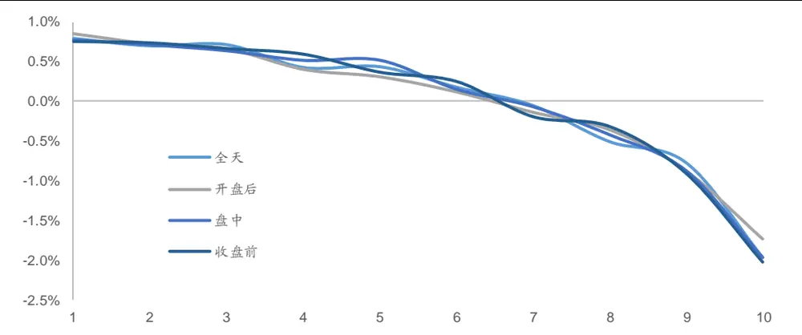
资料来源：Wind，海通证券研究所

观察上图不难发现，各时段计算得到的因子皆呈现出了较强的组间收益单调性。因子月均多空收益接近 2.80%，其中，多头组合月均超额收益接近 0.80%，而空头组合月均超额收益接近-2.00%。从多空收益的角度看，因子虽有一定的多头收益，但是空头收益更加明显。下表详细展示了各因子的分组平均月度超额收益。

表 2 委托成交相关性因子分组收益

| 因子分组 | 全天 | 开盘后 | 盘中 | 收盘 |
| --- | --- | --- | --- | --- |
| 1 | 0.80% | 0.86% | 0.77% | 0.76% |
| 2 | 0.70% | 0.73% | 0.71% | 0.74% |
| 3 | 0.72% | 0.67% | 0.64% | 0.67% |
| 4 | 0.43% | 0.41% | 0.52% | 0.60% |
| 5 | 0.44% | 0.31% | 0.52% | 0.37% |
| 6 | 0.18% | 0.12% | 0.15% | 0.26% |
| 7 | -0.05% | -0.14% | -0.07% | -0.19% |
| 8 | -0.50% | -0.36% | -0.42% | -0.31% |
| 9 | -0.77% | -0.88% | -0.87% | -0.90% |
| 10 | -1.96% | -1.74% | -1.97% | -2.02% |
| 多空 | 2.76% | 2.59% | 2.74% | 2.79% |

资料来源：Wind，海通证券研究所

为了能够进一步观察因子表现的稳定性，下图以全天委托成交相关性为例展示了因子的历史表现。下左图展示了 2012 年以来的因子月度溢价以及净值表现，下右图展示了 2012 年以来的因子前后 10%多空组合的相对强弱表现。

图2 全天委托成交相关性因子月度溢价以及因子净值
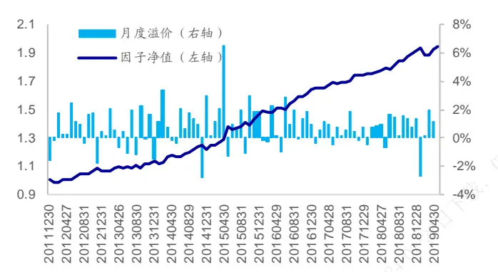
资料来源：Wind，海通证券研究所

图3 全天委托成交相关性因子多空组合表现
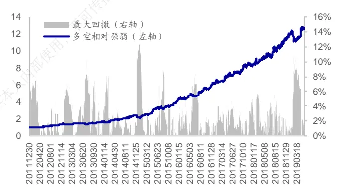
资料来源：Wind，海通证券研究所

从回归法的角度看，因子具有较强的稳定性。以全天委托成交相关性因子为例，因子月均溢价为 ，月度胜率为 ，溢价序列 统计量达 ，月度溢价极为显著。从多空相对强弱的角度看，因子表现同样较好。下表展示了委托成交相关性因子在不同年度中的多空收益。

表 3 委托成交相关性因子分年度收益

| 年度 | 全天 | 开盘后 | 盘中 | 收盘前 |
| --- | --- | --- | --- | --- |
| 2012 | 32.1% | 27.0% | 31.0% | 30.6% |
| 2013 | 24.7% | 29.3% | 19.2% | 13.4% |
| 2014 | 29.7% | 22.5% | 30.0% | 43.1% |
| 2015 | 88.4% | 89.5% | 89.9% | 86.9% |
| 2016 | 56.8% | 55.6% | 55.6% | 53.0% |
| 2017 | 33.4% | 30.2% | 32.4% | 37.7% |
| 2018 | 41.8% | 38.7% | 42.6% | 43.4% |
| 截至2019年5月31日 | 6.9% | 6.5% | 8.3% | 12.3% |

资料来源：Wind，海通证券研究所

## 2.2 形态分析

前文回测结果表明，前期委托成交相关性越低的股票，未来超额收益表现越好。需要注意的是，委托成交相关性较低或者负相关同时包含了两种形态：“股价下跌，净委买上升”以及“股价上涨，净委买下降”，委托成交相关性较高或者正相关同样包含了两种形态：“股价下跌，净委买下降”以及“股价上涨，净委买上升”。由于仅仅依靠成交委托相关性无法有效区分上述 4 种形态，因此本节引入平均净委买变化率进行辅助。

在每个截面上，首先按照净委买变化率将所有股票分成 5 组，然后在每组内再按照委托成交相关性将股票分成 5 组。基于上述分组，可统计各组股票在未来 1个月相对于市场平均收益的超额收益。

根据此种分组方法，可近似认为“低平均净委买变化率，且低委托成交相关性”的股票为“股价上涨，净委买下降”的股票，“低平均净委买变化率，且高委托成交相关性”的股票为“股价下跌，净委买下降”的股票，“高平均净委买变化率，且低委托成交相关性”的股票为“股价下跌，净委买上升”的股票，“高平均净委买变化率，且高委托成交相关性”的股票为“股价上涨，净委买上升”的股票。

本节按照上述方法，在全市场（剔除 ST 以及次新股）内以及中证 800 指数内，对于各形态的股票的月均超额收益进行了统计。

图4 各形态月均超额收益表现（全市场）
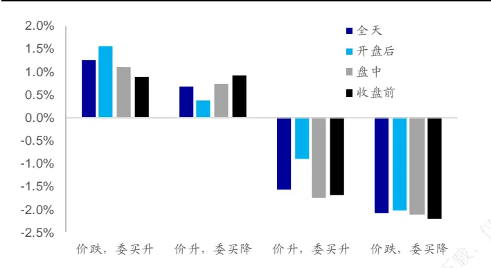
资料来源：Wind，海通证券研究所

图5 各形态月均超额收益表现（中证 800指数内）
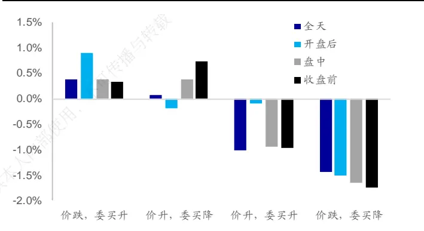
资料来源：Wind，海通证券研究所

观察上图可以发现，“股价下跌，净委买上升”的股票在未来的超额收益最强，而“股价下跌，净委买下降”的股票在未来的超额收益最弱。这一结果较为符合我们的直观理解。对于下跌的股票，净委买的上升体现出了投资者较强的托底意愿，因此可以推测股票未来下跌空间有限。而对于股价下跌同时净委买下降的股票，可推测投资者托底意愿较弱，因此依旧具有一定的向下空间。

“股价上涨，净委买下降”的股票具有一定的超额收益，但是超额收益表现弱于“股价下跌，净委买上升”。该种形态可解读为，随着股票的上涨，投资者的跟随意愿逐渐减弱，因此可推测股票的上行空间有限。

虽然上述几种形态的超额收益表现符合我们的直观理解，但是 “股价上涨，净委买上升”的收益表现却与我们的预想有明显出入。直观理解上，股价上涨同时投资者买入意愿增强，体现出的是投资者较强的跟随意愿，可推测股票未来依旧具有一定的上行空间。然而，该种形态的股票在全市场以及在中证 800 指数中的相对表现皆欠佳。对于这一现象，我们会进行进一步的研究。

## 3. 正交因子月度选股能力

## 3.1 因子相关性分析

下表展示了委托成交相关性因子与常见低频因子之间的截面相关性情况。

表 4 委托成交相关性因子与常见低频因子之间的截面相关性

|  | 市值 | 中盘 | 换手1M | 反转1M | 系统波动占比 | 估值 | 盈利 | 盈利增长 |
| --- | --- | --- | --- | --- | --- | --- | --- | --- |
| 全天 | 0.20 | 0.02 | 0.56 | 0.09 | -0.13 | 0.19 | 0.05 | 0.03 |
| 开盘后 | 0.25 | 0.03 | 0.51 | 0.08 | -0.13 | 0.14 | 0.03 | 0.03 |
| 盘中 | 0.19 | 0.02 | 0.56 | 0.09 | -0.13 | 0.21 | 0.06 | 0.02 |
| 收盘前 | 0.13 | 0.00 | 0.55 | 0.08 | -0.15 | 0.26 | 0.09 | 0.02 |

资料来源：Wind，海通证券研究所

观察上表可知，委托成交相关性因子与市值、换手以及估值正相关，和系统波动占比负相关。此外，因子与盈利以及盈利增长因子之间的相关性较弱。相关性结果显示，委托成交相关性因子的多头组合中的股票具有以下特征：

1） 市值偏小；

2） 前期低换手；

3） 前期系统波动占比较低，特质波动占比较高；

4） 低估值。

下表展示了委托成交相关性因子与部分高频因子之间的截面相关性情况。

表 5 委托成交相关性因子与高频因子之间的截面相关性

|  | 下行波动占比 |  |  |  | 量价相关性 |  |  |  | 平均净委买变化率 |  |  |  |
| --- | --- | --- | --- | --- | --- | --- | --- | --- | --- | --- | --- | --- |
|  | 全天 | 开盘后 | 盘中 | 收盘前 | 全天 | 开盘后 | 盘中 | 收盘前 | 全天 | 开盘后 | 盘中 | 收盘前 |
| 全天 | 0.23 | 0.14 | 0.21 | -0.12 | 0.69 | 0.39 | 0.53 | 0.04 | -0.21 | -0.22 | -0.18 | -0.15 |
| 开盘后 | 0.16 | 0.12 | 0.14 | -0.12 | 0.60 | 0.41 | 0.41 | -0.03 | -0.21 | -0.20 | -0.18 | -0.14 |
| 盘中 | 0.25 | 0.14 | 0.24 | -0.10 | 0.70 | 0.36 | 0.57 | 0.08 | -0.20 | -0.22 | -0.17 | -0.15 |
| 收盘前 | 0.27 | 0.13 | 0.28 | -0.03 | 0.67 | 0.33 | 0.57 | 0.21 | -0.18 | -0.22 | -0.15 | -0.12 |

资料来源：Wind，海通证券研究所

观察上表可知，全天、开盘后以及盘中的委托成交相关性因子与同一时段中的下行波动占比因子以及量价相关性因子正相关。收盘前的委托成交相关性因子与同一时段中的高频因子相关性偏弱，但是与其他时段中的量价相关性因子正相关。

## 3.2 正交因子月度选股能力

为了能够检验因子在传统低频因子外所蕴含的选股能力，本节将委托成交相关性因子相对于行业、市值、中盘、换手、反转以及波动率因子进行了正交处理。因子正交处理的相关细节可参考专题报告《选股因子系列研究(十七)——选股因子的正交》。下表展示了因子在正交后的月度 IC 以及月度 Rank IC。

表 6 委托成交相关性因子 IC以及 Rank IC（正交剔除低频因子后）

| 时段 | IC |  | Rank IC |  |
| --- | --- | --- | --- | --- |
|  | 均值 ICIR | 胜率 | 均值 ICIR | 胜率 |
| 全天 | -0.028 1.396 | 69% | -0.039 | 1.803 71% |
| 开盘后 | -0.024 1.198 | 69% | -0.032 1.504 | 71% |
| 盘中 | -0.030 1.566 | 69% | -0.040 1.950 | 71% |
| 收盘前 | -0.031 1.914 | 71% | -0.038 2.267 | 80% |

资料来源：Wind，海通证券研究所

在正交剔除了低频因子后，委托成交相关性因子依旧具有显著的月度选股能力。因子月度 IC均值在-0.03~-0.02 之间。相比而言，收盘前的委托成交相关性的月度选股能力最强，因子月度 IC均值为-0.031，ICIR 为 1.914，月度胜率为 71%。下图展示了使用不同时段数据计算得到的因子的分组收益。

图6 委托成交相关性因子分组月度超额收益（正交剔除低频因子后）
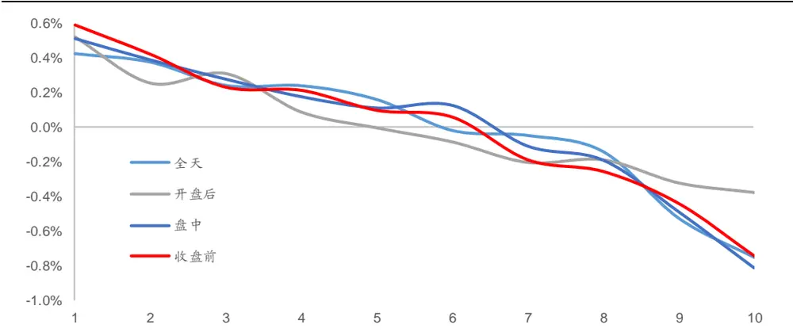
资料来源：Wind，海通证券研究所

在正交剔除低频因子后，各因子依旧呈现出了较强的组间收益单调性。收盘前委托成交相关性因子的月均多空收益为 1.35%，其中，多头组合月均超额收益约为 0.60%，而空头组合月均超额收益约为 0.75%。从多空收益的角度看，因子空头效应略强于因子的多头效应。下表详细展示了各因子分组的月均超额收益。

表 7 委托成交相关性因子分组收益（正交剔除低频因子后）

| 因子分组 | 全天 人内 | 开盘后 | 盘中 | 收盘前 |
| --- | --- | --- | --- | --- |
| 1 | 0.43% | 0.52% | 0.52% | 0.60% |
| 2 | 0.38% | 0.26% | 0.39% | 0.43% |
| 3 | 0.25% | 0.31% | 0.28% | 0.23% |
| 4 -26日 | 0.24% | 0.09% | 0.18% | 0.22% |
| 5 | 0.16% | 0.00% | 0.11% | 0.10% |
| 6 | -0.02% | -0.09% | 0.13% | 0.06% |
| 7 | -0.04% | -0.20% | -0.11% | -0.19% |
| 8 | -0.14% | -0.19% | -0.19% | -0.26% |
| 9 | -0.52% | -0.32% | -0.49% | -0.44% |
| 10 | -0.75% | -0.38% | -0.82% | -0.75% |
| 多空 | 1.18% | 0.90% | 1.33% | 1.35% |

资料来源：Wind，海通证券研究所

为了能够进一步观察因子表现的稳定性，下图以收盘前委托成交相关性为例展示了因子在时间序列上的表现。下左图展示了 2012 年以来因子的月度溢价以及净值表现，下右图展示了 2012 年以来因子的前后 10%多空组合的相对强弱表现。

图7 收盘前委托成交相关性因子月度溢价以及因子净值（正交剔除低频因子）
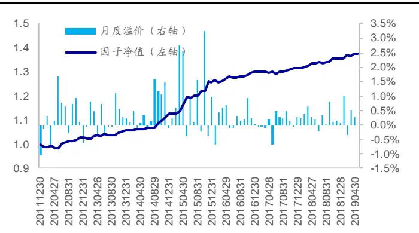
资料来源：Wind，海通证券研究所

图 收盘前委托成交相关性因子多空组合表现（正交剔除低频因子）
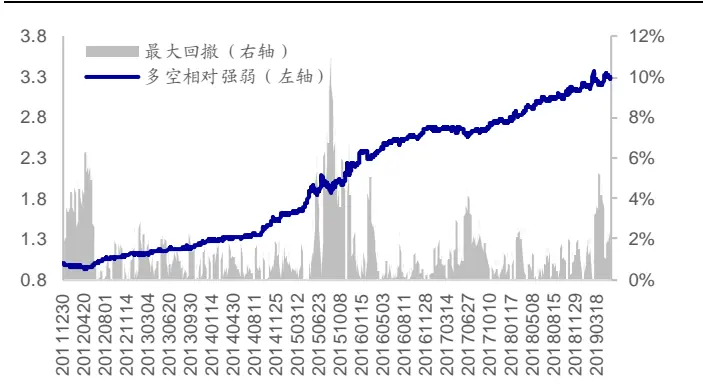
资料来源：Wind，海通证券研究所

从回归法的角度看，因子具有较强的稳定性。因子月均溢价为 0.36%，月度胜率为71%，溢价序列 T 统计量为 4.90，月度溢价极为显著。从多空相对强弱的角度看，收盘前委托成交相关性因子在大部分年份中都具有较好的区分效果，仅在 2017 年表现不佳。下表展示了委托成交相关性因子在不同年度中的多空收益。

表 8 委托成交相关性因子分年度收益（正交剔除低频因子后）

| 年度 | 全天 | 开盘后 | 盘中 | 收盘前 |
| --- | --- | --- | --- | --- |
| 2012 | 12.3% | 9.9% | 13.3% | 12.9% |
| 2013 | 19.1% 内部使用 | 20.0% | 17.2% | 12.8% |
| 2014 | 18.6% | 10.5% | 23.2% | 27.1% |
| 2015 | 29.7% | 26.9% | 40.5% | 37.9% |
| 2016 | 20.7% | 17.1% | 20.2% | 20.0% |
| 2017 | 4.3% | 0.3% | 3.9% | 3.3% |
| 2018 | 16.2% | 10.9% | 18.5% | 13.9% |
| 截至2019年5月31日 | -0.7% | -2.1% | 0.8% | 5.1% |

资料来源：Wind，海通证券研究所

为了能够进一步检验委托成交相关性因子在常见高频因子外所蕴含的选股能力，可将因子相对于行业、市值、中盘、换手、反转、波动率以及同一时段的下行波动占比、量价相关性以及平均净委买变化率进行正交化处理。

表 9 委托成交相关性因子 IC以及 Rank IC（正交剔除低频因子以及部分高频因子后）

| 时段 | IC |  | Rank IC |  |  |
| --- | --- | --- | --- | --- | --- |
|  | 均值 | ICIR 胜率 | 均值 | ICIR | 胜率 |
| 全天 | -0.016 | 0.933 64% | -0.024 | 1.269 | 69% |
| 开盘后 | -0.020 | 1.089 65% | -0.028 | 1.441 | 67% |
| 盘中 | -0.024 | 1.302 67% | -0.032 | 1.634 | 70% |
| 收盘前 | -0.034 | 2.113 73% | -0.042 | 2.475 | 79% |

资料来源：Wind，海通证券研究所

在剔除了低频因子以及同时段的高频因子后，委托成交相关性因子依旧存在月度选股能力。相比而言，收盘前的委托成交相关性因子的选股能力最强。下图展示了使用不同时段数据计算得到的因子的分组收益。

图9 委托成交相关性因子分组月度超额收益（正交剔除低频因子以及部分高频因子后）
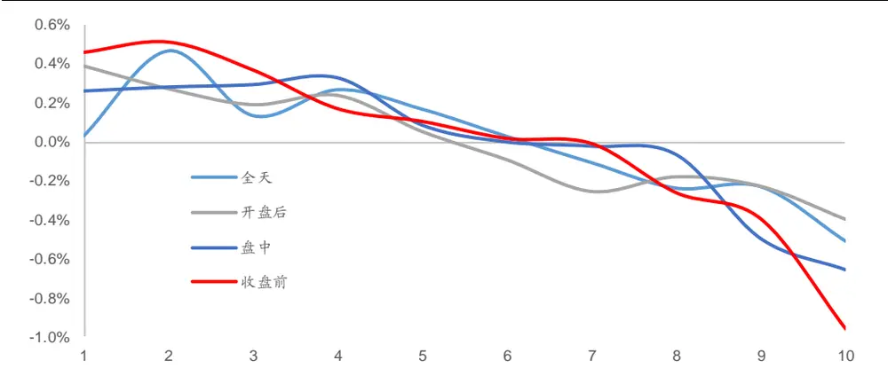
资料来源：Wind，海通证券研究所

在正交剔除了同一时段的高频因子后，各因子的组间收益单调性受到了一定程度的影响，部分因子的多头分组间的收益单调性有所减弱。相比而言，收盘前的委托成交相关性因子表现最好，多头组合月均超额收益达 ，空头组合月均超额收益达 ，多空月均收益差达 。下表详细展示了各因子的分组月均超额收益。

表 10 委托成交相关性因子分组收益（正交剔除低频因子以及部分高频因子后）

| 因子分组 | 全天 | 开盘后 | 盘中 | 收盘前 |
| --- | --- | --- | --- | --- |
| 1 | 0.03% | 0.39% | 0.26% | 0.46% |
| 2 | 0.46% | 0.27% | 0.28% | 0.51% |
| 3 | 0.13% 内部使用 | 0.19% | 0.29% | 0.37% |
| 4 | 0.27% | 0.24% | 0.33% | 0.17% |
| 5 | 0.17% | 0.05% | 0.08% | 0.10% |
| 6 | 0.03% | -0.09% | 0.00% | 0.02% |
| 7 | -0.11% | -0.26% | -0.02% | -0.01% |
| 8 | -0.24% | -0.18% | -0.07% | -0.26% |
| 9 | -0.23% | -0.23% | -0.50% | -0.40% |
| 10 | -0.51% | -0.40% | -0.66% | -0.96% |
| 多空 | 0.54% | 0.79% | 0.92% | 1.42% |

资料来源：Wind，海通证券研究所

为了能够进一步观察因子表现的稳定性，下图以收盘前的委托成交相关性为例展示了因子在时间序列上的表现。下左图展示了 2012 年以来因子的月度溢价以及净值表现，下右图展示了 2012 年以来因子的前后 10%多空组合的相对强弱表现。

图10 收盘前委托成交相关性因子月度溢价以及因子净值（正交剔除低频因子以及部分高频因子后）
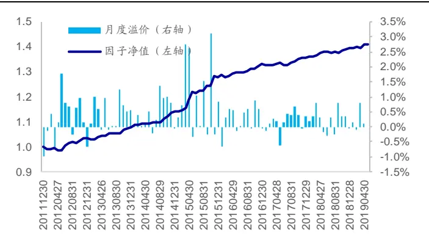
资料来源：Wind，海通证券研究所

图11 收盘前委托成交相关性因子多空组合表现（正交剔除低频因子以及部分高频因子后）
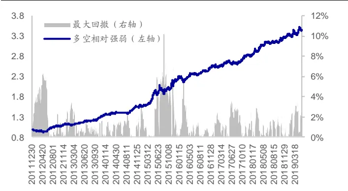
资料来源：Wind，海通证券研究所

从回归法的角度看，在正交剔除了同一时段的高频因子后，因子收益依旧具有较强的稳定性。因子月均溢价为 0.39%，月度胜率为 73%，溢价序列 T 统计量达 5.38，月度溢价显著性较强。从多空相对强弱的角度看，因子表现同样较好。下表展示了委托成交相关性因子在不同年度中的多空收益。

表 11 委托成交相关性因子分年度收益（正交剔除低频因子以及部分高频因子后）

| 年度 | 全天 | 开盘后 盘中 | 收盘前 |
| --- | --- | --- | --- |
| 2012 | 7.5% 6.5% | 11.2% | 13.0% |
| 2013 | 13.6% 22.2% | 17.3% | 18.9% |
| 2014 | 8.3% 9.5% | 16.1% | 17.6% |
| 2015 | 19.8% 19.6% | 24.4% | 40.5% |
| 2016 | 13.4% 11.6% | 15.7% | 16.2% |
| 2017 | -4.6% 1.4% | -1.1% | 10.0% |
| 2018 | 2.5% 7.2% | 6.1% | 17.2% |
| 截至2019年5月31日 | -1.6% -0.9% | 0.0% | 3.9% |

资料来源：Wind，海通证券研究所

## 4. 不同指数内的选股能力

考虑到选股范围的不同会对于因子的表现产生影响，本章讨论了委托成交相关性因子在沪深 300 指数以及中证 500 指数内的选股能力。

## 4.1 沪深 300指数内的选股能力

表 12 委托成交相关性因子 IC以及 Rank IC（沪深 300指数内）

|  | 时段 6日丁载， | IC |  |  | Rank IC |  |  |
| --- | --- | --- | --- | --- | --- | --- | --- |
|  |  | 均值 | ICIR | 胜率 | 均值 | ICIR | 胜率 |
| 正交前 | 全天 | -0.058 | 1.116 | 70% | -0.082 | 1.423 | 72% |
|  | 开盘后 | -0.055 | 1.073 | 67% | -0.078 | 1.385 | 72% |
|  | 盘中 | -0.059 | 1.131 | 70% | -0.082 | 1.416 | 71% |
|  | 收盘前 | -0.059 | 1.152 | 62% | -0.079 | 1.404 | 66% |
| 用户677753973 正交后 | 全天 | -0.001 | 0.049 | 57% | -0.002 | 0.122 | 55% |
|  | 开盘后 | -0.016 | 0.796 | 64% | -0.021 | 0.960 | 65% |
|  | 盘中 | -0.009 | 0.514 | 56% | -0.009 | 0.532 | 58% |
|  | 收盘前 | -0.024 | 1.200 | 66% | -0.024 | 1.210 | 65% |

资料来源：Wind，海通证券研究所

观察上表可知，委托成交相关性因子在沪深 300 指数内具有一定的选股能力。在正交剔除了低频因子以及部分高频因子后，收盘前委托成交相关性因子依旧具有一定的选股能力。下图对比展示了沪深300指数内的委托成交相关性因子在正交前后的分组收益。

图12 委托成交相关性因子分组收益（沪深 300指数内/正交前）
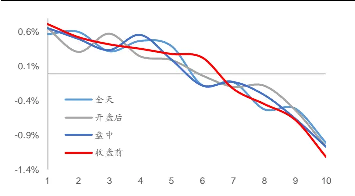
资料来源：Wind，海通证券研究所

图13 委托成交相关性因子分组收益（沪深 300指数内/正交后）
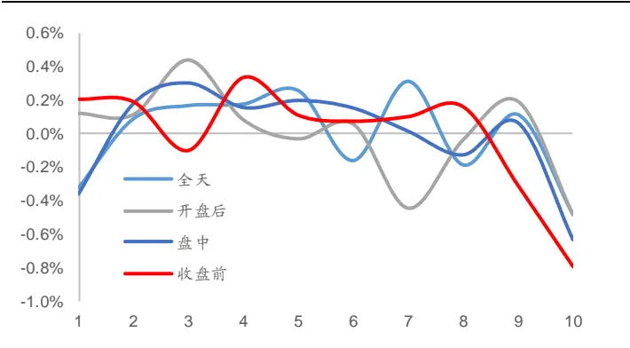
资料来源：Wind，海通证券研究所

观察原始因子表现可知，各时段的因子在沪深 300 指数内依旧具有较好的组间收益单调性。因子多头组合月均超额收益在 0.60%附近，而空头组合的月均超额收益在-1.10%附近，因子多空收益接近 1.70%。

在进行正交处理后，虽然因子组间收益单调性受到了较为明显的影响，但是大部分因子的空头效应依旧较为明显。对比各时段的委托成交相关性因子，收盘前委托成交相关性因子的截面收益区分能力相对较好。因子多头组合月均超额收益为 0.20%，空头组合月均超额收益为-0.79%，因子多空收益接近 1.00%。

下图进一步展示了正交前后的收盘前委托成交相关性因子的月度溢价以及净值。

图14 收盘前委托成交相关性因子月度溢价与因子净值（沪深300指数内/正交前）
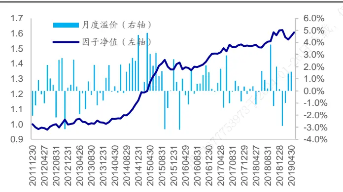
资料来源：Wind，海通证券研究所

图15 收盘前委托成交相关性因子月度溢价与因子净值（沪深300指数内/正交后）
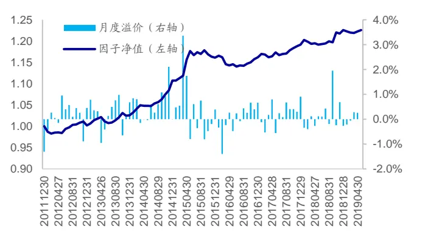
资料来源：Wind，海通证券研究所

整体来看，因子表现具有一定的稳定性。在正交前，因子月均溢价达 0.55%，月度胜率为 62%，月度溢价 T 统计量为 3.12。在正交后，因子月均溢价为 0.23%，月度胜率为 66%，月度溢价 T 统计量为 3.13。

## 4.2 中证 500指数内的选股能力

表 13 委托成交相关性因子 IC以及 Rank IC（中证 500指数内）

|  | 时段 | IC |  |  | Rank IC |  |  |
| --- | --- | --- | --- | --- | --- | --- | --- |
|  |  | 均值 | ICIR | 胜率 | 均值 | ICIR | 胜率 |
| 正交前 | 全天 | -0.049 | 1.218 | 64% | -0.081 | 1.824 | 69% |
|  | 开盘后 | -0.045 | 1.207 | 63% | -0.077 | 1.875 | 69% |
|  | 盘中 | -0.051 | 1.266 | 65% | -0.082 | 1.819 | 70% |
|  | 收盘前 | -0.054 | 1.429 | 66% | -0.081 | 1.918 | 72% |
| 正交后 | 全天 | -0.007 | 0.412 | 61% | -0.023 | 1.303 | 64% |
|  | 开盘后 | -0.011 | 0.619 | 53% | -0.026 | 1.416 | 64% |
|  | 盘中 | -0.017 | 0.926 | 65% | -0.030 | 1.592 | 69% |
|  | 收盘前 | -0.025 | 1.381 | 60% | -0.034 | 1.935 | 69% |

资料来源：Wind，海通证券研究所

观察上表可知，委托成交相关性因子在中证 500 指数内具有显著的月度选股能力。在正交剔除了低频因子以及部分高频因子后，收盘前委托成交相关性因子依旧具有一定的选股能力。下图对比展示了中证 500 指数内的委托成交相关性因子在正交前后的分组收益。

图16 委托成交相关性因子分组收益（中证 500指数内/正交前）
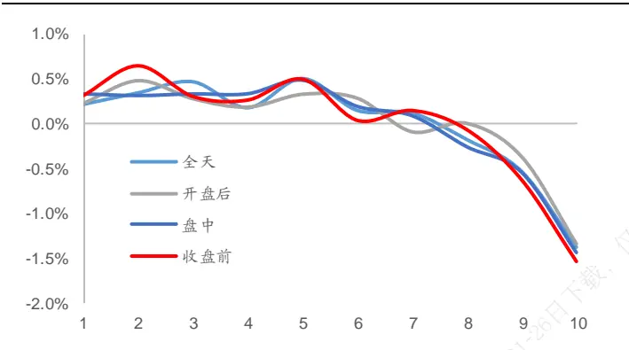
资料来源：Wind，海通证券研究所

图17 委托成交相关性因子分组收益（中证 500指数内/正交后）
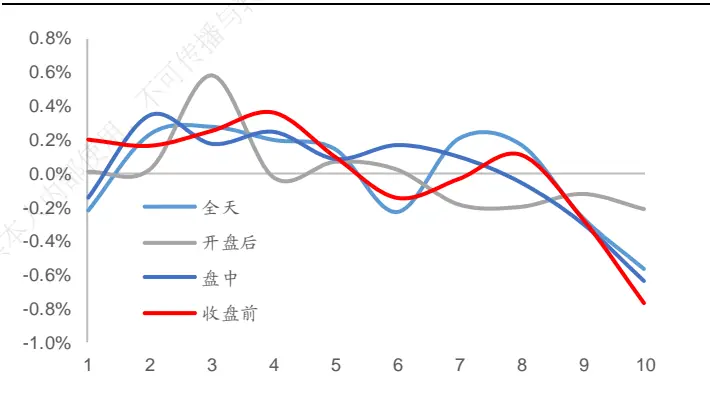
资料来源： ，海通证券研究所

观察原始因子表现可知，各时段的因子在中证 500 指数内依旧具有较好的收益区分能力。因子多头组合平均月度超额收益约为 0.30%，而空头组合的月均超额收益约为-1.40%，因子多空收益约为 1.70%。对比因子多头端以及空头端的收益可以发现，因子空头收益更强。

在进行正交处理后，虽然因子组间收益单调性受到了影响，但是大部分因子的空头效应依旧较为明显。对比各时段的委托成交相关性因子，收盘前委托成交相关性因子的截面收益区分能力相对较好。因子多头组合月均超额收益为 0.20%，空头组合月均超额收益为-0.77%，因子多空收益接近 1.00%。

下图进一步展示了正交前后的收盘前委托成交相关性因子的月度溢价以及净值。

图18 收盘前委托成交相关性因子月度溢价与因子净值（中证500指数内/正交前）
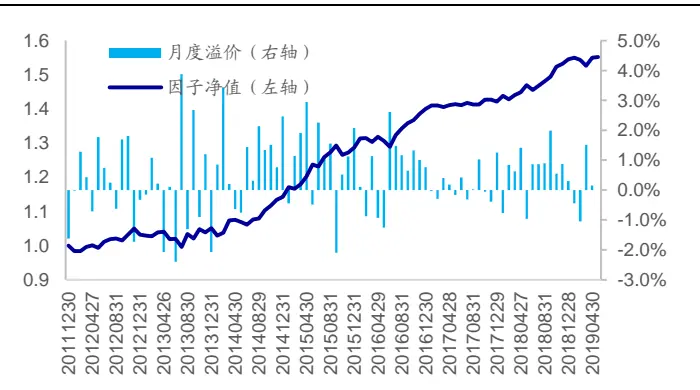
资料来源：Wind，海通证券研究所

图 收盘前委托成交相关性因子月度溢价与因子净值（中证500指数内/正交后）
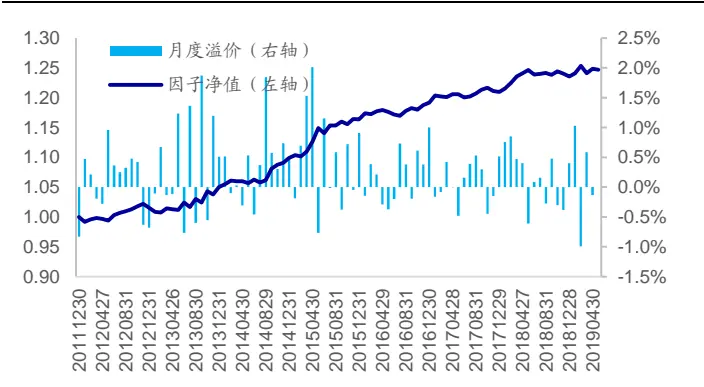
资料来源：Wind，海通证券研究所

整体来看，因子表现较为稳定。在正交前，因子月均溢价达 0.50%，月度胜率为 66%，月度溢价 T 统计量为 3.77。在正交后，因子月均溢价为 0.25%，月度胜率为 60%，月度溢价 T 统计量为 3.79。

## 5. 不同调仓频率下的选股效果

本章在半月频以及周频上对于因子的选股效果进行了回测。需要注意的是，在调整换仓频率时，计算因子所使用的回看窗口也会发生相应的变化。例如，在周度换仓时，计算因子所使用的回看窗口也会调整为向前 1 周。

## 5.1 半月调仓

表 14 委托成交相关性因子 IC以及 Rank IC（半月换仓）

|  |  | IC |  |  | Rank IC |  |  |
| --- | --- | --- | --- | --- | --- | --- | --- |
| 753973 |  | 均值 | ICIR | 胜率 | 均值 | ICIR | 胜率 |
|  | 全天 | -0.062 | 2.783 | 74% | -0.093 | 3.719 | 79% |
|  | 开盘后 | -0.059 | 2.879 | 76% | -0.09 | 3.931 | 82% |
| 正交前 用户 | 盘中 | -0.062 | 2.739 | 73% | -0.091 | 3.582 | 77% |
|  | 收盘前 | -0.063 | 2.852 | 75% | -0.089 | 3.614 | 78% |
|  | 全天 | -0.013 | 1.120 | 62% | -0.022 | 1.746 | 68% |
| 正交后 | 开盘后 | -0.016 | 1.355 | 60% | -0.025 | 2.009 | 67% |
|  | 盘中 | -0.020 | 1.658 | 64% | -0.030 | 2.297 | 71% |
|  | 收盘前 | -0.029 | 2.631 | 72% | -0.037 | 3.201 | 76% |

资料来源： ，海通证券研究所

观察上表可知，委托成交相关性因子在半月的换仓频率下具有显著的选股能力。在正交剔除了低频因子以及部分高频因子后，盘中以及收盘前委托成交相关性因子依旧具有显著的选股能力。下图对比展示了半月频调仓下的委托成交相关性因子在正交前后的分组收益。

图20 委托成交相关性因子分组收益（半月换仓/正交前）
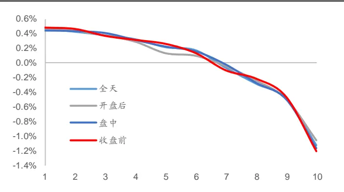
资料来源：Wind，海通证券研究所

图21 委托成交相关性因子分组收益（半月换仓/正交后）
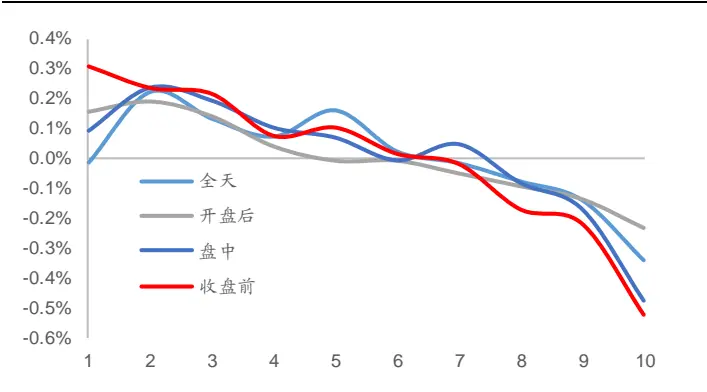
资料来源：Wind，海通证券研究所

在正交处理前，委托成交相关性因子组间收益单调性较好，因子多头组合平均半月超额收益接近 0.50%，而空头组合的平均半月超额收益约为-1.10%，因子多空收益约为1.60%。与月度回测结果类似，因子空头收益更强。

在正交处理后，各因子的组间收益单调性依旧较为明显。对比各时段的委托成交相关性因子，收盘前委托成交相关性因子的截面收益区分能力相对较好。因子多头组合平均半月超额收益为 0.30%，空头组合平均半月超额收益为-0.50%，因子多空收益接近0.80%。下图进一步展示了收盘前委托成交相关性因子的溢价以及累计净值。

图22 收盘前委托成交相关性因子溢价与因子净值（半月换仓/正交前）
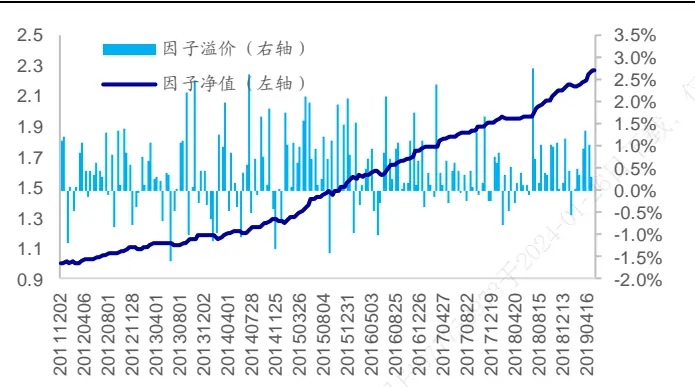
资料来源： ，海通证券研究所

图23 收盘前委托成交相关性因子溢价与因子净值（半月换仓/正交后）
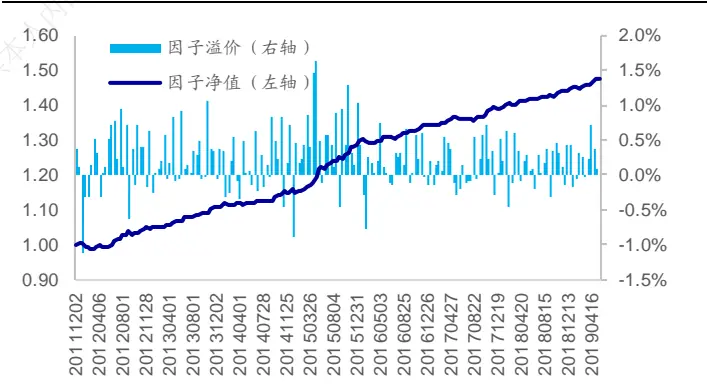
资料来源：Wind，海通证券研究所

长期来看，因子表现稳定性较强。在正交前，因子平均半月溢价为 0.46%，胜率为75%，溢价序列 T 统计量达 7.57。在正交后，因子平均半月溢价为 0.22%，胜率为 72%，溢价序列 T 统计量达 7.35。

## 5.2 周度调仓

表 15 委托成交相关性因子 IC以及 Rank IC（周度换仓）

|  | 时段 | IC |  |  | Rank IC |  |  |
| --- | --- | --- | --- | --- | --- | --- | --- |
|  |  | 均值 | ICIR | 胜率 | 均值 | ICIR | 胜率 |
| 正交前 | 全天 | -0.044 | 3.005 | 71% | -0.074 | 4.431 | 77% |
|  | 开盘后 | -0.040 | 3.116 | 69% | -0.068 | 4.671 | 77% |
|  | 盘中 | -0.044 | 2.965 | 70% | -0.072 | 4.311 | 76% |
|  | 收盘前 | -0.043 | 3.194 | 69% | -0.068 | 4.463 | 75% |
| 正交后 | 全天 | -0.011 | 1.401 | 59% | -0.021 | 2.408 | 66% |
|  | 开盘后 | -0.012 | 1.515 | 60% | -0.020 | 2.476 | 66% |
|  | 盘中 | -0.016 | 1.961 | 60% | -0.028 | 3.035 | 68% |
|  | 收盘前 | -0.020 | 2.748 | 66% | -0.028 | 3.667 | 71% |

资料来源：Wind，海通证券研究所

观察上表可知，委托成交相关性因子在周度换仓频率下具有显著的选股能力。在正交剔除了低频因子以及部分高频因子后，盘中以及收盘前委托成交相关性因子依旧具有显著的选股能力。下图对比展示了半月频调仓下的委托成交相关性因子在正交前后的分组收益。

图24 委托成交相关性分组收益（周度换仓/正交前）
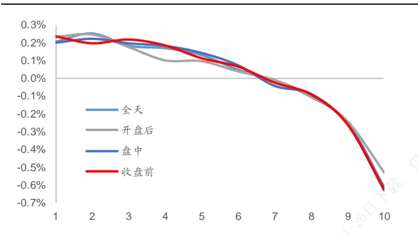
资料来源： ，海通证券研究所

图25 委托成交相关性分组收益（周度换仓/正交后）
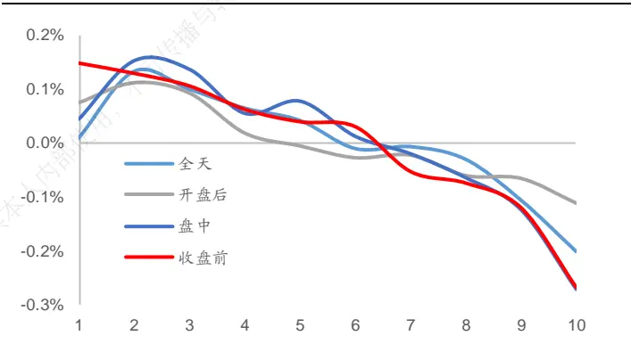
资料来源： ，海通证券研究所

将换仓频率调整至周度后，委托成交相关性因子的组间收益单调性依旧较好，因子多头组合平均周度超额收益约为 0.20%，而空头组合的平均周度超额收益约为-0.60%，因子多空收益约为 0.80%。与月度回测结果类似，周度换仓下的委托成交相关性因子的空头收益更强。

在进行正交处理后，因子各分组间的收益单调性依旧较为明显。对比各时段的委托成交相关性因子，收盘前委托成交相关性因子的截面收益区分能力相对较好。因子多头组合平均周度超额收益为 0.15%，空头组合平均周度超额收益为-0.27%，因子多空收益接达 0.42%。下图进一步展示了收盘前委托成交相关性因子的溢价以及累计净值。

图 收盘前委托成交相关性因子溢价与因子净值（周度换仓正交前）
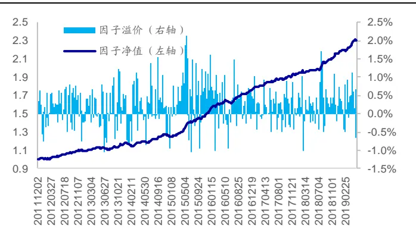
资料来源：Wind，海通证券研究所

图 收盘前委托成交相关性因子溢价与因子净值（周度换仓正交后）
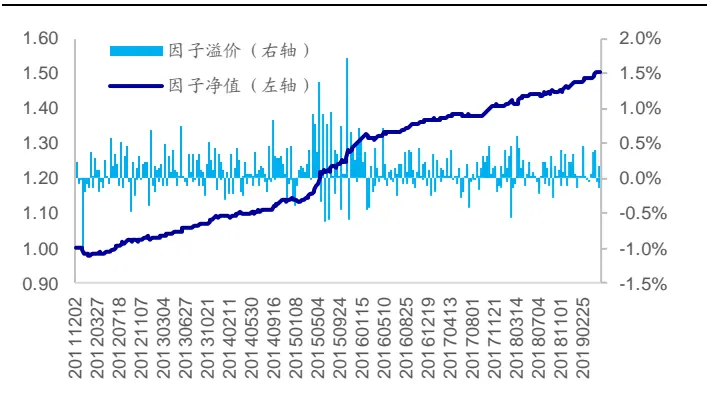
资料来源：Wind，海通证券研究所

周度换仓频率下的因子表现稳定性同样较强。在正交前，因子平均周度溢价为0.23%，周度胜率为 69%，溢价 T 统计量达 8.54。在正交后，因子平均周度溢价为 0.11%，周度胜率为 66%，溢价 T 统计量达 7.30。

## 6. 总结

在系列前期报告中，我们对于盘口委托挂单数据中所包含的信息进行了初步探索。本文在前期研究的基础之上，尝试将委托数据与成交数据结合起来，构建了委托成交相关性因子。

根据初步回测，因子在全 A中具有显著的月度选股能力，委托成交相关性越低，股票未来超额收益表现越好。根据股票形态分析，“股价下跌，净委买上升”的股票在未来的超额收益最强，而“股价下跌，净委买下降”的股票在未来的超额收益最弱。“股价上涨，净委买下降”形态的股票具有一定的超额收益，但是超额收益表现弱于“股价下跌，净委买上升”的股票。“股价上涨，净委买上升”的收益表现却与我们的预想有明显出入，该类股票超额收益表现较弱。在剔除了低频因子以及部分高频因子的影响后，收盘前委托成交相关性因子依旧具有较为显著的月度选股能力。

在沪深 300 指数内以及中证 500 指数内，因子具有显著的选股能力。在正交剔除了常规低频因子以及高频因子的影响后，收盘前委托成交相关性因子依旧具有一定的选股能力。在半月以及周度换仓的设定下，委托成交相关性因子同样呈现出了较好的效果。

## 7. 风险提示

市场系统性风险、资产流动性风险以及政策变动风险会对策略表现产生较大影响。

# 信息披露

分析师声明

[Table冯佳睿yst金融工程研究团队s]

袁林青金融工程研究团队

本人具有中国证券业协会授予的证券投资咨询执业资格，以勤勉的职业态度，独立、客观地出具本报告。本报告所采用的数据和信息均来自市场公开信息，本人不保证该等信息的准确性或完整性。分析逻辑基于作者的职业理解，清晰准确地反映了作者的研究观点，结论不受任何第三方的授意或影响，特此声明。

## 法律声明

本报告仅供海通证券股份有限公司（以下简称“本公司”）的客户使用。本公司不会因接收人收到本报告而视其为客户。在任何情况下，本报告中的信息或所表述的意见并不构成对任何人的投资建议。在任何情况下，本公司不对任何人因使用本报告中的任何内容所引致的任何损失负任何责任。

本报告所载的资料、意见及推测仅反映本公司于发布本报告当日的判断，本报告所指的证券或投资标的的价格、价值及投资收入可能载会波动。在不同时期，本公司可发出与本报告所载资料、意见及推测不一致的报告。

市场有风险，投资需谨慎。本报告所载的信息、材料及结论只提供特定客户作参考，不构成投资建议，也没有考虑到个别客户特殊的可投资目标、财务状况或需要。客户应考虑本报告中的任何意见或建议是否符合其特定状况。在法律许可的情况下，海通证券及其所属不关联机构可能会持有报告中提到的公司所发行的证券并进行交易，还可能为这些公司提供投资银行服务或其他服务。用

本报告仅向特定客户传送，未经海通证券研究所书面授权，本研究报告的任何部分均不得以任何方式制作任何形式的拷贝、复印件或内复制品，或再次分发给任何其他人，或以任何侵犯本公司版权的其他方式使用。所有本报告中使用的商标、服务标记及标记均为本公本司的商标、服务标记及标记。如欲引用或转载本文内容，务必联络海通证券研究所并获得许可，并需注明出处为海通证券研究所，且仅不得对本文进行有悖原意的引用和删改。载，

根据中国证监会核发的经营证券业务许可，海通证券股份有限公司的经营范围包括证券投资咨询业务。日

海通证券股份有限公司研究所[Table_PeopleInfo]
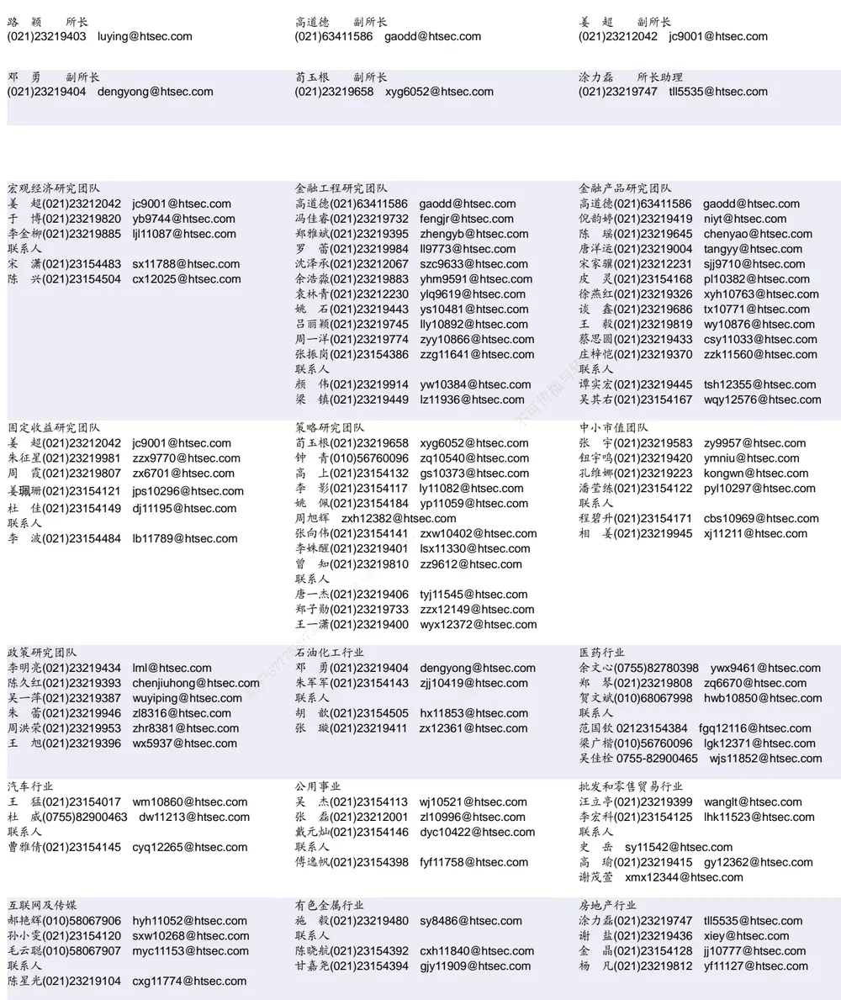

| 基础化工行业 |  | 计算机行业 | 通信行业 |
| --- | --- | --- | --- |
| 刘 威(0755)82764281 Iw10053@htsec.com |  | 郑宏达(021)23219392 zhd10834@htsec.com | 朱劲松(010)50949926 zjs10213@htsec.com |
| 刘海荣(021)23154130 Ihr10342@htsec.com |  | 杨 林(021)23154174 yl11036@htsec.com | 余伟民(010)50949926 ywm11574@htsec.com |
| 张翠翠(021)23214397 | zcc11726@htsec.com | 鲁 立(021)23154138 II11383@htsec.com | 张 弋 01050949962 zy12258@htsec.com |
| 孙维容(021)23219431 swr12178@htsec.com |  | 于成龙 ycl12224@htsec.com | 张峥青(021)23219383 zzq11650@htsec.com |
| 联系人 |  | 黄竞晶(021)23154131 hjj10361@htsec.com |  |
| 李 智(021)23219392 lz11785@htsec.com |  | 洪 琳(021)23154137 hl11570@htsec.com |  |

| 非银行金融行业 |  | 交通运输行业 |  | 纺织服装行业 |  |
| --- | --- | --- | --- | --- | --- |
|  | 孙 婷(010)50949926 st9998@htsec.com |  | 虞 楠(021)23219382 yun@htsec.com | 梁 希(021)23219407 lx11040@htsec.com |  |
|  | 何 婷(021)23219634 ht10515@htsec.com |  | 罗月江（010）56760091 lyj12399@htsec.com | 联系人 |  |
| 联系人 |  | 联系人 |  | 盛 开(021)23154510 sk11787@htsec.com |  |
|  | 李芳洲(021)23154127 Ifz11585@htsec.com |  | 李 丹(021)23154401 Id11766@htsec.com |  | 刘 溢(021)23219748 ly12337@htsec.com |

| 建筑建材行业 | 机械行业 |  | 钢铁行业 |
| --- | --- | --- | --- |
| 冯晨阳(021)23212081 fcy10886@htsec.com | 余炜超(021)23219816 swc11480@htsec.com |  | 刘彦奇(021)23219391 liuyq@htsec.com |
| 潘莹练(021)23154122 pyl10297@htsec.com 联系人 | 耿 耘(021)23219814 杨 震(021)23154124 yz10334@htsec.com | gy10234@htsec.com | 刘 璇(0755)82900465 lx11212@htsec.com 联系人 |
| 申 浩(021)23154114 sh12219@htsec.com | 沈伟杰(021)23219963 swj11496@htsec.com 周 丹 zd12213@htsec.com |  | 周慧琳(021)23154399 zh11756@htsec.com |

| 建筑工程行业 |  | 农林牧渔行业 |  | 食品饮料行业 |  |
| --- | --- | --- | --- | --- | --- |
| 杜市伟(0755)82945368 dsw11227@htsec.com |  | 丁 频(021)23219405 dingpin@htsec.com | 可传播 | 闻宏伟(010)58067941 whw9587@htsec.com |  |
| 张欣劼 zxj12156@htsec.com |  | 陈雪丽(021)23219164 cxl9730@htsec.com |  | 成 珊(021)23212207 | cs9703@htsec.com |
| 李富华(021)23154134 Ifh12225@htsec.com |  | 陈 阳(021)23212041 cy10867@htsec.com 联系人 |  | 唐 宇(021)23219389 ty11049@htsec.com |  |
|  | 孟亚琦 myg12354@htsec com |  |  |  |  |

| 军工行业 | 银行行业 |  | 社会服务行业 |
| --- | --- | --- | --- |
| 蒋 俊(021)23154170 jj11200@htsec.com | 孙 婷(010)50949926 st9998@htsec.com |  | 汪立亭(021)23219399 wanglt@htsec.com |
| 刘 磊(010)50949922 II11322@htsec.com | 解巍巍 xww12276@htsec.com | 许樱之 xyz11630@htsec.com | 陈扬扬(021)23219671 cyy10636@htsec.com |
| 张恒晅 zhx10170@htsec.com 联系人 | 林加力(021)23214395ljl12245@htsec.com 谭敏沂(0755)82900489 tmy10908@htsec.com |  |  |
| 张宇轩(021)23154172 zyx11631@htsec.com |  |  |  |

| 家电行业 |  | 造纸轻工行业 |
| --- | --- | --- |
| 陈子仪(021)23219244 chenzy@htsec.com |  | 衣桢永(021)23212208 yzy12003@htsec.com |
| 李 阳(021)23154382 ly11194@htsec.com |  |  |
| 朱默辰(021)23154383 | zmc11316@htsec.com |  |
| 联系人 |  |  |
| 刘 璐(021)23214390 II11838@htsec.com |  |  |

## 研究所销售团队

深广地区销售团队

蔡铁清(0755)82775962 ctq5979@htsec.com

伏财勇(0755)23607963 fcy7498@htsec.com

辜丽娟(0755)83253022 gulj@htsec.com

刘晶晶(0755)83255933 liujj4900@htsec.com

王雅清(0755)83254133 wyq10541@htsec.com

饶 伟(0755)82775282 rw10588@htsec.com

欧阳梦楚(0755)23617160

oymc11039@htsec.com

巩柏含 gbh11537@htsec.com

上海地区销售团队
胡雪梅(021)23219385 huxm@htsec.com
朱 健(021)23219592 zhuj@htsec.com
季唯佳(021)23219384 jiwj@htsec.com
黄 毓(021)23219410 huangyu@htsec.com
漆冠男(021)23219281 qgn10768@htsec.com
胡宇欣(021)23154192 hyx10493@htsec.com
黄 诚(021)23219397 hc10482@htsec.com
毛文英(021)23219373 mwy10474@htsec.com
马晓男 mxn11376@htsec.com
杨祎昕(021)23212268 yyx10310@htsec.com
张思宇 zsy11797@htsec.com
慈晓聪(021)23219989 cxc11643@htsec.com
王朝领 wcl11854@htsec.com
邵亚杰 23214650 syj12493@htsec.com
李 寅 021-23219691 ly12488@htsec.com
北京地区销售团队
殷怡琦(010)58067988 yyq9989@htsec.com
郭 楠 010-5806 7936 gn12384@htsec.com
张丽萱(010)58067931 zlx11191@htsec.com
杨羽莎(010)58067977 yys10962@htsec.com
杜 飞 df12021@htsec.com
张 杨(021)23219442 zy9937@htsec.com
何 嘉(010)58067929 hj12311@htsec.com
李 婕 lj12330@htsec.com
欧阳亚群 oyyq12331@htsec.com

海通证券股份有限公司研究所

地址：上海市黄浦区广东路 689号海通证券大厦 9楼

电话：（021）23219000

传真：（021）23219392

网址：www.htsec.com