## [Tab相关研究

[Table_ReportInfo]《金融科技（ ）和数据挖掘研究（三）——量化因子的批量生产与集中管理》2019.06.16

《听海外高频交易专家讲解美国的高频交易》2019.06.11

《选股因子系列研究（四十九）——当下跌遇到托底》

分析师:冯佳睿

Tel:(021)23219732

Email:fengjr@htsec.com

证书:S0850512080006

分析师:罗蕾

Tel:(021)23219984

Email:ll9773@htsec.com

证书:S0850516080002

# 选股因子系列研究（五十）——个股加权方式对比

## 投资要点：

本文以多因子组合为基础，比较了几种不同的个股加权方式，对策略收益表现、换手率和资金容量的影响。

个股加权方式。个股加权方式主要有：等权加权、市值加权、方差倒数加权以及因子相关加权四种。其中，因子相关加权又有多种构建方式，如复合因子取分位点、复合因子 正态映射、连续因子倾斜等。

收益表现。因子相关加权方式的收益表现最优，其次为方差倒数加权，排在之后的分别是等权加权和市值加权。在因子相关加权方式中，更建议采用连续倾斜形式。除了具有明显收益优势外，连续倾斜的灵活性更高，可以自主地选择对哪些因子倾斜，以及每个因子倾斜多大比例。载

- 换手率。多因子组合换手率普遍偏高。其中，换手率最高的是连续倾斜加权方式，播等权组合和市值加权组合的换手率相对较低。可

- 资金容量。连续倾斜组合的资金容量远小于其他加权方式。通过设定最小容量下使限，可提升策略容量。资金容量与策略收益呈现此消彼长的关系，即随着资金容部量增大，策略收益逐渐下降。但不同加权方式之间策略收益表现的相对强弱关系人保持不变，考虑资金容量后，连续倾斜组合仍优于其他加权方式。供

- 风险提示：因子有效性变化风险，历史统计规律失效风险。下

在构建因子组合时，采用自下而上的方式先将股票的各因子值加总为多因子得分，然后再选择多因子得分最高的股票构建组合，是一种可有效综合各因子选股效果常用的方法，这种构建方式下组合的收益表现通常优于单因子组合。本文以这种多因子组合为基础，考察个股加权方式对组合收益表现、换手率和资金容量的影响。

## 1. 个股加权方式

个股加权方式主要有以下几种：等权加权、市值加权、方差倒数加权以及因子相关加权。其中，因子相关加权是指，基于因子得分的高低给予股票不同权重，因子得分越高，股票权重越大。这种加权方式在构建时需要考虑的一点是，如何将因子得分转为权重。最直接最简单的一种方式是，以个股多因子综合得分的分位点作为权重。除此之外，还可采取的方式有 zscore 映射、连续因子倾斜等，具体如下表所示。

表 1 因子相关加权的构建方式
构建方式释义
取分位点以个股多因子综合得分所处分位点作为权重
zscore 映射将个股综合得分的 zscore通过函数（如正态分布）映射到 0-1之间，并以此作为权重
（1）计算个股在各个因子上的 zscore，记为 Z
（2）将 Z通过函数 $\mathsf{F}(\mathsf{Z})$ （如正态分布）映射到 0-1之间
（ ）单个因子对初始权重 $\widehat{W_{v}}$ 的倾斜为：
连续因子倾斜 $W_{i}=\frac{F(Z_{i})*\widehat{W_{i}}}{\sum_{j=1}^{N}F(Z_{i})*\widehat{W_{j}}}$ 
$W_{i}=\frac{F_{1}(Z_{1,i})*\cdots*F_{M}(Z_{M,i})*\widehat{W_{i}}}{\sum_{j=1}^{N}F_{1}(Z_{1,j})*\cdots*F_{M}(Z_{M,j})*\widehat{W_{j}}}$
资料来源：海通证券研究所整理

zscore 映射是通过一个单调函数将因子综合得分的 zscore 映射到非负数据集中，并以此作为权重。映射函数可以有多种选择，例如，富时罗素公司的许多 smart beta 产品都以正态分布作为映射函数；MSCI 在编制质量因子时，以如下函数作为映射函数：

$$
F(Z)=\Big\{\begin{aligned}&1+Z\qquad,Z>0\\&(1-Z)^{-1},Z<0\end{aligned}\Big\}
$$

连续因子倾斜与前面两种构建方式的区别在于，它是通过连乘方式逐步对相关因子倾斜，而不是直接对复合因子（因子综合得分）映射。具体步骤如表 1所示，即先得到个股在每个因子的映射值，然后通过连乘方式得到对初始权重倾斜后的个股权重，并归一化。其中，初始权重可自主设定，如等权加权、市值加权等，后文中我们仅以等权方式为例进行展示说明。连续倾斜的灵活性较高，可以自主地选择对哪些因子倾斜，以及对每个因子倾斜多大比例。

下文我们主要考察上述 4 类共 6 种加权方式对多因子组合的影响。

## 2. 不同加权方式组合的收益表现对比

本文采用横截面回归的收益率预测模型来计算复合因子，然后选择复合因子最大的100 只股票构建组合。选用的因子为如下 10 个：市值、市值平方、反转、换手率、波动率、流动性、ROE、SUE、预期净利润调整、目标收益。

组合个股权重采用上一节介绍的几种加权方式确定，具体包括等权、流通市值加权、方差倒数加权、以及 3 种因子相关加权方式——复合因子取分位点、复合因子正态映射、连续倾斜。

下表展示了这几种加权方式下组合的收益表现情况。

表 2 不同加权方式下组合收益表现对比（2010.05.01-2019.05.17）

|  | 月均收益 | 月胜率 | 年化收益 | 年化波动率（按 月收益） | 信息比 | 最大回撤（按月 收益） | 收益回撤比 |
| --- | --- | --- | --- | --- | --- | --- | --- |
| 等权 | 3.13% | 64.22% | 37.54% | 32.78% | 1.14 | 30.84% | 1.22 |
| 流通市值加权 | 1.89% | 63.30% | 20.39% | 28.10% | 0.81 | 33.50% | 0.61 |
| 方差倒数加权 | 3.21% | 69.72% | 39.24% | 31.98% | 1.20 | 30.46% | 1.29 |
| 复合因子取分位点 | 3.36% | 64.22% | 41.24% | 32.98% | 1.22 | 30.98% | 1.33 |
| 复合因子正态映射 | 3.34% | 64.22% | 41.07% | 32.91% | 1.22 | 31.23% | 1.32 |
| 连续倾斜 | 3.89% | 70.64% | 49.88% | 33.89% | 1.38 | 30.85% | 1.62 |

资料来源：Wind，海通证券研究所

结果显示，因子相关加权方式的组合收益表现普遍优于其他加权方式。其中，连续倾斜组合年化收益最高，为 50%，也高于因子相关加权方式以外的其他加权方法。但相应的连续倾斜组合波动率也最高，为 33.9%。从收益风险相对指标（信息比、收益回撤比）来看，连续倾斜组合的收益表现优于其他 种加权方式。

从策略收益的波动性来看，流通市值加权下组合的波动最低，年化波动率为 28.1%；同时收益率也最低，年化收益仅为 。从收益风险相对指标来看，流通市值加权组合的信息比和收益回撤比均低于其他组合。

方差倒数加权和等权加权组合的收益风险表现处于居中位臵。值得一提的是，采用方差倒数方式加权得到的组合，其实际波动率并不是几种加权方式中最低的。这也从另一个方面表明，简单历史波动率并不是未来波动率的一种有效预测方式。

表 3 不同加权方式下组合分年度收益表现对比（2010.05.01-2019.05.17）

|  | 等权 | 流通市值加权 | 方差倒数加权 | 复合因子取分位 点 | 复合因子正态映 射 | 连续倾斜 | wind 全 A 指数 |
| --- | --- | --- | --- | --- | --- | --- | --- |
| 2010 | 36.67% | 34.56% | 35.94% | 42.14% | 42.44% | 42.35% | 4.36% |
| 2011 | -14.85% | -21.38% | -10.36% | -10.87% | -11.00% | 1.02% | -22.42% |
| 2012 | 22.13% | 0.74% | 22.67% | 22.01% | 22.27% | 30.99% | 4.68% |
| 2013 | 68.78% | 24.71% | 75.94% | 72.85% | 71.39% | 82.01% | 5.44% |
| 2014 | 85.66% | 77.45% | 89.18% | 95.13% | 96.00% | 89.59% | 52.44% |
| 2015 | 198.19% | 70.15% | 192.52% | 203.24% | 203.23% | 234.25% | 38.50% |
| 2016 | 23.55% | 21.78% | 26.33% | 23.24% | 22.75% | 39.33% | -12.91% |
| 2017 | -3.05% | 7.64% | -3.85% | -0.23% | -0.35% | -1.75% | 4.93% |
| 2018 | -15.24% | -16.49% | -12.86% | -13.85% | -14.42% | -4.02% | -28.25% |
| 2019 | 34.14% | 22.82% | 31.29% | 37.43% | 37.81% | 38.31% | 20.53% |

资料来源：Wind，海通证券研究所

下图左展示了连续倾斜组合相对于等权组合的累计净值走势。结果显示，连续倾斜组合净值相对于等权组合呈稳步上升趋势。在大部分月份，连续倾斜加权方式相对于等权方式都存在正向超额收益，月均超额 0.79%，月胜率 64.55%，相应的 t值为 4.84，统计显著。由此表明从收益表现角度来看，连续倾斜加权方式显著优于等权加权方式。

图1 连续倾斜组合相对于等权组合的累计净值
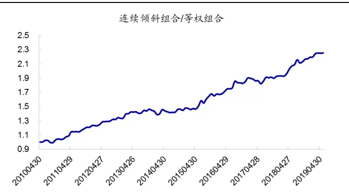
资料来源：Wind，海通证券研究所

图2 连续倾斜组合相对于流通市值组合的累计净值
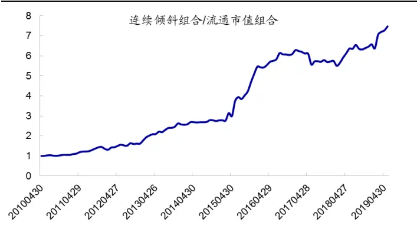
资料来源：Wind，海通证券研究所

上图右展示了连续倾斜组合相对于流通市值组合的累计净值走势。结果显示，连续倾斜组合相对于流通市值组合的超额收益幅度更大，月均超额 2.01%，月胜率 67.27%，相应的 t值为 4.70，统计显著。但超额收益的波动较大，受大小盘风格影响明显。2017年，市场呈现大盘风格，连续倾斜组合跑输流通市值组合 9%。

总结来看，因子相关加权组合的收益表现最优，其中又以连续倾斜组合最为突出。连续倾斜组合在绝大部分月份相对于等权组合、流通市值加权组合都存在明显正向超额收益。

## 3. 不同加权方式组合的换手率对比

下图展示了不同加权方式下组合年化单边换手率情况。结果显示，连续倾斜组合换手率最高，年化换手 9.6 倍，其次为方差倒数加权，为 8.5 倍。等权组合换手率最低，为 7.0 倍。

图3 不同加权方式下组合换手率对比（倍，2010.05.01-2019.05.17）
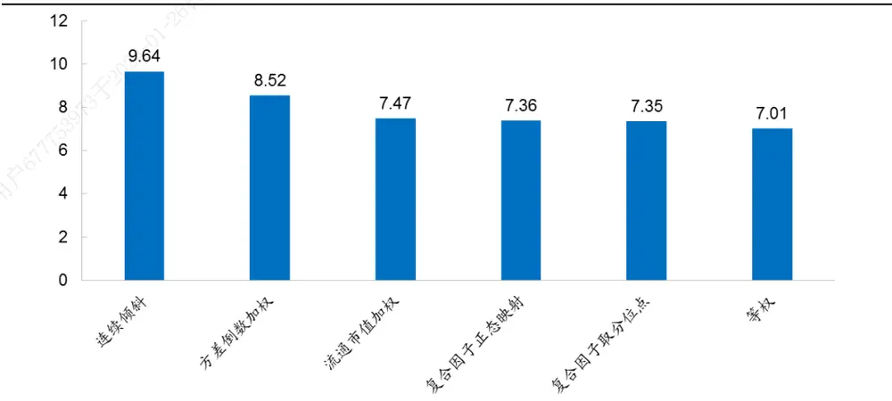
资料来源： ，海通证券研究所

换手率越高，换仓成本越高，收益损失越大。下图左展示了不同交易成本下组合的年化收益情况，横轴为单边费率，纵轴为对应费率水平下组合的年化收益。以连续倾斜组合为例，不扣费下策略年化收益为 49.9%。若单边扣除费用 1‰，则年化收益降为47.0%，若单边扣除 5‰的费用，则组合年化收益降为 36.2%，相对于不扣费组合收益减少 13.7%。

图4 不 同 交 易 成 本 下 组 合 的 年 化 收 益 （ 2010.05.01-2019.05.17）
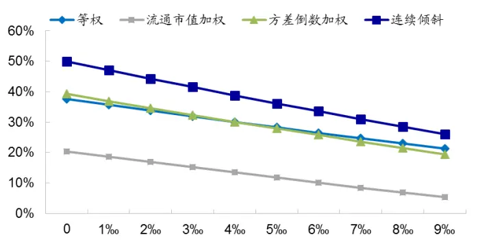
资料来源：Wind，海通证券研究所

图5 不同交易成本下连续倾斜组合相对于等权组合的年化超额收益（2010.05.01-2019.05.17）
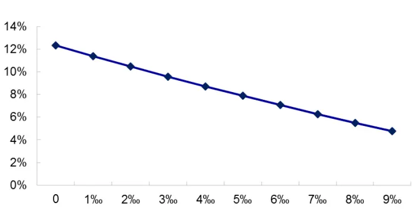
资料来源： ，海通证券研究所

不论在何种费率下，连续倾斜组合的收益率均高于其他加权方式。但随着交易成本逐渐增大，连续倾斜加权法在收益上的优势逐步减弱（上图右）。费率越高，换手率对收益的侵蚀越明显。

在考察的 10 个因子中，反转因子的换手率较高。对于连续倾斜组合，一种可以减少换手率的方式是，不对反转因子倾斜，即在确定权重时仅对除反转因子以外的 9个因子倾斜。

在这种情况下，连续倾斜组合年化换手由 倍降为 倍。同时由于反转因子多头效应差，不对反转因子倾斜后组合收益反而略微提升，不扣费下年化收益由 49.9%增加至 51.5%。费率越高，不对反转因子倾斜的连续倾斜组合，相对于原始连续倾斜组合的收益优势越大。

图6 不对反转因子倾斜的连续倾斜组合年化收益（2010.05.01-2019.05.17）
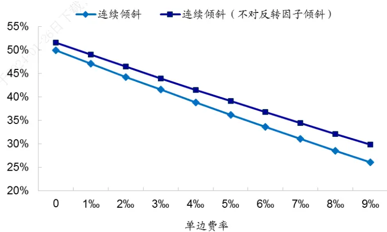
资料来源：Wind，海通证券研究所

总结来看，等权组合换手率最低，连续倾斜组合换手率最高。在逐步倾斜过程中，减少或完全放弃对换手率高的反转因子倾斜，可降低连续倾斜组合的换手率，提升组合收益。

## 4. 不同加权方式组合的资金容量对比

## 4.1 策略资金容量

在多因子组合成分股确定后，即可计算组合所能容纳的最大资金容量。组合的日最大资金容量为成分股日最大资金容量之和，即

$$
Capacity_{Port}={\sum}_{i=1}^{N}Capacity_{i}\;,
$$

其中，个股日最大资金容量采用过去半年日均成交额的 10%进行估算。

下图左展示了全市场多因子组合（100 只个股）所能容纳的最大日资金容量，平均为 5.8 亿。在 2015-2018 年期间，多因子组合的最大资金容量明显提升。一方面是由于整个市场成交体量在增加，特别是 2015 年上半年，A 股日均成交额在 1 万亿以上，远高于其他时间段。另一方面，2017 年至 2018 年上半年，市场风格明显偏大盘，多因子组合选入的股票市值明显高于其他时间段，组合中市值分位点小于 30%的个股占比由前期均值 75%降至 10%以内，从而提升了多因子组合的资金容量。

图7 全市场多因子组合所能允许的最大日资金容量（亿元）
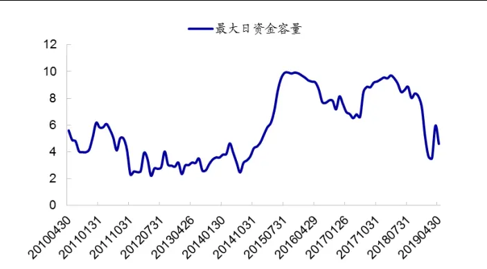
资料来源：Wind，海通证券研究所

图8 全市场多因子组合成交额、市值较小的个股数占比
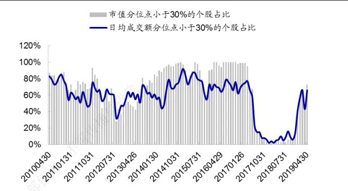
资料来源：Wind，海通证券研究所

对于考虑了个股权重的具体策略，其资金容量主要受限于组合中权重大、成交额小的股票，因此我们按照如下方式简单估算策略资金容量：

- 计算单只个股日最大资金容量：个股过去半年日均成交额的 10%；

- 计算个股最大资金容量对应的策略总容量：个股日最大资金容量除以个股在组合中的权重；

- 组合中个股最大资金容量对应的策略总容量最小值称为策略资金容量。

即策略容量为，其中 N为组合包含的个股数，Amt 为个股 i的日均成交额，W 为该个股在组合中的权重。

图9 不同加权方式策略的资金容量对比（亿元，2010.05.01-2019.05.17）
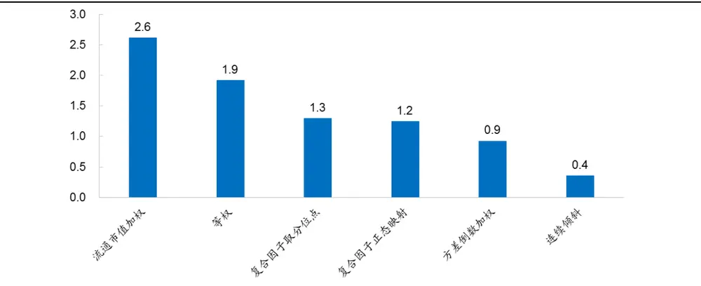
资料来源： ，海通证券研究所

上图展示了不同加权策略日资金容量情况。结果显示，流通市值加权组合的容量最大，为 2.6 亿。连续倾斜组合的容量最小，仅为 4 千万，远低于多因子组合所能容纳的最大资金容量。表明按照连续倾斜加权方式构建的组合虽然收益高，但资金容量小。

## 4.2资金容量下限

由于策略容量主要受限于权重大、成交额小的股票，因此对于连续倾斜组合，我们可基于个股的成交情况设定权重上限，减少资金容量小的股票权重，以此提升整个策略的容量。

具体来看，若我们要求策略的日资金容量不低于 $\mathsf{F_{base}}$ （称为资金容量下限），则只要保证每只个股最大资金容量对应的策略总容量不低于 $\mathsf{F_{base}}$ 即可。也就是对于任意一只

个股 i，要求 $\cfrac{Amt_{i}\times10\%}{W_{i}}\geq F_{base},$ ，对该式变形即为要求股票 i的权重不超过 $\left\{\frac{Amt_{i}\times10\%}{F_{base}}\right.$ 。在这个限制条件下得到的组合资金容量（以历史日均成交额测算）将不低于设定的下限$\mathsf{F_{base}}$

例如，若我们要求连续倾斜组合的日资金容量不低于 1亿，则只要在确定权重时保证每只个股的权重不超过（Amt*10%/1 亿）即可。在此限制条件下组合的累计净值如下左所示。扣除单边千三费用后组合年化收益 41.33%，资金容量为 1.02 亿。信息比和收益回撤比分别为 1.20 和 1.28，仍高于其他加权方式的多因子组合。

图10 资金容量下限为 1亿时连续倾斜组合累计净值
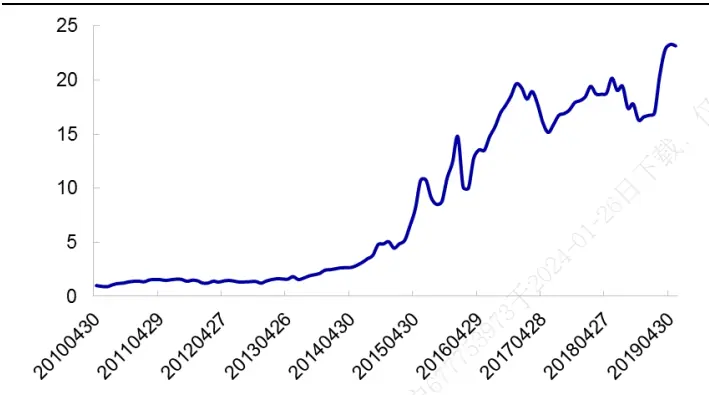
资料来源：Wind，海通证券研究所

图11 资金容量下限为 1亿时连续倾斜组合相对净值
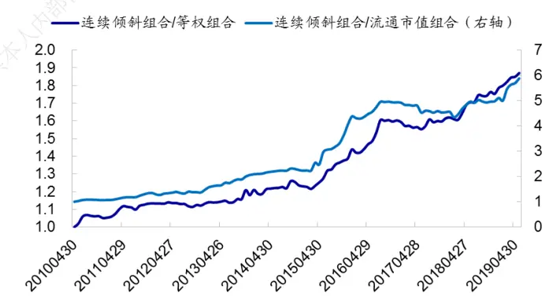
资料来源：Wind，海通证券研究所

表 4 资金容量下限为 1 亿时连续倾斜组合收益表现（2010.05.01-2019.05.17）

| 加权方式 | 月均收益 | 月胜率 | 年化收益 | 年化波动率 (按月收益) | 信息比 | 最大回撤（按 月收益） | 收益回撤 比 | 资金容量 (亿) |
| --- | --- | --- | --- | --- | --- | --- | --- | --- |
| 连续倾斜 | 3.38% | 69.72% | 41.33% | 33.72% | 1.20 | 32.29% | 1.28 | 1.02 |
| 等权 | 2.77% | 63.30% | 31.92% | 32.61% | 1.02 | 31.45% | 1.01 | 1.91 |
| 流通市值加权 | 1.60% | 61.47% | 16.28% | 28.46% | 0.68 | 35.64% | 0.46 | 2.61 |
| 方差倒数加权 | 2.77% | 66.97% | 32.28% | 31.82% | 1.04 | 30.98% | 1.04 | 0.92 |
| 复合因子取分位点 | 2.98% | 63.30% | 35.19% | 32.82% | 1.09 | 31.60% | 1.11 | 1.29 |
| 复合因子正态映射 | 2.97% | 62.39% | 35.03% | 32.75% | 1.09 | 31.85% | 1.10 | 1.24 |

资料来源： ，海通证券研究所
注：此处扣除单边费率 ‰

下图展示了预设的资金容量下限对多因子组合年化收益的影响，图中横轴为预设的资金容量下限，纵轴为对应组合的年化收益。结果显示：

- 在不同资金容量下限下，连续倾斜组合的年化收益均高于其他加权组合；

对于除市值加权以外的其他加权组合，最低资金容量限制通常会减少组合中收益贡献较大股票的权重，因此随着要求的日资金容量逐渐增加，策略收益逐渐降低，且不同策略之间的收益差异也逐步缩小。

随着日资金容量下限逐渐增加，市值加权组合收益呈现小幅增加趋势。这是由于资金容量下限主要约束成交额小的股票权重，对市值加权组合施加资金容量限制会减小市值大、但成交额小的股票权重，提高市值小、但成交额大的股票权重，即小市值股票的权重会有所增加。而过去几年市场整体呈小盘效应，因此随着资金容量下限逐渐增加，市值加权组合的收益反而小幅增大。

图12 不同资金容量下限的多因子组合年化收益对比（2010.05.01-2019.05.17）
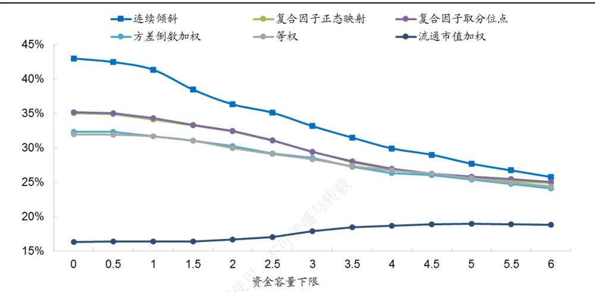
资料来源：Wind，海通证券研究所

总结来看，在对策略资金容量不设下限的情况下，流通市值加权方式的资金容量最大，连续倾斜加权方式的资金容量最小。通过设定资金容量下限，可降低成交低迷股票的权重，增加策略容量，同时也会减少策略收益。日资金规模在 亿以内时，连续倾斜组合相对于等权组合、方差倒数加权组合存在 5%以上的年化超额收益；日资金规模在 5亿以上时，连续倾斜组合与等权组合的收益表现趋于一致。

## 5. 中证 800成分股内的多因子组合

由前所知，全市场 TOP100 多因子组合中有 60%以上的个股市值很小（市值分位点小于 30%），直接限制了组合资金容量和流动性。因此本节我们以流动性较大的中证 800成分股作为选股样本池，考察不同加权方式对多因子组合的影响。其中，组合包含的个股数仍为 100 只。

下表展示了单边扣除千三的费率后，中证 800 多因子组合在不同加权方式下的收益表现及日资金容量情况，呈现出与全市场多因子组合相同的特征：

- 收益表现：连续倾斜组合的收益表现最优，其次为方差倒数加权，流通市值加权组合的收益表现最差；

- 换手率：连续倾斜组合的换手率最高，等权组合的换手率最低；

- 资金容量：连续倾斜组合的资金容量最小，流通市值加权组合的资金容量最大。

表 5 不同加权方式的中证 800 多因子组合对比（2010.04.01-2019.05.17）

|  | 月均收益 | 月胜率 | 年化收益 | 年化波动率 (按月收益) | 信息比 | 最大回撤（按 月收益） | 收益回撤比 | 资金容量 (亿) | 年化换手 |
| --- | --- | --- | --- | --- | --- | --- | --- | --- | --- |
| 等权 | 0.97% | 55.05% | 8.79% | 25.25% | 0.46 | 39.86% | 0.22 | 3.69 | 6.03 |
| 流通市值加权 | 0.67% | 56.88% | 5.42% | 23.61% | 0.34 | 47.66% | 0.11 | 4.57 | 6.04 |
| 方差倒数加权 | 1.18% | 56.88% | 11.83% | 24.31% | 0.58 | 34.01% | 0.35 | 1.85 | 7.75 |
| 连续倾斜 | 1.94% | 58.72% | 22.10% | 25.40% | 0.92 | 25.09% | 0.88 | 0.76 | 8.20 |
| 中证800 | 0.39% | 53.21% | 1.73% | 24.30% | 0.19 | 44.22% | 0.04 |  |  |

资料来源：Wind，海通证券研究所

图13 中证 800多因子组合累计净值
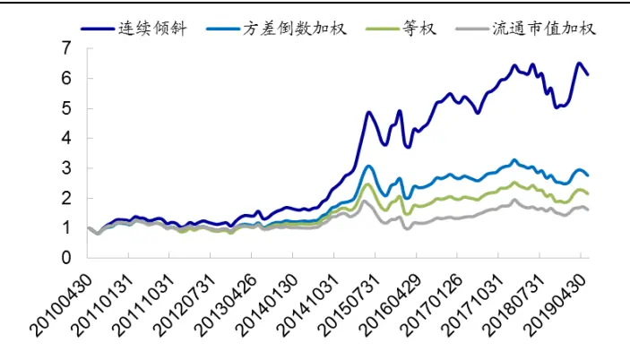
资料来源：Wind，海通证券研究所

图14 中证 800多因子组合相对于中证 800指数的相对净值
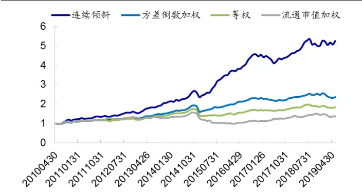
资料来源：Wind，海通证券研究所

下表展示了将资金容量下限设为 5亿时，不同加权方式多因子组合的收益表现情况。结果显示，所有组合的日资金容量都增加至 5 亿以上。从收益风险指标来看，等权组合、流通市值加权组合和方差倒数加权组合的相关指标相比于不设限时，没有明显变化。连续倾斜组合的年化收益则大幅下降，由 降至 ，但仍优于其他组合表现。

表 6 资金容量下限为 5 亿时中证 800 多因子组合收益表现（2010.05.01-2019.05.17）

|  | 月均收益 | 月胜率 | 年化收益 | 年化波动率 (按月收益) | 信息比 | 最大回撤（按 月收益） | 收益回撤比 | 资金容量 (亿) | 年化换手 |
| --- | --- | --- | --- | --- | --- | --- | --- | --- | --- |
| 等权 | 0.93% | 55.96% | 8.34% | 25.09% | 0.45 | 39.86% | 0.21 | 5.73 | 6.09 |
| 流通市值加权 | 0.67% | 57.80% | 5.32% | 23.77% | 0.34 | 47.66% | 0.11 | 6.70 | 6.06 |
| 方差倒数加权 | 1.12% | 56.88% | 11.02% | 24.38% | 0.55 | 34.09% | 0.32 | 5.31 | 7.23 |
| 连续倾斜 | 1.47% | 59.63% | 15.66% | 24.50% | 0.72 | 31.16% | 0.50 | 5.00 | 7.46 |
| 中证 800 | 0.39% | 53.21% | 1.73% | 24.30% | 0.19 | 44.22% | 0.04 | 一 |  |

资料来源：Wind，海通证券研究所

为更清楚地展示资金容量与收益的关系，如下两图展示了在不同资金容量下限下，策略资金容量与收益的散点图。结果显示，随着资金容量增大，策略收益逐步下降。但各个策略收益之间的相对关系保持不变：收益率最高的加权方式是连续倾斜，其次为方差倒数加权，之后分别是等权加权、流通市值加权。

图15 资金容量与组合收益（方差倒数加权 VS连续倾斜组合）
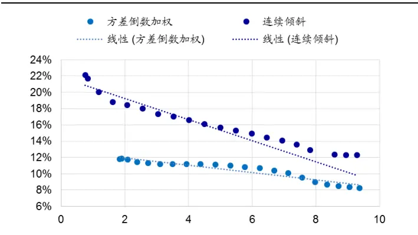
资料来源：Wind，海通证券研究所

图16 资金容量与组合收益（市值加权组合 VS等权组合）
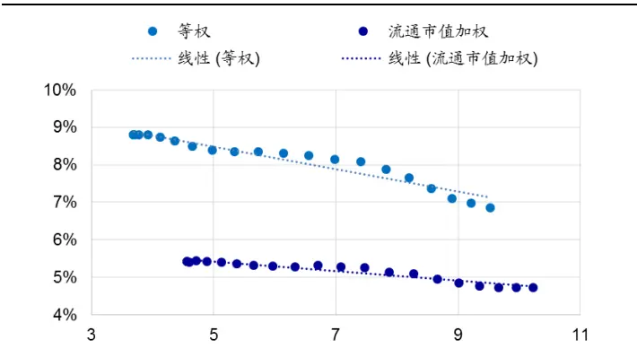
资料来源：Wind，海通证券研究所

总结来看，中证 800 多因子组合在不同加权方式下呈现的特征与全市场多因子组合一致。连续倾斜组合的收益表现最优，换手率最高，资金容量最小。市值加权组合的收益最低，资金容量最大。通过最小资金容量限制可提升策略的资金容量，在资金容量增加的过程中，策略收益逐渐下降，但不同加权方式之间收益表现的相对强弱关系保持不变。

## 6. 总结

常见的多因子组合个股加权方式主要有：等权加权、市值加权、方差倒数加权以及因子相关加权四种。其中，因子相关加权又有多种构建方式，如复合因子取分位点、复合因子 zscore 正态映射、连续因子倾斜等。

从收益表现来看，因子相关加权表现最优，其次为方差倒数加权，排在之后的分别是等权加权和市值加权。在因子相关加权方式中，更建议采用连续倾斜形式。除了具有明显收益优势外，连续倾斜的灵活性更高，可以自主地选择对哪些因子倾斜，以及每个因子倾斜多大比例。

从换手率来看，多因子组合换手率普遍偏高。其中，换手率最高的是连续倾斜加权方式，等权组合和市值加权组合的换手率相对偏低。

从资金容量来看，连续倾斜组合的资金容量远小于其他加权方式。通过设定最小容量下限，可提升策略容量。在资金容量增加的过程中，策略收益逐渐下降，但不同加权方式之间收益表现的相对强弱关系保持不变，连续倾斜组合仍优于其他加权方式。与

## 7. 风险提示

因子有效性变化风险，历史统计规律失效风险。部

## 信息披露

分析师声明

[Table冯佳睿lyst金融工程研究团队s]

罗蕾金融工程研究团队

本人具有中国证券业协会授予的证券投资咨询执业资格，以勤勉的职业态度，独立、客观地出具本报告。本报告所采用的数据和信息均来自市场公开信息，本人不保证该等信息的准确性或完整性。分析逻辑基于作者的职业理解，清晰准确地反映了作者的研究观点，结论不受任何第三方的授意或影响，特此声明。

## 法律声明

本报告仅供海通证券股份有限公司（以下简称 本公司 ）的客户使用。本公司不会因接收人收到本报告而视其为客户。在任何情况下，本报告中的信息或所表述的意见并不构成对任何人的投资建议。在任何情况下，本公司不对任何人因使用本报告中的任何内容所引致的任何损失负任何责任。

本报告所载的资料、意见及推测仅反映本公司于发布本报告当日的判断，本报告所指的证券或投资标的的价格、价值及投资收入可能载会波动。在不同时期，本公司可发出与本报告所载资料、意见及推测不一致的报告。

市场有风险，投资需谨慎。本报告所载的信息、材料及结论只提供特定客户作参考，不构成投资建议，也没有考虑到个别客户特殊的可投资目标、财务状况或需要。客户应考虑本报告中的任何意见或建议是否符合其特定状况。在法律许可的情况下，海通证券及其所属关联机构可能会持有报告中提到的公司所发行的证券并进行交易，还可能为这些公司提供投资银行服务或其他服务。

本报告仅向特定客户传送，未经海通证券研究所书面授权，本研究报告的任何部分均不得以任何方式制作任何形式的拷贝、复印件或内复制品，或再次分发给任何其他人，或以任何侵犯本公司版权的其他方式使用。所有本报告中使用的商标、服务标记及标记均为本公本司的商标、服务标记及标记，如欲引用或转载本文内容，务必联络海通证券研究所并获得许可，并需注明出处为海通证券研究所，目不得对本文进行有悖原意的引用和删改。载，

根据中国证监会核发的经营证券业务许可，海通证券股份有限公司的经营范围包括证券投资咨询业务。6日

海通证券股份有限公司研究[Table_PeopleInfo] 所
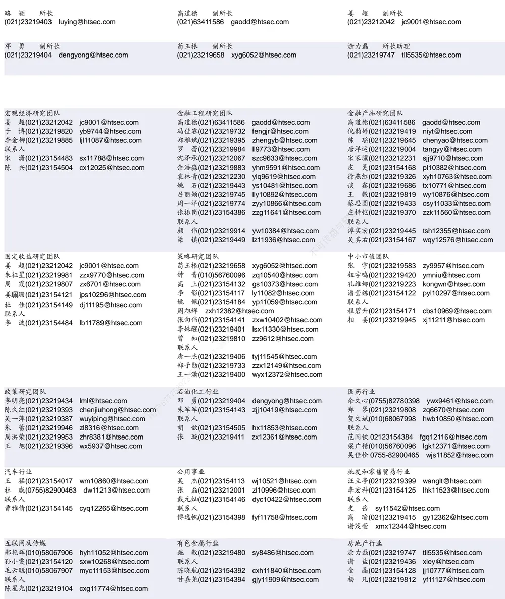

| 电子行业 |  | 煤炭行业 | 电力设备及新能源行业 |  |
| --- | --- | --- | --- | --- |
|  | 陈 平(021)23219646 cp9808@htsec.com | 李 淼(010)58067998 Im10779@htsec.com | 张一弛(021)23219402 zyc9637@htsec.com |  |
|  | 尹 苓(021)23154119 yl11569@htsec.com | 戴元灿(021)23154146 dyc10422@htsec.com | 房 青(021)23219692 fangq@htsec.com |  |
|  | 谢 磊(021)23212214 xl10881@htsec.com | 吴 杰(021)23154113 wj10521@htsec.com | 曾 彪(021)23154148 zb10242@htsec.com |  |
| 联系人 | 石 坚(010)58067942 sj11855@htsec.com | 联系人 王 涛(021)23219760 wt12363@htsec.com | 徐柏乔(021)23219171 xbq6583@htsec.com 联系人 |  |
|  |  |  |  | 陈佳彬(021)23154513 cjb11782@htsec.com |

| 基础化工行业 |  | 计算机行业 | 通信行业 |
| --- | --- | --- | --- |
| 刘 威(0755)82764281 Iw10053@htsec.com |  | 郑宏达(021)23219392 zhd10834@htsec.com | 朱劲松(010)50949926 zjs10213@htsec.com |
| 刘海荣(021)23154130 Ihr10342@htsec.com |  | 杨 林(021)23154174 yl11036@htsec.com | 余伟民(010)50949926 ywm11574@htsec.com |
| 张翠翠(021)23214397 | zcc11726@htsec.com | 鲁 立(021)23154138 II11383@htsec.com | 张 弋 01050949962 zy12258@htsec.com |
| 孙维容(021)23219431 swr12178@htsec.com |  | 于成龙 ycl12224@htsec.com | 张峥青(021)23219383 zzq11650@htsec.com |
| 联系人 |  | 黄竞晶(021)23154131 hjj10361@htsec.com |  |
| 李 智(021)23219392 lz11785@htsec.com |  | 洪 琳(021)23154137 hl11570@htsec.com |  |

| 非银行金融行业 |  | 交通运输行业 |  | 纺织服装行业 |  |
| --- | --- | --- | --- | --- | --- |
|  | 孙 婷(010)50949926 st9998@htsec.com |  | 虞 楠(021)23219382 yun@htsec.com |  | 梁 希(021)23219407 lx11040@htsec.com |
|  | 何 婷(021)23219634 ht10515@htsec.com |  | 罗月江(010）56760091 lyj12399@htsec.com | 联系人 |  |
| 联系人 |  | 联系人 |  | 盛 开(021)23154510 sk11787@htsec.com |  |
|  | 李芳洲(021)23154127 Ifz11585@htsec.com |  | 李 丹(021)23154401 Id11766@htsec.com |  | 刘 溢(021)23219748 ly12337@htsec.com |

| 建筑建材行业 | 机械行业 |  | 钢铁行业 |
| --- | --- | --- | --- |
| 冯晨阳(021)23212081 fcy10886@htsec.com | 余炜超(021)23219816 swc11480@htsec.com |  | 刘彦奇(021)23219391 liuyq@htsec.com |
| 潘莹练(021)23154122 pyl10297@htsec.com 联系人 | 耿 耘(021)23219814 杨 震(021)23154124 yz10334@htsec.com | gy10234@htsec.com | 刘 璇(0755)82900465 lx11212@htsec.com 联系人 |
| 申 浩(021)23154114 sh12219@htsec.com | 沈伟杰(021)23219963 swj11496@htsec.com 周 丹 zd12213@htsec.com |  | 周慧琳(021)23154399 zh11756@htsec.com |

| 建筑工程行业 |  | 农林牧渔行业 |  | 食品饮料行业 |  |
| --- | --- | --- | --- | --- | --- |
| 杜市伟(0755)82945368 dsw11227@htsec.com |  | 丁 频(021)23219405 dingpin@htsec.com | 可传播 | 闻宏伟(010)58067941 whw9587@htsec.com |  |
| 张欣劫 zxj12156@htsec.com |  | 陈雪丽(021)23219164 cxl9730@htsec.com |  | 成 珊(021)23212207 | cs9703@htsec.com |
| 李富华(021)23154134 Ifh12225@htsec.com |  | 陈 阳(021)23212041 cy10867@htsec.com 联系人 |  | 唐 宇(021)23219389 ty11049@htsec.com |  |
|  | 孟亚琦 myg12354@htsec com |  |  |  |  |

| 军工行业 | 银行行业 |  | 社会服务行业 |
| --- | --- | --- | --- |
| 蒋 俊(021)23154170 jj11200@htsec.com | 孙 婷(010)50949926 st9998@htsec.com |  | 汪立亭(021)23219399 wanglt@htsec.com |
| 刘 磊(010)50949922 II11322@htsec.com 张恒晅 zhx10170@htsec.com | 解巍巍 xww12276@htsec.com | 陈扬扬(021)23219671 cyy10636@htsec.com |  |
| 联系人 | 林加力(021)23214395ljl12245@htsec.com 谭敏沂(0755)82900489 tmy10908@htsec.com | 许樱之 xyz11630@htsec.com |  |
| 张宇轩(021)23154172 zyx11631@htsec.com |  |  |  |

| 家电行业 |  | 造纸轻工行业 |
| --- | --- | --- |
| 陈子仪(021)23219244 chenzy@htsec.com |  | 衣桢永(021)23212208 yzy12003@htsec.com |
| 李 阳(021)23154382 ly11194@htsec.com |  |  |
| 朱默辰(021)23154383 | zmc11316@htsec.com |  |
| 联系人 |  |  |
| 刘 璐(021)23214390 II11838@htsec.com |  |  |

## 研究所销售团队

深广地区销售团队

蔡铁清(0755)82775962 ctq5979@htsec.com

伏财勇(0755)23607963 fcy7498@htsec.com

辜丽娟(0755)83253022 gulj@htsec.com

刘晶晶(0755)83255933 liujj4900@htsec.com

王雅清(0755)83254133 wyq10541@htsec.com

饶 伟(0755)82775282 rw10588@htsec.com

欧阳梦楚(0755)23617160

oymc11039@htsec.com

巩柏含 gbh11537@htsec.com

上海地区销售团队
胡雪梅(021)23219385 huxm@htsec.com
朱 健(021)23219592 zhuj@htsec.com
季唯佳(021)23219384 jiwj@htsec.com
黄 毓(021)23219410 huangyu@htsec.com
漆冠男(021)23219281 qgn10768@htsec.com
胡宇欣(021)23154192 hyx10493@htsec.com
黄 诚(021)23219397 hc10482@htsec.com
毛文英(021)23219373 mwy10474@htsec.com
马晓男 mxn11376@htsec.com
杨祎昕(021)23212268 yyx10310@htsec.com
张思宇 zsy11797@htsec.com
慈晓聪(021)23219989 cxc11643@htsec.com
王朝领 wcl11854@htsec.com
邵亚杰 23214650 syj12493@htsec.com
李 寅 021-23219691 ly12488@htsec.com
北京地区销售团队
殷怡琦(010)58067988 yyq9989@htsec.com
郭 楠 010-5806 7936 gn12384@htsec.com
张丽萱(010)58067931 zlx11191@htsec.com
杨羽莎(010)58067977 yys10962@htsec.com
杜 飞 df12021@htsec.com
张 杨(021)23219442 zy9937@htsec.com
何 嘉(010)58067929 hj12311@htsec.com
李 婕 lj12330@htsec.com
欧阳亚群 oyyq12331@htsec.com

海通证券股份有限公司研究所

地址：上海市黄浦区广东路 689号海通证券大厦 9楼

电话：（021）23219000

传真：（021）23219392

网址：www.htsec.com