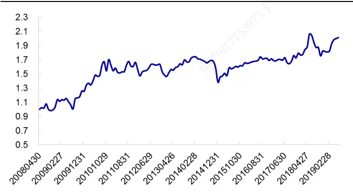
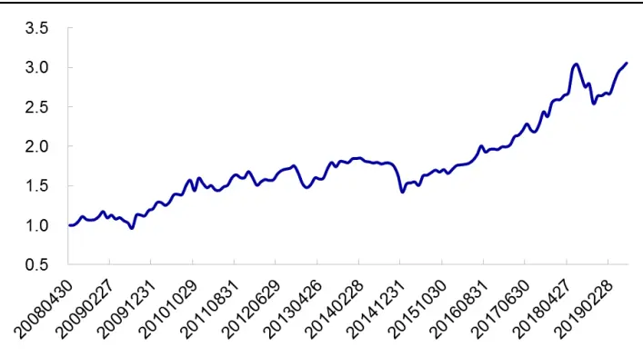
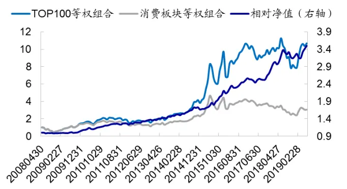
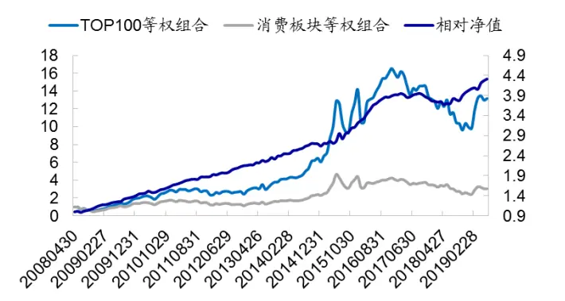
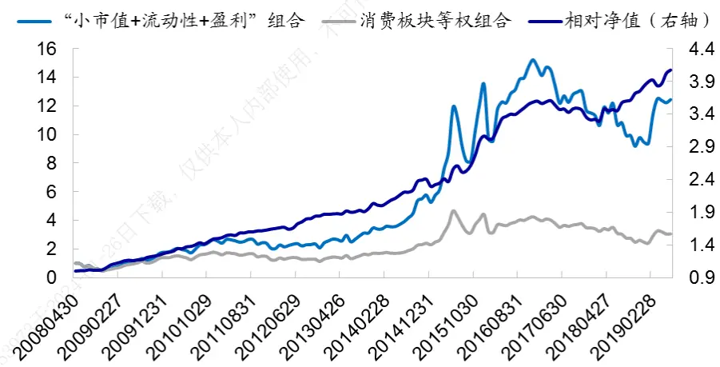
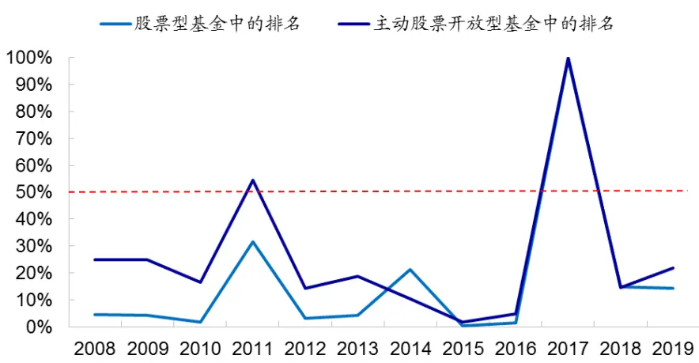
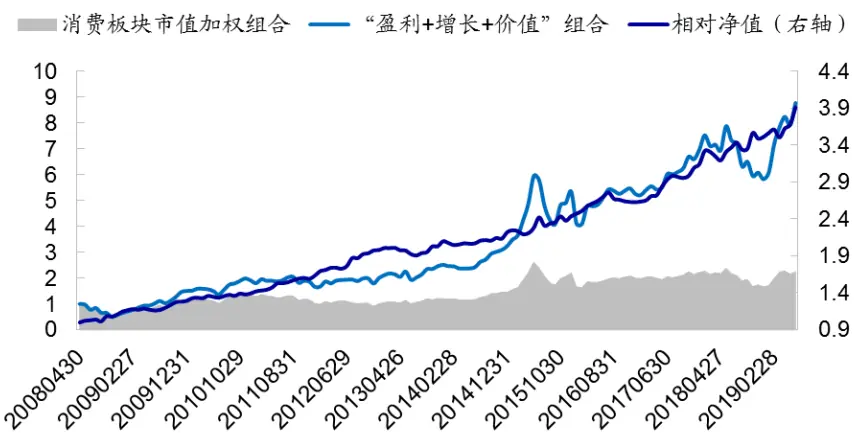
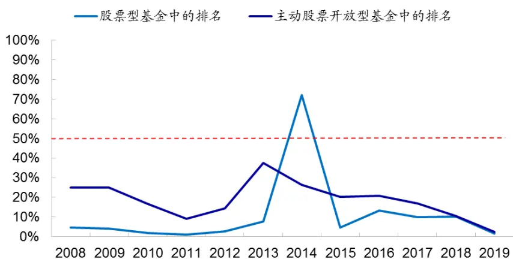
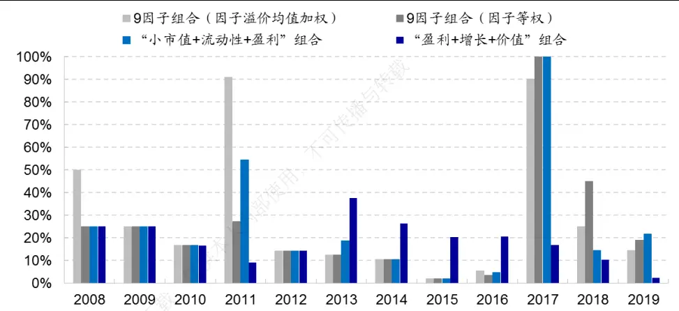
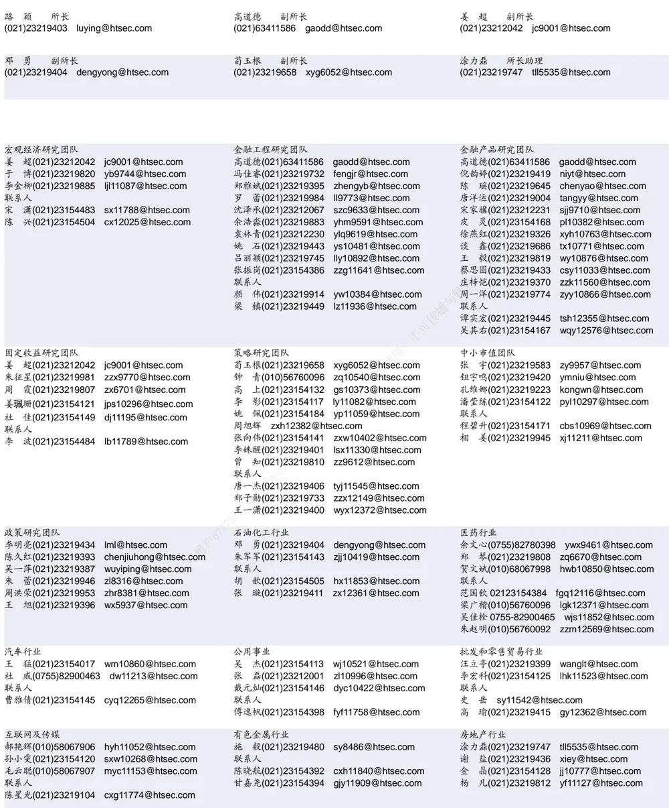

## [Tab相关研究

[Table_ReportInfo]《金融科技（Fintech）和数据挖掘研究（四）—— 供应链数据的介绍和应用》2019.07.14

《债基量化研究系列 4——债券型基金的工具化分类探究》

《短周期交易策略研究之一——基于集合竞价分时走势的 A股 T+0策略》2019.07.14

分析师:冯佳睿

Tel:(021)23219732

Email:fengjr@htsec.com

证书:S0850512080006

分析师:罗蕾

Tel:(021)23219984

Email:ll9773@htsec.com

证书:S0850516080002

# 选股因子系列研究（五十一）——消费板块的因子组合

## 投资要点：

消费板块个股在全市场以及主要宽基指数中占据较高比重，本文主要对板块内的因子组合进行实证研究。

消费板块整体收益表现。消费板块等权组合与全市场等权组合走势非常接近，差异很小；但消费板块的市值加权组合表现显著优于其他板块（本文将 股除消费板块以外的个股称为“其他板块”）。此外，在沪深 指数成分股内，消费板块的表现也显著优于其他板块。相比于其他板块，消费板块的大盘股表现较为突出。

- 常见单因子的选股效果。常见因子在消费板块存在显著选股效果；其中以市值因子和流动性因子表现最优。从时间序列相关性来看，市值因子与流动性因子相关性高；估值因子（PB）与波动率因子相关性高；盈利因子（ROE）与增长因子载和换手率因子相关性高。而市值因子、估值因子、基本面因子间的相关性处于较低水平。

消费板块的多因子组合。消费板块多因子组合整体收益表现较优，在绝大部分年份相对于消费板块基准都能获得正向超额收益。“小市值+流动性+盈利”、“盈利+使增长+价值”是消费板块简单有效的多因子组合。前者收益水平相对较高，与包含所有有效因子的多因子组合收益很接近。但与市场主流选股风格差异大，容易人出现黑天鹅事件。后者收益在主动股票开放型基金中的排名较为稳定，历史年度供排名均在前 40%。

- 风险提示：因子有效性变化风险，历史统计规律失效风险。6

本文主要对消费板块的因子组合进行实证研究。其中，消费板块包括商贸零售、餐饮旅游、家电、纺织服装、医药、食品饮料和农林牧渔 7 个中信一级行业。

## 1. 消费板块概览

本部分主要对消费板块的整体情况进行介绍，包括上市公司数量及其市值变动，以及板块的历史收益表现。

## 1.1 消费板块的个股数量及其市值占比

消费板块 7 个子行业的上市公司数量及其市值占比如下表所示。

表 1 消费板块上市公司数量及其在全市场的市值占比

|  | 商贸零售 | 餐饮旅游 | 家电 | 纺织服装 | 医药 | 食品饮料 | 农林牧渔 | 消费板块 |
| --- | --- | --- | --- | --- | --- | --- | --- | --- |
| 2007年1月 | 个股数（只） 89 | 22 | 27 | 60 | 115 | 45 | 52 | 410 |
| 市值占比 | 2.81% | 0.41% | 0.86% | 1.11% | 2.34% | 3.27% | 1.19% | 11.99% |
| 2019年6月 个股数 | 96 | 31 | 71 | 88 | 284 | 103 | 89 | 762 |
| 市值占比 | 1.46% | 0.59% | 2.12% | 0.75% | 6.16% | 6.12% | 1.70% | 18.89% |

资料来源： ，海通证券研究所

截止2019年6月底，消费板块共包含762只个股，在全部A股中的市值占比为18.9%。其中，上市公司数量最多、市值最大的两个子行业是医药和食品饮料，个股数量分别为 只和 只，市值占比分别为 和 。个股数增加幅度最明显的是家电行业，由 2007 年初的 27 只增加至 2019 年 6月的 71只，增加了 1.6 倍。

下表展示了沪深 300 指数成分股中消费板块的个股数及其权重占比。相比于 2007年初，消费板块在沪深 300 中的权重占比有所增加，由 20%增加至 24.6%。其中，以食品饮料行业权重增加幅度最为明显，由 3.7%增加至 9.8%；其次为家电行业，由 2.4%增加至 4.9%。商贸零售、纺织服装行业在沪深 300 中的权重则明显降低。

表 2 沪深 300成分股中消费板块的个股数及其权重

|  |  | 商贸零售 | 餐饮旅游 | 家电 | 纺织服装 | 医药 | 食品饮料 | 农林牧渔 | 消费板块 |
| --- | --- | --- | --- | --- | --- | --- | --- | --- | --- |
| 2007年1月 | 个股数（只） | 14 | 1159 | 8 | 5 | 14 | 14 | 4 | 60 |
|  | 权重 | 4.88% | 0.27% | 2.38% | 1.96% | 5.93% | 3.66% | 0.83% | 19.90% |
| 2019年6月 | 个股数 | 4 | 2 | 6 | 1 | 27 | 11 | 4 | 55 |
|  | 权重 | 0.79% | 0.82% | 4.90% | 0.13% | 6.25% | 9.79% | 1.96% | 24.63% |

资料来源：Wind，海通证券研究所

下表展示了中证 指数成分股中消费板块的个股数及其权重。相比于 年初，消费板块在中证 500 中的权重占比有所下降，由 32.6%降至 21.3%。其中，以商贸零售行业权重降幅最为明显，由 9.3%降低至 3.0%；其次为纺织服装和农林牧渔行业。

表 3 中证 500成分股中消费板块的个股数及其权重

|  |  | 商贸零售 | 餐饮旅游 | 家电 | 纺织服装 | 医药 | 食品饮料 | 农林牧渔 | 消费板块 |
| --- | --- | --- | --- | --- | --- | --- | --- | --- | --- |
| 2007年1月 | 个股数（只） | 42 | 9 | 8 | 19 | 39 | 10 | 25 | 152 |
|  | 权重 | 9.34% | 2.05% | 1.41% | 3.91% | 8.00% | 2.50% | 5.37% | 32.58% |
| 2019年6月 | 个股数 | 18 | 4 | 7 | 4 | 45 | 15 | 13 | 106 |
|  | 权重 | 2.99% | 0.68% | 0.94% | 0.42% | 8.82% | 4.10% | 3.38% | 21.34% |

资料来源：Wind，海通证券研究所

综上所述，消费板块在全市场和重要宽基指数构成中占据较高比重。板块个股在沪深 300 和中证 500 指数中的权重占比分别为 24.6%和 21.3%；其中，权重最高的 2 个行业是食品饮料和医药。

## 1.2 消费板块的整体收益表现

下表展示了消费板块整体收益表现情况。

表 4 消费板块整体收益表现（2008.05-2019.06）

| 样本空间 | 组合 | 月均收益 | 年化收益 | 月胜率 | 信息比1 |
| --- | --- | --- | --- | --- | --- |
| 全市场 | 等权组合 | 1.32% | 10.82% | 51.49% | 0.48 |
|  | 市值加权组合 | 0.37% | 0.96% | 53.73% | 0.17 |
| 消费板块 | 等权组合 | 1.25% | 10.51% | 53.73% | 0.48 |
|  | 市值加权组合 | 0.93% | 7.50% | 58.21% | 0.40 |
| 沪深 300 成分股 | 指数 | 0.32% | -0.31% | 54.48% | 0.13 |
|  | 消费板块组合 | 1.11% | 10.18% | 57.46% | 0.51 |
| 中证500 成分股 | 指数 | 0.61% | 2.15% | 54.48% | 0.23 |
|  | 消费板块组合 | 0.76% | 4.67% | 54.48% | 0.31 |

资料来源：Wind，海通证券研究所
注：此处信息比是指，组合月收益均值除以标准差年化后的值。

整体来看，消费板块等权组合与全市场等权组合收益表现非常接近，两者年化收益分别为 10.8%和 10.5%，信息比均为 0.48 左右。

但消费板块的市值加权组合，收益表现明显优于全市场市值加权组合，前者的年化收益和信息比分别为 和 ，而后者仅为 和 。另一方面，从全 角度来看，等权组合收益表现显著优于市值加权组合；而在消费板块，等权组合和市值加权组合收益差异较小，统计不显著。综合来看，相比于其他板块，消费板块的大盘股表现较为突出。

另外，在沪深 300 指数成分股内，消费板块的表现尤为突出。2008 年至 2019 年 6月，沪深 300 指数累计下跌 3.4%，而成分股内消费板块组合（按照沪深 300 指数成分股的权重加权）累计上涨 。消费板块组合相对指数年化超额 （下图右），月胜率 63.4%，统计显著。

图1 消费板块市值加权组合相对于全市场组合的净值走势

资料来源： ，海通证券研究所

图2 沪深 300成分股内消费板块组合相对于指数的净值走势

资料来源：Wind，海通证券研究所
注：组合按照沪深 300指数成分股的权重加权

总结来看，消费板块等权组合与全市场等权组合走势非常接近，差异很小；但消费板块的市值加权组合表现显著优于其他板块。此外，在沪深 300 指数成分股内，消费板块的表现也显著优于其他板块。相比于其他板块，消费板块的大盘股表现较为突出。

## 2. 常见因子在消费板块中的选股效果

本章主要考察常见因子在消费板块中的选股效果，包括 4 类共 12 个因子：市值类（市值、市值平方）、估值类（PB、PE、股息率）、技术类（反转、换手率、波动率、流动性）、以及基本面类（ROE、dROE、预期净利润调整）。样本空间为消费板块中上市 3 个月以上可交易的个股，换仓频率为月频。

## 2.1 单因子表现

下表展示了常见市值类、估值类和技术类因子在消费板块中的选股效果。

表 5 常见风格、技术因子在消费板块中的选股效果（2008.05-2019.06）

|  | RankIC |  |  | 多头超额1 |  |  | 多空收益差 |  |  |
| --- | --- | --- | --- | --- | --- | --- | --- | --- | --- |
|  | 均值 | 为正月度占比 | T值 | 均值 | 月胜率 | T值 | 均值 | 月胜率 | T值 |
| 市值 | -5.10% | 38.06% | -3.00 | 1.18% | 69.40% | 5.67 | 1.69% | 64.18% | 3.88 |
| 市值平方 | 3.51% | 66.42% | 5.49 | 0.34% | 59.70% | 2.51 | 0.69% | 65.67% | 3.71 |
| PB | -3.70% | 45.52% | -3.16 | 0.32% | 57.46% | 1.95 | 0.65% | 53.73% | 2.05 |
| 股息率 | 1.93% | 64.18% | 3.35 | 0.26% | 61.94% | 2.74 | 0.33% | 58.96% | 1.91 |
| PE | -1.47% | 44.03% | -1.71 | 0.07% | 52.24% | 0.44 | 0.23% | 53.73% | 1.05 |
| 反转 | -6.48% | 33.58% | -5.35 | 0.40% | 60.45% | 2.37 | 1.46% | 65.67% | 4.38 |
| 换手率 | -7.38% | 28.36% | -5.54 | 0.31% | 58.21% | 1.56 | 1.23% | 67.91% | 3.41 |
| 波动率 | -9.55% | 22.39% | -9.91 | 0.61% | 64.93% | 3.99 | 1.74% | 70.90% | 5.90 |
| 流动性 | -8.00% | 28.36% | -6.27 | 1.12% | 73.13% | 6.62 | 2.20% | 71.64% | 6.03 |

资料来源： ，海通证券研究所
注：“多头”是指因子得分最高的 股票形成的等权组合；“空头”是指因子得分最低的 股票形成的等权组合；“多头超额”是指多头组合相对于消费板块等权组合的超额收益。

从市值角度来看，消费板块呈现显著的小盘效应，小市值组合相对于大市值组合月均超额 。但市值因子空头效应较弱，在因子多空收益差中空头效应仅占 ；若考虑市值加权方式，则空头效应更弱：大市值组合相对于消费板块市值加权组合月均超额仅为-0.12%，统计不显著。

从估值角度来看，低估值股票具有一定的收益优势。从因子形式来看，PB 因子的选股效果强于 PE因子和股息率因子（过去 1 年累计分红/最新市值）。

从技术因子角度来看，消费板块呈现显著的价格反转效应、低换手率效应、低波动效应和流动性溢价现象。特别地，流动性溢价在消费板块非常显著，流动性低的股票相对流动性高的股票月均超额 2.2%，月胜率 71.6%，是考察的 12个因子中月均多空收益差最高的因子。

从基本面因子角度来看，剔除市值风格后的 ROE和 ROE 同比（dROE）因子具有稳定的选股效果，RankIC月胜率分别为 69%和 80%。此外，预期净利润调整因子也存在显著选股效果，月均多空收益差为 1%。

表 6 常见基本面因子在消费板块中的选股效果（2008.05-2019.06）

| 原始因子 |  |  |  |  |  |  |  |
| --- | --- | --- | --- | --- | --- | --- | --- |
|  |  | RankIC |  | 多头超额 |  | 多空收益差 |  |
|  | 均值 >0月度占比 | T值 | 均值 | 月胜率 | T值 | 均值 月胜率 | T值 |
| ROE | 2.48% 55.97% | 1.73 | 0.30% | 54.48% | 1.43 | 0.43% 55.22% | 1.20 |
| dROE | 4.32% 76.87% | 6.88 | 0.57% | 69.40% | 5.53 | 1.10% 70.90% | 6.34 |
| 预期净利润 调整 | 2.38% 58.96% | 2.59 | 0.42% | 64.18% | 3.07 | 0.69% 58.96% | 2.91 |

剔除市值风格后的因子

|  | RankIC |  | 多头超额 |  | 多空收益差 |  |
| --- | --- | --- | --- | --- | --- | --- |
|  | 均值 >0月度占比 | T值 | 均值 月胜率 | T值 | 均值 月胜率 | T值 |
| ROE | 5.95% 68.66% | 6.89 | 0.66% 61.94% | 4.47 | 1.28% 62.69% | 5.30 |
| dROE | 4.99% 79.85% | 8.52 | 0.65% 73.88% | 6.74 | 1.26% 78.36% | 7.65 |
| 预期净利润 调整 | 3.39% 67.16% | 5.00 | 0.53% 70.90% | 5.64 | 1.00% 67.16% | 5.79 |

资料来源：Wind，海通证券研究所

## 2.2 因子相关性

我们以各因子多头组合相对于样本等权组合的超额收益为基础，考察因子之间的时间序列相关性，结果如下表所示。

表 7 常见因子多头超额的时间序列相关性（2008.05-2019.06）

|  | 市值 | 流动性 | 反转 | PB | 波动率 | 换手率 | 市值平方 | ROE | dROE | 预期净利 润调整 |
| --- | --- | --- | --- | --- | --- | --- | --- | --- | --- | --- |
| 市值 | 1 | 75.0% | 19.7% | 8.5% | 3.1% | -53.2% | -33.4% | -51.6% | -28.8% | 1.0% |
| 流动性 | 75.0% | 1 | 13.0% | -17.1% | -12.6% | -34.4% | -36.2% | -43.7% | -20.2% | 2.8% |
| 反转 | 19.7% | 13.0% | 1 | 5.6% | 6.6% | -22.9% | -24.9% | -5.3% | -3.3% | 3.1% |
| PB | 8.5% | -17.1% | 5.6% | 1 | 55.7% | -0.7% | 2.7% | -29.6% | -4.0% | -27.7% |
| 波动率 | 3.1% | -12.6% | 6.6% | 55.7% | 1 | 45.4% | 27.5% | 12.8% | 3.2% | -16.1% |
| 换手率 | -53.2% | -34.4% | -22.9% | -0.7% | 45.4% | 1 | 50.5% | 52.6% | 8.5% | -8.3% |
| 市值平方 | -33.4% | -36.2% | -24.9% | 2.7% | 27.5% | 50.5% | 1 | 43.9% | 11.7% | -11.1% |
| ROE | -51.6% | -43.7% | -5.3% | -29.6% | 12.8% | 52.6% | 43.9% | 1 | 47.1% | 12.4% |
| dROE | -28.8% | -20.2% | -3.3% | -4.0% | 3.2% | 8.5% | 11.7% | 47.1% | 1 | 1.5% |
| 预期净利 润调整 | 1.0% | 2.8% | 3.1% | -27.7% | -16.1% | -8.3% | -11.1% | 12.4% | 1.5% | 1 |

资料来源：Wind，海通证券研究所

市值与流动性相关性高，两者相关系数高达 75%。对于相关性很高的因子，我们可通过构建复合因子的方式更好地提取公共部分。

下表展示了市值单因子、流动性单因子、市值与流动性等权加总的复合因子（简称小市值复合因子）TOP100 组合收益表现情况。结果显示，复合因子的收益表现优于市值单因子组合和流动性单因子组合。

表 8 市值、流动性因子 TOP100 等权组合的整体收益表现（2008.05-2019.6）

|  | 年化收益 | 年化波动率 | 信息比1 | 最大回撤 | 收益回撤比 | 换手率（倍） |
| --- | --- | --- | --- | --- | --- | --- |
| 市值+流动性 | 23.43% | 36.22% | 0.765 | 53.71% | 0.436 | 2.40 |
| 市值单因子 | 21.28% | 36.47% | 0.714 | 54.91% | 0.387 | 2.01 |
| 流动性单因子 | 21.07% | 34.66% | 0.727 | 52.83% | 0.399 | 4.48 |

资料来源： ，海通证券研究所
注：此处信息比是指，组合月收益均值除以标准差年化后的值。

此外，估值因子（PB）与波动率因子相关性高；盈利因子（ROE）与增长因子和换手率因子相关性高；反转因子与其他因子的相关性普遍较低。

不同类别因子间，时间序列相关性处于较低水平。市值因子、估值因子、盈利因子两两相关性低，相关系数在 10%以下甚至为负。

总结来看，常见因子在消费板块存在显著选股效果；其中以市值因子和流动性因子表现最优。从时间序列相关性来看，市值因子与流动性因子相关性高；估值因子（PB）与波动率因子相关性高；盈利因子（ROE）与增长因子和换手率因子相关性高。而市值因子、估值因子、基本面因子间的相关性处于较低水平。

## 3. 消费板块的多因子组合

在构建多因子组合时，因子选择通常有两种方式。一种是将所有历史检验有效的因子都放入模型中；另一种是，根据组合的目标特征选择相应因子。本节将对这两种因子选择方式下的多因子组合进行实证研究；对于第二种方式，我们主要提供几种表现比较好的因子组合供投资者参考。

需要注意的是，本节在构建多因子组合时，考察的因子仅包括前文提及的 12 个因子。每个月末，将消费板块所有个股次月收益对这 12 个因子进行横截面回归，并统计溢价的时间序列特征，结果如下表所示。

表 9 消费板块因子截面溢价统计（2008.05-2019.06）

|  | 均值 | 有效月份占比 T值 | 信息比 |
| --- | --- | --- | --- |
| 市值 | -0.40% | 58.21% -2.41 | -0.72 |
| 市值平方 | 0.47% | 73.13% 6.42 | 1.92 |
| 反转 | -0.50% 66.42% | -4.87 | -1.46 |
| 换手率 | -0.47% 70.15% | -4.92 | -1.47 |
| 波动率 | -0.16% 56.72% | -1.80 | -0.54 |
| 流动性 | -0.49% | 65.67% -4.33 | -1.29 |
| ROE | 0.36% | 59.70% 4.76 | 1.43 |
| dROE | 0.17% | 59.70% 3.31 | 0.99 |
| 预期净利润调整 | 0.22% | 65.67% 4.01 | 1.20 |
| PB | -0.22% | 66.42% -3.15 | -0.94 |
| 股息率 | -0.04% | 52.24% -0.99 | -0.30 |
| PE | 0.07% | 54.48% 1.43 | 0.43 |

资料来源： ，海通证券研究所
注：基本面因子（ROE、dROE、预期净利润调整）是剔除市值风格后的因子，估值（PB、股息率、PE）是剔除市值风格和行业后的因子。信息比是溢价均值除以标准差年化后的值。

在考察的 12 个因子中，除波动率、PE和股息率 3个因子外，其余 9 个因子的截面溢价在时间序列上均显著异于 0。

## 3.1 所有有效因子复合的多因子组合

将消费板块个股在 9个有效因子上的暴露进行横截面标准化并加总，选择复合因子得分最高的 100 只股票构建等权组合，收益表现如下表所示。其中，因子加权方式有两种：过去 12 个月溢价均值加权（以过去 12个月因子溢价的等权平均值作为权重）和等权加权。

表 10 所有有效因子复合的多因子组合（2008.05-2019.06）

| 因子加权方式 |  | 年化收益 | 年化波动率 | 信息比1 | 最大回撤 | 收益回撤比 | 换手率（倍） |
| --- | --- | --- | --- | --- | --- | --- | --- |
| 过去12个月溢价 均值加权 | 未扣费 | 27.00% | 33.34% | 0.892 | 54.75% | 0.493 | 4.90 |
|  | 单边千三 | 23.63% | 33.28% | 0.811 | 54.75% | 0.432 |  |
| 等权 | 未扣费 | 29.75% | 32.70% | 0.967 | 50.05% | 0.594 | 5.59 |
|  | 单边千三 | 25.96% | 32.65% | 0.876 | 50.05% | 0.519 |  |
| 消费板块等权组合 |  | 10.51% | 31.27% | 0.479 | 53.81% | 0.195 |  |

资料来源： ，海通证券研究所
注：此处信息比是指，组合月收益均值除以标准差年化后的值。

结果显示，复合因子的收益表现优于任一单因子。整体来看，因子等权加权的TOP100 组合收益表现优于 12 个月溢价均值加权的 TOP100 组合；前者扣费后年化收益约为 26%，后者为 23.6%。但从近几年的收益表现来看，溢价均值加权方式的组合优于因子等权加权组合（下图）。

图3 12 个月溢价均值加权的多因子组合累计净值（2008.05 —2019.06）

资料来源：Wind，海通证券研究所

图4 因子等权加权的多因子组合累计净值（2008.05—2019.06）

资料来源：Wind，海通证券研究所

## 3.2“小市值+流动性+盈利”组合

本节考察消费板块中“小市值+流动性+盈利”因子组合的收益表现。在消费板块中，将三个因子进行横截面标准化，并等权加总获取个股综合得分；选择得分最高的 100只股票构建等权组合，相应的累计净值如下图所示。

图5 消费板块“小市值+流动性+盈利”组合累计净值（2008.05-2019.06）

资料来源：Wind，海通证券研究所

从全样本角度来看，“小市值+流动性+盈利”组合具有较好收益表现，年化收益27.5%，相对于消费板块等权组合基准存在显著超额收益，年化超额 17.0%。组合换手率较低，年化单边换手 3.2 倍。扣除单边千三费用后，组合年化收益降低 2 个百分点，为 25.3%，与所有有效因子复合的多因子组合无明显差异。

表 11“小市值+流动性+盈利”组合整体收益表现（2008.05-2019.05）

|  |  | 年化收益 | 年化波动率 | 信息比1 | 最大回撤 | 收益回撤比 |
| --- | --- | --- | --- | --- | --- | --- |
| 绝对收益 | 未扣费 | 27.51% | 34.87% | 0.876 | 52.96% | 0.520 |
|  | 单边千三 | 25.32% | 34.86% | 0.826 | 52.96% | 0.478 |
| 基准（消费板块等权组合） |  | 10.51% | 31.27% | 0.479 | 53.81% | 0.195 |
| 相对基准 | 未扣费 | 17.00% | 7.11% | 2.190 | 5.46% | 3.114 |
| 超额收益 | 单边千三 | 14.81% | 7.10% | 1.944 | 7.08% | 2.090 |

资料来源：Wind，海通证券研究所

注：绝对收益的信息比是月收益均值除以标准差年化后的值；超额收益的信息比计算基准是消费板块等权组合。

分年度来看，在绝大部分年份，“小市值+流动性+盈利”组合在股票型基金中的收益排名均在前 30%以内。但由于该组合在小市值因子上具有较高暴露，与市场现存基金的选股风格存在明显差异，因此容易出现黑天鹅事件。2017 年，小市值因子持续失效，消费板块的“小市值+流动性+盈利”组合产生大幅回撤，当年收益-21.8%。而市场上的股票型基金平均收益 14.0%，收益为正的基金占比高达 82%。因此在 2017 年收益排名中，“小市值+流动性+盈利”组合排名非常靠后，分位点为 99.4%。

图6 “小市值+流动性+盈利”组合在股票型基金和主动股票开放型基金中的排名

资料来源： ，海通证券研究所

## 3.3“盈利+增长+价值”组合

本节考察消费板块中“盈利+增长+价值”组合的收益表现。在组合构建前，我们先将消费板块中，前一个月日均换手率属于全市场换手率最高的 10%股票剔除，然后再在剩余股票中构建多因子组合。

盈利能力用 ROE因子刻画，增长用预期净利润调整因子刻画，估值水平用 PB刻画。在消费板块中，将三个因子进行横截面标准化，并等权加总获取个股综合得分；选择得分最高的 100 只股票构建市值加权组合，相应的收益表现如下表所示。

表 12“盈利+增长+价值”组合整体收益表现（2008.05-2019.06）

|  |  | 年化收益 | 年化波动率 | 信息比1 | 最大回撤 | 收益回撤比 |
| --- | --- | --- | --- | --- | --- | --- |
| 绝对收益 | 未扣费 | 24.27% | 28.46% | 0.915 | 50.16% | 0.484 |
|  | 单边千三 | 21.47% | 28.43% | 0.834 | 50.16% | 0.428 |
| 消费板块市值加权组合 |  | 7.50% | 27.51% | 0.404 | 53.78% | 0.139 |
| 超额收益 | 未扣费 | 16.77% | 7.00% | 2.131 | 4.42% | 3.795 |
|  | 单边千三 | 13.97% | 6.99% | 1.801 | 5.15% | 2.713 |

资料来源： ，海通证券研究所
注：绝对收益的信息比是月收益均值除以标准差年化后的值；超额收益的信息比计算基准是消费板块市值加权组合。

整体来看，“盈利+增长+价值”组合具有较好收益表现，年化收益 24.3%；相对于消费板块市值加权组合的超额收益显著为正，年化超额 16.8%，月胜率 73.1%。组合年化换手 4.35 倍，单边扣除 3‰费率后，年化收益降低 3个百分点左右，变为 21.5%，相对基准年化超额 14.0%。

图7 消费板块“盈利+增长+价值”组合累计净值

资料来源：Wind，海通证券研究所

分年度来看，扣除 3‰费率后，自 2008 年至 2019 年组合相对于基准均可获 5%以上的超额收益。

表 13 消费板块“盈利+增长+价值”组合分年度收益表现（2008.05-2019.06）

|  | 绝对收益 | 消费板块市值加权组合 |  | 相对收益 |
| --- | --- | --- | --- | --- |
|  | 收益 月胜率 | 收益 月胜率 | 收益 | 月胜率 |
| 2008 | -35.0% 37.5% | -43.4% 37.5% | 8.3% | 75.0% |
| 2009 | 131.5% 91.7% | 105.6% 91.7% | 25.9% | 75.0% |
| 2010 | 26.7% 58.3% | 17.5% 58.3% | 9.2% | 58.3% |
| 2011 | -12.8% 50.0% | -25.6% 33.3% | 12.8% | 83.3% |
| 2012 | 20.5% 75.0% | -0.7% 41.7% | 21.1% | 83.3% |
| 2013 | 25.6% 75.0% | 18.5% 58.3% | 7.1% | 58.3% |
| 2014 | 28.7% 66.7% | 21.6% 75.0% | 7.0% | 58.3% |
| 2015 | 65.3% 66.7% | 50.5% 66.7% | 14.8% | 66.7% |
| 2016 | -1.7% 50.0% | -8.8% 58.3% | 7.1% | 58.3% |
| 2017 | 32.6% 66.7% | 10.9% 58.3% | 21.7% | 83.3% |
| 2018 | -16.4% 41.7% | -25.2% 41.7% | 8.8% | 58.3% |
| 2019 | 50.6% 83.3% | 35.2% 83.3% | 15.4% | 83.3% |

资料来源：Wind，海通证券研究所
注： 单边扣除 费率。

图8 “盈利+增长+价值”组合在股票型基金和主动股票开放型基金中的排名

资料来源：Wind，海通证券研究所

“盈利+增长+价值”组合在股票型基金中的收益排名相对较为稳定。2008-2019 年间，在主动股票开放型基金中，除 2013 年以外，其他年份的排名均在前 30%。而在股票型基金中，除 2014 年以外，其他年份的排名均在前 20%。

年，组合在股票型基金中的排名为 ，相对靠后。这主要是由于 年消费板块的整体收益率相对较低，仅为 22%左右，低于许多指数。如沪深 300 当年上涨51.7%，上证 50 上涨 63.9%，中证 500 上涨 39.0%。因此消费板块“盈利+增长+价值”组合的收益表现不如许多被动型产品，排名相对靠后。但在主动股票开放型基金中排名仍在前 30%。

## 3.4 小结

本章我们对 4个消费板块多因子组合进行了实证研究。其中 2个是将消费板块所有有效因子复合的多因子组合（9 因子组合）；另外两个是仅筛选少量因子构建具有目标特征的因子组合：“小市值+流动性+盈利”组合和“盈利+增长+价值”组合组合。

图9 多因子组合在主动股票开放型基金中的收益排名

资料来源：Wind，海通证券研究所

实证结果显示，仅包含 3 个因子的“小市值+流动性+盈利”组合与包含所有有效因子的 9因子组合收益表现非常接近，扣费后年化收益均为 25%左右。且各年度在主动股票开放型基金中的收益排名也很类似：2014-2016 年表现最优，收益排名均在前 10%；2017 年表现最差，收益排名在后 10%。

“盈利+增长+价值”组合整体收益表现略低于其他 3 个组合，年化收益为 21.5%。但该组合的收益分布较为均匀，历史年度排名稳定在前 40%。且该组合选股风格与市场主流风格类似，因此在 2017 年并未像其他 3 个组合一样出现黑天鹅事件。

## 4. 总结

消费板块个股在全市场以及主要宽基指数中占据较高比重，本文主要对板块内的因子组合进行实证研究。

消费板块等权组合与全市场等权组合走势非常接近，差异很小；但消费板块的市值加权组合表现显著优于其他板块。此外，在沪深 300 指数成分股内，消费板块的表现也显著优于其他板块。相比于其他板块，消费板块的大盘股表现较为突出。

常见因子在消费板块存在显著选股效果；其中以市值因子和流动性因子表现最优。从时间序列相关性来看，市值因子与流动性因子相关性高；估值因子（PB）与波动率因子相关性高；盈利因子（ROE）与增长因子和换手率因子相关性高。而市值因子、估值因子、基本面因子间的相关性则处于较低水平。

消费板块多因子组合整体收益较优，在绝大部分年份相对于消费板块基准都能获得正向超额收益。“小市值+流动性+盈利”、“盈利+增长+价值”是消费板块中简单有效的多因子组合。前者收益水平相对较高，与包含所有有效因子的多因子组合收益很接近。但与市场主流选股风格差异大，容易出现黑天鹅事件。后者收益在主动股票开放型基金中的排名较为稳定，历史年度排名均在前 40%。

## 5. 风险提示

因子有效性变化风险，历史统计规律失效风险。

# 信息披露分析师声明

[Table冯佳睿yst金融工程研究团队s]

罗蕾金融工程研究团队

本人具有中国证券业协会授予的证券投资咨询执业资格，以勤勉的职业态度，独立、客观地出具本报告。本报告所采用的数据和信息均来自市场公开信息，本人不保证该等信息的准确性或完整性。分析逻辑基于作者的职业理解，清晰准确地反映了作者的研究观点，结论不受任何第三方的授意或影响，特此声明。

## 法律声明

本报告仅供海通证券股份有限公司（以下简称 本公司 ）的客户使用。本公司不会因接收人收到本报告而视其为客户。在任何情况下，本报告中的信息或所表述的意见并不构成对任何人的投资建议。在任何情况下，本公司不对任何人因使用本报告中的任何内容所引致的任何损失负任何责任。

本报告所载的资料、意见及推测仅反映本公司于发布本报告当日的判断，本报告所指的证券或投资标的的价格、价值及投资收入可能会波动。在不同时期，本公司可发出与本报告所载资料、意见及推测不一致的报告。

市场有风险，投资需谨慎。本报告所载的信息、材料及结论只提供特定客户作参考，不构成投资建议，也没有考虑到个别客户特殊的播投资目标、财务状况或需要。客户应考虑本报告中的任何意见或建议是否符合其特定状况。在法律许可的情况下，海通证券及其所属可关联机构可能会持有报告中提到的公司所发行的证券并进行交易，还可能为这些公司提供投资银行服务或其他服务。

本报告仅向特定客户传送，未经海通证券研究所书面授权，本研究报告的任何部分均不得以任何方式制作任何形式的拷贝、复印件或复制品，或再次分发给任何其他人，或以任何侵犯本公司版权的其他方式使用。所有本报告中使用的商标、服务标记及标记均为本公司的商标、服务标记及标记，如欲引用或转载本文内容，务必联络海通证券研究所并获得许可，并需注明出处为海通证券研究所，目不得对本文进行有悖原意的引用和删改。仅

根据中国证监会核发的经营证券业务许可，海通证券股份有限公司的经营范围包括证券投资咨询业务。

## 海通证券股份有限公司研究所[Table_PeopleInfo]

| 电子行业 |  | 煤炭行业 | 电力设备及新能源行业 |  |
| --- | --- | --- | --- | --- |
|  | 陈 平(021)23219646 cp9808@htsec.com | 李 淼(010)58067998 Im10779@htsec.com | 张一弛(021)23219402 zyc9637@htsec.com |  |
|  | 尹 苓(021)23154119 yl11569@htsec.com | 戴元灿(021)23154146 dyc10422@htsec.com | 房 青(021)23219692 fangq@htsec.com |  |
|  | 谢 磊(021)23212214 xl10881@htsec.com | 吴 杰(021)23154113 wj10521@htsec.com | 曾 彪(021)23154148 zb10242@htsec.com |  |
| 联系人 |  | 联系人 | 徐柏乔(021)23219171 xbq6583@htsec.com |  |
|  | 石 坚(010)58067942 sj11855@htsec.com | 王 涛(021)23219760 wt12363@htsec.com | 联系人 | 陈佳彬(021)23154513 cjb11782@htsec.com |

| 基础化工行业 |  | 计算机行业 | 通信行业 |  |
| --- | --- | --- | --- | --- |
| 刘 威(0755)82764281 Iw10053@htsec.com |  | 郑宏达(021)23219392 zhd10834@htsec.com | 朱劲松(010)50949926 | zjs10213@htsec.com |
| 刘海荣(021)23154130 Ihr10342@htsec.com |  | 杨 林(021)23154174 yl11036@htsec.com | 余伟民(010)50949926 | ywm11574@htsec.com |
| 张翠翠(021)23214397 | zcc11726@htsec.com | 鲁 立(021)23154138 II11383@htsec.com | 张峥青(021)23219383 | zzq11650@htsec.com |
| 孙维容(021)23219431 swr12178@htsec.com |  | 于成龙 ycl12224@htsec.com | 张 弋 01050949962 zy12258@htsec.com |  |
| 联系人 |  | 黄竞晶(021)23154131 hjj10361@htsec.com |  |  |
| 李 智(021)23219392 lz11785@htsec.com |  | 洪 琳(021)23154137 hl11570@htsec.com |  |  |

| 非银行金融行业 |  | 交通运输行业 |  | 纺织服装行业 |
| --- | --- | --- | --- | --- |
|  | 孙 婷(010)50949926 st9998@htsec.com |  | 虞 楠(021)23219382 yun@htsec.com | 梁 希(021)23219407 lx11040@htsec.com |
|  | 何 婷(021)23219634 ht10515@htsec.com |  | 罗月江（010）56760091 lyj12399@htsec.com | 联系人 |
|  | 李芳洲(021)23154127 Ifz11585@htsec.com |  | 李 轩(021)23154652 Ix12671@htsec.com | 盛 开(021)23154510 sk11787@htsec.com |
| 联系人 |  |  | 联系人 | 刘 溢(021)23219748 ly12337@htsec.com |
| 任广博 rgb12695@htsec.com |  |  | 李 丹(021)23154401 Id11766@htsec.com |  |

| 建筑建材行业 | 机械行业 | 钢铁行业 |
| --- | --- | --- |
| 冯晨阳(021)23212081 fcy10886@htsec.com | 余炜超(021)23219816 swc11480@htsec.com | 刘彦奇(021)23219391 liuyq@htsec.com |
| 潘莹练(021)23154122 pyl10297@htsec.com 申 浩(021)23154114 sh12219@htsec.com | 耿 耘(021)23219814 gy10234@htsec.com 杨 震(021)23154124 yz10334@htsec.com | 刘 璇(0755)82900465 lx11212@htsec.com 联系人 |
|  | 沈伟杰(021)23219963 swj11496@htsec.com 周 丹 zd12213@htsec.com | 周慧琳(021)23154399 zhl11756@htsec.com |

| 建筑工程行业 杜市伟(0755)82945368 dsw11227@htsec.com | 农林牧渔行业 |  |  | 食品饮料行业 |
| --- | --- | --- | --- | --- |
|  |  | 丁 频(021)23219405 dingpin@htsec.com | 可 | 闻宏伟(010)58067941 whw9587@htsec.com |
| 张欣劫 zxj12156@htsec.com |  | 陈雪丽(021)23219164 cxl9730@htsec.com |  | 成 珊(021)23212207 cs9703@htsec.com |
| 李富华(021)23154134 Ifh12225@htsec.com | 联系人 | 陈 阳(021)23212041 cy10867@htsec.com |  | 唐 宇(021)23219389 ty11049@htsec.com |

| 军工行业 |  | 银行行业 | 社会服务行业 |
| --- | --- | --- | --- |
| 蒋 俊(021)23154170 jj11200@htsec.com |  | 孙 婷(010)50949926 st9998@htsec.com | 汪立亭(021)23219399 wanglt@htsec.com |
|  | 刘 磊(010)50949922 II11322@htsec.com | 解巍巍 xww12276@htsec.com | 陈扬扬(021)23219671 cyy10636@htsec.com |
| 张恒晅 zhx10170@htsec.com |  | 林加力(021)23214395 ljl12245@htsec.com | 许樱之 xyz11630@htsec.com |
| 联系人 谭敏沂(0755)82900489 tmy10908@htsec.com |  |  |  |
| 张宇轩(021)23154172 zyx11631@htsec.com |  |  |  |

| 家电行业 |  | 造纸轻工行业 |  |
| --- | --- | --- | --- |
| 陈子仪(021)23219244 | chenzy@htsec.com |  | 衣桢永(021)23212208 yzy12003@htsec.com |
| 李阳(021)23154382 | ly11194@htsec.com |  |  |
| 朱默辰(021)23154383 | zmc11316@htsec.com |  |  |
| 联系人 |  |  |  |
| 刘 璐(021)23214390 II11838@htsec.com |  |  |  |

## 研究所销售团队

蔡铁清(0755)82775962 ctq5979@htsec.com

伏财勇(0755)23607963 fcy7498@htsec.com

辜丽娟(0755)83253022 gulj@htsec.com

刘晶晶(0755)83255933 liujj4900@htsec.com

王雅清(0755)83254133 wyq10541@htsec.com

饶 伟(0755)82775282 rw10588@htsec.com

欧阳梦楚(0755)23617160

oymc11039@htsec.com

巩柏含 gbh11537@htsec.com

上海地区销售团队
胡雪梅(021)23219385 huxm@htsec.com
朱 健(021)23219592 zhuj@htsec.com
季唯佳(021)23219384 jiwj@htsec.com
黄 毓(021)23219410 huangyu@htsec.com
漆冠男(021)23219281 qgn10768@htsec.com
胡宇欣(021)23154192 hyx10493@htsec.com
黄 诚(021)23219397 hc10482@htsec.com
毛文英(021)23219373 mwy10474@htsec.com
马晓男 mxn11376@htsec.com
杨祎昕(021)23212268 yyx10310@htsec.com
张思宇 zsy11797@htsec.com
慈晓聪(021)23219989 cxc11643@htsec.com
王朝领 wcl11854@htsec.com
邵亚杰 23214650 syj12493@htsec.com
李 寅 021-23219691 ly12488@htsec.com
北京地区销售团队
殷怡琦(010)58067988 yyq9989@htsec.com
郭 楠 010-5806 7936 gn12384@htsec.com
张丽萱(010)58067931 zlx11191@htsec.com
杨羽莎(010)58067977 yys10962@htsec.com
杜 飞 df12021@htsec.com
张 杨(021)23219442 zy9937@htsec.com
何 嘉(010)58067929 hj12311@htsec.com
李 婕 lj12330@htsec.com
欧阳亚群 oyyq12331@htsec.com

海通证券股份有限公司研究所

地址：上海市黄浦区广东路 689号海通证券大厦 9楼

电话：（021）23219000

传真：（021）23219392

网址：www.htsec.com