## [Tab相关研究

Table_ReportInfo]《海通金工一周观点和策略回顾

（20190715-20190719）》2019.07.22

《选股因子系列研究（五十一）——消费板块的因子组合》2019.07.19

《行业轮动系列研究 17——基金行业配

臵观点的分析》2019.07.19

分析师:冯佳睿

Tel:(021)23219732

Email:fengjr@htsec.com

证书:S0850512080006

分析师:袁林青

Tel:(021)23212230

Email:ylq9619@htsec.com

证书:S0850516050003

# 选股因子系列研究（五十二）——基于回归树的因子择时模型

## 投资要点：

近年来，随着常规因子波动性的提升，因子择时也逐渐受到投资者的关注。在系列专题报告《选股因子系列研究(二十)——基于条件期望的因子择时框架》、《因子择时模型改进与择时指标库构建》中，我们讨论了因子择时模型的构建。本文在前期研究的基础之上，放松了择时变量与因子收益线性相关这一假设，通过引入回归树构建因子择时模型。此外，本文还尝试将回归树因子择时模型与传统的因子收益动量模型结合在一起，并引入防御性因子择时的思路。

情景化因子择时模型下，回归树较为适用。在因子择时这一问题中，回归树可协助投资者将历史样本按照因子择时变量进行分类，并统计不同市场环境下因子的收益表现。投资者可根据拟合得到的决策树以及当前的市场环境对于因子未来收益进行预测。

- 可使用回归树基于历史数据得到简单直观的因子择时规则。以市值因子为例，可使用近 年以及近 年的数据构建因子择时回归树。从结果来看，模型能够协助投资者寻找对于因子收益具有较好区分效果的因子择时变量，并且回归树给出的因子择时规则较为直观。在情景因子择时研究中，该模型能够帮助投资者寻找情景划分的思路。此外，模型还具有较强的扩展性，可通过引入衰减加权的特性，提升近期观察的权重，从而使得最终模型对于近期数据具有更高的拟合度。

可使用回归树进行因子方向性择时。以市值因子为例，在 2017 年市值因子转向的过程中，长期持有组合出现了大幅回撤，两个因子择时组合的回撤相对更小。虽然两择时组合在 2017 年的回撤更小，但是择时组合在市值因子表现强势的2015 以及 2016 年中却明显弱于长期持有组合。因此，放弃因子收益动量模型并完全切换至回归树择时模型并不现实。

防御性因子择时是一种更加稳健的因子择时方法。所谓的防御性因子择时，可理解为在预判因子收益存在较大不确定性时，关闭因子敞口，不承担风险，也不尝试获取收益。由于因子择时最终面向的是多因子模型，因此投资者没有必要对于每个因子在每个月都有精准的预判。因此，对于确定性较高的因子暴露敞口，而控制不确定性较强的因子，是一种更加稳健的择时思路。

可将防御性因子择时应用于因子权重分配中。组合在应用了防御性因子择时模型后，年化收益出现了一定幅度的下降，但是组合在部分年份的收益表现产生了明显改善。对于灵活度较低的 24 个月因子收益动量模型，在叠加了防御性因子择时模型后，其组合表现在 2017 年产生了较为明显的改善。对于灵活度较高的 12个月因子收益动量模型，在叠加了防御性因子择时模型后，其组合表现同样在2017 年产生了一定幅度的改善。

- 风险提示。市场系统性风险、资产流动性风险以及政策变动风险会对策略表现产生较大影响。

近年来，随着常规因子波动性的提升，因子择时也逐渐受到投资者的关注。在系列专题报告《选股因子系列研究(二十)——基于条件期望的因子择时框架》、《因子择时模型改进与择时指标库构建》中，我们讨论了因子择时模型的构建。本文在前期研究的基础之上，放松了择时变量与因子收益线性相关这一假设，通过引入回归树构建因子择时模型。此外，本文还尝试将回归树因子择时模型与传统的因子收益动量模型结合在一起，并引入了防御性因子择时的思路。

本主要分为六个部分。第一部分探讨了决策树模型在因子择时中的适用性，第二部分以市值因子为例，构建了回归树因子择时模型，第三部分将回归树因子择时模型应用于因子方向性择时，并引入了防御性因子择时的思路，第四部分讨论了防御性因子择时模型在因子权重分配中的应用，第五部分总结了全文，第六部分提示了风险。

## 1. 决策树与因子择时

在系列专题报告《选股因子系列研究 二十 ——基于条件期望的因子择时框架》、《因子择时模型改进与择时指标库构建》中，我们讨论了因子择时模型的构建。通过假定因子收益与外生变量线性相关，模型使用当前的外生变量预测未来因子收益。然而，在实际的跟踪过程中，我们发现因子收益与外生变量之间并不完全线性相关。因此可考虑放松这一前提假设，可仅假定因子在不同的市场环境下具有不同的收益表现。该种择时思路类似于情景化因子择时，通过使用择时变量划分市场环境，并根据因子在不同市场环境下的表现对于未来因子收益进行预测。

基于该种因子择时思路，我们认为决策树较为适用。简单来说，决策树（DecisionTree）是一种用于分类以及回归的非参监督学习算法。在因子择时这一问题中，决策树可协助投资者将历史样本按照因子择时变量进行分类，并统计不同市场环境下因子的收益表现。投资者可根据拟合得到的决策树以及当前的市场环境对于因子未来收益进行预测。决策树又可进一步分类为，分类树（Classification Tree）与回归树（Regression Tree）。本文后续构建的模型主要基于回归树。在训练回归树时，本文使用了 CART 算法，并通过时间序列交叉验证的方法确定模型超参数。

总体来看，决策树在因子择时中的用途多种多样。一方面，投资者可使用决策树从历史信息中提取出直观且容易理解的因子择时规则。投资者可结合自身的理解与研究对于相关因子择时规则进行修正。本文第二部分以市值因子为例，基于历史数据构建了因子择时回归树。另一方面，决策树也可被应用于量化的因子择时策略中。本文第三部分以及第四部分讨论分析了量化策略的构建。

本文在训练回归树时所使用的择时变量备选库由以下三类变量组成：

1） 债市指标。该类指标中主要包括利率水平、利率水平变化、期限利差、期限利差变化、信用利差、信用利差变化等指标。

2） 股市指标。该类指标中主要包括涨跌、波动、流动性、风险偏好等指标。

3） 因子拥挤指标。该类指标主要借鉴专题报告《选股因子系列（四十二）——因子失效预警：因子拥挤》中的研究成果，包括估值价差、长期因子收益以及因子波动率。

本文所预测的因子收益为带约束的市值加权线性回归计算得到的因子月度溢价。截面回归形式如下：

$$
r_{i}=r_{mkt}+\sum_{j=1}^{N_{ind}}r_{ind_{j}}f_{ind_{j},i}+\sum_{j=1}^{N_{fct}}r_{fct_{j}}f_{j,i}
$$

$$
s.t\sum_{j=1}^{N_{ind}}r_{ind_{j}}w_{ind_{j}}=0
$$

其中，回归自变量为 $\mathfrak{f}_{\mathrm{ind,i}}$ （行业因子虚拟变量）以及 $\mathsf{f}_{\mathrm{j,i}}$ （股票 i的因子j 的因子值），因变量为 $\mathsf{r}_{\mathrm{i}}$ （股票 i收益）。此外线性回归的约束为市值加权行业超额收益之和为 0。投资者在实际进行因子择时研究时，也可将本文的因子溢价替换为 IC、Rank IC或者其他因子收益衡量指标。

## 2. 单因子择时回归树

本部分以市值因子为例，直观展示了使用历史数据构建得到因子择时回归树。更多关于其他因子的择时回归树可联系报告作者。

## 2.1 因子择时回归树

下图展示了使用近 5年数据计算得到的市值因子择时回归树。需要说明的是，本部分展示的市值因子收益为 1单位小市值敞口带来的收益，也即因子收益为正，代表当期小盘效应更强。

图1 因子择时回归树（市值因子）（5年数据）（2014.06~2019.07）
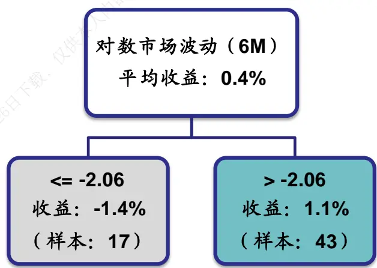
资料来源：Wind，海通证券研究所

观察上图不难发现，对数波动率对于近 5年的市值因子收益具有较为明显的区分效果。在全区间来看，市值因子月均溢价为 0.40%，但是在对数波动率高于阈值的情况下，市值因子月均溢价为 1.10%，小盘效应较为明显，而在对数波动率低于阈值的情况下，因子月均溢价为-1.40%，大盘效应较为明显。下图展示了各环境下市值因子的净值走势。

图2 市值因子净值走势与环境划分（5年数据）
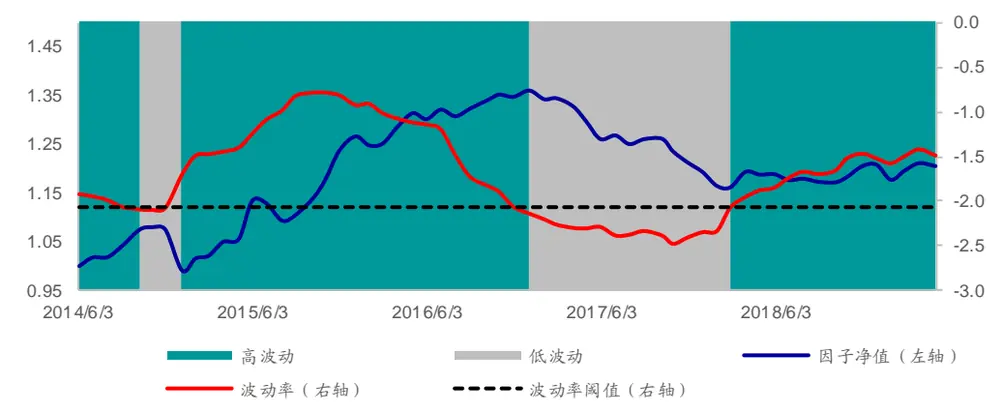
资料来源：Wind，海通证券研究所

观察上图可知，回归树模型对于近 5年的市场环境有着较好的区分。当然，我们也可将分析区间进一步延长至 10 年。下图展示了使用近 10 年数据计算得到的市值因子择时回归树。

图3 因子择时回归树（市值因子）（10年数据）（2014.06~2019.07）
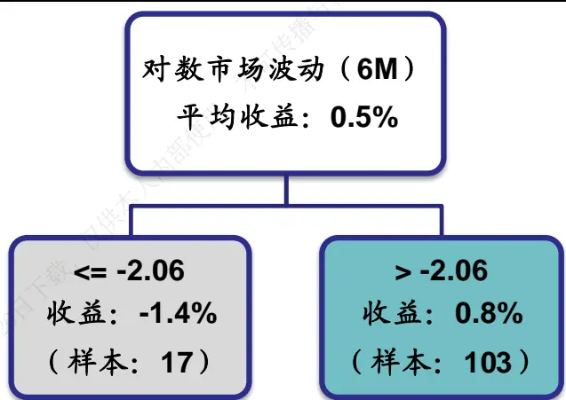
资料来源：Wind，海通证券研究所

基于近 年的数据可以发现，对数市场波动对于因子收益依旧具有较为明显的区分效果。在全区间来看，市值因子月均溢价为 0.50%，但是在对数市场波动高于阈值的情况下，市值因子月均溢价为 0.80%，小盘效应较为明显，而在对数波动率低于阈值的情况下，因子月均溢价为 ，大盘效应较为明显。下图展示了各环境下市值因子的净值走势。

图4 市值因子净值走势与环境划分（10年数据）
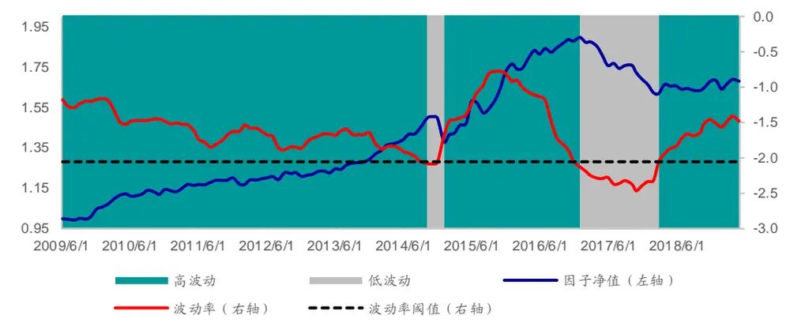
资料来源： ，海通证券研究所

## 2.2 因子择时回归树（衰减）

若投资者认为近期数据更能够体现出市场近期的逻辑，并应该给予更高的关注度，我们可在回归树模型中引入衰减加权的特性。下图展示了基于近 5 年数据并引入衰减特性后得到的因子择时回归树。

图5 衰减加权因子择时回归树（市值因子）（5年数据）（2014.06~2019.07）
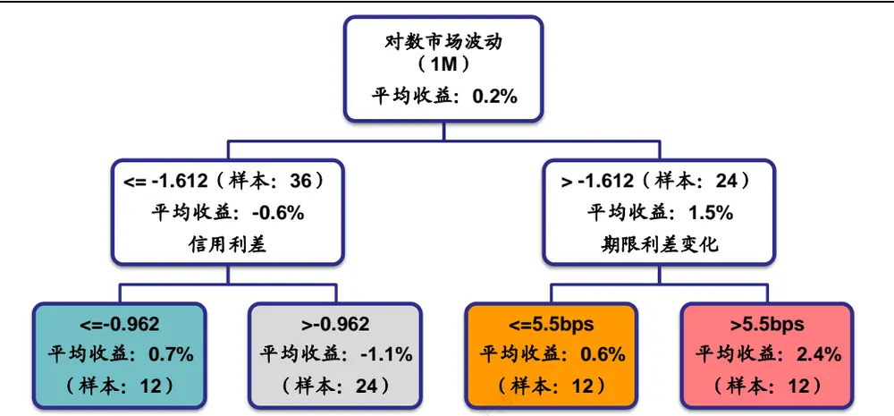
资料来源：Wind，海通证券研究所

观察上图首先可以发现，波动率依旧是择时模型首要关注的择时变量。在对数波动率高于阈值的情况下，因子月均溢价为 1.50%，小盘效应更加明显，而在对数波动率低于阈值的情况下，因子月均溢价为-0.60%，大盘效应更加明显。

此外，还可以发现，在不同的波动率环境下，模型后续关注的择时变量并不相同。在高波的环境下，择时模型会进一步观察期限利差变化。在期限利差扩大幅度高于阈值，短期流动性向好的情况下，因子月均溢价会进一步上升至 ，小盘效应极为明显，而在期限利差扩大幅度低于阈值的情况下，因子月均溢价仅有 0.60%。

在低波环境下，择时模型会进一步观察信用利差。在信用利差高于阈值，投资者风险偏好较低的情况下，因子月均溢价为-1.10%，大盘效应极为明显，而在信用利差低于阈值的情况下，因子月均溢价为 0.70%。下图展示了因子净值在不同市场环境下的走势。

图6 市值因子净值走势与环境划分（5年数据）（衰减加权模型）
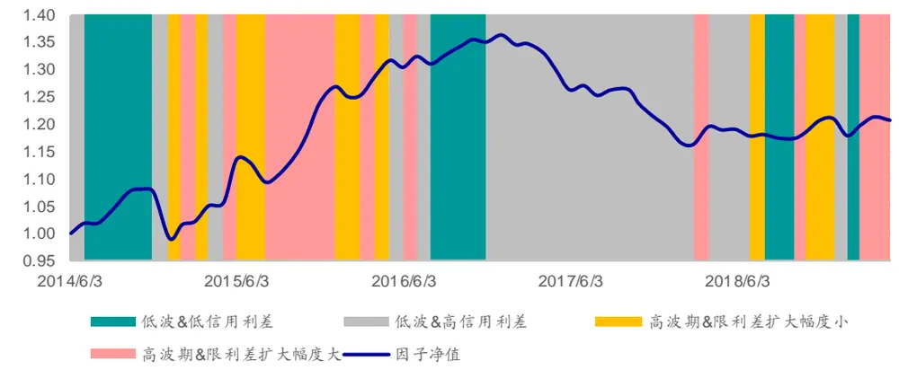
资料来源：Wind，海通证券研究所

观察上图可以发现，在引入了衰减加权的特性后，模型对于近期数据具有更好的拟合，市场环境的划分也更加灵活。

## 2.3 本章小结

本章以市值因子为例，使用近 年以及近 年的数据构建了因子择时回归树。从结果来看，模型能够协助投资者寻找对于因子收益具有较好收益区分效果的因子择时变量，并且回归树给出的因子择时规则易于理解。在情景因子择时研究中，该模型能够帮助投资者寻找情景划分的思路。

此外，模型还具有较强的扩展性，可通过引入衰减加权的特性，提升近期观察的权重，从而使得最终模型对于近期数据具有更高的拟合度。

## 3. 因子方向性择时

回归决策树模型不仅能够协助投资者进行历史环境的划分，还可以协助进行因子方向性择时。本章首先探讨了回归决策树模型在因子方向性择时上的效果，然后引入了防御性因子择时的思路。

## 3.1 因子方向性择时

基于回归决策树模型可构建滚动模型进行因子方向性择时，具体步骤如下：

1） 每个月基于历史 5 年数据训练回归决策树；

2） 基于当前择时变量以及回归决策树得到因子收益预测；

3） 根据因子收益预测方向，在相应的方向上暴露 1单位敞口。

下图对比展示了回归树因子择时组合、衰减回归树因子择时组合以及长期持有 1 单位小市值敞口的组合的累计溢价。

图7 长期持有组合与回归树因子择时组合（市值因子）
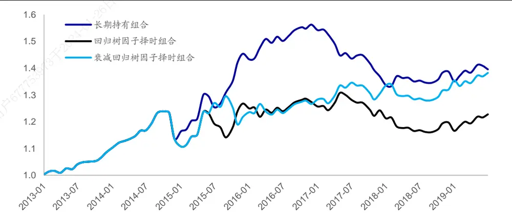
资料来源：Wind，海通证券研究所

对比三个组合可以发现，长期持有组合的收益性更强，但是波动性同样较强。在年市值因子转向的过程中，长期持有组合出现了巨大的回撤，两个因子择时组合的回撤相对更小。虽然两择时组合在 年的回撤更小，但是择时组合在市值因子表现强势的 2015 以及 2016 年中却明显弱于长期持有组合。下表对比展示了三个组合在 2013 年至 2019 年间不同年度的月均收益。

表 1 长期持有组合与回归树因子择时组合（市值因子）

| 模型名称 | 2013 | 2014 | 2015 | 2016 | 2017 | 2018 | 截至 2019年7月 |
| --- | --- | --- | --- | --- | --- | --- | --- |
| 长期持有 | 0.69% | 0.41% | 2.11% | 0.61% | -1.09% | 0.11% | 0.10% |
| 回归树因子择时 | 0.69% | 0.41% | 0.97% | 0.05% | -0.19% | -0.30% | 0.37% |
| 衰减回归树因子择时 | 0.69% | 0.41% | 0.64% | 0.34% | 0.26% | 0.11% | 0.67% |

资料来源：Wind，海通证券研究所

总体来看，择时模型虽然在因子收益拐点处具有一定的灵活性，但是模型同样会因为频繁择时而在收益动量性较强的时段中损失收益。因此，放弃因子收益动量模型并完全切换至回归树择时模型并不现实。

## 3.2 防御性因子择时

基于回归树因子择时模型“灵活但缺乏稳健性”的特点，可尝试引入防御性因子择时的理念，将回归树择时模型与因子收益动量模型结合在一起。所谓的防御性因子择时，可理解为在预判因子收益存在较大不确定性时，关闭因子敞口，不承担风险，也不尝试获取收益。由于因子择时最终面向的是多因子模型，因此投资者并没有必要对于每个因子在每个月都有精准的预判。因此，对于确定性较高的因子暴露敞口，而控制不确定性较强的因子，是一种更加稳健的择时思路。

在常见的因子择时模型中，模型目标是在每个月都正确判断因子的收益方向。这会导致模型在因子的方向预判上频繁变化，并产生损失。但是在防御性因子择时模型中，模型目标是在不确定的情况下控制因子敞口，因此即使判断错误，所产生的损失也会低于反向暴露敞口。

本文通过引入双模型一致性判断来实现防御性因子择时。以因子方向性择时为例，可构建以下流程：

1） 基于历史数据得到因子收益动量模型预测结果；

2） 基于历史数据训练回归树，并基于最新择时变量得到回归树因子择时模型预测结果；

3） 判断因子收益动量模型预测结果与回归树因子择时模型预测结果的收益预测方向是否一致。若一致，则在相应的方向上暴露 1单位因子敞口，若不一致，则将当期因子敞口设定为 0。

下图以市值因子为例，展示了 12 个月、24 个月因子收益动量预测模型以及叠加了回归树因子择时模型、衰减回归树因子择时模型后的防御性因子择时模型的组合净值走势。

图8 12个月因子收益动量与防御性因子择时（市值因子）
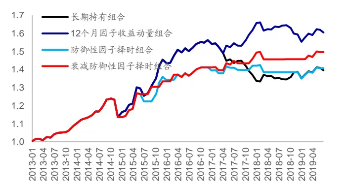
资料来源：Wind，海通证券研究所

图9 24个月因子收益动量与防御性因子择时（市值因子）
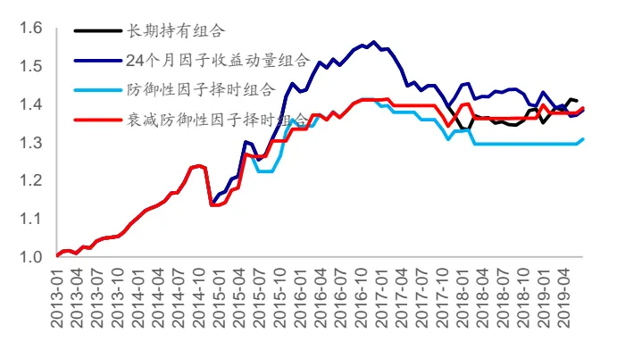
资料来源：Wind，海通证券研究所

观察上图可以发现，防御性因子择时模型具有更强的稳定性。在 2017 年以来，防御性因子择时模型常会出现敞口设定为 0的情况。下表分别对比了因子收益动量预测模型以及相应的防御性因子择时模型的分年度月均收益。

表 2 因子收益动量模型与防御性因子择时模型（市值因子）

| 年度 | 长期持有 | 12个月动量 | 防御性因子择时 | 衰减 防御性因子择时 | 24个月动量 | 防御性因子择时 | 衰减 防御性因子择时 |
| --- | --- | --- | --- | --- | --- | --- | --- |
| 2013 | 0.69% | 0.69% | 0.69% | 0.69% | 0.69% | 0.69% | 0.69% |
| 2014 | 0.41% | 0.41% | 0.41% | 0.41% | 0.41% | 0.41% | 0.41% |
| 2015 | 2.11% | 2.11% | 1.54% | 1.37% | 2.11% | 1.54% | 1.37% |
| 2016 | 0.61% | 0.61% | 0.33% | 0.47% | 0.61% | 0.33% | 0.47% |
| 2017 | -1.09% | 0.30% | 0.05% | 0.28% | -0.81% | -0.50% | -0.28% |
| 2018 | 0.11% | -0.11% | -0.21% | 0.00% | -0.11% | -0.21% | 0.00% |
| 截至 2019年7月 | 0.10% | 0.10% | 0.24% | 0.39% | -0.10% | 0.14% | 0.28% |

资料来源：Wind，海通证券研究所

总体来看，防御性因子择时模型兼顾了稳健性与灵活性。下表进一步对比展示了因子收益动量模型与防御性因子择时模型在其他因子上的表现。（下列因子已进行过正交化处理。）

表 3 因子收益动量模型与防御性因子择时模型（换手率因子）

| 年度 | 长期持有 | 12个月动量 | 防御性因子择时 | 衰减 防御性因子择时 | 24个月动量 | 防御性因子择时 | 衰减 防御性因子择时 |
| --- | --- | --- | --- | --- | --- | --- | --- |
| 2013 | 0.13% | -0.15% | 0.00% | -0.16% | 0.13% | 0.14% | -0.03% |
| 2014 | 0.44% | 0.44% | 0.34% | 0.34% | 0.44% | 0.34% | 0.34% |
| 2015 | 0.39% | 0.39% | 0.37% | 0.30% | 0.39% | 0.37% | 0.30% |
| 2016 | 0.64% | 0.64% | 0.33% | 0.54% | 0.64% | 0.33% | 0.54% |
| 2017 | 0.39% | 0.39% | 0.24% | 0.31% | 0.39% | 0.24% | 0.31% |
| 2018 | 0.51% | 0.51% | 0.51% | 0.51% | 0.51% | 0.51% | 0.51% |
| 截至 2019年7月 | 0.02% | 0.02% | 0.02% | 0.02% | 0.02% | 0.02% | 0.02% |

资料来源： ，海通证券研究所

表 4 因子收益动量模型与防御性因子择时模型（反转因子）

| 年度 | 长期持有 | 12个月动量 | 防御性因子择时 | 衰减 防御性因子择时 | 24个月动量 | 防御性因子择时 | 衰减 防御性因子择时 |
| --- | --- | --- | --- | --- | --- | --- | --- |
| 2013 | -0.01% | -0.01% | -0.09% | -0.01% | -0.01% | -0.09% | -0.01% |
| 2014 | 0.26% | 0.12% | 0.14% | 0.26% | 0.26% | 0.21% | 0.33% |
| 2015 | 1.35% | 1.35% | 1.25% | 1.02% | 1.35% | 1.25% | 1.02% |
| 2016 | 0.49% | 0.49% | 0.37% | 0.41% | 0.49% | 0.37% | 0.41% |
| 2017 | -0.07% | -0.21% | -0.17% | -0.12% | -0.07% | -0.10% | -0.05% |
| 2018 | 0.35% | -0.05% | 0.07% | -0.03% | 0.35% | 0.27% | 0.17% |
| 截至 2019年7月 | 1.04% | 1.04% | 0.62% | 1.04% | 1.04% | 0.62% | 1.04% |

资料来源：Wind，海通证券研究所

表 5 因子收益动量模型与防御性因子择时模型（系统波动占比因子）

| 年度 | 长期持有 | 12个月动量 | 防御性因子择时 | 衰减 防御性因子择时 | 24个月动量 | 防御性因子择时 | 衰减 防御性因子择时 |
| --- | --- | --- | --- | --- | --- | --- | --- |
| 2013 | 0.45% | 0.45% | 0.19% | 0.42% | 0.45% | 0.19% | 0.42% |
| 2014 | 0.48% | 0.48% | 0.32% | 0.31% | 0.48% | 0.32% | 0.31% |
| 2015 | 0.46% | 0.46% | 0.47% | 0.48% | 0.46% | 0.47% | 0.48% |
| 2016 | 0.12% | 0.12% | 0.12% | 0.10% | 0.12% | 0.12% | 0.10% |
| 2017 | 0.06% | -0.27% | -0.15% | 0.01% | 0.06% | 0.02% | 0.17% |
| 2018 | -0.01% | -0.05% | -0.01% | -0.02% | -0.17% | -0.07% | -0.08% |
| 截至 2019年7月 | 0.20% | -0.10% | 0.00% | 0.04% | 0.20% | 0.16% | 0.19% |

资料来源： ，海通证券研究所

表 6 因子收益动量模型与防御性因子择时模型（盈利因子）

| 年度 | 长期持有 | 12个月动量 | 防御性因子择时 | 衰减 防御性因子择时 | 24 个月动量 | 防御性因子择时 | 衰减 防御性因子择时 |
| --- | --- | --- | --- | --- | --- | --- | --- |
| 2013 | 0.53% | 0.53% | 0.53% | 0.46% | 0.53% | 0.53% | 0.46% |
| 2014 | -0.04% | -0.04% | -0.04% | -0.01% | -0.04% | -0.04% | -0.01% |
| 2015 | 0.11% | 0.01% | 0.02% | 0.04% | 0.11% | 0.07% | 0.10% |
| 2016 | 0.51% | 0.51% | 0.56% | 0.47% | 0.51% | 0.56% | 0.47% |
| 2017 | 0.73% | 0.73% | 0.66% | 0.66% | 0.73% | 0.66% | 0.66% |
| 2018 | 0.52% | 0.52% | 0.61% | 0.58% | 0.52% | 0.61% | 0.58% |
| 截至 2019年7月 | 0.44% | 0.44% | 0.44% | 0.44% | 0.44% | 0.44% | 0.44% |

资料来源：Wind，海通证券研究所

## 3.3 本章小结

本章讨论了回归树因子择时模型在因子方向性择时中应用。回测结果表明，回归树因子择时模型具有一定的灵活性，但是这种灵活性会使得模型在因子收益动量性较强时损失较多的收益。因此可考虑使用防御性因子择时的思路，将因子收益动量模型与回归树因子择时模型结合在一起，从而更加稳健地实现因子择时。

## 4. 多因子模型回测

防御性因子择时模型一方面可以被用于因子方向性择时，另一方面也可被用于因子权重分配。传统的因子加权方法，如 IC 法、最大化单期 IC 法或者回归法，都是基于因子收益预测的幅度进行因子权重的分配。因此，在进行因子权重调整时，同样可应用防御性因子择时的思路，进行因子权重分配。不妨以回归法加权为例，我们可构建以下因子加权机制：

1） 基于历史数据得到因子收益动量模型的预测结果；

2） 基于历史数据训练回归树，并基于最新择时变量得到回归树因子择时模型的预测结果；

3） 判断因子收益动量预测结果与回归树预测结果的收益方向是否一致，若不一致，则当期因子最终收益预测设定为 0，若一致，则使用回归树因子择时模型的预测结果作为最终收益预测；

4） 基于因子最终收益预测以及当期因子值到股票收益预期。

可使用市值、中盘、换手率、反转、波动、估值、盈利以及盈利成长因子构建最大化收益预期 TOP100 组合，并对比收益动量模型以及防御性因子择时模型下组合的收益表现。下图对比展示了各组合相对于中证 500 指数的相对强弱。

图10 12个月因子收益动量组合与防御性因子择时组合
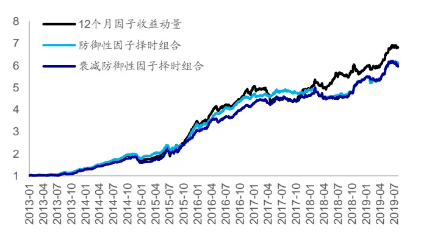
资料来源：Wind，海通证券研究所

图11 24个月因子收益动量组合与防御性因子择时组合
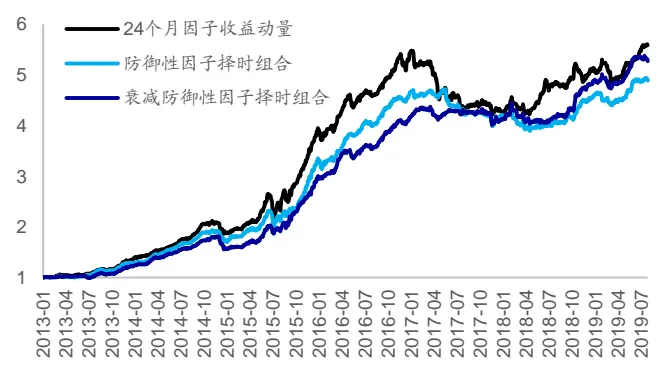
资料来源：Wind，海通证券研究所

简单来看，组合在应用了防御性因子择时模型后，年化收益出现了一定幅度的下降，但是组合在部分年份的收益表现产生了明显改善。对于灵活度较低的 24 个月因子收益动量模型，在叠加了防御性因子择时模型后，其组合表现在 2017 年产生了较为明显的改善。对于灵活度较高的 12 个月因子收益动量模型，在叠加了防御性因子择时模型后，其组合表现同样在 2017 年产生了一定幅度的改善。下表展示了各组合的分年度收益以及相对于中证 500 的超额收益。

表 7 因子收益动量组合与防御性因子择时组合（相对中证 500超额收益）

|  | 12个月动量 | 防御性因子择时 | 衰减 防御性因子择时 | 24个月动量 | 防御性因子择时 | 衰减 防御性因子择时 |
| --- | --- | --- | --- | --- | --- | --- |
| 2013 | 33.3% | 37.5% | 31.8% | 44.9% | 34.3% | 27.7% |
| 2014 | 47.9% | 47.3% | 36.6% | 50.5% | 46.0% | 37.5% |
| 2015 | 144.3% | 127.3% | 130.8% | 156.2% | 135.0% | 129.9% |
| 2016 | 36.7% | 32.8% | 32.0% | 31.3% | 32.5% | 32.3% |
| 2017 | -1.8% | 4.5% | 8.7% | -21.4% | -10.0% | -1.2% |
| 2018 | 12.9% | 7.0% | 11.3% | 13.5% | 6.1% | 12.3% |
| 截至 2019年7月 | 18.9% | 14.7% | 11.3% | 10.3% | 8.0% | 9.5% |
| 全区间 | 35.8% | 33.4% | 32.9% | 31.7% | 28.9% | 30.4% |

资料来源：Wind，海通证券研究所

## 5. 总结与展望

本文在前期因子择时研究的基础之上，放松了模型关于因子择时变量与因子收益线性相关的前提假设，尝试从情景化因子择时的角度构建因子择时模型。基于这种需求，决策树模型具有较强的适用性。本文重点探讨了基于回归树的因子择时模型。

首先，回归树可协助投资者筛选有效因子择时变量，对于历史环境进行划分，并总结出简单直观的因子择时规则。模型同样具有较好的拓展性，投资者也可引入衰减加权的特性，从而提升模型对于近期数据的拟合度。

其次，回归树因子择时模型可用于因子方向性择时。回测结果表明，该模型虽然具有一定的灵活性，但是择时模型会在因子收益动量性较强的时段损失一定的收益。因此，可考虑引入防御性因子择时的思路，将因子收益动量模型与回归树因子择时模型结合在一起，从而更加稳健地进行因子择时。

最后，回归树因子择时模型同样可用于因子权重分配。回测结果表明，虽然防御性因子择时组合全区间年化收益略低于因子收益动量组合，但是组合在部分年份的收益表现产生了明显改善。对于灵活度较低的 24个月因子收益动量模型，在叠加了防御性因子择时模型后，其组合表现在 2017 年产生了较为明显的改善。对于灵活度较高的 12 个月因子收益动量模型，在叠加了防御性因子择时模型后，其组合表现同样在 2017 年产生了一定幅度的改善。

回归树模型虽然具有较为直观的优点，但是模型的稳健性依旧存在提升空间。投资者可通过集成化的方法（Ensemble Method）提升回归树的稳健性。简单来说，可通过平均法（Averaging）或者提升法（Boosting）进一步改进回归树模型。

## 6. 风险提示

市场系统性风险、资产流动性风险以及政策变动风险会对策略表现产生较大影响。

# 信息披露

分析师声明

[Table冯佳睿yst金融工程研究团队s]

袁林青金融工程研究团队

本人具有中国证券业协会授予的证券投资咨询执业资格，以勤勉的职业态度，独立、客观地出具本报告。本报告所采用的数据和信息均来自市场公开信息，本人不保证该等信息的准确性或完整性。分析逻辑基于作者的职业理解，清晰准确地反映了作者的研究观点，结论不受任何第三方的授意或影响，特此声明。

## 法律声明

本报告仅供海通证券股份有限公司（以下简称“本公司”）的客户使用。本公司不会因接收人收到本报告而视其为客户。在任何情况下，本报告中的信息或所表述的意见并不构成对任何人的投资建议。在任何情况下，本公司不对任何人因使用本报告中的任何内容所引致的任何损失负任何责任。

本报告所载的资料、意见及推测仅反映本公司于发布本报告当日的判断，本报告所指的证券或投资标的的价格、价值及投资收入可能载会波动。在不同时期，本公司可发出与本报告所载资料、意见及推测不一致的报告。

市场有风险，投资需谨慎。本报告所载的信息、材料及结论只提供特定客户作参考，不构成投资建议，也没有考虑到个别客户特殊的可投资目标、财务状况或需要。客户应考虑本报告中的任何意见或建议是否符合其特定状况。在法律许可的情况下，海通证券及其所属不关联机构可能会持有报告中提到的公司所发行的证券并进行交易，还可能为这些公司提供投资银行服务或其他服务。用

本报告仅向特定客户传送，未经海通证券研究所书面授权，本研究报告的任何部分均不得以任何方式制作任何形式的拷贝、复印件或内复制品，或再次分发给任何其他人，或以任何侵犯本公司版权的其他方式使用。所有本报告中使用的商标、服务标记及标记均为本公本司的商标、服务标记及标记。如欲引用或转载本文内容，务必联络海通证券研究所并获得许可，并需注明出处为海通证券研究所，且仅不得对本文进行有悖原意的引用和删改。载，

根据中国证监会核发的经营证券业务许可，海通证券股份有限公司的经营范围包括证券投资咨询业务。日

## 海通证券股份有限公司研究所[Table_PeopleInfo]

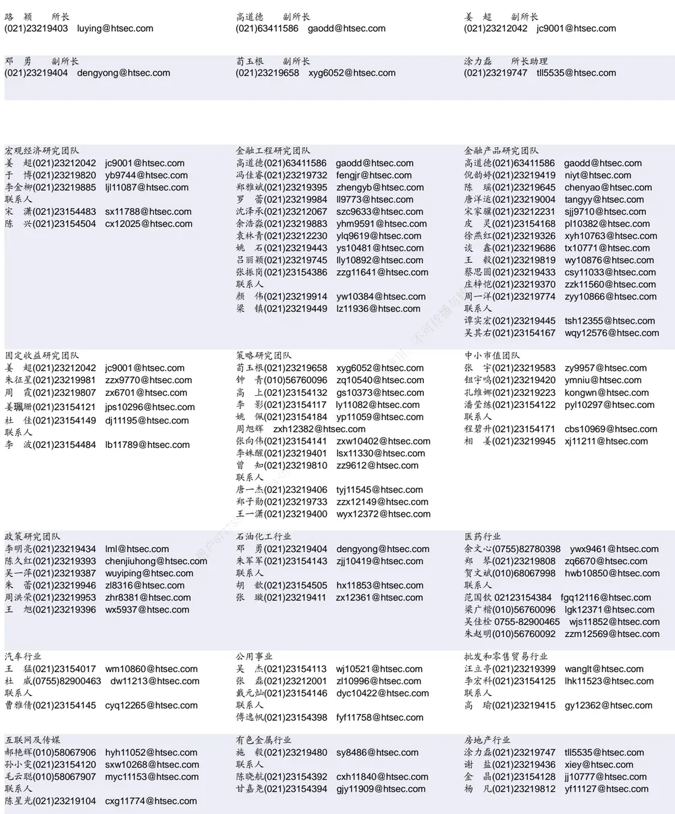

| 建筑建材行业 |  | 机械行业 | 钢铁行业 |
| --- | --- | --- | --- |
| 冯晨阳(021)23212081 fcy10886@htsec.com |  | 余炜超(021)23219816 swc11480@htsec.com | 刘彦奇(021)23219391 liuyq@htsec.com |
| 潘莹练(021)23154122 申 浩(021)23154114 sh12219@htsec.com | 2 pyl10297@htsec.com | 耿 耘(021)23219814 gy10234@htsec.com 杨 震(021)23154124 yz10334@htsec.com | 刘 璇(0755)82900465 lx11212@htsec.com 联系人 |
|  |  | 沈伟杰(021)23219963 swj11496@htsec.com 周 丹 zd12213@htsec.com | 周慧琳(021)23154399 zhl11756@htsec.com |

| 家电行业 | 造纸轻工行业 |  |
| --- | --- | --- |
| 陈子仪(021)23219244 chenzy@htsec.com |  | 衣桢永(021)23212208 yzy12003@htsec.com |
| 李 阳(021)23154382 ly11194@htsec.com |  |  |
| 朱默辰(021)23154383 zmc11316@htsec.com |  |  |
| 联系人 |  |  |
| 刘 璐(021)23214390 II11838@htsec.com |  |  |

| 电子行业 |  | 煤炭行业 | 电力设备及新能源行业 |  |
| --- | --- | --- | --- | --- |
|  | 陈 平(021)23219646 cp9808@htsec.com | 李 淼(010)58067998 Im10779@htsec.com | 张一弛(021)23219402 zyc9637@htsec.com |  |
|  | 尹 苓(021)23154119 yl11569@htsec.com | 戴元灿(021)23154146 dyc10422@htsec.com | 房 青(021)23219692 fangq@htsec.com |  |
|  | 谢 磊(021)23212214 xl10881@htsec.com | 吴 杰(021)23154113 wj10521@htsec.com | 曾 彪(021)23154148 zb10242@htsec.com |  |
|  |  | 联系人 王 涛(021)23219760 wt12363@htsec.com | 徐柏乔(021)23219171 xbq6583@htsec.com 联系人 |  |
|  |  |  |  | 陈佳彬(021)23154513 cjb11782@htsec.com |

| 基础化工行业 |  | 计算机行业 | 通信行业 |  |
| --- | --- | --- | --- | --- |
| 刘 威(0755)82764281 Iw10053@htsec.com |  | 郑宏达(021)23219392 zhd10834@htsec.com | 朱劲松(010)50949926 | zjs10213@htsec.com |
| 刘海荣(021)23154130 Ihr10342@htsec.com |  | 杨 林(021)23154174 yl11036@htsec.com | 余伟民(010)50949926 | ywm11574@htsec.com |
| 张翠翠(021)23214397 | zcc11726@htsec.com | 鲁 立(021)23154138 II11383@htsec.com | 张峥青(021)23219383 | zzq11650@htsec.com |
| 孙维容(021)23219431 swr12178@htsec.com |  | 于成龙 ycl12224@htsec.com | 张 弋 01050949962 zy12258@htsec.com |  |
| 联系人 |  | 黄竞晶(021)23154131 hjj10361@htsec.com |  |  |
| 李 智(021)23219392 Iz11785@htsec.com |  | 洪 琳(021)23154137 hl11570@htsec.com |  |  |

| 非银行金融行业 |  | 交通运输行业 |  | 纺织服装行业 |
| --- | --- | --- | --- | --- |
|  | 孙 婷(010)50949926 st9998@htsec.com |  | 虞 楠(021)23219382 yun@htsec.com | 梁 希(021)23219407 lx11040@htsec.com |
|  | 何 婷(021)23219634 ht10515@htsec.com |  | 罗月江（010）56760091 lyj12399@htsec.com | 联系人 |
|  | 李芳洲(021)23154127 Ifz11585@htsec.com |  | 李 轩(021)23154652 Ix12671@htsec.com | 盛 开(021)23154510 sk11787@htsec.com |
| 联系人 |  |  | 联系人 | 刘 溢(021)23219748 ly12337@htsec.com |
| 任广博 rgb12695@htsec.com |  |  | 李 丹(021)23154401 Id11766@htsec.com |  |

| 建筑工程行业 |  | 农林牧渔行业 | 食品饮料行业 |
| --- | --- | --- | --- |
| 杜市伟(0755)82945368 dsw11227@htsec.com |  | 丁 频(021)23219405 dingpin@htsec.com | 闻宏伟(010)58067941 whw9587@htsec.com |
| 张欣劫 zxj12156@htsec.com |  | 陈雪丽(021)23219164 cxl9730@htsec.com | 成 珊(021)23212207 cs9703@htsec.com |
| 李富华(021)23154134 Ifh12225@htsec.com | 联系人 | 陈 阳(021)23212041 cy10867@htsec.com | 唐 宇(021)23219389 ty11049@htsec.com |

| 军工行业 |  | 银行行业 |  | 社会服务行业 |  |
| --- | --- | --- | --- | --- | --- |
|  | 蒋 俊(021)23154170 jj11200@htsec.com |  | 孙 婷(010)50949926 st9998@htsec.com |  | 汪立亭(021)23219399 wanglt@htsec.com |
|  | 刘 磊(010)50949922 II11322@htsec.com |  | 解巍巍 xww12276@htsec.com |  | 陈扬扬(021)23219671 cyy10636@htsec.com |
| 张恒亘 zhx10170@htsec.com |  |  | 林加力(021)23214395 ljl12245@htsec.com | 许樱之 xyz11630@htsec.com |  |
| 联系人 |  | 谭敏沂(0755)82900489 tmy10908@htsec.com |  |  |  |

## 研究所销售团队

蔡铁清(0755)82775962 ctq5979@htsec.com

伏财勇(0755)23607963 fcy7498@htsec.com

辜丽娟(0755)83253022 gulj@htsec.com

刘晶晶(0755)83255933 liujj4900@htsec.com

王雅清(0755)83254133 wyq10541@htsec.com

饶 伟(0755)82775282 rw10588@htsec.com

欧阳梦楚(0755)23617160

oymc11039@htsec.com

巩柏含 gbh11537@htsec.com

上海地区销售团队
胡雪梅(021)23219385 huxm@htsec.com
朱 健(021)23219592 zhuj@htsec.com
季唯佳(021)23219384 jiwj@htsec.com
黄 毓(021)23219410 huangyu@htsec.com
漆冠男(021)23219281 qgn10768@htsec.com
胡宇欣(021)23154192 hyx10493@htsec.com
黄 诚(021)23219397 hc10482@htsec.com
毛文英(021)23219373 mwy10474@htsec.com
马晓男 mxn11376@htsec.com
杨祎昕(021)23212268 yyx10310@htsec.com
张思宇 zsy11797@htsec.com
慈晓聪(021)23219989 cxc11643@htsec.com
王朝领 wcl11854@htsec.com
邵亚杰 23214650 syj12493@htsec.com
李 寅 021-23219691 ly12488@htsec.com
北京地区销售团队
殷怡琦(010)58067988 yyq9989@htsec.com
郭 楠 010-5806 7936 gn12384@htsec.com
张丽萱(010)58067931 zlx11191@htsec.com
杨羽莎(010)58067977 yys10962@htsec.com
杜 飞 df12021@htsec.com
张 杨(021)23219442 zy9937@htsec.com
何 嘉(010)58067929 hj12311@htsec.com
李 婕 lj12330@htsec.com
欧阳亚群 oyyq12331@htsec.com
郭金垚 gjy12727@htsec.com

海通证券股份有限公司研究所

地址：上海市黄浦区广东路 689号海通证券大厦 9楼

电话：（021）23219000

传真：（021）23219392

网址：www.htsec.com