## [Tab相关研究

Table_ReportInfo]《科技强国，龙头领航：国内首只科技龙

头 ETF 全解析》2019.08.14

《选股因子系列研究（五十二）——基于

回归树的因子择时模型》2019.08.06

《量化研究——投资决策的起点》

2019.08.08

分析师:冯佳睿

Tel:(021)23219732

Email:fengjr@htsec.com

证书:S0850512080006

分析师:张振岗

Tel:(021)23154386

Email:zzg11641@htsec.com

证书:S0850519050001

联系人:梁镇

Tel:(021)23219449

Email:lz11936@htsec.com

# 选股因子系列研究（五十三）——上市公司关系网因子

## 投资要点：

关系网因子的基本逻辑。上市公司在股票市场中并非独立存在，而是通过产业链上下游、债务、股权等多种关系相互关联，共同构建了股票市场的复杂网络。针对这种现象，我们可以通过某种关联关系将上市公司连成一张关系网，并借助图论的算法从中提取特征，得到另类的关系网因子。常见的方法是从度、中心性、溢出效应三个维度出发，提炼上市公司关系网蕴含的增量信息。

- 股价相关性网络。我们以全部 股两两之间过去 个交易日的收益率相关性构建股价相关性网络，度、中心性和动量溢出三个因子均具有显著的选股效果。

度因子的 和 分别为 和 ，胜率都在 以上， 值都在 6 以上。正交后，IC和 Rank IC 有所下降，分别为 0.018 和 0.023，胜率分别为 67%和 70.50%，T 值分别为 4.43 和 4.98。

2. 中心性因子的 IC 和 Rank IC 分别为 0.048 和 0.071，胜率都在 80%以上，T值分别为 8.37 和 10.4。正交后，IC 和 Rank IC 分别为 0.014 和 0.022，胜率分别为 68.8%和 72.30%，T 值分别为 4.65 和 5.97。

3. 采用短期高相关性构建的溢出效应因子，IC 和 IR 分别为-0.048 和-1.654，胜率为 33%，T 值为-5.03；Rank IC 和对应的 IR 分别为-0.056 和-1.816。正交后，IC 显著下降，均值为-0.021。IR 为-1.759，胜率为 28.60%，T 值为-5.35。

- 主营业务收入网络。利用有相同主营业务产品的公司构建主营业务收入网络，从中得到的溢出效应因子的有效性较弱。正交后（非行业中性），因子的 IC 和 RankIC 分别为 0.014 和 0.015，对应的 IR 分别为 0.953 和 1.028，胜率在 60%左右，T 值在 3 左右。

股价相关性与行业概念板块。股价相关性网络可以与行业、概念板块的从属关系叠加，构建新的动量溢出效应因子，表现相对原始因子有进一步提升。其中，一级行业动量溢出效应因子正交后（非行业中性）的 IC 和 ICIR 分别为 0.024 和0.946，剔除短周期收益相关性排名前 40%的股票后，IC 和 ICIR 提升至 0.027和 1.18。概念板块的动量溢出效应因子正交后的 IC 和 ICIR 分别为 0.024 和1.671，通过叠加股价相关性，IC 和 ICIR 分别提升至 0.027 和 1.991，T 值也从5.08 提升至 6.06。

- 风险提示。因子有效性变化风险，历史统计规律失效风险。

## 1. 关系网因子的基本逻辑

在金融科技（Fintech）和数据挖掘研究系列报告——《知识图谱的构建与应用》中，我们介绍了知识图谱在金融投资领域的应用，其中包括构建图网络因子。这类因子的基本逻辑是，上市公司在股票市场中并非独立存在，而是通过产业链上下游、债务、股权等多种关系相互关联，共同构建了股票市场的复杂网络。下图即为以工商银行为中心的上市公司关系网示例。

图1 上市公司关系网示例
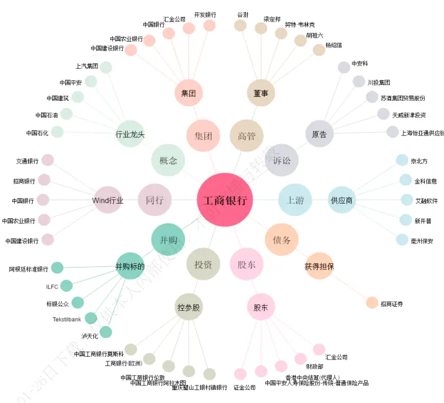
资料来源：Wind，海通证券研究所

基于这样一个逻辑，我们可以采用某种关联关系将上市公司连成一张关系网，并通过图论的算法提取网络特征，从中挖掘不同于传统因子的信息。

例如，我们在《量化研究新思维》系列报告中推荐过的《Logistics of Supply ChainAlpha》（德银，2015）一文，就采用社交网络和网络搜索中的启发式算法，将供应链网络作为一个整体进行分析。视其中的企业为网络的节点，企业间的供应链关系为有向边，从而将非结构化的数据转换为图网络，并构建了以下三大类因子。

图2 德银供应链网络因子
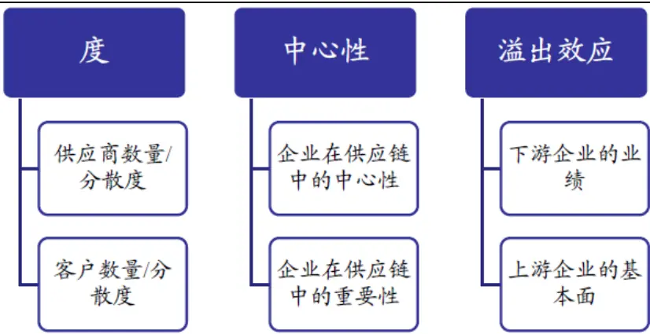
资料来源：《Logistics of Supply Chain Alpha》，海通证券研究所

文中的检验表明，上述三类因子在控制了行业和市值后，依然具备显著的 Alpha。其中，业绩动量因子、供应商分散度因子的月度平均多空收益均在 0.60%左右，年化值可达 7.8%，与 PE、ROE等传统因子的表现十分接近。

同时，由于这类因子包含上市公司的关联结构，故能提供财报和量价因子以外的信息。而特征提取方式的不同，也保证了不同网络因子之间的低相关。以上这些优点，均是对当前量化研究的有益补充。

## 2. A股关系网因子

获取上市公司关联关系的基础多为非结构化的另类数据，如，应收账款、股权等。但根据Wind 等现有的数据源，此类数据在 A股市场上的覆盖率不足 40%，很难构建适用于所有股票的因子，较为适合设计一些事件驱动类策略。因此，本文采用了覆盖度较高、且易于实现结构化的股价相关性和主营业务收入相似度，构建关系网因子，并验证它们在 A股市场上的效果。

本文的回测区间为 2010 年 1 月至 2019 年 5 月，换仓频率为月度，样本空间为剔除 ST、停牌、涨停以及上市不满 6个月的股票后的剩余部分。在对关系网因子进行正交处理时，需要剔除行业、市值、非线性市值、换手、反转、特异度、非流动性、盈利、成长和估值的影响。其中，行业因子使用中信一级行业分类。

## 2.1 股价相关性网络

## 2.1.1网络构建与因子定义

计算全部 A股两两之间过去 N 个交易日的收益率相关系数，保留绝对值在某一阈值之上的结果，作为上市公司互相关联的边，构建股价相关性网络。下图给出了剔除低相关性的边后，A公司与 B、C、D 公司之间的关系。

图3 股价相关性网络构建示例
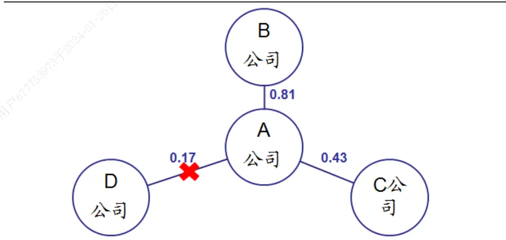
资料来源：Wind，海通证券研究所

参考德银报告定义供应链因子的方式，我们对任意一个公司 u计算如下三类因子。

- 度：股价相关性网络中，与公司 u有关联关系的公司数量。

- 中心性：股价相关性网络中，公司 u出现在任意两个公司 s与 t之间的最短路径上的频率。

$$
c(u)=\sum_{s,t\neq u}\frac{n_{st}(u)}{N_{st}}.
$$

其中，c(u)为公司 u 的中心性， $\mathsf{n}_{\mathsf{st}}(\mathsf{u})$ 是从 s 到 t 且穿过节点 u 的最短路径数，$\mathsf{N}_{\mathsf{st}}$ 是从 s 到 t 的最短路径总数。

- 溢出效应因子：股价相关性网络中，与公司 u有关联关系的公司，过去 N日的平均涨幅。

下文的研究发现，溢出效应因子在 T 取不同值时，将会表现出截然不同的特征。

## 2.1.2 度和中心性因子

如下表所示，度和中心性因子均具备显著为正的选股效果。前者的 IC和 Rank IC分别为 0.046 和 0.056，对应的 IR 分别达到 2.071 和 2.269，胜率在 70%以上，T 值都在 6 以上。后者的 IC 和 Rank IC 分别为 0.048 和 0.071，对应的 IR 分别为 2.751 和 3.419，胜率都在 80%以上，T 值分别为 8.37 和 10.4。

表 1 度和中心性因子的 IC（2010.01-2019.05）

| 度 |  |  |  | 中心性 |  |
| --- | --- | --- | --- | --- | --- |
| 原始因子 |  | IC | Rank IC | IC | Rank IC |
|  | 均值 | 0.046 | 0.056 | 0.048 | 0.071 |
|  | IR | 2.071 | 2.269 | 2.751 | 3.419 |
|  | 胜率 | 72.30% | 71.40% | 83.00% | 85.70% |
|  | T | 6.3 | 6.9 | 8.37 | 10.4 |
| 正交后(剔除行 业、风格、行为） |  | IC | Rank IC | IC | Rank IC |
|  | 均值 | 0.018 | 0.023 | 0.014 | 0.022 |
|  | IR | 1.456 | 1.638 | 1.529 | 1.964 |
|  | 胜率 | 67.00% | 70.50% | 68.80% | 72.30% |
|  | T | 4.43 | 4.98 | 4.65 | 5.97 |

资料来源：Wind，海通证券研究所

虽然原始因子的表现突出，但与 9个常用选股因子和行业因子正交后，两者的 IC均大幅下降。其中，正交后的度因子 IC 和 Rank IC 分别为 0.018 和 0.023，对应的 IR分别为 1.456 和 1.638，胜率分别为 67.00%和 70.50%，T 值分别为 4.43 和 4.98。正交后的中心性因子 IC 和 Rank IC 分别为 0.014 和 0.022，对应的 IR 分别为 1.529 和1.964，胜率分别为 68.80%和 72.30%，T 值分别为 4.65 和 5.97。

下表展示了度和中心性与其他因子的相关性。从原始因子来看，它们与特异度因子的相关性较高，相关系数分别为 0.35 和 0.55。从 IC 来看，两者与多数因子都具有中等程度的相关性。其中，又数和反转的相关性最强，相关系数分别为 0.45 和-0.30。

表 2 度和中心性因子的相关性（2010.01-2019.05）

|  |  | 市值 | 非线性市值 | 换手 | 反转 | 特异度 | 非流动性 | 盈利 | 成长 | 估值 |
| --- | --- | --- | --- | --- | --- | --- | --- | --- | --- | --- |
| 度 | 因子值 | -0.04 | 0.15 | -0.09 | -0.11 | 0.35 | 0.06 | -0.03 | -0.01 | -0.08 |
|  | IC | -0.22 | 0.11 | 0.15 | -0.30 | 0.45 | 0.10 | -0.20 | -0.09 | 0.11 |
| 中心性 | 因子值 | -0.14 | 0.06 | -0.16 | -0.21 | 0.55 | 0.15 | -0.03 | -0.01 | -0.21 |
|  | IC | -0.34 | 0.30 | 0.02 | -0.46 | 0.51 | 0.24 | -0.35 | -0.20 | -0.21 |

资料来源：Wind，海通证券研究所

由此可见，度和中心性因子对股票预期收益的预测性，在很大程度上可被其他因子解释。故将这些因子的影响经正交剔除后，度和中心性因子的 出现了明显下降（见表1）。但我们也应看到，两个因子正交后的 IC依然保持在 0.02 左右，T 值均大于 4，胜率在 2/3 以上。这表明两者还是提供了信息的补充，初步展示出挖掘图网络因子的价值。

根据因子值从小到大等分成 10 组后，度和中心性因子正交前后的组间月均收益都呈现单调性。正交前，月均收益分别达到 1.7%和 1.9%；正交后，下降至 0.4%左右。

图4 度因子的分组收益（2010.01-2019.05）
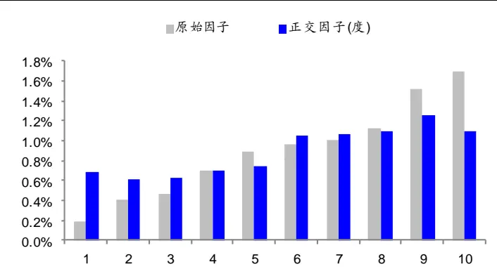
资料来源：Wind，海通证券研究所

图5 中心性因子的分组收益（2010.01-2019.05）
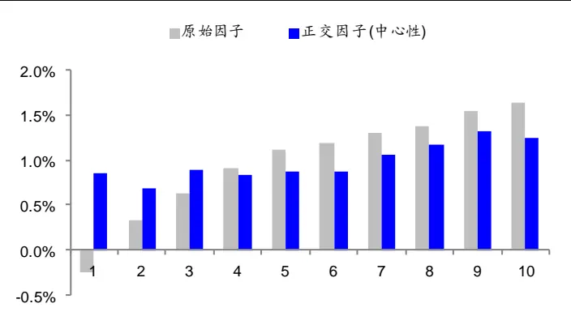
资料来源：Wind，海通证券研究所

如下表所示，若单独将正交后的度和中心性因子放入包含行业和风格、行为等 9 个因子的模型中，它们的月均溢价分别为 18bps和 15bps，T 值分别为 4.53 和 4.41，胜率分别为 67.6%和 69.4%。若同时将两者放入，因子溢价及显著性几乎没有发生改变。

表 3 正交后的度和中心性因子的截面溢价（2010.01-2019.05）

| 模型（包含风格、行为共9个因子） | 度 | 中心性 |
| --- | --- | --- |
| 1 | 18 bps (4.53) 67.6% |  |
| 2 |  | 15 bps (4.41) 69.4% |
| 3 本人内部使用， | 17 bps (4.30) 64.9% | 15 bps (3.97) 64.9% |

资料来源：Wind，海通证券研究所

以下 4图分别给出了正交后的度和中心性因子的累计截面溢价和多空组合累计净值。总体来看，两者在 2016 年之前，表现较为稳定。但近两年，因子的有效性均出现了一定程度的下降。

图6 正交后的度因子的截面溢价时间序列
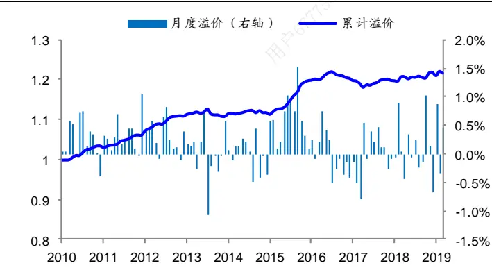
资料来源：Wind，海通证券研究所

图7 正交后的度因子的多空组合累计净值
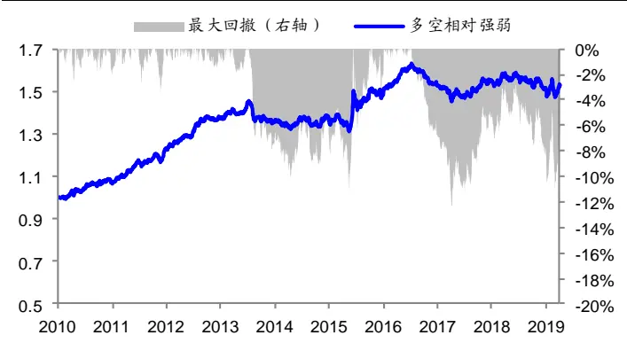
资料来源：Wind，海通证券研究所

图8 正交后的中心性因子的截面溢价时间序列
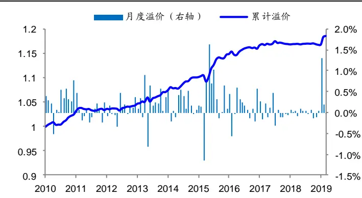
资料来源：Wind，海通证券研究所

图9 正交后的中心性因子的多空组合累计净值
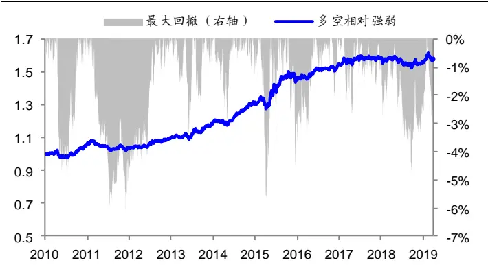
资料来源：Wind，海通证券研究所

## 2.1.3 短周期溢出效应因子的反转特征

在构建股价相关性网络时，涉及一个参数，即过去 N 日的收益率。在本小节中，我们将 N设定为 20，考察短周期下的溢出效应。

下表详细展示了因子的 IC等特征。其中，“NetR_50”表示和每个股票相关系数绝对值最大的 50%股票，过去 20 日的平均涨幅，以此类推。

表 4 短周期溢出效应因子的反转特征（IC，2010.01-2019.05）

|  |  |  | NetR_50 NetR_40 |  | NetR_30 |  | NetR_20 |  | NetR_10 |  |
| --- | --- | --- | --- | --- | --- | --- | --- | --- | --- | --- |
| 原始因子 |  | IC | Rank IC | IC | Rank IC | IC | Rank IC | IC Rank IC | IC | Rank IC |
|  | 均值 | -0.043 | -0.05 | -0.044 | -0.052 | -0.045 | -0.053 -0.046 | -0.055 | -0.048 | -0.056 |
|  | IR | -1.694 | -1.754 | -1.728 | -1.795 -1.71 | -1.8 | -1.681 | -1.8 | -1.654 | -1.816 |
|  | 胜率 | 34.80% | 28.60% | 33.00% | 27.70% | 31.20% 26.80% | 33.00% | 27.70% | 33.00% | 27.70% |
|  | T | -5.15 | -5.34 | -5.25 | -5.46 | -5.2 -5.47 | -5.11 | -5.48 | -5.03 | -5.52 |
|  |  | IC | Rank IC | IC | Rank IC | IC Rank IC | IC | Rank IC | IC | Rank IC |
| 正交后 (剔除行 业、风格、 行为） | 均值 | -0.017 | -0.02 | -0.018 | -0.021 | -0.019 | -0.022 | -0.02 -0.023 | -0.021 | -0.024 |
|  | IR | -1.672 | -1.709 | -1.751 | -1.772 -1.755 | -1.812 | -1.732 | -1.85 | -1.759 | -1.864 |
|  | 胜率 | 29.50% | 28.60% | 27.70% | 29.50% | 27.70% | 26.80% 28.60% | 29.50% | 28.60% | 25.00% |
|  | T | -5.09 | -5.2 | -5.33 | -5.39 | -5.34 -5.51 | -5.27 | -5.63 | -5.35 | -5.67 |

资料来源：Wind，海通证券研究所

由上表可见，短周期溢出效应因子和预期收益呈显著负相关。而且，随着对高相关性定义的逐渐严格，IC 的绝对值不断上升。

以 NetR_10 为例，IC 和 IR 分别为-0.048 和-1.654，胜率为 33%，T 值为-5.03；Rank IC 和对应的 IR分别为-0.056 和-1.816。在与常用的因子正交后，IC显著下降，月度均值为-0.021。但因子的稳定性得到改善，IR 为-1.759，胜率为 28.60%，T 值为-5.35。

由下表的相关系数可见，短周期溢出效应因子与反转的相关性最强（0.38）。但从上表正交后的结果来看，除了反转现象本身，这个因子还提供了额外的信息。

从因子 IC的相关性来看，除与反转高相关外，短周期溢出效应因子与其他 8个因子都具有中等程度的相关性，这也解释了正交后 IC的大幅下降。

表 5 短周期溢出效应因子的相关性（以 NetR_10 为例，2010.01-2019.05）

|  | 市值 | 非线性市值 | 换手 | 反转 | 特异度 | 非流动性 | 盈利 | 成长 | 估值 |
| --- | --- | --- | --- | --- | --- | --- | --- | --- | --- |
| NetR_10 | 0.09 | -0.10 | 0.04 | 0.38 | -0.27 | -0.06 | 0.04 | 0.02 | 0.05 |
| IC | 0.38 | -0.25 | -0.13 | 0.75 | -0.49 | -0.29 | 0.23 | 0.25 | -0.14 |

资料来源：Wind，海通证券研究所

如下图所示，正交前后，短周期溢出效应因子的分组收益都呈现出显著的单调性。其中，正交前的多空月均收益可以达到 1.77%，正交后下降至 0.74%。

图10 短周期溢出效应因子的分组收益（以 NetR_10 为例，2010.01-2019.05）
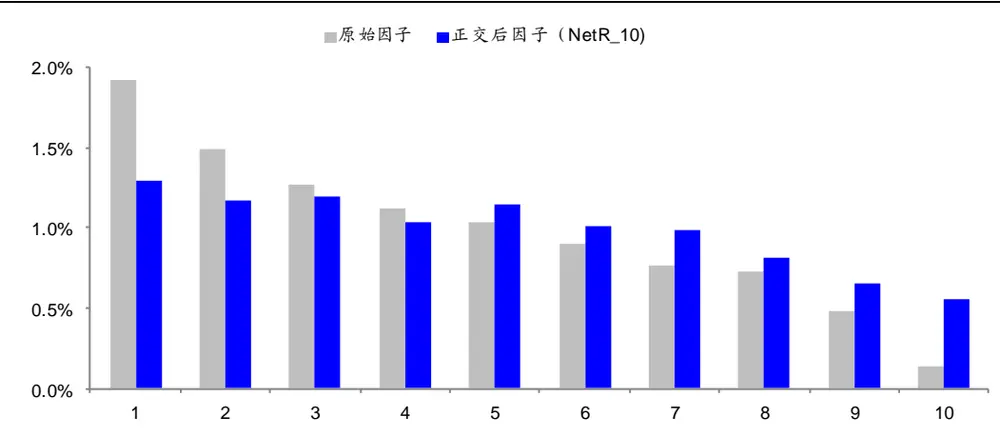
资料来源： ，海通证券研究所

在包含风格和行为共 9个因子的模型中，加入短周期溢出效应因子后，其月均溢价约为-20bps。其中，NetR_10 的月均溢价为-21bps，T 值为-5.41，胜率为 27%。

表 6 短周期溢出效应因子的截面溢价（2010.01-2019.05）

| 模型（包含风格、行为共9个因子） | NetR_50 | NetR_40 | NetR_30 | NetR_20 | NetR_10 |
| --- | --- | --- | --- | --- | --- |
| 1 | -19 bps (-5.6) 29.70% |  |  |  |  |
| 2 仅供本 |  | -19 bps (-5.67) 31.50% |  |  |  |
| 3 |  |  | -20 bps (-5.55) 28.80% |  |  |
|  |  |  |  | -21 bps (-5.47) |  |
| 5 |  |  |  | 29.70% | -21 bps (-5.41) 27.00% |

资料来源：Wind，海通证券研究所

以下两图分别展示了 NetR_10 的截面溢价和多空收益累计净值。长期来看，该因子的表现较为稳定。但由于和反转因子的相关性较高，它在 2017 年出现了持续的失效，多空组合的回撤幅度较大。

图11 正交后的短周期溢出效应因子的截面溢价时间序列
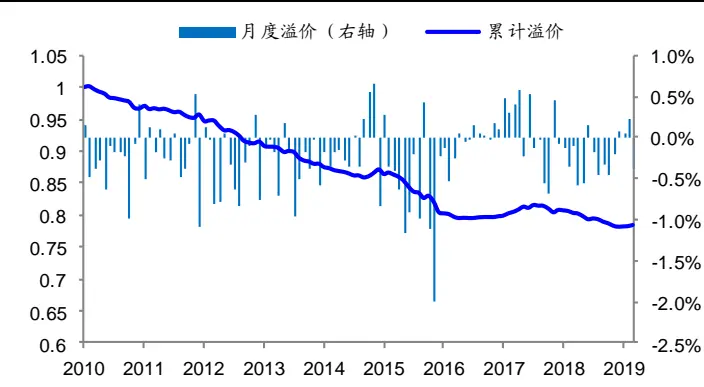
资料来源：Wind，海通证券研究所

图12 正交后的短周期溢出效应因子的多空组合累计净值
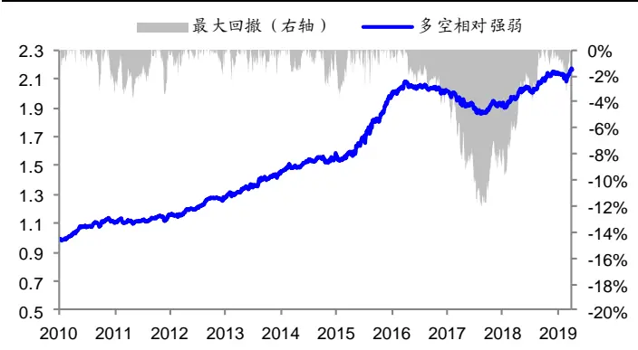
资料来源：Wind，海通证券研究所

## 2.1.4 长周期溢出效应因子的动量特征

我们仿照海外动量因子的构造方法，使用过去 t-12 月到 t-1 月的日收益率计算相关系数，进一步检验长周期溢出效应因子的表现。

下表详细展示了因子的 IC等特征。其中，“NetM_50”表示和每个股票相关系数绝对值最大的 50%股票，过去 20 日的平均涨幅，以此类推。

表 7 长周期溢出效应因子的动量特征（IC，2010.01-2019.05）

| NetM_50 |  |  |  | NetM_40 |  | NetM_30 |  | NetM_20 |  | NetM_10 |  |
| --- | --- | --- | --- | --- | --- | --- | --- | --- | --- | --- | --- |
| 原始因子 |  | IC | Rank IC | IC | Rank IC | IC | Rank IC | IC | Rank IC | IC | Rank IC |
|  | 均值 | 0 | -0.014 | 0.001 | -0.014 | 0.001 | -0.015 | -0.001 | -0.018 | -0.002 | -0.019 |
|  | IR | 0.005 | -0.307 | 0.028 | -0.304 | 0.027 | -0.33 | -0.012 | -0.37 | -0.035 | -0.388 |
|  | 胜率 | 52.70% | 48.20% | 52.70% | 48.20% | 51.80% | 47.30% | 50.90% | 47.30% | 50.00% | 50.00% |
|  | T | 0.01 | -0.93 | 0.09 | -0.93 | 0.08 | -1 | -0.04 | -1.13 | -0.11 | -1.18 |
| 正交后（剔 除行业、风 格、行为） |  | IC | Rank IC | IC | Rank IC | IC | Rank IC | IC | Rank IC | IC | Rank IC |
|  | 均值 | 0.016 | 0.012 | 0.019 | 0.014 | 0.021 | 0.015 | 0.022 | 0.015 | 0.023 | 0.015 |
|  | IR | 0.68 | 0.488 | 0.784 | 0.549 | 0.879 | 0.601 | 0.895 | 0.573 | 0.962 | 0.62 |
|  | 胜率 | 55.40% | 55.40% | 58.00% | 57.10% | 60.70% | 57.10% | 59.80% | 58.00% | 59.80% | 58.90% |
|  | T | 2.07 | 1.49 | 2.38 | 1.67 | 2.67 | 1.83 | 2.72 | 1.74 | 2.93 | 1.89 |

资料来源： ，海通证券研究所

总体来看，长周期溢出效应因子的选股有效性较弱。以 NetM_10 为例，正交前，因子 IC 和 Rank IC 分别为-0.002 和-0.19，T 值分别为-0.11 和-1.18；正交后，因子 IC和 Rank IC 的均值上升至 0.023 和 0.015，T 值分别为 2.93 和 1.89。

下表为长周期溢出效应因子与常用因子的相关性。除了反转因子，它和其余 8 个因子的相关性都不高。

表 8 长周期溢出效应因子的相关性（以 NetM_10 为例，2010.01-2019.05）

|  | 市值 | 非线性市值 | 换手 | 反转 | 特异度 | 非流动性 | 盈利 | 成长 | 估值 |
| --- | --- | --- | --- | --- | --- | --- | --- | --- | --- |
| 因子值 | 0.03 | -0.02 | 0.15 | 0.51 | -0.17 | -0.03 | 0.01 | 0.02 | 0.06 |
| IC | 0.22 | -0.16 | 0.11 | 0.74 | -0.36 | -0.23 | 0.12 | 0.19 | -0.01 |

资料来源：Wind，海通证券研究所

按长周期溢出效应因子将所有股票等分成 10 组后，计算每组的月均收益（见下图）。正交前，分组收益几乎没有单调性；正交后，分组收益的单调性较为明显，多空月均收益约为 0.6%。

图13 长周期溢出效应因子的分组收益（以 NetM_10 为例，2010.01-2019.05）
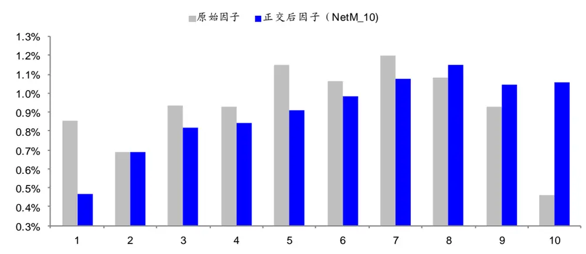
资料来源：Wind，海通证券研究所

如下表所示，长周期溢出效应因子的月均溢价在 12bps 到 18bps 之间。并且，随着对高相关的定义越来越严格，因子的截面溢价逐渐提高。其中，NetM_10 的月均溢价为18bps，胜率为 60.4%。T 值仅为 2.10，表明因子的稳定性稍欠。

表 9 长周期溢出效应因子的截面溢价（2010.01-2019.05）

| 模型（包含风格、行为共9个因子） | NetM_50 | NetM_40 | NetM_30 | NetM_20 | NetM_10 |
| --- | --- | --- | --- | --- | --- |
| 1 | 12 bps (1.49) 55.9% |  |  |  |  |
| 2 |  | 14 bps (1.75) 58.6% |  |  |  |
| 3 |  |  | 16 bps (1.99) 61.3% |  |  |
| 4 |  |  |  | 17 bps (2.00) 60.4% |  |
| 5 |  |  |  |  | 18 bps (2.10) 60.4% |

资料来源：Wind，海通证券研究所

以下两图分别是 NetM_10 的截面溢价和多空组合累计净值。整体来看，因子展现出较为明显的动量特征。如，在 13-14 年的 TMT 行情与 2016 年下半年以来的白马龙头行情中，长周期溢出效应因子的表现都十分出色。

图14 正交后的长周期溢出效应因子的截面溢价时间序列
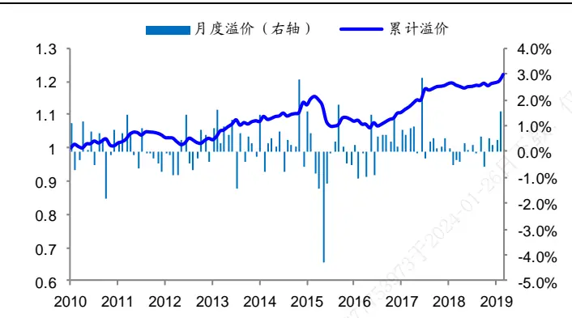
资料来源： ，海通证券研究所

图15 正交后的长周期溢出效应因子的多空组合累计净值
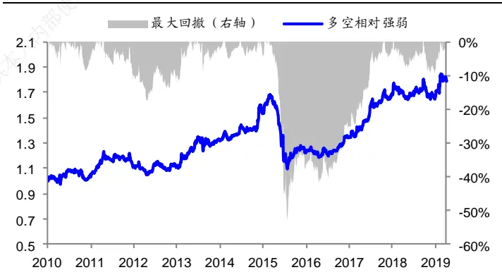
资料来源： ，海通证券研究所

## 2.2 主营业务收入网络

由于股价相关性网络基于收益率构建，不可避免地会与反转等技术面因子较为相似。为了避免因子间的高相关，我们尝试使用上市公司的基本面数据构建关系网。

A股上市公司会在财报中披露主营业务收入的相关数据，在Wind中被分为产品、行业、缴费、地区四种类别。我们根据主营业务收入中的产品类别，构建上市公司主营业务收入网络。即，两个公司间存在相同的主营产品类别，则认为它们存在关联关系。根据上文的因子定义，我们在主营业务收入网络中分别计算度、中心性和溢出效应因子，并分别检验它们的选股有效性。下表展示了溢出效应因子的结果。

表 10 主营业务收入网络中的动量溢出效应（2010.01-2019.05）

| 主营业务产品 |  |  |
| --- | --- | --- |
|  |  | IC Rank IC |
| 原始因子 | 均值 0.007 | 0.005 |
|  | IR | 0.199 0.126 |
|  | 胜率 | 50.00% 50.90% |
|  | T | 0.6 0.38 |
| IC Rank IC |  |  |
| 正交后（非行业中性） | 均值 | 0.014 0.015 |
|  | IR | 0.953 1.028 |
|  | 胜率 | 60.70% 61.60% |
|  | T | 2.9 3.13 |
| 正交后（行业中性） |  | IC Rank IC |
|  | 均值 | 0.007 0.007 |
|  | IR | 0.812 0.813 |
|  | 胜率 | 53.60% 55.40% |
|  | T | 2.47 2.47 |

资料来源：Wind，海通证券研究所

在主营业务收入网络中，存在微弱的动量溢出效应。即，有相同主营产品的公司，股价的变化会有同向的传导现象。但是这种溢出效应，仅存在于非行业中性下的正交因子中。此时，因子的 IC 和 Rank IC 分别为 0.014 和 0.015，对应的 IR 分别为 0.953 和1.028，胜率高于 60%，T 值在 3左右。然而，进一步对因子做行业中性化处理后，IC和 Rank IC大幅下降至 0.007。这一结果也很容易解释，因为同一行业中的公司更容易有相同的主营产品，使得主营业务收入网络接近于另一种形式的行业分类。

## 2.3 关系网因子的相关性

上文分别基于股价相关性和主营业务产品建立网络，得到了度、中心性和溢出效应三类因子。着重考察了它们和股票预期收益的关系，并分析了各自与常用因子之间的相关性。本节进一步考察这些关系网因子内部的相关程度，结果如下表所示。

表 11 上市公司关系网因子值的相关性（2010.01-2019.05）

|  | 度 仅供 | 中心性 | NetR_10 | NetM_10 | 主营业务产品 |
| --- | --- | --- | --- | --- | --- |
| 度 | 1 |  |  |  |  |
| 中心性 | 0.40 | 1 |  |  |  |
| NetR_10 | -0.30 | -0.20 | 1 |  |  |
| NetM_10 | -0.07 | -0.14 | 0.40 | 1 |  |
| 主营业务产品 | -0.01 | -0.03 | 0.11 | 0.19 | 1 |

资料来源：Wind，海通证券研究所

度和中心性，以及长（NetM_10）、短（NetR_10）周期的溢出效应，这两组因子内部存在中等程度的相关性，而其余因子之间的相关性都较弱。结合上文的结论，我们认为，对 A股上市公司构建关系网，并从中得到的因子，确实能提供传统分析尚未包含的信息。

下表展示的是因子 IC的相关性。其中，主营业务产品的溢出效应因子和长（NetM_10）、短（NetR_10）周期的溢出效应因子高度相关；中心性与溢出效应因子之间呈现较为明显的负相关。

表 12 上市公司关系网因子 IC 相关性（2010.01-2019.05）

|  | 度 | 中心性 | NetR_10 | NetM_10 | 主营业务产品 |
| --- | --- | --- | --- | --- | --- |
| 度 | 1 |  |  |  |  |
| 中心性 | 0.20 | 1 |  |  |  |
| NetR_10 | -0.43 | -0.42 | 1 |  |  |
| NetM_10 | -0.20 | -0.38 | 0.78 | 1 |  |
| 主营业务产品 | -0.05 | -0.36 | 0.68 | 0.72 | 1 |

资料来源：Wind，海通证券研究所

## 3. 利用股价相关性网络增强行业、概念板块的溢出效应

海通证券金融工程团队前期的报告——《行业、概念板块的动量溢出效应》证实了同属于一个行业或概念板块的公司，股价间存在动量溢出效应。按照本文的逻辑，行业或板块本质上也是一种关系网络。由前文的分析可知，不同的网络可能蕴含不一样的信息。因此，一个自然的想法是，可否将多个关系网叠加，从而提升单个网络下的因子表现。本节融合了股价相关性网络与行业、概念板块，试图增强原始的动量溢出效应。

## 3.1 股价相关性网络对行业溢出效应的增强

以 ind1M代表一级行业（中信行业分类）的动量溢出因子，即每只股票所属的一级行业，在剔除自身后剩余股票上个月的平均涨幅。类似地，令 ind2M 和 ind3M 分别代表二级和三级行业的动量溢出因子。该因子与股票次月收益间存在显著的正相关性，即，所谓的动量溢出效应。

在将股价相关性网络和行业、概念板块的溢出效应叠加之前，我们先通过分析这两类关系网因子的相关性，以寻找更好的增强方式。

如下表所示，长周期溢出效应因子（NetM_10）与行业动量溢出因子的相关系数接近 40%，IC 的相关系数更是超过 75%。这是因为，在较长的周期下，高相关的股票更有可能来自同一行业。所以，股价相关性网络中的长周期动量溢出效应很大程度上就是行业的动量溢出效应，两者叠加并无意义。

表 13 股价相关性网络和行业、概念板块中的动量溢出效应相关性（2010.01-2019.05）

|  | ind1M | ind2M | ind3M |
| --- | --- | --- | --- |
| NetM_10 | 因子值 0.38 内部使 | 0.38 | 0.35 |
|  | ICX 0.77 | 0.76 | 0.75 |
| NetR_10 | 因子值 | 0.19 0.19 | 0.18 |
|  | IC 0.69 | 0.71 | 0.71 |

资料来源：Wind，海通证券研究所

相反，不论是个股本身还是短周期的溢出效应因子，都呈现出显著的反转特征。因此，在计算某个股票的行业动量溢出因子时，不妨先剔除那些短期内与其高相关的股票，降低反转特征的影响，达到增强动量溢出效应的效果。

如下表所示，正交后的一级行业动量溢出因子（ind1M）的 IC 和 ICIR分别为 0.024和 0.946，剔除短周期下，收益率相关系数的绝对值最大的 40%股票后（ind1M_r40），IC 和 ICIR 分别提升至 0.027 和 1.18。

表 14 一级行业剔出高相关股票后的动量溢出效应（2010.01-2019.05）

|  | ind1M |  |  | ind1M_r10 |  | ind1M_r20 |  | ind1M_r30 |  | ind1M_r40 |  |
| --- | --- | --- | --- | --- | --- | --- | --- | --- | --- | --- | --- |
| 原始因子 |  | IC | Rank IC 0.005 | IC 0.012 | Rank IC | IC | Rank IC | IC | Rank IC 0.013 | IC | Rank IC 0.014 |
|  | 均值 | 0.007 0.199 | 0.126 | 0.33 | 0.008 | 0.015 | 0.011 | 0.017 |  | 0.018 |  |
|  | IR 胜率 | 50.00% | 50.90% | 50.90% | 0.24 | 0.423 | 0.316 | 0.497 | 0.381 | 0.572 | 0.439 |
|  | T | 0.6 | 0.38 |  | 50.90% | 52.70% | 50.00% | 53.60% | 53.60% | 53.60% | 52.70% |
|  |  |  |  | 1 | 0.73 | 1.29 | 0.96 | 1.51 | 1.16 | 1.74 | 1.33 |
| 正交后（非 行业中性） |  | IC | Rank IC | IC | Rank IC | IC | Rank IC | IC | Rank IC | IC | Rank IC |
|  | 均值 | 0.024 | 0.022 | 0.025 | 0.024 | 0.026 | 0.025 | 0.027 | 0.026 | 0.027 | 0.026 |
|  | IR | 0.946 | 0.879 | 1.006 | 0.953 | 1.072 | 1.022 | 1.114 | 1.07 | 1.18 | 1.132 |
|  | 胜率 | 58.00% | 58.00% | 59.80% | 60.70% | 61.60% | 61.60% | 63.40% | 60.70% | 62.50% | 60.70% |
|  | T | 2.88 | 2.67 | 3.06 | 2.9 | 3.26 | 3.11 | 3.39 | 3.25 | 3.59 | 3.44 |
| 正交后（行 业中性） |  | IC | Rank IC | IC | Rank IC | IC | Rank IC | IC | Rank IC | IC | Rank IC |
|  | 均值 | 0.002 | -0.021 | 0.006 | 0.008 | 0.009 | 0.011 | 0.008 | 0.009 | 0.009 | 0.009 |
|  | IR | 0.185 | -1.798 | 0.686 | 0.952 | 1.042 | 1.364 | 1.002 | 1.137 | 1.08 | 1.152 |
|  | 胜率 | 53.60% | 32.10% | 56.20% | 55.40% | 58.90% | 61.60% | 59.80% | 63.40% | 61.60% | 60.70% |
|  | T | 0.56 | -5.47 | 2.09 | 2.9 | 3.17 | 4.15 | 3.05 | 3.46 | 3.29 | 3.5 |

资料来源： ，海通证券研究所

## 3.2 股价相关性网络对概念板块溢出效应的增强

概念板块动量溢出因子的计算方式和上一节类似，只需用股票所属的概念板块替代行业分类即可。在叠加股价相关性网络时，对每一个股票，我们并没有采用在概念板块中剔除与其高相关股票的做法。而是把与它低相关的股票作为一个新的概念板块，再和原来的概念板块融合后，计算新的动量溢出因子。这是因为，根据我们的检验，新的低相关板块同样有动量溢出的特征。

以 ConcptM、ConcptM_r10 和 ConcptM_r20 分别代表原始及叠加高相关网络后的概念板块溢出因子，后缀中的数字表示剔除高相关股票的比例。如下表所示，正交后（行业中性）的 ConcptM 因子，IC 和 ICIR 分别为 0.024 和 1.671。叠加股价相关性网络后，IC 和 ICIR 分别提升到 0.027 和 1.991，T 值也从 5.08 提升到 6.06。

表 15 概念板块叠加股价高相关网络的动量溢出效应（2010.01-2019.05）

| ConcptM |  |  |  | ConcptM_r10 |  | ConcptM_r20 |  |
| --- | --- | --- | --- | --- | --- | --- | --- |
| 原始因子 |  | IC | Rank IC | IC | Rank IC | IC | Rank IC |
|  | IC | 0.024 | 0.016 | 0.036 | 0.031 | 0.031 | 0.025 |
|  | ICIR | 0.745 | 0.454 | 1.303 | 0.999 | 0.997 | 0.757 |
|  | 胜率 | 59.80% | 57.10% | 63.40% | 63.40% | 62.50% | 59.80% |
|  | T | 40.20% | 42.90% | 36.60% | 36.60% | 37.50% | 40.20% |
| 正交后(非行业中性) |  | IC | Rank IC | IC | Rank IC | IC | Rank IC |
|  | IC | 0.034 | 0.031 | 0.035 | 0.033 | 0.037 | 0.035 |
|  | ICIR | 1.649 | 1.539 | 1.907 | 1.761 | 1.845 | 1.843 |
|  | 胜率 | 67.90% | 67.00% | 67.90% | 69.60% | 67.00% | 67.90% |
|  | T | 5.02 | 4.68 | 5.46 | 5.46 | 5.61 | 5.61 |
| 正交后（行业中性） |  | IC | Rank IC | IC | Rank IC | IC | Rank IC |
|  | IC | 0.024 | 0.022 | 0.026 | 0.024 | 0.027 | 0.026 |
|  | ICIR | 1.671 | 1.557 | 2.082 | 1.897 | 1.991 | 1.983 |
|  | 胜率 | 70.50% | 67.00% | 75.90% | 74.10% | 74.10% | 71.40% |
|  | T | 5.08 | 4.74 | 5.83 | 5.8 | 6.06 | 6.03 |

资料来源：Wind，海通证券研究所

如下图所示，正交后的 ConcptM_r20 因子的组间收益单调，多空月均收益相比原始因子进一步提升，达到 1.0%左右。

图16 正交后的 ConcptM_r20 因子的分组收益（2010.01-2019.05）
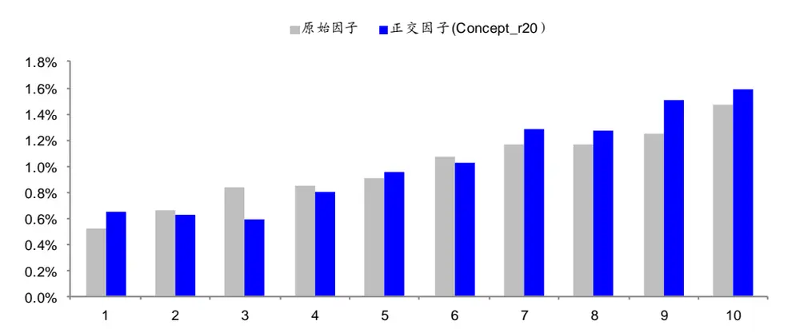
资料来源： ，海通证券研究所

将上述三个概念板块的动量溢出因子逐次放入包含风格、行为共 9个因子的模型中，计算它们的截面溢价，具体结果见下表。

表 16 正交后的概念板块动量溢出因子的截面溢价（2010.01-2019.05）

| 模型（包含风格、行为共9个因子） | ConcptM | ConcptM_r10 | ConcptM_r20 |
| --- | --- | --- | --- |
| 1 | 23 bps (4.61) 71.20% |  |  |
| 2 |  | 26bps (5.47) 74.8% |  |
| 3 |  |  | 25 bps (5.67) 76.6% |

资料来源： ，海通证券研究所

ConcptM_r20 的月均溢价为 25 bps，T 值为 5.67，胜率达到 76.6%。从下图的累计截面溢价和多空组合的累计净值来看，ConcptM_r20 因子整体表现稳定，仅在 2015年的股市异常波动期间出现过明显的回撤。

图17 正交后的 ConcptM_r20因子的截面溢价时间序列
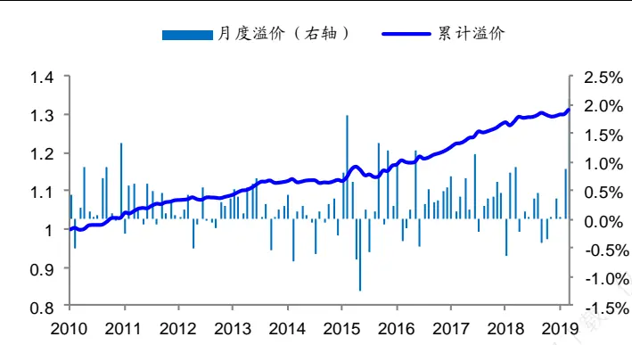
资料来源：Wind，海通证券研究所

图18 正交后的 ConcptM_r20因子的多空组合累计净值
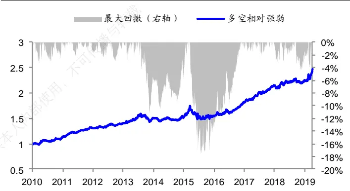
资料来源：Wind，海通证券研究所

## 4. 总结与讨论

本文介绍了上市公司关系网因子的构建思路和若干实际案例。

关系网因子的基本逻辑是上市公司在股票市场中并非独立存在，而是通过产业链上下游、债务、股权等多种关系相互关联，共同构建了股票市场的复杂网络。针对这种现象，我们可以通过某种关联关系将上市公司连成一张关系网，并借助图论的算法从中提取特征，得到另类的关系网因子。常见的方法是从度、中心性、溢出效应三个维度出发，提炼上市公司关系网蕴含的增量信息。

基于全部 A股两两之间过去 N 个交易日的收益率相关性构建股价相关性网络，由此得到的度、中心性和动量溢出因子均具有显著的选股效果。将有相同主营业务产品的上市公司归为一类，形成主营业务收入网络，动量溢出现象在其中依然存在。此外，股价相关性网络可以与行业、概念板块从属关系叠加，增强动量溢出效应。

在后续报告中，我们会采用更加符合逻辑的基本面信息，如供应链、产业链等，进一步构建上市公司的关系网，并从中探索另类策略，为传统的量化方法提供信息增益。

## 5. 风险提示

因子有效性变化风险，历史统计规律失效风险。

# 信息披露分析师声明

[Table冯佳睿yst金融工程研究团队s]

张振岗金融工程研究团队

本人具有中国证券业协会授予的证券投资咨询执业资格，以勤勉的职业态度，独立、客观地出具本报告。本报告所采用的数据和信息均来自市场公开信息，本人不保证该等信息的准确性或完整性。分析逻辑基于作者的职业理解，清晰准确地反映了作者的研究观点，结论不受任何第三方的授意或影响，特此声明。

## 法律声明

本报告仅供海通证券股份有限公司（以下简称“本公司”）的客户使用。本公司不会因接收人收到本报告而视其为客户。在任何情况下，本报告中的信息或所表述的意见并不构成对任何人的投资建议。在任何情况下，本公司不对任何人因使用本报告中的任何内容所引致的任何损失负任何责任。

本报告所载的资料、意见及推测仅反映本公司于发布本报告当日的判断，本报告所指的证券或投资标的的价格、价值及投资收入可能会特异度。在不同时期，本公司可发出与本报告所载资料、意见及推测不一致的报告。

市场有风险，投资需谨慎。本报告所载的信息、材料及结论只提供特定客户作参考，不构成投资建议，也没有考虑到个别客户特殊的播投资目标、财务状况或需要。客户应考虑本报告中的任何意见或建议是否符合其特定状况。在法律许可的情况下，海通证券及其所属可关联机构可能会持有报告中提到的公司所发行的证券并进行交易，还可能为这些公司提供投资银行服务或其他服务。

本报告仅向特定客户传送，未经海通证券研究所书面授权，本研究报告的任何部分均不得以任何方式制作任何形式的拷贝、复印件或使复制品，或再次分发给任何其他人，或以任何侵犯本公司版权的其他方式使用。所有本报告中使用的商标、服务标记及标记均为本公内司的商标、服务标记及标记。如欲引用或转载本文内容，务必联络海通证券研究所并获得许可，并需注明出处为海通证券研究所，且本不得对本文进行有悖原意的引用和删改。仅

根据中国证监会核发的经营证券业务许可，海通证券股份有限公司的经营范围包括证券投资咨询业务。载

## 海通证券股份有限公司研究所[Table_PeopleInfo]

| 路颖 所长 (021)23219403 luying@htsec.com | 高道德 (021)63411586 | 副所长 gaodd@htsec.com | 姜超 副所长 (021)23212042 jc9001@htsec.com |  |  |  |
| --- | --- | --- | --- | --- | --- | --- |
| 邓勇 副所长 (021)23219404 dengyong@htsec.com | 荀玉根 | 副所长 (021)23219658 xyg6052@htsec.com | 涂力磊 所长助理 (021)23219747 tl15535@htsec.com |  |  |  |
| 姜 超(021)23212042 于 博(021)23219820 李金柳(021)23219885 宋 潇(021)23154483 联系人 陈 兴(021)23154504 应镓娴(021)23219394 lly10892@htsec.com 张振岗(021)23154386 zzg11641@htsec.com | jc9001@htsec.com yb9744@htsec.com ijl11087@htsec.com sx11788@htsec.com cx12025@htsec.com yjx12725@htsec.com 姚 石(021)23219443 吕丽颖(021)23219745 | 金融工程研究团队 高道德(021)63411586 gaodd@htsec.com 冯佳睿(021)23219732 fengjr@htsec.com 郑雅斌(021)23219395 zhengyb@htsec.com 罗 蕾(021)23219984 I19773@htsec.com 余浩淼(021)23219883 yhm9591@htsec.com 袁林青(021)23212230 ylq9619@htsec.com ys10481@htsec.com | 金融产品研究团队 高道德(021)63411586 倪韵婷(021)23219419 陈 瑶(021)23219645 唐洋运(021)23219004 宋家骥(021)23212231 皮 灵(021)23154168 pl10382@htsec.com | gaodd@htsec.com niyt@htsec.com chenyao@htsec.com tangyy@htsec.com sjj9710@htsec.com |  |  |
| 固定收益研究团队 姜 超(021)23212042 jc9001@htsec.com 朱征星(021)23219981 周 霞(021)23219807 zx6701@htsec.com 姜珮珊(021)23154121 | zzx9770@htsec.com | 联系人 颜 伟(021)23219914 梁 镇(021)23219449 策略研究团队 荀玉根(021)23219658 钟 青(010)56760096 | yw10384@htsec.com lz11936@htsec.com 联系人 xyg6052@htsec.com 张 宇(021)23219583 zq10540@htsec.com | 王 毅(021)23219819 wy10876@htsec.com 蔡思圆(021)23219433 csy11033@htsec.com 庄梓恺(021)23219370 zzk11560@htsec.com 周一洋(021)23219774 zyy10866@htsec.com 谭实宏(021)23219445 tsh12355@htsec.com 吴其右(021)23154167 wqy12576@htsec.com 中小市值团队 zy9957@htsec.com |  |  |
| 杜 佳(021)23154149 | jps10296@htsec.com dj11195@htsec.com | 高 上(021)23154132 李 影(021)23154117 | gs10373@htsec.com ly11082@htsec.com | 钮宇鸣(021)23219420 ymniu@htsec.com 孔维娜(021)23219223 kongwn@htsec.com 潘莹练(021)23154122 pyl10297@htsec.com |  |  |
|  |  |  |  | 程碧升(021)23154171 相 姜(021)23219945 |  |  |
|  |  | 姚 佩(021)23154184 |  |  |  |  |
| 李 波(021)23154484 |  |  | yp11059@htsec.com 联系人 |  |  |  |
|  | lb11789@htsec.com wqz12709@htsec.com |  | zxw10402@htsec.com |  |  |  |
|  |  | 周旭辉 zxh12382@htsec.com |  |  |  |  |
| 联系人 |  |  |  | cbs10969@htsec.com |  |  |
|  |  | 张向伟(021)23154141 | lsx11330@htsec.com |  |  |  |
| 王巧喆(021)23154142 |  |  |  | xj11211@htsec.com |  |  |
|  |  | 李姝醒(021)23219401 |  |  |  |  |
|  |  | 曾 知(021)23219810 | zz9612@htsec.com |  |  |  |
|  |  | 联系人 |  |  |  |  |
|  |  | 唐一杰(021)23219406 |  |  |  |  |
|  |  | 郑子勋(021)23219733 | tyj11545@htsec.com |  |  |  |
|  |  | 王一潇(021)23219400 | zzx12149@htsec.com |  |  |  |
|  |  |  | wyx12372@htsec.com |  |  |  |
| 政策研究团队 |  | 石油化工行业 | 医药行业 |  |  |  |
| 李明亮(021)23219434 | Iml@htsec.com | 邓 勇(021)23219404 | dengyong@htsec.com | 余文心(0755)82780398 ywx9461@htsec.com |  |  |
| 陈久红(021)23219393 | chenjiuhong@htsec.com | 朱军军(021)23154143 | zjj10419@htsec.com | 郑 琴(021)23219808 zq6670@htsec.com |  |  |
| 吴一萍(021)23219387 | wuyiping@htsec.com | 胡 歆(021)23154505 |  | 贺文斌(010)68067998 |  |  |
| 朱 蕾(021)23219946 | zl8316@htsec.com |  | hx11853@htsec.com | hwb10850@htsec.com |  |  |
| 周洪荣(021)23219953 | zhr8381@htsec.com | 联系人 | 联系人 |  |  |  |
|  |  | 张 璇(021)23219411 | zx12361@htsec.com | 梁广楷(010)56760096 Igk12371@htsec.com |  |  |
| 王 旭(021)23219396 | wx5937@htsec.com |  |  | 吴佳栓 0755-82900465 wjs11852@htsec.com |  |  |
|  |  |  |  | zzm12569@htsec.com |  |  |
|  |  |  |  | 朱赵明(010)56760092 fgq12116@htsec.com |  |  |
|  |  |  |  | 范国钦02123154384 |  |  |
| 汽车行业 |  | 公用事业 |  |  |  |  |
| 王 猛(021)23154017 wm10860@htsec.com |  | 吴杰(021)23154113 |  | 批发和零售贸易行业 |  |  |
| 杜 威(0755)82900463 dw11213@htsec.com |  | 张 磊(021)23212001 | wj10521@htsec.com | 汪立亭(021)23219399 wanglt@htsec.com |  |  |
| 联系人 |  | 戴元灿(021)23154146 | zl10996@htsec.com | 李宏科(021)23154125 Ihk11523@htsec.com |  |  |
| 曹雅倩(021)23154145 | cyq12265@htsec.com | 联系人 | dyc10422@htsec.com 联系人 |  |  |  |
| 郑 蕾 075523617756 | zl12742@htsec.com | 傅逸帆(021)23154398 |  | 高 瑜(021)23219415 |  |  |
|  |  |  |  | gy12362@htsec.com |  |  |
|  |  |  | fyf11758@htsec.com |  |  |  |
|  |  |  | 房地产行业 |  |  |  |
| 互联网及传媒 |  |  |  |  |  |  |
|  |  | 有色金属行业 |  |  |  |  |
| myc11153@htsec.com |  |  |  |  |  |  |
| 郝艳辉(010)58067906 |  |  |  |  |  |  |
|  |  | 施 毅(021)23219480 sy8486@htsec.com |  |  |  |  |
|  | hyh11052@htsec.com |  |  | 涂力磊(021)23219747 tll5535@htsec.com |  |  |
|  |  |  |  | 谢 盐(021)23219436 xiey@htsec.com |  |  |
| 孙小雯(021)23154120 毛云聪(010)58067907 |  |  | sxw10268@htsec.com |  | 联系人 陈晓航(021)23154392 cxh11840@htsec.com |  |
| 电子行业 |  |  | 煤炭行业 |  | 电力设备及新能源行业 |  |
|  | 陈 平(021)23219646 cp9808@htsec.com |  | 李 淼(010)58067998 Im10779@htsec.com |  | 张一弛(021)23219402 zyc9637@htsec.com |  |
|  | 尹 苓(021)23154119 yl11569@htsec.com |  | 戴元灿(021)23154146 dyc10422@htsec.com |  | 房 青(021)23219692 fangq@htsec.com |  |
|  | 谢 磊(021)23212214 xl10881@htsec.com |  | 吴 杰(021)23154113 wj10521@htsec.com |  | 曾 彪(021)23154148 zb10242@htsec.com |  |
|  |  |  | 联系人 |  | 徐柏乔(021)23219171 xbq6583@htsec.com |  |
|  |  |  | 王 涛(021)23219760 wt12363@htsec.com |  | 联系人 | 陈佳彬(021)23154513 cjb11782@htsec.com |

| 基础化工行业 |  | 计算机行业 |  | 通信行业 |  |
| --- | --- | --- | --- | --- | --- |
| 刘 威(0755)82764281 Iw10053@htsec.com |  | 郑宏达(021)23219392 | zhd10834@htsec.com | 朱劲松(010)50949926 | zjs10213@htsec.com |
| 刘海荣(021)23154130 Ihr10342@htsec.com |  | 杨 林(021)23154174 | yl11036@htsec.com | 余伟民(010)50949926 | ywm11574@htsec.com |
| 张翠翠(021)23214397 | zcc11726@htsec.com | 鲁 立(021)23154138 | II11383@htsec.com | 张峥青(021)23219383 | zzq11650@htsec.com |
| 孙维容(021)23219431 | swr12178@htsec.com | 于成龙 ycl12224@htsec.com |  | 张 弋01050949962 | zy12258@htsec.com |
| 联系人 |  | 黄竞晶(021)23154131 | hjj10361@htsec.com | 联系人 |  |
| 李 智(021)23219392 | lz11785@htsec.com | 洪 琳(021)23154137 | hl11570@htsec.com | 杨彤昕 010-56760095 | ytx12741@htsec.com |

| 非银行金融行业 |  | 交通运输行业 |  | 纺织服装行业 |
| --- | --- | --- | --- | --- |
|  | 孙 婷(010)50949926 st9998@htsec.com |  | 虞 楠(021)23219382 yun@htsec.com | 梁 希(021)23219407 lx11040@htsec.com |
|  | 何 婷(021)23219634 ht10515@htsec.com |  | 罗月江（010）56760091 lyj12399@htsec.com | 联系人 |
|  | 李芳洲(021)23154127 Ifz11585@htsec.com |  | 李 轩(021)23154652 lx12671@htsec.com | 盛 开(021)23154510 sk11787@htsec.com |
| 联系人 |  |  | 联系人 | 刘 溢(021)23219748 ly12337@htsec.com |
| 任广博(021)23154388 rgb12695@htsec.com |  |  | 李 丹(021)23154401 Id11766@htsec.com |  |

| 建筑建材行业 |  | 机械行业 | 钢铁行业 |
| --- | --- | --- | --- |
| 冯晨阳(021)23212081 fcy10886@htsec.com |  | 余炜超(021)23219816 swc11480@htsec.com | 刘彦奇(021)23219391 liuyq@htsec.com |
| 潘莹练(021)23154122 申 浩(021)23154114 sh12219@htsec.com | 2 pyl10297@htsec.com | 耿 耘(021)23219814 gy10234@htsec.com 杨 震(021)23154124 yz10334@htsec.com | 刘 璇(0755)82900465 lx11212@htsec.com 联系人 |
|  |  | 沈伟杰(021)23219963 swj11496@htsec.com | 周慧琳(021)23154399 zhl11756@htsec.com |
|  |  | 周 丹 zd12213@htsec.com |  |

| 建筑工程行业 | 农林牧渔行业 |  | 食品饮料行业 |  |  |
| --- | --- | --- | --- | --- | --- |
| 杜市伟(0755)82945368 dsw11227@htsec.com | 丁 频(021)23219405 | dingpin@htsec.com | 闻宏伟(010)58067941 |  | whw9587@htsec.com |
| 张欣劼 zxj12156@htsec.com | 陈雪丽(021)23219164 | cxl9730@htsec.com | 成 | 珊(021)23212207 | cs9703@htsec.com |
| 李富华(021)23154134 Ifh12225@htsec.com | 陈 阳(021)23212041 | cy10867@htsec.com | 唐 | 宇(021)23219389 | ty11049@htsec.com |

| 军工行业 |  | 银行行业 | 社会服务行业 |
| --- | --- | --- | --- |
| 蒋 俊(021)23154170 jj11200@htsec.com |  | 孙 婷(010)50949926 st9998@htsec.com | 汪立亭(021)23219399 wanglt@htsec.com |
|  | 刘 磊(010)50949922 II11322@htsec.com | 解巍巍 xww12276@htsec.com | 陈扬扬(021)23219671 cyy10636@htsec.com |
| 张恒晅 zhx10170@htsec.com |  | 林加力(021)23214395 ljl12245@htsec.com | 许樱之 xyz11630@htsec.com |
| 联系人 |  | 谭敏沂(0755)82900489 tmy10908@htsec.com |  |

| 家电行业 | 造纸轻工行业 |  |
| --- | --- | --- |
| 陈子仪(021)23219244 chenzy@htsec.com |  | 衣桢永(021)23212208 yzy12003@htsec.com |
| 李 阳(021)23154382 ly11194@htsec.com |  |  |
| 朱默辰(021)23154383 zmc11316@htsec.com |  |  |
| 联系人 |  |  |
| 刘 璐(021)23214390 II11838@htsec.com |  |  |

## 研究所销售团队

深广地区销售团队
蔡铁清(0755)82775962 ctq5979@htsec.com伏财勇(0755)23607963 fcy7498@htsec.com辜丽娟(0755)83253022 gulj@htsec.com
刘晶晶(0755)83255933 liujj4900@htsec.com王雅清(0755)83254133 wyq10541@htsec.com饶 伟(0755)82775282 rw10588@htsec.com欧阳梦楚(0755)23617160
oymc11039@htsec.com
巩柏含 gbh11537@htsec.com
上海地区销售团队
胡雪梅(021)23219385 huxm@htsec.com
朱 健(021)23219592 zhuj@htsec.com
季唯佳(021)23219384 jiwj@htsec.com
黄 毓(021)23219410 huangyu@htsec.com
漆冠男(021)23219281 qgn10768@htsec.com
胡宇欣(021)23154192 hyx10493@htsec.com
黄 诚(021)23219397 hc10482@htsec.com
毛文英(021)23219373 mwy10474@htsec.com
马晓男 mxn11376@htsec.com
杨祎昕(021)23212268 yyx10310@htsec.com
张思宇 zsy11797@htsec.com
慈晓聪(021)23219989 cxc11643@htsec.com
王朝领 wcl11854@htsec.com
邵亚杰 23214650 syj12493@htsec.com
李 寅 021-23219691 ly12488@htsec.com
北京地区销售团队
殷怡琦(010)58067988 yyq9989@htsec.com
郭 楠 010-5806 7936 gn12384@htsec.com
张丽萱(010)58067931 zlx11191@htsec.com
杨羽莎(010)58067977 yys10962@htsec.com
杜 飞 df12021@htsec.com
张 杨(021)23219442 zy9937@htsec.com
何 嘉(010)58067929 hj12311@htsec.com
李 婕 lj12330@htsec.com
欧阳亚群 oyyq12331@htsec.com
郭金垚 gjy12727@htsec.com

海通证券股份有限公司研究所

地址：上海市黄浦区广东路 689号海通证券大厦 9楼

电话：（021）23219000

传真：（021）23219392

网址：www.htsec.com