[Tab相关研究

Table_ReportInfo]《长城久泰沪深 300 投资价值分析》

2019.09.08

《行业轮动系列研究 18——行业的长期

价值与 CAPE 的应用》2019.09.03

《金融科技（ ）和数据挖掘研究

（五）——FactSet供应链数据在 A股上

的应用》2019.08.29

分析师:冯佳睿

Tel:(021)23219732

Email:fengjr@htsec.com

证书:S0850512080006

分析师:罗蕾

Tel:(021)23219984

Email:ll9773@htsec.com

证书:S0850516080002

# 选股因子系列研究（五十四）——资产增长稳定性与资本结构变化

## 投资要点：

本文从上市公司的资产负债表出发，考察公司资产增长及其稳定性、资本结构变化对股票收益的影响。

资产增长。在 股市场，资产增长与股票收益呈现微弱的正相关性。这种现象在一定程度上与经济周期和市场情绪有关。经济增长上行，规模扩张整体呈现动量效应，资产增速越快的公司未来收益表现越优；而经济增长下行时，规模扩张通常被认为不可持续，资产增速越快的公司未来收益表现越差。此外，在市场情绪极度低迷时，资产规模仍保持增加的信息会释放积极信号，资产增速越快的公司，未来收益表现越优。

- 资产增长稳定性。资产增长波动率越高，股票未来收益表现越差。从波动率计算载窗口来看，近期资产变化的波动水平对股票收益的影响更大。与

资本结构。从资本结构来看，在过去 余年间，杠杆率增加的公司，股票收益可表现越优。杠杆率增加与股票收益的正相关关系在一些成长性行业，如电子元器，件、传媒等，表现更为明显。使

- 风险提示。因子有效性变化风险，历史统计规律失效风险。本

本文从上市公司的资产负债表出发，考察公司资产增长及其稳定性、资本结构变化对股票收益的影响。

## 1. 资产增长

海外研究发现，资产项目的变化通常与股票未来收益呈现负相关。

例如，Cooper el.（2008）1等人研究表明，在美股市场，总资产增长率与股票收益呈现显著负相关，低资产增长的股票相对于高资产增长的股票存在 20%左右的年度溢价；这种资产增长溢价在 5年的时间窗口内均显著存在。

而 A股并不存在明显的资产增长异象。下表展示了 A股总资产增长因子的 RankIC表现情况。结果显示，总资产增长与股票收益呈现一定的正相关关系，资产增速越快，未来股票收益表现越优。

表 1 总资产增长因子的 RankIC（2009.05-2019.07）

|  | 月均值 | 标准差 | 月胜率 | t值 | IC_IR |
| --- | --- | --- | --- | --- | --- |
| 原始因子 | 1.01% | 5.72% | 57.72% | 1.96 | 0.61 |
| 剔除市值风格 | 2.75% | 5.89% | 70.73% | 5.17 | 1.62 |
| 剔除市值、盈利与利润增长 | 0.94% | 4.74% | 56.91% | 2.19 | 0.68 |

资料来源：Wind，海通证券研究所

总资产增长与市值、盈利（ ）、利润增长（ ）呈现明显的正相关性。即整体来看，市值较小、盈利较低、利润增长较慢的公司，总资产增速也较慢。剔除市值、盈利、增长影响后，总资产增长因子月均 RankIC 为 0.94%，月胜率 57%。

图1 总资产增长组合的市值、ROE、SUE特征
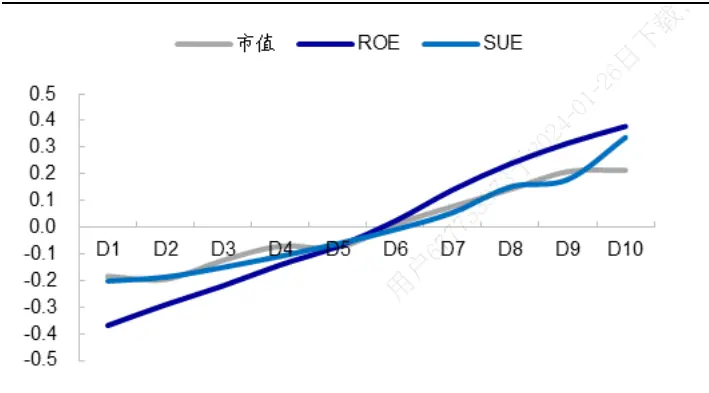
资料来源：Wind，海通证券研究所

图2 总资产增长组合的反转、换手率和波动率特征
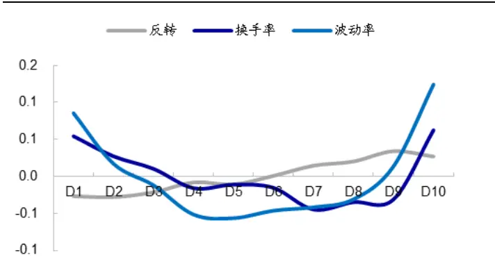
资料来源：Wind，海通证券研究所

将总资产分解为流动资产和非流动资产，考察这两个分项增长与股票收益的，结果如下表所示。剔除市值、盈利、利润增长后，流动资产增长和非流动资产增长与股票收益呈现非常微弱的正相关性。

表 2 流动资产和非流动资产增长的 RankIC（2009.05-2019.07）

| 流动资产增长因子的 RankIC |  |  |  |  |
| --- | --- | --- | --- | --- |
|  | 月均值 | 标准差 | 月胜率 | t值 IC_IR |
| 原始因子 | 0.82% | 4.81% | 60.16% | 1.88 0.59 |
| 剔除市值 | 2.24% | 4.27% | 65.04% 5.82 | 1.82 |
| 剔除市值、盈利与增长 | 0.22% | 4.60% | 56.10% 0.54 | 0.17 |
| 非流动资产增长的 RankIC |  |  |  |  |
|  | 月均值 | 标准差 月胜率 | t值 | IC_IR |

| 原始因子 | 0.37% | 6.76% | 52.85% | 0.61 | 0.19 |
| --- | --- | --- | --- | --- | --- |
| 剔除市值 | 2.91% | 7.34% | 65.85% | 4.39 | 1.37 |
| 剔除市值、盈利与增长 | 0.58% | 5.85% | 56.91% | 1.10 | 0.34 |

资料来源：Wind，海通证券研究所

从时间序列角度来看，我们发现资产增长因子的选股效果与经济增长密切相关。每个月末基于资产增长因子将股票分为 10 组，考察因子得分最高的一组股票等权组合相对于因子得分最低的一组股票等权组合多空收益累计净值，结果如下图所示。

结果显示，在 PMI 上行区间，公司经营规模扩张具有一定的动量效应，因子多空收益累计净值稳步向上，如 2009 年、2012 年底至 2014 年、2016 年至 2017 年。而在PMI 下行区间，企业规模扩张通常认为是不可持续的，资产增长与股票收益呈现一定负相关性。如 2010 年上半年，2011 年至 2012 年，2018 年下半年至今。

此外值得注意的是，2015 年下半年间，资产增长多空净值迅速上升。这可能与市场情绪有关。在整体情绪低迷时，公司资产规模仍保持增加的信息给投资者释放出积极信号，资产增加的公司更受投资者青睐，推动因子多空收益净值累计向上。

图3 总资产增长的多空累计净值（2009.05-2019.07）
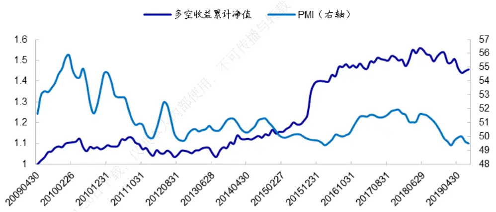
资料来源：Wind，海通证券研究所
注：图中 PMI为采用 3个月的 PMI数据进行平滑后的值。

总结来看在 A股市场，资产增长与股票收益呈现微弱的正相关性。这种现象在一定程度上与经济周期和市场情绪有关。

经济增长上行，规模扩张整体呈现动量效应，资产增速越快的公司未来收益表现越优；而经济增长下行时，规模扩张通常被认为不可持续，资产增速越快的公司未来收益表现越差。此外，在市场情绪极度低迷时，资产规模仍保持增加的信息会释放积极信号，资产增速越快的公司，未来收益表现越优。

## 2. 资产增长的稳定性

波动率反映了信息不确定性，通常而言，波动率越高，股票未来收益表现越差。例如，从价格波动来看，前期异质波动率低的股票相对于异质波动率高的股票存在显著正向超额收益。从基本面来看，2009 年 Alan2发现，美股市场现金流波动越大的公司，其股票收益显著低于现金流波动率低的公司。同样地，资产增长波动越大的公司，信息不确定越高，股票未来收益表现较差的可能性越大。

本节主要考察资产增长波动率的选股效果。其中，波动率采用过去 8个季度资产增长进行计算。

## 2.1 单因子选股效果

下表展示了资产增长波动率 RankIC 统计情况。结果显示，资产增长波动率与股票收益呈显著负相关关系，波动率越高，股票未来收益表现越差。将总资产分解为流动资产和非流动资产可发现，流动资产的波动率对未来股票收益的影响更为明显。

表 3 资产增长波动率因子的 RankIC（2009.05-2019.07）

|  | 月均值 | 标准差 | 月胜率 | t值 | IC_IR |
| --- | --- | --- | --- | --- | --- |
| 总资产增长波动率 | -1.77% | 4.65% | 65.04% | -4.23 | -1.32 |
| 流动资产增长波动率 | -2.31% | 6.38% | 65.04% | -4.02 | -1.25 |
| 非流动资产增长波动率 | -0.97% | 6.99% | 58.54% | -1.54 | -0.48 |

资料来源：Wind，海通证券研究所

以流动资产为例，下图展示了资产增长波动率分组组合的市值、ROE和 SUE因子特征。结果显示，相比于资产增长因子，资产增长波动率与常见基本面因子的相关性相对较低。

图4 流动资产增长波动率组合的市值、ROE、SUE 特征（2009.05-2019.07）
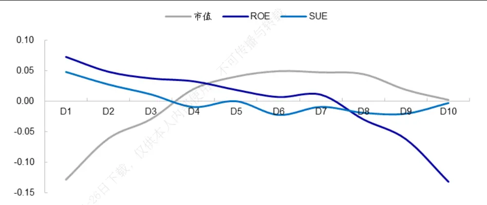
资料来源：Wind，海通证券研究所

剔除市值、盈利和利润增长影响后，资产增长波动率与股票收益的负相关性更为显著。其中，仍以流动资产增长波动率表现最优。月均 RankIC 为-3.79%，相应的 ICIR 为-1.82。

表 4 剔除市值、盈利、利润增长后资产增长波动率因子的 RankIC（2009.05-2019.07）

|  | 月均值 | 标准差 | 月胜率 | t值 | ICIR |
| --- | --- | --- | --- | --- | --- |
| 总资产增长波动率 | -2.94% | 6.23% | 69.11% | -5.23 | -1.63 |
| 流动资产增长波动率 | -3.79% | 7.21% | 69.92% | -5.83 | -1.82 |
| 非流动资产增长波动率 | -1.48% | 7.06% | 59.35% | -2.32 | -0.73 |

资料来源：Wind，海通证券研究所

下图左和下图右分别展示了资产增长波动率组合的月均分组收益与多空累计净值。从中可看出，波动率组间收益呈现出较好的单调性，且因子多头收益贡献和空头收益贡献水平大致相当。从时间序列角度来看，在绝大部分月份，资产增长波动率最低的组合相对于波动率最高的组合均存在正向超额收益。

图5 资产增长波动率分组收益（2009.05-2019.07）
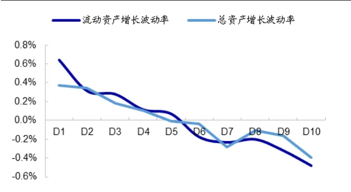
资料来源：Wind，海通证券研究所

图6 资产增长波动率多空收益累计净值（2009.05-2019.07）
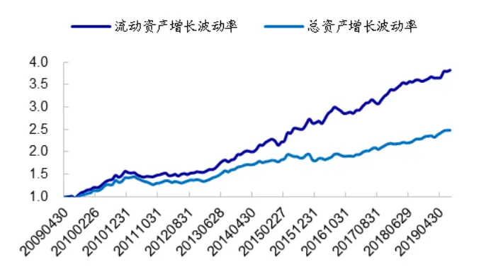
资料来源：Wind，海通证券研究所

下图展示了在 29 个中信一级行业内，基于流动资产增长波动率因子将股票分为 3组，因子得分最高的一组股票与因子得分最低的一组股票月均多空收益差及检验 t值。

图7 流动资产增长波动率因子分行业月均多空收益（2009.05-2019.07）
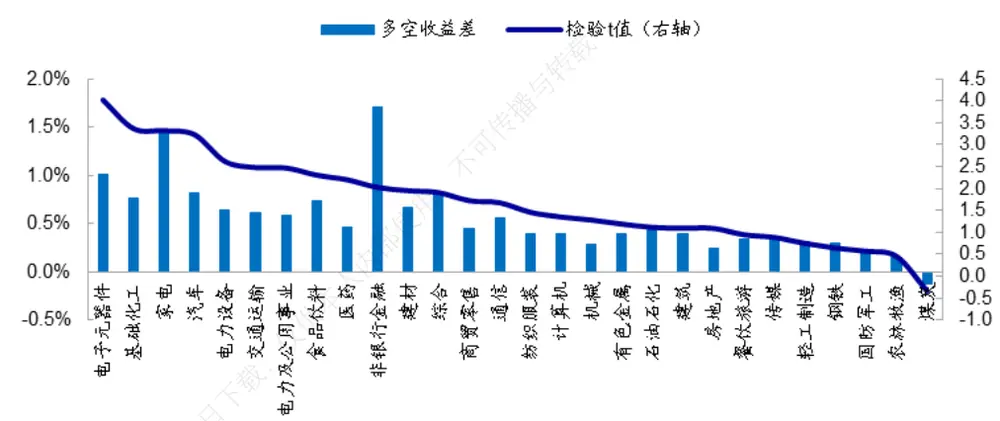
资料来源：Wind，海通证券研究所

结果显示，资产增长波动率因子在 10 个一级行业内存在显著选股效果。其中，在非银金融行业，月均多空收益差最高，为1.70%，但因子稳定性较差，月胜率仅为52.85%。除此之外，因子多空收益最高的 4个行业分别是电子元器件、基础化工、家电和汽车。在这些行业，资产增长稳定性越高，股票收益表现越优。

## 2.2 资产增长稳定性因子的截面溢价

下表展示了在包含市值、非线性市值、反转、换手率、波动率、流动性、ROE、预期净利润调整、SUE因子的基础模型中，加入资产增长波动率因子（本节以流动资产增长波动率因子为例）后，各个因子的截面溢价统计结果。

结果显示，资产增长波动率因子的截面溢价显著为负。表明剔除了常见因子后，资产增长波动率因子与股票收益仍呈现显著负相关关系。

此外，下表展示了资产增长波动率因子的计算窗口分别为 1 年、2 年、3年、5 年时，因子的截面溢价对比情况。从中可看出，波动率计算窗口为 1年时，因子的溢价水平最高。随着计算窗口逐步拉长，因子的选股效果逐渐减弱。表明近期资产变化的波动水平对股票收益的影响更大。

表 5 资产增长波动率的截面溢价（2009.05-2019.07）

| 波动率计 算窗口 | 指标 | 市值 | 市值平方 | 反转 | 换手率 | 波动率 | 流动性 | ROE | 预期净利 润调整 | SUE | 资产增长 波动率 |
| --- | --- | --- | --- | --- | --- | --- | --- | --- | --- | --- | --- |
| 1年 | 月均溢价 | -0.58% | 0.47% | -0.39% | -0.39% | -0.30% | -0.47% | 0.26% | 0.25% | 0.28% | -0.16% |
|  | t值 | -3.31 | 6.24 | -3.33 | -3.30 | -3.51 | -5.46 | 4.51 | 7.67 | 7.77 | -4.40 |
| 2年 | 月均溢价 | -0.59% | 0.48% | -0.40% | -0.38% | -0.30% | -0.48% | 0.25% | 0.25% | 0.28% | -0.15% |
|  | t值 | -3.31 | 6.33 | -3.35 | -3.22 | -3.52 | -5.49 | 4.33 | 7.88 | 7.67 | -4.03 |
| 3年 | 月均溢价 | -0.47% | 0.46% | -0.39% | -0.32% | -0.23% | -0.44% | 0.25% | 0.23% | 0.27% | -0.10% |
|  | t值 | -2.76 | 6.47 | -3.34 | -2.73 | -2.79 | -5.12 | 4.56 | 7.90 | 7.50 | -2.76 |
| 5年 | 月均溢价 | -0.39% | 0.39% | -0.30% | -0.28% | -0.18% | -0.37% | 0.17% | 0.16% | 0.24% | -0.07% |
|  | t值 | -2.43 | 6.13 | -2.75 | -2.55 | -2.41 | -5.04 | 3.57 | 6.58 | 8.01 | -2.62 |

资料来源：Wind，海通证券研究所

## 2.3 资产增长稳定性的行业轮动效果

以中信一级行业为基础，计算行业内所有个股流动资产增长波动率的中位数，以此作为行业因子。下表展示了该行业因子的 RankIC，以及多头组合（因子得分最高的 6个行业）和空头组合（因子得分最低的 6个行业）超额收益表现。

表 6 资产增长稳定性行业因子的多空收益表现（2009.05-2019.07）

|  | 年化收益 | 月胜率 | t值 | 信息比 |
| --- | --- | --- | --- | --- |
| 多头超额 | 7.80% | 58.54% | 3.63 | 1.13 |
| 空头超额 | -2.25% | 44.72% | -0.78 | -0.24 |
| 多空收益 | 10.05% | 56.10% | 2.52 | 0.79 |

资料来源：Wind，海通证券研究所

结果显示，资产增长稳定的行业相对于资产增长波动大的行业，存在显著正向超额收益，年化超额 10%，相应的信息比为 0.79。从时间序列角度来看，多头组合在 56%的月份相对于空头组合均存在正向超额收益。

图8 资产增长稳定性行业因子的多空收益累计净值（2009.05-2019.07）
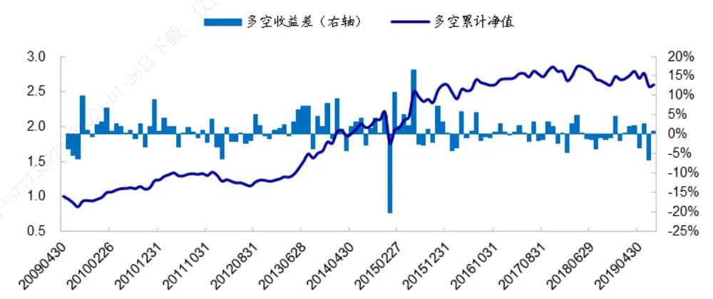
资料来源：Wind，海通证券研究所

总结来看，资产增长波动率越高，股票未来收益表现越差。从波动率计算窗口来看，近期资产变化的波动水平对股票收益的影响更大。

## 3. 资本结构

资本结构是指企业资本的构成及其比例关系。常用的资本结构分析指标主要有以下4 个：股东权益比率、资产负债比率、长期负债比率、股东权益与固定资产比率。本节主要考察资本结构比率变化对股票收益的影响，即一定时期内企业各种资本价值的相对变化与未来股价表现之间的关系。

我们基于资本结构变化因子从低到高排序分为 10组，统计每组股票等权组合相对于样本等权组合的超额收益情况，结果如下图所示。

从股东权益端来看，随着股东权益比率变化、股东权益与固定资产比率变化逐渐增加，组合收益单调下降。从负债端来看，随着资产负债率变化、长期负债比率变化逐渐增加，股票收益逐渐增大。即在过去 10 余年间，杠杆率增加的公司，股票收益表现越优。

图9 资产结构变化因子分组收益 1（2009.05-2019.07）
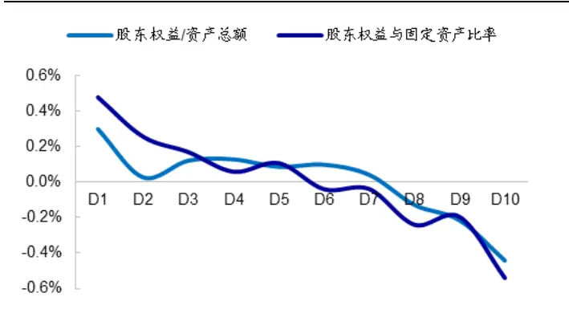
资料来源：Wind，海通证券研究所

图10 资产结构变化因子分组收益 2（2009.05-2019.07）
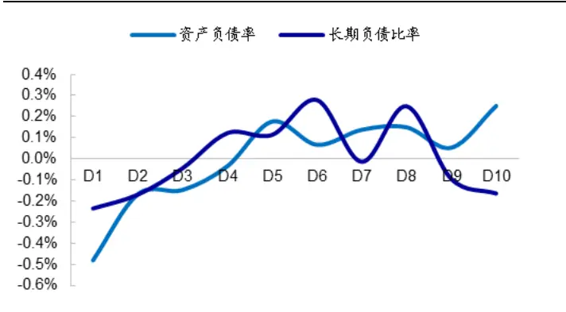
资料来源：Wind，海通证券研究所

从极端组合多空收益差来看，在 4个资本结构比率变化因子中，股东权益比率变化因子表现最优。该因子月均多空收益为 0.69%，相应的信息比为 1.57，统计显著。下文我们主要以股东权益比率变化为例，考察资本结构变化因子的选股效果。

表 7 资本结构比率变化因子的多空收益统计（2009.05-2019.07）

| 股东权益比率（股东权益/资产总额） |  |  |  |  |  |
| --- | --- | --- | --- | --- | --- |
|  | 月均值 | 月标准差 | 月胜率 | t值 | 信息比 |
| 原始因子 | 0.67% | 1.56% | 65.85% | 4.74 | 1.48 |
| 剔除市值 | 0.66% | 1.56% | 65.85% | 4.70 | 1.47 |
| 剔除市值、盈利与增长 | 0.69% | 1.53% | 69.92% | 5.04 | 1.57 |
| 资产负债率（负债总额/资产总额） |  |  |  |  |  |
| 26日下载 | 月均值 | 月标准差 | 月胜率 | t值 | 信息比 |
| 原始因子 | 0.65% | 1.52% | 65.85% | 4.73 | 1.48 |
| 剔除市值 | 0.62% | 1.51% | 64.23% | 4.60 | 1.44 |
| 剔除市值、盈利与增长 | 0.67% | 1.48% | 68.29% | 5.01 | 1.56 |
| 长期负债比率（长期负债/资产总额） |  |  |  |  |  |
| 户67775 | 月均值 | 月标准差 | 月胜率 | t值 | 信息比 |
| 原始因子 | -0.04% | 1.21% | 47.97% | -0.33 | -0.10 |
| 剔除市值 | -0.01% | 1.23% | 50.41% | -0.08 | -0.02 |
| 剔除市值、盈利与增长 | 0.04% | 1.21% | 50.41% | 0.38 | 0.12 |
| 股东权益与固定资产比率 |  |  |  |  |  |
|  | 月均值 | 月标准差 | 月胜率 | t值 | 信息比 |
| 原始因子 | 0.60% | 2.60% | 61.79% | 2.54 | 0.79 |
| 剔除市值 | 0.58% | 3.28% | 64.23% | 1.95 | 0.61 |
| 剔除市值、盈利与增长 | 0.62% | 2.52% | 60.98% | 2.74 | 0.86 |

资料来源：Wind，海通证券研究所

从时间序列角度来看，在 70%的月份，杠杆率增加的公司相对于杠杆率减小的公司都存在正向超额收益。

图11 股东权益比率变化因子月度多空收益（2009.05-2019.07）
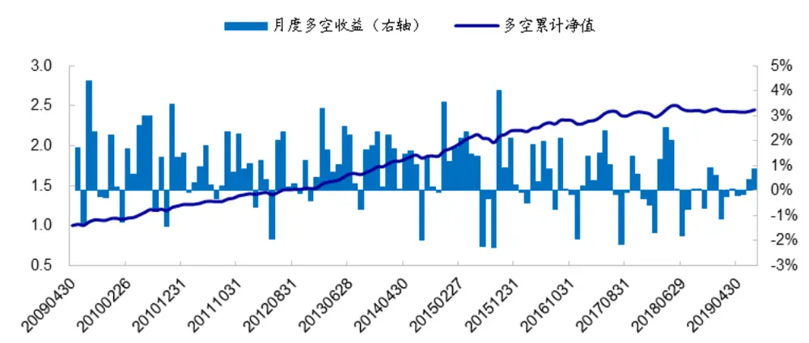
资料来源： ，海通证券研究所

分行业来看，股东权益比率变化因子在一些成长行业，如电子元器件、传媒、通信，选股效果显著。基于因子分为 组后，这些行业多空月均收益均在 以上。杠杆率增加，表明公司扩展经营能力较强，股东权益运用得越充分；这种扩张经营能力对于成长行业的影响更为明显。

图12 股东权益比率变化因子分行业月均多空收益（2009.05-2019.07）
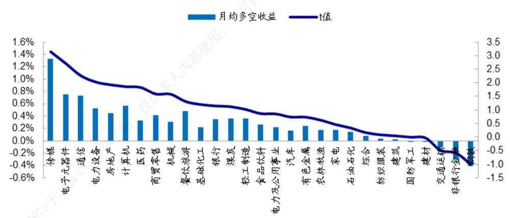
资料来源：Wind，海通证券研究所

综上所述，杠杆率增加幅度越大的公司，未来收益表现越优。这种现象在传媒、电子元器件等成长性行业中更为明显。

## 4. 结论

本文从上市公司的资产负债表出发，考察公司资产增长及资本结构变化对股票收益的影响。

在 A股市场，资产增长与股票收益呈现微弱的正相关性。这种现象在一定程度上与经济周期和市场情绪有关。经济增长上行，规模扩张整体呈现动量效应，资产增速越快的公司未来收益表现越优；而经济增长下行时，规模扩张通常被认为不可持续，资产增速越快的公司未来收益表现越差。此外，在市场情绪极度低迷时，资产规模仍保持增加的信息会释放积极信号，资产增速越快的公司，未来收益表现越优。

资产增长波动率越高，股票未来收益表现越差。从波动率计算窗口来看，近期资产变化的波动水平对股票收益的影响更大。

从资本结构来看，在过去 10 余年间，杠杆率增加的公司，股票收益表现越优。杠杆率增加与股票收益的正相关关系在一些成长性行业，如电子元器件、传媒等，表现更为明显。

## 5. 风险提示

因子有效性变化风险，历史统计规律失效风险。

# 信息披露

分析师声明

[Table冯佳睿yst金融工程研究团队s]

罗蕾金融工程研究团队

本人具有中国证券业协会授予的证券投资咨询执业资格，以勤勉的职业态度，独立、客观地出具本报告。本报告所采用的数据和信息均来自市场公开信息，本人不保证该等信息的准确性或完整性。分析逻辑基于作者的职业理解，清晰准确地反映了作者的研究观点，结论不受任何第三方的授意或影响，特此声明。

## 法律声明

本报告仅供海通证券股份有限公司（以下简称 本公司 ）的客户使用。本公司不会因接收人收到本报告而视其为客户。在任何情况下，本报告中的信息或所表述的意见并不构成对任何人的投资建议。在任何情况下，本公司不对任何人因使用本报告中的任何内容所引致的任何损失负任何责任。载

本报告所载的资料、意见及推测仅反映本公司于发布本报告当日的判断，本报告所指的证券或投资标的的价格、价值及投资收入可能与会波动。在不同时期，本公司可发出与本报告所载资料、意见及推测不一致的报告。传播

市场有风险，投资需谨慎。本报告所载的信息、材料及结论只提供特定客户作参考，不构成投资建议，也没有考虑到个别客户特殊的不投资目标、财务状况或需要。客户应考虑本报告中的任何意见或建议是否符合其特定状况。在法律许可的情况下，海通证券及其所属用关联机构可能会持有报告中提到的公司所发行的证券并进行交易，还可能为这些公司提供投资银行服务或其他服务。部

本报告仅向特定客户传送，未经海通证券研究所书面授权，本研究报告的任何部分均不得以任何方式制作任何形式的拷贝、复印件或复制品，或再次分发给任何其他人，或以任何侵犯本公司版权的其他方式使用。所有本报告中使用的商标、服务标记及标记均为本公司的商标、服务标记及标记。如欲引用或转载本文内容，务必联络海通证券研究所并获得许可，并需注明出处为海通证券研究所，且不得对本文进行有悖原意的引用和删改。

根据中国证监会核发的经营证券业务许可，海通证券股份有限公司的经营范围包括证券投资咨询业务。1-

## 海通证券股份有限公司研究所[Table_PeopleInfo]

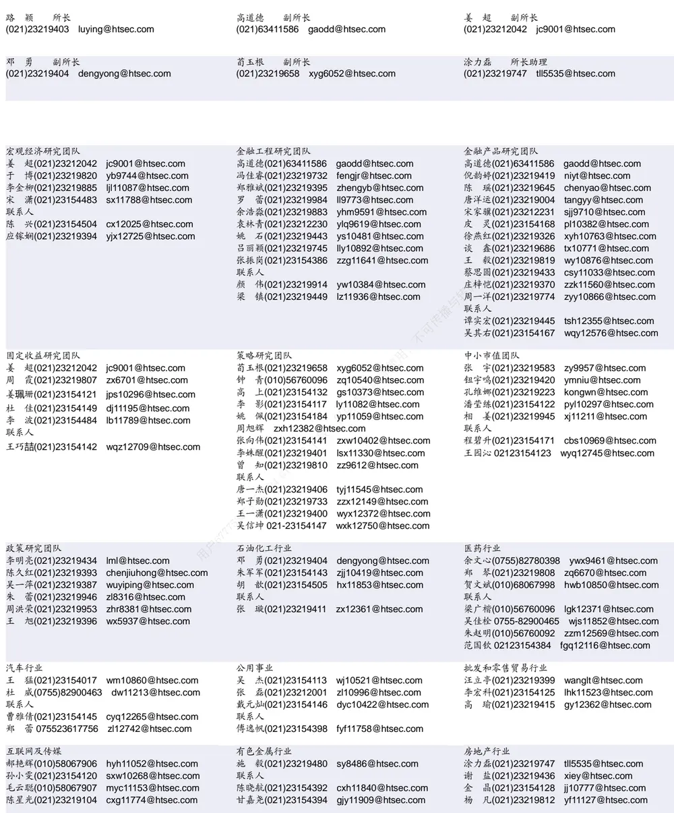

| 家电行业 | 造纸轻工行业 |  |
| --- | --- | --- |
| 陈子仪(021)23219244 chenzy@htsec.com |  | 衣桢永(021)23212208 yzy12003@htsec.com |
| 李 阳(021)23154382 ly11194@htsec.com |  |  |
| 朱默辰(021)23154383 zmc11316@htsec.com |  |  |
| 联系人 |  |  |
| 刘 璐(021)23214390 II11838@htsec.com |  |  |

| 电子行业 |  | 煤炭行业 | 电力设备及新能源行业 |  |
| --- | --- | --- | --- | --- |
|  | 陈 平(021)23219646 cp9808@htsec.com | 李 淼(010)58067998 Im10779@htsec.com | 张一弛(021)23219402 zyc9637@htsec.com |  |
|  | 尹 苓(021)23154119 yl11569@htsec.com | 戴元灿(021)23154146 dyc10422@htsec.com | 房 青(021)23219692 fangq@htsec.com |  |
|  | 谢 磊(021)23212214 xl10881@htsec.com | 吴 杰(021)23154113 wj10521@htsec.com | 曾 彪(021)23154148 zb10242@htsec.com |  |
|  |  | 联系人 王 涛(021)23219760 wt12363@htsec.com | 徐柏乔(021)23219171 xbq6583@htsec.com |  |
|  |  |  | 联系人 | 陈佳彬(021)23154513 cjb11782@htsec.com |

| 基础化工行业 |  | 计算机行业 |  | 通信行业 |  |
| --- | --- | --- | --- | --- | --- |
| 刘 威(0755)82764281 Iw10053@htsec.com |  | 郑宏达(021)23219392 | zhd10834@htsec.com | 朱劲松(010)50949926 | zjs10213@htsec.com |
| 刘海荣(021)23154130 Ihr10342@htsec.com |  | 杨 林(021)23154174 | yl11036@htsec.com | 余伟民(010)50949926 | ywm11574@htsec.com |
| 张翠翠(021)23214397 | zcc11726@htsec.com | 鲁 立(021)23154138 | II11383@htsec.com | 张峥青(021)23219383 | zzq11650@htsec.com |
| 孙维容(021)23219431 | swr12178@htsec.com | 于成龙 ycl12224@htsec.com |  | 张 弋01050949962 | zy12258@htsec.com |
| 联系人 |  | 黄竞晶(021)23154131 | hjj10361@htsec.com | 联系人 |  |
| 李 智(021)23219392 | lz11785@htsec.com | 洪 琳(021)23154137 | hl11570@htsec.com | 杨彤昕 010-56760095 | ytx12741@htsec.com |

| 非银行金融行业 |  | 交通运输行业 |  | 纺织服装行业 |  |  |
| --- | --- | --- | --- | --- | --- | --- |
|  | 孙 婷(010)50949926 st9998@htsec.com |  | 虞 楠(021)23219382 yun@htsec.com |  | 梁 希(021)23219407 lx11040@htsec.com |  |
|  | 何 婷(021)23219634 ht10515@htsec.com |  | 罗月江(010)56760091 lyj12399@htsec.com |  | 联系人 |  |
|  | 李芳洲(021)23154127 Ifz11585@htsec.com |  | 李 轩(021)23154652 Ix12671@htsec.com |  |  | 盛 开(021)23154510 sk11787@htsec.com |
| 联系人 |  |  | 联系人 |  |  | 刘 溢(021)23219748 ly12337@htsec.com |
| 任广博(021)23154388 rgb12695@htsec.com |  |  | 李 丹(021)23154401 Id11766@htsec.com |  |  |  |

| 建筑建材行业 | 机械行业 | 钢铁行业 |
| --- | --- | --- |
| 冯晨阳(021)23212081 fcy10886@htsec.com | 余炜超(021)23219816 swc11480@htsec.com | 刘彦奇(021)23219391 liuyq@htsec.com |
| 潘莹练(021)23154122 pyl10297@htsec.com 申 浩(021)23154114 sh12219@htsec.com | 耿 耘(021)23219814 gy10234@htsec.com 杨 震(021)23154124 yz10334@htsec.com | 刘 璇(0755)82900465 lx11212@htsec.com 联系人 |
|  | 沈伟杰(021)23219963 swj11496@htsec.com | 周慧琳(021)23154399 zhl11756@htsec.com |
|  | 周 丹 zd12213@htsec.com |  |

| 建筑工程行业 | 农林牧渔行业 |  | 食品饮料行业 |
| --- | --- | --- | --- |
| 杜市伟(0755)82945368 dsw11227@htsec.com | 丁 频(021)23219405 dingpin@htsec.com | 不可 | 闻宏伟(010)58067941 whw9587@htsec.com |
| 张欣劼 zxj12156@htsec.com | 陈雪丽(021)23219164 cxl9730@htsec.com |  | 唐 宇(021)23219389 ty11049@htsec.com |
| 李富华(021)23154134 Ifh12225@htsec.com | 陈 阳(021)23212041 cy10867@htsec.com 联系人 |  |  |

| 军工行业 |  | 银行行业 |  | 社会服务行业 |  |
| --- | --- | --- | --- | --- | --- |
| 蒋 俊(021)23154170 jj11200@htsec.com |  | 孙 婷(010)50949926 st9998@htsec.com |  | 汪立亭(021)23219399 wanglt@htsec.com |  |
|  | 刘 磊(010)50949922 II11322@htsec.com |  | 解巍巍 xww12276@htsec.com |  | 陈扬扬(021)23219671 cyy10636@htsec.com |
| 张恒晅 zhx10170@htsec.com |  | 林加力(021)23214395 ljl12245@htsec.com |  | 许樱之 xyz11630@htsec.com |  |
| 联系人 |  | 谭敏沂(0755)82900489 tmy10908@htsec.com |  |  |  |

## 研究所销售团队

蔡铁清(0755)82775962 ctq5979@htsec.com

伏财勇(0755)23607963 fcy7498@htsec.com

辜丽娟(0755)83253022 gulj@htsec.com

刘晶晶(0755)83255933 liujj4900@htsec.com

王雅清(0755)83254133 wyq10541@htsec.com

饶 伟(0755)82775282 rw10588@htsec.com

欧阳梦楚(0755)23617160

oymc11039@htsec.com

巩柏含 gbh11537@htsec.com

上海地区销售团队
胡雪梅(021)23219385 huxm@htsec.com
朱 健(021)23219592 zhuj@htsec.com
季唯佳(021)23219384 jiwj@htsec.com
黄 毓(021)23219410 huangyu@htsec.com
漆冠男(021)23219281 qgn10768@htsec.com
胡宇欣(021)23154192 hyx10493@htsec.com
黄 诚(021)23219397 hc10482@htsec.com
毛文英(021)23219373 mwy10474@htsec.com
马晓男 mxn11376@htsec.com
杨祎昕(021)23212268 yyx10310@htsec.com
张思宇 zsy11797@htsec.com
慈晓聪(021)23219989 cxc11643@htsec.com
王朝领 wcl11854@htsec.com
邵亚杰 23214650 syj12493@htsec.com
李 寅 021-23219691 ly12488@htsec.com
北京地区销售团队
殷怡琦(010)58067988 yyq9989@htsec.com
郭 楠 010-5806 7936 gn12384@htsec.com
张丽萱(010)58067931 zlx11191@htsec.com
杨羽莎(010)58067977 yys10962@htsec.com
杜 飞 df12021@htsec.com
张 杨(021)23219442 zy9937@htsec.com
何 嘉(010)58067929 hj12311@htsec.com
李 婕 lj12330@htsec.com
欧阳亚群 oyyq12331@htsec.com
郭金垚 gjy12727@htsec.com

海通证券股份有限公司研究所

地址：上海市黄浦区广东路 689号海通证券大厦 9楼

电话：（021）23219000

传真：（021）23219392

网址：www.htsec.com