## [Tab相关研究

[Table_ReportInfo]《华泰柏瑞中证科技 100ETF投资价值分析》2019.09.19

《华泰柏瑞中证科技 投资价值分析》2019.09.19

《选股因子系列研究（五十四）——资产增长稳定性与资本结构变化》2019.09.10

分析师:冯佳睿

Tel:(021)23219732

Email:fengjr@htsec.com

证书:S0850512080006

分析师:罗蕾

Tel:(021)23219984

Email:ll9773@htsec.com

证书:S0850516080002

# 选股因子系列研究（五十五）——价量波动幅度

## 投资要点：

本文主要对价量波动幅度与未来股票收益之间的关系进行研究。

股价振幅。股价振幅因子与股票收益显著正相关，即控制涨跌幅、换手率、波动率后，历史股价振幅越大，股票未来收益表现越优。该因子对观察期的选取不敏感，在 个月的观察期下，均存在显著选股效果。但与传统技术因子类似，股价振幅因子衰减速度较快，持有期超过 个月时，因子多空收益不再显著。

- 股价振幅因子是对传统价量因子的有效补充。在涨幅低、换手率低、波动率低的样本集中，传统技术因子失效；而股价振幅因子在此样本集中存在显著选股效果，且多头效应强。

换手率波幅。换手率波幅因子（过去一段时间内日换手率最高值与日换手率最低值之差）与股票收益显著负相关。即换手率波动幅度越大，股票未来收益表现越差。该因子多头效应弱，空头效应强。

- 价量波幅因子对多因子预测模型的边际贡献。在包含常见因子的 因子模型中加入价量波幅因子，可提升模型 IC 表现。

- 风险提示。因子有效性变化风险，历史统计规律失效风险。

常见的技术因子主要包括涨跌幅、换手率、波动率等，鲜少有因子反映价量指标的区间波动幅度情况。实际上，波动幅度从总量的角度刻画了个股活跃程度，是对常见价量因子信息的有效补充。本文主要对一定区间内的价量波幅与未来股票收益之间的关系进行研究。

## 1. 对传统价量因子的有效补充

传统价量因子存在一个普遍特征：因子的空头效应强，而多头效应弱。从因子在不同样本空间选股效果差异的角度来看，这个现象即意味着，因子在涨幅高、换手率高、波动率高的股票集中选股效果强，而在涨幅低、换手率低、波动率低的股票集中选股效果弱。

具体地，若我们基于前一个月涨跌幅、换手率、波动率 3 个指标，将全市场股票分为 2*2*2=8 个子样本空间。在每一个子样本空间，基于目标因子（反转、换手率等）将股票分为 3 组，并计算因子得分最高一组股票相对于因子得分最低一组股票的月均多空收益，结果如下图。

图1 常见技术因子在不同样本空间中的月均多空收益（2010.01-2019.08）

|  |  | 涨幅低换手率低 换手率高 |  | 涨幅高 |  |  |
| --- | --- | --- | --- | --- | --- | --- |
|  |  |  |  |  | 换手率低换手率高 |  |
| 波动率低 | 反转因子换手率因子波动率因子 | -0.03% | 0.22% |  | 0.46% | 0.90% |
|  |  | -0.32% | -0.33% |  | -0.13% |  |
|  |  | -0.09% | 0.17% |  | 0.43% | 0.74% |
| 波动率高 | 反转因子 | 0.31% | 0.37% |  | 0.43% | 1.19% |
|  | 换手率因子波动率因子 | -0.03% | 0.53% |  | 0.06% | 0.96% |
|  |  | 0.52% | 1.01% |  | 0.58% | 1.25% |

资料来源：Wind，海通证券研究所
注：（ ）字体加粗，表明多空收益统计显著；（ ）单元格颜色越深，代表多空收益越大，因子表现越优。

结果显示，常见技术因子——反转、换手率、波动率，主要在涨幅高、换手率高的样本空间中存在显著选股效果；而在涨幅低、换手率低的样本空间，月均多空收益并不显著。

每个月末，我们基于过去一段时间内，日度价格最高值与最低值之间的变动幅度构建股价振幅因子（下简称振幅因子）。即振幅因子=日度价格最高值/最低值-1。下表展示了在不同子样本空间中，3个月振幅因子（观察期为 3个月）的月均多空收益。

图2 股价振幅因子在不同样本空间中的月均多空收益（2010.01-2019.08）

|  | 涨幅低 |  | 涨幅高 |  |
| --- | --- | --- | --- | --- |
|  | 换手率低 | 换手率高 | 换手率低 | 换手率高 |
| 波动率低 | 0.92% | 1.21% | 0.41% | 0.41% |
| 波动率高 | 0.79% | 0.95% | 0.24% | -0.09% |

资料来源： ，海通证券研究所
注：（ ）字体加粗，表明多空收益统计显著；（ ）单元格颜色越深，代表多空收益越大，因子表现越优。

从中可见，振幅因子可对常见价量类因子进行有效补充。常见技术因子在涨幅低、换手率低的样本集中，选股效果非常有限；而在此样本空间，3 个月振幅因子选股效果显著。特别地，在涨幅低、波动率低、换手率低的样本空间，3个常见价量因子均失效，多空收益为负，而振幅因子月均多空收益高达 0.92%，统计显著。

## 2. 股价振幅单因子回测

## 2.1 因子计算

由于振幅大的股票往往前期受关注度比较高、价格波动大，振幅因子的选股效果会受其他价量类因子影响，因此直接考察振幅与股票未来收益的关系并不合适。

具体地，我们基于 3个月振幅因子将全市场股票分为 10 组，统计每组股票的其他因子特征，如下图所示。从中可见，振幅因子与换手率和波动率因子呈现非常明显的正相关性。振幅大的股票组合，其前期价格波动率和换手率也越高。此外，振幅因子与市值因子也呈现一定的负相关性，振幅大的股票组合其市值通常相对较低。

图3 股价振幅组合的因子特征（2010.01-2019.08）
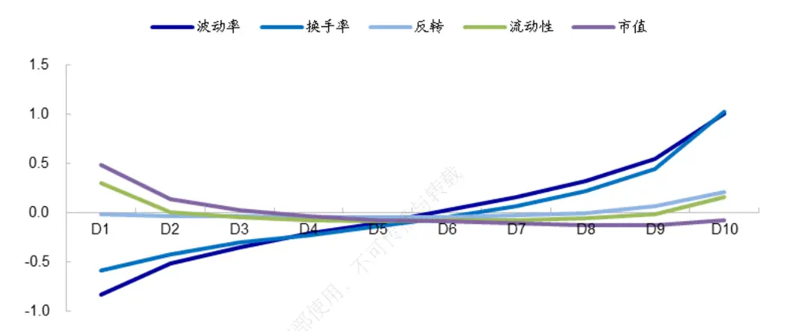
资料来源：Wind，海通证券研究所

前一章的分析也表明，振幅因子主要对传统价量因子起补充作用。控制股票的价量特征后，在传统价量因子表现差的样本集中，振幅因子选股效果显著。为体现振幅因子的补充作用，下文在考察该因子时，均将该因子对技术类因子（反转、换手率、波动率、流动性）以及市值进行正交化处理，以反映控制价量特征后振幅因子的选股效果。

## 2.2 单因子选股效果

股票振幅与未来收益显著正相关。3个月振幅因子月均 IC 和 RankIC分别为 3.7%、3.5%，统计显著，相应的 IR 分别为 1.45、1.25。

表 1 3 个月振幅因子的月度选股效果（2010.01-2019.08）

|  | IC | RanklC | 空头超额 | 多头超额 | 多空收益差 |
| --- | --- | --- | --- | --- | --- |
| 均值 | 3.70% | 3.48% | -1.00% | 0.46% | 1.46% |
| 波动率 | 8.83% | 9.64% | 1.28% | 2.39% | 3.05% |
| 月胜率 | 65.52% | 62.07% | 17.24% | 56.03% | 70.69% |
| T值 | 4.51 | 3.89 | -8.44 | 2.05 | 5.16 |
| IR | 1.45 | 1.25 | -2.71 | 0.66 | 1.66 |

资料来源： ，海通证券研究所
注：（1）月胜率是指标大于 0的月度占比；（2）IR是指标月均值/月标准差年化后的值。

基于 3个月振幅因子将全市场股票分为 10组，统计每组股票等权组合相对于全市场等权组合的月均超额收益，结果如下图左。从中可见，随着股价振幅逐渐增大，组合收益单调递增。多头组合（因子得分最高的组合）相对于空头组合（因子得分最低的组合）月均超额 1.46%，月胜率 70.7%，统计显著。

图4 3 个月振幅因子分组收益（2010.01-2019.08）
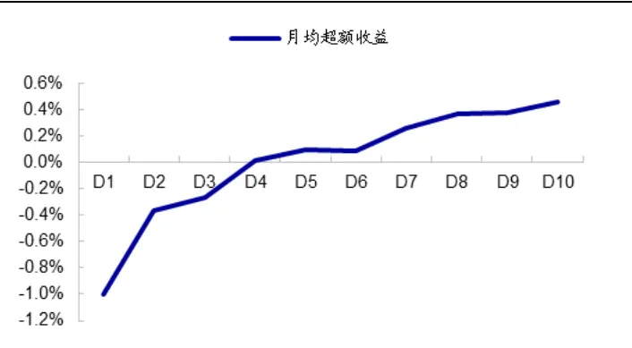
资料来源：Wind，海通证券研究所

图5 3 个月振幅因子的多空收益（2010.01-2019.08）
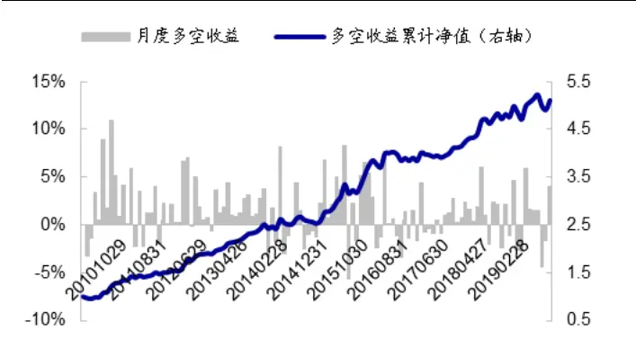
资料来源：Wind，海通证券研究所

需要注意的是，虽然从全市场来看，振幅因子与反转、波动率因子一样，呈现多头效应弱、空头效应强的特征（上图左）。但在不同的子样本空间，它们的有效性截然相反：在反转、波动率因子缺乏选股能力的样本集中，振幅因子多头效应显著为正，因子间可相互补充。

具体地，我们基于前一个月涨跌幅从小到大排序将全市场股票分解为 5个子样本集；然后在每一个子样本集中，基于目标因子（振幅、反转、波动率）将股票分为 5组，统计因子得分最高的一组股票（多头）相对于子样本集等权组合的月均超额收益，结果如下图。

图6 不同涨跌幅组合中，价格类因子的月均多头超额收益（2010.01-2019.08）
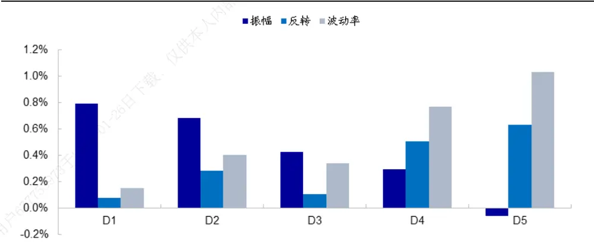
资料来源： ，海通证券研究所
注：此处反转、波动率因子均为正交市值因子后的值。

结果显示，在涨幅低的 D1、D2 样本集中，振幅因子多头效应显著强于反转因子和波动率因子；而在涨幅高的 D4、D5 样本集中，反转因子、波动率因子的多头效应显著强于振幅因子。特别地，在涨幅最低的样本集 D1中，反转、波动率因子多头效应均接近于 0；而振幅因子月均多头超额高达 0.79%。

表 2 不同涨幅样本中，振幅因子和反转因子的分组收益（2010.01-2019.08）

| 样本集 | 振幅因子 |  |  |  |  | 反转因子 |  |  |  |  |
| --- | --- | --- | --- | --- | --- | --- | --- | --- | --- | --- |
|  | D1（因子得 分低） | D2 | D3 | D4 | D5(因子得分 高） | D1(因子 得分低） | D2 | D3 | D4 | D5(因子得分 高） |
| 涨幅低 | 0.54% | 0.92% | 1.19% | 1.78% | 2.10% | 1.23% | 1.25% | 1.38% | 1.25% | 1.37% |
| 涨幅2 | 0.51% | 0.96% | 1.36% | 1.39% | 1.91% | 1.13% | 0.99% | 1.20% | 1.16% | 1.47% |
| 涨幅3 | 0.52% | 0.98% | 1.26% | 1.58% | 1.62% | 0.97% | 0.98% | 1.35% | 1.23% | 1.27% |
| 涨幅4 | 0.25% | 0.65% | 1.04% | 1.03% | 1.11% | 0.43% | 0.69% | 0.73% | 0.90% | 1.31% |
| 涨幅高 | -0.54% | 0.05% | 0.22% | 0.09% | -0.12% | -1.04% | -0.25% | 0.04% | 0.33% | 0.55% |

资料来源：Wind，海通证券研究所

表 3 不同波动率样本中，振幅因子和波动率因子的分组收益（2010.01-2019.08）

| 样本集 | 振幅因子 |  |  |  |  | 波动率因子 |  |  |  |  |
| --- | --- | --- | --- | --- | --- | --- | --- | --- | --- | --- |
|  | D1(因子得 分低） | D2 | D3 | D4 | D5(因子得分 高） | D1(因子 得分低） | D2 | D3 | D4 | D5(因子得分 高） |
| 波动率低 | 0.87% | 1.19% | 1.28% | 1.56% | 2.04% | 1.13% | 1.43% | 1.53% | 1.39% | 1.34% |
| 波动率2 | 0.66% | 1.11% | 1.38% | 1.55% | 2.04% | 1.16% | 1.31% | 1.18% | 1.53% | 1.54% |
| 波动率3 | 0.48% | 0.89% | 1.07% | 1.28% | 1.87% | 0.96% | 0.97% | 1.18% | 1.15% | 1.42% |
| 波动率4 | 0.04% | 0.60% | 0.73% | 0.85% | 1.46% | 0.52% | 0.65% | 0.64% | 0.83% | 0.95% |
| 波动率高 | -0.48% | -0.12% | -0.19% | 0.06% | 0.16% | -0.94% | -0.33% | -0.12% | 0.01% | 0.48% |

资料来源：Wind，海通证券研究所

从分组单调性来看，表 2 展示了在不同涨幅的 5个样本集中，振幅因子和反转因子的分组收益对比。从中可见，在涨幅较低的 3组样本中，振幅因子分组收益的单调性明显强于反转因子。同样地，表 展示了在不同波动率的 个样本集中，振幅因子和波动率因子的分组收益对比。从中可见，在波动率较低的 组样本中，振幅因子分组收益的单调性明显强于波动率因子。

综上所述，振幅因子与股票收益显著正相关。虽然从全市场范围来看，该因子多头效应弱于空头效应；但在传统价格类因子失效的样本集中，该因子多头效应显著为正，是对传统价格类因子的有效补充。

## 2.3 不同观察期下的股价振幅因子

在计算振幅因子时需选定观察期，即考察过去多长一段时间内的股价振幅。下图展示了观察期分别设为 1-6 个月、12 个月时，振幅因子的 RankIC表现。

结果显示，在 1-6 个月的观察期窗口下，振幅因子的 RankIC 均显著为正，ICIR均在 0.9 以上。其中，观察期为 1 个月时，RankIC最小，为 2.70%。观察期为 2个月时，RankIC 最高，为 3.84%；之后随着观察期增加，振幅因子选股效果逐渐减弱。

图7 不同观察期下，振幅因子的 RankIC（2010.01-2019.08）
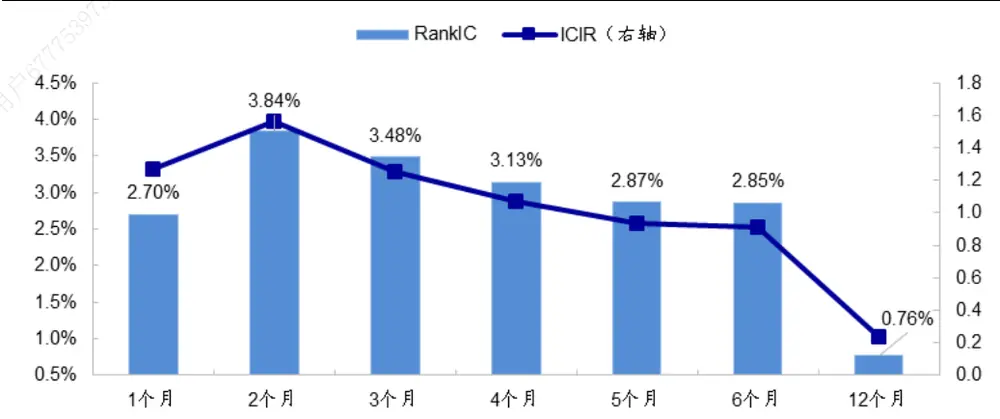
资料来源：Wind，海通证券研究所

## 2.4不同持有期下的股价振幅因子

我们基于 月末的因子值构建振幅因子多空组合，计算该多空组合在第 个月的收益差，将其称为持有期为 H 时振幅因子的多空收益。下图展示了持有期分别为 1-12个月时，振幅因子（本节及下文中均以观察期为 2个月的振幅因子为例进行展示）的月均多空收益。

图8 不同持有期下，振幅因子的月均多空收益（2010.01-2019.08）
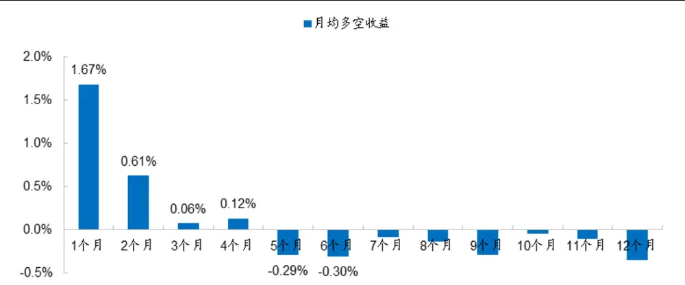
资料来源：Wind，海通证券研究所

结果显示，与传统价量类因子一致，振幅因子多空收益的衰减速度较快。持有期为1 个月时，因子月均多空收益达 1.67%；持有期为 2 个月时，因子多空收益迅速降至0.61%。持有期超过 5 个月时，振幅因子的选股效果甚至出现反向。

## 2.5不同风格中的选股效果

我们基于市值将全市场股票分解为 5个子样本集；然后在每一个子样本集中，基于振幅因子将股票分为 5组，并计算因子月均多空收益，结果如下图。

从中可见，振幅因子在市值最大的 20%股票集中，选股效果相对较弱。而在其余中小盘风格中，选股效果较强，月均多空收益均值在 1%以上。

图9 不同市值风格中，振幅因子的月均多空收益（2010.01-2019.08）
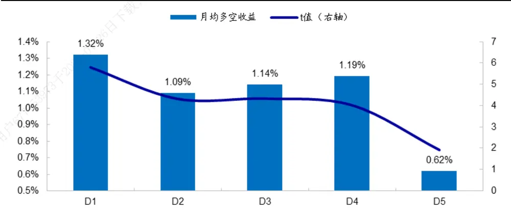
资料来源：Wind，海通证券研究所

综上所述，振幅因子与股票收益显著正相关。该因子在传统技术因子表现较差的样本集中，选股效果显著，可对传统价量因子作有效补充。但与其他技术因子类似，振幅因子衰减速度快，持有期超过 3 个月时，因子多空收益不再显著。

## 3. 换手率波幅单因子回测

除股价振幅外，我们还可考察换手率波动幅度因子（下简称换手率波幅因子），即一段时间内日换手率最高值与最低值之差。

换手率波幅与股票未来收益显著负相关。1 个月换手率波幅因子月均 IC和 RankIC分别为-2.90%、-2.77%，统计显著，相应的 IR 分别为 1.93、1.37。

从分组收益来看，换手率因子的空头效应显著强于多头效应。一方面，空头月均超额-0.69%，统计显著；而多头月均超额 0.18%，月胜率低于 50%，统计不显著。另一方面，在 D1-D4 组合间，因子与股票收益的负相关性并不明显。

表 4 换手率波幅因子的月度选股效果（2010.01-2019.08）

|  | IC | RanklC | 空头超额 | 多头超额 | 多空收益差 |
| --- | --- | --- | --- | --- | --- |
| 均值 | -2.90% | -2.77% | -0.69% | 0.18% | 0.87% |
| 波动率 | 5.21% | 7.02% | 1.20% | 2.14% | 1.99% |
| 月胜率 | 31.03% | 36.21% | 26.72% | 48.28% | 68.10% |
| T值 | -6.01 | -4.25 | -6.24 | 0.90 | 4.70 |
| IR | -1.93 | -1.37 | -2.01 | 0.29 | 1.51 |

资料来源：Wind，海通证券研究所
注：（ ）月胜率是指标大于 的月度占比；（ ） 为指标月均值 月标准差年化后的值。

图10 换手率波幅因子分组收益（2010.01-2019.08）
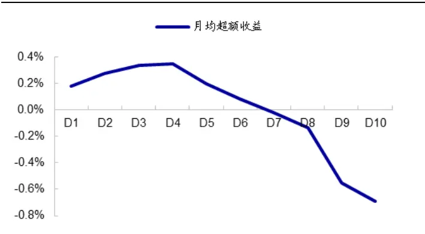
资料来源：Wind，海通证券研究所

图11 换手率波幅因子的多空收益（2010.01-2019.08）
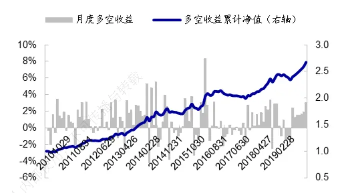
资料来源：Wind，海通证券研究所

此外，相比于股价振幅，换手率波幅因子对观察期的选取更敏感。

下图展示了观察期分别为 1-6 个月、12 个月时，换手率波幅因子的 IC表现。观察期为 1个月时，IC表现最优，为-2.90%。观察期为 2个月时，IC 表现明显减弱，为-1.58%。观察期超过 4个月时，换手率波幅因子与股票收益甚至呈微弱的正相关性。表明换手率波幅因子与股票收益的相关性不如股价振幅因子稳定。

图12 不同观察期下，换手率波幅因子的 IC（2010.01-2019.08）
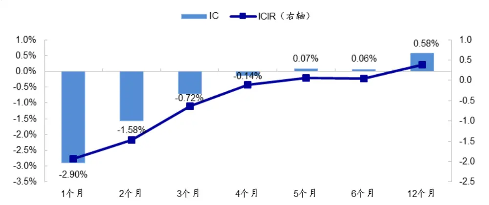
资料来源：Wind，海通证券研究所

总结来看，换手率波幅因子与股票收益显著负相关。但该因子多头效应较弱，且对观察期的选取较为敏感。

## 4. 多因子模型回测

下表展示了在包含市值、非线性市值、反转、换手率、波动率、流动性、ROE、预期净利润调整、SUE因子的基础模型（下文简称 9因子模型）中，加入价量波幅因子后，各个因子的截面溢价统计结果。

表 5 多因子模型截面溢价（2010.01-2019.08）

|  | 市值 | 市值平方 | 反转 | 换手率 | 波动率 | 流动性 | ROE | 预期净利 润调整 | SUE | 股价振幅 | 换手率波 幅 |
| --- | --- | --- | --- | --- | --- | --- | --- | --- | --- | --- | --- |
| 月均溢价 | -0.58% | 0.48% | -0.40% | -0.39% | -0.27% | -0.46% | 0.27% | 0.25% | 0.28% | 0.38% |  |
| t值 | -3.11 | 6.40 | -3.22 | -3.20 | -2.66 | -5.07 | 4.79 | 8.53 | 8.37 | 5.30 |  |
| 月均溢价 | -0.58% | 0.47% | -0.40% | -0.38% | -0.28% | -0.46% | 0.25% | 0.25% | 0.26% |  | -0.24% |
| t值 | -3.11 | 6.37 | -3.21 | -3.09 | -2.87 | -5.09 | 4.40 | 8.38 | 8.03 |  | -4.87 |
| 月均溢价 | -0.58% | 0.47% | -0.41% | -0.38% | -0.27% | -0.46% | 0.26% | 0.25% | 0.27% | 0.30% | -0.20% |
| t值 | -3.11 | 6.37 | -3.25 | -3.06 | -2.72 | -5.10 | 4.67 | 8.39 | 8.22 | 4.90 | -4.36 |

资料来源：Wind，海通证券研究所

结果显示，股价振幅因子截面溢价显著为正，而换手率波幅因子截面溢价显著为负，与前文单因子回测结果一致。表明剔除了常见因子后，前期股价振幅越大的公司，未来收益表现越优；而前期换手率波动幅度越大的公司，未来收益表现越差。

此外，同时加入股价振幅和换手率波幅后，因子截面溢价有所下降；表明这两个因子存在一定相关性。但溢价仍然显著，表明两个因子仍然存在另一个因子所不能解释的额外信息。

下表展示了在 因子模型基础上，加入价量波幅因子前后，多因子模型的 C表现。从中可见，单独加入振幅因子和换手率波幅因子后，多因子模型 IC 和 RankIC 均得到提升，同时波动率下降，整体 IR 有所增加。

需要注意的是，相比于仅加入振幅因子的 因子模型，同时加入振幅因子和换手率波幅因子的 11 因子模型 IR 略有降低。这可能是由于，振幅因子和换手率波幅因子在时间序列上存在一定相关性（溢价相关系数为 ），同时加入两因子使得模型 波动率增加，从而降低了模型 IR。

表 6 加入价量波幅因子前后，多因子模型的 IC（2010.01-2019.08）

| 用户 | 9因子 |  |  |
| --- | --- | --- | --- |
|  | 月均值 | 月波动率 | 月胜率 IR |
| IC | 10.87% | 11.43% | 82.8% 3.30 |
| RankIC | 13.74% | 12.25% 86.2% | 3.89 |
| 9因子+振幅因子 |  |  |  |
| 月均值 | 月波动率 | 月胜率 | IR |
| IC | 11.38% | 10.58% 84.5% | 3.73 |
| RankIC | 14.00% | 11.63% 87.9% | 4.17 |
| 9因子+换手率波幅因子 |  |  |  |
| 月均值 | 月波动率 | 月胜率 | IR |
| IC | 11.05% | 11.21% 83.6% | 3.42 |
| RankIC | 13.79% 12.08% | 87.1% | 3.96 |
| 9因子+振幅因子+换手率波幅因子 |  |  |  |
| 月均值 | 月波动率 | 月胜率 | IR |
| IC 11.40% | 10.71% | 85.3% | 3.69 |
| RankIC 14.02% | 11.72% | 87.9% | 4.14 |

资料来源： ，海通证券研究所

总结来看，多因子模型截面回归结果与前文单因子结论一致：股价振幅与股票收益显著正相关，而换手率波幅与股票收益显著负相关。在包含常见因子的 9 因子模型中加入价量波幅因子，可提升模型 IC 表现。

## 5. 总结

本文主要对价量波动幅度与未来股票收益之间的关系进行研究。

股价振幅因子与股票收益显著正相关，即控制涨跌幅、换手率、波动率后，历史股价振幅越大，股票未来收益表现越优。该因子对观察期的选取不敏感，在 1-6个月的观察期下，均存在显著选股效果。但与传统技术因子类似，股价振幅因子衰减速度较快，持有期超过 3个月时，因子多空收益不再显著。

股价振幅是对传统价量类因子的有效补充。在涨幅低、换手率低、波动率低的样本集中，传统技术因子失效；而股价振幅因子在此样本集中存在显著选股效果，且多头效应强。

换手率波幅因子与股票收益显著负相关，即换手率波动幅度越大的股票，未来收益表现越差。该因子多头效应弱，空头效应强。

在包含常见因子的 9因子模型中加入价量波幅因子，可提升模型 IC 表现。

## 6. 风险提示

因子有效性变化风险，历史统计规律失效风险。

# 信息披露

分析师声明

[Table冯佳睿yst金融工程研究团队s]

罗蕾金融工程研究团队

本人具有中国证券业协会授予的证券投资咨询执业资格，以勤勉的职业态度，独立、客观地出具本报告。本报告所采用的数据和信息均来自市场公开信息，本人不保证该等信息的准确性或完整性。分析逻辑基于作者的职业理解，清晰准确地反映了作者的研究观点，结论不受任何第三方的授意或影响，特此声明。

## 法律声明

本报告仅供海通证券股份有限公司（以下简称 本公司 ）的客户使用。本公司不会因接收人收到本报告而视其为客户。在任何情况下，本报告中的信息或所表述的意见并不构成对任何人的投资建议。在任何情况下，本公司不对任何人因使用本报告中的任何内容所引致的任何损失负任何责任。

本报告所载的资料、意见及推测仅反映本公司于发布本报告当日的判断，本报告所指的证券或投资标的的价格、价值及投资收入可能转会波动。在不同时期，本公司可发出与本报告所载资料、意见及推测不一致的报告。 播

市场有风险，投资需谨慎。本报告所载的信息、材料及结论只提供特定客户作参考，不构成投资建议，也没有考虑到个别客户特殊的可投资目标、财务状况或需要。客户应考虑本报告中的任何意见或建议是否符合其特定状况。在法律许可的情况下，海通证券及其所属，关联机构可能会持有报告中提到的公司所发行的证券并进行交易，还可能为这些公司提供投资银行服务或其他服务。使

本报告仅向特定客户传送，未经海通证券研究所书面授权，本研究报告的任何部分均不得以任何方式制作任何形式的拷贝、复印件或人复制品，或再次分发给任何其他人，或以任何侵犯本公司版权的其他方式使用。所有本报告中使用的商标、服务标记及标记均为本公司的商标、服务标记及标记。如欲引用或转载本文内容，务必联络海通证券研究所并获得许可，并需注明出处为海通证券研究所，且不得对本文进行有悖原意的引用和删改。

根据中国证监会核发的经营证券业务许可，海通证券股份有限公司的经营范围包括证券投资咨询业务。26

## 海通证券股份有限公司研究所[Table_PeopleInfo]

路 颖所长

(021)23219403 luying@htsec.com

高道德 副所长(021)63411586 gaodd@htsec.com

姜 超副所长

(021)23212042 jc9001@htsec.com

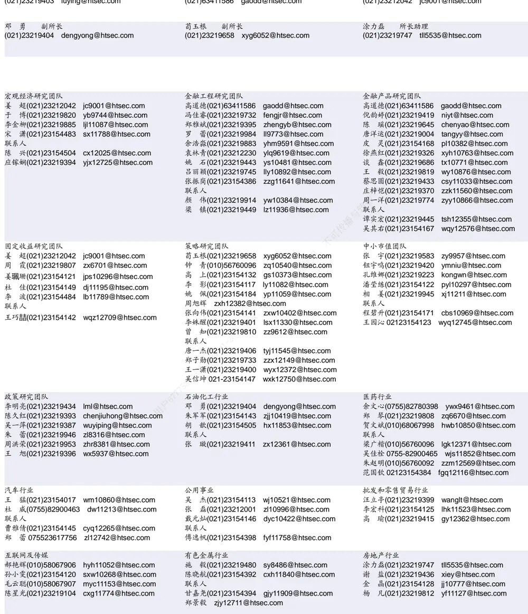

| 电子行业 |  | 煤炭行业 | 电力设备及新能源行业 |  |
| --- | --- | --- | --- | --- |
|  | 陈 平(021)23219646 cp9808@htsec.com | 李 淼(010)58067998 Im10779@htsec.com | 张一弛(021)23219402 zyc9637@htsec.com |  |
|  | 尹 苓(021)23154119 yl11569@htsec.com | 戴元灿(021)23154146 dyc10422@htsec.com | 房 青(021)23219692 fangq@htsec.com |  |
|  | 谢 磊(021)23212214 xl10881@htsec.com | 吴 杰(021)23154113 wj10521@htsec.com | 曾 彪(021)23154148 zb10242@htsec.com |  |
|  |  | 联系人 | 徐柏乔(021)23219171 xbq6583@htsec.com |  |
|  |  | 王 涛(021)23219760 wt12363@htsec.com |  | 陈佳彬(021)23154513 cjb11782@htsec.com |

| 基础化工行业 |  | 计算机行业 |  | 通信行业 |  |
| --- | --- | --- | --- | --- | --- |
| 刘 威(0755)82764281 Iw10053@htsec.com |  | 郑宏达(021)23219392 | zhd10834@htsec.com | 朱劲松(010)50949926 | zjs10213@htsec.com |
| 刘海荣(021)23154130 | Ihr10342@htsec.com | 杨 林(021)23154174 | yl11036@htsec.com | 余伟民(010)50949926 | ywm11574@htsec.com |
| 张翠翠(021)23214397 | zcc11726@htsec.com | 鲁 立(021)23154138 | II11383@htsec.com | 张峥青(021)23219383 | zzq11650@htsec.com |
| 孙维容(021)23219431 | swr12178@htsec.com | 于成龙 ycl12224@htsec.com |  | 张 弋01050949962 | zy12258@htsec.com |
| 联系人 |  | 黄竞晶(021)23154131 | hjj10361@htsec.com | 联系人 |  |
| 李 智(021)23219392 | lz11785@htsec.com | 洪 琳(021)23154137 | hl11570@htsec.com | 杨彤昕 010-56760095 | ytx12741@htsec.com |

| 非银行金融行业 |  | 交通运输行业 |  | 纺织服装行业 |  | 梁 希(021)23219407 lx11040@htsec.com |
| --- | --- | --- | --- | --- | --- | --- |
|  | 孙 婷(010)50949926 st9998@htsec.com |  | 虞 楠(021)23219382 yun@htsec.com |  |  |  |
|  | 何 婷(021)23219634 ht10515@htsec.com |  |  | 罗月江(010）56760091 lyj12399@htsec.com | 联系人 |  |
|  | 李芳洲(021)23154127 Ifz11585@htsec.com |  |  | 李 轩(021)23154652 lx12671@htsec.com | 盛 开(021)23154510 sk11787@htsec.com |  |
| 联系人 |  |  | 联系人 |  | 刘 | 溢(021)23219748 ly12337@htsec.com |
| 任广博(021)23154388 rgb12695@htsec.com |  |  | 李 丹(021)23154401 Id11766@htsec.com |  |  |  |

| 建筑建材行业 | 机械行业 |  | 钢铁行业 |
| --- | --- | --- | --- |
| 冯晨阳(021)23212081 fcy10886@htsec.com | 余炜超(021)23219816 swc11480@htsec.com |  | 刘彦奇(021)23219391 liuyq@htsec.com |
| 潘莹练(021)23154122 pyl10297@htsec.com | 耿 耘(021)23219814 | gy10234@htsec.com | 刘 璇(0755)82900465 lx11212@htsec.com |
| 申 浩(021)23154114 sh12219@htsec.com | 杨 震(021)23154124 yz10334@htsec.com |  | 联系人 |
|  | 沈伟杰(021)23219963 swj11496@htsec.com |  | 周慧琳(021)23154399 zh11756@htsec.com |
|  | 周 丹 zd12213@htsec.com |  |  |

| 建筑工程行业 | 农林牧渔行业 |  | 食品饮料行业 |
| --- | --- | --- | --- |
| 杜市伟(0755)82945368 dsw11227@htsec.com | 丁 频(021)23219405 dingpin@htsec.com | 可传播 | 闻宏伟(010)58067941 whw9587@htsec.com |
| 张欣劼 zxj12156@htsec.com | 陈雪丽(021)23219164 cxl9730@htsec.com |  | 唐 宇(021)23219389 ty11049@htsec.com |
| 李富华(021)23154134 Ifh12225@htsec.com | 陈 阳(021)23212041 cy10867@htsec.com 联系人 孟亚琦 |  |  |

| 军工行业 | 银行行业 | 社会服务行业 |  |
| --- | --- | --- | --- |
| 蒋 俊(021)23154170 jj11200@htsec.com | 孙 婷(010)50949926 st9998@htsec.com |  | 汪立亭(021)23219399 wanglt@htsec.com |
| 刘 磊(010)50949922 II11322@htsec.com | 解巍巍 xww12276@htsec.com |  | 陈扬扬(021)23219671 cyy10636@htsec.com |
| 张恒晅 zhx10170@htsec.com | 林加力(021)23214395Ijl12245@htsec.com | 许樱之 xyz11630@htsec.com |  |
| 联系人 张宇轩(021)23154172 zyx11631@htsec.com | 谭敏沂(0755)82900489 tmy10908@htsec.com N6 |  |  |

| 家电行业 |  | 造纸轻工行业 |
| --- | --- | --- |
| 陈子仪(021)23219244 chenzy@htsec.com |  | 衣桢永(021)23212208 yzy12003@htsec.com |
| 李阳(021)23154382 | ly11194@htsec.com | 赵洋(021)23154126 zy10340@htsec.com |
| 朱默辰(021)23154383 | zmc11316@htsec.com |  |
| 联系人 | 7户6777539 |  |
| 刘 璐(021)23214390 II11838@htsec.com |  |  |

## 研究所销售团队

深广地区销售团队

蔡铁清(0755)82775962 ctq5979@htsec.com

伏财勇(0755)23607963 fcy7498@htsec.com

辜丽娟(0755)83253022 gulj@htsec.com

刘晶晶(0755)83255933 liujj4900@htsec.com

王雅清(0755)83254133 wyq10541@htsec.com

饶 伟(0755)82775282 rw10588@htsec.com

欧阳梦楚(0755)23617160

oymc11039@htsec.com

巩柏含 gbh11537@htsec.com

上海地区销售团队
胡雪梅(021)23219385 huxm@htsec.com
朱 健(021)23219592 zhuj@htsec.com
季唯佳(021)23219384 jiwj@htsec.com
黄 毓(021)23219410 huangyu@htsec.com
漆冠男(021)23219281 qgn10768@htsec.com
胡宇欣(021)23154192 hyx10493@htsec.com
黄 诚(021)23219397 hc10482@htsec.com
毛文英(021)23219373 mwy10474@htsec.com
马晓男 mxn11376@htsec.com
杨祎昕(021)23212268 yyx10310@htsec.com
张思宇 zsy11797@htsec.com
王朝领 wcl11854@htsec.com
邵亚杰 23214650 syj12493@htsec.com
李 寅 021-23219691 ly12488@htsec.com
北京地区销售团队
殷怡琦(010)58067988 yyq9989@htsec.com
郭 楠 010-5806 7936 gn12384@htsec.com
张丽萱(010)58067931 zlx11191@htsec.com
杨羽莎(010)58067977 yys10962@htsec.com
杜 飞 df12021@htsec.com
何 嘉(010)58067929 hj12311@htsec.com
李 婕 lj12330@htsec.com
欧阳亚群 oyyq12331@htsec.com
郭金垚 gjy12727@htsec.com

海通证券股份有限公司研究所

地址：上海市黄浦区广东路 689号海通证券大厦 9楼

电话：（021）23219000

传真：（021）23219392

网址：www.htsec.com