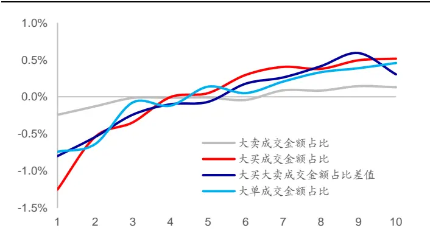
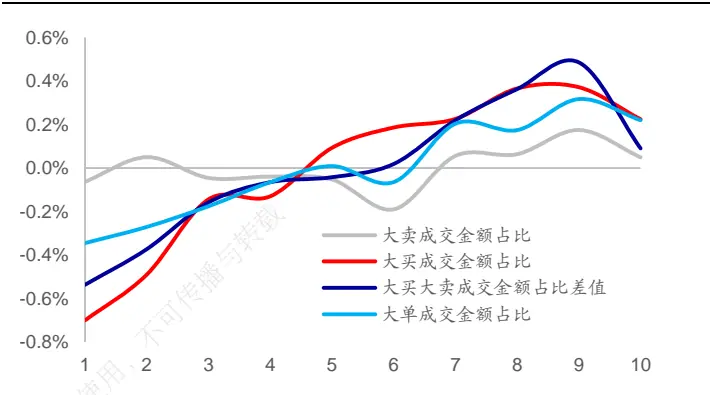
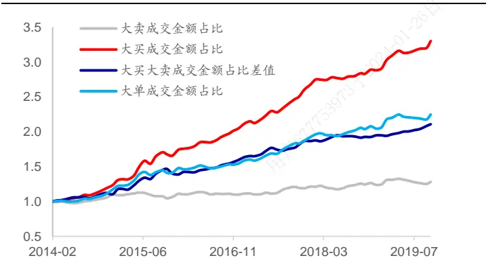
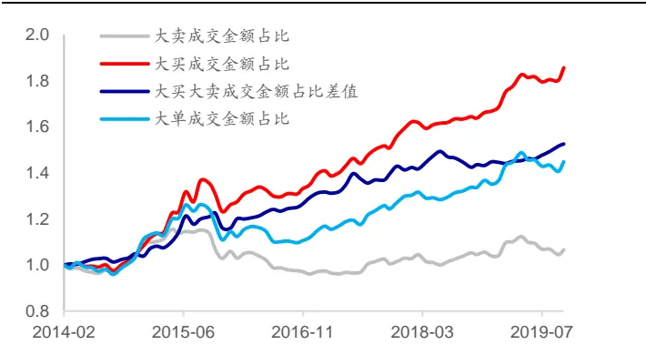
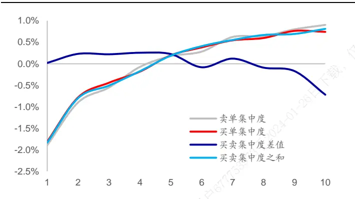
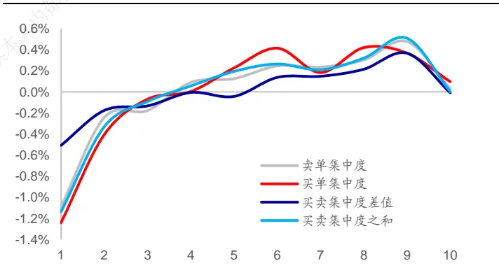
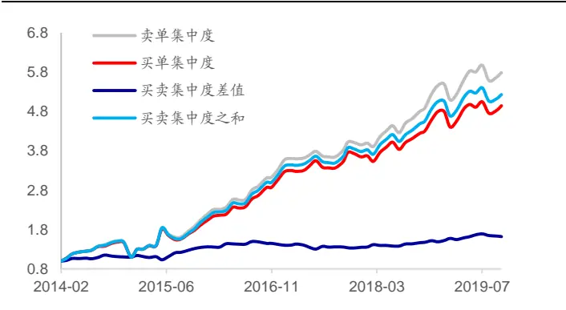
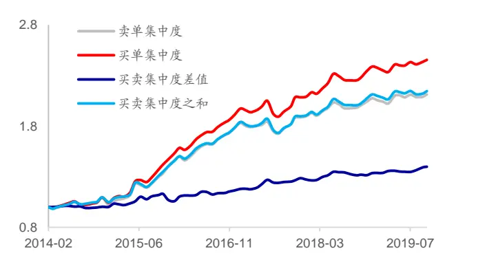
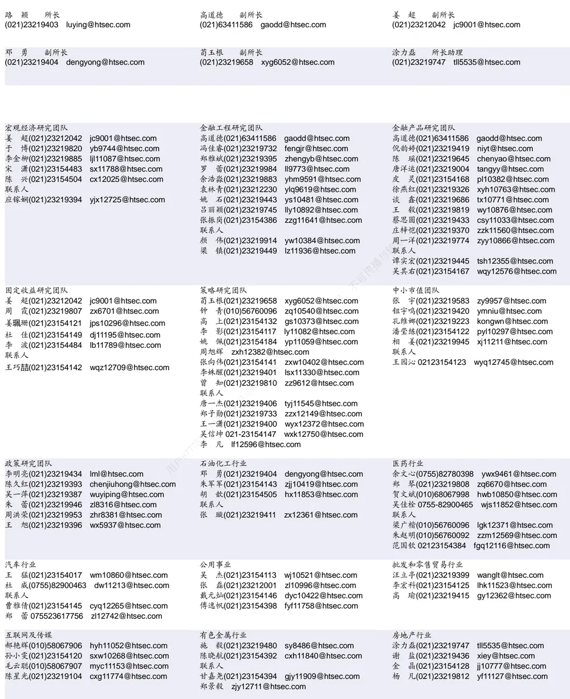

[Tab相关研究

Table_ReportInfo]《基本面量化与另类数据应用的实践》

2019.10.28

《基金经理的偏好圈与能力圈》

2019.10.23

《选股因子系列研究（五十五）——价量

波动幅度》2019.09.24

分析师:冯佳睿

Tel:(021)23219732

Email:fengjr@htsec.com

证书:S0850512080006

分析师:袁林青

Tel:(021)23212230

Email:ylq9619@htsec.com

证书:S0850516050003

分析师:余浩淼

Tel:(021)23219883

Email:yhm9591@htsec.com

证书:S0850516050004

# 选股因子系列研究（五十六）——买卖单数据中的 Alpha

## 投资要点：

在《选股因子系列研究（四十六）——日内分时成交中的玄机》、《选股因子系列研究（四十七）——捕捉投资者的交易意愿》、《选股因子系列研究（四十九）——当下跌遇到托底》等报告中，我们讨论了分钟级以及 级因子的构建，本文更进一步，尝试基于逐笔数据构建因子。不同于系列专题报告《选股因子系列研究(十一)——Level2 行情选股因子初探》中的因子构建方法，本文基于逐笔数据的叫买序号以及叫卖序号，将逐笔成交数据合成为买卖单数据，并基于买卖单数据构建了相关选股因子刻画股票日内交易结构。

- 从“笔”数据到“单”数据。在逐笔数据中，投资者往往比较关注 BS 标志，并常常围绕该字段构建因子。然而，除了 BS 标志外，叫卖序号以及叫买序号同样值得关注。我们可基于逐笔数据中的叫卖序号以及叫买序号合成得到买卖单数

- 大单成交金额占比类因子在正交后具有显著的选股能力。在剔除常规因子的影响后，大买成交金额占比、大买大卖成交金额占比差值皆呈现出了显著的正向选股能力。也即，在控制了常规因素的影响后，大买成交金额占比越高或者大买成交金额占比越高于大卖成交金额占比，股票未来的超额收益表现越好。

- 集中度因子在正交前后皆具有显著的选股能力。从原始因子的角度看，除买卖集中度差值外，其余因子皆呈现出了较为显著的选股能力。股票的集中度越高，未来的超额收益表现越好。在正交剔除了常规因子的影响后，集中度因子依旧呈现出了较为明显的截面选股能力。除买卖集中度差值外，其余因子皆与股票未来收益正相关。

- 大单成交金额占比类因子在中大盘范围内依旧具有显著的选股能力。大买成交金额占比、大买大卖成交金额占比差值因子在中证 800 指数内、中证 500 指数内以及沪深 300 指数内皆呈现出了显著的选股能力。而集中度因子的选股能力主要集中于中小市值的股票范围中。

- 月度有效的因子在更高的换仓频率下依旧有效。月度换仓时有效的因子，如大买成交金额占比、大买大卖成交金额占比差值、买单集中度以及卖单集中度因子，在更高的换仓频率下依旧具有显著的选股能力，且选股能力的稳定性也随着换仓频率的提升而有所提升。

- 风险提示。市场系统性风险、资产流动性风险以及政策变动风险会对策略表现产生较大影响。

在《选股因子系列研究（四十六）——日内分时成交中的玄机》、《选股因子系列研究（四十七）——捕捉投资者的交易意愿》、《选股因子系列研究（四十九）——当下跌遇到托底》等报告中，我们讨论了分钟级以及 TICK级因子的构建，本文更进一步，尝试基于逐笔数据构建因子。不同于系列专题报告《选股因子系列研究(十一)——Level2行情选股因子初探》中的因子构建方法，本文基于逐笔数据的叫买序号以及叫卖序号，将逐笔成交数据合成为买卖单数据，并基于买卖单数据构建了相关选股因子刻画股票日内交易结构。

本文第一章简要阐述了买卖单数据处理的大体思路，第二章展示了大单成交占比类因子的选股能力，第三章展示了成交集中度因子的选股能力，第四章展示了因子间的相关性情况，第五章讨论了不同选股范围内因子的表现，第六章讨论了不同调仓频率下的因子表现。第七章对全文进行了总结。第八章提示了风险。

## 1. 从“笔”到“单”

在逐笔数据中，投资者往往比较关注 BS标志，并常常围绕该字段构建因子。然而，在逐笔数据的相关字段中，除了 BS 标志值得关注外，叫卖序号以及叫买序号同样值得关注。下表展示了某股票在 2019 年 7 月 1 日的部分逐笔成交数据。

表 1 某股票 2019年 7月 1日部分逐笔成交数据

| 日期 | 时间 | 成交编号 | BS 标志 | 成交价格 | 成交数量 | 叫卖序号 | 叫买序号 |
| --- | --- | --- | --- | --- | --- | --- | --- |
| 20190701 | 93149440 | 1164653 | S | 14.1 | 1500 | 1164652 | 1153445 |
| 20190701 | 93149630 | 1165310 | S | 14.1 | 100 | 1165309 | 1153445 |
| 20190701 | 93150000 | 1166576 | S | 14.1 | 100 | 1166575 | 1153445 |
| 20190701 | 93150340 | 1167827 | S | 14.1 | 500 | 1167826 | 1153445 |
| 20190701 | 93150340 | 1167828 | S | 14.1 | 100 | 1167826 | 1161010 |
| 20190701 | 93150340 | 1167829 | S | 14.1 | 1000 | 1167826 | 1161079 |
| 20190701 | 93150340 | 1167830 | S | 14.1 | 1000 | 1167826 | 1165680 |
| 20190701 | 93150340 | 1167831 | S | 14.1 | 300 | 1167826 | 1166375 |
| 20190701 | 93150570 | 1168869 | B | 14.1 | 3700 | 1167826 | 1168868 |
| 20190701 | 93150570 | 1168870 | B | 14.1 | 1000 | 1168607 | 1168868 |
| 20190701 | 93150570 | 1168871 | B | 14.11 | 5300 | 1160429 | 1168868 |

资料来源：Wind，海通证券研究所

由于一个买单或者卖单会因对手盘的挂单结构而被切分为多笔成交，因此在刻画投资者行为时，可将逐笔成交数据还原为买卖单数据，并从买卖单的角度进行分析。

以上表展示的数据为例，前 笔成交的叫买序号皆为 ，而叫卖序号则各不相同，因此可知某投资者在下买单时的量为2200股，而对应的4个卖单的量分别为1500股、 股、 股以及 股。相比于将 笔成交数据分别进行分析，将 笔成交数据还原成对应的买单以及卖单更具有逻辑性。由于无法基于数据字段直接区分投资者，买卖单数据更适于进行投资者行为的刻画。本文后续讨论的所有因子皆是基于买卖单数据计算得到的。更多处理细节可联系报告作者。

## 2. 大单成交金额占比类因子

由于股票成交中的大买单以及大卖单广受投资者关注，我们可基于买卖单数据尝试构建大单成交金额占比因子。本文在识别大单时，并未考虑使用绝对阈值。基于绝对阈值筛选得到的大单往往会与股票市值以及股价存在较为明显的关联，50 万的买单在某些大盘股或者高股价股票中并不一定能够算作大单，但在小盘股或者低价股中却可被认定为大单。

基于以上原因，本文使用了“N 倍标准差”的方式，在每个交易日对于每个股票单独设定大单筛选阈值。每个交易日，各股票的大单筛选流程如下：

1） 基于股票买卖单成交量，计算成交量标准差；

2） 将成交量大于均值+N 倍标准差的买卖单认定为大单。

基于以上筛选流程得到的大单数据，可计算以下大单成交金额占比指标：

$$
大卖成交金额占比_{i,t}=\frac{大卖成交金额_{i,t}}{总成交金额_{i,t}}
$$

$$
大买成交金额占比_{i,t}=\frac{大买成交金额_{i,t}}{总成交金额_{i,t}}
$$

$$
大买大卖成交金额占比差值_{_{i,t}}=\frac{大买成交金额_{_{i,t}}}{总成交金额_{_{i,t}}}-\frac{大卖成交金额_{_{i,t}}}{总成交金额_{_{i,t}}}
$$

$$
大单成交金额占比_{i,t}=\frac{大买成交金额_{i,t}}{总成交金额_{i,t}}+\frac{大卖成交金额_{i,t}}{总成交金额_{i,t}}
$$

其中，总成交金额 $^{\mathrm{i,t}}$ 为股票 i在交易日 t的总成交金额，大买成交金额 $^{\mathrm{i,t}}$ 为股票 i在交易日 t 的大买单成交金额，大卖成交金额 $^{\mathrm{i,t}}$ 为股票 i在交易日 t的大卖单成交金额。

本章基于以上指标首先构建了月度因子。月度因子值为各指标前 交易日的均值。本文在后文中同样会讨论因子在不同调仓频率下的表现。下表展示了各大单成交金额占比因子在正交前后的截面选股能力。由于在筛选大单时需要设定参数 ，本章分别展示了 N=1 以及 N=3 时因子的选股能力。需要说明的是，下表以及后文中的正交因子为剔除了行业、市值、中盘、换手、反转、波动、估值、盈利以及盈利成长后的因子。

表 2 大单成交金额占比因子的截面选股能力（2014.01~2019.10）

| 因子参数 | 因子类型 | 因子名称 | IC 均值 | ICIR | IC 为正比率 | 多空收益 | 多头收益 |
| --- | --- | --- | --- | --- | --- | --- | --- |
| 1 倍标准差 | 原始因子 | 大卖成交金额占比 | 0.023 | 0.704 | 54% | 0.96% | 0.41% |
|  |  | 大买成交金额占比 | 0.017 | 0.432 | 51% | 0.66% | 0.10% |
|  |  | 大买大卖成交金额占比差值 | -0.004 | -0.146 | 57% | -0.14% | -0.17% |
|  |  | 大单成交金额占比 | 0.022 | 0.549 | 48% | 0.88% | 0.35% |
|  | 正交因子 | 大卖成交金额占比 | 0.010 | 0.840 | 64% | 0.37% | 0.13% |
|  |  | 大买成交金额占比 | 0.046 | 3.622 | 84% | 1.77% | 0.52% |
|  |  | 大买大卖成交金额占比差值 | 0.034 | 3.027 | 78% | 1.10% | 0.30% |
| 大单成交金额占比 |  | 0.034 | 2.677 | 74% | 1.20% | 0.46% |  |
| 3倍标准差 | 原始因子 | 大卖成交金额占比 | 0.001 | 0.023 | 51% | 0.03% | 0.05% |
|  |  | 大买成交金额占比 | -0.012 | -0.271 | 41% | -0.66% | 0.32% |
|  |  | 大买大卖成交金额占比差值 | -0.013 | -0.603 | 52% | -0.41% | -0.03% |
|  |  | 大单成交金额占比 | -0.007 | -0.144 | 45% | -0.38% | 0.27% |
|  | 正交因子 | 大卖成交金额占比 | 0.003 | 0.228 | 52% | 0.11% | 0.05% |
|  |  | 大买成交金额占比 | 0.025 | 1.795 | 68% | 0.92% | 0.22% |
|  |  | 大买大卖成交金额占比差值 | 0.021 | 2.036 | 74% | 0.63% | 0.09% |
| 大单成交金额占比 |  | 0.016 | 1.054 | 64% | 0.57% | 0.22% |  |

资料来源：Wind，海通证券研究所

观察上表不难发现，大单成交金额占比类因子在从原始因子的角度看并未呈现出明显的截面选股能力。其主要原因是，因子与市值正相关，市值较大的股票更容易呈现大单占比较高的特征。在剔除常规因子的影响后，大买成交金额占比、大买大卖成交金额占比差值皆呈现出了显著的正向选股能力。也即，在控制了常规因素的影响后，大买成交金额占比越高或者大买成交金额占比越高于大卖成交金额占比，股票未来的超额收益表现越好。此外，通过对比不同参数下因子的表现可知，过于严格的大单删选标准会减弱因子的选股能力。随着筛选标准的提升，各股票间的区分度会越来越弱。

下图进一步展示了不同参数下正交因子的月度超额收益分布情况。在正交后，因子呈现出了较强的收益区分能力。在 N=1 的情况下，因子前后 10%多空收益差高于 1%，然而在 N=3 的情况下，因子前后 10%多空收益差会下降至 1%以内。

图1 大单成交金额占比类因子分组收益（1 倍标准差）（2014.01~2019.10）

资料来源：Wind，海通证券研究所

图2 大单成交金额占比类因子分组收益（3 倍标准差）（2014.01~2019.10）

资料来源：Wind，海通证券研究所

下图展示了正交后大单成交金额占比类因子的多空相对强弱净值走势。

图3 大单成交金额占比因子多空净值（1倍标准差）

资料来源：Wind，海通证券研究所

图4 大单成交金额占比因子多空净值（1倍标准差）

资料来源：Wind，海通证券研究所

自 2014 年以来，大买成交金额占比因子具有较好的收益表现。在 1倍标准差筛选法下，因子多空年化收益达 ，月度胜率达 。下表展示了各正交因子的分年度收益表现。观察因子分年度表现可知，部分因子稳定性较强，在大部分的市场环境下皆具有较好的收益区分能力。

表 3 大单成交金额占比因子分年度多空收益

| 年份 | 1 倍标准差 |  |  |  | 3倍标准差 |  |  |  |
| --- | --- | --- | --- | --- | --- | --- | --- | --- |
|  | 大卖成交金额 占比 | 大买成交金额 占比 | 大买大卖成交 金额占比差值 | 大单成交金额 占比 | 大卖成交金额 占比 | 大买成交金额 占比 | 大买大卖成交 金额占比差值 | 大单成交金额 占比 |
| 2014 | 10.3% | 23.4% | 10.3% | 17.2% | 11.2% | 8.3% | 3.8% | 11.1% |
| 2015 | 0.7% | 41.2% | 25.9% | 26.1% | -4.7% | 16.5% | 11.7% | 3.0% |
| 2016 | 0.3% | 21.5% | 17.9% | 7.4% | -8.3% | 10.6% | 13.2% | 0.5% |
| 2017 | 8.9% | 26.3% | 14.1% | 21.0% | 6.0% | 14.2% | 7.7% | 12.9% |
| 2018 | 2.0% | 7.8% | 4.4% | 6.5% | 0.9% | 4.7% | 2.5% | 4.1% |
| 截至 2019年10月 | 3.5% | 14.6% | 8.2% | 9.8% | 2.5% | 11.3% | 5.4% | 7.2% |
| 全区间 | 4.3% | 22.7% | 13.6% | 14.9% | 1.1% | 11.2% | 7.5% | 6.6% |

资料来源：Wind，海通证券研究所

总体来看，正交后的大单成交金额占比因子具有显著的选股能力，大买或者大买减大卖成交金额占比越高，股票未来的收益表现越强。这一回测结果也与直观理解较为吻合。在控制其他风险因素后，受到大资金关注的股票，往往在未来具有更好的表现。

需要注意的是，因子的收益表现在一定程度上取决于大单的界定方法。若将大单的的筛选标准设定得过于严格，则可能存在部分股票无法筛选得到大单的情况，从而导致股票之间缺乏区分度，而若将大单的筛选标准设定得过于宽松，则无法有效筛出大单。

## 3. 成交集中度类因子

大单成交金额占比类因子从大单的角度刻画了股票日内的交易结构，然而由于该因子选股能力在一定程度上受到大单筛选方法的影响，因此本章尝试从交易集中度的角度刻画股票在日内的交易结构。

基于各股票的买卖单数据，可计算以下指标：

$$
\begin{aligned}&卖单集中度_{_{i,t}}=\frac{\sum_{k=1}^{N_{i,t}}卖单成交金额_{_{i,t,k}^{2}}^{2}}{总成交金额_{_{i,t}}^{2}}\\&买单集中度_{_{i,t}}=\frac{\sum_{k=1}^{N_{i,t}}关单成交金额_{_{i,t,k}^{2}}^{2}}{总成交金额_{_{i,t}}^{2}}\\&买卖单集中度差值_{_{i,t}}=\frac{\sum_{k=1}^{N_{i,t}}关单成交金额_{_{i,t,k}^{2}}^{2}}{总成交金额_{_{i,t}}^{2}}-\frac{\sum_{k=1}^{N_{i,t}}卖单成交金额_{_{i,t,k}^{2}}^{2}}{总成交金额_{_{i,t}}^{2}}\\&买卖单集中度之和_{_{i,t}}=\frac{\sum_{k=1}^{N_{i,t}}关单成交金额_{_{i,t,k}^{2}}^{2}}{总成交金额_{_{i,t}}^{2}}+\frac{\sum_{k=1}^{N_{i,t}}卖单成交金额_{_{i,t,k}^{2}}^{2}}{总成交金额_{_{i,t}}^{2}}\end{aligned}
$$

其中，买单成交金额 $\mathsf{i,}\mathsf{t,}\mathsf{k}$ 为股票 i在交易日 t的第 k 个买单的成交金额，卖单成交金额 $\mathrm{i,}\mathrm{t,}\mathrm{k}$ 为股票 i在交易日 t 的第 k个卖单的成交金额，总成交金额 $^{\mathrm{i,t}}$ 为股票 i在交易日 t的总成交金额。

本章基于以上指标首先构建了月度因子，各股票的月度因子值为前 20日指标值的均值。由于指标值的截面分布存在较为明显的偏度，我们建议投资者在计算因子值时进行对数调整。本文在后文中同样会讨论因子在不同调仓频率下的表现。下表展示了各集中度因子在正交前后的截面选股能力。

表 4 集中度因子截面选股能力（2014.01~2019.10）

| 因子类型 | 因子名称 | IC 均值 | ICIR | IC 为正比率 | 多空收益 | 多头收益 |
| --- | --- | --- | --- | --- | --- | --- |
| 原始 | 卖单集中度 | 0.079 | 1.992 | 78% | 2.79% | 0.90% |
|  | 买单集中度 | 0.072 | 1.842 | 78% | 2.55% | 0.74% |
|  | 买卖集中度差值 | -0.021 | -0.995 | 43% | -0.74% | 0.02% |
|  | 买卖集中度之和 | 0.074 | 1.879 | 77% | 2.64% | 0.81% |
| 正交因子 | 卖单集中度 | 0.027 | 1.595 | 72% | 1.12% | 0.03% |
|  | 买单集中度 | 0.030 | 1.731 | 70% | 1.34% | 0.10% |
|  | 买卖集中度差值 | 0.015 | 1.456 | 70% | 0.50% | -0.01% |
|  | 买卖集中度之和 | 0.027 | 1.545 | 70% | 1.14% | 0.00% |

资料来源：Wind，海通证券研究所

从原始因子的角度看，除买卖集中度差值外，其余因子皆呈现出了较为显著的选股能力。股票的集中度越高，未来的超额收益表现越好。值得注意的是，买单集中度因子与卖单集中度因子的 IC方向相同，并未呈现出“买单集中度具有看多能力，卖单集中度具有看空能力”的现象。

在正交剔除了常规因子的影响后，集中度因子依旧呈现出了较为明显的截面选股能力。除买卖集中度差值外，其余因子皆与股票未来收益正相关。也即，在控制了常规因素的影响后，股票集中度越高，未来的超额收益表现越好。

下图展示了集中度因子在正交前后的月度超额收益分布情况。

图5 集中度因子分组收益（正交前）（2014.01~2019.10）

资料来源：Wind，海通证券研究所

图6 集中度因子分组收益（正交后）（2014.01~2019.10）

资料来源：Wind，海通证券研究所

除了买卖集中度差值外，集中度因子组间收益具有较为明显的单调性。在正交剔除了其他因子的影响后，多头组间的收益单调性有所减弱，而空头组间的收益单调性依旧较强。

下图进一步展示了正交前后各集中度因子的多空相对强弱净值走势。

图7 集中度因子多空净值（正交前）

资料来源：Wind，海通证券研究所

图8 集中度因子多空净值（正交后）

资料来源： ，海通证券研究所

自 2014 年以来，买单集中因子与卖单集中度因子多空年化收益高于 30%。在正交后，两因子多空年化收益分别为 13%以及 16%，月度胜率达 70%。下表展示了各因子的分年度收益表现。观察因子分年度表现可知，因子稳定性较强，在大部分的市场环境下皆具有较好的收益区分能力。

值得注意的是，不同于大单成交金额占比因子，集中度因子的选股能力在 2019 年以来有所减弱。由此可知，两类因子虽然都旨在刻画股票日内交易结构，但是两者关注的方向有所不同。大单成交金额占比类因子关注的是大单整体的特征，而集中度因子关注的是日内买卖单成交金额分布的均匀程度，两者依旧存在一定的区别。

表 5 集中度因子分年度多空收益

|  | 原始因子 |  |  |  | 正交因子 |  |  |  |
| --- | --- | --- | --- | --- | --- | --- | --- | --- |
|  | 卖单集中度 | 买单集中度 | 买卖集中度 差值 | 买卖集中度 之和 | 卖单集中度 | 买单集中度 | 买卖集中度 差值 | 买卖集中度 之和 |
| 年份 2014 | 10.1% | 10.8% | 9.8% | 10.1% | 2.2% | 4.4% | 0.2% | 4.9% |
| 2015 | 99.4% | 84.0% | 23.7% | 92.4% | 43.1% | 46.6% | 5.7% | 38.9% |
| 2016 | 62.6% | 60.3% | 3.0% | 61.0% | 25.0% | 28.9% | 11.5% | 26.4% |
| 2017 | 10.7% | 11.6% | -3.7% | 10.8% | 3.7% | 6.0% | 7.8% | 3.5% |
| 2018 | 38.2% | 31.6% | 10.4% | 33.6% | 9.4% | 14.2% | 5.0% | 10.8% |
| 截至 2019年10月 | 6.0% | 3.1% | 8.8% | 3.5% | 1.8% | 2.8% | 4.7% | 1.6% |
| 全区间 | 35.1% | 31.5% | 8.6% | 32.8% | 13.7% | 16.6% | 5.9% | 14.0% |

资料来源：Wind，海通证券研究所

总体来看，集中度因子具有较为显著的截面选股能力。不同于大单成交金额占比类因子，因子的计算并不依赖于大单的界定。从因子表现上判断，集中度因子与大单成交金额占比因子刻画了股票日内交易结构中不同的方面。

## 4. 因子相关性

下表展示了大单成交金额占比类因子以及集中度因子与常规低频因子之间的截面相关性。观察下表可知，部分大单成交金额占比类因子与市值因子正相关，与换手率因子以及波动率因子负相关，买卖差值相关的因子与反转因子正相关。此外，因子与基本面因子之间的相关性较低。集中度因子与市值因子、换手率因子以及波动率因子负相关，与基本面因子之间的相关性较低。考虑到上述相关性分析的结果，投资者在对于大单成交金额占比类因子以及集中度因子进行正交处理时，可重点剔除行业、市值以及常规技术类因子的影响。

表 6 大单成交金额占比因子、集中度因子与常规低频因子间的截面相关性（2014.01~2019.10）

|  | 市值 | 中盘 | 估值 | 换手 | 反转 | 系统波动 | 特质波动 | 盈利 | 盈利增长 |
| --- | --- | --- | --- | --- | --- | --- | --- | --- | --- |
| 大卖成交金额占比 (1 倍标准差) | 0.30 | -0.12 | -0.35 | -0.35 | -0.22 | -0.17 | -0.23 | -0.11 | 0.05 |
| 大买成交金额占比 (1 倍标准差) | 0.31 | -0.08 | -0.22 | -0.29 | 0.34 | -0.26 | -0.18 | -0.08 | 0.05 |
| 大买大卖成交金额占比差值 (1 倍标准差) | 0.05 | 0.03 | 0.11 | 0.04 | 0.52 | -0.10 | 0.04 | 0.03 | 0.00 |
| 大单成交金额占比 (1 倍标准差) | 0.37 | -0.12 | -0.33 | -0.37 | 0.09 | -0.26 | -0.24 | -0.11 | 0.06 |
| 大卖成交金额占比 (3 倍标准差) | 0.48 | -0.17 | -0.35 | -0.32 | -0.14 | -0.21 | -0.19 | -0.10 | 0.06 |
| 大买成交金额占比 (3 倍标准差) | 0.49 | -0.13 | -0.22 | -0.24 | 0.31 | -0.26 | -0.13 | -0.06 | 0.06 |
| 大买大卖成交金额占比差值 (3 倍标准差) | 0.03 | 0.05 | 0.14 | 0.07 | 0.47 | -0.07 | 0.06 | 0.04 | -0.01 |
| 大单成交金额占比 (3 倍标准差) | 0.55 | -0.17 | -0.32 | -0.32 | 0.09 | -0.27 | -0.18 | -0.09 | 0.07 |
| 卖单集中度 | -0.43 | 0.13 | -0.13 | -0.48 | -0.12 | -0.28 | -0.41 | -0.10 | -0.05 |
| 买单集中度 | -0.42 | 0.14 | -0.10 | -0.45 | 0.00 | -0.29 | -0.39 | -0.09 | -0.06 |
| 买卖集中度差值 | 0.01 | 0.05 | 0.14 | 0.10 | 0.48 | -0.03 | 0.08 | 0.03 | 0.00 |
| 买卖集中度之和 | -0.43 | 0.14 | -0.11 | -0.47 | -0.06 | -0.29 | -0.40 | -0.10 | -0.06 |

资料来源：Wind，海通证券研究所

下表展示了大单成交金额占比类因子以及集中度因子与系列前期报告提出的高频因子之间的截面相关性。观察下表可知，集中度因子与尾盘委托成交相关性因子之间的相关性较强。基于后续分析发现，两类因子皆与换手率因子高度相关，在剔除了换手率因子的影响后，集中度因子与委托成交相关性因子之间的相关性较为可控。

表 7 大单成交金额占比因子、集中度因子与部分高频因子间的截面相关性（2014.01~2019.10）

|  | 尾盘成交占比 | 单笔净流出金 额占比 | 大单推动涨幅 | 高频偏度 | 下行波动占比 | 开盘后平均净 委买变化率 | 尾盘委托成交 相关性 |
| --- | --- | --- | --- | --- | --- | --- | --- |
| 大卖成交金额占比 (1 倍标准差) | -0.12 | 0.25 | -0.15 | -0.32 | 0.40 | 0.08 | -0.33 |
| 大买成交金额占比 (1 倍标准差) | -0.13 | 0.16 | 0.08 | -0.03 | -0.03 | 0.19 | -0.34 |
| 大买大卖成交金额占比差值 (1 倍标准差) | -0.02 | -0.08 | 0.22 | 0.26 | -0.39 | 0.11 | -0.02 |
| 大单成交金额占比 (1 倍标准差) | -0.15 | 0.23 | -0.03 | -0.20 | 0.20 | 0.17 | -0.39 |
| 大卖成交金额占比 (3 倍标准差) | -0.19 | 0.16 | -0.04 | -0.29 | 0.35 | 0.04 | -0.31 |
| 大买成交金额占比 (3 倍标准差) | -0.18 | 0.01 | 0.23 | -0.01 | -0.04 | 0.11 | -0.30 |
| 大买大卖成交金额占比差值 (3 倍标准差) | 0.02 | -0.16 | 0.28 | 0.30 | -0.42 | 0.08 | 0.02 |
| 大单成交金额占比 (3 倍标准差) | -0.20 | 0.09 | 0.11 | -0.16 | 0.17 | 0.09 | -0.35 |
| 卖单集中度 | 0.26 | 0.34 | -0.38 | -0.17 | 0.27 | 0.25 | -0.53 |
| 买单集中度 | 0.26 | 0.29 | -0.31 | -0.09 | 0.16 | 0.26 | -0.51 |
| 买卖集中度差值 | -0.01 | -0.18 | 0.29 | 0.33 | -0.43 | 0.07 | 0.04 |
| 买卖集中度之和 | 0.26 | 0.32 | -0.34 | -0.13 | 0.21 | 0.26 | -0.52 |

资料来源：Wind，海通证券研究所

## 5. 不同选股范围内的因子表现

考虑到不同投资者的选股范围各有不同，本章重点讨论了大单成交金额占比类因子与集中度因子在中证 800 指数、中证 500 指数以及沪深 300 指数中的选股能力。

## 5.1 中证 800指数内选股能力

下表展示了各正交因子在中证 800 指数内的截面选股能力。

表 8 大单成交金额占比因子与集中度因子在中证 800指数内的选股能力（2014.01~2019.10）

| 因子名称 | 平均IC | ICIR | IC 为正比率 | 多空收益 | 多头收益 |
| --- | --- | --- | --- | --- | --- |
| 大卖成交金额占比 (1 倍标准差) | 0.01 | 0.61 | 52% | 0.13% | 0.06% |
| 大买成交金额占比 (1 倍标准差) | 0.04 | 3.14 | 81% | 1.39% | 0.43% |
| 大买大卖成交金额占比差值 (1 倍标准差) | 0.03 | 2.41 | 77% | 0.92% | 0.26% |
| 大单成交金额占比 (1 倍标准差) | 0.03 | 2.25 | 81% | 0.92% | 0.36% |
| 大卖成交金额占比 (3倍标准差) | 0.01 | 0.39 | 54% | 0.32% | 0.19% |
| 大买成交金额占比 (3 倍标准差) | 0.03 | 2.00 | 72% | 0.79% | 0.20% |
| 大买大卖成交金额占比差值 (3倍标准差) | 0.02 | 1.64 | 72% | 0.64% | 0.19% |
| 大单成交金额占比 (3 倍标准差) | 0.02 | 1.36 | 68% | 0.54% | 0.19% |
| 卖单集中度 | 0.01 | 0.96 | 62% | 0.48% | -0.10% |
| 买单集中度 | 0.02 | 1.33 | 74% | 0.74% | -0.17% |
| 买卖集中度差值 | 0.02 | 1.29 | 68% | 0.59% | 0.18% |
| 买卖集中度之和 | 0.02 | 1.07 | 67% | 0.69% | -0.11% |

资料来源：Wind，海通证券研究所

观察上表可知，大单成交金额占比类因子，特别是大买成交金额占比，在中证 800指数内依旧具有显著的截面选股能力。然而，集中度因子的选股能力在进入中证 800指数后出现了十分明显的减弱。

## 5.2 中证 500指数内选股能力

下表展示了各正交因子在中证 500 指数内的截面选股能力。大单成交金额占比类因子在中证 500 指数中依旧具有较为显著的截面选股能力。在 1倍标准差筛选法下，大买占比因子的月均 IC 依旧接近 0.04，月度胜率达 80%。然而，集中度因子在该范围内并未呈现出显著的截面选股能力。

表 9 大单成交金额占比因子与集中度因子在中证 500指数内的选股能力（2014.01~2019.10）

| 因子名称 | 平均IC | ICIR | IC 为正比率 | 多空收益 | 多头收益 |
| --- | --- | --- | --- | --- | --- |
| 大卖成交金额占比 (1 倍标准差) | 0.01 | 0.60 | 59% | 0.51% | 0.35% |
| 大买成交金额占比 (1 倍标准差) | 0.04 | 2.59 | 80% | 1.15% | 0.28% |
| 大买大卖成交金额占比差值 (1 倍标准差) | 0.03 | 1.75 | 70% | 0.85% | 0.16% |
| 大单成交金额占比 (1 倍标准差) | 0.03 | 1.83 | 72% | 1.00% | 0.50% |
| 大卖成交金额占比 (3 倍标准差) | 0.01 | 0.46 | 57% | 0.35% | 0.31% |
| 大买成交金额占比 (3 倍标准差) | 0.03 | 1.59 | 65% | 0.66% | 0.14% |
| 大买大卖成交金额占比差值 (3倍标准差) | 0.02 | 1.01 | 64% | 0.38% | 0.01% |
| 大单成交金额占比 (3 倍标准差) | 0.02 | 1.16 | 59% | 0.51% | 0.29% |
| 卖单集中度 | 0.02 | 1.09 | 62% | 0.86% | 0.14% |
| 买单集中度 | 0.03 | 1.29 | 68% | 0.72% | -0.11% |
| 买卖集中度差值 | 0.01 | 0.77 | 59% | 0.53% | 0.03% |
| 买卖集中度之和 | 0.02 | 1.12 | 64% 不可传播 | 0.71% | -0.13% |

资料来源： ，海通证券研究所

## 5.3 沪深 300指数内选股能力

下表展示了各正交因子在沪深 300 指数内的截面选股能力。

表 10 大单成交金额占比因子与集中度因子在沪深 300指数内的选股能力（2014.01~2019.10）

| 因子名称 | 平均IC | ICIR | IC 为正比率 | 多空收益 | 多头收益 |
| --- | --- | --- | --- | --- | --- |
| 大卖成交金额占比 (1 倍标准差) | 0.01 | 0.45 | 58% | 0.53% | 0.18% |
| 大买成交金额占比 (1 倍标准差) | 0.04 7775397 | 2.22 | 75% | 1.32% | 0.34% |
| 大买大卖成交金额占比差值 (1 倍标准差) | 0.03 | 2.13 | 74% | 0.98% | 0.38% |
| 大单成交金额占比 (1 倍标准差) | 0.03 | 1.63 | 71% | 1.26% | 0.58% |
| 大卖成交金额占比 (3 倍标准差) | 0.00 | 0.19 | 49% | 0.19% | -0.05% |
| 大买成交金额占比 (3 倍标准差) | 0.03 | 1.72 | 72% | 0.45% | 0.02% |
| 大买大卖成交金额占比差值 (3 倍标准差) | 0.02 | 1.64 | 65% | 0.49% | 0.02% |
| 大单成交金额占比 (3 倍标准差) | 0.02 | 1.08 | 59% | 0.60% | 0.05% |
| 卖单集中度 | 0.01 | 0.35 | 54% | -0.08% | -0.13% |
| 买单集中度 | 0.01 | 0.87 | 59% | 0.37% | -0.06% |
| 买卖集中度差值 | 0.02 | 1.45 | 65% | 0.47% | -0.13% |
| 买卖集中度之和 | 0.01 | 0.53 | 54% | 0.31% | -0.06% |

资料来源：Wind，海通证券研究所

正交后的大单成交金额占比类因子在沪深300指数中依旧呈现出了较为显著的截面选股能力。在 1倍标准差筛选法下，大买成交金额占比因子的月均 IC为 0.04，月度胜率达 75%，因子月度多空收益为 1.28%。集中度因子在该范围内的选股能力较弱。

## 5.4 本章小结

本章在不同的指数范围内对于因子的选股能力进行了简单回测。回测结果表明，大单成交金额占比类因子在不同的选股范围中都具有较为稳定的选股能力。即使在沪深300 指数中，因子依旧对于股票收益具有较好的预测效果。不同于大单占比类因子，集中度因子的选股能力主要集中于中小市值的股票中，该因子在进入中证 800 指数后基本未呈现出显著的选股能力。

## 6. 不同调仓频率下的因子表现

由于本文所讨论的因子是基于高频数据计算得到，因此因子可应用于不同调仓频率下的选股模型。本章展示了相关因子在 2周、1 周、2天以及 1天调仓频率下的选股能力。需要注意的是，因子值计算窗口会随着调仓频率的变化而改变。例如，2 周调仓的频率下，因子值的计算窗口为前 2周，而在 1周调仓的频率下，因子值的计算窗口为前1 周。

下表展示了不同调仓频率下因子的 IC均值。可以看到，月度有效的因子在更高的换仓频率下依旧具有选股能力。

表 11 不同换仓频率下因子的平均 IC（2014.01~2019.10）

| 因子名称 | 1个月 | 2周 | 1周 2天 | 1天 |
| --- | --- | --- | --- | --- |
| 大卖成交金额占比 (1 倍标准差) | 0.010 | 0.011 | 0.001 | -0.013 |
| 大买成交金额占比 (1 倍标准差) | 0.046 | 0.044 | 0.036 | 0.041 |
| 大买大卖成交金额占比差值 (1 倍标准差) | 0.034 | 0.027 | 0.023 | 0.033 |
| 大单成交金额占比 (1 倍标准差) | 0.034 | 0.036 | 0.032 | 0.028 |
| 大卖成交金额占比 (3 倍标准差) | 0.003 | 0.004 | 0.003 | -0.008 |
| 大买成交金额占比 (3 倍标准差) | 0.025 | 0.021 | 0.007 0.013 0.017 | 0.024 |
| 大买大卖成交金额占比差值 (3倍标准差) | 0.021 | 0.013 | 0.004 0.010 | 0.021 |
| 大单成交金额占比 (3 倍标准差) | 0.016 | 0.015 | 0.014 0.018 | 0.018 |
| 卖单集中度 | 0.027 | 0.027 | 0.029 0.035 | 0.033 |
| 买单集中度 | 0.030 | 0.029 | 0.027 0.037 | 0.046 |
| 买卖集中度差值 | 0.015 | 0.007 | -0.001 0.006 | 0.017 |
| 买卖集中度之和 | 0.027 | 0.026 | 0.027 0.039 | 0.047 |

资料来源：Wind，海通证券研究所

除了 IC外，因子的 ICIR 会随着换仓频率的提升而逐步提升。也即，换仓频率越高，因子表现越稳定。下表展示了不同调仓频率下因子的年化 ICIR。

表 12 不同换仓频率下因子的年化 ICIR（2014.01~2019.10）

| 因子名称 | 1个月 | 2周 | 1周 | 2天 | 1天 |
| --- | --- | --- | --- | --- | --- |
| 大卖成交金额占比 (1 倍标准差) | 0.84 | 1.47 | 2.04 | 0.14 | -3.47 |
| 大买成交金额占比 (1 倍标准差) | 3.62 | 4.91 | 5.97 | 6.79 | 10.23 |
| 大买大卖成交金额占比差值 (1 倍标准差) | 3.03 | 3.30 | 2.63 | 3.82 | 7.26 |
| 大单成交金额占比 (1 倍标准差) | 2.68 | 4.38 | 6.42 | 9.05 | 12.33 |
| 大卖成交金额占比 (3倍标准差) | 0.23 | 0.44 | 1.20 | 0.70 | -2.40 |
| 大买成交金额占比 (3 倍标准差) | 1.80 | 2.23 | 2.03 | 3.04 | 5.85 |
| 大买大卖成交金额占比差值 (3 倍标准差) | 2.04 | 1.83 | 0.69 | 1.84 | 4.94 |
| 大单成交金额占比 (3 倍标准差) | 1.05 | 1.56 | 2.08 | 4.00 | 6.56 |
| 卖单集中度 | 1.59 | 2.52 | 4.03 | 6.17 | 7.76 |
| 买单集中度 | 1.73 | 2.48 | 3.46 | 6.20 | 10.76 |
| 买卖集中度差值 | 1.46 | 1.01 | -0.18 | 1.25 | 4.27 |
| 买卖集中度之和 | 1.55 | 2.34 | 3.60 不可传播与转 | 6.38 | 10.37 |

资料来源：Wind，海通证券研究所

我们可从多空年化收益的角度进一步观察因子在不同换仓频率下的收益区分能力。下表展示了不同调仓频率下因子的年化多空收益。

表 13 不同换仓频率下因子的年化多空收益（2014.01~2019.10）

| 因子名称 | 1个月 | 2周 | 1周 | 2天 | 1天 |
| --- | --- | --- | --- | --- | --- |
| 大卖成交金额占比 (1 倍标准差) | 4.3% | 7.2% | 9.5% | 7.2% | 49.2% |
| 大买成交金额占比 (1 倍标准差) | 22.7% | 32.7% | 36.4% | 79.8% | 165.1% |
| 大买大卖成交金额占比差值 (1 倍标准差) | 13.6% | 19.2% | 16.1% | 55.5% | 142.9% |
| 大单成交金额占比 (1 倍标准差) | 14.9% | 25.4% | 38.1% | 56.7% | 72.6% |
| 大卖成交金额占比 (3 倍标准差) | 1.1% | 3.2% | 5.1% | 1.3% | 35.3% |
| 大买成交金额占比 (3 倍标准差) | 11.2% | 14.1% | 12.5% | 36.0% | 88.0% |
| 大买大卖成交金额占比差值 (3 倍标准差) | 7.5% | 7.5% | 4.7% | 29.5% | 89.6% |
| 大单成交金额占比 (3 倍标准差) | 6.6% | 8.0% | 13.5% | 29.2% | 45.3% |
| 卖单集中度 | 13.7% | 19.7% | 34.0% | 70.3% | 89.2% |
| 买单集中度 | 16.6% | 23.6% | 32.9% | 81.1% | 171.3% |
| 买卖集中度差值 | 5.9% | 4.9% | 0.4% | 22.2% | 68.2% |
| 买卖集中度之和 | 14.0% | 21.4% | 34.6% | 80.2% | 155.2% |

资料来源：Wind，海通证券研究所

回测结果表明，随着换仓频率的提升，在月度换仓时有效的因子的收益区分能力会出现进一步的提升。当然，上表中的多空收益并未考虑交易成本。为了能够更加直观地体现因子的换手率，下表展示了不同调仓频率下因子的跨期因子值自相关性。因子值自相关性越高，因子每期的换手率越低。观察下表可知，除了买卖相减计算得到的因子外，其余因子的因子值自相关性较为适中。因子值自相关性随着调仓频率的提升而呈现出了逐渐下降的态势。

表 14 不同换仓频率下因子的跨期因子值自相关性（2014.01~2019.10）

| 因子名称 | 1个月 | 2周 | 1周 | 2天 | 1天 |
| --- | --- | --- | --- | --- | --- |
| 大卖成交金额占比 (1 倍标准差) | 54% | 42% | 35% | 27% | 20% |
| 大买成交金额占比 (1 倍标准差) | 55% | 44% | 38% | 30% | 23% |
| 大买大卖成交金额占比差值 (1 倍标准差) | 24% | 13% | 16% | 17% | 15% |
| 大单成交金额占比 (1 倍标准差) | 68% | 64% | 58% | 45% | 35% |
| 大卖成交金额占比 (3 倍标准差) | 59% | 47% | 38% | 27% | 19% |
| 大买成交金额占比 (3 倍标准差) | 55% | 44% | 38% | 29% | 21% |
| 大买大卖成交金额占比差值 (3 倍标准差) | 25% | 13% | 15% | 14% | 12% |
| 大单成交金额占比 (3 倍标准差) | 70% | 65% | 59% | 48% | 38% |
| 卖单集中度 | 74% | 65% | 61% | 55% | 48% |
| 买单集中度 | 73% | 65% | 62% | 55% | 47% |
| 买卖集中度差值 | 23% | 10% | 11% | 10% | 8% |
| 买卖集中度之和 | 74% | 67% 7供本 | 64% | 60% | 55% |

资料来源：Wind，海通证券研究所

本章展示了各正交因子在不同调仓频率下的选股能力。综合上述结果可知，月度上有效的选股因子在不同的调仓频率下皆呈现出了显著的选股能力。此外，随着调仓频率的提升，因子选股能力的稳定性以及收益区分能力也呈现出了逐步提升的态势。

## 7. 总结

本文主要基于逐笔数据合成了买卖单数据，并基于买卖单数据构建了相关因子刻画股票日内交易结构。因子整体回测结果具有一定的逻辑性，前期大单买入金额占比较高的股票，未来表现更好。股票日内买卖单成交分布越不均匀，大单特征越明显，股票未来表现越好。

本文同样在不同的选股范围以及不同的选股频率下对于因子的收益表现进行了回测分析。回测结果表明，大买成交金额占比因子在不同的选股范围内皆具有收益区分能力，而集中度因子的选股能力主要集中在中小盘的股票中。此外，随着调仓频率的提升，月度上有效的因子依旧具有截面选股能力，且因子选股能力的稳定性会越来越强。

本文仅初步挖掘了逐笔数据合成得到的买卖单成交量所包含的信息，我们将在后续的报告中对于成交价所包含的信息进行讨论。

## 8. 风险提示

市场系统性风险、资产流动性风险以及政策变动风险会对策略表现产生较大影响。

## 信息披露

## 分析师声明

[Table冯佳睿yst 金融工程研究团队s]

袁林青金融工程研究团队

余浩淼金融工程研究团队

本人具有中国证券业协会授予的证券投资咨询执业资格，以勤勉的职业态度，独立、客观地出具本报告。本报告所采用的数据和信息均来自市场公开信息，本人不保证该等信息的准确性或完整性。分析逻辑基于作者的职业理解，清晰准确地反映了作者的研究观点，结论不受任何第三方的授意或影响，特此声明。

## 法律声明

本报告仅供海通证券股份有限公司（以下简称 本公司 ）的客户使用。本公司不会因接收人收到本报告而视其为客户。在任何情况下，本报告中的信息或所表述的意见并不构成对任何人的投资建议。在任何情况下，本公司不对任何人因使用本报告中的任何内容所引致的任何损失负任何责任。

本报告所载的资料、意见及推测仅反映本公司于发布本报告当日的判断，本报告所指的证券或投资标的的价格、价值及投资收入可能载会波动。在不同时期，本公司可发出与本报告所载资料、意见及推测不一致的报告。

市场有风险，投资需谨慎。本报告所载的信息、材料及结论只提供特定客户作参考，不构成投资建议，也没有考虑到个别客户特殊的可投资目标、财务状况或需要。客户应考虑本报告中的任何意见或建议是否符合其特定状况。在法律许可的情况下，海通证券及其所属关联机构可能会持有报告中提到的公司所发行的证券并进行交易，还可能为这些公司提供投资银行服务或其他服务。

本报告仅向特定客户传送，未经海通证券研究所书面授权，本研究报告的任何部分均不得以任何方式制作任何形式的拷贝、复印件或内复制品，或再次分发给任何其他人，或以任何侵犯本公司版权的其他方式使用。所有本报告中使用的商标、服务标记及标记均为本公本司的商标、服务标记及标记。如欲引用或转载本文内容，务必联络海通证券研究所并获得许可，并需注明出处为海通证券研究所，且仅不得对本文进行有悖原意的引用和删改。载，

根据中国证监会核发的经营证券业务许可，海通证券股份有限公司的经营范围包括证券投资咨询业务。日

## 海通证券股份有限公司研究所[Table_PeopleInfo]

| 电子行业 |  | 煤炭行业 |  | 电力设备及新能源行业 |  |
| --- | --- | --- | --- | --- | --- |
|  | 陈 平(021)23219646 cp9808@htsec.com |  | 李 淼(010)58067998 Im10779@htsec.com | 张一弛(021)23219402 | zyc9637@htsec.com |
|  | 尹 苓(021)23154119 yl11569@htsec.com |  | 戴元灿(021)23154146 dyc10422@htsec.com | 房 青(021)23219692 fangq@htsec.com |  |
|  | 谢 磊(021)23212214 xl10881@htsec.com |  | 吴 杰(021)23154113 wj10521@htsec.com |  | 曾 彪(021)23154148 zb10242@htsec.com |
| 联系人 |  |  | 联系人 |  | 徐柏乔(021)23219171 xbq6583@htsec.com |
| 肖隽翀 021-23154139 xjc12802@htsec.com |  |  | 王 涛(021)23219760 wt12363@htsec.com |  | 陈佳彬(021)23154513 cjb11782@htsec.com |

| 基础化工行业 |  | 计算机行业 |  | 通信行业 |  |
| --- | --- | --- | --- | --- | --- |
| 刘 威(0755)82764281 Iw10053@htsec.com |  | 郑宏达(021)23219392 | zhd10834@htsec.com | 朱劲松(010)50949926 | zjs10213@htsec.com |
| 刘海荣(021)23154130 Ihr10342@htsec.com |  | 杨 林(021)23154174 | yl11036@htsec.com | 余伟民(010)50949926 | ywm11574@htsec.com |
| 张翠翠(021)23214397 | zcc11726@htsec.com | 鲁 立(021)23154138 | II11383@htsec.com | 张峥青(021)23219383 | zzq11650@htsec.com |
| 孙维容(021)23219431 | swr12178@htsec.com | 于成龙 ycl12224@htsec.com |  | 张 弋01050949962 | zy12258@htsec.com |
| 联系人 |  | 黄竞晶(021)23154131 | hjj10361@htsec.com | 联系人 |  |
| 李 智(021)23219392 | lz11785@htsec.com | 洪 琳(021)23154137 | hl11570@htsec.com | 杨彤昕 010-56760095 | ytx12741@htsec.com |

| 非银行金融行业 |  | 交通运输行业 |  | 纺织服装行业 |  |
| --- | --- | --- | --- | --- | --- |
|  | 孙 婷(010)50949926 st9998@htsec.com |  | 虞 楠(021)23219382 yun@htsec.com |  | 梁 希(021)23219407 lx11040@htsec.com |
|  | 何 婷(021)23219634 ht10515@htsec.com |  | 罗月江（010）56760091 lyj12399@htsec.com |  | 盛 开(021)23154510 sk11787@htsec.com |
|  | 李芳洲(021)23154127 Ifz11585@htsec.com |  | 李 轩(021)23154652 lx12671@htsec.com | 联系人 |  |
| 联系人 |  | 联系人 |  | 刘 溢(021)23219748 ly12337@htsec.com |  |
| 任广博(021)23154388 rgb12695@htsec.com |  |  | 李 丹(021)23154401 Id11766@htsec.com |  |  |

| 建筑建材行业 | 机械行业 | 钢铁行业 |
| --- | --- | --- |
| 冯晨阳(021)23212081 fcy10886@htsec.com | 余炜超(021)23219816 swc11480@htsec.com 耿 耘(021)23219814 gy10234@htsec.com | 刘彦奇(021)23219391 liuyq@htsec.com 周慧琳(021)23154399 zhl11756@htsec.com |
| 潘莹练(021)23154122 pyl10297@htsec.com 申 浩(021)23154114 sh12219@htsec.com | 杨 震(021)23154124 yz10334@htsec.com |  |
| 杜市伟(0755)82945368 dsw11227@htsec.com | 周 丹 zd12213@htsec.com |  |
|  | 联系人 | 番与转载 |
|  | 吉 晟(021)23154145 js12801@htsec.com |  |

| 建筑工程行业 | 农林牧渔行业 |  | 食品饮料行业 |  |
| --- | --- | --- | --- | --- |
| 张欣劼 zxj12156@htsec.com | 丁 频(021)23219405 dingpin@htsec.com |  | 闻宏伟(010)58067941 | whw9587@htsec.com |
| 李富华(021)23154134 Ifh12225@htsec.com 杜市伟(0755)82945368 dsw11227@htsec.com | 陈雪丽(021)23219164 陈 阳(021)23212041 cy10867@htsec.com | cxl9730@htsec.com | 唐 宇(021)23219389 联系人 | ty11049@htsec.com |
|  | 联系人 孟亚琦(021)23154396 myq12354@htsec.com |  | 程碧升(021)23154171 | cbs10969@htsec.com |

| 军工行业 | 银行行业 | 社会服务行业 |
| --- | --- | --- |
| 蒋 俊(021)23154170 jj11200@htsec.com | 孙 婷(010)50949926 st9998@htsec.com | 汪立亭(021)23219399 wanglt@htsec.com |
| 张恒晅 zhx10170@htsec.com | 解巍巍 xww12276@htsec.com | 陈扬扬(021)23219671 cyy10636@htsec.com |
| 联系人 | 林加力(021)23154395 ljl12245@htsec.com | 许樱之 xyz11630@htsec.com |
| 张宇轩(021)23154172 zyx11631@htsec.com | 谭敏沂(0755)82900489 tmy10908@htsec.com |  |

| 家电行业 |  | 造纸轻工行业 |  |
| --- | --- | --- | --- |
| 陈子仪(021)23219244 | chenzy@htsec.com |  | 衣桢永(021)23212208 yzy12003@htsec.com |
| 李 阳(021)23154382 | ly11194@htsec.com | 赵洋(021)23154126 zy10340@htsec.com |  |
| 朱默辰(021)23154383 | zmc11316@htsec.com |  |  |
| 刘 璐(021)23214390 | II11838@htsec.com 1677753 |  |  |

## 研究所销售团队

深广地区销售团队

蔡铁清(0755)82775962 ctq5979@htsec.com

伏财勇(0755)23607963 fcy7498@htsec.com

辜丽娟(0755)83253022 gulj@htsec.com

刘晶晶(0755)83255933 liujj4900@htsec.com

王雅清(0755)83254133 wyq10541@htsec.com

饶 伟(0755)82775282 rw10588@htsec.com

欧阳梦楚(0755)23617160

oymc11039@htsec.com

巩柏含 gbh11537@htsec.com

上海地区销售团队
胡雪梅(021)23219385 huxm@htsec.com
朱 健(021)23219592 zhuj@htsec.com
季唯佳(021)23219384 jiwj@htsec.com
黄 毓(021)23219410 huangyu@htsec.com
漆冠男(021)23219281 qgn10768@htsec.com
胡宇欣(021)23154192 hyx10493@htsec.com
黄 诚(021)23219397 hc10482@htsec.com
毛文英(021)23219373 mwy10474@htsec.com
马晓男 mxn11376@htsec.com
杨祎昕(021)23212268 yyx10310@htsec.com
张思宇 zsy11797@htsec.com
王朝领 wcl11854@htsec.com
邵亚杰 23214650 syj12493@htsec.com
李 寅 021-23219691 ly12488@htsec.com北京地区销售团队
殷怡琦(010)58067988 yyq9989@htsec.com郭 楠 010-5806 7936 gn12384@htsec.com张丽萱(010)58067931 zlx11191@htsec.com杨羽莎(010)58067977 yys10962@htsec.com杜 飞 df12021@htsec.com
何 嘉(010)58067929 hj12311@htsec.com李 婕 lj12330@htsec.com
欧阳亚群 oyyq12331@htsec.com
郭金垚 gjy12727@htsec.com

海通证券股份有限公司研究所

地址：上海市黄浦区广东路 689号海通证券大厦 9楼

电话：（021）23219000

传真：（021）23219392

网址：www.htsec.com