## [Tab相关研究

Table_ReportInfo]《2020，基本面量化元年？——量化多因子框架下的指数增强策略的反思与改进方向》2020.01.08

《科技 50 ETF（515750）投资价值分析》2020.01.03

《短周期交易策略研究之二——基于日内收益分布特征的股指期货交易策略》2019.12.25

分析师:冯佳睿

Tel:(021)23219732

Email:fengjr@htsec.com

证书:S0850512080006

分析师:袁林青

Tel:(021)23212230

Email:ylq9619@htsec.com

证书:S0850516050003

# 选股因子系列研究（五十七）——基于主动买入行为的选股因子

## 投资要点：

在《选股因子系列研究（五十六）——买卖单数据中的 Alpha》中，我们尝试基于逐笔级数据中的叫买单号与叫卖单号构建选股因子。本文同样基于逐笔级数据，并构建了选股因子刻画投资者的主动买入行为。

- 可使用逐笔数据降频计算得到主买占比因子以及主买强度因子。基于逐笔成交数据，我们可降频合成得到分钟级别的主动买入金额以及主动卖出金额，并用该数据刻画投资者的主动买入以及主动卖出行为。本文基于主动买入金额以及主动卖出金额构建了主买占比以及主买强度两类因子。

因子具有显著月度选股能力。在正交剔除了常规低频因子后，部分主买占比类因子以及日内主买强度类因子依旧呈现出了较为显著的月度选股能力。盘中主买占比因子月均 IC 为 0.03，年化 ICIR 为 2.51，月度胜率为 77%，月度多空收益为。开盘后净主买强度因子月均 为 ，年化 为 ，月度胜率为80%，月度多空收益为 1.18%。

日间主买强度以及日间主买占比强度同样具有一定的月度选股能力。考虑到日内主买强度因子的计算要求相对较高，可尝试使用日频主买成交额以及主买占比计算日间主买强度以及日间主买占比强度。从回测结果来看，部分因子在正交后具有一定的月度选股能力，但是弱于日内主买强度类因子。

- 因子与低频技术因子之间存在相关性。因子与股票前期涨幅之间存在较强的相关性。此外，部分因子还与市值因子、换手率因子以及波动率因子之间存在一定的相关性。因子与盈利、盈利增长等基本面因子之间的相关性较低。

因子在沪深 300指数内具有更强的选股能力。对比因子在不同范围内的选股能力可知，因子在沪深 300 指数内具有更强的收益区分能力，因子多头效应更加明显。以全天主买占比因子为例，因子在全市场中的月度多空收益为 0.73%，而因子在沪深 300 指数内的月度多空收益达 1.45%，且因子的多头收益达 0.75%。

- 风险提示。市场系统性风险、资产流动性风险以及政策变动风险会对策略表现产生较大影响。

在《选股因子系列研究（五十六）——买卖单数据中的 Alpha》中，我们尝试基于逐笔级数据中的叫买单号与叫卖单号构建选股因子。本文同样基于逐笔级数据，并构建了选股因子刻画投资者的主动买入行为。

本文第一章简要说明了构建因子所使用的数据以及因子构建的大体思路，第二章分析讨论了因子的月度选股能力，第三章展示了因子与常规低频因子之间的相关性，第四章讨论了因子在不同选股范围以及不同调仓频率下的表现，第五章对全文进行了总结，第六章提示了风险。

## 1. 主动买入与因子构建

在前期研究中，我们对于叫买单号与叫卖单号中的信息进行了挖掘，本文着眼于逐笔数据中的 BS标志。该字段对于每笔成交的主动成交方向进行了界定，B为主动买入，也即，卖出方先挂单，买入方主动触碰卖单并成交。S为主动卖出，也即，买入方先挂单，卖出方主动触碰买单并成交。

表 1 某股票 2019年 7月 1日部分逐笔成交数据

| 日期 | 时间 | 成交编号 | BS 标志 | 成交价格（元） | 成交数量（股） | 叫卖序号 | 叫买序号 |
| --- | --- | --- | --- | --- | --- | --- | --- |
| 20190701 | 93149440 | 1164653 | S | 14.1 | 1500 | 1164652 | 1153445 |
| 20190701 | 93149630 | 1165310 | S | 14.1 | 100 | 1165309 | 1153445 |
| 20190701 | 93150000 | 1166576 | S | 14.1 | 100 | 1166575 | 1153445 |
| 20190701 | 93150340 | 1167827 | S | 14.1 | 500 | 1167826 | 1153445 |
| 20190701 | 93150340 | 1167828 | S | 14.1 | 100 | 1167826 | 1161010 |
| 20190701 | 93150340 | 1167829 | S | 14.1 | 1000 | 1167826 | 1161079 |
| 20190701 | 93150340 | 1167830 | S | 14.1 | 1000 | 1167826 | 1165680 |
| 20190701 | 93150340 | 1167831 | S | 14.1 | 300 | 1167826 | 1166375 |
| 20190701 | 93150570 | 1168869 | B | 14.1 | 3700 | 1167826 | 1168868 |
| 20190701 | 93150570 | 1168870 | B | 14.1 | 1000 | 1168607 | 1168868 |
| 20190701 | 93150570 | 1168871 | B | 14.11 | 5300 | 1160429 | 1168868 |

资料来源：Wind，海通证券研究所

基于逐笔成交数据，我们可降频合成得到分钟级别的主动买入金额以及主动卖出金额，并用该数据刻画投资者的主动买入以及主动卖出行为。值得注意的是，在该种识别规则下，股票在涨停以及跌停状态下识别出的主动成交方向会与直观理解相悖。

在涨停状态下，由于是买入方先挂单，卖出方触碰买单并成交，因此在前文所述的识别规则下，涨停板上的成交会被识别为主动卖出。同理，在跌停板上的成交会被识别为主动买入。考虑到这一问题，本文在处理数据时，对于涨跌停分钟上的主动买入金额以及主动卖出金额进行了剔除处理。

本文基于主动买入金额以及主动卖出金额构建了主买占比以及主买强度两类因子。主买占比类因子的计算方法如下：

$$
\pm\frac{1}{2}\geq5\geq6((5\leq k\pi)\ +\frac{1}{3})=\frac{\pm\frac{1}{2}\pi)\ +\sqrt{5}\pi\lambda\leq\frac{2}{3}\pi}{\geq1\geq5\operatorname{H}\lambda\geq\frac{2}{3}\pi\leq\frac{2}{3}\pi}
$$

$$
\pm\frac{\pm}{\sqrt{2}},\mathsf{Ek}((\mathsf{EA})\mathbb{H}\pm\frac{\mu}{\sqrt{2}}\mathbb{H}\bar{\lambda},\bar{\lambda})=\frac{\pm\frac{1}{2}\bar{\lambda}\bar{\lambda}\bar{\lambda}\wedge\bar{\lambda}\bar{\lambda}}{\vert\bar{\lambda}\vert\vert\bar{\lambda}\vert\vert\frac{1}{2}\bar{\lambda}\bar{\lambda}\bar{\lambda}\bar{\lambda}\bar{\lambda}\bar{\lambda}\vert}
$$

主动买入强度因子的计算方法如下：

$$
\begin{array}{l}{\displaystyle\Theta\wedge\dot{\Sigma}\ \dot{\mathcal{Z}}\ \dot{\mathcal{J}}\mathcal{Z}\dot{\mathcal{R}}=\frac{\mathsf{mean}(\dot{\Sigma}\ \hat{\mathcal{Z}})\overrightarrow{\mathcal{F}}\wedge\sqrt{\pm\frac{\dot{\kappa}\sqrt{\eta}}{\tilde{\mathcal{Z}}}})}{\mathsf{std}(\dot{\Sigma}\ \hat{\mathcal{Z}})\overrightarrow{\mathcal{F}}\wedge\sqrt{\pm\frac{\dot{\kappa}\sqrt{\eta}}{\tilde{\mathcal{Z}}}})}}\\{\displaystyle\Theta\wedge\dot{\cal Z}\ \dot{\mathcal{Z}}\pm\ \dot{\mathcal{Z}}\ \dot{\mathcal{J}}\frac{\eta\sqrt{\Xi}}{\sqrt{\Xi}}\jmath\overset{\dot{\kappa}}{\mathcal{Z}}=\frac{\mathsf{mean}(\dot{\Sigma}\ \hat{\mathcal{Z}})\overrightarrow{\mathcal{F}}\wedge\sqrt{\pm\frac{\dot{\kappa}\sqrt{\eta}}{\tilde{\mathcal{Z}}}}-\dot{\Sigma}\ \bar{\mathcal{Z}}\hat{\mathcal{J}}\frac{\pm}{\sqrt{\frac{\dot{\kappa}}{\sqrt{\kappa}}}\ \frac{\mu}{\sqrt{\Xi}}\frac{\dot{\kappa}\sqrt{\tilde{\mathcal{Z}}}}{\tilde{\mathcal{W}}}})}{\mathsf{std}(\dot{\Xi}\ \hat{\mathcal{Z}})\overrightarrow{\mathcal{Z}}\wedge\sqrt{\pm\frac{\dot{\kappa}\sqrt{\eta}}{\tilde{\mathcal{Z}}}}\vert-\dot{\Sigma}\ \bar{\mathcal{Z}}\mathcal{J}\frac{\pm}{\sqrt{\frac{\dot{\kappa}}{\sqrt{\kappa}}}\ \frac{\mu}{\sqrt{\Xi}}\frac{\dot{\kappa}\sqrt{\tilde{\mathcal{Z}}}}{\tilde{\mathcal{Z}}})}}}\end{array}
$$

考虑到使用日内不同时段数据计算得到的高频因子可能存在选股能力的差别，本文在计算因子时分别使用了 9:30~14:56（后文简称为全天）、9:30~9:59（后文简称为开盘后）、10:00~14:26（后文简称为盘中）以及 14:27~14:56（后文简称为收盘前）的数据。

本文在计算因子时依旧沿用了前期报告中高频因子低频化的处理方式，即，每日计算当日指标值，在调仓日计算窗口期内指标均值作为当期因子值。以计算月度因子为例，股票因子值为股票前 20 交易日的指标均值。

## 2. 因子选股能力分析

本章使用 2013 年以来的分钟级主买成交金额、主卖成交金额构建了主买占比类因子以及主买强度类因子，并回测了因子在全市场范围内（剔除 ST、次新以及无法交易的股票）的月度选股能力。

## 2.1 主买占比类因子

下表展示了不同计算方法下的主买占比类因子在正交前后的因子月度 IC以及前后10%多空收益情况。本文在进行因子正交时剔除了市值因子、中盘因子、换手率因子、反转因子以及波动率因子。

表 2 主买占比类因子月度 IC 与多空收益（2013.01.04~2019.12.31）

| 因子处理 | 时段 | 指标名称 | IC 均值 | 年化 ICIR | 月度胜率 | 多空收益 | 多头收益 | 空头收益 |
| --- | --- | --- | --- | --- | --- | --- | --- | --- |
| 正交前 | 全天 | 主买占比（占全天成交） | 0.01 | 0.539 | 60% | 0.41% | -0.06% | -0.47% |
|  | 开盘后 | 主买占比(占同时段成交) | -0.02 | -0.621 | 49% | 0.55% | 0.08% | -0.47% |
|  |  | 主买占比（占全天成交） | -0.03 | -0.969 | 57% | 0.61% | -0.15% | -0.77% |
|  | 盘中 | 主买占比(占同时段成交) | 0.00 | 0.056 | 57% | 0.11% | 0.06% | -0.06% |
|  |  | 主买占比（占全天成交） | 0.04 | 1.663 | 70% | 1.27% | 0.35% | -0.92% |
|  | 收盘前 | 主买占比(占同时段成交) | -0.01 | -0.462 | 49% | 0.45% | 0.06% | -0.38% |
| 主买占比（占全天成交） |  | -0.02 | -0.696 | 58% | 0.75% | 0.09% | -0.66% |  |
| 正交后 | 全天 | 主买占比(占同时段成交) | -0.01 | -0.361 | 49% | 0.29% | 0.11% | -0.18% |
|  |  | 主买占比（占全天成交） | 0.02 | 1.877 | 69% | 0.73% | 0.04% | -0.69% |
|  | 开盘后 | 主买占比(占同时段成交) | 0.01 | 1.378 | 69% | 0.35% | 0.14% | -0.21% |
|  |  | 主买占比（占全天成交） | 0.01 | 1.119 | 62% | 0.49% | -0.06% | -0.55% |
|  | 盘中 | 主买占比(占同时段成交) | 0.02 | 2.446 | 76% | 0.78% | 0.43% | -0.35% |
|  |  | 主买占比（占全天成交） | 0.03 | 2.518 | 77% | 1.14% | 0.34% | -0.79% |
| 收盘前 | 主买占比(占同时段成交) | 0.02 | 1.697 |  | 71% | 0.50% | 0.33% | -0.17% |
|  | 主买占比(占同时段成交) | 主买占比（占全天成交） | -0.03 0.00 | -2.348 0.484 | 74% 51% | 1.01% 0.05% | 0.23% 0.13% | -0.78% 0.08% |

资料来源：Wind，海通证券研究所

观察上表可知，主买占比原始因子选股能力较弱，盘中主买占比（占全天成交）与股票未来 1 个月收益正相关，具有一定的选股能力。

为了剔除常规日频选股因子的影响，可观察正交因子的表现。正交后的主买占比因子呈现出了显著的选股能力。全天主买占比（占全天成交）、开盘后主买占比（占同时段成交）、盘中主买占比（占全天成交）以及收盘前主买占比（占全天成交）皆呈现出了较为显著的月度选股能力，因子月度 IC均值绝对值在 0.02~0.03 的范围内，年化 ICIR 在的范围内。下图展示了上述四个因子的月度分 组超额收益。

图1 部分主买占比类因子分 10 组超额收益（正交前）（2013.01.04~2019.12.31）
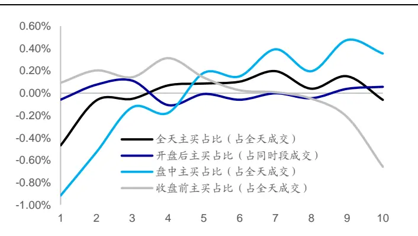
资料来源：Wind，海通证券研究所

图2 部分主买占比类因子分 10 组超额收益（正交后）（2013.01.04~2019.12.31）
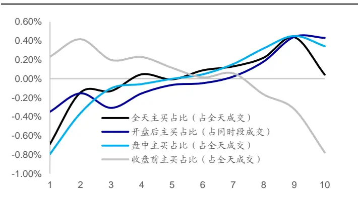
资料来源：Wind，海通证券研究所

值得注意的是，收盘前主买占比（占全天成交）与股票未来 个月收益负相关，而其他有效因子（如，全天主买占比等）与股票未来 1个月收益正相关。也即，除收盘时段外，主买占比因子呈现出的是动量效应。股票前期主买占比越高，股票未来相对收益表现越好。而使用收盘前数据计算得到的主买占比因子呈现出的是反转效应。由于收盘前主买占比（占全天成交）与股票未来收益显著负相关，而主买占比（占同时段成交）未呈现出显著的选股能力，我们可推测收盘前主买占比（占全天成交）的选股能力主要来源于收盘前成交占比的选股能力。该因子的具体表现可参考专题报告《高频量价因子在股票与期货中的表现》中关于尾盘成交占比因子的讨论。

下图展示了上述 4 个正交因子的多空相对强弱走势。全天主买占比因子的多空年化收益为 8.8%，开盘后主买占比因子的多空年化收益为 9.5%，盘中主买占比因子的多空年化收益为 14.1%，收盘前主买占比因子的多空年化收益为 12.4%。

图3 部分主买占比类因子多空相对强弱走势
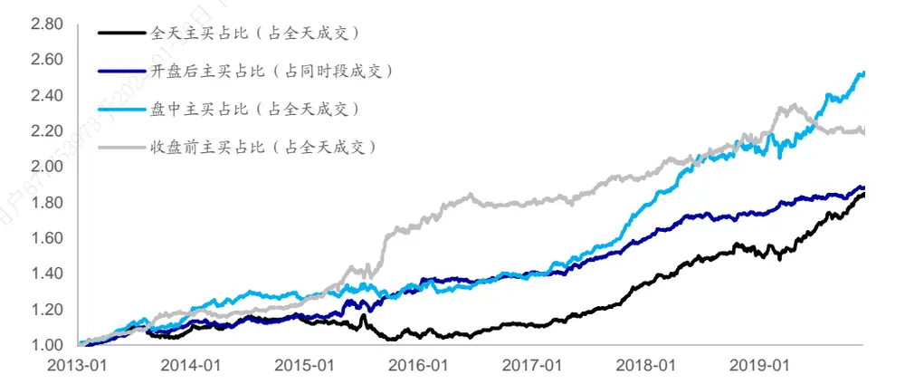
资料来源：Wind，海通证券研究所

下表展示了上述因子的分年度多空收益。从分年度表现上看，各因子在 2016 年以来皆呈现出了较好的收益区分能力，其中，全天主买占比因子以及盘中主买占比因子在2019 年多空收益超 20%。

表 3 部分主买占比类因子分年度多空收益（2013.01.04~2019.12.31）

| 因子名称 | 年化多空收益 | 月度胜率 | 2013 | 2014 | 2015 | 2016 | 2017 | 2018 | 2019 |
| --- | --- | --- | --- | --- | --- | --- | --- | --- | --- |
| 全天主买占比（占全天成交） | 8.8% | 71.4% | 7.6% | 4.5% | -6.8% | 5.4% | 20.1% | 11.5% | 22.8% |
| 开盘后主买占比（占同时段成交） | 9.5% | 75.0% | 12.4% | 2.4% | 15.8% | 6.9% | 13.1% | 8.5% | 8.8% |
| 盘中主买占比（占全天成交） | 14.1% | 79.8% | 17.4% | 6.4% | 6.9% | 5.1% | 26.9% | 16.2% | 23.1% |
| 收盘前主买占比（占全天成交） | 12.4% | 71.4% | 18.1% | 6.0% | 36.6% | 8.9% | 8.4% | 9.6% | 3.1% |

资料来源：Wind，海通证券研究所

我们同样可从回归法的角度对于上述因子的选股能力进行检验，可将上述因子分别与常规低频因子（行业、市值、中盘、换手率、反转、波动、估值、盈利以及盈利增长）放入多元回归模型进行回归检验。因子的回归系数即为因子溢价，通过因子溢价可得到因子的累计净值。下图展示了各因子的累计净值。

图4 部分主买占比类因子累计净值
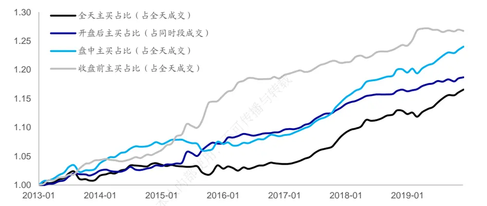
资料来源：Wind，海通证券研究所

从回归法的角度看，上述因子同样呈现出了显著的选股能力。因子月均溢价绝对值在 0.2%至 0.3%之间。其中，盘中主买占比因子的月均溢价为 0.26%，月度胜率达 80%。下表展示了各因子的月均溢价以及不同年度的月均溢价。

表 4 部分主买占比类因子分年度月均溢价（2013.01.04~2019.12.31）

| 因子名称 | 月均溢价 | 月度胜率 | 2013 | 2014 | 2015 | 2016 | 2017 | 2018 | 2019 |
| --- | --- | --- | --- | --- | --- | --- | --- | --- | --- |
| 全天主买占比（占全天成交） | 0.19% | 68% | 0.13% | 0.15% | -0.05% | 0.07% | 0.43% | 0.24% | 0.34% |
| 开盘后主买占比（占同时段成交） | 0.21% | 74% | 0.20% | 0.07% | 0.32% | 0.18% | 0.33% | 0.16% | 0.18% |
| 盘中主买占比（占全天成交） | 0.26% | 80% | 0.31% | 0.26% | 0.00% | 0.12% | 0.49% | 0.31% | 0.35% |
| 收盘前主买占比（占全天成交） | -0.29% | 75% | -0.35% | -0.14% | -0.72% | -0.26% | -0.15% | -0.20% | -0.20% |

资料来源：Wind，海通证券研究所

## 2.2 日内主买强度类因子

下表展示了不同计算方法下的日内主买强度类因子在正交前后的因子月度 IC以及前后 10%多空收益。

表 5 日内主买强度类因子月度 IC 与多空收益（2013.01.04~2019.12.31）

| 因子处理 | 时段 | 指标名称 | IC 均值 | 年化ICIR | 月度胜率 | 多空收益 | 多头收益 | 空头收益 |
| --- | --- | --- | --- | --- | --- | --- | --- | --- |
|  | 全天 | 日内主买强度 | -0.05 | -1.308 | 67% | 1.46% | 0.33% | -1.12% |
|  |  | 日内净主买强度 | 0.01 | 0.499 | 55% | 0.39% | -0.20% | -0.58% |
| 正交前 | 开盘后 | 日内主买强度 | -0.06 | -1.767 | 74% | 2.20% | 0.68% | -1.52% |
|  |  | 日内净主买强度 | 0.03 | 1.424 | 69% | 1.00% | 0.21% | -0.79% |
|  | 盘中 | 日内主买强度 | -0.06 | -1.657 | 71% | 2.04% | 0.58% | -1.45% |
|  |  | 日内净主买强度 | 0.02 | 0.614 | 55% | 0.55% | -0.05% | -0.59% |
|  | 收盘前 | 日内主买强度 | -0.07 | -2.003 | 76% | 2.57% | 0.78% | -1.78% |
|  |  | 日内净主买强度 | 0.01 | 0.652 | 61% | 0.48% | -0.11% | -0.59% |
| 正交后 | 全天 | 日内主买强度 | -0.01 | -0.603 | 60% | 0.51% | -0.15% | -0.66% |
|  |  | 日内净主买强度 | 0.03 | 2.361 | 71% | 0.95% | 0.16% | -0.79% |
|  | 开盘后 | 日内主买强度 | -0.03 | -1.394 | 65% | 0.93% | 0.15% | -0.78% |
|  |  | 日内净主买强度 | 0.04 | 3.071 | 80% | 1.18% | 0.28% | -0.91% |
|  | 盘中 | 日内主买强度 | -0.02 | -1.191 | 65% | 0.86% | 0.14% | -0.71% |
|  |  | 日内净主买强度 | 0.03 | 2.564 | 79% | 0.95% | 0.31% | -0.63% |
| 收盘前 | 日内主买强度 |  | -0.03 | -1.616 | 64% | 1.11% | 0.23% | -0.88% |
|  | 日内净主买强度 |  | 0.01 | 1.197 | 68% | 0.52% | -0.01% | -0.53% |

资料来源：Wind，海通证券研究所

观察上表可知，日内主买强度因子在正交前就呈现出了显著的选股能力，但是该因子与股票未来一个月收益负相关。之所以该因子与股票未来收益负相关，是因为该因子与市值因子相关性较高，达 0.40。具体细节可参考报告第三章中的因子值截面相关性分析。日内净主买强度原始因子与股票未来收益正相关，然而选股能力较弱。

为了剔除常规日频选股因子的影响，可观察正交因子的表现。在正交处理后，日内主买强度因子依旧与股票未来收益负相关，但是因子的稳定性以及多空收益区分能力都出现了明显下降。此外，日内净主买强度因子呈现出了较为显著的选股能力。除收盘前日内净主买强度因子外，其余时段数据计算得到的因子月均 IC在 0.03~0.04，因子年化ICIR 以及月度胜率同样较高。下图展示了上述三个因子的月度分 10 组超额收益。

图5 部分日内主买强度类因子分 10 组超额收益（正交前）（2013.01.04~2019.12.31）
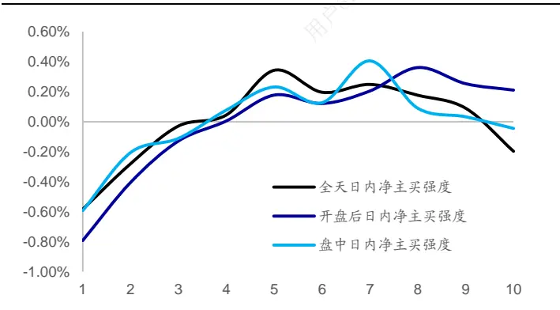
资料来源：Wind，海通证券研究所

图6 部分日内主买强度类因子分 10 组超额收益（正交后）（2013.01.04~2019.12.31）
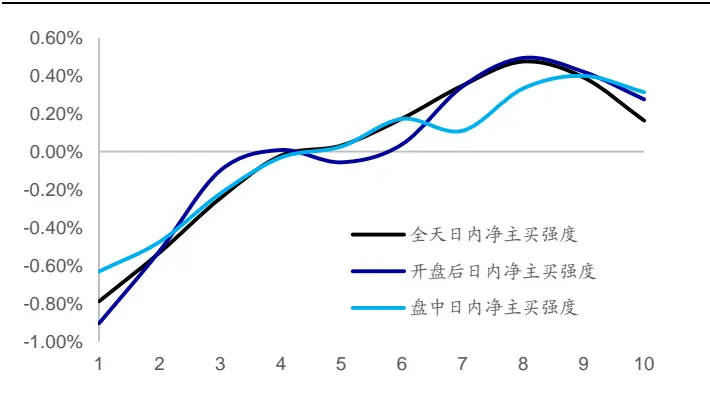
资料来源：Wind，海通证券研究所

根据因子表现，股票日内净主买强度与股票未来收益正相关，也即，股票前期日内资金净流入越稳健，股票未来收益表现越好。在正交后，因子组间收益单调性得到了极大改善。

下图展示了上述正交因子的多空相对强弱走势。全天日内净主买强度因子的多空年化收益为 11.7%，开盘后日内净主买强度因子的多空年化收益为 14.8%，盘中日内净主买强度因子的多空年化收益为 11.7%。在回测期内，上述因子皆呈现出了较为稳定的收益表现。

图7 部分日内主买强度类因子多空相对强弱走势
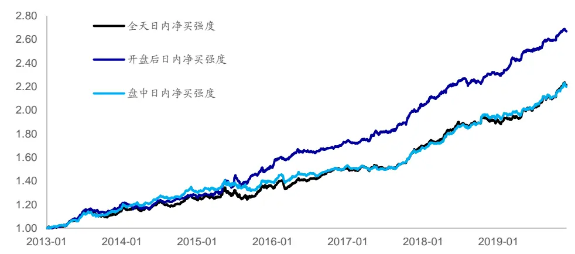
资料来源：Wind，海通证券研究所

下表展示了上述因子的分年度多空收益。从分年度表现上看，各因子在 2016 年以来皆呈现出了较好的收益区分能力，其中，全天主买占比因子以及盘中主买占比因子在2019 年表现较好，年度多空收益超 15%。

表 6 部分日内主买强度类因子分年度多空收益（2013.01.04~2019.12.31）

| 因子名称 | 年化多空收益 | 月度胜率 | 2013 | 2014 | 2015 | 2016 | 2017 | 2018 | 2019 |
| --- | --- | --- | --- | --- | --- | --- | --- | --- | --- |
| 全天日内净主买强度 | 11.7% | 73.8% | 12.6% | 8.3% | 10.8% | 11.6% | 11.4% | 11.9% | 16.4% |
| 开盘后日内净主买强度 | 14.8% | 78.6% | 18.9% | 5.1% | 23.1% | 14.2% | 16.8% | 12.4% | 15.0% |
| 盘中日内净主买强度 | 11.7% | 75.0% | 15.3% | 11.9% | 8.6% | 9.4% | 9.8% | 14.9% | 12.9% |

资料来源：Wind，海通证券研究所

可将上述因子分别与常规日频因子（行业、市值、中盘、换手率、反转、波动、估值、盈利以及盈利增长）放入多元回归模型进行回归检验。下图展示了各因子的累计净值。

图8 部分日内主买强度类因子累计净值
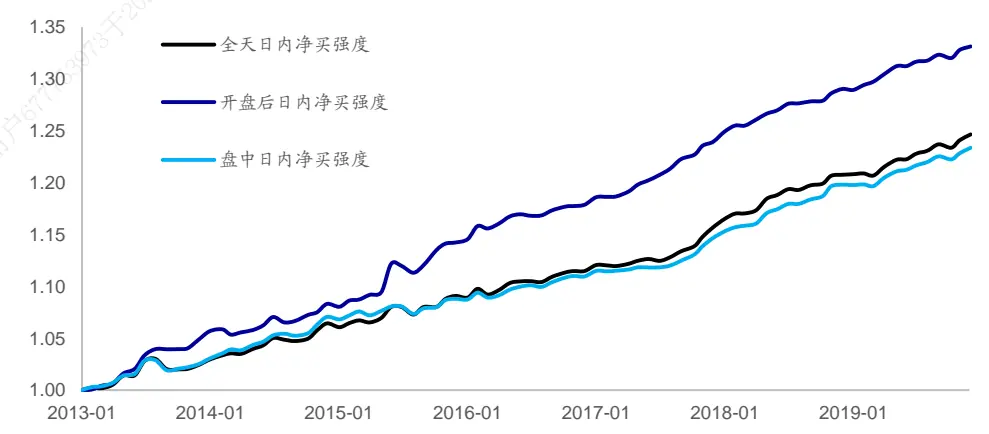
资料来源：Wind，海通证券研究所

从回归法的角度看，上述因子同样呈现出了显著的选股能力。下表展示了各因子的月均溢价以及不同年度中因子的月均溢价。

表 7 部分日内主买强度类因子分年度月均溢价（2013.01.04~2019.12.31）

| 因子名称 | 月均溢价 | 月度胜率 | 2013 | 2014 | 2015 | 2016 | 2017 | 2018 | 2019 |
| --- | --- | --- | --- | --- | --- | --- | --- | --- | --- |
| 全天日内净主买强度 | 0.26% | 77% | 0.24% | 0.25% | 0.22% | 0.24% | 0.32% | 0.30% | 0.27% |
| 开盘后日内净主买强度 | 0.34% | 87% | 0.46% | 0.18% | 0.49% | 0.29% | 0.43% | 0.26% | 0.28% |
| 盘中日内净主买强度 | 0.25% | 82% | 0.25% | 0.30% | 0.15% | 0.21% | 0.28% | 0.32% | 0.26% |

资料来源：Wind，海通证券研究所

## 2.3 日间主买强度类因子

考虑到日内主买强度因子的计算要求相对较高，投资者可使用日度的主买金额计算日间主买强度因子。下表展示了不同计算方法下的日间主买强度因子在正交前后的因子月度 IC以及前后 10%多空收益。

表 8 日间主买强度类因子月度 IC 与多空收益（2013.01.04~2019.12.31）

| 因子处理 | 时段 | 指标名称 | IC 均值 | 年化 ICIR | 月度胜率 | 多空收益 | 多头收益 | 空头收益 |
| --- | --- | --- | --- | --- | --- | --- | --- | --- |
| 正交前 | 全天 | 日间主买强度 日间净主买强度 | 0.03 | 1.400 | 62% | 1.07% | 0.28% | -0.79% |
|  |  | 日间主买强度 | -0.02 0.02 | -0.758 1.326 | 50% 61% | 0.72% 0.82% | 0.10% 0.22% | -0.61% -0.60% |
|  | 开盘后 | 日间净主买强度 | 0.00 | 0.055 | 55% | 0.07% | -0.15% | -0.22% |
|  |  | 日间主买强度 | 0.03 | 1.327 | 62% | 1.05% | 0.23% | -0.82% |
|  | 盘中 | 日间净主买强度 | -0.02 | -0.725 | 57% | 0.63% | 0.05% | -0.58% |
| 日间主买强度 |  | 0.02 | 1.182 | 61% | 0.71% | 0.03% | -0.68% |  |
| 正交后 | 收盘前 | 日间净主买强度 | -0.01 | -0.399 使用， | 45% | 0.16% | -0.14% | -0.31% |
|  | 全天 | 日间主买强度 | 0.02 | 1.412 | 63% | 0.59% | 0.21% | -0.38% |
|  |  | 日间净主买强度 | 0.01 | 1.159 | 63% | 0.35% | -0.01% | -0.37% |
|  | 开盘后 | 日间主买强度 | 0.01 | A 0.899 | 60% | 0.19% | 0.12% | -0.07% |
|  |  | 日间净主买强度 | 0.02 | 2.346 | 74% | 0.75% | 0.26% | -0.49% |
|  | 盘中 | 日间主买强度 | 0.02 | 1.521 | 70% | 0.71% | 0.23% | -0.48% |
| 日间净主买强度 |  | 0.01 | 1.300 | 63% | 0.33% | 0.03% | -0.30% |  |
| 收盘前 | 日间主买强度 | 0.01 73干2024 | 1.681 | 67% | 0.48% | 0.22% | -0.26% |  |
|  | 日间净主买强度 | 0.00 | -0.093 | 52% | 0.09% | -0.20% | -0.29% |  |

资料来源：Wind，海通证券研究所

观察上表可知，日间主买强度因子在正交前就呈现出了一定的选股能力，因子与股票未来收益正相关。也即，日间主买强度越大，股票未来收益表现越好。这一现象与直观理解较为吻合。然而，日间净主买强度因子在正交前并未呈现出显著的选股能力。

在正交剔除了日频选股因子的影响后，仅有小部分因子呈现出了显著的选股能力。开盘后日间净主买强度以及盘中日间主买强度的选股能力相对较强，因子月均 IC约为0.02，因子年化 ICIR在 1.5~2.0 的范围内，月度胜率在 65%~75%的范围内。下图展示了上述三个因子的月度分 10 组超额收益。

图9 部分日间主买强度类因子分 10 组超额收益（正交前）（2013.01.04~2019.12.31）
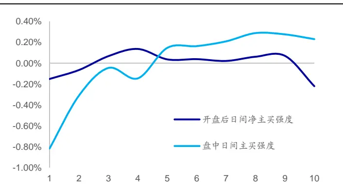
资料来源：Wind，海通证券研究所

图10 部分日间主买强度类因子分 10 组超额收益（正交后）（2013.01.04~2019.12.31）
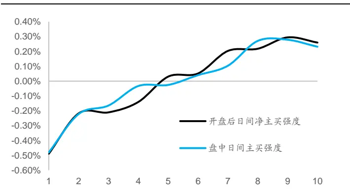
资料来源：Wind，海通证券研究所

根据因子表现，正交后的日间主买强度因子与股票未来收益正相关，也即，股票前期日间资金净流入越稳健，股票未来收益表现越好。然而，与日内主买强度因子相比，日间主买强度因子的选股能力相对较弱。

下图展示了上述正交因子的多空组合相对强弱走势。开盘后日间净主买强度因子的多空年化收益为 9.1%，盘中日间主买强度因子的多空年化收益为 8.6%。

图11 部分日间主买强度类因子多空相对强弱走势
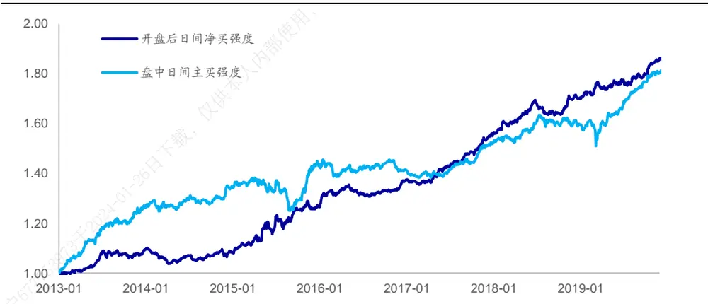
资料来源：Wind，海通证券研究所

下表展示了上述因子的分年度多空收益。

表 9 部分日间主买强度类因子分年度多空收益（2013.01.04~2019.12.31）

| 因子名称 | 年化多空收益 | 月度胜率 | 2013 | 2014 | 2015 | 2016 | 2017 | 2018 | 2019 |
| --- | --- | --- | --- | --- | --- | --- | --- | --- | --- |
| 开盘后日间净主买强度 | 9.1% | 75.0% | 9.0% | -1.3% | 19.1% | 7.9% | 13.0% | 8.8% | 9.1% |
| 盘中日间主买强度 | 8.6% | 71.4% | 25.8% | 5.7% | 8.6% | -1.6% | 8.0% | 3.9% | 12.2% |

资料来源：Wind，海通证券研究所

可将上述因子分别与常规日频因子（行业、市值、中盘、换手率、反转、波动、估值、盈利以及盈利增长）放入多元回归模型进行回归检验。下图展示了各因子的累计净值。

图12 部分日间主买强度类因子累计净值
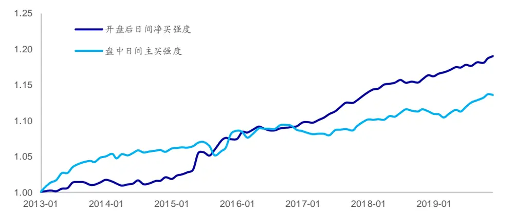
资料来源：Wind，海通证券研究所

从回归法的角度看，上述因子同样呈现出了一定的选股能力，但是与日内主买强度类因子相比，因子选股能力偏弱。

表 10 部分日间主买强度类因子分年度月均溢价（2013.01.04~2019.12.31）

| 因子名称 | 月均溢价 | 月度胜率 | 2013 | 2014 | 2015 | 2016 | 2017 | 2018 | 2019 |
| --- | --- | --- | --- | --- | --- | --- | --- | --- | --- |
| 开盘后日间净买强度 | 0.21% | 74% | 0.14% | 0.01% | 0.45% | 0.18% | 0.32% | 0.16% | 0.21% |
| 盘中日间主买强度 | 0.15% | 62% | 0.41% | 0.09% | 0.20% | 0.00% | 0.13% | 0.06% | 0.20% |

资料来源：Wind，海通证券研究所

## 2.4 日间主买占比强度类因子

考虑到股票日间成交额的变化可能影响日间主动买入金额的可比性，可使用主买占比日度序列计算日间主买占比强度类因子。下表展示了不同计算方法下的日间主买占比强度类因子在正交前后的因子月度 IC以及前后 10%多空收益。

表 11 日间主买占比（占全天成交）强度类因子月度 IC与多空收益（2013.01.04~2019.12.31）

| 因子处理 | 时段 | 指标名称 | IC 均值 | 年化 ICIR | 月度胜率 | 多空收益 | 多头收益 | 空头收益 |
| --- | --- | --- | --- | --- | --- | --- | --- | --- |
| 正交前 | 全天 | 日间主买占比强度（占全天成交） 日间净买占比强度（占全天成交） | -0.02 | -0.843 | 67% | 0.75% | -0.26% | -1.01% |
|  | 开盘后 |  | -0.01 | -0.371 | 50% | 0.44% | -0.11% | -0.56% |
|  |  | 日间主买占比强度（占全天成交） | 0.00 | -0.100 | 52% | 0.01% | -0.31% | -0.32% |
|  | 盘中 | 日间净买占比强度（占全天成交） | 0.01 | 0.454 | 57% | 0.25% | -0.08% | -0.33% |
|  |  | 日间主买占比强度（占全天成交） | 0.01 | 0.314 | 48% | 0.43% | -0.19% | -0.63% |
|  | 收盘前 | 日间净买占比强度（占全天成交） 日间主买占比强度（占全天成交） | -0.01 0.00 | -0.367 -0.156 | 51% 54% | 0.37% | -0.13% | -0.49% |
|  |  | 日间净买占比强度（占全天成交） | -0.01 | -0.306 |  | 0.11% | -0.29% | -0.40% |
| 正交后 | 全天 | 日间主买占比强度（占全天成交） | 0.00 | -0.188 | 45% | 0.29% | -0.11% | -0.40% |
|  |  | 日间净买占比强度（占全天成交） | 0.02 |  | 56% | 0.12% | -0.41% | -0.54% |
|  | 开盘后 | 日间主买占比强度（占全天成交） | 0.00 | 1.708 | 70% | 0.53% | 0.07% | -0.46% |
|  |  | 日间净买占比强度（占全天成交） | 0.02 | 0.185 | 57% | 0.09% | -0.12% | -0.21% |
|  | 盘中 | 日间主买占比强度（占全天成交） | 0.01 | 2.444 0.683 | 75% 58% | 0.88% 0.34% | 0.33% | -0.55% |
|  |  | 日间净买占比强度（占全天成交） | 0.02 | 1.853 |  |  | -0.05% | -0.39% |
| 收盘前 |  |  | 0.00 | 0.289 | 69% 54% | 0.56% 0.03% | 0.21% -0.14% | -0.35% |
|  |  | 日间主买占比强度（占全天成交） 日间净买占比强度（占全天成交） | 0.00 | 0.112 | 49% | 0.04% | -0.20% | -0.17% -0.25% |

资料来源：Wind，海通证券研究所

表 12 日间主买占比（占同时段成交）强度类因子月度 IC与多空收益（2013.01.04~2019.12.31）

| 因子处理 | 时段 | 指标名称 | IC 均值 | 年化 ICIR | 月度胜率 | 多空收益 | 多头收益 | 空头收益 |
| --- | --- | --- | --- | --- | --- | --- | --- | --- |
| 正交前 | 全天 | 日间主买占比强度（占同时段成交） 日间净买占比强度（占同时段成交） | -0.04 | -1.278 | 65% | 1.41% | 0.37% | -1.04% |
|  | 开盘后 |  | -0.01 | -0.500 | 49% | 0.56% | -0.04% | -0.60% |
|  |  | 日间主买占比强度（占同时段成交） | -0.06 | -1.672 | 67% | 2.07% | 0.55% | -1.52% |
|  | 盘中 | 日间净买占比强度（占同时段成交） | 0.01 | 0.669 | 60% | 0.40% | 0.03% | -0.37% |
|  |  | 日间主买占比强度（占同时段成交） | -0.04 | -1.266 | 61% | 1.40% | 0.35% | -1.05% |
|  | 收盘前 | 日间净买占比强度（占同时段成交） 日间主买占比强度（占同时段成交） | -0.01 | -0.329 | 52% | 0.39% | -0.10% | -0.49% |
|  | 日间净买占比强度（占同时段成交） |  | -0.06 0.00 | -2.080 | 71% | 2.20% | 0.72% | -1.48% |
| 正交后 | 全天 | 日间主买占比强度（占同时段成交） | -0.01 | -0.039 | 45% | 0.17% | -0.20% | -0.36% |
|  |  | 日间净买占比强度（占同时段成交） | 0.02 | -0.605 | 57% | 0.22% | -0.15% | -0.37% |
|  | 开盘后 |  | -0.02 | 1.625 | 68% | 0.42% | 0.07% | -0.35% |
|  |  | 日间主买占比强度（占同时段成交） 日间净买占比强度（占同时段成交） | 0.03 | -1.498 | 73% | 0.71% | 0.05% | -0.66% |
|  | 盘中 | 日间主买占比强度（占同时段成交） | -0.01 | 2.749 -0.687 | 75% 58% | 0.91% | 0.36% | -0.55% |
|  |  | 日间净买占比强度（占同时段成交） | 0.02 |  |  | 0.22% | -0.11% | -0.33% |
| 收盘前 | 日间主买占比强度（占同时段成交） |  | -0.02 | 1.998 -1.491 | 71% | 0.61% | 0.30% | -0.31% |
|  |  | 日间净买占比强度（占同时段成交） | 0.01 | 0.693 | 70% 61% | 0.77% 0.25% | 0.16% -0.02% | -0.61% -0.28% |

资料来源：Wind，海通证券研究所

观察上表可知，日间净主买占比强度因子在正交后呈现出了显著的选股能力。无论是使用全天成交额还是使用同时段成交额计算成交占比，全天日间净主买占比强度因子、开盘后日间净主买占比强度因子以及盘中日间净主买占比强度因子都呈现出了相对较强的截面选股能力。因子月均 IC 在 0.02~0.03 的范围内，年化 ICIR在 1.5~2.5的范围内。因子与股票未来收益正相关。也即，日间主买占比强度越大，股票未来收益表现越好。这一现象与直观理解较为吻合。与正交后的日内主买强度因子相比，日间主买占比强度因子的选股能力依旧偏弱。下图展示了上述因子的月度分 10 组超额收益。

图13 部分日间主买占比（占全天成交）强度类因子分 10 组超额收益（正交后）（2013.01.04~2019.12.31）
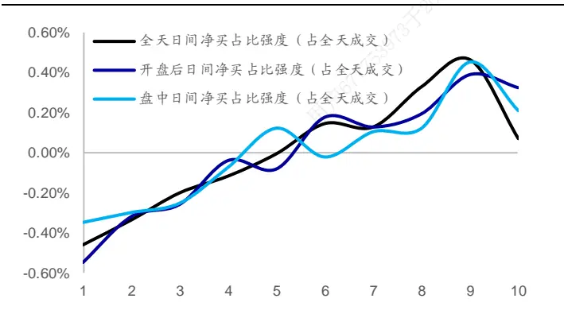
资料来源：Wind，海通证券研究所

图14 部分日间主买占比（占同时段成交）强度类因子分 10 组超额收益（正交后）（2013.01.04~2019.12.31）
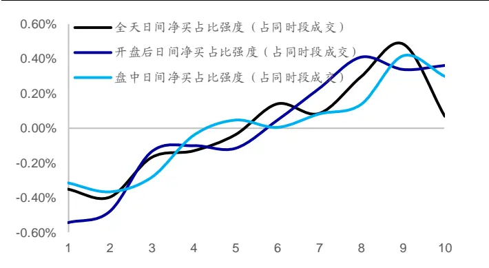
资料来源：Wind，海通证券研究所

下图展示了上述因子的多空组合相对强弱走势。在回测期内，各因子都呈现出了较为稳定的收益区分能力。相比而言，开盘后日间净主买占比强度因子具有相对较强的选股能力，年化多空收益超 10%。

图15 部分日间主买占比强度类因子多空相对强弱走势
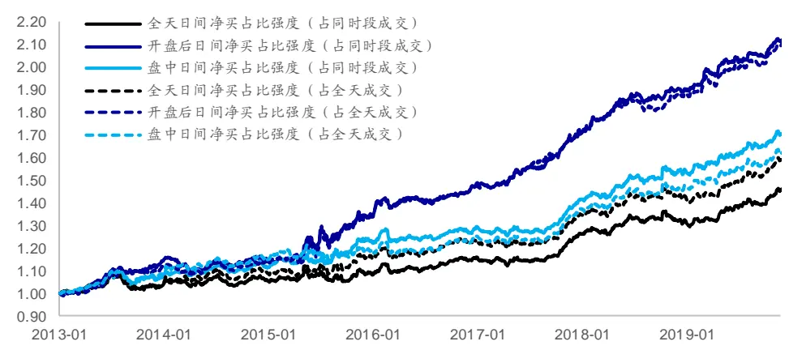
资料来源：Wind，海通证券研究所

下表展示了上述因子的分年度多空收益。分年度来看，各因子在 2017 年以来都呈现出了较为稳定的收益区分能力，且在 年取得了高于 的多空收益。

表 13 部分日间主买占比强度类因子分年度多空收益（2013.01.04~2019.12.31）

| 因子名称 | 年化多空收益 | 月度胜率 | 2013 | 2014 | 2015 | 2016 | 2017 | 2018 | 2019 |
| --- | --- | --- | --- | --- | --- | --- | --- | --- | --- |
| 全天日间净买占比强度（占同时段成交） | 5.0% | 63.1% | 2.9% | 1.0% | 3.4% | 6.3% | 8.6% | 3.5% | 10.0% |
| 开盘后日间净买占比强度（占同时段成交） | 11.2% | 79.8% | 14.2% | -0.9% | 20.4% | 10.0% | 14.5% | 10.6% | 11.5% |
| 盘中日间净买占比强度（占同时段成交） | 7.4% | 66.7% | 6.5% | 3.6% | 9.9% | 4.9% | 9.1% | 7.8% | 10.7% |
| 全天日间净买占比强度（占全天成交） | 6.4% | 65.5% | 3.5% | 3.7% | 6.6% | 6.3% | 8.7% | 4.8% | 11.7% |
| 开盘后日间净买占比强度（占全天成交） | 10.8% | 77.4% | 11.5% | 0.5% | 20.1% | 9.2% | 16.2% | 8.9% | 10.9% |
| 盘中日间净买占比强度（占全天成交） | 6.7% | 65.5% | 8.2% | 5.6% | 2.7% | 5.3% | 9.4% | 6.4% | 10.2% |

资料来源： ，海通证券研究所

可将上述因子分别与常规日频因子（行业、市值、中盘、换手率、反转、波动、估值、盈利以及盈利增长）放入多元回归模型进行回归检验。下图展示了各因子的累计净值。

图16 部分日间主买占比强度类因子累计净值
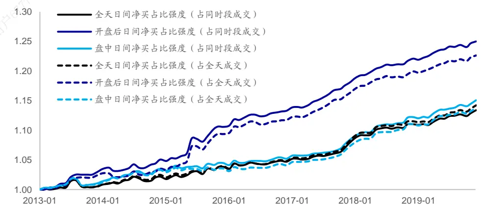
资料来源：Wind，海通证券研究所

从回归法的角度看，上述因子同样呈现出了一定的选股能力，但是因子选股能力弱于日内主买强度类因子。

表 14 部分日内主买占比强度类因子分年度月均溢价（2013.01.04~2019.12.31）

| 因子名称 | 月均溢价 | 月度胜率 | 2013 | 2014 | 2015 | 2016 | 2017 | 2018 | 2019 |
| --- | --- | --- | --- | --- | --- | --- | --- | --- | --- |
| 全天日间净买占比强度（占同时段成交） | 0.15% | 69% | 0.07% | 0.08% | 0.14% | 0.14% | 0.27% | 0.17% | 0.18% |
| 开盘后日间净买占比强度（占同时段成交） | 0.27% | 79% | 0.29% | 0.11% | 0.47% | 0.23% | 0.36% | 0.21% | 0.21% |
| 盘中日间净买占比强度（占同时段成交） | 0.17% | 77% | 0.12% | 0.14% | 0.08% | 0.13% | 0.26% | 0.22% | 0.23% |
| 全天日间净买占比强度（占全天成交） | 0.16% | 70% | 0.07% | 0.10% | 0.12% | 0.14% | 0.29% | 0.17% | 0.21% |
| 开盘后日间净买占比强度（占全天成交） | 0.24% | 76% | 0.23% | 0.05% | 0.49% | 0.20% | 0.35% | 0.19% | 0.20% |
| 盘中日间净买占比强度（占全天成交） | 0.16% | 74% | 0.10% | 0.14% | 0.02% | 0.12% | 0.26% | 0.22% | 0.23% |

资料来源：Wind，海通证券研究所

## 2.5 本章小结

本章对于主买占比类因子、日内主买强度类因子、日间主买强度类因子以及日间主买占比强度类因子的选股能力进行了回测分析在正交剔除了常规低频因子的影响后，部分主买占比类因子以及日内主买强度类因子依旧呈现出了较为显著的月度选股能力。考虑到日内主买强度因子的计算要求相对较高，可尝试使用日频主买成交额以及主买占比计算日间主买强度以及日间主买占比强度。从回测结果来看，正交后的日间主买强度类因子以及主买占比强度类因子具有一定的月度选股能力，但是弱于日内强度类因子。

## 3. 相关性分析

本章展示了主买占比类因子、主买强度类因子与常规低频因子之间的截面相关性。观察截面相关性可知，主买占比类因子主要与股票前期涨幅正相关。也即，股票前 1 个月主买占比越高，股票前期涨幅越大。此外，部分因子与换手率以及波动率有一定的相关性。

表 15 主买占比类因子与低频因子截面相关性（2013.01.04~2019.12.31）

|  | 市值 | 中盘 | 估值 | 换手率 | 前期涨幅 | 系统波动 | 特质波动 | 盈利 | 盈利增长 |
| --- | --- | --- | --- | --- | --- | --- | --- | --- | --- |
| 全天主买占比（占全天成交） | 0.17 | -0.04 | 0.09 | -0.06 | 0.27 | -0.06 | -0.07 | 0.14 | 0.06 |
| 全天主买占比（占同时段成交） | 0.13 | -0.03 | 0.18 | 0.13 | 0.47 | 0.00 | 0.12 | 0.07 | 0.05 |
| 开盘后主买占比（占全天成交） | 0.07 | -0.03 | 0.19 | 0.42 | 0.25 | 0.28 | 0.38 | -0.03 | 0.04 |
| 开盘后主买占比（占同时段成交） | 0.16 | -0.03 | 0.09 | 0.05 | 0.29 | 0.05 | 0.04 | 0.07 | 0.04 |
| 盘中主买占比（占全天成交） | 0.22 | -0.08 | -0.02 | -0.25 | 0.14 | -0.14 | -0.24 | 0.18 | 0.05 |
| 盘中主买占比（占同时段成交） | 0.14 | -0.03 | 0.17 | 0.13 | 0.43 | 0.03 | 0.12 | 0.08 | 0.05 |
| 收盘前主买占比（占全天成交） | -0.18 | 0.09 | 0.01 | -0.12 | -0.04 | -0.17 | -0.11 | -0.03 | -0.02 |
| 收盘前主买占比（占同时段成交） | 0.03 | 0.00 | 0.13 | 0.05 | 0.26 | -0.07 | 0.04 | 0.09 | 0.03 |

资料来源：Wind，海通证券研究所

日内主买强度因子与市值强相关，两者之间的截面相关性超 0.40。此外，日内主买强度与换手率、波动率之间也存在较强的正相关性。而日内净主买强度类因子主要与股票前期涨幅之间存在较为明显的正相关性。

表 16 日内主买强度类因子与低频因子截面相关性（2013.01.04~2019.12.31）

|  | 市值 | 中盘 | 估值 | 换手率 | 前期涨幅 | 系统波动 | 特质波动 | 盈利 | 盈利增长 |
| --- | --- | --- | --- | --- | --- | --- | --- | --- | --- |
| 全天日内主买强度 | 0.43 | -0.15 | 0.13 | 0.34 | -0.05 | 0.27 | 0.30 | 0.20 | 0.06 |
| 全天日内净主买强度 | 0.05 | 0.02 | 0.11 | -0.09 | 0.48 | -0.12 | -0.07 | 0.05 | 0.04 |
| 开盘后日内主买强度 | 0.40 | -0.16 | 0.15 | 0.45 | 0.03 | 0.31 | 0.39 | 0.12 | 0.05 |
| 开盘后日内净主买强度 | 0.09 | 0.01 | 0.03 | -0.16 | 0.31 | -0.06 | -0.14 | 0.06 | 0.03 |
| 盘中日内主买强度 | 0.44 | -0.15 | 0.14 | 0.37 | -0.01 | 0.25 | 0.33 | 0.19 | 0.06 |
| 盘中日内净主买强度 | 0.03 | 0.02 | 0.10 | -0.07 | 0.43 | -0.09 | -0.05 | 0.04 | 0.04 |
| 收盘前日内主买强度 | 0.43 | -0.13 | 0.17 | 0.43 | 0.04 | 0.26 | 0.39 | 0.13 | 0.05 |
| 收盘前日内净主买强度 | -0.04 | 0.02 | 0.06 | -0.13 | 0.24 | -0.15 | -0.11 | 0.08 | 0.03 |

资料来源： ，海通证券研究所

日间主买强度因子与常规低频因子之间的截面相关性较弱，而日间净主买强度因子主要与股票前期涨幅正相关。

表 17 日间主买强度类因子与低频因子截面相关性（2013.01.04~2019.12.31）

|  | 市值 | 中盘 | 估值 | 换手率 | 前期涨幅 | 系统波动 | 特质波动 | 盈利 | 盈利增长 |
| --- | --- | --- | --- | --- | --- | --- | --- | --- | --- |
| 全天日间主买强度 | 0.09 | -0.03 | 0.04 | -0.08 | -0.18 | 0.08 | -0.07 | 0.11 | 0.04 |
| 全天日间净主买强度 | 0.15 | -0.04 | 0.11 | 0.02 | 0.52 | -0.09 | 0.03 | 0.05 | 0.05 |
| 开盘后日间主买强度 | 0.09 | -0.03 | 0.03 | -0.06 | -0.18 | 0.09 | -0.07 | 0.10 | 0.03 |
| 开盘后日间净主买强度 | 0.15 | -0.03 | 0.03 | -0.05 | 0.36 | -0.07 | -0.04 | 0.03 | 0.04 |
| 盘中日间主买强度 | 0.09 | -0.02 | 0.03 | -0.07 | -0.18 | 0.09 | -0.06 | 0.12 | 0.03 |
| 盘中日间净主买强度 | 0.15 | -0.05 | 0.12 | 0.05 | 0.47 | -0.06 | 0.05 | 0.04 | 0.05 |
| 收盘前日间主买强度 | 0.13 | -0.06 | 0.02 | -0.01 | -0.17 | 0.09 | -0.02 | 0.09 | 0.03 |
| 收盘前日间净主买强度 | 0.00 | 0.01 | 0.07 | -0.03 | 0.28 | -0.12 | -0.04 | 0.06 | 0.03 |

资料来源： ，海通证券研究所

对于日间主买占比强度因子，使用全天成交计算得到的日间主买占比强度因子与常规日频因子之间的截面相关性较低，而使用同时段成交计算得到的日间主买占比强度因子与估值、换手率以及波动正相关。对于日间净主买占比强度因子，因子与股票前期涨幅之间的正相关性较强。

表 18 日间主买占比强度类因子与低频因子截面相关性（2013.01.04~2019.12.31）

|  | 市值 | 中盘 | 估值 | 换手率 | 前期涨幅 | 系统波动 | 特质波动 | 盈利 | 盈利增长 |
| --- | --- | --- | --- | --- | --- | --- | --- | --- | --- |
| 全天日间主买占比强度（占全天成交） | 0.13 | -0.02 | 0.15 | 0.24 | -0.01 | 0.19 | 0.16 | 0.10 | 0.02 |
| 全天日间净主买占比强度（占全天成交） | 0.14 | -0.03 | 0.13 | 0.00 | 0.48 | -0.08 | 0.01 | 0.07 | 0.06 |
| 开盘后日间主买占比强度（占全天成交） | 0.11 | -0.03 | 0.07 | 0.19 | -0.11 | 0.23 | 0.11 | 0.11 | 0.03 |
| 开盘后日间净主买占比强度（占全天成交） | 0.14 | -0.02 | 0.03 | -0.09 | 0.30 | -0.06 | -0.07 | 0.04 | 0.04 |
| 盘中日间主买占比强度（占全天成交） | 0.15 | -0.02 | 0.04 | 0.05 | -0.15 | 0.13 | -0.01 | 0.16 | 0.02 |
| 盘中日间净主买占比强度（占全天成交） | 0.14 | -0.04 | 0.13 | 0.03 | 0.44 | -0.05 | 0.04 | 0.06 | 0.06 |
| 收盘前日间主买占比强度（占全天成交） | 0.17 | -0.05 | 0.01 | 0.04 | -0.19 | 0.10 | 0.03 | 0.09 | 0.02 |
| 收盘前日间净主买占比强度（占全天成交） | -0.02 | 0.02 | 0.08 | -0.02 | 0.27 | -0.12 | -0.04 | 0.06 | 0.03 |
| 全天日间主买占比强度（占同时段成交） | 0.10 | -0.01 | 0.23 | 0.43 | 0.08 | 0.26 | 0.31 | 0.06 | 0.01 |
| 全天日间净主买占比强度（占同时段成交） | 0.13 | -0.03 | 0.13 | 0.02 | 0.50 | -0.06 | 0.04 | 0.07 | 0.05 |
| 开盘后日间主买占比强度（占同时段成交） | 0.17 | -0.08 | 0.25 | 0.47 | 0.08 | 0.33 | 0.38 | 0.09 | 0.03 |
| 开盘后日间净主买占比强度（占同时段成交） | 0.13 | -0.01 | 0.03 | -0.09 | 0.30 | -0.04 | -0.08 | 0.06 | 0.04 |
| 盘中日间主买占比强度（占同时段成交） | 0.10 | 0.00 | 0.20 | 0.42 | 0.07 | 0.28 | 0.30 | 0.06 | 0.01 |
| 盘中日间净主买占比强度（占同时段成交） | 0.14 | -0.03 | 0.13 | 0.02 | 0.45 | -0.04 | 0.04 | 0.07 | 0.06 |
| 收盘前日间主买占比强度（占同时段成交） | 0.21 | -0.06 | 0.22 | 0.44 | 0.09 | 0.25 | 0.37 | 0.08 | 0.03 |
| 收盘前日间净主买占比强度（占同时段成交） | 0.00 | 0.01 | 0.08 | -0.05 | 0.27 | -0.12 | -0.05 | 0.09 | 0.03 |

资料来源：Wind，海通证券研究所

## 4. 不同选股范围与调仓频率下的因子表现

## 4.1 不同选股范围内的因子表现

本节对比展示了前文所述因子在全 A、中证 800 指数内、中证 500 指数内以及沪深300 指数内的收益表现。下表展示了不同范围内主买占比类因子的表现。

表 19 部分主买占比类因子在不同范围内的选股能力（2013.01.04~2019.12.31）

| 因子名称 | 指数范围 | IC 均值 | 年化ICIR | 月度胜率 | 多空收益 | 多头收益 | 空头收益 |
| --- | --- | --- | --- | --- | --- | --- | --- |
| 全天主买占比（占全天成交） | 全A | 0.02 | 1.877 | 69% | 0.73% | 0.04% | -0.69% |
|  | 中证 800 | 0.03 | 1.763 | 69% | 0.89% | 0.16% | -0.73% |
|  | 中证500 | 0.02 | 1.104 | 61% | 0.42% | -0.09% | -0.51% |
|  | 沪深 300 | 0.05 | 2.263 | 70% | 1.45% | 0.75% | -0.70% |
| 开盘后主买占比（占同时段成交） | 全 A | 0.02 | 2.446 | 76% | 0.78% | 0.43% | -0.35% |
|  | 中证800 | 0.02 | 1.697 | 68% | 0.75% | 0.46% | -0.29% |
|  | 中证500 | 0.02 | 1.112 | 63% | 0.52% | 0.44% | -0.08% |
|  | 沪深 300 | 0.03 | 1.638 | 71% | 0.61% | 0.48% | -0.13% |
| 盘中主买占比（占全天成交） | 全A | 0.03 | 2.518 | 77% | 1.14% | 0.34% | -0.79% |
|  | 中证800 | 0.04 | 2.200 | 75% | 1.04% | 0.40% | -0.64% |
|  | 中证500 | 0.03 | 1.461 | 67% [传播与转 | 0.62% | 0.01% | -0.62% |
|  | 沪深 300 | 0.06 | 2.973 | 77% | 1.73% | 0.81% | -0.92% |
| 收盘前主买占比（占全天成交） | 全A | -0.03 | -2.348 | 74% | 1.01% | 0.23% | -0.78% |
|  | 中证 800 | -0.03 | -2.031 |  | 0.69% | 0.17% | -0.53% |
|  | 中证500 | -0.03 | -1.630 | 71% | 0.56% | 0.11% | -0.45% |
|  | 沪深 300 | -0.03 | -1.440 | 63% | 0.39% | -0.02% | -0.42% |

资料来源：Wind，海通证券研究所

对于全市场范围内有效的主买占比类因子，因子在中证 800 指数内依旧呈现出了显著的选股能力。然而因子在中证 500 指数内和沪深 300 指数内的表现存在明显的不同。全天主买占比、开盘后主买占比以及盘中主买占比在沪深 300 指数内的选股能力更强，多头效应更加明显。以全天主买占比因子为例，因子在全市场中的月度多空收益为0.73%，因子在中证 500 指数内的月度多空收益仅为 0.42%，而因子在沪深 300 指数内的月度多空收益达 1.45%，且因子的多头收益达 0.75%。

下表展示了不同范围内日内主买强度类因子的收益表现。

表 20 部分日内主买强度类因子在不同范围内的选股能力（2013.01.04~2019.12.31）

| 因子名称 | 指数范围 | IC 均值 | 年化 ICIR | 月度胜率 | 多空收益 | 多头收益 | 空头收益 |
| --- | --- | --- | --- | --- | --- | --- | --- |
| 全天日内净主买强度 | 全A | 0.03 | 2.361 | 71% | 0.95% | 0.16% | -0.79% |
|  | 中证 800 | 0.03 | 1.834 | 68% | 0.52% | 0.15% | -0.38% |
|  | 中证500 | 0.02 | 1.132 | 61% | 0.53% | 0.17% | -0.36% |
|  | 沪深300 | 0.04 | 2.387 | 70% | 0.96% | 0.69% | -0.26% |
| 开盘后日内净主买强度 | 全A | 0.04 | 3.071 | 80% | 1.18% | 0.28% | -0.91% |
|  | 中证 800 | 0.03 | 2.214 | 71% | 0.80% | 0.38% | -0.42% |
|  | 中证500 | 0.03 | 1.750 | 65% | 0.76% | 0.39% | -0.37% |
|  | 沪深300 | 0.03 | 1.654 | 69% | 0.72% | 0.47% | -0.25% |
| 盘中日内净主买强度 | 全A | 0.03 | 2.564 | 79% | 0.95% | 0.31% | -0.63% |
|  | 中证 800 | 0.02 | 1.844 | 70% | 0.72% | 0.28% | -0.44% |
|  | 中证500 | 0.02 | 1.015 | 57% | 0.56% | 0.28% | -0.28% |
|  | 沪深300 | 0.04 | 2.398 | 73% | 1.23% | 0.74% | -0.49% |

资料来源： ，海通证券研究所

对于全市场范围内有效的日内主买强度类因子以及日间主买强度类因子，因子在沪深 指数内同样呈现出了较为显著的选股能力，并且因子在沪深 指数中的多头效应更强。以全天日内净主买强度因子为例，因子在全市场内的月度多空收益为 0.95%，多头收益仅有 0.16%，而因子在沪深 300 指数内的月度多空收益为 0.96%，多头收益达0.69%。

表 21 部分日间主买强度类因子在不同范围内的选股能力（2013.01.04~2019.12.31）

| 因子名称 | 指数范围 | IC 均值 | 年化ICIR | 月度胜率 | 多空收益 | 多头收益 | 空头收益 |
| --- | --- | --- | --- | --- | --- | --- | --- |
| 开盘后日间净主买强度 | 全A | 0.02 | 2.346 | 74% | 0.75% | 0.26% | -0.49% |
|  | 中证 800 | 0.02 | 1.764 | 67% | 0.55% | 0.15% | -0.40% |
|  | 中证500 | 0.02 | 1.372 | 62% | 0.67% | 0.12% | -0.55% |
|  | 沪深300 | 0.02 | 1.475 | 67% | 0.41% | 0.33% | -0.07% |
| 盘中日间主买强度 | 全A | 0.02 | 1.521 | 70% | 0.71% | 0.23% | -0.48% |
|  | 中证 800 | 0.01 | 0.667 | 57% | 0.38% | 0.01% | -0.38% |
|  | 中证500 | 0.01 | 0.566 | 54% | 0.37% | -0.06% | -0.43% |
|  | 沪深 300 | 0.01 | 0.683 | 60% | 0.40% | -0.02% | -0.42% |

资料来源：Wind，海通证券研究所

对于全市场范围内有效的日间主买占比强度类因子，因子在沪深 300 指数内同样呈现出了较强的月度选股能力。以全天日间净主买占比强度（占同时段成交）因子为例，因子在全市场的月度多空收益为 0.42%，而因子在沪深 300 指数内的月度多空收益达，多头收益达 。此外，因子在中证 指数范围内的选股能力明显弱于因子在其他范围内的选股能力。

表 22 部分日间主买占比强度类因子在不同范围内的选股能力（2013.01.04~2019.12.31）

| 因子名称 | 指数范围 | IC 均值 | 年化 ICIR | 月度胜率 | 多空收益 | 多头收益 | 空头收益 |
| --- | --- | --- | --- | --- | --- | --- | --- |
| 全天日间净主买占比强度 (占同时段成交） | 全A | 0.02 | A 1.625 | 68% | 0.42% | 0.07% | -0.35% |
|  | 中证 800 | 0.02 | 1.610 | 67% | 0.60% | 0.21% | -0.40% |
|  | 中证500 | 0.01 | 0.778 | 58% | 0.25% | 0.05% | -0.19% |
|  | 沪深300 | 0.04 | 2.437 | 73% | 1.21% | 0.50% | -0.72% |
| 开盘后日间净主买占比强度 (占同时段成交) | 全A 于2024 | 0.03 | 2.749 | 75% | 0.91% | 0.36% | -0.55% |
|  | 中证 800 | 0.02 | 1.929 | 74% | 0.72% | 0.26% | -0.46% |
|  | 中证500 | 0.02 | 1.423 | 65% | 0.69% | 0.29% | -0.41% |
|  | 沪深300 | 0.03 | 1.713 | 70% | 0.70% | 0.32% | -0.38% |
| 盘中日间净主买占比强度 (占同时段成交) | 全A | 0.02 | 1.998 | 71% | 0.61% | 0.30% | -0.31% |
|  | 中证800 | 0.02 | 1.787 | 70% | 0.67% | 0.33% | -0.34% |
|  | 中证500 | 0.01 | 0.888 | 57% | 0.32% | 0.16% | -0.16% |
|  | 沪深300 | 0.05 | 2.551 | 73% | 1.40% | 0.71% | -0.70% |
| 全天日间净主买占比强度 (占全天成交) | 全A | 0.02 | 1.708 | 70% | 0.53% | 0.07% | -0.46% |
|  | 中证 800 | 0.02 | 1.650 | 65% | 0.57% | 0.18% | -0.39% |
|  | 中证500 | 0.01 | 0.845 | 56% | 0.29% | 0.02% | -0.27% |
|  | 沪深300 | 0.04 | 2.444 | 73% | 1.24% | 0.60% | -0.65% |
| 开盘后日间净主买占比强度 (占全天成交） | 全A | 0.02 | 2.444 | 75% | 0.88% | 0.33% | -0.55% |
|  | 中证 800 | 0.02 | 1.875 | 73% | 0.75% | 0.31% | -0.45% |
|  | 中证500 | 0.02 | 1.408 | 65% | 0.52% | -0.02% | -0.53% |
|  | 沪深300 | 0.03 | 1.685 | 70% | 0.70% | 0.50% | -0.20% |
| 盘中日间净主买占比强度 (占全天成交) | 全A | 0.02 |  | 69% |  | 0.21% |  |
|  | 中证 800 |  | 1.853 | 67% | 0.56% |  | -0.35% |
|  | 中证500 | 0.02 0.01 | 1.786 0.866 | 58% | 0.81% 0.31% | 0.35% 0.16% | -0.46% |
|  | 沪深300 | 0.04 | 2.523 | 74% | 1.29% | 0.58% | -0.16% -0.70% |

资料来源：Wind，海通证券研究所

## 4.2不同调仓频率下的因子表现

本节展示了 1个月、2周以及 1 周的调仓频率下因子的多空收益。需要注意的是，因子的计算窗口会随着调仓频率的变化而变化。例如，在周度调仓时，因子的计算窗口为前 5个交易日。考虑到日间主买强度类因子以及日间主买占比强度因子的计算需要的日度序列较长，本节未计算相关因子在半月换仓以及周度换仓下的收益表现。

表 23 不同调仓频率下的前后 10%多空年化收益（2013.01.04~2019.12.31）

| 因子名称 | 月度调仓 | 半月调仓 | 周度调仓 |
| --- | --- | --- | --- |
| 全天主买占比（占全天成交） | 8.8% | 15.6% | 9.4% |
| 开盘后主买占比（占同时段成交） | 7.8% | 9.0% | 6.4% |
| 盘中主买占比（占全天成交） | 14.1% | 20.5% | 18.5% |
| 收盘前主买占比（占全天成交） | 12.4% | 14.0% | 15.2% |
| 全天日内净主买强度 | 11.7% | 11.8% | 2.7% |
| 开盘后日内净主买强度 | 14.8% | 19.4% | 19.3% |
| 盘中日内净主买强度 | 11.7% | 13.9% | 6.1% |

资料来源： ，海通证券研究所

观察上表可知，随着调仓频率从月度调整为半月度，大部分因子的多空年化收益皆有所提升。然而随着调仓频率的进一步提升，我们并未观察到多空年化收益的进一步改转善。值得注意的是，本节将因子的调仓频率以及计算窗口进行了人为关联，然而两参数播依旧具有一定的优化空间。

## 5. 总结

本文基于逐笔成交数据中的 BS标志，通过分钟级的主买成交金额以及主卖成交金人额构建了主买占比以及主买强度两类因子。回测结果表明，两类因子在正交剔除了常规供低频因子的影响后依旧呈现出了较为明显的月度选股能力。若将选股范围控制在沪深指数内，因子的选股能力能够得到进一步的提升，并且因子会呈现出较强的多头效下应。

## 6. 风险提示202

市场系统性风险、资产流动性风险以及政策变动风险会对策略表现产生较大影响。75

## 信息披露

分析师声明

[Table冯佳睿yst金融工程研究团队s]

袁林青金融工程研究团队

本人具有中国证券业协会授予的证券投资咨询执业资格，以勤勉的职业态度，独立、客观地出具本报告。本报告所采用的数据和信息均来自市场公开信息，本人不保证该等信息的准确性或完整性。分析逻辑基于作者的职业理解，清晰准确地反映了作者的研究观点，结论不受任何第三方的授意或影响，特此声明。

## 法律声明

本报告仅供海通证券股份有限公司（以下简称 本公司 ）的客户使用。本公司不会因接收人收到本报告而视其为客户。在任何情况下，本报告中的信息或所表述的意见并不构成对任何人的投资建议。在任何情况下，本公司不对任何人因使用本报告中的任何内容所引致的任何损失负任何责任。

本报告所载的资料、意见及推测仅反映本公司于发布本报告当日的判断，本报告所指的证券或投资标的的价格、价值及投资收入可能会波动。在不同时期，本公司可发出与本报告所载资料、意见及推测不一致的报告。

市场有风险，投资需谨慎。本报告所载的信息、材料及结论只提供特定客户作参考，不构成投资建议，也没有考虑到个别客户特殊的播投资目标、财务状况或需要。客户应考虑本报告中的任何意见或建议是否符合其特定状况。在法律许可的情况下，海通证券及其所属可关联机构可能会持有报告中提到的公司所发行的证券并进行交易，还可能为这些公司提供投资银行服务或其他服务。

本报告仅向特定客户传送，未经海通证券研究所书面授权，本研究报告的任何部分均不得以任何方式制作任何形式的拷贝、复印件或复制品，或再次分发给任何其他人，或以任何侵犯本公司版权的其他方式使用。所有本报告中使用的商标、服务标记及标记均为本公司的商标、服务标记及标记，如欲引用或转载本文内容，务必联络海通证券研究所并获得许可，并需注明出处为海通证券研究所，目不得对本文进行有悖原意的引用和删改。仅

根据中国证监会核发的经营证券业务许可，海通证券股份有限公司的经营范围包括证券投资咨询业务。下载

## 海通证券股份有限公司研究所[Table_PeopleInfo]

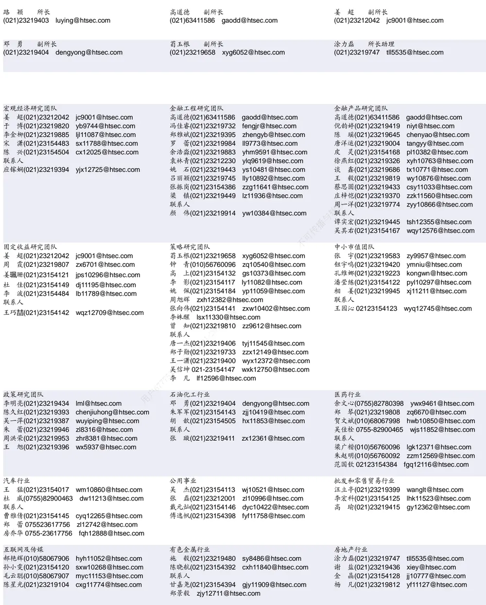

| 电子行业 |  | 煤炭行业 |  | 电力设备及新能源行业 |  |  |  |
| --- | --- | --- | --- | --- | --- | --- | --- |
|  | 陈 平(021)23219646 cp9808@htsec.com |  | 李 淼(010)58067998 Im10779@htsec.com |  | 张一弛(021)23219402 |  | zyc9637@htsec.com |
|  | 尹 苓(021)23154119 yl11569@htsec.com |  |  | 戴元灿(021)23154146 dyc10422@htsec.com |  | 房 青(021)23219692 fangq@htsec.com |  |
|  | 谢 磊(021)23212214 xl10881@htsec.com |  | 吴 杰(021)23154113 wj10521@htsec.com |  |  | 曾 彪(021)23154148 zb10242@htsec.com |  |
|  | 蒋 俊(021)23154170 jj11200@htsec.com |  | 联系人 |  |  | 徐柏乔(021)23219171 xbq6583@htsec.com |  |
| 联系人 |  |  |  | 王 涛(021)23219760 wt12363@htsec.com |  | 陈佳彬(021)23154513 cjb11782@htsec.com |  |

| 基础化工行业 |  | 计算机行业 |  | 通信行业 |  |
| --- | --- | --- | --- | --- | --- |
| 刘 威(0755)82764281 Iw10053@htsec.com |  | 郑宏达(021)23219392 zhd10834@htsec.com |  | 朱劲松(010)50949926 | zjs10213@htsec.com |
| 刘海荣(021)23154130 Ihr10342@htsec.com |  | 杨 林(021)23154174 | yl11036@htsec.com | 余伟民(010)50949926 | ywm11574@htsec.com |
| 张翠翠(021)23214397 | zcc11726@htsec.com | 鲁 立(021)23154138 I11383@htsec.com |  | 张峥青(021)23219383 | zzq11650@htsec.com |
| 孙维容(021)23219431 | swr12178@htsec.com | 于成龙 ycl12224@htsec.com |  | 张 弋01050949962 | zy12258@htsec.com |
| 李 智(021)23219392 | lz11785@htsec.com | 黄竞晶(021)23154131 hjj10361@htsec.com |  | 联系人 |  |
|  |  | 洪 琳(021)23154137 hl11570@htsec.com |  | 杨彤昕 010-56760095 | ytx12741@htsec.com |

| 非银行金融行业 |  | 交通运输行业 |  | 纺织服装行业 |  |
| --- | --- | --- | --- | --- | --- |
|  | 孙 婷(010)50949926 st9998@htsec.com |  | 虞 楠(021)23219382 yun@htsec.com |  | 梁 希(021)23219407 lx11040@htsec.com |
|  | 何 婷(021)23219634 ht10515@htsec.com | 罗月江(010）56760091 lyj12399@htsec.com |  |  | 盛 开(021)23154510 sk11787@htsec.com |
|  | 李芳洲(021)23154127 Ifz11585@htsec.com |  | 李 轩(021)23154652 lx12671@htsec.com | 联系人 |  |
| 联系人 |  | 联系人 |  |  | 刘 溢(021)23219748 ly12337@htsec.com |
| 任广博(010)56760090 rgb12695@htsec.com |  |  | 李 丹(021)23154401 Id11766@htsec.com |  |  |

| 建筑建材行业 | 机械行业 |  | 钢铁行业 |
| --- | --- | --- | --- |
| 冯晨阳(021)23212081 fcy10886@htsec.com | 余炜超(021)23219816 swc11480@htsec.com |  | 刘彦奇(021)23219391 liuyq@htsec.com |
| 潘莹练(021)23154122 pyl10297@htsec.com |  | 耿 耘(021)23219814 gy10234@htsec.com 杨 震(021)23154124 yz10334@htsec.com | 周慧琳(021)23154399 zhl11756@htsec.com |
| 申 浩(021)23154114 sh12219@htsec.com 杜市伟(0755)82945368 dsw11227@htsec.com |  |  |  |
| 联系人 | 周 丹 zd12213@htsec.com 联系人 |  |  |
| 颜慧菁 yhj12866@htsec.com | 吉 晟(021)23154145 js12801@htsec.com 传播与转载 |  |  |

| 建筑工程行业 | 农林牧渔行业 |  | 食品饮料行业 |
| --- | --- | --- | --- |
| 张欣劼 zxj12156@htsec.com |  | 丁 频(021)23219405 dingpin@htsec.com | 闻宏伟(010)58067941 whw9587@htsec.com |
| 李富华(021)23154134 Ifh12225@htsec.com | 陈雪丽(021)23219164 cxl9730@htsec.com 陈 阳(021)23212041 cy10867@htsec.com |  | 唐 宇(021)23219389 ty11049@htsec.com 联系人 |
| 杜市伟(0755)82945368 dsw11227@htsec.com | 联系人 |  | 程碧升(021)23154171 cbs10969@htsec.com |
|  | 孟亚琦(021)23154396 myq12354@htsec.com |  | 颜慧菁 yhj12866@htsec.com |

| 军工行业 | 银行行业 | 社会服务行业 |  |
| --- | --- | --- | --- |
| 张恒晅 zhx10170@htsec.com | 孙 婷(010)50949926 st9998@htsec.com |  | 汪立亭(021)23219399 wanglt@htsec.com |
|  | 解巍巍 xww12276@htsec.com |  | 陈扬扬(021)23219671 cyy10636@htsec.com |
| 联系人 张宇轩(021)23154172 zyx11631@htsec.com |  | 林加力(021)23154395 ljl12245@htsec.com | 许樱之 xyz11630@htsec.com |
|  |  | 谭敏沂(0755)82900489 tmy10908@htsec.com |  |

| 家电行业 |  | 造纸轻工行业 |  |
| --- | --- | --- | --- |
| 陈子仪(021)23219244 | chenzy@htsec.com |  | 衣桢永(021)23212208 yzy12003@htsec.com |
| 李 阳(021)23154382 | ly11194@htsec.com |  |  |
| 朱默辰(021)23154383 | zmc11316@htsec.com |  |  |
| 刘 璐(021)23214390 | II11838@htsec.com |  |  |

## 研究所销售团队

深广地区销售团队

蔡铁清(0755)82775962 ctq5979@htsec.com

伏财勇(0755)23607963 fcy7498@htsec.com

辜丽娟(0755)83253022 gulj@htsec.com

刘晶晶(0755)83255933 liujj4900@htsec.com

王雅清(0755)83254133 wyq10541@htsec.com

饶 伟(0755)82775282 rw10588@htsec.com

欧阳梦楚(0755)23617160

oymc11039@htsec.com

巩柏含 gbh11537@htsec.com

上海地区销售团队
胡雪梅(021)23219385 huxm@htsec.com
朱 健(021)23219592 zhuj@htsec.com
季唯佳(021)23219384 jiwj@htsec.com
黄 毓(021)23219410 huangyu@htsec.com
漆冠男(021)23219281 qgn10768@htsec.com
胡宇欣(021)23154192 hyx10493@htsec.com
黄 诚(021)23219397 hc10482@htsec.com
毛文英(021)23219373 mwy10474@htsec.com
马晓男 mxn11376@htsec.com
杨祎昕(021)23212268 yyx10310@htsec.com
张思宇 zsy11797@htsec.com
王朝领 wcl11854@htsec.com
邵亚杰 23214650 syj12493@htsec.com
李 寅 021-23219691 ly12488@htsec.com北京地区销售团队
殷怡琦(010)58067988 yyq9989@htsec.com郭 楠 010-5806 7936 gn12384@htsec.com张丽萱(010)58067931 zlx11191@htsec.com杨羽莎(010)58067977 yys10962@htsec.com何 嘉(010)58067929 hj12311@htsec.com李 婕 lj12330@htsec.com
欧阳亚群 oyyq12331@htsec.com
郭金垚(010)58067851 gjy12727@htsec.com

海通证券股份有限公司研究所

地址：上海市黄浦区广东路 689号海通证券大厦 9楼

电话：（021）23219000

传真：（021）23219392

网址：www.htsec.com