## [Tab相关研究

Table_ReportInfo]《行业轮动系列研究 19——公募基金重

仓股的行业行为》2020.02.06

《量化研究新思维（十七）——从 0到 1：

解码绝对收益策略》2020.01.22

《选股因子系列研究（五十七）——基于主动买入行为的选股因子》2020.01.12

分析师:冯佳睿

Tel:(021)23219732

Email:fengjr@htsec.com

证书:S0850512080006

分析师:袁林青

Tel:(021)23212230

Email:ylq9619@htsec.com

证书:S0850516050003

# 选股因子系列研究（五十八）——知情交易与主买主卖

## 投资要点：

在《选股因子系列研究（五十七）——基于主动买入行为的选股因子》中，我们尝试基于逐笔级数据中的主买成交金额以及主卖成交金额构建选股因子。根据相关研究，投资者的主买行为具有较为明显的选股能力。本文在前期研究基础之上，尝试引入知情交易概率模型，对于投资者的主买主卖行为进行过滤，从知情主买与知情主卖的角度构建选股因子。

- 可使用知情交易概率模型对于主买与主卖进行过滤。考虑到投资者的主买主卖中依旧存在“噪音”，我们可考虑对其进行过滤。借用知情交易概率模型，可得到知情主买以及知情主卖，并构建知情主卖占比因子、知情主买占比因子以及知情净主买占比因子。

- 全天知情主卖占比以及开盘后知情主卖占比的月度选股能力较为显著。两因子在正交前后以及不同的计算方法下都呈现出了较为稳健的选股能力。开盘后知情主卖（占同时段成交额）具有相对较强的选股能力，因子月均 IC 的绝对值接近 0.03，C 的绝对值达 ，月度多空收益达 ，且因子月均多头收益为 。

- 收盘前知情主买占比月度选股能力较为显著。因子月均 的绝对值在之间，ICIR 的绝对值在 1.8~3.0之间。对比不同计算方法下的因子，收盘前知情主买占比（占全天成交额）的月度选股能力相对较强，因子月度多空收益达1.28%，月度胜率超 80%，多头月均收益达 0.56%。

- 开盘后知情净主买占比具有一定的月度选股能力。开盘后知情净主买占比（占全天成交额）以及开盘后知情净主买占比（占同时段成交额）的月均 IC 为 0.02，ICIR 在 2.8~3.0 之间，月度胜率超 80%。

- 不同指数范围内的知情主卖占比因子：全天知情主卖占比以及开盘后知情主卖占比在中证 800 指数以及中证 500 指数内依旧具有一定的选股能力。然而，全天以及开盘后知情主卖占比（占同时段主卖）在沪深 300 指数内并未呈现出显著的月度选股能力。

- 不同指数范围内的知情主买占比因子：在中证 800 指数内，仅有收盘前知情主买占比（占全天成交额）依旧呈现出了一定的选股能力。

不同指数范围内的知情净主买占比因子：在进入中证 指数后，开盘后知情净主买占比（占全天成交额）以及开盘后知情净主买占比（占同时段成交额）依旧呈现出了一定的选股能力。但是随着选股范围的缩小，因子的选股能力呈现出了逐渐减弱的态势。

- 风险提示。市场系统性风险、资产流动性风险以及政策变动风险会对策略表现产生较大影响。

在《选股因子系列研究（五十七）——基于主动买入行为的选股因子》中，我们尝试基于逐笔级数据中的主买成交金额以及主卖成交金额构建选股因子。根据相关研究，投资者的主买行为具有较为明显的选股能力。本文在前期研究基础之上，尝试引入知情交易概率模型，对于投资者的主买主卖行为进行过滤，从知情主买与知情主卖的角度构建选股因子。

本文第一章简要介绍了知情交易概率模型与因子构建思路，第二章分析讨论了因子的月度选股能力，第三章展示了因子与常规因子之间的相关性，第四章讨论了因子在不同选股范围内的选股能力，第五章对全文进行了总结，第六章提示了风险。

## 1. 知情交易与主买主卖

在系列报告《选股因子系列研究（五十七）——基于主动买入行为的选股因子》中，我们基于逐笔成交数据提取了主动买入金额以及主动卖出金额，并基于相关数据构建了选股因子。回测结果表明，因子具有较为明显的选股能力。考虑到投资者的主买主卖中依旧存在“噪音”，我们可考虑对其进行过滤。借用知情交易概率模型，可得到知情主买以及知情主卖。

早在 年， 以及 1就对于知情交易概率的估计进行了讨论。现在接受度较广的 测度是 等人在 年23以及 年4提出的。然而上述方法的问题也较为明显，该方法仅能在较长的时间窗口上对于知情交易概率进行估计，并且该方法的计算要求较高。因此，本文在对于知情主买以及知情主卖进行筛选时，主要参考了 Chang,S.S.（2014）5等人的研究成果。若投资者对于相关模型细节感兴趣，可参考文献原文。

基于股票过去一个月的日内分钟收益序列，可构建以下回归模型：

$$
R_{i,T,j}=\gamma_{0}+\sum_{k=1}^{4}{\gamma_{1,k}D_{T,k,j}^{weekday}}\ +\sum_{k=1}^{3}{\gamma_{2,k}D_{T,k,j}^{Period}}\ +\gamma_{3,1}R_{i,T,j-1}+\varepsilon_{i,j}
$$

其中， $\mathsf{R}_{\mathrm{i},\mathsf{T},\mathrm{j}}$ 为股票 i在 T 日第 j分钟的收益， $\mathsf{D}_{\mathsf{T},\mathsf{k},\mathsf{j}}\mathsf{^{weekday}}$ 为虚拟变量 $(\mathsf{k}{=}1,2,3,4),$ ，分别表示星期一至星期四， $\mathsf{D}_{\mathsf{T},\mathsf{k},\mathsf{j}}\mathsf{Peri\bar{o}d}$ 为时间段虚拟变量（k=1,2,3），分别表示开盘后 30 分钟，盘中时段以及收盘前 30 分钟， $\mathsf{R}_{\mathrm{i},\mathsf{T},\mathrm{j}-1}$ 为分钟收益滞后项。

基于上述模型，可使用股票过去 20交易日的数据进行回归，从而得到股票的残差收益序列。可将该序列理解为股票的预期外收益。在预期外收益为正时，投资者的主动卖出行为可被认为是知情主卖，而预期外收益为负时，投资者的主动买入行为可被认为是知情主买。在得到分钟级别的知情主卖与知情主买后，可分别计算知情主卖占比、知情主买占比以及知情净主买占比。下表展示了各指标的计算方法。

表 1 指标计算方法

| 指标名称 | 计算方法 |
| --- | --- |
| 知情主卖占比（占全天成交额） | 知情主卖额/当日成交额 |
| 知情主卖占比（占同时段成交额） | 知情主卖额/当日同时段成交额 |
| 知情主卖占比（占同时段主卖） | 知情主卖额/当日同时段主卖额 |
| 知情主买占比（占全天成交额） | 知情主买额/当日成交额 |
| 知情主买占比（占同时段成交额） | 知情主买额/当日同时段成交额 |
| 知情主买占比（占同时段主买） | 知情主买额/当日同时段主买额 |
| 知情净主买占比（占全天成交额） | 知情净主买额/当日成交额 |
| 知情净主买占比（占同时段成交额） | 知情净主买额/当日同时段成交额 |
| 知情净主买占比（占同时段净主买） | 知情净主买额/当日同时段净主买额 |

资料来源：Wind，海通证券研究所

考虑到使用日内不同时段数据计算得到的高频因子可能存在选股能力的差别，本文在计算因子时分别使用了 9:30~14:56（后文简称为全天）、9:30~9:59（后文简称为开盘后）、10:00~14:26（后文简称为盘中）以及 14:27~14:56（后文简称为收盘前）的数据。

## 2. 因子月度选股能力分析

本章使用 2013 年以来的分钟级收益率、主买成交金额、主卖成交金额构建了知情主卖占比因子、知情主买占比因子以及知情净主买占比因子，并回测了因子在全市场范围内（剔除 ST、次新以及无法交易的股票）的月度选股能力。

## 2.1 知情主卖占比因子

下表展示了不同计算方法下的知情主卖占比因子在正交前后的因子月度 IC 以及前后 10%多空收益情况。本文在进行因子正交时剔除了市值因子、估值因子、中盘因子、换手率因子、反转因子以及波动率因子。

观察下表可知，知情主卖占比与股票未来收益负相关，也即，投资者的知情主卖行为越强，股票未来收益表现越差。在正交前，使用不同计算方法以及不同时段数据计算得到的因子皆呈现出了较为显著的选股能力，大部分因子月度 IC均值的绝对值在 0.03~0.05 之间。在正交后，因子的 IC 出现了明显降低，但是部分因子依旧残留了显著的选股能力，并且因子 C 出现了较为明显的提升。

根据各因子的表现，全天知情主卖占比以及开盘后知情主卖占比值得关注。两因子在正交前后以及不同的计算方法下都呈现出了较为稳健的选股能力。在正交后，全天知情主卖占比的月均 IC的绝对值皆处于 0.02~0.03 之间并且因子年化 ICIR 的绝对值超2.0。对于开盘后知情主卖占比，开盘后知情主卖占比（占同时段成交额）具有相对较强的选股能力，因子月均 IC的绝对值接近 0.03，ICIR 的绝对值达 3.5，月度多空收益达0.94%，且因子月均多头收益为 0.57%。

知情主卖占比因子与股票未来收益之间的负相关性较符合直观理解。若将知情交易者理解为具有信息优势的投资者，那么知情主卖占比较高则体现出了该类投资者对于股票未来的收益预期较低。也即，具有信息优势的投资者越不看好股票未来表现，股票未来表现越差。

表 2 知情主卖占比因子月度 IC 与多空收益（2013.01.04~2020.01.23）

| 因子处理 | 指标名称 | 时段 | IC 均值 | 年化 ICIR | 月度胜率 | 多空收益 | 多头收益 | 空头收益 |
| --- | --- | --- | --- | --- | --- | --- | --- | --- |
| 正交前 | 知情主卖占比 | 全天 | -0.04 | -1.61 | 70% | 1.33% | 0.35% | -0.98% |
|  | (占全天成交额） | 开盘后 | -0.06 | -2.08 | 74% | 1.79% | 0.65% | -1.14% |
|  |  | 盘中 | -0.01 | -0.42 | 57% | 0.34% | -0.11% | -0.45% |
|  |  | 收盘前 | -0.03 | -1.41 | 70% | 1.28% | 0.51% | -0.78% |
|  | 知情主卖占比 (占同时段成交额) | 全天 | -0.04 | -1.61 | 70% | 1.33% | 0.35% | -0.98% |
|  |  | 开盘后 | -0.04 | -2.12 | 70% | 1.35% | 0.73% | -0.63% |
|  |  | 盘中 | -0.03 | -1.25 | 65% | 0.97% | 0.23% | -0.74% |
|  |  | 收盘前 | -0.02 | -1.07 | 67% | 0.62% | 0.18% | -0.44% |
|  | 知情主卖占比 (占同时段主卖) | 全天 | -0.06 | -1.94 | 72% | 1.94% | 0.63% | -1.31% |
|  |  | 开盘后 | -0.05 | -2.31 | 73% | 1.55% | 0.69% | -0.86% |
| 盘中 |  | -0.04 | -1.49 | 67% | 1.56% | 0.55% | -1.01% |  |
| 收盘前 |  | -0.02 | -1.26 | 65% | 0.78% | 0.26% | -0.52% |  |
| 正交后 | 知情主卖占比 (占全天成交额) | 全天 | -0.03 | -2.30 | 77% | 0.63% | 0.05% | -0.58% |
|  |  | 开盘后 | -0.02 | -1.56 | 71% | 0.46% | -0.09% | -0.55% |
|  |  | 盘中 | -0.01 | -1.43 | 67% | 0.27% | -0.03% | -0.31% |
|  | 知情主卖占比 （占同时段成交额） | 收盘前 | -0.03 | -2.28 | 74% | 0.94% | 0.42% | -0.52% |
|  |  | 全天 | -0.03 | -2.30 | 77% 与转载 | 0.63% | 0.05% | -0.58% |
|  |  | 开盘后 | -0.03 | -3.54 | 86% | 0.94% | 0.57% | -0.37% |
|  |  | 盘中 | -0.02 | -2.15 | 78% | 0.44% | 0.03% | -0.41% |
| (占同时段主卖) |  | 收盘前 0.00 | -0.33 | 57% | 0.05% | -0.02% | -0.07% |  |
|  | 知情主卖占比 | 全天 | -0.02 -2.15 | 73% 内部使用 | 0.61% | 0.11% | -0.50% |  |
|  | 开盘后 | -0.02 | -2.88 | 83% | 0.69% | 0.37% | -0.32% |  |
|  | 盘中 | -0.02 |  | 72% | 0.45% | 0.07% | -0.38% |  |
|  | 收盘前 | 0.00 | -0.24 | 53% | -0.04% | -0.02% | 0.02% |  |

资料来源： ，海通证券研究所

下表展示了因子在正交前后的分 10组超额收益。观察收益分布可知，因子在正交前后都呈现出了较为明显的组间收益单调性。（需要注意，全天知情主卖占比（占全天成交额）与全天知情主卖占比（同时段成交额）相同。）

图1 全天知情主卖占比分 10 组超额收益（正交前）（2013.01.04~2020.01.23）
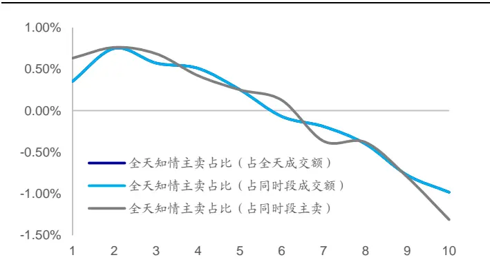
资料来源：Wind，海通证券研究所

图2 全天知情主卖占比分 10 组超额收益（正交后）（2013.01.04~2020.01.23）
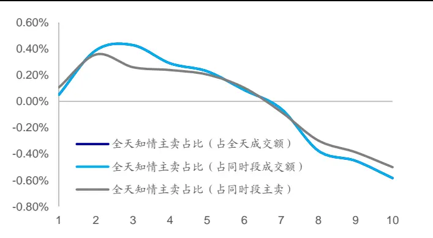
资料来源：Wind，海通证券研究所

图3 开盘后知情主卖占比分 10 组超额收益（正交前）（2013.01.04~2020.01.23）
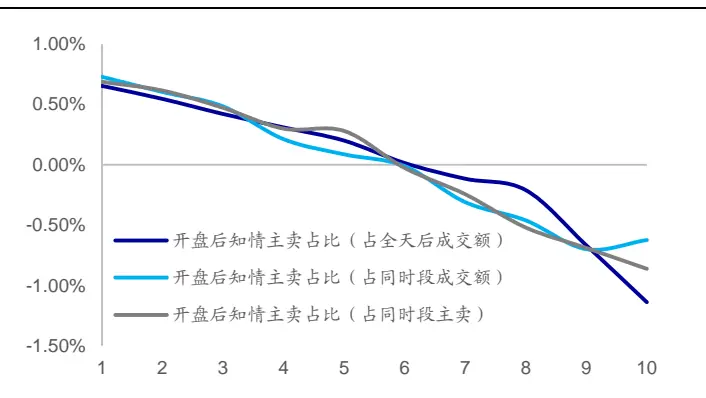
资料来源：Wind，海通证券研究所

图4 开盘后知情主卖占比分 10 组超额收益（正交后）（2013.01.04~2020.01.23）
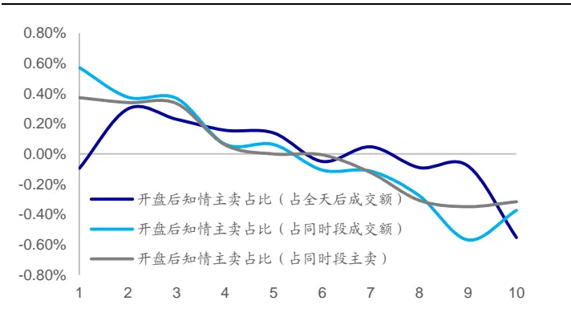
资料来源：Wind，海通证券研究所

下图展示了上述因子的多空相对强弱走势。

图5 部分知情主卖占比因子多空相对强弱走势（正交后）
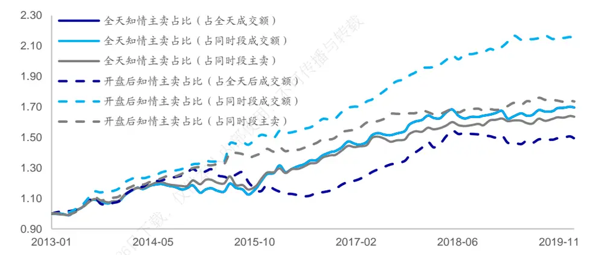
资料来源：Wind，海通证券研究所

在正交处理后，各计算方法下的全天知情主卖占比年化多空收益约为 8%。开盘后知情主卖占比年化多空收益在 6%~12%之间，其中，开盘后知情主卖占比（占同时段成交额）的年化多空收益达 12.3%。下表展示了上述因子的分年度多空收益。

表 3 部分知情主卖占比因子分年度多空收益（2013.01.04~2020.01.23）（正交后）

| 因子名称 | 多空 收益 | 月度 胜率 | 2013 | 2014 | 2015 | 2016 | 2017 | 2018 | 2019 | 截至 2020 年 1月23日 |
| --- | --- | --- | --- | --- | --- | --- | --- | --- | --- | --- |
| 全天知情主卖占比（占全天成交额） | 8.2% | 77% | 13.0% | 3.8% | 17.5% | 13.3% | 8.2% | 1.8% | 2.9% | -0.5% |
| 全天知情主卖占比（占同时段成交额） | 8.2% | 77% | 13.0% | 3.8% | 17.5% | 13.3% | 8.2% | 1.8% | 2.9% | -0.5% |
| 全天知情主卖占比（占同时段主卖） | 7.6% | 73% | 13.6% | 10.0% | 10.1% | 11.1% | 5.7% | 3.3% | 2.1% | -0.5% |
| 开盘后知情主卖占比（占全天成交额） | 6.1% | 71% | 14.3% | 17.7% | -15.0% | 3.3% | 14.4% | 3.2% | 0.8% | -1.2% |
| 开盘后知情主卖占比（占同时段成交额） | 12.3% | 86% | 22.9% | 16.1% | 22.2% | 10.9% | 12.8% | 4.0% | 5.5% | -0.4% |
| 开盘后知情主卖占比（占同时段主卖） | 8.8% | 83% | 17.4% | 20.4% | 12.5% | 8.3% | 7.3% | 0.1% | 4.5% | -0.3% |

资料来源：Wind，海通证券研究所

我们同样可从回归法的角度对于上述因子的选股能力进行检验，可将上述因子分别与常规低频因子（行业、市值、中盘、换手率、反转、波动、估值、盈利以及盈利增长）放入多元回归模型进行回归检验。因子的回归系数即为因子溢价，通过因子溢价可得到因子的累计净值。下图展示了各因子的累计净值。

图6 部分知情主卖占比因子累计净值（正交后）
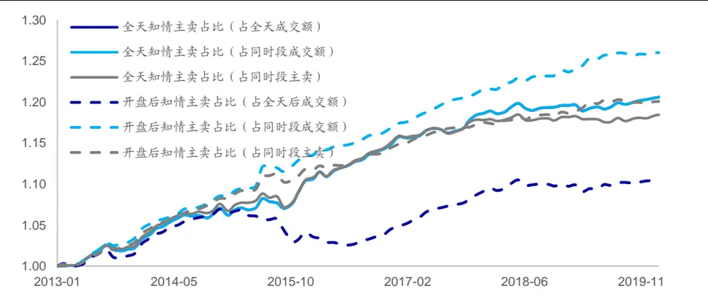
资料来源：Wind，海通证券研究所

从回归法的角度看，上述因子同样呈现出了显著的选股能力。因子月均溢价的绝对值在 0.2%左右。其中，开盘后知情主卖占比（占同时段成交额）的月均溢价为 0.27%，月度胜率达 86%。下表展示了各因子的月均溢价以及不同年度的月均溢价。

表 4 部分知情主卖占比因子分年度月均溢价（2013.01.04~2020.01.23）（正交后）

| 因子名称 | 月均 溢价 | 月度 胜率 | 2013 | 2014 | 2015 | 2016 | 2017 | 2018 | 2019 | 截至 2020 年 1月23日 |
| --- | --- | --- | --- | --- | --- | --- | --- | --- | --- | --- |
| 全天知情主卖占比（占全天成交额） | -0.22% | 77% | -0.27% | -0.23% | -0.34% | -0.38% | -0.21% | -0.07% | -0.06% | -0.09% |
| 全天知情主卖占比（占同时段成交额） | -0.22% | 77% | -0.27% | -0.23% | -0.34% | -0.38% | -0.21% | -0.07% | -0.06% | -0.09% |
| 全天知情主卖占比（占同时段主卖） | -0.20% | 73% | -0.29% | -0.25% | -0.32% | -0.37% | -0.14% | -0.03% | -0.01% | -0.11% |
| 开盘后知情主卖占比（占全天成交额） | -0.12% | 71% | -0.23% | -0.30% | 0.23% | -0.10% | -0.33% | -0.05% | -0.05% | 0.01% |
| 开盘后知情主卖占比（占同时段成交额） | -0.27% | 86% | -0.37% | -0.31% | -0.38% | -0.28% | -0.29% | -0.15% | -0.16% | -0.04% |
| 开盘后知情主卖占比（占同时段主卖） | -0.22% | 83% | -0.33% | -0.34% | -0.26% | -0.23% | -0.19% | -0.08% | -0.10% | -0.03% |

资料来源：Wind，海通证券研究所

## 2.2 知情主买占比因子

下表展示了不同计算方法下的知情主买占比因子在正交前后的因子月度 IC 以及前后 10%多空收益情况。

在正交前，知情主买占比与股票未来收益负相关。在正交后，各计算方法下的收盘前知情主买占比与股票未来收益依旧呈现出了较为明显的负相关性。因子月均 IC 的绝对值在 0.02~0.04 之间，因子 ICIR 的绝对值在 1.8~3.0 之间。对比不同计算方法下的因子，收盘前知情主买占比（占全天成交额）的月度选股能力相对较强，因子月度多空收益达1.28%，月度胜率超 80%，多头月均收益达 0.56%。

知情主买占比因子在正交后的表现与直观理解并不完全相符。从结果来看，知情主买占比越高，股票未来表现越差。若进一步观察因子的有效区域可以发现，仅有收盘前知情主买占比在正交后依旧具有选股能力。从前期研究结果可知，投资者在收盘前往往具有过度反应的倾向，因此可从这一角度理解收盘前知情主买占比与股票未来收益之间的负相关性。

表 5 知情主买占比因子月度 IC 与多空收益（2013.01.04~2020.01.23）

| 因子处理 | 指标名称 | 时段 | IC 均值 | 年化 ICIR | 月度胜率 | 多空收益 | 多头收益 | 空头收益 |
| --- | --- | --- | --- | --- | --- | --- | --- | --- |
|  |  | 全天 | -0.06 | -1.88 | 71% | 2.03% | 0.64% | -1.39% |
|  |  | 开盘后 | -0.04 | -1.41 | 63% | 1.20% | 0.04% | -1.16% |
|  | 知情主买占比 (占全天成交额） | 盘中 | -0.03 | -0.97 | 59% | 1.04% | 0.50% | -0.54% |
|  |  | 收盘前 | -0.04 | -2.03 | 76% | 1.59% | 0.69% | -0.90% |
|  |  | 全天 | -0.06 | -1.88 | 71% | 2.03% | 0.64% | -1.39% |
|  |  | 开盘后 | -0.03 | -1.26 | 67% | 1.24% | 0.22% | -1.02% |
|  | (占同时段成交额) | 盘中 | -0.05 | -1.80 | 71% | 1.90% | 0.79% | -1.11% |
|  | 全天 | 收盘前 | -0.04 | -1.79 | 70% | 1.41% | 0.69% | -0.72% |
|  | 知情主买占比 |  | -0.06 | -2.09 | 74% | 2.16% | 0.67% | -1.49% |
|  | 开盘后 (占同时段主买) |  | -0.04 | -1.49 | 70% | 1.27% | 0.16% | -1.12% |
|  | 盘中 收盘前 | -0.06 | -2.09 | 74% | 2.14% |  | 0.82% | -1.32% |
|  |  |  | -0.04 | -2.01 | 77% | 1.26% | 0.60% | -0.66% |
| 正交后 | 知情主买占比 (占全天成交额) | 全天 | -0.01 | -0.80 | 64% | 0.28% | 0.19% | -0.09% |
|  |  | 开盘后 | 0.01 | 0.58 | 56% | 0.41% | -0.16% | -0.57% |
|  |  | 盘中 | 0.00 | 0.11 | 49% | -0.02% | -0.02% | 0.00% |
|  |  | 收盘前 | -0.04 | -3.05 | 81% | 1.28% | 0.56% | -0.72% |
|  | 知情主买占比 （占同时段成交额） | 全天 | -0.01 | -0.80 | 64% | 0.28% | 0.19% | -0.09% |
|  |  | 开盘后 | 0.01 | 1.12 |  | 0.37% | 0.19% | -0.18% |
|  |  | 盘中 | -0.01 | -0.74 | 69% | 0.35% | 0.29% | -0.06% |
|  |  | 收盘前 | -0.02 | -1.80 | 69% | 0.56% | 0.30% | -0.26% |
| (占同时段主买) | 全天 | -0.02 | -1.31 | 66% | 0.58% | 0.26% |  | -0.32% |
|  | 知情主买占比 开盘后 | 0.00 |  | 59% |  | 0.17% | 0.08% | -0.08% |
|  | 盘中 | -0.02 |  | 70% | 0.61% | 0.37% |  | -0.23% |
|  | 收盘前 | -0.02 | -2.06 | 71% | 0.49% | 0.26% |  | -0.23% |

资料来源： ，海通证券研究所

下图展示了收盘前知情主买占比的月度分 10 组超额收益。在正交前后，收盘前知情主买占比都呈现出了较为明显的组间收益单调性。

图7 收盘前知情主买占比分 10 组超额收益（正交前）（2013.01.04~2020.01.23）
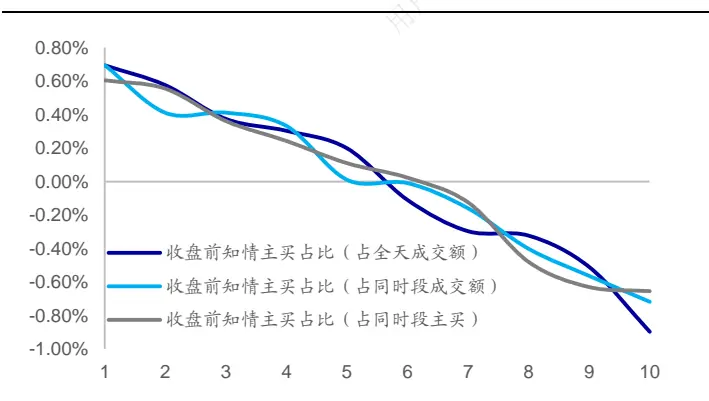
资料来源：Wind，海通证券研究所

图8 收盘前知情主买占比分 10 组超额收益（正交后）（2013.01.04~2020.01.23）
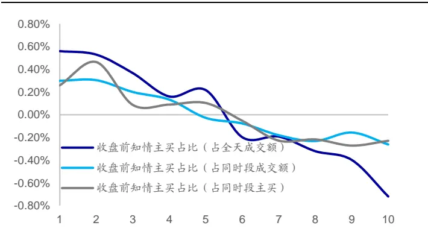
资料来源：Wind，海通证券研究所

下图展示了正交后的收盘前知情主买占比的多空相对强弱走势。

图9 收盘前知情主买占比多空相对强弱走势（正交后）
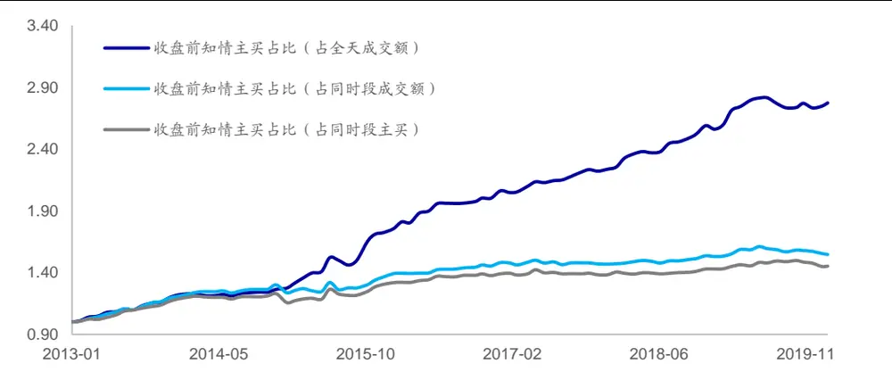
资料来源：Wind，海通证券研究所

收盘前知情主买占比（占全天成交额）的表现相对较好，年化多空收益达 16.1%，月度胜率超额 80%。下表展示了上述因子的分年度多空收益。

表 6 收盘前知情主买占比分年度多空收益（2013.01.04~2020.01.23）（正交后）

| 因子名称 | 多空 收益 | 月度 胜率 | 2013 | 2014 | 2015 | 2016 | 2017 | 2018 | 2019 | 截至 2020 年 1月 23 日 |
| --- | --- | --- | --- | --- | --- | --- | --- | --- | --- | --- |
| 收盘前知情主买占比（占全天成交额） | 16.1% | 81% | 25.1% | 6.4% | 60.3% | 13.7% | 7.0% | 9.6% | 8.7% | 0.9% |
| 收盘前知情主买占比（占同时段成交额） | 6.9% | 69% | 23.1% | 4.5% | 20.9% | 5.4% | -0.3% | 3.0% | 2.0% | -0.7% |
| 收盘前知情主买占比（占同时段主买） | 5.9% | 71% | 20.9% | -3.2% | 23.0% | 4.7% | -0.3% | 2.5% | 1.9% | -0.1% |

资料来源： ，海通证券研究所

下图展示了各因子的累计净值。

图10 收盘前知情主买占比累计净值（正交后）
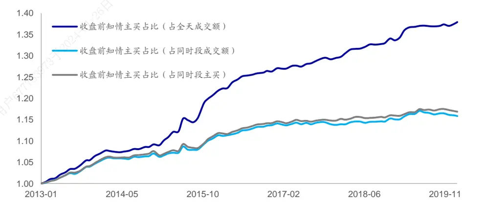
资料来源：Wind，海通证券研究所

从回归法的角度看，收盘前知情主买占比同样呈现出了显著的选股能力，其中，收盘前知情主买占比（占全天成交额）月均溢价为-0.38%，月度胜率达 81%。下表展示了各因子的月均溢价以及不同年度的月均溢价。

表 7 收盘前知情主买占比分年度月均溢价（2013.01.04~2020.01.23）（正交后）

| 因子名称 | 月均 溢价 | 月度 胜率 | 2013 | 2014 | 2015 | 2016 | 2017 | 2018 | 2019 | 截至 2020年 1月23日 |
| --- | --- | --- | --- | --- | --- | --- | --- | --- | --- | --- |
| 收盘前知情主买占比（占全天成交额） | -0.38% | 81% | -0.57% | -0.15% | -0.94% | -0.35% | -0.16% | -0.26% | -0.24% | -0.32% |
| 收盘前知情主买占比（占同时段成交额） | -0.17% | 69% | -0.43% | -0.08% | -0.39% | -0.21% | 0.02% | -0.10% | -0.07% | 0.15% |
| 收盘前知情主买占比（占同时段主买） | -0.18% | 71% | -0.45% | -0.09% | -0.40% | -0.20% | -0.01% | -0.09% | -0.08% | 0.14% |

资料来源：Wind，海通证券研究所

## 2.3 知情净主买占比因子

下表展示了不同计算方法下的知情净主买占比因子在正交前后的因子月度 IC以及前后 10%多空收益情况。

表 8 知情净主买占比因子月度 IC 与多空收益（2013.01.04~2020.01.23）

| 因子处理 | 因子名称 | 时段 | IC 均值 | 年化ICIR | 月度胜率 | 多空收益 | 多头收益 | 空头收益 |
| --- | --- | --- | --- | --- | --- | --- | --- | --- |
| 正交前 | 知情净主买占比 | 全天 | -0.01 | -0.35 | 50% | 0.18% | -0.13% | -0.32% |
|  | (占全天成交额） | 开盘后 | 0.01 | 0.41 | 58% | 0.19% | 0.08% | -0.11% |
|  |  | 盘中 | -0.01 | -0.46 | 50% | 0.38% | 0.01% | -0.37% |
|  |  | 收盘前 | -0.01 | -0.41 | 43% | 0.23% | -0.05% | -0.28% |
|  | 知情净主买占比 (占同时段成交额) | 全天 | -0.01 | -0.35 | 50% | 0.18% | -0.13% | -0.32% |
|  |  | 开盘后 | 0.01 | 0.39 | 62% | 0.37% | 0.26% | -0.11% |
|  |  | 盘中 | -0.01 | -0.46 | 50% | 0.49% | 0.05% | -0.44% |
|  |  | 收盘前 | -0.01 | -0.48 | 48% | 0.28% | 0.04% | -0.24% |
|  | 知情净主买占比 (占同时段净主买） | 全天 | 0.00 | -0.64 | 63% | 0.19% | 0.13% | -0.05% |
|  |  | 开盘后 | 0.00 | -0.35 | 53% | 0.07% | 0.02% | -0.05% |
| 盘中 |  | 0.00 | 0.21 | 52% | 0.10% | 0.14% | 0.04% |  |
| 收盘前 |  | 0.00 | -0.59 | 52% | 0.08% | -0.04% | -0.12% |  |
| 正交后 | 知情净主买占比 (占全天成交额) | 全天 | 0.01 | 1.52 | 65% | 0.22% | -0.02% | -0.24% |
|  |  | 开盘后 | 0.02 | 2.83 | 80% | 0.72% | 0.34% | -0.39% |
|  |  | 盘中 | 0.01 | 1.13 | 59% | -0.03% | -0.05% | -0.03% |
|  | 知情净主买占比 （占同时段成交额） | 收盘前 | -0.01 | -0.79 使用， | 58% | 0.27% | 0.03% | -0.24% |
|  |  | 全天 | 0.01 | 1.52 | 65% | 0.22% | -0.02% | -0.24% |
|  |  | 开盘后 | 0.02 | 2.95 | 84% | 0.79% | 0.50% | -0.29% |
|  |  | 盘中 收盘前 | 0.01 | A 1.20 | 63% | 0.03% | -0.04% | -0.07% |
| 知情净主买占比 (占同时段净主买) |  | -0.01 | -0.79 | 58% | 0.21% | 0.07% | -0.14% |  |
|  | 全天 | 0.00 | -0.46 | 63% | 0.17% | 0.15% | -0.03% |  |
|  | 开盘后 | 0.00 | -0.04 | 48% | 0.00% | 0.01% | 0.00% |  |
|  | 盘中 | 0.00 3于2024 | 0.57 | 53% | 0.07% | 0.13% | 0.07% |  |
|  | 收盘前 | 0.00 | -0.23 | 51% | 0.03% | -0.10% | -0.14% |  |

资料来源：Wind，海通证券研究所

知情净主买占比因子在正交前并未呈现出月度选股能力。在正交后，开盘后知情净主买占比与股票未来收益正相关。开盘后知情净主买占比（占全天成交额）以及开盘后知情净主买占比（占同时段成交额）的月均 IC为 0.02，年化 ICIR 在 2.8~3.0 之间，月度胜率超 80%。

开盘后知情净主买占比与股票未来收益之间的正相关性较为符合直观理解，知情净主买占比越高，具有信息优势的投资者的主动买入行为越强，该类投资者越看好股票未来表现。

下图展示了因子的月度分 10 组超额收益。

图11 开盘后知情净主买占比分 10 组超额收益（正交前）（2013.01.04~2020.01.23）
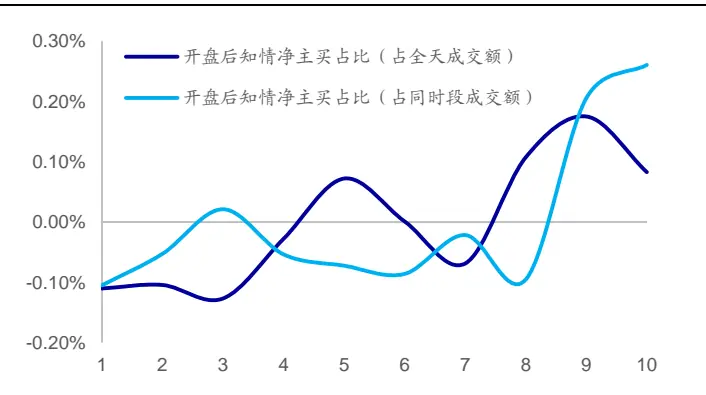
资料来源：Wind，海通证券研究所

图12 开盘后知情净主买占比分 10 组超额收益（正交后）（2013.01.04~2020.01.23）
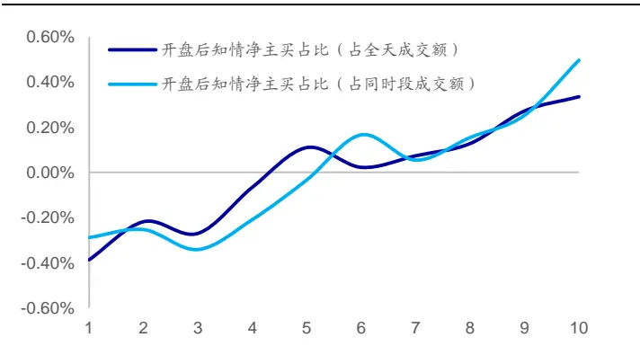
资料来源：Wind，海通证券研究所

下图展示了上述因子的多空相对强弱走势。

图13 开盘后知情净主买占比多空相对强弱走势（正交后）
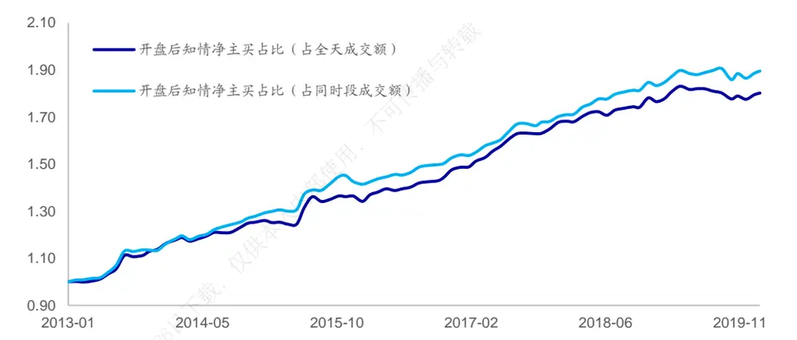
资料来源：Wind，海通证券研究所

因子年化多空收益在 9%~10%之间，月度胜率超 80%。值得注意的是，因子在 2018以及 2019 年的表现弱于历史其他年份。下表展示了上述因子的分年度多空收益。

表 9 开盘后知情净主买占比分年度多空收益（2013.01.04~2020.01.23）（正交后）

| 因子名称 | 多空 收益 | 月度 胜率 | 2013 | 2014 | 2015 | 2016 | 2017 | 2018 | 2019 | 截至 2020 年 1月23 日 |
| --- | --- | --- | --- | --- | --- | --- | --- | --- | --- | --- |
| 开盘后知情净主买占比（占全天成交额） | 9.3% | 80% | 18.1% | 12.7% | 12.0% | 8.6% | 10.5% | 3.9% | 2.0% | 0.4% |
| 开盘后知情净主买占比（占同时段成交额） | 10.3% | 84% | 18.1% | 17.6% | 16.7% | 7.4% | 8.8% | 5.6% | 3.5% | 0.5% |

资料来源：Wind，海通证券研究所

下图展示了因子的累计净值。

图14 开盘后知情净主买占比累计净值（正交后）
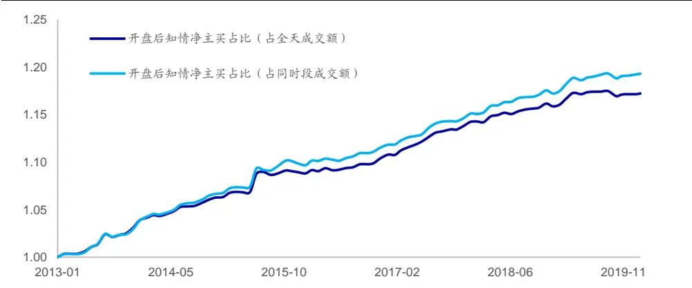
资料来源：Wind，海通证券研究所

从回归法的角度看，上述因子同样呈现出了显著的选股能力。因子月均溢价约为0.2%。下表展示了各因子的月均溢价以及不同年度的月均溢价。

表 10 开盘后知情净主买占比分年度月均溢价（2013.01.04~2020.01.23）（正交后）

| 因子名称 | 月均 溢价 | 月度 胜率 | 2013 | 2014 | 2015 | 2016 | 2017 | 2018 | 2019 | 截至2020年 1 月23 日 |
| --- | --- | --- | --- | --- | --- | --- | --- | --- | --- | --- |
| 开盘后知情净主买占比（占全天成交额） | 0.19% | 80% | 0.32% | 0.19% | 0.19% | 0.15% | 0.26% | 0.12% | 0.09% | 0.07% |
| 开盘后知情净主买占比（占同时段成交额） | 0.21% | 84% | 0.32% | 0.23% | 0.23% | 0.16% | 0.24% | 0.15% | 0.14% | 0.07% |

资料来源：Wind，海通证券研究所

## 3. 相关性分析

本章展示了知情主卖占比因子、知情主买占比因子以及知情净买占比因子与常规低频因子之间的截面相关性。

下表展示了知情主卖占比因子与常规低频因子之间的截面相关性。全天知情主卖占比以及盘中知情主卖占比与市值相关性较强。开盘后知情主卖占比（占全天成交额）与换手率以及特质波动相关性较强。

表 11 知情主卖占比因子与低频因子截面相关性（2013.01.04~2020.01.23）

| 因子名称 | 时段 | 市值 | 中盘 | 换手率 | 前期涨幅 | 特质波动 | 估值 | 盈利 | 盈利增长 |
| --- | --- | --- | --- | --- | --- | --- | --- | --- | --- |
| 知情主卖占比 (占全天成交额) | 全天 | 0.31 | -0.23 | 0.08 | -0.22 | 0.05 | -0.10 | -0.02 | 0.01 |
|  | 开盘后 | 0.06 | -0.05 | 0.49 | 0.06 | 0.42 | 0.17 | -0.06 | 0.01 |
|  | 盘中 | 0.35 | -0.27 | -0.19 | -0.26 | -0.17 | -0.20 | 0.04 | 0.02 |
|  | 收盘前 | 0.02 | 0.00 | 0.04 | -0.19 | 0.04 | -0.04 | -0.09 | -0.02 |
| 知情主卖占比 (占同时段成交额) | 全天 | 0.31 | -0.23 | 0.08 | -0.22 | 0.05 | -0.10 | -0.02 | 0.01 |
|  | 开盘后 | 0.12 | -0.09 | 0.11 | -0.20 | 0.10 | 0.02 | -0.01 | -0.01 |
|  | 盘中 | 0.30 | -0.22 | -0.02 | -0.21 | -0.03 | -0.14 | -0.02 | 0.01 |
|  | 收盘前 | 0.18 | -0.14 | 0.14 | -0.08 | 0.11 | -0.03 | -0.04 | 0.01 |
| 知情主卖占比 (占同时段主卖) | 全天 | 0.41 | -0.30 | 0.18 | -0.03 | 0.13 | -0.01 | 0.02 | 0.03 |
|  | 开盘后 | 0.21 | -0.14 | 0.13 | -0.11 | 0.13 | 0.06 | 0.02 | 0.01 |
|  | 盘中 | 0.39 | -0.29 | 0.06 | -0.05 | 0.03 | -0.07 | 0.02 | 0.04 |
|  | 收盘前 | 0.21 | -0.16 | 0.18 | 0.00 | 0.14 | 0.02 | 0.00 | 0.02 |

资料来源： ，海通证券研究所

下表展示了知情主买占比因子与常规低频因子之间的截面相关性。全天知情主买占 比与市值、换手以及前期涨幅相关性较强。开盘后知情主买占比与换手率相关性较强。 盘中知情主买占比与市值相关性较强。

表 12 知情主买占比因子与低频因子截面相关性（2013.01.04~2020.01.23）

| 因子名称 | 时段 | 市值 | 中盘 | 换手率 | 前期涨幅 | 特质波动 | 估值 | 盈利 | 盈利增长 |
| --- | --- | --- | --- | --- | --- | --- | --- | --- | --- |
| 知情主买占比 (占全天成交额) | 全天 | 0.32 | -0.22 | 0.39 | 0.31 | 0.29 | 0.17 | 0.07 | 0.05 |
|  | 开盘后 | 0.08 | -0.06 | 0.58 | 0.30 | 0.46 | 0.23 | -0.03 | 0.03 |
|  | 盘中 | 0.36 | -0.25 | 0.11 | 0.20 | 0.07 | 0.06 | 0.13 | 0.05 |
|  | 收盘前 | -0.01 | 0.04 | 0.00 | -0.03 | 0.00 | 0.03 | -0.02 | -0.01 |
| 知情主买占比 (占同时段成交额) | 全天 | 0.32 | -0.22 | 0.39 | 0.31 | 0.29 | 0.17 | 0.07 | 0.05 |
|  | 开盘后 | 0.17 | -0.13 | 0.34 | 0.27 | 0.26 | 0.16 | 0.04 | 0.04 |
|  | 盘中 | 0.31 | -0.22 | 0.30 | 0.27 | 0.23 | 0.13 | 0.07 | 0.05 |
|  | 收盘前 | 0.19 | -0.12 | 0.11 | 0.11 | 0.08 | 0.07 | 0.06 | 0.03 |
| 知情主买占比 (占同时段主买) | 全天 | 0.30 | -0.22 | 0.41 | 0.13 | 0.32 | 0.14 | 0.06 | 0.04 |
|  | 开盘后 | 0.14 | -0.11 | 0.37 | 0.19 | 0.28 | 0.14 | 0.02 | 0.03 |
|  | 盘中 | 0.31 | -0.22 | 0.31 | 0.12 | 0.24 | 0.10 | 0.06 | 0.04 |
|  | 收盘前 | 0.19 | -0.12 | 0.12 | 0.02 | 0.09 | 0.04 | 0.03 | 0.01 |

资料来源： ，海通证券研究所

下表展示了知情净主买占比因子与常规低频因子之间的截面相关性。全天知情净主买占比以及盘中知情净主买占比与股票前期涨幅相关性较强。

表 13 知情净主买占比因子与低频因子截面相关性（2013.01.04~2020.01.23）

| 因子名称 | 时段 | 市值 | 中盘 | 换手率 | 前期涨幅 | 特质波动 | 估值 | 盈利 | 盈利增长 |
| --- | --- | --- | --- | --- | --- | --- | --- | --- | --- |
| 知情净主买占比 (占全天成交额) | 全天 | -0.01 | 0.02 | 0.20 | 0.37 | 0.15 | 0.19 | 0.06 | 0.03 |
|  | 开盘后 | 0.03 | -0.02 | 0.12 | 0.25 | 0.07 | 0.07 | 0.02 | 0.02 |
|  | 盘中 | -0.02 | 0.03 | 0.20 | 0.30 | 0.16 | 0.18 | 0.04 | 0.02 |
|  | 收盘前 | -0.02 | 0.03 | -0.02 | 0.11 | -0.03 | 0.05 | 0.04 | 0.01 |
| 知情净主买占比 (占同时段成交额) | 全天 | -0.01 | 0.02 | 0.20 | 0.37 | 0.15 | 0.19 | 0.06 | 0.03 |
|  | 开盘后 | 0.02 | -0.02 | 0.13 | 0.27 | 0.08 | 0.07 | 0.03 | 0.03 |
|  | 盘中 | -0.01 | 0.02 | 0.19 1-26日下 | 0.30 | 0.16 | 0.17 | 0.05 | 0.02 |
|  | 收盘前 | -0.01 | 0.03 | -0.03 | 0.11 | -0.02 | 0.05 | 0.05 | 0.01 |
| 知情净主买占比 （占同时段净主买） | 全天 | -0.01 | 0.01 | 0.03 | 0.02 | 0.03 | 0.03 | 0.01 | 0.00 |
|  | 开盘后 | 0.00 | -0.01 | 0.02 | 0.02 | 0.02 | 0.02 | 0.01 | 0.00 |
|  | 盘中 | -0.01 | 0.01 753973 | 0.03 | 0.01 | 0.03 | 0.03 | 0.01 | 0.00 |
|  | 收盘前 | -0.01 | 0.01 | 0.02 | 0.00 | 0.01 | 0.01 | 0.00 | 0.00 |

资料来源：Wind，海通证券研究所

## 4. 不同指数范围内的选股能力

本部分对比展示了正交后的知情主卖占比因子、知情主买占比因子以及知情净主买占比因子在不同指数范围内的选股能力。

下表展示了知情主卖占比因子在各指数范围内的选股能力。全天知情主卖占比以及开盘后知情主卖占比在中证 800 指数以及中证 500 指数内依旧具有一定的选股能力。然而，全天以及开盘后知情主卖占比（占同时段主卖）在沪深 300 指数内并未呈现出显著的月度选股能力。

表 14 知情主卖占比因子在不同指数内的选股能力（2013.01.04~2020.01.23）（正交后）

| 因子名称 | 时段 | 中证 800 指数内 |  |  |  | 中证 500 指数内 |  |  |  | 沪深 300 指数内 |  |  |  |
| --- | --- | --- | --- | --- | --- | --- | --- | --- | --- | --- | --- | --- | --- |
|  |  | IC | ICIR | 胜率 | 多空收益 | IC | ICIR | 胜率 | 多空收益 | IC | ICIR | 胜率 | 多空收益 |
| 知情主卖占比 (占全天成交额) | 全天 | -0.02 | -1.75 | 70% | 0.61% | -0.02 | -1.43 | 64% | 0.44% | -0.03 | -1.50 | 63% | 0.61% |
|  | 开盘后 | -0.02 | -1.35 | 70% | 0.50% | -0.02 | -1.01 | 62% | 0.39% | -0.02 | -1.46 | 70% | 0.77% |
|  | 盘中 | -0.01 | -0.84 | 56% | 0.29% | -0.01 | -0.78 | 57% | 0.20% | -0.01 | -0.51 | 55% | 0.28% |
|  | 收盘前 | -0.02 | -1.59 | 67% | 0.52% | -0.02 | -1.24 | 70% | 0.40% | -0.03 | -1.51 | 67% | 0.37% |
| 知情主卖占比 (占同时段成交额) | 全天 | -0.02 | -1.75 | 70% | 0.61% | -0.02 | -1.43 | 64% | 0.44% | -0.03 | -1.50 | 63% | 0.61% |
|  | 开盘后 | -0.02 | -2.24 | 71% | 0.55% | -0.03 | -1.86 | 73% | 0.69% | -0.02 | -1.35 | 62% | 0.56% |
|  | 盘中 | -0.02 | -1.58 | 64% | 0.42% | -0.02 | -1.23 | 59% | 0.45% | -0.02 | -1.27 | 64% | 0.35% |
|  | 收盘前 | 0.00 | -0.02 | 56% | 0.01% | 0.00 | 0.10 | 47% | -0.13% | 0.00 | -0.19 | 50% | 0.24% |
| 知情主卖占比 （占同时段主卖） | 全天 | -0.02 | -1.40 | 66% | 0.60% | -0.02 | -1.35 | 65% | 0.67% | -0.01 | -0.83 | 55% | 0.62% |
|  | 开盘后 | -0.02 | -1.72 | 72% | 0.46% | -0.02 | -1.51 | 63% | 0.46% | -0.01 | -0.90 | 60% | 0.14% |
|  | 盘中 | -0.02 | -1.16 | 60% | 0.41% | -0.02 | -1.12 | 59% | 0.45% | -0.01 | -0.59 | 49% | 0.42% |
|  | 收盘前 | 0.00 | 0.12 | 44% | -0.03% | 0.00 | 0.26 | 51% | 0.18% | 0.00 | -0.06 | 51% | 0.13% |

资料来源：Wind，海通证券研究所

下表展示了知情主买占比因子在各指数范围内的选股能力。在中证 800 指数内，仅有收盘前知情主买占比（占全天成交额）依旧呈现出了一定的选股能力。

表 15 知情主买占比因子在不同指数内的选股能力（2013.01.04~2020.01.23）（正交后）

| 因子名称 | 时段 | 中证 800 指数内 |  |  |  | 中证 500 指数内 |  |  |  | 沪深 300 指数内 |  |  |  |
| --- | --- | --- | --- | --- | --- | --- | --- | --- | --- | --- | --- | --- | --- |
|  |  | IC | ICIR | 胜率 | 多空收益 | IC | ICIR | 胜率 | 多空收益 | IC | ICIR | 胜率 | 多空收益 |
| 知情主买占比 (占全天成交额） | 全天 | 0.00 | 0.16 | 55% | 0.13% | 0.00 | -0.27 | 51% | 0.07% | 0.02 | 0.78 | 62% | 0.37% |
|  | 开盘后 | 0.00 | 0.16 | 49% | 0.14% | 0.01 | 0.32 | 49% | 0.54% | 0.00 | -0.22 | 48% | 0.16% |
|  | 盘中 | 0.01 | 0.92 | 56% | 0.52% | 0.00 | 0.29 | 53% | 0.17% | 0.03 | 1.56 | 64% | 0.69% |
|  | 收盘前 | -0.03 | -2.06 | 73% | 0.66% | -0.03 | -1.80 | 70% | 0.75% | -0.02 | -1.38 | 70% | 0.46% |
| 知情主买占比 (占同时段成交额) | 全天 | 0.00 | 0.16 | 55% | 0.13% | 0.00 | -0.27 | 51% | 0.07% | 0.02 | 0.78 | 62% | 0.37% |
|  | 开盘后 | 0.01 | 0.60 | 56% | 0.09% | 0.01 | 0.50 | 56% | 0.27% | 0.01 | 0.32 | 52% | 0.10% |
|  | 盘中 | 0.00 | 0.32 | 51% | 0.03% | 0.00 | -0.17 | 55% | 0.15% | 0.02 | 1.03 | 64% | 0.20% |
|  | 收盘前 | -0.01 | -0.56 | 59% | 0.15% | -0.01 | -0.76 | 62% | 0.35% | 0.00 | -0.03 | 49% | 0.05% |
| 知情主买占比 (占同时段主买) | 全天 | -0.01 | -0.45 | 59% | 0.06% | -0.01 | -0.65 | 58% | 0.02% | 0.00 | 0.13 | 53% | -0.17% |
|  | 开盘后 | 0.00 | 0.26 | 44% | 0.10% | 0.00 | 0.25 | 50% | 0.17% | 0.00 | -0.01 | 52% | -0.04% |
|  | 盘中 | 0.00 | -0.33 | 58% | -0.04% | -0.01 | -0.56 | 57% | 0.15% | 0.01 | 0.36 | 57% | -0.02% |
|  | 收盘前 | -0.01 | -0.93 | 62% | 0.21% | -0.02 | -1.02 | 58% | 0.57% | 0.00 | -0.25 | 51% | -0.09% |

资料来源：Wind，海通证券研究所

下表展示了知情净主买占比因子在各指数范围内的选股能力。在进入中证 800 指数后，开盘后知情净主买占比（占全天成交额）以及开盘后知情净主买占比（占同时段成交额）依旧呈现出了一定的选股能力。但是随着选股范围的缩小，因子的选股能力呈现出了逐渐减弱的态势。

表 16 知情净主买占比因子在不同指数内的选股能力（2013.01.04~2020.01.23）（正交后）

| 因子名称 | 时段 | 中证 800 指数内 |  |  |  | 中证 500 指数内 |  |  |  | 沪深 300 指数内 |  |  |  |
| --- | --- | --- | --- | --- | --- | --- | --- | --- | --- | --- | --- | --- | --- |
|  |  | IC | ICIR | 胜率 | 多空收益 | IC | ICIR | 胜率 | 多空收益 | IC | ICIR | 胜率 | 多空收益 |
| 知情净主买占比 (占全天成交额) | 全天 | 0.02 | 1.31 | 59% | 0.40% | 0.01 | 0.95 | 64% | 0.20% | 0.02 | 1.33 | 64% | 0.70% |
|  | 开盘后 | 0.02 | 1.51 | 60% | 0.51% | 0.02 | 1.26 | 59% | 0.41% | 0.01 | 0.95 | 56% | 0.58% |
|  | 盘中 | 0.01 | 1.16 | 62% | 0.22% | 0.01 | 0.73 | 58% | 0.08% | 0.02 | 1.22 | 62% | 0.40% |
|  | 收盘前 | 0.00 | -0.21 | 52% | 0.05% | -0.01 | -0.41 | 57% | 0.14% | 0.00 | 0.08 | 51% | 0.13% |
| 知情净主买占比 (占同时段成交额) | 全天 | 0.02 | 1.31 | 59% | 0.40% | 0.01 | 0.95 | 64% | 0.20% | 0.02 | 1.33 | 64% | 0.70% |
|  | 开盘后 | 0.02 | 1.63 | 64% | 0.51% | 0.02 | 1.36 | 66% | 0.49% | 0.01 | 0.87 | 55% | 0.39% |
|  | 盘中 | 0.01 | 1.26 | 62% | 0.12% | 0.01 | 0.82 | 59% | 0.01% | 0.02 | 1.33 | 63% | 0.42% |
|  | 收盘前 | 0.00 | -0.25 | 55% | 0.00% | -0.01 | -0.45 | 58% | 0.09% | 0.00 | 0.09 | 49% | 0.17% |
| 知情净主买占比 (占同时段净主买） | 全天 | 0.00 | -0.42 | 59% | 0.21% | 0.00 | -0.35 | 59% | 0.23% | 0.00 | -0.25 | 50% | -0.06% |
|  | 开盘后 | 0.00 | -0.30 | 53% | 0.07% | -0.01 | -0.67 | 55% | 0.23% | 0.00 | 0.18 | 50% | -0.16% |
|  | 盘中 | 0.00 | -0.22 | 57% | 0.14% | 0.00 | -0.18 | 53% | 0.10% | 0.00 | -0.15 | 52% | 0.04% |
|  | 收盘前 | 0.00 | -0.42 | 48% | 0.14% | -0.01 | -0.73 | 53% | 0.39% | 0.01 | 0.45 | 50% | 0.36% |

资料来源：Wind，海通证券研究所

## 5. 总结

本文在前期研究的基础之上，引入了知情交易概率模型并对于投资者的主动买入行与为以及主动卖出行为进行了筛选过滤，构建了知情主卖占比因子、知情主买占比因子以传及知情净主买占比因子。不

相比而言，知情主卖占比因子具有较为明显的月度选股能力。回测结果表明，股票使前期知情主卖占比越高，未来相对收益表现越差。在正交剔除了常规低频因子后，因子内的选股能力依旧较为显著。此外，因子的选股能力在中证 800 指数内以及中证 500 指数本内依旧存在。仅

需要注意的是，本文所述因子的表现较为取决于知情主买与知情主卖的认定。本文日所使用的回归模型，仅剔除了星期效应、时段效应与短期动量效应。投资者可在实际的-2计算过程中，根据自身理解，对于更多因素进行剥离，从而更加准确地识别知情主买与24-知情主卖。于20

## 6. 风险提示7775

市场系统性风险、资产流动性风险以及政策变动风险会对策略表现产生较大影响。

# 信息披露

分析师声明

[Table冯佳睿yst金融工程研究团队s]

袁林青金融工程研究团队

本人具有中国证券业协会授予的证券投资咨询执业资格，以勤勉的职业态度，独立、客观地出具本报告。本报告所采用的数据和信息均来自市场公开信息，本人不保证该等信息的准确性或完整性。分析逻辑基于作者的职业理解，清晰准确地反映了作者的研究观点，结论不受任何第三方的授意或影响，特此声明。

## 法律声明

本报告仅供海通证券股份有限公司（以下简称 本公司 ）的客户使用。本公司不会因接收人收到本报告而视其为客户。在任何情况下，本报告中的信息或所表述的意见并不构成对任何人的投资建议。在任何情况下，本公司不对任何人因使用本报告中的任何内容所引致的任何损失负任何责任。

本报告所载的资料、意见及推测仅反映本公司于发布本报告当日的判断，本报告所指的证券或投资标的的价格、价值及投资收入可能会波动。在不同时期，本公司可发出与本报告所载资料、意见及推测不一致的报告。

市场有风险，投资需谨慎。本报告所载的信息、材料及结论只提供特定客户作参考，不构成投资建议，也没有考虑到个别客户特殊的播投资目标、财务状况或需要。客户应考虑本报告中的任何意见或建议是否符合其特定状况。在法律许可的情况下，海通证券及其所属可关联机构可能会持有报告中提到的公司所发行的证券并进行交易，还可能为这些公司提供投资银行服务或其他服务。

本报告仅向特定客户传送，未经海通证券研究所书面授权，本研究报告的任何部分均不得以任何方式制作任何形式的拷贝、复印件或复制品，或再次分发给任何其他人，或以任何侵犯本公司版权的其他方式使用。所有本报告中使用的商标、服务标记及标记均为本公司的商标、服务标记及标记，如欲引用或转载本文内容，务必联络海通证券研究所并获得许可，并需注明出处为海通证券研究所，目不得对本文进行有悖原意的引用和删改。仅

根据中国证监会核发的经营证券业务许可，海通证券股份有限公司的经营范围包括证券投资咨询业务。下载

## 海通证券股份有限公司研究所[Table_PeopleInfo]

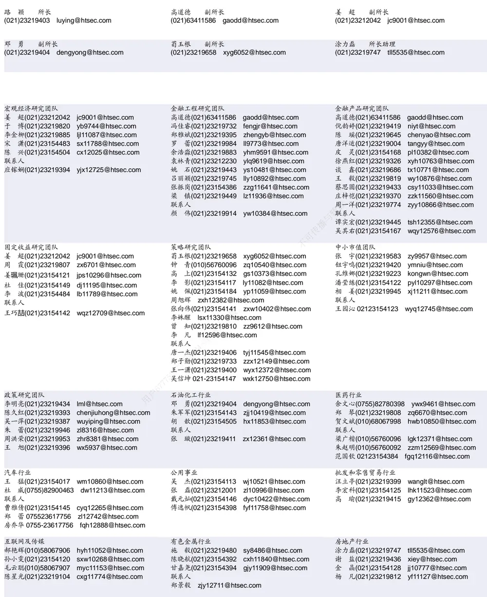

| 电子行业 |  | 煤炭行业 | 电力设备及新能源行业 |  |
| --- | --- | --- | --- | --- |
|  | 陈 平(021)23219646 cp9808@htsec.com | 李 淼(010)58067998 Im10779@htsec.com | 张一弛(021)23219402 | zyc9637@htsec.com |
|  | 尹 苓(021)23154119 yl11569@htsec.com | 戴元灿(021)23154146 dyc10422@htsec.com | 房 青(021)23219692 | fangq@htsec.com |
|  | 谢 磊(021)23212214 xl10881@htsec.com | 吴 杰(021)23154113 wj10521@htsec.com | 曾 彪(021)23154148 zb10242@htsec.com |  |
|  | 蒋 俊(021)23154170 jj11200@htsec.com | 联系人 | 徐柏乔(021)23219171 xbq6583@htsec.com |  |
| 联系人 |  | 王 涛(021)23219760 wt12363@htsec.com |  | 陈佳彬(021)23154513 cjb11782@htsec.com |

| 基础化工行业 | 计算机行业 | 通信行业 |  |
| --- | --- | --- | --- |
| 刘 威(0755)82764281 Iw10053@htsec.com | 郑宏达(021)23219392 zhd10834@htsec.com | 朱劲松(010)50949926 zjs10213@htsec.com |  |
| 刘海荣(021)23154130 Ihr10342@htsec.com | 杨 林(021)23154174 yl11036@htsec.com | 余伟民(010)50949926 | 6 ywm11574@htsec.com |
| 张翠翠(021)23214397 zcc11726@htsec.com | 于成龙 ycl12224@htsec.com | 张峥青(021)23219383 zzq11650@htsec.com |  |
| 孙维容(021)23219431 swr12178@htsec.com | 黄竞晶(021)23154131 hjj10361@htsec.com | 张 弋 01050949962 zy12258@htsec.com |  |
| 李 智(021)23219392 lz11785@htsec.com | 洪 琳(021)23154137 hl11570@htsec.com | 联系人 杨彤昕 010-56760095 ytx12741@htsec.com |  |

| 非银行金融行业 |  | 交通运输行业 |  |  | 纺织服装行业 |  |
| --- | --- | --- | --- | --- | --- | --- |
|  | 孙 婷(010)50949926 st9998@htsec.com |  |  | 虞 楠(021)23219382 yun@htsec.com |  | 梁 希(021)23219407 lx11040@htsec.com |
|  | 何 婷(021)23219634 ht10515@htsec.com |  |  | 罗月江（010）56760091 lyj12399@htsec.com |  | 盛 开(021)23154510 sk11787@htsec.com |
|  | 李芳洲(021)23154127 Ifz11585@htsec.com |  |  | 李 轩(021)23154652 lx12671@htsec.com |  | 联系人 |
| 联系人 任广博(010)56760090 rab12605 @btae |  |  | 李 丹(021)23154401 Id11766@htsec.com |  |  | 刘 溢(021)23219748 ly12337@htsec.com |

| 建筑建材行业 | 机械行业 |  | 钢铁行业 |
| --- | --- | --- | --- |
| 冯晨阳(021)23212081 fcy10886@htsec.com | 余炜超(021)23219816 swc11480@htsec.com |  | 刘彦奇(021)23219391 liuyq@htsec.com |
| 潘莹练(021)23154122 pyl10297@htsec.com |  | 耿 耘(021)23219814 gy10234@htsec.com | 周慧琳(021)23154399 zhl11756@htsec.com |
| 申 浩(021)23154114 sh12219@htsec.com | 杨 震(021)23154124 yz10334@htsec.com |  |  |
| 杜市伟(0755)82945368 dsw11227@htsec.com 联系人 | 周 丹 zd12213@htsec.com 联系人 |  |  |
| 颜慧菁 yhj12866@htsec.com | 吉 晟(021)23154145 js12801@htsec.com 传播与转载 |  |  |

| 建筑工程行业 | 农林牧渔行业 |  | 食品饮料行业 |
| --- | --- | --- | --- |
| 张欣劼 zxj12156@htsec.com | 丁 频(021)23219405 dingpin@htsec.com |  | 闻宏伟(010)58067941 whw9587@htsec.com |
| 李富华(021)23154134 Ifh12225@htsec.com | 陈雪丽(021)23219164 | cxl9730@htsec.com | 唐 宇(021)23219389 ty11049@htsec.com |
| 杜市伟(0755)82945368 dsw11227@htsec.com | 陈 阳(021)23212041 cy10867@htsec.com |  | 联系人 |
|  | 联系人 | 孟亚琦(021)23154396 myq12354@htsec.com | 程碧升(021)23154171 cbs10969@htsec.com |
|  |  |  | 颜慧菁 yhj12866@htsec.com |

| 军工行业 | 银行行业 | 社会服务行业 |
| --- | --- | --- |
| 张恒晅 zhx10170@htsec.com | 孙 婷(010)50949926 st9998@htsec.com | 汪立亭(021)23219399 wanglt@htsec.com |
|  |  | 陈扬扬(021)23219671 cyy10636@htsec.com |
| 联系人 张宇轩(021)23154172 zyx11631@htsec.com | 解巍巍 xww12276@htsec.com 林加力(021)23154395 ljl12245@htsec.com | 许樱之 xyz11630@htsec.com |
|  | 谭敏沂(0755)82900489 tmy10908@htsec.com |  |

| 家电行业 |  | 造纸轻工行业 |  |
| --- | --- | --- | --- |
| 陈子仪(021)23219244 | chenzy@htsec.com |  | 衣桢永(021)23212208 yzy12003@htsec.com |
| 李 阳(021)23154382 | ly11194@htsec.com |  |  |
| 朱默辰(021)23154383 | zmc11316@htsec.com |  |  |
| 刘 璐(021)23214390 | II11838@htsec.com |  |  |

## 研究所销售团队

深广地区销售团队

蔡铁清(0755)82775962 ctq5979@htsec.com

伏财勇(0755)23607963 fcy7498@htsec.com

辜丽娟(0755)83253022 gulj@htsec.com

刘晶晶(0755)83255933 liujj4900@htsec.com

饶 伟(0755)82775282 rw10588@htsec.com

欧阳梦楚(0755)23617160

oymc11039@htsec.com

巩柏含 gbh11537@htsec.com

上海地区销售团队
胡雪梅(021)23219385 huxm@htsec.com
朱 健(021)23219592 zhuj@htsec.com
季唯佳(021)23219384 jiwj@htsec.com
黄 毓(021)23219410 huangyu@htsec.com
漆冠男(021)23219281 qgn10768@htsec.com
胡宇欣(021)23154192 hyx10493@htsec.com
黄 诚(021)23219397 hc10482@htsec.com
毛文英(021)23219373 mwy10474@htsec.com
马晓男 mxn11376@htsec.com
杨祎昕(021)23212268 yyx10310@htsec.com
张思宇 zsy11797@htsec.com
王朝领 wcl11854@htsec.com
邵亚杰 23214650 syj12493@htsec.com
李 寅 021-23219691 ly12488@htsec.com北京地区销售团队
殷怡琦(010)58067988 yyq9989@htsec.com郭 楠 010-5806 7936 gn12384@htsec.com张丽萱(010)58067931 zlx11191@htsec.com杨羽莎(010)58067977 yys10962@htsec.com何 嘉(010)58067929 hj12311@htsec.com李 婕 lj12330@htsec.com
欧阳亚群 oyyq12331@htsec.com
郭金垚(010)58067851 gjy12727@htsec.com

海通证券股份有限公司研究所

地址：上海市黄浦区广东路 689号海通证券大厦 9楼

电话：（021）23219000

传真：（021）23219392

网址：www.htsec.com