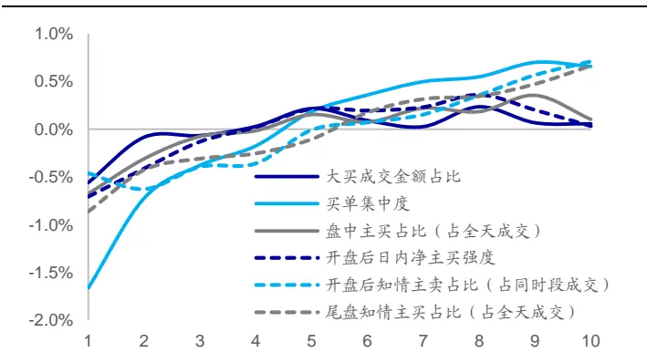
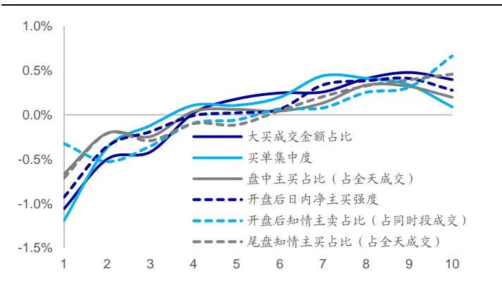
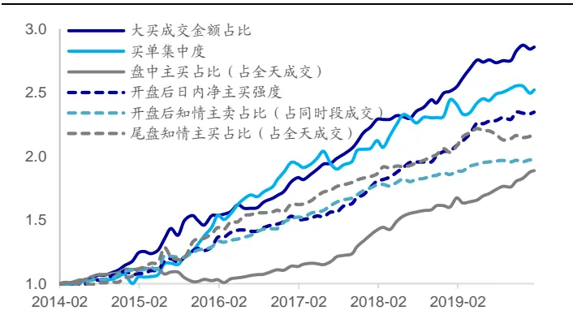
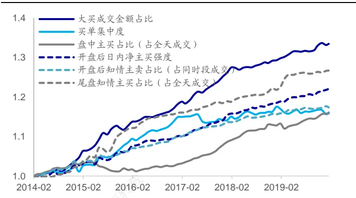
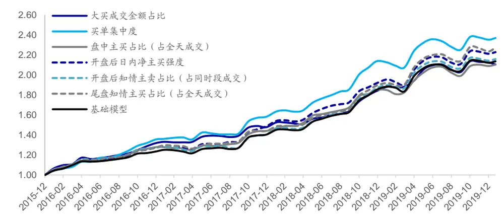
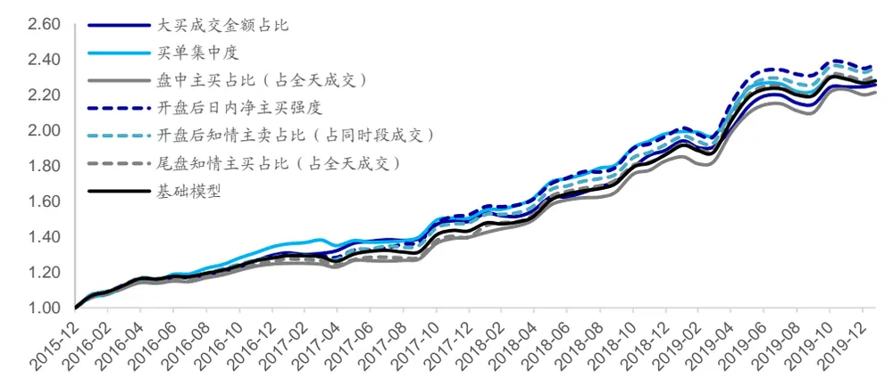
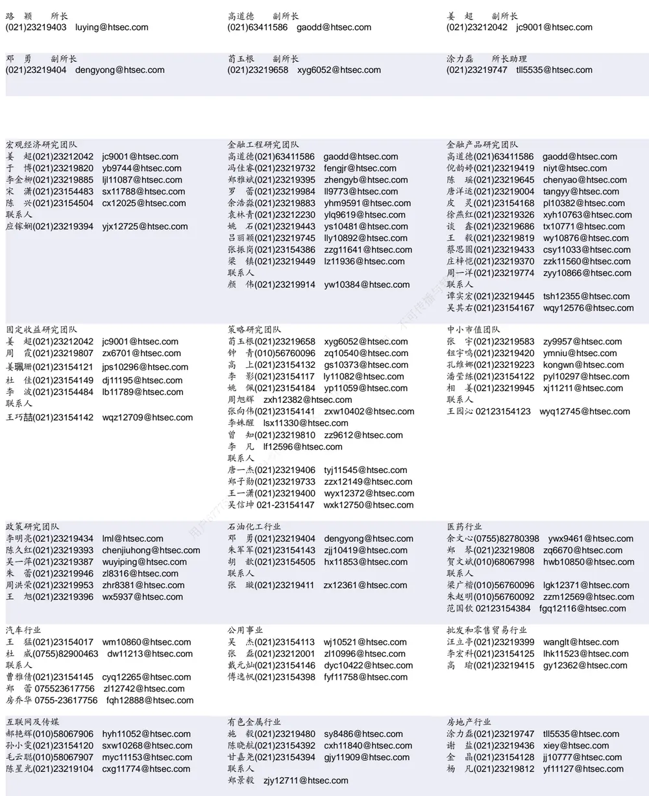

## [Tab相关研究

Table_ReportInfo]《选股因子系列研究（五十八）——知情交易与主买主卖》

《选股因子系列研究（五十七）——基于

主动买入行为的选股因子》2020.01.10《选股因子系列研究（五十六）——买卖单数据中的 Alpha》2019.11.05

分析师:冯佳睿

Tel:(021)23219732

Email:fengjr@htsec.com

证书:S0850512080006

分析师:袁林青

Tel:(021)23212230

Email:ylq9619@htsec.com

证书:S0850516050003

# 选股因子系列研究（五十九）——基于逐笔成交数据的高频因子梳理

## 投资要点：

在系列专题报告《选股因子系列研究（五十六）——买卖单数据中的 Alpha》、《选股因子系列研究（五十七）——基于主动买入行为的选股因子》、《选股因子系列研究（五十八）——知情交易与主买主卖》中，我们从不同的角度对于逐笔成交数据中的信息进行了挖掘，并得到了一些具有显著选股能力的因子。本文旨在对于筛选得到的有效因子进行梳理。

- 逐笔因子在正交后具有显著的全市场月度选股能力。因子月均 IC 在 0.03~0.04之间。正交后的各逐笔因子皆呈现出了较强的稳定性。除了买单集中度之外，其余因子年化 ICIR皆超过 2.0。

指数范围会对因子选股能力产生影响。在中证 指数内，大买成交金额占比、盘中主买占比（占全天成交）以及尾盘知情主买占比（占全天成交）依旧呈现出了较为显著的选股能力。在中证 500 指数内，除了大买成交金额占比外，其余因子的选股能力都出现了一定程度的减弱。在沪深 指数内，大买成交金额占比以及盘中主买占比（占全天成交）的选股能力依旧较为显著。

调仓频率的提升能增强因子的选股能力。当调仓频率从月度提升至半月度时，因子的 ICIR 以及年化多空收益皆得到了一定的提升。部分因子的多头效应也得到了改善。然而当调仓频率从半月度提升至周度时，仅有大买成交金额占比以及尾盘知情主买占比（占全天成交）的选股能力出现进一步的提升。其余因子的多空年化收益反而出现了小幅回落。

- 逐笔因子与常规技术因子之间存在相关性。大买成交金额占比与市值、估值、前期涨幅以及换手率存在一定的相关性。买单集中度与市值、中盘以及换手率相关性较高。盘中主买占比（占全天成交）、开盘后日内净主买强度以及开盘后知情主卖占比（占同时段成交）与前期涨幅存在一定的相关性。

- 部分正交后的逐笔因子之间依旧存在一定的相关性。大买成交金额占比与买单集中度之间存在一定的相关性，盘中主买占比（占全天成交）与开盘后日内净主买强度之间存在一定的相关性。此外，开盘后日内净主买强度与开盘后知情主卖占比（占同时段成交）强相关，截面相关性达 0.47。

逐笔因子能够提升指数增强组合的表现。逐笔因子的引入能够对指数增强组合的表现产生进一步的提升。例如，在引入买单集中度后，模型年化超额收益从提升至 21.5%。买单集中度的引入能够提升组合在 2016 年、2017 年、2018 年以及 2020 年的超额收益。然而，并不是任意因子都一定能够带来组合表现的改善。因子的引入对于组合表现的影响取决于组合原有的因子构成、收益预测模型以及风控模型等多方面的因素。

- 风险提示。市场系统性风险、资产流动性风险以及政策变动风险会对策略表现产生较大影响。

在系列专题报告《选股因子系列研究（五十六）——买卖单数据中的 Alpha》、《选股因子系列研究（五十七）——基于主动买入行为的选股因子》、《选股因子系列研究（五十八）——知情交易与主买主卖》中，我们从不同的角度对于逐笔成交数据中的信息进行了挖掘，并得到了一些具有显著选股能力的因子。本文旨在对于筛选得到的有效因子进行梳理。

本文第一章简要说明了各因子的计算思路，第二章分析讨论了因子的选股能力，第三章展示了因子与常规因子之间的相关性，第四章讨论了因子对于增强组合的提升效果，第五章总结了全文，第六章提示了风险。

## 1. 因子定义

本文分别选取了大买成交金额占比、买单集中度、盘中主买占比（占全天成交）、开盘后日内净主买强度、开盘后知情主卖占比以及尾盘知情主买占比进行分析。股票 i在交易日 t的指标计算方法如下所示：

$$
\texttt{k}\overrightarrow{\texttt{k}}\texttt{k}\stackrel{\texttt{*}}{\texttt{F}}\texttt{k}\texttt{t}_{i,t}=\frac{\texttt{k}\overrightarrow{\texttt{k}}\texttt{k}\overrightarrow{\texttt{k}}\texttt{k}}{\texttt{k}\texttt{k}\texttt{k}}\texttt{i,t}
$$

买单集中度 $\dot{\mathbf{\mu}}_{i,t}=\frac{\sum_{k=1}^{N_{i,t}}\vec{\mathcal{F}}\cdot\vec{\mathcal{F}}\star\vec{\mathcal{K}}\cdot\mathbf{\overleftarrow{\mathcal{K}}}\cdot\mathbf{\hat{\mathcal{F}}}\cdot\mathbf{\hat{\mathcal{W}}}}{\underset{i\leq}{\overset{\forall}{\hat{\mathcal{S}}}}\cdot\mathbf{\mathcal{k}}\cdot\mathbf{\overleftarrow{\mathcal{K}}}\cdot\mathbf{\hat{\mathcal{F}}}}^{2}{\hat{\mathcal{W}}\cdot\mathbf{\mathcal{K}}\cdot\mathbf{\overleftarrow{\mathcal{K}}}\cdot\mathbf{\hat{\mathcal{F}}}\cdot\mathbf{\mathcal{F}}}^{2}\ \mathrm{~,~}$

盘中主买占比（占全天成交） $\mathbf{\Sigma}_{i,t}=\frac{\underset{\operatorname*{m}}{\iint}\Phi\tilde{\pm}\frac{\partial\mathcal{F}}{\partial\mathbf{\Sigma}}\underset{i,t}{\underbrace{\sum}}}{\underset{\operatorname*{m}}{\underbrace{\sum}}\mathcal{H}\underset{\mathbf{\Sigma}}{\underbrace{\dot{\mathcal{F}}}}\underset{\pm}{\underbrace{\sum}}\mathcal{H}\underset{i,t}{\underbrace{\dot{\mathcal{F}}}}}$

$$
\mathcal{F}\bot\sum\limits_{\Xi}^{\mathcal{\hat{Z}}}\Xi\perp\mathcal{R}\times\mathcal{\hat{H}}\times\dot{\Xi}\mp\frac{\mathcal{\hat{Z}}}{4}\dot{\Xi}\frac{\partial\Xi}{\partial\Xi}\int\dot{\Xi}_{i,t}^{\mathbf{\Lambda}}=\frac{mean(\langle\dot{\Xi}\pm\hat{\Xi}\cdot\widehat{\Xi}\Xi\Xi^{2}\rangle\{\mathbf{\hat{\Xi}}_{i,t,\mathcal{H},\Xi,\Xi}\})}{std(\langle\dot{\Xi}\pm\widehat{\Xi}\cdot\widehat{\Xi}\Xi\Xi^{2}\rangle\{\widehat{\Xi}\cdot\widehat{\Xi}\}\|_{i,t,\mathcal{H},\Xi,\Xi})}
$$

$$
\mathcal{F}\frac{\mathrm{d}}{\mathrm{d}a}\int_{\Omega}^{\pm}\mathcal{J}\ d\mu\mu|_{\mathbb{H}}^{\pm}\frac{\ d}{\ d\Sigma}\ d\dot{\mathcal{Z}}\dot{\mathcal{Z}}\ d\nu\mathcal{k}\ d{\mathcal{L}}\left(\mathrm{~\vec{~}{\vec{~\mu~}{~}}~}\Xi\mathcal{\vec{Z}}\Lambda\mathcal{\vec{K}}\mathcal{\vec{K}}\mathcal{\vec{K}}\mathcal{\vec{K}}\mathcal{\vec{K}}\mathcal{\vec{K}}\right)_{i,t}=-1\ast\frac{\mathcal{F}\frac{\mathrm{d}}{\mathrm{d}a}\int_{\Omega}^{\pm}\mathcal{J}\ d\mu\mu|_{\mathbb{H}}^{\pm}\frac{\ d}{\mathcal{F}}\mathcal{\vec{K}}\mathcal{U}^{\pm}\mathcal{\vec{P}}\mathcal{\vec{K}}_{i,t}}{\mathcal{F}\dag\frac{\mathrm{d}}{\mathrm{d}a}\int_{\Omega}^{\infty}\mathcal{J}\ d\mu\mu\Lambda\mathcal{\vec{K}}\mathcal{\vec{K}}\mathcal{\vec{K}}\mathcal{\vec{K}}\mathcal{\vec{K}}\mathcal{\vec{K}}\mathcal{\vec{K}}\mathcal{\vec{K}}\mathcal{\vec{K}}_{i,t}}{\mathcal{F}\dag\frac{\mathrm{d}}{\mathrm{d}a}\int_{\Omega}^{\infty}\mathcal{K}\mathcal{F}\ d\mu\Lambda\mathcal{K}\mathcal{K}\mathcal{K}\mathcal{K\vec{K}}\mathcal{K}\mathcal{K}\mathcal{K\vec{K}}\mathcal{K}\mathcal{K}\mathcal{K\vec{K}}\mathcal{K}\mathcal{K}_{i,t}}\mathcal{F}\ d\mathcal{K}\mathcal{K}\mathcal{K}\mathcal{K}\mathcal{K}\mathcal{K}\mathcal{K\vec{K}}\mathcal{K}\mathcal{K}\mathcal{K}\mathcal{K}\mathcal{K\vec{K}}\mathcal{K}\mathcal
$$

$$
\begin{array}{r}{\rVert\mathfrak{L}\frac{\hat{\mathcal{G}}\hat{\mathcal{R}}}{\mathrm{sm}}\hat{\mathcal{H}}\rVert\hat{\mathcal{H}}{\varphi}^{\hat{\mathcal{L}}}\rVert\hat{\mathcal{H}}\rVert\overset{\pm}{\mathfrak{L}}\vec{\mathcal{L}}{\varphi},\mathsf{E}{\varphi}\mathtt{K}\left(\begin{array}{l}{\mathsf{E}\underbrace{\hat{\mathcal{L}}\hat{\mathcal{L}}\hat{\mathcal{K}}\hat{\mathcal{K}}\hat{\mathcal{K}}\hat{\mathcal{W}}}_{\mathrm{\overline{{\mathcal{L}}}\overline{{\mathcal{L}}}\overline{{\mathcal{W}}}}}}\end{array}\right)_{i,t}=-1*\frac{\sharp\big|\hat{\mathcal{L}}_{\mathrm{sm}}^{\frac{\hat{\mathcal{L}}+}{2\pi}}\hat{\mathcal{H}}\varphi^{\hat{\mathcal{L}}}\hat{\mathcal{H}}\varphi^{\hat{\mathcal{L}}}\hat{\mathcal{H}}_{i,t}\big.}{\sharp\hat{\mathcal{L}}\hat{\mathcal{K}}\hat{\mathcal{L}}\hat{\mathcal{P}}\overline{{\mathcal{L}}}_{i,t}}}\end{array}
$$

其中，开盘后特指 9:30~9:59，盘中特指 10:00~14:26，收盘前特指 14:27~14:56。需要注意的是，为了观察与分析的便利，本文在计算开盘后知情主卖占比以及尾盘知情主买占比时，调整了指标的正负，使得因子 IC 为正。本文使用了 2014 年以来的数据计算各逐笔因子。在计算因子时，剔除了 ST 以及上市不满 6个月的新股。更多关于因子的计算细节可参考相关因子的专题报告。

## 2. 因子选股能力回测

本章从多个角度分析讨论了各因子的选股能力。第一节展示了各因子的月度选股能力，第二节对比了各因子在不同指数范围内的选股能力，第三节对比了各因子在不同调仓频率下的选股能力。

## 2.1 因子月度选股能力

下表展示了逐笔因子在正交前后的因子月度 IC 以及前后 10%多空收益情况。本文在进行因子正交时剔除了行业、市值因子、估值因子、换手率因子、反转因子以及波动率因子。

表 1 逐笔因子月度 IC 与多空收益（2014.02.07~2020.01.23）

| 因子处理 | 因子名称 | 月均IC | 年化ICIR | 月度胜率 | 月度多空收益 | 月度多头超额收益 |
| --- | --- | --- | --- | --- | --- | --- |
| 正交前 | 大买成交金额占比 | 0.02 | 0.41 | 49% | 0.62% | 0.06% |
|  | 买单集中度 | 0.07 | 1.68 | 75% | 2.32% | 0.66% |
|  | 盘中主买占比（占全天成交） | 0.03 | 1.12 | 59% | 0.78% | 0.10% |
|  | 开盘后日内净主买强度 | 0.03 | 1.24 | 71% | 0.74% | 0.03% |
|  | 开盘后知情主卖占比（占同时段成交） | 0.04 | 1.84 | 66% | 1.17% | 0.71% |
|  | 尾盘知情主买占比（占全天成交） | 0.04 | 1.81 | 73% 转载 | 1.53% | 0.66% |
| 正交后 | 大买成交金额占比 | 0.04 | 2.99 | 78% | 1.46% | 0.40% |
|  | 买单集中度 | 0.03 | 1.41 | 66% | 1.28% | 0.09% |
|  | 盘中主买占比（占全天成交） | 0.03 | 2.39 | 75% | 0.86% | 0.20% |
|  | 开盘后日内净主买强度 | 0.04 | 3.13 | 84% | 1.21% | 0.28% |
|  | 开盘后知情主卖占比（占同时段成交） | 0.03 |  | 86% | 0.99% | 0.66% |
|  | 尾盘知情主买占比（占全天成交） | 0.03 | 2.51 | 77% | 1.17% | 0.46% |

资料来源：Wind，海通证券研究所

在正交处理前，买单集中度呈现出了极强的月度选股能力，因子月均 IC达 0.07，月度多空收益达 2.3%。除买单集中度外，开盘后知情主卖占比（占同时段成交）以及尾盘知情主买占比（占全天成交）同样呈现出了较为显著的月度选股能力，因子月均 IC 达0.04，月度多空收益超 1%。

在正交处理后，各因子皆呈现出了较为显著的月度选股能力。因子月均 IC 在0.03~0.04 之间。此外，各逐笔因子呈现出了较强的稳定性。除买单集中度外，其余因子年化 ICIR 皆超过 2.0。

下图展示了各因子在正交前与正交后的分 10 组月度超额收益。

图1 逐 笔 因 子 分 10 组 月 度 超 额 收 益 （ 正 交 前 ）（2014.02.07~2020.01.23）

资料来源：Wind，海通证券研究所

图2 逐 笔 因 子 分 10 组 月 度 超 额 收 益 （ 正 交 后 ）（2014.02.07~2020.01.23）

资料来源：Wind，海通证券研究所

各逐笔因子在正交后皆呈现出了较强的组间收益单调性。进一步观察因子的多头端收益可以发现，大买成交金额占比、开盘后知情主卖占比（占同时段成交）以及尾盘知情主卖占比（占全天成交）具有相对较强的多头效应。

下图分别展示了逐笔因子的前后 10%多空相对强弱以及因子溢价累计净值。在计算因子溢价时，分别将上述因子与常规低频因子（行业、市值、中盘、换手率、反转、波动、估值、盈利以及盈利增长）放入多元回归模型进行回归检验。因子的回归系数即为因子溢价，通过因子溢价可得到因子的累计净值。

图3 逐笔因子多空相对强弱组合净值

资料来源：Wind，海通证券研究所

图4 逐笔因子回归溢价累计净值

资料来源：Wind，海通证券研究所

观察因子的前后 10%多空相对强弱以及回归溢价累计净值可知，各逐笔因子长期来看皆具有较为明显的收益区分能力。相比而言，大买成交金额占比、开盘后日内净主买强度表现较为突出。大买成交金额占比年化多空收益达 18.5%，月均溢价达 0.40%。开盘后日内净主买强度年化多空收益达 15.1%，月均溢价达 0.28%。下表分别展示了各因子的分年度多空收益以及月均溢价。

表 2 逐笔因子分年度多空收益（2014.02.07~2020.01.23）（正交后）

| 因子名称 | 年化多空收益 | 2014 | 2015 | 2016 | 2017 | 2018 | 2019 | 截至 2020年1月23日 |
| --- | --- | --- | --- | --- | --- | --- | --- | --- |
| 大买成交金额占比 | 18.5% | 22.1% | 46.0% | 14.0% | 17.8% | 8.0% | 15.6% | 0.5% |
| 买单集中度 | 15.8% | 2.2% | 59.0% | 26.3% | 4.9% | 10.7% | 3.2% | 0.5% |
| 盘中主买占比（占全天成交） | 11.3% | 14.4% | -13.8% | 9.3% | 16.4% | 10.9% | 18.1% | 0.6% |
| 开盘后日内净主买强度 | 15.1% | 10.2% | 30.8% | 14.8% | 11.7% | 10.6% | 16.3% | 0.4% |
| 开盘后知情主卖占比（占同时段成交） | 12.6% | 16.5% | 28.3% | 14.2% | 13.1% | 4.3% | 7.4% | -0.3% |
| 尾盘知情主买占比（占全天成交） | 14.0% | 8.2% | 51.2% | 13.1% | 10.6% | 7.0% | 7.1% | 0.7% |

资料来源： ，海通证券研究所

表 3 逐笔因子分年度月均溢价（2014.02.07~2020.01.23）（正交后）

| 因子名称 | 月均溢价 | 2014 | 2015 | 2016 | 2017 | 2018 | 2019 | 截至 2020年1月23日 |
| --- | --- | --- | --- | --- | --- | --- | --- | --- |
| 大买成交金额占比 | 0.40% | 0.42% | 0.63% | 0.39% | 0.54% | 0.21% | 0.25% | 0.23% |
| 买单集中度 | 0.21% | 0.11% | 0.59% | 0.48% | -0.06% | 0.25% | -0.14% | 0.39% |
| 盘中主买占比（占全天成交） | 0.20% | 0.27% | -0.12% | 0.12% | 0.45% | 0.32% | 0.22% | 0.01% |
| 开盘后日内净主买强度 | 0.28% | 0.24% | 0.30% | 0.28% | 0.39% | 0.22% | 0.23% | 0.22% |
| 开盘后知情主卖占比（占同时段成交） | 0.22% | 0.28% | 0.26% | 0.28% | 0.27% | 0.15% | 0.15% | -0.24% |
| 尾盘知情主买占比（占全天成交） | 0.33% | 0.21% | 0.75% | 0.30% | 0.21% | 0.20% | 0.32% | 0.10% |

资料来源： ，海通证券研究所

各因子在大部分年份中都呈现出了较为显著的选股能力，并且在近几年中依旧有效。

值得注意的是，买单集中度在 2017 年以及 2019 年的表现明显弱于历史其他年份。对于开盘后知情主卖占比，我们可观察到类似的现象。因子在 2018 年以及 2019 年的选股能力明显弱于历史其他年份。

## 2.2 不同指数范围内的选股能力

下表对比展示了各因子在不同指数范围内的选股能力。

表 4 逐笔因子在不同指数范围内的选股能力（2014.02.07~2020.01.23）（正交后）

| 指数 | 因子名称 | 月均IC | 年化 ICIR | 月度胜率 | 月度多空 | 多头超额 | 月均溢价 | T统计量 |
| --- | --- | --- | --- | --- | --- | --- | --- | --- |
| 全市场 | 大买成交金额占比 | 0.04 | 2.99 | 78% | 1.46% | 0.40% | 0.40% | 7.25 |
|  | 买单集中度 | 0.03 | 1.41 | 66% | 1.28% | 0.09% | 0.21% | 3.12 |
|  | 盘中主买占比（占全天成交） | 0.03 | 2.39 | 75% | 0.86% | 0.20% | 0.20% | 4.75 |
|  | 开盘后日内净主买强度 | 0.04 | 3.13 | 84% | 1.21% | 0.28% | 0.28% | 6.22 |
|  | 开盘后知情主卖占比（占同时段成交） | 0.03 | 3.49 | 86% | 0.99% | 0.66% | 0.22% | 6.06 |
|  | 尾盘知情主买占比（占全天成交） | 0.03 | 2.51 | 77% | 1.17% | 0.46% | 0.33% | 5.29 |
| 中证 800 | 大买成交金额占比 | 0.04 | 2.46 | 75% | 1.19% | 0.29% | 0.32% | 5.92 |
|  | 买单集中度 | 0.02 | 0.87 | 68% | 0.40% | -0.09% | 0.09% | 1.15 |
|  | 盘中主买占比（占全天成交） | 0.03 | 1.74 | 70% | 0.78% 载 | 0.14% | 0.26% | 4.24 |
|  | 开盘后日内净主买强度 | 0.02 | 1.57 | 63% | 0.55% | 0.23% | 0.22% | 4.25 |
|  | 开盘后知情主卖占比(占同时段成交） | 0.02 | 1.83 | 68% | 0.59% | 0.47% | 0.19% | 4.44 |
|  | 尾盘知情主买占比（占全天成交） | 0.03 | 1.88 | 68% | 0.73% 不可 | 0.21% | 0.22% | 3.58 |
| 中证500 | 大买成交金额占比 | 0.04 | 2.53 | 78% | 1.04% | 0.22% | 0.36% | 5.42 |
|  | 买单集中度 | 0.02 | 1.12 | 63% | 0.79% | 0.00% | 0.23% | 3.30 |
|  | 盘中主买占比（占全天成交） | 0.02 | 1.03 | 60% | 0.42% | -0.14% | 0.11% | 1.69 |
|  | 开盘后日内净主买强度 | 0.02 | 1.49 供本人 | 63% | 0.52% | 0.23% | 0.20% | 3.23 |
|  | 开盘后知情主卖占比(占同时段成交） | 0.02 | 1.63 | 66% | 0.49% | 0.45% | 0.21% | 3.86 |
|  | 尾盘知情主买占比（占全天成交） | 0.02 | 1.57 | 68% | 1.04% | 0.41% | 0.24% | 3.28 |
| 沪深 300 | 大买成交金额占比 | 0.04 | 1.91 | 71% | 1.11% | 0.33% | 0.26% | 4.02 |
|  | 买单集中度 | 0.01 | 0.54 | 58% | -0.08% | -0.38% | 0.03% | 0.27 |
|  | 盘中主买占比（占全天成交） | 0.05 | 2.29 | 73% | 1.37% | 0.56% | 0.40% | 5.69 |
|  | 开盘后日内净主买强度 | 0.03 | 1.21 | 55% | 0.29% | 0.16% | 0.25% | 3.42 |
|  |  | 0.02 | 1.19 | 59% | 0.18% | 0.39% | 0.15% | 3.06 |
|  | 尾盘知情主买占比（占全天成交） | 0.02 | 1.23 | 63% | 0.46% | -0.03% | 0.16% | 2.22 |

资料来源：Wind，海通证券研究所

在中证 800 指数内，大买成交金额占比、盘中主买占比（占全天成交）以及尾盘知情主买占比（占全天成交）皆呈现出了较为显著的选股能力。因子月均 IC在 0.03~0.04之间，且因子月度多空收益超 。若比较因子的多头效应，开盘后知情主卖占比（占同时段成交）的多头效应最强，月均多头超额收益达 。

在中证 500 指数内，除了大买成交金额占比外，其余因子的选股能力都出现了一定程度的减弱。大买成交金额占比因子月均 为 ，月度胜率达 ，且月度多空收益超 ，而其余因子月均 为 ，月度胜率在 之间。美中不足的是，大买成交金额占比在中证 500 指数内的多头效应较弱，月均多头超额收益仅有 0.22%，而开盘后知情主卖占比（占同时段成交）以及尾盘知情主买占比（占全天成交）的月均多头超额收益在 0.40%~0.45%之间。

在沪深 300 指数内，大买成交金额占比以及盘中主买占比（占全天成交）的选股能力较为显著。两因子的月均 在 之间，月度胜率超 ，且月度多空收益超 1%。两因子同样有较为明显的多头效应，因子的月均多头超额收益分别为 0.33%以及 0.56%。

## 2.3 不同调仓频率下的选股能力

下表对比展示了各因子在不同调仓频率下的选股能力。需要说明的是，在变化调仓频率时，因子的计算窗口也在发生变化。在月度调仓时，使用过去 1个月的指标计算因子值。而在周度调仓时，仅使用过去 1 周的指标计算因子值。

表 5 逐笔因子在不同调仓频率下的选股能力（2014.02.07~2020.01.23）（正交后）

| 调仓频率 | 名称 | IC 均值 | 年化ICIR | 调仓期胜率 | 年化多空收益 | 年化多头超额收益 |
| --- | --- | --- | --- | --- | --- | --- |
| 月度 | 大买成交金额占比 | 0.04 | 2.99 | 78% | 18.5% | 5.4% |
|  | 买单集中度 | 0.03 | 1.41 | 66% | 15.8% | 1.1% |
|  | 盘中主买占比（占全天成交） | 0.03 | 2.39 | 75% | 11.3% | 2.8% |
|  | 开盘后日内净主买强度 | 0.04 | 3.13 | 84% | 15.1% | 3.8% |
|  | 开盘后知情主卖占比（占同时段成交） | 0.03 | 3.49 | 86% | 12.6% | 8.9% |
|  | 尾盘知情主买占比（占全天成交） | 0.03 | 2.51 | 77% | 14.0% | 5.3% |
| 半月度 | 大买成交金额占比 | 0.03 | 3.79 | 77% | 20.4% | 8.3% |
|  | 买单集中度 | 0.02 | 1.83 | 66% | 18.0% | 0.9% |
|  | 盘中主买占比（占全天成交） | 0.03 | 2.92 | 75% | 14.1% | 3.0% |
|  | 开盘后日内净主买强度 | 0.03 | 4.10 | 80% | 17.6% | 6.1% |
|  | 开盘后知情主卖占比（占同时段成交） | 0.03 | 4.59 | 84% & | 19.1% | 12.3% |
|  | 尾盘知情主买占比（占全天成交） | 0.03 | 3.53 | 75% | 14.6% | 3.7% |
| 周度 | 大买成交金额占比 | 0.03 | 4.46 | 73% | 24.1% | 10.2% |
|  | 买单集中度 | 0.02 | 2.22 | 62% | 18.1% | -0.6% |
|  | 盘中主买占比（占全天成交） | 0.02 | 2.65 祁使用，不可传 | 67% | 12.7% | 1.3% |
|  | 开盘后日内净主买强度 | 0.02 | 3.54 | 70% | 16.1% | 3.2% |
|  | 开盘后知情主卖占比（占同时段成交） | 0.02 | 5.27 | 78% | 17.4% | 9.6% |
|  | 尾盘知情主买占比（占全天成交） | 0.02 | 3.73 | 72% | 16.3% | 4.7% |

资料来源：Wind，海通证券研究所

当调仓频率从月度提升至半月度时，因子的 ICIR 以及年化多空收益皆得到了一定的提升。部分因子的多头效应也得到了改善。例如，大买成交金额占比的多头年化超额收益从5.4%提升至8.3%。开盘后知情主买占比（占全天成交）的多头年化超额收益从8.9%提升至 12.3%。

当调仓频率从半月度提升至周度时，仅有大买成交金额占比以及尾盘知情主买占比（占全天成交）的选股能力得到了进一步的提升。其余因子的多空年化收益反而出现了小幅下降。

## 3. 因子相关性

本部分展示了正交前的逐笔因子与常规低频因子之间的截面相关性以及正交后的逐笔因子之间的截面相关性。

下表展示了正交前的逐笔因子与常规低频因子之间的截面相关性。总体来看，逐笔因子与系统波动占比、盈利以及盈利增长之间的截面相关性较弱。大买成交金额占比与市值、估值、前期涨幅以及换手率存在一定的相关性。买单集中度与市值、中盘以及换手率相关性较高。盘中主买占比（占全天成交）、开盘后日内净主买强度以及开盘后知情主卖占比（占同时段成交）与前期涨幅存在一定的相关性。

表 6 逐笔因子与常规低频因子的截面相关性（2014.02.07~2020.01.23）（正交前）

|  | 市值 | 中盘 | 估值 | 前期涨幅 | 换手率 | 系统波动占比 | 盈利 | 盈利增长 |
| --- | --- | --- | --- | --- | --- | --- | --- | --- |
| 大买成交金额占比 | 0.26 | 0.14 | -0.24 | 0.33 | -0.22 | -0.07 | -0.01 | 0.03 |
| 买单集中度 | -0.43 | -0.25 | -0.14 | -0.02 | -0.54 | 0.09 | -0.15 | -0.07 |
| 盘中主买占比（占全天成交） | 0.24 | 0.07 | 0.02 | 0.26 | -0.17 | 0.08 | 0.17 | 0.06 |
| 开盘后日内净主买强度 | 0.09 | -0.03 | 0.03 | 0.36 | -0.12 | 0.09 | 0.06 | 0.04 |
| 开盘后知情主卖占比（占同时段成交） | -0.12 | -0.07 | -0.04 | 0.23 | -0.10 | 0.07 | -0.01 | 0.01 |
| 尾盘知情主买占比（占全天成交） | 0.01 | 0.03 | -0.02 | 0.02 | 0.01 | 0.10 | 0.01 | 0.02 |

资料来源： ，海通证券研究所

下表展示了正交后的逐笔因子之间的截面相关性。大买成交金额占比与买单集中度存在一定的相关性，盘中主买占比（占全天成交）与开盘后日内净主买强度存在一定的相关性。此外，开盘后日内净主买强度与开盘后知情主卖占比（占同时段成交）强相关，截面相关性达 0.47。基于上述结果，投资者在使用逐笔因子时，需尽量避免同时使用高相关的逐笔因子。

表 7 逐笔因子之间的截面相关性（2014.02.07~2020.01.23）（正交后）

|  | 大买 成交金额占比 | 买单集中度 | 盘中主买占比 (占全天成交) | 开盘后 日内净主买强度 | 开盘后知情主卖占比 (占同时段成交) | 尾盘知情主买占比 (占全天成交) |
| --- | --- | --- | --- | --- | --- | --- |
| 大买成交金额占比 | 1.00 | 0.24 | 0.06 | 0.09 | 0.03 | 0.04 |
| 买单集中度 | 0.24 | 1.00 | 0.05 | 0.08 | 0.05 | -0.02 |
| 盘中主买占比 (占全天成交) | 0.06 | 0.05 | 1.00 | 0.24 | 0.14 | 0.15 |
| 开盘后日内净主买强度 | 0.09 | 0.08 | 0.24 | 1.00 | 0.47 | 0.10 |
| 开盘后知情主卖占比 （占同时段成交） | 0.03 | 0.05 | 0.14 | 0.47 | 1.00 | 0.12 |
| 尾盘知情主买占比 (占全天成交) | 0.04 | -0.02 | 0.15 | 0.10 | 0.12 | 1.00 |

资料来源： ，海通证券研究所

## 4. 因子在组合构建中的应用

本章以月度调仓的中证 500 指数增强组合为例，展示了逐笔因子在加入组合后对于组合表现的影响。可使用常规因子构建基础增强组合，并分别加入各逐笔因子。下表展示了加入各逐笔因子的组合在 2016 年以来的分年度超额收益。

表 8 逐笔因子对组合表现的影响（2014.02.07~2020.01.23）

| 加入因子名称 | 2016 | 2017 | 2018 | 2019 | 截至 2020年1月23日 | 全区间 年化超额收益 |
| --- | --- | --- | --- | --- | --- | --- |
| 大买成交金额占比 | 26.1% | 12.0% | 16.4% | 19.4% | -0.9% | 18.3% |
| 买单集中度 | 29.0% | 16.6% | 23.4% | 12.6% | 0.8% | 21.5% |
| 盘中主买占比（占全天成交） | 22.7% | 12.7% | 19.0% | 16.1% | 0.7% | 18.3% |
| 开盘后日内净主买强度 | 22.4% | 16.6% | 19.4% | 19.2% | 0.8% | 19.8% |
| 开盘后知情主卖占比（占同时段成交） | 22.2% | 10.3% | 22.1% | 18.3% | 0.8% | 19.0% |
| 尾盘知情主买占比（占全天成交） | 22.3% | 13.0% | 21.1% | 22.6% | 1.7% | 20.4% |
| 基础模型 | 19.2% | 13.6% | 21.4% | 18.2% | 0.7% | 18.7% |

资料来源：Wind，海通证券研究所

观察上表不难发现，部分逐笔因子的引入的确能够给组合表现带来进一步的提升。例如，在引入买单集中度后，模型年化超额收益从 18.7%提升至 21.5%。买单集中度的引入能够提升组合在 年、 年、 年以及 年的超额收益，但是会降低组合在 2019 年的超额收益。

值得注意的是，并不是所有因子的引入都能带来组合表现的提升。回测结果表明，大买成交金额占比以及盘中主买占比（占全天成交）的引入并未带来组合整体表现的改善。下图对比展示了各组合相对于中证 500 指数的相对强弱指数。

图5 各组合相对中证 500指数的表现

资料来源：Wind，海通证券研究所

我们也可以在基础模型中添加基于分钟数据计算得到的高频因子（例如，改进反转以及尾盘成交金额占比），并观察逐笔因子的加入对于组合的影响。下表展示了加入各逐

表 9 逐笔因子对组合表现的影响（基础模型包含分钟高频因子）（2014.02.07~2020.01.23）

| 因子名称 | 2016 | 2017 | 2018 | 2019 | 截至 2020年1月23日 | 全区间 年化超额收益 |
| --- | --- | --- | --- | --- | --- | --- |
| 大买成交金额占比 | 24.2% | 14.6% | 17.9% | 24.0% | 0.5% | 20.2% |
| 买单集中度 | 28.1% | 12.0% | 21.0% | 18.5% | 0.5% | 20.5% |
| 盘中主买占比（占全天成交） | 20.1% | 12.0% | 20.4% | 25.8% | 0.6% | 19.7% |
| 开盘后日内净主买强度 | 23.3% | 18.4% | 19.3% | 24.7% | 0.9% | 21.5% |
| 开盘后知情主卖占比（占同时段成交） | 23.1% | 15.1% | 19.8% | 26.9% | 1.2% | 21.3% |
| 尾盘知情主买占比（占全天成交） | 21.3% | 10.7% | 22.2% | 28.4% | 1.3% | 20.8% |
| 基础模型（包含分钟高频因子） | 22.9% | 11.8% | 19.8% | 27.4% | 0.6% | 20.4% |

资料来源： ，海通证券研究所

观察上表可知，即使原始模型中已经包含了高频因子，逐笔因子的引入依旧能够带来组合表现的提升。例如，在加入开盘后日内净主买强度后，组合的年化超额收益从20.4%提升至 21.5%。因子的引入使得组合在 2016 年、2017 年以及 2020 年的表现得到了提升。下图对比展示了各组合相对于中证 500 指数的相对强弱指数。

图6 各组合相对中证 500指数的表现（基础模型包含分钟高频因子）

资料来源：Wind，海通证券研究所

本章回测结果表明，逐笔因子的引入能够对指数增强组合的表现产生进一步的提升。然而，并不是任意因子都一定能够带来组合表现的改善。例如，大买成交金额占比在中证 500 指数内呈现出了显著的选股能力，但是因子对于组合并未产生十分显著的提升。我们推测这与因子多头效应不强的特性有一定关系。此外，因子的引入对于组合表现的影响取决于组合原有的因子构成、收益预测模型以及风控模型等多方面的因素。投资者需要根据自身的模型设定挑选适合自身的逐笔因子。

## 5. 总结

本文梳理并讨论了系列前期报告中基于逐笔成交数据计算得到的因子。在全市场月度调仓的设定下，各因子在正交后都呈现出了显著的选股能力。在中证 800 指数内，大买成交金额占比、盘中主买占比（占全天成交）以及尾盘知情主买占比（占全天成交）依旧呈现出了较为显著的选股能力。在中证 500 指数内，除了大买成交金额占比外，其余因子的选股能力都出现了一定程度的减弱。在沪深 300指数内，大买成交金额占比以及盘中主买占比（占全天成交）的选股能力依旧较为显著。

当调仓频率从月度提升至半月度时，因子的 以及年化多空收益皆得到了一定的提升，部分因子的多头效应也得到了改善。然而，当调仓频率从半月度提升至周度时，仅有大买成交金额占比以及尾盘知情主买占比（占全天成交）的选股能力出现进一步的提升。其余因子的多空年化收益反而出现了小幅回落。我们推测这与因子计算窗口的设定有一定的联系。

此外，本文以中证 指数增强策略为例，将各因子分别加入模型，并对比了各组传合的表现。回测结果表明，逐笔因子的引入的确能够给组合表现带来提升。值得注意的不是，并不是任意因子都一定能够带来组合表现的改善。因子的引入对于组合表现的影响用，取决于组合的因子构成、收益预测模型以及风控模型等多方面的因素。部

## 6. 风险提示

市场系统性风险、资产流动性风险以及政策变动风险会对策略表现产生较大影响。载

## 信息披露

分析师声明

[Table冯佳睿yst金融工程研究团队s]

袁林青金融工程研究团队

本人具有中国证券业协会授予的证券投资咨询执业资格，以勤勉的职业态度，独立、客观地出具本报告。本报告所采用的数据和信息均来自市场公开信息，本人不保证该等信息的准确性或完整性。分析逻辑基于作者的职业理解，清晰准确地反映了作者的研究观点，结论不受任何第三方的授意或影响，特此声明。

## 法律声明

本报告仅供海通证券股份有限公司（以下简称 本公司 ）的客户使用。本公司不会因接收人收到本报告而视其为客户。在任何情况下，本报告中的信息或所表述的意见并不构成对任何人的投资建议。在任何情况下，本公司不对任何人因使用本报告中的任何内容所引致的任何损失负任何责任。

本报告所载的资料、意见及推测仅反映本公司于发布本报告当日的判断，本报告所指的证券或投资标的的价格、价值及投资收入可能会波动。在不同时期，本公司可发出与本报告所载资料、意见及推测不一致的报告。

市场有风险，投资需谨慎。本报告所载的信息、材料及结论只提供特定客户作参考，不构成投资建议，也没有考虑到个别客户特殊的播投资目标、财务状况或需要。客户应考虑本报告中的任何意见或建议是否符合其特定状况。在法律许可的情况下，海通证券及其所属可关联机构可能会持有报告中提到的公司所发行的证券并进行交易，还可能为这些公司提供投资银行服务或其他服务。

本报告仅向特定客户传送，未经海通证券研究所书面授权，本研究报告的任何部分均不得以任何方式制作任何形式的拷贝、复印件或复制品，或再次分发给任何其他人，或以任何侵犯本公司版权的其他方式使用。所有本报告中使用的商标、服务标记及标记均为本公司的商标、服务标记及标记，如欲引用或转载本文内容，务必联络海通证券研究所并获得许可，并需注明出处为海通证券研究所，目不得对本文进行有悖原意的引用和删改。仅

根据中国证监会核发的经营证券业务许可，海通证券股份有限公司的经营范围包括证券投资咨询业务。下载

## 海通证券股份有限公司研究所[Table_PeopleInfo]

| 电子行业 |  | 煤炭行业 |  | 电力设备及新能源行业 |  | zyc9637@htsec.com |
| --- | --- | --- | --- | --- | --- | --- |
|  | 陈 平(021)23219646 cp9808@htsec.com |  | 李 淼(010)58067998 Im10779@htsec.com |  | 张一弛(021)23219402 |  |
|  | 尹 苓(021)23154119 yl11569@htsec.com |  | 戴元灿(021)23154146 dyc10422@htsec.com |  | 房 青(021)23219692 | fangq@htsec.com |
|  | 谢 磊(021)23212214 xl10881@htsec.com |  | 吴 杰(021)23154113 wj10521@htsec.com |  | 曾 彪(021)23154148 zb10242@htsec.com |  |
|  | 蒋 俊(021)23154170 jj11200@htsec.com |  | 联系人 |  | 徐柏乔(021)23219171 xbq6583@htsec.com |  |
| 联系人 |  |  | 王 涛(021)23219760 wt12363@htsec.com |  | 陈佳彬(021)23154513 cjb11782@htsec.com |  |

| 基础化工行业 | 计算机行业 | 通信行业 |  |
| --- | --- | --- | --- |
| 刘 威(0755)82764281 Iw10053@htsec.com | 郑宏达(021)23219392 zhd10834@htsec.com | 朱劲松(010)50949926 zjs10213@htsec.com |  |
| 刘海荣(021)23154130 Ihr10342@htsec.com | 杨 林(021)23154174 yl11036@htsec.com | 余伟民(010)50949926 | 6 ywm11574@htsec.com |
| 张翠翠(021)23214397 zcc11726@htsec.com | 于成龙 ycl12224@htsec.com | 张峥青(021)23219383 zzq11650@htsec.com |  |
| 孙维容(021)23219431 swr12178@htsec.com | 黄竞晶(021)23154131 hjj10361@htsec.com | 张 弋 01050949962 zy12258@htsec.com |  |
| 李 智(021)23219392 lz11785@htsec.com | 洪 琳(021)23154137 hl11570@htsec.com | 联系人 杨彤昕 010-56760095 ytx12741@htsec.com |  |

| 非银行金融行业 |  | 交通运输行业 |  |  | 纺织服装行业 |  |  |
| --- | --- | --- | --- | --- | --- | --- | --- |
|  | 孙 婷(010)50949926 st9998@htsec.com |  |  | 虞 楠(021)23219382 yun@htsec.com |  |  | 梁 希(021)23219407 lx11040@htsec.com |
|  | 何 婷(021)23219634 ht10515@htsec.com |  | 罗月江（010）56760091 lyj12399@htsec.com |  |  | 盛 开(021)23154510 sk11787@htsec.com |  |
|  | 李芳洲(021)23154127 Ifz11585@htsec.com |  |  | 李 轩(021)23154652 lx12671@htsec.com | 联系人 |  |  |
| 联系人 任广博(010)56760090 rab12605 @bto |  |  | 李 丹(021)23154401 Id11766@htsec.com |  |  | 刘 溢(021)23219748 ly12337@htsec.com |  |

| 建筑建材行业 | 机械行业 |  | 钢铁行业 |
| --- | --- | --- | --- |
| 冯晨阳(021)23212081 fcy10886@htsec.com | 余炜超(021)23219816 swc11480@htsec.com |  | 刘彦奇(021)23219391 liuyq@htsec.com |
| 潘莹练(021)23154122 pyl10297@htsec.com |  | 耿 耘(021)23219814 gy10234@htsec.com | 周慧琳(021)23154399 zhl11756@htsec.com |
| 申 浩(021)23154114 sh12219@htsec.com | 杨 震(021)23154124 yz10334@htsec.com |  |  |
| 杜市伟(0755)82945368 dsw11227@htsec.com 联系人 | 周 丹 zd12213@htsec.com 联系人 |  |  |
| 颜慧菁 yhj12866@htsec.com | 吉 晟(021)23154145 js12801@htsec.com 传播与转载 |  |  |

| 建筑工程行业 | 农林牧渔行业 | 食品饮料行业 |
| --- | --- | --- |
| 张欣劫 zxj12156@htsec.com | 丁 频(021)23219405 dingpin@htsec.com | 闻宏伟(010)58067941 whw9587@htsec.com |
| 李富华(021)23154134 Ifh12225@htsec.com | 陈雪丽(021)23219164 cxl9730@htsec.com 陈 阳(021)23212041 cy10867@htsec.com | 唐 宇(021)23219389 ty11049@htsec.com 联系人 |
| 杜市伟(0755)82945368 dsw11227@htsec.com | 联系人 | 程碧升(021)23154171 cbs10969@htsec.com |
|  | 孟亚琦(021)23154396 myq12354@htsec.com | 颜慧菁 yhj12866@htsec.com |

| 军工行业 | 银行行业 |  | 社会服务行业 |
| --- | --- | --- | --- |
| 张恒晅 zhx10170@htsec.com | 孙 婷(010)50949926 st9998@htsec.com |  | 汪立亭(021)23219399 wanglt@htsec.com |
|  | 解巍巍 xww12276@htsec.com |  | 陈扬扬(021)23219671 cyy10636@htsec.com |
| 联系人 |  | 林加力(021)23154395 ljl12245@htsec.com | 许樱之 xyz11630@htsec.com |
| 张宇轩(021)23154172 zyx11631@htsec.com |  | 谭敏沂(0755)82900489 tmy10908@htsec.com |  |

| 家电行业 |  | 造纸轻工行业 |  |
| --- | --- | --- | --- |
| 陈子仪(021)23219244 | chenzy@htsec.com |  | 衣桢永(021)23212208 yzy12003@htsec.com |
| 李 阳(021)23154382 | ly11194@htsec.com |  |  |
| 朱默辰(021)23154383 | zmc11316@htsec.com |  |  |
| 刘 璐(021)23214390 | II11838@htsec.com |  |  |

## 研究所销售团队

深广地区销售团队

蔡铁清(0755)82775962 ctq5979@htsec.com

伏财勇(0755)23607963 fcy7498@htsec.com

辜丽娟(0755)83253022 gulj@htsec.com

刘晶晶(0755)83255933 liujj4900@htsec.com

饶 伟(0755)82775282 rw10588@htsec.com

欧阳梦楚(0755)23617160

oymc11039@htsec.com

巩柏含 gbh11537@htsec.com

上海地区销售团队
胡雪梅(021)23219385 huxm@htsec.com
朱 健(021)23219592 zhuj@htsec.com
季唯佳(021)23219384 jiwj@htsec.com
黄 毓(021)23219410 huangyu@htsec.com
漆冠男(021)23219281 qgn10768@htsec.com
胡宇欣(021)23154192 hyx10493@htsec.com
黄 诚(021)23219397 hc10482@htsec.com
毛文英(021)23219373 mwy10474@htsec.com
马晓男 mxn11376@htsec.com
杨祎昕(021)23212268 yyx10310@htsec.com
张思宇 zsy11797@htsec.com
王朝领 wcl11854@htsec.com
邵亚杰 23214650 syj12493@htsec.com
李 寅 021-23219691 ly12488@htsec.com北京地区销售团队
殷怡琦(010)58067988 yyq9989@htsec.com郭 楠 010-5806 7936 gn12384@htsec.com张丽萱(010)58067931 zlx11191@htsec.com杨羽莎(010)58067977 yys10962@htsec.com何 嘉(010)58067929 hj12311@htsec.com李 婕 lj12330@htsec.com
欧阳亚群 oyyq12331@htsec.com
郭金垚(010)58067851 gjy12727@htsec.com

海通证券股份有限公司研究所

地址：上海市黄浦区广东路 689号海通证券大厦 9楼

电话：（021）23219000

传真：（021）23219392

网址：www.htsec.com