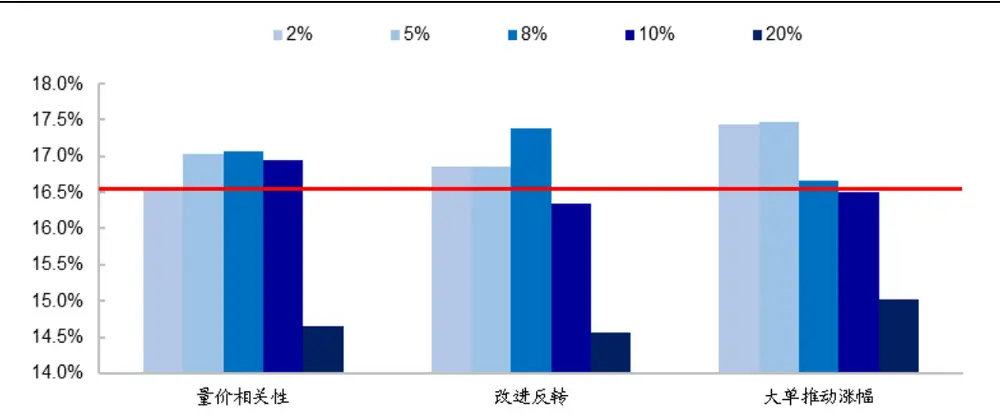
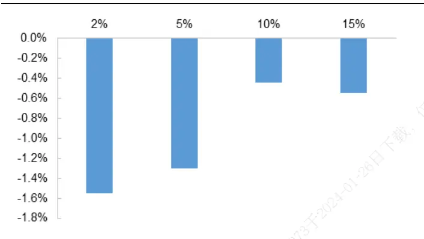
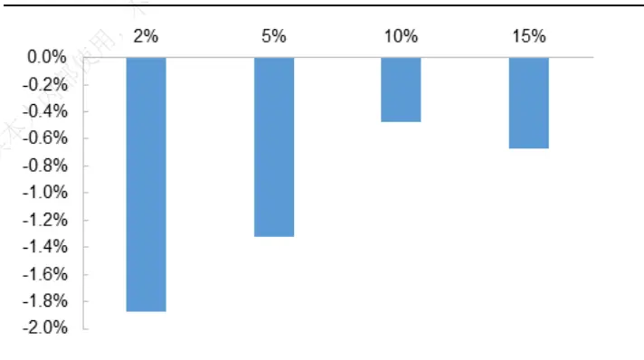
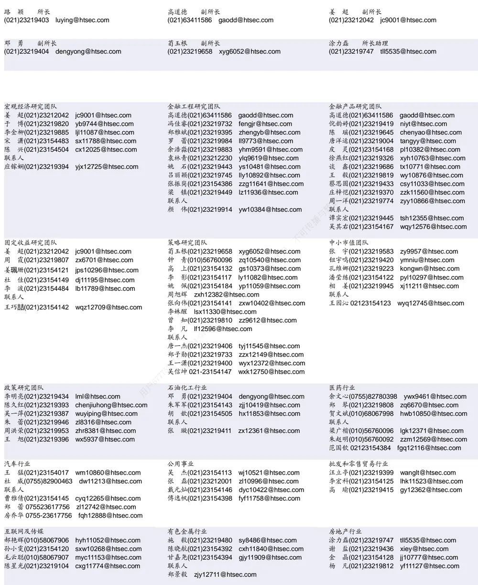

## [Tab相关研究

Table_ReportInfo]《量化研究新思维（十九）——机构投资者持股拥挤度因子》2020.02.26

《选股因子系列研究（五十九）——基于逐笔成交数据的高频因子梳理》

## 2020.02.21

《量化研究新思维（十八）——另类数据在投资中的运用》2020.02.17

分析师:冯佳睿

Tel:(021)23219732

Email:fengjr@htsec.com

证书:S0850512080006

分析师:罗蕾

Tel:(021)23219984

Email:ll9773@htsec.com

证书:S0850516080002

# 选股因子系列研究（六十）——如何利用高频因子的空头效应？

## 投资要点：

本文主要对可以利用高频因子空头效应的方法进行梳理总结。

研究背景。对于沪深 增强策略而言，有一些空头效应强、多头效应弱的高频因子，若直接以新因子的形式引入收益率预测模型，会对模型多头部分的排序造成负向扰动，从而对指数增强策略产生不利影响。同时由于空头效应强，直接摒弃因子较为可惜，在这种情况下，我们可以尝试仅引入高频因子的空头信息，以减小对模型多头造成的不利影响。

- 引入因子空头信息的方法。本文从构建增强策略的各个环节出发，梳理了 种可以引入高频因子空头效应的方法：事前剔除、构建示性变量因子、约束空头组合偏离、事后剔除。这 4种方法都是以因子空头组合为基础；即在运用这些方法之前，我们须预先设定一个阈值筛选因子空头个股。例如，以 为阈值，将全市场因子得分最低的 5%个股定义为空头个股。然后再在构建增强策略的各个环节，将个股属于因子空头的信息引入模型之中。

- 事前剔除，是指利用空头个股清洗样本空间。即在构建指数增强模型之前，直接将样本空间的空头个股剔除，仅在剩余股票集中构建模型。这种方法简单直接；需要注意的是，若剔除的个股包含标的指数成分股，则可能扭曲基准，导致实际偏离加大。因此我们建议在剔除时，仅剔除标的指数成分股以外的空头个股。此外，定义空头个股的阈值不宜过大，否则将会对已存因子的预测能力产生负向影响，反而会拖累策略表现。

- 构建示性变量因子，是指在收益预测模型中加入按照如下方式构建的因子：高频因子空头个股因子值为 1，其余个股因子值为 0。这种方法灵活度高，对已存因子影响小，可以在不明显增加风险的情况下提升组合收益。需要注意的是，在定义示性变量因子时，空头组合的阈值不宜设定过高，过高的阈值会稀释空头效应，减少增量信息。

- 约束空头组合偏离，是指在风险控制模型中对空头组合的暴露进行限定。这种方法灵活度低，可能面临无法求得最优解的情况。同时受风险控制模型其他约束条件的影响，这种方法对信息的利用度低，因此对收益的提升幅度明显小于其他 3种方法。

- 事后剔除，是指获取增强组合后，将其中的高频因子空头个股剔除，以对组合作进一步强化。这种方法对收益的提升最明显；但由于无法控制相对基准的偏离，因此对风险的提升也高于其他三种方法。

引入高频因子空头个股信息能够提升指数增强组合的表现。以大单推动涨幅因子为例，若将因子得分最低的 个股定义为空头个股，则事前剔除可将沪深增强组合年化超额由 16.5%提升至 17.5%；构建示性变量因子的方法，则可将组合年化超额提升至 。空头个股的阈值会影响对增强组合收益的提升幅度。

- 风险提示。模型误设风险，流动性风险。

在前期报告中，我们从交易逻辑出发，使用分钟数据构建了一系列高频因子。这些因子多空收益显著，且稳定性高；但它们普遍呈现多头效应弱、空头效应强的特征。直接把这些因子加入到收益率预测模型中，并不一定能改善指数增强组合的收益表现。本文梳理了几种可以利用高频因子空头效应的方法，并对其收益表现进行了回测，以供投资者参考。

## 1. 高频因子的特征

高频因子的计算方法相对统一，即根据每日日内信息计算得到指标，然后取 N日均值或累计值作为因子值。在构建月度因子时，N通常取 20。

下表展示了月度高频因子全市场选股的收益表现（因子具体构建方式参见前期报告《高频因子在不同周期和域下的表现及影响因素分析》），时间区间为 2013 年初至 2020年 1 月底。表中多头收益是指，因子得分最高的 10%个股等权组合相对于全市场等权组合的超额收益；空头收益是指全市场等权组合与因子得分最低的 10%个股等权组合收益之差；多空收益是多头收益与空头收益之和。

表 1 高频因子收益表现（2013.01-2020.01）

| 原始因子 |  |  |  |  |  |  |  |  |  |  |
| --- | --- | --- | --- | --- | --- | --- | --- | --- | --- | --- |
|  | 选股方 向 | 多头收益 |  | 空头收益 |  |  |  | 多空收益 |  | 多头收益/ |
|  |  | 月均收益 | 月胜率 t值 | 月均收益 | 月胜率 | t值 月均收益 | 月胜率 | t值 | 多空收益 |  |
| 平均单笔流出金额占比 | 正向 | 0.67% | 76.47% 4.90 | 0.76% | 77.65% | 6.00 | 1.43% | 83.53% | 8.88 | 46.6% |
| 量价相关性 | 负向 | 0.46% | 68.24% | 2.20 1.58% | 88.24% | 5.57 | 2.04% | 78.82% | 4.39 | 22.4% |
| 收盘前成交委托相关性 | 负向 | 0.66% | 60.00% | 2.45 1.94% | 77.65% | 5.89 | 2.59% | 68.24% | 4.99 | 25.3% |
| 下行波动占比 | 正向 | 0.28% | 60.00% | 1.58 | 1.85% 84.71% | 9.39 | 2.13% | 76.47% | 6.23 | 13.2% |
| 改进反转 | 负向 | 0.71% | 63.53% | 2.82 | 1.99% 87.06% | 8.46 | 2.70% | 83.53% | 6.18 | 26.3% |
| 大单推动涨幅 | 负向 | 0.91% | 81.18% | 5.83 1.61% | 81.18% | 6.31 | 2.52% | 83.53% | 6.69 | 36.2% |
| 尾盘成交占比 | 负向 | 0.47% | 56.47% 1.61 | 0.90% | 69.41% | 4.45 | 1.37% | 65.88% | 2.97 | 34.5% |
| 正交风格、技术因子 |  |  |  |  |  |  |  |  |  |  |
|  | 选股方 |  | 多头收益 |  | 空头收益 |  |  | 多空收益 |  | 多头收益/ 多空收益 |
|  | 向 | 月均收益 | 月胜率 t值 | 月均收益 | 月胜率 | t值 | 月均收益 | 月胜率 | t值 |  |
| 平均单笔流出金额占比 | 正向 | 0.48% | 65.88% | 3.63 | 0.61% 68.24% | 4.36 | 1.09% | 78.82% | 7.44 | 44.1% |
| 量价相关性 | 负向 | 0.25% | 56.47% | 1.69 | 1.31% 88.24% | 8.12 | 1.56% | 75.29% | 5.53 | 16.2% |
| 收盘前成交委托相关性 | 负向 | 0.17% | 49.41% | 0.68 | 0.65% 67.06% | 4.44 | 0.82% | 57.65% | 2.37 | 20.8% |
| 下行波动占比 | 正向 | 0.13% | 52.94% | 1.17 | 0.83% 72.94% | 7.13 | 0.96% | 68.24% | 4.99 | 13.7% |
| 改进反转 | 负向 | 0.55% | 57.65% | 2.63 | 1.22% 83.53% | 5.92 | 1.77% | 76.47% | 5.29 | 31.2% |
| 大单推动涨幅 | 负向 | 0.40% | 63.53% | 3.83 | 0.87% 75.29% | 5.19 | 1.27% | 76.47% | 6.32 | 31.7% |
| 尾盘成交占比 | 负向 | 1.14% | 81.18% | 5.44 | 1.39% 83.53% | 9.35 | 2.53% | 85.88% | 7.97 | 45.0% |
| 正交风格、技术因子和行业 |  |  |  |  |  |  |  |  |  |  |
|  | 选股方 向 | 月均收益 | 多头收益 月胜率 | t值 | 空头收益 月均收益 月胜率 | t值 | 月均收益 | 多空收益 月胜率 | t值 | 多头收益/ 多空收益 |
| 平均单笔流出金额占比 | 正向 | 0.49% | 72.94% | 3.41 | 0.63% 72.94% | 4.79 | 1.12% | 80.00% | 7.08 | 43.4% |
| 量价相关性 | 负向 | 0.20% | 52.94% | 1.80 | 1.24% 94.12% | 10.54 | 1.44% | 81.18% | 7.65 | 14.0% |
| 收盘前成交委托相关性 | 负向 | 0.17% | 48.24% |  | 0.56% 70.59% | 4.66 | 0.73% | 56.47% | 2.76 | 23.0% |
| 下行波动占比 | 正向 | 0.13% |  | 0.83 |  |  |  | 76.47% |  |  |
| 改进反转 | 负向 | 0.56% | 56.47% 58.82% | 1.46 | 0.78% 74.12% 83.53% | 7.23 7.25 | 0.91% 1.72% | 81.18% | 6.31 | 14.4% 32.3% |
| 大单推动涨幅 | 负向 | 0.41% | 71.76% | 2.79 3.96 | 1.17% 0.87% 77.65% | 6.08 | 1.28% | 84.71% | 6.88 7.84 | 31.9% |
| 尾盘成交占比 | 负向 | 0.99% | 84.71% | 5.82 | 1.35% 85.88% | 10.10 | 2.33% | 88.24% | 9.46 | 42.3% |

资料来源： ，海通证券研究所

结果显示，高频因子选股效果显著，原始因子月均多空收益均在 1%以上。但高频因子整体呈现多头效应弱，空头效应强的特征。剔除风格（市值、非线性市值）、技术因子（反转、换手率、波动率）后，绝大部分高频因子的多头月均超额均低于 0.5%；而量价相关性、收盘前成交委托相关性、下行波动占比因子的多头效应甚至不再显著。

此外，剔除行业后，高频因子的稳定性有所提升。以尾盘成交占比因子为例，正交行业前，该因子多头组合月均超额 1.14%，月胜率 81.2%，信息比 2.04；剔除行业因素后，因子多头超额收益虽有所下降，但信息比提升至 2.19，同时月胜率增加至 84.7%，表明因子稳定性提升。

高频因子多头效应偏弱，可能导致的一个直接结果是，在指数增强策略中引入高频因子，对策略收益提升较小。下表展示了加入高频因子对沪深 300 增强策略超额收益表现的影响。从中可见：

加入多头表现好的尾盘成交占比因子，对 300 增强超额收益提升明显。年化超额由 14.9%提升至 16.5%，提升幅度达 1.6%；同时最大回撤和波动率降低，因此信息比和收益回撤比均出现明显提升。而其他因子由于多头效应偏弱，加入至模型中对超额收益信息比和收益回撤比的提升较小。

大部分高频因子正交行业后，对增强策略超额收益的提升更为明显；如，下行波动占比、尾盘成交占比因子。这主要是由于剔除行业因素可以提升高频因子在时间序列上的稳定性，从而增加因子收益和个股收益预测的精度。

表 2 引入高频因子对沪深 300 增强策略的影响（2013.01-2020.01）

|  | 年化收益 | 最大回撤 | 波动率 | 信息比 | 收益回撤比 | 月胜率 | 未正交行业的年 化超额1 |
| --- | --- | --- | --- | --- | --- | --- | --- |
| 平均单笔流出金额占比 | 15.42% | 5.34% | 4.86% | 2.78 | 2.89 | 84.71% | 15.56% |
| 量价相关性 | 13.53% | 6.25% | 5.06% | 2.36 | 2.16 | 72.94% | 13.43% |
| 收盘前成交委托相关性 | 14.20% | 6.06% | 5.18% | 2.39 | 2.34 | 81.18% | 14.43% |
| 下行波动占比 | 15.39% | 4.89% | 5.06% | 2.66 | 3.15 | 81.18% | 13.95% |
| 改进反转 | 14.69% | 7.03% | 5.04% | 2.58 | 2.09 | 77.65% | 14.37% |
| 大单推动涨幅 | 15.03% | 5.53% | 5.16% | 2.56 | 2.72 | 80.00% | 14.53% |
| 尾盘成交占比 | 16.55% | 3.57% | 4.97% | 2.92 | 4.64 | 83.53% | 15.21% |
| 原始组合 | 14.93% | 5.03% | 5.01% | 2.63 | 2.97 | 82.35% |  |

资料来源： ，海通证券研究所
注：1.未正交行业的年化超额是指，加入的高频因子未对行业正交；2.信息比的计算方法是 sqrt(242)*日均超额/日超额收益波动率。

总结来看，高频因子整体呈现多头效应弱、空头效应强的特征；因此，大部分高频因子加入到指数增强策略中，对超额收益的影响较小。此外，剔除行业因素后，高频因子的稳定性会增加，建议在使用高频因子前对行业进行正交处理。在测试的几个高频因子中，尾盘成交占比因子的多头效应最高，月均超额 1%左右，因此加入该因子可明显提升沪深 300 增强策略的超额收益表现。

## 2. 引入高频因子空头信息的方法梳理

如前文所述，高频因子多头效应普遍偏弱，直接作为因子引入指数增强模型对策略提升效果较小。特别是，在已经加入了表现较好的尾盘成交占比因子后，再加入其他高频因子，甚至会拉低策略收益表现。

如下表所示，加入尾盘成交占比因子后的模型（下简称基准模型）年化超额 16.5%，信息比 2.92。若在该模型中再加入其他高频因子，则超额收益、信息比、胜率均略有下降。这可能是由于这些因子多头效应弱（剔除尾盘成交占比因子后多头超额不再显著），加入收益率预测模型可能会对模型多头部分的排序造成负向扰动，从而对指数增强策略产生不利影响。

表 3 高频因子对增强组合超额收益的影响（基准模型包含尾盘成交占比因子）（2013.01-2020.01）

|  | 年化收益 | 最大回撤 | 波动率 | 信息比 | 收益回撤比 | 月胜率 |
| --- | --- | --- | --- | --- | --- | --- |
| 平均单笔流出金额占比 | 14.80% | 4.61% | 4.93% | 2.66 | 3.21 | 80.00% |
| 量价相关性 | 15.13% | 4.43% | 5.08% | 2.62 | 3.42 | 78.82% |
| 收盘前成交委托相关性 | 16.37% | 3.82% | 5.14% | 2.77 | 4.29 | 78.82% |
| 下行波动占比 | 16.21% | 4.95% | 5.01% | 2.84 | 3.27 | 80.00% |
| 改进反转 | 14.65% | 6.21% | 5.12% | 2.54 | 2.36 | 76.47% |
| 大单推动涨幅 | 15.68% | 4.59% | 4.88% | 2.83 | 3.42 | 82.35% |
| 基准模型 | 16.55% | 3.57% | 4.97% | 2.92 | 4.64 | 83.53% |

资料来源：Wind，海通证券研究所

但这些高频因子空头效应强，即使在剔除了尾盘成交占比因子后，仍然具有非常显著的空头效应。特别是量价相关性、改进反转和大单推动涨幅，这 3个因子的空头组合相对于市场组合（全市场等权组合）月均跑输幅度均在 0.7%以上，收益低于市场组合的月度占比在 75%以上。

表 4 剔除尾盘成交占比因子后，高频因子的空头收益（2013.01-2020.01）

|  | 月均收益 | 月胜率 | 信息比 | t值 |
| --- | --- | --- | --- | --- |
| 平均单笔流出金额占比 | 0.53% | 68.24% | 1.54 | 4.09 |
| 量价相关性 | 0.92% | 89.41% | 3.85 | 10.25 |
| 收盘前成交委托相关性 | 0.46% | 71.76% | 1.44 | 3.83 |
| 下行波动占比 | 0.55% | 69.41% | 2.02 | 5.38 |
| 改进反转 | 0.91% | 75.29% | 2.13 | 5.67 |
| 大单推动涨幅 | 0.79% | 77.65% | 2.09 | 5.58 |

资料来源：Wind，海通证券研究所

虽然把这些高频因子直接加入模型中，增强组合的收益不增反降；但这些因子空头效应稳定，直接摒弃较为可惜。那么如何利用这种空头效应强、多头效应弱的因子呢？我们从构建指数增强组合的四个环节：样本清洗、个股收益率预测、风险控制、组合强化出发，对可以尝试的方法进行了简单梳理。

（1） 选股空间清洗，即事前剔除。在确定构建指数增强组合的样本空间时，直接将因子的空头部分个股剔除，然后在剩余的股票集中构建组合。

（2） 个股收益率预测。在收益率预测模块，以示性变量的形式标记因子的空头个股，并基于该示性变量因子的历史溢价预测其未来溢价。

（3） 风险控制。在风险控制模块，强制将因子空头部分个股的权重限制为 0；或者对组合在因子空头组合上的暴露进行限制。

（4） 组合强化，即事后剔除。在基于原模型构建出增强组合后，剔除其中属于高频因子空头部分的个股。

下文我们将对这 种利用高频因子空头效应的方法进行回测。需要注意的是，这种方法都是以因子空头组合为基础；即在运用这些方法之前，我们须预先设定一个阈值筛选因子空头个股。例如，以 5%为阈值，将全市场因子得分最低的 5%个股定义为空头个股。然后再在构建增强策略的上述 4 个环节，将个股属于因子空头的信息引入模型之中。

## 3. 引入高频因子空头信息对指数增强组合的影响

如前所述，量价相关性、改进反转和大单推动涨幅，这 3 个因子剔除尾盘成交占比因子后的空头效应相对较强，因此本章主要以这 3 个因子为例，考察引入高频因子空头信息对指数增强策略的影响。这 3个因子与股票收益均呈现显著负相关关系，即量价相关性越高、改进反转越高、大单推动涨幅越高，个股未来收益表现越差。

下文对比的基准模型是，包含风格、低频技术因子、基本面因子、预期基本面因子和尾盘成交占比因子的沪深 300 增强模型。增强模型为全市场优化模型，即选股范围是剔除 股、上市 个月以内的新股、停牌股以外剩余的所有 股。

## 3.1 事前剔除

在构建指数增强模型之前，预先剔除高频因子空头个股以清洗样本空间。

## 3.1.1 事前剔除对增强组合的影响

下表展示了剔除样本空间高频因子得分最低的 5%个股后，沪深 300 增强策略的超额收益表现。对于本章考察的 3 个高频因子（量价相关性、改进反转和大单推动涨幅），个股指标值越大，因子得分越低。

表 5 事前剔除对沪深 300 增强组合的影响（2013.01-2020.01）

| 因子 | 年化收益 | 最大回撤 | 波动率 | 信息比 | 收益回撤比 | 月胜率 |
| --- | --- | --- | --- | --- | --- | --- |
| 基准模型 | 16.55% | 3.57% | 4.97% | 2.92 | 4.64 | 83.53% |
| 量价相关性 | 16.58% | 7.80% | 5.47% | 2.66 | 2.12 | 82.35% |
| 改进反转 | 17.29% | 4.03% | 5.14% | 2.94 | 4.29 | 80.00% |
| 大单推动涨幅 | 17.47% | 3.18% | 5.06% | 3.00 | 5.48 | 84.71% |

资料来源： ，海通证券研究所
注：表中的波动率是 sqrt(242)*日超额收益的波动率；信息比是指，sqrt(12)*日均超额收益/日超额收益波动率。

结果显示，相对于基准模型，利用高频因子空头进行事前剔除的增强组合超额收益更高。其中，大单推动涨幅因子对超额收益的提升最为明显，年化超额由 16.5%提升至17.5%，相应的信息比和收益回撤比均有所提升。

需要注意的是，高频因子的空头组合可能包含标的指数成分股；若我们将成分股剔除，则可能面临优化组合相对于实际基准的偏离高于设定的阈值，导致风险加大。例如量价相关性因子，利用该因子剔除空头个股会导致最大回撤大幅增加，由 以下增加至 7.8%。

因此，为减小偏离，我们可以仅剔除标的指数成分股以外的空头个股。按照这种方式清洗样本空间，得到的沪深 增强组合超额收益表现如下表所示。从中可见，仅剔除成分股以外空头个股的方法，其最大回撤和跟踪误差明显低于剔除所有空头个股的方法。

表 6 仅剔除标的指数成分股以外的空头个股（2013.01-2020.01）

| 剔除的高频因 子空头组合 | 年化收益 | 最大回撤 | 波动率 | 信息比 | 收益回撤比 | 月胜率 |
| --- | --- | --- | --- | --- | --- | --- |
| 基准模型 | 16.55% | 3.57% | 4.97% | 2.92 | 4.64 | 83.53% |
| 量价相关性 | 17.03% | 3.57% | 5.09% | 2.93 | 4.77 | 81.18% |
| 改进反转 | 16.86% | 4.16% | 5.07% | 2.91 | 4.05 | 80.00% |
| 大单推动涨幅 | 17.46% | 4.23% | 5.06% | 3.02 | 4.12 | 81.18% |

资料来源： ，海通证券研究所
注：表中的波动率是 sqrt(242)*日超额收益的波动率；信息比是指，sqrt(12)*日均超额收益/日超额收益波动率。

## 3.1.2 敏感性分析

在上一小节的分析中，我们以 5%为阈值定义高频因子空头个股，本节我们将对空头阈值进行敏感性分析。

下图展示了在不同阈值下，事前剔除对沪深 300 增强策略年化超额收益的影响。从中可见，在一定范围内增加阈值，即增加剔除的个股数，可以提升策略收益。但超过一定范围继续增加阈值将会对策略产生负向影响。例如，若以 20%为阈值，剔除高频因子得分最低的 20%个股，则策略超额收益将大幅降低，由 16.5%降至 15%以下。

图1 不同阈值下，事前剔除对沪深 300增强策略超额收益的影响（2013.01-2020.01）

资料来源：Wind，海通证券研究所

事前剔除的空头个股数不宜过多，这可能是由于在构建收益预测模型时，横截面样本量减少将会降低已存因子的稳定性，对模型预测能力产生不利影响。以大单推动涨幅因子为例，下表展示了剔除该因子空头个股（ ）之前和之后，对原收益预测模型已存因子——反转、波动率和换手率因子截面溢价的影响。

结果显示，剔除 的空头个股之后，截面溢价和溢价胜率均大幅降低。特别是反转因子，月胜率由 降至 。月胜率降低意味着因子选股方向发生变化的可能性大，对于基于历史数据预测未来溢价的模型而言，这种选股方向的频繁变动会对模型预测能力产生不利影响。

表 7 剔除大单推动涨幅空头（20%）个股对因子截面溢价的影响（2013.01-2020.01）

|  | 剔除前 |  |  | 剔除后 |  |  |
| --- | --- | --- | --- | --- | --- | --- |
|  | 月均溢价 下载 | 月胜率 | 信息比 | 月均溢价 | 月胜率 | 信息比 |
| 反转 | -0.43% | 76.84% | -2.10 | -0.28% | 67.37% | -1.48 |
| 波动率 | -0.24% | 66.32% | -0.76 | -0.16% | 63.16% | -0.56 |
| 换手率 | -0.63% | 72.63% | -1.66 | -0.54% | 70.53% | -1.41 |

资料来源： ，海通证券研究所
注：表中月胜率是指，溢价方向和其长期方向相同的月度占比。

总结来看，利用高频因子空头组合进行事前剔除，可以提升沪深 增强组合超额收益。其中，以大单推动涨幅因子的提升最为明显，年化超额由 提升至 。需要注意的是，若剔除所有空头个股的方式会导致组合相对于基准的偏离过大，则可以采用仅剔除标的指数成分股以外空头个股的方式来减小偏离。此外，定义空头个股的阈值不宜过大，否则将会对已存因子的预测能力产生负向影响，反而会拖累策略表现。

## 3.2 构建示性变量因子

在收益率预测模块，由于高频因子多头效应弱，因此直接以因子的形式加入高频因子，可能会对模型多头部分的排序造成负向扰动，对指数增强策略产生不利影响。基于高频因子的空头组合构建示性变量因子，一方面可以利用高频因子较强的空头效应，另一方面也可以减小因子对多头组合造成的不利影响。

## 3.2.1 高频示性变量因子对增强组合的影响

下表展示了加入高频示性变量因子对沪深 300 增强组合超额收益的影响。示性变量因子的构建方式是，若个股属于高频因子得分最低的 5%个股，则因子值为 1；否则为 0。

结果显示，引入高频示性变量因子可以提升增强组合超额收益。但量价相关性、改进反转因子的稳定性相对较低，加入这两个示性变量因子后，增强组合的跟踪误差也有所增加，因此信息比并无明显变化。但加入大单推动涨幅示性变量因子，可以在不明显增加风险的前提下，提升组合收益，因此信息比和收益回撤比均明显增加。

表 8 加入示性变量因子后的沪深 300增强组合超额收益（2013.01-2020.01）

| 模型 | 年化收益 | 最大回撤 | 波动率 | 信息比 | 收益回撤比 | 月胜率 |
| --- | --- | --- | --- | --- | --- | --- |
| 基准模型（B） | 16.55% | 3.57% | 4.97% | 2.92 | 4.64 | 83.53% |
| B+量价相关性 | 16.72% | 4.13% | 5.05% | 2.90 | 4.04 | 78.82% |
| B+改进反转 | 16.89% | 3.83% | 5.03% | 2.94 | 4.41 | 81.18% |
| B+大单推动涨幅 | 17.80% | 3.45% | 5.00% | 3.10 | 5.16 | 83.53% |

资料来源：Wind，海通证券研究所
注：表中的波动率是 sqrt(242)*日超额收益的波动率；信息比是指，sqrt(12)*日均超额收益/日超额收益波动率。

那为什么加入大单推动涨幅因子可明显提升增强组合收益风险比，而量价相关性、改进反转因子则对组合无明显影响呢？这可能是由于在沪深 300 指数成分股内，大单推动涨幅因子可为多头提供更多增量信息，对多头部分个股的收益预测精度提升更为明显。

计算上述 4 个收益率预测模型在沪深 300 指数成分股多头部分的预测精度，结果如下表所示。其中，预测精度用 IC 表示，即个股预测收益和实际收益的相关系数。多头预测精度是指，以沪深 指数成分股中预测收益最高的 股票（多头）为样本池，计算这部分个股预测收益和实际收益的相关系数。 C 越高，表明模型预测能力越强。

表 9 加入示性变量因子对沪深 300 成分股多头 IC 的影响（2013.01-2020.01）

|  | 月均IC | 月胜率 | 月波动率 | 信息比 |
| --- | --- | --- | --- | --- |
| 基准模型（B） | 5.53% | 64.71% | 12.71% | 1.51 |
| B+量价相关性 | 5.25% 部使 | 63.53% | 12.83% | 1.42 |
| B+改进反转 | 5.18% | 68.24% | 12.95% | 1.39 |
| B+大单推动涨幅 | 6.01% | 67.06% | 12.84% | 1.62 |

资料来源：Wind，海通证券研究所

结果显示，在基准模型中加入量价相关性和改进反转因子并没有提升沪深 300 指数成分股的多头 IC，即模型在多头部分的预测能力没有得到改善。而加入大单推动涨幅因子后，多头月均 IC 由 5.53%提升至 6.01%，相应的信息比也有所增加。

由此表明，就多头而言，大单推动涨幅因子可为预测模型提供增量信息，提升收益预测精度。而另外两个因子的增量信息较为有限，对模型 IC 没有提升作用。这可能是导致这几个全市场空头效应显著的因子，对沪深 300 增强策略具有不同影响的主要原因。

## 3.2.2 敏感性分析

在上一小节的分析中，我们以 5%为阈值定义高频因子空头个股，本节我们将对空头阈值进行敏感性分析。

下表展示了将空头定义阈值从 2%增加至 20%，引入大单推动涨幅示性变量因子对沪深 300 增强组合超额收益的影响。结果显示，随着阈值逐渐增加，即空头个股数逐渐增加，沪深 300 增强策略的超额收益逐渐降低。

当阈值为 时，加入该因子对超额收益的提升最明显：年化超额由 提升至18.1%，提升幅度达 1.6%；相应的信息比由 2.92 提升至 3.13，收益回撤比由 4.64 提升至 5.43。而阈值增加至 10%时，组合超额收益不增反降。表明在定义示性变量因子时，空头组合的设定阈值不宜过高。这可能是由于，阈值越高，空头组合包含的个股数越多，空头效应越弱。

表 10 大单推动涨幅示性变量因子空头阈值敏感性分析（2013.01-2020.01）

| 空头组合阈值 | 年化收益 | 最大回撤 | 波动率 | 信息比 | 收益回撤比 | 月胜率 |
| --- | --- | --- | --- | --- | --- | --- |
| 2% | 18.14% | 3.34% | 5.05% | 3.13 | 5.43 | 83.53% |
| 5% | 17.80% | 3.45% | 5.00% | 3.10 | 5.16 | 83.53% |
| 8% | 17.13% | 4.34% | 5.03% | 2.98 | 3.95 | 81.18% |
| 10% | 16.07% | 4.93% | 5.02% | 2.81 | 3.26 | 78.82% |
| 15% | 16.42% | 5.19% | 5.02% | 2.86 | 3.16 | 80.00% |
| 20% | 16.76% | 5.14% | 4.98% | 2.95 | 3.26 | 77.65% |

资料来源：Wind，海通证券研究所

实际上，我们可以简单对比不同阈值下，因子空头组合相对于基准的超额收益。以阈值为 5%为例，我们可以将大单推动涨幅因子得分最低的 5%个股中，属于沪深 300指数成分股的股票挑选出来，构建等权组合（或成分股权重加权组合），并统计该组合相对于 成分股等权组合（或沪深 指数）的月度超额收益，结果如下图所示。

从中可见，阈值不高于 时，大单推动涨幅因子空头组合相对于基准存在非常明显的负向超额收益，月均负向超额幅度在 以上。而阈值增加至 时，月均超额大幅降低，降至 0.5%以下。即对于大单推动涨幅因子而言，5%以上的空头股票相对于指数的超额收益并不是特别突出。因此若要保有高频因子空头效应的增量信息，定义空头组合的阈值不宜设定得过高。

图2 不同阈值下，大单推动涨幅因子的空头效应（等权）

资料来源：Wind，海通证券研究所

图3 不同阈值下，大单推动涨幅因子的空头效应（权重加权）

资料来源：Wind，海通证券研究所

总结来看，在收益率预测模块，以示性变量因子的形式引入高频因子空头个股信息，一方面可以利用高频因子较强的空头效应，另一方面也可以减小因子对模型多头造成的不利影响，因此可以提升沪深 增强策略的超额收益表现。其中，大单推动涨幅因子对组合超额收益的提升最为明显，这可能是由于引入该因子可明显提升沪深 300 指数成分股的多头预测精度；而引入其余两个因子并不能达到这种效果。此外，在定义示性变量因子时，空头组合的阈值不宜设定过高，过高的阈值会稀释空头效应，降低增量信息。

## 3.3 约束空头个股/组合偏离

在风险控制模块利用高频因子的空头效应可以考虑如下两种方式：一是要求因子空头个股权重为 0；二是要求优化组合在因子空头组合上的偏离不高于某个阈值。由于量价相关性和改进反转因子对沪深 300 指数成分股的多头 IC 没有明显提升效果，因此下文仅对大单推动涨幅因子加入至沪深 300 增强组合中的影响进行分析。

对于第一种方法，若强制要求所有空头个股的权重都为 0，则在某些时段由于约束条件冲突无法求得最优解。若要保证求得最优解，则可以放松约束，仅要求成分股以外的空头个股权重为 0。需要注意的是，由于增强组合绝大部分的个股都会在标的指数成分股内，因此仅对成分股外的空头进行约束会导致有效信息大打折扣。从结果（下表）来看，以这种形式加入空头信息对收益的提升明显不如前面两节的方法。

表 11 约束沪深 300 成分股以外的空头个股权重为 0（2013.01-2020.01）

| 空头组合阈值 | 年化收益 | 最大回撤 | 波动率 | 信息比 | 收益回撤比 | 月胜率 |
| --- | --- | --- | --- | --- | --- | --- |
| 5% | 16.68% | 3.88% | 4.97% | 2.95 | 4.29 | 82.35% |
| 10% | 16.36% | 3.98% | 4.97% | 2.89 | 4.11 | 82.35% |
| 基准 | 16.55% | 3.57% | 4.97% | 2.92 | 4.64 | 83.53% |

资料来源：Wind，海通证券研究所

应用第二种方法也会遇到类似问题。若限制得过于严格，例如要求在高频因子空头组合上的暴露为 0，则会导致约束冲突，可能无法求得最优解。而放松限制，例如要求在空头组合上的暴露等于基准暴露，或等于基准暴露的 1/2，则收益提升幅度不明显。

表 12 约束空头组合偏离下的沪深 300增强策略超额收益（2013.01-2020.01）

| 在空头组合上的暴露 | 年化收益 | 最大回撤 | 波动率 | 信息比 | 收益回撤比 | 月胜率 |
| --- | --- | --- | --- | --- | --- | --- |
| 等于基准暴露 | 16.57% | 3.57% | 4.99% | 2.92 | 4.65 | 83.53% |
| 等于基准暴露的一半 | 16.71% | 3.50% | 4.96% | 2.95 | 4.77 | 83.53% |
| 基准 | 16.55% | 3.57% | 4.97% | 2.92 | 4.64 | 83.53% |

资料来源：Wind，海通证券研究所

总结来看，以设定约束的形式引入高频因子空头信息灵活度低；同时，受风险控制模型其他约束条件的影响，信息利用度也低，因此对收益影响小。

## 3.4 事后剔除

在根据基准模型获取增强组合后，可以将其中的高频因子空头个股剔除（下简称事后剔除），以对组合做进一步强化。下表展示了在不同阈值下，剔除原增强组合中的大单推动涨幅因子空头个股，对沪深 300 增强组合超额收益的影响。

表 13 事后剔除空头个股后的沪深 300增强组合超额收益（2013.01-2020.01）

| 空头个股 阈值 | 年化收益 | 最大回撤 | 波动率 | 信息比 | 收益回撤 比 | 月胜率 | 剔除的个股 权重占比 |
| --- | --- | --- | --- | --- | --- | --- | --- |
| 基准 | 16.55% | 3.57% | 4.97% | 2.92 | 4.64 | 83.53% |  |
| 2% | 16.57% | 4.37% | 5.07% | 2.87 | 3.80 | 83.53% | 5.09% |
| 5% | 16.90% | 4.37% | 5.15% | 2.87 | 3.87 | 82.35% | 5.96% |
| 8% | 17.52% | 5.23% | 5.42% | 2.81 | 3.35 | 82.35% | 7.81% |
| 10% | 18.25% | 5.23% | 5.59% | 2.83 | 3.49 | 82.35% | 9.46% |
| 15% | 17.94% | 5.46% | 5.78% | 2.69 | 3.28 | 81.18% | 12.49% |
| 20% | 19.09% | 5.36% | 6.08% | 2.71 | 3.56 | 81.18% | 15.88% |
| 30% | 19.56% | 8.92% | 6.75% | 2.51 | 2.19 | 80.00% | 24.06% |

资料来源：Wind，海通证券研究所

结果显示，事后剔除可以明显提升增强组合超额收益；剔除的空头个股越多，组合超额收益越高。剔除 10%的空头个股，年化超额可由 16.55%提升至 18.25%。但需要注意的是，事后剔除无法控制风险，可能导致最终的组合相对于基准在某些风险因子上的偏离大幅增加，因此这种方法对风险的提升也高于其他三种方法。从收益风险比角度来看，空头组合阈值为 5%时，组合收益表现最优。

## 3.5 小结

本章我们主要对 4 种引入高频因子空头信息的方法进行了回测。总结来看，若因子空头能为收益率预测模型的多头部分提供增量信息，则利用因子空头进行事前剔除、构建示性变量因子或者进行事后剔除，都可以提升增强组合的超额收益。而在风险控制模型，通过对空头组合暴露设臵限制的方法灵活度低，可能无法获得最优解；同时受风险控制模型其他约束条件的影响，对信息的利用度低，因此对收益的提升幅度明显小于其他 3 种方式。

在我们探讨的 4种方式中，构建示性变量因子的形式灵活度最高，以这种方式引入因子空头个股对原模型影响小，不会对策略风险造成较大影响。需要注意的是，在定义示性变量因子时，定义空头个股的阈值不宜过高，过高的阈值会稀释空头效应，减少增量信息。

对于事前剔除方式，若我们剔除的个股包含标的指数成分股，则会对约束基准造成影响，可能导致优化组合相对于实际基准的偏离高于设定的阈值，增加相对回撤。若出现这种情况，可以采用仅剔除标的指数成分股以外空头个股的方式来减小偏离。

对于事后剔除方式，对收益的提升最为明显；且剔除的个股越多，收益提升幅度越大。但这种方式无法控制风险，可能导致最终的组合相对于基准在某些风险因子上的偏离大幅增加。因此以这种方式引入高频因子空头组合对策略相对最大回撤和跟踪误差的影响也高于其他方式。具体每种方法的简介和优缺点如下表所示。

表 14引入因子空头信息的方法对比

| 方法 | 简介 | 优缺点 |
| --- | --- | --- |
| 事前剔除 | 在构建指数增强模型之前，剔除样本空间 的高频因子空头个股 | 简单直接；但若剔除的个股包含标的指数 成分股，则可能扭曲基准，导致实际偏离 大 |
| 空头组合示性变量 因子 | 按照如下方式构建因子：高频因子空头个 股因子值为1，其余个股因子值为0 | 灵活度高，对组合风险影响小；需要注意 的是，空头阈值不宜设定过高，过高的阈 值会稀释空头效应，减少增量信息 |
| 约束空头组合偏离 | 在风险控制模型中，要求优化组合在空头 上的偏离不高于某个阈值 | 可能导致约束条件冲突，无法求得最优解 |
| 事后剔除 | 获取增强组合后，将其中的高频因子空头 个股剔除 使用 | 对收益提升明显；但由于事后剔除无法控 制风险，可能会加大组合相对基准的偏离， 因此跟踪误差和最大回撤增加幅度也较大 |

资料来源：海通证券研究所整理

表 15 引入大单推动涨幅因子空头信息后的沪深 300增强超额收益（2013.01-2020.01）

|  | 空头个股 阈值 | 年化收益 | 最大回撤 | 波动率 | 信息比 | 收益回撤比 |
| --- | --- | --- | --- | --- | --- | --- |
| 基准模型 |  | 16.55% | 3.57% | 4.97% | 2.92 | 4.64 |
| 事前剔除 | 5% | 17.46% | 4.23% | 5.06% | 3.02 | 4.12 |
| 引入示性变量因子 | 5% | 17.80% | 3.45% | 5.00% | 3.10 | 5.16 |
| 引入示性变量因子 | 2% | 18.14% | 3.34% | 5.05% | 3.13 | 5.43 |
| 约束空头偏离 | 5% | 16.71% | 3.50% | 4.96% | 2.95 | 4.77 |
| 事后剔除 | 5% | 16.90% | 4.37% | 5.15% | 2.87 | 3.87 |
| 事后剔除 | 10% | 18.29% | 5.23% | 5.59% | 2.83 | 3.50 |

资料来源：Wind，海通证券研究所

此外需要注意的是，本章我们分析的都是引入高频因子空头组合对沪深 增强策略的影响，没有对 增强策略进行分析。这主要是由于许多高频因子直接加入收益率预测模型即可提升 500 增强策略的收益表现，并不需要单独提取因子的空头效应。若发现一些因子直接加入收益率预测模型会扰乱多头秩序，降低策略收益表现：但它剔除已存因子后确实存在非常明显的空头效应，则同样可以尝试本章提及的几种方式，仅引入因子的空头效应。

## 4. 全文总结

本文主要对利用高频因子空头效应的方法进行了梳理总结。

对于沪深 增强策略而言，有一些多头效应弱的因子，若直接以新因子的形式引入收益率预测模型，则会对模型多头部分的排序造成负向扰动，从而对指数增强策略产生不利影响。在这种情况下，若因子空头效应显著，且存在增量信息，则可以尝试以如下几种方式，仅引入高频因子的空头效应：事前剔除、构建示性变量因子、约束空头组合偏离、事后剔除。

这 4 种方法都是以因子空头组合为基础；即在运用这些方法之前，我们须预先设定一个阈值筛选因子空头个股。例如，以 5%为阈值，将全市场因子得分最低的 5%个股定义为空头个股。然后再在构建增强策略的各个环节，将个股属于因子空头的信息引入模型之中。

事前剔除，是指利用空头个股清洗样本空间。即在构建指数增强模型之前，直接将样本空间的空头个股剔除，仅在剩余股票集中构建模型。这种方法简单直接；需要注意的是，若我们将标的指数成分股中的空头个股剔除了，则可能扭曲基准，导致实际偏离大。因此我们建议在剔除时，仅剔除标的指数成分股以外的空头个股。此外，定义空头个股的阈值不宜过大，否则将会对已存因子的预测能力产生负向影响，反而会拖累策略表现。

构建示性变量因子，是指在收益预测模型中加入按照如下方式构建的因子：高频因子空头个股因子值为 1，其余个股因子值为 0。这种方法灵活度高，对已存因子影响小，可以在不明显增加风险的情况下提升组合收益。需要注意的是，在定义示性变量因子时，空头组合的阈值不宜设定过高，过高的阈值会稀释空头效应，减少增量信息。

约束空头组合偏离，是指在风险控制模型中对空头组合的暴露进行限定。这种方法灵活度低，可能面临无法求得最优解的情况。同时受风险控制模型其他约束条件的影响，这种方法对信息的利用度低，因此对收益的提升幅度明显小于其他 3种方法。

事后剔除，是指获取增强组合后，将其中的高频因子空头个股剔除，以对组合做进一步强化。这种方法对收益的提升最明显；但由于无法控制相对基准的偏离，因此对风险的提升也高于其他三种方法。

## 5. 风险提示

模型误设风险、流动性风险。

# 信息披露分析师声明

[Table冯佳睿yst金融工程研究团队s]

罗蕾金融工程研究团队

本人具有中国证券业协会授予的证券投资咨询执业资格，以勤勉的职业态度，独立、客观地出具本报告。本报告所采用的数据和信息均来自市场公开信息，本人不保证该等信息的准确性或完整性。分析逻辑基于作者的职业理解，清晰准确地反映了作者的研究观点，结论不受任何第三方的授意或影响，特此声明。

## 法律声明

本报告仅供海通证券股份有限公司（以下简称 本公司 ）的客户使用。本公司不会因接收人收到本报告而视其为客户。在任何情况下，本报告中的信息或所表述的意见并不构成对任何人的投资建议。在任何情况下，本公司不对任何人因使用本报告中的任何内容所引致的任何损失负任何责任。

本报告所载的资料、意见及推测仅反映本公司于发布本报告当日的判断，本报告所指的证券或投资标的的价格、价值及投资收入可能会波动。在不同时期，本公司可发出与本报告所载资料、意见及推测不一致的报告。

市场有风险，投资需谨慎。本报告所载的信息、材料及结论只提供特定客户作参考，不构成投资建议，也没有考虑到个别客户特殊的播投资目标、财务状况或需要。客户应考虑本报告中的任何意见或建议是否符合其特定状况。在法律许可的情况下，海通证券及其所属可关联机构可能会持有报告中提到的公司所发行的证券并进行交易，还可能为这些公司提供投资银行服务或其他服务。

本报告仅向特定客户传送，未经海通证券研究所书面授权，本研究报告的任何部分均不得以任何方式制作任何形式的拷贝、复印件或复制品，或再次分发给任何其他人，或以任何侵犯本公司版权的其他方式使用。所有本报告中使用的商标、服务标记及标记均为本公司的商标、服务标记及标记。如欲引用或转载本文内容，务必联络海通证券研究所并获得许可，并需注明出处为海通证券研究所，且本不得对本文进行有悖原意的引用和删改。仅

根据中国证监会核发的经营证券业务许可，海通证券股份有限公司的经营范围包括证券投资咨询业务。

## 海通证券股份有限公司[Table_PeopleInfo] 研究所

| 电子行业 |  | 煤炭行业 | 电力设备及新能源行业 |  |
| --- | --- | --- | --- | --- |
|  | 陈 平(021)23219646 cp9808@htsec.com | 李 淼(010)58067998 Im10779@htsec.com | 张一弛(021)23219402 | zyc9637@htsec.com |
|  | 尹 苓(021)23154119 yl11569@htsec.com | 戴元灿(021)23154146 dyc10422@htsec.com | 房 青(021)23219692 | fangq@htsec.com |
|  | 谢 磊(021)23212214 xl10881@htsec.com | 吴 杰(021)23154113 wj10521@htsec.com | 曾 彪(021)23154148 zb10242@htsec.com |  |
|  | 蒋 俊(021)23154170 jj11200@htsec.com | 联系人 | 徐柏乔(021)23219171 xbq6583@htsec.com |  |
| 联系人 |  | 王 涛(021)23219760 wt12363@htsec.com |  | 陈佳彬(021)23154513 cjb11782@htsec.com |

| 基础化工行业 | 计算机行业 | 通信行业 |
| --- | --- | --- |
| 刘 威(0755)82764281 Iw10053@htsec.com | 郑宏达(021)23219392 zhd10834@htsec.com | 朱劲松(010)50949926 zjs10213@htsec.com |
| 刘海荣(021)23154130 Ihr10342@htsec.com | 杨 林(021)23154174 yl11036@htsec.com | 余伟民(010)50949926 ywm11574@htsec.com |
| 张翠翠(021)23214397 zcc11726@htsec.com | 于成龙 ycl12224@htsec.com | 张峥青(021)23219383 zzq11650@htsec.com |
| 孙维容(021)23219431 swr12178@htsec.com | 黄竞晶(021)23154131 hjj10361@htsec.com | 张 弋 01050949962 zy12258@htsec.com |
| 李 智(021)23219392 Iz11785@htsec.com | 洪 琳(021)23154137 hl11570@htsec.com | 联系人 杨彤昕 010-56760095 ytx12741@htsec.com |

| 非银行金融行业 |  | 交通运输行业 |  |  | 纺织服装行业 |  |
| --- | --- | --- | --- | --- | --- | --- |
|  | 孙 婷(010)50949926 st9998@htsec.com |  | 虞 楠(021)23219382 yun@htsec.com |  |  | 梁 希(021)23219407 lx11040@htsec.com |
|  | 何 婷(021)23219634 ht10515@htsec.com |  | 罗月江（010）56760091 lyj12399@htsec.com |  |  | 盛 开(021)23154510 sk11787@htsec.com |
|  | 李芳洲(021)23154127 Ifz11585@htsec.com |  |  | 李 轩(021)23154652 Ix12671@htsec.com | 联系人 |  |
| 联系人 任广博/ |  |  | 李 丹(021)23154401 Id11766@htsec.com |  |  | 刘 溢(021)23219748 ly12337@htsec.com |

| 建筑建材行业 | 机械行业 |  |  | 钢铁行业 |
| --- | --- | --- | --- | --- |
| 冯晨阳(021)23212081 fcy10886@htsec.com |  | 余炜超(021)23219816 swc11480@htsec.com |  | 刘彦奇(021)23219391 liuyq@htsec.com |
| 潘莹练(021)23154122 pyl10297@htsec.com |  | 耿 耘(021)23219814 gy10234@htsec.com |  | 周慧琳(021)23154399 zhl11756@htsec.com |
| 申 浩(021)23154114 sh12219@htsec.com |  | 杨 震(021)23154124 yz10334@htsec.com |  |  |
| 杜市伟(0755)82945368 dsw11227@htsec.com |  | 周 丹 zd12213@htsec.com |  |  |
| 颜慧菁 yhj12866@htsec.com | 联系人 |  | 吉 晟(021)23154145 js12801@htsec.com 传播与转载 |  |

| 建筑工程行业 |  | 农林牧渔行业 | 食品饮料行业 |
| --- | --- | --- | --- |
| 张欣劼 zxj12156@htsec.com |  | 丁 频(021)23219405 dingpin@htsec.com | 闻宏伟(010)58067941 whw9587@htsec.com |
| 李富华(021)23154134 Ifh12225@htsec.com |  | 陈 阳(021)23212041 cy10867@htsec.com | 唐 宇(021)23219389 ty11049@htsec.com |
| 杜市伟(0755)82945368 dsw11227@htsec.com | 联系人 | 孟亚琦(021)23154396 myq12354@htsec.com | 颜慧菁 yhj12866@htsec.com 联系人 |
|  |  |  | 程碧升(021)23154171 cbs10969@htsec.com |

| 军工行业 | 银行行业 | 社会服务行业 |
| --- | --- | --- |
| 张恒晅 zhx10170@htsec.com | 孙 婷(010)50949926 st9998@htsec.com | 汪立亭(021)23219399 wanglt@htsec.com |
| 联系人 张宇轩(021)23154172 zyx11631@htsec.com | 解巍巍 xww12276@htsec.com | 陈扬扬(021)23219671 cyy10636@htsec.com |
|  | 林加力(021)23154395 ljl12245@htsec.com | 许樱之 xyz11630@htsec.com |

| 家电行业 |  | 造纸轻工行业 |  |
| --- | --- | --- | --- |
| 陈子仪(021)23219244 | chenzy@htsec.com |  | 衣桢永(021)23212208 yzy12003@htsec.com |
| 李 阳(021)23154382 | ly11194@htsec.com |  |  |
| 朱默辰(021)23154383 | zmc11316@htsec.com |  |  |
| 刘 璐(021)23214390 | II11838@htsec.com |  |  |

## 研究所销售团队

深广地区销售团队

蔡铁清(0755)82775962 ctq5979@htsec.com

伏财勇(0755)23607963 fcy7498@htsec.com

辜丽娟(0755)83253022 gulj@htsec.com

刘晶晶(0755)83255933 liujj4900@htsec.com

饶 伟(0755)82775282 rw10588@htsec.com

欧阳梦楚(0755)23617160

oymc11039@htsec.com

巩柏含 gbh11537@htsec.com

上海地区销售团队
胡雪梅(021)23219385 huxm@htsec.com
朱 健(021)23219592 zhuj@htsec.com
季唯佳(021)23219384 jiwj@htsec.com
黄 毓(021)23219410 huangyu@htsec.com
漆冠男(021)23219281 qgn10768@htsec.com
胡宇欣(021)23154192 hyx10493@htsec.com
黄 诚(021)23219397 hc10482@htsec.com
毛文英(021)23219373 mwy10474@htsec.com
马晓男 mxn11376@htsec.com
杨祎昕(021)23212268 yyx10310@htsec.com
张思宇 zsy11797@htsec.com
王朝领 wcl11854@htsec.com
邵亚杰 23214650 syj12493@htsec.com
李 寅 021-23219691 ly12488@htsec.com北京地区销售团队
殷怡琦(010)58067988 yyq9989@htsec.com郭 楠 010-5806 7936 gn12384@htsec.com张丽萱(010)58067931 zlx11191@htsec.com杨羽莎(010)58067977 yys10962@htsec.com何 嘉(010)58067929 hj12311@htsec.com李 婕 lj12330@htsec.com
欧阳亚群 oyyq12331@htsec.com
郭金垚(010)58067851 gjy12727@htsec.com

海通证券股份有限公司研究所

地址：上海市黄浦区广东路 689号海通证券大厦 9楼

电话：（021）23219000

传真：（021）23219392

网址：www.htsec.com