## [Tab相关研究

Table_ReportInfo]《债基量化研究系列 5——债基久期的净值估测效果影响因素分析》2020.03.17《短周期交易策略研究之四——基于周内效应和市场状态的 股择时策略》2020.03.11

《金融科技（ ）和数据挖掘研究（七）——创业板 的产业链特征和优势》2020.03.06

分析师:冯佳睿

Tel:(021)23219732

Email:fengjr@htsec.com

证书:S0850512080006

分析师:余浩淼

Tel:(021)23219883

Email:yhm9591@htsec.com

证书:S0850516050004

# 选股因子系列研究（六十一）——从加权 IC到机器学习：高频因子多头失效的修正

## 投资要点：

高频因子易出现多头失效现象。与常用 因子（市值、估值、非线性市值、换手率、特质波动率、非流动性、反转、 、 同比变化）正交后的高频因子，一般都有较高的 IC 与较大的因子多空收益。然而，当它们被加入选股模型后，却往往无法提升组合的收益表现。这种现象来自于高频因子多头端的失效，即，多头端的因子值和未来收益率的相关性和整体不同。

- 在计算 IC 时对不同组别赋予差异化权重，可以更好地评价和筛选因子。例如，赋予多头端更高的权重，重构 IC。这样一来，多头端更加有效的因子，IC 会升高，方便投资者重新审视因子的有效性。

加入高频因子的高次多项式能较好地刻画因子暴露和预期收益率非线性相关的载特征，有助于修正因子多头失效的现象。实证结果表明，直接加入因子的高次项（如，二次、四次多项式），可以在整体上改善最大化预期收益组合的业绩表现，播挖掘出高频因子更多的增量信息。可

- 利用径向基函数对高频因子升维，并结合线性模型，可以达到分段回归的效果，使同样能够在一定程度上修正因子多头失效的现象。该方法属于机器学习的一个类别，计算压力较小，主要通过数据驱动来反映因子和收益之间的非线性关系。

- 使用机器学习升维可能会引发“维数灾祸（dimension curse）”，增加多因子模型的风险。一方面，因子维度升高会降低参数估计的稳定性。极端情况下，会导下致因子暴露矩阵不满秩，无法进行跟踪误差约束。另一方面，过高的维度也会提6高模型的过拟合概率，尤其是在有效历史数据较为有限的月度再平衡方式下。01

- 风险提示。市场系统性风险、模型误设风险、有效因子变动风险。3

股票的因子暴露和未来收益率的截面相关系数，即因子 ，是评判因子有效性的重要标准。在实践中，如果一个新的因子与原始因子（市值、估值、非线性市值、换手率、特质波动率、非流动性、反转、ROE、ROE同比变化，以下简称 9因子）正交后的 IC越高，意味着该因子很有可能会提升原始组合的表现。

然而，这一结论似乎对很多高频因子并不成立。高频因子虽然有较高的 IC，但在加入原始模型构建股票多头组合后，对收益的提升并不显著。造成这种现象的原因是什么，如何进行修正，本文尝试给出有一定可行性的解决方案。

## 1. 高频因子的多头失效现象

## 1.1 高频因子的分组收益

分组收益是体现因子有效性的常用方式。一般情况下，IC 越高的因子，分组后的多空收益也越高。下表展示了海通量化团队前期开发的 个高频因子（因子定义可参考相关专题报告，已与 9因子正交）在中证 500 成分股内的 IC，以及分五组后的收益。其中，多头/空头组特指第 1、第 5 组（试因子的选股方向而定）；次多头/空头组特指第 2、第 4 组，中值组特指第 3组。

表 1 高频因子分组收益（2015.01-2020.02，中证 500 成分股内）

|  | IC | t值 | 多空收益 | 多头贡献占比 | 空头组 | 次空头组 | 中值组 | 次多头组 | 多头组 |
| --- | --- | --- | --- | --- | --- | --- | --- | --- | --- |
| 大单资金净流入率 | 0.018 | 3.41 | 5.02% | 27.83% | -3.64% | 0.76% | 1.17% | 0.24% | 1.38% |
| 平均单笔流出金额占比 | 0.021 | 4.09 | 6.89% | 41.54% | -4.04% | 1.28% | 0.84% | -1.00% | 2.85% |
| 大买成交金额占比 | 0.048 | 7.24 | 16.36% | 28.27% | -11.57% | -2.81% | 4.26% | 6.17% | 4.80% |
| 量价复合 | 0.033 | 5.84 | 12.21% | 35.11% | -7.87% | -1.38% | 3.10% | 2.08% | 4.34% |
| 收盘前成交委托相关性 | 0.020 | 3.35 | 8.86% | 24.88% | -6.64% | 1.58% | 1.26% | 1.65% | 2.22% |
| 高频下行波动占比 | 0.029 | 5.30 | 8.01% | 26.95% | -5.84% | 0.40% | 0.97% | 2.34% | 2.17% |
| 改进反转 | 0.035 | 6.05 | 11.04% | 29.99% | -7.70% | -1.21% | 0.58% | 5.14% | 3.34% |
| 大单推动涨幅 | 0.028 | 4.96 | 8.13% | 25.20% | -6.08% | 1.54% | 0.24% | 2.26% | 2.05% |
| 高频已实现偏度 | 0.031 | 4.73 | 7.27% | 25.41% | -5.43% | -0.61% | 1.83% | 2.33% | 1.84% |
| 大买成交集中度 | 0.017 | 2.41 | 5.37% | -31.64% | -7.03% | -0.97% | 5.17% | 4.72% | -1.65% |
| 尾盘成交量占比 | 0.050 | 7.60 | 14.73% | 39.67% | -8.80% | -2.29% | 1.01% | 4.58% | 5.93% |

资料来源：Wind，海通证券研究所

由上表可见， C与多空收益正相关。如，大买成交金额占比、改进反转和尾盘成交量占比的 IC 分别为 4.8%、3.5%和 5.0%，对应的多空收益分别为 16.36%、11.04%、。从这两个角度看，三个因子的选股能力十分突出。然而，如果只看多头组的收益，情况却并非如此， 高并不一定对应多头组的收益高。以多空收益最高的大买成交金额占比为例，多头组相对全市场平均的超额收益占多空收益的比例不足 。而大买成交集中度的多头组收益甚至不如全市场平均。这种现象，我们称为多头失效。

在实际构建组合时，我们的目标通常是追求多头端的预期收益最大化。如果加入股票收益预测模型的因子都有 C 高，但多头失效的特征。那么，可以想象，该因子对组合收益的提升幅度并不会太大。甚至，还有可能影响原来的股票排序，降低组合收益。以多头失效最为严重（多头组超额收益占多空收益的比例仅为 ）的大买成交集中度因子为例，将它加入原始的 因子模型，构建最简单的最大化预期收益组合（预期收益最高的 100 个股票的等权组合，下同，并简称组合），其累计收益如下图所示。

图1 加入大买集中度因子的组合相对中证 500 的累计超额收益
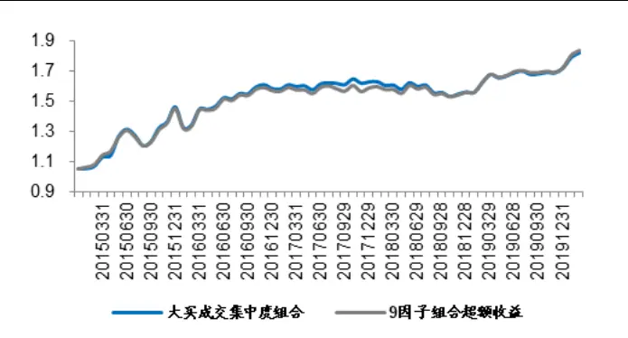
资料来源：Wind，海通证券研究所

图2 加入大买集中度因子的组合相对 9 因子组合的累计超额收益
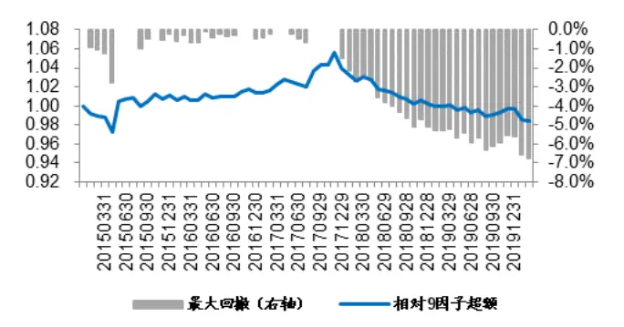
资料来源：Wind，海通证券研究所

如下表所示，虽然大买集中度因子的 IC 为 0.017，t 值为 2.41，但加入 9因子模型之后，组合相对中证 500 的超额收益反而出现了下降。

表 2 加入大买集中度因子的组合相对中证 500的超额收益表现（2015.01-2020.02）

|  | 9 因子组合 | 加入大买成交集中度的组合 | 相对9因子组合的超额收益 |
| --- | --- | --- | --- |
| 年化收益 | 11.71% | 11.52% | -0.31% |
| 最大回撤 | -9.44% | -9.67% 工传播 | -6.79% |
| 年化波动 | 10.50% | 11.07% | 2.44% |
| 收益回撤比 | 1.24 | 1.19 |  |
| 信息比 | 1.12 | 1.04 |  |

资料来源：Wind，海通证券研究所

进一步考察复合因子IC可以发现，尽管加入大买成交集中度后，复合因子IC从6.7%小幅上升至 6.8%，但多头组（复合因子得分最高的 20%股票）的 IC却从 2.05%降至1.98%。根本原因是复合因子的高 IC绝大部分来自空头端，即，股票收益与因子暴露在空头端有很好的线性相关性。而到了多头端，相关性会逐步减弱，甚至反转。

这种现象可通过如下的简单模拟来描述。图中横轴表示因子值，红线代表相应的收益。显然，当因子值小于 0.5 时，收益与因子值显著正相关；而当因子值大于 0.5 之后，则变为明确的负相关。蓝线表示根据因子值和收益之间的线性回归得到的预期收益。

图3 因子多头失效现象的模拟
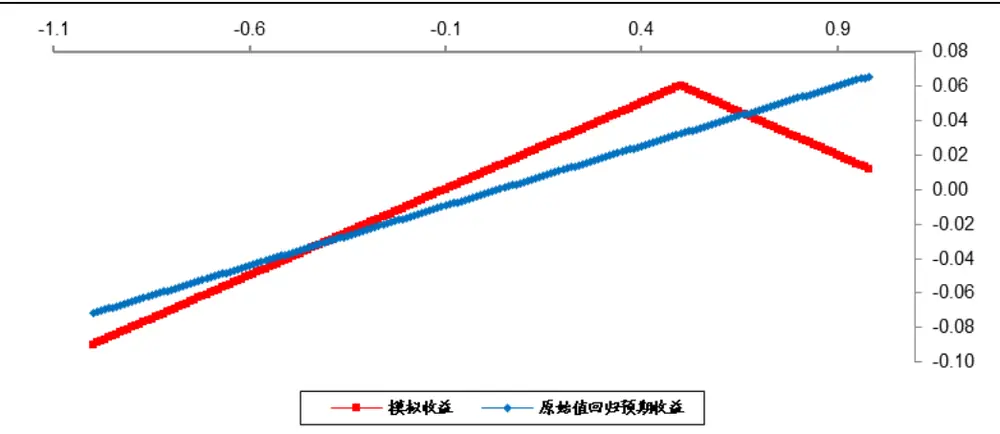
资料来源：海通证券研究所

该模拟因子的 IC高达 0.907，然而，因子暴露较大的那部分股票，显然不是实际收益最高的。由此可见，常规的 IC 在评价因子有效性，尤其是多头端的效果时，可能会产生误导。

## 1.2 分组 IC

因子 IC的计算公式为

$$
\rho_{xr}=\frac{\sum(\boldsymbol{x}_{i}-\bar{\boldsymbol{x}})(\boldsymbol{r}_{i}-\bar{\boldsymbol{r}})}{(n-1)\sqrt{D(\boldsymbol{x})}\sqrt{D(\boldsymbol{r})}}
$$

在分 5组的假定下，如果将同属一组的股票看成一个子集，并定义该集合的 IC为

$$
\rho_{x_{I}r}=\frac{\sum(x_{i}-\bar{x})(r_{i}-\bar{r})}{(n-1)\sqrt{D(x)}\sqrt{D(r)}},i\in I
$$

那么，整体 IC等于 5 个子集 IC 的和。由此，便可以评价每一组对整体 IC的贡献。

下表展示了高频因子各个分组的 IC。为便于比较，我们将因子 IC均调整为正。若某一分组的 IC为负，则说明该分组与整体反向。

表 3 高频因子分组 IC（2015.01-2020.02，中证 500 成分股内）

|  | IC | t值 | 空头组 | 次空头组 | 中值组 | 次多头组 | 多头组 |
| --- | --- | --- | --- | --- | --- | --- | --- |
| 大单资金净流入率 | 0.018 | 3.41 | 0.0132 | -0.0005 | 0.0003 | 0.0005 | 0.0043 |
| 平均单笔流出金额占比 | 0.021 | 4.09 | 0.0141 | -0.0007 | 0.0000 | -0.0007 | 0.0081 |
| 大买成交金额占比 | 0.048 | 7.24 | 0.0314 | 0.0032 | 0.0001 | 0.0055 | 0.0080 |
| 量价复合因子 | 0.033 | 5.84 | 0.0231 | 0.0007 | 0.0001 | 0.0023 | 0.0069 |
| 收盘前成交委托相关性 | 0.020 | 3.35 | 0.0159 | -0.0009 | 0.0000 | 0.0011 | 0.0040 |
| 高频下行波动占比 | 0.029 | 5.30 | 0.0220 | -0.0003 | 0.0001 | 0.0018 | 0.0058 |
| 改进反转因子 | 0.035 | 6.05 | 0.0232 | 0.0016 | 0.0002 | 0.0050 | 0.0049 |
| 大单推动涨幅 | 0.028 | 4.96 | 0.0216 | -0.0011 | 0.0000 | 0.0025 | 0.0044 |
| 高频已实现偏度 | 0.031 | 4.73 | 0.0213 | 0.0008 | 0.0004 | 0.0030 | 0.0050 |
| 大买成交集中度 | 0.017 | 2.41 | 0.0189 | 0.0020 | -0.0006 | 0.0041 | -0.0078 |
| 尾盘成交量占比 | 0.050 | 7.60 | 0.0297 | 0.0021 | 0.0002 | 0.0048 | 0.0129 |

资料来源：Wind，海通证券研究所

对比表 1可以发现，多头收益高的因子，如，大买成交金额占比、尾盘成交量占比，多头组、次多头组的 IC也较高。而多头失效的因子，多头组的 IC 低。如，大买成交集中度因子的多头组 IC甚至为负数。另一方面，所有高频因子的空头组 IC 均在 1%以上，是整体 IC的主要贡献者。

由此我们猜测，如果不采用等权，而是对属于不同组的股票赋予不同的权重，那么，因子的有效性，尤其是对构建多头组合的增益，或许能得到重新评估。例如，在计算大买成交集中度因子的整体 IC 时，对多头组和次多组头赋予更高的权重。那么，这个因子的 IC 很有可能就不再显著，我们也不会把它们加入现有的多因子模型中。

## 2. 加权 IC

## 2.1 加权 IC 的定义

根据石川博士公众号——“川总写量化”中的文章《用 IC 评价因子效果靠谱吗？》提到的方法，通过降低或提高不同股票在计算相关系数时的权重，可对原始 IC进行修正。具体的计算公式如下，

$$
\rho_{xr}=\frac{\sum w_{i}\left(\boldsymbol{x}_{i}-\bar{\boldsymbol{x}}\right)\left(\boldsymbol{r}_{i}-\bar{\boldsymbol{r}}\right)}{\sqrt{\boldsymbol{D}_{w}(\boldsymbol{x})}\sqrt{\boldsymbol{D}_{w}(\boldsymbol{r})}}
$$

其中， $w_{\mathrm{i}}$ 表示第 个股票的权重， $\mathsf{D}_{w}$ 表示利用相同权重向量 计算的加权方差。我们以多头失效现象最为突出的大买成交集中度因子为例，若将多头组权重提高到 50%，其他组均为 12.5%，其 IC可被修正为下表所示的结果。

表 4 大买成交集中度的加权 IC（2015.01-2020.02，中证 500 成分股内）

|  | IC | t值 | 空头组 | 次空头组 | 中值组 | 次多头组 | 多头组 |
| --- | --- | --- | --- | --- | --- | --- | --- |
| 原始 | 0.017 | 2.41 | 0.0189 | 0.0020 | -0.0006 | 0.0041 | -0.0078 |
| 加权 | -0.005 | -0.53 | 0.0126 | 0.0014 | -0.0037 | -0.0006 | -0.0145 |

资料来源：Wind，海通证券研究所

在调高多头组的权重之后，大买成交集中度因子的 IC 从 1.7%大幅下降至-0.5%，t值从 2.41 变为-0.53，可直接判定该因子无效。由此可见，如果我们以提升多头权重后的加权 IC为评价标准，或许能对因子有新的认识。

## 2.2 提高多头组的权重，重新评价因子有效性

将多头组的权重调整为其他组的 5倍，重新计算高频因子的 IC，结果见下表。

表 5 高频因子加权 IC（2015.01-2020.02，中证 500 成分股内）

|  | IC | t值 | 空头组 | 次空头组 | 中值组 | 次多头组 | 多头组 |
| --- | --- | --- | --- | --- | --- | --- | --- |
| 大单资金净流入率（原始） | 0.018 | 3.41 | 0.0132 | -0.0005 | 0.0003 | 0.0005 | 0.0043 |
| 大单资金净流入率（加权） | 0.015 | 2.54 | 0.0099 | -0.0001 | -0.0003 | 0.0000 | 0.0060 |
| 平均单笔流出金额占比（原始） | 0.021 | 4.09 | 0.0141 | -0.0007 | 0.0000 | -0.0007 | 0.0081 |
| 平均单笔流出金额占比（加权） | 0.021 | 3.26 | 0.0121 | 0.0005 | 0.0001 | 0.0002 | 0.0080 |
| 大买成交金额占比（原始） | 0.048 | 7.24 | 0.0314 | 0.0032 | 0.0001 | 0.0055 | 0.0080 |
| 大买成交金额占比（加权） | 0.029 | 3.78 | 0.0260 | 0.0056 | -0.0013 | -0.0003 | -0.0005 |
| 量价复合因子（原始） | 0.033 | 5.84 | 0.0231 | 0.0007 | 0.0001 | 0.0023 | 0.0069 |
| 量价复合因子（加权） | 0.021 | 3.13 | 0.0192 | 0.0025 | -0.0005 | 0.0001 | 0.0000 |
| 收盘前成交委托相关性（原始） | 0.020 | 3.35 | 0.0159 | -0.0009 | 0.0000 | 0.0011 | 0.0040 |
| 收盘前成交委托相关性（加权） | 0.013 | 1.58 | 0.0132 | -0.0008 | -0.0003 | -0.0003 | 0.0012 |
| 高频下行波动占比（原始） | 0.029 | 5.30 | 0.0220 | -0.0003 | 0.0001 | 0.0018 | 0.0058 |
| 高频下行波动占比（加权） | 0.021 | 2.80 | 0.0175 | 0.0004 | -0.0003 | -0.0002 | 0.0035 |
| 改进反转因子（原始） | 0.035 | 6.05 | 0.0232 | 0.0016 | 0.0002 | 0.0050 | 0.0049 |
| 改进反转因子（加权） | 0.021 | 2.60 | 0.0182 | 0.0025 | 0.0001 | -0.0001 | -0.0001 |
| 大单推动涨幅（原始） | 0.028 | 4.96 | 0.0216 | -0.0011 | 0.0000 | 0.0025 | 0.0044 |
| 大单推动涨幅（加权） | 0.017 | 2.72 | 0.0167 | -0.0006 | 0.0003 | -0.0001 | 0.0009 |
| 高频已实现偏度（原始） | 0.031 | 4.73 | 0.0213 | 0.0008 | 0.0004 | 0.0030 | 0.0050 |
| 高频已实现偏度（加权） | 0.022 | 2.82 | 0.0164 | 0.0016 | -0.0005 | 0.0001 | 0.0040 |
| 大买成交集中度（原始） | 0.017 | 2.41 | 0.0189 | 0.0020 | -0.0006 | 0.0041 | -0.0078 |
| 大买成交集中度（加权） | -0.005 | -0.53 | 0.0126 | 0.0014 | -0.0037 | -0.0006 | -0.0145 |
| 尾盘成交量占比（原始） | 0.050 | 7.60 | 0.0297 | 0.0021 | 0.0002 | 0.0048 | 0.0129 |
| 尾盘成交量占比（加权） | 0.039 | 4.73 | 0.0255 | 0.0046 | 0.0010 | 0.0003 | 0.0076 |

资料来源：Wind，海通证券研究所

重新赋权后，高频因子的 IC普遍有所下滑，这主要是因为高频因子整体的空头效应强于多头。下面，我们比较两种 IC计算方式下，在评价和筛选高频因子时的差异。

为确保所选因子确实能带来新的信息，每次根据 IC的大小筛选得到一个新因子后，都将剩余的高频因子分别对已选因子及 9因子正交，并再次计算 IC。重复上述步骤，直到没有新的因子被选出。

根据原始 IC 依此筛选出大买成交金额占比，尾盘成交量占比，大单推动涨幅，根据加权 IC依此筛选出尾盘成交量占比，大买成交金额占比，平均单笔流出金额占比。将各自筛选出的三个因子分别和 9 因子一起构建多因子组合。为便于表达，分别记为原始 IC组合与加权 IC 组合，它们的收益风险特征如以下图表所示。

图4 原始 IC组合与加权 IC组合的累计净值
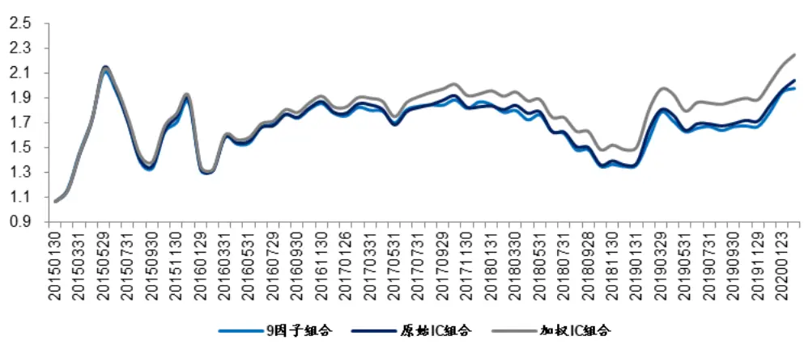
资料来源：海通证券研究所

加入高频因子的两个组合，年化收益均显著高于 9因子组合。而使用加权 IC筛选高频因子，则进一步提升了收益，并降低了波动。

表 6 原始 IC 组合与加权 IC 组合相对中证 500 的超额收益表现（2015.01-2020.02）

|  | 9因子组合 不可 | 原始 IC 组合 | 加权IC 组合 |
| --- | --- | --- | --- |
| 年化收益 | 11.91% | 14.62% | 16.81% |
| 最大回撤 | -9.44% | -10.83% | -11.22% |
| 年化波动 | 10.50% | 12.63% | 12.46% |
| 收益回撤比 | 1.26 | 1.35 | 1.45 |
| 信息比 | 1.13 | 1.16 | 1.35 |

资料来源：Wind，海通证券研究所

下表对比了两个组合的复合因子 IC。尽管加权 IC 组合的整体 IC 略低于原始 IC 组合，但多头组 IC和相应的 t值却更高。以上结果均表明，使用加权 IC能够更好地筛选出对组合多头端有贡献的高频因子，缓解多头失效问题。

表 7 原始 IC 组合与加权 IC 组合的复合因子 IC（2015.01-2020.02）

|  | IC | t值 | 多头组IC | 多头组t值 |
| --- | --- | --- | --- | --- |
| 原始IC 组合 | 0.089 | 8.12 | 0.026 | 6.07 |
| 加权IC 组合 | 0.087 | 8.01 | 0.027 | 6.26 |

资料来源：Wind，海通证券研究所

## 3. 因子升维

## 3.1 加入高频因子的二次多项式

出现图 中多头失效现象的原因是，股票收益和因子暴露之间存在非线性关系，用直线拟合会高（低）估多头的选股效果。实际上，传统的低频因子同样存在这类问题。例如，在海通量化团队前期的报告《市值因子的非线性特征》中，市值最小和最大的那部分股票，实际收益均高于线性预测的结果。为修正这一不足，我们提出在线性模型中进一步加入市值因子的平方项，来反映市值和收益的非线性特征。

根据相同的思路，我们也尝试在收益预测模型中引入高频因子的二次多项式，解决多头失效问题。对于图 3 中的模拟案例，这一过程的示意图如下所示。

图5 加入二次多项式的模拟
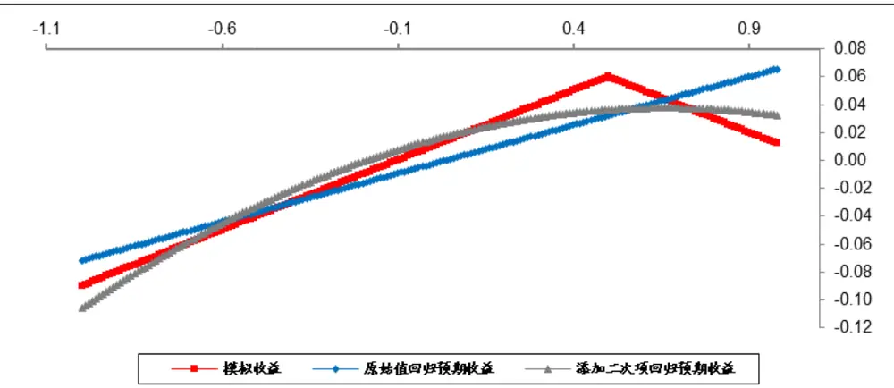
资料来源：海通证券研究所

以大买成交集中度因子为例，将它的二次多项式和 9 因子一同建立收益预测模型和股票组合，业绩表现如以下图表所示。

图6 加入大买成交集中度二次多项式的组合相对中证 500 的累计超额收益
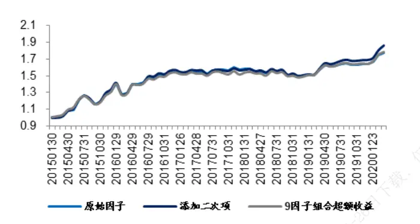
资料来源： ，海通证券研究所

图7 加入大买成交集中度二次多项式的组合相对 9 因子组合的累计超额收益
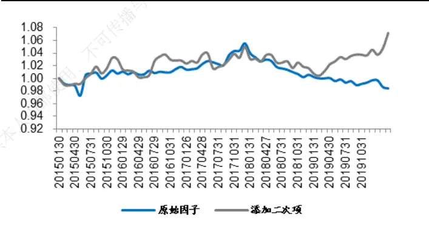
资料来源： ，海通证券研究所

包含二次多项式的模型相比只含一次项，表现显著增强。在回撤和波动降低的基础上，将相对中证 500 的超额收益从 11.52%提升至 12.55%。若以 9 因子模型为基准，二次项的引入同样增强了原始收益和风险调整后收益。

表 8 加入大买集中度二次多项式的组合的超额收益表现（2015.01-2020.02）

| 只含一次项 |  |  | 加入二次多项式 |  |
| --- | --- | --- | --- | --- |
|  | 相对中证 500 超额 | 相对9因子超额 | 相对中证 500 超额 | 相对9因子超额 |
| 年化收益 | 11.52% | -0.31% | 12.55% | 1.33% |
| 最大回撤 | -9.67% | -6.79% | -9.46% | -4.39% |
| 年化波动 | 11.07% | 2.44% | 10.87% | 3.08% |
| 收益回撤比 | 1.19 | -0.05 | 1.33 | 0.30 |
| 信息比 | 1.04 | -0.13 | 1.16 | 0.43 |

资料来源：Wind，海通证券研究所

上述结果表明，二次多项式更好地刻画了大买成交集中度和收益之间的关系。因加入多头失效因子导致的股票排序紊乱得以修复，组合收益回升。

对其余 10 个高频因子，我们按照相同的方法计算加入二次多项式后，组合的收益风险特征，并与 9 因子组合进行对比（见下表）。

表 9 加入高频因子二次多项式的组合相对中证 500的超额收益表现（2015.01-2020.02）

|  |  | 年化收益 | 最大回撤 | 年化波动 | 收益回撤比 | 夏普比 |
| --- | --- | --- | --- | --- | --- | --- |
| 9因子组合 |  | 11.71% | -9.44% | 10.50% | 1.24 | 1.12 |
| 大单资金净流入率 | 只含一次项 | 11.87% | -10.05% | 11.24% | 1.18 | 1.06 |
|  | 二次多项式 | 11.73% | -10.56% | 11.48% | 1.11 | 1.02 |
| 平均单笔流出金额占比 | 只含一次项 | 11.51% | -9.01% | 9.98% | 1.28 | 1.15 |
|  | 二次多项式 | 12.20% | -10.76% | 10.63% | 1.13 | 1.15 |
| 大买成交金额占比 | 只含一次项 | 11.72% | -10.20% | 10.77% | 1.15 | 1.09 |
|  | 二次多项式 | 14.11% | -10.59% | 11.50% | 1.33 | 1.23 |
| 量价复合因子 | 只含一次项 | 11.80% | -10.90% | 11.86% | 1.08 | 1.00 |
|  | 二次多项式 | 11.73% | -10.41% | 11.55% | 1.13 | 1.02 |
| 收盘前成交委托相关性 | 只含一次项 | 11.70% | -10.25% | 11.36% | 1.14 | 1.03 |
|  | 二次多项式 | 12.32% | -10.55% | 11.89% | 1.17 | 1.04 |
| 高频下行波动占比 | 只含一次项 | 10.80% | -9.44% | 10.78% | 1.14 | 1.00 |
|  | 二次多项式 | 11.02% | -9.90% | 11.02% | 1.11 | 1.00 |
| 改进反转因子 | 只含一次项 | 12.84% | -10.47% | 11.13% | 1.23 | 1.15 |
|  | 二次多项式 | 13.06% | -10.40% | 11.12% | 1.26 | 1.17 |
| 大单推动涨幅 | 只含一次项 | 12.15% | -9.80% | 11.27% | 1.24 | 1.08 |
|  | 二次多项式 | 11.89% | -9.84% | 11.14% | 1.21 | 1.07 |
| 高频已实现偏度 | 只含一次项 | 10.62% 传播 | -9.58% | 10.91% | 1.11 | 0.97 |
|  | 二次多项式 | 10.78% | -10.01% | 11.06% | 1.08 | 0.97 |
| 大买成交集中度 | 只含一次项 | 11.52% | -9.67% | 11.07% | 1.19 | 1.04 |
|  | 二次多项式 | 12.55% | -9.46% | 10.87% | 1.33 | 1.16 |
| 尾盘成交量占比 | 只含一次项 | 13.26% | -10.80% | 12.11% | 1.23 | 1.09 |
|  | 二次多项式 | 13.24% | -11.06% | 12.23% | 1.20 | 1.08 |

资料来源：Wind，海通证券研究所

和原始的 9 因子组合相比，只包含高频因子的一次项时，11 个新组合中有 6 个收益上升，幅度为-1.09%至 1.55%，均值为 0.09%；加入二次项后，收益上升的新组合数量增加至 9 个，收益上升幅度变为-0.93%至 2.40%，均值变为 0.53%。整体来看，引入高频因子和股票收益的非线性特征，更好地挖掘了高频因子所蕴含的增量信息。

## 3.2 加入高频因子的四次多项式

根据泰勒展开原理，多项式的阶数越高，越能逼近原始函数。因此，我们尝试在收益预测模型中加入四次多项式，以求更好地刻画高频因子和股票收益之间的非线性特征。如下图所示，相较于二次多项式，四次多项式对多头失效现象的修正更进一步。

图8 加入四次多项式的模拟
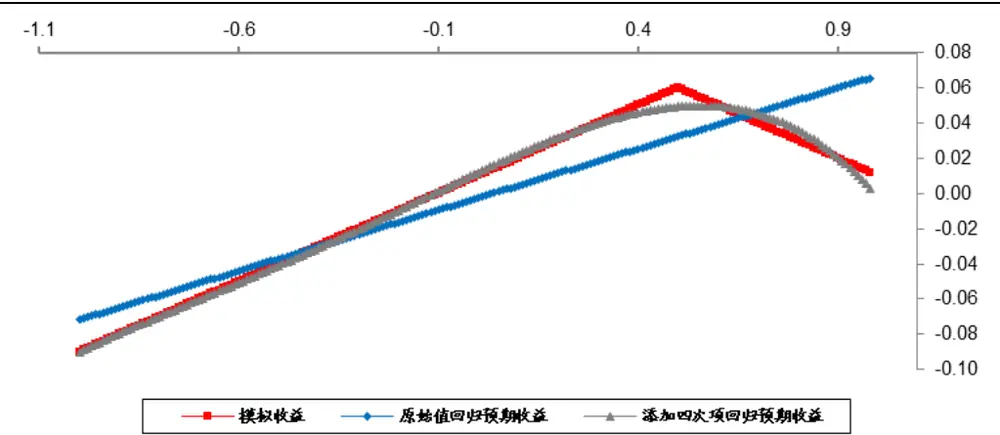
资料来源：海通证券研究所

基于此，我们在收益预测模型中分别加入 11 个高频因子的四次多项式，并构建最大化预期收益组合，相应的收益风险特征如下表所示。

表 10 加入高频因子四次多项式的组合相对中证 500的超额收益表现（2015.01-2020.02）

|  |  | 年化收益 | 最大回撤 | 年化波动 | 收益回撤比 | 夏普比 |
| --- | --- | --- | --- | --- | --- | --- |
| 9因子组合 |  | 11.71% | -9.44% | 10.50% | 1.24 | 1.12 |
| 大单资金净流入率 | 只含一次项 | 11.87% | -10.05% | 11.24% | 1.18 | 1.06 |
|  | 四次多项式 | 11.88% | -10.35% | 11.23% | 1.15 | 1.06 |
| 平均单笔流出金额占比 | 只含一次项 | 11.51% | -9.01% | 9.98% | 1.28 | 1.15 |
|  | 四次多项式 | 11.85% | -10.81% | 11.04% | 1.10 | 1.07 |
| 大买成交金额占比 | 只含一次项 | 11.72% | -10.20% | 10.77% | 1.15 | 1.09 |
|  | 四次多项式 | 14.04% | -10.53% | 11.61% | 1.33 | 1.21 |
| 量价复合因子 | 只含一次项 | 11.80% | -10.90% | 11.86% | 1.08 | 1.00 |
|  | 四次多项式 | 12.01% | -10.15% | 11.11% | 1.18 | 1.08 |
| 收盘前成交委托相关性 | 只含一次项 | 11.70% | -10.25% | 11.36% | 1.14 | 1.03 |
|  | 四次多项式 | 11.97% | -10.33% | 11.79% | 1.16 | 1.02 |
| 高频下行波动占比 | 只含一次项 | 10.80% | -9.44% | 10.78% | 1.14 | 1.00 |
|  | 四次多项式 | 11.58% | -10.45% | 11.67% | 1.11 | 0.99 |
| 改进反转因子 | 只含一次项 | 12.84% | -10.47% | 11.13% | 1.23 | 1.15 |
|  | 四次多项式 | 13.32% | -10.48% | 11.31% | 1.27 | 1.18 |
| 大单推动涨幅 | 只含一次项 | 12.15% | -9.80% | 11.27% | 1.24 | 1.08 |
|  | 四次多项式 | 11.94% | -9.63% | 11.04% | 1.24 | 1.08 |
| 高频已实现偏度 | 只含一次项 |  | -9.58% | 10.91% | 1.11 | 0.97 |
|  | 四次多项式 | 11.50% | -10.08% | 11.15% | 1.14 | 1.03 |
| 大买成交集中度 | 只含一次项 | 11.52% | -9.67% | 11.07% | 1.19 | 1.04 |
|  | 四次多项式 | 12.99% | -9.66% | 11.40% | 1.34 | 1.14 |
| 尾盘成交量占比 | 只含一次项 | 13.26% | -10.80% | 12.11% | 1.23 | 1.09 |
|  | 四次多项式 | 13.90% | -10.06% | 11.78% | 1.38 | 1.18 |

资料来源：Wind，海通证券研究所

对比原始的 9 因子组合，在包含高频因子四次多项式的 11 个新组合中，同样有 9个年化收益上升，幅度为-0.21%至 2.33%，均值为 0.74%。和只加入二次多项式的结果相比，不仅平均提升幅度扩大（ ），而且稳定性也略有上升（波动率：0.93% vs. 0.98%）。总的来说，引入四次多项式使得高频因子包含增量信息的特征被进一步挖掘，从而提升了原始组合的业绩表现。

## 3.3 机器学习之径向基升维

从研究的角度来看，加入高次项确实有助于缓解高频因子的多头失效现象。但在实际应用中，也会面临另一个棘手的问题——如何选择高次项的阶数。一方面，人为指定虽然简单直接，但显得有些随意，且未必能保证好的效果。另一方面，优化寻解又缺乏统一的标准，而且，若同时存在多个高频因子，计算难度也将成倍上升。因此，我们希望找到一种方法，能够在较小的计算压力下，尽可能通过数据驱动来反映因子和收益之间的非线性关系。

机器学习中的径向基网络就符合这样的要求，其基本思想是先利用径向基函数将数据升维，使每一个维度包含一部分数据蕴含的信息，然后利用线性回归模型对升维后的数据进行拟合（见下图）。

图9 径向基升维方法示意图
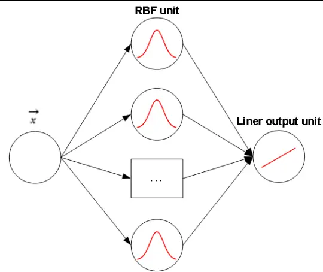
资料来源：海通证券研究所整理

具体到多因子模型层面，首先，对包含 n个股票的因子值向量 x 采用聚类算法确定m 个中心点。其次，利用如下的径向基函数（RBF unit）对第 i个股票的因子值 x 进行升维。

$$
h(x_{i})=exp\left(-\frac{1}{2\sigma^{2}}\left\|x_{i}-c_{j}\right\|^{2}\right),i=1,\cdots,n,j=1,\cdots,m
$$

最后，将被扩充至 m 维的因子与其他因子一同用于股票收益的预测。

此外，由上式可见，离中心点 j越远的数据，升维后的值越接近于 0。所以，径向基升维的方法还起到了对数据分组的作用，从而可以实现下图所示的分段回归，更好地逼近因子和收益的真实关系。

图10 径向基升维的模拟
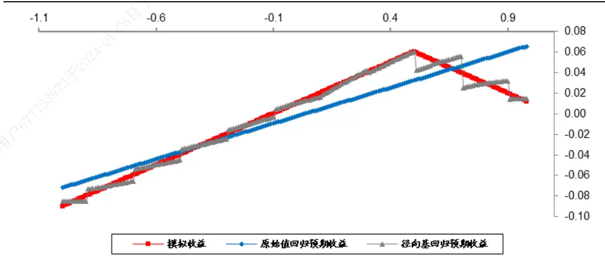
资料来源：海通证券研究所

下面，我们先将径向基升维的方法运用于大买成交集中度因子，考察它与原始 9 因子结合后，构建的最大化预期收益组合的业绩表现，具体结果如以下图表所示。

图11 加入升维后的大买成交集中度的组合相对中证 500 的累计超额收益
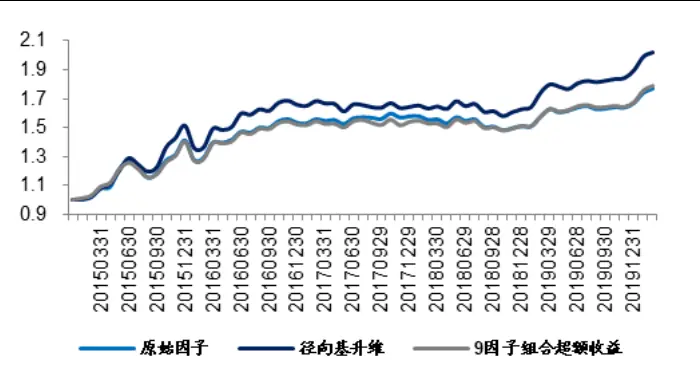
资料来源：Wind，海通证券研究所

图12 加入升维后的大买成交集中度的组合相对 9 因子组合的累计超额收益
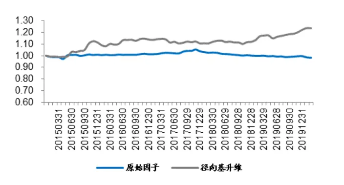
资料来源：Wind，海通证券研究所

在原始 9因子中，加入径向基升维后的大买集中度因子带来了显著的收益提升。这表明，该因子确实蕴含了可以预测收益的信息，只是被人为确定的线性关系掩盖了。

表 11 加入升维后的大买成交集中度的组合的超额收益表现（2015.01-2020.02）

| 原始因子组合 |  |  | 径向基升维组合 |  |
| --- | --- | --- | --- | --- |
|  | 相对中证 500 超额 | 相对9因子超额 | 相对中证 500 超额 | 相对9因子超额 |
| 年化收益 | 11.52% | -0.31% | 14.36% | 4.09% |
| 最大回撤 | -9.67% | -6.79% | -10.34% | -3.95% |
| 年化波动 | 11.07% | 2.44% | 11.93% | 4.57% |
| 收益回撤比 | 1.19 | -0.05 | 1.39 | 1.04 |
| 信息比 | 1.04 | -0.13 | 1.20 | 0.89 |

资料来源：Wind，海通证券研究所

进一步将升维方法推广至其他高频因子，对应的最大化预期收益组合的业绩表现如下表所示。

表 12 加入升维后的高频因子的组合相对中证 500的超额收益表现（2015.01-2020.02）

| 73 |  | 年化收益 | 最大回撤 | 年化波动 | 收益回撤比 | 夏普比 |
| --- | --- | --- | --- | --- | --- | --- |
| 9因子组合 |  | 11.71% | -9.44% | 10.50% | 1.24 | 1.12 |
| 大单资金净流入率 | 只含一次项 | 11.87% | -10.05% | 11.24% | 1.18 | 1.06 |
|  | 径向基升维 | 11.31% | -9.99% | 10.51% | 1.13 | 1.08 |
| 平均单笔流出金额占比 | 只含一次项 | 11.51% | -9.01% | 9.98% | 1.28 | 1.15 |
|  | 径向基升维 | 11.81% | -10.13% | 11.12% | 1.17 | 1.06 |
| 大买成交金额占比 | 只含一次项 | 11.72% | -10.20% | 10.77% | 1.15 | 1.09 |
|  | 径向基升维 | 13.55% | -10.63% | 10.71% | 1.27 | 1.27 |
| 量价复合因子 | 只含一次项 | 11.80% | -10.90% | 11.86% | 1.08 | 1.00 |
|  | 径向基升维 | 11.79% | -10.87% | 11.62% | 1.08 | 1.01 |
| 收盘前成交委托相关性 | 只含一次项 | 11.70% | -10.25% | 11.36% | 1.14 | 1.03 |
|  | 径向基升维 | 10.97% | -10.03% | 10.80% | 1.09 | 1.02 |
| 高频下行波动占比 | 只含一次项 | 10.80% | -9.44% | 10.78% | 1.14 | 1.00 |
|  | 径向基升维 | 11.55% | -10.39% | 10.84% | 1.11 | 1.07 |
| 改进反转因子 | 只含一次项 | 12.84% | -10.47% | 11.13% | 1.23 | 1.15 |
|  | 径向基升维 | 13.25% | -9.73% | 10.87% | 1.36 | 1.22 |
| 大单推动涨幅 | 只含一次项 | 12.15% | -9.80% | 11.27% | 1.24 | 1.08 |
|  | 径向基升维 | 12.28% | -10.68% | 11.57% | 1.15 | 1.06 |
| 高频已实现偏度 | 只含一次项 | 10.62% | -9.58% | 10.91% | 1.11 | 0.97 |
|  | 径向基升维 | 11.43% | -9.83% | 10.47% | 1.16 | 1.09 |
| 大买成交集中度 | 只含一次项 | 11.52% | -9.67% | 11.07% | 1.19 | 1.04 |
|  | 径向基升维 | 14.36% | -10.34% | 11.93% | 1.39 | 1.20 |
| 尾盘成交量占比 | 只含一次项 | 13.26% | -10.80% | 12.11% | 1.23 | 1.09 |
|  | 径向基升维 | 15.54% | -10.08% | 12.11% | 1.54 | 1.28 |

资料来源：Wind，海通证券研究所

由上表可见，先通过径向基对高频因子升维，再分别加入原始的 9 因子组合后，有7 个年化收益上升，数量高于只含一次项的 6 个。上升幅度为-0.74%至 3.83%，均值为0.82%，优于加入二次和四次多项式的结果。

## 3.4 升维方法对比和小结

加入二次或四次多项式，本质上都是对高频因子增加维度，因此不妨将这两种方式和使用机器学习的结果进行对比。下表展示了加入升维后的高频因子的最大化预期收益组合，相对只含一次项的年化收益之差。

表 13 不同升维方法下的组合相对只含一次项的组合的超额收益表现（2015.01-2020.02）

|  | 加入二次多项式 | 加入四次多项式 | 径向基升维 |
| --- | --- | --- | --- |
| 大单资金净流入率 | -0.15% | 0.01% | -0.56% |
| 平均单笔流出金额占比 | 0.68% | 0.34% | 0.30% |
| 大买成交金额占比 | 2.39% | 2.31% | 1.82% |
| 量价复合因子 | -0.07% | 0.21% | -0.01% |
| 收盘前成交委托相关性 | 0.62% | 0.28% 不可传播 | -0.72% |
| 高频下行波动占比 | 0.21% | 0.78% | 0.75% |
| 改进反转因子 | 0.23% | 0.48% | 0.42% |
| 大单推动涨幅 | -0.26% | -0.21% | 0.13% |
| 高频已实现偏度 | 0.16% | 0.88% | 0.81% |
| 大买成交集中度 | 仅供 1.04% | 1.47% | 2.84% |
| 尾盘成交量占比 6日下载， | -0.02% | 0.64% | 2.27% |
| 均值 | 0.44% | 0.65% | 0.73% |

资料来源：Wind，海通证券研究所

在使用高频因子时，适当升高维度在平均意义上均可提高组合的年化收益。相对而言，径向基方法的效果最好。相对只含一次项的平均超额收益为 0.73%，高于加入二次和四次多项式的 0.44%和 0.65%。

仅就上述结果而言，我们倾向于认为，完全由数据驱动的径向基升维对挖掘高频因子信息的发现和挖掘最为充分。但作为机器学习的一种算法，潜在的风险同样需要关注。虽然整个过程中，参数选择和模型设定均无人工干预，但机器学习方法却暗含了一个前提——训练期数据与预测期数据的特征基本一致。例如，径向基升维需要确定中心点的个数，以便对数据分段。而我们的实证发现，这是一个敏感性较强的参数。选择不同时间长度的训练样本，得到的最优参数差异较大，组合的收益也是大相径庭。因此，使用机器学习也需谨慎，尤其是对于频率较低、有效样本量较少的月度选股模型。

## 4. 总结

高频因子存在明显的多头失效现象，这使得常用的因子 在评价高频因子有效性时，容易出现失真。通过对不同数据赋予新的权重，构建得到的加权 IC可以更好地反映因子的多头效果，找到真正有助于提升组合收益的因子。

进一步研究发现，多头失效问题常常表现为高频因子和股票收益之间的非线性关系。因此，加入因子的高次项以刻画这种关系，成为了自然的选择。实证结果表明，直接加入因子的高次项（如，二次、四次多项式），可以在整体上改善最大化预期收益组合的业绩表现，挖掘出高频因子更多的增量信息。但这种方法的问题也显而易见，它需要事先确定非线性函数的形式。而这一过程更多地是依赖模型使用者的经验，较难推而广之。

机器学习中同样提供了大量拟合线性关系的方法，径向基升维是其中一种直观且运算量较小的技术。将其应用于高频因子的多头失效问题，同样可以在平均意义上提升组合的年化收益。但这种方法的风险也不容忽视，它可能会引发“维数灾祸（dimensioncurse）”。一方面，因子维度升高会降低参数估计的稳定性。极端情况下，会导致因子暴露矩阵不满秩，无法进行跟踪误差约束。另一方面，过高的维度也会增加模型的过拟合概率，尤其是在有效历史数据较为有限的月度再平衡方式下。

根据 定理，将复杂的模式分类问题非线性地投射到高维空间，比投射到低维空间更可能是线性可分的。虽然这种方式提升了模型的预测能力，但也严重降低了模型的人工修正能力，使策略彻底黑盒化。对这种非线性方法进行有效控制并合理使用，是机器学习应用于投资实践中的重要研究方向。

## 5. 风险提示

市场系统性风险、模型误设风险、有效因子变动风险。

# 信息披露分析师声明

[Table冯佳睿ys金融工程研究团队ts]

余浩淼金融工程研究团队

本人具有中国证券业协会授予的证券投资咨询执业资格，以勤勉的职业态度，独立、客观地出具本报告。本报告所采用的数据和信息均来自市场公开信息，本人不保证该等信息的准确性或完整性。分析逻辑基于作者的职业理解，清晰准确地反映了作者的研究观点，结论不受任何第三方的授意或影响，特此声明。

## 法律声明

本报告仅供海通证券股份有限公司（以下简称“本公司”）的客户使用。本公司不会因接收人收到本报告而视其为客户。在任何情况下，本报告中的信息或所表述的意见并不构成对任何人的投资建议。在任何情况下，本公司不对任何人因使用本报告中的任何内容所引致的任何损失负任何责任。

本报告所载的资料、意见及推测仅反映本公司于发布本报告当日的判断，本报告所指的证券或投资标的的价格、价值及投资收入可能会波动。在不同时期，本公司可发出与本报告所载资料、意见及推测不一致的报告。

市场有风险，投资需谨慎。本报告所载的信息、材料及结论只提供特定客户作参考，不构成投资建议，也没有考虑到个别客户特殊的播投资目标、财务状况或需要。客户应考虑本报告中的任何意见或建议是否符合其特定状况。在法律许可的情况下，海通证券及其所属可关联机构可能会持有报告中提到的公司所发行的证券并进行交易，还可能为这些公司提供投资银行服务或其他服务。

本报告仅向特定客户传送，未经海通证券研究所书面授权，本研究报告的任何部分均不得以任何方式制作任何形式的拷贝、复印件或使复制品，或再次分发给任何其他人，或以任何侵犯本公司版权的其他方式使用。所有本报告中使用的商标、服务标记及标记均为本公内司的商标、服务标记及标记。如欲引用或转载本文内容，务必联络海通证券研究所并获得许可，并需注明出处为海通证券研究所，且本不得对本文进行有悖原意的引用和删改。仅

根据中国证监会核发的经营证券业务许可，海通证券股份有限公司的经营范围包括证券投资咨询业务。载

## 海通证券股份有限公司研究所[Table_PeopleInfo]

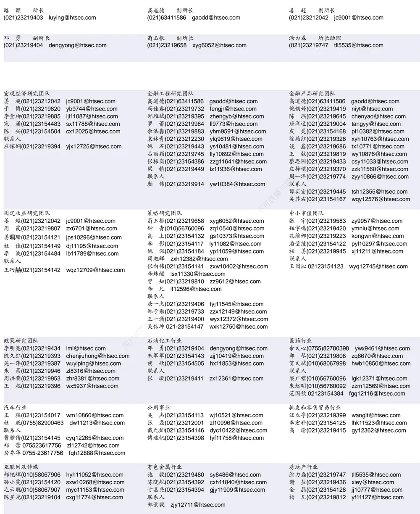

| 基础化工行业 | 计算机行业 | 通信行业 |
| --- | --- | --- |
| 刘 威(0755)82764281 Iw10053@htsec.com | 郑宏达(021)23219392 zhd10834@htsec.com | 朱劲松(010)50949926 zjs10213@htsec.com |
| 刘海荣(021)23154130 Ihr10342@htsec.com | 杨 林(021)23154174 yl11036@htsec.com | 余伟民(010)50949926 ywm11574@htsec.com |
| 张翠翠(021)23214397 zcc11726@htsec.com | 于成龙 ycl12224@htsec.com | 张峥青(021)23219383 zzq11650@htsec.com |
| 孙维容(021)23219431 swr12178@htsec.com | 黄竞晶(021)23154131 hjj10361@htsec.com | 张 弋01050949962 zy12258@htsec.com |
| 李 智(021)23219392 Iz11785@htsec.com | 洪 琳(021)23154137 hl11570@htsec.com | 联系人 杨彤昕 010-56760095 ytx12741@htsec.com |

| 非银行金融行业 |  | 交通运输行业 |  |  | 纺织服装行业 |  |
| --- | --- | --- | --- | --- | --- | --- |
|  | 孙 婷(010)50949926 st9998@htsec.com |  | 虞 楠(021)23219382 yun@htsec.com |  |  | 梁 希(021)23219407 lx11040@htsec.com |
|  | 何 婷(021)23219634 ht10515@htsec.com |  | 罗月江（010）56760091 lyj12399@htsec.com |  |  | 盛 开(021)23154510 sk11787@htsec.com |
|  | 李芳洲(021)23154127 Ifz11585@htsec.com |  |  | 李 轩(021)23154652 lx12671@htsec.com | 联系人 |  |
| 联系人 任广博/ |  |  | 李 丹(021)23154401 Id11766@htsec.com |  |  | 刘 溢(021)23219748 ly12337@htsec.com |

| 建筑建材行业 | 机械行业 |  |  | 钢铁行业 |
| --- | --- | --- | --- | --- |
| 冯晨阳(021)23212081 fcy10886@htsec.com |  | 余炜超(021)23219816 swc11480@htsec.com |  | 刘彦奇(021)23219391 liuyq@htsec.com |
| 潘莹练(021)23154122 pyl10297@htsec.com |  | 耿 耘(021)23219814 gy10234@htsec.com |  | 周慧琳(021)23154399 zhl11756@htsec.com |
| 申 浩(021)23154114 sh12219@htsec.com |  | 杨 震(021)23154124 yz10334@htsec.com |  |  |
| 杜市伟(0755)82945368 dsw11227@htsec.com |  | 周 丹 zd12213@htsec.com |  |  |
| 颜慧菁 yhj12866@htsec.com | 联系人 |  | 吉 晟(021)23154145 js12801@htsec.com 传播与转载 |  |

| 建筑工程行业 | 农林牧渔行业 | 食品饮料行业 |
| --- | --- | --- |
| 张欣劼 zxj12156@htsec.com | 丁 频(021)23219405 dingpin@htsec.com | 闻宏伟(010)58067941 whw9587@htsec.com |
| 李富华(021)23154134 Ifh12225@htsec.com | 陈阳(021)23212041 cy10867@htsec.com 联系人 | 唐 宇(021)23219389 ty11049@htsec.com |
| 杜市伟(0755)82945368 dsw11227@htsec.com | 孟亚琦(021)23154396 myq12354@htsec.com | 颜慧菁 yhj12866@htsec.com 联系人 |
|  |  | 程碧升(021)23154171 cbs10969@htsec.com |

| 军工行业 | 银行行业 | 社会服务行业 |
| --- | --- | --- |
| 张恒晅 zhx10170@htsec.com | 孙 婷(010)50949926 st9998@htsec.com | 汪立亭(021)23219399 wanglt@htsec.com |
| 联系人 张宇轩(021)23154172 zyx11631@htsec.com | 解巍巍 xww12276@htsec.com | 陈扬扬(021)23219671 cyy10636@htsec.com |
|  | 林加力(021)23154395 Ijl12245@htsec.com | 许樱之 xyz11630@htsec.com |

| 家电行业 |  | 造纸轻工行业 |  |
| --- | --- | --- | --- |
| 陈子仪(021)23219244 | chenzy@htsec.com |  | 衣桢永(021)23212208 yzy12003@htsec.com |
| 李 阳(021)23154382 | ly11194@htsec.com |  |  |
| 朱默辰(021)23154383 | zmc11316@htsec.com |  |  |
| 刘 璐(021)23214390 | II11838@htsec.com |  |  |

## 研究所销售团队

深广地区销售团队

蔡铁清(0755)82775962 ctq5979@htsec.com

伏财勇(0755)23607963 fcy7498@htsec.com

辜丽娟(0755)83253022 gulj@htsec.com

刘晶晶(0755)83255933 liujj4900@htsec.com

饶 伟(0755)82775282 rw10588@htsec.com

欧阳梦楚(0755)23617160

oymc11039@htsec.com

巩柏含 gbh11537@htsec.com

上海地区销售团队
胡雪梅(021)23219385 huxm@htsec.com
朱 健(021)23219592 zhuj@htsec.com
季唯佳(021)23219384 jiwj@htsec.com
黄 毓(021)23219410 huangyu@htsec.com
漆冠男(021)23219281 qgn10768@htsec.com
胡宇欣(021)23154192 hyx10493@htsec.com
黄 诚(021)23219397 hc10482@htsec.com
毛文英(021)23219373 mwy10474@htsec.com
马晓男 mxn11376@htsec.com
杨祎昕(021)23212268 yyx10310@htsec.com
张思宇 zsy11797@htsec.com
王朝领 wcl11854@htsec.com
邵亚杰 23214650 syj12493@htsec.com
李 寅 021-23219691 ly12488@htsec.com北京地区销售团队
殷怡琦(010)58067988 yyq9989@htsec.com郭 楠 010-5806 7936 gn12384@htsec.com张丽萱(010)58067931 zlx11191@htsec.com杨羽莎(010)58067977 yys10962@htsec.com何 嘉(010)58067929 hj12311@htsec.com李 婕 lj12330@htsec.com
欧阳亚群 oyyq12331@htsec.com
郭金垚(010)58067851 gjy12727@htsec.com

海通证券股份有限公司研究所

地址：上海市黄浦区广东路 689号海通证券大厦 9楼

电话：（021）23219000

传真：（021）23219392

网址：www.htsec.com