## [Tab相关研究

Table_ReportInfo]《基于基金重仓股的选股策略分析》 2020.04.02

《低估值、高分红、受南下资金和外资青睐——恒生指数及华夏恒生 ETF投资价值分析》2020.03.31

《选股因子系列研究（六十一）——从加权 到机器学习：高频因子多头失效的修正》2020.03.22

分析师:冯佳睿

Tel:(021)23219732

Email:fengjr@htsec.com

证书:S0850512080006

分析师:罗蕾

Tel:(021)23219984

Email:ll9773@htsec.com

证书:S0850516080002

# 选股因子系列研究（六十二）——被动产品的规模扩张对 alpha 策略的影响分析：从美国到中国的证据

## 投资要点：

近 1 年多来，我国被动产品的规模大幅扩张，份额在偏股类产品中的占比已增长至 38%。有意思的是，同时期，以指数增强为代表的 alpha 策略，表现却不尽如人意。那么，两者之间是否存在一定关联呢？本文从被动产品规模已占据半壁江山的美国市场出发，再回到正在成长期的中国被动产品，尝试探讨这一问题。

美国被动产品主要包括指数共同基金和指数 两种类型。美国投资者对被动产品的需求逐年攀升，而对主动型基金的需求逐年降低。特别是近 10 余年，被动产品的规模迅速扩张，从 2008 年底的 1.1 万亿美元增长至 2018 年底的 6.6 万亿美元。同时，在基金总资产净值中的占比也迅速攀升至 36%。

- 过去十年无疑是被动产品的黄金十年，但对美股的常用因子和美国的对冲基金而言，又是“失去的十年”。 年以来，在资金持续净流入被动产品、净流出主动产品的背景下，因子和对冲基金的表现均不理想。首先，彭博的纯因子组合全收益指数 2009 年以来的表现出现明显下滑。其次，对冲基金的收益表现自 2009年以来，也出现明显下滑。

- 我国被动产品的增长呈短期急剧扩张的特征，在扩张期内，alpha策略的整体表现不佳。过去的十多年间，被动产品的份额在大部分时段上都保持相对稳定。规模扩张主要出现在两个时段，2014Q3 至 2015Q2、2018Q3 至 2019Q4。与此同时，以因子多空收益、指数增强基金超额收益为代表的 alpha 策略表现不佳。

- 中美都存在被动产品规模扩张阶段，alpha策略表现不佳的现象，但两者的成因可能有所不同。资金不断流入催生的美股十年牛市，对经典的因子定价模型形成了挑战。A 股市场层出不穷的各种热点，则在一定程度上改变了投资者的行为，使得因子表现出和之前不一样的规律。

- 2008 年后，流入美国市场的资金由主动基金转向被动基金，其中又以宽基指数为主。而在宽基指数中，市值大、估值高的股票通常也有更高的权重。因此，资金实际上流向了市值大、估值高的宽基成分股，推升了它们的涨幅。这恰好与Fama-French 三因素模型中的两个经典因子——SMB和 HML 相反，在一定程度上削弱了 alpha 策略的表现。

- A股市场被动产品的增长很大一部分源于主题类基金，即，被动产品份额增加通常意味着投资者对主题热点的切换与追捧。在这种市场环境下，投资者在买入时通常较少考虑个股的前期表现，反转效应的有效性降低。在基金份额大幅增长时期，反转、换手率等常用的反转型因子，选股有效性都明显不及份额相对稳定的阶段。

- 风险提示。模型误设风险，统计规律失效风险。

近 1 年多来，我国被动产品的规模大幅扩张，份额在偏股类产品中的占比已增长至38%。有意思的是，同时期，以指数增强为代表的 alpha 策略，表现却不尽如人意。那么，两者之间是否存在一定关联呢？本文从被动产品规模已占据半壁江山的美国市场出发，再回到正在成长期的中国被动产品，尝试探讨这一问题。

## 1. 美国被动产品的现状和发展史

## 1.1 被动产品概况

被动产品通常以指数型基金的形式存在，目标是追踪市场指数的表现。为此，基金经理将购买指数所有成分股或其中具有代表性的个股，以获得与指数接近的收益表现。按照产品类型来看，美国指数型基金主要包括两种形式：指数共同基金和指数 ETF。

如下图所示，美国市场被动产品规模及其占比自上世纪 90 年代以来稳步上升。1993年，被动产品总规模 279 亿美元，在基金总资产中占比 1.9%。2008 年的金融危机后，被动产品的规模迅速扩张。从 2008 年底的 1.1 万亿美元上升至 2018 年底的 6.6 万亿美元，增长幅度逾 5倍。截止 2018 年底，被动产品总规模在基金总资产中的占比已达 36%，而这个数字在 2008 年底仅为 18%。

图1 美国被动产品规模及其占比
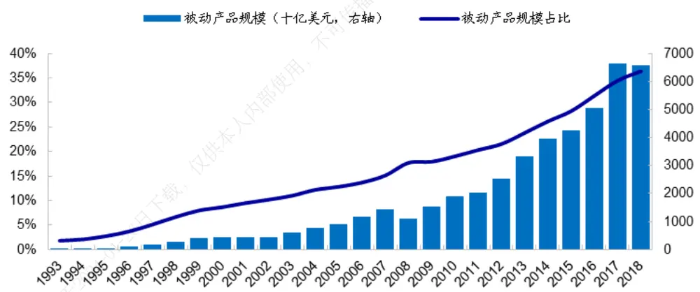
资料来源： ，海通证券研究所
注：被动产品规模占比是指被动产品规模与长期基金总资产规模之比，长期基金包括股票型共同基金、债券型共同基金、混合型共同基金和 。

进一步细分形式来看，截止 2018 年底，美国共有 497 只指数共同基金，管理规模总计 3.3 万亿美元；1660 只指数 ETF，管理规模总计 3.2 万亿美元；两者占比均为 18%左右。而 2008 年底，两者的占比之和才达到 18%。

图2 指数基金资产净值占基金总资产净值之比（2008）
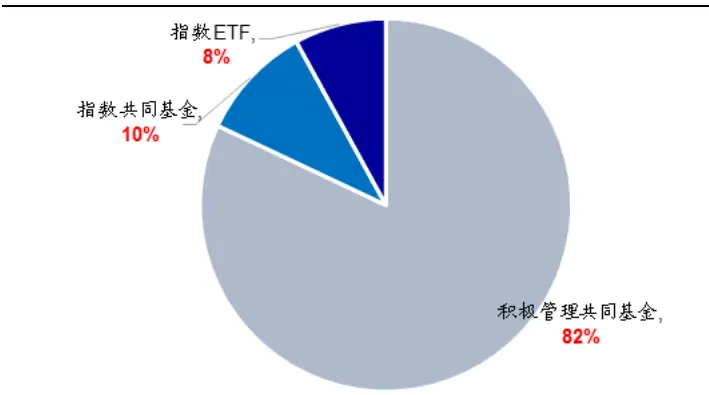
资料来源：ICI，海通证券研究所
注：此处基金总资产净值为共同基金与 ETF资产净值之和。其中，共同基金剔除了货币基金，ETF剔除了非 1940年投资公司法下设立的 ETF。

图3 指数基金资产净值占基金总资产净值之比（2018）
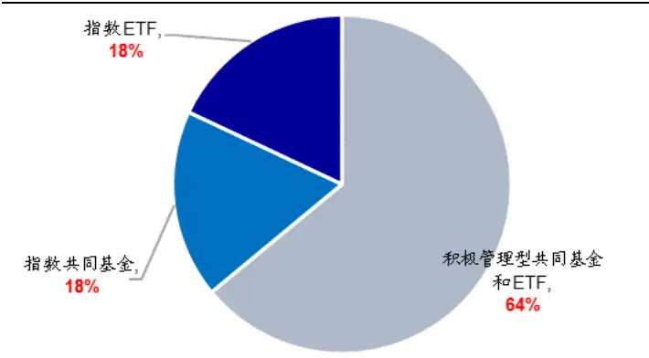
资料来源：ICI，海通证券研究所
注：此处基金总资产净值为共同基金与 ETF资产净值之和。其中，共同基金剔除了货币基金， 剔除了非 年投资公司法下设立的 。

在股票型产品（股票型共同基金、股票型 ETF）中，被动产品的规模占比也出现了非常明显的增长。2008 年底，股票型被动产品（指数型共同基金和 ETF）规模总计 9370亿美元，在股票型基金中的占比为 22.9%。到了 2018 年底，股票型基金中被动产品的规模已达 5.3 万亿美元，增长将近 5倍，在股票型基金中的占比也增长至 44.7%。

图4 股票型基金中被动产品规模占比（2008）
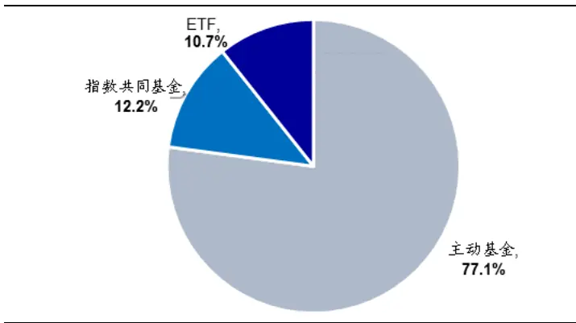
资料来源：ICI，海通证券研究所
注：此处股票型基金包括股票型共同基金和 。

图5 股票型基金中被动产品规模占比（2018）
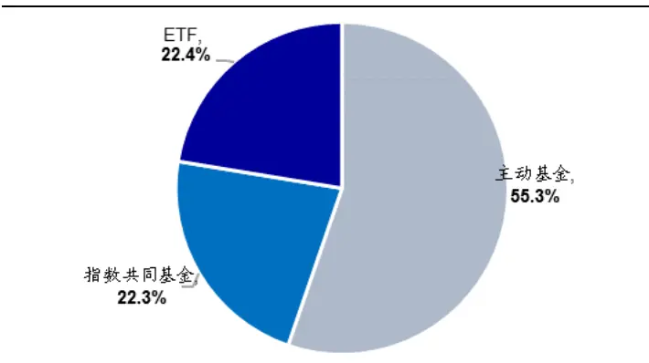
资料来源：ICI，海通证券研究所
注：此处股票型基金包括股票型共同基金和 ETF。

## 1.2指数共同基金

美国第一只指数基金是 1971 年美国富国银行（Wells Fargo Bank）向机构投资者推出的指数共同基金产品。自此，指数共同基金规模整体稳步增长。特别是 2009 年以来（下图左），指数共同基金规模从 亿美元增长至 万亿美元（ 年），复合年化增长率高达 18.3%。

指数共同基金在股票型共同基金中的规模占比也呈现逐年增加的趋势（下图右）。1993 年，在股票型共同基金中，指数基金规模占比仅为 3.3%，主动基金规模占比高达96.7%。而截止 2018 年底，指数基金规模占比已攀升至 28.8%。

图6 美国指数型共同基金个数和总规模
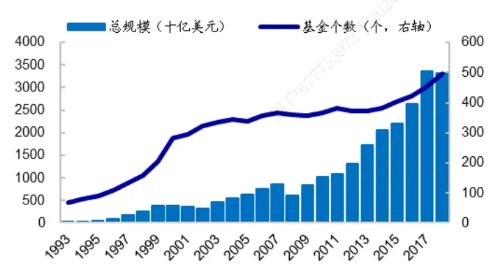
资料来源：ICI，海通证券研究所

图7 美国股票型共同基金中指数基金的规模占比
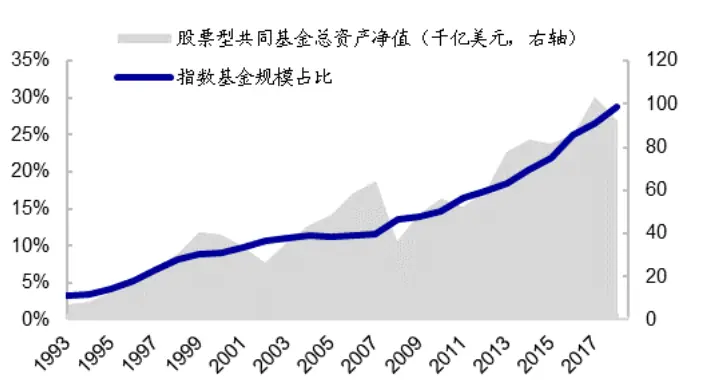
资料来源：ICI，海通证券研究所

## 1.3 指数 ETF

ETF 是仅次于共同基金的美国第二大证券投资基金类型。1993 年，美国证券交易委员会（SEC）批准成立第一只 ETF，跟踪标的为美国市场最著名的宽基指数之一——标普 500。2008 年，SEC 批准设立积极管理型 ETF。

ETF 主要以指数为基础，通常根据 1940 年投资公司法（Company Act of 1940）在SEC 注册。截至 2018 年底，积极管理型 ETF 和非 1940 投资公司法下注册的 ETF仅占ETF 净资产的 4%。即，被动管理的指数 ETF规模占比为 96%。

ETF 净资产总额近年来增长迅速，从 2008 年底的 5310 亿美元增长到 2018 年底的

3.4 万亿美元。由此可见，在过去的十年间，ETF已成为市场中十分重要的一股力量。
截止 2018 年底，ETF的净资产约占投资机构管理总净资产的 18%。

图8 美国 ETF个数和总规模（十亿美元）
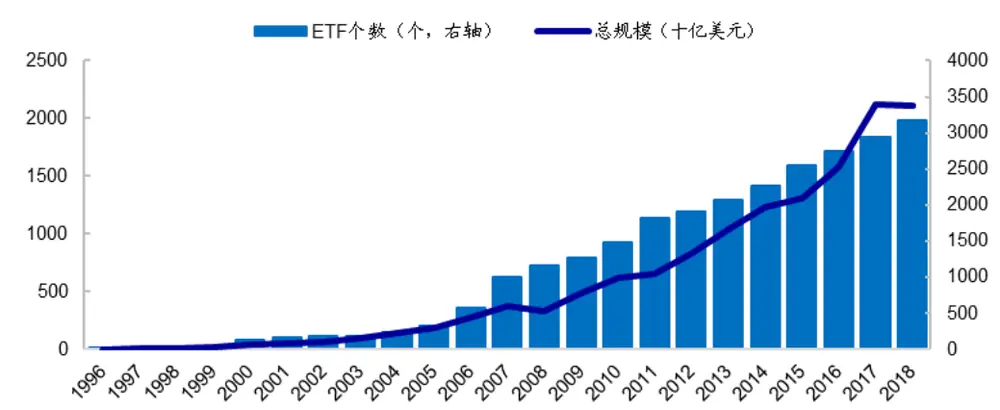
资料来源：ICI，海通证券研究所

从资产类别来看，与指数共同基金类似，ETF的大部分净资产都来自于股票型产品。股票型 ETF占 ETF净资产总额的 79%。其中，美国国内股票 ETF占比 57.5%，全球股票 ETF 占比 21.5%。

图9 美国 ETF分类规模占比（2018）
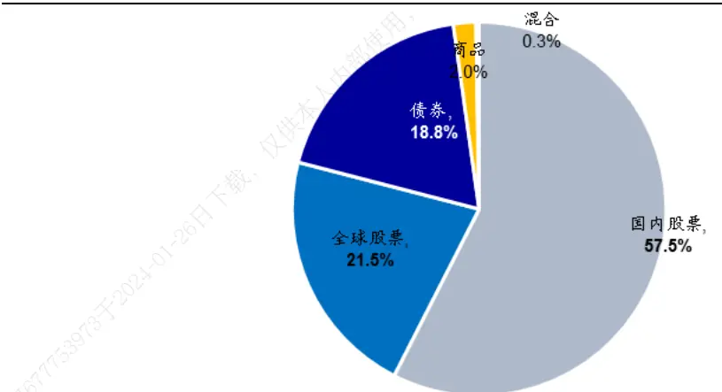
资料来源：ICI，海通证券研究所

在美国国内股票 ETF 中，又以宽基 ETF为主。2008 年底，宽基 ETF 规模总计 2700亿美元，在美国国内股票 ETF中占比 82%。2018 年底，宽基 ETF规模增长至 1.6万亿美元，在美国国内股票 ETF 中占比 83%。

图10 美国国内股票 ETF中宽基 ETF规模占比（2008）
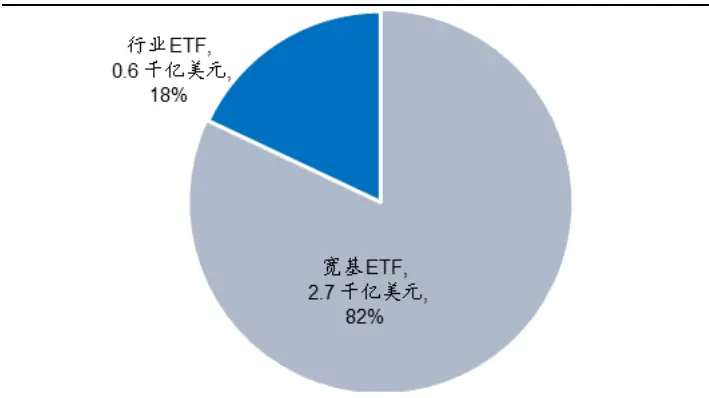
资料来源：ICI，海通证券研究所

图11 美国国内股票 ETF中宽基 ETF规模占比（2018）
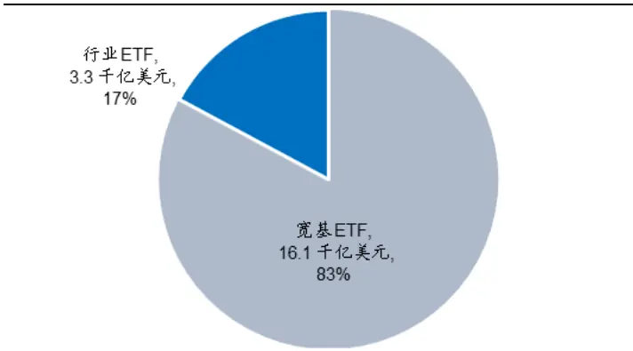
资料来源：ICI，海通证券研究所

1998 年，美国开始出现行业（Sector）ETF。1998 年至 2008 年间，行业 ETF 在美国国内股票ETF中的规模占比迅速攀升，从1998年的3.3%增长至2008年的18.0%。2009 至 2015 年，行业 ETF 规模占比无明显变化，维持在 21%左右。而 2016 年开始，占比逐年降低。截止 2018 年底，行业 ETF 规模总计 3326 亿美元，在美国 ETF总规模中占比 9.9%，在美国国内的股票 ETF总规模中占比 17.2%。

图12 美国国内股票 ETF中行业 ETF规模占比
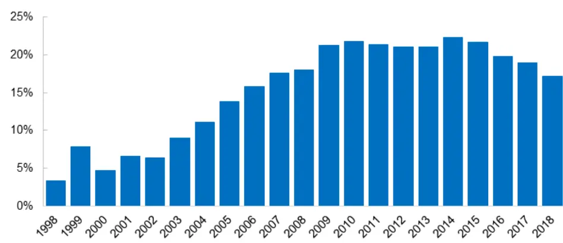
资料来源：ICI，海通证券研究所

## 1.4资金持续流入被动产品

以 2008 年底为分界点，美国投资者对主动产品和被动产品的需求发生了根本性的转变。如下图所示，上世纪 90 年代，主动基金每年都吸引了大量资金净流入。2000-07年，主动基金的资金净流入金额明显下降，但依然在大部分年份上保持为正。

但 2008 年后，主动基金几乎每年都呈现资金净流出状态。而被动产品（指数共同基金和 ）则刚好相反，呈现持续的净流入，且流入金额逐年增加。 年至年，美国股票型被动产品总计吸引 2.4 万亿美元的资金净流入，而主动产品累计流出 1.8万亿美元。

图13 美国股票型基金中被动产品和主动产品历年资金净流入（亿美元）
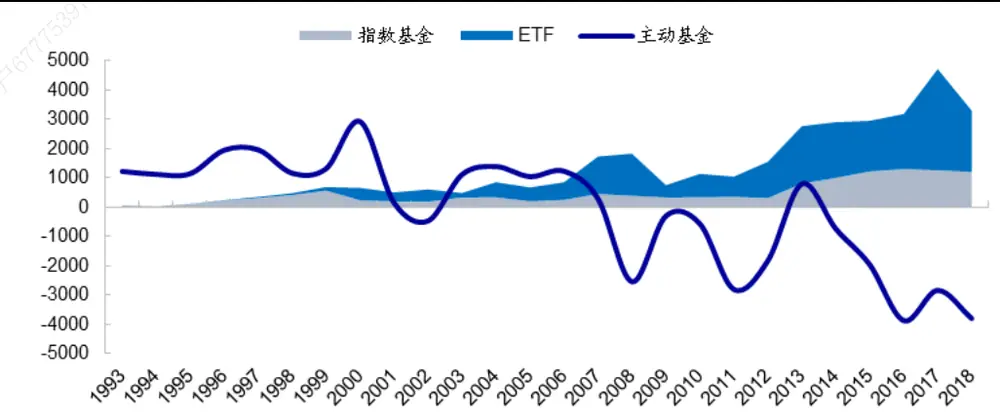
资料来源：ICI，海通证券研究所

## 1.5 小结

总结来看，美国被动产品主要包括指数共同基金和指数 ETF 两种类型。美国投资者对被动产品的需求逐年攀升，而对主动型基金的需求逐年降低。特别是近 10余年，被动产品的规模迅速扩张，从2008年底的1.1万亿美元增长至2018年底的6.6万亿美元。同时，在基金总资产净值中的占比也迅速攀升至 36%。

## 2. 美国被动产品规模扩张期，alpha策略的表现

过去十年无疑是被动产品的黄金十年，但对美股的常用因子和美国的对冲基金而言，又是“失去的十年”。2009 年以来，在资金持续净流入被动产品、净流出主动产品的背景下，因子和对冲基金的表现均不理想。

首先，如以下两图所示，彭博的纯因子组合全收益指数12009 年以来的表现均出现明显下滑。例如，价值纯因子组合全收益指数在 2014 年以前稳步上升，2014 年下半年开始出现回撤，收益转而为负，并持续至今。小市值纯因子组合全收益指数虽然并未产生明显回撤，但 2011 年以来的收益也接近于 0。

图14 纯因子组合全收益指数（Value & Size，美国）
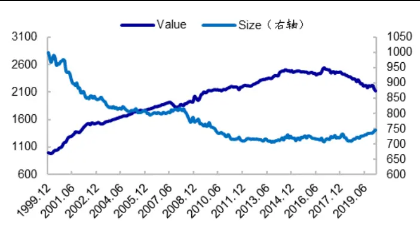
资料来源：Bloomberg，海通证券研究所

图15 纯 因 子 组 合 全 收 益 指数 （Momentum， Volatility，Profitability，美国）
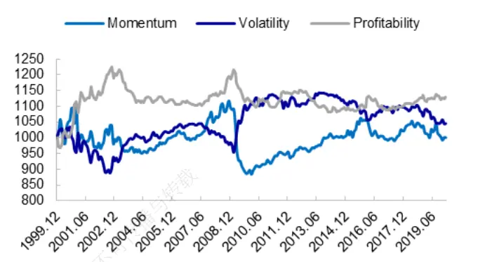
资料来源：Bloomberg，海通证券研究所

同样以 2008 年底为分界点，计算常用因子在此之前和之后的年化收益可发现，2009年以来，所有纯因子组合全收益指数的年化收益和风险调整后收益均大幅下降。

图16 不同时期纯因子组合全收益指数的年化收益（美国）
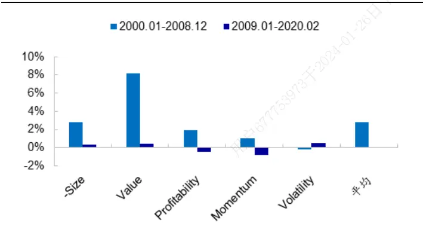
资料来源：Bloomberg，海通证券研究所

图17 不同时期纯因子组合全收益指数的信息比（美国）
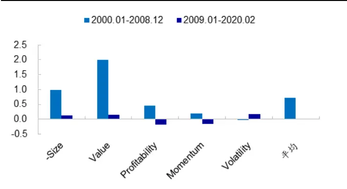
资料来源：Bloomberg，海通证券研究所

其次，对冲基金的收益表现自 2009 年以来，也出现明显下滑。以 Credit Suisse 的股票市场中性策略和股票多空策略为例（图 18-19），2009 年以前，股票市场中性策略收益平稳上升，1994-2008 年的年化收益为 9.33%，信息比为 3.10。2009 年至 2020年 1 月，年化收益大幅下降，仅为 1.49%，信息比降至 0.32。股票多空策略也呈现类似特征，年化收益由 1994-2008 年的 9.72%降至 6.25%。

图18 瑞信股票市场中性指数
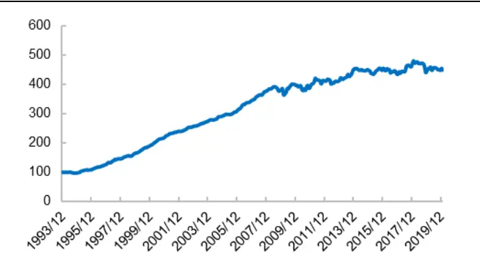
资料来源：Credit Suisse，海通证券研究所

图19 瑞信股票多空指数
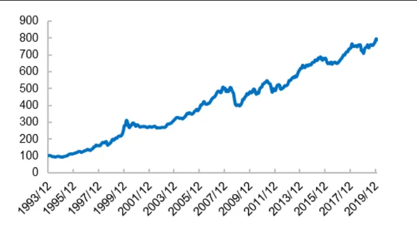
资料来源：Credit Suisse，海通证券研究所

图20 不同时期对冲基金的年化收益（美国）
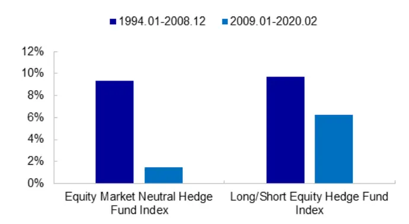
资料来源：Credit Suisse，海通证券研究所

图21 不同时期对冲基金的信息比（美国）
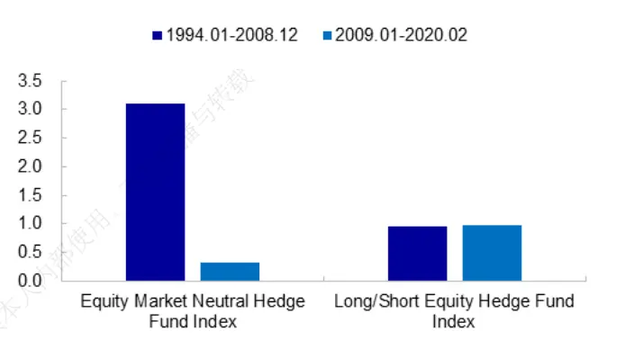
资料来源：Credit Suisse，海通证券研究所

总结来看，随着被动产品规模的持续扩张，美国 alpha 策略的收益也发生了显著变化。无论是常用因子，还是以对冲基金指数反映的 alpha 策略收益，2008 年以后均出现

## 3. 中国被动产品发展情况及同期 alpha 策略的表现

为便于表述和分析，本文将 A股市场的复制股票指数型基金、增强股票指数型基金、股票 ETF归为被动产品；将主动股票开放型、强股混合型、偏股混合型基金归为主动产品；将被动产品和主动产品合并称为偏股类基金。

## 3.1被动产品发展情况

以下两图分别统计了我国被动产品规模和份额的变动。从中可见，自 2014 年下半年以来，我国被动产品的规模出现了非常明显的增长。从 2014 年中报的 2742 亿元增加至 2019 年底的 8368 亿元，规模扩张 2倍有余，在偏股类基金中的占比也从 22%提升至 39%。与此同时，被动产品的份额也经历了相似的变化。

图22 被动产品规模及其占比（中国）
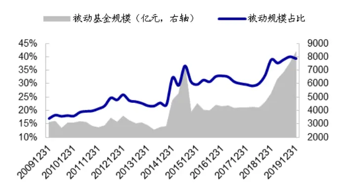
资料来源：Wind，海通证券研究所

图23 被动产品总份额及其占比（中国）
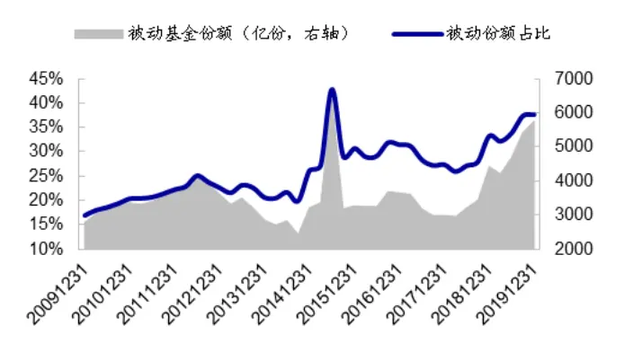
资料来源：Wind，海通证券研究所

但与美国被动产品 年后持续稳定的增长不同，我国被动产品呈短期急剧膨胀的特征。过去十年的大部分时段上，被动产品的规模无明显变化。例如，2010 年至 2014年上半年，被动产品规模稳定在 3000 亿元左右；2015 年下半年至 2018 年上半年，规模稳定在 4200 亿元左右。但在如下两个阶段：2014 年至 2015 年上半年、2018 年下半年至今，被动产品规模快速扩张。

2014 年下半年至 2015 年上半年，被动产品规模由 2742 亿元迅速增加至 7394 亿元，增幅达到 1.7 倍，在偏股类产品中的规模占比也由 23%增加至 37%。在此期间，被动产品的份额增加 3552 亿份，而主动产品份额则减少了 1722 亿份，投资者的需求呈现明显的从主动产品向被动产品转移的特征。

2018 年下半年至 2019 年底，被动基金规模由 4202 亿元增加至 8368 亿元，增幅将近 倍，在偏股类产品中的规模占比也由 增加至 。在此期间，被动产品的份额增加 2542 亿份，而主动产品份额仅增加 911 亿份。显然，投资者对被动产品需求远大于主动产品。

## 3.2不同时期，alpha 策略的表现

根据被动产品规模变化特征可将 2010 年以来的样本划分为 4个时段：2010.01-2014.06（区间 1）、2014.07-2015.06（区间 2）、2015.07-2018.06（区间 3）、2018.07-2019.12（区间 4）。区间 1 和 3 为稳定期，被动产品规模无明显变化；区间 2和 4为扩张期，被动产品规模迅速增长。

下表统计了每一时段内 alpha 策略（alpha 因子和增强基金）的收益风险特征。其中，因子表现用 7个常用因子（市值、估值、反转、换手率、波动率、ROE、SUE）的平均多空收益反映。多空收益的计算方法为因子得分最高的 10%个股市值加权收益与因子得分最低的 10%个股市值加权收益之差，月度再平衡。指数增强基金的表现用 300 增强和 500 增强的超额收益反映，因为跟踪这两个指数的增强基金数量最多。不同基金的超额收益按基金规模加权，月度再平衡。

表 1 不同时期国内 alpha 策略的表现（2010.01-2019.12）

| 时间区间 | 因子平均收益 |  |  | 300 增强基金超额收益 |  |  | 500增强基金超额收益 |  |  |
| --- | --- | --- | --- | --- | --- | --- | --- | --- | --- |
|  | 年化收益 | 年化波动 | 信息比 | 年化收益 | 年化波动 | 信息比 | 年化收益 | 年化波动 | 信息比 |
| 区间1:2010.01-2014.06 | 19.08% | 6.91% | 2.56 | 2.86% | 2.00% | 1.42 |  |  |  |
| 区间 2:2014.07-2015.06 | 11.63% | 10.90% | 1.06 | 0.86% | 2.59% | 0.35 | -2.43% | 3.88% | -0.61 |
| 区间3:2015.07-2018.06 | 25.72% | 6.31% | 3.66 | 6.86% | 2.00% | 3.33 | 9.77% | 2.98% | 3.14 |
| 区间4:2018.07-2019.12 | 8.97% | 7.63% | 1.16 | 1.97% | 2.35% | 0.84 | 1.95% | 3.08% | 0.64 |
| 稳定期 | 21.71% | 6.68% | 2.98 | 4.45% | 2.00% | 2.19 | 9.77% | 2.98% | 3.14 |
| 扩张期 | 10.03% | 9.07% | 1.10 | 1.53% | 2.44% | 0.63 | 0.18% | 3.42% | 0.07 |

资料来源： ，海通证券研究所
注：信息比的计算方法是 sqrt(250)*日均收益/日收益波动率。

由上表可见，在被动产品规模的扩张期（2014.07-2015.06、2018.07- 2019.12），无论是因子表现还是指数增强基金的超额收益，都明显低于被动产品规模的稳定期（2010.01- 2014.06、2015.07-2018.06）。区间 1 和 3 内，指数增强基金的信息比均在2 以上。而区间 2和 4 内，指数增强基金的信息比低于 1。

进一步，分别将被动产品规模稳定期和扩张期内，沪深 增强基金的业绩拼接（见以下两图）。在规模扩张期内，增强基金累计超额收益的波动和回撤显著高于稳定期。

图24 稳定期沪深 300增强基金累计超额收益
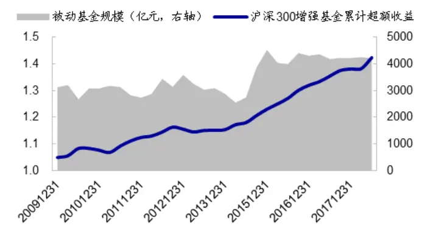
资料来源：Wind，海通证券研究所

图25 扩张期沪深 300增强基金累计超额收益
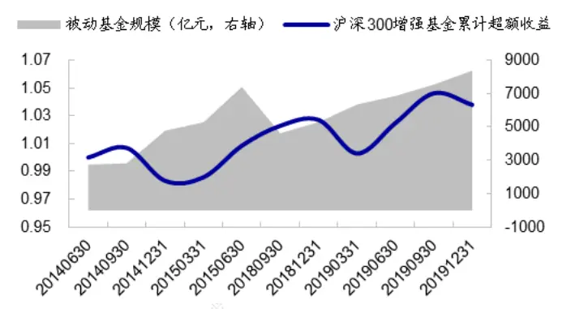
资料来源：Wind，海通证券研究所

## 3.3 小结

我国被动产品发展历史较短，规模也尚未形成持续稳定增长的趋势。但在被动产品规模急剧增长的 2 个时段内，无论是以因子收益还是以增强基金代表的 alpha 策略，收益表现均明显低于被动产品规模稳定的时期。

## 4. 被动产品规模扩张影响 alpha策略表现的两种形式

从上文的结果来看，无论是美国市场还是中国市场，被动产品的规模扩张似乎都伴随着 alpha 策略的表现下滑。那么，造成这种现象的原因又是什么，本文尝试从资金流向的角度进行分析。

## 资金不断流入催生的美股十年牛市，对经典的因子定价模型形成了挑战

2009 年以来，流入市场的资金由主动基金转向被动基金，其中又以宽基指数为主。而在宽基指数中，市值大、估值高的股票通常也有更高的权重。因此，资金实际上流向了市值大、估值高的宽基成分股，推升了它们的涨幅。这恰好与 Fama-French 三因素模型中的两个经典因子——SMB和 HML 相反，在一定程度上削弱了 alpha 策略的表现。

下图展示了不同年份标普 500 基金的资金净流入情况，以及 SMB和 HML 的累计净值2。其中，标普 500 基金包括跟踪标普 500 指数的共同基金和 ETF3。

图26 标普 500基金资金净流入与 SMB、HML累计净值
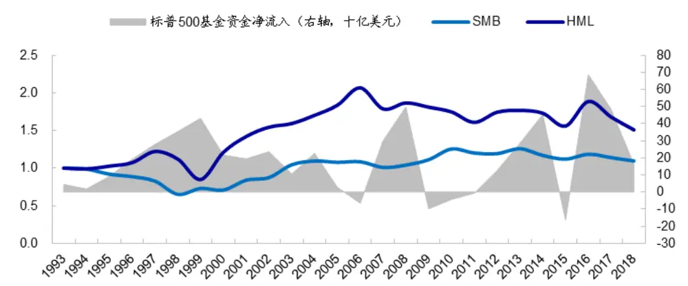
资料来源：Kenneth R. French Data Library，ICI，Lipper，海通证券研究所

1993 年至 2018 年间，在资金净流入偏高的 1/3 年份中，SMB和 HML 的平均年收益分别为-2.15%和-2.06%。而在其他年份，SMB 和 HML 的平均收益为 2.52%和 5.75%，两者差异显著。此外，在资金净流入偏高的 1/3 年份中，SMB和 HML 的波动率也更高。

图27 不同年份 SMB 和 HML 的平均收益率（1993-2018）
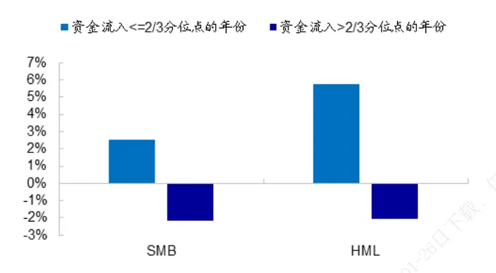
资料来源：Kenneth R. French Data Library，海通证券研究所

图28 不同年份 SMB 和 HML 的平均年波动率（1993-2018）
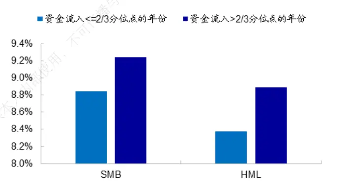
资料来源：Kenneth R. French Data Library，海通证券研究所

## 39 A股市场不断涌现的各种热点，使因子表现出和之前不一样的规律

不同于美国市场，我国被动产品的规模扩张主要源于各类主题基金。下表统计了2015Q1- 2015Q2、2018Q2-2019Q4 期间，份额增长最多的前十大标的指数。

表 2 2015Q1-2015Q2、2018Q2-2019Q4 份额增长最多的前十大标的指数

| 跟踪指数 | 2015Q2 份额 (亿份) | 2015Q1 份额 (亿份) | 份额增长(亿份) | 跟踪指数 | 2019Q4 份额 (亿份) | 2018Q2 份额 (亿份) | 份额增长(亿份) |
| --- | --- | --- | --- | --- | --- | --- | --- |
| 国企改革 | 897.48 | 454.76 | 442.72 | 沪深 300 | 665.54 | 104.07 | 561.47 |
| 工业4.0 | 406.16 | -- | 406.16 | 央企创新 | 411.10 |  | 411.10 |
| 中证军工 | 302.89 | -- | 302.89 | 结构调整 | 521.78 | 136.82 | 384.96 |
| 中证银行 | 339.35 | 133.58 | 205.77 | 中证500 | 343.26 | -- | 343.26 |
| 一带一路 | 202.49 | -- | 202.49 | 国企一带一路 | 193.37 | -- | 193.37 |
| 军工指数 | 337.34 | 151.53 | 185.81 | 证券公司 | 179.03 | 5.00 | 174.03 |
| 证券公司 | 76.99 |  | 76.99 | 5G通信 | 232.17 | 95.32 | 136.85 |
| 创业板指 | 309.95 | 233.37 | 76.59 | 上证50 | 177.80 | 41.23 | 136.58 |
| 中证国防 | 108.64 | 44.00 | 64.64 | 中证白酒 | 126.79 | 12.52 | 114.27 |
| CSWD 并购 | 60.44 | -- | 60.44 | 军工龙头 | 112.36 | -- | 112.36 |

资料来源：Wind，海通证券研究所

在 2018Q2 至 2019Q4 期间，份额增长最快的前十大指数对应的基金，共增加 2024亿份，占全市场份额增长总数的 80%。其中，跟踪宽基指数（沪深 300、中证 500、上证 50）的基金，增长的份额仅占 28.5%；跟踪主题指数的基金，增长的份额占比 51.1%。

同样地，在 2015Q1 至 2015Q2 期间，份额增长最快的前十大标的指数中，仅有一只为宽基指数——创业板指。而跟踪主题指数的基金，增长的份额占总数的比例高达80%。由此可见，在我国被动产品扩张的阶段，资金主要流入主题型的被动产品。

主题型产品的增长，往往伴随着某一个或某几个市场热点，如，5G、新能源汽车等。这部分股票的市场关注度高，交易活跃。在市场情绪的带动下，容易形成强者恒强的特征，削弱 A股市场长期存在的反转效应。

如下图所示，以具备鲜明反转特征的累计涨幅（反转）和换手率因子为例，在基金份额大幅扩张的 2014.07-2015.06、2018.07-2019.12 期间，它们的收益率显著低于份额较为稳定的 2010.01-2014.06、2015.07- 2018.06 期间。

图29 不同区间 A股市场常用因子的年化收益
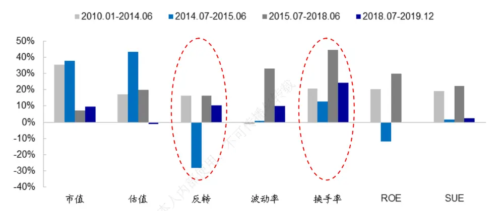
资料来源：Wind，海通证券研究所

不过，在主题基金份额扩张的阶段，市值和估值因子的表现并不一定会变差。这可能是因为，属于不同主题的股票在市值和估值上的特征差异较大，投资者在追逐不同热点的过程中，并不容易形成固定的大盘/小盘或价值/成长风格。

此外，如果投资者认可某一主题，那就有可能不再重视个股的基本面，从而造成盈利和增长因子的表现也明显不如被动产品规模稳定阶段。

因此，如果我国的被动产品继续 2018 年下半年以来的增长特征和趋势，那么想要提升 alpha 策略的表现，不妨考虑减少反转类因子的使用率或权重。

## 5. 全文总结

本文主要探讨了被动产品规模增长与 alpha 策略表现之间的关系。

美国被动产品主要包括指数共同基金和指数 两种类型。美国投资者对被动产品的需求逐年攀升，而对主动型基金的需求逐年降低。特别是近 10 余年，被动产品的规模迅速扩张，从 2008 年底的 1.1 万亿美元增长至 2018 年底的 6.6 万亿美元。同时，在基金总资产净值中的占比也迅速攀升至 36%。

过去十年无疑是被动产品的黄金十年，但对美股的常用因子和美国的对冲基金而言，又是“失去的十年”。2009 年以来，在资金持续净流入被动产品、净流出主动产品的背景下，因子和对冲基金的表现均不理想。首先，彭博的纯因子组合全收益指数 2009 年以来的表现均出现明显下滑。其次，对冲基金的收益表现自 2009 年以来，也出现明显下滑。

我国被动产品的增长呈短期急剧扩张的特征，在扩张期内，alpha 策略的整体表现不佳。过去的十多年间，被动产品的份额在大部分时段上都保持相对稳定。规模扩张主要出现在两个时段，2014Q3 至 2015Q2、2018Q3 至 2019Q4。与此同时，以因子多空收益、指数增强基金超额收益为代表的 alpha 策略表现不佳。

中美都存在被动产品规模扩张阶段，alpha 策略表现不佳的现象，但两者的成因可能有所不同。资金不断流入催生的美股十年牛市，对经典的因子定价模型形成了挑战。A股市场层出不穷的各种热点，则在一定程度上改变了投资者的行为，使得因子表现出和之前不一样的规律。

2008 年后，流入美国市场的资金由主动基金转向被动基金，其中又以宽基指数为主。而在宽基指数中，市值大、估值高的股票通常也有更高的权重。因此，资金实际上流向了市值大、估值高的宽基成分股，推升了它们的涨幅。这恰好与 Fama-French 三因素模型中的两个经典因子——SMB和 HML 相反，在一定程度上削弱了 alpha 策略的表现。

A股市场被动产品的增长很大一部分源于主题类基金，即，被动产品份额增加通常意味着投资者对主题热点的切换与追捧。在这种市场环境下，投资者在买入时通常较少考虑个股的前期表现，反转效应的有效性降低。在基金份额大幅增长时期，反转、换手率等常用的反转型因子，选股有效性都明显不及份额相对稳定的阶段。

## 6. 风险提示

模型误设风险，统计规律失效风险。

## 信息披露分析师声明

[Table冯佳睿yst金融工程研究团队s]

罗蕾金融工程研究团队

本人具有中国证券业协会授予的证券投资咨询执业资格，以勤勉的职业态度，独立、客观地出具本报告。本报告所采用的数据和信息均来自市场公开信息，本人不保证该等信息的准确性或完整性。分析逻辑基于作者的职业理解，清晰准确地反映了作者的研究观点，结论不受任何第三方的授意或影响，特此声明。

## 法律声明

本报告仅供海通证券股份有限公司（以下简称 本公司 ）的客户使用。本公司不会因接收人收到本报告而视其为客户。在任何情况下，本报告中的信息或所表述的意见并不构成对任何人的投资建议。在任何情况下，本公司不对任何人因使用本报告中的任何内容所引致的任何损失负任何责任。

本报告所载的资料、意见及推测仅反映本公司于发布本报告当日的判断，本报告所指的证券或投资标的的价格、价值及投资收入可能会波动。在不同时期，本公司可发出与本报告所载资料、意见及推测不一致的报告。载

市场有风险，投资需谨慎。本报告所载的信息、材料及结论只提供特定客户作参考，不构成投资建议，也没有考虑到个别客户特殊的与投资目标、财务状况或需要。客户应考虑本报告中的任何意见或建议是否符合其特定状况。在法律许可的情况下，海通证券及其所属传关联机构可能会持有报告中提到的公司所发行的证券并进行交易，还可能为这些公司提供投资银行服务或其他服务。不

本报告仅向特定客户传送，未经海通证券研究所书面授权，本研究报告的任何部分均不得以任何方式制作任何形式的拷贝、复印件或复制品，或再次分发给任何其他人，或以任何侵犯本公司版权的其他方式使用。所有本报告中使用的商标、服务标记及标记均为本公司的商标、服务标记及标记。如欲引用或转载本文内容，务必联络海通证券研究所并获得许可，并需注明出处为海通证券研究所，且人不得对本文进行有悖原意的引用和删改。

根据中国证监会核发的经营证券业务许可，海通证券股份有限公司的经营范围包括证券投资咨询业务。载，

## 海通证券股份有限公司研究所[Table_PeopleInfo]

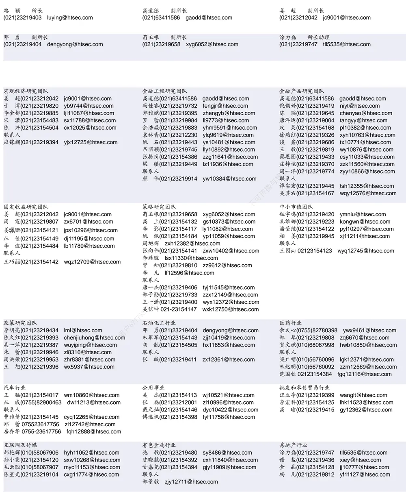

| 电子行业 |  | 煤炭行业 |  | 电力设备及新能源行业 |  |  |
| --- | --- | --- | --- | --- | --- | --- |
|  | 陈平(021)23219646 cp9808@htsec.com |  | 李 淼(010)58067998 Im10779@htsec.com |  | 张一弛(021)23219402 | zyc9637@htsec.com |
|  | 尹 苓(021)23154119 yl11569@htsec.com |  | 戴元灿(021)23154146 dyc10422@htsec.com |  | 房 青(021)23219692 | fangq@htsec.com |
|  | 谢 磊(021)23212214 xl10881@htsec.com |  | 吴 杰(021)23154113 wj10521@htsec.com |  | 曾 彪(021)23154148 zb10242@htsec.com |  |
|  | 蒋 俊(021)23154170 jj11200@htsec.com |  | 联系人 |  | 徐柏乔(021)23219171 xbq6583@htsec.com |  |
| 联系人 |  |  | 王 涛(021)23219760 wt12363@htsec.com |  |  | 陈佳彬(021)23154513 cjb11782@htsec.com |

| 基础化工行业 | 计算机行业 | 通信行业 |  |
| --- | --- | --- | --- |
| 刘 威(0755)82764281 Iw10053@htsec.com | 郑宏达(021)23219392 zhd10834@htsec.com | 朱劲松(010)50949926 zjs10213@htsec.com |  |
| 刘海荣(021)23154130 Ihr10342@htsec.com | 杨 林(021)23154174 yl11036@htsec.com | 余伟民(010)50949926 ywm11574@htsec.com |  |
| 张翠翠(021)23214397 zcc11726@htsec.com | 于成龙 ycl12224@htsec.com | 张峥青(021)23219383 zzq11650@htsec.com |  |
| 孙维容(021)23219431 swr12178@htsec.com | 黄竞晶(021)23154131 hjj10361@htsec.com | 张 弋01050949962 zy12258@htsec.com |  |
| 李 智(021)23219392 Iz11785@htsec.com | 洪 琳(021)23154137 hl11570@htsec.com | 联系人 | 杨彤昕 010-56760095 ytx12741@htsec.com |

| 非银行金融行业 |  | 交通运输行业 |  |  | 纺织服装行业 |  |  |
| --- | --- | --- | --- | --- | --- | --- | --- |
|  | 孙 婷(010)50949926 st9998@htsec.com |  |  | 虞 楠(021)23219382 yun@htsec.com |  |  | 梁 希(021)23219407 lx11040@htsec.com |
|  | 何 婷(021)23219634 ht10515@htsec.com |  | 罗月江（010）56760091 lyj12399@htsec.com |  |  | 盛 开(021)23154510 sk11787@htsec.com |  |
|  | 李芳洲(021)23154127 Ifz11585@htsec.com |  |  | 李 轩(021)23154652 lx12671@htsec.com | 联系人 |  |  |
| 联系人 |  |  | 李 丹(021)23154401 Id11766@htsec.com |  |  | 刘 溢(021)23219748 ly12337@htsec.com |  |

| 建筑建材行业 | 机械行业 | 钢铁行业 |
| --- | --- | --- |
| 冯晨阳(021)23212081 fcy10886@htsec.com | 余炜超(021)23219816 swc11480@htsec.com | 刘彦奇(021)23219391 liuyq@htsec.com |
| 潘莹练(021)23154122 pyl10297@htsec.com | 耿 耘(021)23219814 gy10234@htsec.com | 周慧琳(021)23154399 zhl11756@htsec.com |
| 申 浩(021)23154114 sh12219@htsec.com | 杨 震(021)23154124 yz10334@htsec.com |  |
| 杜市伟(0755)82945368 dsw11227@htsec.com | 周 丹 zd12213@htsec.com | 传播与转载 |
| 颜慧菁 yhj12866@htsec.com | 联系人 吉 晟(021)23154653 js12801@htsec.com |  |

| 建筑工程行业 |  | 农林牧渔行业 | 食品饮料行业 |
| --- | --- | --- | --- |
| 张欣劼 zxj12156@htsec.com |  | 丁 频(021)23219405 dingpin@htsec.com | 闻宏伟(010)58067941 whw9587@htsec.com |
| 李富华(021)23154134 Ifh12225@htsec.com |  | 陈 阳(021)23212041 cy10867@htsec.com | 唐 宇(021)23219389 ty11049@htsec.com |
| 杜市伟(0755)82945368 dsw11227@htsec.com | 联系人 | 孟亚琦(021)23154396 myq12354@htsec.com | 颜慧菁 yhj12866@htsec.com 联系人 |
|  |  |  | 程碧升(021)23154171 cbs10969@htsec.com |

| 军工行业 | 银行行业 | 社会服务行业 |  |
| --- | --- | --- | --- |
| 张恒晅 zhx10170@htsec.com | 孙 婷(010)50949926 st9998@htsec.com | 汪立亭(021)23219399 wanglt@htsec.com |  |
| 联系人 | 解巍巍 xww12276@htsec.com |  | 陈扬扬(021)23219671 cyy10636@htsec.com |
|  | 林加力(021)23154395 ljl12245@htsec.com |  | 许樱之 xyz11630@htsec.com |
| 张宇轩(021)23154172 zyx11631@htsec.com | 谭敏沂(0755)82900489 tmy10908@htsec.com |  |  |

| 家电行业 |  | 造纸轻工行业 |  |
| --- | --- | --- | --- |
| 陈子仪(021)23219244 | chenzy@htsec.com |  | 衣桢永(021)23212208 yzy12003@htsec.com |
| 李 阳(021)23154382 | ly11194@htsec.com |  |  |
| 朱默辰(021)23154383 | zmc11316@htsec.com |  |  |
| 刘 璐(021)23214390 | II11838@htsec.com |  |  |

## 研究所销售团队

深广地区销售团队

蔡铁清(0755)82775962 ctq5979@htsec.com

伏财勇(0755)23607963 fcy7498@htsec.com

辜丽娟(0755)83253022 gulj@htsec.com

刘晶晶(0755)83255933 liujj4900@htsec.com

饶 伟(0755)82775282 rw10588@htsec.com

欧阳梦楚(0755)23617160

oymc11039@htsec.com

巩柏含 gbh11537@htsec.com

上海地区销售团队
胡雪梅(021)23219385 huxm@htsec.com
朱 健(021)23219592 zhuj@htsec.com
季唯佳(021)23219384 jiwj@htsec.com
黄 毓(021)23219410 huangyu@htsec.com
漆冠男(021)23219281 qgn10768@htsec.com
胡宇欣(021)23154192 hyx10493@htsec.com
黄 诚(021)23219397 hc10482@htsec.com
毛文英(021)23219373 mwy10474@htsec.com
马晓男 mxn11376@htsec.com
杨祎昕(021)23212268 yyx10310@htsec.com
张思宇 zsy11797@htsec.com
王朝领 wcl11854@htsec.com
邵亚杰 23214650 syj12493@htsec.com
李 寅 021-23219691 ly12488@htsec.com北京地区销售团队
殷怡琦(010)58067988 yyq9989@htsec.com郭 楠 010-5806 7936 gn12384@htsec.com张丽萱(010)58067931 zlx11191@htsec.com杨羽莎(010)58067977 yys10962@htsec.com何 嘉(010)58067929 hj12311@htsec.com李 婕 lj12330@htsec.com
欧阳亚群 oyyq12331@htsec.com
郭金垚(010)58067851 gjy12727@htsec.com

海通证券股份有限公司研究所

地址：上海市黄浦区广东路 689号海通证券大厦 9楼

电话：（021）23219000

传真：（021）23219392

网址：www.htsec.com