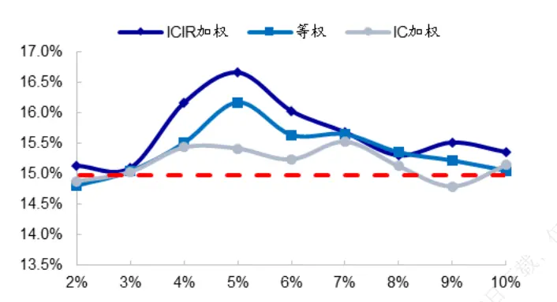
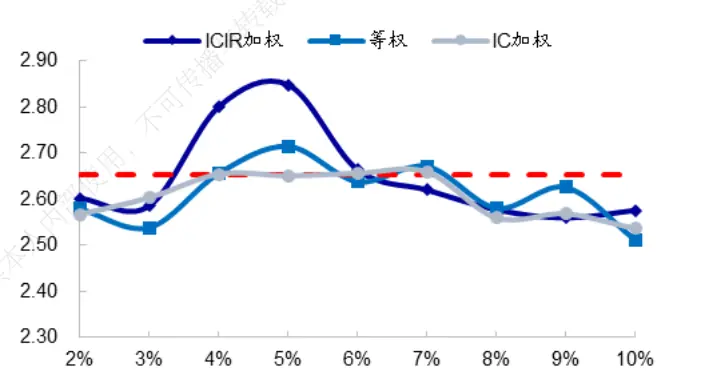
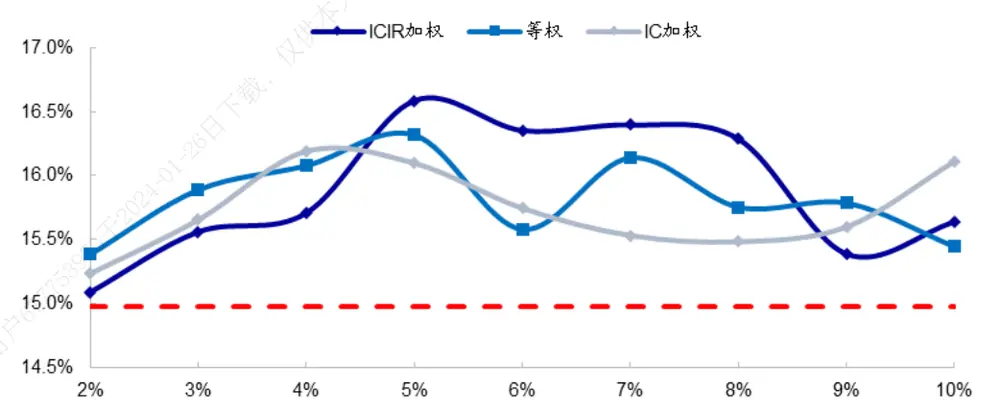
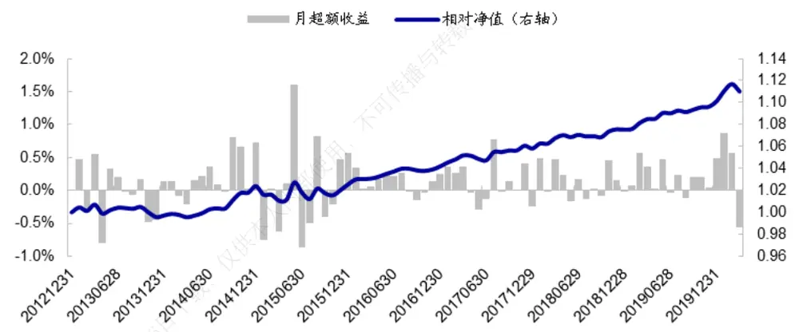
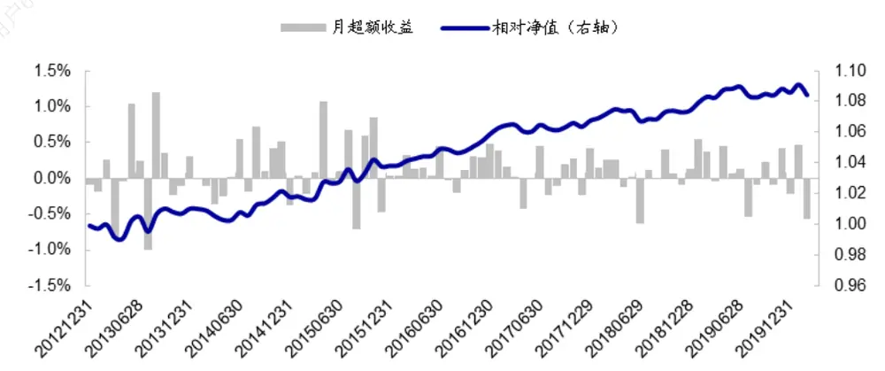
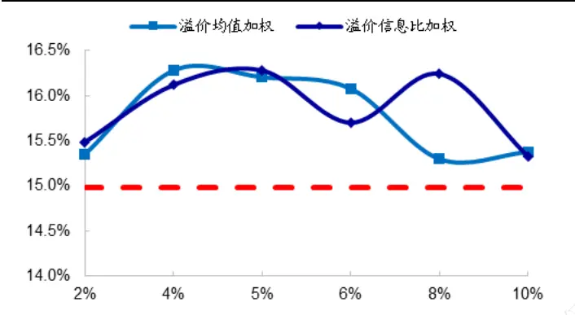
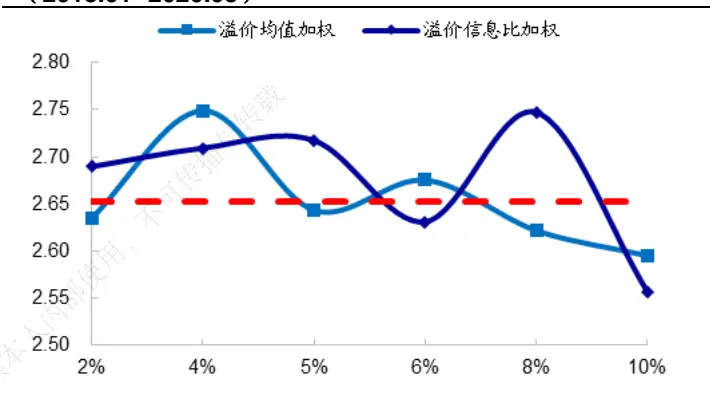
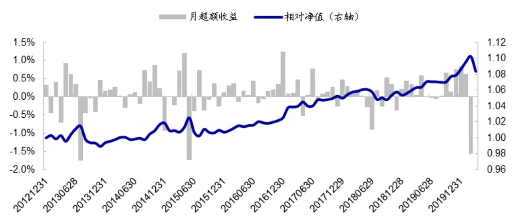
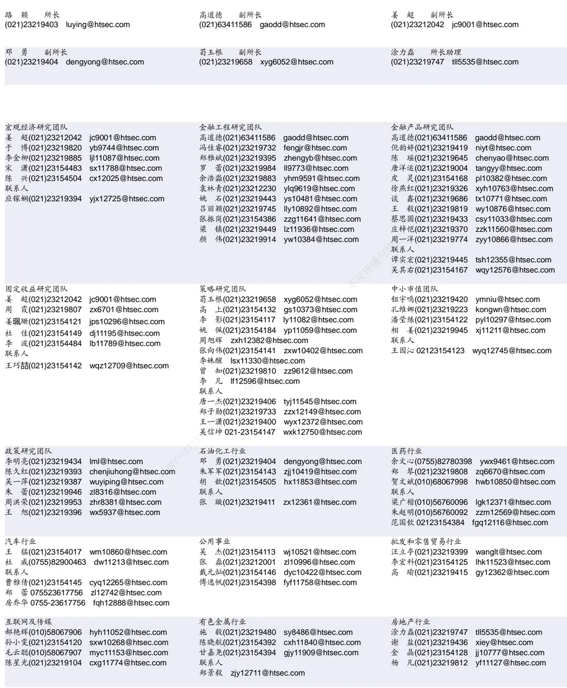

## [Tab相关研究

Table_ReportInfo]《低估值、高分红、低波动——上证 180指数及华安上证 180ETF投资价值分析》2020.04.10

《FICC系列研究之十四——黄金市场概况及多维度择时策略》2020.04.06

《选股因子系列研究（六十二）——被动产品的规模扩张对 策略的影响分析：从美国到中国的证据》2020.04.06

分析师:冯佳睿

Tel:(021)23219732

Email:fengjr@htsec.com

证书:S0850512080006

分析师:罗蕾

Tel:(021)23219984

Email:ll9773@htsec.com

证书:S0850516080002

# 选股因子系列研究（六十三）—剔除高频多因子空头组合后的沪深 300指数增强策略

## 投资要点：

本文主要对剔除高频多因子空头组合后的沪深 300 指数增强策略进行回测分析。

- 构建高频多因子空头组合的方法。从因子复合与组合复合两种角度出发，本文共探讨了 3 种构建高频多因子空头组合的方法：因子复合-zscore 加总、因子复合-回归模型、以及单因子空头组合复合。相对应的剔除样本空间中多因子空头组合的方法分别称之为： 复合剔除、回归复合剔除以及组合复合剔除。

- 高频因子的形式。由于高频因子正交风格和行业后，空头效应更为稳定，因此在构建高频多因子空头组合时更建议采用正交因子形式。此外，为更好地反映高频因子在成分股以外的空头效应，建议将构建复合因子的样本范围限制在标的指数成分股以外的股票中。

复合剔除，即采用 加总的方式构建复合高频因子，然后剔除复合因子的空头组合。该方法简单直接，在绝大部分情况下均优于单因子剔除策略。在等权加权、 加权、 加权三种方式中，等权加权、 加权方式表现相对较优。此外，可对高频因子做初步筛选，以降低策略对空头阈值的敏感性。

- 回归复合剔除，即以回归的方式利用高频因子预测个股收益，然后剔除预期收益最低的股票。该方法对选用的高频因子较为敏感，在构建回归模型前，须先筛选因子，以减小因子相关性对回归造成的不利影响。筛选因子后的回归复合剔除方法，可明显提升沪深 300 增强策略的超额收益，且收益提升幅度优于单因子剔除策略。

- 组合复合剔除，即基于单个高频因子构建单因子空头组合，然后将多个高频因子的空头组合复合起来构建多因子空头组合并剔除。该方法对剔除个股比例的控制较为间接：须同时调节空头阈值和从属空头组合的因子个数 。当剔除个股比例在 4%-10%之间时，可明显提升沪深 300 增强策略的超额收益，且收益提升幅度普遍优于单因子剔除策略。

- 剔除高频多因子空头组合后，可提升沪深 300增强策略的超额收益表现。以 5%为空头阈值，zscore 复合剔除方法下（ICIR 加权），沪深 300 增强策略的年化超额可由 15%提升至 16.7%；回归复合剔除方法下，年化超额可提升至 16.3%；组合复合剔除方法下（M=2），年化超额可提升至 16.0%。

- 风险提示。模型误设风险，统计规律失效风险，流动性风险。

在前期报告《选股因子系列（六十）——如何利用高频因子的空头效应？》中我们发现，剔除样本空间中单个高频因子的空头个股可明显提升沪深 300 增强策略的超额收益表现。那么如果有多个高频因子，剔除高频多因子空头组合后，沪深 300 增强策略表现如何呢？本文将主要对该问题进行研究。

## 1. 构建高频多因子空头组合的方法梳理

高频因子空头效应较强，剔除全市场高频因子的空头个股，可显著提升样本空间的平均收益表现；因此通常也能够提升在此空间构建的沪深 300 增强策略超额收益。

如下表所示，将全市场高频因子得分最低的 个股剔除，剩余个股等权组合相对于全市场等权组合存在显著为正的超额收益，表明剔除高频因子空头个股可提升选股空间的平均收益表现。在平均收益表现较高的样本空间中构建的沪深 300 增强策略，其收益表现也大概率优于在全市场范围内构建的基准策略。

其中，“基准策略”（下同）是指，采用包含风格、低频技术因子、基本面因子、预期基本面因子和尾盘成交占比因子的回归模型预测个股收益，并进行线性优化得到的沪深 300 增强策略。策略选股范围为全 A，但成分股权重占比不低于 80%。

在考察的 7 个高频因子中，剔除平均单笔流出金额占比因子的空头组合后，对沪深300 增强策略超额收益的提升幅度最大，年化超额可由 15.0%提升至 15.9%；其次为下行波动占比因子和大单推动涨幅因子，年化超额也可提升至 15.8%以上。

表 1 剔除单个高频因子空头组合后的沪深 300增强策略超额收益（2013.01-2020.03）

| 因子 | 剔除个股等权组合超额收益 |  |  | 剩余个股等权组合超额收益 |  | 沪深 300增强策略超额收益表现 |  |  |  |
| --- | --- | --- | --- | --- | --- | --- | --- | --- | --- |
|  | 月均收益 | 月胜率 | 信息比 | 月均收益 月胜率 | 信息比 | 年化收益 | 波动率 | 信息比 | 月胜率 |
| 平均单笔流出金额占比 | -1.11% | 24.14% | -2.03 | 0.06% 75.86% | 2.02 | 15.95% | 5.68% | 2.68 | 81.61% |
| 量价相关性 | -2.06% | 11.49% | -2.49 | 0.11% 88.51% | 2.44 | 15.59% | 5.59% | 2.66 | 80.46% |
| 收盘前成交委托相关性 | -2.49% | 21.84% | -2.15 | 0.13% 78.16% | 2.14 | 14.76% | 5.55% | 2.55 | 80.46% |
| 下行波动占比 | -2.20% | 16.09% | -3.18 | 0.11% 83.91% | 3.15 | 15.86% | 5.77% | 2.63 | 80.46% |
| 改进反转 | -2.49% | 14.94% | -3.15 | 0.12% 85.06% | 3.15 | 15.47% | 5.66% | 2.61 | 79.31% |
| 大单推动涨幅 | -2.17% | 18.39% | -2.32 | 0.11% 81.61% | 2.30 | 15.84% | 5.69% | 2.66 | 80.46% |
| 高频偏度 | -1.85% | 16.09% | -3.30 | 0.09% 83.91% | 3.31 | 15.12% | 5.60% | 2.58 | 79.31% |
| 同时剔除7个因子的空头 | -1.51% | 9.20% | -3.17 | 0.41% 90.80% | 3.04 | 13.81% | 5.89% | 2.26 | 75.86% |
| 基准策略 |  |  |  |  |  | 14.98% | 5.41% | 2.65 | 81.61% |

资料来源：Wind，海通证券研究所
注：增强策略超额收益表现均为基于月收益数据计算得到的结果。

剔除单个高频因子的空头个股可提升沪深 300 增强策略的超额收益表现，但若同时剔除这些高频因子的空头个股，则有可能对增强策略超额收益产生负向影响。

如上表所示，若同时剔除表中 7 个高频因子的空头个股，则策略年化超额收益不升反降，由 15%下降至 13.8%。这可能是由于同时剔除多个高频因子的空头个股，将会导致剔除的个股数太多（21.9%），降低已存因子的稳定性，对模型预测能力产生不利影响（参见《选股因子系列研究（六十）——如何利用高频因子的空头效应？》）。

那么采用其他方法构建高频多因子空头组合并进行剔除，会对沪深 300 指数增强策略产生什么样的影响呢？本文将对该问题进行探讨。

常见的多因子组合构建方式主要有两种：多因子单组合（因子复合），以及单因子多组合（组合复合）。其中，前者是指先将单因子按照一定的方式加总获得复合因子，然后基于复合因子筛选个股；后者则是先根据单因子构建单因子组合，然后将多个单因子组合加总得到最终的多因子组合。

本文从这两种思路出发，主要考察如下 3种构建高频多因子空头组合的方法：

（1） 因子复合-zscore 加总。将多个高频因子的 zscore 按照等权或 IC 加权的方式加总为一个复合因子，然后筛选复合因子得分最低的股票构建高频多因子空头组合。

（2） 因子复合-回归模型。以回归的方式利用高频因子预测个股收益，然后筛选预期收益最低的股票构建高频多因子空头组合。

（3） 组合复合。基于单个高频因子构建空头组合，然后将多个高频因子的空头 组合复合（如取交集、取并集等）起来构建多因子空头组合。

下文将对剔除基于如上三种方法构建的高频多因子空头组合后，沪深 300 指数增强组合的超额收益表现进行回测分析。

## 2. 因子复合-zscore 加总

本节考察利用高频因子 zscore 复合因子剔除全样本中的空头个股（下简称 zscore复合剔除），对沪深 300 增强策略的影响。该方法主要包括如下几个步骤：

- 在全 A范围内，将高频因子进行横截面标准化，求取每个因子的 zscore；

- 将各个因子的 zscore 按照等权/IC加权/ICIR 加权的方式加总，构建复合因子；

- 将全市场复合因子得分最低的 5%个股定义为空头个股；

- 剔除沪深 300 指数成分股以外的空头个股，在剩余的股票集中构建增强策略。

按照上述步骤构建的沪深 300 增强策略，年化超额收益表现列于下表。

表 2 zscore 复合剔除后的沪深 300 增强策略超额收益（2013.01-2020.03）

|  | 样本空间月收益提升 |  |  |  | 沪深 300 增强策略超额收益 |  |  |  |  |
| --- | --- | --- | --- | --- | --- | --- | --- | --- | --- |
|  | 月均收益 | 月胜率 | 信息比 |  | 年化收益 | 波动率 信息比 | 最大回撤 | 收益回撤比 | 月胜率 |
| 基准策略 |  |  |  | 14.98% | 5.41% | 2.65 | 3.50% | 4.09 | 81.6% |
| 等权加总 | 0.15% | 89.66% | 3.84 | 15.75% | 5.70% | 2.64 | 3.84% | 3.91 | 81.6% |
| IC 加权 | 0.16% | 88.51% | 3.40 | 15.67% | 5.71% | 2.62 | 4.34% | 3.45 | 81.6% |
| ICIR 加权 | 0.14% | 90.80% | 4.11 | 15.88% | 5.67% | 2.67 | 4.28% | 3.54 | 80.5% |

资料来源： ，海通证券研究所
注：样本空间月收益提升是指，剔除空头组合后的样本空间个股等权组合，相对于剔除前样本空间个股等权组合的月超额收益。

结果显示，剔除高频 zscore 复合因子的空头组合后，样本空间的平均收益表现显著提升。同时，在平均收益表现提升后的样本空间中构建沪深 300 增强策略，年化超额收益率优于基准策略；且相对于基准策略的收益提升幅度高于大部分的单因子剔除策略。在 3 种加权方式中，ICIR加权对收益的提升幅度最大，而 IC加权方式表现相对较差。

那么在构建复合因子的过程中，高频因子的形式、构建复合因子的股票范围等是否会对结果产生影响呢？下文将对这些细节进行测试分析。

## 2.1 高频因子的形式：原始因子还是正交因子

相较于原始因子，正交市值和行业后的高频因子空头收益更为稳定。如下表所示，绝大部分高频因子正交市值风格和行业后，空头效应均明显增强；且剔除空头组合后，剩余个股等权组合相对于全样本等权组合的月胜率、信息比也普遍优于原始因子。

表 3 原始高频因子和正交高频因子的空头收益（2013.01-2020.03）

|  | 空头组合超额收益 |  |  | 剩余个股等权组合超额收益 |  |  |  |  |
| --- | --- | --- | --- | --- | --- | --- | --- | --- |
|  | 原始因子 |  | 正交因子 |  | 原始因子 |  | 正交因子 |  |
| 因子 | 月均收益 | 信息比 | 月均收益 信息比 | 月均收益 | 月胜率 | 信息比 | 月均收益 月胜率 | 信息比 |
| 平均单笔流出金额占比 | -1.11% | -2.03 | -1.10% -2.04 | 0.06% | 75.86% | 2.02 | 0.06% 77.01% | 2.02 |
| 量价相关性 | -2.06% | -2.49 | -1.97% -4.29 | 0.11% | 88.51% | 2.44 | 0.10% 90.80% | 4.23 |
| 收盘前成交委托相关性 | -2.49% | -2.15 | -2.16% -3.02 | 0.13% | 78.16% | 2.14 | 0.10% 82.76% | 2.97 |
| 下行波动占比 | -2.20% | -3.18 | -2.20% -3.64 | 0.11% | 83.91% | 3.15 | 0.11% 86.21% | 3.66 |
| 改进反转 | -2.49% | -3.15 | -2.67% -4.03 | 0.12% | 85.06% | 3.15 | 0.13% 89.66% | 4.08 |
| 大单推动涨幅 | -2.17% | -2.32 | -2.10% -3.07 | 0.11% | 81.61% | 2.30 | 0.11% 86.21% | 3.05 |
| 高频偏度 | -1.85% | -3.30 | -1.75% -3.18 | 0.09% | 83.91% | 3.31 | 0.09% 86.21% | 3.18 |

资料来源：Wind，海通证券研究所

由于正交高频因子的稳定性更高，基于正交高频因子构建的多因子空头组合，表现也更为稳定。如下表所示，将全样本正交高频多因子空头组合剔除后，样本空间收益得到提升的月度占比增加至 93%，信息比也由 4.2 以下提升至 5.1 以上。

相应的，在剩余股票空间构建的沪深 300 增强策略超额收益也普遍更高。特别是对于 ICIR 加权方式，相较于原始因子，剔除采用正交因子构建的高频多因子空头组合后，增强策略的年化超额由 15.9%提升至 16.4%，信息比由 2.67 提升至 2.76。

表 4 高频因子的形式对增强策略的影响（2013.01-2020.03）

| 原始因子 |  |  |  |  |  |  |  |  |
| --- | --- | --- | --- | --- | --- | --- | --- | --- |
|  | 样本空间月收益提升 |  |  | 沪深 300 增强组合超额收益 |  |  |  |  |
|  | 月均收益 | 胜率 信息比 | 年化收益 | 波动率 | 信息比 | 最大回撤 | 收益回撤比 月胜率 |  |
| 等权加总 | 0.15% 89.66% | 3.84 | 15.75% | 5.70% | 2.64 | 3.84% | 3.91 | 81.6% |
| IC 加权 | 0.16% 88.51% | 3.40 | 15.67% | 5.71% | 2.62 | 4.34% | 3.45 | 81.6% |
| ICIR 加权 | 0.14% 90.80% | 4.11 | 15.88% | 5.67% | 2.67 | 4.28% | 3.54 | 80.5% |

正交因子

|  | 样本空间月收益提升 |  |  | 沪深 300 增强组合超额收益 |  |  |  |  |
| --- | --- | --- | --- | --- | --- | --- | --- | --- |
|  | 月均收益 | 胜率 | 信息比 | 年化收益 | 波动率 信息比 | 最大回撤 | 收益回撤比 | 月胜率 |
| 等权加总 | 0.15% | 93.10% | 5.14 | 15.96% | 5.64% 2.70 | 4.68% | 3.26 | 81.6% |
| IC 加权 | 0.15% | 93.10% | 5.10 | 15.12% | 5.56% 2.60 | 4.43% | 3.27 | 82.8% |
| ICIR 加权 | 0.14% | 93.10% | 5.16 | 16.37% 5.65% | 2.76 | 4.23% | 3.69 | 81.6% |

资料来源：Wind，海通证券研究所

总结来看，高频因子正交市值和行业后，空头效应更为稳定。利用正交高频因子构建多因子空头组合并进行剔除后，对沪深 300 增强策略超额收益的提升更为明显。

## 2.2 构建复合因子的股票范围：全市场还是成分股外

前文中，我们是在全市场范围内标准化高频因子、计算因子 ，并构建复合因子。而实际上，由于高频因子在沪深 300 指数成分股中的稳定性相对较低，同时为了避免对基准造成扭曲，我们在剔除时仅剔除了沪深 300 指数成分股以外的空头个股。即，我们利用的主要是高频因子在成分股以外的空头收益。因此，更为直接的做法是，只在标的指数成分股以外的股票集中构建复合因子，并剔除其中复合因子得分最低的 个股。按照这种方式得到的沪深 300增强策略超额收益如下表所示。

表 5 成分股外 zscore 复合剔除后的沪深 300 增强策略超额收益（2013.01-2020.03）

|  | 年化收益 | 波动率 | 信息比 | 最大回撤 | 收益回撤比 | 月胜率 |
| --- | --- | --- | --- | --- | --- | --- |
| 基准策略 | 14.98% | 5.41% | 2.65 | 3.50% | 4.09 | 81.6% |
| 等权加总 | 16.17% | 5.68% | 2.71 | 4.47% | 3.45 | 81.6% |
| IC 加权 | 15.42% | 5.56% | 2.65 | 4.75% | 3.10 | 82.8% |
| ICIR 加权 | 16.67% | 5.56% | 2.85 | 3.67% | 4.32 | 82.8% |

资料来源：Wind，海通证券研究所

结果显示，只在成分股以外的股票集中构建复合因子并剔除空头组合，对收益的提升更为明显。采用等权加总和 C 加权构建复合因子得到的增强策略，年化超额收益均高于 16%，优于所有的单因子剔除策略。因此为更好地反映高频因子在成分股以外的空头效应，在构建高频复合因子时，建议将样本范围限制在标的指数成分股以外的股票中。

## 2.3 敏感性分析

## 空头阈值敏感性

如下两图分别为不同空头个股定义阈值下，沪深 300 增强策略的年化超额收益和信息比。从中可见，与单因子事前剔除特征一致，在一定范围内增加阈值，即增加剔除的个股数，可提升策略收益；但超过一定范围继续增加阈值将会对策略产生负向影响。这主要是由于剔除的个股数太多，会降低已存因子选股效果的稳定性。通常而言，剔除的个股比例在 之间时，增强策略的超额收益提升幅度较大。

图1 不同阈值下，zscore 复合剔除后的沪深 300 增强策略年化超额（2013.01-2020.03）

资料来源：Wind，海通证券研究所

图 不同阈值下， 复合剔除后的沪深 增强策略信息比（2013.01- 2020.03）

资料来源：Wind，海通证券研究所

## 高频因子敏感性

上文回测的是，将所有（7 个）分钟级别高频因子加总构建复合因子得到的结果，那么不同的因子池是否会对结果造成影响呢？

我们分别筛选单因子剔除后，增强策略超额收益最高的2-6个高频因子，按照zscore加总的方式构建复合因子。剔除复合因子空头组合后，得到的沪深 300 增强策略超额收益表现列于下表。

表 6 不同数量高频因子 zscore复合剔除后，沪深 300增强策略超额收益表现（2013.01- 2020.03）

| 因子池 | zscore 加 权方式 | 样本空间月收益提升 |  |  | 沪深 300 增强策略超额收益 |  |  |  |  |  |
| --- | --- | --- | --- | --- | --- | --- | --- | --- | --- | --- |
|  |  | 月均收益 | 胜率 | 信息比 | 年化收益 | 波动率 | 信息比 | 最大回撤 | 收益回撤比 | 月胜率 |
| 2因子 | 等权加总 | 0.09% | 89.66% | 3.88 | 16.15% | 5.71% | 2.70 | 3.45% | 4.47 | 81.61% |
|  | IC 加权 | 0.10% | 89.66% | 4.30 | 15.99% | 5.70% | 2.67 | 3.41% | 4.48 | 82.76% |
|  | ICIR 加权 | 0.08% | 87.36% | 3.37 | 16.40% | 5.81% | 2.69 | 3.98% | 3.93 | 82.76% |
| 3因子 | 等权加总 | 0.10% | 87.36% | 3.92 | 16.00% | 5.59% | 2.73 | 4.05% | 3.77 | 82.76% |
|  | IC 加权 | 0.11% | 87.36% | 3.85 | 16.70% | 5.61% | 2.83 | 4.23% | 3.75 | 82.76% |
|  | ICIR 加权 | 0.10% | 87.36% | 3.81 | 16.40% | 5.68% | 2.75 | 4.09% | 3.82 | 82.76% |
| 4因子 | 等权加总 | 0.11% | 91.95% | 4.13 | 16.79% | 5.49% | 2.91 | 3.61% | 4.42 | 82.76% |
|  | IC 加权 | 0.11% | 91.95% | 4.03 | 16.54% | 5.53% | 2.84 | 3.69% | 4.27 | 81.61% |
|  | ICIR 加权 | 0.10% | 90.80% | 4.34 | 16.26% | 5.64% | 2.75 | 4.08% | 3.80 | 81.61% |
| 5因子 | 等权加总 | 0.11% | 90.80% | 4.52 | 16.32% | 5.56% | 2.79 | 3.70% | 4.19 | 83.91% |
|  | IC 加权 | 0.12% | 89.66% | 4.44 | 16.10% | 5.64% | 2.72 | 3.58% | 4.29 | 82.76% |
|  | ICIR 加权 | 0.11% | 91.95% | 4.56 | 16.59% | 5.56% | 2.84 | 3.68% | 4.29 | 82.76% |
| 6因子 | 等权加总 | 0.12% | 94.25% | 5.14 | 15.97% | 5.58% | 2.73 | 3.64% | 4.18 | 82.76% |
|  | IC 加权 | 0.12% | 90.80% | 4.93 | 16.16% | 5.56% | 2.77 | 3.55% | 4.34 | 80.46% |
|  | ICIR 加权 | 0.12% | 93.10% | 4.89 | 16.21% | 5.77% | 2.68 | 3.98% | 3.89 | 80.46% |

资料来源：Wind，海通证券研究所

从中可见，选择不同个数的因子构建复合因子并剔除空头个股，均可明显提升沪深300 增强策略的超额收益表现。选用 2-6 个高频因子复合的策略，年化超额基本都可提升至 16%以上，优于任一单因子剔除策略。表明 zscore 加总对高频因子的敏感性较低。

虽然 zscore 加总方法对高频因子的敏感性不高，但在复合前，对高频因子进行初步筛选，可降低策略对空头阈值的敏感性。

实际上，在 7个分钟高频因子中，剔除收盘前成交委托相关性的空头个股会降低增强策略超额收益（由 15.0%降至 14.8%）；而剔除高频偏度因子空头个股对超额收益的提升幅度非常有限（由 15.0%提升至 15.1%）。因此我们可以考虑将这两个边际效应低的高频因子剔除，只利用其余 5 个高频因子（平均单笔流出金额占比、量价相关性、下行波动占比、改进反转、大单推动涨幅）构建复合因子。

如下图所示，在 2%-10%的空头阈值范围内，只选用五因子进行 zscore 复合剔除后的沪深 300 增强策略，其年化超额收益均优于基准策略。对于 ICIR 加权方式，空头阈值在 5%-8%之间时，策略年化超额均可提升至 16%以上。由此可见，对因子做初步筛选后，有效的空头阈值范围会扩大，即策略对空头阈值的敏感性有所降低。

图3 五因子 zscore 复合剔除后的沪深 300 增强策略年化超额（2013.01-2020.03）

资料来源：Wind，海通证券研究所

## 2.4 小结

采用 zscore 加总构建复合高频因子，并基于复合因子剔除空头个股，可明显提升增强策略超额收益表现。在等权加权、 加权、 加权三种方式中，等权加权、加权方式表现相对较优。同时，由于正交风格和行业后的高频因子，空头效应更为稳定；基于正交因子构建的复合因子剔除效果优于基于原始因子得到的结果。此外，为更好地反映高频因子在成分股以外的空头效应，在构建高频复合因子时，建议将样本范围限制在标的指数成分股以外的股票中。

在沪深 指数成分股以外的股票集中，按照 方式加总 个正交高频因子，并剔除复合因子得分最低的 个股，得到的沪深 增强策略年化超额 ，相对于基准策略年化超额提升 ，同时信息比和收益回撤比均有所增加。分月度来看，加总剔除策略在 的月份均优于基准策略；分年度来看，除 年略微跑输基准外，其余年份均明显优于基准策略。

表 7 zscore 复合剔除后的沪深 300 增强策略分年度超额收益（2013.01-2020.03）

|  | zscore 复合剔除策略 |  |  | 基准策略 |
| --- | --- | --- | --- | --- |
|  | 收益率 | 最大回撤 信息比 | 月胜率 |  |
| 2013 | 24.29% | 2.97% 4.37 | 100.00% | 24.63% |
| 2014 | 13.54% | 2.41% 1.71 | 66.67% | 9.22% |
| 2015 | 23.03% | 3.67% 2.79 | 91.67% | 22.83% |
| 2016 | 12.00% | 1.92% 3.14 | 75.00% | 10.42% |
| 2017 | 20.51% | 1.86% 3.94 | 83.33% | 18.33% |
| 2018 | 12.33% | 3.17% 3.41 | 83.33% | 10.94% |
| 2019 | 16.99% | 2.15% 3.02 | 83.33% | 13.38% |
| 2020 | 5.93% | 2.46% 3.94 | 66.67% | 5.17% |
| 全样本 | 16.67% | 3.67% 2.85 | 82.76% | 14.98% |

资料来源：Wind，海通证券研究所

图4 zscore 复合剔除后的沪深 300 增强策略相对于基准策略的月超额（2013.01-2020.03）

资料来源：Wind，海通证券研究所

## 3. 因子复合-回归模型

因子除了可以直接 zscore 加总外，还可以采用回归模型复合。即每个月将个股收益对上月末因子值进行回归，回归系数（因子溢价）代表了因子收益。利用预估的因子收益乘以个股最新因子值，即可复合高频因子。同样地，由于正交高频因子的空头效应更为稳定，因此回归模型中我们也加入了市值和行业虚拟变量因子。

剔除回归模型下复合高频因子得分最低的 5%个股后（下简称回归复合剔除），在剩余股票集中构建的沪深 300 增强策略超额收益表现如下表所示。其中因子溢价采用两种方法估计，溢价均值和溢价信息比。

表 8 回归复合剔除后的沪深 300增强策略超额收益（2013.01-2020.03）

| 溢价估计方法 | 年化收益 | 波动率 | 信息比 | 最大回撤 | 收益回撤比 | 月胜率 |
| --- | --- | --- | --- | --- | --- | --- |
| 基准模型 | 14.98% | 5.41% | 2.65 | 3.50% | 4.09 | 81.6% |
| 溢价均值 | 15.12% | 5.63% | 2.57 | 4.52% | 3.21 | 80.5% |
| 溢价信息比 | 15.23% | 5.50% | 2.65 | 4.17% | 3.50 | 79.3% |

资料来源：Wind，海通证券研究所

采用回归法复合高频因子并剔除空头个股并没有明显提升增强策略的超额收益表现，年化超额收益增加幅度不超过 0.3%。这可能是由于高频因子间存在一定的相关性，直接线性回归容易产生偏差。如下表所示，在多元回归模型下，受相关性影响，收盘前成交委托相关性因子的溢价不再显著，而下行波动占比因子的选股方向甚至发生了改变。

表 9 回归模型下，高频因子的回归溢价（2013.01-2020.03）

|  |  | 平均单笔流 出金额占比 | 量价相关性 | 收盘前成交委 托相关性 | 下行波动占比 | 改进反转 | 大单推动涨幅 | 高频偏度 |
| --- | --- | --- | --- | --- | --- | --- | --- | --- |
| 多因子回归溢价 | 溢价均值 | 0.10% | -0.15% | -0.13% | -0.54% | -0.47% | -0.19% | -0.56% |
|  | p值 | 0.028 | 0.003 | 0.209 | 0.000 | 0.000 | 0.000 | 0.000 |
|  | t值 | 2.23 | -3.04 | -1.27 | -3.80 | -5.95 | -3.96 | -5.26 |
| 单因子回归溢价 | 溢价均值 | 0.42% | -0.54% | -0.67% | 0.71% | -0.88% | -0.75% | -0.62% |
|  | p值 | 0.000 | 0.000 | 0.000 | 0.000 | 0.000 | 0.000 | 0.000 |
|  | t值 | 8.96 | -6.87 | -5.74 | 8.13 | -8.56 | -9.38 | -10.11 |

资料来源： ，海通证券研究所

为减小因子相关性的影响，可采用逐步筛选的方式选择历史溢价 值大于 、且选股方向未发生变化的因子构建回归模型。筛选后的因子共 个，分别是改进反转、大单推动涨幅和高频偏度。基于这 3 个高频因子的回归模型，剔除样本空间中预期收益最低的 5%个股，得到的沪深 300 增强策略超额收益表现如下表所示。

表 10 三因子回归复合剔除后的沪深 300增强策略超额收益（2013.01-2020.03）

| 溢价估计方法 | 样本空间月收益提升 |  |  | 沪深300 增强策略超额收益 |  |  |  |  |  |
| --- | --- | --- | --- | --- | --- | --- | --- | --- | --- |
|  | 月均收益 | 胜率 | 信息比 | 年化收益 | 波动率 | 信息比 | 最大回撤 | 收益回撤比 | 月胜率 |
| 基准策略 |  |  |  | 14.98% | 5.41% | 2.65 | 3.50% | 4.09 | 81.6% |
| 溢价均值 | 0.12% | 87.36% | 3.16 | 16.20% | 5.85% | 2.64 | 3.78% | 4.09 | 79.3% |
| 溢价信息比 | 0.12% | 86.21% | 2.99 | 16.28% | 5.71% | 2.72 | 3.37% | 4.60 | 80.5% |

资料来源： ，海通证券研究所

结果显示，采用筛选后的三因子构建回归模型并剔除空头组合，可显著提升样本空间的平均收益表现，也能提升增强策略的超额收益率，且收益提升幅度高于所有的单因子剔除策略。

以溢价信息比加权为例，增强策略年化超额可由 15.0%提升至 16.3%，收益提升幅度达 1.3%。分月度来看，三因子回归复合剔除后的沪深 300 增强策略在 60.9%的月份均优于基准策略；分年度来看，除 2020 年略微跑输基准外，其余年份均明显优于基准策略。

图5 三因子回归复合剔除后的 300增强策略相对于基准策略的月超额（2013.01-2020.03）

资料来源：Wind，海通证券研究所

表 11 三因子回归复合剔除后的沪深 300增强策略分年度超额收益（2013.01-2020.03）

|  | 三因子回归复合剔除策略 |  |  | 基准策略 |
| --- | --- | --- | --- | --- |
|  | 收益率 最大回撤 | 信息比 | 月胜率 |  |
| 2013 | 25.44% 3.07% | 4.31 | 91.67% | 24.63% |
| 2014 | 11.57% 3.04% | 1.48 | 66.67% | 9.22% |
| 2015 | 24.83% | 3.18% 2.93 | 91.67% | 22.83% |
| 2016 | 11.98% | 2.07% 3.12 | 75.00% | 10.42% |
| 2017 | 19.60% | 1.94% 3.87 | 83.33% | 18.33% |
| 2018 | 11.70% | 3.37% 3.26 | 83.33% | 10.94% |
| 2019 | 15.51% | 2.20% 2.73 | 75.00% | 13.38% |
| 2020 | 4.82% | 2.76% 3.43 | 66.67% | 5.17% |
| 全样本 | 16.28% | 3.37% 2.72 | 80.46% | 14.98% |

资料来源：Wind，海通证券研究所

同样地，我们对因子回归复合剔除方法下的空头阈值进行敏感性分析，列于如下两图。从中可见，与因子 zscore 复合剔除方法特征一致，在一定范围内增加阈值，即增加剔除的个股数，可以提升策略收益；但超过一定范围继续增加阈值则会降低收益。阈值在 4%-5%时，增强策略超额收益表现最优。

图6 不同阈值下，回归复合剔除后的沪深 300增强策略年化超额（2013.01-2020.03）

资料来源：Wind，海通证券研究所

图7 不同阈值下，回归复合剔除后的沪深 300增强策略信息比（2013.01- 2020.03）

资料来源：Wind，海通证券研究所

总结来看，采用回归模型复合高频因子，须先进行因子筛选，以减小因子相关性对回归造成的不利影响。采用筛选后的因子构建回归模型并剔除空头个股，可明显提升增强策略超额收益表现。

## 4. 空头组合复合

前文提到的 加总和回归模型复合方法，均为多因子单组合形式。本节主要考察按照单因子多组合的形式构建高频多因子空头组合，并进行剔除后，对沪深 300 增强策略的影响。

## 4.1组合复合剔除后的沪深 300 增强策略

具体来看，假设有 K个高频因子，每个高频因子对应一个空头组合 $\mathsf{P}_{\mathsf{k}};$ ；则单因子多 组合形式下的高频多因子空头组合包括如下股票：至少属于其中 M（1, …, K）个因子空 头组合的个股。例如，若 M取 1，则多因子空头组合为各单因子空头组合的并集；若 M 取 K，则多因子空头组合为各单因子空头组合的交集。

剔除单因子多组合形式下的高频多因子空头组合后（下简称组合复合剔除），在剩余股票集中构建的沪深 300 增强策略超额收益表现如下表所示。其中空头阈值设为 5%。

表 12 组合复合剔除后的沪深 300 增强策略超额收益（2013.01-2020.03）

| M | 剔除个股 比例 | 样本空间月收益提升 |  |  | 沪深 300 增强策略超额收益 |  |  |  |  |  |
| --- | --- | --- | --- | --- | --- | --- | --- | --- | --- | --- |
|  |  | 月均收益 | 月胜率 | 信息比 | 年化收益 | 波动率 | 信息比 | 最大回撤 | 收益回撤比 | 月胜率 |
| 1 | 19.03% | 0.30% | 87.36% | 3.22 | 13.86% | 6.02% | 2.22 | 6.04% | 2.22 | 79.31% |
| 2 | 8.01% | 0.18% | 93.10% | 4.26 | 16.04% | 5.77% | 2.65 | 4.46% | 3.43 | 81.61% |

| 3 | 3.18% | 0.10% | 91.95% 4.36 | 15.59% | 5.67% | 2.63 | 4.03% | 3.70 | 79.31% |
| --- | --- | --- | --- | --- | --- | --- | --- | --- | --- |
| 4 | 1.33% | 0.05% | 89.66% | 3.99 15.21% | 5.45% | 2.67 | 3.55% | 4.10 | 80.46% |
| 5 | 0.48% | 0.02% | 85.06% | 3.47 15.28% | 5.31% | 2.75 | 3.35% | 4.36 | 82.76% |
| 6 | 0.12% | 0.01% | 73.56% | 2.49 14.90% | 5.41% | 2.64 | 3.50% | 4.08 | 80.46% |
| 7 | 0.02% | 0.00% | 25.29% | 1.43 15.02% | 5.44% | 2.64 | 3.52% | 4.09 | 81.61% |
| 基准策略 |  |  |  | 14.98% | 5.41% | 2.65 | 3.50% | 4.09 | 81.6% |

资料来源：Wind，海通证券研究所

从中可见，相对于基准策略，采用组合复合剔除方法也可提升沪深 增强策略超额收益表现。但 取值不宜过大也不宜过小。若取值过小，例如取值为 ，即剔除属于任一高频因子空头组合的个股，则剔除的个股数过多（19%），会降低已存因子的稳定性，对模型预测能力产生不利影响，降低增强组合的超额收益表现。若 M过大，例如 M>=4，则剔除的个股数过少（ ），会削弱增量信息（样本空间收益提升幅度小），最终对增强策略超额收益的提升也非常有限。空头阈值为 时， 取 对增强策略超额收益的提升最为明显。

## 4.2 敏感性分析

## 空头阈值敏感性

下表展示了在不同阈值下，沪深 增强策略的年化超额收益表现。从中可见，随着空头阈值逐渐增加，最优的 值也逐渐增大。若空头阈值较小，如将单个高频因子得分最低的 个股定义为空头，则 取值为 或 时增强策略表现最优。若阈值较大，如将单个高频因子得分最低的 个股定义为空头，则 取值为因子数 （即各个因子空头组合取交集）时，增强策略表现最优。

表 13 不同阈值下，组合复合剔除后的沪深 300增强策略年化超额收益（2013.01-2020.03）

| 至少属于 M 个因子的空头个股 |  | 1 | 2 | 3 | 4 | 5 | 6 | 7 |
| --- | --- | --- | --- | --- | --- | --- | --- | --- |
| 1% | 剔除个股比例 | 5.52% | 2.08% | 0.36% | 0.10% | 0.02% | 0.00% | 0.00% |
|  | 年化超额 | 15.70% | 15.74% | 14.98% | 15.15% | 14.98% | 14.92% | 14.98% |
| 5% | 剔除个股比例 | 19.03% | 8.01% | 3.18% | 1.33% | 0.48% | 0.12% | 0.02% |
|  | 年化超额 | 13.86% | 16.04% | 15.59% | 15.21% | 15.28% | 14.90% | 15.02% |
|  | 剔除个股比例 | 32.88% | 16.16% | 7.80% | 3.73% | 1.53% | 0.45% | 0.06% |
| 10% 15% | 年化超额 | 13.06% | 14.69% | 16.31% | 15.68% | 14.97% | 15.30% | 14.85% |
|  | 剔除个股比例 | 43.93% | 24.37% | 13.35% | 6.98% | 3.21% | 1.07% | 0.14% |
| 20% | 年化超额 | 11.15% | 13.51% | 14.07% | 15.58% | 15.28% | 15.08% | 14.91% |
|  | 剔除个股比例 | 53.05% | 32.43% | 19.38% | 11.01% | 5.42% | 1.99% | 0.31% |
| 30% | 年化超额 | 12.22% | 13.27% | 14.22% | 14.46% | 15.78% | 15.23% | 15.15% |
|  | 剔除个股比例 | 66.96% | 47.36% | 32.23% | 20.50% | 11.61% | 5.05% | 1.08% |
|  | 年化超额 | 11.36% | 12.00% | 13.89% | 13.25% | 14.36% | 15.22% | 14.95% |
| 50% | 剔除个股比例 | 82.25% | 71.14% | 57.84% | 43.90% | 30.26% | 17.02% | 5.75% |
|  | 年化超额 | 11.58% | 10.34% | 11.94% | 12.22% | 14.94% | 13.85% | 15.30% |

资料来源： ，海通证券研究所

整体来看，当空头阈值与 的取值使得剔除的个股比例在 之间时，对增强策略超额收益的提升幅度最大。剔除的个股比例超过 10%，容易对收益预测模型的稳定性造成不利影响；而剔除比例小于 4%，则会削弱增量信息。

## 高频因子敏感性

上文回测的是，将所有分钟级别高频单因子的空头组合复合并剔除的策略，那么不同的因子池是否会对结果造成影响呢？

我们分别筛选单因子剔除后，增强策略超额收益最高的 2-6 个高频因子，按照组合复合的方式构建高频多因子空头组合。剔除空头组合后，得到的沪深 300 增强策略超额收益表现如下表所示。从前文可知，剔除的个股比例应保持在 4%-10%之间，因此表中仅列示了剔除比例在此区间的空头阈值与 M组合。

表 14 不同数量高频因子组合复合剔除后，沪深 300增强策略超额收益（2013.01- 2020.03）

| 因子池 | 参数：(空头 阈值，M) | 剔除个 股比例 | 样本空间月收益提升 |  |  | 沪深 300 增强策略超额收益 |  |  |  |  |
| --- | --- | --- | --- | --- | --- | --- | --- | --- | --- | --- |
|  |  |  | 月均收益 | 月胜率 | 信息比 年化收益 | 波动率 | 信息比 | 最大回撤 | 收益回撤比 | 月胜率 |
| 2因子 | 5%, M=1 | 8.79% | 0.12% | 86.21% | 2.78 | 16.74% | 5.77% 2.76 | 3.60% | 4.42 | 83.91% |
| 3因子 | 10%, M=2 | 5.93% | 0.12% | 87.36% | 3.61 | 16.52% | 5.63% 2.79 | 4.03% | 3.90 | 82.76% |
| 4因子 | 10%, M=2 | 8.10% | 0.16% | 91.95% | 4.06 | 16.54% | 5.61% 2.81 | 4.09% | 3.84 | 82.76% |
| 5因子 | 5%, M=2 | 4.76% | 0.13% | 91.95% | 4.61 | 16.52% | 5.77% 2.73 | 4.15% | 3.79 | 80.46% |
| 5因子 | 10%, M=3 | 4.30% | 0.12% | 90.80% | 4.46 | 15.53% | 5.55% 2.67 | 3.68% | 4.04 | 81.61% |
| 6因子 | 5%, M=2 | 7.06% | 0.15% | 91.95% | 4.24 | 16.25% | 5.62% | 2.75 4.33% | 3.58 | 81.61% |
| 6因子 | 10%, M=3 | 6.47% | 0.15% | 91.95% | 4.30 | 16.10% | 5.65% | 2.72 4.05% | 3.79 | 79.31% |
| 7因子 | 5%, M=2 | 8.01% | 0.18% | 93.10% | 4.26 | 16.04% | 5.77% | 2.65 4.46% | 3.43 | 81.61% |
| 7因子 | 10%, M=3 | 7.80% | 0.19% | 93.10% | 4.52 | 16.31% | 5.66% | 2.74 4.55% | 3.42 | 80.46% |

资料来源：Wind，海通证券研究所

结果显示，在组合复合方法下，选择不同个数的因子构建高频多因子空头组合并进行剔除后，均可明显提升沪深 300 增强策略的超额收益表现。当剔除的个股比例在之间时，年化超额基本都可提升至 以上，优于单因子剔除策略。表明组合复合方法对高频因子的敏感性较低。

## 4.3 小结

采用单因子多组合的形式构建高频多因子空头组合并进行剔除，可明显提升增强策略超额收益表现。但剔除的个股数不宜过多也不宜过少；剔除的个股比例在 4%-10%之间较为合适。

以 10%为单因子空头阈值，剔除至少属于 3个高频因子空头组合的个股，可将沪深300 增强策略的年化超额由 15%提升至 16.3%，信息比由 2.65 提升至 2.74。分月度来看，该组合在 67.8%的月份均优于基准策略；分年度来看，策略在 2013、2015、2020年略微跑输基准，其余年份明显优于基准策略。

图8 组合复合剔除后，沪深 300增强策略相对于基准策略的月超额（2013.01-2020.03）

资料来源：Wind，海通证券研究所

表 15 组合复合剔除后，沪深 300增强策略分年度超额收益（2013.01-2020.03）

|  | 三因子回归复合剔除 |  |  |  | 基准策略 |
| --- | --- | --- | --- | --- | --- |
|  | 收益率 | 最大回撤 | 信息比 | 月胜率 |  |
| 2013 | 23.93% | 4.55% | 4.03 | 91.67% | 24.63% |

| 2014 | 13.20% 2.43% | 1.68 | 58.33% | 9.22% |
| --- | --- | --- | --- | --- |
| 2015 | 21.39% | 3.30% 2.62 | 91.67% | 22.83% |
| 2016 | 12.23% | 1.81% 3.14 | 75.00% | 10.42% |
| 2017 | 21.63% | 1.70% 4.07 | 83.33% | 18.33% |
| 2018 | 11.26% | 3.44% 3.22 | 83.33% | 10.94% |
| 2019 | 18.05% | 1.96% 3.01 | 83.33% | 13.38% |
| 2020 | 4.91% | 3.41% 3.45 | 66.67% | 5.17% |

资料来源：Wind，海通证券研究所

## 5. 全文总结

本文主要对剔除高频多因子空头组合后的沪深 300 指数增强策略进行回测分析。

从因子复合与组合复合两种角度出发，本文共探讨了 3种构建高频多因子空头组合的方法：因子复合-zscore 加总、因子复合-回归模型、以及单因子空头组合复合。相对应的剔除样本空间中多因子空头组合的方法分别称之为：zscore 复合剔除、回归复合剔除以及组合复合剔除。

由于正交风格和行业后的高频因子空头效应更为稳定，因此在构建高频多因子空头组合时更建议采用正交因子形式。此外，为更好地反映高频因子在成分股以外的空头效应，建议将构建复合因子的样本范围限制在标的指数成分股以外的股票中。

zscore 复合剔除，即采用 zscore 加总的方式构建复合高频因子，然后剔除复合因子的空头个股。该方法简单直接，在绝大部分情况下均优于单因子剔除策略。在等权加权、IC加权、ICIR 加权三种方式中，等权加权、ICIR 加权方式表现相对较优。此外，可对高频因子做初步筛选，以降低策略对空头阈值的敏感性。

回归复合剔除，即以回归的方式利用高频因子预测个股收益，然后剔除预期收益最低的股票。该方法对选用的高频因子较为敏感，在构建回归模型前，须先筛选因子，以减小因子相关性对回归造成的不利影响。筛选因子后的回归复合剔除方法，可明显提升沪深 300 增强策略的超额收益，且收益提升幅度优于单因子剔除策略。

组合复合剔除，即基于单个高频因子构建单因子空头组合，然后将多个高频因子的空头组合复合起来构建多因子空头组合并剔除。该方法对剔除个股比例的控制较为间接：须同时调节空头阈值和从属空头组合的因子个数 。当剔除个股比例在 之间时，可明显提升沪深 300 增强策略的超额收益，且收益提升幅度普遍优于单因子剔除策略。

表 16剔除高频多因子空头组合方法对比

| 方法 | 简介 | 优缺点 |
| --- | --- | --- |
| zscore 复合剔除 | 将多个高频因子的 zscore 按照等权/IC/ICIR 加权的方式加 总为一个复合因子，然后剔除复合因子得分最低的股票 | 简单直接，在绝大部分情况下均优于单因子剔除策略；建议对高频 因子作初步筛选，以降低策略对空头阈值的敏感性 |
| 回归复合剔除 | 以回归的方式利用高频因子预测个股收益，然后剔除预期 收益最低的股票 | 对选用的高频因子较为敏感；在构建回归模型前，须先筛选因子， 以减小因子相关性对回归造成的不利影响 |
| 组合复合剔除 | 基于单个高频因子构建单因子空头组合，然后将多个高频 因子的空头组合复合起来构建多因子空头组合并剔除 | 对剔除个股比例的控制较为间接：须同时调节空头阈值和从属空头 组合的因子个数 M |

资料来源：海通证券研究所整理

表 17 剔除高频多因子空头组合后，沪深 300增强策略超额收益表现（2013.01-2020.03）

|  | 空头阈值 | 参数 | 年化收益 | 波动率 | 信息比 | 最大回撤 | 收益回撤比 | 月胜率 |
| --- | --- | --- | --- | --- | --- | --- | --- | --- |
| 基准模型 |  |  | 14.98% | 5.41% | 2.65 | 3.50% | 4.09 | 81.6% |
| 单个高频因子剔除1 | 5% |  | 15.95% | 5.68% | 2.68 | 4.84% | 3.15 | 81.6% |
| zscore 复合剔除 | 5% | 等权加总 | 16.17% | 5.68% | 2.71 | 4.47% | 3.45 | 81.6% |
| zscore 复合剔除 | 5% | ICIR 加权 | 16.67% | 5.56% | 2.85 | 3.67% | 4.32 | 82.8% |
| 回归复合剔除 | 5% | 溢价均值加权 | 16.20% | 5.85% | 2.64 | 3.78% | 4.09 | 79.3% |
| 回归复合剔除 | 5% | 溢价信息比加权 | 16.28% | 5.71% | 2.72 | 3.37% | 4.60 | 80.5% |
| 组合复合剔除 | 10% | M=3 | 16.31% | 5.66% | 2.74 | 4.55% | 3.42 | 80.5% |

资料来源： ，海通证券研究所
注： 此处展示的是，对沪深 增强策略超额收益提升幅度最高的 平均单笔流出金额占比 单因子剔除结果。

## 6. 风险提示

模型误设风险，统计规律失效风险，流动性风险。

# 信息披露

分析师声明

[Table冯佳睿yst金融工程研究团队s]

罗蕾金融工程研究团队

本人具有中国证券业协会授予的证券投资咨询执业资格，以勤勉的职业态度，独立、客观地出具本报告。本报告所采用的数据和信息均来自市场公开信息，本人不保证该等信息的准确性或完整性。分析逻辑基于作者的职业理解，清晰准确地反映了作者的研究观点，结论不受任何第三方的授意或影响，特此声明。

## 法律声明

本报告仅供海通证券股份有限公司（以下简称“本公司”）的客户使用。本公司不会因接收人收到本报告而视其为客户。在任何情况下，本报告中的信息或所表述的意见并不构成对任何人的投资建议。在任何情况下，本公司不对任何人因使用本报告中的任何内容所引致的任何损失负任何责任。

本报告所载的资料、意见及推测仅反映本公司于发布本报告当日的判断，本报告所指的证券或投资标的的价格、价值及投资收入可能载会波动。在不同时期，本公司可发出与本报告所载资料、意见及推测不一致的报告。

市场有风险，投资需谨慎。本报告所载的信息、材料及结论只提供特定客户作参考，不构成投资建议，也没有考虑到个别客户特殊的可投资目标、财务状况或需要。客户应考虑本报告中的任何意见或建议是否符合其特定状况。在法律许可的情况下，海通证券及其所属不关联机构可能会持有报告中提到的公司所发行的证券并进行交易，还可能为这些公司提供投资银行服务或其他服务。用

本报告仅向特定客户传送，未经海通证券研究所书面授权，本研究报告的任何部分均不得以任何方式制作任何形式的拷贝、复印件或内复制品，或再次分发给任何其他人，或以任何侵犯本公司版权的其他方式使用。所有本报告中使用的商标、服务标记及标记均为本公本司的商标、服务标记及标记。如欲引用或转载本文内容，务必联络海通证券研究所并获得许可，并需注明出处为海通证券研究所，且仅不得对本文进行有悖原意的引用和删改。载，

根据中国证监会核发的经营证券业务许可，海通证券股份有限公司的经营范围包括证券投资咨询业务。日

海通证券股份有限公司研究所[Table_PeopleInfo]

| 电子行业 |  | 煤炭行业 |  | 电力设备及新能源行业 |  |  |  |
| --- | --- | --- | --- | --- | --- | --- | --- |
|  | 陈 平(021)23219646 cp9808@htsec.com |  | 李 淼(010)58067998 Im10779@htsec.com |  | 张一弛(021)23219402 |  | zyc9637@htsec.com |
|  | 尹 苓(021)23154119 yl11569@htsec.com |  | 戴元灿(021)23154146 dyc10422@htsec.com |  | 房 青(021)23219692 | fangq@htsec.com |  |
|  | 谢 磊(021)23212214 xl10881@htsec.com |  | 吴 杰(021)23154113 wj10521@htsec.com |  | 曾 彪(021)23154148 zb10242@htsec.com |  |  |
|  | 蒋 俊(021)23154170 jj11200@htsec.com |  | 联系人 |  | 徐柏乔(021)23219171 xbq6583@htsec.com |  |  |
| 联系人 |  |  | 王 涛(021)23219760 wt12363@htsec.com |  | 陈佳彬(021)23154513 cjb11782@htsec.com |  |  |

| 基础化工行业 | 计算机行业 | 通信行业 |  |
| --- | --- | --- | --- |
| 刘 威(0755)82764281 Iw10053@htsec.com | 郑宏达(021)23219392 zhd10834@htsec.com | 朱劲松(010)50949926 zjs10213@htsec.com |  |
| 刘海荣(021)23154130 Ihr10342@htsec.com | 杨 林(021)23154174 yl11036@htsec.com | 余伟民(010)50949926 ywm11574@htsec.com |  |
| 张翠翠(021)23214397 zcc11726@htsec.com | 于成龙 ycl12224@htsec.com | 张峥青(021)23219383 zzq11650@htsec.com |  |
| 孙维容(021)23219431 swr12178@htsec.com | 黄竞晶(021)23154131 hjj10361@htsec.com | 张 弋01050949962 zy12258@htsec.com |  |
| 李 智(021)23219392 Iz11785@htsec.com | 洪 琳(021)23154137 hl11570@htsec.com | 联系人 | 杨彤昕 010-56760095 ytx12741@htsec.com |

| 非银行金融行业 |  | 交通运输行业 |  | 纺织服装行业 |  |
| --- | --- | --- | --- | --- | --- |
|  | 孙 婷(010)50949926 st9998@htsec.com |  | 虞 楠(021)23219382 yun@htsec.com |  | 梁 希(021)23219407 lx11040@htsec.com |
|  | 何 婷(021)23219634 ht10515@htsec.com |  | 罗月江（010）56760091 lyj12399@htsec.com |  | 盛 开(021)23154510 sk11787@htsec.com |
|  | 李芳洲(021)23154127 Ifz11585@htsec.com |  | 李 轩(021)23154652 Ix12671@htsec.com |  | 联系人 |
| 联系人 |  |  |  |  | 刘 溢(021)23219748 ly12337@htsec.com |

| 建筑建材行业 | 机械行业 |  | 钢铁行业 |
| --- | --- | --- | --- |
| 冯晨阳(021)23212081 fcy10886@htsec.com | 余炜超(021)23219816 swc11480@htsec.com |  | 刘彦奇(021)23219391 liuyq@htsec.com |
| 潘莹练(021)23154122 pyl10297@htsec.com |  | 耿 耘(021)23219814 gy10234@htsec.com | 周慧琳(021)23154399 zhl11756@htsec.com |
| 申 浩(021)23154114 sh12219@htsec.com |  | 杨 震(021)23154124 yz10334@htsec.com | 传播与转载 |
| 杜市伟(0755)82945368 dsw11227@htsec.com | 周 丹 zd12213@htsec.com |  |  |
| 颜慧菁 yhj12866@htsec.com | 联系人 |  |  |
|  | 吉 晟(021)23154653 js12801@htsec.com |  |  |

| 建筑工程行业 | 农林牧渔行业 | 食品饮料行业 |
| --- | --- | --- |
| 张欣劼 zxj12156@htsec.com | 丁 频(021)23219405 dingpin@htsec.com | 闻宏伟(010)58067941 whw9587@htsec.com |
| 李富华(021)23154134 Ifh12225@htsec.com | 陈 阳(021)23212041 cy10867@htsec.com 联系人 | 唐 宇(021)23219389 ty11049@htsec.com |
| 杜市伟(0755)82945368 dsw11227@htsec.com | 孟亚琦(021)23154396 myq12354@htsec.com | 颜慧菁 yhj12866@htsec.com 联系人 |
|  |  | 程碧升(021)23154171 cbs10969@htsec.com |

| 军工行业 | 银行行业 | 社会服务行业 |  |
| --- | --- | --- | --- |
| 张恒晅 zhx10170@htsec.com | 孙 婷(010)50949926 st9998@htsec.com |  | 汪立亭(021)23219399 wanglt@htsec.com |
| 联系人 | 解巍巍 xww12276@htsec.com |  | 陈扬扬(021)23219671 cyy10636@htsec.com |
|  | 林加力(021)23154395 ljl12245@htsec.com |  | 许樱之 xyz11630@htsec.com |
| 张宇轩(021)23154172 zyx11631@htsec.com |  | 谭敏沂(0755)82900489 tmy10908@htsec.com |  |

| 家电行业 |  | 造纸轻工行业 |  |
| --- | --- | --- | --- |
| 陈子仪(021)23219244 | chenzy@htsec.com |  | 衣桢永(021)23212208 yzy12003@htsec.com |
| 李 阳(021)23154382 | ly11194@htsec.com |  |  |
| 朱默辰(021)23154383 | zmc11316@htsec.com |  |  |
| 刘 璐(021)23214390 | II11838@htsec.com |  |  |

## 研究所销售团队

深广地区销售团队

蔡铁清(0755)82775962 ctq5979@htsec.com

伏财勇(0755)23607963 fcy7498@htsec.com

辜丽娟(0755)83253022 gulj@htsec.com

刘晶晶(0755)83255933 liujj4900@htsec.com

饶 伟(0755)82775282 rw10588@htsec.com

欧阳梦楚(0755)23617160

oymc11039@htsec.com

巩柏含 gbh11537@htsec.com

上海地区销售团队
胡雪梅(021)23219385 huxm@htsec.com
朱 健(021)23219592 zhuj@htsec.com
季唯佳(021)23219384 jiwj@htsec.com
黄 毓(021)23219410 huangyu@htsec.com
漆冠男(021)23219281 qgn10768@htsec.com
胡宇欣(021)23154192 hyx10493@htsec.com
黄 诚(021)23219397 hc10482@htsec.com
毛文英(021)23219373 mwy10474@htsec.com
马晓男 mxn11376@htsec.com
杨祎昕(021)23212268 yyx10310@htsec.com
张思宇 zsy11797@htsec.com
王朝领 wcl11854@htsec.com
邵亚杰 23214650 syj12493@htsec.com
李 寅 021-23219691 ly12488@htsec.com北京地区销售团队
殷怡琦(010)58067988 yyq9989@htsec.com郭 楠 010-5806 7936 gn12384@htsec.com张丽萱(010)58067931 zlx11191@htsec.com杨羽莎(010)58067977 yys10962@htsec.com何 嘉(010)58067929 hj12311@htsec.com李 婕 lj12330@htsec.com
欧阳亚群 oyyq12331@htsec.com
郭金垚(010)58067851 gjy12727@htsec.com

海通证券股份有限公司研究所

地址：上海市黄浦区广东路 689号海通证券大厦 9楼

电话：（021）23219000

传真：（021）23219392

网址：www.htsec.com