## [Tab相关研究

Table_ReportInfo]《选股因子系列研究（五十八）——知情交易与主买主卖》2020.02.12

《选股因子系列研究（五十七）——基于《选股因子系列研究(五十七)——基于

主动买入行为的选股因子》《选股因子系列研究（五十六）——买卖单数据中的 Alpha》2019.11.05

分析师:冯佳睿

Tel:(021)23219732

Email:fengjr@htsec.com

证书:S0850512080006

分析师:袁林青

Tel:(021)23212230

Email:ylq9619@htsec.com

证书:S0850516050003

# 选股因子系列研究（六十四）——基于直观逻辑和机器学习的高频数据低频化应用

## 投资要点：

在系列前期报告中，我们从不同角度探寻了分钟成交数据、 盘口委托数据以及逐笔数据中所包含的选股能力。研究结果表明，高频数据中包含着较为显著的选股能力。即使在剔除了常规低频因子的影响后，高频因子依旧具有显著的选股能力。考虑到系列前期报告在研究构建高频因子时，大多仅使用某一类高频数据进行因子构建，并未将相关数据搭配使用。本文从逻辑以及机器学习两个角度出发，尝试将不同类别的高频数据混合使用并构建低频选股因子。

- 买入意愿与主动买入的结合。总结前期研究成果可知，委托挂单数据中包含了投资者还未释放的交易意愿，而逐笔成交数据中包含了投资者已进行的交易行为。两者的结合能够更加全面地刻画投资者的交易意愿。

- 买入意愿占比与日内买入意愿强度具有显著的月度选股能力。对于买入意愿占比类因子，开盘后买入意愿占比选股能力较为显著，因子月均 超 ，年化高于 ，月度胜率达 。因子多空收益分布较为均匀，月均多空收益为 ，月均多头超额收益为 。对于日内买入意愿强度因子，全天日内买入意愿强度、开盘后买入意愿强度以及盘中日内买入意愿强度皆呈现出了极为显著的月度选股能力。因子月均 IC 普遍高于 0.03，年化 ICIR 普遍高于 2.5，月度胜率接近或者高于 80%。

- 买入意愿类因子相比于净主买类因子具有较为明显的提升。以开盘后日内买入意愿强度与开盘后日内净主买强度为例，因子的 IC从 0.03 提升至 0.04，年化 ICIR从 2.96 提升至 3.70，月度胜率从 80%提升至 85%，月均多空收益从 1.02%提升至 1.34%，月均多头收益从 0.23%提升至 0.41%。

部分机器挖掘因子具有一定的逻辑性。Alpha1计算了股票过去 20 日盘中主买额的波动率，股票前期盘中主买额波动率越低，股票未来表现越好。Alpha4计算了过去 1个月开盘后与收盘前的成交额的滚动均值，该指标越高，股票未来表现越弱。Alpha6体现出了类似的逻辑，它计算了过去 1 个月开盘后与收盘前的成交额之和与过去 1个月盘中成交额之和的比值。

- 机器挖掘因子同样呈现出了显著的月度选股能力。各因子在正交剔除常规低频因子后就已经呈现出了较为显著的选股效果。如果进一步剔除高频因子的影响，机器挖掘因子的月度选股能力会更加显著，因子月均 IC 普遍高于 0.04，年化 ICIR接近 3.0，月均多空收益高于 1.5%。

- 买入意愿类因子与机器挖掘因子的引入能够带来增强组合表现的改善。以中证增强组合为例，大部分因子的引入都能给组合的整体表现带来一定程度的提升。相比而言，开盘后日内买入意愿强度、Alpha_2、开盘后买入意愿占比以及Alpha_4 带来的收益提升较高。同时引入 Alpha_2 以及开盘后日内买入意愿强度能够进一步提升模型表现稳定性。

- 风险提示。市场系统性风险、资产流动性风险以及政策变动风险会对策略表现产生较大影响。

在系列前期报告中，我们从不同角度探寻了分钟成交数据、TICK盘口委托数据以及逐笔数据中所包含的选股能力。研究结果表明，高频数据中包含着较为显著的选股能力。即使在剔除了常规低频因子的影响后，高频因子依旧具有显著的选股能力。

考虑到系列前期报告在构建高频因子时，大多仅使用某一类高频数据进行因子构建，并未将各类数据混合使用。本文从逻辑以及机器学习两个角度出发，尝试将不同类别的高频数据混合使用并构建低频选股因子。

本文分为六个部分。第一部分简要介绍了系列前期报告中构建高频选股因子所使用到的不同类别的高频数据；第二部分从直观逻辑的角度出发，将主买主卖数据与盘口委托数据进行了结合并构建了买入意愿类因子；第三部分尝试从机器学习的角度进行因子挖掘；第四部分展示了各因子在放入增强组合后的表现；第五部分总结了全文，第六部分提示了风险。

## 1. 高频数据的低频化

在前期系列报告中，我们分别使用了分钟成交数据、TICK盘口委托数据、逐笔成交数据构建了选股因子。回测结果表明，相关因子具有较为显著的选股能力，即使在剔除了常规低频因子的影响后，因子依旧具有显著的 Alpha。

值得注意是，系列前期报告在构建因子时所使用的高频数据种类较为单一。例如，净主买强度因子仅使用了逐笔数据，净委买变化率仅使用了盘口委托挂单数据。考虑到各类高频数据从不同的角度刻画了投资者的交易行为，我们可在构建选股因子时引入不同类别的高频数据，从而更加全面地刻画投资者的交易行为。下表简要展示了前期系列

表 1 高频因子研究报告所使用的高频数据

| 报告名称 | 使用数据类型 |
| --- | --- |
| 《选股因子系列研究（十九）——高频因子之股票收益分布特征》 | 分钟成交 |
| 《选股因子系列研究（二十五）——高频因子之已实现波动分解》 | 分钟成交 |
| 《高频量价因子在股票与期货中的表现》 | 分钟成交 |
| 《选股因子系列研究（四十六）——日内分时成交中的玄机》 | 分钟成交 |
| 《选股因子系列研究（四十七）——捕捉投资者的交易意愿》 | TICK级盘口委托 |
| 《选股因子系列研究（四十九）——当下跌遇到托底》 | 分钟成交、TICK级盘口委托 |
| 《选股因子系列研究（五十六） —— -买卖单数据中的 Alpha》 | 逐笔数据 |
| 《选股因子系列研究（五十七） 基于主动买入行为的选股因子》 | 逐笔数据 |
| 《选股因子系列研究（五十八）—— -知情交易与主买主卖》 | 逐笔数据、分钟成交 |

资料来源：海通证券研究所

为了计算的便利，本文将各类的高频数据统一调整为分钟频数据，并基于分钟频数据构建因子。例如，对于逐笔数据中的净主买金额，可首先在每一分钟计算净主买成交金额，并使用该序列与其他类别的数据共同构建选股因子。

面对各种类型的高频数据，我们一方面可从主观逻辑的角度出发构建因子，另一方面，也可从机器学习的角度出发，使用特征工程等机器学习技术进行因子挖掘。主观逻辑可以帮助我们在机器学习中设定算子集合，而机器学习得到的因子也能为因子构建提供新的思路并帮助挖掘新的逻辑。

本文第二部分将尝试从主观逻辑的角度出发，结合逐笔成交数据与 TICK级盘口委托挂单数据构建选股因子。第三部分将使用机器学习的方法挖掘因子。

## 2. 逐笔成交与委托挂单的结合

在系列报告《选股因子系列研究（四十七）——捕捉投资者的交易意愿》与《选股因子系列研究（五十七）——基于主动买入行为的选股因子》中，我们分别探讨了委托挂单数据以及逐笔成交数据中所包含的选股能力。总结前期研究成果可知，委托挂单数据中包含了投资者还未释放的交易意愿，而逐笔成交数据中包含了投资者已进行的交易行为。从逻辑上看，两者的结合能够更加全面地刻画投资者的交易倾向。

在数据选择上，我们分别选择了分钟频率的净委买变化额以及净主买成交额作为委托挂单数据与逐笔成交数据的代表。对于任意一分钟，净委买变化额体现了投资者在该分钟的买入意愿的净增量，刻画了投资者还未释放的买入意愿，而净主买成交额则体现了投资者在该分钟的净买入量，刻画了投资者已经释放的买入意愿。因此，净委买变化额与净主买成交额之和则全面刻画了投资者在这一分钟的买入意愿。

基于上述考虑，本章构建了买入意愿序列，该指标计算方法如下：

$$
买入意愿_{i,\mathsf{T},\mathsf{k}}=净委买变化额_{i,\mathsf{T},\mathsf{k}}+净主买成交额_{i,\mathsf{T},\mathsf{k}}
$$

其中，买入意愿 $\mathsf{i},\mathsf{T},\mathsf{k}$ 为股票 i在交易日 T 的第 k 分钟的买入意愿，净委买变化额 $\mathsf{i},\mathsf{T},\mathsf{k}$ 为股票 在交易日 的第 分钟的净委买变化额。净委买变化额的计算考虑了盘口的变化，更多细节可参考系列前期报告或联系报告作者。净主买成交额 $\mathsf{i},\mathsf{T},\mathsf{k}$ 为股票 i在交易日 T 的第 k 分钟的主动买入额与主动卖出额的差值。

结合《选股因子系列研究（五十七）——基于主动买入行为的选股因子》一文中因子的构建思路，本章构建了买入意愿占比以及日内买入意愿强度。股票 i在交易日 T 的指标计算方法如下：

$$
买入意愿占比_{i,T}=\frac{\sum 买入意愿_{i,T,k}}{\sum 成交金额_{i,T,k}}
$$

$$
买入意愿强度_{i,T}=\frac{mean(买入意愿_{i,T,k})}{std(买入意愿_{i,T,k})}
$$

为了满足不同调仓频率的需求，我们在进行因子计算时首先计算日度指标，并在相应调仓时点计算指标在回看窗口中的日度均值，将指标的日度均值作为因子的因子值。更多细节可联系报告作者。

此外，考虑到投资者的交易行为在日内不同时段存在差异，本章在计算因子时，分别使用了 9:30~14:56（后文简称为全天）、9:30~9:59（后文简称为开盘后）、10:00~14:26（后文简称为盘中）以及 14:27~14:56（后文简称为收盘前）的数据。

## 2.1 因子月度选股能力

下表展示了买入意愿因子在正交前后的因子月度 IC以及前后 10%多空收益情况。本文在进行因子正交时剔除了行业因子、市值因子、中盘因子、估值因子、换手率因子、反转因子、波动率因子、盈利因子以及盈利成长因子。

表 2 买入意愿因子月度 IC 与多空收益（2014.01.02~2020.03.31）

| 因子处理 | 指标名称 | 时段 | IC 均值 | 年化ICIR | 月度胜率 | 多空收益 | 多头收益 | 空头收益 |
| --- | --- | --- | --- | --- | --- | --- | --- | --- |
| 正交前 | 买入意愿占比 | 全天 | -0.01 | -0.39 | 41% | -0.36% | -0.14% | -0.50% |
|  |  | 开盘后 | 0.02 | 0.96 | 69% | 0.78% | 0.43% | -0.35% |
|  |  | 盘中 | -0.01 | -0.37 | 45% | -0.41% | 0.01% | -0.40% |
|  |  | 收盘前 | -0.01 | -0.45 | 48% | -0.48% | 0.25% | -0.22% |
|  | 日内买入意愿强度 | 全天 | 0.00 | 0.09 | 59% | -0.07% | -0.50% | -0.57% |
|  |  | 开盘后 | 0.03 | 1.52 | 72% | 1.24% | 0.33% | -0.91% |
|  |  | 盘中 | 0.01 | 0.26 | 63% | 0.11% | -0.32% | -0.43% |
| 收盘前 |  | 0.00 | 0.19 | 56% | -0.05% | -0.28% | -0.33% |  |
| 正交后 | 买入意愿占比 | 全天 | 0.02 | 1.65 | 72% | 0.58% | 0.20% | -0.38% |
|  |  | 开盘后 | 0.03 | 3.09 | 85% | 0.98% | 0.57% | -0.40% |
|  |  | 盘中 | 0.02 | 1.65 | 71% | 0.46% | 0.17% | -0.29% |
|  |  | 收盘前 | 0.00 | -0.20 | 51% | -0.07% | 0.12% | 0.04% |
|  |  | 全天 0.03 | 2.56 | 79% | 0.82% | 0.09% | -0.73% |  |
|  | 日内买入意愿强度 | 开盘后 | 0.04 | 3.70 | 85% | 1.34% | 0.41% | -0.93% |
|  |  | 盘中 | 0.03 | 2.69 | 83% | 0.80% | 0.16% | -0.63% |
| 收盘前 |  | 0.00 | 0.15 | 51% | 0.08% | -0.17% | -0.25% |  |

资料来源：Wind，海通证券研究所

在正交处理前，开盘后买入意愿强度就呈现出了较为明显的月度选股能力。因子月均 IC 达 0.03，年化 ICIR 达 1.52，月度胜率超 70%，月度分 10 组多空收益差达 1.24%。回测结果表明，前 1个月投资者在开盘后 30 分钟内的买入意愿强度越高，股票未来一个月的超额收益表现越好。这一点与直观理解较为吻合。值得注意的是，因子的月均多空收益虽然超 1%，但是多头超额收益明显弱于空头超额收益。

在正交处理后，买入意愿占比以及日内买入意愿强度皆呈现出了较为显著的月度选股能力。对于买入意愿占比类因子，开盘后买入意愿占比选股能力较为显著，因子月均IC 超 0.03，年化 ICIR 高于 3.0，月度胜率达 85%。因子多空收益分布较为均匀，月均多空收益为 0.98%，月均多头超额收益为 0.57%。此外，使用全天以及盘中数据计算得到的买入意愿占比因子同样具有一定的截面选股能力。

对于日内买入意愿强度因子，全天日内买入意愿强度、开盘后日内买入意愿强度以及盘中日内买入意愿强度皆呈现出了极为显著的月度选股能力。因子月均 IC普遍高于0.03，年化 ICIR 普遍高于 2.5，月度胜率接近或者高于 80%。相比而言，开盘后日内买入意愿强度因子表现更好，因子月均多空收益达 1.34%，月均多头超额收益达 0.41%。

下图分别展示了正交后的买入意愿占比以及日内买入意愿强度的分10组超额收益。

图1 买 入 意 愿 占 比 分 10 组 超 额 收 益 （ 正 交 后 ）（2014.01.02~2020.03.31）
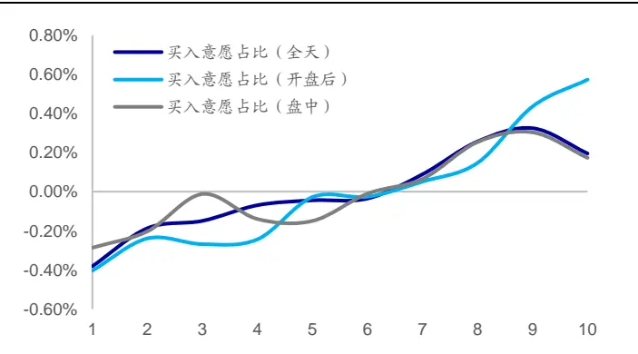
资料来源：Wind，海通证券研究所

图2 日内买入意愿强度分 10 组超额收益（正交后）（2014.01.02~2020.03.31）
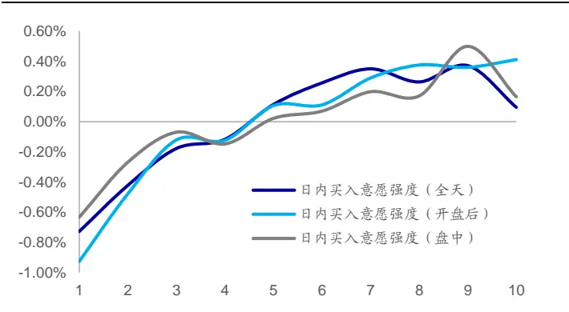
资料来源：Wind，海通证券研究所

从分组收益特征上看，买入意愿占比以及买入意愿强度在正交处理后都呈现出了较为明显的组间收益单调性。相比而言，开盘后买入意愿占比以及开盘后买入意愿强度具有更强的组间收益单调性以及更强的多头效应。下图展示了买入意愿占比以及日内买入意愿强度的多空相对强弱走势。

图3 买 入 意 愿 占 比 多 空 相 对 强 弱 （ 正 交 后 ）（2014.01.02~2020.03.31）
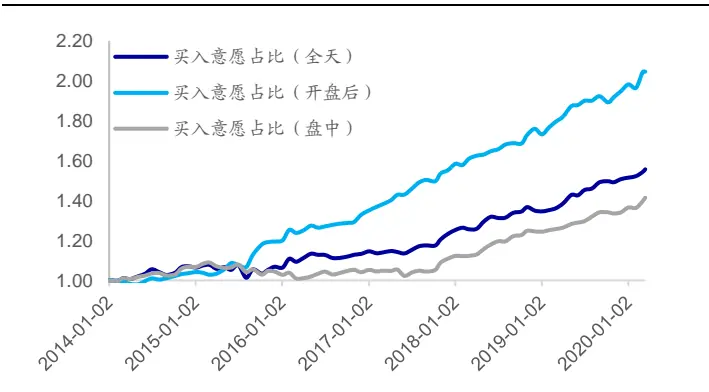
资料来源：Wind，海通证券研究所

图4 日 内 买 入 意 愿 强 度 多 空 相 对 强 弱 （ 正 交 后 ）（2014.01.02~2020.03.31）
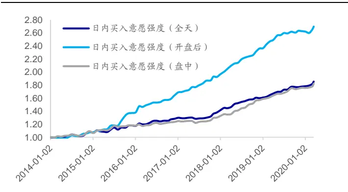
资料来源：Wind，海通证券研究所

在正交处理后，买入意愿占比以及日内买入意愿强度都呈现出了较强的收益区分能力。开盘后买入意愿占比以及开盘后日内买入意愿强度年化多空收益分别为 12.49%以及 16.20%。各因子在大部分年份中皆取得了较好的收益表现。下表展示了各因子的分年度多空收益。

表 3 部分买入意愿类因子分年度多空收益（正交后）（2014.01.02~2020.03.31）

| 因子名称 | 多空收益 | 月度胜率 | 2014 | 2015 | 2016 | 2017 | 2018 | 2019 | 截至 2020年3月31日 |
| --- | --- | --- | --- | --- | --- | --- | --- | --- | --- |
| 买入意愿占比（全天） | 7.47% | 72% | 9.75% | -2.89% | 6.20% | 7.40% | 5.64% | 14.71% | 2.36% |
| 买入意愿占比（开盘后） | 12.49% | 85% | 5.42% | 25.86% | 11.52% | 13.52% | 6.95% | 15.93% | 2.97% |
| 买入意愿占比（盘中） | 5.74% | 71% | 10.60% | -6.39% | 1.41% | 5.65% | 7.54% | 11.18% | 1.19% |
| 日内买入意愿强度（全天） | 10.64% | 79% | 10.91% | 16.45% | 9.66% | 7.88% | 9.46% | 12.93% | 1.26% |
| 日内买入意愿强度（开盘后） | 16.20% | 85% | 9.87% | 44.68% | 15.97% | 12.50% | 12.64% | 12.35% | 1.86% |
| 日内买入意愿强度（盘中） | 10.75% | 83% | 12.49% | 15.60% | 6.31% | 5.37% | 13.30% | 12.58% | 2.67% |

资料来源：Wind，海通证券研究所

我们同样可从回归法的角度对于上述因子的选股能力进行检验，可将上述因子分别与常规低频因子（行业、市值、中盘、换手率、反转、波动、估值、盈利以及盈利增长）放入多元回归模型进行回归检验。因子的回归系数即为因子溢价，通过因子溢价可得到因子的累计净值。下图展示了各因子的累计净值。

图5 买入意愿占比累计净值（2014.01.02~2020.03.31）
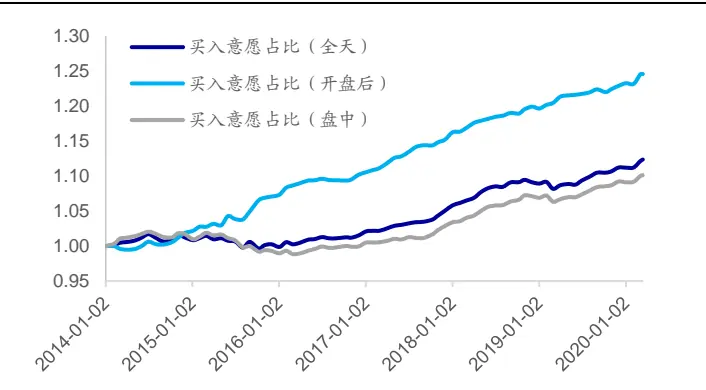
资料来源：Wind，海通证券研究所

图6 日内买入意愿强度累计净值（2014.01.02~2020.03.31）
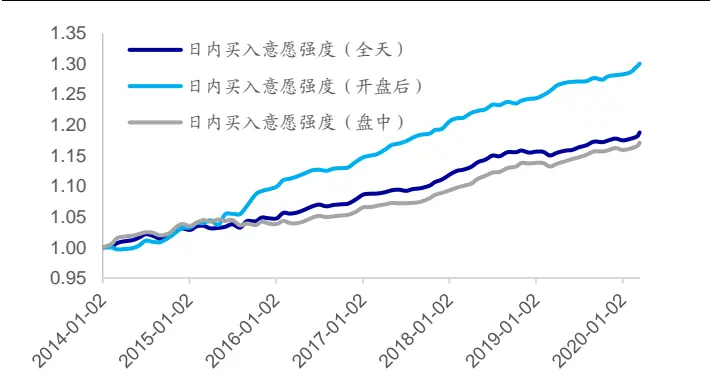
资料来源：Wind，海通证券研究所

从回归法的角度看，上述因子同样呈现出了显著的选股能力。开盘后买入意愿占比以及开盘后日内买入意愿强度月均溢价接近 0.30%，月度胜率超 75%。下表展示了各因子的月均溢价以及不同年度的月均溢价。

表 4 部分买入意愿类因子分年度月均溢价（正交后）（2014.01.02~2020.03.31）

| 因子名称 | 月均溢价 | 月度胜率 | 2014 | 2015 | 2016 | 2017 | 2018 | 2019 | 截至 2020年3月31日 |
| --- | --- | --- | --- | --- | --- | --- | --- | --- | --- |
| 买入意愿占比（全天） | 0.16% | 71% | 0.12% | -0.12% | 0.18% | 0.31% | 0.25% | 0.19% | 0.24% |
| 买入意愿占比（开盘后） | 0.28% | 75% | 0.13% | 0.41% | 0.24% | 0.43% | 0.26% | 0.24% | 0.24% |
| 买入意愿占比（盘中） | 0.13% | 66% | 0.11% | -0.19% | 0.12% | 0.24% | 0.29% | 0.19% | 0.17% |
| 日内买入意愿强度（全天） | 0.23% | 75% | 0.26% | 0.11% | 0.30% | 0.25% | 0.28% | 0.16% | 0.26% |
| 日内买入意愿强度（开盘后） | 0.33% | 83% | 0.24% | 0.49% | 0.35% | 0.43% | 0.27% | 0.23% | 0.36% |
| 日内买入意愿强度（盘中） | 0.21% | 72% | 0.29% | -0.01% | 0.22% | 0.22% | 0.34% | 0.18% | 0.28% |

资料来源：Wind，海通证券研究所

## 2.2 因子效果对比

考虑到买入意愿占比以及日内买入意愿强度与《选股因子系列研究（五十七）——基于主动买入行为的选股因子》中提出的净主买占比以及日内净主买强度逻辑较为相近，因此本节尝试对比两类因子，并考察买入意愿类因子能否相比于净主买类因子产生提升。下表对比展示了两类因子在剔除常规低频因子之后的 C、 C 以及月度多空收益情况。

表 5 因子月度 IC 与多空收益对比（正交后）（2013.01.04~2020.03.31）

| 指标名称 | 时段 | IC 均值 | 年化 ICIR | 月度胜率 | 多空收益 | 多头收益 | 空头收益 |
| --- | --- | --- | --- | --- | --- | --- | --- |
| 买入意愿占比 | 全天 | 0.02 | 1.65 | 72% 仅供本人内部 | 0.58% | 0.20% | -0.38% |
|  | 开盘后 | 0.03 | 3.09 | 85% | 0.98% | 0.57% | -0.40% |
|  | 盘中 | 0.02 | 1.65 | 71% | 0.46% | 0.17% | -0.29% |
|  | 收盘前 | 0.00 | -0.20 | 51% | -0.07% | 0.12% | 0.04% |
| 净主买占比 | 全天 | 0.01 | 1.16 | 61% | 0.33% | 0.03% | -0.30% |
|  | 开盘后 | 0.02 | 2.15 于2024-01-26日 | 75% | 0.69% | 0.36% | -0.33% |
|  | 盘中 | 0.01 | 1.46 | 67% | 0.44% | 0.19% | -0.25% |
|  | 收盘前 | 0.00 | 0.26 | 51% | 0.01% | 0.03% | 0.03% |
| 日内买入意愿强度 | 全天 | 0.03 | 2.56 | 79% | 0.82% | 0.09% | -0.73% |
|  | 开盘后 | 0.04 用户677 | 3.70 | 85% | 1.34% | 0.41% | -0.93% |
|  | 盘中 | 0.03 | 2.69 | 83% | 0.80% | 0.16% | -0.63% |
|  | 收盘前 | 0.00 | 0.15 | 51% | 0.08% | -0.17% | -0.25% |
| 日内净主买强度 | 全天 | 0.02 | 2.36 | 72% | 0.89% | 0.09% | -0.80% |
|  | 开盘后 | 0.03 | 2.96 | 80% | 1.02% | 0.23% | -0.79% |
|  | 盘中 | 0.03 | 2.63 | 81% | 0.93% | 0.29% | -0.64% |
|  | 收盘前 | 0.01 | 0.90 | 60% | 0.34% | -0.09% | -0.43% |

资料来源：Wind，海通证券研究所

对比正交后的因子 IC可以发现，买入意愿占比、日内买入意愿强度相比于净主买占比以及日内净主买强度皆有一定程度的提升。以开盘后日内买入意愿强度与开盘后日内净主买强度为例，因子的 IC 从 0.03 提升至 0.04，年化 ICIR 从 2.96 提升至 3.70，月度胜率从 80%提升至 85%，月均多空收益从 1.02%提升至 1.34%，月均多头收益从 0.23%提升至0.41%。下图以两类因子中表现较强的因子为例对比展示了因子的多空相对强弱。

图7 买入意愿占比与净主买占比多空相对强弱（正交后）（2014.01.02~2020.03.31）
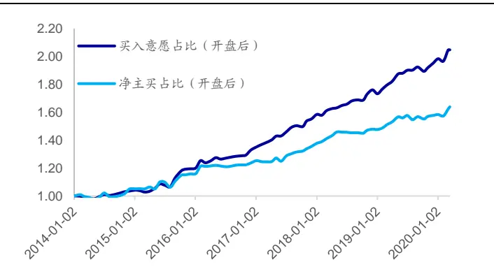
资料来源：Wind，海通证券研究所

图8 日内买入意愿强度与日内净主买强度多空相对强弱（正交后）（2014.01.02~2020.03.31）
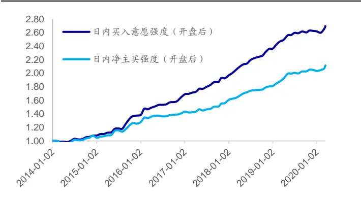
资料来源： ，海通证券研究所

观察因子长期表现可知，开盘后买入意愿占比以及开盘后日内买入意愿强度具有更强的选股能力。在大部分年份中，开盘后买入意愿占比的多空收益强于开盘后净主买占比，开盘后日内买入意愿强度的多空收益强于开盘后日内净主买强度。下表展示了各因子在不同年度中的多空收益。

表 6 因子分年度多空收益对比（正交后）（2014.01.02~2020.03.31）

| 因子名称 | 多空收益 | 月度胜率 | 2014 | 2015 | 2016 | 2017 | 2018 | 2019 | 截至 2020年3月31日 |
| --- | --- | --- | --- | --- | --- | --- | --- | --- | --- |
| 买入意愿占比（开盘后） | 12.49% | 85% | 5.42% | 25.86% | 11.52% | 13.52% | 6.95% | 15.93% | 2.97% |
| 净主买占比（开盘后） | 7.25% | 75% | 3.37% | 18.45% | 6.42% | 8.06% | 5.19% | 7.27% | -0.17% |
| 日内买入意愿强度（开盘后） | 16.20% | 85% | 9.87% | 44.68% | 15.97% | 12.50% | 12.64% | 12.35% | 1.86% |
| 日内净主买强度（开盘后） | 11.52% | 80% | 5.10% | 30.36% | 9.37% | 9.76% | 8.29% | 13.03% | 2.38% |

资料来源：Wind，海通证券研究所

下图以两类因子中表现较强的因子为例对比展示了因子累计净值。

图9 买入意愿占比与净主买占比累计净值（正交后）（2014.01.02~2020.03.31）
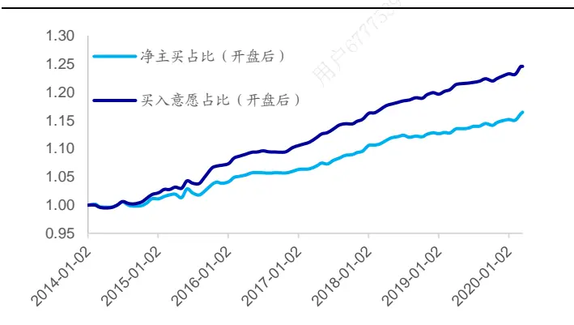
资料来源：Wind，海通证券研究所

图10 日内买入意愿强度与日内净主买强度累计净值（正交后）（2014.01.02~2020.03.31）
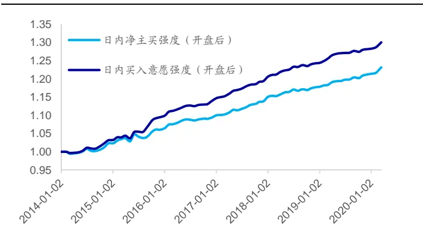
资料来源：Wind，海通证券研究所

从回归法溢价的角度看，开盘后买入意愿占比以及开盘后日内买入意愿强度同样具有更强的选股能力。在大部分时段中，开盘后买入意愿占比的月均溢价高于开盘后净主买占比，开盘后日内买入意愿强度的月均溢价高于开盘后日内净主买强度。下表展示了各因子在不同年度中的月均溢价。

表 7 因子分年度月均溢价对比（正交后）（2014.01.02~2020.03.31）

| 因子名称 | 月均溢价 | 月度胜率 | 2014 | 2015 | 2016 | 2017 | 2018 | 2019 | 截至 2020年3月31日 |
| --- | --- | --- | --- | --- | --- | --- | --- | --- | --- |
| 买入意愿占比（开盘后） | 0.28% | 75% | 0.13% | 0.41% | 0.24% | 0.43% | 0.26% | 0.24% | 0.24% |
| 净主买占比（开盘后） | 0.18% | 70% | 0.03% | 0.25% | 0.17% | 0.33% | 0.17% | 0.16% | 0.13% |
| 日内买入意愿强度（开盘后） | 0.33% | 83% | 0.24% | 0.49% | 0.35% | 0.43% | 0.27% | 0.23% | 0.36% |
| 日内净主买强度（开盘后） | 0.26% | 75% | 0.15% | 0.31% | 0.27% | 0.38% | 0.21% | 0.22% | 0.35% |

资料来源： ，海通证券研究所

## 2.3 本章小结

本章从直观逻辑的角度出发，结合了逐笔成交数据与盘口委托数据中的信息，构建得到了买入意愿类因子。在剔除了常规低频因子的影响后，该因子在月度上具有较为显著的选股能力。相比于使用逐笔成交数据构建得到的净主买类因子，买入意愿类因子更加全面地刻画了投资者的买入意愿，因子具有更强的截面选股能力，且在大部分时段中皆取得了更好的收益表现。

## 3. 高频数据低频化后的信息挖掘

为了能够进一步增强因子挖掘的效率并启发新因子的构建，我们可使用机器学习中的相关方法挖掘基于高频数据的因子。在进行因子挖掘前，我们首先需要构建数据备选库。本章所使用到的数据如下表所示。

表 8 数据说明

| 数据层级 | 数据内容 |
| --- | --- |
| 分钟级数据 | 成交额、收益 |
| TICK 级数据 | 净委买变化额 |
| 逐笔级数据 | 主买金额、净主买金额、大单成交金额 |

资料来源：Wind，海通证券研究所

其次，我们可构建算子备选库，算子如下表所示。由于机器性能的约束，本章在进行回测时仅定义了一小部分算子，投资者可在实际回测中可按照自身需求对于算子进行调整。

表 9 算子说明

| 算子 | 算子说明 | 算子 | 算子说明 |
| --- | --- | --- | --- |
| 十 | 加法 | period_beg() | 开盘时段（9:30~9:59）数据 |
| - | 减法 | period_med() | 盘中时段（10:00~14:26）数据 |
| * | 乘法 | period_end() | 盘中时段（14:27~14:56）数据 |
| 1 | 除法 | period_all() | 全天（9:00~14:56）数据 |
| inv() | 取倒数 | rolling_sum() | 滚动 20 日之和 |
| log() | 取对数 | rolling_mean() | 滚动 20 日均值 |
| neg() | 取负数 | rolling_std() | 滚动 20 日标准差 |

资料来源：Wind，海通证券研究所

最后，我们可将正交剔除常规低频因子后的因子 ICIR作为因子挖掘的目标。在实际的操作过程中，投资者既可参考《金融科技（Fintech）和数据挖掘研究（三）——量化因子的批量生产与集中管理》中提供的因子挖掘方法，也可使用基因规划等方法进行挖掘， python中有较多开源包能够高效实现特征工程。

## 3.1 因子挖掘结果

下表展示了部分挖掘得到的因子信息。

表 10机器挖掘因子计算方法

| 因子名称 | 因子计算方法 |
| --- | --- |
| Alpha1 | neg(log(roll_std(period_med(主买额)))) |
| Alpha2 | neg(log(roll_std(大单买入额* period_beg(成交额)))) |
| Alpha3 | neg(log(roll_mean(period_med(成交额)-period_end(净主买额)))) |
| Alpha4 | neg(log(roll_mean(成交额- period_med(成交额)))) |
| Alpha5 | neg(log(roll_mean(period_beg(主买额)+ period_med(主买额)- period_med(净主买额)+ period_end(成交额)))) |
| Alpha6 | neg(roll_sum(period_beg(成交额)+ period_end(成交额))/roll_sum(period_med(成交额)) |

资料来源：Wind，海通证券研究所

在上述机器挖掘因子中，部分因子的计算方法具有一定的逻辑性。Alpha1 计算了股票过去 20 日盘中主买额的波动率，计算公式中的 log 调整了因子的截面分布，而负号则表明，盘中主买额波动率越低，股票未来表现越好。

Alpha4 计算了过去 1个月开盘后与收盘前的成交额的滚动均值，该指标越高，股票未来表现越弱。 体现出了类似的逻辑，它计算了过去 个月开盘后与收盘前的成交额之和与过去 1 个月盘中成交额之和的比值。

然而，并不是所有机器挖掘因子的计算方式都具有逻辑性。例如，Alpha2 计算了大单买入额与开盘后成交额之积的波动率，我们难以直观理解该种计算方法后的逻辑。

## 3.2 因子选股能力

下表展示了各因子在正交前后的因子月度 C以及前后 多空收益情况。本文在进行因子正交时首先考虑剔除行业、市值因子、中盘因子、估值因子、换手率因子、反转因子以及波动率因子。其次，还考虑剔除行业、市值因子、中盘因子、估值因子、换手率因子、反转因子、波动率因子以及系列前期报告中提出的相关高频因子。

表 11 机器挖掘因子月度 IC 与多空收益（2014.01.02~2020.03.31）

| 因子处理 | 因子名称 | IC 均值 | 年化 ICIR | 月度胜率 | 多空收益 | 多头收益 | 空头收益 |
| --- | --- | --- | --- | --- | --- | --- | --- |
| 正交剔除 常规低频因子 | Alpha_1 | 0.02 | 1.73 | 68% | 0.90% | 0.17% | -0.73% |
|  | Alpha_2 | 0.02 | 1.68 | 67% | 0.76% | 0.18% | -0.58% |
|  | Alpha_3 | 0.02 | 1.32 | 69% | 0.89% | 0.10% | -0.79% |
|  | Alpha_4 | 0.03 | 1.91 | 73% | 1.09% | 0.20% | -0.89% |
|  | Alpha_5 | 0.03 | 1.71 | 72% | 1.09% | 0.20% | -0.89% |
|  | Alpha_6 | 0.03 | 2.62 | 80% | 0.73% | -0.05% | -0.78% |
| 正交剔除常规低频 因子与高频因子 | Alpha_1 | 0.04 | 3.14 | 83% | 1.57% | 0.46% | -1.11% |
|  | Alpha_2 | 0.05 | 3.50 | 88% | 1.62% | 0.66% | -0.96% |
|  | Alpha_3 | 0.04 | 2.93 | 81% | 1.63% | 0.40% | -1.23% |
|  | Alpha_4 | 0.05 | 3.17 | 84% | 1.76% | 0.48% | -1.28% |
|  | Alpha_5 | 0.04 | 3.06 | 83% | 1.73% | 0.46% | -1.27% |
|  | Alpha_6 | 0.02 | 1.86 | 75% | 0.63% | 0.07% | -0.57% |

资料来源： ，海通证券研究所

观察上表不难发现，各因子在正交剔除常规低频因子后就已经呈现出了较为显著的选股效果。如果进一步剔除高频因子的影响，机器挖掘因子的月度选股能力会更加显著，大部分因子月均 IC 高于 0.04，年化 ICIR 接近 3.0，月均多空收益高于 1.5%。

下图展示了因子在正交处理后的分 组超额收益。各机器挖掘因子在正交剔除常规低频因子后就已经呈现出了较为明显的组间收益单调性，但是因子同样呈现出了多头效应偏弱的特点。若进一步剔除常规高频因子，因子依旧呈现出了较为显著的组间收益单调性，并且因子的多头效应得到了明显提升。

图11 机器挖掘因子分 10 组超额收益（正交剔除常规低频因子后）（2014.01.02~2020.03.31）
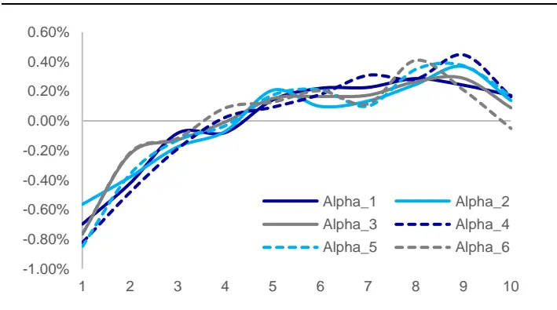
资料来源：Wind，海通证券研究所

图12 机器挖掘因子分 10 组超额收益（正交剔除常规低频因子与高频因子后）（2014.01.02~2020.03.31）
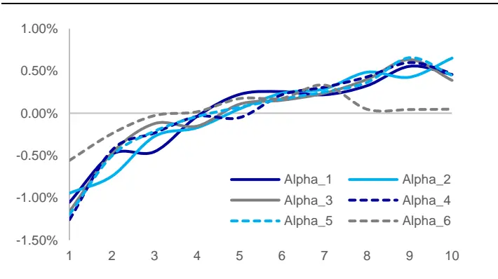
资料来源： ，海通证券研究所

下表对比展示了正交剔除常规低频因子与高频因子后的机器挖掘因子在不同年度的多空收益情况。除 Alpha6 外，各机器挖掘因子长期来看皆呈现出了较为显著的选股能力，因子年化多空收益普遍接近 20%，月度胜率皆高于 80%。分年度来看，各因子在大部分年份中皆取得了较好的收益表现。

表 12 机器挖掘因子分年度多空收益（正交剔除常规低频因子与高频因子后）（2014.01.02~2020.03.31）

| 因子名称 | 多空收益 | 月度胜率 | 2014 | 2015 | 2016 | 2017 | 2018 | 2019 | 截至2020年3月31日 |
| --- | --- | --- | --- | --- | --- | --- | --- | --- | --- |
| Alpha_1 | 19.40% | 83% | 21.99% | 51.41% | 16.83% | 9.77% | 14.05% | 17.04% | 4.10% |
| Alpha_2 | 20.97% | 88% | 19.45% | 58.06% | 21.09% | 11.70% | 12.23% | 20.25% | 4.00% |
| Alpha_3 | 20.54% | 81% | 21.57% | 63.59% | 20.07% | 11.91% | 12.83% | 10.79% | 4.50% |
| Alpha_4 | 22.09% | 84% | 23.87% | 68.09% | 20.58% | 15.50% | 11.58% | 12.64% | 5.06% |
| Alpha_5 | 21.74% | 83% | 23.67% | 68.88% | 20.15% | 12.34% | 12.74% | 12.50% | 5.04% |
| Alpha_6 | 8.50% | 75% | 7.70% | 12.67% | 6.74% | 9.71% | 6.11% | 7.12% | 3.30% |

资料来源：Wind，海通证券研究所

下表展示了各因子的月均溢价以及不同年度的月均溢价。从回归法的角度看，机器挖掘因子同样呈现出了较为明显的月度选股能力。因子在大部分时间段中皆取得了较好的收益表现。

表 13 机器挖掘因子分年度月均溢价（正交剔除常规低频因子与高频因子后）（2014.01.02~2020.03.31）

| 因子名称 | 月均溢价 | 月度胜率 | 2014 | 2015 | 2016 | 2017 | 2018 | 2019 | 截至2020年3月31日 |
| --- | --- | --- | --- | --- | --- | --- | --- | --- | --- |
| Alpha_1 | 0.29% | 71% | 0.25% | 0.74% | 0.31% | 0.05% | 0.28% | 0.13% | 0.27% |
| Alpha_2 | 0.30% | 75% | 0.24% | 0.78% | 0.40% | 0.05% | 0.22% | 0.15% | 0.18% |
| Alpha_3 | 0.26% | 67% | 0.26% | 0.74% | 0.30% | -0.04% | 0.27% | 0.04% | 0.24% |
| Alpha_4 | 0.28% | 67% | 0.29% | 0.74% | 0.34% | -0.01% | 0.27% | 0.05% | 0.25% |
| Alpha_5 | 0.27% | 68% | 0.28% | 0.74% | 0.31% | -0.04% | 0.28% | 0.05% | 0.24% |
| Alpha_6 | 0.15% | 67% | 0.16% | 0.20% | 0.20% | 0.16% | 0.03% | 0.16% | 0.22% |

资料来源： ，海通证券研究所

## 3.3 本章小结

本章尝试使用机器学习的方法挖掘低频化后的高频数据中所包含的选股能力。在剔除常规低频因子的影响后，机器挖掘因子整体上呈现出了较为显著的选股能力。在进一步剔除系列前期报告提出的高频因子的影响后，机器挖掘因子依旧呈现出了显著的选股能力。

## 4. 组合改进

本章以月度调仓的中证 500 指数增强组合为例，展示了本文第二章以及第三章讨论的因子在加入组合后对于组合表现的影响。可使用常规因子构建基础增强组合，并分别加入各逐笔因子。下表展示了加入各逐笔因子的组合在 2016 年以来的分年度超额收益。

表 14 各因子对组合表现的影响（2016.01.04~2020.03.31）

| 加入因子名称 | 2016 | 2017 | 2018 | 2019 | 截至 2020年3月31日 | 全区间 年化超额收益 |
| --- | --- | --- | --- | --- | --- | --- |
| Alpha_1 | 24.15% | 8.76% | 22.29% | 18.57% | 4.03% | 18.93% |
| Alpha_2 | 24.43% | 9.78% | 23.34% | 19.12% | 4.36% | 19.72% |
| Alpha_3 | 22.46% | 11.21% | 21.68% | 19.08% | 0.35% | 18.04% |
| Alpha_4 | 25.01% | 10.76% | 22.21% | 19.91% | 3.59% | 19.70% |
| Alpha_5 | 23.53% | 9.22% | 22.26% | 19.44% | 2.56% | 18.65% |
| Alpha_6 | 22.65% | 16.08% | 20.68% | 12.78% | 1.39% | 18.04% |
| 买入意愿占比（开盘后） | 20.75% | 16.22% | 20.41% | 18.65% | 2.41% | 18.85% |
| 日内买入意愿强度（开盘后） | 20.57% | 15.52% | 20.89% | 19.49% | 3.60% | 19.25% |
| 基础模型 | 18.92% | 12.50% | 21.90% | 17.91% | 3.82% | 18.22% |

资料来源：Wind，海通证券研究所

观察上表不难发现，大部分因子的引入都能给组合的整体表现带来一定程度的提升。相比而言，开盘后日内买入意愿强度、Alpha_2、开盘后买入意愿占比以及 Alpha_4 带来的收益提升较高。从分年度来看，机器挖掘因子的引入能够进一步提升基础模型在年的收益，但是会带来 年超额收益的下降。买入意愿因子的引入能够在年以及 年带来超额收益的提升，但是会降低组合在 年的超额收益表现。下图对比展示了各组合相对于中证 500 指数的相对强弱指数。

图13 各组合相对中证 500 指数的表现（2016.01.04~2020.03.31）
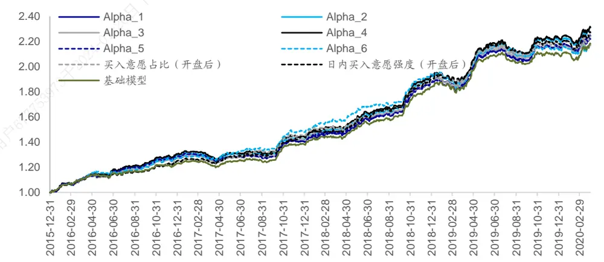
资料来源：Wind，海通证券研究所

考虑到基于机器学习挖掘得到的因子与基于直观逻辑构建得到的因子在加入组合后，对于组合的分年度收益的影响有所不同，因此可将两类因子同时加入模型从而得到更好的收益表现。不妨以本部分表现较好的 Alpha_2、Alpha_4、开盘后买入意愿占比以及开盘后日内买入意愿强度为例。从单因子的角度看，上述因子在正交剔除常规常规低频因子后都呈现出了较为显著的月度选股能力，因子月均 IC在 0.02~0.04 之间，年化ICIR 超 1.5。

表 15 部分机器挖掘因子与部分买入意愿因子月度 IC与多空收益（2014.01.02~2020.03.31）

| 因子名称 | IC 均值 | 年化 ICIR | 月度胜率 | 多空收益 | 多头收益 | 空头收益 |
| --- | --- | --- | --- | --- | --- | --- |
| Alpha_2 | 0.02 | 1.68 | 67% | 0.76% | 0.18% | -0.58% |
| Alpha_4 | 0.03 | 1.91 | 73% | 1.09% | 0.20% | -0.89% |
| 开盘后日内买入意愿占比 | 0.03 | 3.09 | 85% | 0.98% | 0.57% | -0.40% |
| 开盘后日内买入意愿强度 | 0.04 | 3.70 | 85% | 1.34% | 0.41% | -0.93% |

资料来源：Wind，海通证券研究所

下表进一步展示了各正交因子间的截面相关性。从截面相关性的角度看，机器挖掘类因子与买入意愿类因子之间的截面相关性较为可控。机器挖掘因子之间的截面相关性较高，买入意愿因子间的截面相关性较高。

表 16 因子截面相关性（2014.01.02~2020.03.31）

|  | Alpha_2 | Alpha_4 | 开盘后日内买入意愿占比 | 开盘后日内买入意愿强度 |
| --- | --- | --- | --- | --- |
| Alpha_2 | 1.00 | 0.81 | -0.04 | 0.00 |
| Alpha_4 | 0.81 | 1.00 | -0.02 | 0.06 |
| 开盘后日内买入意愿占比 | -0.04 | -0.02 | 1.00 | 0.85 |
| 开盘后日内买入意愿强度 | 0.00 | 0.06 | 0.85 | 1.00 |

资料来源： ，海通证券研究所

下表展示了各正交因子的 IC 序列相关性。从因子收益相关性的角度看，两类因子类别内的相关性较高，但是类别间的相关性却较低，甚至负相关。因此可考虑从两类因子中分别选取一个因子同时加入基础模型。

表 17 因子 IC 序列相关性（2014.01.02~2020.03.31）

|  | Alpha_2 | Alpha_4 | 开盘后日内买入意愿占比 | 开盘后日内买入意愿强度 |
| --- | --- | --- | --- | --- |
| Alpha_2 | 1.00 | 0.88 | -0.31 | -0.18 |
| Alpha_4 | 0.88 | 1.00 | -0.14 | 0.04 |
| 开盘后日内买入意愿占比 | -0.31 | -0.14 | 1.00 | 0.93 |
| 开盘后日内买入意愿强度 | -0.18 | 0.04 | 0.93 | 1.00 |

资料来源：Wind，海通证券研究所

基于上述因子相关性特征，可考虑从两类因子中分别选取 Alpha_2 以及开盘后日内买入意愿强度同时加入模型，并观察模型的改进效果。下表对比了不同模型的收益表现情况。

表 18 同时加入两因子对组合表现的影响（2016.01.04~2020.03.31）

| 加入因子名称 | 2016 | 2017 | 2018 | 2019 | 截至 2020年3月31日 | 全区间 年化超额收益 |
| --- | --- | --- | --- | --- | --- | --- |
| 基础模型 | 18.92% | 12.50% | 21.90% | 17.91% | 3.82% | 18.22% |
| Alpha_2 | 24.43% | 9.78% | 23.34% | 19.12% | 4.36% | 19.72% |
| 日内买入意愿强度（开盘后） | 20.57% | 15.52% | 20.89% | 19.49% | 3.60% | 19.25% |
| 同时加入两因子 | 25.14% | 12.27% | 21.86% | 20.03% | 2.06% | 19.61% |

资料来源： ，海通证券研究所

模型在同时加入 以及开盘后日内买入意愿强度后，全区间超额收益相比于基础模型以及单独加入开盘后日内买入意愿强度的模型产生了一定提升，但是略弱于单独加入 Alpha_2 的模型。虽然模型全区间超额收益低于单独加入 Alpha_2 的模型，但是同时加入两因子的模型在分年度收益表现上更加稳定。模型在 2016 年以及 2019 年相比于基础模型产生了较为明显的收益增强，同时在 年以及 年并未出现明显跑输的现象。从以上案例可知，若机器学习挖掘得到的因子与基于直观逻辑得到因子间的相关性较为可控，可考虑同时加入模型从而得到更加稳健的模型提升效果。

## 5. 总结

在前期系列报告中，我们虽然讨论了使用高频数据进行因子构建，但是很少将各类高频数据进行混合。本文在相关报告的基础之上讨论了高频信息低频化后的混合使用。在混合不同层级的高频信息时，我们既可考虑从直观逻辑的角度出发，也可考虑从机器挖掘的角度出发。从单因子的角度看，两种因子构建方法都能得到有效的选股因子。从组合的角度看，相关因子同样能够为组合提供额外的选股能力。本文以中证 500 指数增强组合为例，分别尝试将各因子放入模型。回测结果表明，因子的引入的确能够带来模型整体效果的提升，但是不同因子在不同年度的提升效果存在差异。由于不同类别因子间的相关性较为可控，因此可考虑同时引入两类因子。将两类因子同时加入模型能够得到更加稳健的模型提升效果。

总而言之，由于不同类别的高频信息从不同的角度记录了投资者交易行为，因此高频信息的混合使用能够更加全面地刻画投资者的交易行为。在构建因子时，我们可考虑从逻辑的角度出发，也可使用机器学习技术进行因子挖掘。考虑到并非所有机器挖掘因子都具有可理解的选股逻辑，投资者在实际构建因子时可对机器挖掘因子进行调整，从而得到兼具逻辑性以及选股能力的因子。

## 6. 风险提示

市场系统性风险、资产流动性风险以及政策变动风险会对策略表现产生较大影响。转

# 信息披露

分析师声明

[Table冯佳睿 yst金融工程研s] 究团队

袁林青金融工程研究团队

本人具有中国证券业协会授予的证券投资咨询执业资格，以勤勉的职业态度，独立、客观地出具本报告。本报告所采用的数据和信息均来自市场公开信息，本人不保证该等信息的准确性或完整性。分析逻辑基于作者的职业理解，清晰准确地反映了作者的研究观点，结论不受任何第三方的授意或影响，特此声明。

## 法律声明

本报告仅供海通证券股份有限公司（以下简称 本公司 ）的客户使用。本公司不会因接收人收到本报告而视其为客户。在任何情况下，本报告中的信息或所表述的意见并不构成对任何人的投资建议。在任何情况下，本公司不对任何人因使用本报告中的任何内容所引致的任何损失负任何责任。

本报告所载的资料、意见及推测仅反映本公司于发布本报告当日的判断，本报告所指的证券或投资标的的价格、价值及投资收入可能会波动。在不同时期，本公司可发出与本报告所载资料、意见及推测不一致的报告。

市场有风险，投资需谨慎。本报告所载的信息、材料及结论只提供特定客户作参考，不构成投资建议，也没有考虑到个别客户特殊的投资目标、财务状况或需要。客户应考虑本报告中的任何意见或建议是否符合其特定状况。在法律许可的情况下，海通证券及其所属关联机构可能会持有报告中提到的公司所发行的证券并进行交易，还可能为这些公司提供投资银行服务或其他服务。

本报告仅向特定客户传送，未经海通证券研究所书面授权，本研究报告的任何部分均不得以任何方式制作任何形式的拷贝、复印件或复制品，或再次分发给任何其他人，或以任何侵犯本公司版权的其他方式使用。所有本报告中使用的商标、服务标记及标记均为本公司的商标、服务标记及标记。如欲引用或转载本文内容，务必联络海通证券研究所并获得许可，并需注明出处为海通证券研究所，且不得对本文进行有悖原意的引用和删改。

根据中国证监会核发的经营证券业务许可，海通证券股份有限公司的经营范围包括证券投资咨询业务。

## 海通证券股份有限公司研究所[Table_PeopleInfo]

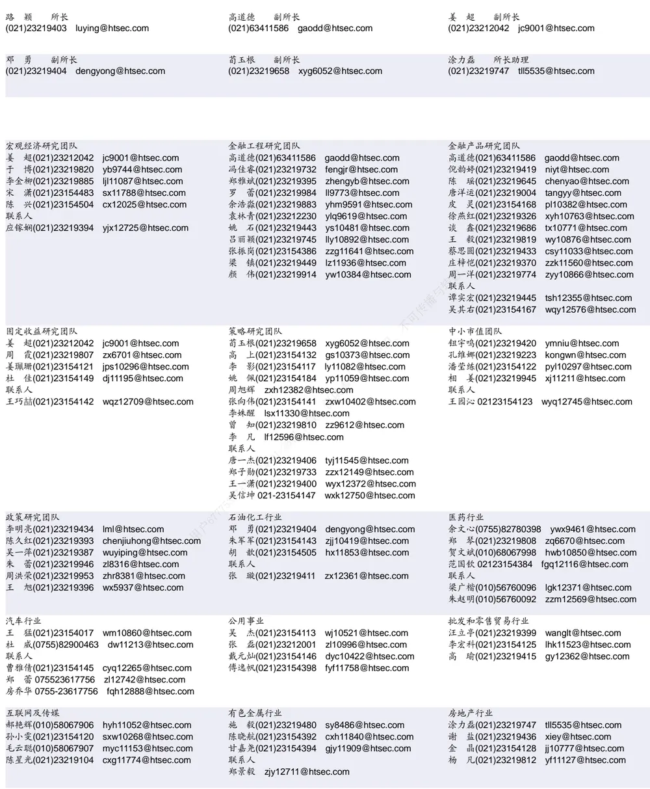

| 电子行业 |  | 煤炭行业 | 电力设备及新能源行业 |  |
| --- | --- | --- | --- | --- |
|  | 陈 平(021)23219646 cp9808@htsec.com | 李 淼(010)58067998 Im10779@htsec.com | 张一弛(021)23219402 | zyc9637@htsec.com |
|  | 尹 苓(021)23154119 yl11569@htsec.com | 戴元灿(021)23154146 dyc10422@htsec.com | 房 青(021)23219692 | fangq@htsec.com |
|  | 谢 磊(021)23212214 xl10881@htsec.com | 吴 杰(021)23154113 wj10521@htsec.com | 曾 彪(021)23154148 zb10242@htsec.com |  |
|  | 蒋 俊(021)23154170 jj11200@htsec.com | 联系人 | 徐柏乔(021)23219171 xbq6583@htsec.com |  |
| 联系人 |  | 王 涛(021)23219760 wt12363@htsec.com | 陈佳彬(021)23154513 cjb11782@htsec.com |  |
| 肖隽翀 021-23154139 xjc12802@htsec.com |  |  |  |  |

| 基础化工行业 |  | 计算机行业 | 通信行业 |
| --- | --- | --- | --- |
| 刘 威(0755)82764281 Iw10053@htsec.com |  | 郑宏达(021)23219392 zhd10834@htsec.com | 朱劲松(010)50949926 zjs10213@htsec.com |
| 刘海荣(021)23154130 Ihr10342@htsec.com |  | 杨 林(021)23154174 yl11036@htsec.com | 余伟民(010)50949926 ywm11574@htsec.com |
| 张翠翠(021)23214397 | zcc11726@htsec.com | 于成龙 ycl12224@htsec.com | 张峥青(021)23219383 zzq11650@htsec.com |
| 孙维容(021)23219431 swr12178@htsec.com |  | 黄竞晶(021)23154131 hjj10361@htsec.com | 张 弋 01050949962 zy12258@htsec.com |
| 李 智(021)23219392 Iz11785@htsec.com |  | 洪 琳(021)23154137 hl11570@htsec.com | 联系人 |
|  |  |  | 杨彤昕 010-56760095 ytx12741@htsec.com |

| 非银行金融行业 |  | 交通运输行业 |  | 纺织服装行业 |  |  |
| --- | --- | --- | --- | --- | --- | --- |
|  | 孙 婷(010)50949926 st9998@htsec.com |  | 虞 楠(021)23219382 yun@htsec.com |  |  | 梁 希(021)23219407 lx11040@htsec.com |
|  | 何 婷(021)23219634 ht10515@htsec.com |  | 罗月江（010）56760091 lyj12399@htsec.com |  |  | 盛 开(021)23154510 sk11787@htsec.com |
|  | 李芳洲(021)23154127 Ifz11585@htsec.com |  | 李 轩(021)23154652 lx12671@htsec.com |  | 联系人 |  |
| 联系人 |  |  |  |  | 刘 溢(021)23219748 ly12337@htsec.com |  |

| 建筑建材行业 | 机械行业 |  |  | 钢铁行业 |
| --- | --- | --- | --- | --- |
| 冯晨阳(021)23212081 fcy10886@htsec.com |  | 余炜超(021)23219816 swc11480@htsec.com |  | 刘彦奇(021)23219391 liuyq@htsec.com |
| 潘莹练(021)23154122 pyl10297@htsec.com |  | 耿 耘(021)23219814 gy10234@htsec.com |  | 周慧琳(021)23154399 zhl11756@htsec.com |
| 申 浩(021)23154114 sh12219@htsec.com |  | 杨 震(021)23154124 yz10334@htsec.com |  |  |
| 杜市伟(0755)82945368 dsw11227@htsec.com |  | 周 丹 zd12213@htsec.com |  |  |
| 颜慧菁 yhj12866@htsec.com | 联系人 |  | 吉 晟(021)23154653 js12801@htsec.com 播与转载 |  |

| 建筑工程行业 |  | 农林牧渔行业 |  | 食品饮料行业 |  |
| --- | --- | --- | --- | --- | --- |
| 张欣劼 zxj12156@htsec.com | 丁 | 频(021)23219405 | dingpin@htsec.com | 闻宏伟(010)58067941 whw9587@htsec.com |  |
| 李富华(021)23154134 Ifh12225@htsec.com 杜市伟(0755)82945368 dsw11227@htsec.com |  | 陈阳(021)23212041 联系人 | cy10867@htsec.com | 唐 宇(021)23219389 ty11049@htsec.com |  |
|  |  | 孟亚琦(021)23154396 myq12354@htsec.com |  | 颜慧菁 yhj12866@htsec.com 联系人 |  |
|  |  |  |  |  | 程碧升(021)23154171 cbs10969@htsec.com |

| 军工行业 | 银行行业 | 社会服务行业 |
| --- | --- | --- |
| 张恒晅 zhx10170@htsec.com | 孙 婷(010)50949926 st9998@htsec.com | 汪立亭(021)23219399 wanglt@htsec.com |
| 联系人 张宇轩(021)23154172 zyx11631@htsec.com | 解巍巍 xww12276@htsec.com | 陈扬扬(021)23219671 cyy10636@htsec.com |
|  | 林加力(021)23154395 ljl12245@htsec.com | 许樱之 xyz11630@htsec.com |
|  | 谭敏沂(0755)82900489 tmy10908@htsec.com |  |

| 家电行业 |  | 造纸轻工行业 |  |
| --- | --- | --- | --- |
| 陈子仪(021)23219244 chenzy@htsec.com |  |  | 衣桢永(021)23212208 yzy12003@htsec.com |
| 李 阳(021)23154382 1 | ly11194@htsec.com |  |  |
| 朱默辰(021)23154383 | zmc11316@htsec.com |  |  |
| 刘 璐(021)23214390 1 | II11838@htsec.com |  |  |

## 研究所销售团队

深广地区销售团队深厂地区销售团队

蔡铁清(0755)82775962 ctq5979@htsec.com伏财勇(0755)23607963 fcy7498@htsec.com辜丽娟(0755)83253022 gulj@htsec.com
刘晶晶(0755)83255933 liujj4900@htsec.com饶 伟(0755)82775282 rw10588@htsec.com欧阳梦楚(0755)23617160
oymc11039@htsec.com
巩柏含 gbh11537@htsec.com
上海地区销售团队
胡雪梅(021)23219385 huxm@htsec.com
朱 健(021)23219592 zhuj@htsec.com
季唯佳(021)23219384 jiwj@htsec.com
黄 毓(021)23219410 huangyu@htsec.com
漆冠男(021)23219281 qgn10768@htsec.com
胡宇欣(021)23154192 hyx10493@htsec.com
黄 诚(021)23219397 hc10482@htsec.com
毛文英(021)23219373 mwy10474@htsec.com
马晓男 mxn11376@htsec.com
杨祎昕(021)23212268 yyx10310@htsec.com
张思宇 zsy11797@htsec.com
王朝领 wcl11854@htsec.com
邵亚杰 23214650 syj12493@htsec.com
李 寅 021-23219691 ly12488@htsec.com北京地区销售团队
殷怡琦(010)58067988 yyq9989@htsec.com郭 楠 010-5806 7936 gn12384@htsec.com张丽萱(010)58067931 zlx11191@htsec.com杨羽莎(010)58067977 yys10962@htsec.com何 嘉(010)58067929 hj12311@htsec.com李 婕 lj12330@htsec.com
欧阳亚群 oyyq12331@htsec.com
郭金垚(010)58067851 gjy12727@htsec.com

海通证券股份有限公司研究所

地址：上海市黄浦区广东路 689号海通证券大厦 9楼

电话：（021）23219000

传真：（021）23219392

网址：www.htsec.com