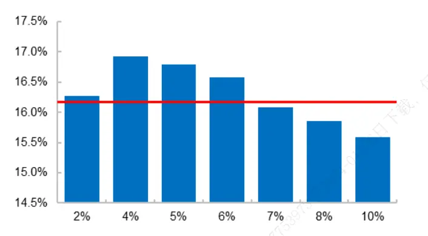
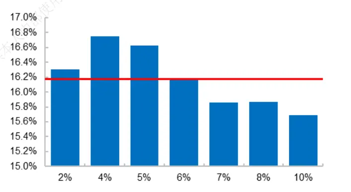
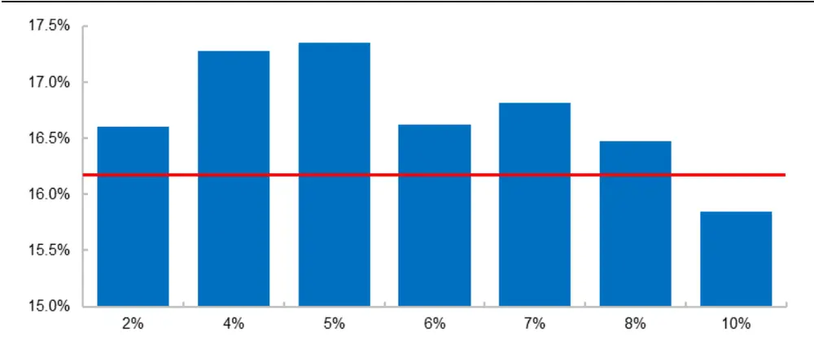
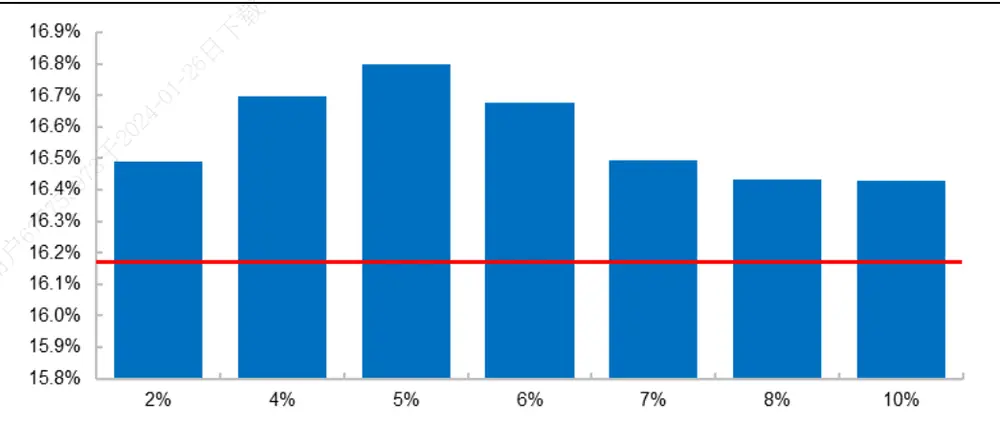
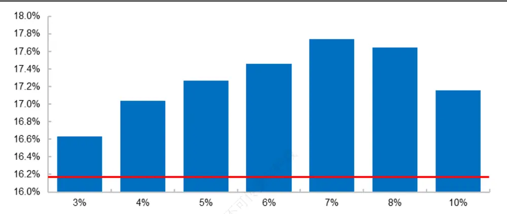
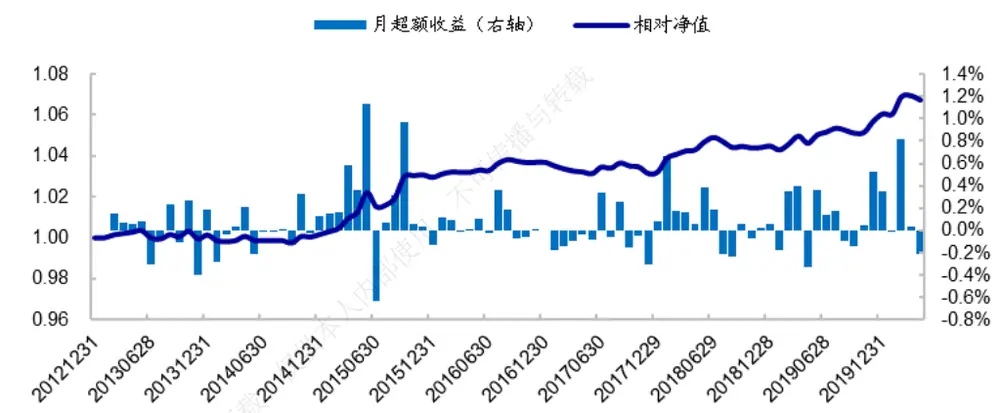
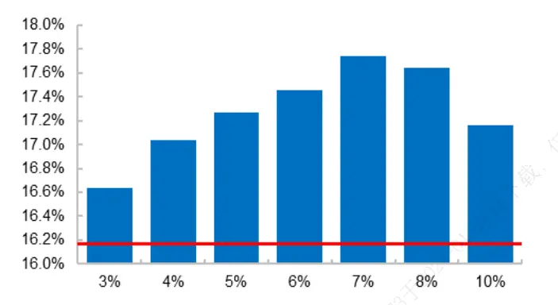
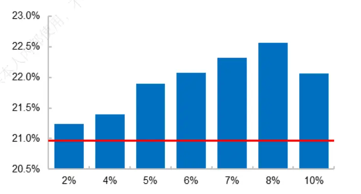
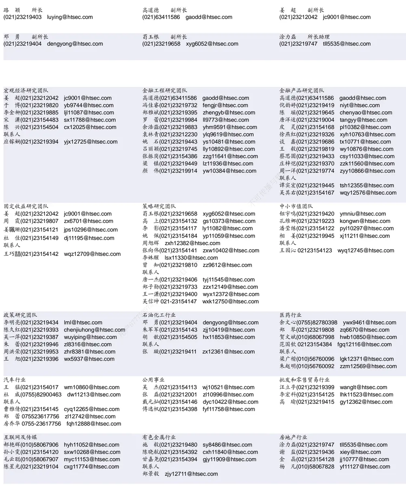

## [Tab相关研究

Table_ReportInfo]《外资 股持仓偏好分析》《通往绝对收益之路——股债混合与衍生品运用》2020.05.12

《从 到 ：解码绝对收益策略》2020.05.04

分析师:冯佳睿

Tel:(021)23219732

Email:fengjr@htsec.com

证书:S0850512080006

分析师:罗蕾

Tel:(021)23219984

Email:ll9773@htsec.com

证书:S0850516080002

# 选股因子系列研究（六十五）——剔除高频因子空头组合后的中证 500指数增强策略

## 投资要点：

本文主要对剔除高频因子空头组合后的中证 500 指数增强策略进行回测分析。

剔除高频因子空头组合主要有两种思路，事前剔除与事后剔除。若有多个空头效应强的高频因子，则可以以因子复合或组合复合的方式，构建高频多因子空头组合，以同时利用这些因子的空头信息。

- 事后剔除的模型稳健性优于事前剔除。无论是采用因子复合还是组合复合方法构建高频多因子空头组合，事后剔除得到的中证 500 指数增强策略，有效的空头阈值范围都更大。也就是，以参数敏感性反映的模型稳健性来看，事后剔除优于事前剔除。

组合复合剔除对中证 指数增强策略超额收益的提升幅度优于因子复合剔除。转无论是事前剔除还是事后剔除，在 的空头阈值下，组合复合剔除可以将中证播增强策略的年化超额提升 以上，而因子复合剔除的收益提升幅度小于可1%。，

- 相较而言，更推荐采用组合复合的事后剔除方法，来利用高频因子的空头效应。部这种方法非常简单直接，模型适用性较强，参数敏感性低。无论中证 500 指数增人强策略是否有成分股约束，5%-10%的空头阈值范围内，事后剔除都可将策略的供年化超额提升 0.9%以上。

- 风险提示。模型误设风险，统计规律失效风险，流动性风险。6日

在前期报告中，我们探讨了剔除高频因子空头组合后，对沪深 300 指数增强策略的影响。本篇报告我们将探讨剔除高频因子空头组合后，对中证 500 指数增强策略的影响。

## 1. 以因子形式引入收益预测模型

## 1.1 高频因子的选股收益

下表展示了正交市值和低频技术因子（反转、换手率、波动率）后，月度高频因子在中证 500 指数成分股中的选股收益表现（因子具体构建方式参见前期报告《高频因子在不同周期和域下的表现及影响因素分析》），时间区间为 2013 年初至 2020 年 4 月底。表中多头收益是指，中证 指数成分股中，因子得分最高的 个股等权组合，相对于中证 指数成分股等权组合的超额收益；空头收益是指，成分股等权组合与因子得分最低的 20%个股等权组合收益之差；多空收益是多头收益与空头收益之和。

表 1 正交高频因子在中证 500指数成分股中的选股效果（2013.01-2020.04）

| 高频因子 | 空头收益 |  | 多头收益 |  |  | 多头收益/ 多空收益 | IC |  |
| --- | --- | --- | --- | --- | --- | --- | --- | --- |
|  | 月均收益 月胜率 | t值 | 月均收益 月胜率 | t值 |  |  | 月均收益 | 月胜率 t值 |
| 量价相关性 | 0.79% 68.18% | 5.33 | 0.42% | 60.23% | 2.71 | 34.7% | -4.35% 31.82% | -5.20 |
| 收盘前成交委托相关性 | 0.39% 65.91% | 2.68 | 0.01% | 47.73% | 0.06 | 2.90% | -0.89% 45.45% | -0.87 |
| 下行波动占比 | 0.38% 65.91% | 2.75 | 0.11% | 54.55% | 0.97 | 23.1% | 2.00% 63.64% | 2.64 |
| 改进反转 | 0.74% 68.18% | 4.48 | 0.44% | 62.50% | 2.62 | 37.4% | -4.03% 36.36% | -4.85 |
| 大单推动涨幅 | 0.59% 76.14% | 5.22 | 0.15% | 54.55% | 1.25 | 20.3% | -2.92% 28.41% | -4.89 |
| 高频偏度 | 0.41% 67.05% | 3.20 | 0.21% | 61.36% | 1.98 | 33.8% | -2.50% 28.41% | -3.65 |
| 尾盘成交占比 | 0.83% 77.27% | 6.27 | 0.81% | 75.00% | 5.06 | 49.3% | -5.92% 22.73% | -7.98 |

资料来源： ，海通证券研究所
注：月胜率是指收益大于 0的月度占比。

结果显示，除收盘前成交委托相关性因子外，其余 6 个高频因子在中证 500 指数成分股中的 IC 均显著异于 0，即选股效果显著。从分组收益来看，与全市场特征一致，高频因子呈现多头效应弱，空头效应强的特征：多头收益占多空收益的比值均低于 50%。

单从空头效应来看，无论是在全市场范围内，还是在中证 500 指数成分股内，原始高频因子都存在非常稳定的空头收益。如下表所示，绝大部分高频因子的空头效应（样本空间等权组合与因子得分最低的 5%个股等权组合收益之差）月胜率均在 65%以上，稳定性高。

表 2 原始高频因子的空头效应（2013.01-2020.04）

|  | 中证 500 指数成分股内 |  |  | 全市场 |  |  |
| --- | --- | --- | --- | --- | --- | --- |
|  | 月均收益 | 月胜率 | t值 | 月均收益 | 月胜率 | t值 |
| 量价相关性 | 1.77% | 78.41% | 6.27 | 2.02% | 86.36% | 6.58 |
| 收盘前成交委托相关性 | 1.50% | 70.45% | 3.76 | 2.41% | 78.41% | 5.72 |
| 下行波动占比 | 1.16% | 62.50% | 3.66 | 2.17% | 84.09% | 8.40 |
| 改进反转 | 2.27% | 76.14% | 6.80 | 2.49% | 84.09% | 8.67 |
| 大单推动涨幅 | 1.86% | 72.73% | 4.55 | 2.12% | 81.82% | 6.22 |
| 高频偏度 | 1.31% | 69.32% | 4.59 | 1.83% | 82.95% | 8.70 |
| 尾盘成交占比 | 1.08% | 68.18% | 4.02 | 1.27% | 75.00% | 5.12 |

资料来源：Wind，海通证券研究所

## 1.2收益预测模型中引入高频因子

高频因子 IC 显著，一种最简单直接的利用高频因子的方式即为，在收益预测模型中加入高频因子。下表展示了加入高频因子后，中证 500 指数增强策略扣费后（单边千三）的超额收益表现。

对比的基准策略是包含风格、低频技术因子和基本面因子的中证500指数增强策略。增强模型为全市场优化模型，即选股范围是剔除 ST 股、上市 3 个月以内的新股、停牌股以外剩余的所有 A股；其中，成分股权重占比不低于 80%。

表 3 引入高频因子后的中证 500指数增强策略超额收益表现（80%成分股约束，2013.01-2020.04）

|  | 收益率 | 波动率 | 信息比 | 最大回撤 | 收益回撤比 | 月胜率 |
| --- | --- | --- | --- | --- | --- | --- |
| 基准策略 | 16.17% | 5.63% | 2.62 | 5.91% | 2.74 | 80.68% |
| 量价相关性 | 16.11% | 5.99% | 2.46 | 6.45% | 2.50 | 76.14% |
| 收盘前成交委托相关性 | 15.97% | 5.73% | 2.56 | 9.03% | 1.77 | 80.68% |
| 下行波动占比 | 16.01% | 5.72% | 2.57 | 5.73% | 2.79 | 80.68% |
| 改进反转 | 16.69% | 5.67% | 2.69 | 5.07% | 3.29 | 75.00% |
| 大单推动涨幅 | 15.28% | 5.54% | 2.54 | 5.66% | 2.70 | 70.45% |
| 高频偏度 | 15.80% | 5.77% | 2.52 | 6.53% | 2.42 | 73.86% |
| 尾盘成交占比 | 16.33% | 5.65% | 2.66 | 5.90% | 2.77 | 75.00% |
| 改进反转+尾盘成交占比 | 16.22% | 5.75% | 2.60 | 5.26% | 3.08 | 71.59% |

资料来源： ，海通证券研究所

在 80%成分股权重约束下，绝大部分高频因子加入对中证 500 指数增强策略超额收益并没有明显影响。在考察的 7 个高频因子中，只有加入改进反转因子和尾盘成交占比因子可以提升增强策略的超额收益率。其中，加入改进反转因子对策略超额收益提升最明显，可以将策略年化超额由 16.17%提升至 16.69%，信息比由 2.62 提升至 2.69。

需要注意的是，加入高频因子是否可以提升指数增强策略的超额收益，依赖于收益预测模型和风险控制模型的设定。在我们通过回归方式，利用风格、低频技术因子和基本面因子预测个股收益，同时存在 80%成分股约束和因子敞口约束的模型下，直接加入高频因子对增强策略超额收益提升有限。但这并不意味着在所有的情况下都是如此。

例如，若我们放松成分股约束，即不要求中证 500 指数成分股的权重占比不低于，则绝大部分高频因子加入都可明显提升增强策略的超额收益。而若同时加入下行波动占比和尾盘成交占比因子，则中证 500 指数增强策略扣费后年化超额收益可由18.36%提升至 20.96%，提升幅度高达 2.6%。

表 4 引入高频因子后的中证 500指数增强策略超额收益表现（无成分股约束，2013.01-2020.04）

|  | 收益率 | 波动率 | 信息比 | 最大回撤 | 收益回撤比 | 月胜率 |
| --- | --- | --- | --- | --- | --- | --- |
| 原始组合 | 18.36% | 6.21% | 2.66 | 6.73% | 2.73 | 77.27% |
| 量价相关性 | 18.07% | 6.22% | 2.63 | 6.49% | 2.78 | 75.00% |
| 收盘前成交委托相关性 | 19.23% | 6.36% | 2.72 | 6.45% | 2.98 | 78.41% |
| 下行波动占比 | 19.94% | 6.16% | 2.89 | 6.29% | 3.17 | 77.27% |
| 改进反转 | 17.76% | 6.30% | 2.58 | 6.34% | 2.80 | 77.27% |
| 大单推动涨幅 | 19.75% | 6.05% | 2.92 | 6.06% | 3.26 | 80.68% |
| 高频偏度 | 18.60% | 6.08% | 2.75 | 7.23% | 2.57 | 77.27% |
| 尾盘成交占比 | 19.51% | 6.45% | 2.73 | 7.94% | 2.46 | 73.86% |
| 下行波动占比+尾盘成交占比 | 20.96% | 6.49% | 2.89 | 6.66% | 3.15 | 78.41% |

资料来源： ，海通证券研究所

我们无法遍历加入高频因子对每一种模型的影响，但若遇到直接以因子形式引入，无法改善策略超额收益（如本文提到的存在 80%成分股约束的模型），又不想舍弃高频因子稳定的空头收益，则可以尝试利用高频因子来剔除空头个股。

剔除思路主要有两种，事前剔除和事后剔除。事前剔除是指，调整空头个股的得分或约束条件，使得最终的优化组合不包含空头个股，或者使得空头个股权重为其最小权重。事后剔除则是指，按照原模型得到增强组合后，剔除其中属于高频因子空头部分的个股。

两者都是利用高频因子的空头个股信息来对组合做剔除。不同之处在于，前者是在获取增强组合之前做剔除，因此优化模型会补充一些风险相近的个股，来替代剔除的空头个股；而事后剔除则仅仅是剔除，没有做补充。

接下来我们将从这两种思路出发，探讨剔除高频因子空头个股后，对有 80%成分股约束的中证 500 指数增强策略超额收益表现的影响。

## 2. 事前剔除

事前剔除是指，通过调低空头个股预期收益，或增加约束条件（如空头个股权重为0）的方式，使得空头股票不出现在最终的优化组合之中。具体来看：

- 确定高频因子的空头个股：如因子得分最低的 5%股票；

- 在收益预测模型，将高频因子空头个股的预期收益调整为横截面最低值；或者在风险控制模型加入权重为 0（或其他约束条件下的最小权重）的约束，然后基于此获取优化组合。

调低空头个股预期收益和增加约束条件这两种方式殊途同归，最终对增强策略超额收益的影响也较为一致，因此本文仅以第一种方法为例，展示事前剔除的影响。

## 2.1 事前剔除——单因子

事前剔除高频单因子空头个股（全市场因子得分最低的 5%股票）后，得到的中证500 指数增强策略年化超额收益表现如下表所示。

表 5 单因子事前剔除对中证 500增强策略超额收益的影响（2013.01-2020.04）

|  | 收益率 | 波动率 | 信息比 | 最大回撤 | 收益回撤比 |
| --- | --- | --- | --- | --- | --- |
| 量价相关性 | 16.70% | 5.64% | 2.70 | 5.58% | 2.99 |
| 收盘前成交委托相关性 | 16.51% | 5.62% | 2.67 | 5.98% | 2.76 |
| 下行波动占比 | 15.66% | 5.65% | 2.53 | 6.45% | 2.43 |
| 改进反转 | 16.38% | 5.69% | 2.62 | 5.50% | 2.98 |
| 大单推动涨幅 | 16.19% | 5.63% | 2.63 | 5.84% | 2.77 |
| 高频偏度 | 15.80% | 5.65% | 2.56 | 5.96% | 2.65 |
| 尾盘成交占比 | 15.74% | 5.60% | 2.57 | 6.22% | 2.53 |
| 基准策略 | 16.17% | 5.63% | 2.62 | 5.91% | 2.74 |

资料来源：Wind，海通证券研究所

结果显示，剔除量价相关性、收盘前成交委托相关性、和改进反转因子的空头组合后，中证 500 指数增强策略的年化超额收益都有一定幅度的提升。其中，剔除量价相关性因子的空头组合后，超额收益提升幅度最大，年化超额增加 0.53%，同时信息比和收益回撤比都有一定幅度的提升。

## 2.2 事前剔除——多因子

常见的构建多因子组合的方法主要有两种：因子复合（多因子单组合），与组合复合（单因子多组合）。我们将分别按照这两种方法构建高频多因子空头组合，并进行事前剔除，考察剔除高频多因子空头组合对中证 500 指数增强策略超额收益的影响。

需要注意的是，由于在考察的 7 个高频因子中，只有 3个因子（量价相关性、收盘前成交委托相关性、和改进反转）的单因子剔除提升效果相对较为明显，因此在构建多因子空头组合时，我们仅选用这 3个因子进行复合。

## 2.2.1 因子复合事前剔除

按照 IC/ICIR/等权方式加总高频因子，并剔除复合高频因子得分最低的 5%个股，所构建的中证 500 指数增强策略超额收益表现如下表所示。

表 6 因子复合事前剔除对中证 500增强策略超额收益的影响（2013.01-2020.04）

| 高频因子加权方法 | 收益率 | 波动率 | 信息比 | 最大回撤 | 收益回撤比 |
| --- | --- | --- | --- | --- | --- |
| IC 加权 | 16.63% | 5.63% | 2.69 | 5.14% | 3.23 |
| ICIR 加权 | 16.79% | 5.64% | 2.70 | 4.99% | 3.36 |
| 等权加权 | 15.92% | 5.59% | 2.59 | 5.29% | 3.01 |
| 基准策略 | 16.17% | 5.63% | 2.62 | 5.91% | 2.74 |

资料来源：Wind，海通证券研究所

从中可见，采用 IC 加权或 ICIR 加权复合高频因子并剔除空头组合，可在一定程度上提升中证 500 指数增强策略的超额收益表现。其中，ICIR 加权方式表现最优，可将策略年化超额由 提升至 ，最大回撤由 降低至 ，相应的信息比和收益回撤比均有一定幅度的提升。

从参数敏感来看，因子复合事前剔除对空头阈值较为敏感。阈值在 4%-5%之间时，中证 增强策略超额收益提升最明显；阈值超过 ，反而会降低策略超额收益。这主要是由于阈值越大，空头组合包含的个股数越多，空头效应越弱。

图1 不同阈值下，ICIR 加权复合事前剔除的中证 500 增强策略年化超额收益（ ）

资料来源：Wind，海通证券研究所

图 不同阈值下， 加权复合事前剔除的中证 增强策略年化超额收益（ ）

资料来源：Wind，海通证券研究所

## 2.2.2 组合复合事前剔除

组合复合是指，先得到空头阈值下每个高频因子的空头组合，然后再将多个高频因子的空头组合复合起来，即为多因子空头组合。在 5%空头阈值下，组合复合事前剔除的中证 500 指数增强策略超额收益表现列于下表。

表 7 组合复合事前剔除对中证 500增强策略超额收益的影响（2013.01-2020.04）

|  | 收益率 | 波动率 | 信息比 | 最大回撤 | 收益回撤比 |
| --- | --- | --- | --- | --- | --- |
| 组合复合剔除 | 17.35% | 5.73% | 2.75 | 5.32% | 3.26 |
| 基准策略 | 16.17% | 5.63% | 2.62 | 5.91% | 2.74 |

资料来源：Wind，海通证券研究所

结果显示，组合复合事前剔除可明显提升中证 500 指数增强策略超额收益表现。相比于基准策略，组合复合剔除后的年化超额收益可提升 1.2%，同时最大回撤降低，信息比由 2.62 提升至 2.75，收益回撤比由 2.74 提升至 3.26。

从参数敏感来看，相比于因子复合剔除，组合复合事前剔除有效的空头阈值范围更大：阈值在 8%以内时，都可提升增强策略超额收益。但这种方法对空头阈值仍然较为敏感。阈值在 4%-5%之间时，收益提升最明显；而在其他阈值范围内，收益提升幅度较小。

图3 不同阈值下，组合复合事前剔除的中证 500增强策略年化超额收益（2013.01-2020.04）

资料来源： ，海通证券研究所

## 2.3 小结

事前剔除高频因子的空头组合，在一定程度上可以提升中证 500 指数增强策略的超额收益表现。在构建多因子空头组合时，组合复合剔除效果优于因子复合剔除。需要注意的是，事前剔除对空头阈值较为敏感，阈值在 4%-5%之间时，收益提升最明显；而在其他阈值范围内，收益提升幅度较小。

## 3. 事后剔除

事后剔除是指，根据原模型得到增强组合后，剔除其中的高频因子空头个股。需要注意的是，由于直接事后剔除有可能导致整个行业被剔除，产生较大的偏差和回撤（参见《选股因子系列研究（六十）——如何利用高频因子的空头效应？》）。因此我们参考风险控制模型中的行业偏离约束，设臵行业偏离上限，在剔除时要求增强组合在每个行业上的配臵权重不低于最小行业权重。

## 3.1 事后剔除——单因子

事后剔除高频单因子空头个股（全市场因子得分最低的 5%股票）后，得到的中证500 指数增强策略年化超额收益表现列于下表。

表 8 单因子事后剔除对中证 500增强策略超额收益的影响（2013.01-2020.04）

|  | 收益率 | 波动率 | 信息比 | 最大回撤 | 收益回撤比 |
| --- | --- | --- | --- | --- | --- |
| 量价相关性 | 16.75% | 5.70% | 2.67 | 5.37% | 3.12 |
| 收盘前成交委托相关性 | 16.39% | 5.72% | 2.61 | 5.36% | 3.06 |
| 下行波动占比 | 16.26% | 5.69% | 2.60 | 6.04% | 2.69 |
| 改进反转 | 16.53% | 5.67% | 2.65 | 5.51% | 3.00 |
| 大单推动涨幅 | 15.82% | 5.70% | 2.53 | 6.16% | 2.57 |
| 高频偏度 | 16.38% | 5.74% | 2.60 | 5.89% | 2.78 |
| 尾盘成交占比 | 16.11% | 5.72% | 2.58 | 5.97% | 2.70 |
| 基准策略 | 16.17% | 5.63% | 2.62 | 5.91% | 2.74 |

资料来源：Wind，海通证券研究所

结果显示，对于大部分高频因子而言，事后剔除空头组合均可提升中证 500 指数增强策略的超额收益表现。其中，对收益提升最为明显的是量价相关性、改进反转和收盘前成交委托相关性这 3个因子，与事前剔除结果较为一致。

## 3.2 事后剔除——多因子

同样地，我们选择量价相关性、收盘前成交委托相关性、和改进反转 3 个因子，分别构建因子复合和组合复合下的多因子空头组合，并考察事后剔除高频多因子空头组合对中证 500 指数增强策略的影响。

## 3.2.1 因子复合事后剔除

按照 IC/ICIR/等权方式加总高频因子，并剔除复合高频因子得分最低的 5%的个股，所构建的中证 500 指数增强策略年化超额收益表现列于下表。

表 9 因子复合事后剔除对中证 500增强策略超额收益的影响（2013.01-2020.04）

| 高频因子加权方法 | 收益率 | 波动率 | 信息比 | 最大回撤 | 收益回撤比 |
| --- | --- | --- | --- | --- | --- |
| IC 加权 | 16.80% | 5.67% | 2.69 | 5.30% | 3.17 |
| ICIR 加权 | 16.58% | 5.67% | 2.66 | 5.37% | 3.09 |
| 等权加权 | 16.61% | 5.66% | 2.67 | 5.45% | 3.05 |
| 基准策略 | 16.17% | 5.63% | 2.62 | 5.91% | 2.74 |

资料来源：Wind，海通证券研究所

从中可见，事后剔除因子复合方法下的高频多因子空头组合，可在一定程度上提升中证 指数增强策略的超额收益表现。其中，C加权方式表现最优，可将策略年化超额由 16.2%提升至 16.8%，相应的信息比和收益回撤比均有一定幅度的增加。

从参数敏感来看，相较于事前剔除方式，事后剔除对参数的敏感性较低。有效阈值范围大幅增加，在 2%-10%的阈值范围内都可提升中证 500 指数增强策略的超额收益。阈值 4%-6%之间时，收益提升最为明显。

图4 不同阈值下，IC加权复合事后剔除的中证 500增强策略年化超额收益（2013.01-2020.04）

资料来源：Wind，海通证券研究所

## 3.2.2 组合复合事后剔除

5%空头阈值下，组合复合事后剔除后的中证 500 指数增强策略超额收益表现如下表所示。

表 10 组合复合事后剔除对中证 500增强策略超额收益的影响（2013.01-2020.04）

|  | 收益率 | 波动率 | 信息比 | 最大回撤 | 收益回撤比 |
| --- | --- | --- | --- | --- | --- |
| 基准策略 | 16.17% | 5.63% | 2.62 | 5.91% | 2.74 |
| 量价相关性 | 16.75% | 5.70% | 2.67 | 5.37% | 3.12 |
| 量价相关性+改进反转 | 17.06% | 5.74% | 2.70 | 5.24% | 3.25 |
| 量价相关性+改进反转+ 收盘前成交委托相关性 | 17.26% | 5.84% | 2.68 | 4.82% | 3.58 |

资料来源：Wind，海通证券研究所

结果显示，组合复合事后剔除可明显提升中证 500 指数增强策略超额收益表现。相比于基准策略，组合复合剔除后的增强策略年化超额收益可提升 1.1%，同时最大回撤大幅降低，由 5.9%将至 4.8%，收益回撤比由 2.74 提升至 3.58。

从参数敏感来看，相较于其他方式，事后剔除对参数的敏感性最低。在 3%-10%的阈值范围内，都可明显提升中证 500 指数增强策略的超额收益率；而在 5%-10%的阈值范围内，年化超额收益基本都可提升 1 个百分点以上。特别地，如果空头阈值设为 7%，则中证 500 指数增强策略年化超额可由 16.17%提升至 17.74%，提升幅度达 1.57%，相应的信息比和收益回撤比分别增加至 2.71 和 3.89。

图5 不同阈值下，组合复合事后剔除的中证 500增强策略年化超额收益（2013.01-2020.04）

资料来源： ，海通证券研究所

## 3.3 小结

事后剔除高频因子的空头组合，可提升中证 500 指数增强策略的超额收益表现。在构建多因子空头组合时，组合复合剔除效果优于因子复合剔除。而且，组合复合事后剔除对空头阈值的敏感性低。

## 4. 剔除高频多因子空头组合方法对比

上文中，对于空头组合剔除，我们探讨了两种方法：事前剔除与事后剔除；对于高频多因子空头组合的构建，也探讨了两种方法：因子复合与组合复合。也就是，我们一共回测分析了 4种在增强模型中剔除高频多因子空头组合的方法。

下表从对中证 500 指数增强策略的收益提升和参数敏感性两个维度，对这 4种方法进行了对比分析。从中可见，事后剔除优于事前剔除，组合复合优于因子复合。

表 11 剔除高频多因子空头组合方法对比（2013.01-2020.04）

|  |  | 构建高频多因子空头组合方法 |  |
| --- | --- | --- | --- |
|  |  | 因子复合 收益提升：<0.5%（阈值5%） | 组合复合 收益提升：>1%（阈值 5%） |
| 空头剔除 方法 | 事前剔除 | 有效阈值范围1：4%~5% 参数敏感性：高 收益提升：0.5%~1%(阈值 5%） | 有效阈值范围：4%~7% 参数敏感性：中 |
|  | 事后剔除 | 有效阈值范围：4%~6% 参数敏感性：高 | 收益提升：>1%（阈值5%） 有效阈值范围：3%~10% 参数敏感性：低 |

资料来源： ，海通证券研究所
注： 有效阈值范围是指，将中证 增强策略年化超额提升 以上的空头阈值范围。

## 4.1 事后剔除优于事前剔除

无论是采用因子复合还是组合复合方法构建高频多因子空头组合，事后剔除得到的中证 500 指数增强策略，超额收益得到明显提升（年化超额提升幅度大于 0.5%）的空头阈值范围都更大。也就是，以参数敏感性反映的模型稳健性来看，事后剔除优于事前剔除。

这可能是由于，事前剔除对增强策略的影响相对较为复杂。剔除高频空头组合能否提升增强策略的超额收益，不仅取决于高频因子的空头收益，还依赖于优化模型额外剔除的股票，以及补充的股票。

以空头阈值为 7%为例，在组合复合方法下，原中证 500 指数增强策略平均每期包含 5.9 只高频多因子空头个股，权重占比 6.2%，这部分空头个股相对于中证 500 指数没有正向超额收益。

对于事后剔除方法，只需将原增强组合中的这部分空头个股剔除即可。由于这部分空头个股的收益表现显著低于原增强组合中的剩余股票，因此剔除这些空头个股，可明显提升中证 500 指数增强策略的超额收益，年化超额提升幅度达 1.6%。

而对于事前剔除方法，受风险控制模型影响，实际剔除的股票不仅仅只是这些高频因子空头个股，还包括其他股票。将事前剔除后，得到的中证 500 增强组合称之为新组合。如下表所示，相比于原组合，新组合剔除了其中 9.8 只个股。同时，新组合又补充了新的 9.5 只个股，而这些补充的股票并没有明显优于实际剔除的股票。因此在相同阈值的情况下，事前剔除的增量效果明显不如事后剔除。

表 12 事前剔除和事后剔除对比（组合复合，2013.01-2020.04）

|  | 增强策略 年化超额 | 原增强组合中包含的高频因子空头个股 |  |  |  | 实际剔除的股票 |  | 实际补充的股票 |  |  |
| --- | --- | --- | --- | --- | --- | --- | --- | --- | --- | --- |
|  |  | 个股数 | 权重 | 月均超额 | 信息比 个股数 | 月均超额 | 信息比 |  | 个股数 月均超额 | 信息比 |
| 事前剔除 | 16.81% | 5.91 | 6.17% | -0.07% | -0.05 | 9.83 0.97% | 0.60 | 9.53 | 0.84% | 0.82 |
| 事后剔除 | 17.74% | 5.91 | 6.17% | -0.07% | -0.05 |  |  |  |  |  |

资料来源： ，海通证券研究所
注：表中超额均为相对于中证 500指数的超额收益。

总结来看，事前剔除对增强策略的影响相对较为复杂，剔除高频因子空头组合能否提升增强策略的超额收益，不仅取决于高频因子的空头效应，还受优化模型中其它因素的影响。而事后剔除的影响则较为直接，只要原增强组合中包含高频因子的空头个股，且这部分空头个股的收益显著偏低，则基本都可提升增强策略的超额收益。从实证结果来看，事后剔除的参数敏感性明显低于事前剔除。

## 4.2 组合复合优于因子复合

无论是事前剔除还是事后剔除，在 3%-10%的阈值范围内，组合复合剔除对中证 500增强策略超额收益的提升幅度均明显优于因子复合剔除。这可能是由于，在一个预期收益很高的多头组合中，组合复合下的高频多因子空头效应强于因子复合下的空头效应。

如下表所示，在 的空头阈值下，组合复合的高频多因子空头组合平均每期包含350 只左右的股票，这些股票相对于中证 500 指数的月均超额为-1.84%。而在 13%的空头阈值下，因子复合的高频多因子空头组合也包含 350 只左右的股票，这些股票相对于中证 500 指数的月均超额收益为-1.81%。也就是，在全市场范围内，在包含相同个股数的情况下，因子复合与组合复合的空头效应无明显区别。

但是，在原收益预测模型的多头部分，特别是原中证 500 指数增强组合中，组合复合的高频多因子空头效应明显强于因子复合下的空头效应。因此，在原增强组合中剔除组合复合的高频多因子空头个股，对增强策略的收益提升幅度优于因子复合。

表 13 组合复合与因子复合的高频多因子空头效应对比（2013.01-2020.04）

|  | 空头阈 值 | 500增强年 化超额 | 高频多因子空头组合 |  | 原预测模型多头（30%）中的高频空头 |  | 原增强组合中的高频空头个股 |  |  |
| --- | --- | --- | --- | --- | --- | --- | --- | --- | --- |
|  |  |  | 个股数（只） | 月均超额 | 个股数（只） | 月均超额 | 个股数（只） | 权重 | 月均超额 |
| 组合复合 | 5% | 17.26% | 353.82 | -1.84% | 43.43 | -0.13% | 4.89 | 5.10% | -0.67% |

| 因子复合 | 5% | 16.80% | 136.84 | -2.54% | 11.78 -0.33% | 1.28 | 1.29% | -0.52% |
| --- | --- | --- | --- | --- | --- | --- | --- | --- |
|  | 7% | 16.49% | 191.63 | -2.34% | 18.50 -0.43% | 1.94 | 1.98% | -0.31% |
|  | 10% | 16.43% | 273.84 | -1.99% | 29.52 -0.10% | 3.01 | 3.11% | 0.50% |
|  | 13% | 16.62% | 355.86 | -1.81% | 41.73 0.12% | 4.49 | 4.67% | 0.96% |
|  | 25% | 17.09% | 684.52 | -1.10% | 102.85 0.80% | 11.08 | 11.49% | 1.09% |
|  | 30% | 16.89% | 821.18 | -0.93% | 132.81 0.97% | 14.51 | 15.09% | 1.22% |

资料来源：Wind，海通证券研究所
注：表中超额均为相对于中证 500指数的超额收益。

## 4.3 组合复合事后剔除的稳健性

首先，从时间序列角度来看，组合复合事后剔除的中证 500 指数增强策略在绝大部分月份、年份均优于原中证 500 指数增强策略。如下图所示，前者相对于后者的月胜率为 60.2%；而分年度来看，除 2017 年略微跑输基准策略外，其他年份都有一定幅度的收益提升。

图6 组合复合事后剔除的中证 500增强策略相对基准策略的月超额收益（2013.01-2020.04）

资料来源：Wind，海通证券研究所

表 14 组合复合事后剔除的中证 500增强策略分年度超额收益（80%成分股约束，2013.01-2020.04）

|  | 中证 500 增强基准策略 |  |  |  | 5%组合复合剔除后的中证500增强策略 |  |  |  | 组合复合剔除 的收益提升 |
| --- | --- | --- | --- | --- | --- | --- | --- | --- | --- |
|  | 收益率 | 信息比 | 最大回撤 | 收益回撤比 | 收益率 | 信息比 | 最大回撤 | 收益回撤比 |  |
| 2013 | 18.82% | 3.24 | 2.34% | 8.05 | 19.01% | 3.21 | 2.32% | 8.19 | 0.19% |
| 2014 | 14.18% | 2.14 | 3.42% | 4.15 | 14.22% | 2.10 | 3.37% | 4.22 | 0.04% |
| 2015 | 54.44% | 3.71 | 4.37% | 12.47 | 59.92% | 3.90 | 4.42% | 13.56 | 5.47% |
| 2016 | 15.57% | 4.34 | 1.22% | 12.77 | 16.26% | 4.48 | 1.12% | 14.54 | 0.69% |
| 2017 | 9.55% | 2.11 | 4.59% | 2.08 | 9.06% | 1.94 | 4.47% | 2.02 | -0.49% |
| 2018 | 10.14% | 3.22 | 2.48% | 4.08 | 11.07% | 3.47 | 2.53% | 4.38 | 0.93% |
| 2019 | 6.22% | 0.85 | 5.49% | 1.13 | 8.21% | 1.13 | 4.82% | 1.70 | 2.00% |
| 2020 | 0.98% | 0.52 | 2.22% | 0.44 | 1.62% | 0.65 | 2.29% | 0.71 | 0.64% |
| 全样本 | 16.17% | 2.62 | 5.91% | 2.74 | 17.26% | 2.68 | 4.82% | 3.58 | 1.09% |

资料来源：Wind，海通证券研究所

其次，组合复合事后剔除的模型适用性较强。在加入了高频因子的、无成分股约束的中证 500 指数增强模型中，组合复合的事后剔除也存在较为明显的收益提升效果。

如下表所示，无成分股约束、加入了下行波动占比和尾盘成交占比因子的中证 500指数增强策略年化超额收益率为 20.96%。若在这个策略基础上，进行组合复合事后剔除，则增强策略年化超额可提升至 21.9%，提升幅度为 0.94%。从时间序列角度来看，组合复合事后剔除的策略在 58%的月份均优于原策略；分年度来看，除 2017 年跑输基准策略外，其他年份都有一定幅度的收益提升。

表 15 组合复合事后剔除的中证 500增强策略分年度超额收益（无成分股约束，2013.01-2020.04）

|  | 原中证 500 增强策略 |  |  |  | 5%组合复合剔除后的中证 500增强策略 |  |  |  | 组合复合剔除 的收益提升 |
| --- | --- | --- | --- | --- | --- | --- | --- | --- | --- |
|  | 收益率 | 信息比 | 最大回撤 | 收益回撤比 | 收益率 | 信息比 | 最大回撤 | 收益回撤比 |  |
| 2013 | 21.30% | 2.65 | 5.14% | 4.14 | 22.19% | 2.71 | 5.33% | 4.16 | 0.89% |
| 2014 | 19.08% | 2.31 | 6.40% | 2.98 | 20.92% | 2.47 | 6.01% | 3.48 | 1.84% |
| 2015 | 71.84% | 4.32 | 5.60% | 12.83 | 78.09% | 4.45 | 5.43% | 14.38 | 6.25% |
| 2016 | 20.48% | 5.10 | 2.45% | 8.35 | 20.54% | 5.07 | 2.53% | 8.11 | 0.06% |
| 2017 | 8.73% | 1.78 | 4.33% | 2.01 | 8.07% | 1.66 | 4.19% | 1.93 | -0.66% |
| 2018 | 13.71% | 3.39 | 3.58% | 3.83 | 13.73% | 3.48 | 3.34% | 4.11 | 0.02% |
| 2019 | 8.90% | 1.15 | 6.66% | 1.34 | 9.94% | 1.30 | 6.45% | 1.54 | 1.04% |
| 2020 | 5.09% | 2.15 | 2.74% | 1.86 | 5.55% | 2.28 | 2.96% | 1.87 | 0.46% |
| 全样本 | 20.96% | 2.89 | 6.66% | 3.15 | 21.90% | 2.96 | 6.45% | 3.39 | 0.94% |

资料来源： ，海通证券研究所

此外，组合复合剔除对空头阈值的敏感性低。如以下两图所示，无论中证 500 指数增强策略是否有成分股约束，5%-10%的空头阈值范围内，事后剔除都可将策略的年化超额收益提升 0.9%以上。

图 不同阈值下，组合复合事后剔除的中证 增强策略年化超额（80%成分股约束，2013.01-2020.04）

资料来源：Wind，海通证券研究所

图 不同阈值下，组合复合事后剔除的中证 增强策略年化超额（无成分股约束，2013.01-2020.04）

资料来源：Wind，海通证券研究所

## 4.4 小结

从剔除方式来看，相比于事前剔除，事后剔除对增强策略的影响更为直接，且对参数的敏感性更低。从高频多因子空头组合构建方法来看，在预期收益高的股票中，组合复合方法的空头效应更强，对增强策略的收益提升也更为明显。

相较而言，更推荐使用组合复合下的事后剔除方法，来剔除高频多因子空头组合。这种方法参数敏感性低，模型适用性相对较强，稳定性高。

## 5. 全文总结

本文主要对剔除高频因子空头组合后的中证 500 指数增强策略进行回测分析。

直接以因子形式引入高频因子能否提升中证 指数增强策略的超额收益，与收益预测模型和风险控制模型的设定有关。在有 成分股权重约束的模型下，引入高频因子对中证 500 指数增强策略的收益提升较小；而在无成分股权重约束的情况下，引入下行波动占比和尾盘成交占比因子，可将策略的年化超额收益率提升 2.6%。

若我们遇到直接以因子形式引入，无法明显改善增强策略超额收益，但又不想直接舍弃高频因子稳定的空头收益，则可以尝试利用高频因子来剔除空头个股。

剔除高频因子空头个股主要有两种思路，事前剔除与事后剔除。若我们有多个空头效应强的高频因子，则可以以因子复合或组合复合的方式，构建高频多因子空头组合，以同时利用这些因子的空头信息。

事后剔除的模型稳健性优于事前剔除。无论是采用因子复合还是组合复合方法构建高频多因子空头组合，事后剔除得到的中证 500 指数增强策略，有效的空头阈值范围都更大。也就是，以参数敏感性反映的模型稳健性来看，事后剔除优于事前剔除。

组合复合剔除对中证 500 指数增强策略超额收益的提升幅度优于因子复合剔除。无论是事前剔除还是事后剔除，在 5%的空头阈值下，组合复合剔除可以将中证 500 指数增强策略的年化超额收益提升 1%以上，而因子复合剔除的收益提升幅度小于 1%。

相较而言，更推荐采用组合复合的事后剔除方法，来利用高频因子的空头效应。这种方法非常简单直接，模型适用性较强，参数敏感性低。无论中证 500 指数增强策略是否有成分股约束，5%-10%的空头阈值范围内，事后剔除都可将策略的年化超额提升0.9%以上。

## 6. 风险提示

模型误设风险，统计规律失效风险，流动性风险。载

## 信息披露

分析师声明

[Table冯佳睿yst金融工程研究团队s]

罗蕾金融工程研究团队

本人具有中国证券业协会授予的证券投资咨询执业资格，以勤勉的职业态度，独立、客观地出具本报告。本报告所采用的数据和信息均来自市场公开信息，本人不保证该等信息的准确性或完整性。分析逻辑基于作者的职业理解，清晰准确地反映了作者的研究观点，结论不受任何第三方的授意或影响，特此声明。

## 法律声明

本报告仅供海通证券股份有限公司（以下简称 本公司 ）的客户使用。本公司不会因接收人收到本报告而视其为客户。在任何情况下，本报告中的信息或所表述的意见并不构成对任何人的投资建议。在任何情况下，本公司不对任何人因使用本报告中的任何内容所引致的任何损失负任何责任。

本报告所载的资料、意见及推测仅反映本公司于发布本报告当日的判断，本报告所指的证券或投资标的的价格、价值及投资收入可能转会波动。在不同时期，本公司可发出与本报告所载资料、意见及推测不一致的报告。 播

市场有风险，投资需谨慎。本报告所载的信息、材料及结论只提供特定客户作参考，不构成投资建议，也没有考虑到个别客户特殊的投资目标、财务状况或需要。客户应考虑本报告中的任何意见或建议是否符合其特定状况。在法律许可的情况下，海通证券及其所属，关联机构可能会持有报告中提到的公司所发行的证券并进行交易，还可能为这些公司提供投资银行服务或其他服务。使

本报告仅向特定客户传送，未经海通证券研究所书面授权，本研究报告的任何部分均不得以任何方式制作任何形式的拷贝、复印件或人复制品，或再次分发给任何其他人，或以任何侵犯本公司版权的其他方式使用。所有本报告中使用的商标、服务标记及标记均为本公司的商标、服务标记及标记。如欲引用或转载本文内容，务必联络海通证券研究所并获得许可，并需注明出处为海通证券研究所，且不得对本文进行有悖原意的引用和删改。

根据中国证监会核发的经营证券业务许可，海通证券股份有限公司的经营范围包括证券投资咨询业务。26

## 海通证券股份有限公司研究所[Table_PeopleInfo]

| 基础化工行业 | 计算机行业 | 通信行业 |  |
| --- | --- | --- | --- |
| 刘 威(0755)82764281 Iw10053@htsec.com | 郑宏达(021)23219392 zhd10834@htsec.com | 朱劲松(010)50949926 zjs10213@htsec.com |  |
| 刘海荣(021)23154130 Ihr10342@htsec.com | 杨 林(021)23154174 yl11036@htsec.com | 余伟民(010)50949926 ywm11574@htsec.com |  |
| 张翠翠(021)23214397 zcc11726@htsec.com | 于成龙 ycl12224@htsec.com | 张峥青(021)23219383 zzq11650@htsec.com |  |
| 孙维容(021)23219431 swr12178@htsec.com | 黄竞晶(021)23154131 hjj10361@htsec.com | 张 弋01050949962 zy12258@htsec.com |  |
| 李 智(021)23219392 Iz11785@htsec.com | 洪 琳(021)23154137 hl11570@htsec.com | 联系人 | 杨彤昕 010-56760095 ytx12741@htsec.com |

| 非银行金融行业 |  | 交通运输行业 |  | 纺织服装行业 |  |  |
| --- | --- | --- | --- | --- | --- | --- |
|  | 孙 婷(010)50949926 st9998@htsec.com |  | 虞 楠(021)23219382 yun@htsec.com |  |  | 梁 希(021)23219407 lx11040@htsec.com |
|  | 何 婷(021)23219634 ht10515@htsec.com |  | 罗月江（010）56760091 lyj12399@htsec.com |  |  | 盛 开(021)23154510 sk11787@htsec.com |
|  | 李芳洲(021)23154127 Ifz11585@htsec.com |  | 李 轩(021)23154652 Ix12671@htsec.com |  | 联系人 |  |
| 联系人 |  |  |  |  | 刘 溢(021)23219748 ly12337@htsec.com |  |

| 建筑建材行业 | 机械行业 |  | 钢铁行业 |  |
| --- | --- | --- | --- | --- |
| 冯晨阳(021)23212081 fcy10886@htsec.com |  | 余炜超(021)23219816 swc11480@htsec.com | 刘彦奇(021)23219391 liuyq@htsec.com | 周慧琳(021)23154399 zhl11756@htsec.com |
| 潘莹练(021)23154122 pyl10297@htsec.com 申 浩(021)23154114 sh12219@htsec.com |  | 杨 震(021)23154124 yz10334@htsec.com |  |  |
|  | 周 丹 zd12213@htsec.com |  |  |  |
| 杜市伟(0755)82945368 dsw11227@htsec.com 颜慧菁 yhj12866@htsec.com | 联系人 | 吉 晟(021)23154653 js12801@htsec.com |  |  |

| 建筑工程行业 | 农林牧渔行业 |  | 食品饮料行业 |  |
| --- | --- | --- | --- | --- |
| 张欣劼 zxj12156@htsec.com |  | 丁 频(021)23219405 dingpin@htsec.com | 闻宏伟(010)58067941 whw9587@htsec.com |  |
| 李富华(021)23154134 Ifh12225@htsec.com | 联系人 | 陈 阳(021)23212041 cy10867@htsec.com | 唐 宇(021)23219389 ty11049@htsec.com 颜慧菁 yhj12866@htsec.com |  |
| 杜市伟(0755)82945368 dsw11227@htsec.com | 孟亚琦(021)23154396 myq12354@htsec.com |  | 联系人 | 程碧升(021)23154171 cbs10969@htsec.com |

| 军工行业 | 银行行业 | 社会服务行业 |
| --- | --- | --- |
| 张恒晅 zhx10170@htsec.com | 孙 婷(010)50949926 st9998@htsec.com | 汪立亭(021)23219399 wanglt@htsec.com |
| 张宇轩(021)23154172 zyx11631@htsec.com | 解巍巍 xww12276@htsec.com | 陈扬扬(021)23219671 cyy10636@htsec.com |
| 联系人 刘砚菲 021-2321-4129 lyf13079@htsec.com | 林加力(021)23154395 ljl12245@htsec.com 谭敏沂(0755)82900489 tmy10908@htsec.com | 许樱之 xyz11630@htsec.com |

| 家电行业 |  | 造纸轻工行业 |  |
| --- | --- | --- | --- |
| 陈子仪(021)23219244 | chenzy@htsec.com |  | 衣桢永(021)23212208 yzy12003@htsec.com |
| 李 阳(021)23154382 | ly11194@htsec.com | 赵洋(021)23154126 zy10340@htsec.com |  |
| 朱默辰(021)23154383 | zmc11316@htsec.com |  |  |
| 刘 璐(021)23214390 | II11838@htsec.com 1677753 |  |  |

## 研究所销售团队

深广地区销售团队

蔡铁清(0755)82775962 ctq5979@htsec.com

伏财勇(0755)23607963 fcy7498@htsec.com

辜丽娟(0755)83253022 gulj@htsec.com

刘晶晶(0755)83255933 liujj4900@htsec.com

饶 伟(0755)82775282 rw10588@htsec.com

欧阳梦楚(0755)23617160

oymc11039@htsec.com

巩柏含 gbh11537@htsec.com

上海地区销售团队
胡雪梅(021)23219385 huxm@htsec.com
朱 健(021)23219592 zhuj@htsec.com
季唯佳(021)23219384 jiwj@htsec.com
黄 毓(021)23219410 huangyu@htsec.com
漆冠男(021)23219281 qgn10768@htsec.com
胡宇欣(021)23154192 hyx10493@htsec.com
黄 诚(021)23219397 hc10482@htsec.com
毛文英(021)23219373 mwy10474@htsec.com
马晓男 mxn11376@htsec.com
杨祎昕(021)23212268 yyx10310@htsec.com
张思宇 zsy11797@htsec.com
王朝领 wcl11854@htsec.com
邵亚杰 23214650 syj12493@htsec.com
李 寅 021-23219691 ly12488@htsec.com北京地区销售团队
殷怡琦(010)58067988 yyq9989@htsec.com郭 楠 010-5806 7936 gn12384@htsec.com张丽萱(010)58067931 zlx11191@htsec.com杨羽莎(010)58067977 yys10962@htsec.com何 嘉(010)58067929 hj12311@htsec.com李 婕 lj12330@htsec.com
欧阳亚群 oyyq12331@htsec.com
郭金垚(010)58067851 gjy12727@htsec.com

海通证券股份有限公司研究所

地址：上海市黄浦区广东路 689号海通证券大厦 9楼

电话：（021）23219000

传真：（021）23219392

网址：www.htsec.com