## [Tab相关研究

Table_ReportInfo]《债券量化系列之一——企业债多因子

体系初探》2020.06.04

《海通金工指数增强组合介绍》

2020.06.01

《通往绝对收益之路（二）——通过

轮动的绝对收益策略》2020.05.28

分析师:冯佳睿

Tel:(021)23219732

Email:fengjr@htsec.com

证书:S0850512080006

分析师:余浩淼

Tel:(021)23219883

Email:yhm9591@htsec.com

证书:S0850516050004

# 选股因子系列研究（六十六）——寻找逐笔交易中的有效信息

## [Table_Sum投资要点：

基于逐笔信息的大买成交金额占比所揭示的大资金动向，具有一定的选股效果。利用逐笔成交信息当中订单成交额大小进行划分，筛选出由大额订单所参与的成交。研究发现由大额买单所参与的成交如果在全天成交当中有较高的占比，则说明该股票未来有较大上涨概率。

- 大资金买入意愿与卖出意愿对市场影响有所不同。通过对于大单因子选股特性的细致分析，我们可以发现只要大额买单成交占比较高，则未来股票较大概率跑赢市场。然而大额卖单占比较高时，如果其成交对手方也是大资金方，则其对于未来股票走势预测能力非常微弱。这也一定程度体现了大额资金买入、卖出行为对市场影响的差异。

- 基于大单因子有效的现象，通过过滤成交信息重构 K线方法可以提升部分基于 K转线的高频因子表现。以是否有大单参与作为过滤条件，对于全天成交信息过滤后再进一步重构分钟 线。利用这种重构后的分钟 线计算平均单笔成交金额，大传单资金净流入率与大单推动涨幅这三个因子，与使用原始 线计算这三个因子相不比，因子表现可以得到显著提升。用，

- 风险提示。市场系统性风险、模型误设风险、有效因子变动风险。内

在之前的高频因子系列报告《选股因子系列研究（五十六）——买卖单数据中的Alpha》中，我们发现基于委托单的大买成交金额占比具有较好的正向选股能力，特别在与常用风格因子正交之后其截面选股效果更为突出。然而与通常逻辑相反，大卖成交金额占比并不具有较好的负向选股能力。因此，本文希望通过对大买，大卖单特性的详尽分析，找到 A股市场中，到底什么样类型的成交信息包含更多的未来收益信息。

## 1. 大单成交金额占比因子表现分析

## 1.1与大单因子正交后的大买与大卖成交金额占比因子

经过研究后发现，大买成交金额占比因子表现与大卖成交金额占比因子表现，并非对称有效，在进行行业中性处理，并与常用的市值、非线性市值、估值、换手、波动、反转、非流动性、盈利、盈利增速 9个风格因子（以下简称 9因子）正交后，大买成交金额占比依然有很好的截面收益预测效果，而大卖成交金额占比表现则非常不显著。以超越均值 0 倍、1 倍、2倍和 3 倍标准差为参数构建因子，具体表现如下表：

表 1 大买、大卖成交金额占比因子中性化后的截面选股能力（2014.01~2020.05）

| 因子类型 | 因子名称 | IC 均值 | ICIR | IC 为正比率 | 多空收益 | 多头收益 |
| --- | --- | --- | --- | --- | --- | --- |
| 全市场 | 大买成交金额占比0倍 | 0.057 | 5.012 | 92% | 2.04% | 0.76% |
|  | 大卖成交金额占比0倍 | 0.005 | 0.474 | 55% | 0.07% | 0.05% |
|  | 大买成交金额占比1倍 | 0.055 | 4.784 | 91% | 2.02% | 0.50% |
|  | 大卖成交金额占比1倍 | 0.018 | 1.795 | 75% | 0.64% | 0.22% |
|  | 大买成交金额占比2倍 | 0.046 | 3.971 | 83% | 1.64% | 0.30% |
|  | 大卖成交金额占比2倍 | 0.018 | 1.637 | 71% | 0.66% | 0.17% |
|  | 大买成交金额占比3倍 | 0.035 | 1.784 | 75% | 0.93% | 0.08% |
|  | 大卖成交金额占比3倍 | 0.016 | 0.860 | 58% | 0.60% | 0.15% |
| 中证500 | 大买成交金额占比0倍 | 0.047 | 3.312 | 82% | 1.48% | 0.39% |
|  | 大卖成交金额占比0倍 | 0.000 | 0.035 | 49% | 0.07% | -0.07% |
|  | 大买成交金额占比1倍 | 0.050 | 3.543 | 82% | 1.52% | 0.22% |
|  | 大卖成交金额占比1倍 | 0.017 | 1.372 | 65% | 0.49% | 0.13% |
|  | 大买成交金额占比2倍 | 0.045 | 3.215 | 81% | 1.44% | 0.16% |
|  | 大卖成交金额占比2倍 | 0.019 | 1.501 | 70% | 0.61% | 0.14% |
|  | 大买成交金额占比3倍 | 0.037 | 2.720 | 78% | 1.10% | 0.04% |
|  | 大卖成交金额占比3倍 | 0.018 | 1.419 | 64% | 0.56% | 0.09% |
| 沪深300 | 大买成交金额占比0倍 | 0.044 | 2.465 | 77% |  |  |
|  | 大卖成交金额占比0倍 | 0.003 |  |  | 1.02% | 0.30% |
|  | 大买成交金额占比1倍 | 0.044 | 0.182 | 45% | 0.07% | -0.02% |
|  | 大卖成交金额占比1倍 | 0.016 | 2.281 0.989 | 77% 64% | 1.04% | 0.26% |
|  | 大买成交金额占比 2 倍 | 0.040 | 2.080 | 75% | 0.46% | 0.13% |
|  | 大卖成交金额占比2倍 | 0.015 | 0.966 | 58% | 0.93% 0.43% | 0.16% |
|  | 大买成交金额占比3倍 | 0.036 | 1.935 | 70% | 0.90% | 0.13% 0.20% |
|  | 大卖成交金额占比3倍 | 0.014 | 0.888 | 60% | 0.38% | 0.14% |

资料来源：Wind，海通证券研究所

比较各个参数条件下的因子截面选股能力表现，对于表现较好的大买成交占比因子，其选股能力稳定性在大于 1倍标准差之后会逐步下降。对于大卖成交占比因子而言，0倍标准差下具有 IC 接近 0的正向选股能力，而随着过滤参数提升，其正向选股能力却逐渐上升，与预期效果偏离更加明显。

下表统计了不同过滤参数下，全市场所有股票过滤后所保留的成交金额占全天成交金额比例的分布情况。其中，中位数、均值即全市场所有股票按照该过滤条件过滤后保留成交金额占比的中位数与均值，而<=10%，<=20%则表示过滤后成交金额占比在 0%

到 10%，10%到 20%之间的股票占全市场所有股票的比例。
表 2 大买、大卖成交金额占比不同参数下全市场日成交金额占比分布（2014.01~2020.05）

|  | 中位数 | 均值 | <=10% | <=20% | <=30% | <=40% | <=50% | <=60% | <=70% | <=80% | <=90% | <=100% |
| --- | --- | --- | --- | --- | --- | --- | --- | --- | --- | --- | --- | --- |
| 大买成交金额占 比0倍 | 75% | 75% | 0% | 0% | 0% | 0% | 0% | 0% | 17% | 64% | 18% | 1% |
| 大买成交金额占 比1倍 | 45% | 45% | 0% | 0% | 2% | 23% | 49% | 22% | 3% | 0% | 0% | 0% |
| 大买成交金额占 比2倍 | 31% | 32% | 0% | 5% | 38% | 43% | 12% | 2% | 0% | 0% | 0% | 0% |
| 大买成交金额占 比3倍 | 23% | 24% | 2% | 29% | 50% | 16% | 2% | 0% | 0% | 0% | 0% | 0% |
| 大卖成交金额占 比0倍 | 79% | 78% | 0% | 0% | 0% | 0% | 0% | 0% | 5% | 54% | 40% | 1% |
| 大卖成交金额占 比1倍 | 50% | 49% | 0% | 0% | 1% | 9% | 43% | 39% | 7% | 0% | 0% | 0% |
| 大卖成交金额占 比2倍 | 36% | 36% | 0% | 2% | 20% | 50% | 24% | 3% | 0% | 0% | 0% | 0% |
| 大卖成交金额占 比3倍 | 27% | 28% | 1% | 14% | 50% | 29% | 5% | 1% | 0% | 0% | 0% | 0% |

资料来源：Wind，海通证券研究所

由上表可见，每提升过滤参数，剩余成交额占比均值会下降 20%左右，特别在 2倍标准差之后，绝大部分标的保留成交额均低于 60%。过少的信息量保留或许是在提升过滤参数后因子稳定性下降的主要原因。

相比较于大买成交金额占比因子在中性化后有显著的正向选股能力，大卖成交占比因子与截面收益率呈现微弱的正相关关系，这在 0 倍标准差参数下最为显著。大买成交金额占比指标较高，某种程度代表拥有较大信息优势的大资金的买入意愿，而大卖成交金额占比则一定程度代表其卖出意愿。这种大资金的买卖意愿强弱是我们设计该因子计算方法的初衷，然而最终的因子表现却与我们预想的结果有所差异。

为了进一步揭示大买成交金额占比因子的选股能力来源，我们以 0 倍标准差为过滤参数，尝试构建大单成交金额占比因子，即买单或者卖单为大单的所有成交金额占全天成交额比例。同时，我们将大买成交金额占比因子、大卖成交金额占比因子分别与大单成交金额占比因子进行正交，考察剥离大单金额占比影响后，大单买卖意愿，是否有较好的截面选股能力。

表 3 大单成交金额占比因子中性化后的截面选股能力（0倍标准差，2014.01~2020.05）

| 因子类型 | 因子名称 | IC 均值 | ICIR | IC 为正比率 | 多空收益 | 多头收益 |
| --- | --- | --- | --- | --- | --- | --- |
| 全市场 | 正交大买成交金额占比 | 0.061 | 5.058 | 95% | 2.17% | 0.84% |
|  | 大单成交金额占比 | 0.018 | 1.445 | 66% | 0.66% | 0.37% |
|  | 正交大卖成交金额占比 | -0.002 | -0.168 | 48% | 0.17% | 0.17% |
| 中证500 | 正交大买成交金额占比 | 0.051 | 3.391 | 84% | 1.64% | 0.40% |
|  | 大单成交金额占比 | 0.008 | 0.008 | 61% | 0.51% | 0.18% |
|  | 正交大卖成交金额占比 | -0.001 | -0.113 | 51% | 0.21% | 0.07% |
| 沪深300 | 正交大买成交金额占比 | 0.051 | 2.646 | 75% | 1.14% | 0.44% |
|  | 大单成交金额占比 | 0.003 | 0.175 | 51% | 0.11% | 0.00% |
|  | 正交大卖成交金额占比 | 0.004 | 0.282 | 51% | 0.10% | -0.03% |

资料来源：Wind，海通证券研究所

从截面选股能力角度来看，将大买、大卖成交金额占比因子与大单成交金额占比因子进行正交，剥离掉大单参与这一因素影响，正交后的因子截面选股效果相比正交前有显著增强。而大卖成交金额占比因子正交后选股效果会进一步削弱，其因子值与股票月度收益率截面相关性接近于 0。从因子表现角度来看，相比较于大资金买入，大资金卖出似乎并没有对于股价未来走势有明显的预测效果。

下图展示全市场范围内三个因子中性化之后的多空收益与分组收益情况：

图1 正交大单成交金额占比因子分组收益（全市场，0倍标准差，2014.01~2020.05）
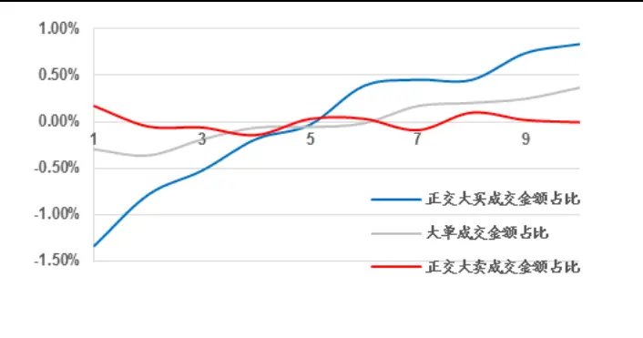
资料来源：Wind，海通证券研究所

图2 正交大单成交金额占比因子多空净值（全市场，0倍标准差，2014.01~2020.05）
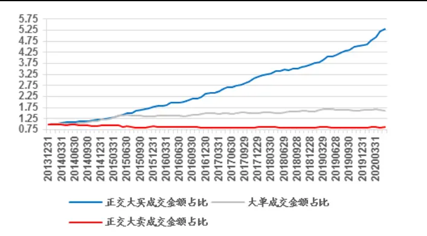
资料来源：Wind，海通证券研究所

下图展示中证 500 成分中三个因子中性化之后的多空收益与分组收益情况：

图3 正交大单成交金额占比因子分组收益（中证 500，0倍标准差，2014.01~2020.05）
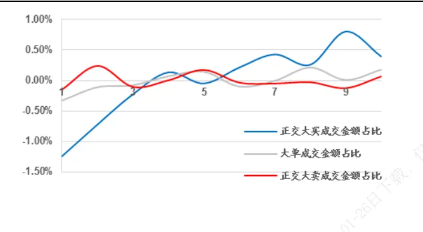
资料来源：Wind，海通证券研究所

图4 正交大单成交金额占比因子多空净值（中证 500，0倍标准差，2014.01~2020.05）
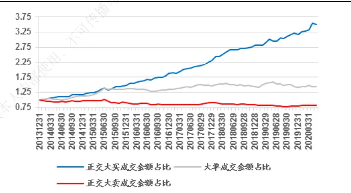
资料来源：Wind，海通证券研究所

下图展示沪深 300 成分中三个因子中性化之后的多空收益与分组收益情况：

图5 正交大单成交金额占比因子分组收益（沪深 300，0倍标准差，2014.01~2020.05）
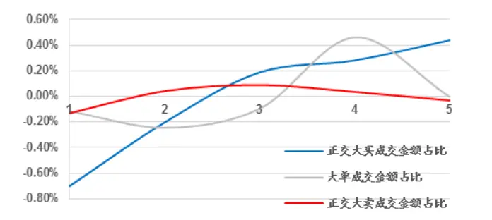
资料来源：Wind，海通证券研究所

图6 正交大单成交金额占比因子多空净值（沪深 300，0倍标准差，2014.01~2020.05）
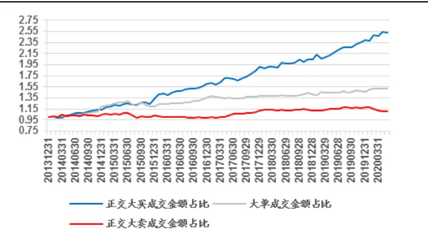
资料来源：Wind，海通证券研究所

自 2014 年以来，与大单成交金额占比因子正交后，大买成交金额占比因子依然有非常好的多空收益表现，整体的单调性也比较明显。与之对应，大卖成交金额占比多空净值几乎为 0，因子分组收益几乎没有区分度。

## 1.2进一步拆分后的大买与大卖成交金额占比因子

我们将逐笔成交数据根据所参与买卖单是否为大单进行进一步的拆分，构建以下因子：

剔除大卖的大买成交金额占比：买单由大单参与而卖单由非大单参与的成交金额占当天成交额比例。

剔除大买的大卖成交金额占比：卖单由大单参与而买单由非大单参与的成交金额占当天成交额比例。

大买、大卖成交金额占比：买单与买单均为大单所参与的成交金额占当天成交额比例。

因子截面表现如下表：

表 4 细分大单成交金额占比因子中性化后的截面选股能力（0倍标准差，2014.01~2020.05）

| 因子类型 | 因子名称 | IC 均值 | ICIR | IC 为正比率 | 多空收益 | 多头收益 |
| --- | --- | --- | --- | --- | --- | --- |
| 全市场 | 剔除大卖的大买成交金额占比 | 0.003 | 0.252 | 55% | 0.21% | 0.16% |
|  | 大买、大卖成交金额占比 | 0.045 | 3.879 | 87% | 1.57% | 0.55% |
|  | 剔除大买的大卖成交金额占比 | -0.062 | -5.280 | 3% | 2.20% | 0.80% |
| 中证500 | 剔除大卖的大买成交金额占比 | 0.003 | 0.223 | 47% | 0.27% | 0.03% |
|  | 大买、大卖成交金额占比 | 0.038 | 2.648 | 78% | 1.46% | 0.41% |
|  | 剔除大买的大卖成交金额占比 | -0.052 | -3.587 | 13% 可传播 | 1.80% | 0.49% |
| 沪深300 | 剔除大卖的大买成交金额占比 | -0.003 | -0.168 | 47% | 0.04% | -0.07% |
|  | 大买、大卖成交金额占比 | 0.037 | 2.113 | 75% | 0.90% | 0.25% |
|  | 剔除大买的大卖成交金额占比 | -0.052 | -2.783 | 22% | 1.17% | 0.45% |

资料来源：Wind，海通证券研究所

从截面选股效果来看，当同时由大买单与大卖单促成的成交额占比较高时，有显著的正向选股效果，而当大卖单与小额订单促成成交额占比较高时有较好的负向选股效果，大买单与小额单促成成交占比较高时，选股效果并不明显。

下图展示全市场范围内三个因子中性化之后的多空收益与分组收益情况：

图7 细分大单成交金额占比因子分组收益（全市场，0倍标准差，2014.01~2020.05）
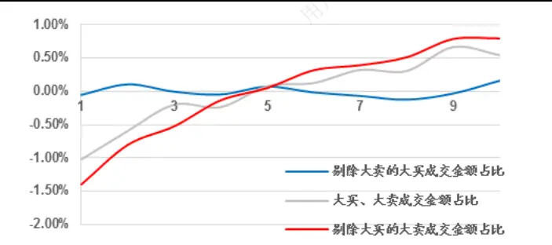
资料来源： ，海通证券研究所

图8 细分大单成交金额占比因子多空净值（全市场，0倍标准差，2014.01~2020.05）
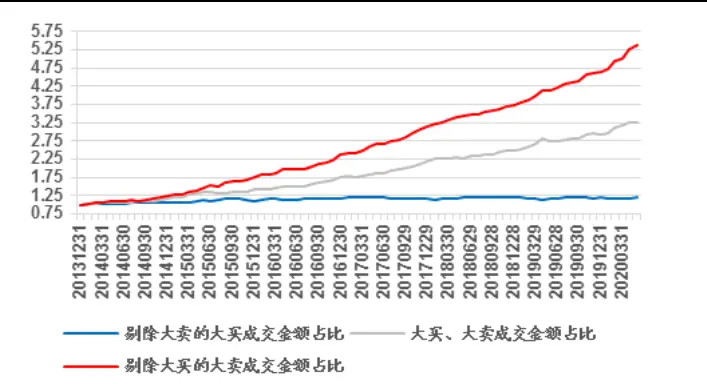
资料来源： ，海通证券研究所

下图展示中证 500 成分中三个因子中性化之后的多空收益与分组收益情况：

图9 细分大单成交金额占比因子分组收益（中证 500，0倍标准差，2014.01~2020.05）
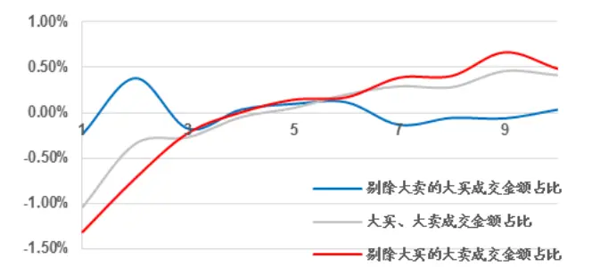
资料来源：Wind，海通证券研究所

图10 细分大单成交金额占比因子多空净值（中证 500，0倍标准差，2014.01~2020.05）
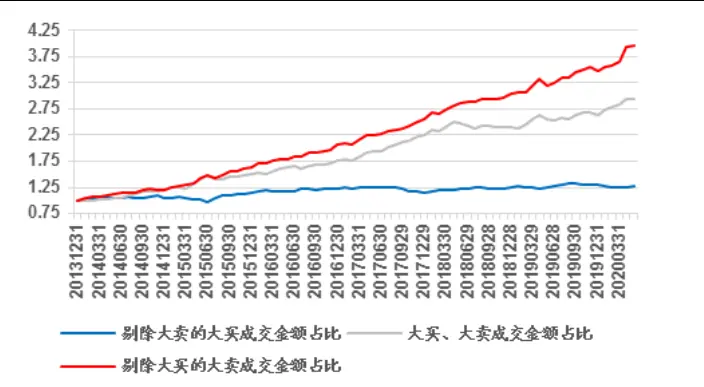
资料来源：Wind，海通证券研究所

下图展示沪深 300 成分中三个因子中性化之后的多空收益与分组收益情况：

图11 细分大单成交金额占比因子分组收益（沪深 300，0倍标准差，2014.01~2020.05）
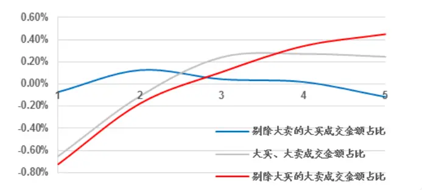
资料来源： ，海通证券研究所

图12 细分大单成交金额占比因子多空净值（沪深 300，0倍标准差，2014.01~2020.05）
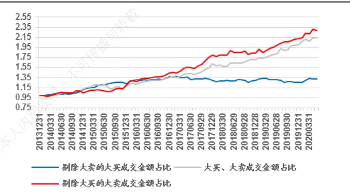
资料来源： ，海通证券研究所

从多空收益情况与分组收益情况也可以看出，剔除大额卖单参与的大单成交后，大买成交占比因子表现被削弱，而剔除大额买单参与的大单成交后，大卖成交占比因子有显著的负向选股效果。这说明无论其对手方是否为大资金，有大资金方买入的股票在未来一个月内会有相对于市场的正向超额收益。而对应大资金卖出的股票，只有当对手方不是大资金时，该股票在未来一个月内才会大概率有相对于市场的负向超额收益。

表 5 大单因子间的截面相关性（全市场，0倍标准差，2014.01~2020.05）

|  | 大买、大卖成交 金额占比 | 剔除大买的大卖 成交金额占比 | 大卖成交 金额占比 | 正交大卖成 交金额占比 | 剔除大卖的大买 成交金额占比 | 大买成交 金额占比 | 正交大买成 交金额占比 | 大单成交 金额占比 |
| --- | --- | --- | --- | --- | --- | --- | --- | --- |
| 大买、大卖成交金 额占比 |  | -0.73 | 0.74 | 0.54 | -0.56 | 0.87 | 0.71 | 0.66 |
| 剔除大买的大卖 成交金额占比 | -0.73 | - | -0.10 | 0.05 | -0.04 | -0.91 | -0.99 | -0.27 |
| 大卖成交金额占 比 | 0.74 | -0.10 |  | 0.84 | -0.86 | 0.38 | 0.08 | 0.71 |
| 正交大卖成交金 额占比 | 0.54 | 0.05 | 0.84 | - | -0.99 | 0.06 | -0.05 | 0.25 |
| 剔除大卖的大买 成交金额占比 | -0.56 | -0.04 | -0.86 | -0.99 |  | -0.08 | 0.05 | -0.28 |
| 大买成交金额占 比 | 0.87 | -0.91 | 0.38 | 0.06 | -0.08 |  | 0.89 | 0.63 |
| 正交大买成交金 额占比 | 0.71 | -0.99 | 0.08 | -0.05 | 0.05 | 0.89 |  | 0.23 |
| 大单成交金额占 比 | 0.66 | -0.27 | 0.71 | 0.25 | -0.28 | 0.63 | 0.23 | - |

资料来源：Wind，海通证券研究所

上表为所有大单因子的之间的截面相关性，我们可以从中发现以下特征：

1、 大买成交金额占比因子与大买、大卖成交金额占比因子相关性，显著高于大卖成交金额占比因子。分别与大单因子正交后，相关性差异更加显著。这一定程度说明大额买单与大额卖单共同促成成交的概率较高，相比较而言，大额卖单对手方为小额订单的概率会更高。

表 6 不同逐笔成交筛选条件下日成交金额占比分布（全市场，0倍标准差，2014.01~2020.05）

|  | 中位数 | 均值 | <=10% | <=20% | <=30% | <=40% | <=50% | <=60% | <=70% | <=80% | <=90% | <=100% |
| --- | --- | --- | --- | --- | --- | --- | --- | --- | --- | --- | --- | --- |
| 大单成交金额占 比 | 93% | 93% | 0% | 0% | 0% | 0% | 0% | 0% | 0% | 0% | 12% | 88% |
| 剔除大卖的大买 成交金额占比 | 14% | 14% | 16% | 74% | 9% | 0% | 0% | 0% | 0% | 0% | 0% | 0% |
| 大买、大卖成交金 额占比 | 61% | 61% | 0% | 0% | 0% | 0% | 1% | 41% | 55% | 3% | 0% | 0% |
| 剔除大买的大卖 成交金额占比 | 18% | 18% | 5% | 64% | 30% | 1% | 0% | 0% | 0% | 0% | 0% | 0% |

资料来源：Wind，海通证券研究所

由上表不同因子构建的逐笔成交筛选条件下，日成交金额占全天成交金额比例分布可以看出，相比较剔除大卖的大买成交金额占比，剔除大买的大卖成交金额占比保留成交信息更多，也以从另一个侧面说明上述观点。

、 剔除大买的大卖成交金额占比因子与正交大买成交金额占比有很强的负相关性，与剔除大卖的大买成交金额占比因子相关性极低。这似乎表示剔除大买的大卖成交金额占比因子有效的来源可能与正交大买成交金额占比相同。

## 1.3大单因子对传统指数增强组合多头表现

通过上文分析，我们得到大买成交金额占比因子，剔除大买的大卖成交金额占比因子，大买、大卖成交金额占比因子以及正交大买成交金额占比因子是我们发现的有较强选股能力因子。我们尝试将这些因子加入常用的市值、估值、盈利、换手等九个风格因子当中构建中证 500 与沪深 300 增强因子组合，考察其复合因子 IC情况如下表：

表 7 大单因子增强组合复合因子 IC（0 倍标准差，2014.01~2020.05）

| 因子类型 | 因子名称 | 复合IC | 复合ICIR | 复合多头IC | 复合多头ICIR |
| --- | --- | --- | --- | --- | --- |
| 中证500 | 9因子 | 0.067 | 5.793 | 0.012 | 4.630 |
|  | 大买、大卖成交金额占比 | 0.074 | 6.621 | 0.011 | 4.698 |
|  | 剔除大买的大卖成交金额占比 | 0.080 | 6.902 | 0.015 | 5.237 |
|  | 大买成交金额占比 | 0.077 | 6.859 | 0.013 | 5.091 |
|  | 正交大买成交金额占比 | 0.080 | 6.826 | 0.014 | 5.104 |
| 沪深300 | 9因子 | 0.051 | 4.221 | 0.013 | 2.681 |
|  | 大买、大卖成交金额占比 | 0.057 | 4.782 | 0.012 | 2.452 |
|  | 剔除大买的大卖成交金额占比 | 0.058 | 4.824 | 0.015 | 2.961 |
|  | 大买成交金额占比 | 0.059 | 4.958 | 0.013 | 2.749 |
|  | 正交大买成交金额占比 | 0.063 | 5.278 | 0.016 | 3.238 |

资料来源：Wind，海通证券研究所

从复合因子 IC角度来看，正交大买成交金额占比与剔除大买的大卖成交金额占比无论整体 IC还是多头 IC 均有更加优异的表现。而在中证 500 成分中，叠加剔除大买的大卖成交金额占比因子多头表现更优，在沪深 300 成分中，正交大买成交金额占比因子整体表现更强。

筛选各因子组合中，预期收益最大 50 个股票构建等权的最大预期收益组合，其相对于指数的分年度超额收益情况如下表：

表 8 大单因子中证 500增强最大预期收益组合分年度超额（0倍标准差，2014.01~2020.05）

| 年份 |  | 中证 500 指数 | 9因子 | 大买、大卖成交 金额占比 | 剔除大买的大卖 成交金额占比 | 大买成交金额占 比 | 正交大买成交金 额占比 |
| --- | --- | --- | --- | --- | --- | --- | --- |
| 2015 | 区间收益 | 43.12% | 88.97% | 95.54% | 80.56% | 93.17% | 82.55% |
|  | 月超额均值 |  | 2.63% | 2.97% | 2.27% | 2.84% | 2.30% |
|  | 月胜率 | - | 91.67% | 83.33% | 83.33% | 83.33% | 83.33% |
| 2016 | 区间收益 | -17.78% | -2.89% | -3.35% | -2.42% | -3.12% | -2.82% |
|  | 月超额均值 |  | 1.94% | 1.87% | 1.85% | 1.78% | 1.82% |
|  | 月胜率 | - | 84.62% | 84.62% | 84.62% | 84.62% | 84.62% |
| 2017 | 区间收益 | -0.20% | 7.18% | 2.28% | 9.72% | 6.55% | 9.54% |
|  | 月超额均值 |  | 0.61% | 0.22% | 0.78% | 0.60% | 0.77% |
|  | 月胜率 |  | 61.54% | 53.85% | 84.62% | 76.92% | 69.23% |
| 2018 | 区间收益 | -33.32% | -26.91% | -28.55% | -24.94% | -25.39% | -25.47% |
|  | 月超额均值 |  | 0.93% | 0.65% | 1.07% | 0.98% | 1.01% |
|  | 月胜率 | - | 46.15% | 61.54% | 76.92% | 92.31% | 76.92% |
| 2019 | 区间收益 | 26.38% | 32.78% | 35.75% | 34.14% | 32.03% | 34.36% |
|  | 月超额均值 |  | 0.60% | 0.77% | 0.71% | 0.60% | 0.71% |
|  | 月胜率 | - | 76.92% | 61.54% | 61.54% | 53.85% | 61.54% |
| 截止 2020 年5月 | 区间收益 | 2.63% | 15.23% | 16.47% | 25.60% | 17.49% | 19.93% |
|  | 月超额均值 |  | 1.90% | 1.90% | 3.42% | 1.91% | 2.53% |
|  | 月胜率 | - | 66.67% | 66.67% | 83.33% | 66.67% | 83.33% |
| 全区间 | 年化收益 | 0.29% | 15.67% | 15.51% | 17.95% | 16.69% | 16.94% |
|  | 月超额均值 |  | 1.26% | 1.26% | 1.44% | 1.34% | 1.35% |
|  | 月胜率 | = | 70.77% | 67.69% | 78.46% | 76.92% | 75.38% |

资料来源：Wind，海通证券研究所

与复合因子 IC情况相同，对于 500 增强组合而言，叠加剔除大买的大卖成交金额占比因子所构建的组合表现最为强势，无论是区间收益率，还是月均超额、月均胜率角下度，自 2016 年开始均可以稳健战胜指数，同时也稳定的强于原始的 9因子组合。6

对于 300 增强组合而言，叠加正交大买成交金额占比因子所构建的组合表现最为强02势。对应沪深 300 增强组合分年度表现如下表：3

表 9 大单因子沪深 300增强最大预期收益组合分年度超额（0倍标准差，2014.01~2020.05）

| 年份 |  | 沪深 300 指数 | 9因子 | 大买、大卖成交 金额占比 | 剔除大买的大卖 成交金额占比 | 大买成交金额占 比 | 正交大买成交金 额占比 |
| --- | --- | --- | --- | --- | --- | --- | --- |
| 2015 | 区间收益 | 5.58% | 43.25% | 34.05% | 37.73% | 35.06% | 32.35% |
|  | 月超额均值 |  | 2.79% | 2.19% | 2.41% | 2.23% | 2.04% |
|  | 月胜率 |  | 66.67% | 58.33% | 66.67% | 66.67% | 66.67% |
| 2016 | 区间收益 | -11.28% | -10.89% | -9.81% | -9.05% | -7.44% | -8.45% |
|  | 月超额均值 |  | 0.20% | 0.23% | 0.34% | 0.39% | 0.38% |
|  | 月胜率 |  | 53.85% | 61.54% | 61.54% | 61.54% | 53.85% |
| 2017 | 区间收益 | 21.78% | 14.47% | 16.90% | 18.10% | 16.50% | 19.92% |
|  | 月超额均值 |  | -0.31% | -0.14% | -0.10% | -0.15% | 0.14% |
|  | 月胜率 |  | 46.15% | 46.15% | 46.15% | 53.85% | 61.54% |
| 2018 | 区间收益 | -25.31% | -21.40% | -22.61% | -22.22% | -22.04% | -19.91% |
|  | 月超额均值 |  | 0.34% | 0.29% | 0.29% | 0.36% | 0.57% |
|  | 月胜率 |  | 61.54% | 46.15% | 61.54% | 69.23% | 69.23% |
| 2019 | 区间收益 月超额均值 | 36.07% | 22.25% | 24.21% | 25.26% | 23.87% | 28.10% |
|  |  |  | -0.78% | -0.62% | -0.61% | -0.64% | -0.44% |
|  | 月胜率 区间收益 |  | 46.15% | 46.15% | 46.15% | 30.77% | 38.46% |
| 截止 2020 年5月 | 月超额均值 | -5.60% | 14.56% | 12.75% | 13.79% | 13.13% | 11.27% |
|  |  |  | 3.23% | 2.81% | 3.07% | 2.98% | 2.80% |
|  | 月胜率 |  | 66.67% | 66.67% | 66.67% | 66.67% | 66.67% |
| 全区间 | 年化收益 | 1.68% | 9.17% | 8.19% | 9.56% | 8.95% | 9.79% |
|  | 月超额均值 |  | 0.69% | 0.61% | 0.71% | 0.66% | 0.73% |
|  | 月胜率 |  | 56.92% | 53.85% | 58.46% | 56.92% | 58.46% |

资料来源：Wind，海通证券研究所

相比较 500 增强，大单因子在沪深 300 当中的表现，无论从超额收益，月均超额均值与月胜率等维度上看，都有很大程度削弱，尤其与 9因子组合相比提升更加不明显。仅从多头端表现来说，大单因子对于组合在 300 当中的贡献没有 500 中明显。

## 2. 基于大单信息的逐笔交易过滤重构 K线因子

## 2.1基于大单信息的逐笔信息过滤

由上文中逐笔大单因子的构建，我们可以看出，相比较于没有大额买单或者大额卖单所参与的成交，有大额买单或者大额卖单所参与的成交似乎对于市场有更强的影响。

作为我们最常用的日内价量统计指标，分钟 K线本质上也可以被看作是过去一分钟当中所有逐笔成交信息的一个统计指标。结合不同逐笔信息对市场影响不同这一现象，我们尝试用过滤后的逐笔成交信息重新构建分钟 K线，然后再用重构后的 K线进行因子构建，比较原始 K线所构建因子，因子表现是否会有所提升。

图13 K线重构示意图
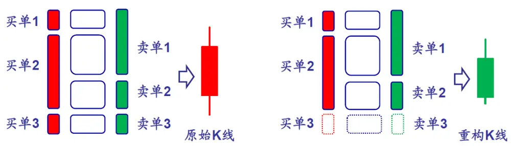
资料来源：海通证券研究所

利用上述重构的思想，我们选取上文中因子表现效果较好的 0倍标准差参数，分别保留大买和大卖订单参与成交，剔除大买的大卖订单参与成交，大买订单参与成交以及大买或大卖订单参与成交四种成交过滤模式，最后构建四组重构的 K线进行基于 K线的因子构建。

从因子构建的逻辑出发，我们对以下三个基于分钟 K线的高频因子进行重构，即

$$
\begin{array}{c}\begin{array}{r}{\mathbb{\tilde{\Sigma}}_{t=1}^{N}Amt_{t}\cdot I_{r_{t}<0}\Big/\sum_{t=1}^{N}TrdNum_{t}\cdot I_{r_{t}<0}}\\{+\mathbb{\Sigma}\backslash\tilde{\mathbf{\Sigma}}\stackrel{\mathrm{e}}{=}\mathbb{\tilde{\Sigma}}\langle\tilde{\mathbf{\Sigma}}\tilde{\mathbf{\Sigma}}\tilde{\mathbf{\Sigma}}\tilde{\mathbf{\Sigma}}\tilde{\mathbf{\Sigma}}\tilde{\mathbf{\Sigma}}\tilde{\mathbf{\Sigma}}\tilde{\mathbf{\Sigma}}\tilde{\mathbf{\Sigma}}\tilde{\mathbf{\Sigma}}\tilde{\mathbf{\Sigma}}\rangle\mathbb{\Sigma}\mathrm{\Sigma}\dot{\Sigma}\mathfrak{k}\mathrm{E}\mathrm{:\Sigma}}\end{array}=\frac{\sum_{t=1}^{N}Amt_{t}\cdot I_{r_{t}<0}\Big/\sum_{t=1}^{N}TrdNum_{t}\cdot I_{r_{t}<0}}{\sum_{t=1}^{N}Amt_{t}\cdot I\sum_{t=1}^{N}TrdNum_{t}}\end{array}
$$

其中， $Amt_{i}$ 代表第 i根 K线成交额， $TrdNum_{i}$ 代表第 i根 K线成交笔数， $\mathcal{F}_{{I_{r}}_{\mathrm{c}}0}$ 则代表第 i根 K线是否下跌。该因子希望可以刻画下跌时段的多空强度相对于全天所有时段的比例情况。

大单资金净流入率：

$$
=(\sum_{i=1}^{N}Amt_{i}\cdot I_{\{r_{i}>0,i\epsilon IdxSet\}}-\sum_{i=1}^{N}Amt_{i}\cdot I_{\{r_{i}<0,i\epsilon IdxSet\}})/\sum_{i=1}^{N}Amt_{i}
$$

$$
\bigstar\bigstar\bigstar|\bigstar\bigstar\bigstar\bigstar\bigstar|\bigstar\bigstar||\bigstar\bigstar||\bigstar\bigstar||\bigstar\bigstar
$$

在这里我们进一步定义了大单 K线的概念，即 $I_{\{J\epsilon IdxSet\}}.$ 表示该 K线是否为全天所有K线当中，平均每笔成交额最大的前 10%的 K线。

对于平均单笔流出金额占比因子而言，过滤掉部分小单成交信息有助于其规避部分小单成交对分钟 K线涨跌判断的干扰。对于大单分钟 K线的确认而言，通过订单层面对于成交进行先期的过滤更可以提升其大单定义的精度。

## 2.2重构 K线因子的截面选股效果

考察不同筛选方式下的重构后三个因子截面选股效果，如下表：

表 10 重构 K线因子截面选股能力（全市场，0倍标准差，2014.01~2020.05）

| 因子类型 | 因子名称 | IC 均值 | ICIR | IC 为正比率 | 多空收益 | 多头收益 |
| --- | --- | --- | --- | --- | --- | --- |
| 平均单笔流出金额占比 | 原始 K线 | -0.020 | -2.381 | 26% | 0.88% | 0.34% |
|  | 大买、大卖订单参与 | -0.012 | -1.642 | 32% | 0.62% | 0.24% |
|  | 剔除大买的大卖订单参与 | -0.005 | -0.549 | 48% | 0.10% | 0.14% |
|  | 大买订单参与 | -0.009 | -0.986 | 43% | 0.42% | 0.17% |
|  | 大买或大卖订单参与 | -0.022 | -2.765 | 18% | 1.01% | 0.54% |
| 大单资金净流入率 | 原始K线 | 0.023 | 3.080 | 83% | 1.11% | 0.51% |
|  | 大买、大卖订单参与 | 0.010 | 1.500 | 68% | 0.48% | 0.23% |
|  | 剔除大买的大卖订单参与 | 0.004 | 0.488 | 56% | 0.13% | 0.18% |
|  | 大买订单参与 | 0.013 | 1.076 | 68% | 0.42% | 0.06% |
|  | 大买或大卖订单参与 | 0.027 | 3.980 | 87% | 1.15% | 0.60% |
| 大单推动涨幅 | 原始 K线 | -0.030 | -3.377 | 19% | 1.14% | 0.23% |
|  | 大买、大卖订单参与 | -0.021 | -2.931 | 18% | 0.83% | 0.10% |
|  | 剔除大买的大卖订单参与 | -0.026 | -2.220 | 21% | 0.85% | 0.13% |
|  | 大买订单参与 | 0.003 | 0.221 | 49% | 0.22% | -0.32% |
|  | 大买或大卖订单参与 | -0.035 | -3.852 | 13% | 1.44% | 0.50% |

资料来源： ，海通证券研究所

由上表可见，相比较用原始 K 线所构建的因子，只有利用保留了大买或大卖订单参与这种过滤方式重构 K线所构建的三个因子有明显的效果提升，剩下过滤方式构建因子截面选股效果均有所减弱。

这可能是由两方面原因造成，首先，相比较其它过滤方式，保留了大买或大卖订单参与的成交这种方式可以最大程度的保留当天的成交信息。如表 所示，该方式相比较大买、大卖订单参与这种过滤方式，平均多保留了 30%的成交信息。其次，保留大买订单参与或者剔除大买的大卖订单参与在剔除了更多成交信息同时，也让所保留信息带有一定的正向或负向选股效果，而这种效果有可能与基于分钟 K线的因子构建模式冲突，从而对于该因子最终的选股效果有进一步的干扰。

进一步考察大买或大卖订单参与重构方式在中证 500 与沪深 300 中选股效果如下表：

表 11 细分大单成交金额占比因子中性化后的截面选股能力（0倍标准差，2014.01~2020.05）

| 因子类型 | 因子名称 | IC 均值 | ICIR | IC 为正比率 | 多空收益 | 多头收益 |
| --- | --- | --- | --- | --- | --- | --- |
| 中证500 | 平均单笔流出金额占比（原始K线） | -0.018 | -1.630 | 36% | 0.88% | 0.23% |
|  | 平均单笔流出金额占比（重构K线） | -0.021 | -1.784 | 30% | 0.92% | 0.45% |
|  | 大单资金净流入率（原始K线） | 0.021 | 1.853 | 66% | 0.86% | 0.26% |
|  | 大单资金净流入率（重构K线） | 0.024 | 2.296 | 71% | 0.93% | 0.41% |
|  | 大单推动涨幅（原始 K线） | -0.029 | -2.481 | 22% | 1.29% | 0.32% |
|  | 大单推动涨幅比（重构K线） | -0.030 | -2.643 | 22% | 1.38% | 0.51% |
| 沪深300 | 平均单笔流出金额占比（原始K线） | -0.016 | -1.119 | 38% | 0.16% | 0.14% |
|  | 平均单笔流出金额占比（重构K线） | -0.015 | -0.983 | 40% | 0.31% | 0.18% |
|  | 大单资金净流入率（原始K线） | 0.014 | 1.004 | 58% | 0.26% | 0.10% |
|  | 大单资金净流入率（重构K线） | 0.016 | 1.121 | 61% | 0.41% | 0.17% |
|  | 大单推动涨幅（原始K线） | -0.017 | -0.971 | 40% | 0.37% | 0.10% |
|  | 大单推动涨幅比（重构K线） | -0.020 | -1.056 | 39% | 0.57% | 0.28% |

资料来源： ，海通证券研究所

由上表可见，K线重构方法在中证 500 中对于三个因子选过效果提升较为明显，并且无论在中证 500 还是全市场范围内，都会对于单因子多头选股效果有进一步的加强。

由于原始 K线因子在沪深 300 成分中选股效果本身并不理想，对应重构后对于原始因子的效果提升也不显著。

## 2.3重构 K线因子中证 500 增强组合多头表现

基于上文所述重构因子的单因子表现情况，我们考虑将重构后因子加入九因子当中，构建中证 500 增强组合，其表现情况如下表：

表 12 重构 K 线因子 500 增强组合复合因子 IC（0 倍标准差，2014.01~2020.05）

| 因子名称 | 复合IC | 复合ICIR | 复合多头IC | 复合多头ICIR |
| --- | --- | --- | --- | --- |
| 平均单笔流出金额占比（原始K线） | 0.070 | 6.302 | 0.012 | 4.877 |
| 平均单笔流出金额占比（重构K线） | 0.070 | 6.377 | 0.013 | 4.973 |
| 大单资金净流入率（原始K线） | 0.071 | 6.384 | 0.012 | 4.641 |
| 大单资金净流入率（重构K线） | 0.071 | 6.476 | 0.014 | 5.298 |
| 大单推动涨幅（原始K线） | 0.073 | 6.616 | 0.013 | 4.501 |
| 大单推动涨幅比（重构K线） | 0.073 | 6.660 | 0.011 | 4.348 |

资料来源：Wind，海通证券研究所

对比重构 K线因子与原始 K线因子的复合因子 IC情况，重构 K线因子的整体复合因子 均有一定程度的提升。而从多头端来看，平均单笔流出金额占比因子与大单资金净流入因子改善明显，大单推动涨幅因子多头端却略有削弱。

表 13 构 K线因子 500增强最大预期收益组合分年度超额（0倍标准差，2014.01~2020.05）

| 年份 |  | 中证500 指数 | 9因子 | 平均单笔成 交金额占比 (原始 K线) | 平均单笔成 交金额占比 (重构K线) | 大单资金净 流入率(原始 K线） | 大单资金净 流入率（重构 K线） | 大单推动涨 幅（原始K 线） | 大单推动涨 幅（重构K 线） |
| --- | --- | --- | --- | --- | --- | --- | --- | --- | --- |
| 2015 | 区间收益 | 43.12% | 88.97% | 96.98% | 88.48% | 89.51% | 94.00% | 91.94% | 100.49% |
|  | 月超额均值 |  | 2.63% | 2.95% | 2.58% | 2.60% | 2.83% | 2.75% | 3.16% |
|  | 月胜率 |  | 91.67% | 83.33% | 83.33% | 91.67% | 83.33% | 91.67% | 91.67% |
| 2016 | 区间收益 | -17.78% | -2.89% | -2.86% | -2.16% | -1.99% | -2.16% | -5.09% | -2.70% |
|  | 月超额均值 | - | 1.94% | 1.93% | 1.97% | 1.96% | 1.92% | 1.72% | 1.97% |
|  | 月胜率 | - | 84.62% | 84.62% | 76.92% | 76.92% | 76.92% | 69.23% | 76.92% |
| 2017 | 区间收益 | -0.20% | 7.18% | 4.13% | 3.34% | 1.72% | 5.85% | 6.66% | 1.64% |
|  | 月超额均值 |  | 0.61% | 0.33% | 0.30% | 0.18% | 0.49% | 0.52% | 0.18% |
|  | 月胜率 |  | 61.54% | 61.54% | 61.54% | 61.54% | 61.54% | 61.54% | 53.85% |
| 2018 | 区间收益 | -33.32% | -26.91% | -29.60% | -29.05% | -27.29% | -26.00% | -29.06% | -27.23% |
|  | 月超额均值 |  | 0.93% | 0.64% | 0.62% | 0.81% | 0.91% | 0.66% | 0.78% |
|  | 月胜率 | - | 46.15% | 53.85% | 61.54% | 46.15% | 53.85% | 69.23% | 61.54% |
| 2019 | 区间收益 | 26.38% | 32.78% | 32.04% | 36.50% | 29.82% | 33.53% | 30.70% | 26.04% |
|  | 月超额均值 |  | 0.60% | 0.56% | 0.85% | 0.39% | 0.66% | 0.58% | 0.31% |
|  | 月胜率 | - | 76.92% | 76.92% | 84.62% | 69.23% | 84.62% | 69.23% | 61.54% |
| 截止 2020 年5月 | 区间收益 | 2.63% | 15.23% | 15.76% | 17.09% | 16.10% | 15.87% | 17.29% | 13.61% |
|  | 月超额均值 |  | 1.90% | 1.99% | 2.29% | 2.04% | 2.11% | 2.26% | 1.78% |
|  | 月胜率 | - | 66.67% | 66.67% | 83.33% | 66.67% | 83.33% | 66.67% | 50.00% |
| 全区间 | 年化收益 | 0.29% | 15.67% | 15.12% | 15.29% | 14.38% | 16.63% | 14.81% | 14.33% |
|  | 月超额均值 |  | 1.26% | 1.23% | 1.23% | 1.16% | 1.33% | 1.21% | 1.18% |
|  | 月胜率 |  | 70.77% | 70.77% | 72.31% | 67.69% | 70.77% | 70.77% | 66.15% |

资料来源： ，海通证券研究所

从多头组合收益来看，用重构 K线方法构建的平均单笔流出金额占比因子与大单资金净流入因子相较于原始 K线因子有显著提升，尤其最近两年提升较为明显。而大单推动涨幅因子提升则不太稳定。

## 2.4K线因子与逐笔大单因子的结合

从上文描述中，我们挖掘到剔除大买的大卖成交金额占比因子与正交大买成交金额占比因子是表现较好的两个大单因子。对应以大买或大卖订单参与方式对于分钟 K线进行重构，重构后 K线所计算的平均单笔流出金额占比，大单资金净流入率与大单推动涨幅三个因子，其因子表现相较于利用原始 K线计算的这三个高频因子更佳。

由于大单因子有更强的截面选股效果，在这里我们将 K线因子分别与两个大单因子正交，考察其剥离大单因子影响后的选股效果，以及不同 K线因子与大单因子的相关性情况。具体情况如下表：

表 14 正交大单因子后的 K线因子表现（中证 500，0倍标准差，2014.01~2020.05）

| 大单因子 | K线因子 | IC 均值 | ICIR | IC 为正比率 | 多空收益 | 多头收益 | 相关系数 |
| --- | --- | --- | --- | --- | --- | --- | --- |
| 剔除大买的 大卖成交金 额占比 | 平均单笔流出金额占比（原始K线） | -0.020 | -1.817 | 34% | 1.08% | 0.38% | -0.02 |
|  | 平均单笔流出金额占比（重构K线） | -0.020 | -1.733 | 29% | 0.92% | 0.41% | -0.11 |
|  | 大单资金净流入率（原始K线） | 0.019 | 1.745 | 65% | 0.85% | 0.29% | 0.01 |
|  | 大单资金净流入率（重构K线） | 0.015 | 1.493 | 61% | 0.93% | 0.46% | 0.04 |
|  | 大单推动涨幅（原始K线） | -0.027 | -2.356 | 26% | 1.11% | 0.18% | 0.04 |
| 正交大买成 交金额占比 | 大单推动涨幅比（重构K线） 平均单笔流出金额占比（原始K线） | -0.024 | -2.162 | 23% | 1.04% | 0.30% | 0.10 |
|  |  | -0.020 | -1.817 | 34% | 1.07% | 0.37% | 0.02 |
|  | 平均单笔流出金额占比（重构K线） | -0.020 | -1.732 | 29% | 0.90% | 0.39% | 0.11 |
|  | 大单资金净流入率（原始K线） | 0.020 | 1.775 | 65% | 0.90% | 0.31% | -0.01 |
|  | 大单资金净流入率（重构K线） 大单推动涨幅（原始K线） | 0.015 -0.028 | 1.532 -2.383 部使用， | 62% 26% | 0.90% | 0.45% | -0.04 |
|  | 大单推动涨幅比（重构K线） | -0.025 | -2.185 | 22% | 1.17% 1.04% | 0.21% 0.30% | -0.04 -0.10 |

资料来源： ，海通证券研究所

由于所选大单因子间有较高相关性，同一因子分别与这两个因子正交后效果差异很小。从正交后表现来看，原始 K线因子截面选股效果更佳明显。重构 K线因子与大单因子有更高的相关性，正交后将大单影响剥离，重构因子表现相对下降，也侧面说明重构K线相对原始 K线信息增益来自于大单特性。

考察利用 9 因子叠加不同大单因子与 K线因子构建 500 增强组合，表现如下表：

表 15 K 线因子、大单因子组合复合因子 IC（中证 500，0 倍标准差，2014.01~2020.05）

| 大单因子 | K线因子 | 复合IC | 复合ICIR | 复合多头IC | 复合多头ICIR | 多头组合年化收益 |
| --- | --- | --- | --- | --- | --- | --- |
| 9因子 |  | 0.067 | 5.793 | 0.012 | 4.630 | 15.67% |
| 剔除大买的 大卖成交金 额占比 | 不叠加K线因子 | 0.080 | 6.902 | 0.015 | 5.237 | 17.95% |
|  | 平均单笔流出金额占比（原始K线） | 0.084 | 7.173 | 0.016 | 5.753 | 18.67% |
|  | 平均单笔流出金额占比（重构K线） | 0.083 | 7.173 | 0.015 | 5.757 | 17.88% |
|  | 大单资金净流入率（原始K线） | 0.085 | 7.251 | 0.016 | 5.467 | 17.25% |
|  | 大单资金净流入率（重构K线） | 0.084 | 7.233 | 0.015 | 5.536 | 16.74% |
|  | 大单推动涨幅（原始K线） | 0.085 | 7.075 | 0.015 | 5.231 | 17.22% |
|  | 大单推动涨幅比（重构K线） | 0.085 | 7.047 | 0.014 | 4.790 | 15.71% |
| 正交大买成 交金额占比 | 不叠加K线因子 | 0.080 | 6.826 | 0.014 | 5.104 | 16.94% |
|  | 平均单笔流出金额占比（原始K线） | 0.083 | 7.019 | 0.016 | 5.882 | 19.87% |
|  | 平均单笔流出金额占比（重构K线） | 0.083 | 7.021 | 0.016 | 5.944 | 19.22% |
|  | 大单资金净流入率（原始K线） | 0.085 | 7.099 | 0.016 | 5.622 | 19.18% |
|  | 大单资金净流入率（重构K线） | 0.084 | 7.089 | 0.016 | 5.746 | 18.79% |
|  | 大单推动涨幅（原始K线） | 0.085 | 6.943 | 0.015 | 5.380 | 17.81% |
|  | 大单推动涨幅比（重构K线） | 0.085 | 6.922 | 0.015 | 5.025 | 17.39% |

资料来源：Wind，海通证券研究所

从复合因子 IC角度来看，无论是整体 IC情况还是多头端 IC情况，重构 K线叠加大单效果相比较原始 K线均有一定程度降低，某种意义上来说重构方法与大单因子相对较高的线性相关性一定程度影响了因子叠加效果。

从两个大单因子分别叠加 K线因子情况来看，正交大买成交金额占比因子在叠加 K线因子后表现提升更为显著。从复合因子 IC 多头端来看，正交大买成交金额占比因子叠加平均单笔流出金额占比因子后，在所有多头组合中表现最为优异。

## 3. 总结

我们往往希望以大买成交金额占比因子代表大资金买入意愿，大卖成交金额占比代表大资金卖出意愿。大资金往往具有信息优势，我们希望通过大买、大卖金额成交占比指标，捕捉大资金买卖行为，对股票截面收益进行预测。从因子有效性上来看，这种方法的确可以一定程度获取有效的市场预测信息。

这篇报告我们更多依然以构建传统月频选股因子为目标，但我们如果观察两个表现较好的大单因子：剔除大买的大卖成交金额占比与正交大买成交金额占比因子，对于月中不同区间内收益的预测效果，如下表：

表 16 大单因子月中不同时间区间收益预测效果(全市场，0倍标准差，2014.01~2020.05)

| 剔除大买的大卖成交金额占比 |  |  | 正交大买成交金额占比 |
| --- | --- | --- | --- |
| 第 1 至第 3 交易日 | IC | -0.033 | 0.031 |
|  | ICIR | -2.885 不可传 | 2.653 |
|  | IC 为正比率 | 25% | 73% |
| 第 4 至第 6 交易 日 | IC | -0.025 | 0.024 |
|  | ICIR 人内部使用 | -2.304 | 2.254 |
|  | IC 为正比率 | 26% | 73% |
| 第 7至第 9 交易日 26日下载 | IC | -0.023 | 0.023 |
|  | ICIR | -1.968 | 1.924 |
|  | IC 为正比率 | 26% | 70% |
| 1-01- 第 10 至第 12 交易日 | IC | -0.016 | 0.015 |
|  | ICIR | -1.744 | 1.692 |
|  | IC 为正比率 | 30% | 70% |
| 77753973于 第 13 至第 15 交易日 | IC | -0.016 | 0.016 |
|  | ICIR | -1.379 | 1.357 |
|  | IC 为正比率 | 40% | 60% |

资料来源：Wind，海通证券研究所

因子值对于区间收益的预测能力随时间推移而下降，对于 10 个交易日之后的区间收益，预测能力下降显著。因此如何将大单指标应用于短周期策略当中，尤其是时间序列相关策略，是未来重要的研究方向。

对于高频数据进行某种处理，然后重新构建低频技术面指标是海外高频交易机构常用的一种指标构建方法。这里利用大单的选股效用进行了重构尝试，未来也会进一步尝试不同的过滤参数对于所重构指标的影响。更进一步的，也会从原理和表现两方面进一步研究还有哪些过滤方法值得尝试，哪些高频数据可以用来作为重构的基础数据，以及哪些常用低频指标可以利用重构的方式提升其效果。

## 4. 风险提示

市场系统性风险、模型误设风险、有效因子变动风险。

# 信息披露

分析师声明

[Table冯佳睿yst金融工程研究团队s]

余浩淼金融工程研究团队

本人具有中国证券业协会授予的证券投资咨询执业资格，以勤勉的职业态度，独立、客观地出具本报告。本报告所采用的数据和信息均来自市场公开信息，本人不保证该等信息的准确性或完整性。分析逻辑基于作者的职业理解，清晰准确地反映了作者的研究观点，结论不受任何第三方的授意或影响，特此声明。

## 法律声明

本报告仅供海通证券股份有限公司（以下简称 本公司 ）的客户使用。本公司不会因接收人收到本报告而视其为客户。在任何情况下，本报告中的信息或所表述的意见并不构成对任何人的投资建议。在任何情况下，本公司不对任何人因使用本报告中的任何内容所引致的任何损失负任何责任。载

本报告所载的资料、意见及推测仅反映本公司于发布本报告当日的判断，本报告所指的证券或投资标的的价格、价值及投资收入可能会波动。在不同时期，本公司可发出与本报告所载资料、意见及推测不一致的报告。传播

市场有风险，投资需谨慎。本报告所载的信息、材料及结论只提供特定客户作参考，不构成投资建议，也没有考虑到个别客户特殊的不投资目标、财务状况或需要。客户应考虑本报告中的任何意见或建议是否符合其特定状况。在法律许可的情况下，海通证券及其所属用关联机构可能会持有报告中提到的公司所发行的证券并进行交易，还可能为这些公司提供投资银行服务或其他服务。部

本报告仅向特定客户传送，未经海通证券研究所书面授权，本研究报告的任何部分均不得以任何方式制作任何形式的拷贝、复印件或复制品，或再次分发给任何其他人，或以任何侵犯本公司版权的其他方式使用。所有本报告中使用的商标、服务标记及标记均为本公司的商标、服务标记及标记。如欲引用或转载本文内容，务必联络海通证券研究所并获得许可，并需注明出处为海通证券研究所，且不得对本文进行有悖原意的引用和删改。

根据中国证监会核发的经营证券业务许可，海通证券股份有限公司的经营范围包括证券投资咨询业务。1-

## 海通证券股份有限公司研究所[Table_PeopleInfo]

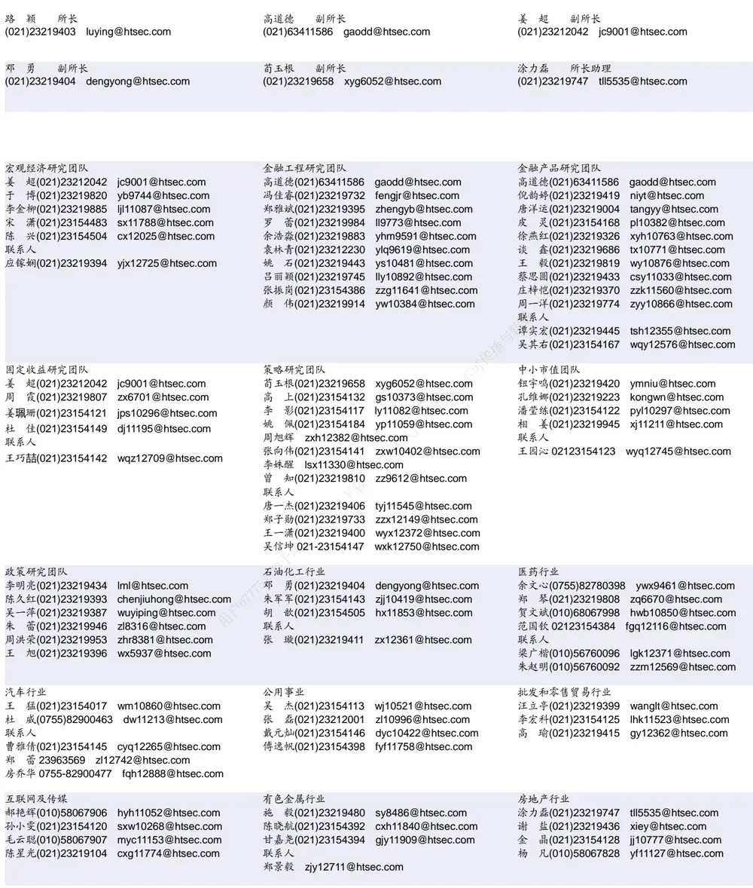

| 电子行业 |  | 煤炭行业 |  | 电力设备及新能源行业 |  |  |  |
| --- | --- | --- | --- | --- | --- | --- | --- |
|  | 陈 平(021)23219646 cp9808@htsec.com |  | 李 淼(010)58067998 Im10779@htsec.com |  | 张一弛(021)23219402 |  | zyc9637@htsec.com |
|  | 尹 苓(021)23154119 yi11569@htsec.com |  |  | 戴元灿(021)23154146 dyc10422@htsec.com | 房 青(021)23219692 |  | fangq@htsec.com |
|  | 谢 磊(021)23212214 xl10881@htsec.com |  | 吴 杰(021)23154113 wj10521@htsec.com |  |  | 曾 彪(021)23154148 zb10242@htsec.com |  |
|  | 蒋 俊(021)23154170 jj11200@htsec.com |  | 联系人 |  |  | 徐柏乔(021)23219171 xbq6583@htsec.com |  |
| 联系人 |  |  |  | 王 涛(021)23219760 wt12363@htsec.com |  | 陈佳彬(021)23154513 cjb11782@htsec.com |  |

| 基础化工行业 |  | 计算机行业 | 通信行业 |  |
| --- | --- | --- | --- | --- |
| 刘 威(0755)82764281 Iw10053@htsec.com |  | 郑宏达(021)23219392 zhd10834@htsec.com | 朱劲松(010)50949926 zjs10213@htsec.com |  |
| 刘海荣(021)23154130 Ihr10342@htsec.com |  | 杨 林(021)23154174 yl11036@htsec.com | 余伟民(010)50949926 ywm11574@htsec.com |  |
| 张翠翠(021)23214397 zcc11726@htsec.com |  | 于成龙 ycl12224@htsec.com | 张峥青(021)23219383 zzq11650@htsec.com |  |
| 孙维容(021)23219431 | swr12178@htsec.com | 黄竞晶(021)23154131 hjj10361@htsec.com | 张 弋01050949962 zy12258@htsec.com |  |
| 李 智(021)23219392 lz11785@htsec.com |  | 洪 琳(021)23154137 hl11570@htsec.com | 联系人 | 杨彤昕 010-56760095 ytx12741@htsec.com |

| 非银行金融行业 |  | 交通运输行业 |  | 纺织服装行业 |  |
| --- | --- | --- | --- | --- | --- |
|  | 孙 婷(010)50949926 st9998@htsec.com |  | 虞 楠(021)23219382 yun@htsec.com |  | 梁 希(021)23219407 lx11040@htsec.com |
|  | 何 婷(021)23219634 ht10515@htsec.com |  | 罗月江（010）56760091 lyj12399@htsec.com |  | 盛 开(021)23154510 sk11787@htsec.com |
|  | 李芳洲(021)23154127 Ifz11585@htsec.com |  | 李 轩(021)23154652 lx12671@htsec.com | 联系人 |  |
| 联系人 |  |  | 陈 宇(021)23219442 cy13115@htsec.com |  | 刘 溢(021)23219748 ly12337@htsec.com |

| 建筑建材行业 | 机械行业 | 钢铁行业 |
| --- | --- | --- |
| 冯晨阳(021)23212081 fcy10886@htsec.com | 余炜超(021)23219816 swc11480@htsec.com | 刘彦奇(021)23219391 liuyq@htsec.com |
| 潘莹练(021)23154122 pyl10297@htsec.com | 周 丹 zd12213@htsec.com | 周慧琳(021)23154399 zhl11756@htsec.com |
| 申 浩(021)23154114 sh12219@htsec.com | 联系人 | 悉与转载 |
| 杜市伟(0755)82945368 dsw11227@htsec.com 颜慧菁 yhj12866@htsec.com | 吉 晟(021)23154653 js12801@htsec.com |  |

| 建筑工程行业 | 农林牧渔行业 |  | 食品饮料行业 |
| --- | --- | --- | --- |
| 张欣劫 zxj12156@htsec.com | 丁 频(021)23219405 dingpin@htsec.com |  | 闻宏伟(010)58067941 whw9587@htsec.com |
| 李富华(021)23154134 Ifh12225@htsec.com | 联系人 | 陈 阳(021)23212041 cy10867@htsec.com | 唐 宇(021)23219389 ty11049@htsec.com 颜慧菁 yhj12866@htsec.com |
| 杜市伟(0755)82945368 dsw11227@htsec.com | 孟亚琦(021)23154396 myq12354@htsec.com |  | 张宇轩(021)23154172 zyx11631@htsec.com |
|  |  |  | 联系人 程碧升(021)23154171 cbs10969@htsec.com |

| 军工行业 | 银行行业 | 社会服务行业 |
| --- | --- | --- |
| 张恒晅 zhx10170@htsec.com | 孙 婷(010)50949926 st9998@htsec.com | 汪立亭(021)23219399 wanglt@htsec.com |
| 张高艳 0755-82900489 zgy13106@htsec.com | 解巍巍 xww12276@htsec.com | 陈扬扬(021)23219671 cyy10636@htsec.com |
| 联系人 | 林加力(021)23154395 ljl12245@htsec.com | 许樱之 xyz11630@htsec.com |
| 刘砚菲021-2321-4129 lyf13079@htsec.com | 谭敏沂(0755)82900489 tmy10908@htsec.com |  |

| 家电行业 | 造纸轻工行业 |  |
| --- | --- | --- |
| 陈子仪(021)23219244 chenzy@htsec.com |  | 衣桢永(021)23212208 yzy12003@htsec.com |
| 李 阳(021)23154382 ly11194@htsec.com |  |  |
| 朱默辰(021)23154383 zmc11316@htsec.com |  |  |
| 刘 璐(021)23214390 II11838@htsec.com |  |  |

## 研究所销售团队

深广地区销售团队

蔡铁清(0755)82775962 ctq5979@htsec.com

伏财勇(0755)23607963 fcy7498@htsec.com

辜丽娟(0755)83253022 gulj@htsec.com

刘晶晶(0755)83255933 liujj4900@htsec.com

饶 伟(0755)82775282 rw10588@htsec.com

欧阳梦楚(0755)23617160

oymc11039@htsec.com

巩柏含 gbh11537@htsec.com

上海地区销售团队
胡雪梅(021)23219385 huxm@htsec.com
朱 健(021)23219592 zhuj@htsec.com
季唯佳(021)23219384 jiwj@htsec.com
黄 毓(021)23219410 huangyu@htsec.com
漆冠男(021)23219281 qgn10768@htsec.com
胡宇欣(021)23154192 hyx10493@htsec.com
黄 诚(021)23219397 hc10482@htsec.com
毛文英(021)23219373 mwy10474@htsec.com
马晓男 mxn11376@htsec.com
杨祎昕(021)23212268 yyx10310@htsec.com
张思宇 zsy11797@htsec.com
王朝领 wcl11854@htsec.com
邵亚杰 23214650 syj12493@htsec.com
李 寅 021-23219691 ly12488@htsec.com北京地区销售团队
殷怡琦(010)58067988 yyq9989@htsec.com郭 楠 010-5806 7936 gn12384@htsec.com张丽萱(010)58067931 zlx11191@htsec.com杨羽莎(010)58067977 yys10962@htsec.com何 嘉(010)58067929 hj12311@htsec.com李 婕 lj12330@htsec.com
欧阳亚群 oyyq12331@htsec.com
郭金垚(010)58067851 gjy12727@htsec.com

海通证券股份有限公司研究所

地址：上海市黄浦区广东路 689号海通证券大厦 9楼

电话：（021）23219000

传真：（021）23219392

网址：www.htsec.com