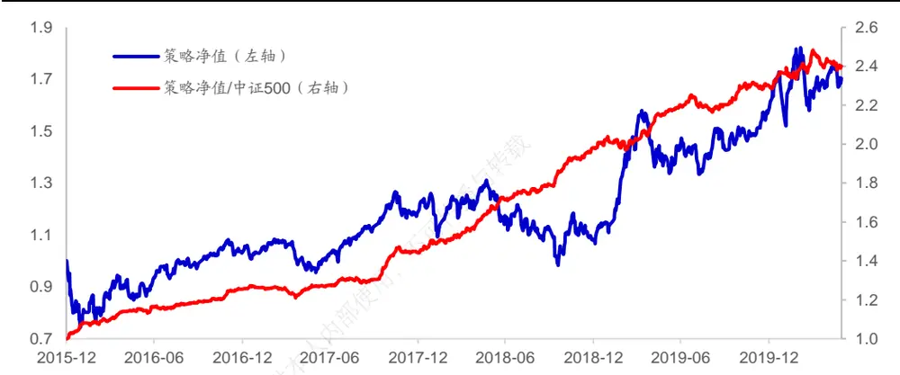
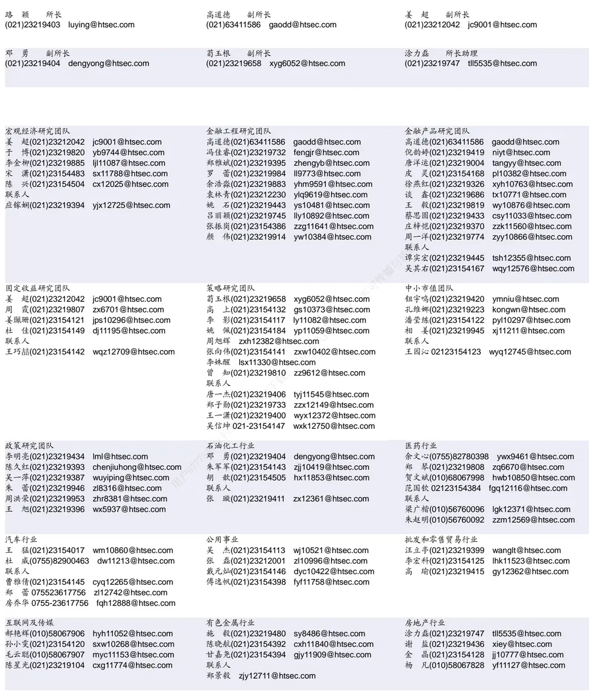

## [Tab相关研究

Table_ReportInfo]《选股因子系列研究（五十八）——知情交易与主买主卖》2020.02.12

《选股因子系列研究（五十七）——基于主动买入行为的选股因子》2020.01.10《选股因子系列研究（五十六）——买卖单数据中的 Alpha》2019.11.05

分析师:冯佳睿

Tel:(021)23219732

Email:fengjr@htsec.com

证书:S0850512080006

分析师:袁林青

Tel:(021)23212230

Email:ylq9619@htsec.com

证书:S0850516050003

# 选股因子系列研究（六十七）——短周期高频因子与组合调仓收益增强

## 投资要点：

系列前期研究结果表明，高频因子具有较为显著的选股能力，并且随着换仓频率的提升，因子的选股能力能得到进一步的增强。考虑到高频因子在组合应用中遇到的问题，本文构建了高频因子调仓优化策略。该策略在组合调仓中利用高频因子的短周期选股能力进行收益增强，从而在不明显影响组合换手率以及组合换仓频率的前提下，进一步增强组合收益。

- 高频因子具有显著的选股能力，且预测周期越短，因子的选股能力越强。使用2014 年以来的高频数据分别构建尾盘成交占比、改进反转、下行波动占比、开盘后日内买入意愿强度因子，并正交剔除常规低频因子的影响。在不同因子计算回看窗口下，调仓频率越高，因子的多空年化收益越高。

- 可在组合调仓中应用高频因子进行收益增强。虽然理论上投资者可通过提升组合调仓频率并将高频因子放入 模型来获取高频因子的短周期选股能力，但是高频因子的引入存在诸多障碍。可在组合调仓时应用高频因子进行调仓优化，从而在增强收益的同时不改变组合调仓频率以及换手率。

- 单因子调仓优化策略具有一定的收益增强能力。回测结果表明，高频因子调仓优化策略具有一定的收益增强能力。在不同的因子计算回看窗口下，各因子的增强效果存在一定的差异。

- 复合高频因子调仓优化策略表现更加稳健。相比于单因子调仓优化策略，复合高频因子调仓优化策略的收益提升能力更加稳健，具有更强的收益提升能力。对于中证 500 指数增强组合，调仓优化策略可产生 1%~2%的年化收益增强。对于沪深 指数增强组合，调仓优化策略可产生 左右的年化收益增强。

- IC 加权复合高频因子调仓优化效果更强。考虑到前文中使用的等权复合的方法并未考虑到不同高频因子之间选股能力的差异，因此可考虑使用 IC 加权的方式进行高频因子复合。

- 复合高频因子调仓优化效果受组合调仓价格以及基础组合换手率的影响。复合高频因子调仓优化策略在次日均价调仓的设定下依旧具有收益增强能力，不过部分参数下的表现会受到一定的影响。基础组合换手率会明显影响调仓优化策略的收益增强能力。基础组合换手率越低，延后调仓组合选股空间越小，调仓优化策略收益空间越小。

- 风险提示。市场系统性风险、资产流动性风险以及政策变动风险会对策略表现产生较大影响。

系列前期研究结果表明，高频因子具有较为显著的选股能力，并且随着换仓频率的提升，因子的选股能力能得到进一步的增强。考虑到高频因子在组合应用中遇到的问题，本文构建了高频因子调仓优化策略。该策略在组合换仓中利用高频因子的短周期选股能力进行收益增强，从而在不影响组合换手率与换仓频率的前提下，进一步增强组合收益。

本文共分为六章。第一章讨论了高频因子短周期选股能力以及在组合调仓中的应用方式。第二章以个别高频因子为例，展示了单因子调仓优化策略在中证 500 指数增强组合上的增强效果。第三章展示了复合高频因子调仓优化策略在中证 500 指数增强组合以及沪深 300 指数增强组合上的增强效果。第四章讨论了不同因素对高频调仓优化策略的影响。第五章总结了全文。第六章提示了风险。

## 1. 短周期高频因子选股能力与组合调仓优化

## 1.1 不同因子计算回看窗口与调仓频率下的高频因子表现

系列前期报告使用了不同类别的高频数据构建了各类高频因子。回测结果表明，高频因子具有较为显著的月度选股能力。此外，随着换仓频率的提升，因子选股能力可得到进一步的增强。

不妨使用 2014 年以来的高频数据分别构建尾盘成交占比、改进反转、下行波动占比、开盘后日内买入意愿强度因子，并正交剔除常规低频因子的影响。下表展示了正交后的高频因子在不同因子计算回看窗口以及调仓频率下的多空年化收益。（因子具体计算方法可参考系列前期专题报告）

表 1 不同因子计算回看窗口以及调仓频率下的高频因子年化多空收益（2016.01.02~2020.05.29）

| 尾盘成交占比 |  |  |  |  |  | 改进反转 |  |  |  |  |
| --- | --- | --- | --- | --- | --- | --- | --- | --- | --- | --- |
|  | 回看 | 回看 回看 | 回看 | 回看 |  |  | 回看 2日 | 回看 | 回看 回看 | 回看 |
| 2日换仓 | 2日 | 5日 | 10日 | 15日 | 20 日 |  | 5日 | 10日 | 15日 | 20日 |
|  | 26.5% | 33.2% | 31.0% | 35.1% | 33.7% | 2 日换仓 53.7% | 62.6% | 51.8% | 43.4% | 40.1% |
| 5 日换仓 | 22.4% | 26.8% | 27.7% | 30.7% | 29.3% | 5 日换仓 35.7% | 39.0% | 34.6% | 31.7% | 29.0% |
| 10 日换仓 | 18.2% | 20.2% | 23.4% | 25.1% | 24.9% | 10日换仓 23.6% | 26.5% | 26.3% | 24.9% | 20.8% |
| 15 日换仓 | 13.7% | 17.9% | 20.2% | 22.0% | 21.0% | 15 日换仓 16.9% | 21.7% | 24.9% | 21.4% | 17.1% |
| 20 日换仓 | 10.6% | 15.9% | 19.8% | 20.1% | 18.4% | 20 日换仓 12.7% | 16.5% | 16.4% | 16.3% | 14.7% |
|  |  | 下行波动占比 |  |  |  | 回看 |  | 开盘后买入意愿强度 |  |  |
|  | 回看 2日 | 回看 5日 | 回看 10 日 | 回看 15日 | 回看 20 日 | 2日 | 回看 5日 | 回看 10 日 | 回看 15日 | 回看 |
| 2日换仓 |  |  |  |  |  |  |  |  |  | 20 日 |
|  | 29.8% | 32.0% | 23.9% | 17.2% | 13.2% | 2 日换仓 | 26.5% 25.7% | 32.3% | 35.6% | 36.5% |
| 5日换仓 | 20.1% | 19.2% | 16.0% | 12.5% | 7.5% | 5 日换仓 | 15.4% 20.2% | 27.3% | 28.9% | 31.3% |
| 10 日换仓 | 14.4% | 15.2% | 11.5% | 10.7% | 6.3% | 10 日换仓 12.3% | 16.7% | 23.0% | 21.7% | 26.1% |
| 15 日换仓 | 8.0% | 12.2% | 10.3% | 10.2% | 4.8% | 15 日换仓 11.3% | 13.2% | 14.5% | 18.5% | 20.9% |
| 20 日换仓 | 8.8% | 8.7% | 7.5% | 8.0% | 4.2% | 20 日换仓 8.9% | 13.5% | 16.2% | 18.0% | 20.4% |

资料来源：Wind，海通证券研究所

观察上表不难发现，在各因子计算回看窗口下，随着调仓频率的提升，因子的多空年化收益也在持续升高。由此可见，高频因子具有较为显著的短周期选股能力。基于这一观察，投资者理论上可通过提升组合调仓频率并将高频因子放入 Alpha 模型来获取高频因子的短周期选股能力。

然而上述方法在实际操作过程中也存在一定的障碍。一方面，高频因子往往具有较高的换手率，因子的引入会明显提升组合换手。对于交易成本较高的投资者来说，高频因子的引入并不一定能够带来费后收益的提升。另一方面，部分投资者难以在更高的频率下换仓，或者调整选股模型的换仓频率存在一定的成本或者障碍。考虑到上述问题，我们不妨换一个角度思考问题。考虑在不调整组合换仓频率并且不明显提升组合换手的前提下，寻找一种方式利用高频因子的短周期选股能力。

## 1.2 高频因子调仓优化策略

结合前文的各项需求，可在组合调仓时应用高频因子进行调仓优化，这可在提升收益的同时不改变组合调仓频率以及换手率。在组合调仓时，可使用高频因子对于需要调出的股票以及需要调入的股票进行短期收益预测。延后调出短期看好的股票并同时延后调入短期看空的股票。由于上述方法仅延后了部分股票的调仓时间，因此并不会明显改变组合换手也无需调整组合换仓频率。

在调仓日 T，高频因子组合调仓优化策略操作流程如下所示：

1） 根据所使用的高频因子分别对于调入股票以及调出股票进行排序；

2） 对于计划调出的股票，根据高频因子值由高到低排序，选择占总仓位 M的股票延后调出；（假定因子值与股票未来收益正相关，也即，因子值越高，股票未来收益表现越好。）

3） 对于计划调入的股票，根据高频因子值由低到高排序，选择占总仓位的 M 的股票延后调入；

4） 根据调整后的组合调入调出名单进行组合调仓。

5） 在交易日 T+N，卖出延后调出组合并按比例买入延后调入组合。

观察上述流程可知，调仓优化策略有两个策略参数，M（延后调仓比例）和 N（延后调仓时间）。从逻辑上看，M 和 N 的设定会影响策略增强效果。对于延后调仓比例 M，越大，延后调出组合与延后调入组合间的高频因子差异也就越小，高频因子所能产生的收益增强幅度也就越低。若 设定的过低，则会限制调仓优化策略对组合整体收益的影响。

对于延后调仓时间 N，过短的延后调仓时间可能限制调仓优化策略的收益，而过长的延后调仓时间则可能超出短周期高频因子的有效收益预测窗口，从而带来组合风险的增大。

考虑到上述因素，本文将在后续部分中展示不同延后调仓比例以及不同延后调仓时间下的策略收益表现。

## 2. 单因子效果回测

本章以前期系列报告提出的尾盘成交占比、改进反转、下行波动占比、开盘后买入意愿强度为例，展示了中证500指数增强组合上使用单个高频因子进行调仓优化的效果。考虑到高频因子与常规因子之间的相关性，本章所使用的高频因子都已进行了正交化处理，剔除了行业、市值、换手、反转以及波动率等低频因子的影响。（因子的具体计算方法可参考相关专题报告。）由于高频因子在计算时需设定因子计算回看窗口，本章将分别展示 2日、5 日、10 日以及 20 日因子计算回看窗口下的策略表现。

## 2.1 中证 500指数增强基础组合表现

本部分所使用的中证 500 指数增强基础组合为月度调仓，由常规低频因子以及高频因子构成，在交易调仓时按照次一交易日开盘价成交并考虑千三的交易成本。下表展示了组合在 2016 年 1 月至 2020 年 5 月间的表现。（本部分构建的基础组合仅为举例，投资者可根据自身需求构建基础组合。）

表 2 中证 500 指数增强基础组合分年度表现（2016.01.02~2020.05.29）

|  | 区间收益 | 年化收益 | 最大回撤 | 跟踪误差 | 月度胜率 | 信息比率 |
| --- | --- | --- | --- | --- | --- | --- |
| 2016 | 17.1% | 17.0% | 2.5% | 5.8% | 83% | 2.91 |
| 2017 | 6.5% | 6.5% | 3.9% | 5.1% | 67% | 1.27 |
| 2018 | 19.6% | 19.6% | 2.2% | 6.1% | 100% | 3.21 |
| 2019 | 20.5% | 20.3% | 4.5% | 6.4% | 58% | 3.20 |
| 截至2020年5月29日 | 2.5% | 6.6% | 3.6% | 8.0% | 60% | 0.83 |
| 全区间 | 69.6% | 15.4% | 4.5% | 6.1% | 74% | 2.53 |

资料来源：Wind，海通证券研究所

组合在上述时段中的年化超额收益为 15.4%，月度胜率为 74%，跟踪误差为 6.1%，信息比率为 2.53。下图展示了组合相对于中证 500 指数的相对强弱走势。

图1 中证 500 指数增强基础组合净值走势（2016.01.02~2020.05.29）

资料来源：Wind，海通证券研究所

## 2.2高频因子计算回看窗口：2 日

下表展示了因子计算回看窗口为 日时单因子调仓优化策略对于基础组合年化收益的提升。由于调仓优化策略的表现受到延后调仓时间以及延后调仓比例的影响，因此下表以及后文相关表格展示了不同延后调仓时间（ 日、 日、 日、 日、 日）以及不同延后调仓比例（ 、 、 、 、 ）下的调仓优化策略对于基础策略组合年化收益的提升。例如，尾盘成交占比因子在延后调仓时间为 1 日、延后调仓比例为5%时的策略表现为 0.35%，则表示叠加该组策略参数下的调仓优化策略后，基础组合的年化收益提升了 0.35%。

观察下表可知，并非有所的高频因子都能带来组合收益的提升。在因子计算回看窗口为 日的情况下，尾盘成交占比、改进反转以及开盘后买入意愿强度具有一定收益增强能力，其中尾盘成交占比因子在延后交易比率为 5%、10%以及 15%的设定下都能带来较为明显的收益增强。对比不同延后调仓时间下的策略表现可知，过短的延后调仓时间会限制调仓优化的收益增强效果。

表 3 单因子调仓优化策略（因子计算回看窗口：2日）（中证 500组合）（2016.01.02~2020.05.29）

| 尾盘成交占比 |  |  |  |  |  | 改进反转 |  |  |  |  |
| --- | --- | --- | --- | --- | --- | --- | --- | --- | --- | --- |
|  | 5% | 10% | 15% | 20% | 25% | 5% | 10% | 15% | 20% | 25% |
| 1日 | 0.35% | 0.50% | 0.36% | 0.02% | -0.09% | 1日 0.10% | 0.12% | 0.32% | 0.19% | 0.25% |
| 2日 | 0.59% | 0.81% | 0.57% | 0.26% | 0.26% | 2日 | -0.11% -0.04% | 0.10% | -0.08% | -0.11% |
| 5日 | 0.43% | 1.08% | 0.61% | 0.64% | 0.80% | 5日 | 0.81% 1.47% | 1.32% | 1.46% | 0.85% |
| 7日 | 1.16% | 2.17% | 1.89% | 1.75% | 1.71% | 7日 | 1.00% 1.69% | 1.78% | 2.23% | 1.28% |
| 10日 | 1.16% | 2.61% | 2.13% | 1.96% | 1.98% | 10日 | 0.81% 1.62% | 1.86% | 2.40% | 1.30% |
|  |  | 下行波动占比 |  |  |  |  |  | 开盘后买入意愿强度 |  |  |
|  | 5% | 10% | 15% | 20% | 25% |  | 5% 10% | 15% | 20% | 25% |
| 1日 | 0.01% | -0.13% | -0.21% | -0.33% | -0.34% | 1日 | 0.14% 0.32% | 0.12% | 0.21% | 0.25% |
| 2日 | 0.08% | -0.10% | -0.07% | -0.32% | -0.49% | 2日 | -0.34% -0.24% | -0.59% | -0.46% | -0.37% |
| 5日 | -0.28% | -0.29% | 0.22% | 0.00% | -0.19% | 5日 | 0.04% 0.24% | 0.24% | 0.45% | 0.44% |
| 7日 | -0.02% | -0.19% | 0.77% | 0.79% | 0.51% | 7日 | 0.48% 0.47% | 0.42% | 0.94% | 0.65% |
| 10日 | -0.78% | -1.08% | -0.03% | 0.24% | 0.47% | 10 日 | 0.67% 0.88% | 0.76% | 1.18% | 0.68% |

资料来源：Wind，海通证券研究所

## 2.3高频因子计算回看窗口：5 日

下表展示了因子计算回看窗口为 5日时单因子调仓优化策略对于基础组合年化收益的提升。

表 4 单因子调仓优化策略（因子计算回看窗口：5日）（中证 500组合）（2016.01.02~2020.05.29）

| 尾盘成交占比 |  |  |  |  |  | 改进反转 |  |  |  |  |
| --- | --- | --- | --- | --- | --- | --- | --- | --- | --- | --- |
| 5% | 10% | 15% | 20% | 25% |  |  | 5% | 10% 15% | 20% | 25% |
| 1日 | 0.08% | 0.09% | -0.15% | -0.39% | -0.25% | 1日 | 0.01% | -0.08% -0.22% | -0.13% | -0.19% |
| 2日 | -0.19% | -0.16% | -0.42% | -0.59% | -0.45% | 2日 | 0.21% 0.03% | -0.36% | -0.29% | -0.29% |
| 5日 | 0.22% | 0.31% | -0.10% | -0.51% | -0.21% | 5日 | 0.49% 0.55% | -0.21% | -0.38% | -0.27% |
| 7日 | 0.74% | 0.98% | 0.71% | 0.53% | 1.01% | 7日 | 1.12% 1.35% | 0.95% | 0.80% | 1.15% |
| 10日 | 0.84% | 1.31% | 0.96% | 1.21% | 1.71% | 10日 | 0.98% 1.28% | 1.08% | 1.30% | 1.64% |
|  |  | 下行波动占比 |  |  |  |  |  | 开盘后买入意愿强度 |  |  |
|  | 5% | 10% | 15% | 20% | 25% |  | 5% | 10% 15% | 20% | 25% |
| 1日 | -0.01% | -0.16% | -0.44% | -0.50% | -0.80% | 1日 | 0.18% | 0.35% 0.10% | -0.24% | -0.55% |
| 2日 | -0.10% | -0.15% | -0.43% | -0.66% | -1.22% | 2日 | -0.07% | 0.01% -0.56% | -0.87% | -1.19% |
| 5日 | -0.47% | -0.46% | -0.56% | -0.60% | -1.01% | 5日 | 0.12% 0.16% | -0.54% | -1.14% | -1.45% |
| 7日 | -0.10% | 0.18% | -0.27% | -0.29% | -0.84% | 7日 | 0.13% 0.02% | -0.43% | -0.67% | -0.76% |
| 10日 | -0.71% | -0.83% | -1.30% | -0.86% | -1.39% | 10日 | 0.51% | 0.08% -0.13% | -0.31% | -0.46% |

资料来源：Wind，海通证券研究所

在因子计算回看窗口为 日的情况下，尾盘成交占比因子与改进反转因子贡献了较为稳定的收益增强，开盘后买入意愿强度的增强效果偏弱。进一步观察尾盘成交占比因子的结果可知，策略在延后调仓时间较长、延后交易比例较高时具有更好的表现。

## 2.4高频因子计算回看窗口：10日

下表展示了因子计算回看窗口为 10 日时单因子调仓优化策略对于基础组合年化收益的提升。

表 5 单因子调仓优化策略（因子计算回看窗口：10天）（中证 500组合）（2016.01.02~2020.05.29）

| 尾盘成交占比 |  |  |  |  |  | 改进反转 |  |  |  |  |
| --- | --- | --- | --- | --- | --- | --- | --- | --- | --- | --- |
|  | 5% | 10% | 15% | 20% | 25% | 5% | 10% | 15% | 20% | 25% |
| 1日 | 0.23% | 0.04% | -0.05% | -0.30% | -0.62% | 1日 -0.14% | 0.04% | -0.12% | 0.02% | 0.12% |
| 2日 | 0.04% | -0.20% | -0.41% | -0.79% | -1.39% | 2日 -0.07% | -0.08% | -0.17% | -0.24% | -0.13% |
| 5日 | 0.35% | 0.17% | 0.10% | -0.62% | -0.77% | 5日 0.67% | 1.02% | 0.32% | 0.17% | 0.46% |
| 7日 | 0.72% | 0.78% | 0.93% | 0.15% | 0.20% | 7日 0.87% | 1.25% | 0.49% | 0.55% | 0.79% |
| 10日 | 0.87% | 1.19% | 1.07% | 0.31% | 0.73% | 10日 0.66% | 0.96% | 0.68% | 0.38% | 0.58% |
|  |  | 下行波动占比 |  |  |  |  |  | 开盘后买入意愿强度 |  |  |
|  | 5% | 10% | 15% | 20% | 25% | 5% | 10% | 15% | 20% | 25% |
| 1日 | -0.13% | -0.09% | -0.53% | -0.53% | -0.64% | 1日 | -0.05% -0.20% | -0.28% | -0.31% | -0.27% |
| 2日 | -0.41% | -0.09% | -0.40% | -0.39% | -0.36% | 2日 | -0.06% -0.39% | -0.67% | -0.88% | -0.94% |
| 5日 | -0.58% | -0.43% | -0.65% | 0.12% | -0.27% | 5日 | 0.35% 0.20% | 0.30% | 0.25% | -0.07% |
| 7日 | -0.28% | -0.11% | -0.50% | 0.20% | -0.36% | 7日 | 0.67% 0.28% | 0.20% | 0.27% | 0.23% |
| 10日 | -1.05% | -1.59% | -2.36% | -1.97% | -2.54% | 10 日 | 0.92% 0.74% | 0.94% | 0.53% | 1.25% |

资料来源：Wind，海通证券研究所

在因子计算回看窗口为 日的情况下，尾盘成交占比因子以及改进反转因子依旧呈现出了一定的收益增强能力。在延后交易比例低于 15%的设定下，该因子提供了较为明显的收益增强。此外，开盘后买入意愿强度在部分参数设定下同样产生了一定的收益增强，而下行波动占比的效果偏弱。

## 2.5高频因子计算回看窗口：20日

下表展示了因子计算回看窗口为 20 天时单因子调仓优化策略对于基础组合年化收益的提升。

表 6 单因子调仓优化策略（因子计算回看窗口：20日）（中证 500组合）（2016.01.02~2020.05.29）

| 尾盘成交占比 |  |  |  |  |  | 改进反转 |  |  |  |  |
| --- | --- | --- | --- | --- | --- | --- | --- | --- | --- | --- |
| 5% |  | 10% | 15% | 20% 25% |  |  | 5% | 10% 15% | 20% | 25% |
| 1日 | 0.05% | -0.05% | -0.30% | -0.31% | -0.61% | 1日 | -0.02% 0.14% | 0.19% | 0.12% | -0.05% |
| 2日 | -0.21% | -0.28% | -0.65% | -0.95% | -1.10% | 2日 | -0.14% 0.13% | 0.12% | 0.19% | -0.22% |
| 5日 | 0.72% | 0.61% | 0.50% | -0.26% | -0.28% | 5日 | 0.81% 1.16% | 0.91% | 0.75% | 0.13% |
| 7日 | 1.07% | 0.80% | 0.79% | 0.47% | 0.11% | 7日 | 1.26% 2.05% | 1.67% | 1.42% | 0.98% |
| 10 日 | 0.72% | 0.73% | 0.96% | 0.61% | 0.24% | 10 日 | 1.10% 1.97% | 1.68% | 1.23% | 0.85% |
|  |  | 下行波动占比 |  |  |  |  |  | 开盘后买入意愿强度 |  |  |
|  | 5% | 10% | 15% | 20% | 25% |  | 5% 10% | 15% | 20% | 25% |
| 1日 | 0.06% | 0.08% | -0.15% | -0.44% | -0.32% | 1日 | -0.08% -0.18% | -0.36% | -0.38% | -0.36% |
| 2日 | 0.11% | 0.06% | -0.19% | -0.81% | -0.61% | 2日 | -0.03% -0.16% | -0.37% | -0.61% | -0.71% |
| 5日 | 0.08% | 0.13% | -0.04% | -0.59% | -0.53% | 5日 | 0.39% 0.57% | 0.22% | -0.53% | -1.35% |
| 7日 | 0.32% | 0.45% | 0.04% | -0.47% | -0.17% | 7日 | 0.54% 0.99% | 0.64% | -0.03% | -1.03% |
| 10日 | -0.09% | 0.00% | -1.20% | -1.72% | -1.48% | 10日 | 0.47% 1.36% | 1.18% | 0.23% | -0.41% |

资料来源：Wind，海通证券研究所

在因子计算回看窗口上升至 20 日时，各因子皆呈现出了一定的收益增强能力。相比而言，改进反转因子以及开盘后买入意愿强度因子展现出了更强的收益增强能力。

## 2.6 本章小结

本章回测展示了单因子调仓优化策略在中证 指数增强组合上的表现。回测结果表明，高频因子调仓优化策略具有一定的收益增强能力，但并非所有的高频因子都能一定能带来收益的增强。在不同的因子计算回看窗口下，各因子的增强效果存在一定的差异。因此，为了取得更加稳定的调仓优化效果，我们可考虑将多个高频因子进行复合，并使用复合高频因子构建调仓优化策略。

## 3. 复合高频因子调仓优化

前文回测结果表明，单因子调仓优化策略具有一定的收益增强能力，但是各因子的收益增强能力各有不同。为了取得更加稳健的调仓优化效果，我们可考虑将多个高频因子因子进行复合，并使用复合高频因子进行调仓优化。本章回测展示了复合高频因子调仓优化策略在中证 500 指数增强组合以及沪深 300 指数增强组合上的表现。本章使用等权的方式复合高频因子。

## 3.1 中证 500指数增强组合叠加效果

下表展示了复合高频因子调仓优化策略对于基础组合年化收益的提升。

表 7 复合高频因子调仓优化策略（中证 500 组合）（2016.01.02~2020.05.29）

| 2 日因子计算回看窗口 |  |  |  |  |  | 5 日因子计算回看窗口 |  |  |  |  |
| --- | --- | --- | --- | --- | --- | --- | --- | --- | --- | --- |
| 5% |  | 10% | 15% 20% | 25% |  |  | 5% | 10% 15% | 20% | 25% |
| 1日 | 0.20% | 0.21% | 0.12% | 0.19% | 0.04% | 1日 | -0.10% 0.18% | 0.07% | 0.04% | -0.19% |
| 2日 | 0.29% | 0.49% | 0.11% | 0.04% | -0.12% | 2日 | 0.00% 0.10% | -0.11% | -0.59% | -0.82% |
| 5日 | 1.36% | 1.89% | 1.64% | 1.43% | 0.84% | 5日 | 0.38% 0.31% | -0.39% | -0.49% | -0.72% |
| 7日 | 1.44% | 2.05% | 1.99% | 2.20% | 1.73% | 7日 | 0.87% 1.08% | 0.92% | 1.04% | 0.72% |
| 10日 | 1.16% | 1.61% | 1.80% | 2.21% | 1.93% | 10日 0.71% | 1.20% | 1.24% | 1.54% | 1.82% |
|  |  | 10日因子计算回看窗口 |  |  |  |  |  | 20日因子计算回看窗口 |  |  |
|  | 5% | 10% | 15% | 20% | 25% |  | 5% 10% | 15% | 20% | 25% |
| 1日 | 0.17% | 0.14% | 0.00% | -0.23% | -0.21% | 1日 | 0.10% 0.18% | 0.07% | -0.30% | -0.26% |
| 2日 | 0.29% | 0.14% | -0.05% | -0.51% | -0.58% | 2日 | 0.23% 0.43% | 0.14% | -0.51% | -0.73% |
| 5日 | 1.02% | 0.94% | 0.56% | 0.24% | -0.17% | 5日 | 1.11% 1.19% | 1.02% | 0.51% | -0.19% |
| 7日 | 1.27% | 1.03% | 1.13% | 1.09% | 0.60% | 7日 | 2.04% 2.03% | 2.07% | 1.78% | 1.07% |
| 10日 | 1.55% | 1.32% | 1.26% | 1.41% | 1.35% | 10日 | 2.32% 2.00% | 1.97% | 1.21% | 0.54% |

资料来源：Wind，海通证券研究所

总体来看，复合高频因子在中证 指数增强组合上呈现出了较为稳健的收益增强效果。在各因子计算回看窗口下，复合高频因子在大部分参数下都呈现出了收益增强能力。同一延后调仓时间下，延后调仓比例在 10%~20%时的收益增强效果更好。为了能够更加详细地观察调仓优化策略的特性，可统计不同参数下延后调出组合与延后调入组合的次均收益差。

表 8 复合高频因子延后调出调入组合次均收益差（中证 500组合）（2016.01.02~2020.05.29）

| 2 日因子计算回看窗口 |  |  |  |  |  | 5 日因子计算回看窗口 |  |  |  |  |  |
| --- | --- | --- | --- | --- | --- | --- | --- | --- | --- | --- | --- |
|  | 5% | 10% | 15% | 20% | 25% |  | 5% | 10% | 15% | 20% | 25% |
| 1日 | 0.38% | 0.20% | 0.08% | 0.09% | 0.02% | 1日 | -0.09% | 0.16% | 0.05% | 0.03% | -0.05% |
| 2日 | 0.47% | 0.40% | 0.08% | 0.03% | -0.03% | 2日 | 0.08% | 0.09% | -0.05% | -0.22% | -0.25% |
| 5日 | 2.00% | 1.48% | 0.87% | 0.57% | 0.28% | 5日 | 0.61% | 0.25% | -0.19% | -0.18% | -0.22% |
| 7日 | 2.01% | 1.52% | 0.99% | 0.83% | 0.53% | 7日 | 1.21% | 0.79% | 0.45% | 0.39% | 0.22% |
| 10日 | 1.89% | 1.29% | 0.98% | 0.90% | 0.64% | 10日 | 1.31% | 1.04% | 0.73% | 0.68% | 0.63% |
|  |  | 10 日因子计算回看窗口 |  |  |  |  |  | 20日因子计算回看窗口 |  |  |  |
|  | 5% | 10% | 15% | 20% | 25% |  | 5% | 10% | 15% | 20% | 25% |
| 1日 | 0.36% | 0.14% | 0.03% | -0.07% | -0.05% | 1日 | 0.26% | 0.21% | 0.08% | -0.09% | -0.07% |
| 2日 | 0.58% | 0.17% | 0.01% | -0.18% | -0.16% | 2日 | 0.51% | 0.43% | 0.12% | -0.18% | -0.21% |
| 5日 | 1.67% | 0.75% | 0.31% | 0.11% | -0.04% | 5日 | 1.79% | 0.97% | 0.57% | 0.21% | -0.06% |
| 7日 | 1.89% | 0.71% | 0.55% | 0.41% | 0.18% | 7日 | 2.99% | 1.51% | 1.05% | 0.68% | 0.32% |
| 10日 | 2.61% | 1.12% | 0.73% | 0.62% | 0.49% | 10日 | 3.79% | 1.67% | 1.12% | 0.53% | 0.20% |

资料来源：Wind，海通证券研究所

观察上表不难发现，延后调出与延后调入组合的收益区分度较高。在同一延后调仓时间下，延后调仓比例越低，次均收益收益差越高。这一现象也较为符合直观理解。延后调仓比例越低，延后调出与延后调入的股票间的差距越大，收益区分度也就越大。

对比策略次均收益差与调仓优化策略对组合整体的收益提升效果可发现，适中的延后调仓比例才能带来更好的收益增强效果。虽然在延后调仓比例较低时，延后调出与延后调入组合间的收益差更大，但是过低的延后调仓比例同样会限制调仓优化策略对于组合整体收益的影响。因此，从组合收益变化上看，并非延后调仓比例越低，组合收益提升幅度越大。

不妨选取 2 日因子计算回看窗口、延后 7日调仓、延后调仓 10%时的策略表现进一步观察调仓优化策略的分年度表现情况。对比基础组合以及调仓优化组合的分年度表现可知，调仓优化策略仅在各时段中皆相对于基础组合产生了收益增强。

表 9 复合高频因子调仓优化策略分年度表现（中证 500 组合）（2016.01.02~2020.05.29）

| 年份 | 绝对收益 |  | 超额收益 |  | 调仓优化提升 |
| --- | --- | --- | --- | --- | --- |
|  | 中证500 | 基础组合 | 调仓优化组合 基础组合 | 调仓优化组合 |  |
| 2016 | -17.8% | -0.7% 2.6% | 17.1% | 20.3% | 3.3% |
| 2017 | -0.2% 6.3% | 7.1% | 6.5% | 7.3% | 0.8% |
| 2018 | -33.3% | -13.7% | -13.0% 19.6% | 20.3% | 0.8% |
| 2019 | 26.4% | 46.8% 51.7% | 20.5% | 25.3% | 4.9% |
| 截至2020年5月29日 | 2.6% | 5.1% | 5.3% | 2.5% 2.7% | 0.2% |
| 全区间 | -7.4% | 8.0% | 10.0% | 15.4% 17.5% | 2.0% |

资料来源： ，海通证券研究所

## 3.2 沪深 300指数增强组合叠加效果

下表展示了复合高频因子调仓优化策略对于基础组合年化收益的提升。

表 10 复合高频因子调仓优化策略（沪深 300 组合）（2016.01.02~2020.05.29）

|  | 2 日因子计算回看窗口 |  |  |  |  | 5 日因子计算回看窗口 |  |  |  |  |
| --- | --- | --- | --- | --- | --- | --- | --- | --- | --- | --- |
|  | 5% | 10% | 15% | 20% |  | 25% | 5% | 10% | 15% | 20% 25% |
| 1日 | -0.26% | -0.44% | -0.42% | -0.27% | -0.59% | 1日 | 0.08% 0.43% | 0.39% | 0.11% | -0.18% |
| 2日 | -0.41% | -0.70% | -1.06% | -1.31% | -1.52% | 2日 | 0.01% 0.19% | -0.11% | -0.42% | -0.82% |
| 5日 | 0.08% | -0.17% | -0.25% | -0.68% | -0.90% | 5日 | 0.49% 0.68% | 0.11% | -0.20% | -0.82% |
| 7日 | -0.30% | -0.52% | -0.77% | -1.15% | -1.56% | 7日 | 0.08% 0.25% | -0.04% | -0.49% | -1.43% |
| 10日 | -0.39% | -0.84% | -1.13% | -1.45% | -1.53% | 10日 | -0.10% 0.04% | 0.12% | -0.39% | -1.35% |
|  |  | 10 日因子计算回看窗口 |  |  |  |  |  | 20日因子计算回看窗口 |  |  |
|  | 5% | 10% | 15% | 20% | 25% |  | 5% 10% | 15% | 20% | 25% |
| 1日 | 0.07% | 0.20% | 0.07% | -0.18% | -0.28% | 1日 | -0.19% -0.02% | 0.04% | -0.08% | -0.46% |
| 2日 | 0.09% | 0.26% | 0.12% | -0.33% | -0.87% | 2日 | -0.15% -0.12% | -0.29% | -0.47% | -0.96% |
| 5日 | 0.57% | 1.19% | 0.94% | 0.21% | -0.52% | 5日 | -0.03% 0.15% | 0.23% | -0.11% | -0.39% |
| 7日 | 0.30% | 0.65% | 0.34% | -0.50% | -1.37% | 7日 | -0.05% -0.41% | -0.57% | -0.98% | -1.39% |
| 10日 | 0.05% | 0.10% | 0.02% | -0.89% | -1.81% | 10日 | -0.76% -1.23% | -1.35% | -1.68% | -1.93% |

资料来源： ，海通证券研究所

相比而言，调仓优化策略在沪深 300 指数增强组合上的效果弱于策略在中证 500 指数增强组合上的效果。在 5 日以及 10 日因子计算回看窗口下，复合高频因子呈现出了较为明显的收益增强效果。策略在延后调仓比例为 5%~10%时具有一定的收益增强。在20 日因子计算回看窗口下，复合高频因子仅在小部分参数下具有收益增强能力。为了能够更加详细地观察调仓优化策略的属性，可统计策略在不同参数下的次均收益情况。

当因子计算回看窗口为 5 日以及 10 日时，基于复合高频因子构建得到的延后调出组合与延后调入组合间收益区分度较明显。在同一延后调仓时间下，延后调仓比例越低，次均收益收益越高。这一现象与复合高频因子在中证 500 指数增强组合上的结果较为一致。

表 11 复合高频因子延后调出调入组合次均收益差（沪深 300组合）（2016.01.02~2020.05.29）

| 2日因子计算回看窗口 |  |  |  |  |  | 5 日因子计算回看窗口 |  |  |  |  |
| --- | --- | --- | --- | --- | --- | --- | --- | --- | --- | --- |
|  | 5% | 10% | 15% | 20% | 25% | 5% | 10% | 15% | 20% | 25% |
| 1日 | -0.23% | -0.26% | -0.16% | -0.06% | -0.15% | 1日 0.30% | 0.39% | 0.24% | 0.07% | -0.02% |
| 2日 | -0.63% | -0.55% | -0.55% | -0.52% | -0.47% | 2日 0.02% | 0.13% | -0.07% | -0.17% | -0.26% |
| 5日 | 0.17% | -0.10% | -0.10% | -0.24% | -0.25% | 5日 0.77% | 0.50% | 0.06% | -0.06% | -0.23% |
| 7日 | -0.48% | -0.40% | -0.41% | -0.45% | -0.49% | 7日 0.05% | 0.13% | -0.04% | -0.20% | -0.45% |
| 10日 | -0.60% | -0.63% | -0.59% | -0.57% | -0.48% | 10日 -0.15% | 0.00% | 0.06% | -0.15% | -0.42% |
|  |  | 10 日因子计算回看窗口 |  |  |  |  |  | 20日因子计算回看窗口 |  |  |
|  | 5% | 10% | 15% | 20% | 25% | 5% | 10% | 15% | 20% | 25% |
| 1日 | 0.29% | 0.25% | 0.10% | -0.02% | -0.05% | 1日 | -0.11% 0.08% | 0.09% | 0.02% | -0.10% |
| 2日 | 0.16% | 0.21% | 0.07% | -0.12% | -0.27% | 2日 | -0.17% -0.06% | -0.13% | -0.17% | -0.29% |
| 5日 | 0.89% | 0.95% | 0.50% | 0.09% | -0.15% | 5日 | -0.01% 0.13% | 0.15% | -0.01% | -0.09% |
| 7日 | 0.38% | 0.49% | 0.16% | -0.21% | -0.44% | 7日 | -0.13% -0.35% | -0.31% | -0.38% | -0.42% |
| 10 日 | 0.04% | 0.09% | 0.00% | -0.35% | -0.57% | 10 日 | -1.16% -0.94% | -0.68% | -0.64% | -0.59% |

资料来源： ，海通证券研究所

不妨选取 日因子计算回看窗口、延后 日调仓、延后调仓 时的策略表现进一步观察调仓优化策略的分年度表现情况。对比基础组合以及调仓优化组合的分年度表现可知，调仓优化策略仅在 2020 年产生了负向收益贡献，在其余时段中皆相对于基础组合提供了收益增强。

表 12 复合高频因子调仓优化策略分年度表现（沪深 300 组合）（2016.01.02~2020.05.29）

| 年份 | 绝对收益 |  | 超额收益 |  | 调仓优化提升 |
| --- | --- | --- | --- | --- | --- |
|  | 沪深300 | 基础组合 | 调仓优化组合 基础组合 | 调仓优化组合 |  |
| 2016 | -11.3% | 0.7% 1.3% | 12.0% | 12.6% | 0.7% |
| 2017 | 21.8% | 30.8% 32.0% | 9.0% | 10.2% | 1.3% |
| 2018 | -25.3% | -9.8% | -9.8% 15.6% | 15.5% | 0.0% |
| 2019 | 36.1% | 46.1% 50.9% | 10.0% | 14.8% | 4.8% |
| 截至2020年5月29日 | -5.6% | -3.5% | -3.9% | 2.1% 1.7% | -0.3% |
| 全区间 | 0.8% | 12.3% | 13.5% | 11.5% 12.7% | 1.1% |

资料来源： ，海通证券研究所

## 3.3 本章小结

本章回测展示了复合高频因子调仓优化策略在中证 指数增强组合以及沪深指数增强组合上的效果。相比于单因子调仓优化策略，复合高频因子调仓优化策略的收益增强能力更加稳健。因此，我们更推荐投资者使用复合高频因子调仓优化策略。

## 4. 策略敏感性

考虑到复合高频因子调仓优化策略的表现取决于多方面的因素，如复合高频因子加权方式、组合调仓交易价格、基础组合换手率等。本章讨论了策略对上述因素的敏感性。

## 4.1 复合高频因子加权方式

由于复合高频因子的效果直接影响延后调出与延后调入组合的构成，复合高频因子的加权方式直接影响了策略的调仓优化能力。考虑到前文中使用的等权复合的方法并未考虑到不同高频因子之间选股能力的差异，因此可尝试使用 IC加权的方式进行高频因子复合。下表展示了 IC加权复合高频因子调仓优化策略对于基础组合年化收益的提升。

表 13 IC 加权复合高频因子调仓优化策略（中证 500 组合）（2016.01.02~2020.05.29）

|  | 2 日因子计算回看窗口 |  |  |  |  |  | 5 日因子计算回看窗口 |  |  |  |  |
| --- | --- | --- | --- | --- | --- | --- | --- | --- | --- | --- | --- |
|  | 5% | 10% | 15% | 20% | 25% |  | 5% | 10% | 15% | 20% | 25% |
| 1日 | 0.11% | 0.12% | 0.14% | 0.17% | -0.08% | 1日 | 0.05% | 0.22% | 0.41% | 0.34% | 0.11% |
| 2日 | 0.40% | 0.59% | 0.47% | 0.15% | -0.14% | 2日 | -0.02% | 0.38% | 0.67% | 0.38% | 0.11% |
| 5日 | 1.08% | 0.77% | 0.99% | 0.86% | 0.52% | 5日 | 0.49% | 0.54% | 0.54% | 0.02% | 0.02% |
| 7日 | 1.94% | 2.70% | 2.10% | 2.44% | 2.32% | 7日 | 1.49% | 1.82% | 2.22% | 2.33% | 1.55% |
| 10日 | 1.30% | 1.66% | 1.83% | 2.30% | 1.35% | 10日 | 1.20% | 2.24% | 2.46% | 3.03% | 2.96% |
|  |  | 10日因子计算回看窗口 |  |  |  |  |  | 20 日因子计算回看窗口 |  |  |  |
|  | 5% | 10% | 15% | 20% | 25% |  | 5% | 10% | 15% | 20% | 25% |
| 1日 | -0.11% | -0.12% | 0.05% | -0.04% | -0.13% | 1日 | 0.20% | 0.15% | 0.03% | -0.01% | -0.21% |
| 2日 | 0.12% | 0.23% | 0.02% | 0.07% | -0.21% | 2日 | 0.32% | 0.22% | 0.13% | -0.11% | -0.06% |
| 5日 | 0.42% | 0.01% | 0.21% | 0.08% | -0.03% | 5日 | 0.51% | 0.60% | 0.73% | 0.34% | -0.69% |
| 7日 | 0.74% | 0.89% | 0.62% | 0.86% | 1.17% | 7日 | 1.12% | 1.23% | 1.49% | 1.39% | 1.31% |
| 10日 | 1.24% | 2.04% | 1.92% | 2.41% | 2.35% | 10 日 | 1.60% | 2.22% | 2.43% | 2.05% | 1.65% |

资料来源：Wind，海通证券研究所

在不同的因子计算回看窗口下，IC加权复合高频因子同样呈现出了较为明显的收益增强能力。在因子计算窗口为 2 日、5 日以及 10 日的设定下，IC 加权复合高频因子比等权复合高频因子展现出了更大的收益提升幅度。

在沪深 300 指数增强组合上，IC 加权法带来的提升并不明显。在因子计算回看窗口为 5 日、10 日以及 20 日时，IC 加权复合高频因子都呈现出了一定的调仓优化能力。

表 14 IC 加权复合高频因子调仓优化策略（沪深 300 组合）（2016.01.02~2020.05.29）

| 2 日因子计算回看窗口 |  |  |  |  | 25% | 5 日因子计算回看窗口 |  |  |  |  |
| --- | --- | --- | --- | --- | --- | --- | --- | --- | --- | --- |
|  | 5% | 10% | 15% | 20% |  |  | 5% | 10% | 15% | 20% 25% |
| 1日 | -0.30% | -0.39% | -0.79% | -0.71% | -0.67% | 1日 | 0.03% 0.01% | -0.16% | -0.09% | -0.31% |
| 2日 | -0.35% | -0.67% | -1.02% | -1.08% | -1.49% | 2日 | 0.03% 0.05% | -0.29% | -0.52% | -1.19% |
| 5日 | 0.43% | 0.06% | -0.47% | -0.29% | -0.48% | 5日 | 0.38% 0.15% | -0.40% | -0.78% | -1.27% |
| 7日 | 0.46% | -0.61% | -0.72% | -1.00% | -1.36% | 7日 | 0.45% 0.29% | 0.03% | -0.80% | -1.97% |
| 10日 | 0.16% | -0.40% | -0.75% | -0.48% | -0.84% | 10 日 | 0.09% 0.49% | 0.55% | 0.04% | -0.61% |
|  |  | 10日因子计算回看窗口 |  |  |  |  |  | 20日因子计算回看窗口 |  |  |
|  | 5% | 10% | 15% | 20% | 25% |  | 5% 10% | 15% | 20% | 25% |
| 1日 | -0.08% | -0.04% | -0.26% | -0.34% | -0.56% | 1日 | -0.17% -0.06% | -0.01% | 0.04% | -0.22% |
| 2日 | 0.13% | -0.61% | -0.85% | -1.20% | -1.41% | 2日 | -0.40% -0.37% | -0.47% | -0.97% | -1.09% |
| 5日 | 0.45% | 0.15% | -0.89% | -1.33% | -1.73% | 5日 | -0.17% -0.11% | -0.20% | -0.47% | -0.82% |
| 7日 | 0.58% | 0.11% | -0.90% | -1.48% | -1.89% | 7日 | 0.35% 0.15% | 0.07% | -0.68% | -1.37% |
| 10日 | 0.22% | -0.37% | -0.85% | -0.85% | -1.74% | 10日 | 0.41% 0.29% | -0.50% | -1.65% | -1.50% |

资料来源：Wind，海通证券研究所

## 4.2 组合调仓价格

在前文测试中，我们假定组合以次日开盘价调仓。为了更加贴近实际，可使用次日均价调仓。下表展示了次日均价调仓设定下的 IC加权复合高频因子调仓优化策略对于基础组合年化收益的提升。

表 15 IC加权复合高频因子调仓优化策略（中证 500组合）（次日均价调仓）（2016.01.02~2020.05.29）

| 2 日因子计算回看窗口 |  |  |  |  |  | 5 日因子计算回看窗口 |  |  |  |  |
| --- | --- | --- | --- | --- | --- | --- | --- | --- | --- | --- |
|  | 5% | 10% | 15% | 20% | 25% | 5% | 10% | 15% | 20% | 25% |
| 1日 | 0.23% | 0.38% | 0.55% | 0.55% | 0.44% | 1日 | -0.05% -0.09% | 0.01% | 0.29% | 0.31% |
| 2日 | 0.46% | 0.72% | 0.79% | 0.58% | 0.46% | 2日 | -0.09% -0.03% | 0.29% | 0.26% | 0.24% |
| 5日 | 0.76% | 1.42% | 1.65% | 1.17% | 1.09% | 5日 | 0.54% 0.55% | 0.47% | 0.25% | 0.38% |
| 7日 | 0.29% | 1.49% | 2.40% | 2.16% | 1.81% | 7日 | 1.17% 1.56% | 1.75% | 2.01% | 2.31% |
| 10日 | 0.17% | 1.37% | 2.14% | 1.53% | 1.52% | 10日 | 1.33% 2.14% | 2.78% | 3.19% | 3.19% |
|  |  | 10日因子计算回看窗口 |  |  |  |  |  | 20日因子计算回看窗口 |  |  |
|  | 5% | 10% | 15% | 20% | 25% | 5% | 10% | 15% | 20% | 25% |
| 1日 | 0.14% | 0.04% | 0.21% | 0.22% | 0.29% | 1日 | 0.24% 0.29% | 0.14% | 0.06% | 0.09% |
| 2日 | 0.08% | 0.01% | -0.17% | 0.05% | -0.45% | 2日 | 0.10% 0.04% | -0.11% | -0.27% | -0.52% |
| 5日 | 0.34% | 0.19% | 0.32% | 0.51% | 0.46% | 5日 | 0.66% 0.50% | 0.58% | 0.50% | -0.26% |
| 7日 | 0.91% | 1.22% | 0.96% | 0.78% | 1.24% | 7日 | 1.09% 1.50% | 1.73% | 2.28% | 1.87% |
| 10日 | 1.42% | 2.10% | 2.27% | 2.34% | 2.76% | 10 日 | 1.72% 2.65% | 2.56% | 2.46% | 2.21% |

资料来源：Wind，海通证券研究所

在中证 指数增强组合上，调仓优化策略在次日均价调仓的设定下依旧能够产生较为明显的年化收益提升。值得注意的是，使用次日均价调仓的确会影响策略表现，但是策略在部分参数下的表现相比于开盘价呈现出了一定幅度的提升。下表展示了次日均价调仓设定下的 C 加权复合高频因子调仓优化策略在沪深 指数增强组合上的年化收益增强效果。

表 16 IC加权复合高频因子调仓优化策略（沪深 300组合）（次日均价调仓）（2016.01.02~2020.05.29）

| 2 日因子计算回看窗口 |  |  |  |  |  |  | 5 日因子计算回看窗口 |  |  |  |  |
| --- | --- | --- | --- | --- | --- | --- | --- | --- | --- | --- | --- |
|  | 5% | 10% | 15% | 20% | 25% |  | 5% | 10% | 15% | 20% | 25% |
| 1日 | -0.10% | -0.22% | -0.44% | -0.62% | -0.60% | 1日 | -0.15% | -0.18% | -0.24% | -0.40% | -0.49% |
| 2日 | 0.34% | 0.31% | -0.10% | -0.18% | -0.16% | 2日 | 0.27% | -0.04% | -0.12% | -0.40% | -0.83% |
| 5日 | 0.51% | 0.12% | -0.06% | -0.08% | -0.32% | 5日 | 0.03% | -0.10% | -0.25% | -0.75% | -1.19% |
| 7日 | 0.42% | -0.72% | -0.49% | -0.42% | -1.15% | 7日 | 0.22% | -0.41% | -0.95% | -1.20% | -1.89% |
| 10日 | 0.15% | -0.34% | -0.42% | -0.31% | -0.66% | 10日 | -0.02% | 0.17% | -0.08% | -0.75% | -0.86% |
|  |  | 10日因子计算回看窗口 |  |  |  |  |  | 20日因子计算回看窗口 |  |  |  |
|  | 5% | 10% | 15% | 20% | 25% |  | 5% | 10% | 15% | 20% | 25% |
| 1日 | 0.03% | -0.25% | -0.46% | -0.79% | -1.05% | 1日 | -0.31% | -0.39% | -0.42% | -0.64% | -0.79% |
| 2日 | 0.32% | -0.09% | -0.48% | -0.76% | -1.11% | 2日 | -0.16% | -0.04% | 0.10% | -0.27% | -0.49% |
| 5日 | 0.36% | -0.03% | -0.99% | -1.49% | -1.66% | 5日 | -0.10% | -0.12% | -0.20% | -0.54% | -1.14% |
| 7日 | 0.28% | -0.06% | -0.93% | -1.34% | -1.99% | 7日 | 0.39% | 0.08% | -0.05% | -0.66% | -1.13% |
| 10日 | -0.13% | -0.56% | -0.89% | -0.83% | -1.64% | 10日 | 0.12% | 0.00% | -0.23% | -1.41% | -1.48% |

资料来源：Wind，海通证券研究所

观察上表不难发现，次日均价调仓对于策略在沪深 300 指数增强组合上的收益增强能力产生了较为明显的影响。策略仅在延后调仓比率较低时才具有收益增强能力。

## 4.3基础组合换手

考虑到延后调出组合以及延后调入组合的构建取决于组合的调仓需求，因此组合换手的高低会直接影响到延后调仓组合的空间。在同等延后调仓比例下，组合换手越低，延后调仓组合的选股范围越小，调仓优化策略的预期收益越低。

不妨在构建组合时控制组合换手并测试高频调仓优化策略在低换手组合上的调仓优化能力。本节在构建中证 500 指数增强组合时将组合月度换手限制为 30%。下表展示了IC 加权复合高频因子调仓优化策在该组合上的表现。

表 17 IC加权复合高频因子调仓优化策略年化收益变化（中证 500组合）（控制换手率）（2016.01.02~2020.05.29）

| 2 日因子计算回看窗口 |  |  |  |  |  | 5 日因子计算回看窗口 |  |  |  |  |  |
| --- | --- | --- | --- | --- | --- | --- | --- | --- | --- | --- | --- |
|  | 5% | 10% | 15% | 20% | 25% |  | 5% | 10% | 15% | 20% | 25% |
| 1日 | -0.41% | -0.61% | -0.84% | -1.13% | -1.56% | 1日 | -0.42% | -0.67% | -0.62% | -1.29% | -1.76% |
| 2日 | -0.27% | -0.46% | -0.86% | -1.60% | -2.00% | 2日 | -0.21% | -0.47% | -0.81% | -1.68% | -2.00% |
| 5日 | -0.14% | -0.99% | -1.60% | -2.42% | -3.03% | 5日 | -0.76% | -1.44% | -1.66% | -2.76% | -3.06% |
| 7日 | 0.35% | 0.21% | -0.75% | -1.60% | -2.59% | 7日 | -0.09% | -0.44% | -0.79% | -1.91% | -2.59% |
| 10日 | 0.38% | 0.16% | -0.39% | -1.28% | -2.04% | 10日 | 0.38% | 0.94% | 0.34% | -0.83% | -2.03% |
|  |  | 10日因子计算回看窗口 |  |  |  |  |  | 20日因子计算回看窗口 |  |  |  |
|  | 5% | 10% | 15% | 20% | 25% |  | 5% | 10% | 15% | 20% | 25% |
| 1日 | -0.40% | -0.80% | -1.13% | -1.19% | -1.83% | 1日 | -0.50% | -0.73% | -1.30% | -1.38% | -2.01% |
| 2日 | -0.31% | -0.70% | -1.15% | -1.69% | -2.01% | 2日 | -0.41% | -1.05% | -1.61% | -1.78% | -2.17% |
| 5日 | -0.99% | -1.35% | -1.98% | -2.52% | -2.94% | 5日 | -0.89% | -1.46% | -2.10% | -3.05% | -3.37% |
| 7日 | -0.33% | -0.67% | -1.47% | -1.76% | -2.65% | 7日 | -0.19% | -0.82% | -1.90% | -2.41% | -3.23% |
| 10日 | -0.27% | -0.11% | -0.47% | -1.06% | -1.83% | 10日 | 0.02% | -0.78% | -1.67% | -1.59% | -2.40% |

资料来源：Wind，海通证券研究所

观察上表不难发现，在基础组合换手率较低的情况下，策略的调仓优化能力出现了较为明显的下降。在基础换手较低的情况下，可尝试进一步降低延后调仓比例。在降低了延后调仓比例后，策略能够产生一定的收益增强，但是受到延后调仓比例的限制，收益增强幅度较为有限。

表 18 IC加权复合高频因子调仓优化策略（中证 500组合）（降低延后调仓比例）（2016.01.02~2020.05.29）

|  | 2 日因子计算回看窗口 |  |  |  | 人内部 | 5 日因子计算回看窗口 |  |  |  |
| --- | --- | --- | --- | --- | --- | --- | --- | --- | --- |
|  | 1% | 3% | 5% | 8% |  | 1% | 3% | 5% | 8% |
| 1日 | -0.08% | -0.22% | -0.41% | -0.64% | 1日 | -0.12% | -0.27% | -0.42% | -0.62% |
| 2日 | 0.07% | -0.02% | -0.27% | -0.32% | 2日 | -0.03% | -0.03% | -0.21% | -0.41% |
| 5日 | 0.17% | 0.24% | -0.14% | -0.83% | 5日 | -0.04% | -0.33% | -0.76% | -1.29% |
| 7日 | 0.34% | 0.44% | 0.35% | 0.17% | 7日 | 0.09% | 0.02% | -0.09% | -0.40% |
| 10日 | 0.14% | 0.25% | 0.38% | 0.19% | 10 日 | 0.13% | 0.17% | 0.38% | 0.68% |
|  | 10日因子计算回看窗口 |  |  |  | 20日因子计算回看窗口 |  |  |  |  |
|  | 1% | 3% | 5% | 8% |  | 1% | 3% | 5% | 8% |
| 1日 | -0.12% | -0.28% | -0.40% | -0.55% | 1日 | -0.12% | -0.26% | -0.50% | -0.64% |
| 2日 | -0.08% | -0.24% | -0.31% | -0.64% | 2日 | -0.07% | -0.13% | -0.41% | -0.76% |
| 5日 | -0.15% | -0.65% | -0.99% | -1.33% | 5日 | -0.21% | -0.59% | -0.89% | -1.13% |
| 7日 | 0.01% | -0.31% | -0.33% | -0.56% | 7日 | 0.00% | -0.30% | -0.19% | -0.58% |
| 10日 | -0.06% | -0.37% | -0.27% | 0.08% | 10日 | 0.02% | -0.07% | 0.02% | -0.45% |

资料来源：Wind，海通证券研究所

在沪深 300 指数增强组合上同样可观测到类似的结果。这一结果符合直观理解。随着组合换手率的下降，延后调仓组合选股空间受到压缩，因此压缩了调仓优化策略的收益空间。

表 19 IC加权复合高频因子调仓优化策略（沪深 300组合）（控制换手率）（2016.01.02~2020.05.29）

| 2 日因子计算回看窗口 |  |  |  |  |  | 5 日因子计算回看窗口 |  |  |  |  |
| --- | --- | --- | --- | --- | --- | --- | --- | --- | --- | --- |
|  | 5% | 10% | 15% | 20% | 25% | 5% | 10% | 15% | 20% | 25% |
| 1日 | -0.10% | -0.10% | -0.38% | -0.17% | -0.49% | 1日 0.16% | 0.01% | -0.15% | -0.28% | -0.35% |
| 2日 | -0.14% | -0.32% | -0.55% | -0.90% | -1.24% | 2日 0.10% | -0.03% | -0.53% | -0.73% | -1.10% |
| 5日 | 0.09% | 0.04% | -0.22% | -0.82% | -1.40% | 5日 0.08% | -0.24% | -0.89% | -1.11% | -1.27% |
| 7日 | -0.18% | -0.60% | -1.36% | -1.90% | -2.82% | 7日 -0.08% | -0.36% | -1.08% | -1.85% | -2.71% |
| 10日 | 0.04% | 0.02% | -0.86% | -1.37% | -2.99% | 10日 1.07% | 0.98% | -0.34% | -1.05% | -2.19% |
|  |  | 10日因子计算回看窗口 |  |  |  |  |  | 20日因子计算回看窗口 |  |  |
|  | 5% | 10% | 15% | 20% | 25% | 5% | 10% | 15% | 20% | 25% |
| 1日 | -0.02% | 0.10% | -0.02% | -0.35% | -0.60% | 1日 | -0.04% 0.18% | -0.08% | -0.11% | -0.39% |
| 2日 | 0.02% | -0.25% | -0.28% | -0.52% | -1.19% | 2日 | -0.01% -0.06% | -0.42% | -0.57% | -0.75% |
| 5日 | 0.11% | -0.47% | -0.75% | -1.22% | -1.59% | 5日 | -0.16% 0.43% | -0.10% | -0.89% | -1.47% |
| 7日 | 0.38% | -0.21% | -1.13% | -2.09% | -3.06% | 7日 | -0.05% 0.12% | -0.52% | -1.73% | -2.64% |
| 10日 | 0.46% | 0.37% | -0.33% | -1.58% | -2.48% | 10日 | -0.15% 0.35% | -0.16% | -1.01% | -2.18% |

资料来源：Wind，海通证券研究所

我们同样可进一步降低策略延后调仓比例。观察下表不难发现，策略在更低的延后调仓比例下同样呈现出了一定的收益增强能力。然而， 由于延后调仓比例过低，调仓优化策略对于组合收益的影响较为有限。

表 20 IC加权复合高频因子调仓优化策略（沪深 300组合）（降低延后调仓比例）（2016.01.02~2020.05.29）

|  | 2 日因子计算回看窗口 |  |  |  |  | 5 日因子计算回看窗口 |  |  |  |
| --- | --- | --- | --- | --- | --- | --- | --- | --- | --- |
|  | 1% | 3% | 5% | 8% |  | 1% 内部使用 | 3% | 5% | 8% |
| 1日 | -0.04% | -0.12% | -0.14% | -0.08% | 1日 | -0.01% | 0.13% | 0.17% | 0.23% |
| 2日 | -0.02% | -0.19% | -0.32% | -0.35% | 2日 | 0.06% | 0.27% | 0.16% | 0.07% |
| 5日 | 0.14% | 0.14% | 0.08% | -0.13% | 5日 | 0.17% | 0.49% | 0.31% | 0.21% |
| 7日 | 0.08% | -0.16% | -0.24% | -0.44% | 7日 | 0.23% | 0.46% | 0.08% | -0.14% |
| 10日 | 0.06% | -0.14% | 0.00% | 0.05% | 10日 | 0.21% | 0.61% | 0.40% | 0.17% |
|  |  | 10日因子计算回看窗口 | 202 |  |  |  | 20日因子计算回看窗口 |  |  |
|  | 1% | 3% | 5% | 8% |  | 1% | 3% | 5% | 8% |
| 1日 | -0.03% | 0.05% | 0.07% | 0.11% | 1日 | -0.07% | -0.01% | 0.04% | 0.18% |
| 2日 | 0.02% | 0.06% | 0.04% | -0.02% | 2日 | -0.02% | -0.03% | 0.01% | 0.11% |
| 5日 | 0.13% | 0.17% | 0.35% | 0.29% | 5日 | 0.02% | -0.04% | 0.10% | 0.37% |
| 7日 | 0.08% | 0.03% | 0.14% | -0.05% | 7日 | 0.06% | -0.08% | -0.09% | 0.00% |
| 10 日 | 0.08% | -0.04% | 0.13% | -0.09% | 10日 | 0.01% | -0.16% | -0.17% | -0.03% |

资料来源：Wind，海通证券研究所

## 4.4 本章小结

本章分析讨论了复合因子加权方式、组合调仓价格以及基础组合换手率对于复合高频因子调仓优化策略的影响。回测结果表明：

1）相比于等权复合高频因子，IC加权复合高频因子具有更好的效果。

）复合高频因子调仓优化策略在次日均价调仓的设定下依旧具有收益增强能力，不过部分参数下的表现会受到一定的影响。

3）基础组合换手率会明显影响调仓优化策略的收益增强能力。基础组合换手率越低，延后调仓组合选股空间越小，调仓优化策略收益空间越小。可通过进一步降低延后调仓比例保证策略收益增强能力，但是过低的延后调仓比例会限制策略对于组合的收益增强幅度。

## 5. 总结

本文在前期高频因子研究的基础之上，探讨了高频因子的短周期选股能力在多因子组合中的应用。通过使用高频因子构建延后调出以及延后调入组合，我们可在不影响组合调仓频率以及组合换手的前提下，利用高频因子短周期选股能力增强组合收益。

回测结果表明，高频因子组合调仓优化策略在中证 500 指数增强以及沪深 300 指数增强组合上皆能进一步提升组合收益。相比而言，复合高频因子调仓优化策略的表现更加稳定。通过策略敏感性分析，我们发现 IC加权复合高频因子具有更强的调仓优化能力。此外，组合调仓价格以及基础组合换手率会对调仓优化策略的表现产生明显影响。

## 6. 风险提示

市场系统性风险、资产流动性风险以及政策变动风险会对策略表现产生较大影响。

# 信息披露

分析师声明

[Ta 冯佳睿ble yst金融工程研究团队s]

袁林青金融工程研究团队

本人具有中国证券业协会授予的证券投资咨询执业资格，以勤勉的职业态度，独立、客观地出具本报告。本报告所采用的数据和信息均来自市场公开信息，本人不保证该等信息的准确性或完整性。分析逻辑基于作者的职业理解，清晰准确地反映了作者的研究观点，结论不受任何第三方的授意或影响，特此声明。

## 法律声明

本报告仅供海通证券股份有限公司（以下简称 本公司 ）的客户使用。本公司不会因接收人收到本报告而视其为客户。在任何情况下，本报告中的信息或所表述的意见并不构成对任何人的投资建议。在任何情况下，本公司不对任何人因使用本报告中的任何内容所引致的任何损失负任何责任。

本报告所载的资料、意见及推测仅反映本公司于发布本报告当日的判断，本报告所指的证券或投资标的的价格、价值及投资收入可能会波动。在不同时期，本公司可发出与本报告所载资料、意见及推测不一致的报告。

市场有风险，投资需谨慎。本报告所载的信息、材料及结论只提供特定客户作参考，不构成投资建议，也没有考虑到个别客户特殊的投资目标、财务状况或需要。客户应考虑本报告中的任何意见或建议是否符合其特定状况。在法律许可的情况下，海通证券及其所属关联机构可能会持有报告中提到的公司所发行的证券并进行交易，还可能为这些公司提供投资银行服务或其他服务。

本报告仅向特定客户传送，未经海通证券研究所书面授权，本研究报告的任何部分均不得以任何方式制作任何形式的拷贝、复印件或复制品，或再次分发给任何其他人，或以任何侵犯本公司版权的其他方式使用。所有本报告中使用的商标、服务标记及标记均为本公司的商标、服务标记及标记。如欲引用或转载本文内容，务必联络海通证券研究所并获得许可，并需注明出处为海通证券研究所，且不得对本文进行有悖原意的引用和删改。

根据中国证监会核发的经营证券业务许可，海通证券股份有限公司的经营范围包括证券投资咨询业务。

海通证券股份有限公[Table_PeopleInfo] 司研究所

| 电子行业 |  | 煤炭行业 | 电力设备及新能源行业 |  |
| --- | --- | --- | --- | --- |
|  | 陈 平(021)23219646 cp9808@htsec.com | 李 淼(010)58067998 Im10779@htsec.com | 张一弛(021)23219402 | zyc9637@htsec.com |
|  | 尹 苓(021)23154119 yl11569@htsec.com | 戴元灿(021)23154146 dyc10422@htsec.com | 房青(021)23219692 | fangq@htsec.com |
|  | 谢 磊(021)23212214 xl10881@htsec.com | 吴 杰(021)23154113 wj10521@htsec.com | 曾彪(021)23154148 | zb10242@htsec.com |
|  | 蒋 俊(021)23154170 jj11200@htsec.com | 联系人 | 徐柏乔(021)23219171 xbq6583@htsec.com |  |
| 联系人 |  | 王 涛(021)23219760 wt12363@htsec.com | 陈佳彬(021)23154513 cjb11782@htsec.com |  |
| 肖隽翀021-23154139 xic12802@htsec.com |  |  |  |  |

| 基础化工行业 |  | 计算机行业 | 通信行业 |  |
| --- | --- | --- | --- | --- |
| 刘 威(0755)82764281 Iw10053@htsec.com |  | 郑宏达(021)23219392 zhd10834@htsec.com | 朱劲松(010)50949926 zjs10213@htsec.com |  |
| 刘海荣(021)23154130 Ihr10342@htsec.com |  | 杨 林(021)23154174 yl11036@htsec.com | 余伟民(010)50949926 ywm11574@htsec.com |  |
| 张翠翠(021)23214397 | zcc11726@htsec.com | 于成龙 ycl12224@htsec.com | 张峥青(021)23219383 zzq11650@htsec.com |  |
| 孙维容(021)23219431 | swr12178@htsec.com | 黄竞晶(021)23154131 hjj10361@htsec.com | 张 弋 01050949962 zy12258@htsec.com |  |
| 李 智(021)23219392 | lz11785@htsec.com | 洪 琳(021)23154137 hl11570@htsec.com | 联系人 | 杨彤昕 010-56760095 ytx12741@htsec.com |

| 非银行金融行业 |  | 交通运输行业 |  | 纺织服装行业 |  |
| --- | --- | --- | --- | --- | --- |
|  | 孙 婷(010)50949926 st9998@htsec.com |  | 虞 楠(021)23219382 yun@htsec.com |  | 梁 希(021)23219407 lx11040@htsec.com |
|  | 何 婷(021)23219634 ht10515@htsec.com |  | 罗月江（010）56760091 lyj12399@htsec.com |  | 盛 开(021)23154510 sk11787@htsec.com |
|  | 李芳洲(021)23154127 Ifz11585@htsec.com |  | 李 轩(021)23154652 lx12671@htsec.com | 联系人 |  |
| 联系人 |  |  |  |  | 刘 溢(021)23219748 ly12337@htsec.com |

| 建筑建材行业 | 机械行业 |  | 钢铁行业 |
| --- | --- | --- | --- |
| 冯晨阳(021)23212081 fcy10886@htsec.com | 余炜超(021)23219816 swc11480@htsec.com |  | 刘彦奇(021)23219391 liuyq@htsec.com |
| 潘莹练(021)23154122 pyl10297@htsec.com 申 浩(021)23154114 sh12219@htsec.com | 周 丹 zd12213@htsec.com 联系人 |  | 周慧琳(021)23154399 zhl11756@htsec.com |
| 杜市伟(0755)82945368 dsw11227@htsec.com |  |  |  |
| 颜慧菁 yhj12866@htsec.com | 吉 晟(021)23154653 js12801@htsec.com | 与转载 |  |

| 军工行业 | 银行行业 | 社会服务行业 |
| --- | --- | --- |
| 张恒晅 zhx10170@htsec.com | 孙 婷(010)50949926 st9998@htsec.com | 汪立亭(021)23219399 wanglt@htsec.com |
| 张高艳 0755-82900489 zgy13106@htsec.com | 解巍巍 xww12276@htsec.com | 陈扬扬(021)23219671 cyy10636@htsec.com |
| 联系人 | 林加力(021)23154395 ljl12245@htsec.com | 许樱之 xyz11630@htsec.com |
| 刘砚菲021-2321-4129 lyf13079@htsec.com | 谭敏沂(0755)82900489 tmy10908@htsec.com |  |

| 家电行业 |  | 造纸轻工行业 |  |
| --- | --- | --- | --- |
| 陈子仪(021)23219244 | chenzy@htsec.com |  | 衣桢永(021)23212208 yzy12003@htsec.com |
| 李 阳(021)23154382 | ly11194@htsec.com |  |  |
| 朱默辰(021)23154383 | zmc11316@htsec.com |  |  |
| 刘 璐(021)23214390 | II11838@htsec.com |  |  |

## 研究所销售团队

深广地区销售团队

蔡铁清(0755)82775962 ctq5979@htsec.com

伏财勇(0755)23607963 fcy7498@htsec.com

辜丽娟(0755)83253022 gulj@htsec.com

刘晶晶(0755)83255933 liujj4900@htsec.com

饶 伟(0755)82775282 rw10588@htsec.com

欧阳梦楚(0755)23617160

oymc11039@htsec.com

巩柏含 gbh11537@htsec.com

上海地区销售团队
胡雪梅(021)23219385 huxm@htsec.com
朱 健(021)23219592 zhuj@htsec.com
季唯佳(021)23219384 jiwj@htsec.com
黄 毓(021)23219410 huangyu@htsec.com
漆冠男(021)23219281 qgn10768@htsec.com
胡宇欣(021)23154192 hyx10493@htsec.com
黄 诚(021)23219397 hc10482@htsec.com
毛文英(021)23219373 mwy10474@htsec.com
马晓男 mxn11376@htsec.com
杨祎昕(021)23212268 yyx10310@htsec.com
张思宇 zsy11797@htsec.com
王朝领 wcl11854@htsec.com
邵亚杰 23214650 syj12493@htsec.com
李 寅 021-23219691 ly12488@htsec.com北京地区销售团队
殷怡琦(010)58067988 yyq9989@htsec.com郭 楠 010-5806 7936 gn12384@htsec.com张丽萱(010)58067931 zlx11191@htsec.com杨羽莎(010)58067977 yys10962@htsec.com何 嘉(010)58067929 hj12311@htsec.com李 婕 lj12330@htsec.com
欧阳亚群 oyyq12331@htsec.com
郭金垚(010)58067851 gjy12727@htsec.com

海通证券股份有限公司研究所

地址：上海市黄浦区广东路 689号海通证券大厦 9楼

电话：（021）23219000

传真：（021）23219392

网址：www.htsec.com