## [Tab相关研究

Table_ReportInfo]《通往未来的列车——华宝中证科技龙

头 ETF 投资价值分析》2020.07.05

《 中国 股指数及上投摩根中国 股 投资价值分析》《新规则下，上证综合指数未来5年的预期回报率是多少？》2020.06.25

分析师:冯佳睿

Tel:(021)23219732

Email:fengjr@htsec.com

证书:S0850512080006

分析师:罗蕾

Tel:(021)23219984

Email:ll9773@htsec.com

证书:S0850516080002

# 选股因子系列研究（六十八）——基金重仓超配因子及其对指数增强组合的影响

## 投资要点：

基金重仓超配个股特征。公募基金倾向于超配大市值、高估值的股票。从行业分布来看，基金倾向于超配医药、计算机、电子、食品饮料、国防军工等行业的个股，而低配机械、基础化工、交通运输等行业的个股。大部分重仓超配股票，在基金持有期均跑赢了市场大部分股票。

基金重仓超配个股的收益具有一定延续性。即便获取基金持仓的时点有一定的滞后性，但在季报披露后持有基金重仓超配的个股，仍可获得一定的超额收益。基金重仓超配个股是指，基金重仓股中持仓市值占比高于基准指数权重的个股。

- 重仓超配因子对截面个股收益具有显著影响，因子截面溢价显著的月度占比高达62.2%。但重仓超配因子溢价方向波动大，在溢价显著的月份中，显著为正的月度占比 ，显著为负的月度占比 ，重仓超配因子并非一直都是因子。由于溢价的方向变动较大，在基于历史数据预测未来溢价的增强策略中直接加入重仓超配因子，对指数增强策略超额收益的提升幅度较小。其中，重仓超配因子的构建方式为：若个股为基金重仓超配个股，则因子值为 1，否则为 0。

- 选择不同业绩的基金池，会影响重仓超配因子的表现。从因子多空收益来看，历史业绩排名靠前的基金重仓超配个股超额收益更高。但从对指数增强策略的影响来看，加入业绩排名靠后的基金重仓超配因子对策略的收益提升更为明显。这主要是由于基于业绩靠后的基金所构建重仓超配因子，溢价方向延续比例更高；即在根据历史溢价预估因子收益的模型下，选股方向预测准确率更高，因此对指数增强策略的收益提升也更为明显。

- 在利用重仓超配因子时，可对溢价做简单择时判定。在应用重仓超配因子时，除了可以使用溢价方向延续性较强的业绩后 的基金作为基金池，来防止溢价方向来回变动对增强策略造成的负向影响外，还可对重仓超配因子做简单的择时判定。如，预测因子选股方向为负时，将因子权重设为 0，即仅利用重仓超配因子的正向选股收益。按照这种方法应用重仓超配因子（以业绩前 50%的基金为基金池），可将沪深 300/中证 500 指数增强策略的年化超额提升 0.6%以上。

- 风险提示。因子失效风险，模型误设风险，历史统计规律失效风险。

在前期报告中，我们对基金重仓股的个股特征以及具体的选股策略进行了实证分析。那么将基金重仓股的信息引入指数增强模型会有什么样的影响呢？本文将对该问题进行初步探究，对引入基金重仓超配因子后的指数增强策略进行回测分析。

## 1. 基金重仓超配个股的特征

本文分析的基金池为，除被动指数型基金以外的股票型基金、以及除偏债型基金以外的混合型基金；将基金池中所有基金季报披露的十大重仓股取并集，即为本文研究的基金重仓股。

## 基金重仓股及重仓超配个股

下图左为基金池中的基金，每期重仓持有的股票总个数及其占市场总股票数之比。2012 年底至 2020 年一季度，样本池基金平均每期重仓持有 1270 只个股，占 A股总股票数之比平均为 42%。2015 年至 2016 年，基金重仓股票个数持续攀升。2016 年四季报，所有样本池基金共重仓持有 1872 只个股，占全市场总股票数之比达 61.8%。这个阶段是基金重仓持股最为分散的时期。近几年，基金持股分散的情况有所缓解。2018年以来，基金重仓股个数稳定在 1300 只上下波动，占比 35%左右。

图1 基金重仓个股数（2012.Q4-2020.Q1）
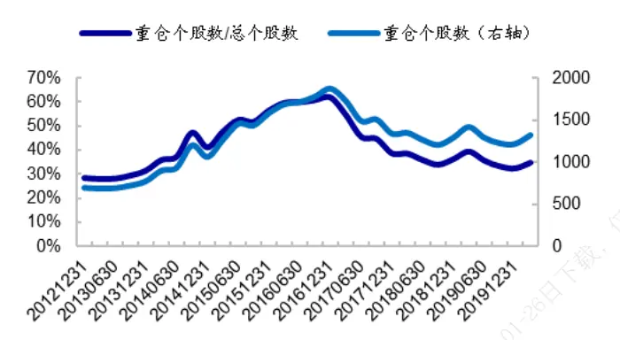
资料来源：Wind，海通证券研究所

图2 重仓超配个股数及持仓市值占比（2012.Q4-2020.Q1）
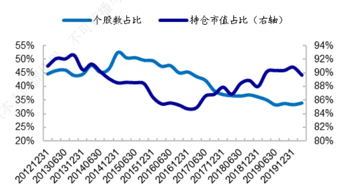
资料来源：Wind，海通证券研究所

以基金池中所有基金的重仓股为股票池，统计该股票池中基金对于每只个股的持仓市值占比（下简称重仓池权重），并与全市场所有个股的市值权重（下简称市场权重）进行对比。若个股重仓池权重高于其市场权重，则称该股票为基金重仓超配个股。

在基金重仓股中，超配个股数占比平均为 42.6%，持仓市值占比平均为 88.7%。从近几年趋势来看，基金重仓超配个股越来越集中。2017 年以来，超配个股数逐渐减少，而持仓市值占比逐渐攀升。截止 2020 年一季度，个数占比 33.9%的重仓股，占持仓总市值的比例高达 89.7%。即公募基金绝大部分的资金都集中在少数的超配个股中。

## 重仓超配个股的市值特征与行业特征

下图左是重仓超配个股的市值、估值分组分布。如图所示，重仓超配个股中，有20.6%的股票位于市值最大的分组，仅 1.9%位于市值最小的分组。从单调性来看，随着分组市值增加，重仓超配个股的分组占比也随之增加。即，公募基金倾向于超配大市值的个股。

同样地，随着分组估值增加，重仓超配个股的分组占比也随之增加。表明基金倾向于超配高估值的个股。

按照过去 1 个季度（对应公募基金对于重仓股的持有期）的累计收益率将全市场股票均匀分为 10组，统计重仓超配个股的对应分组占比，如下图右所示。从中可见，前期涨幅最大的分组占比最大，为 18.2%；而前一个季度涨幅处于市场前 1/2 的重仓超配个股占比大于 50%，为 61.9%。表明大部分重仓超配股票，在基金持有期均跑赢了市场大部分股票。

图3 重仓超配个股的市值、估值分组分布（2012.Q4-2020.Q1）
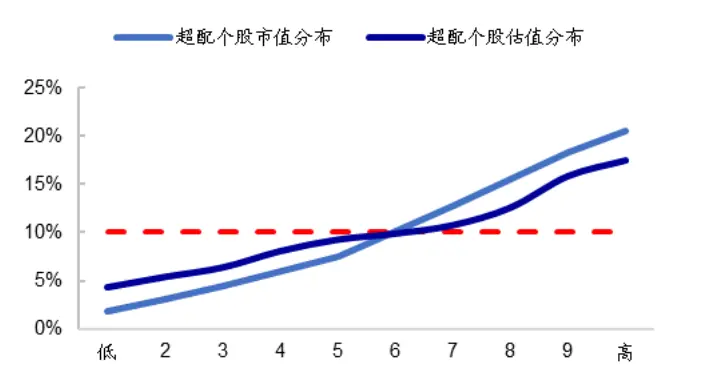
资料来源：Wind，海通证券研究所

图4 重仓超配个股累计收益率分组分布（2012.Q4-2020.Q1）
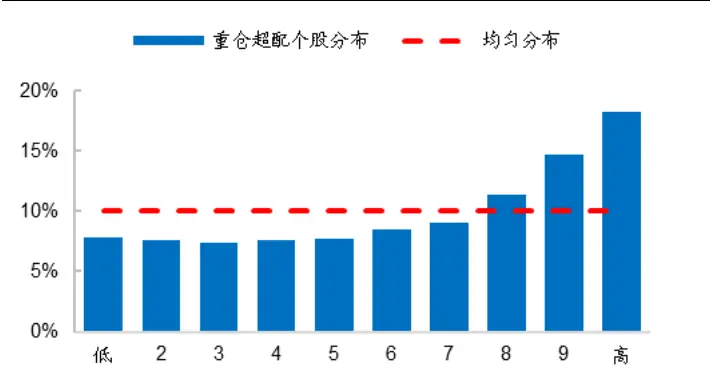
资料来源：Wind，海通证券研究所

统计重仓超配个股的行业个数分布，并与市场行业个数分布相比，计算每个行业的超配比例，结果如下图所示。从中可见，公募基金倾向于超配医药、计算机、电子、食品饮料、国防军工等行业的个股，而低配机械、基础化工、交通运输等行业的个股。

图5 重仓超配个股的行业超配比例（2012.Q4-2020.Q1）
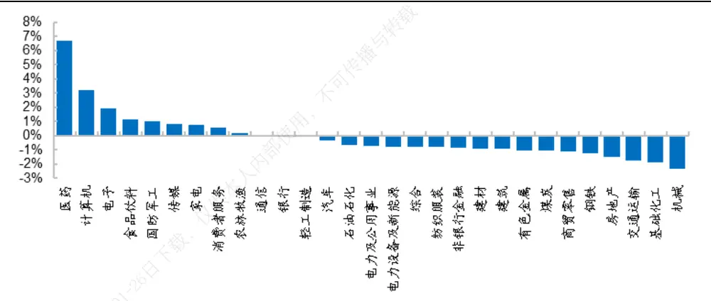
资料来源：Wind，海通证券研究所
注：行业 的超配比例是指，重仓超配个股中属于行业 的个股数占比，与全市场中行业 的个股数占比之差。

总结来看，公募基金倾向于超配大市值、高估值的股票。从行业分布来看，基金倾向于超配医药、计算机、电子、食品饮料、国防军工等行业的个股，而低配机械、基础化工、交通运输等行业的个股。大部分重仓超配股票，在基金持有期均跑赢了市场大部分股票。

## 2. 基金重仓超配因子及其对指数增强组合的影响

## 2.1 重仓超配因子

基于基金重仓超配的信息，可构建重仓超配虚拟变量因子。具体构建方式为，统计最新可获得的基金季报中每只个股的重仓池权重，若个股的重仓池权重高于比较基准中（如全 A个股市值分布/沪深 300 指数等）该个股的权重，则因子值为 1，否则为 0。为表述方便，下文我们将该因子简称为重仓超配因子。

以全 A个股市值分布为比较基准，构建重仓超配因子。月度再平衡，每个月初等权买入重仓超配因子值为 1 的股票，构建因子多头组合；等权买入因子值为 0的股票，构建因子空头组合。多空组合的收益表现如下表所示。从中可见，重仓超配因子的多头组合相对于空头组合存在年化 5.7%的超额收益，月胜率 55.6%，信息比 0.63。即平均来看，基金重仓超配的股票确实存在正向超额收益。

表 1 重仓超配因子的多空收益表现（2013.01-2020.06）

|  | 平均个股数 | 收益率 | 月胜率 | 信息比 |
| --- | --- | --- | --- | --- |
| 多头收益 | 502.9 | 7.50% | 58.89% | 0.77 |
| 空头收益 | 2323.0 | 1.77% | 55.56% | 0.28 |
| 多空收益 |  | 5.73% | 55.56% | 0.63 |

资料来源： ，海通证券研究所
注：多/空头收益是指多/空头组合相对于 wind全 A指数的超额收益。

从截面回归的角度来看，在包含风格、技术、基本面、预期基本面因子的回归模型中加入重仓超配因子，得到的该因子溢价如下表所示。从中可见，重仓超配因子溢价显著的月度占比高达 62.2%。由此表明，重仓超配虚拟变量因子在截面上对个股收益存在显著影响。

表 2 重仓超配因子截面溢价（2013.01-2020.06）

| 显著比例 | 显著为正比例 | 显著为正比例/显著比例 | 显著为负比例 | 显著为负比例/显著比例 | 月均溢价 | 溢价信息比 |
| --- | --- | --- | --- | --- | --- | --- |
| 62.20% | 34.40% | 55.36% | 27.80% | 44.64% | 0.23% | 0.38 |

资料来源：Wind，海通证券研究所

从时间序列的角度来看，重仓超配因子并非在每年都有正超额。如下图所示，2013年上半年、2017 年下半年至 2018 年上半年、2019 年下半年至今，是重仓超配因子表现最优的阶段；而其他时段，该因子累计溢价整体呈震荡走低态势。

从因子溢价的时间序列统计结果也可看出，重仓超配因子的时间序列稳定性较差。在溢价显著的月份中（占比 62.2%），显著为正的月度占比 55.4%，显著为负的月度占比 44.6%。表明一半左右的时间，超配股票可提供显著为正的溢价，而一半的时间溢价显著为负，重仓超配因子并非一直都是 alpha 因子。

图6 重仓超配因子的月溢价（2013.01-2020.06）
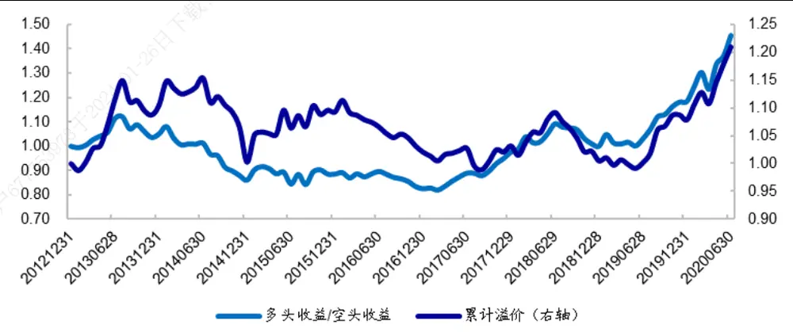
资料来源：Wind，海通证券研究所

总结来看，重仓超配虚拟变量因子在横截面上会显著影响个股收益，截面溢价显著的月度占比达 62.2%。整体来看，重仓超配个股相对于低配个股存在正向超额收益。但超额收益时间序列稳定性较差，溢价显著为正的月度占比仅略高于显著为负的占比。

## 2.2 引入重仓超配因子后的指数增强组合

在个股收益预测模型引入重仓超配因子后，沪深 中证 指数增强组合的超额收益表现如下表所示。构建重仓超配因子的比较基准设为对应增强组合的基准指数。指数增强组合基准策略为全市场线性优化模型，但成分股权重占比不低于 80%；优化的目标函数为组合预期收益，其中个股收益采用风格、低频技术因子、基本面因子和高频因子进行预测。

| 沪深 300 指数增强策略 |  |  |  |  |  |  |
| --- | --- | --- | --- | --- | --- | --- |
|  | 收益率 | 跟踪误差 | 信息比 | 最大回撤 | 收益回撤比 | 月胜率 |
| 引入前 | 12.72% | 4.65% | 2.53 | 4.80% | 2.65 | 77.78% |
| 引入后 | 12.95% | 4.72% | 2.54 | 5.31% | 2.44 | 76.67% |
| 中证 500 指数增强策略 |  |  |  |  |  |  |
|  | 收益率 | 跟踪误差 | 信息比 | 最大回撤 | 收益回撤比 | 月胜率 |
| 引入前 | 17.75% | 5.48% | 2.93 | 5.48% | 3.24 | 77.78% |
| 引入后 | 17.94% | 5.48% | 2.96 | 5.75% | 3.12 | 80.00% |

表 3 引入重仓超配因子后的指数增强策略超额收益表现（2013.01-2020.06）
资料来源： ，海通证券研究所
注：本文所展示的增强策略超额收益表现均扣除单边千三费用。

表 4 引入重仓超配因子后的指数增强策略分年度超额收益（2013.01-2020.06）

|  | 沪深 300 增强 |  |  | 中证 500 增强 |  |
| --- | --- | --- | --- | --- | --- |
|  | 引入前 | 引入后 | 引入后-引入前 引入前 | 引入后 | 引入后-引入前 |
| 2013 | 10.98% | 12.40% | 1.42% 25.28% | 21.82% | -3.46% |
| 2014 | 8.47% | 11.36% 2.89% | 15.29% | 16.11% | 0.82% |
| 2015 | 24.44% | 24.79% 0.35% | 48.39% | 46.95% | -1.44% |
| 2016 | 6.56% | 5.48% | -1.07% 18.00% | 17.73% | -0.28% |
| 2017 | 12.89% | 12.05% | -0.84% 17.98% | 19.40% | 1.41% |
| 2018 | 6.99% | 6.41% | -0.58% 6.83% | 6.93% | 0.10% |
| 2019 | 14.48% | 14.64% | 0.16% 11.55% | 11.93% | 0.38% |
| 2020 | 11.38% | 11.74% | 0.36% 0.02% | 2.89% | 2.87% |

资料来源：Wind，海通证券研究所

图7 引入重仓超配因子的 300增强相对于基准策略的累计净值（2013.01-2020.06）
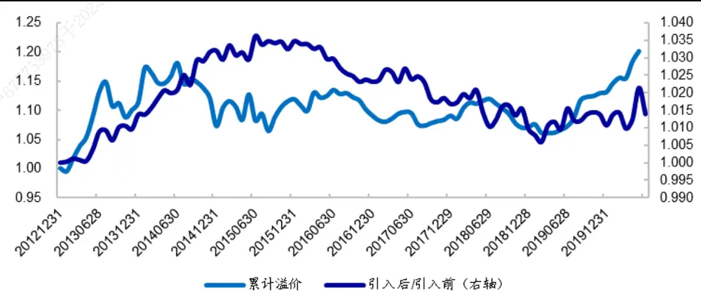
资料来源：Wind，海通证券研究所

整体来看，引入重仓超配因子后，沪深 300 和中证 500 指数增强策略的年化超额收益都略有提升，但提升幅度较小，仅 0.2%左右。

这可能与重仓超配因子时间序列不稳定有关。以沪深 300 指数增强策略为例，如上图所示，在因子溢价波动大的 年，引入重仓超配因子会持续拖累策略表现。这主要是由于，在采用历史溢价估计未来溢价的模型中，溢价方向波动大可能导致预测溢价和实际溢价方向完全相反，从而拖累策略表现。

## 2.3 小结

重仓超配虚拟变量因子存在较为明显的多空收益；且在截面回归模型中，因子对个股收益存在显著影响，截面溢价显著的月度占比高达 。但因子溢价波动大，在溢价显著的月份中，显著为正的月度占比 55.4%，显著为负的月度占比 44.6%，即重仓超配因子并非一直都是 alpha 因子。由于溢价方向变动较大，在基于历史数据预测未来溢价的增强策略中直接加入重仓超配因子，对指数增强策略超额收益的提升幅度较小。

## 3. 基金业绩与重仓超配因子

业绩排名靠前和业绩排名靠后的基金，其重仓股超配个股的收益表现可能存在差异。我们将样本池基金简单按照过去 1年的收益率进行排序，考察业绩排名前 50%以及后50%的基金池，对重仓超配因子的影响。

## 3.1 基金业绩与重仓超配因子收益

如下表所示，基于业绩前 50%的基金所构建的重仓超配因子，具有更高且更稳定的多空收益。业绩前 50%基金的重仓超配因子年化多空收益为 6.48%，信息比 0.59；而业绩后 50%基金的重仓超配因子年化多空收益仅 3.56%，信息比 0.37。表明整体来看，历史业绩排名靠前的基金重仓超配个股收益延续性更强。

表 5 基金业绩与重仓超配因子多空收益（2013.01-2020.06）

|  | 超额收益 不 | 月胜率 信息比 |
| --- | --- | --- |
| 业绩后 50% | 3.56% | 54.44% 0.37 |
| 业绩前 50% | 6.48% | 57.78% 0.59 |
| 全部基金 | 5.21% | 58.89% 0.56 |

资料来源： ，海通证券研究所
注：此次构建重仓超配因子的比较基准设为沪深300指数，即若个股重仓池权重高于沪深300指数成分股权重，则其因子值为 1，否则为 0。

## 3.2 不同业绩基金池的重仓超配因子与指数增强组合

下表展示了引入基于不同业绩基金池所构建的重仓超配因子，对指数增强策略年化超额收益表现的影响。

表 6 加入不同业绩基金池重仓超配因子后的指数增强策略（2013.01-2020.06）

| 沪深300 指数增强策略年化超额收益表现 |  |  |  |  |  |  |
| --- | --- | --- | --- | --- | --- | --- |
| 基金池 | 收益率 | 跟踪误差 | 信息比 | 最大回撤 | 收益回撤比 | 月胜率 |
| 业绩后50% | 13.75% | 4.66% | 2.72 | 4.81% | 2.86 | 76.67% |
| 业绩前 50% | 12.81% | 4.68% | 2.54 | 5.00% | 2.56 | 78.89% |
| 基准策略 | 12.72% | 4.65% | 2.53 | 4.80% | 2.65 | 77.78% |

中证 500指数增强策略年化超额收益表现

| 基金池 | 收益率 | 跟踪误差 | 信息比 | 最大回撤 | 收益回撤比 | 月胜率 |
| --- | --- | --- | --- | --- | --- | --- |
| 业绩后50% | 18.91% | 5.40% | 3.15 | 5.70% | 3.32 | 80.00% |
| 业绩前 50% | 17.88% | 5.47% | 2.95 | 6.24% | 2.86 | 77.78% |
| 基准策略 | 17.75% | 5.48% | 2.93 | 5.48% | 3.24 | 77.78% |

资料来源：Wind，海通证券研究所

结果显示，引入基于业绩后 50%的基金所构建的重仓超配因子，可明显提升策略超额收益。对于 增强而言，年化超额可由 提升至 ，提升幅度达 ，同时风险调整收益指标也均有所改善；对于 500 增强而言，年化超额可由 17.75%提升至 18.91%，提升幅度达 1.17%，同时风险调整收益指标也均有所改善。

有意思的是，引入基于业绩前 50%的基金所构建的重仓超配因子反而不如业绩后50%的基金。那么为什么从因子多空收益的角度来看，业绩靠前的基金重仓超配股票收益表现明显优于业绩靠后的基金，而将因子引入收益率预测模型，对指数增强策略的影响却截然相反呢？

这主要是由于历史上重仓超配因子并非一直都为 alpha 因子，如下图所示，在 2016年至 2018 年，重仓超配因子表现较差。在因子表现好的阶段，无论是以业绩排名靠前还是以业绩排名靠后的基金为基金池，该因子超额收益都非常明显（如 2013 年、2019年下半年至今）。而在因子表现较差的阶段，如 2016 年至 2018 年，业绩前 50%基金的重仓超配因子累计溢价呈震荡态势，选股方向来回变动。业绩后 50%基金的超配因子整体呈下降态势，选股方向延续性较强。

在我们基于历史溢价确定因子权重的模型中，溢价方向波动越小，对模型越有利。若计算因子溢价方向延续比例也可发现，基于业绩后 50%的基金所构建的重仓超配因子溢价方向延续比例为 61.5%，远高于基于业绩前 50%的基金所构建的因子（45.1%）。在根据历史溢价预估因子收益的方法下，基于业绩后 50%的基金所构建的因子，选股方向预测准确率更高。

注：溢价方向延续比例是指，在溢价显著的月份，历史 12 个月（t-12 月至 t-1 月）溢价均值方向与当月（t 月）溢价方向相同的月度占比。

在重仓超配因子表现较差的 2016 年至 2018 年，基于业绩后 50%的基金所构建的重仓超配因子，可有效利用因子的负向超额收益。而基于业绩前 50%的基金所构建的因子，选股方向来回变动，增量信息很少甚至为为负，因此全区间来看，加入该因子对指数增强策略的收益提升效果不及基于业绩后 50%基金所构建的因子。

图8 重仓超配因子的累计溢价（2013.01-2020.06）
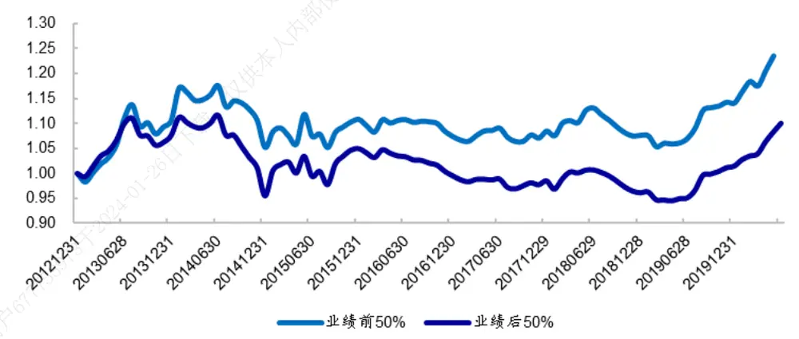
资料来源：Wind，海通证券研究所

总结来看，基于业绩后 50%基金所构建的重仓超配因子，溢价方向延续比例更高，在根据历史溢价预估因子收益的模型下更为有利，因此对指数增强策略的收益提升更为明显。

## 3.3对重仓超配因子的简单择时判定

在应用重仓超配因子时，除了可以使用溢价方向延续性较强的业绩后 50%的基金作为基金池，来防止溢价方向来回变动对增强策略造成的负向影响外，还可对重仓超配因子做简单的择时判定。

从图 8可看出，业绩前 50%基金的重仓超配因子累计溢价虽有震荡趋势，但并未产生持续的累计负溢价。因此我们可对业绩前 50%基金的重仓超配因子按照如下方法做简单的择时判定：预估因子溢价为负时，将因子权重主观设为 0，即仅利用重仓超配因子的正向选股收益。

按照这种择时方法引入业绩前 50%基金的重仓超配因子，对指数增强策略超额收益表现的影响如下表所示。

表 7 对业绩前 50%基金的重仓超配因子做简单择时判定（2013.01-2020.06）

| 沪深 300指数增强策略年化超额收益表现 |  |  |  |  |  |  |
| --- | --- | --- | --- | --- | --- | --- |
|  | 收益率 | 跟踪误差 | 信息比 | 最大回撤 | 收益回撤比 | 月胜率 |
| 基准策略 | 12.72% | 4.65% | 2.53 | 4.80% | 2.65 | 77.78% |
| 业绩前 50% | 13.36% | 4.70% | 2.62 | 5.00% | 2.67 | 78.89% |
| 全部基金 | 13.06% | 4.75% | 2.54 | 5.31% | 2.46 | 77.78% |

中证 500指数增强策略年化超额收益表现

|  | 收益率 | 跟踪误差 | 信息比 | 最大回撤 | 收益回撤比 | 月胜率 |
| --- | --- | --- | --- | --- | --- | --- |
| 基准策略 | 17.75% | 5.48% | 2.93 | 5.48% | 3.24 | 77.78% |
| 业绩前 50% | 18.37% | 5.56% | 2.98 | 6.09% | 3.01 | 77.78% |
| 全部基金 | 18.21% | 5.59% | 2.95 | 5.56% | 3.27 | 80.00% |

资料来源：Wind，海通证券研究所

从中可见，仅利用重仓超配因子的正向选股收益可明显提升指数增强策略的超额收益率；而且，基于业绩排名靠前的基金所构建的因子，对增强策略的收益提升幅度高于基于全部基金所构建的因子。对于 增强而言，加入业绩排名靠前的基金所构建重仓超配因子，年化超额可由 提升至 ，提升 ；对于 增强而言，年化超额可由 提升至 ，提升 。由此可见，引入基金的正向选股能力，可为增强策略提供传统因子以外的增量信息。

总结来看，对重仓超配因子做简单择时判定，仅利用业绩排名靠前主动基金的正向选股收益，可明显提升沪深 300 和中证 500 指数增强策略的超额收益。

## 3.4 小结

从因子多空收益来看，历史业绩排名靠前的基金重仓超配个股超额收益更高。但从对指数增强策略的影响来看，加入业绩排名靠后的基金重仓超配因子对策略的收益提升更为明显。这主要是由于业绩靠后的基金重仓超配因子溢价方向延续比例更高，在根据历史溢价预估因子收益的模型下更为有利，因此对指数增强策略的收益提升也更为明显。

由于重仓超配因子并非一直都是 alpha 因子，为防止因子溢价方向来回变动对增强策略造成的负向影响，在使用时可对重仓超配因子做简单的择时判定，如预测因子选股方向为负时，将因子权重设为 0。或者利用时间序列方向延续性更强的业绩后 50%的基金来构建重仓超配因子。

从时间序列的角度来看，引入业绩后 50%基金的重仓超配因子后，沪深 300 指数增强策略在 64%的月份优于基准策略；中证 500 指数增强策略在 61%的月份优于基准策略。

图9 引入重仓超配因子后的沪深 300 增强策略相对于基准策略的月超额收益（ ）
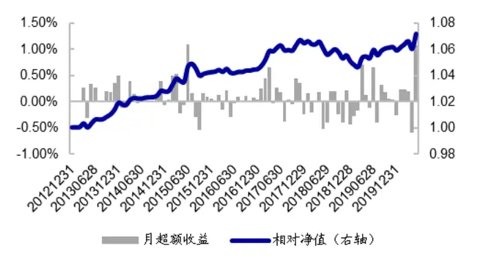
资料来源：Wind，海通证券研究所

图10 引入重仓超配因子后的中证 500 增强策略相对于基准策略的月超额收益（ ）
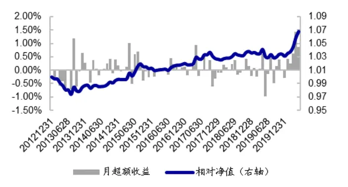
资料来源： ，海通证券研究所

表 8 引入业绩后 50%基金重仓超配因子的指数增强组合分年度超额收益（2013.01-2020.06）

|  | 沪深 300 增强 |  |  | 中证 500 增强 |  |  |
| --- | --- | --- | --- | --- | --- | --- |
|  | 引入前 | 引入后 | 引入后-引入前 | 引入前 | 引入后 | 引入后-引入前 |
| 2013 | 10.98% | 12.93% | 1.96% | 25.28% | 23.47% | -1.81% |
| 2014 | 8.47% | 9.83% | 1.37% | 15.29% | 16.75% | 1.46% |
| 2015 | 24.44% | 26.33% | 1.89% | 48.39% | 51.60% | 3.20% |
| 2016 | 6.56% | 6.77% | 0.21% | 18.00% | 18.68% | 0.68% |
| 2017 | 12.89% | 15.45% | 2.56% | 17.98% | 18.72% | 0.73% |
| 2018 | 6.99% | 5.91% | -1.07% | 6.83% | 7.50% | 0.67% |
| 2019 | 14.48% | 15.68% | 1.21% | 11.55% | 10.93% | -0.63% |
| 2020 | 11.38% | 12.14% | 0.76% | 0.02% | 4.38% | 4.37% |

资料来源：Wind，海通证券研究所

## 4. 全文总结

公募基金倾向于超配大市值、高估值的股票。从行业分布来看，基金倾向于超配医药、计算机、电子、食品饮料、国防军工等行业的个股，而低配机械、基础化工、交通运输等行业的个股。大部分重仓超配股票，在基金持有期均跑赢了市场大部分股票。

基金重仓超配个股的收益具有一定延续性，即便获取基金持仓的时点有一定的滞后性，但在季报披露后持有基金重仓超配的个股，仍可获得一定的正超额。

从截面回归角度来看，重仓超配因子对个股收益存在显著影响，截面溢价显著的月度占比高达 62.2%。但重仓超配因子溢价波动大，在溢价显著的月份中，显著为正的月度占比 55.4%，显著为负的月度占比 44.6%。由于溢价方向变动较大，在基于历史数据预测未来溢价的增强策略中直接加入重仓超配因子，对指数增强策略超额收益的提升幅度较小。

选择不同业绩的基金池，会影响重仓超配因子的表现。从因子多空收益来看，历史业绩排名靠前的基金重仓超配个股超额收益更高。但从对指数增强策略的影响来看，加入业绩排名靠后的基金重仓超配因子对策略的收益提升更为明显。这主要是由于业绩靠后的基金重仓超配因子溢价方向延续比例更高，在根据历史溢价预估因子收益的模型下更为有利，因此对指数增强策略的收益提升也更为明显。

由于重仓超配因子并非一直都是 alpha 因子，为防止因子溢价方向来回变动对增强策略造成的负向影响，在使用时可对重仓超配因子做简单的择时判定，如预测因子选股方向为负时，将因子权重设为 0。按照这种方法应用重仓超配因子（以业绩前 50%的基金为基金池），可将沪深 中证 指数增强策略的年化超额提升 以上。

## 5. 风险提示

因子失效风险，模型误设风险，历史统计规律失效风险。

# 信息披露

分析师声明

[Table冯佳睿yst金融工程研究团队s]

罗蕾金融工程研究团队

本人具有中国证券业协会授予的证券投资咨询执业资格，以勤勉的职业态度，独立、客观地出具本报告。本报告所采用的数据和信息均来自市场公开信息，本人不保证该等信息的准确性或完整性。分析逻辑基于作者的职业理解，清晰准确地反映了作者的研究观点，结论不受任何第三方的授意或影响，特此声明。

## 法律声明

本报告仅供海通证券股份有限公司（以下简称 本公司 ）的客户使用。本公司不会因接收人收到本报告而视其为客户。在任何情况下，本报告中的信息或所表述的意见并不构成对任何人的投资建议。在任何情况下，本公司不对任何人因使用本报告中的任何内容所引致的任何损失负任何责任。

本报告所载的资料、意见及推测仅反映本公司于发布本报告当日的判断，本报告所指的证券或投资标的的价格、价值及投资收入可能转会波动。在不同时期，本公司可发出与本报告所载资料、意见及推测不一致的报告。 播

市场有风险，投资需谨慎。本报告所载的信息、材料及结论只提供特定客户作参考，不构成投资建议，也没有考虑到个别客户特殊的可投资目标、财务状况或需要。客户应考虑本报告中的任何意见或建议是否符合其特定状况。在法律许可的情况下，海通证券及其所属，关联机构可能会持有报告中提到的公司所发行的证券并进行交易，还可能为这些公司提供投资银行服务或其他服务。使

本报告仅向特定客户传送，未经海通证券研究所书面授权，本研究报告的任何部分均不得以任何方式制作任何形式的拷见，复印件或复制品，或再次分发给任何其他人，或以任何侵犯本公司版权的其他方式使用。所有本报告中使用的商标、服务标记及标记均为本公供司的商标、服务标记及标记。如欲引用或转载本文内容，务必联络海通证券研究所并获得许可，并需注明出处为海通证券研究所，且不得对本文进行有悖原意的引用和删改。

根据中国证监会核发的经营证券业务许可，海通证券股份有限公司的经营范围包括证券投资咨询业务。26

## 海通证券股份有限公司研究所[Table_PeopleInfo]

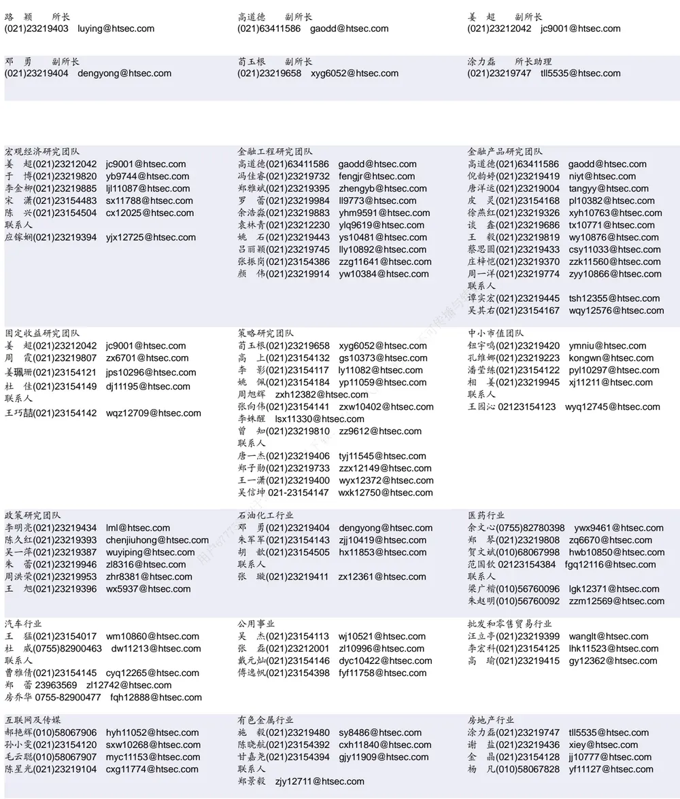

| 电子行业 |  | 煤炭行业 |  | 电力设备及新能源行业 |  | zyc9637@htsec.com |
| --- | --- | --- | --- | --- | --- | --- |
|  | 陈 平(021)23219646 cp9808@htsec.com |  | 李 淼(010)58067998 Im10779@htsec.com |  | 张一弛(021)23219402 |  |
|  | 尹 苓(021)23154119 yl11569@htsec.com |  | 戴元灿(021)23154146 dyc10422@htsec.com |  | 房 青(021)23219692 | fangq@htsec.com |
|  | 谢 磊(021)23212214 xl10881@htsec.com |  | 吴 杰(021)23154113 wj10521@htsec.com |  | 曾 彪(021)23154148 zb10242@htsec.com |  |
|  | 蒋 俊(021)23154170 jj11200@htsec.com |  | 联系人 |  | 徐柏乔(021)23219171 xbq6583@htsec.com |  |
| 联系人 |  |  | 王 涛(021)23219760 wt12363@htsec.com |  | 陈佳彬(021)23154513 cjb11782@htsec.com |  |

| 基础化工行业 | 计算机行业 | 通信行业 |  |
| --- | --- | --- | --- |
| 刘 威(0755)82764281 Iw10053@htsec.com | 郑宏达(021)23219392 zhd10834@htsec.com | 朱劲松(010)50949926 zjs10213@htsec.com |  |
| 刘海荣(021)23154130 Ihr10342@htsec.com | 杨 林(021)23154174 yl11036@htsec.com | 余伟民(010)50949926 ywm11574@htsec.com |  |
| 张翠翠(021)23214397 zcc11726@htsec.com | 于成龙 ycl12224@htsec.com | 张峥青(021)23219383 zzq11650@htsec.com |  |
| 孙维容(021)23219431 swr12178@htsec.com | 黄竞晶(021)23154131 hjj10361@htsec.com | 张 弋(010)58067852 zy12258@htsec.com |  |
| 李 智(021)23219392 lz11785@htsec.com | 洪 琳(021)23154137 hl11570@htsec.com | 联系人 | 杨彤昕 010-56760095 ytx12741@htsec.com |

| 非银行金融行业 |  | 交通运输行业 |  |  | 纺织服装行业 |  |
| --- | --- | --- | --- | --- | --- | --- |
|  | 孙 婷(010)50949926 st9998@htsec.com |  |  | 虞 楠(021)23219382 yun@htsec.com |  | 梁 希(021)23219407 lx11040@htsec.com |
|  | 何 婷(021)23219634 ht10515@htsec.com |  |  | 罗月江(010）56760091 lyj12399@htsec.com |  | 盛 开(021)23154510 sk11787@htsec.com |
|  | 李芳洲(021)23154127 Ifz11585@htsec.com |  |  | 李 轩(021)23154652 lx12671@htsec.com |  | 联系人 |
| 联系人 |  |  | 陈 宇(021)23219442 cy13115@htsec.com |  |  | 刘 溢(021)23219748 ly12337@htsec.com |

| 建筑建材行业 | 机械行业 |  | 钢铁行业 |
| --- | --- | --- | --- |
| 冯晨阳(021)23212081 fcy10886@htsec.com 潘莹练(021)23154122 pyl10297@htsec.com | 周 丹 zd12213@htsec.com | 余炜超(021)23219816 swc11480@htsec.com | 刘彦奇(021)23219391 liuyq@htsec.com 周慧琳(021)23154399 zhl11756@htsec.com |
| 申 浩(021)23154114 sh12219@htsec.com | 吉 晟(021)23154653 js12801@htsec.com |  |  |
| 杜市伟(0755)82945368 dsw11227@htsec.com 颜慧菁 yhj12866@htsec.com | 播与转载 |  |  |

| 建筑工程行业 | 农林牧渔行业 | 食品饮料行业 |
| --- | --- | --- |
| 张欣劼 zxj12156@htsec.com | 丁 频(021)23219405 dingpin@htsec.com 陈 阳(021)23212041 cy10867@htsec.com | 闻宏伟(010)58067941 whw9587@htsec.com 唐 宇(021)23219389 ty11049@htsec.com |
| 李富华(021)23154134 Ifh12225@htsec.com 杜市伟(0755)82945368 dsw11227@htsec.com | 联系人 | 颜慧菁 yhj12866@htsec.com |
|  | 孟亚琦(021)23154396 myq12354@htsec.com | 张宇轩(021)23154172 zyx11631@htsec.com |
|  |  | 联系人 程碧升(021)23154171 cbs10969@htsec.com |

| 军工行业 | 银行行业 | 社会服务行业 |
| --- | --- | --- |
| 张恒晅 zhx10170@htsec.com | 孙 婷(010)50949926 st9998@htsec.com | 汪立亭(021)23219399 wanglt@htsec.com |
| 张高艳 0755-82900489 zgy13106@htsec.com | 解巍巍 xww12276@htsec.com | 陈扬扬(021)23219671 cyy10636@htsec.com |
| 联系人 | 林加力(021)23154395 ljl12245@htsec.com | 许樱之 xyz11630@htsec.com |
| 刘砚菲021-2321-4129 lyf13079@htsec.com | 0 |  |

| 家电行业 |  | 造纸轻工行业 |  |
| --- | --- | --- | --- |
| 陈子仪(021)23219244 | chenzy@htsec.com |  | 衣桢永(021)23212208 yzy12003@htsec.com |
| 李 阳(021)23154382 | ly11194@htsec.com |  | zy10340@htsec.com |
| 朱默辰(021)23154383 | zmc11316@htsec.com | 联系人 |  |
| 刘 璐(021)23214390 | II11838@htsec.com | 柳文韬(021)23219389 Iwt13065@htsec.com |  |

## 研究所销售团队

深广地区销售团队

蔡铁清(0755)82775962 ctq5979@htsec.com

伏财勇(0755)23607963 fcy7498@htsec.com

辜丽娟(0755)83253022 gulj@htsec.com

刘晶晶(0755)83255933 liujj4900@htsec.com

饶 伟(0755)82775282 rw10588@htsec.com

欧阳梦楚(0755)23617160

oymc11039@htsec.com

巩柏含 gbh11537@htsec.com

上海地区销售团队
胡雪梅(021)23219385 huxm@htsec.com
朱 健(021)23219592 zhuj@htsec.com
季唯佳(021)23219384 jiwj@htsec.com
黄 毓(021)23219410 huangyu@htsec.com
漆冠男(021)23219281 qgn10768@htsec.com
胡宇欣(021)23154192 hyx10493@htsec.com
黄 诚(021)23219397 hc10482@htsec.com
毛文英(021)23219373 mwy10474@htsec.com
马晓男 mxn11376@htsec.com
杨祎昕(021)23212268 yyx10310@htsec.com
张思宇 zsy11797@htsec.com
王朝领 wcl11854@htsec.com
邵亚杰 23214650 syj12493@htsec.com
李 寅 021-23219691 ly12488@htsec.com北京地区销售团队
殷怡琦(010)58067988 yyq9989@htsec.com郭 楠 010-5806 7936 gn12384@htsec.com张丽萱(010)58067931 zlx11191@htsec.com杨羽莎(010)58067977 yys10962@htsec.com李 婕 lj12330@htsec.com
欧阳亚群 oyyq12331@htsec.com
郭金垚(010)58067851 gjy12727@htsec.com

海通证券股份有限公司研究所

地址：上海市黄浦区广东路 689号海通证券大厦 9楼

电话：（021）23219000

传真：（021）23219392

网址：www.htsec.com