## [Tab相关研究

Table_ReportInfo]《刚需之下，关注龙头——华安中证细分医药 ETF（512120）投资价值分析》2020.07.27

《金融科技（Fintech）和数据挖掘研究

（七）——基于机器学习和知识图谱的行

业轮动》2020.07.21

《量化研究新思维（二十）——基于马氏距离构建新的经济周期指数》

## 分析师[Table_Au:冯佳睿

Tel:(021)23219732

Email:fengjr@htsec.com

证书:S0850512080006

分析师:袁林青

Tel:(021)23212230

Email:ylq9619@htsec.com

证书:S0850516050003

分析师:姚石

Tel:(021)23219443

Email:ys10481@htsec.com

证书:S0850517120002

分析师:罗蕾

Tel:(021)23219984

Email:ll9773@htsec.com

证书:S0850516080002

分析师:余浩淼

Tel:(021)23219883

Email:yhm9591@htsec.com

证书:S0850516050004

# 选股因子系列研究（六十九）——高频因子的现实与幻想

## 投资要点：

高频行情数据蕴含丰富的信息，但市场上少有对此类数据的特征及如何应用的详细介绍。本文从高频行情数据的组成和结构出发，系统整理了十几个既有经济学逻辑，又表现良好的因子，并通过多因子指数增强模型展现其实践价值。

- Level2 行情数据概况。Level2 行情数据是目前国内证券市场上对于交易信息包含最为完整，颗粒度最为精细的行情数据产品。主要有 4 种形式：分钟 K线、盘口快照、委托队列、成交明细。Level2 行情数据已覆盖在沪深两市上市的股票、可交易型基金、沪深交易所指数等大量品种，还在积极扩展纳入 ETF 期权等沪深交易所上市的衍生品，基本可以满足对 A股市场的研究、投资和交易需求。

基于分钟成交数据的高频因子。根据分钟 线包含的信息，可构建高频偏度、下行波动占比、尾盘成交占比、量价相关性、改进反转、平均单笔流出金额占比、大单推动涨幅，共七个因子。它们的月均 Rank IC 都在 3%以上，年化 ICIR 都大于 。其中，尾盘成交占比因子表现最优，月均 为 ，年化为 3.59。

- 基于 委托数据的高频因子。盘口委托挂单数据刻画了投资者的买入意愿，开盘后 分钟内的委买增量越大，投资者在这段时间内的买入意愿越强。开盘后净委买增额占比因子月均 C 为 ，年化 C 为 。

- 基于逐笔成交数据的高频因子。根据逐笔成交数据中的“买”、“卖”标记和单号信息，可构建开盘后净主买占比、开盘后净主买强度、大买成交占比、开盘后知情主卖占比，共四个因子。它们的月均 Rank IC分别为 3.31%、4.46%、4.35%、2.86%，年化 ICIR 分别为 2.51、3.29、1.96、2.51。

基于 委托与逐笔成交数据的高频因子。委托挂单体现投资者尚未释放的交易意愿，而主买/主卖则代表已进行的交易行为。若将两者结合，可以得到广义的投资者主动买入意愿。开盘后买入意愿占比因子和开盘后买入意愿强度因子的月均 Rank IC 分别为 4.34%和 5.07%，年化 ICIR 分别为 3.43 和 3.93。

- 高频因子在多因子组合中的应用。常用的在多因子模型中引入高频信息的方式有两种，一是在个股收益预测模型中直接加入高频因子，二是利用高频因子剔除空头个股。对于沪深 300 指数、中证 500 指数和中证 800 指数，同时使用这两种方法后，均可将指数增强策略的年化超额收益提升 以上。并且，在时间序列上也较为稳定。在绝大部分年份中，引入高频因子后的策略都优于基准策略。

- 风险提示。因子失效风险，模型误设风险，历史统计规律失效风险。

高频行情数据蕴含丰富的信息，但市场上少有对此类数据的特征及如何应用的详细介绍。本文从高频行情数据的组成和结构出发，系统整理了十几个既有经济学逻辑，又表现良好的因子，并通过多因子指数增强模型展现其实践价值。

## 1. 高频数据介绍

## 1.1 Level2 行情数据概况

Level2 行情数据是目前国内证券市场上对于交易信息包含最为完整，颗粒度最为精细的行情数据产品。最早由沪深交易所于 2006 年筹划推出，并在 2012 年末彻底完善。

交易所提供的数据产品中，较为常用的有以下四种形式。

- 分钟 K线：即当日全天的分钟 K线行情。相比传统 K线，包含了分钟成交笔数信息。

- 盘口快照：即常用的每 3秒一个切片的十档委托行情。其中，也包括该时刻的委托总量和平均委托价格信息。

- 委托队列：即买一、卖一的总委托单数，以及前 50 笔委托的明细信息。

- 成交明细：即两个 3秒快照之间，详细的逐笔成交与逐笔委托信息。

图1 Level2行情数据分类示意
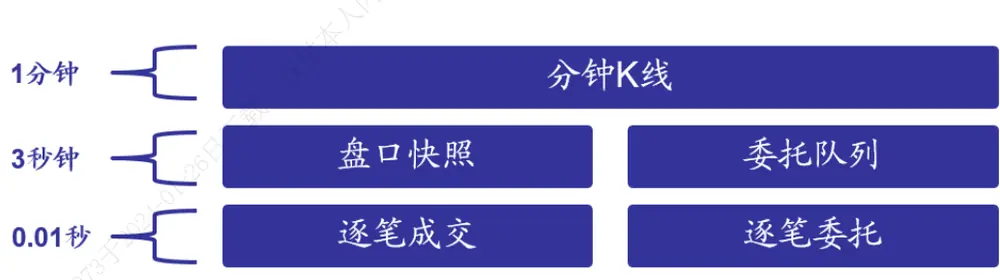
资料来源：海通证券研究所

Level2 行情数据已覆盖在沪深两市上市的股票、可交易型基金、沪深交易所指数等大量品种，还在积极扩展纳入 ETF 期权等沪深交易所上市的衍生品，基本可以满足对 A股市场的研究、投资和交易需求。

不过，需要注意的是，沪深交易所的 Level2 行情数据也存在一定的差异，主要体现在成交明细这个数据产品中。

从数据内容来看，上交所的成交明细数据不包括逐笔委托数据，即没有详细的挂撤单信息。在逐笔成交数据中，也没有标记为撤单的逐笔成交。因此，如果利用日内成交明细中，和委托相关的数据构建因子或信号，可能会出现沪深两市覆盖不均衡的问题。

从数据更新的频率来看，深交所的逐笔成交与逐笔委托数据是实时推送的，与数据的最小时间戳 秒基本一致。而上交所则是每三秒，将过去三秒内的所有逐笔成交数据打包后发送。与分析和处理历史数据不同，这种数据推送模式的差异会对那些实时盯盘策略的研发产生较大影响。

## 1.2 Level2 行情数据的结构与特性

分钟数据是 Level2 行情数据中数据字段最少、频率最低的产品。每个股票每日只有固定的 240 个数据，单日数据量在 100MB左右。

表 1 分钟数据结构示意

| 字段名称 | 字段示意 | 数据类型 |
| --- | --- | --- |
| m_strWindCode | 证券带后缀代码 | String |
| m_nDate | 日期（自然日）格式：YYMMDD | Int |
| m_nTime | 时间（HHMMSSmmm） | Int |
| m_nOpen | 开盘 | Double |
| m_nHigh | 最高 | Double |
| m_nLow | 最低 | Double |
| m_nClose | 收盘 | Double |
| m_iVolume | 成交量 | Long |

资料来源：海通证券研究所整理

盘口快照数据的抽样规则为每 3秒一次，但只记录前后两个时刻盘口有变化的数据。因此，每个股票每日的盘口快照数目并不固定，单日数据量在 6GB 左右。

表 2 盘口快照数据结构示意

| 字段名称 | 字段示意 | 数据类型 |
| --- | --- | --- |
| m_strWindCode | 证券带后缀代码 | String |
| m_nDate | 日期（自然日）格式：YYMMDD | Int |
| m_nTime | 时间（HHMMSSmmm） | Int |
| m_nPrice | 成交价 | Double |
| m_iVolume | 成交量 | Long |
| m_iTurover | 成交额(元) | Long |
| m_nMatchltems | 成交笔数 | Int |
| m_chTradeFlag | 成交标志 | Char |
| m_chBSFlag | BS 标志 | Char |
| m_iAccVolume | 当日累计成交量 | Long |
| m_iAccTurover | 当日成交额（元） | Long |
| m_nHigh | 最高 | Double |
| m_nLow | 最低 | Double |
| m_nOpen | 开盘 | Double |
| m_nPreClose | 前收盘 | Double |
| m_nAskPrice | 叫卖价 | Double[10] |
| m_nAskVolume | 叫卖量 | Int[10] |
| m_nBidPrice | 叫买价 | Double[10] |
| m_nBidVolume | 叫买量 | Int[10] |
| m_nAskAvPrice | 加权平均叫卖价 | Double |
| m_nBidAvPrice | 加权平均叫买价 | Double |

资料来源：海通证券研究所整理

委托队列数据的更新频率与盘口快照数据相同，但结构较为简单。因此，单日数据量相对也会小一些。

表 3 委托队列数据结构示意

| 字段名称 字段示意 数据类型 |  |  |
| --- | --- | --- |
| m_strWindCode | 证券带后缀代码 | String |
| m_nDate | 日期（自然日）格式：YYMMDD | Int |
| m_nTime | 时间（HHMMSSmmm） | Int |
| m_nSide | 买卖方向 | Char |
| m_nPrice | 成交价格 | Double |
| m_nOrderltems | 订单数量 | Int |
| m_nABltems | 明细个数 | Int |
| m_nABVolume 订单明细 |  | Int[50] |

资料来源：海通证券研究所整理

逐笔成交数据记录的最小时间间隔为 0.01 秒，但事实上，在每个 0.01 秒内有可能出现多笔成交。Level2 行情数据对 0.01 秒内的真实成交时点进行了模糊处理，并不加以区分。

逐笔成交数据的单日数据量与盘口快照类似，也在 6GB左右。需要注意的是，由于交易活跃度不同，不同标的之间的单日数据量会有很大差异。

表 4 逐笔成交数据结构示意

| 字段名称 | 字段示意 | 数据类型 |
| --- | --- | --- |
| m_strWindCode | 证券带后缀代码 | String |
| m_nDate | 日期（自然日）格式：YYMMDD | Int |
| m_nTime | 时间（HHMMSSmmm） | Int |
| m_nlndex | 成交编号（从1开始，递增1） | Int |
| m_chFunctionCode | 成交代码：'C'，0 | Char |
| m_chOrderKind | 委托类别 | Char |
| m_chBSFlag | BS 标志 | Char |
| m_nTradePrice | 成交价格 | Double |
| m_nOrderVolume | 成交数量 | Int |
| m_nAskOrder | 叫卖序号 | Int |
| m_nBidOrder | 叫买序号 | Int |

资料来源：海通证券研究所整理

逐笔委托数据为深交所特有的产品，其结构的复杂程度与逐笔成交数据类似，但单日数据量一般更大。

表 5 逐笔委托数据结构示意

| 字段名称 字段示意 数据类型 |  |  |
| --- | --- | --- |
| m_strWindCode 证券带后缀代码 String |  |  |
| m_nDate 日期（自然日）格式：YYMMDD Int |  |  |
| m_nTime | 时间（HHMMSSmmm） | Int |
| m_nlndex | 委托编号，从1开始，递增1 | Int |
| m_nOrder | 交易所委托号 | Int |
| m_chOrderKind | 委托类别 | Char |
| m_chFunctionCode | 委托代码，B， S，C | Char |
| m_nOrderPrice | 委托价格 | Double |
| m_nOrderVolume | 委托数量 | Int |
| m_nlndex | 委托编号，从1开始，递增1 | Int |

资料来源：海通证券研究所整理

## 2. 基于高频数据的因子

根据分钟、TICK、逐笔三个级别的高频数据，可以相应构建三种类型的高频因子。在下文的检验中，所有高频因子均已和行业、市值、中盘、反转、波动、换手等常规因子正交，买入、卖出价格为调仓日均价，未考虑交易成本。

## 2.1 基于分钟成交数据的高频因子

## 高频偏度

Amaya et al. (2011) 在《Does Realized Skewness and Kurtosis Predict theCross-Section of Equity Returns?》一文中发现，股票高阶矩与未来收益之间存在联系。并利用股票的日内分时数据，构建了高频方差、高频偏度和高频峰度三个指标，其中高频偏度具有较强的选股效果。

高频偏度刻画了股票价格日内快速拉升或下跌的特征。假设有两只股票日内涨幅相同，其中一只股票的涨幅由持续稳定的小幅上涨累计而来，而另一只股票的上涨源自于短期的大幅拉升，那么后者在未来有较大概率出现收益反转。从风险溢价角度来看，日内经常快速下跌，或者下行风险大的股票具有更高的风险溢价。因子计算公式如下：

$$
\frac{\sum_{j=1}^{n}+|j|}{|\mathfrak{s}_{j}|}\iiint_{i,j,n}\dot{\overline{{\mathcal{Z}}}}=\frac{1}{T}\sum_{n=t}^{n=t-T+1}\frac{\sqrt{N}\sum_{j=1}^{N}r_{i,j,n}^{3}}{\left(\sum_{j=1}^{N}r_{i,j,n}^{2}\right)^{1.5}}
$$

其中，i、j、n分别代表第 i只股票、第j 分钟和第 n 个交易日。月度选股下 T 取 20，周度选股下 T 取 5（下同）。

高频偏度因子月均 Rank IC为 3.41%，年化 ICIR 为 3.48。因子月均多空收益为1.07%，月度胜率为 83%。月均多头收益为 0.27%，月均空头收益为-0.80%。以下两图分别展示了因子的累计 Rank IC与多空相对强弱走势。

图2 高频偏度因子 Rank IC 与累计 Rank IC
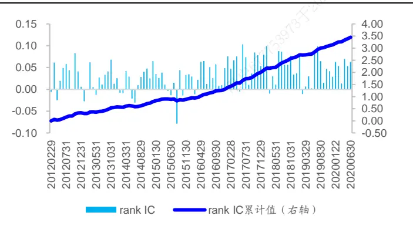
资料来源：Wind，海通证券研究所

图3 高频偏度因子多空相对强弱
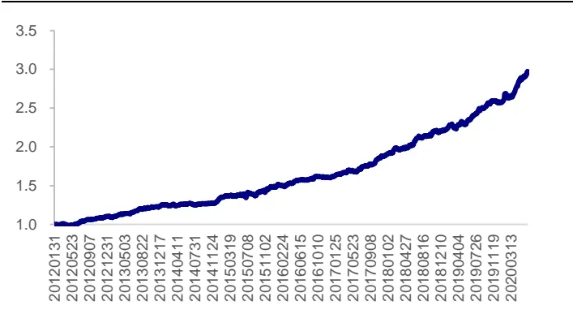
资料来源：Wind，海通证券研究所

## 下行波动占比

下行波动占比与高频偏度的逻辑基本一致，因子计算公式如下：

$$
\mathcal{F}\ :\mathcal{A}\ :\hat{\ :};\mathcal{B}\ :\hat{\ :}z\mathcal{\ :}\mathcal{Y}\ :\mapsto\ :\mathcal{\underline{{1}}}\ :\sum_{n=t}^{n=t-T+1}\ :\frac{\sqrt{N}\sum_{j=1}^{N}r_{i,j,n}^{2}\cdot I_{r_{i,j,n}<0}}{\sum_{j=1}^{N}r_{i,j,n}^{2}}
$$

下行波动占比因子月均 Rank IC为 3.03%，年化 ICIR 为 3.02。因子月均多空收益为 0.94%，月度胜率为 78%。月均多头收益为 0.21%，月均空头收益为-0.73%。以下两图分别展示了因子的累计 Rank IC 与多空相对强弱走势。

图4 下行波动占比因子 Rank IC 与累计 Rank IC
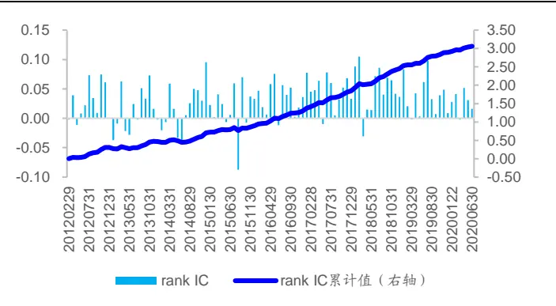
资料来源：Wind，海通证券研究所

图5 下行波动占比因子多空相对强弱
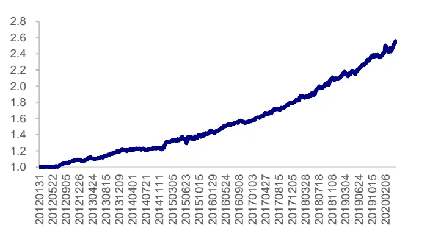
资料来源：Wind，海通证券研究所

## 尾盘成交占比

一般来说，股票日内成交量呈现“U”型或者“W”型走势，即成交量在开盘和收盘阶段比其他交易时段更高，午间休市可能导致下午开盘时成交量也出现高点。各个时点的成交量分布能够反映投资者的行为特征，蕴含额外信息。

以半小时为间隔划分成八个区间，计算每个区间成交量占比，并使用股票过去 T 日指标均值作为因子值。检验发现，10:00 之前，14:30 之后的成交量占比因子和股票下月收益负相关；10:00-11:00 的成交量占比因子和股票下月收益显著正相关。其中，尾盘（14:30 之后）成交占比因子的选股效果最显著。因子计算公式如下：

$$
\mathcal{\bar{E}}\dot{\Xi}\dot{\Xi}\dot{\Xi}\dot{\Xi}\dot{\Xi}\dot{\Xi}\dot{\Xi}\dot{\Xi}\dot{\Xi}=\frac{1}{T}{\sum_{n=t}^{n=t-T+1}}\frac{Vol_{i,14:30-15:00,n}}{Vol_{i,j,n}}
$$

尾盘成交占比因子具有较好的效果可能源于，（1）尾盘投机度高，容易出现价格操纵行为；（2）非知情交易者（散户）不愿承担日内波动，更倾向于尾盘交易，而知情交易者（机构）则倾向于在早盘交易。

尾盘成交占比因子月均 Rank IC为 4.86%，年化 ICIR 为 3.59。因子月均多空收益为 1.62%，月度胜率为 82%。月均多头收益为 0.52%，月均空头收益为-1.10%。以下两图分别展示了因子的累计 Rank IC 与多空相对强弱走势。

图6 尾盘成交占比因子 Rank IC 与累计 Rank IC
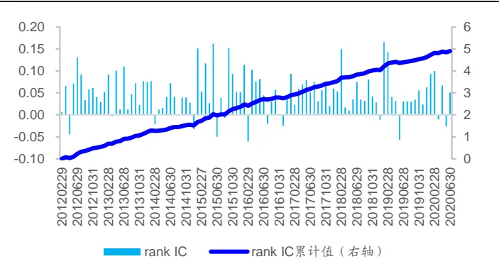
资料来源：Wind，海通证券研究所

图7 尾盘成交占比因子多空相对强弱
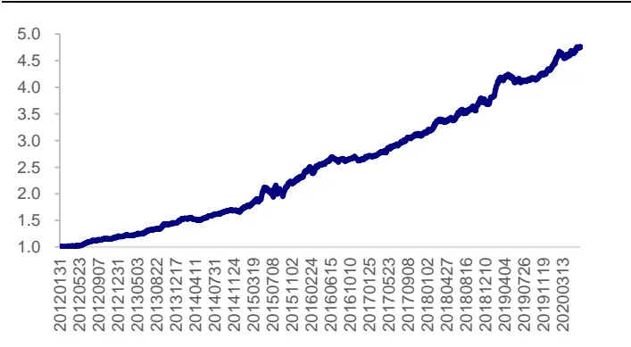
资料来源：Wind，海通证券研究所

## 高频量价相关性

Worldquant 在 Alpha 101 中使用机器学习的方法挖掘出一系列日频因子，其中多个因子中包含量价相关性指标。若将该因子拓展到日内分钟级别，依然有较强的选股能力。

因子计算公式如下：

$$
\frac{\mathrm{s}}{\mathrm{g}}\mathcal{W}\mathrm{\neq}\mathrm{\neq}\mathrm{\neq}\mathrm{\neq}\mathrm{\neq}\mathrm{\neq}\mathrm{\neq}\frac{1}{T}\mathrm{L}\mathrm{\ -}\qquad\mathrm{\it corr}\left({\it Close}_{i,j,n},\frac{Vol_{i,j,n}}{\sum_{j}Vol_{i,j,n}}\right)
$$

量价背离的股票未来表现更好，即，日内缩量上涨或者放量下跌优于放量上涨或缩量下跌。可能的原因是，缩量上涨持续性强，放量下跌换手充分。

高频量价相关性因子月均 Rank IC 为 4.09%，年化 ICIR 为 3.33。因子月均多空收益为 1.18%，月度胜率为 75%。月均多头收益为 0.11%，月均空头收益为-1.07%。以下两图分别展示了因子的累计 Rank IC 与多空相对强弱走势。

图8 高频量价相关性因子 Rank IC 与累计 Rank IC
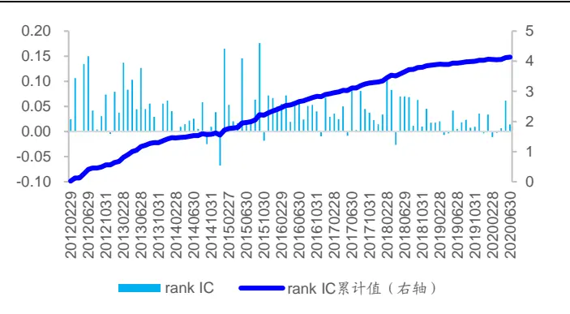
资料来源：Wind，海通证券研究所

图9 高频量价相关性因子多空相对强弱
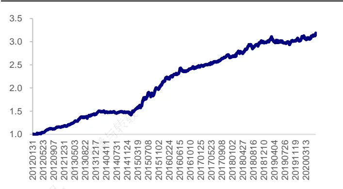
资料来源： ，海通证券研究所

## 改进反转

传统的反转因子——一个月累计涨幅，2017 年以来有效性有所减弱。一个重要的原因是投资者更加注重基本面研究和价值投资，青睐基本面向好的公司，抛弃基本面恶化或者业绩“爆雷”的公司。

大多数公司选择在收盘后发布财务数据等重要信息，造成股票次日往往跳空开盘，并在随后一段时间大幅波动。近年来，A股机构投资者占比提升，市场交易行为在慢慢向美国等发达市场靠拢。这种在美股财报季常见的开盘跳空现象属于市场对重要数据或信息的合理定价，而非投资者行为造成的错误定价。基于以上推断，可以尝试将隔夜和开盘后半小时的涨幅剔除，构建改进反转因子。因子计算公式如下：

$$
\vec{\tau}\colon i\notin\mathcal{K}^{\frac{t}{4}\ddag}=\prod_{n=t}^{n=t-T+1}\frac{Close_{i,j,n}}{Close_{i,10:00,n}}-1
$$

改进反转因子月均 C为 ，年化 C 为 。因子月均多空收益为1.40%，月度胜率为 82%。月均多头收益为 0.28%，月均空头收益为-1.12%。以下两图分别展示了因子的累计 Rank IC与多空相对强弱走势。

图10 改进反转因子 Rank IC 与累计 Rank IC
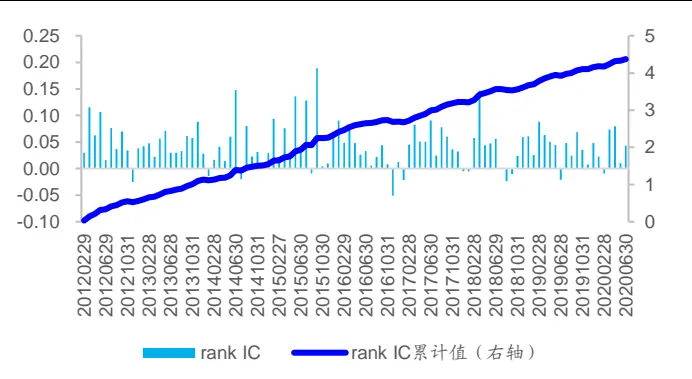
资料来源：Wind，海通证券研究所

图11 改进反转因子多空相对强弱
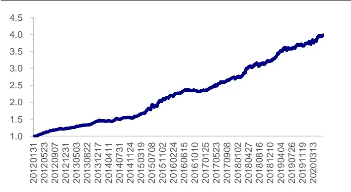
资料来源：Wind，海通证券研究所

## 平均单笔流出金额占比

股票下跌时，如果单笔成交金额大，说明委买有大单，是一种抄底行为。因子计算公式如下：

$$
\mp\frac{19}{3}\mp\frac{32}{45}\mp\frac{53}{36}\pm\frac{5}{25}\overbrace{3}\dag\xi=\frac{1}{T}\sum_{n=t}^{n=t-T+1}\frac{\sum_{j=1}^{N}Amt_{i,j,n}\cdot I_{r_{i,j,n}<0}/\sum_{j=1}^{N}TrdNum_{i,j,n}\cdot I_{r_{i,j,n}<0}}{\sum_{j=1}^{N}Amt_{i,j,n}/\sum_{j=1}^{N}TrdNum_{i,j,n}}
$$

平均单笔流出金额占比因子月均 Rank IC 为 3.03%，年化 ICIR 为 3.15。因子月均多空收益为 1.07%，月度胜率为 81%。月均多头收益为 0.50%，月均空头收益为-0.57%。以下两图分别展示了因子的累计 Rank IC 与多空相对强弱走势。

图12 平均单笔流出金额占比因子 Rank IC与累计 Rank IC
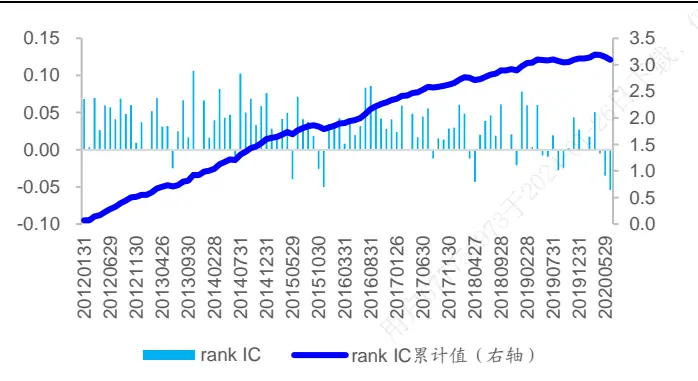
资料来源： ，海通证券研究所

图13 平均单笔流出金额占比因子多空相对强弱
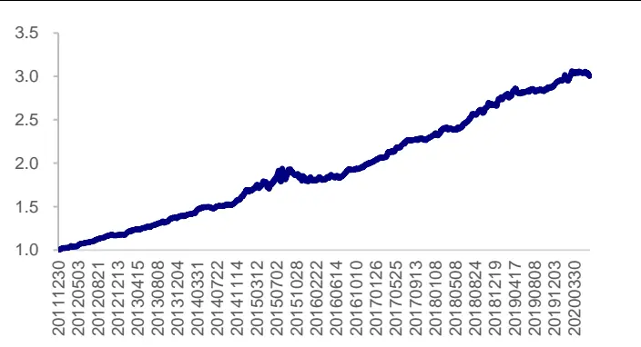
资料来源：Wind，海通证券研究所

## 大单推动涨幅

平均单笔成交金额较大的 K线多空博弈激烈，未来的反转效应更强。因子计算公式如下：

$$
\bigstar\ntriangle{\dot{\pi}}{\lVert{\boldsymbol{\bar{z}}}\rVert}\dot{\mathfrak{z}}\dot{\mathfrak{z}}\mathbin{\vrule het\vrule het\vrule het\vrule het\vrule het\vrule het\vrule het\vrule het\vrule het\vrule het\vrule het\vrule het\vrule het\vrule het\vrule het\vrule het\vrule het\vrule het\vrule het\vrule het\vrule het\vrule het\vrule het\vrule het\vrule het\vrule het0.56}
$$

其中，IdxSet表示j日平均单笔成交金额最大的 30%的 K线的序号。

大单推动涨幅因子月均 Rank IC为 3.71%，年化 ICIR 为 3.79。因子月均多空收益为 1.32%，月度胜率为 83%。月均多头收益为 0.33%，月均空头收益为-0.99%。以下两图分别展示了因子的累计 Rank IC 与多空相对强弱走势。

图14 大单推动涨幅因子 Rank IC 与累计 Rank IC
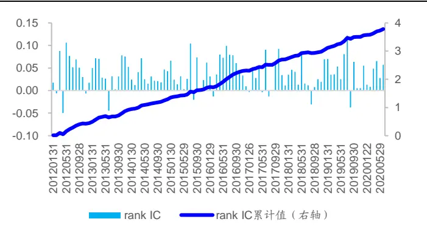
资料来源：Wind，海通证券研究所

图15 大单推动涨幅因子多空相对强弱
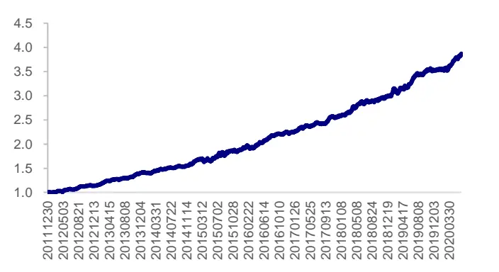
资料来源：Wind，海通证券研究所

## 2.2 分钟高频因子在不同指数范围内的月度选股能力

下表统计了各分钟高频因子在中证 500 指数内的月度选股能力。其中，尾盘成交占比、改进反转和大单推动涨幅具有相对较强的选股能力。

表 6 分钟高频因子在中证 500指数内的月度选股能力（2012.01-2020.06）

| 因子名称 | 多空收益 | 多头收益 | 空头收益 | 多空胜率 | rIC 均值 | rICIR | rIC 胜率 | 多头换手 |
| --- | --- | --- | --- | --- | --- | --- | --- | --- |
| 高频偏度 | 0.66% | 0.22% | -0.44% | 61.39% | 2.35% | 1.48 | 70.30% | 84% |
| 下行波动占比 | 0.55% | 0.18% | -0.37% | 67.33% | 2.11% | 1.44 | 65.35% | 83% |
| 尾盘成交占比 | 1.38% | 0.49% | -0.90% | 76.24% | 4.75% | 2.90 | 77.23% | 77% |
| 量价相关性 | 1.20% | 0.29% | -0.91% | 65.35% | 3.88% | 2.14 | 72.28% | 86% |
| 改进反转 | 1.08% | 0.42% | -0.67% | 66.34% | 4.20% | 2.68 | 83.17% | 85% |
| 平均单笔流出金额占比 | 0.94% | 0.31% | -0.63% | 70.59% | 2.60% | 1.69 | 68.63% | 76% |
| 大单推动涨幅 | 1.18% | 0.33% | -0.84% | 73.53% | 3.12% | 2.06 | 67.65% | 82% |

资料来源：Wind，海通证券研究所

下表统计了各分钟高频因子在沪深 300 指数内的月度选股能力。其中，尾盘成交占比和高频偏度具有相对较强的选股能力。

表 7 分钟高频因子在沪深 300指数内的月度选股能力（2012.01-2020.06）

| 因子名称 | 多空收益 | 多头收益 | 空头收益 | 多空胜率 | rIC 均值 | rICIR | rIC 胜率 | 多头换手 |
| --- | --- | --- | --- | --- | --- | --- | --- | --- |
| 高频偏度 | 0.90% | 0.28% | -0.62% | 66.34% | 2.95% | 1.52 | 66.34% | 80% |
| 下行波动占比 | 0.72% | 0.16% | -0.57% | 62.38% | 2.65% | 1.44 | 70.30% | 79% |
| 尾盘成交占比 | 1.09% | 0.35% | -0.74% | 68.32% | 4.80% | 2.25 | 81.19% | 73% |
| 量价相关性 | 0.54% | 0.17% | -0.37% | 59.41% | 3.71% | 2.02 | 75.25% | 84% |
| 改进反转 | 0.62% | 0.20% | -0.42% | 53.47% | 2.90% | 1.46 | 68.32% | 84% |
| 平均单笔流出金额占比 | 0.35% | 0.15% | -0.20% | 62.75% | 2.14% | 1.17 | 63.73% | 76% |
| 大单推动涨幅 | 0.65% | 0.16% | -0.49% | 59.80% | 2.52% | 1.27 | 59.80% | 80% |

资料来源：Wind，海通证券研究所

## 2.3 分钟高频因子在不同指数范围内的周度选股能力

下表统计了各分钟高频因子在全 A内的周度选股能力。其中，改进反转和大单推动涨幅具有相对较强的选股能力。

表 8 分钟高频因子在全 A内的周度选股能力（2012.01-2020.06）

| 因子名称 | 多空收益 | 多头收益 | 空头收益 | 多空胜率 | rIC 均值 | rICIR | rIC 胜率 | 多头换手 |
| --- | --- | --- | --- | --- | --- | --- | --- | --- |
| 高频偏度 | 0.53% | 0.08% | -0.46% | 75.97% | 4.01% | 6.96 | 84.22% | 87% |
| 下行波动占比 | 0.57% | 0.07% | -0.50% | 76.46% | 4.50% | 6.17 | 81.55% | 88% |
| 尾盘成交占比 | 0.50% | 0.10% | -0.40% | 73.30% | 2.71% | 4.17 | 78.16% | 83% |
| 量价相关性 | 0.61% | 0.11% | -0.49% | 77.18% | 6.16% | 8.32 | 91.02% | 87% |
| 改进反转 | 0.89% | 0.19% | -0.70% | 78.16% | 6.23% | 6.54 | 81.31% | 86% |
| 平均单笔流出金额占比 | 0.46% | 0.27% | -0.19% | 79.90% | 2.54% | 5.83 | 82.08% | 79% |
| 大单推动涨幅 | 0.66% | 0.20% | -0.46% | 83.05% | 4.07% | 8.31 | 87.41% | 86% |

资料来源：Wind，海通证券研究所

下表统计了各分钟高频因子在中证 指数内的周度选股能力。其中，改进反转和量价相关性具有相对较强的选股能力。

表 9 分钟高频因子在中证 500指数内的周度选股能力（2012.01-2020.06）

| 因子名称 | 多空收益 | 多头收益 | 空头收益 | 多空胜率 | rIC 均值 | rICIR | rIC 胜率 | 多头换手 |
| --- | --- | --- | --- | --- | --- | --- | --- | --- |
| 高频偏度 | 0.47% | 0.12% | -0.35% | 69.17% | 3.62% | 4.59 | 74.45% | 88% |
| 下行波动占比 | 0.47% | 0.14% | -0.33% | 63.83% | 3.97% | 4.35 | 73.24% | 88% |
| 尾盘成交占比 | 0.49% | 0.12% | -0.37% | 64.08% | 2.92% | 3.30 | 69.59% | 83% |
| 量价相关性 | 0.51% | 0.08% | -0.43% | 67.96% | 5.59% | 5.73 | 81.27% | 87% |
| 改进反转 | 0.70% | 0.20% | -0.50% | 66.50% | 5.56% | 4.80 | 74.70% | 87% |
| 平均单笔流出金额占比 | 0.33% | 0.18% | -0.15% | 62.95% | 2.16% | 2.84 | 66.26% | 80% |
| 大单推动涨幅 | 0.50% | 0.20% | -0.30% | 68.04% | 3.31% | 4.16 | 71.60% | 85% |

资料来源：Wind，海通证券研究所

下表统计了各分钟高频因子在沪深 300 指数内的周度选股能力。其中，改进反转和量价相关性具有相对较强的选股能力。

表 10 分钟高频因子在沪深 300指数内的周度选股能力（2012.01-2020.06）

| 因子名称 | 多空收益 | 多头收益 | 空头收益 | 多空胜率 | rIC 均值 | rICIR | rIC 胜率 | 多头换手 |
| --- | --- | --- | --- | --- | --- | --- | --- | --- |
| 高频偏度 | 0.33% | 0.04% | -0.29% | 61.65% | 2.74% | 2.97 | 66.02% | 86% |
| 下行波动占比 | 0.43% | 0.12% | -0.31% | 64.08% | 3.30% | 3.27 | 67.96% | 87% |
| 尾盘成交占比 | 0.37% | 0.09% | -0.29% | 62.62% | 2.64% | 2.68 | 64.08% | 82% |
| 量价相关性 | 0.43% | 0.16% | -0.27% | 63.59% | 5.03% | 4.83 | 76.46% | 86% |
| 改进反转 | 0.53% | 0.18% | -0.35% | 64.32% | 4.41% | 3.88 | 74.03% | 86% |
| 平均单笔流出金额占比 | 0.19% | 0.06% | -0.13% | 58.35% | 1.21% | 1.54 | 58.84% | 80% |
| 大单推动涨幅 | 0.29% | 0.11% | -0.18% | 57.63% | 2.55% | 2.87 | 66.59% | 84% |

资料来源： ，海通证券研究所

## 2.4 基于 TICK委托数据的高频因子

## 开盘后净委买增额占比

盘口委托挂单数据刻画了投资者的买入意愿，开盘后 30 分钟内的委买增量越大，投资者在这段时间内的买入意愿越强。因子计算公式如下：

$$
\mathcal{H}\underset{\mathrm{{m}},\mathrm{{m}}}{\underbrace{\dot{\mathrm{m}},\dot{\mathrm{m}}}}\mathrm{~;}\dot{\overline{{\Phi}}}\underset{\mathrm{{m}}}{\underbrace{\dot{\mathrm{m}},\ddot{\mathrm{m}}}}\mathrm{~;}\dot{\overline{{\Theta}}}\underset{\mathrm{{m}}}{\underbrace{\dot{\mathrm{m}}}}\mathrm{~;}\dot{\overline{{\Theta}}}\underset{\mathrm{{m}}}{\underbrace{\dot{\mathrm{m}}}}\mathrm{~;}\dot{\overline{{\Theta}}}\underset{\mathrm{{m}}}{\underbrace{\dot{\mathrm{m}}}}\mathrm{~;}
$$

$$
\begin{array}{r}{\hat{\mathcal{\ddag}}\hat{\mathcal{\ddag}}\hat{\mathcal{\ddag}}\hat{\mathcal{\ddag}}\hat{\mathcal{\hat{H}}}\hat{\mathcal{H}}\hat{\mathcal{H}}\hat{\mathcal{H}}}\\{\quad\mathcal{\vphantom{\int_{\mathbb{R}}^{\mathrm{m}}\int_{0}^{\mathrm{m}}\int_{0}^{\mathrm{m}}\int_{1,j,n}^{\mathrm{m}}}}=\hat{\mathcal{\ddag}}\hat{\mathcal{\ddag}}\hat{\mathcal{H}}\hat{\mathcal{H}}\hat{\mathcal{H}}\hat{\mathcal{H}}\hat{\mathcal{H}}\hat{\mathcal{H}}\hat{\mathcal{H}}\hat{\mathcal{H}}\hat{\mathcal{H}}\hat{\mathcal{H}}}{}_{i,j,n}-\hat{\mathcal{K}}\hat{\mathcal{\ddag}}\hat{\mathcal{}}\hat{\mathcal{H}}\hat{\mathcal{H}}\hat{\mathcal{H}}\hat{\mathcal{H}}\hat{\mathcal{H}}\hat{\mathcal{P}}\\{\quad\mathcal{\vphantom{K}}\hat{\mathcal{H}}\hat{\mathcal{H}}\hat{\mathcal{H}}\hat{\mathcal{H}}\hat{\mathcal{H}}\hat{\mathcal{H}}\hat{\mathcal{H}}\hat{\mathcal{H}}\hat{\mathcal{H}}\hat{\mathcal{H}}\hat{\mathcal{H}}\hat{\mathcal{H}}\hat{\mathcal{H}}\hat{\mathcal{H}}\hat{\mathcal{H}}\hat{\mathcal{H}}\hat{\mathcal{H}}\hat{\mathcal{H}}\hat{\mathcal{H}}\hat{\mathcal{H}}}{}_{i,j,n}\end{array}
$$

开盘后净委买增额占比因子月均 Rank IC 为 4.19%，年化 ICIR 为 4.24。因子月均多空收益为 1.33%，月度胜率为 82%。月均多头收益为 0.68%，月均空头收益为-0.65%。以下两图分别展示了因子的累计 Rank IC 与多空相对强弱走势。

图16 开盘后净委买增额占比因子 Rank IC与累计 Rank IC
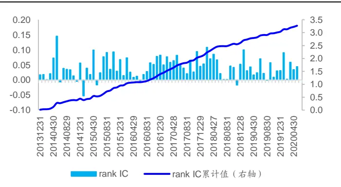
资料来源：Wind，海通证券研究所

图17 开盘后净委买增额占比因子多空相对强弱
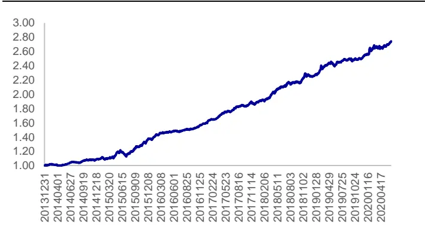
资料来源：Wind，海通证券研究所

## 2.5 基于逐笔成交数据的高频因子

## 开盘后净主买占比

逐笔成交数据中包含投资者主动买入和主动卖出的信息，将两者的成交金额相减即可得到净主动买入的金额（简称“净主买”）。开盘后净主买占比因子刻画了投资者在开盘后 30分钟内，净买入行为的强度。开盘后净主买占比越高，投资者的主动买入行为越强。因子计算公式如下：

$$
\mathscr{F}\overset{\mathrm{di}}{\underset{\mathrm{{sm}}}{\leq}}\lesssim\dot{\underset{\mathrm{{d}}}{\geq}}\dot{\underset{\mathrm{{\pm}}}{\geq}}\ddot{\underset{\mathrm{{\pm}}}{\geq}}\ddot{\underset{\mathrm{{\pm}}}{\geq}}\ddot{\underset{\mathrm{{\pm}}}{\geq}}\dot{\underset{\mathrm{{\updownarrow}}}{\geq}}\dot{\underset{\mathrm{{\updownarrow}}}{\geq}}\dot{\underset{\mathrm{{\updownarrow}}}{\geq}}\dot{\underset{\mathrm{{\updownarrow}}}{\geq}}\left(\frac1{T}\underset{\mathrm{{\updownarrow}}=t}{\sum_{n=t}^{n=t-T+1}}\frac\sum_{j\in9:30-10:00}\dot{\underset{\mathrm{{\updownarrow}}}{\not\nabla}}\dot{\underset{\mathrm{{\updownarrow}}}{\geq}}\dot{\underset{\mathrm{{\updownarrow}}}{\geq}}\ddot{\underset{\mathrm{{\updownarrow}}}{\geq}}\ddot{\underset{\mathrm{{\updownarrow}}}{\geq}}\ddot{\underset{\mathrm{{\updownarrow}}}{\geq}}\ddot{\underset{\mathrm{{\updownarrow}}}{\geq}}\ddot{\underset{\mathrm{{\updownarrow}}}{\geq}}\dot{\underset{i,j,n}{\uparrow}}\right.
$$

$$
\begin{array}{r}{\dot{\bar{\varphi}}\dot{\pm}\vec{\mathcal{F}}\dot{\mathcal{R}}\dot{\mathcal{X}}\dot{\mathcal{R}}\dot{\mathcal{R}}\dot{\mathcal{R}}}{}_{i,j,n}=\dot{\pm}\vec{\mathcal{G}}\dot{\mathcal{H}}\dot{\mathcal{X}}\wedge\dot{\mathcal{R}}\dot{\mathcal{X}}\dot{\mathcal{R}}{}_{i,j,n}-\dot{\pm}\vec{\mathcal{G}}\dot{\mathcal{Y}}\dot{\mathcal{Z}}\dot{\mathcal{R}}\dot{\mathcal{X}}\dot{\mathcal{R}}\dot{\mathcal{Z}}\enspace\\{\enspace\enspace\enspace\enspace\enspace\partial\dot{\mathcal{Z}}\dot{\mathcal{H}}\dot{\mathcal{X}}\enspace\dot{\mathcal{R}}\enspace\dot{\mathcal{Z}}\enspace\enspace\enspace i,j,n}\end{array}
$$

开盘后净主买占比因子月均 Rank IC 为 3.31%，年化 ICIR 为 2.51。因子月均多空收益为 0.98%，月度胜率为 73%。月均多头收益为 0.55%，月均空头收益为-0.42%。以下两图分别展示了因子的累计 Rank IC 与多空相对强弱走势。

图18 开盘后净主买占比因子 Rank IC 与累计 Rank IC
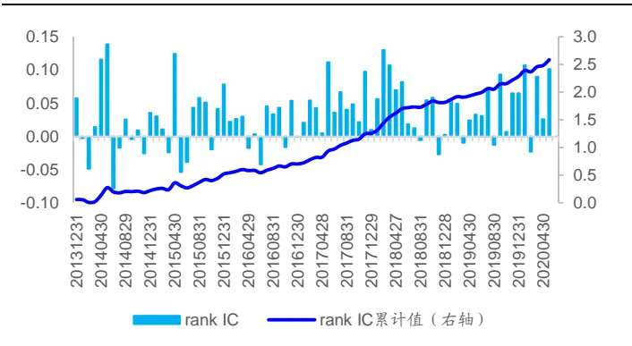
资料来源：Wind，海通证券研究所

图19 开盘后净主买占比因子多空相对强弱
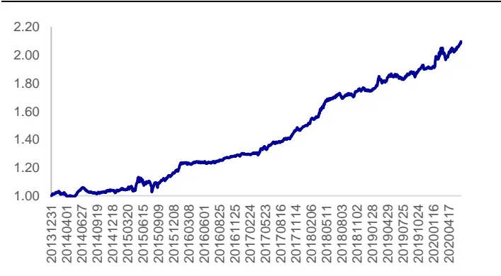
资料来源：Wind，海通证券研究所

## 开盘后净主买强度

开盘后净主买强度因子刻画了投资者在开盘后 30分钟内，净买入行为的稳健性。

开盘后净主买强度越高，投资者的主动买入行为越稳健。因子计算公式如下：

$$
\#\frac{f_{\#}^{*}\zeta_{\#}^{*}\dot{\hat{z}}\dot{\hat{z}}\dot{\hat{z}}}{\mathbb{E}^{*}\zeta_{\#}^{*}\hat{z}_{\#}^{*}\hat{z}_{\#}^{*}\hat{z}_{\#}^{*}}\mathbb{E}_{*}^{*}=\frac{1}{T}\sum_{n=t}^{n=t-T+1}\frac{\operatorname*{mean}_{j\in\Theta;30-10;00}\Big(\dot{\hat{z}}\dot{\hat{z}}\dot{\hat{z}}\vec{\hat{x}},\vec{h\times}_{\mathscr{X}}\ddot{\hat{z}}\vec{\hat{\mathcal{H}}}_{i,j,n}\Big)}{{\operatorname*{std}_{j\in\Theta;30-10;00}\Big(\dot{\hat{z}}\dot{\hat{z}}\dot{\hat{z}}\vec{\hat{x}},\vec{h\times}_{\mathscr{X}}\ddot{\hat{z}}\vec{\hat{\mathcal{H}}}_{i,j,n}\Big)}}
$$

开盘后净主买强度因子月均 Rank IC 为 4.46%，年化 ICIR 为 3.29。因子月均多空收益为 1.34%，月度胜率为 72%。月均多头收益为 0.44%，月均空头收益为-0.91%。以下两图分别展示了因子的累计 Rank IC 与多空相对强弱走势。

图20 开盘后净主买强度因子 Rank IC 与累计 Rank IC
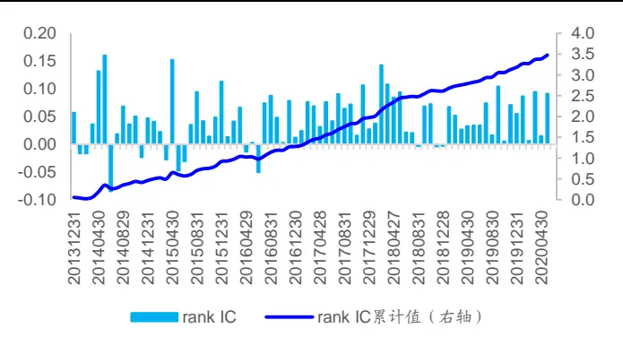
资料来源： ，海通证券研究所

图21 开盘后净主买强度因子多空相对强弱
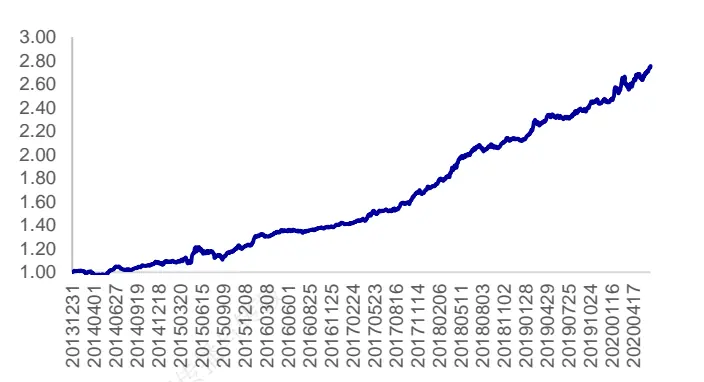
资料来源： ，海通证券研究所

## 大买成交占比

基于逐笔成交数据中的单号，可将逐笔数据合成为单成交数据，并从单的角度区分大小单。再根据对应的“买”、“卖”标记，可进一步计算大买单占全天成交金额的比例（简称“大买成交占比”）。大买成交占比越高，大单买入行为越强。因子计算公式如下：

$$
\texttt{kg}_{\texttt{kg}}^{*}\breve{\mathfrak{K}}\breve{\mathfrak{K}}\mathfrak{K}=\frac{1}{T}\sum_{n=t}^{n=t-T+1}\frac\not\vdash\overrightarrow{\mathfrak{K}}\cdot\overrightarrow{\mathfrak{K}}\cdot\overrightarrow{\mathfrak{K}}\cdot\overrightarrow{\mathfrak{K}}\cdot\overrightarrow{\mathfrak{K}}\cdot\overrightarrow{\mathfrak{K}}\cdot\overrightarrow{\mathfrak{K}}\cdot\overrightarrow{\mathfrak{K}}\cdot\overrightarrow{\mathfrak{K}}\cdot\overrightarrow{\mathfrak{K}}\cdot\overrightarrow{\mathfrak{K}}\cdot\overrightarrow{\mathfrak{K}}\cdot\overrightarrow{\mathfrak{K}}\cdot\overrightarrow{\mathfrak{K}}\cdot\overrightarrow{\mathfrak{K}}\cdot\overrightarrow{\mathfrak{K}}\cdot\overrightarrow{\mathfrak{K}}\cdot\overrightarrow{\mathfrak{K}}\cdot\overrightarrow{\mathfrak{K}}\cdot\overrightarrow{\mathfrak{K}}\cdot\overrightarrow{\mathfrak{K}}\cdot\overrightarrow{\mathfrak{K}}
$$

在界定大小单时，可从单的成交量分布出发。例如，某一单的成交量处于当日成交量分布的均值+1 倍标准差之外，则可被认为是大单。

大买成交占比因子月均 Rank IC为 4.35%，年化 ICIR 为 1.96。因子月均多空收益为 1.35%，月度胜率为 66%。月均多头收益为 0.39%，月均空头收益为-0.96%。以下两图分别展示了因子的累计 Rank IC 与多空相对强弱走势。

图22 大买成交占比因子 Rank IC 与累计 Rank IC
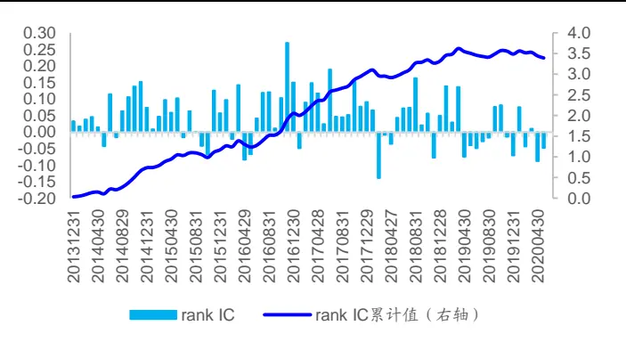
资料来源：Wind，海通证券研究所

图23 大买成交占比因子多空相对强弱
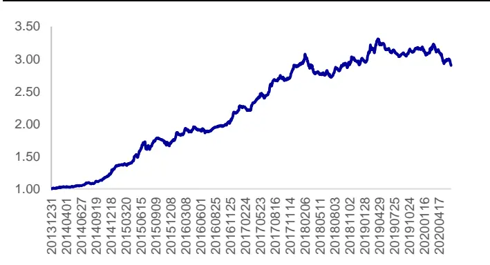
资料来源：Wind，海通证券研究所

## 开盘后知情主卖占比

结合逐笔成交数据中的主买、主卖和预期外收益，可定义知情主卖，用以刻画知情交易者的卖出行为。开盘后知情主卖占比越高，知情交易者卖出行为越强，投资者对股票未来的表现越悲观。

首先，使用股票过去一个月的日内分钟收益序列，建立如下的回归模型：

$$
{r}_{i,j,n}={\gamma}_{0}+\sum_{k=1}^{4}{\gamma}_{1,k}D_{k,i,j,n}^{weekday}\ +\sum_{k=1}^{3}{\gamma}_{2,k}D_{k,i,j,n}^{period}\ +{\gamma}_{3}{r}_{i,j-1,n}+{\varepsilon}_{i,j,n}
$$

其中， $\mathfrak{r}_{\mathrm{i},\mathrm{j},\mathfrak{n}}$ 为股票 i在 n 日第 j分钟的收益； $\mathsf{D}_{\mathsf{k,i,j,n}}\mathsf{\Pi}^{\mathsf{weekday}}$ 为虚拟变量（k=1, 2, 3, 4），分别表示周一至周四； $\mathsf{D}_{\mathsf{k,i,j},\mathsf{n}}^{\mathsf{period}}$ 为时间段虚拟变量 $(\mathsf{k}{=}1,2,3)$ ，分别表示开盘后 30 分钟、盘中及收盘前 30 分钟； $\mathfrak{r}_{\mathfrak{i},\mathfrak{j}-1,\mathfrak{n}}$ 为分钟收益滞后项。

残差序列为股票的预期外收益。当预期外收益为正时，投资者的主动卖出行为可被认为是知情主卖；反之，则被认为是知情主买。因子计算公式如下：

$$
\mathcal{F}\frac{f_{\sf}^{\sf d}}{\sf m}\xi_{\sf}{\sf d}^{\sf m}\mathcal{F}_{\sf}{\sf H}^{\sf L}\frac{\sf+}{\sf\lambda}\dot{\sf\mathcal{Z}}\dot{\sf\Xi}\dot{\mathcal{W}}_{i}\sf K{\sf\Xi}=\frac{1}{T}\sum_{n=t}^{n=t-T+1}\frac{\sum_{j\in\ L^{\eta}:30-10:0}\xi_{\sf}{\sf D}_{i}^{\sf t}\frac{1}{\sf\Xi}\dot{\mathcal{Z}}\dot{\mathcal{W}}_{i}\frac{1}{\mathcal{Z}}\dot{\mathcal{Z}}\dot{\mathcal{W}}_{i,j,n}}{\sum_{j\in\ L^{\eta}:30-10:0}\hbar_{\sf\Xi}^{\sf S}\dot{\mathcal{Z}}\ddot{\mathcal{W}}_{i,j,n}}
$$

开盘后知情主卖占比因子月均 Rank IC为 2.86%，年化 ICIR 为 2.51。因子月均多空收益为 0.76%，月度胜率为 75%。月均多头收益为 0.46%，月均空头收益为-0.30%。以下两图分别展示了因子的累计 Rank IC 与多空相对强弱走势。

图24 知情主卖占比因子 Rank IC 与累计 Rank IC
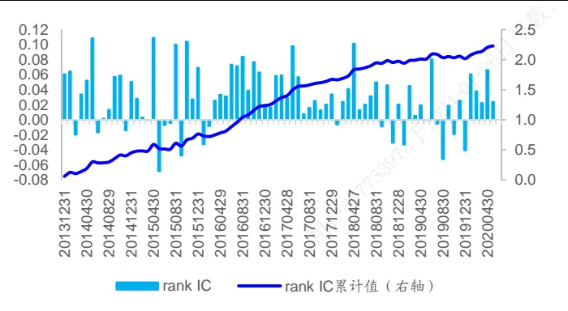
资料来源：Wind，海通证券研究所

图25 知情主卖占比因子多空相对强弱
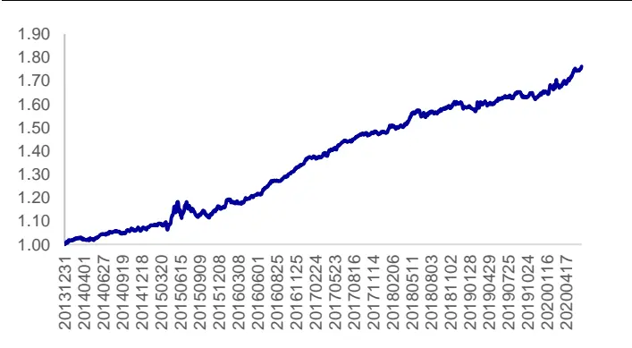
资料来源：Wind，海通证券研究所

## 2.6基于 TICK委托与逐笔成交数据的高频因子

## 开盘后买入意愿占比

委托挂单体现投资者尚未释放的交易意愿，而主买/主卖则代表已进行的交易行为。若将两者结合，可以得到广义的投资者主动买入意愿。开盘后 30 分钟内买入意愿占比越高，投资者的买入意愿越强。因子计算公式如下：

$$
\mathcal{H}\underset{\cong\mathrm{m}}{\underbrace{\mathcal{H}\underset{\cong}{\mathcal{G}}}}\underset{\cong}{\underbrace{\mathcal{E}}}\lambda\wedge\overset{\Rightarrow}{\operatorname{\mathbb{E}}}\lambda\underset{\cong}{\underbrace{\mathcal{H}}}\big\downarrow\mathrm{k}=\frac{1}{T}{\sum}_{n=t}^{n=t-T+1}\frac{\sum_{j\in9:30-10:00}\mathrm{~\mathcal{F}}\big\wedge\frac{\partial}{\operatorname{\mathbb{E}}}\big\wedge\frac{\partial}{\operatorname{\mathbb{E}}}\big\wedge\frac{\partial}{\partial\mathrm{t}}}{\sum_{j\in\Theta:30-10:00}\mathrm{~\mathcal{H}}\big\wedge\frac{\partial}{\partial\mathrm{t}}\mathrm{~\mathcal{H}}\big\rangle_{i,j,n}}
$$

$$
\vec{\mathfrak{F}}\wedge\mathring{\gtrsim}\lesssim_{i,j,n}^{\sharp}=\langle\mathring{\oplus}\underline{{{\vec{\star}}}}\mathbin{{\vec{\ m{\Sigma}}}}\mathbin{{\vec{\ m{\Sigma}}}}\mathbin{{\vec{\ m{\Sigma}}}}\mathbin{{\vec{\ m{\Sigma}}}}\mathbin{{\vec{\ m{\Sigma}}}}\mathbin{{\vec{\ m{\Sigma}}}}|_{i,j,n}+\mathbin{{\dot{\ m{\Sigma}}}}\mathbin{{\vec{\ m{\Sigma}}}}\mathbin{{\vec{\ m{\Sigma}}}}\mathbin{{\vec{\ m{\Sigma}}}}\mathbin{{\vec{\ m{\Sigma}}}}\mathbin{{\vec{\ m{\Sigma}}}}|_{i,j,n}^{\ 7}
$$

开盘后买入意愿占比因子月均 Rank IC为 4.34%，年化 ICIR 为 3.43。因子月均多空收益为 1.57%，月度胜率为 85%。月均多头收益为 0.89%，月均空头收益为-0.68%。以下两图分别展示了因子的累计 Rank IC 与多空相对强弱走势。

图26 开盘后买入意愿占比因子 Rank IC 与累计 Rank IC
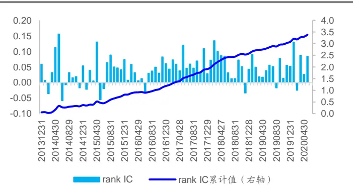
资料来源：Wind，海通证券研究所

图27 开盘后买入意愿占比因子多空相对强弱
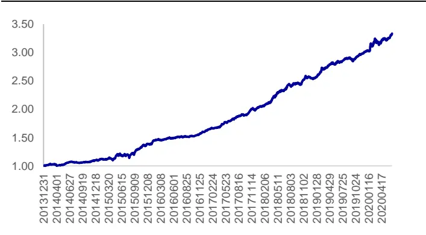
资料来源：Wind，海通证券研究所

## 开盘后买入意愿强度

开盘后 30 分钟内的买入意愿强度越高，投资者的买入意愿越稳健。因子计算公式如下：

$$
\#\frac{f_{\mathbb{A}}^{*}}{\mathbb{A}}\lesssim\vec{\mathbb{B}}\wedge\frac{\vec{\infty}}{\mathbb{B}}\wedge\frac{\mathcal{B}}{\mathbb{B}}\wedge\frac{\mathcal{B}}{\mathbb{B}},\tilde{\mathbb{B}}_{\times}^{*}=\frac{1}{T}{\sum_{n=t}^{n=t-T+1}}\frac{\mathrm{mean}_{j\in9;30-10;00}\left(\vec{\mathbb{B}}\wedge\frac{\vec{\infty}}{\mathbb{B}},\vec{\mathbb{B}}_{\times,j,n}^{*}\right)}{\mathrm{std}_{j\in9;30-10;00}\left(\vec{\mathbb{B}}\wedge\frac{\vec{\infty}}{\mathbb{B}},\vec{\mathbb{B}}_{\times,j,n}^{*}\right)}
$$

开盘后买入意愿强度因子月均 Rank IC为 5.07%，年化 ICIR 为 3.93。因子月均多空收益为 1.82%，月度胜率达 84%。月均多头收益为 0.68%，月均空头收益为-1.14%。以下两图分别展示了因子的累计 Rank IC 与多空相对强弱走势。

图28 开盘后买入意愿强度因子 Rank IC 与累计 Rank IC
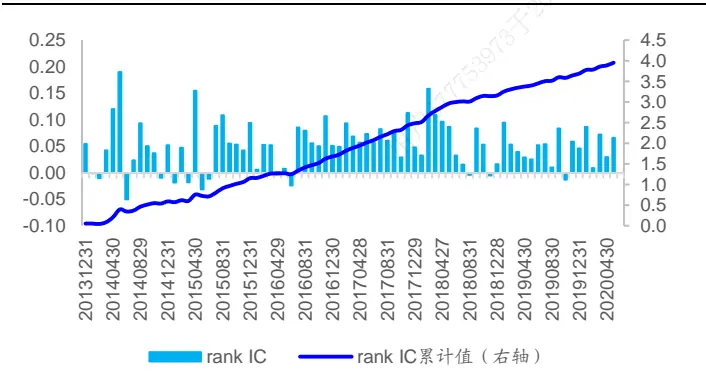
资料来源： ，海通证券研究所

图29 开盘后买入意愿强度因子多空相对强弱

资料来源： ，海通证券研究所

## 2.7 TICK与逐笔高频因子在不同指数范围内的月度选股能力

下表统计了各 TICK与逐笔高频因子在中证 500 指数内的月度选股能力。其中，大买成交占比、开盘后买入意愿强度和开盘后净主买强度具有相对较强的选股能力。

表 11 TICK 与逐笔高频因子在中证 500 指数内的月度选股能力（2014.01-2020.06）

| 因子名称 | 多空收益 | 多头收益 | 空头收益 | 多空胜率 | rIC 均值 | rICIR | rIC 胜率 | 多头换手 |
| --- | --- | --- | --- | --- | --- | --- | --- | --- |
| 开盘后净委买增额占比 | 0.97% | 0.46% | -0.51% | 62.03% | 2.53% | 1.57 | 64.56% | 84% |
| 开盘后净主买占比 | 0.73% | 0.40% | -0.33% | 56.96% | 2.67% | 1.50 | 63.29% | 83% |
| 开盘后净主买强度 | 1.00% | 0.54% | -0.46% | 59.49% | 3.16% | 1.82 | 63.29% | 84% |
| 大买成交占比 | 1.11% | 0.27% | -0.85% | 63.29% | 4.13% | 1.88 | 72.15% | 62% |
| 开盘后知情主卖占比 | 0.57% | 0.08% | -0.48% | 63.29% | 2.32% | 1.43 | 67.09% | 85% |
| 开盘后买入意愿占比 | 0.83% | 0.34% | -0.49% | 65.82% | 2.88% | 1.66 | 64.56% | 84% |
| 开盘后买入意愿强度 | 1.02% | 0.47% | -0.55% | 65.82% | 3.38% | 2.07 | 67.09% | 86% |

资料来源：Wind，海通证券研究所

下表统计了各 TICK与逐笔高频因子在沪深 300 指数内的月度选股能力。其中，开盘后净委买增额占比、大买成交占比和开盘后买入意愿占比具有相对较强的选股能力。

表 12 TICK 与逐笔高频因子在沪深 300 指数内的月度选股能力（2014.01-2020.06）

| 因子名称 | 多空收益 | 多头收益 | 空头收益 | 多空胜率 | rIC 均值 | rICIR | rIC 胜率 | 多头换手 |
| --- | --- | --- | --- | --- | --- | --- | --- | --- |
| 开盘后净委买增额占比 | 1.78% | 0.81% | -0.97% | 68.35% | 4.85% | 2.00 | 68.35% | 82% |
| 开盘后净主买占比 | 0.99% | 0.51% | -0.49% | 59.49% | 2.90% | 1.14 | 64.56% | 81% |
| 开盘后净主买强度 | 0.64% | 0.39% | -0.25% | 63.29% | 3.29% | 1.33 | 63.29% | 82% |
| 大买成交占比 | 1.64% | 0.63% | -1.01% | 63.29% | 5.01% | 1.68 | 69.62% | 54% |
| 开盘后知情主卖占比 | 0.15% | 0.19% | 0.04% | 50.63% | 1.92% | 0.80 | 60.76% | 82% |
| 开盘后买入意愿占比 | 1.37% | 0.88% | -0.49% | 73.42% | 4.35% | 1.77 | 74.68% | 82% |
| 开盘后买入意愿强度 | 1.30% | 0.86% | -0.44% | 67.09% | 4.02% | 1.71 | 68.35% | 84% |

资料来源：Wind，海通证券研究所

## 2.8 TICK与逐笔高频因子在不同指数范围内的周度选股能力

下表统计了各 TICK与逐笔高频因子在全 A内的周度选股能力。其中，开盘后买入意愿强度、开盘后净主买强度和大买成交占比具有相对较强的选股能力。

表 13 TICK 与逐笔高频因子在全 A 内的周度选股能力（2014.01-2020.06）

| 因子名称 | 多空收益 | 多头收益 | 空头收益 | 多空胜率 | rIC 均值 | rICIR | rIC 胜率 | 多头换手 |
| --- | --- | --- | --- | --- | --- | --- | --- | --- |
| 开盘后净委买增额占比 | 0.42% | 0.22% | -0.20% | 73.50% | 3.19% | 5.93 | 81.70% | 43% |
| 开盘后净主买占比 | 0.42% | 0.21% | -0.21% | 73.50% | 2.84% | 4.11 | 74.76% | 43% |
| 开盘后净主买强度 | 0.61% | 0.21% | -0.40% | 77.92% | 3.69% | 5.16 | 80.44% | 44% |
| 大买成交占比 | 0.59% | 0.25% | -0.35% | 71.92% | 3.11% | 3.11 | 69.72% | 29% |
| 开盘后买入意愿占比 | 0.52% | 0.28% | -0.24% | 78.23% | 3.54% | 5.19 | 80.13% | 44% |
| 开盘后买入意愿强度 | 0.71% | 0.29% | -0.42% | 79.18% | 4.24% | 5.96 | 82.65% | 45% |

资料来源：Wind，海通证券研究所

下表统计了各 TICK与逐笔高频因子在中证 500 指数内的周度选股能力。其中，开盘后买入意愿强度和开盘后净主买强度具有相对较强的选股能力。

表 14 TICK 与逐笔高频因子在中证 500 指数内的周度选股能力（2014.01-2020.06）

| 因子名称 | 多空收益 | 多头收益 | 空头收益 | 多空胜率 | rIC 均值 | rICIR | rIC 胜率 | 多头换手 |
| --- | --- | --- | --- | --- | --- | --- | --- | --- |
| 开盘后净委买增额占比 | 0.39% | 0.18% | -0.21% | 60.88% | 2.80% | 3.18 | 68.45% | 46% |
| 开盘后净主买占比 | 0.38% | 0.14% | -0.23% | 63.41% | 2.72% | 2.81 | 65.93% | 44% |
| 开盘后净主买强度 | 0.54% | 0.18% | -0.36% | 67.51% | 3.30% | 3.37 | 67.82% | 45% |
| 大买成交占比 | 0.48% | 0.16% | -0.32% | 62.15% | 2.72% | 2.49 | 64.04% | 29% |
| 开盘后买入意愿占比 | 0.41% | 0.16% | -0.24% | 63.72% | 3.11% | 3.28 | 69.40% | 46% |
| 开盘后买入意愿强度 | 0.57% | 0.27% | -0.30% | 68.77% | 3.58% | 3.67 | 71.92% | 47% |

资料来源：Wind，海通证券研究所

下表统计了各 TICK与逐笔高频因子在沪深 300 指数内的周度选股能力。其中，大买成交占比和开盘后净委买增额占比具有相对较强的选股能力。

表 15 TICK 与逐笔高频因子在沪深 300 指数内的周度选股能力（2014.01-2020.06）

| 因子名称 | 多空收益 | 多头收益 | 空头收益 | 多空胜率 | rIC 均值 | rICIR | rIC 胜率 | 多头换手 |
| --- | --- | --- | --- | --- | --- | --- | --- | --- |
| 开盘后净委买增额占比 | 0.50% | 0.22% | -0.28% | 63.09% | 3.36% | 2.99 | 69.40% | 44% |
| 开盘后净主买占比 | 0.31% | 0.15% | -0.15% | 60.57% | 2.12% | 1.75 | 55.84% | 44% |
| 开盘后净主买强度 | 0.35% | 0.20% | -0.15% | 58.68% | 2.52% | 2.11 | 59.31% | 44% |
| 大买成交占比 | 0.58% | 0.29% | -0.29% | 59.94% | 3.14% | 2.24 | 63.41% | 26% |
| 开盘后买入意愿占比 | 0.43% | 0.24% | -0.19% | 63.41% | 2.99% | 2.49 | 62.15% | 45% |
| 开盘后买入意愿强度 | 0.51% | 0.26% | -0.24% | 62.46% | 3.16% | 2.54 | 64.04% | 46% |

资料来源：Wind，海通证券研究所

## 2.9 高频因子相关性分析

高频因子相关系数矩阵如以下两图所示。从中可见，构造逻辑相近的因子之间相关性较高。例如，高频偏度和下行波动占比因子值、 的相关系数均为 。此外，使用同频率数据构造的因子之间相关性较高。例如，使用逐笔数据构造的开盘后净主买占比和开盘后净主买强度因子值、Rank IC的相关系数分别为 0.90 和 0.93。

而使用不同频率构造的因子之间相关性普遍较低。例如，基于分钟数据的大单推动涨幅与基于 TICK数据的开盘后净委买增额因子值、Rank IC 的相关系数仅为-0.06 和-0.03。由于可见，基于分钟、TICK、逐笔等不同频率的数据构建高频因子，可以起到风险分散的效果。

图30 高频因子值相关系数时间序列均值（2014.01-2020.06）
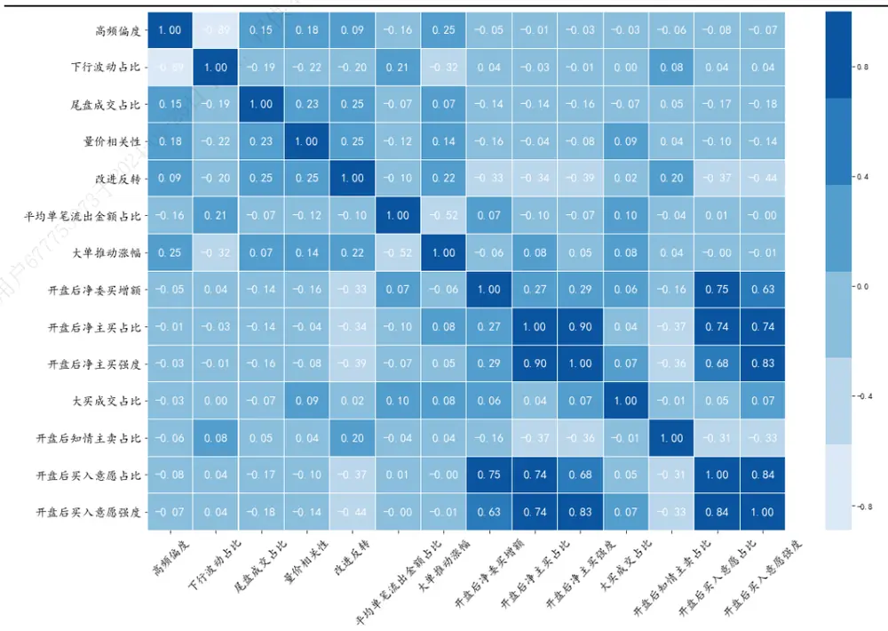
资料来源：Wind，海通证券研究所

图31 高频因子 Rank IC 相关系数（2014.01-2020.06）
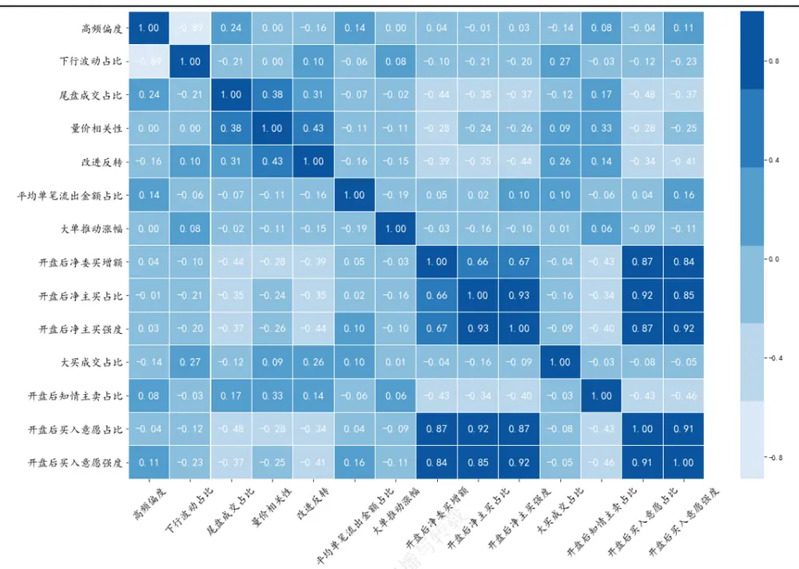
资料来源：Wind，海通证券研究所

## 3. 高频因子在多因子组合中的应用

基于高频数据构建的因子，具有非常稳健的 IC 表现和空头收益，可以通过多种方式为多因子组合提供新的信息。例如，在个股收益预测模型直接加入高频因子，利用高频因子剔除空头个股等。

## 3.1 直接作为 Alpha 因子引入收益预测模型

一种最简单直接的利用高频因子的方式即为，在个股收益预测模型中引入高频因子。

## 提升收益预测模型的表现

如下表所示，在包含风格、低频技术因子、基本面因子的基础收益预测模型中，引入下行波动占比、尾盘成交占比和改进反转 个高频因子，可明显提升收益预测模型的表现。其中，IC、RankIC、多空收益的月均值都明显上升。同时，以月胜率反映的模型稳定性也有所提升。相应地，信息比也得到显著改善。

下表中的多头收益是指预期收益最高的100只股票等权组合相对于全市场等权组合的收益差；空头收益是全市场等权组合相对于预期收益最低的 100 只股票等权组合的收益差；多空收益是多头收益与空头收益之和。

表 16 引入高频因子可显著提升收益预测模型的表现（2013.01-2020.06）

|  | 加入高频因子前 |  |  | 加入高频因子后 |  |  |
| --- | --- | --- | --- | --- | --- | --- |
|  | 月均值 | 月胜率 | 信息比 | 月均值 | 月胜率 | 信息比 |
| IC | 11.43% | 88.89% | 3.44 | 12.59% | 91.11% | 3.98 |
| RankIC | 14.08% | 90.00% | 4.11 | 15.06% | 92.22% | 4.62 |
| 多头收益 | 2.29% | 77.78% | 2.35 | 2.57% | 82.22% | 2.71 |
| 空头收益 | 2.95% | 86.67% | 2.59 | 3.51% | 91.11% | 3.23 |
| 多空收益 | 5.24% | 88.89% | 2.89 | 6.08% | 90.00% | 3.45 |

资料来源：Wind，海通证券研究所

## 提升指数增强策略的超额收益

在收益预测模型中引入高频因子，还可提升指数增强策略的超额收益。在包含风格、低频技术因子、基本面因子的收益预测模型中，引入部分高频因子，并相对于基准指数进行线性优化，得到的指数增强策略超额收益表现列于下表。

其中，沪深 300 指数和中证 800 指数增强策略中引入的高频因子为尾盘成交占比；中证 500 指数增强策略中引入的因子为下行波动占比、尾盘成交占比和改进反转。

表 17 在收益预测模型中引入高频因子，可明显提升指数增强策略的超额收益（2013.01-2020.06）

| 标的指数 | 增强策略 | 收益率 | 波动率 | 信息比 | 最大回撤 | 收益回撤比 | 月胜率 |
| --- | --- | --- | --- | --- | --- | --- | --- |
| 沪深 300 | 基准策略 | 10.56% | 4.33% | 2.28 | 5.40% | 1.95 | 75.56% |
|  | 引入高频因子 | 12.32% | 4.55% | 2.51 | 4.13% | 2.98 | 77.78% |
| 中证500 | 基准策略 | 20.11% | 6.13% | 2.90 | 6.72% | 2.99 | 76.67% |
|  | 引入高频因子 | 22.48% | 6.01% | 3.27 | 5.38% | 4.18 | 83.33% |
| 中证 800 | 基准策略 | 16.68% | 5.19% | 2.91 | 5.32% | 3.13 | 73.33% |
|  | 引入高频因子 | 17.91% | 5.20% | 3.10 | 5.60% | 3.20 | 78.89% |

资料来源：Wind，海通证券研究所
注：指数增强策略在回测时，均扣除单边千分之三的费用。

由上表可见，引入高频因子可以在不明显增加风险的基础上，提升指数增强策略的超额收益表现，尤其是信息比和收益回撤比均得到明显提升。以沪深 300 指数增强策略为例，若在收益预测模型中引入尾盘成交占比因子，则年化超额收益可由 增加至 12.32%，收益提升幅度达 1.75%，信息比由 2.28 提升至 2.51，收益回撤比由 1.95增加至 2.98。

## 3.2 构建空头虚拟变量因子

部分高频因子在指数成分股中的多头效应弱，直接作为 Alpha 因子加入收益预测模型，可能会对模型多头部分的排序造成负向扰动，反而降低增强策略的收益。在这种情况下，可以尝试构建空头虚拟变量因子，仅利用高频因子的空头效应。即，将在高频因子上得分最低的部分股票（如 5%）的因子值设为 1，其余股票的因子值设为 0，构建虚拟变量因子，然后加入个股收益预测模型。

如下表所示，对于中证 800 指数增强策略，若直接以因子形式引入大单推动涨幅因子，年化超额收益不升反降，由 17.91%降低至 16.54%。但若以空头虚拟变量因子的形式引入，则年化超额收益由 17.91%提升至 18.61%。同时，信息比和收益回撤比均得到明显改善。

表 18引入高频空头虚拟变量因子对中证 800指数增强策略超额收益的影响（2013.01-2020.06）

|  | 收益率 | 波动率 | 信息比 | 最大回撤 | 收益回撤比 | 月胜率 |
| --- | --- | --- | --- | --- | --- | --- |
| 基准策略 | 17.91% | 5.20% | 3.10 | 5.60% | 3.20 | 78.89% |
| +大单推动涨幅因子 | 16.54% | 5.18% | 2.90 | 5.11% | 3.23 | 72.22% |
| +大单推动涨幅空头 虚拟变量因子 | 18.61% | 5.29% | 3.17 | 5.08% | 3.67 | 78.89% |

资料来源：Wind，海通证券研究所

## 3.3 利用高频因子剔除空头个股

高频因子空头效应强且在时间序列上稳定，因此可直接利用高频因子来剔除空头个股，以增厚指数增强策略的超额收益。剔除的思路主要有两种：事前剔除和事后剔除。

事前剔除是指，通过调低属于高频因子空头部分个股的预期收益（如，设定空头个股的预期收益为横截面上的最低值），或增加约束条件（如，设定空头个股权重为 0）的方式，使空头股票不出现在最终的优化组合之中。事后剔除则是指，按照原模型得到增强组合后，剔除其中属于高频因子空头部分的个股。

两者都是利用高频因子的空头个股信息对组合进行调整。不同之处在于，前者是在获取增强组合之前做剔除，因此优化模型会补充一些风险相近的个股，来替代被剔除的空头个股；而事后剔除则仅仅是剔除，没有做补充。

## 3.3.1 事前剔除

如下表所示，以 5%为空头阈值，采用事前剔除方法剔除高频因子的空头个股（调低空头个股预期收益），可提升指数增强策略的超额收益表现。特别是对于中证 500 指数增强策略，事前剔除可将策略年化超额收益由22.5%提升至23.8%，提升幅度达1.3%。

表 19 事前剔除高频因子空头个股，可提升指数增强策略的年化超额收益（2013.01-2020.06）

| 标的指数 | 增强策略 | 收益率 | 波动率 | 信息比 | 最大回撤 | 收益回撤比 | 月胜率 |
| --- | --- | --- | --- | --- | --- | --- | --- |
| 沪深 300 | 基准策略 | 12.32% | 4.55% | 2.51 | 4.13% | 2.98 | 77.78% |
|  | 事前剔除 | 12.81% | 4.48% | 2.65 | 4.11% | 3.12 | 77.78% |
| 中证500 | 基准策略 | 22.48% | 6.01% | 3.27 | 5.38% | 4.18 | 83.33% |
|  | 事前剔除 | 23.76% | 6.14% | 3.37 | 6.13% | 3.87 | 85.56% |
| 中证 800 | 基准策略 | 18.61% | 5.29% | 3.17 | 5.08% | 3.67 | 78.89% |
|  | 事前剔除 | 19.47% | 5.29% | 3.30 | 5.08% | 3.84 | 80.00% |

资料来源：Wind，海通证券研究所

从空头阈值敏感性来看，在 的范围内，事前剔除均可提升指数增强策略的年化超额收益。

图32 不同阈值下，事前剔除的沪深 300指数增强策略年化超额收益（2013.01-2020.06）
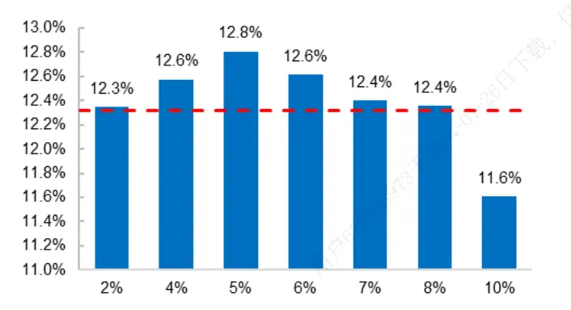
资料来源：Wind，海通证券研究所

图 不同阈值下，事前剔除的中证 指数增强策略年化超额收益（2013.01-2020.06）
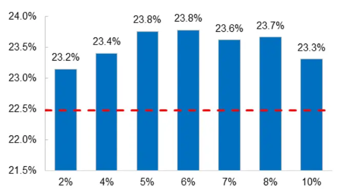
资料来源：Wind，海通证券研究所

图34 不同阈值下，事前剔除的中证 800指数增强策略年化超额收益（2013.01-2020.06）
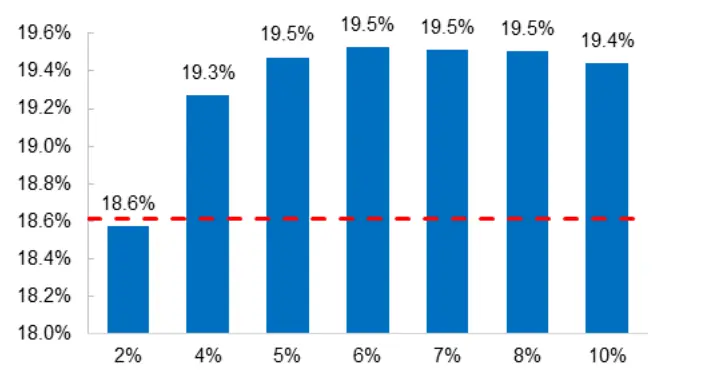
资料来源：Wind，海通证券研究所

## 3.3.2 事后剔除

如下表所示，以 5%为空头阈值，采用事后剔除方法剔除高频因子的空头个股，同样可以提升指数增强策略的超额收益表现。对于中证 500 和中证 800 指数增强策略，事后剔除都可将策略的超额收益提升 1个百分点以上。

表 20 事后剔除高频因子空头个股，可提升指数增强策略的年化超额收益（2013.01-2020.06）

| 标的指数 | 增强策略 | 收益率 | 波动率 | 信息比 | 最大回撤 | 收益回撤比 | 月胜率 |
| --- | --- | --- | --- | --- | --- | --- | --- |
| 沪深300 | 基准策略 | 12.32% | 4.55% | 2.51 | 4.13% | 2.98 | 77.78% |
|  | 事后剔除 | 13.13% | 4.64% | 2.61 | 4.13% | 3.18 | 80.00% |
| 中证500 | 基准策略 | 22.48% | 6.01% | 3.27 | 5.38% | 4.18 | 83.33% |
|  | 事后剔除 | 23.76% | 6.07% | 3.41 | 5.17% | 4.60 | 87.78% |
| 中证800 | 基准策略 | 18.61% | 5.29% | 3.17 | 5.08% | 3.67 | 78.89% |
|  | 事后剔除 | 19.92% | 5.27% | 3.38 | 5.30% | 3.76 | 81.11% |

资料来源：Wind，海通证券研究所

从空头阈值敏感性来看，在 4%-10%的范围内，事后剔除均可明显提升指数增强策略的年化超额收益。

图35 不同阈值下，事后剔除的沪深 300指数增强策略年化超额收益（2013.01-2020.06）
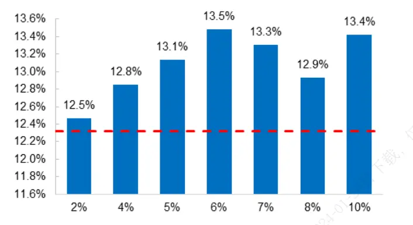
资料来源： ，海通证券研究所

图36 不同阈值下，事后剔除的中证 500指数增强策略年化超额收益（2013.01-2020.06）
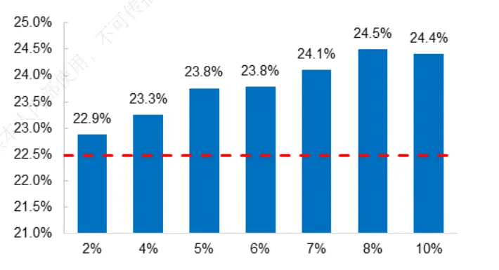
资料来源：Wind，海通证券研究所

图37 不同阈值下，事后剔除的中证 800指数增强策略年化超额收益（2013.01-2020.06）
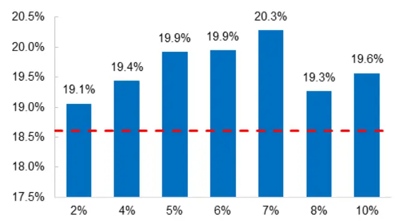
资料来源：Wind，海通证券研究所

综上所述，无论是事前还是事后，剔除高频因子的空头个股均可提升指数增强策略的超额收益。相较而言，在绝大部分阈值水平下，事后剔除的效果更好。这可能是由于，事后剔除主要依赖高频因子的空头效应。而事前剔除则相对较为复杂，还会受优化模型中其他控制变量的影响。事前剔除能否提升增强策略的超额收益，不仅取决于高频因子的空头效应，还与优化模型额外剔除的股票以及补充的股票相关，因而效果并不直接。

## 3.4 小结

本节探讨了 3种在多因子组合中应用高频因子的方法，实证结果表明，这 3 种方法均可在一定程度上提升指数增强策略的超额收益。

下表展示了以本节探讨的 3种方法引入高频因子前后，指数增强策略分年度的超额收益。从中可见，对于沪深 300 指数、中证 500 指数和中证 800 指数，引入高频因子的信息后，均可将指数增强策略的年化超额收益提升 2.6%以上。并且，在时间序列上也较为稳定。在绝大部分年份中，引入高频因子后的策略都优于基准策略。

其中，沪深 300 指数和中证 500 指数增强策略采用直接作为 Alpha 因子引入收益预测模型、事后剔除两种方法；而中证 800 指数增强策略采用直接作为 Alpha 因子引入收益预测模型、构建空头虚拟变量因子、事后剔除 3种方法。

表 21 综合应用高频因子后的指数增强策略分年度超额收益（2013.01-2020.06）

|  | 沪深 300 指数增强 |  |  | 中证 500 指数增强 |  |  | 中证 800 指数增强 |  |  |
| --- | --- | --- | --- | --- | --- | --- | --- | --- | --- |
|  | 引入高频因 子前 | 引入高频因 子后 | 引入高频因子 的收益提升 | 引入高频因 子前 | 引入高频因 子后 | 引入高频因子 的收益提升 | 引入高频因 子前 | 引入高频因 子后 | 引入高频因子 的收益提升 |
| 2013 | 9.9% | 13.6% | 3.7% | 25.1% | 26.6% | 1.5% | 18.5% | 15.5% | -2.9% |
| 2014 | 1.5% | 6.0% | 4.5% | 14.5% | 20.1% | 5.5% | 15.0% | 22.6% | 7.6% |
| 2015 | 20.0% | 26.1% | 6.1% | 73.1% | 66.8% | -6.4% | 35.6% | 39.4% | 3.8% |
| 2016 | 6.8% | 8.4% | 1.6% | 17.6% | 20.1% | 2.5% | 19.3% | 20.3% | 1.1% |
| 2017 | 12.0% | 11.2% | -0.8% | 9.4% | 12.3% | 2.9% | 9.7% | 12.8% | 3.0% |
| 2018 | 5.8% | 6.5% | 0.7% | 11.2% | 14.7% | 3.5% | 11.7% | 12.4% | 0.8% |
| 2019 | 9.6% | 16.1% | 6.6% | 7.6% | 20.0% | 12.4% | 6.4% | 16.6% | 10.2% |
| 2020 | 12.0% | 10.5% | -1.6% | 8.6% | 10.0% | 1.4% | 7.3% | 11.4% | 4.1% |
| 全样本 | 10.6% | 13.1% | 2.6% | 20.1% | 23.8% | 3.7% | 16.7% | 19.9% | 3.2% |

资料来源：Wind，海通证券研究所

图38 引入高频因子信息后的沪深 300 指数增强策略相对基准策略的月度超额收益
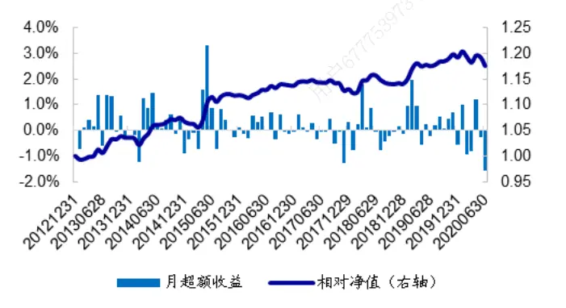
资料来源：Wind，海通证券研究所

图39 引入高频因子信息后的中证 500 指数增强策略相对基准策略的月度超额收益
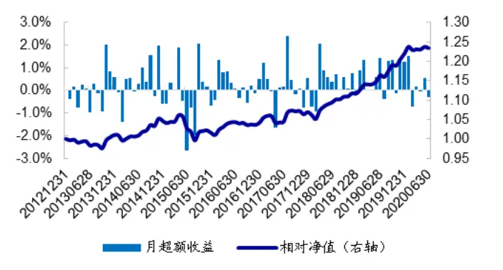
资料来源：Wind，海通证券研究所

图40 引入高频因子信息后的中证 800指数增强策略相对基准策略的月度超额收益
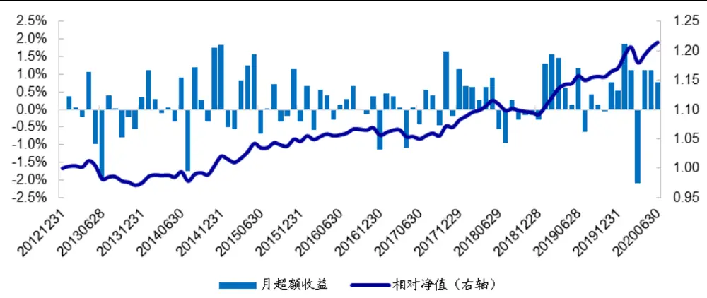
资料来源：Wind，海通证券研究所

## 4. 总结与讨论

在美国市场，使用高频数据来生成交易信号并获取收益，已成为一类主流的策略。而国内市场上，一些优秀的私募也在最近几年纷纷将高频策略付诸实践，并创造出稳定且优异的业绩。随着他们的成功，越来越多的投资者开始关注和研究高频数据，试图揭载开其中的原理和规律。

工欲善其事，必先利其器。高频策略的基础是高频数据，故本文首先详细介绍了当不前 A 股可获得的三个层级的高频数据——分钟级、TICK 级和逐笔级，它们的结构和特用，性决定了交易信号或量化因子的设计方法。

其次，本文在这三个层级上，构建了总计 14 个高频因子。并在剔除常见因子的影本响后，证明了这些因子在全市场、沪深 300 及中证 500 成分股内都具备稳定、可靠的仅月度和周度选股能力。载，

最后，但也是最重要的一点。不论是直接作为收益预测因子，还是用作负面剔除，-26将这些高频因子包含的信息引入传统的量化多因子模型，均可以为增强策略的收益风险4-特征带来较为显著的提升。2

## 5. 风险提示7775

因子失效风险，模型误设风险，历史统计规律失效风险。

## 信息披露

## 分析师声明

[Table冯佳睿yst 金融工程研究团队s]

袁林青金融工程研究团队

姚石金融工程研究团队

罗蕾金融工程研究团队

余浩淼金融工程研究团队

本人具有中国证券业协会授予的证券投资咨询执业资格，以勤勉的职业态度，独立、客观地出具本报告。本报告所采用的数据和信息均来自市场公开信息，本人不保证该等信息的准确性或完整性。分析逻辑基于作者的职业理解，清晰准确地反映了作者的研究观点，结论不受任何第三方的授意或影响，特此声明。

## 法律声明

本报告仅供海通证券股份有限公司（以下简称“本公司”）的客户使用。本公司不会因接收人收到本报告而视其为客户。在任何情况下：本报告中的信息或所表述的意见并不构成对任何人的投资建议。在任何情况下，本公司不对任何人因使用本报告中的任何内容所引致的任何损失负任何责任。

本报告所载的资料、意见及推测仅反映本公司于发布本报告当日的判断，本报告所指的证券或投资标的的价格、价值及投资收入可能载会波动。在不同时期，本公司可发出与本报告所载资料、意见及推测不一致的报告。

市场有风险，投资需谨慎。本报告所载的信息、材料及结论只提供特定客户作参考，不构成投资建议，也没有考虑到个别客户特殊的可投资目标、财务状况或需要。客户应考虑本报告中的任何意见或建议是否符合其特定状况。在法律许可的情况下，海通证券及其所属关联机构可能会持有报告中提到的公司所发行的证券并进行交易，还可能为这些公司提供投资银行服务或其他服务。

本报告仅向特定客户传送，未经海通证券研究所书面授权，本研究报告的任何部分均不得以任何方式制作任何形式的拷贝、复印件或内复制品，或再次分发给任何其他人，或以任何侵犯本公司版权的其他方式使用。所有本报告中使用的商标、服务标记及标记均为本公本司的商标、服务标记及标记。如欲引用或转载本文内容，务必联络海通证券研究所并获得许可，并需注明出处为海通证券研究所，且仅不得对本文进行有悖原意的引用和删改。载，

根据中国证监会核发的经营证券业务许可，海通证券股份有限公司的经营范围包括证券投资咨询业务。6日

## 海通证券股份有限公司研究所[Table_PeopleInfo]

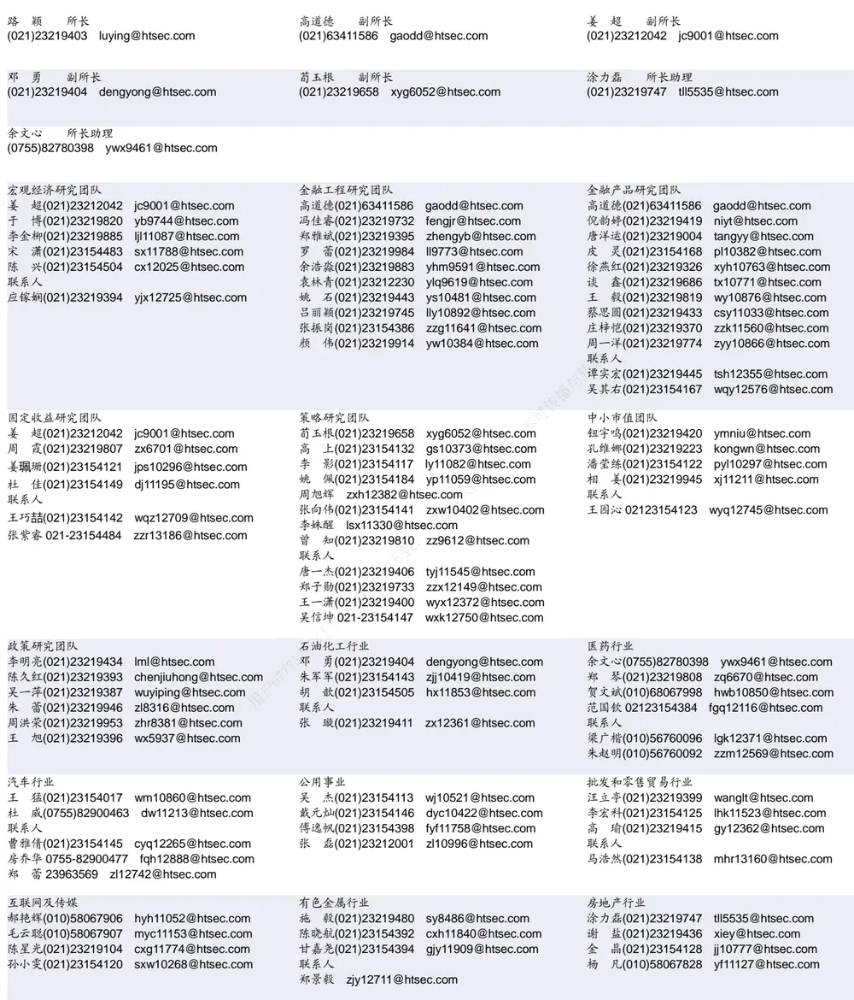

| 电子行业 |  | 煤炭行业 |  | 电力设备及新能源行业 |  |
| --- | --- | --- | --- | --- | --- |
|  | 陈 平(021)23219646 cp9808@htsec.com |  | 李 淼(010)58067998 Im10779@htsec.com |  | 张一弛(021)23219402 zyc9637@htsec.com |
|  | 尹 苓(021)23154119 yl11569@htsec.com |  |  | 戴元灿(021)23154146 dyc10422@htsec.com | 房 青(021)23219692 fangq@htsec.com |
|  | 谢 磊(021)23212214 xl10881@htsec.com |  | 吴 杰(021)23154113 wj10521@htsec.com |  | 曾 彪(021)23154148 zb10242@htsec.com |
|  | 蒋 俊(021)23154170 jj11200@htsec.com |  | 联系人 |  | 徐柏乔(021)23219171 xbq6583@htsec.com |
| 联系人 |  |  |  | 王 涛(021)23219760 wt12363@htsec.com | 陈佳彬(021)23154513 cjb11782@htsec.com |

| 基础化工行业 |  | 计算机行业 | 通信行业 |  |
| --- | --- | --- | --- | --- |
| 刘 威(0755)82764281 Iw10053@htsec.com |  | 郑宏达(021)23219392 zhd10834@htsec.com | 朱劲松(010)50949926 zjs10213@htsec.com |  |
| 刘海荣(021)23154130 Ihr10342@htsec.com |  | 杨 林(021)23154174 yl11036@htsec.com | 余伟民(010)50949926 ywm11574@htsec.com |  |
| 张翠翠(021)23214397 | zcc11726@htsec.com | 于成龙 ycl12224@htsec.com | 张峥青(021)23219383 zzq11650@htsec.com |  |
| 孙维容(021)23219431 swr12178@htsec.com |  | 黄竞晶(021)23154131 hjj10361@htsec.com | 张 弋(010)58067852 zy12258@htsec.com |  |
| 李 智(021)23219392 Iz11785@htsec.com |  | 洪 琳(021)23154137 hl11570@htsec.com | 联系人 | 杨彤昕 010-56760095 ytx12741@htsec.com |

| 非银行金融行业 |  | 交通运输行业 |  |  | 纺织服装行业 |  |  |
| --- | --- | --- | --- | --- | --- | --- | --- |
|  | 孙 婷(010)50949926 st9998@htsec.com |  | 虞 楠(021)23219382 yun@htsec.com |  |  | 梁 希(021)23219407 lx11040@htsec.com |  |
|  | 何 婷(021)23219634 ht10515@htsec.com |  | 罗月江(010）56760091 lyj12399@htsec.com |  |  | 盛 开(021)23154510 sk11787@htsec.com |  |
|  | 李芳洲(021)23154127 Ifz11585@htsec.com |  |  | 李 轩(021)23154652 lx12671@htsec.com | 联系人 |  |  |
| 联系人 |  |  |  | 陈 宇(021)23219442 cy13115@htsec.com |  |  | 刘 溢(021)23219748 ly12337@htsec.com |

| 建筑建材行业 | 机械行业 |  | 钢铁行业 |
| --- | --- | --- | --- |
| 冯晨阳(021)23212081 fcy10886@htsec.com |  | 余炜超(021)23219816 swc11480@htsec.com | 刘彦奇(021)23219391 liuyq@htsec.com |
| 潘莹练(021)23154122 pyl10297@htsec.com | 周 丹 zd12213@htsec.com |  | 周慧琳(021)23154399 zhl11756@htsec.com |
| 申 浩(021)23154114 sh12219@htsec.com |  | 吉 晟(021)23154653 js12801@htsec.com | 番与转载 |
| 杜市伟(0755)82945368 dsw11227@htsec.com 颜慧菁 yhj12866@htsec.com |  | 赵玥炜(021)23219814 zyw13208@htsec.com |  |

| 建筑工程行业 | 农林牧渔行业 |  | 食品饮料行业 |
| --- | --- | --- | --- |
| 张欣劫 zxj12156@htsec.com |  | 丁 频(021)23219405 dingpin@htsec.com | 闻宏伟(010)58067941 whw9587@htsec.com 唐 宇(021)23219389 ty11049@htsec.com |
| 李富华(021)23154134 Ifh12225@htsec.com 杜市伟(0755)82945368 dsw11227@htsec.com | 联系人 | 陈 阳(021)23212041 cy10867@htsec.com | 颜慧菁 yhj12866@htsec.com |
|  |  | 孟亚琦(021)23154396 myq12354@htsec.com | 张宇轩(021)23154172 zyx11631@htsec.com |
|  |  |  | 联系人 程碧升(021)23154171 cbs10969@htsec.com |

| 军工行业 |  | 银行行业 |  | 社会服务行业 |
| --- | --- | --- | --- | --- |
| 张恒晅 zhx10170@htsec.com |  | 孙 婷(010)50949926 st9998@htsec.com |  | 汪立亭(021)23219399 wanglt@htsec.com |
| 张高艳 0755-82900489 zgy13106@htsec.com |  | 解巍巍 xww12276@htsec.com |  | 陈扬扬(021)23219671 cyy10636@htsec.com |
| 联系人 刘砚菲 021-2321-4129 lyf13079@htsec.com | 林加力(021)23154395 ljl12245@htsec.com |  | 许樱之 xyz11630@htsec.com |  |

| 家电行业 |  | 造纸轻工行业 |
| --- | --- | --- |
| 陈子仪(021)23219244 | chenzy@htsec.com | 衣桢永(021)23212208 yzy12003@htsec.com |
| 李 阳(021)23154382 | ly11194@htsec.com |  |
| 朱默辰(021)23154383 | zmc11316@htsec.com | 联系人 |
| 刘 璐(021)23214390 | II11838@htsec.com | 柳文韬(021)23219389 Iwt13065@htsec.com |

## 研究所销售团队

深广地区销售团队

蔡铁清(0755)82775962 ctq5979@htsec.com

伏财勇(0755)23607963 fcy7498@htsec.com

辜丽娟(0755)83253022 gulj@htsec.com

刘晶晶(0755)83255933 liujj4900@htsec.com

饶 伟(0755)82775282 rw10588@htsec.com

欧阳梦楚(0755)23617160

oymc11039@htsec.com

巩柏含 gbh11537@htsec.com

滕雪竹 txz13189@htsec.com

上海地区销售团队
胡雪梅(021)23219385 huxm@htsec.com
朱 健(021)23219592 zhuj@htsec.com
季唯佳(021)23219384 jiwj@htsec.com
黄 毓(021)23219410 huangyu@htsec.com
漆冠男(021)23219281 qgn10768@htsec.com
胡宇欣(021)23154192 hyx10493@htsec.com
黄 诚(021)23219397 hc10482@htsec.com
毛文英(021)23219373 mwy10474@htsec.com
马晓男 mxn11376@htsec.com
杨祎昕(021)23212268 yyx10310@htsec.com
张思宇 zsy11797@htsec.com
王朝领 wcl11854@htsec.com
邵亚杰 23214650 syj12493@htsec.com
李 寅 021-23219691 ly12488@htsec.com北京地区销售团队
殷怡琦(010)58067988 yyq9989@htsec.com郭 楠 010-5806 7936 gn12384@htsec.com张丽萱(010)58067931 zlx11191@htsec.com杨羽莎(010)58067977 yys10962@htsec.com李 婕 lj12330@htsec.com
欧阳亚群 oyyq12331@htsec.com
郭金垚(010)58067851 gjy12727@htsec.com

海通证券股份有限公司研究所

地址：上海市黄浦区广东路 689号海通证券大厦 9楼

电话：（021）23219000

传真：（021）23219392

网址：www.htsec.com