## [Tab相关研究

Table_ReportInfo]《选股因子系列研究（五十八）——知情交易与主买主卖》2020.02.12

《选股因子系列研究（五十七）——基于《选股因子系列研究（五十七）基于

主动买入行为的选股因子》2020.01.10《选股因子系列研究（五十六）——买卖单数据中的 Alpha》2019.11.05

分析师:冯佳睿

Tel:(021)23219732

Email:fengjr@htsec.com

证书:S0850512080006

分析师:袁林青

Tel:(021)23212230

Email:ylq9619@htsec.com

证书:S0850516050003

## 选股因子系列研究（七十）——日内市场微观结构与高频因子选股能力

## 投资要点：

在系列前期报告中，我们挖掘了不同层级高频数据中的选股能力并构建得到了一系列具有显著选股能力的因子。随着因子研究的深入，我们发现在计算高频因子时，若仅使用日内某段时间的数据计算因子值能够进一步增强因子的选股能力。此外，有些高频因子往往更适合使用开盘后 分钟的数据计算，而有些高频因子往往更适合使用剔除开盘后 分钟的数据计算。本文对于上述现象进行了描述与讨论，并将这一现象与股票日内不同时段的微观特征联系在一起。

- 使用日内不同时段数据计算高频因子会明显影响因子选股能力。部分因子在仅使用开盘后数据计算时展现出了更强的选股能力，另一部分因子在剔除开盘后数据计算时展现出了更强的选股能力。我们认为这一现象与日内市场微观结构以及因子内在逻辑存在联系。

- 股票日内成交呈 型分布。股票日内成交呈 型分布，开盘后 分钟以及收盘前 分钟的成交占比远高于日内其他时段，并且该现象在不同的指数范围内皆存在。股票日内成交的 型分布特征在海外市场同样能够被观察到。

- 股票日内成交特征形成原因。1980 年以来，许多海外文献讨论了股票日内成交与波动的分布特征。由于开盘后与收盘前处于一段无法交易时段的两端，这容易使得非自主流动性交易者聚集，由此会导致自主流动性交易者以及知情交易者聚集于相同时段。基于逐笔成交数据可计算得到股票单成交信息并区分得到大单。股票大单成交在日内同样呈现 U 型分布特征。

- 开盘后 30 分钟与收盘前 30 分钟存在本质性差异。虽然开盘后 30 分钟以及收盘前 30 分钟皆聚集了较多的成交，但是使用这两段时间的数据计算得到的高频因子在选股能力上存在明显差异。

- 股票日内波动以及买卖价差呈 L型分布。股票分钟收益波动以及盘口买卖价差在日内呈 L 型分布。结合海外相关研究，我们推测开盘后 30 分钟聚集了更多的知情交易者。因此，使用该段时间的数据计算旨在刻画知情交易者行为的因子能够得到更强的选股能力。此外，考虑到知情交易者更难出现过度反应，因此使用剔除该段时间的数据计算旨在刻画投资者过度反应的因子能够得到更强的选股能力。

- 通过调整因子计算所使用的数据时段，可改进因子选股能力，并进一步提升组合收益表现。以买入意愿强度为例，中证 500 指数增强组合年化收益提升约 3.6%。以买入意愿占比为例，沪深 300 指数增强组合年化收益提升约 1.7%。

- 风险提示。市场系统性风险、资产流动性风险以及政策变动风险会对策略表现产生较大影响。

在系列前期报告中，我们基于不同层级的高频数据构建得到了一系列具有显著选股能力的因子。随着因子研究的深入，我们发现在计算高频因子时，若仅使用日内某段时间的数据计算因子值，能够进一步增强因子的选股效果。此外，部分高频因子往往更适合使用开盘后 30 分钟的数据计算，而另一部分高频因子往往更适合使用剔除开盘后 30分钟的数据计算。本文对于上述现象进行了描述与讨论，并将这一现象与日内市场微观结构联系在一起。

本文共分为五章。第一章展示了使用不同时段数据计算得到的高频因子的选股能力，第二章从不同的角度刻画了日内市场微观结构，并将其与因子选股能力联系在一起，第三章对比展示了各因子在加入组合后对于组合收益的影响，第四章总结了全文，第五章提示了风险。

## 1. 不同时段数据计算得到的高频因子

系列前期报告使用了不同层级的高频数据构建了各类高频因子。回测结果表明，高频因子具有较为显著的月度选股能力。随着因子研究的深入，我们发现使用日内不同时段数据计算得到的因子在选股能力上存在明显差异。

不妨将日内数据（9:30~14:56，后文简称全天）分为两个时段：9:30~9:59（后文简称为开盘后）、10:00~14:56（后文简称为剔除开盘后），并分别使用两个时段的数据计算因子值。下表对比展示了使用不同时段数据计算得到的高频因子的选股能力。（因子具体计算方法可参考前期系列专题报告。）

表 1 不同时段计算得到的高频因子的月度选股能力（2014.01.02~2020.07.31）

|  | 月度IC 均值 |  | 内音 剔除开盘后 | 月均多空收益 |  |  |
| --- | --- | --- | --- | --- | --- | --- |
|  | 全天 | 开盘后 |  | 全天 | 开盘后 | 剔除开盘后 |
| 高频偏度 | -0.02 | -0.01 | -0.03 | 0.94% | 0.31% | 1.00% |
| 下行波动占比 | 0.02 | -0.01 | 0.02 | 0.54% | 0.44% | 0.85% |
| 净委买占比 | 0.02 | 0.03 | 0.00 | 0.57% | 0.97% | 0.16% |
| 委托成交相关性 | -0.02 | -0.01 | -0.02 | 0.75% | 0.38% | 0.75% |
| 净主买占比 | 0.01 | 0.02 | 0.01 | 0.33% | 0.72% | 0.35% |
| 知情主卖占比 | -0.02 | -0.02 | -0.02 | 0.61% | 0.75% | 0.22% |
| 买入意愿占比 | 0.02 | 0.03 | 0.02 | 0.69% | 1.06% | 0.40% |
| 买入意愿强度 | 0.03 | 0.04 | 0.02 | 1.01% | 1.36% | 0.78% |

资料来源：Wind，海通证券研究所

观察上表不难发现，部分因子在仅使用开盘后数据计算时展现出了更强的选股能力，如，净委买占比、净主买占比、知情主卖占比、买入意愿占比以及买入意愿强度。上述因子在仅使用开盘后数据计算时，因子的月均 IC以及月均多空收益皆得到了明显提升。同样可以发现，部分因子在剔除开盘后数据计算时展现出了更强的选股能力，如，委托成交相关性、高频偏度、下行波动占比等因子。

从因子构建思路来看，以净委买占比为代表的一系列因子着重刻画了投资者的主动交易行为或者主动交易倾向。该类因子认为前期主动买入（卖出）或者买入（卖出）意愿较强的股票，未来表现更好（更差）。考虑到具有信息优势的投资者（后文简称知情交易者）的交易行为具有更强的领先性，因此可以认为该类因子实际上旨在捕捉知情交易者的交易行为，而以高频偏度为代表的一系列因子则更多刻画了投资者在交易上的过度反应。

考虑到不同类别的高频因子从不同的角度刻画了投资者的交易行为，因此可猜测投资者在日内不同时段中的行为模式或者构成存在差异，由此影响了高频因子对于投资者行为的刻画并导致了因子选股能力的差异。基于这一猜测，可从不同角度刻画日内市场微观结构特征。

本文将尝试从成交额占比、大单占比、分钟收益波动以及盘口买卖价差这 4个角度刻画投资者交易行为在日内不同时段的特征，并结合海外相关研究推测日内特征形成的原因以及对于高频因子选股能力的影响。

## 2. 日内不同时段的投资者行为

基于现有的高频数据，本章从成交额占比、大单占比、分钟收益波动以及盘口买卖价差这 4个角度刻画了投资者在日内不同时段的行为特征。为了统计与展示的便利，本章在计算各指标时，将日内交易时段按照 30 分钟为 1段，分为了 8段。

首先可使用 2014 年以来的分钟成交数据刻画股票在日内不同时段的成交占比。下图分别展示了全市场、中证 800 指数外、中证 500 指数内以及沪深 300 指数内的股票日内成交分布情况。

图1 不同时段成交占比（全市场）（2014.01~2020.07）
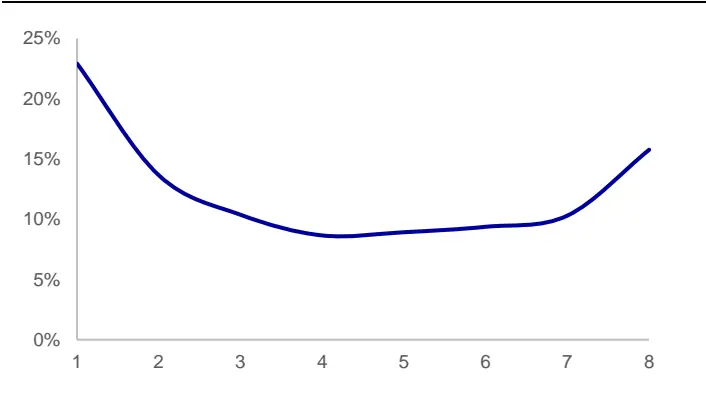
资料来源：Wind，海通证券研究所

图2 不同时段成交占比（中证 800指数外）（2014.01~2020.07）
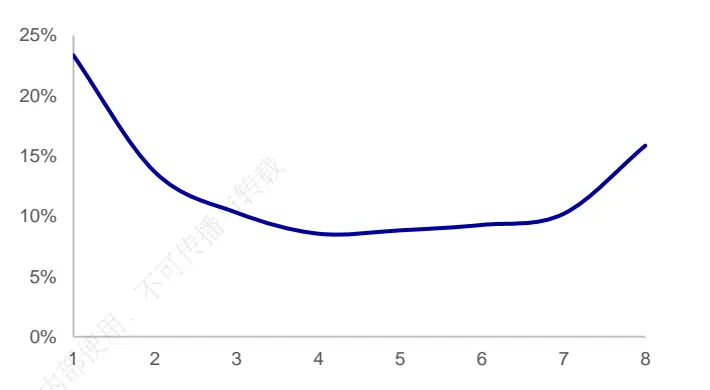
资料来源：Wind，海通证券研究所

图3 不同时段成交占比（中证 500指数内）（2014.01~2020.07）
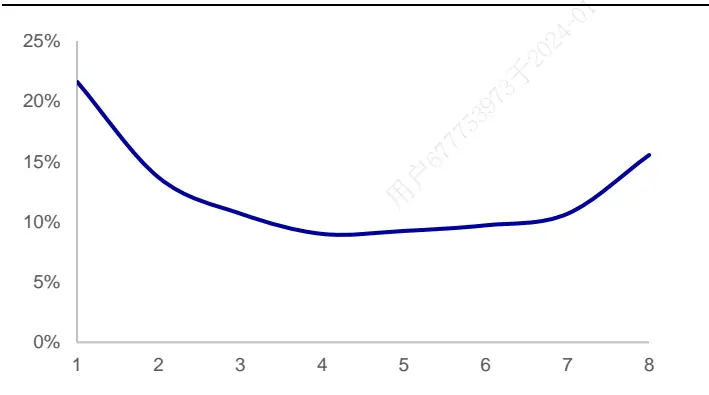
资料来源：Wind，海通证券研究所

图4 不同时段成交占比（沪深 300指数内）（2014.01~2020.07）
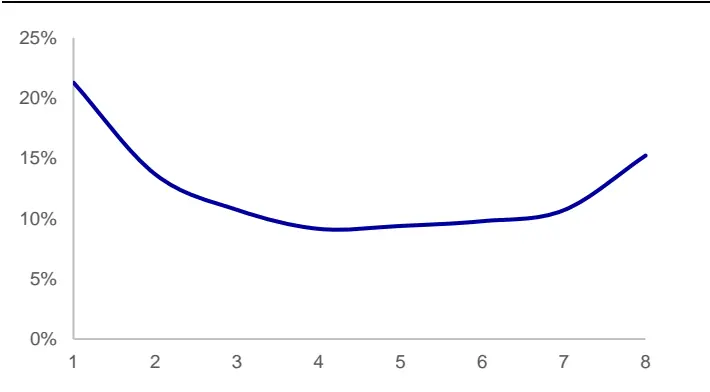
资料来源：Wind，海通证券研究所

总体来看，股票日内成交呈 U 型分布，开盘后 30 分钟以及收盘前 30分钟的成交占比远高于日内其他时段，并且这种现象在不同的指数范围内皆存在。此外，开盘后的成交占比略高于收盘前的成交占比。

股票日内成交的 U 型分布特征在海外市场同样能够被观察到。1980 年以来，许多海外文献讨论了股票日内成交与波动的分布特征。Wood, McInish,Ord（1985）1、Admati,Anat R.,Paul Pfleiderer（1988）2等人皆在相关文献中讨论了股票成交在日内的形态特征。相关文献发现，股票的成交在日内呈现 U 型分布特征，即早盘与尾盘聚集了更多的成交而盘中成交则相对较少。

对于股票日内成交呈 U型分布的原因，相关文献也进行了深入讨论。不妨以 Admati,Anat R.,Paul Pfleiderer（1988）发表的《A Theory if Intrady Patterns: Volume and PriceVariablility》为例。文章作者将市场中的交易者分为了知情交易者（Informed Traders）与流动性交易者（Liquidity Traders），而流动性交易者又可按照其自主性进一步分为自主流动性交易者（Discretionary Liquidity Traders）以及非自主流动性交易者（Non-Discretionary Liquidity Traders）。文章研究结果表明，只要市场中存在知情交易者，随着知情交易者的增多，自主流动性交易者的聚集性会越来越强。这是因为知情交易者相互之间存在竞争，而这种竞争将提升流动性交易者的福利（Welfare）。

由于开盘后与收盘前处于无法交易时间的两端，这容易使得非自主流动性交易者聚集，由此会导致自主流动性交易者以及知情交易者聚集于相同时段。此外，文章认为，收盘前成交的聚集也有可能是交易所清算规则所引起的。在特定清算规则下，某些 T 日发生的交易会在几日后的收盘清算。虽然证券的交收取决于交易发生的日期，但是实际交易发生的日内时间并不会影响证券的交收。这也就使得许多非自主流动性交易者的最后交易期限为收盘。在这种情况下，流动性交易者会倾向于在收盘时间附近交易。（若投资者对于具体结论的推导感兴趣可阅读相应文献原文。）

基于上述文献结论，若早尾盘聚集了更多的知情交易者，那么我们也就不难理解为何以净委买占比为代表的一系列因子在使用开盘后 30 分钟数据计算时具有更强的选股能力。为了能够进一步体现开盘后与收盘前时段中信息含量，可统计日内不同时段中大单的分布特征。

在识别大单时，本文首先基于逐笔成交数据中的买卖单号将逐笔成交数据还原为买卖单数据。其次，考虑到买卖单成交额的分布特征具有极为明显的偏度，故而对于买卖单成交额进行对数处理，并基于对数单成交额的分布设定大单阈值。下图分别展示了全市场、中证 800 指数外、中证 500 指数内以及沪深 300 指数内的股票日内大单的分布情况。（即，各时段大单成交额占全天大单成交额的比例。）

图5 不同时段大单占比（全市场）（2014.01~2020.07）
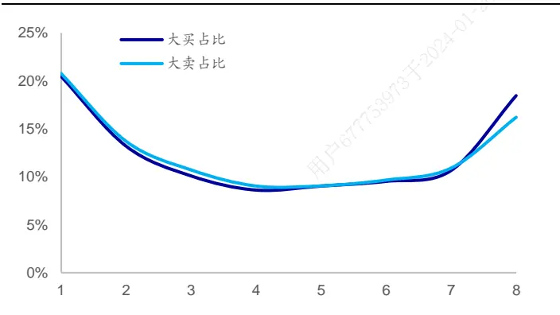
资料来源： ，海通证券研究所

图6 不同时段大单占比（中证 800指数外）（2014.01~2020.07）
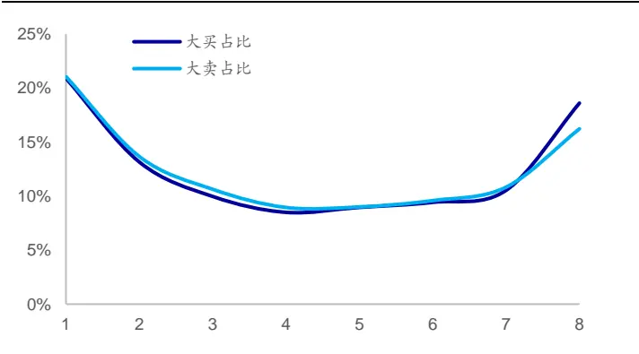
资料来源：Wind，海通证券研究所

图7 不同时段大单占比（中证 500指数内）（2014.01~2020.07）
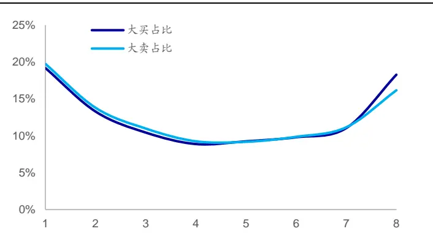
资料来源：Wind，海通证券研究所

图8 不同时段大单占比（沪深 300指数内）（2014.01~2020.07）
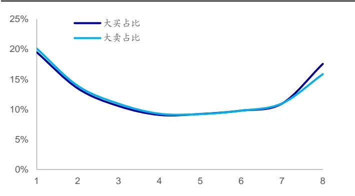
资料来源：Wind，海通证券研究所

结合成交分布特征以及大单分布特征来看，开盘后与收盘前不仅聚集了更多的成交，也聚集了更多的大单。若认为大单更能够体现出大资金的行为，那么大单占比更高的时段具有更高的信息含量。考虑到主动交易类因子或者知情交易类因子旨在刻画知情交易者的行为，该类因子在信息含量更高的时段能够更加精准地刻画知情交易者的行为，从而带来更强的选股能力。

若假定开盘后 分钟与收盘前 分钟同样具有较高的信息质量，且知情交易者参与较多，那么主动交易类因子或者知情交易类因子应该在使用收盘前 30 分钟数据计算时同样呈现出较强的选股能力，但是实际回测结果却并非如此。从下表回测结果可知，因子在使用开盘后 30分钟与收盘前 30 分钟计算时，展现出了截然不同的选股能力。虽然两段时间同样聚集了较多的成交，但是两个时段依旧存在较为明显的差异。

表 2 部分高频因子月度选股能力对比（2014.01.02~2020.07.31）

|  | 月度IC 均值 |  | AR 收盘前 | 月均多空收益 |  |  |
| --- | --- | --- | --- | --- | --- | --- |
|  | 全天数据 | 开盘后 |  | 全天数据 | 开盘后 | 收盘前 |
| 净委买占比 | 0.02 | 0.03 | 0.00 | 0.57% | 0.97% | 0.16% |
| 净主买占比 | 0.01 | 0.02 | 0.01 | 0.33% | 0.72% | 0.35% |
| 知情主卖占比 | -0.02 | -0.02 | -0.02 | 0.61% | 0.75% | 0.22% |
| 买入意愿占比 | 0.02 | 0.03 | 0.02 | 0.69% | 1.06% | 0.40% |
| 买入意愿强度 | 0.03 | 0.04 | 0.02 | 1.01% | 1.36% | 0.78% |

资料来源： ，海通证券研究所

不妨进一步考察股票日内收益波动在不同时段的分布特征。考虑到不同股票的波动率水平存在差异，本节在计算得到股票各时段的收益波动后，对于波动率进行了标准化处理。下图展示了全市场、中证 800 指数外、中证 500 指数内以及沪深 300 指数内的股票日内收益波动的分布情况。

图9 不同时段分钟收益波动（全市场）（2014.01~2020.07）
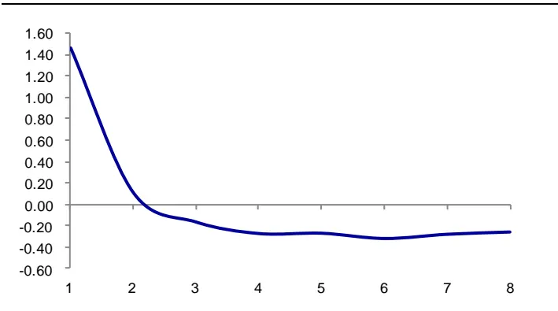
资料来源：Wind，海通证券研究所

图10 不 同 时 段 分 钟 收 益 波 动 （ 中 证 800 指 数 外 ）（2014.01~2020.07）
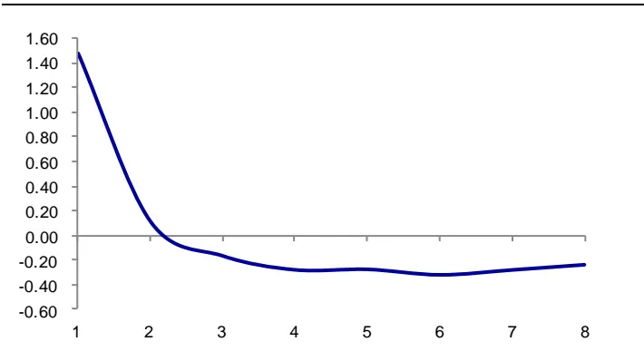
资料来源：Wind，海通证券研究所

图11 不 同 时 段 分 钟 收 益 波 动 （ 中 证 500 指 数 内 ）（2014.01~2020.07）
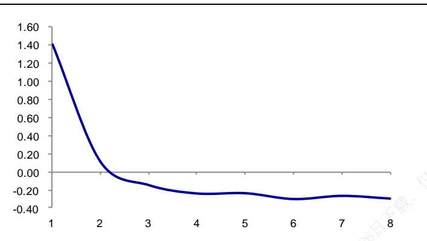
资料来源：Wind，海通证券研究所

图12 不 同 时 段 分 钟 收 益 波 动 （ 沪 深 300 指 数 内 ）（2014.01~2020.07）
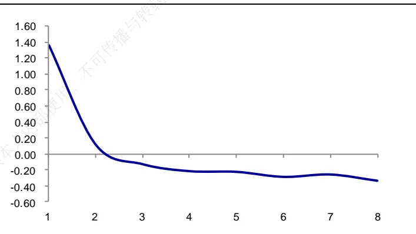
资料来源：Wind，海通证券研究所

观察上图可知，股票收益波动的分布与成交分布特征并不相同，整体呈现 L型特征。在不同的指数范围内，股票收益波动的日内分布皆呈 L型。这一现象与海外市场的观察结果并不完全一致。在海外相关文献中，股票日内收益波动与成交类似，在日内呈现出了 U 型特征。

French,Roll（1986）3认为股票日内波动是由私有信息所造成，私有信息通过知情交易者的交易行为引起波动。因此在知情交易者聚集交易的时段中，股票会呈现出更高的波动。若基于前文讨论过的 Admati, Anat R.,Paul Pfleiderer（1988）的研究结果，知情交易者更容易聚集在开盘后与收盘前交易，那么股票应该在开盘后与收盘前呈现出更高的收益波动。虽然美国市场股票日内波动呈现出了 U型特征，但是国内市场却呈现出了 L 型特征。那么我们是否可以推测，在国内市场，开盘后聚集了更多的知情者，而收盘前的知情交易者占比却相对较低。

基于这一推测，可进一步观察股票盘口买卖价差的日内分布特征。考虑到不同股票的流动性水平存在差异，股票盘口的买卖价差不具有可比性，本节在计算得到股票各时段的平均买卖价差后，对于买卖价差进行了标准化处理。下图展示了全市场、中证 800指数外、中证 500 指数内以及沪深 300 指数内的股票日内买卖价差的分布情况。

图13 不同时段平均买卖价差（全市场）（2014.01~2020.07）
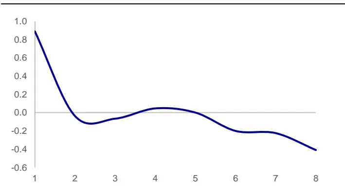
资料来源：Wind，海通证券研究所

图14 不 同 时 段 平 均 买 卖 价 差 （ 中 证 800 指 数 外 ）（2014.01~2020.07）

资料来源：Wind，海通证券研究所

图15 不 同 时 段 平 均 买 卖 价 差 （ 中 证 500 指 数 内 ）（2014.01~2020.07）
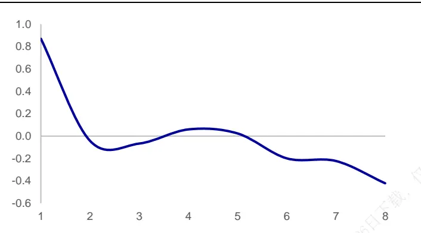
资料来源：Wind，海通证券研究所

图16 不 同 时 段 平 均 买 卖 价 差 （ 沪 深 300 指 数 内 ）（2014.01~2020.07）
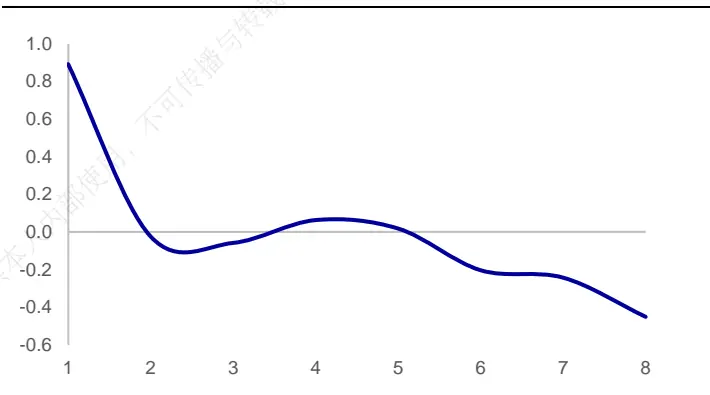
资料来源：Wind，海通证券研究所

观察上图不难发现，在不同的指数范围内，股票日内买卖价差分布与日内收益波动分布类似，皆呈现出了 型。那么买卖价差的这种分布特征到底体现了什么呢？本文在解读买卖价差的含义时参考了 Glosten, Lawrence R., Lawrence E. Harris（1988）4发表的《Estimating the Components of the Bid/Ask Spread》。文章作者认为买卖价差由两方面因素所产生，一部分是交易双方的信息不对称性，市场中的知情交易者越多，做市商所面对的信息不对称性越强，因此会通过买卖价差向交易对手方收取更高的交易成本。另一部分是由于库存成本、清算成本等因素所产生。文章研究结论表明，股票的买卖价差很大程度上体现出了信息不对称性。

考虑到股票在开盘后与收盘前都具有较高的成交占比，但是开盘后的买卖价差远高于收盘前。因此可以认为股票在开盘后所呈现出的较高的买卖价差体现了股票在开盘后的交易时段中知情交易者较多，具有更强的信息不对称性，而收盘前相对较低的买卖价差则说明该段时间的知情交易者相对较少。

由于主动交易类因子以及知情交易类因子旨在刻画具有信息优势的投资者的交易行为，该类因子在使用知情交易者占比较高的交易数据进行计算时能够更好地刻画投资者的交易行为，从而展现出更强的选股能力。此外，相比于常规交易者，知情投资者更难以出现过度反应的现象，因此以高频偏度为代表的一系列因子在使用剔除了开盘后 30分钟的数据计算时具有更强的选股能力。

## 3. 组合对比测试

前文回测结果表明，部分高频因子在使用开盘后或者收盘前数据计算时呈现出了更强的选股能力。因此，可通过调整计算因子所使用的数据范围，进一步提升相关高频因子的选股能力。

## 3.1 中证 500指数增强组合对比

不妨以月度调仓的中证 500 指数增强组合为例，在其他各方面相同的情况下，分别在模型中使用开盘后买入意愿强度以及全天买入意愿强度，并观察模型在 2016 年以来的收益表现。下表对比展示了两模型的收益风险情况。

表 3 中证 500 指数增强组合对比（2016.01.04~2020.07.31）

| 年度 | 超额收益 |  | 最大回撤 |  | 年化波动率 |  |
| --- | --- | --- | --- | --- | --- | --- |
|  | 使用全天 买入意愿强度 | 使用开盘后 买入意愿强度 | 使用全天 买入意愿强度 | 使用开盘后 买入意愿强度 | 使用全天 买入意愿强度 | 使用开盘后 买入意愿强度 |
| 2016 | 27.1% | 29.8% | 1.9% | 1.5% | 5.7% | 5.3% |
| 2017 | 9.6% | 14.5% | 2.5% | 2.2% | 4.9% | 4.8% |
| 2018 | 19.1% | 19.2% | 2.0% | 1.9% | 5.9% | 5.6% |
| 2019 | 11.5% | 18.2% | 5.9% | 6.4% | 6.2% | 6.1% |
| 截至 2020年7月31日 | 14.0% | 16.5% | 4.4% | 4.0% | 7.7% | 8.0% |
| 全区间 | 19.1% | 22.7% | 5.9% | 6.4% | 6.0% | 5.8% |

资料来源： ，海通证券研究所

观察上表不难发现，相比于使用全天数据计算买入意愿强度，使用开盘后 分钟数据计算得到的买入意愿强度不仅在单因子上呈现出了更强的选股能力，在加入组合后同样能够为组合带来进一步的收益增强以及风险的降低。加入开盘后买入意愿强度的模型在各年中皆取得了更高的超额收益。此外，模型也在大部分年份中取得了更小的收益波动以及最大回撤。下图对比展示了两组合的净值走势。

图17 中证 500 指数增强组合净值（2016.01.04~2020.07.31）
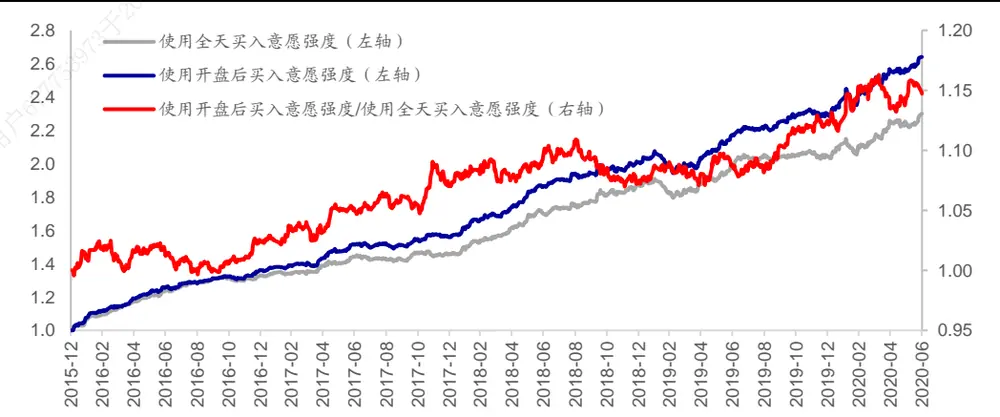
资料来源： ，海通证券研究所

## 3.2 沪深 300指数增强组合对比

同样可以月度调仓的沪深 300 指数增强组合为例，在其他各方面相同的情况下，分别在模型中使用全天买入意愿占比以及开盘后买入意愿占比，并观察模型在 2016 年以来的收益表现。下表对比展示了两模型的收益风险情况。

表 4 沪深 300 指数增强组合对比（2016.01.04~2020.07.31）

| 年度 | 超额收益 |  | 最大回撤 |  | 年化波动率 |  |
| --- | --- | --- | --- | --- | --- | --- |
|  | 使用全天 买入意愿占比 | 使用开盘后 买入意愿占比 | 使用全天 买入意愿占比 | 使用开盘后 买入意愿占比 | 使用全天 买入意愿占比 | 使用开盘后 买入意愿占比 |
| 2016 | 11.0% | 12.3% | 2.5% | 3.0% | 4.0% | 4.0% |
| 2017 | 8.3% | 10.4% | 1.7% | 1.5% | 3.6% | 3.8% |
| 2018 | 10.2% | 12.1% | 4.9% | 4.2% | 4.6% | 4.5% |
| 2019 | 8.2% | 10.1% | 4.4% | 3.6% | 4.4% | 4.5% |
| 截至 2020年7月31日 | 6.3% | 6.6% | 2.6% | 3.9% | 5.0% | 5.0% |
| 全区间 | 10.1% | 11.8% | 4.9% | 4.2% | 4.3% | 4.3% |

资料来源：Wind，海通证券研究所

观察上表不难发现，相比于全天数据计算买入意愿占比因子，开盘后 分钟数据计算得到的买入意愿占比因子不仅在单因子上具有更强的选股能力，在加入组合后同样能够为组合带来进一步收益的提升。加入开盘后买入意愿占比的模型在各年中皆取得了更高的超额收益。下图对比展示了两组合的净值走势。

图18 沪深 300 指数增强组合净值（2016.01.04~2020.07.31）
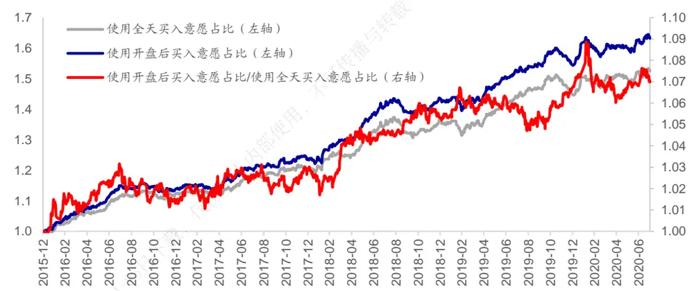
资料来源：Wind，海通证券研究所

## 4. 总结

通过对比，我们发现高频因子在使用日内不同时段数据进行计算时，其月度选股能力存在明显差异。根据因子内在逻辑的不同，使用不同时段数据计算得到的因子的月度选股能力也会有所不同。可根据高频因子内在逻辑将其分为两类，一类旨在刻画知情交易者的交易行为，该类因子在使用开盘后 分钟数据计算时具有更强的月度选股能力，而另一类旨在刻画投资者的过度反应，该类因子在使用剔除开盘后 分钟数据计算时的选股能力相对较强。结合海外研究成果以及国内市场微观结构特征，我们认为这一现象与不同时段的投资者构成以及高频因子内在逻辑存在较强联系。

从日内特征来看，股票成交以及大单成交皆呈现 U型分布，但是股票分钟收益波动以及盘口买卖价差呈现 型分布。结合海外相关研究成果，我们推测这种日内形态表明虽然开盘后与收盘前皆聚集了较多的成交，但是开盘后的成交中知情交易者占比更高。因此旨在刻画知情交易者行为的高频因子在使用该段时间数据计算时会具有更强的效果。此外，由于知情交易者更难出现过度反应，因此旨在刻画投资者过度反应的高频因子在剔除该段时间数据后的选股能力能得到提升。

基于上述思路，可调整因子计算所使用的数据时段，并进一步提升因子的选股能力。在中证 500 指数增强组合以及沪深 300 指数增强组合中，相关因子的改进同样能够带来组合表现的提升。

## 5. 风险提示

市场系统性风险、资产流动性风险以及政策变动风险会对策略表现产生较大影响。

## 信息披露

分析师声明

[Table冯佳睿yst金融工程研究团队s]

袁林青金融工程研究团队

本人具有中国证券业协会授予的证券投资咨询执业资格，以勤勉的职业态度，独立、客观地出具本报告。本报告所采用的数据和信息均来自市场公开信息，本人不保证该等信息的准确性或完整性。分析逻辑基于作者的职业理解，清晰准确地反映了作者的研究观点，结论不受任何第三方的授意或影响，特此声明。

## 法律声明

本报告仅供海通证券股份有限公司（以下简称 本公司 ）的客户使用。本公司不会因接收人收到本报告而视其为客户。在任何情况下，本报告中的信息或所表述的意见并不构成对任何人的投资建议。在任何情况下，本公司不对任何人因使用本报告中的任何内容所引致的任何损失负任何责任。

本报告所载的资料、意见及推测仅反映本公司于发布本报告当日的判断，本报告所指的证券或投资标的的价格、价值及投资收入可能会波动。在不同时期，本公司可发出与本报告所载资料、意见及推测不一致的报告。

市场有风险，投资需谨慎。本报告所载的信息、材料及结论只提供特定客户作参考，不构成投资建议，也没有考虑到个别客户特殊的播投资目标、财务状况或需要。客户应考虑本报告中的任何意见或建议是否符合其特定状况。在法律许可的情况下，海通证券及其所属可关联机构可能会持有报告中提到的公司所发行的证券并进行交易，还可能为这些公司提供投资银行服务或其他服务。

本报告仅向特定客户传送，未经海通证券研究所书面授权，本研究报告的任何部分均不得以任何方式制作任何形式的拷贝、复印件或复制品，或再次分发给任何其他人，或以任何侵犯本公司版权的其他方式使用。所有本报告中使用的商标、服务标记及标记均为本公司的商标、服务标记及标记，如欲引用或转载本文内容，务必联络海通证券研究所并获得许可，并需注明出处为海通证券研究所，目不得对本文进行有悖原意的引用和删改。仅

根据中国证监会核发的经营证券业务许可，海通证券股份有限公司的经营范围包括证券投资咨询业务。下载

## 海通证券股份有限公司研究所[Table_PeopleInfo]

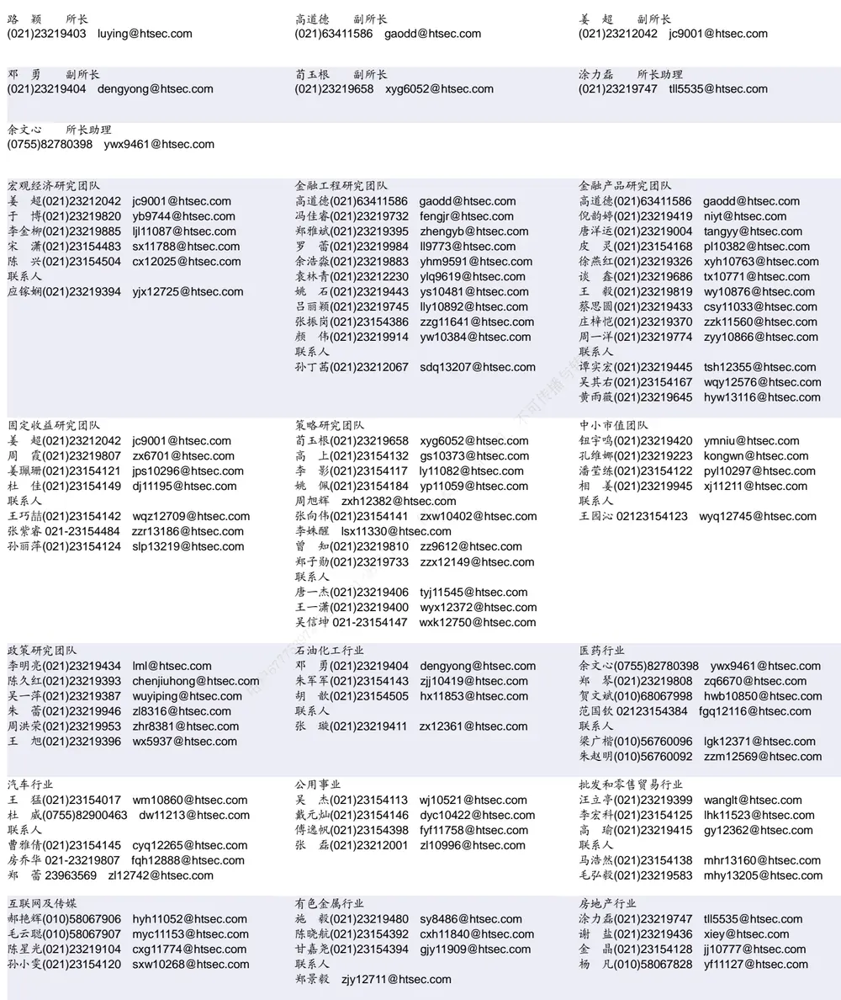

| 建筑工程行业 | 农林牧渔行业 |  | 食品饮料行业 |  |
| --- | --- | --- | --- | --- |
| 张欣劼 zxj12156@htsec.com | 丁 频(021)23219405 dingpin@htsec.com | 不可传 | 闻宏伟(010)58067941 whw9587@htsec.com | 唐 宇(021)23219389 ty11049@htsec.com |
| 李富华(021)23154134 Ifh12225@htsec.com 杜市伟(0755)82945368 dsw11227@htsec.com | 陈 阳(021)23212041 cy10867@htsec.com 联系人 |  | 颜慧菁 yhj12866@htsec.com |  |
|  | 孟亚琦(021)23154396 myq12354@htsec.com |  | 张宇轩(021)23154172 zyx11631@htsec.com 联系人 |  |
|  |  |  | 程碧升(021)23154171 cbs10969@htsec.com |  |

| 电子行业 |  | 煤炭行业 | 电力设备及新能源行业 |  |
| --- | --- | --- | --- | --- |
|  | 陈 平(021)23219646 cp9808@htsec.com | 李 淼(010)58067998 Im10779@htsec.com | 张一弛(021)23219402 | zyc9637@htsec.com |
|  | 尹 苓(021)23154119 yl11569@htsec.com | 戴元灿(021)23154146 dyc10422@htsec.com | 房 青(021)23219692 | fangq@htsec.com |
|  | 谢 磊(021)23212214 xl10881@htsec.com | 吴 杰(021)23154113 wj10521@htsec.com | 曾 彪(021)23154148 | zb10242@htsec.com |
|  | 蒋 俊(021)23154170 jj11200@htsec.com | 联系人 |  | 徐柏乔(021)23219171 xbq6583@htsec.com |
| 联系人 |  | 王 涛(021)23219760 wt12363@htsec.com |  | 陈佳彬(021)23154513 cjb11782@htsec.com |
| 肖隽翀 021-23154139 xjc12802@htsec.com |  |  |  |  |

| 基础化工行业 |  | 计算机行业 | 通信行业 |  |
| --- | --- | --- | --- | --- |
| 刘 威(0755)82764281 Iw10053@htsec.com |  | 郑宏达(021)23219392 zhd10834@htsec.com | 朱劲松(010)50949926 | zjs10213@htsec.com |
| 刘海荣(021)23154130 Ihr10342@htsec.com |  | 杨 林(021)23154174 yl11036@htsec.com | 余伟民(010)50949926 | ywm11574@htsec.com |
| 张翠翠(021)23214397 zcc11726@htsec.com |  | 于成龙 ycl12224@htsec.com | 张峥青(021)23219383 zzq11650@htsec.com |  |
| 孙维容(021)23219431 | swr12178@htsec.com | 黄竞晶(021)23154131 hjj10361@htsec.com | 张 弋(010)58067852 zy12258@htsec.com |  |
| 李 智(021)23219392 | lz11785@htsec.com | 洪 琳(021)23154137 hl11570@htsec.com | 联系人 | 杨彤昕 010-56760095 ytx12741@htsec.com |

| 非银行金融行业 |  | 交通运输行业 |  |  | 纺织服装行业 |  |  |
| --- | --- | --- | --- | --- | --- | --- | --- |
|  | 孙 婷(010)50949926 st9998@htsec.com |  |  | 虞 楠(021)23219382 yun@htsec.com |  |  | 梁 希(021)23219407 lx11040@htsec.com |
|  | 何 婷(021)23219634 ht10515@htsec.com |  | 罗月江（010）56760091 lyj12399@htsec.com |  | 盛 | 开(021)23154510 sk11787@htsec.com |  |
|  | 李芳洲(021)23154127 Ifz11585@htsec.com |  |  | 李 轩(021)23154652 lx12671@htsec.com | 刘 |  | 溢(021)23219748 ly12337@htsec.com |
| 联系人 |  |  |  | 陈 宇(021)23219442 cy13115@htsec.com |  |  |  |

| 建筑建材行业 | 机械行业 | 钢铁行业 |
| --- | --- | --- |
| 冯晨阳(021)23212081 fcy10886@htsec.com | 余炜超(021)23219816 swc11480@htsec.com | 刘彦奇(021)23219391 liuyq@htsec.com |
| 潘莹练(021)23154122 pyl10297@htsec.com | 周 丹 zd12213@htsec.com | 周慧琳(021)23154399 zhl11756@htsec.com |
| 申 浩(021)23154114 sh12219@htsec.com | 吉 晟(021)23154653 js12801@htsec.com |  |
| 杜市伟(0755)82945368 dsw11227@htsec.com 颜慧菁yhj12866@htsec.com | 赵玥炜(021)23219814 zyw13208@htsec.com |  |

| 军工行业 | 银行行业 | 社会服务行业 |
| --- | --- | --- |
| 张恒晅 zhx10170@htsec.com | 孙 婷(010)50949926 st9998@htsec.com | 汪立亭(021)23219399 wanglt@htsec.com |
| 张高艳 0755-82900489 zgy13106@htsec.com 联系人 | 解巍巍 xww12276@htsec.com 林加力(021)23154395 ljl12245@htsec.com | 陈扬扬(021)23219671 cyy10636@htsec.com 许樱之 xyz11630@htsec.com |
| 刘砚菲 021-2321-4129 lyf13079@htsec.com | 联系人 |  |
|  | 董栋梁(021)23219356 ddI13026@htsec.com |  |

| 家电行业 |  | 造纸轻工行业 |  |
| --- | --- | --- | --- |
| 陈子仪(021)23219244 | chenzy@htsec.com |  | 衣桢永(021)23212208 yzy12003@htsec.com |
| 李 阳(021)23154382 | ly11194@htsec.com 用户67775 | 赵 洋(021)23154126 zy10340@htsec.com |  |
| 朱默辰(021)23154383 | zmc11316@htsec.com | 联系人 |  |
| 刘 璐(021)23214390 | II11838@htsec.com | 柳文韬(021)23219389 Iwt13065@htsec.com |  |

## 研究所销售团队

深广地区销售团队
蔡铁清(0755)82775962 ctq5979@htsec.com
伏财勇(0755)23607963 fcy7498@htsec.com
辜丽娟(0755)83253022 gulj@htsec.com
刘晶晶(0755)83255933 liujj4900@htsec.com
饶 伟(0755)82775282 rw10588@htsec.com
欧阳梦楚(0755)23617160
oymc11039@htsec.com
巩柏含 gbh11537@htsec.com
滕雪竹 txz13189@htsec.com
上海地区销售团队
胡雪梅(021)23219385 huxm@htsec.com
朱 健(021)23219592 zhuj@htsec.com
季唯佳(021)23219384 jiwj@htsec.com
黄 毓(021)23219410 huangyu@htsec.com
漆冠男(021)23219281 qgn10768@htsec.com
胡宇欣(021)23154192 hyx10493@htsec.com
黄 诚(021)23219397 hc10482@htsec.com
毛文英(021)23219373 mwy10474@htsec.com
马晓男 mxn11376@htsec.com
杨祎昕(021)23212268 yyx10310@htsec.com
张思宇 zsy11797@htsec.com
王朝领 wcl11854@htsec.com
邵亚杰 23214650 syj12493@htsec.com
李 寅 021-23219691 ly12488@htsec.com北京地区销售团队
殷怡琦(010)58067988 yyq9989@htsec.com郭 楠 010-5806 7936 gn12384@htsec.com张丽萱(010)58067931 zlx11191@htsec.com杨羽莎(010)58067977 yys10962@htsec.com李 婕 lj12330@htsec.com
欧阳亚群 oyyq12331@htsec.com
郭金垚(010)58067851 gjy12727@htsec.com程云鹤 cyh13230@htsec.com

海通证券股份有限公司研究所

地址：上海市黄浦区广东路 689号海通证券大厦 9楼

电话：（021）23219000

传真：（021）23219392

网址：www.htsec.com