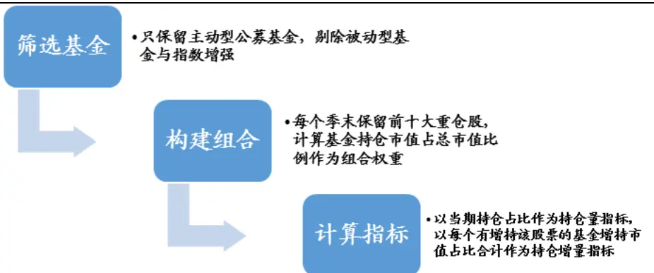
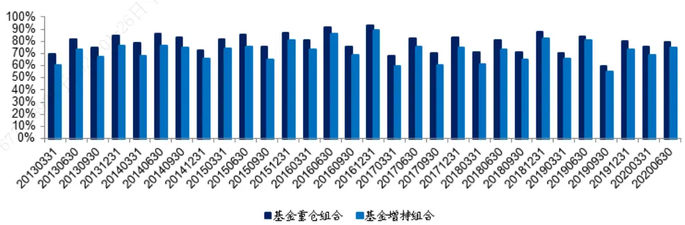
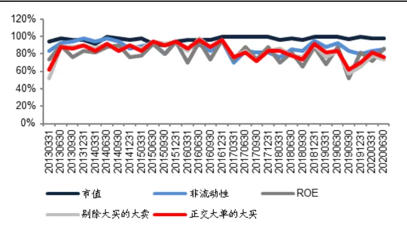
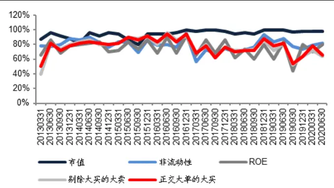
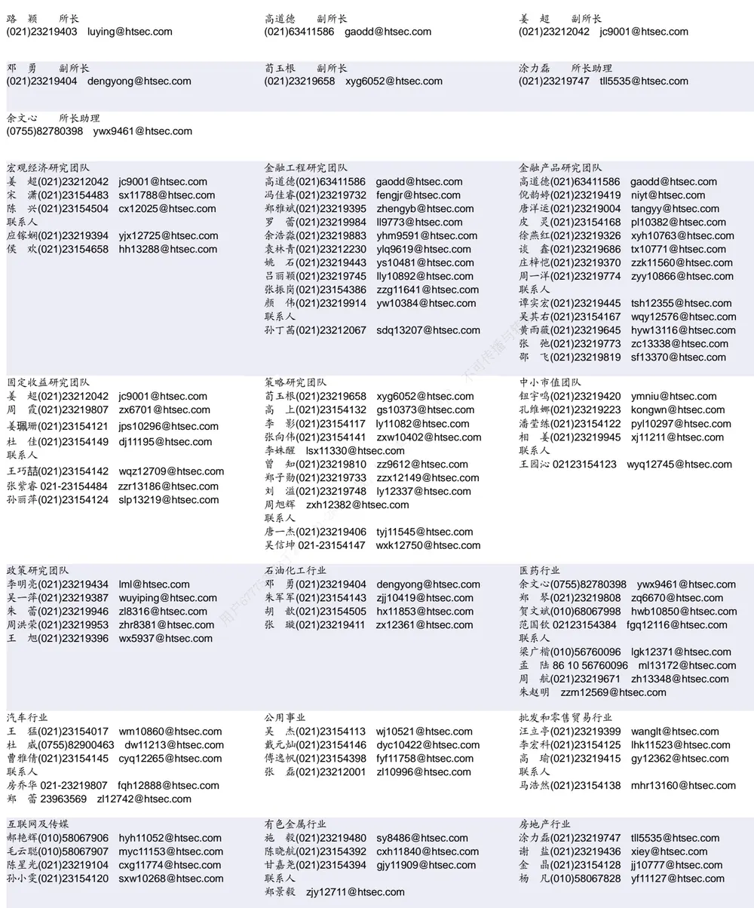

## [Tab相关研究

[Table_ReportInfo]《“芯”火燎原——国泰 CES 半导体芯片

ETF 投资价值分析》2020.12.13

《“芯”火燎原——国泰 CES半导体芯片

ETF 投资价值分析》2020.12.13

《大“智”所趋——首只智能汽车 ETF

投资价值分析》2020.12.06

分析师:冯佳睿

Tel:(021)23219732

Email:fengjr@htsec.com

证书:S0850512080006

分析师:余浩淼

Tel:(021)23219883

Email:yhm9591@htsec.com

证书:S0850516050004

## 选股因子系列研究（七十一）——逐笔大单因子与大资金行为

## [Table_Sum投资要点：

- 异动股票中统计得到的大资金行为与大单因子有较高关联度。通过统计异动股票中所披露的前五大买入营业部成交金额占比情况，我们发现这一成交占比与我们之前构建的大单因子有较高的相关性。观测异动股票买入营业部成交额占比是我们传统的观测大资金行为的方式，因此这种关联性一定程度上证明大单因子具有捕捉大资金行为的能力。

- 交易异动股票往往具有长期负向收益，剔除异动效应后大单因子选股效果明显增强。基于交易异动股票显著的长期负向选股效果，我们尝试通过将过去 个交易日内，发生过交易异动的股票从股票池中剔除。无论是剔除股票还是正交哑变量的方法，在剔除异动效应之后大单因子的选股效果均有显著的提升，选股效果的稳定性也显著增强。

- 基金重仓股票与基金增持股票在基金定期报告披露前有很好的表现。重仓组合在报告期前收益情况显著优于报告期之后，报告期前无论是原始收益还是市值中性传化后的收益，相对于市场均有一定的超额收益，基金增持组合也具有同样的特征。不因此，如果我们可以在报告期前 2个月对于基金持仓量，基金持仓增量进行预测，用，那么该预测指标大概率可以帮助我们找到公募基金更倾向于持有或增持的股票，部从而获取在报告期前不错的股票收益。

利用非流动性，剔除大买的大卖，正交后的大买三个因子对于上期基金重仓组合仅进行增强，可以在基金定期报告期披露前两个月获得显著正向收益。基金持仓往载，往具有很强的延续性，上期重仓的股票大概率会出现在下一期的基金重仓组合以日及基金增持组合当中。基于非流动性，剔除大买的大卖，正交后的大买三个因子-与基金持仓量，基金持仓增量都具有很好地相关性，利用这些因子在上期基金重24仓组合基础上构建增强组合，可以显著提升上期基金重仓组合表现。于

- 风险提示。市场系统性风险、模型误设风险、有效因子变动风险。77

在过往高频因子系列报告中，我们利用逐笔信息构建了一系列基于订单成交量的大单成交占比因子，具体定义如下。

- 大单：即参与成交买卖订单有一方成交额超过全天所有订单成交额均值的成交金额占比。

大买+大卖成交占比：下简称“大买+大卖”，即参与成交买卖订单双方成交额均超过全天所有订单成交额均值的成交金额占比。

剔除大买的大卖：即参与成交买卖订单中，卖单成交额均超过全天所有订单成交额均值，而买单成交金额没有超过全天所有订单成交金额均值的成交金额占比。

- 大买：即参与成交买卖订单中，买单成交额均超过全天所有订单成交额均值的成交金额占比。

- 正交大单的大买：利用上述大买因子对上述大单因子进行线性回归的残差。

这些因子经我们的测试，均有较好选股效果。大单因子的构建初衷是期望用这种方式捕捉大资金交易行为，从而获取相应收益。本篇报告希望考察交易异动股票和基金持仓变动这两种大资金行为，与大单因子之间关系，从而进一步分析大单因子与大资金行为之间的关联，寻找大单因子的有效性来源。

## 1. 交易异动与大单因子

## 1.1交易异动中的大资金行为

根据交易所规定，当股票出现超高换手等异常交易情况时，会被定义为交易异动股票，同时需要披露参与该股票交易的买卖前五大营业部买卖金额情况。当大资金需要买入股票时，有很大概率会通过单一交易席位进行操作，如果此时股票产生交易所规定的交易异动情况，则该股票所披露的前五大买入营业部会有较高的总成交占比，这也是我们通常用以观测股票是否有大资金介入的重要方式。因此，如果我们所构建的大单因子与异动股票前五大席位总成交金额有较高相关性，则可以证明我们所构建的大单因子确实有捕捉大资金交易行为的特点。

统计 2019 年 5月以来异动股票买入金额最大的前五席位总成交金额占比与我们所构建的大单因子当日值的全市场分位数之间相关系数如下表：

表 1 异动股票前五大买入席位金额占比与大单因子分位数相关性（2019.05-2020.10）

|  | 大买+大卖 | 剔除大买的大卖 | 大买 | 正交大单的大买 |
| --- | --- | --- | --- | --- |
| 相关系数均值 | 0.150 | -0.353 | 0.368 | 0.336 |
| 相关系数-T | 7.385 | -25.716 | 26.543 | 25.791 |

资料来源：Wind，海通证券研究所

大单因子与异动股票前五大买入席位金额占比之间确实有显著的相关性，因此我们可以认为我们所构建的大单因子确实可以捕捉到大资金买入行为。

## 1.2交易异动股票表现

在全部异动股票基础上，选取历史所有异动股票中，买入营业部占比在全部异动股票中前 30%分位的股票，以及四个大单因子当日市场分位数大于 30%股票，分别考察他们次日以前收盘价计算的平均收益率及胜率情况，如下表：

表 2 异动股票次日收益统计（2019.05-2020.10）

|  | 收益均值 | 胜率 | 超额收益均值 | 超额收益胜率 |
| --- | --- | --- | --- | --- |
| 全部异动股票 | 0.16% | 49.2% | 0.08% | 45.9% |
| 前五买入营业部高占比 | 1.25% | 58.1% | 1.16% | 55.6% |
| 大买+大卖 | 0.21% | 49.9% | 0.14% | 46.9% |
| 剔除大买的大卖 | 1.19% | 57.3% | 1.12% | 54.2% |
| 大买 | 0.75% | 53.6% | 0.67% | 50.8% |
| 正交大单的大买 | 0.85% | 54.4% | 0.77% | 51.6% |

资料来源： ，海通证券研究所

由上表可见，异动股票存在微弱的正向收益。如果后验的统计出所有异动股票中买入营业部成交占比前 30%分位股票，其平均收益表现会有显著的提升。利用大单因子进行进一步的筛选，同样可以显著提升异动股票的收益表现，尤其是剔除大买的大卖因子，可以得到几乎和后验统计出的高占比组合近似的收益表现。

以上分析表明，利用大单因子进一步筛选异动股票后，可以得到与异动股票所披露大资金买入信息相同的选股效果。

然而，如果统计异动股票的长期表现，我们发现，次日之后，异动股票的收益出现了大幅下滑，具体结果如下图所示。

表 3 异动股票长期收益统计（2019.05-2020.10）

|  | 1日 |  | 1日（开盘计算） |  | 5 日 |  | 10 日 |  | 20 日 |  |
| --- | --- | --- | --- | --- | --- | --- | --- | --- | --- | --- |
|  | 均值 | 胜率 | 均值 | 胜率 | 均值 | 胜率 | 均值 | 胜率 | 均值 | 胜率 |
| 全部异动股票 | 0.08% | 45.9% | -0.18% | 45.6% | -1.75% | 35.2% | -2.60% | 32.8% | -3.08% | 31.9% |
| 前五买入营业部高占比 | 1.16% | 55.6% | -0.80% | 43.0% | -2.99% | 33.0% | -4.15% | 29.1% | -5.02% | 29.6% |
| 大买+大卖 | 0.14% | 46.9% | -0.19% | 46.0% | -1.57% | 36.3% | -2.27% | 34.5% | -2.49% | 33.9% |
| 剔除大买的大卖 | 1.12% | 54.2% | -0.54% | 43.8% | -1.77% | 35.7% | -2.58% | 33.0% | -2.68% | 32.4% |
| 大买 | 0.67% | 50.8% | -0.31% | 45.2% | -1.60% | 36.4% | -2.41% | 33.5% | -2.71% | 33.0% |
| 正交大单的大买 | 0.79% | 51.7% | -0.36% | 44.7% | -1.64% | 36.1% | -2.42% | 33.4% | -2.61% | 33.0% |

资料来源：Wind，海通证券研究所

然而如果以开盘价计算次日收益，异动股票却有明显的负向收益，说明前文异动股票的超额收益主要来自于高开。而利用上文同样方法对股票进行筛选，负向收益情况更为严重，说明高开后回落的概率更大。从更长的时间来看，异动股票具有明显的反转效应，叠加大资金因素之后，这种反转效应也无法得到有效扭转。

## 1.3剔除交易异动效应后的大单因子表现

由于交易异动股票显著的长期负向选股效果，而这部分股票又表现出和大单因子较高的关联性，故我们尝试通过剔除过去 个交易日内发生过交易异动的股票，或者是将大单因子与是否发生交易异动的哑变量正交两种方式，降低交易异动对选股效果的影响，具体结果如下表所示。

表 4 剔除异动股票后的大单因子表现（2019.05-2020.10）

|  |  | 大买+大卖 | 剔除大买的大卖 | 大买 | 正交大单的大买 |
| --- | --- | --- | --- | --- | --- |
| 原始因子 | IC | 0.041 | -0.065 | 0.042 | 0.065 |
|  | IC-IR | 4.224 | -6.157 | 4.630 | 5.955 |
|  | IC 胜率 | 82.4% | 5.9% | 94.1% | 94.1% |
|  | 多空收益 | 1.36% | 2.45% | 1.63% | 2.32% |
|  | 多空胜率 | 76.5% | 94.1% | 88.2% | 94.1% |
| 剔除异动股票 | IC | 0.045 | -0.069 | 0.047 | 0.068 |
|  | IC-IR | 4.835 | -6.351 | 5.383 | 6.084 |
|  | IC 胜率 | 88.2% | 0.0% | 100.0% | 100.0% |
|  | 多空收益 | 1.54% | 2.55% | 1.82% | 2.44% |
|  | 多空胜率 | 82.4% | 100.0% | 94.1% | 94.1% |
| 正交异动股票 | IC | 0.044 | -0.066 | 0.045 | 0.066 |
|  | IC-IR | 4.668 | -6.331 | 5.076 | 6.065 |
|  | IC 胜率 | 88.2% | 0.0% | 100.0% | 94.1% |
|  | 多空收益 | 1.49% | 2.45% | 1.66% | 2.39% |
|  | 多空胜率 | 82.4% | 100.0% | 88.2% | 100.0% |

资料来源：Wind，海通证券研究所

由上表可见，无论是剔除还是正交哑变量的方法，在剔除异动股票的影响后，大单因子的 与多空收益表现均有不同幅度的提升。

通过对于交易异动股票的研究，我们首先验证了构建大单因子的逻辑来源，即，大单因子可以在一定程度上捕捉大资金的交易动向。然而，就异动效应本身而言，由于覆盖 A股的比例并不高，因而利用其负向效应对大单因子表现的提升效果也相对有限。

公募基金建仓行为也是一种大资金交易动向，公募基金建仓过程中， 机构专用 账户大概率参与这些股票的交易过程当中。根据异动股票中大资金行为与大单因子的关联分析，我们有理由相信大单因子与公募基金建仓行为也有一定关联。下一部分我们将进一步研究公募基金重仓股与大单因子之间的关联。

## 2. 基金重仓与大单因子

## 2.1基金重仓股组合构建

由于公募基金只在年报和半年报中披露全部持仓，季报只披露前十大重仓股。考虑到时效性，我们在构建基金重仓股指标时，只考察前十大重仓股的变动情况。

具体指标为前十大重仓股持仓量与持仓增量，即全市场所有主动公募基金所持有的股票市值在报告期末占该股票总市值的比例，以及相比上一个报告期，前十大重仓股中被每个基金增持的市值占比之和。

图1 基金重仓股指标构建示意

资料来源：海通证券研究所

在每个季度基金的前十大重仓股公布后，选取其中基金持仓量与基金持仓增量大于0 的股票，分别构建基金重仓股组合与基金增持组合，并研究它们的特征。

## 2.2基金重仓股组合与增持组合的业绩表现

构建基金重仓组合与基金增持组合之后，我们分别考察该组合中股票的平均收益率在报告期前后 3个交易日，5 个交易日，半个月，1 个月以及报告期前后第二个月中，全市场股票收益分位数情况。以 1季报为例，即组合在 2 月,3月以及 4月，5 月中的收益。为了避免基金持仓的大市值偏向对于股票收益的影响，在考察绝对收益的同时也同时考察其剥离市值影响后的收益率分位数情况。

表 5 基金重仓股组合季报期前后的业绩表现（2013.03-2020.07）

|  | 收益分位数 | 中性化收益分位数 | 分位数差值 |  |  | 胜率 |
| --- | --- | --- | --- | --- | --- | --- |
| 报告期前2月 | 51.47% | 52.48% |  | 3个交易日 | 2.00% | 73.33% |
| 报告期前1月 | 53.33% | 54.15% |  | 5个交易日 | 1.80% | 63.33% |
| 报告期前半月 | 53.90% | 54.06% |  | 收益分 半月 位数 | 3.79% | 83.33% |
| 报告期前5 个交易日 | 53.69% | 53.28% |  | 1月 | 3.34% | 80.00% |
| 报告期前3个交易日 | 53.25% | 52.67% |  | 2月 | 3.10% | 76.67% |
| 报告期后3个交易日 | 50.16% | 50.90% |  | 3个交易日 | 1.55% | 73.33% |
| 报告期后5个交易日 | 50.35% | 50.91% | 中性化 5个交易日 | 2.66% | 86.67% |  |
| 报告期后半月 | 50.11% | 50.76% | 收益分 半月 | 3.30% | 93.33% |  |
| 报告期后1月 | 51.53% | 51.49% | 位数 1月 | 2.38% | 90.00% |  |
| 报告期后2月 | 49.47% | 50.92% | 2月 | 1.78% | 83.33% |  |

资料来源： ，海通证券研究所

由上表左侧收益分位数均值情况可见，基金重仓组合在报告期前的收益率分位数显著大于 50%，并且报告期前表现普遍优于报告期之后。剥离市值影响后这种收益率差异更为显著。上表右侧计算了报告期前后相同时间间隔的收益率分位数差异情况，从胜率角度看，报告期前收益率稳定的优于报告期之后收益表现情况。

下表展示了基金增持组合在季报前后期的业绩表现。

表 6 基金增持组合季报前后的业绩表现（2013.03-2020.07）

|  | 收益分位数 | 中性化收益分位数 |  | 分位数差值 | 胜率 |
| --- | --- | --- | --- | --- | --- |
| 报告期前2月 | 51.87% | 52.91% 54.95% |  | 3个交易日 2.39% | 76.67% |
| 报告期前1月 | 54.07% | 5个交易日 收益分 |  | 2.48% | 63.33% |
| 报告期前半月 | 54.48% | 半月 位数 1月 |  | 4.44% | 83.33% |
| 报告期前5 个交易日 | 54.20% | 53.80% |  | 3.87% | 83.33% |
| 报告期前3个交易日 | 53.66% | 53.05% | 2月 | 3.58% | 76.67% |
| 报告期后3个交易日 | 50.09% 用户677753973子 | 50.95% | 3个交易日 | 1.95% | 76.67% |
| 报告期后5个交易日 | 50.33% | 50.97% | 中性化 5个交易日 | 3.40% | 90.00% |
| 报告期后半月 | 50.04% | 50.73% | 收益分 半月 | 3.95% | 96.67% |
| 报告期后1月 | 51.59% | 51.55% | 位数 1月 | 2.83% | 90.00% |
| 报告期后2月 | 49.48% | 50.96% | 2月 | 2.09% | 83.33% |

资料来源：Wind，海通证券研究所

与重仓组合相同，在报告期前有明显的正向收益，同时报告期前收益表现显著优于报告期之后。比较基金重仓组合与基金增持组合表现，报告期前基金增持的股票收益表现也显著优于基金重仓组合。

如果重仓组合与增持组合在报告期前有显著正向收益，那么前文所构建的用以表示基金重仓股票程度的基金持仓量指标，用以表示基金增持股票幅度的基金持仓增量指标与报告期前后不同时段收益率之间或许也有显著的正相关关系。我们分别计算这两个指标与报告期前后股票收益率之间的相关系数情况，没有持仓数据股票指标值用 0 填充，其结果如下表所示。

表 7 基金持仓量、持仓增量指标与收益的相关性（2013.03-2020.07）

|  |  | 前2月 | 前1月 | 前半月 | 前5日 | 前3日 | 后3日 | 后5日 | 后半月 | 后1月 | 后2月 |
| --- | --- | --- | --- | --- | --- | --- | --- | --- | --- | --- | --- |
|  | 原始收益IC | 0.034 | 0.035 | 0.039 | 0.027 | 0.018 | 0.000 | -0.003 | -0.003 | 0.006 | 0.024 |
| 持仓量 | 原始收益 IC-T | 3.553 | 3.164 | 3.555 | 2.877 | 2.061 | -0.018 | -0.400 | -0.341 | 0.588 | 2.710 |
|  | 市值中性收益IC | 0.032 | 0.032 | 0.034 | 0.025 | 0.018 | -0.004 | -0.005 | -0.006 | 0.007 | 0.021 |
|  | 市值中性收益IC-T | 3.610 | 3.536 | 3.954 | 3.660 | 3.002 | -0.527 | -0.886 | -0.923 | 0.869 | 3.078 |
|  | 原始收益IC | 0.146 | 0.164 | 0.144 | 0.101 | 0.076 | -0.007 | -0.016 | -0.022 | 0.004 | 0.025 |
| 持仓增量 | 原始收益 IC-T | 8.404 | 7.704 | 6.553 | 5.032 | 3.874 | -0.354 | -1.063 | -1.108 | 0.178 | 1.464 |
|  | 市值中性收益IC | 0.135 | 0.157 | 0.135 | 0.096 | 0.075 | -0.011 | -0.017 | -0.027 | 0.000 | 0.015 |
|  | 市值中性收益 IC-T | 9.031 | 8.824 | 7.820 | 6.081 | 4.936 | -0.734 | -1.268 | -1.673 | 0.001 | 1.157 |

资料来源： ，海通证券研究所

由上表可见，持仓量指标与持仓增量指标在报告期前与收益率有显著的正相关性，尤其持仓增量指标，其与报告期前收益率相关性超过 10%。而在报告期之后，短期内呈现一定程度反转效应。报告期后 1个月和后 2个月，相关性虽然逐渐转正，但相比较报告期前依然不够显著。

持仓量和持仓增量指标都具有显著的滞后效应，需要在报告期后一个月才能得到具体数据，因此无法直接利用该指标进行组合构建。然而，我们可以考虑以这两个指标为桥梁，寻找可以预测持仓量指标与持仓增量指标的其它指标，从而获得较大概率被基金持有并会在基金报告期前有较高收益的股票集合。

同时这种与持仓相关指标的高相关性，也可能是我们所找到的指标具有显著选股能力的重要来源。

## 2.3基金持仓量、持仓增量指标与因子相关性

首先考察市值、估值、盈利、成长、换手、波动、反转、流动性等常用选股因子与基金持仓量、持仓增量的相关性。考察重仓组合，增持组合中股票上述因子在基金报告期前两个月末因子值的市场分位数情况，以及上述因子值与持仓量，持仓增量两个指标的线性相关系数。

表 8 基金持仓量、持仓增量指标与常用选股因子相关性（2013.03-2020.07）

|  |  | 均值 | 中位数 | 小于10% | 小于50% | 大于 50% | 大于 90% | 相关系数 | 相关系数-T |
| --- | --- | --- | --- | --- | --- | --- | --- | --- | --- |
|  | 市值 | 62.8% | 68.5% | 4.8% | 30.8% | 69.2% | 18.5% | 0.017 | 1.387 |
|  | 非线性市值 | 48.3% | 47.2% | 13.6% | 52.7% | 47.3% | 13.6% | -0.056 | -14.960 |
|  | 换手 特质波动 | 50.1% | 50.6% | 9.4% | 49.3% | 50.7% | 8.5% | 0.049 | 8.414 |
| 持仓量 |  | 49.7% | 49.5% | 8.9% | 50.5% | 49.5% | 9.1% | -0.031 | -7.669 |
|  | 反转 | 50.9% | 51.1% | 9.7% | 48.9% | 51.1% | 11.3% | 0.016 | 2.119 |
|  | 非流动性 | 53.1% | 53.7% | 6.1% | 45.7% | 54.3% | 11.0% | 0.162 | 22.212 |
|  | ROE | 53.2% | 54.7% | 7.9% | 45.6% | 54.4% | 12.7% | 0.021 | 4.574 |
|  | ROE增速 | 50.7% | 51.5% | 9.3% | 48.5% | 51.5% | 9.9% | 0.018 | 4.776 |
|  | 估值 | 49.4% | 49.3% | 10.6% | 50.7% | 49.3% | 9.6% | 0.011 | 2.106 |
| 持仓增量 | 市值 | 63.8% | 69.9% | 4.5% | 29.4% | 70.6% | 19.5% | 0.222 | 12.489 |
|  | 非线性市值 | 48.4% | 47.3% | 14.0% | 52.5% | 47.5% | 14.1% | -0.007 | -0.948 |
|  | 换手 | 50.3% | 51.0% | 9.2% | 48.9% | 51.1% | 8.4% | 0.097 | 11.317 |
|  | 特质波动 | 49.6% | 49.4% | 8.9% | 50.7% | 49.3% | 9.0% | -0.051 | -7.165 |
|  | 反转 | 51.1% | 51.4% | 9.7% | 48.6% | 51.4% | 11.6% | 0.080 | 6.634 |
|  | 非流动性 | 53.3% | 54.0% | 5.9% | 45.3% | 54.7% | 11.0% | 0.196 | 21.256 |
|  | ROE | 53.5% | 55.2% | 7.9% | 45.1% | 54.9% | 13.0% | 0.069 | 10.008 |
|  | ROE增速 | 50.6% | 51.3% | 9.3% | 48.7% | 51.3% | 9.9% | 0.001 | 0.175 |
|  | 估值 | 49.6% | 49.5% | 10.6% | 50.5% | 49.5% | 9.9% | 0.104 | 10.325 |

资料来源：Wind，海通证券研究所

结合组合中因子全市场分位数和相关系数两个维度来看，市值、流动性与 ROE三个指标与持仓量、持仓增量有较高的相关性。这一特征也与传统认知中，机构投资者倾向于持有大市值、高盈利和高流动性股票的逻辑相契合。

用同样的方式考察高频因子，可以发现，刻画大资金流入、流出效应的高频因子与基金持仓量、持仓增量指标之间也有较高的相关性，尤其是与持仓增量指标相关性更为显著。持仓增量代表公募基金买入股票的意愿，这种高相关性也从一个侧面证明，大单因子的有效性部分来自机构投资者的买入或增持行为。

表 9 基金持仓量、持仓增量指标与高频因子相关性（2013.03-2020.07）

|  |  | 均值 | 中位数 | 小于10% | 小于 50% | 大于 50% | 大于 90% | 相关系数 | 相关系数-T |
| --- | --- | --- | --- | --- | --- | --- | --- | --- | --- |
|  | 剔除大买的大卖 | 47.2% | 45.5% | 11.8% | 54.4% | 45.6% | 9.0% | -0.029 | -4.399 |
| 持仓量 | 大买 | 51.9% | 52.9% | 9.4% | 47.2% | 52.8% | 11.6% | -0.007 | -1.399 |
|  | 正交大单的大买 | 53.0% | 54.7% | 9.1% | 45.3% | 54.7% | 11.9% | 0.034 | 5.749 |
| 持仓增量 | 剔除大买的大卖 | 46.7% | 44.8% | 12.0% | 55.1% | 44.9% | 8.8% | -0.103 | -10.683 |
|  | 大买 | 52.2% | 53.3% | 9.2% | 46.8% | 53.2% | 11.8% | 0.038 | 3.854 |
|  | 正交大单的大买 | 53.5% | 55.5% | 8.8% | 44.6% | 55.4% | 12.2% | 0.111 | 14.297 |

资料来源：Wind，海通证券研究所

## 2.4基于持仓量预测因子的基金上期重仓增强组合

基金重仓股预测是投资者目前较为关注的热点话题。简单分析来看，基金重仓股具有非常良好的延续性，即上期重仓股票有很大概率依然是下期的重仓股。

如下图所示，平均来看，上期基金重仓组合中的股票依然出现在下期重仓组合中的比例高达78.9%，而上期重仓组合中的股票出现在下期增持组合中的概率也高达71.6%，说明基金重仓股的确具有良好的延续性。

图2 上期基金重仓组合股票在下期基金重仓组合、基金增持组合中的占比（2013.03-2020.07）

资料来源：Wind，海通证券研究所

我们尝试利用市值、非流动性、 ROE 、剔除大买的大卖、正交大单的大买五个因子，在上期基金重仓组合成分中，选取各自因子值最大的 50 个股票，在下期报告期前两个月末构建等权组合，考察这五个组合成分股在下期基金重仓组合、基金增持组合中的出现比例如下图所示。

图3 增强组合占下期重仓组合占比（2013.03-2020.07）

资料来源：Wind，海通证券研究所

图4 增强组合占下期增持组合占比（2013.03-2020.07）

资料来源：Wind，海通证券研究所

如上图，所构建 5 个组合成分中，在下期基金重仓组合出现的比例均值最高达97.2%，最低达 82.8%，均高于上期重仓组合的重合比例 78.9%。5 个组合成分中在下期基金增持组合出现的比例最高达 94.6%，最低达 74.9%，也均高于上期重仓组合的重合比例 71.6%。因此，我们认为，在原来重仓股的基础上，叠加上述因子可提升基金持仓预测能力。

继续考察在上期基金重仓组合成分中，各个因子与股票下期基金持仓量以及基金持仓增量指标之间相关性，结果如下表所示。

表 10 基于上期重仓组合的因子与基金持仓量、基金持仓增量指标的相关性（2013.03-2020.07）

|  | 市值 | 非流动性 | ROE | 剔除大买的大卖 | 正交大单的大买 |
| --- | --- | --- | --- | --- | --- |
| 持仓量相关系数 | -0.134 | 0.197 | -0.012 | -0.011 | 0.012 |
| 持仓量相关系数-T | -25.643 | 36.464 | -3.527 | -2.514 | 2.933 |
| 持仓增量相关系数 | 0.120 | 0.235 | 0.049 | -0.095 | 0.101 |
| 持仓增量相关系数-T | 9.543 | 34.089 | 8.365 | -14.419 | 17.360 |

资料来源：Wind，海通证券研究所

非流动性和两个大单因子与下期的持仓量、持仓增量指标均有非常显著的相关性，尤其与持仓增量指标相关性很高。基于上文中持仓增量指标与股票收益的高相关性，可以预计这三个指标在上期基金重仓组合基础上进一步筛选可以有效提升组合收益情况。

市值与 ROE因子与下期的持仓量、持仓增量的相关性出现反转。尤其是市值因子，反转尤为明显。这种相关性差异表示在上期基金重仓股股票池中，下期基金重仓股的持股比例较高的股票往往是股票池中市值偏小，偏成长型的股票，而下期基金增持比例较高的股票往往是市值偏大，偏价值型的股票。由于持仓量与持仓增量指标均与股票收益有正相关性，因此预计市值因子与 因子对于上期基金重仓组合表现提升效果并不乐观。

我们选取前文所述预期增强效果最好的非流动性，分别叠加剔除大买的大卖、正交大单的大买因子，在报告期前两个月的月末，构建以上期基金重仓组合为股票池的基于两因子双分组增强组合（先用非流动性因子选择 100 个股票，再用大单因子选择 50 个股票）。设定交易成本为千分之三，考察这些组合表现情况，如下表：

表 11 基于上期基金重仓组合的增强组合报告期前两个月收益（2013.03-2020.07）

|  |  | 上期持仓 | 市值 | 非流动性 | ROE | 剔除大买的大卖 | 正交大单的大买 | 非流+剔除 | 非流+大买 |
| --- | --- | --- | --- | --- | --- | --- | --- | --- | --- |
| 绝对 收益 | 收益均值 | 1.90% | 0.94% | 3.02% | 1.17% | 2.34% | 2.39% | 3.55% | 3.54% |
|  | 胜率 | 56.7% | 55.0% | 63.3% | 45.0% | 60.0% | 60.0% | 70.0% | 70.0% |
|  | 正向均值 | 6.95% | 4.94% | 8.32% | 7.65% | 6.93% | 6.88% | 8.04% | 8.00% |
|  | 负向均值 | -4.72% | -3.94% | -6.13% | -4.13% | -4.55% | -4.36% | -6.94% | -6.88% |
| 相对 | 收益均值 | 0.99% | 0.04% | 2.12% | 0.27% | 1.44% | 1.48% | 2.64% | 2.63% |
| 300 | 胜率 | 66.7% | 51.7% | 68.3% | 60.0% | 61.7% | 60.0% | 73.3% | 75.0% |
|  | 正向均值 | 3.55% | 1.56% | 5.91% | 3.26% | 4.49% | 4.70% | 6.07% | 5.94% |
|  | 负向均值 | -4.12% | -1.58% | -6.04% | -4.22% | -3.48% | -3.34% | -6.79% | -7.28% |
| 相对 500 | 收益均值 | 0.43% | -0.52% | 1.56% | -0.29% | 0.88% | 0.92% | 2.08% | 2.07% |
|  | 胜率 | 55.0% | 45.0% | 65.0% | 40.0% | 53.3% | 60.0% | 71.7% | 71.7% |
|  | 正向均值 | 1.42% | 3.05% | 4.02% | 2.13% | 2.81% | 2.67% | 4.18% | 4.18% |
|  | 负向均值 | -0.77% | -3.44% | -3.01% | -1.91% | -1.33% | -1.70% | -3.23% | -3.26% |
| 相对 中证 全指 | 收益均值 | 0.61% | -0.34% | 1.74% | -0.11% | 1.06% | 1.10% | 2.26% | 2.25% |
|  | 胜率 | 68.3% | 45.0% | 68.3% | 48.3% | 65.0% | 61.7% | 73.3% | 73.3% |
|  | 正向均值 | 1.83% | 2.21% | 4.46% | 2.33% | 2.78% | 3.02% | 4.74% | 4.75% |
|  | 负向均值 | -2.02% | -2.42% | -4.12% | -2.39% | -2.15% | -1.99% | -4.56% | -4.62% |
|  | 收益均值 |  | -1.25% | 0.83% | -1.02% | 0.15% | 0.19% | 1.34% | 1.33% |
| 相对 上期 持仓 | 胜率 |  | 40.0% | 65.0% | 31.7% | 41.7% | 48.3% | 66.7% | 65.0% |
|  | 正向均值 |  | 3.29% | 2.79% | 1.47% | 2.24% | 2.11% | 3.26% | 3.35% |
|  | 负向均值 |  | -4.28% | -2.81% | -2.18% | -1.35% | -1.61% | -2.50% | -2.42% |

资料来源：Wind，海通证券研究所

与预期相同，利用非流动性，剔除大买的大卖以及正交大单的大买三个因子对基金重仓组合进行增强，可以显著提升上期基金重仓组合月均收益，月胜率也有一定提升。将非流动因子与两个大单因子叠加所构建组合收益率进一步提升，由于两个大单因子本身具有高相关性，因此两个叠加组合表现较为相近。而对于市值因子与 ROE因子而言，同样方法所构建的组合对于基础组合表现却有明显削弱。

分别考察非流动性，剔除大买的大卖，正交大单的大买以及两个复合因子组合在报告期前 1月和前 2月的收益情况，前 1 月如下表：

表 12 基于上期基金重仓组合的增强组合报告期前 1月收益（2013.03-2020.07）

|  |  | 上期持仓 | 非流动性 | 剔除大买的大卖 | 正交大单的大买 | 非流+剔除 | 非流+大买 |
| --- | --- | --- | --- | --- | --- | --- | --- |
| 绝对收益 | 收益均值 | 1.27% | 2.12% | 1.79% | 1.96% | 2.89% | 2.91% |
|  | 胜率 | 50.00% |  | 53.33% | 56.67% | 66.67% | 66.67% |
|  | 正向均值 | 7.26% | 8.44% | 6.85% | 6.56% | 7.83% | 7.82% |
|  | 负向均值 | -4.72% | -6.15% | -3.99% | -4.05% | -6.99% | -6.89% |
| 相对 300 | 收益均值 | 0.34% 677753 | 1.18% | 0.86% | 1.03% | 1.96% | 1.98% |
|  | 胜率 | 70.00% | 70.00% | 66.67% | 63.33% | 76.67% | 80.00% |
|  | 正向均值 | 2.79% | 5.06% | 4.02% | 4.54% | 5.50% | 5.35% |
|  | 负向均值 | -5.38% | -7.87% | -5.47% | -5.04% | -9.68% | -11.48% |
| 相对 500 | 收益均值 | 0.41% | 1.26% | 0.93% | 1.10% | 2.03% | 2.06% |
|  | 胜率 | 53.33% | 66.67% | 53.33% | 56.67% | 76.67% | 76.67% |
|  | 正向均值 | 1.53% | 3.69% | 2.99% | 3.18% | 4.10% | 4.15% |
|  | 负向均值 | -0.86% | -3.60% | -1.43% | -1.62% | -4.76% | -4.84% |
| 相对中证全指 | 收益均值 | 0.25% | 1.10% | 0.77% | 0.94% | 1.87% | 1.90% |
|  | 胜率 | 70.00% | 73.33% | 63.33% | 60.00% | 76.67% | 76.67% |
|  | 正向均值 | 1.43% | 3.62% | 2.83% | 3.35% | 4.41% | 4.49% |
|  | 负向均值 | -2.49% | -5.83% | -2.78% |  |  |  |
| 相对上期持仓 | 收益均值 |  | 0.55% |  | -2.67% | -6.49% | -6.63% |
|  | 胜率 |  | 70.00% | 0.22% 43.33% | 0.39% 50.00% | 1.32% 73.33% | 1.34% 70.00% |
|  | 正向均值 |  | 2.37% | 2.24% | 2.29% | 3.16% | 3.40% |
|  | 负向均值 |  | -3.72% | -1.33% | -1.52% | -3.74% | -3.46% |

资料来源：Wind，海通证券研究所

表 13 基于上期基金重仓组合的增强组合报告期前 2月收益（2013.03-2020.07）

|  |  | 上期持仓 | 非流动性 | 剔除大买的大卖 | 正交大单的大买 | 非流+剔除 | 非流+大买 |
| --- | --- | --- | --- | --- | --- | --- | --- |
| 绝对收益 | 收益均值 | 2.52% | 3.92% | 2.87% | 2.84% | 4.24% | 4.23% |
|  | 胜率 | 63.33% | 70.00% | 66.67% | 66.67% | 73.33% | 73.33% |
|  | 正向均值 | 6.71% | 8.19% | 6.97% | 6.89% | 8.25% | 8.26% |
|  | 负向均值 | -4.73% | -6.05% | -5.32% | -5.27% | -6.81% | -6.87% |
| 相对 300 | 收益均值 | 1.64% | 3.05% | 2.00% | 1.96% | 3.36% | 3.35% |
|  | 胜率 | 66.67% | 66.67% | 60.00% | 53.33% | 70.00% | 70.00% |
|  | 正向均值 | 4.17% | 6.78% | 4.75% | 5.34% | 6.73% | 6.69% |
|  | 负向均值 | -3.41% | -4.42% | -2.13% | -1.89% | -4.49% | -4.43% |
| 相对 500 | 收益均值 | 0.45% | 1.85% | 0.80% | 0.77% | 2.17% | 2.16% |
|  | 胜率 | 56.67% | 63.33% | 50.00% | 60.00% | 66.67% | 66.67% |
|  | 正向均值 | 1.32% | 4.35% | 2.79% | 2.38% | 4.31% | 4.28% |
|  | 负向均值 | -0.69% | -2.47% | -1.18% | -1.64% | -2.13% | -2.09% |
| 相对中证全指 | 收益均值 | 0.97% | 2.37% | 1.32% | 1.29% | 2.69% | 2.68% |
|  | 胜率 | 66.67% | 63.33% | 63.33% | 60.00% | 70.00% | 70.00% |
|  | 正向均值 | 2.26% | 5.40% | 2.84% | 2.99% | 5.13% | 5.12% |
|  | 负向均值 | -1.61% | -2.85% | -1.30% | -1.26% | -3.01% | -3.01% |
| 相对上期持仓 | 收益均值 |  | 1.10% | 0.05% | 0.02% | 1.42% | 1.41% |
|  | 胜率 |  | 60.00% | 43.33% | 50.00% | 60.00% | 60.00% |
|  | 正向均值 |  | 3.24% | 2.02% | 1.85% 不可 | 3.45% | 3.40% |
|  | 负向均值 |  | -2.10% | -1.45% | -1.81% | -1.63% | -1.58% |

资料来源：Wind，海通证券研究所

比较上个时间段的收益情况，就绝对收益与相对主要指数的超额收益而言，无论上期重仓组合还是增强组合，报告期前 月表现都显著优于报告期前 月表现。这里的报告期前 2月组合表现即上一报告期重仓组合报告期后 2月表现，而这里的报告期前 1 月组合表现即上一报告期重仓组合报告期后 3月组合表现。从上文对于报告期前后重仓组合表现分析来看，随着时间向后推移，重仓组合收益的确有逐次衰减的现象，利用因子增强后则可以很大程度克服这种收益衰减幅度。

纵向比较不同因子叠加方式在两个时间段内表现，非流动性因子在报告期前 2月对于重仓组合收益提升效果要好于报告期前 1月，而两个大单因子正好相反，在报告期前1 月表现则会好于报告期前 2 月表现。这种不同时段的差异化表现也是的非流动性因子与两个大单因子的复合增强组合无论在任何时段内都有很稳定的增强表现。

非流动性，剔除大买的大卖与正交大单的大买在基于基金持仓构建组合时，展现出了报告期与非报告期的因子表现会有显著的差异，而如果考虑全市场范围内不同期间的因子表现差异，如下表：

表 14 三因子选股效果在不同时段表现差异（2013.01-2020.07）

| 非流动性 |  |  | 剔除大买的大卖 | 正交大单的大买 |
| --- | --- | --- | --- | --- |
| 报告期月 | IC | 0.028 | -0.068 | 0.068 |
|  | IC-T | 1.616 | -8.581 | 8.736 |
| 非报告期月 | IC | 0.034 | -0.055 | 0.055 |
|  | IC-T | 2.777 | -9.834 | 10.011 |

资料来源： ，海通证券研究所

与基于基金持仓的表现相同，在全市场范围内非流动性因子以及两个大单因子的因子表现也有类似的差异。非流动性因子在非报告期选股效果更优，而大单因子在报告期会有更好的选股效果。这种现象除了在以上三个因子中存在，在 ROE，ROE增速，以及市值等传统因子中也会有所展现，如下表：

表 15 常用因子选股效果在不同时段表现差异（2013.01-2020.07）

|  |  | 市值 | 非线性市值 | 估值 | 非流动性 | 反转 | 换手 | 波动 | ROE | ROE增速 |
| --- | --- | --- | --- | --- | --- | --- | --- | --- | --- | --- |
| 报告期月 | IC | 0.013 | 0.019 | -0.015 | 0.028 | -0.038 | -0.099 | 0.033 | 0.031 | 0.026 |
|  | IC-T | 0.524 | 2.375 | -1.333 | 1.616 | -2.359 | -4.920 | 3.463 | 2.959 | 4.254 |
| 非报告期月 | IC | -0.027 | 0.023 | -0.009 | 0.034 | -0.025 | -0.061 | 0.038 | 0.009 | 0.015 |
|  | IC-T | -1.503 | 4.196 | -1.254 | 2.777 | -2.256 | -4.328 | 5.111 | 1.277 | 3.345 |

资料来源：Wind，海通证券研究所

在传统选股因子中，反转，换手， 与 增速因子会在报告期月有较好表现，市值因子在报告期月与非报告期月因子表现甚至彻底相反。公募基金持仓报告期同时也是各个公司财务报告期，除公募基金建仓影响外，财务数据逐步成形，公司业绩目标逐步对兑现或许也是影响到因子表现的重要因素，甚至可以猜测公司基本面信息的逐步确认正式公募基金市场行为的重要原因。未来也会考虑从这一角度更细致的对于市场现象进行研究。

## 3. 总结

基于逐笔成交信息构建的大单因子初衷是期望可以用这种方式刻画市场中的大资金动向，结合因子与有“机构专用”账户参与的交易异动股票，以及基金持仓，增仓股票相关性的研究，可以从另一个侧面验证因子对于大资金动向刻画的能力。转

因子有效性往往既要有统计检验的数量方法支持，也需要从因子构建逻辑出发，观传察因子表现是否与其构建逻辑相印证。利用市场中其它相同逻辑的现象与因子进行相互不验证，是保证因子表现稳定性的重要方式。用，

如果股票被公募基金重仓并且在上一个基金报告期被公募基金所增持，那么该股票大概率会有显著的超额收益，这一结论在海外研究中被广泛使用，也在上文中做了简单本的 股市场实证。用以刻画基金重仓比例的基金持仓量比与基金增持量两个指标虽然与仅股票收益有高相关性，但受限于公募基金信息披露规则，并不能在第一时间获取。然而载，我们可以考虑以这两个指标为媒介，寻找可以预测这两个指标的其它因子，将预测被基日金重仓或者被基金增持的概率作为因子值进行组合构建，或许是一种寻找有效选股因子1-的新思路。24

## 4. 风险提示5397

市场系统性风险、模型误设风险、有效因子变动风险。

# 信息披露

分析师声明

[Table冯佳睿yst金融工程研究团队s]

余浩淼金融工程研究团队

本人具有中国证券业协会授予的证券投资咨询执业资格，以勤勉的职业态度，独立、客观地出具本报告。本报告所采用的数据和信息均来自市场公开信息，本人不保证该等信息的准确性或完整性。分析逻辑基于作者的职业理解，清晰准确地反映了作者的研究观点，结论不受任何第三方的授意或影响，特此声明。

## 法律声明

本报告仅供海通证券股份有限公司（以下简称 本公司 ）的客户使用。本公司不会因接收人收到本报告而视其为客户。在任何情况下，本报告中的信息或所表述的意见并不构成对任何人的投资建议。在任何情况下，本公司不对任何人因使用本报告中的任何内容所引致的任何损失负任何责任。载

本报告所载的资料、意见及推测仅反映本公司于发布本报告当日的判断，本报告所指的证券或投资标的的价格、价值及投资收入可能会波动。在不同时期，本公司可发出与本报告所载资料、意见及推测不一致的报告。传播

市场有风险，投资需谨慎。本报告所载的信息、材料及结论只提供特定客户作参考，不构成投资建议，也没有考虑到个别客户特殊的不投资目标、财务状况或需要。客户应考虑本报告中的任何意见或建议是否符合其特定状况。在法律许可的情况下，海通证券及其所属用关联机构可能会持有报告中提到的公司所发行的证券并进行交易，还可能为这些公司提供投资银行服务或其他服务。部

本报告仅向特定客户传送，未经海通证券研究所书面授权，本研究报告的任何部分均不得以任何方式制作任何形式的拷见、复印件或复制品，或再次分发给任何其他人，或以任何侵犯本公司版权的其他方式使用。所有本报告中使用的商标、服务标记及标记均为本公司的商标、服务标记及标记。如欲引用或转载本文内容，务必联络海通证券研究所并获得许可，并需注明出处为海通证券研究所，且，不得对本文进行有悖原意的引用和删改。

根据中国证监会核发的经营证券业务许可，海通证券股份有限公司的经营范围包括证券投资咨询业务。1-

## 海通证券股份有限公司研究所[Table_PeopleInfo]

| 家电行业 |  | 造纸轻工行业 |
| --- | --- | --- |
| 陈子仪(021)23219244 | chenzy@htsec.com | 赵洋(021)23154126 zy10340@htsec.com |
| 李 阳(021)23154382 | ly11194@htsec.com | 联系人 |
| 朱默辰(021)23154383 | zmc11316@htsec.com |  |
| 刘 璐(021)23214390 | II11838@htsec.com |  |

| 电子行业 |  | 煤炭行业 |  |  | 电力设备及新能源行业 |  |
| --- | --- | --- | --- | --- | --- | --- |
|  | 尹 苓(021)23154119 yl11569@htsec.com |  | 李 淼(010)58067998 Im10779@htsec.com |  | 张一弛(021)23219402 | zyc9637@htsec.com |
|  | 蒋 俊(021)23154170 jj11200@htsec.com |  | 戴元灿(021)23154146 | dyc10422@htsec.com | 房 青(021)23219692 | fangq@htsec.com |
|  | 周旭辉 zxh12382@htsec.com |  | 吴 杰(021)23154113 | wj10521@htsec.com | 曾 彪(021)23154148 | zb10242@htsec.com |
| 联系人 |  |  | 王 涛(021)23219760 | wt12363@htsec.com | 徐柏乔(021)23219171 | xbq6583@htsec.com |

| 基础化工行业 |  | 计算机行业 |  | 通信行业 |  |
| --- | --- | --- | --- | --- | --- |
|  | 刘 威(0755)82764281 Iw10053@htsec.com | 郑宏达(021)23219392 zhd10834@htsec.com |  | 朱劲松(010)50949926 | zjs10213@htsec.com ywm11574@htsec.com |
| 刘海荣(021)23154130 张翠翠(021)23214397 | Ihr10342@htsec.com zcc11726@htsec.com | 杨 林(021)23154174 yl11036@htsec.com 于成龙 ycl12224@htsec.com |  | 余伟民(010)50949926 张峥青(021)23219383 | zzq11650@htsec.com |
| 孙维容(021)23219431 | swr12178@htsec.com | 黄竞晶(021)23154131 hjj10361@htsec.com |  | 联系人 |  |
| 李 智(021)23219392 | Iz11785@htsec.com |  | 洪 琳(021)23154137 hl11570@htsec.com | 杨彤昕 010-56760095 ytx12741@htsec.com |  |
|  |  | 联系人 | 杨 蒙(0755)23617756 ym13254@htsec.com |  |  |

| 非银行金融行业 |  | 交通运输行业 |  |  | 纺织服装行业 |  |
| --- | --- | --- | --- | --- | --- | --- |
|  | 孙 婷(010)50949926 st9998@htsec.com |  | 虞 楠(021)23219382 yun@htsec.com |  |  | 梁 希(021)23219407 lx11040@htsec.com |
|  | 何 婷(021)23219634 ht10515@htsec.com |  | 罗月江（010）56760091 lyj12399@htsec.com |  |  | 盛 开(021)23154510 sk11787@htsec.com |
|  | 李芳洲(021)23154127 Ifz11585@htsec.com |  | 李 轩(021)23154652 lx12671@htsec.com |  |  |  |
| 联系人 |  |  |  | 陈 宇(021)23219442 cy13115@htsec.com |  |  |
| 任广博(010)56760090 rgb12695@htsec.com |  |  |  |  |  |  |

| 建筑建材行业 | 机械行业 |  | 钢铁行业 |
| --- | --- | --- | --- |
| 冯晨阳(021)23212081 fcy10886@htsec.com | 余炜超(021)23219816 swc11480@htsec.com |  | 刘彦奇(021)23219391 liuyq@htsec.com |
| 潘莹练(021)23154122 pyl10297@htsec.com | 周 丹 zd12213@htsec.com |  | 周慧琳(021)23154399 zhl11756@htsec.com |
| 申 浩(021)23154114 sh12219@htsec.com |  | 吉 晟(021)23154653 js12801@htsec.com | 番与转载 |
| 杜市伟(0755)82945368 dsw11227@htsec.com 颜慧菁 yhj12866@htsec.com |  | 赵玥炜(021)23219814 zyw13208@htsec.com |  |

| 建筑工程行业 | 农林牧渔行业 |  | 食品饮料行业 |
| --- | --- | --- | --- |
| 张欣劫 zxj12156@htsec.com |  | 丁 频(021)23219405 dingpin@htsec.com | 闻宏伟(010)58067941 whw9587@htsec.com |
| 李富华(021)23154134 Ifh12225@htsec.com | 陈 阳(021)23212041 cy10867@htsec.com |  | 颜慧菁 yhj12866@htsec.com |
| 杜市伟(0755)82945368 dsw11227@htsec.com | 联系人 |  | 张宇轩(021)23154172 zyx11631@htsec.com |
|  |  | 孟亚琦(021)23154396 myq12354@htsec.com | 程碧升(021)23154171 cbs10969@htsec.com |

| 军工行业 | 银行行业 | 社会服务行业 |  |
| --- | --- | --- | --- |
| 张恒晅 zhx10170@htsec.com |  | 孙 婷(010)50949926 st9998@htsec.com | 汪立亭(021)23219399 wanglt@htsec.com |
| 张高艳 0755-82900489 zgy13106@htsec.com |  | 解巍巍 xww12276@htsec.com 林加力(021)23154395 ljl12245@htsec.com | 许樱之(755)82900465 xyz11630@htsec.com 联系人 |
| 联系人 刘砚菲021-2321-4129 lyf13079@htsec.com | 联系人 | 董栋梁(021) 23219356 ddl13026@htsec.com | 毛弘毅(021)23219583 mhy13205@htsec.com |

## 研究所销售团队

深广地区销售团队

蔡铁清(0755)82775962 ctq5979@htsec.com

伏财勇(0755)23607963 fcy7498@htsec.com

辜丽娟(0755)83253022 gulj@htsec.com

刘晶晶(0755)83255933 liujj4900@htsec.com

饶 伟(0755)82775282 rw10588@htsec.com

欧阳梦楚(0755)23617160

oymc11039@htsec.com

巩柏含 gbh11537@htsec.com

滕雪竹 txz13189@htsec.com

上海地区销售团队
胡雪梅(021)23219385 huxm@htsec.com
朱 健(021)23219592 zhuj@htsec.com
季唯佳(021)23219384 jiwj@htsec.com
黄 毓(021)23219410 huangyu@htsec.com
漆冠男(021)23219281 qgn10768@htsec.com
胡宇欣(021)23154192 hyx10493@htsec.com
黄 诚(021)23219397 hc10482@htsec.com
毛文英(021)23219373 mwy10474@htsec.com
马晓男 mxn11376@htsec.com
杨祎昕(021)23212268 yyx10310@htsec.com
张思宇 zsy11797@htsec.com
王朝领 wcl11854@htsec.com
邵亚杰 23214650 syj12493@htsec.com
李 寅 021-23219691 ly12488@htsec.com
董晓梅 dxm10457@htsec.com北京地区销售团队
殷怡琦(010)58067988 yyq9989@htsec.com郭 楠 010-5806 7936 gn12384@htsec.com张丽萱(010)58067931 zlx11191@htsec.com杨羽莎(010)58067977 yys10962@htsec.com郭金垚(010)58067851 gjy12727@htsec.com张钧博 zjb13446@htsec.com

海通证券股份有限公司研究所

地址：上海市黄浦区广东路 689号海通证券大厦 9楼

电话：（021）23219000

传真：（021）23219392

网址：www.htsec.com