## [Tab相关研究

Table_ReportInfo]《选股因子系列研究（五十六）——买卖单数据中的 Alpha》2019.11.17

《选股因子系列研究（六十六）——寻找

逐笔交易中的有效信息》2020.06.21

《选股因子系列研究（七十一）——逐笔大单因子与大资金行为》2020.12.17

分析师:冯佳睿

Tel:(021)23219732

Email:fengjr@htsec.com

证书:S0850512080006

分析师:袁林青

Tel:(021)23212230

Email:ylq9619@htsec.com

证书:S0850516050003

# 选股因子系列研究（七十二）——大单的精细化处理与大单因子重构

## 投资要点：

在系列专题报告《选股因子系列研究（五十六）——买卖单数据中的 Alpha》中，我们基于逐笔成交数据的买卖单号还原得到了买卖单数据，并构建了大单因子。回测结果表明，大单因子具有较为显著的月度选股能力。随着研究的深入与细化，我们认为大单因子依旧存在改进提升的空间。本文尝试对于大单的界定方法进行调整与改善，通过设定更具有逻辑性的大单筛选阈值来提升大单因子的选股能力。

- 大单界定方法存在改进空间。系列前期报告基于逐笔成交数据中的叫买与叫卖单号将逐笔数据还原为买卖单数据，并基于每个股票的买卖单分布界定大单。考虑到股票买卖单分布存在极为明显的偏度，大单的界定依旧存在改进空间。

改进后的大单净买入因子在正交前后皆具有显著月度选股能力。大单净买入因子在正交后呈现出了极为显著的月度选股能力。相比而言，大单净买入相关的因子具有更好的选股能力。因子的月均 在 之间，年化 普遍超过 ，月度胜率高于 80%，部分因子的月度胜率高于 90%。

- 大单因子原始因子与股票前一个月涨幅正相关。大单净买入因子与股票前一个月涨幅具有较强的相关性，也即，大单净买入占比或者强度较高的股票往往在前一个月具有相对较高的涨幅。此外，正交后的开盘后大单净买入占比以及开盘后大单净买入强度的 IC 序列与盈利因子的收益序列呈现出了较为明显的相关性。

- 大单因子在不同选股空间中皆具有显著月度选股能力。大单净买入因子在各指数范围内皆呈现出了较为显著的月度选股能力。与常规技术因子不同的是，开盘后大单净买入占比以及开盘后大单净买入强度因子在沪深300指数内依旧呈现出了极强的选股能力，部分因子的月均 IC高于其在全市场下的月均 IC。

- 标准差阈值在 0~1 之间时，大单因子选股能力较为稳健。大单净买入因子对于标准差阈值具有一定的敏感性，但是标准差阈值在 0~1 之间变动时，因子选股能力较为显著且稳定性相对较强。

可尝试叠加绝对金额阈值，但是绝对金额阈值并非必须。考虑到通过单成交分布得到的大单筛选阈值完全取决于股票自身的成交情况，因此该种方法在面对成交单面额较小的股票时，界定得到的大单阈值并不能真正筛选出大单。因此可考虑在单成交分布大单阈值的基础之上增加绝对金额阈值。绝对金额阈值在标准差阈值较低时能够改善大单因子的选股能力。

实际组合构建中大单因子的引入对于沪深 选股组合的改进更加明显。可将大单因子引入沪深 300 指数增强组合以及中证 500 指数增强组合。大单因子的引入对于沪深 300 指数增强组合的改进提升效果更加明显。

- 风险提示。市场系统性风险、资产流动性风险以及政策变动风险会对策略表现产生较大影响。

在系列专题报告《选股因子系列研究（五十六）——买卖单数据中的 Alpha》中，我们基于逐笔成交数据中的买卖单号还原得到了买卖单数据，并构建了大单因子。回测结果表明，大单因子具有较为显著的月度选股能力。随着研究的深入与细化，我们认为大单因子依旧存在改进提升的空间。本文尝试对于大单的界定进行调整与改进，并希望得到兼具逻辑性与选股能力的大单因子。

本文共分为六个部分。第一部分阐述了大单界定方法的改进思路，第二部分展示了大单因子的选股能力，第三部分讨论了大单筛选阈值对因子选股能力的影响，第四部分展示了大单因子对于组合的影响，第五部分总结了全文，第六部分提示了风险。

## 1. 大单因子的改进

在系列报告《选股因子系列研究（五十六）——买卖单数据中的 Alpha》中，我们讨论了大单因子的构建。该报告基于逐笔成交数据中的叫买与叫卖单号将逐笔成交数据还原为买卖单数据，并根据每个股票的买卖单分布单独界定大单。在计算各股票大单阈值的时候，报告使用了“ 倍标准差”的模式。相比使用绝对阈值界定大单，该种方法具有更强的逻辑性。然而随着研究的深入，我们发现该种界定方法依旧存在有待改进之处。

简单来说，股票买卖单分布存在极为明显的偏度，因此会对标准差的计算产生较大影响，从而影响到大单阈值的确定。对于这一问题，我们可考虑调整买卖单分布，一种较为简单的处理方法就是对数调整。下图对比展示了某股票对数调整前后的买卖单分布。

图1 某股票买卖单分布（对数调整前）
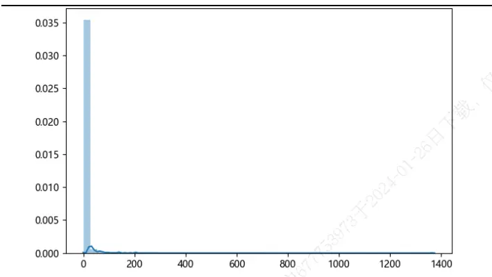
资料来源：Wind，海通证券研究所

图2 某股票买卖单分布（对数调整后）
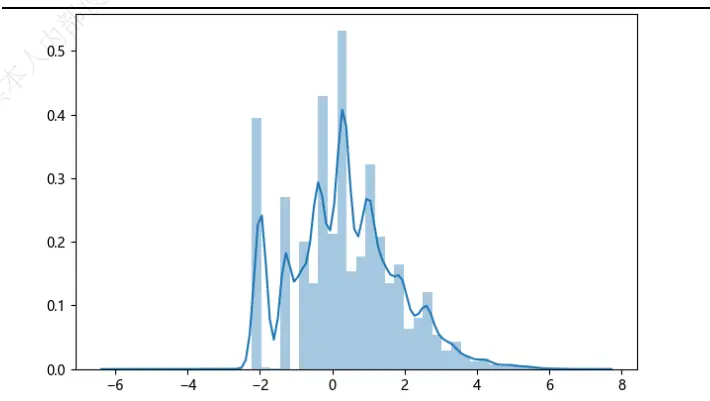
资料来源：Wind，海通证券研究所

相比于原始分布，对数调整后的买卖单分布偏度较小，更适合使用“N倍标准差”的方法计算大单阈值。其次，若仅使用单日的股票成交分布界定大单，则可能因为股票成交活跃度的变化影响到大单界定标准的稳定性。因此可考虑使用滚动多个交易日的成交分布计算大单阈值。当然，投资者也可根据自身需求调整这一窗口。

本文在界定大单时使用了多日买卖单成交单数据对数调整后的“均值+1 倍标准差”作为大单筛选阈值。（由于标准差阈值的设定会直接影响因子的选股能力，后文中也会讨论不同标准差阈值设定下因子的选股能力。）基于前文提出的计算方法，可界定大单并构建选股因子刻画大单买入行为：

$$
\begin{array}{rl}&{\qquad\texttt{\texttt{AFSR1,E1L_{i,t}}}=\frac{\sum_{j=1}^{N}\texttt{\texttt{AKFSA}}\cdot\texttt{SB}_{i,t-j}}{\sum_{j=1}^{N}\texttt{\texttt{AKFS}}_{i,t-j}}}\\&{\qquad\texttt{\texttt{AFSA2-ASkL_{i,t}}}=\frac{\sum_{j=1}^{N}(\texttt{AKF-AK}\cdot\texttt{SB}_{i,t-j}-\texttt{K7Sk-A7}_{i,t-j})}{\sum_{j=1}^{N}\texttt{\texttt{AKFS}}_{i,t-j}}}\end{array}
$$

除了大单买入占比以及大单净买入占比外，还可构建大单买入强度以及大单净买入强度刻画大单买入序列的稳健性。具体计算公式如下所示：

$$
\begin{array}{rl}&{\mathcal{L}\not\equiv\mathcal{\vec{R}}\lambda\not{\partial}\vec{\mathcal{R}}\lambda\not{\partial}\vec{\mathcal{R}}}_{i,t}^{\pm}=\frac{mean(\mathcal{L}\not{\partial},t\dot{\mathcal{R}}\dot{\mathcal{R}}\dot{\mathcal{R}}_{i,t-j}^{\pm})}{std(\mathcal{L}\not{\partial},t\dot{\mathcal{R}}\dot{\mathcal{R}}\dot{\mathcal{R}}_{i,t-j}^{\pm})}\\&{\mathcal{L}\not{\partial}\vec{\mathcal{L}}\lambda\not{\partial}\vec{\mathcal{R}}\lambda\not{\partial}\vec{\mathcal{R}}_{i,t}^{\pm}=\frac{mean(\mathcal{L}\not{\partial},t\dot{\mathcal{R}}\dot{\mathcal{R}}\dot{\mathcal{R}}_{i,t-j}^{\pm}-\mathcal{L}\not{\mathcal{R}}\not{\partial},t\dot{\mathcal{R}}\dot{\mathcal{R}}_{i,t-j}^{\pm})}{std(\mathcal{L}\not{\partial},t\dot{\mathcal{R}}\dot{\mathcal{R}}\dot{\mathcal{R}}_{i,t-j}^{\pm}-\mathcal{L}\not{\mathcal{R}}\dot{\mathcal{R}}\dot{\mathcal{R}}\dot{\mathcal{R}}_{i,t-j}^{\pm})}}\end{array}
$$

由于大单因子旨在刻画具有信息优势的投资者的交易行为，因此除了可使用全天数据计算因子外，还可考虑聚焦于开盘后的 30 分钟，仅使用开盘后 30分钟的数据计算因子。（更多关于日内不同时段数据与高频因子选股能力的讨论可参考《选股因子系列研究（七十）——日内市场微观结构与高频因子选股能力》）

$$
\begin{array}{rl}&{\mathcal{L}\mathcal{\bar{HK}}\mathcal{A}\mathcal{EK}\mathcal{L}_{i,t}=\frac{\sum_{j=1}^{N}\mathcal{K}\mathcal{HK}_{i,t-j,0}\mathcal{B}_{i}\mathcal{C}_{i-1,0-10}}{\sum_{j=1}^{N}\mathcal{K}\mathcal{HK}_{i,t-j,0;0}\ldots\operatorname{I0}0}}\\&{\mathcal{L}\mathcal{\bar{HK}}\mathcal{L}\mathcal{K}\mathcal{K}\mathcal{K}\mathcal{L}_{i,t}\mathcal{K}\mathcal{K}_{i,t}=\frac{\sum_{j=1}^{N}\mathcal{K}\mathcal{K}\mathcal{HK}_{i,t-j,0}\mathcal{B}_{i}\mathcal{K}_{i-10;0;0}\ldots\operatorname{I0}\mathcal{I}_{i}\mathcal{D}_{i-1,t-j,0;0}\mathcal{K}\mathcal{K}\mathcal{K}_{i,t-j,0;30-10;0}}{\sum_{j=1}^{N}\mathcal{K}\mathcal{K}\mathcal{K}_{i,t-j,0;0}\ldots\operatorname{I0}\mathcal{I}_{i}\mathcal{D}_{i,t-j,0;0-10;0}}}\\&{\mathcal{L}\mathcal{\bar{HK}}\mathcal{L}\mathcal{K}\mathcal{L}\mathcal{K}\mathcal{K}\mathcal{MK}_{i,t}}\\&{\mathcal{L}\mathcal{\bar{HK}}\mathcal{K}\mathcal{L}\mathcal{K}\mathcal{K}\mathcal{L}_{i,t}=\frac{mean(\mathcal{K}\mathcal{L}\mathcal{HK}\mathcal{K}\mathcal{K}_{i,t-j,0;30-10;0})}{std(\mathcal{K}\mathcal{K}\mathcal{L}\mathcal{HK}_{i,t-j,0;30-10;0})}}\\&\mathcal{L}\mathcal{\bar{HK}}\mathcal{L}\mathcal{K}\mathcal{K}\mathcal{K}\mathcal K\end{array}
$$

## 2. 因子选股能力回测

## 2.1 月度选股能力

使用 年以来的高频数据可对于因子的月度选股能力进行检验，下表展示了改进调整后的大单因子在正交前后的因子月度 以及前后 多空收益情况。本文在进行因子正交时剔除了行业因子、市值因子、估值因子、换手率因子、反转因子、波动率因子的影响。

表 1 大单因子月度 IC 与多空收益（2014.01.02~2020.12.31）

| 因子处理 | 类别 | 因子 | IC 均值 | 年化 ICIR | 月度胜率 | 多空收益 | 多头收益 | 空头收益 |
| --- | --- | --- | --- | --- | --- | --- | --- | --- |
| 正交前 | 大单买入占比 | 大单买入占比 3973于 | -0.008 | -0.190 | 56% | 0.50% | 0.25% | -0.25% |
|  |  | 大单净买入占比 | 0.019 | 0.725 | 68% | 0.78% | 0.25% | -0.53% |
|  |  | 开盘后大单买入占比 | -0.003 | -0.071 | 55% | 0.23% | 0.14% | -0.09% |
|  |  | 开盘后大单净买入占比 | 0.036 | 1.606 | 68% | 1.32% | 0.52% | -0.80% |
|  | 大单买入强度 | 大单买入强度 | 0.035 | 1.796 | 65% | 1.25% | 0.46% | -0.79% |
|  |  | 大单净买入强度 | 0.016 | 0.641 | 65% | 0.55% | 0.23% | -0.33% |
| 开盘后大单买入强度 |  | 0.027 | 1.660 | 67% | 0.82% | 0.23% | -0.58% |  |
| 开盘后大单净买入强度 |  | 0.037 | 1.746 | 74% | 1.40% | 0.58% | -0.82% |  |
| 正交后 | 大单买入占比 | 大单买入占比 | 0.022 | 1.310 | 65% | 0.75% | 0.44% | -0.31% |
|  |  | 大单净买入占比 | 0.045 | 4.403 | 90% | 1.66% | 0.71% | -0.94% |
|  |  | 开盘后大单买入占比 | 0.028 | 2.002 | 69% | 0.91% | 0.43% | -0.47% |
|  |  | 开盘后大单净买入占比 | 0.052 | 5.143 | 95% | 1.83% | 0.73% | -1.10% |
|  | 大单买入强度 | 0.014 | 1.190 | 61% | 0.48% | 0.26% | -0.22% |  |
|  | 大单买入强度 | 大单净买入强度 | 0.036 | 3.455 | 82% | 1.29% | 0.58% | -0.71% |
| 开盘后大单买入强度 |  | 0.008 | 0.843 | 58% | 0.14% | 0.12% | -0.02% |  |
| 开盘后大单净买入强度 |  | 0.042 | 3.859 | 88% | 1.40% | 0.58% |  |  |
|  |  |  |  |  |  |  | -0.82% |  |

资料来源：Wind，海通证券研究所

从原始因子的角度看，开盘后大单净买入占比、大单买入强度、开盘后大单买入强度以及开盘后大单净买入强度与未来一个月股票收益正相关，也即，大单买入占比或者大单买入强度越高，股票未来的相对收益表现越好。这一结果与直观逻辑较为吻合。该类因子旨在刻画大资金的买入行为，若假定大资金具有信息优势，则可以预期大资金偏好的标的在未来一段时间会具有更好的收益表现。

为了能够控制常规低频因子的影响，可进行正交处理。大单因子在正交后同样呈现出了极为显著的月度选股能力。相比而言，大单净买入相关的因子具有更强的选股能力。因子的月均 IC在 0.03~0.05 之间，年化 ICIR 普遍超过 3.5，月度胜率高于 80%，甚至达到 90%的月度胜率。因子同样具有较强的收益区分能力，因子前后 10%月均多空收益差在 1.3%~1.8%之间，此外，因子也具有一定的多头效应。下图展示了大单净买入类因子在正交后的分 10 组月均超额收益分布情况。

图3 大单净买入占比因子分 10 组超额收益（正交后，2014.01.02~2020.12.31）
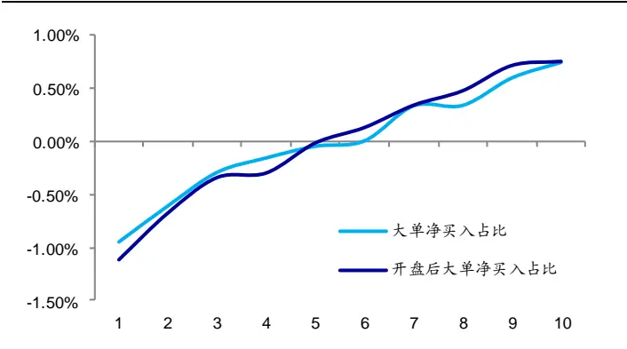
资料来源：Wind，海通证券研究所

图4 大单净买入强度因子分 10 组超额收益（正交后，2014.01.02~2020.12.31）
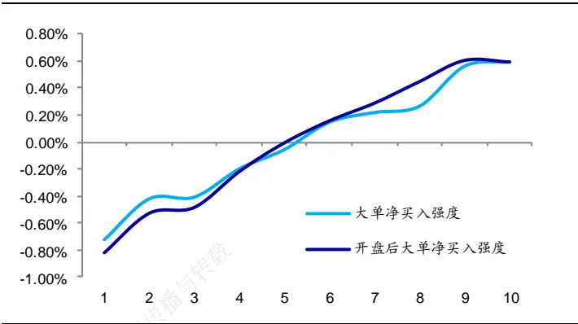
资料来源：Wind，海通证券研究所

从时间序列的角度看，大单净买入占比与大单净买入强度因子在 2014 年以来展现出了较为稳健的收益区分能力。下图展示了因子的多空相对强弱走势。

图5 大 单 净 买 入 占 比 因 子 多 空 相 对 强 弱 （ 正 交 后 ，2014.01.02~2020.12.31）
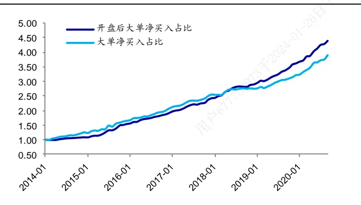
资料来源：Wind，海通证券研究所

图6 大 单 净 买 入 强 度 因 子 多 空 相 对 强 弱 （ 正 交 后 ，2014.01.02~2020.12.31）
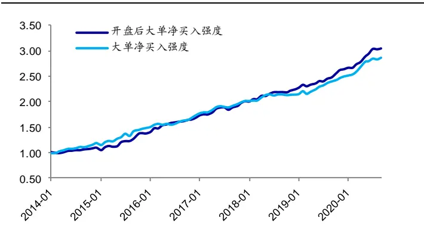
资料来源：Wind，海通证券研究所

下表展示了各因子的分年度多空收益。相比而言，大单净买入占比以及开盘后大单净买入占比取得了更高的年化多空收益，年化收益超 25%。值得注意的是，各因子在2018 年的收益表现相对较差，多空收益普遍低于历史平均水平。相比而言，开盘后大单净买入占比相对较好，该因子在 2018 年取得了 13%的多空收益。

表 2 大单净买入因子分年度多空收益（正交后，2014.01.02~2020.12.31）

| 因子名称 | 多空收益 | 月度胜率 | 2014 | 2015 | 2016 | 2017 | 2018 | 2019 | 2020 |
| --- | --- | --- | --- | --- | --- | --- | --- | --- | --- |
| 大单净买入占比 | 22.0% | 85% | 30.3% | 56.5% | 21.2% | 15.2% | 6.0% | 19.3% | 26.5% |
| 开盘后大单净买入占比 | 23.7% | 90% | 12.1% | 66.8% | 20.9% | 18.0% | 13.1% | 26.4% | 25.7% |
| 大单净买入强度 | 17.1% | 81% | 21.2% | 48.4% | 14.9% | 11.2% | 4.3% | 19.1% | 19.5% |
| 开盘后大单净买入强度 | 18.2% | 80% | 6.5% | 52.5% | 18.5% | 12.7% | 8.9% | 20.1% | 21.3% |

资料来源：Wind，海通证券研究所

我们同样可从回归法的角度对于上述因子的选股能力进行检验，可将上述因子分别与常规低频因子（行业、市值、中盘、换手率、反转、波动、估值、盈利以及盈利增长）放入多元回归模型进行回归检验。因子的回归系数即为因子溢价，通过因子溢价可得到因子的累计净值。下图展示了各因子的累计净值。

图7 大单净买入占比因子累计净值（2014.01.02~2020.12.31）
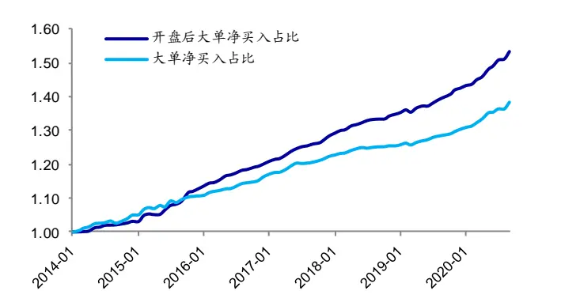
资料来源：Wind，海通证券研究所

图8 大单净买入强度因子累计净值（2014.01.02~2020.12.31）
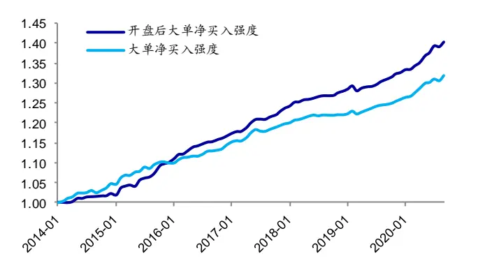
资料来源：Wind，海通证券研究所

从回归法的角度看，上述因子同样呈现出了显著的选股能力。大单净买入因子的月均溢价在 之间，并且因子在大部分年份中皆具有相对较好的收益表现。相比而言，开盘后大单净买入占比的收益性相对更强，该因子在近 3 年中同样展现出了较强的收益性。下表展示了各因子的月均溢价以及不同年度的月均溢价。

表 3 大单净买入因子分年度月均溢价（正交后，2014.01.02~2020.12.31）

| 因子名称 | 月均溢价 | 月度胜率 | 2014 | 2015 | 2016 | 2017 | 2018 | 2019 | 2020 |
| --- | --- | --- | --- | --- | --- | --- | --- | --- | --- |
| 大单净买入占比 | 0.41% | 86% | 0.42% | 0.45% | 0.46% | 0.39% | 0.20% | 0.34% | 0.58% |
| 开盘后大单净买入占比 | 0.54% | 94% | 0.25% | 0.81% | 0.52% | 0.55% | 0.38% | 0.48% | 0.76% |
| 大单净买入强度 | 0.34% | 79% | 0.38% | 0.42% | 0.39% | 0.34% | 0.16% | 0.28% | 0.45% |
| 开盘后大单净买入强度 | 0.43% | 89% | 0.15% | 0.72% | 0.47% | 0.47% | 0.28% | 0.31% | 0.60% |

资料来源：Wind，海通证券研究所

## 2.2 因子相关性

为了能够进一步分析大单净买入因子的特征，可考察该类因子与常规低频因子间的截面相关性。下表展示了大单净买入因子与常规低频因子之间的截面相关性。从截面相关性可知，大单净买入因子与股票前一个月涨幅具有较强的相关性，也即，大单净买入占比或者强度较高的股票往往在前一个月具有相对较高的涨幅。

表 4 大单净买入因子与常规因子间的截面相关性（正交前，2014.01.02~2020.12.31）

|  | 市值 | 中盘 | BP | 前一个涨幅 | 换手率 | 系统波动占比 | 盈利 | 盈利增长 |
| --- | --- | --- | --- | --- | --- | --- | --- | --- |
| 大单净买入占比 | 0.08 | 0.01 | 0.04 | 0.51 | -0.06 | -0.05 | 0.03 | 0.02 |
| 开盘后大单净买入占比 | 0.11 | 0.03 | -0.03 | 0.43 | -0.09 | -0.08 | 0.10 | 0.04 |
| 大单净买入强度 | 0.06 | 0.00 | 0.02 | 0.47 | -0.07 | -0.06 | 0.02 | 0.00 |
| 开盘后大单净买入强度 | 0.01 | -0.03 | -0.05 | 0.38 | -0.14 | -0.09 | 0.07 | 0.01 |

资料来源：Wind，海通证券研究所

我们可进一步考察大单净买入因子收益与常规低频因子收益间的相关性。下表展示了正交后的大单净买入因子 IC 序列与常规低频因子 IC序列之间的相关性。虽然大单净买入因子正交剔除了常规因子，但是开盘后大单净买入占比与开盘后大单净买入强度的IC 序列依旧与 BP以及盈利因子的收益序列呈现出了较为明显的相关性。

表 5 大单净买入因子与常规因子间的 IC序列相关性（正交后，2014.01.02~2020.12.31）

|  | 市值 | 中盘 | BP | 前一个涨幅 | 换手率 | 系统波动占比 | 盈利 | 盈利增长 |
| --- | --- | --- | --- | --- | --- | --- | --- | --- |
| 大单净买入占比 | -0.11 | -0.22 | -0.11 | -0.07 | -0.15 | 0.12 | 0.04 | 0.01 |
| 开盘后大单净买入占比 | -0.03 | -0.13 | -0.37 | -0.10 | -0.03 | 0.12 | 0.47 | -0.05 |
| 大单净买入强度 | -0.13 | -0.22 | -0.19 | -0.08 | -0.22 | 0.13 | 0.07 | -0.02 |
| 开盘后大单净买入强度 | -0.09 | -0.19 | -0.42 | -0.15 | -0.12 | 0.15 | 0.47 | -0.11 |

资料来源：Wind，海通证券研究所

## 2.3不同范围内的选股能力

考虑到因子在不同的股票空间中的表现存在差异，因此可考虑大单净买入因子在各指数范围的选股能力。下表展示了因子在不同指数范围内的选股能力。（下表在回测因子选股能力时皆是在全市场完成因子正交处理后放入特定选股空间进行回测分析。）

表 6 大单净买入因子在不同范围内的选股能力（正交后，2014.01.02~2020.12.31）

| 选股范围 | 因子名称 | 月度IC 均值 | 年化ICIR | 月度胜率 | 月均多空收益 | 月均多头收益 |
| --- | --- | --- | --- | --- | --- | --- |
| 全市场 | 大单净买入占比 | 0.045 | 4.403 | 90% | 1.66% | 0.71% |
|  | 开盘后大单净买入占比 | 0.052 | 5.143 | 95% | 1.83% | 0.73% |
|  | 大单净买入强度 | 0.036 | 3.455 | 82% 与转载 | 1.29% | 0.58% |
|  | 开盘后大单净买入强度 | 0.042 | 3.859 | 88% | 1.40% | 0.58% |
| 中证800外 | 大单净买入占比 | 0.051 | 4.391 | 90% | 1.93% | 0.80% |
|  | 开盘后大单净买入占比 | 0.055 | 4.632 | 92% | 1.95% | 0.77% |
|  | 大单净买入强度 | 0.041 | 3.486 | 85% 内部使用， | 1.54% | 0.67% |
|  | 开盘后大单净买入强度 | 0.044 | 3.392 | 83% | 1.58% | 0.59% |
| 中证500内 | 大单净买入占比 | 0.032 | 1.953 | 67% | 1.03% | 0.47% |
|  | 开盘后大单净买入占比 | 0.047 | 2.857 | 77% | 1.65% | 0.64% |
|  | 大单净买入强度 | 0.028 | 1.588 | 67% | 0.74% | 0.36% |
|  | 开盘后大单净买入强度 | 0.039 | 2.286 | 73% | 1.13% | 0.65% |
| 沪深 300 内 | 大单净买入占比 | 0.043 | 1.801 | 74% | 1.50% | 0.54% |
|  | 开盘后大单净买入占比 | 0.063 024-01-26 | 2.604 | 77% | 1.88% | 0.76% |
|  | 大单净买入强度 | 0.039 | 1.593 | 68% | 1.08% | 0.39% |
|  | 开盘后大单净买入强度 | 0.056 | 2.222 | 74% | 1.27% | 0.72% |

资料来源：Wind，海通证券研究所

观察上表可知，大单净买入因子在各指数范围皆呈现出了较为显著的选股能力。与大部分技术因子不同的是，开盘后大单净买入占比以及开盘后大单净买入强度因子在沪深 300 指数内依旧呈现出了极强的选股能力，部分因子月均 IC强于其在全市场下的表现。我们认为大单净买入类因子之所以在沪深 300 指数范围内依旧有效，是因为该类因子可归类为动量逻辑类的因子，而沪深 300 指数范围内的股票普遍具有较强的动量性。

在回测分析因子的选股能力时，我们还发现部分大单类因子在沪深 指数范围内单独进行正交处理后，在 年以及 年皆呈现出了极强的收益区分能力。不妨以开盘后大单净买入占比因子（使用“均值+0 倍标准差”界定大单）为例，下图展示了因子在不同年度的多空收益以及空头收益。观察下图不难发现，因子在沪深 指数范围内选出的多头组合在 2019 年以及 2020 年中相对于沪深 300 指数内股票的平均水平分别取得了 以及 的超额收益。此外，因子也呈现出了较强的多空收益区分能力，因子在上述两年中的多空收益皆超过 40%。需要注意的是，该种处理方式虽然能够明显提升大单因子在 年以及 年的收益区分能力，但是会在一定程度影响到因子的收益稳定性。投资者需根据自身需求进行选择。

图9 开盘后大单净买入占比因子沪深 300指数内分年度多头收益以及空头收益（2014~2020）
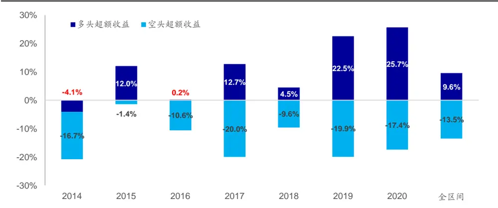
资料来源：Wind，海通证券研究所

## 2.4改进前后因子选股能力对比

由于系列前期报告在界定大单时分别使用了0倍标准差以及1倍标准差进行大单的界定，本节在进行因子选股效果对比时，同样选择了改进方法下标准差阈值为 0和 1 时因子的月度选股能力。不妨以大单净买入占比因子为例，下表对比展示了大单净买入占比因子在改进前后的月度选股能力。

表 7 改进前后大单净买入占比因子的选股能力（正交后，2014.01.02~2020.12.31）

| 标准差阈值 | 因子名称 | 月均IC | 年化ICIR | 月度胜率 | 月均多空 | 月均多头 | 月均空头 |
| --- | --- | --- | --- | --- | --- | --- | --- |
| 0倍标准差 | 大单净买入占比（改进前） | 0.046 | 4.286 | 88% | 1.60% | 0.70% | -0.90% |
|  | 大单净买入占比（改进后） | 0.042 | 4.502 | 89% | 1.52% | 0.85% | -0.67% |
| 1 倍标准差 | 大单净买入占比（改进前） | 0.032 | 2.855 | 79% | 0.98% | 0.24% | -0.74% |
|  | 大单净买入占比（改进后） | 0.045 | 4.403 | 90% | 1.66% | 0.71% | -0.94% |

资料来源：Wind，海通证券研究所

观察上表不难发现，在 0 倍标准差阈值的设定下，改进前后的因子选股能力差异相对较小，改进后的因子具有更高的年化 ICIR以及更高的多头收益。但是在 1倍标准差阈值的设定下，改进后的因子明显呈现出了更强的选股能力，且因子的选股能力相比于0 倍标准差阈值设定时的变化相对较小，改进后的因子呈现出了更强的稳健性。

## 3. 大单筛选阈值对因子选股效果的影响

由于本文在筛选大单时依赖于大单的设定，因此可考虑改变大单筛选阈值并观察因子选股能力对于相关阈值的敏感性。下表对于展示了不同参数下，大单因子的月均 IC 以及年化多空收益。

表 8 大单净买入因子在不同标准差筛选阈值下的选股能力（正交后，2014.01.02~2020.12.31）

| 因子名称 | 大单筛选阈值 | 月均IC | 年化ICIR | 月度胜率 | 多空收益 | 多头收益 |
| --- | --- | --- | --- | --- | --- | --- |
| 大单净买入占比 | 均值-1 倍标准差 | 0.016 | 1.485 | 68% | 0.49% | 0.43% |
|  | 均值 | 0.042 | 4.502 | 89% | 1.52% | 0.85% |
|  | 均值+1 倍标准差 | 0.045 | 4.403 | 90% | 1.66% | 0.71% |
|  | 均值+2 倍标准差 | 0.030 | 2.904 | 81% | 1.04% | 0.33% |
|  | 均值+3 倍标准差 | 0.008 | 0.782 | 58% | 0.21% | -0.19% |
| 开盘后大单净买入占比 | 均值-1 倍标准差 | 0.021 | 2.002 | 74% | 0.60% | 0.42% |
|  | 均值 | 0.048 | 5.069 | 92% | 1.73% | 0.80% |
|  | 均值+1 倍标准差 | 0.052 | 5.143 | 95% | 1.83% | 0.73% |
|  | 均值+2 倍标准差 | 0.038 | 3.771 | 85% | 1.33% | 0.42% |
|  | 均值+3 倍标准差 | 0.020 | 1.690 | 71% | 0.65% | 0.01% |
| 大单净买入强度 | 均值-1 倍标准差 | 0.036 | 3.095 | 76% | 1.22% | 0.65% |
|  | 均值 | 0.041 | 4.061 | 88% | 1.42% | 0.69% |
|  | 均值+1 倍标准差 | 0.036 | 3.455 | 82% | 1.29% | 0.58% |
|  | 均值+2 倍标准差 | 0.023 | 2.272 | 76% | 0.80% | 0.32% |
|  | 均值+3 倍标准差 | 0.006 | 0.627 | 58% | 0.18% | 0.08% |
| 开盘后大单净买入强度 | 均值-1 倍标准差 | 0.026 | 3.484 | 85% | 1.07% | 0.38% |
|  | 均值 | 0.044 | 3.983 | 接 88% | 1.49% | 0.68% |
|  | 均值+1 倍标准差 | 0.042 | 3.859 | 88% | 1.40% | 0.58% |
|  | 均值+2 倍标准差 | 0.033 | 3.179 | 82% 不可 | 1.08% | 0.41% |
|  | 均值+3 倍标准差 | 0.019 | 1.680 | 75% | 0.65% | 0.20% |

资料来源： ，海通证券研究所

上表结果表明，大单筛选阈值不宜设定得过高与过低。当大单筛选阈值从“均值+1倍标准差”上升至“均值+3 倍标准差”时，各因子的选股能力皆呈现出了下降的态势，并且在“均值+3 倍标准差”的筛选阈值下，因子的选股能力较弱。这一现象可理解为，在筛选条件过于严苛的情况下，绝大部分股票无法有效筛选得到大单，由此导致不同股票的因子值区分度较低。

当大单筛选阈值从“均值+1 倍标准差”下降至“均值-1 倍标准差”时，因子的选股能力同样出现了减弱。值得注意的是，大单净买入因子的选股能力在大单筛选阈值下降至“均值”时并未出现明显变化，部分因子的选股能力甚至出现了微幅提升。当大单筛选阈值进一步降低至“均值-1 倍标准差”时，因子虽然依旧呈现出了一定的选股能力，但是相比于大单筛选阈值为“均值”时出现了极为明显的下降。

结合上述测试结果，大单净买入因子对于大单筛选阈值具有一定的敏感性，但是筛选阈值在“均值”至“均值+1 倍标准差”时的稳定性相对较强。

考虑到通过单成交分布得到的大单筛选阈值完全取决于股票自身的成交情况，因此该种方法在面对成交单面额较小的股票时界定得到的大单阈值并不能真正筛选出大单。因此可考虑在单成交分布大单阈值的基础之上增加绝对金额的限制。

## 大单筛选阈值 = max(基于分布的大单筛选阈值，绝对金额阈值)

值得注意的是，虽然加入绝对金额的限制能够使大单的界定更具有逻辑性，但是该种方法同样会引入新的参数——绝对金额阈值。下表展示了不同绝对金额阈值以及不同标准差阈值的结合下因子的选股能力。

表 9 大单净买入因子在不同标准差筛选阈值与绝对金额筛选阈值下的选股能力（正交后，2014.01.02~2020.12.31）

|  |  | 月均IC |  |  |  | 月度多空收益 |  |  |  |
| --- | --- | --- | --- | --- | --- | --- | --- | --- | --- |
| 因子名称 | 大单筛选阈值 | 无约束 | >=5万 | >=10万 | >=50万 | 无约束 | >=5万 | >=10万 | >=50万 |
| 大单净买入占比 | 均值-1*标准差 | 0.016 | 0.043 | 0.036 | 0.012 | 0.49% | 1.51% | 1.29% | 0.48% |
|  | 均值 | 0.042 | 0.043 | 0.036 | 0.012 | 1.52% | 1.53% | 1.30% | 0.48% |
|  | 均值+1*标准差 | 0.045 | 0.042 | 0.036 | 0.012 | 1.66% | 1.49% | 1.31% | 0.48% |
|  | 均值+2*标准差 | 0.030 | 0.030 | 0.030 | 0.012 | 1.04% | 1.05% | 1.05% | 0.48% |
|  | 均值+3*标准差 | 0.008 | 0.008 | 0.008 | 0.008 | 0.21% | 0.21% | 0.21% | 0.21% |
| 开盘后大单净买入占比 | 均值-1*标准差 | 0.021 | 0.049 | 0.042 | 0.022 | 0.60% | 1.76% | 1.54% | 0.67% |
|  | 均值 | 0.048 | 0.049 | 0.042 | 0.022 | 1.73% | 1.76% | 1.54% | 0.67% |
|  | 均值+1*标准差 | 0.052 | 0.049 | 0.043 | 0.022 | 1.83% | 1.74% | 1.54% | 0.67% |
|  | 均值+2*标准差 | 0.038 | 0.038 | 0.038 | 0.022 | 1.33% | 1.33% | 1.35% | 0.65% |
|  | 均值+3*标准差 | 0.020 | 0.020 | 0.020 | 0.020 | 0.65% | 0.65% | 0.65% | 0.71% |
| 大单净买入强度 | 均值-1*标准差 | 0.036 | 0.034 | 0.027 | 0.009 | 1.22% | 1.21% | 1.00% | 0.45% |
|  | 均值 | 0.041 | 0.035 | 0.028 | 0.009 | 1.42% | 1.24% | 1.01% | 0.45% |
|  | 均值+1*标准差 | 0.036 | 0.034 | 0.027 | 0.009 | 1.29% | 1.16% | 1.00% | 0.45% |
|  | 均值+2*标准差 | 0.023 | 0.023 | 0.023 | 0.009 | 0.80% | 0.80% | 0.83% | 0.46% |
|  | 均值+3*标准差 | 0.006 | 0.006 | 0.006 | 0.005 | 0.18% | 0.18% | 0.18% | 0.19% |
| 开盘后大单净买入强度 | 均值-1*标准差 | 0.026 | 0.041 | 0.037 | 0.022 | 1.07% | 1.41% | 1.33% | 0.71% |
|  | 均值 | 0.044 | 0.041 | 0.037 | 0.022 | 1.49% | 1.42% | 1.34% | 0.71% |
|  | 均值+1*标准差 | 0.042 | 0.041 | 0.037 | 0.022 | 1.40% | 1.36% | 1.34% | 0.71% |
|  | 均值+2*标准差 | 0.033 | 0.033 | 0.033 | 0.021 | 1.08% | 1.08% | 1.10% | 0.71% |
|  | 均值+3*标准差 | 0.019 | 0.019 | 0.019 | 0.019 | 0.65% | 0.65% | 0.65% | 0.73% |

资料来源：Wind，海通证券研究所

在标准差阈值较低时（“均值-1 倍标准差”），绝对金额阈值的引入能够明显改善大单净买入因子的选股能力，绝对金额阈值为 万以及 万时，因子的选股能力皆相比于无绝对金额约束时出现了较为明显的改善。值得注意的是，绝对金额阈值同样不宜设定得过高。当绝对金额阈值设定为 万时，绝对金额阈值在大部分情况下高于标准差阈值，从而无效化了标准差阈值，因此大单因子的选股能力出现了极为明显的减弱。

在标准差阈值设定得较为适中时（“均值”至“均值 倍标准差”），绝对金额阈值的引入并未明显影响因子的选股能力。在绝对金额阈值为 5 万以及 10 万时，因子的月均 IC 以及月均多空收益的变化并不明显。在标准差阈值较大时（“均值+3 倍标准差”），绝对金额阈值的引入同样未对于因子的选股能力产生明显影响。

结合上述结果，绝对金额阈值的引入具有较强的逻辑性，在标准差阈值较低时，该指标的引入能够在一定程度上保证大单净买入因子的选股能力，但是在标准差阈值设定适中的情况下，该指标的引入并未带来的因子选股能力的变化。因此，该指标的引入并非必须，可作为一个双重保险机制引入大单的界定，投资者可根据自身需求决定是否需要引入绝对金额阈值。

## 4. 组合表现对比

## 4.1 沪深 300指数增强组合对比

可将前文构建得到的开盘后大单净买入占比因子以及开盘后大单净买入强度因子放入多因子模型并构建沪深 300指数增强组合。下表展示了组合在不同年度的风险收益特征。

表 10 沪深 300 指数增强组合对比（2016.01.04~2020.12.31）

| 年份 | 超额收益 |  |  | 最大回撤 |  |  | 超额波动 加入 |  |  |
| --- | --- | --- | --- | --- | --- | --- | --- | --- | --- |
|  | 基础模型 | 加入 开盘后大单 净买入占比 | 加入 开盘后大单 净买入强度 | 基础模型 | 加入 开盘后大单 净买入占比 | 加入 开盘后大单 净买入强度 | 基础模型 | 开盘后大单 净买入占比 | 加入 开盘后大单 净买入强度 |
| 2016 | 12.5% | 16.0% | 14.6% | 2.9% | 2.2% | 2.7% | 5.0% | 4.7% | 4.9% |
| 2017 | 14.2% | 19.8% | 19.8% | 2.4% | 2.4% | 2.4% | 5.0% | 4.8% | 4.7% |
| 2018 | 10.6% | 11.5% | 9.3% | 5.0% | 4.7% | 5.8% | 5.7% | 5.8% | 5.7% |
| 2019 | 14.5% | 8.9% | 13.5% | 3.1% | 4.5% | 3.2% | 5.6% | 5.0% | 5.2% |
| 2020 | 28.3% | 31.5% | 29.2% | 4.3% | 3.7% | 3.7% | 7.5% | 7.0% | 7.5% |
| 全区间 | 15.4% | 17.0% | 16.5% | 5.0% | 4.7% | 5.8% | 5.8% | 5.5% | 5.7% |

资料来源：Wind，海通证券研究所

在加入大单因子后，组合整体表现有所提升，且在 2020 年的超额收益表现得到了进一步的增强。在加入开盘后大单净买入占比因子后，模型在 2016、2017、2018 以及2020 年的超额收益皆得到了提升。下图对比展示了各模型相对于沪深 300 指数的相对强弱走势。

图10 沪深 300 指数增强组合净值（2016.01.04~2020.12.31）
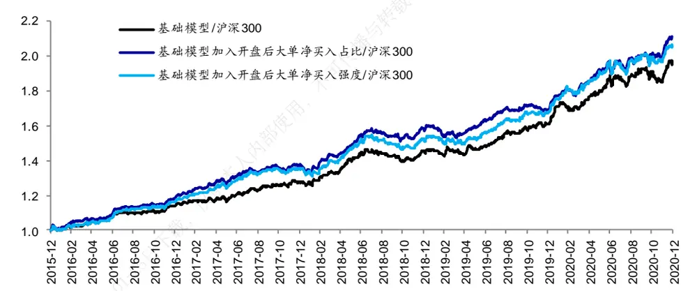
资料来源：Wind，海通证券研究所

## 4.2 中证 500指数增强组合对比

同样可将前文构建得到的大单净买入占比因子以及大单净买入强度因子放入多因子模型并构建中证 500 指数增强组合。下表展示了组合在不同年度的风险收益特征。

表 11 中证 500 指数增强组合对比（2016.01.04~2020.12.31）

| 年份 | 超额收益 |  |  | 最大回撤 |  | 超额波动 |  |  |
| --- | --- | --- | --- | --- | --- | --- | --- | --- |
|  | 基础模型 | 加入 开盘后大单 净买入占比 | 加入 开盘后大单 净买入强度 | 加入开盘后 基础 大单净买入 模型 占比 | 加入 开盘后大单 净买入强度 | 基础模型 | 加入 开盘后大单 净买入占比 | 加入 开盘后大单 净买入强度 |
| 2016 | 16.5% | 22.1% | 19.9% | 1.4% 1.6% | 1.5% | 4.6% | 5.1% | 5.0% |
| 2017 | 21.0% | 18.5% | 17.8% | 2.8% 3.4% | 2.5% | 5.3% | 5.4% | 5.3% |
| 2018 | 16.3% | 12.9% | 15.6% | 4.3% 5.0% | 4.6% | 6.6% | 6.6% | 6.4% |
| 2019 | 19.5% | 15.2% | 22.7% | 4.6% 5.6% | 5.3% | 5.7% | 5.8% | 5.9% |
| 2020 | 29.3% | 21.9% | 32.5% | 4.8% 4.8% | 4.0% | 7.3% | 7.2% | 7.1% |
| 全区间 | 20.1% | 18.1% | 21.1% | 4.8% 5.6% | 5.3% | 6.0% | 6.1% | 6.0% |

资料来源：Wind，海通证券研究所

对于中证 500 指数增强组合，大单因子在加入组合后并未明显影响组合的全区间收益表现。在加入开盘后大单净买入强度因子后，组合在 2019 以及 2020 年的超额收益有所提升。

图11 中证 500 指数增强组合净值（2016.01.04~2020.12.31）
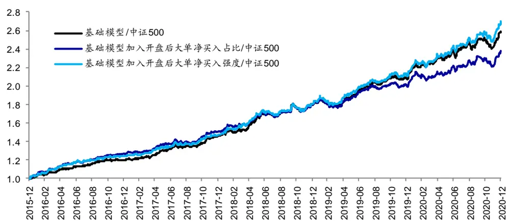
资料来源： ，海通证券研究所

## 5. 总结

本文在系列前期报告的基础上，改进调整了股票大单的筛选流程。在经过对数调整以及多日数据叠加后，本文基于股票单成交分布，通过“均值+N 倍标准差”的方式筛

回测结果表明，大单净买入占比以及大单净买入强度两类因子在剔除了常规低频因子的影响后依旧具有较为显著的月度选股能力。在不同的选股空间中，两类因子同样具有较为稳健的选股能力。

此外，本文还回测了大单筛选阈值 N对于大单因子选股效果的影响。回测结果表明，N 在 0~2 时，大单净买入因子皆呈现出了较为显著的月度选股能力。为了能够使大单筛选阈值更加具有逻辑性，可在大单筛选阈值的计算过程中引入绝对金额阈值。实际回测结果表明，绝对金额阈值能够在标准差阈值设定过低的情况下保证因子的选股能力，但并不能在标准差阈值设定适中的情况下带来因子选股能力的明显改变。

最后，本文也尝试将大单净买入因子引入多因子模型，回测结果表明，大单净买入因子的引入能够提升组合的收益表现。

## 6. 风险提示

市场系统性风险、资产流动性风险以及政策变动风险会对策略表现产生较大影响。

# 信息披露

分析师声明

[Table冯佳睿yst金融工程研究团队s]

袁林青金融工程研究团队

本人具有中国证券业协会授予的证券投资咨询执业资格，以勤勉的职业态度，独立、客观地出具本报告。本报告所采用的数据和信息均来自市场公开信息，本人不保证该等信息的准确性或完整性。分析逻辑基于作者的职业理解，清晰准确地反映了作者的研究观点，结论不受任何第三方的授意或影响，特此声明。

## 法律声明

本报告仅供海通证券股份有限公司（以下简称 本公司 ）的客户使用。本公司不会因接收人收到本报告而视其为客户。在任何情况下，本报告中的信息或所表述的意见并不构成对任何人的投资建议。在任何情况下，本公司不对任何人因使用本报告中的任何内容所引致的任何损失负任何责任。

本报告所载的资料、意见及推测仅反映本公司于发布本报告当日的判断，本报告所指的证券或投资标的的价格、价值及投资收入可能会波动。在不同时期，本公司可发出与本报告所载资料、意见及推测不一致的报告。

市场有风险，投资需谨慎。本报告所载的信息、材料及结论只提供特定客户作参考，不构成投资建议，也没有考虑到个别客户特殊的播投资目标、财务状况或需要。客户应考虑本报告中的任何意见或建议是否符合其特定状况。在法律许可的情况下，海通证券及其所属可关联机构可能会持有报告中提到的公司所发行的证券并进行交易，还可能为这些公司提供投资银行服务或其他服务。

本报告仅向特定客户传送，未经海通证券研究所书面授权，本研究报告的任何部分均不得以任何方式制作任何形式的拷贝、复印件或复制品，或再次分发给任何其他人，或以任何侵犯本公司版权的其他方式使用。所有本报告中使用的商标、服务标记及标记均为本公司的商标、服务标记及标记，如欲引用或转载本文内容，务必联络海通证券研究所并获得许可，并需注明出处为海通证券研究所，目不得对本文进行有悖原意的引用和删改。仅

根据中国证监会核发的经营证券业务许可，海通证券股份有限公司的经营范围包括证券投资咨询业务。下载

## 海[Table_PeopleInfo] 通证券股份有限公司研究所

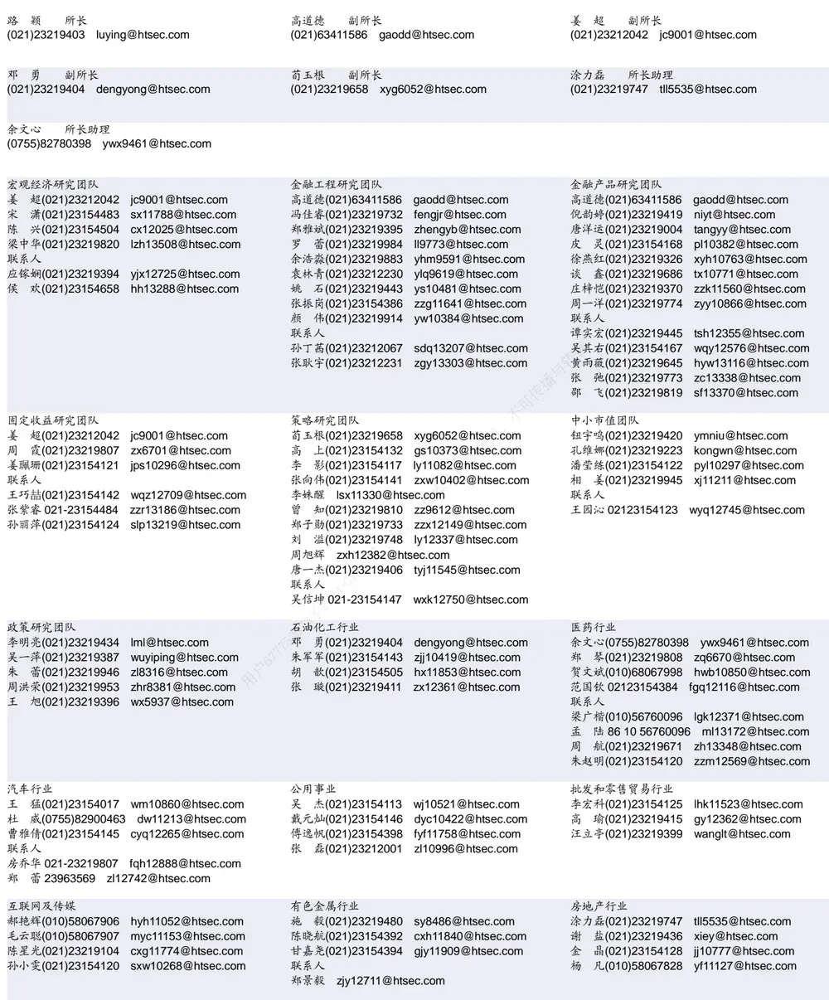

| 电子行业 | 煤炭行业 |  | 电力设备及新能源行业 |  |
| --- | --- | --- | --- | --- |
| 蒋 俊(021)23154170 jj11200@htsec.com | 李 淼(010)58067998 Im10779@htsec.com |  | 张一弛(021)23219402 | zyc9637@htsec.com |
| 周旭辉 zxh12382@htsec.com | 戴元灿(021)23154146 | dyc10422@htsec.com | 房 青(021)23219692 | fangq@htsec.com |
| 联系人 | 吴 杰(021)23154113 | wj10521@htsec.com | 曾 彪(021)23154148 | zb10242@htsec.com |
| 肖隽翀021-23154139 xjc12802@htsec.com | 王 涛(021)23219760 | wt12363@htsec.com | 徐柏乔(021)23219171 | xbq6583@htsec.com |

| 基础化工行业 |  | 计算机行业 | 通信行业 |
| --- | --- | --- | --- |
|  | 刘 威(0755)82764281 Iw10053@htsec.com | 郑宏达(021)23219392 zhd10834@htsec.com | 朱劲松(010)50949926 zjs10213@htsec.com |
| 刘海荣(021)23154130 Ihr10342@htsec.com |  | 杨 林(021)23154174 yl11036@htsec.com | 余伟民(010)50949926 ywm11574@htsec.com |
| 张翠翠(021)23214397 zcc11726@htsec.com |  | 于成龙(021)23154174 ycl12224@htsec.com | 张峥青(021)23219383 zzq11650@htsec.com |
| 李 智(021)23219392 lz11785@htsec.com | 孙维容(021)23219431 swr12178@htsec.com | 黄竞晶(021)23154131 hjj10361@htsec.com | 联系人 |
|  |  | 洪 琳(021)23154137 hl11570@htsec.com 联系人 | 杨彤昕 010-56760095 ytx12741@htsec.com |
|  |  | 杨 蒙(0755)23617756 ym13254@htsec.com |  |

| 非银行金融行业 |  | 交通运输行业 |  | 纺织服装行业 |  |
| --- | --- | --- | --- | --- | --- |
|  | 孙 婷(010)50949926 st9998@htsec.com |  | 虞 楠(021)23219382 yun@htsec.com |  | 梁 希(021)23219407 lx11040@htsec.com |
|  | 何 婷(021)23219634 ht10515@htsec.com |  | 罗月江（010）56760091 lyj12399@htsec.com |  | 盛 开(021)23154510 sk11787@htsec.com |
|  | 李芳洲(021)23154127 Ifz11585@htsec.com |  | 李 轩(021)23154652 lx12671@htsec.com |  |  |
| 联系人 |  |  | 陈 宇(021)23219442 cy13115@htsec.com |  |  |
| 任广博(010)56760090 rgb12695@htsec.com |  |  |  |  |  |

| 建筑建材行业 | 机械行业 |  | 钢铁行业 |
| --- | --- | --- | --- |
| 冯晨阳(021)23212081 fcy10886@htsec.com | 佘炜超(021)23219816 swc11480@htsec.com |  | 刘彦奇(021)23219391 liuyq@htsec.com |
| 潘莹练(021)23154122 pyl10297@htsec.com | 周 丹 zd12213@htsec.com |  | 周慧琳(021)23154399 zhl11756@htsec.com |
| 申 浩(021)23154114 sh12219@htsec.com | 吉 晟(021)23154653 js12801@htsec.com |  |  |
| 颜慧菁 yhj12866@htsec.com |  | 赵玥炜(021)23219814 zyw13208@htsec.com |  |

| 建筑工程行业 | 农林牧渔行业 |  | 食品饮料行业 |
| --- | --- | --- | --- |
| 张欣劼 zxj12156@htsec.com |  | 丁 频(021)23219405 dingpin@htsec.com 传播 | 闻宏伟(010)58067941 whw9587@htsec.com |
| 李富华(021)23154134 Ifh12225@htsec.com | 陈 阳(021)23212041 cy10867@htsec.com |  | 颜慧菁 yhj12866@htsec.com |
|  | 联系人 |  | 张宇轩(021)23154172 zyx11631@htsec.com |
|  |  | 孟亚琦(021)23154396 myq12354@htsec.com | 程碧升(021)23154171 cbs10969@htsec.com |

| 军工行业 | 银行行业 | 社会服务行业 |
| --- | --- | --- |
| 张恒晅 zhx10170@htsec.com | 孙 婷(010)50949926 st9998@htsec.com | 汪立亭(021)23219399 wanglt@htsec.com |
| 张高艳 0755-82900489 zgy13106@htsec.com 联系人 | 解巍巍 xww12276@htsec.com 林加力(021)23154395 ljl12245@htsec.com | 许樱之(755)82900465 xyz11630@htsec.com 联系人 |
| 刘砚菲021-2321-4129 lyf13079@htsec.com | 联系人 董栋梁(021)23219356 ddl13026@htsec.com | 毛弘毅(021)23219583 mhy13205@htsec.com |

| 家电行业 |  | 造纸轻工行业 I |  |
| --- | --- | --- | --- |
| 陈子仪(021)23219244 | chenzy@htsec.com | 汪立亭(021)23219399 wanglt@htsec.com |  |
| 李 阳(021)23154382 | ly11194@htsec.com | 赵 洋(021)23154126 zy10340@htsec.com |  |
| 朱默辰(021)23154383 | zmc11316@htsec.com | 联系人 |  |
| 刘 璐(021)23214390 | II11838@htsec.com | 柳文韬(021)23219389 1 | Iwt13065@htsec.com |

## 研究所销售团队

深广地区销售团队

蔡铁清(0755)82775962 ctq5979@htsec.com

伏财勇(0755)23607963 fcy7498@htsec.com

辜丽娟(0755)83253022 gulj@htsec.com

刘晶晶(0755)83255933 liujj4900@htsec.com

饶 伟(0755)82775282 rw10588@htsec.com

欧阳梦楚(0755)23617160

oymc11039@htsec.com

巩柏含 gbh11537@htsec.com

滕雪竹 txz13189@htsec.com

上海地区销售团队上海地区销售团队

胡雪梅(021)23219385 huxm@htsec.com
朱 健(021)23219592 zhuj@htsec.com
季唯佳(021)23219384 jiwj@htsec.com
黄 毓(021)23219410 huangyu@htsec.com
漆冠男(021)23219281 qgn10768@htsec.com
胡宇欣(021)23154192 hyx10493@htsec.com
黄 诚(021)23219397 hc10482@htsec.com
毛文英(021)23219373 mwy10474@htsec.com
马晓男 mxn11376@htsec.com
杨祎昕(021)23212268 yyx10310@htsec.com
张思宇 zsy11797@htsec.com
王朝领 wcl11854@htsec.com
邵亚杰 23214650 syj12493@htsec.com
李 寅 021-23219691 ly12488@htsec.com
董晓梅 dxm10457@htsec.com北京地区销售团队
殷怡琦(010)58067988 yyq9989@htsec.com郭 楠 010-5806 7936 gn12384@htsec.com张丽萱(010)58067931 zlx11191@htsec.com杨羽莎(010)58067977 yys10962@htsec.com郭金垚(010)58067851 gjy12727@htsec.com张钧博 zjb13446@htsec.com
高 瑞 gr13547@htsec.com

海通证券股份有限公司研究所

地址：上海市黄浦区广东路 689号海通证券大厦 9楼

电话：（021）23219000

传真：（021）23219392

网址：www.htsec.com