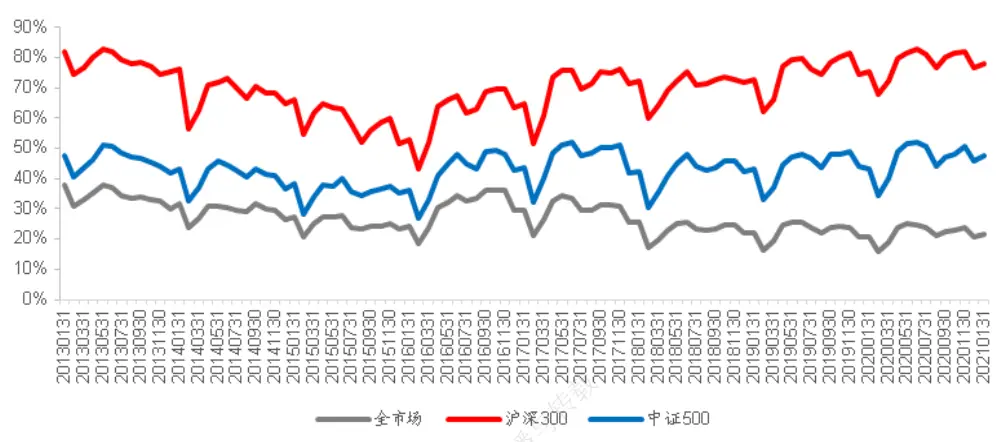
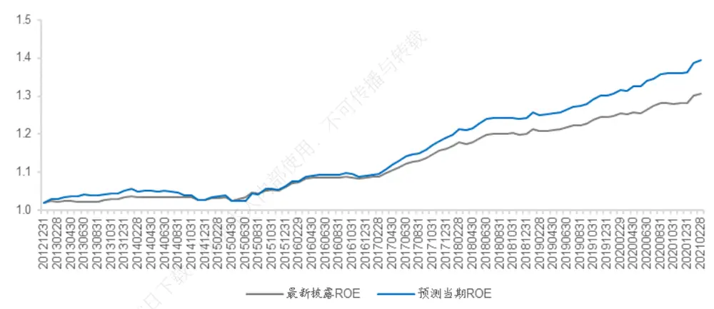
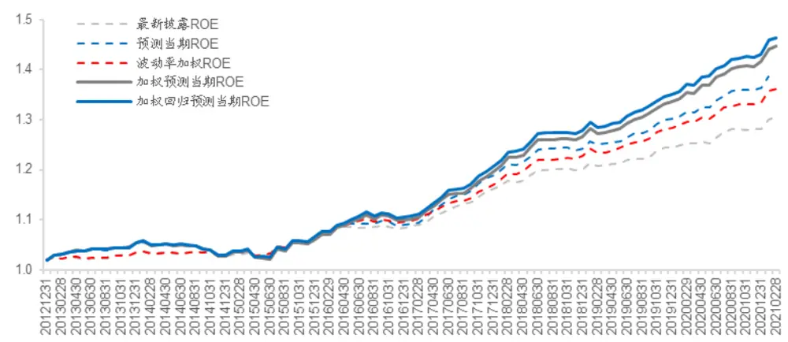
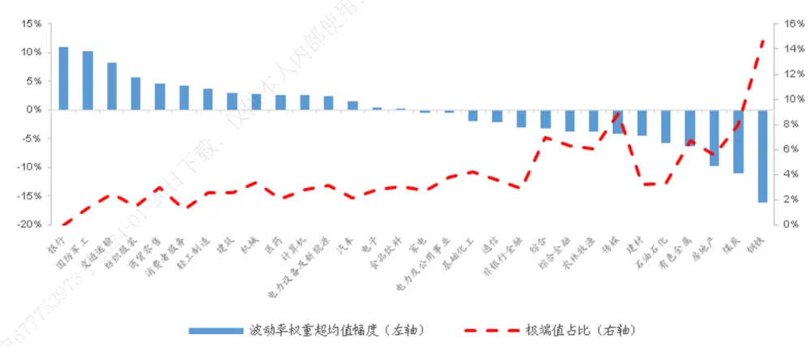
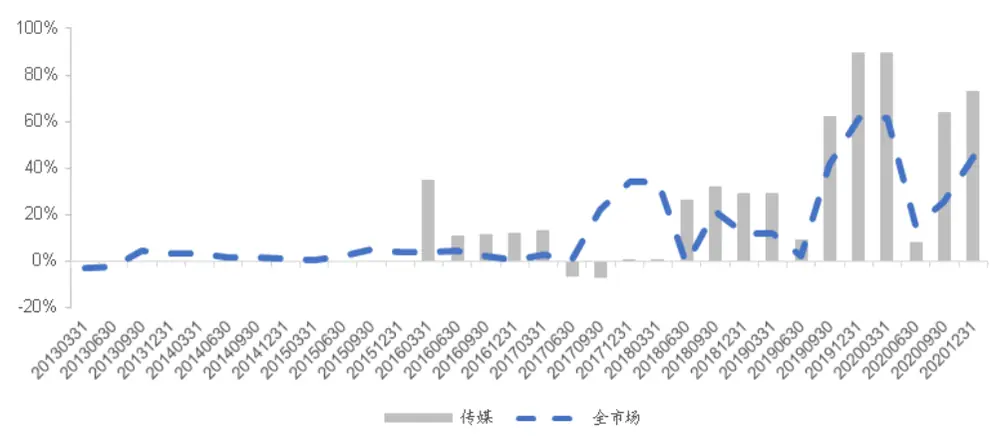
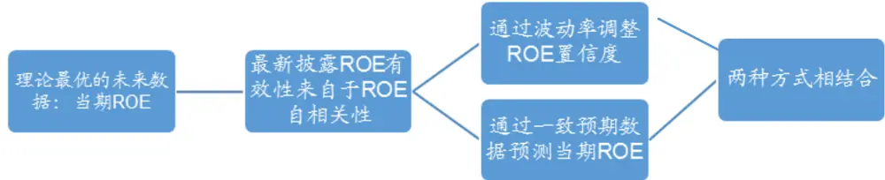
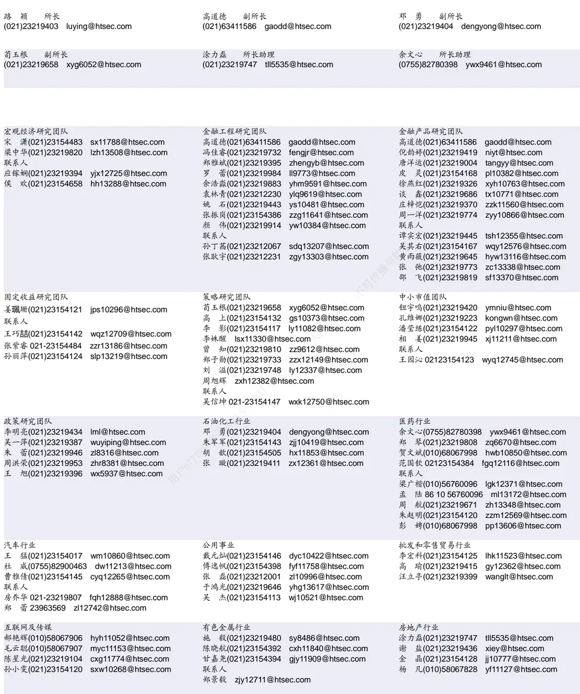

## [Tab相关研究

[Table_ReportInfo]《“畜”锐“养”精——国泰养殖 ETF 投资价值分析》2021.03.05

《力争上“游”——国泰游戏 ETF投资价值分析》2021.03.04

《当“固收+”遇见量化策略，会擦出怎样的火花？——光大锦弘投资价值分析》2021.03.03

分析师:冯佳睿

Tel:(021)23219732

Email:fengjr@htsec.com

证书:S0850512080006

分析师:余浩淼

Tel:(021)23219883

Email:yhm9591@htsec.com

证书:S0850516050004

# 选股因子系列研究（七十三）——使用基本面逻辑改进 ROE因子

## [Table_Sum投资要点：

常用的最新披露 明显滞后于当期真实 ，选股效果大打折扣。基本面因子在多因子模型中的重要性越来越高，但由于财报发布时点的关系，我们无法及时获得当期真实 ，替代方案是采用最新披露 。然而，时间上的大幅滞后使得最终的选股效果，距理想情况相去甚远。因此，利用各类数据和手段，提升预测当期真实 O 的精度和可靠性，是改进 O 因子选股效果的有效途径。

结合一致预期 与波动率加权，可大幅提高对当期真实 的预测能力。在最新披露 的基础上，加入一致预期 这一增量信息，可以大幅提升了对当期真实 的预测精度。同时，通过研究股票历史 波动率对当期真实O 预测效果的影响，采用波动率加权的方式进一步增强了对当期真实 O 的预测能力。回测结果表明，通过上述两步构建的新 ROE 因子，选股能力大幅提高。相比传统的最新披露 ROE，因子 IC 与月均溢价均有 50%左右的提升，更接转近理论上最优的当期真实 的效果。

相比通过单纯的数据挖掘寻找因子，以更强的基本面逻辑为媒介构建的因子，或不许会有更好的效果和稳定性。本文提供了一种改进基本面指标选股效果的思路，用，即首先力求获得对当期未公布的真实财务数据更加精确的预测，再使用该预测值部进行选股。相比通过单纯的数据挖掘寻找因子，以更强的基本面逻辑为媒介构建的因子，或许会有更好的效果和稳定性。因而，值得进一步研究和推广。

- 风险提示。市场系统性风险、模型误设风险、有效因子变动风险。载，

随着 A股市场有效性逐步提升，绩优股表现越发优异。从因子角度来看，衡量公司业绩的 ROE因子，得到越来越多投资者的重点关注。因此，更加精细化地分析和使用ROE 因子，成为了寻找市场 alpha 的重要方向。

## 1. ROE选股效果初探

## 1.1最新披露 ROE与当期真实 ROE的选股效果对比

是最常见的基本面选股指标，在量化模型中也有着重要应用。例如，在构建月度换仓的组合时，我们期望用 ROE 指标找到过去一个月业绩较好的公司，从而获得这些公司未来一个月的市场溢价。然而，由于业绩披露规则原因，通常我们只能将最新披露的财务报告上的 ROE信息作为因子使用，而这种方式可能存在以下缺陷。

财务报告所披露的业绩信息反映的是刚刚过去的那个季度的公司经营情况，但发布时点通常会滞后至少一个月，年报则甚至会滞后 4个月。利用该信息作为因子值，无法反应过去一个月的实际经营状况。

上年年报往往与当年一季报同期发布，因此在上年 10 月份后，会出现长达 5到 6 个月的财报空窗期。在此期间，我们只能长期使用上年三季报的信息。

理论上来说，如果在月底就可获得当月所在财报期的财务数据，那么选股效果应该有明显提升。例如，在 7 月底即使用基于三季报财务信息，而非半年报财务信息构建的ROE 因子。

将上述理论最优的当期真实ROE与常用的最新披露ROE分别对行业，市值中性化，再剥离反转、换手、非流动性与特质波动四个常用技术面因子影响后，其选股表现如下表所示。

表 1 最新披露 ROE 与当期真实 ROE 的选股效果（2013.01-2020.09）

|  | 全市场 |  |  | 沪深 300 |  |  | 中证 500 |  |  |
| --- | --- | --- | --- | --- | --- | --- | --- | --- | --- |
|  | IC 均值 | IC-IR | IC 胜率 | IC 均值 | IC-IR | IC 胜率 | IC 均值 | IC-IR | IC 胜率 |
| 最新披露 ROE_TTM | 0.013 | 1.103 | 57.0% | 0.014 | 0.582 | 58.1% | 0.014 | 0.901 | 60.2% |
| 最新披露 ROE_单季度 | 0.024 | 2.119 | 71.0% | 0.029 | 1.277 | 65.6% | 0.035 | 2.045 | 69.9% |
| 当期真实 ROE_TTM | 0.032 | 2.360 | 80.6% | 0.036 | 1.365 | 63.4% | 0.032 | 1.718 | 63.4% |
| 当期真实 ROE_单季度 | 0.056 | 3.411 | 79.6% | 0.061 | 2.669 | 76.3% | 0.063 | 2.907 | 81.7% |

资料来源：Wind，海通证券研究所

由上表可见，无论是采用季度滑动平均的处理方式，还是单季度的值，当期真实 ROE的选股效果均显著优于最新披露 ROE。我们猜想，这种差异可能是因为，从当年发布三季报到次年发布年报之间的财报空窗期，一直使用的是三季报披露的 ROE，未能及时更新公司的经营状况，从而导致选股效果下滑。

另一方面，虽然最新披露的 ROE 存在不同程度的滞后，但依然不失为一个较为有效的选股因子。我们猜测，这可能来自于公司业绩的动量效应。即，上个季度 ROE更高的公司，投资者预期或更有可能依然保持更优的经营业绩。

下面，我们逐一验证上述两个猜测，并提出改进 ROE因子使用方法的思路。

## 1.2财报空窗期对最新披露 ROE 选股效果的影响

为了分析财报空窗期对最新披露 ROE选股效果的影响，我们将受影响最为明显的2-4 月剔除，再考察最新披露 ROE 与当期真实 ROE的选股效果，结果如下表所示。

表 2 最新披露 ROE 与当期真实 ROE 的选股效果（2013.01-2020.09，剔除每年 2-4 月）

|  | 全市场 |  |  |  | 沪深300 |  |  |  |
| --- | --- | --- | --- | --- | --- | --- | --- | --- |
|  | IC 均值 | IC-IR | IC 胜率 | IC 均值 | IC-IR | IC 胜率 | 中证500 IC 均值 IC-IR | IC 胜率 |
| 最新披露 ROE_TTM | 0.015 | 1.230 | 58.0% | 0.013 | 0.538 | 58.0% | 0.014 0.902 | 59.4% |
| 最新披露 ROE_单季度 | 0.026 | 2.277 | 75.4% | 0.028 | 1.199 63.8% | 0.035 | 2.088 | 71.0% |
| 当期真实 ROE_TTM | 0.030 | 2.223 | 78.3% | 0.032 | 1.222 60.9% | 0.030 | 1.588 | 60.9% |
| 当期真实 ROE_单季度 | 0.053 | 3.409 | 79.7% | 0.054 | 2.401 73.9% | 0.061 | 2.862 | 78.3% |

资料来源：Wind，海通证券研究所

和表 1的结果对比后可发现，剔除 2-4月的财报空窗期，对最新披露 ROE和当期真实 ROE的 IC、IC-IR、胜率，影响均不显著。因此，我们认为，财报空窗期并不是造成最新披露 ROE与当期真实 ROE 选股效果巨大差异的主要原因。

## 1.3最新披露 ROE的选股效果可能来自业绩动量

如果公司业绩存在动量效应，那么 ROE会呈现较为明显的自相关性。因此，我们分别计算了每家上市公司的季度滑动平均 ROE与单季度 ROE的自相关系数，并求它们的平均，如下表所示。

表 3 ROE 自相关系数（2012.09-2020.09）

|  | 全市场 |  | 沪深300 |  | 中证500 |  |
| --- | --- | --- | --- | --- | --- | --- |
|  | ROE_TTM | 单季度 ROE | ROE_TTM | 单季度 ROE | ROE_TTM | 单季度 ROE |
| 整体 | 0.858 | 0.510 | 0.948 | 0.562 | 0.909 | 0.556 |
| 一季报与半年报 | 0.923 | 0.603 | 0.957 | 0.653 | 0.953 | 0.616 |
| 半年报与三季报 | 0.949 | 0.657 | 0.969 | 0.704 | 0.962 | 0.727 |
| 三季报与年报 | 0.626 | 0.430 | 0.908 | 0.510 | 0.784 | 0.473 |
| 年报与次年一季报 | 0.932 | 0.349 | 0.957 | 0.383 | 0.936 | 0.409 |

资料来源：Wind，海通证券研究所

由于包含共同三个季度的信息， O 季度滑动平均自相关系数高达 ，这不足为奇。然而，单季度 ROE的自相关系数也高达 0.55。这表明，ROE 确实具有较强的自相关性，即，公司业绩存在较强的动量效应。

进一步，为了验证最新披露 ROE 的选股有效性是否主要来自业绩动量，我们使用正交的方式。把最新披露 ROE和当期真实 ROE互相正交，考察剔除动量效应影响后，最新披露 ROE的表现，结果如下表所示。

表 4 剔除自相关影响的最新披露 ROE 的选股效果（2013.01-2020.09）

|  |  |  | 全市场 |  |  | 沪深 300 |  |  | 中证500 |  |  |
| --- | --- | --- | --- | --- | --- | --- | --- | --- | --- | --- | --- |
|  |  | IC 均值 | IC-IR | IC 胜率 | IC 均值 | IC-IR | IC 胜率 | IC 均值 |  | IC-IR | IC 胜率 |
| 最新披露 V.S | ROE_TTM | -0.033 | -2.700 |  | 22.6% | -0.045 | -2.248 | 25.8% | -0.045 | -2.569 | 21.5% |
| 当期真实 | ROE单季度 | -0.008 | -0.663 | 47.3% | -0.006 | -0.288 |  | 44.1% | -0.011 | -0.703 | 38.7% |
| 当期真实 V.S | ROE_TTM | 0.046 | 3.409 | 82.8% |  | 0.056 | 2.629 | 78.5% | 0.057 | 2.873 | 81.7% |
| 最新披露 | ROE单季度 | 0.050 | 3.470 | 84.9% | 0.044 | 2.448 | 80.6% |  | 0.052 | 2.605 | 76.3% |

资料来源：Wind，海通证券研究所

ROE_TTM 的自相关性高，最新披露 ROE_TTM 和当期真实 ROE_TTM 正交，等同于用去年同期 ROE单季度值减今年 ROE单季度值，即当期单季度 ROE相比较去年的减少量。因此，正交后的季度滑动平均 ROE呈现显著的负向选股效果。即，ROE下降越少的公司，预期收益更高。反过来，如果用当期真实 ROE_TTM 对最新披露ROE_TTM正交，则代表当期真实 ROE相比去年同期的增量，呈现显著的正向选股效果。

进一步观察单季度 ROE正交后的效果，如果用最新披露 ROE 对当期真实 ROE正交，即剥离最新披露 ROE中包含的动量成分，选股能力几乎完全消失，IC接近于 0。这表明，最新披露 ROE蕴含尚未披露的当期真实 ROE的部分信息，前者可以作为后者的一个预测值。

但是，从当期真实 ROE对最新披露 ROE正交后的结果来看，这种预测效果并不理想。正交后的当期真实 ROE虽然选股效果有所下滑，但依然非常可观。这表明，当期真实 ROE中，仍有大量对选股有用的信息未被业绩动量所解释。如果能有更好的方式预测这部分信息，应当可以进一步提升 ROE的选股效果。

因此，我们首先考察最容易想到的分析师一致预期数据，能否有助于解决上述预测问题。

## 2. 结合一致预期 ROE的当期真实 ROE预测

## 2.1一致预期 ROE与当期真实 ROE的相关性

朝阳永续一致预期 ROE是目前较为常用的一类 ROE预测指标。该预测指标每日均有数据更新，可以较为及时地反映上市公司经营情况的变化。为了保证数据的可靠性，朝阳永续在加工一致预期数据时，基于不同机构的影响力对相关业绩预期数据进行加权。并要求过去 90日中，必须有至少 5家机构给出评级。如某股票不满足上述要求，其一致预期 ROE将作缺失值处理。

首先，考察一致预期 ROE与当期真实 ROE的相关性，这也是判断前者是否可以成为一个预测指标的基础。

表 5 一致预期 ROE 与当期真实 ROE 的相关性（2013.01-2020.09）

| 仅供 | 全市场 | 沪深300 | 中证500 |
| --- | --- | --- | --- |
| 一致预期 ROE | 0.636 | 0.683 | 0.648 |
| 最新披露 ROE_单季度 | 0.512 | 0.540 | 0.512 |
| 一致预期 ROE 和最新披露 ROE_单季度正交后 | 0.412 | 0.432 | 0.415 |

资料来源：Wind，朝阳永续，海通证券研究所

由上表可见，一致预期 ROE与当期真实 ROE的相关性在 0.6-0.7 之间，显著高于最新披露的单季度 ROE。进一步，将一致预期 ROE与最新披露单季度 ROE正交，所得的因子与当期真实 ROE的相关性依然在 0.4 以上。这些结果似乎表明，一致预期 ROE是一个更好的预测指标。那么它的选股效果如何，下表给出了具体结果。

表 6 一致预期 ROE 与最新披露 ROE 的选股效果（2013.01-2021.02）

|  |  |  | 全市场 沪深300 |  |  | 中证500 |  |  |  |
| --- | --- | --- | --- | --- | --- | --- | --- | --- | --- |
|  |  | IC 均值 | IC-IR | IC 胜率 | IC 均值 | IC-IR IC 胜率 | IC 均值 | IC-IR | IC 胜率 |
| 行业、市值中性 | 一致预期 | 0.018 | 0.930 | 61.2% | 0.016 | 0.588 58.2% | 0.020 | 0.847 | 56.1% |
|  | 最新披露 | 0.023 | 1.818 | 69.4% | 0.030 1.158 | 61.2% | 0.035 | 1.821 | 63.3% |
|  | 一致预期 | 0.011 | 0.583 | 54.1% | 0.010 | 0.361 | 49.0% | 0.013 0.526 | 55.1% |
| 技术、估值、市 值、行业中性 | 最新披露 | 0.026 | 2.212 | 69.4% | 0.032 | 1.440 | 67.3% 0.039 | 2.164 | 68.4% |

资料来源：Wind，朝阳永续，海通证券研究所

遗憾的是，一致预期 ROE的选股效果并不理想。市值与行业中性化后，一致预期ROE 的 IC 均小于 0.02，且显著低于最新披露 ROE。如果进一步和估值、反转、换手、特质波动与非流动性正交后，IC 下降至 0.01 左右，几乎完全失去选股能力。

我们猜测，发生上述现象的可能原因是，卖方分析师更倾向于发布前期涨幅好，市场关注度高的股票的研究报告。因此，一致预期 ROE更易受到股票近期表现的影响，在和常用技术面因子与估值因子正交后，选股效果明显下降。

此外，朝阳永续在构建一直预期 ROE时，要求 90日内必须有至少有 5家机构给出评级。虽然该要求可在一定程度上防止一致预期数据受少数机构偏差的影响，但也大大降低了一致预期 ROE数据的覆盖范围。

如下图所示，朝阳永续一致预期 ROE在全市场中的覆盖度只有 30%-40%之间，在中证 500 中的覆盖度约为 50%。即使是在市值最大的沪深 300 中，也未实现全覆盖，覆盖度约为 80%。

图1 朝阳永续一致预期 ROE的覆盖度

资料来源：朝阳永续，海通证券研究所

卖方分析师的行为特征以及较低的覆盖度，使得一致预期 ROE作为当期真实 ROE的预测值，并进一步用作选股因子的效果并不理想。但是，根据上面的相关性分析也可发现，一致预期 ROE包含了最新披露 ROE不具备的有关当期真实 ROE的信息。因此，我们可以同时使用一致预期 ROE与最新披露 ROE，预测当期真实 ROE，作为新的选股因子。

## 2.2用一致预期 ROE与最新披露 ROE 预测当期真实 ROE

在预测当期真实 ROE时，我们使用过去 12 个月月末的一致预期 ROE，以及每个月末对应的最新披露 ROE和当期真实 ROE，建立回归模型。例如，在每年 1月，能获取到的最新披露 ROE为上年三季报的财务数据，因此所用到的样本为上年 9月及往前12 个月对应的一致预期 ROE、最新披露 ROE和当期真实 ROE。在得到回归方程后，将最新的一致预期 ROE与最新披露 ROE代入，得到当期真实 ROE 的预测值。

在检验上述预测值用作选股时的效果前，我们先来考察一下，同时使用一致预期与最新披露 ，是否比单独使用最新披露 提升了预测精度。如下表所示，不论是从 MAE、RMSE还是 R-Square 的角度，结合后的预测效果都有所提升。

表 7 不同当期真实 ROE 预测模型的预测误差（2013.01-2020.09）

|  | 全市场 |  | 沪深300 |  | 中证500 |  |
| --- | --- | --- | --- | --- | --- | --- |
|  | 最新披露 ROE | 最新披露 ROE+一 致预期 ROE | 最新披露 ROE | 最新披露 ROE+一 致预期 ROE | 最新披露 ROE | 最新披露 ROE+一 致预期 ROE |
| MAE | 1.415 | 1.246 | 1.528 | 1.375 | 1.441 | 1.307 |
| RMSE | 3.334 | 2.245 | 2.451 | 2.059 | 2.668 | 2.116 |
| R-Square | -1.843 | 0.149 | 0.074 | 0.379 | -0.437 | 0.287 |

资料来源： ，朝阳永续，海通证券研究所

当我们能够更加准确地预测当期真实 ROE时，可以预期利用该预测值作为因子，可以获得更好地选股效果。如下表所示，无论是从因子 IC 还是多空收益的角度来看，在任何一个选股空间内，使用最新披露 ROE和当期真实 ROE得到的预测值，都优于最新披露 ROE。

表 8 预测当期 ROE 的选股效果（2013.01-2021.02）

| 因子类型 | 因子名称 | IC 均值 | IC-IR | IC 胜率 | 多空收益 | 多头收益 | 空头收益 |
| --- | --- | --- | --- | --- | --- | --- | --- |
| 全市场 | 最新披露 ROE | 0.026 | 2.212 | 69.4% | 1.11% | 0.44% | -0.67% |
|  | 预测当期 ROE | 0.033 | 2.117 | 75.5% | 1.37% | 0.47% | -0.90% |
| 沪深 300 | 最新披露 ROE | 0.032 | 1.440 | 67.3% | 0.88% | 0.52% | -0.36% |
|  | 预测当期 ROE | 0.037 | 1.422 | 67.3% | 1.03% | 0.58% | -0.45% |
| 中证500 | 最新披露 ROE | 0.039 | 2.164 | 68.4% | 1.29% | 0.59% | -0.70% |
|  | 预测当期 ROE | 0.042 | 1.929 | 67.3% | 1.44% | 0.66% | -0.78% |

资料来源：Wind，朝阳永续，海通证券研究所

进一步将上述预测值与规模、行业、市值、中盘、换手率、反转、波动、估值一同放入多元回归模型，计算因子溢价。由以下图表可见，其选股效果同样优于传统的最新披露 ROE。当季预测 ROE的月均溢价为 33bps，高于最新披露 ROE的 26bps，月度胜率也从 69.4%提高至 75.5%。分年度来看，除 2014 年外，当季预测 ROE的年度月均溢价均高于最新披露 ROE，且 2017 年以来的提升效果尤为明显。

图2 预测当期 ROE和最新披露 ROE的累计因子溢价

资料来源：Wind，朝阳永续，海通证券研究所

表 9 预测当期 ROE 的分年度因子溢价（2013.01-2021.02）

|  | 月均溢价 | 月度胜率 | 2013 | 2014 | 2015 | 2016 | 2017 | 2018 | 2019 | 2020 | 2021 |
| --- | --- | --- | --- | --- | --- | --- | --- | --- | --- | --- | --- |
| 最新披露 ROE | 0.26% | 69.4% | 0.12% | -0.07% | 0.29% | 0.18% | 0.58% | 0.29% | 0.30% | 0.25% | 0.97% |
| 预测当期 ROE | 0.33% | 75.5% | 0.27% | -0.21% | 0.32% | 0.20% | 0.75% | 0.37% | 0.40% | 0.40% | 1.13% |

资料来源： ，朝阳永续，海通证券研究所

## 3. ROE高波动股票对当期真实 ROE预测效果的影响

## 3.1剔除 ROE高波动股票后的最新披露 ROE 的选股效果

由前文的分析可知，最新披露 ROE的选股有效性一定程度上源自业绩动量。但是，如果某个公司的 ROE波动较大，那么使用最新披露 ROE预测当期真实 ROE的效果就会大打折扣。因此，我们猜测，如果剔除历史 ROE波动较高的股票，那么把剩余股票的最新披露 ROE作为当期真实 ROE的预测值时，精度也能获得提高，并最终改善选股效果。

计算最新披露 ROE所对应季度之前的四个季度的 ROE滑动平均值，将其标准差作为 ROE 的波动指标。使用连续四个季度的 ROE滑动平均，可以反映两个会计年度间的同比变化，相当于包含 8 个季度的 ROE信息。同时，也克服了某些行业的 ROE因季节性存在的高波动特征。由于上市公司不披露上市前除年报外其他报告期的财务信息。因此，只有上市满两年的公司才能计算 ROE波动指标，导致覆盖度有所下降。

ROE波动指标有厚尾特征，故在剔除 ROE高波动的股票时，采用了聚类方法。具体而言，利用 K-Median算法将波动指标聚集为 20 组，剔除聚类中心点大于 0.1 的分组中的股票。下表展示了剔除前后的最新披露 ROE对当期真实 ROE 的预测误差。

表 10 剔除 ROE 高波动股票前后，对当期真实 ROE 的预测误差（2012.09-2020.09）

|  | 全市场 |  | 沪深300 |  | 中证500 |  |
| --- | --- | --- | --- | --- | --- | --- |
|  | 最新披露 ROE | 剔除 ROE 高波动 股票 | 最新披露 ROE | 剔除 ROE 高波动 股票 | 最新披露 ROE | 剔除 ROE 高波动 股票 |
| MAE | 1.415 | 1.357 | 1.528 | 1.505 | 1.441 | 1.392 |
| RMSE | 3.334 | 2.585 | 2.451 | 2.380 | 2.668 | 2.344 |
| R-Square | -1.843 | -0.393 | 0.074 | 0.056 | -0.437 | -0.030 |

资料来源： ，海通证券研究所

由上表可见，剔除 ROE高波动股票后，剩余股票的最新披露 ROE 对当期真实 ROE的预测精度在全市场中有显著提升，但在沪深 与中证 中的提升效果并不明显。这是因为，中证 800 外的股票 ROE 波动性更大，剔除那些高波动的股票能产生较为明显的改善。而中证 800 内的股票业绩稳定性较高，自然剔除前后的差异较小。

下表展示了剔除 ROE高波动股票后，最新披露 ROE的选股效果。

表 11 剔除 ROE 高波动股票后，最新披露 ROE 的选股效果（2013.01-2021.02）

|  | 全市场 |  |  | 沪深300 |  |  | 中证500 |  |  |
| --- | --- | --- | --- | --- | --- | --- | --- | --- | --- |
|  | IC 均值 | IC-IR | IC 胜率 | IC 均值 | IC-IR | IC 胜率 | IC 均值 | IC-IR | IC 胜率 |
| 最新披露 ROE | 0.026 | 2.212 | 70.1% | 0.032 | 1.440 | 68.0% | 0.039 | 2.164 | 69.1% |
| 剔除 ROE 高波动股票 | 0.030 | 2.354 | 77.3% | 0.031 | 1.431 | 66.0% | 0.039 | 2.240 | 71.1% |

资料来源：Wind，海通证券研究所

和表 10中预测误差的结果一致，剔除 ROE高波动股票后，对全市场范围内 IC的提升最为显著，而对应沪深 300 和中证 500 的影响几乎可以忽略。

上述分析表明，ROE高波动股票会对最新披露 ROE的选股效果产生明显的负向干扰。换句话说，那些 ROE波动率高的股票，最新披露 ROE对当季最新 ROE的预测臵信度较低，从而进一步影响其选股臵信度。

直接剔除 ROE高波动股票的方式过于简单粗暴，不仅会缩小选股范围，而且依赖对高波动股票的认定，具有较强的参数敏感性。我们需要更加温和的方法。

## 3.2ROE 波动率倒数加权后的最新披露 ROE 的选股效果

借鉴资产配臵模型中，波动率倒数加权的思想，我们尝试利用 滑动平均值的波动率倒数作为最新披露 ROE的权重，得到当期真实 ROE的新预测值。下表为波动率倒数加权前后，最新披露 ROE对当期真实 ROE的预测误差。

表 12 波动率倒数加权的最新披露 ROE对当期真实 ROE的预测误差（2013.01-2020.09）

|  | 全市场 |  | 沪深300 | 中证500 |
| --- | --- | --- | --- | --- |
|  | 原始值 | 1.415 | 1.528 | 1.441 |
| MAE RMSE | 波动率倒数加权 | 1.313 | 1.442 | 1.352 |
|  | 原始值 | 3.334 | 2.451 | 2.668 |
|  | 波动率倒数加权 | 2.598 | 2.299 | 2.382 |
|  | 原始值 | -1.843 | 0.074 | -0.437 |
| R-Square | 波动率倒数加权 | -0.498 | 0.082 | -0.179 |

资料来源：Wind，海通证券研究所

经过波动率倒数加权后，最新披露 ROE对当期真实 ROE的预测误差显著小于原始值。这表明，通过减小预测臵信度较低，即 ROE波动率较高的股票的 ROE值，可以提升整体的预测效果。

在选股时，我们以如下方式调整股票的最新披露 ROE，目标是使预测臵信度较低的股票的最新披露 ROE更接近市场均值，从而降低这部分股票的最新披露 ROE对选股的影响。

首先，计算新披露 ROE对应报告期前 4个报告期的季度滑动平均 ROE的标准差，以该标准差倒数的自然对数作为权重。其次，将每个股票的权重除以所有股票权重的均值，得到权重调整因子。第三，将每个股票的最新披露 ROE减去所有股票最新披露 ROE的均值，再乘以相应的权重调整因子，作为波动率调整 ROE。最后，将每个股票的波动率调整 ROE减去波动率调整 ROE 的最小值，保证调整后的 ROE 为正。

波动率调整后的最新披露 ROE 的选股效果如下表所示。

表 13 波动率调整后的最新披露 ROE 的选股效果（2013.01-2021.02）

| 全市场 |  | IC 均值 | IC-IR | IC 胜率 | 多空收益 | 多头收益 | 空头收益 |
| --- | --- | --- | --- | --- | --- | --- | --- |
|  | 最新披露 ROE | 0.026 | 2.212 | 69.4% | 1.11% | 0.44% | -0.67% |
|  | 波动率调整 ROE | 0.030 | 2.388 | 77.6% | 1.18% | 0.54% | -0.64% |
|  | 最新披露 ROE | 0.032 | 1.440 | 67.3% | 0.88% | 0.52% | -0.36% |
|  | 波动率调整 ROE | 0.034 | 1.595 | 69.4% | 0.76% | 0.59% | -0.18% |
| 中证500 | 最新披露 ROE | 0.039 | 2.164 | 68.4% | 1.29% | 0.59% | -0.70% |
|  | 波动率调整 ROE | 0.041 | 2.340 | 70.4% | 1.21% | 0.66% | -0.55% |

资料来源：Wind，海通证券研究所

经波动率调整后，最新披露 的 、 和胜率相比原始值均有不同程度的提升。另外，值得注意的是，由于那些最新披露 ROE很高，但 ROE的历史波动也很大的股票被调整至市场平均水平，最新披露 ROE较高的股票整体变得更加稳定，因而多头收益也出现了明显的提高。

## 3.3波动率调整后的当期真实 ROE 预测值的选股效果

在 3.1 节中，我们联合使用最新披露 ROE和一致预期 ROE预测当期真实 ROE，显著降低了预测误差。3.2 节则是从预测可靠性的角度，通过对最新披露 ROE进行波动率调整，同样实现了预测精度的提升。本节将上述两种方法结合起来，考察是否能获得进一步的改进。

下表展示了对使用最新披露 ROE 和一致预期 ROE得到的预测值，再进行波动率调整后，相对当期真实 ROE的预测误差。

表 14 波动率调整后的当期真实 ROE预测值的预测误差（2013.01-2020.09）

| MAE | 预测方法 | 全市场 | 沪深300 | 中证500 |
| --- | --- | --- | --- | --- |
|  | 最新披露 ROE+一致预期 ROE | 1.246 | 1.375 | 1.307 |
|  | 波动率调整+最新披露 ROE+一致预期 ROE | 1.178 | 1.311 | 1.242 |
| RMSE | 最新披露 ROE+一致预期 ROE | 2.245 | 2.059 | 2.116 |
|  | 波动率调整+最新披露 ROE+一致预期 ROE | 1.972 | 1.942 | 1.968 |
| R-Squared | 最新披露 ROE+一致预期 ROE | 0.149 | 0.379 | 0.287 |
|  | 波动率调整+最新披露 ROE+一致预期 ROE | 0.233 | 0.377 | 0.284 |

资料来源：Wind，朝阳永续，海通证券研究所

显然，对预测值再进行波动率调整，进一步降低了预测误差，对当期真实 ROE的预测也更为精准。因此，有理由相信，将其作为因子，应当能获得更好的选股效果。

下表展示了 5种当期真实 ROE 的不同预测方法，对应的因子 IC等业绩指标。这 5种方法依次为：最新披露 ROE、波动率调整后的最新披露 ROE、（最新披露 ROE+一致预期 ROE）联合预测、波动率调整后的【（最新披露 ROE+一致预期 ROE）联合预测）】、（波动率调整后的最新披露 ROE+一致预期 ROE）联合预测。

表 15 5 种当期真实 ROE 预测方法的选股效果（2013.01-2021.02）

|  | 因子名称 | IC 均值 | IC-IR | IC 胜率 | 多空收益 | 多头收益 | 空头收益 |
| --- | --- | --- | --- | --- | --- | --- | --- |
| 全市场 | 当期真实 ROE（2013.01-2020.09） | 0.056 | 3.411 | 79.6% | 2.47% | 1.30% | -1.17% |
|  | 最新披露 ROE | 0.026 | 2.212 | 69.4% | 1.11% | 0.44% | -0.67% |
|  | 波动率调整后的最新披露 ROE | 0.030 | 2.388 | 77.6% | 1.18% | 0.54% | -0.64% |
|  | (最新披露 ROE+一致预期 ROE)联合预测 | 0.033 | 2.117 | 75.5% | 1.37% | 0.47% | -0.90% |
|  | 波动率调整后的【(最新披露 ROE+一致预期 ROE）联合预测)】 | 0.038 | 2.198 | 75.5% | 1.38% | 0.54% | -0.84% |
|  | (波动率调整后的最新披露ROE+一致预期 ROE)联合预测 | 0.039 | 2.255 | 74.5% | 1.48% | 0.56% | -0.92% |
| 3000 | 当期真实 ROE（2013.01-2020.09） | 0.054 | 2.401 | 73.9% | 2.08% | 1.22% | -0.86% |
|  | 最新披露 ROE | 0.032 | 1.440 | 67.3% | 0.88% | 0.52% | -0.36% |
|  | 波动率调整后的最新披露 ROE | 0.034 | 1.595 | 69.4% | 0.76% | 0.59% | -0.18% |
|  | (最新披露 ROE+一致预期 ROE)联合预测 | 0.037 | 1.422 | 67.3% | 1.03% | 0.58% | -0.45% |
|  | 波动率调整后的【(最新披露ROE+一致预期 ROE）联合预测)】 | 0.037 | 1.505 | 67.3% | 0.74% | 0.47% | -0.27% |
|  | (波动率调整后的最新披露 ROE+一致预期 ROE)联合预测 | 0.038 | 1.509 | 67.3% | 0.95% | 0.62% | -0.33% |
| 中证 500 | 当期真实 ROE（2013.01-2020.09） | 0.061 | 2.862 | 78.3% | 2.16% | 1.42% | -0.74% |
|  | 最新披露 ROE | 0.039 | 2.164 | 68.4% | 1.29% | 0.59% | -0.70% |
|  | 波动率调整后的最新披露 ROE | 0.041 | 2.340 | 70.4% | 1.21% | 0.66% | -0.55% |
|  | (最新披露 ROE+一致预期 ROE)联合预测 | 0.042 | 1.929 | 67.3% | 1.44% | 0.66% | -0.78% |
|  | 波动率调整后的【(最新披露 ROE+一致预期 ROE）联合预测)】 | 0.043 | 1.973 | 71.4% | 1.34% | 0.70% | -0.63% |
|  | (波动率调整后的最新披露ROE+一致预期 ROE)联合预测 | 0.044 | 2.015 | 69.4% | 1.38% | 0.66% | -0.72% |

资料来源： ，朝阳永续，海通证券研究所

由上表可见，随着预测方法的改进，IC不断获得提升。不论是何种选股空间，最后两种方法的 IC都是最高的。这种提升在全市场中更为明显，将（波动率调整后的最新披露 O 一致预期 O ）联合预测值作为因子，相比最简单的最新披露 O ， C 上升了 50%，多空/多头/空头的收益同样得到显著改善。

将上述 5个因子逐一加入包含规模、行业、市值、中盘、换手率、反转、波动、估值的回归模型，获得各自的因子溢价，如以下图表所示。结论和 IC分析一致，后两种方法的改进效果显著，尤其是 2016 年以来。

图3 5种当期真实 ROE预测方法的因子溢价累计净值

资料来源： ，朝阳永续，海通证券研究所

表 16 5 种当期真实 ROE 预测方法的分年度月均溢价（2013.01-2021.02）

|  | 月均溢价 | 月均胜率 | 2013 | 2014 | 2015 | 2016 | 2017 | 2018 | 2019 | 2020 | 2021 |
| --- | --- | --- | --- | --- | --- | --- | --- | --- | --- | --- | --- |
| 最新披露 ROE | 0.26% | 69.4% | 0.12% | -0.07% | 0.29% | 0.18% | 0.58% | 0.29% | 0.30% | 0.25% | 0.97% |
| 波动率调整后的最新披露 ROE | 0.30% | 77.6% | 0.12% | -0.04% | 0.26% | 0.27% | 0.56% | 0.40% | 0.38% | 0.34% | 1.01% |
| (最新披露 ROE+一致预 期 ROE）联合预测 波动率调整后的【(最新披 | 0.33% | 75.5% | 0.27% | -0.21% | 0.32% | 0.20% | 0.75% | 0.37% | 0.40% | 0.40% | 1.13% |
| 露 ROE+一致预期 ROE) 联合预测)】 (波动率调整后的最新披 | 0.37% | 75.5% | 0.28% | -0.21% | 0.28% | 0.31% | 0.72% | 0.48% | 0.45% | 0.49% | 1.13% |
| 露 ROE+一致预期 ROE) 联合预测 | 0.38% | 74.5% | 0.28% | -0.20% | 0.30% | 0.31% | 0.75% | 0.49% | 0.47% | 0.50% | 1.16% |

资料来源：Wind，朝阳永续，海通证券研究所

## 4. ROE的波动指标在行业中的差别

在研究 的波动率对预测当期真实 影响程度的过程中，我们发现，波动率的高低具备一定的行业特征。例如，在传统的周期行业——有色金属、房地产、煤炭、钢铁中，被聚类方法认定为是极端波动率的公司占比较高，且波动率加权后，行业内公司平均权重超过全市场所有股票平均权重的幅度也更大。这主要是因为，（1）周期行业的经营受金融周期的影响，易出现盈利水平的大幅波动。（2）行业内部分化度较低，所有公司易发生同向变动。

图4 ROE 波动率极端值的占比和波动率权重偏离均值的幅度

资料来源：Wind，海通证券研究所

不过，也有部分行业的高极端值占比并不一定能用经济周期解释。例如，传媒行业中也有相当比例的 ROE高波动公司。通过和行业分析师的交流，我们猜测，这可能与传媒行业普遍的高商誉以及通常采用基于 PE的商誉估值方法有关。

为此，我们考察了 2016 年以来，传媒行业商誉占比与波动率权重的相关性，结果如下表所示。传媒行业商誉占比与 ROE波动率权重的相关性显著高于全市场，即，商誉占比对传媒公司业绩波动的影响更大。

表 17 传媒行业商誉占比与 ROE 波动率权重的相关性（2016.03-2020.12）

|  | 相关系数均值 | T值 |
| --- | --- | --- |
| 传媒 | 0.289 | 4.219 |
| 全市场 | 0.200 | 4.436 |

资料来源： ，海通证券研究所

由下图可见，传媒行业的商誉占比和 ROE波动的相关性在绝大部分时间上都大于零。而且，随着 2018 年开始的对商誉减值的严监管，这种相关性快速上升。因此，我们认为，商誉占比可能是导致传媒行业 ROE波动的重要原因。

图5 传媒行业商誉占比与 ROE波动率权重的相关系数变化

资料来源：Wind，海通证券研究所

通过对周期行业和传媒行业的分析，可以发现，不同行业产生 ROE波动的原因可能各不相同。进一步深入每个行业研究业绩波动的来源，或许能够找到更好的预测 ROE的方案。

## 5. 总结与讨论

基本面因子在多因子模型中的重要性越来越高，但由于财报发布时点的关系，我们无法及时获得当期真实 ，替代方案是采用最新披露 。然而，时间上的大幅滞后使得最终的选股效果，距理想情况相去甚远。因此，利用各类数据和手段，提升预测当期真实 ROE的精度和可靠性，是改进 ROE因子选股效果的有效途径。

本文在最新披露 的基础上，加入一致预期 这一增量信息，大幅提升了对当期真实 的预测精度。同时，通过研究股票历史 波动率对当期真实 预测效果的影响，采用波动率加权的方式进一步增强了对当期真实 ROE 的预测能力。回测结果表明，通过上述两步构建的新 ROE因子，选股能力大幅提高。相比传统的最新披露 ROE，因子 IC与月均溢价均有 50%左右的提升，更接近理论上最优的当期真实ROE 的效果。

虽然本文提出的方法相比原始的最新披露 ROE，在效果上有了实质性的提高，但和理论最优的当期真实 ROE的选股效果比较，仍有较大的提升空间。

此外，简单分析表明，不同行业的公司出现 ROE大幅波动的原因也有着很大的差异。如果能深入每个行业，建立独特的 ROE预测方案，或许能有更好的表现。

图 使用基本面思维改进 选股效果的逻辑链条

资料来源：海通证券研究所整理

本文提供了一种改进基本面指标选股效果的思路，即首先力求获得对当期未公布的真实财务数据更加精确的预测，再使用该预测值进行选股。相比通过单纯的数据挖掘寻找因子，以更强的基本面逻辑为媒介构建的因子，或许会有更好的效果和稳定性。因而，值得进一步研究和推广。

## 6. 风险提示

市场系统性风险、模型误设风险、有效因子变动风险。

# 信息披露

分析师声明

[Table冯佳睿yst金融工程研究团队s]

余浩淼金融工程研究团队

本人具有中国证券业协会授予的证券投资咨询执业资格，以勤勉的职业态度，独立、客观地出具本报告。本报告所采用的数据和信息均来自市场公开信息，本人不保证该等信息的准确性或完整性。分析逻辑基于作者的职业理解，清晰准确地反映了作者的研究观点，结论不受任何第三方的授意或影响，特此声明。

## 法律声明

本报告仅供海通证券股份有限公司（以下简称“本公司”）的客户使用。本公司不会因接收人收到本报告而视其为客户。在任何情况下，本报告中的信息或所表述的意见并不构成对任何人的投资建议。在任何情况下，本公司不对任何人因使用本报告中的任何内容所引致的任何损失负任何责任。

本报告所载的资料、意见及推测仅反映本公司于发布本报告当日的判断，本报告所指的证券或投资标的的价格、价值及投资收入可能载会波动。在不同时期，本公司可发出与本报告所载资料、意见及推测不一致的报告。

市场有风险，投资需谨慎。本报告所载的信息、材料及结论只提供特定客户作参考，不构成投资建议，也没有考虑到个别客户特殊的可投资目标、财务状况或需要。客户应考虑本报告中的任何意见或建议是否符合其特定状况。在法律许可的情况下，海通证券及其所属不关联机构可能会持有报告中提到的公司所发行的证券并进行交易，还可能为这些公司提供投资银行服务或其他服务。用

本报告仅向特定客户传送，未经海通证券研究所书面授权，本研究报告的任何部分均不得以任何方式制作任何形式的拷贝、复印件或内复制品，或再次分发给任何其他人，或以任何侵犯本公司版权的其他方式使用。所有本报告中使用的商标、服务标记及标记均为本公本司的商标、服务标记及标记。如欲引用或转载本文内容，务必联络海通证券研究所并获得许可，并需注明出处为海通证券研究所，且仅不得对本文进行有悖原意的引用和删改。载，

根据中国证监会核发的经营证券业务许可，海通证券股份有限公司的经营范围包括证券投资咨询业务。日

海通证券股份有限公司研究所[Table_PeopleInfo]

| 电子行业 |  | 煤炭行业 |  | 电力设备及新能源行业 |  |
| --- | --- | --- | --- | --- | --- |
| 周旭辉 zxh12382@htsec.com 李 轩(021)23154652 lx12671@htsec.com |  | 李 淼(010)58067998 戴元灿(021)23154146 | Im10779@htsec.com dyc10422@htsec.com | 张一弛(021)23219402 房 青(021)23219692 | zyc9637@htsec.com fangq@htsec.com |
| 联系人 |  | 王 涛(021)23219760 | wt12363@htsec.com | 曾 彪(021)23154148 | zb10242@htsec.com |
| 肖隽翀 021-23154139 | xjc12802@htsec.com | 吴 杰(021)23154113 | wj10521@htsec.com | 徐柏乔(021)23219171 | xbq6583@htsec.com |
| 基础化工行业 |  |  |  |  |  |
| 刘 威(0755)82764281 刘海荣(021)23154130 | Iw10053@htsec.com | 郑宏达(021)23219392 杨 林(021)23154174 | zhd10834@htsec.com | 通信行业 朱劲松(010)50949926 | zjs10213@htsec.com |
| 张翠翠(021)23214397 | Ihr10342@htsec.com zcc11726@htsec.com | 于成龙(021)23154174 | yl11036@htsec.com ycl12224@htsec.com | 余伟民(010)50949926 张峥青(021)23219383 | ywm11574@htsec.com |
| 孙维容(021)23219431 | swr12178@htsec.com | 黄竞晶(021)23154131 | hjj10361@htsec.com | 联系人 | zzq11650@htsec.com |
| 李 智(021)23219392 | Iz11785@htsec.com | 洪 琳(021)23154137 | hi11570@htsec.com | 杨彤昕 010-56760095 | ytx12741@htsec.com |
|  |  | 联系人 |  |  |  |
|  |  | 杨 蒙(0755)23617756 | ym13254@htsec.com |  |  |
| 非银行金融行业 |  |  |  |  |  |
| 孙 婷(010)50949926 |  | 交通运输行业 |  | 纺织服装行业 |  |
| 何 婷(021)23219634 | st9998@htsec.com | 虞 楠(021)23219382 yun@htsec.com |  | 梁 希(021)23219407 | lx11040@htsec.com |
| 李芳洲(021)23154127 | ht10515@htsec.com Ifz11585@htsec.com | 罗月江（010）56760091 lyj12399@htsec.com 陈 宇(021)23219442 cy13115@htsec.com |  | 盛 开(021)23154510 | sk11787@htsec.com |
| 联系人 任广博(010)56760090 |  |  |  |  |  |
| rgb12695@htsec.com 建筑建材行业 |  |  |  |  |  |
| 冯晨阳(021)23212081 潘莹练(021)23154122 | fcy10886@htsec.com | 机械行业 余炜超(021)23219816 swc11480@htsec.com 周 丹 zd12213@htsec.com |  | 钢铁行业 刘彦奇(021)23219391 | liuyq@htsec.com |
| 申 浩(021)23154114 sh12219@htsec.com 颜慧菁 yhj12866@htsec.com | pyl10297@htsec.com | 吉 晟(021)23154653 赵玥炜(021)23219814 | js12801@htsec.com | 周慧琳(021)23154399 | zhl11756@htsec.com |
|  |  | 联系人 赵靖博 zjb13572@htsec.com | zyw13208@htsec.com |  |  |
| 建筑工程行业 |  | 农林牧渔行业 |  | 食品饮料行业 |  |
| 张欣劼 zxj12156@htsec.com 李富华(021)23154134 Ifh12225@htsec.com |  | 丁 频(021)23219405 陈 阳(021)23212041 | dingpin@htsec.com cy10867@htsec.com | 闻宏伟(010)58067941 whw9587@htsec.com 颜慧菁 yhj12866@htsec.com |  |
|  |  | 联系人 孟亚琦(021)23154396 | myq12354@htsec.com | 张宇轩(021)23154172 程碧升(021)23154171 | zyx11631@htsec.com cbs10969@htsec.com |
| 军工行业 |  | 银行行业 |  | 社会服务行业 |  |
| 张恒晅 zhx10170@htsec.com |  |  |  |  |  |
| 张高艳 0755-82900489 | zgy13106@htsec.com | 解巍巍 xww12276@htsec.com | 孙 婷(010)50949926 st9998@htsec.com | 汪立亭(021)23219399 许樱之(755)82900465 | wanglt@htsec.com xyz11630@htsec.com |
| 联系人 |  | 林加力(021)23154395 | ljl12245@htsec.com | 联系人 |  |
| 刘砚菲 021-2321-4129 | lyf13079@htsec.com | 联系人 董栋梁(021) 23219356 | ddl13026@htsec.com | 毛弘毅(021)23219583 | mhy13205@htsec.com |
| 家电行业 |  | 造纸轻工行业 |  |  |  |
| 陈子仪(021)23219244 | chenzy@htsec.com | 汪立亭(021)23219399 | wanglt@htsec.com |  |  |
| 李 阳(021)23154382 | ly11194@htsec.com | 赵洋(021)23154126 | zy10340@htsec.com |  |  |
| 朱默辰(021)23154383 | zmc11316@htsec.com | 联系人 |  |  |  |
| 刘 璐(021)23214390 | II11838@htsec.com | 柳文韬(021)23219389 | Iwt13065@htsec.com |  |  |

## 研究所销售团队

深广地区销售团队

蔡铁清(0755)82775962 ctq5979@htsec.com

伏财勇(0755)23607963 fcy7498@htsec.com

辜丽娟(0755)83253022 gulj@htsec.com

刘晶晶(0755)83255933 liujj4900@htsec.com

饶 伟(0755)82775282 rw10588@htsec.com

欧阳梦楚(0755)23617160

oymc11039@htsec.com

巩柏含 gbh11537@htsec.com

滕雪竹 txz13189@htsec.com

上海地区销售团队
胡雪梅(021)23219385 huxm@htsec.com
季唯佳(021)23219384 jiwj@htsec.com
黄 毓(021)23219410 huangyu@htsec.com
漆冠男(021)23219281 qgn10768@htsec.com
胡宇欣(021)23154192 hyx10493@htsec.com
黄 诚(021)23219397 hc10482@htsec.com
毛文英(021)23219373 mwy10474@htsec.com
马晓男 mxn11376@htsec.com
杨祎昕(021)23212268 yyx10310@htsec.com
张思宇 zsy11797@htsec.com
王朝领 wcl11854@htsec.com
邵亚杰 23214650 syj12493@htsec.com
李 寅 021-23219691 ly12488@htsec.com
董晓梅 dxm10457@htsec.com北京地区销售团队
殷怡琦(010)58067988 yyq9989@htsec.com朱 健(021)23219592 zhuj@htsec.com
张丽萱(010)58067931 zlx11191@htsec.com杨羽莎(010)58067977 yys10962@htsec.com郭金垚(010)58067851 gjy12727@htsec.com张钧博 zjb13446@htsec.com
高 瑞 gr13547@htsec.com
郭 楠 010-5806 7936 gn12384@htsec.com
海通证券股份有限公司研究所
地址：上海市黄浦区广东路 689号海通证券大厦 9楼
电话：（021）23219000
传真：（021）23219392
网址：www.htsec.com