## [Tab相关研究

Table_ReportInfo]《在创新企业的沃土上绽放——景顺长城创业板综指投资价值分析》2021.11.30《周期的力量，风险的集中，分散的本质：月期间，指数增强和 策略回撤原因分析》2021.11.29

《创新永不止步——国泰 300增强 ETF投资价值分析》

分析师:冯佳睿

Tel:(021)23219732

Email:fengjr@htsec.com

证书:S0850512080006

分析师:罗蕾

Tel:(021)23219984

Email:ll9773@htsec.com

证书:S0850516080002

## 选股因子系列研究（七十四）——基于风格特征的股票重新分类及应用

## 投资要点：

- 基于个股风格特征的重新分类。行业分类是目前最被广泛接受和应用的一种分类方式，在该分类方法下，公司根据其主营业务收入来源被分配到特定行业 板块。这种方法可以将具有共同商业活动的公司归为一类，但它们并不一定呈现相似的基本面或风格特征。本文尝试从个股风格特征（市值、估值、盈利、关注度）出发，通过 方法对股票重新分类，并考察风格分类在多因子模型上的应用，以及风格分类的动量溢出效应。

风格分类中性化，可在行业中性化基础上，进一步提升常用因子的选股效果。基于风格特征对股票重新分类，并将常用因子进行类别中性化，可以提升因子的稳定性和信息比。在风险控制模块，相比于行业中性，风格类别中性可以在不明显增加指数增强策略风险的基础上，提升策略的超额收益、信息比和收益回撤比，载且分年度超额收益分布更加均匀。

- A股市场风格分类动量溢出效应显著。动量溢出效应是指，基本面相似或关联的可公司，其股价存在领先-滞后性，最常见的动量溢出效应存在于行业之中。与行业类似，A股也存在较为明显的风格分类动量溢出效应：高风格分类动量组合的月使均收益显著高于低风格分类动量组合。而且，风格分类动量溢出效应与行业溢出内效应相对较为独立，在同时包含这两个动量因子的截面回归模型中，两者的溢价仍然显著大于 0，具体大小也未有明显下降。

- 风险提示。模型误设风险，历史统计规律失效风险。下

行业分类是目前最被广泛接受和应用的一种股票分类方式。在该分类方式下，公司根据其主营业务收入来源被分配到特定行业/板块。这种方式虽然可以将具有共同商业活动的公司归为一类，但它们并不一定具有相似的基本面或风格特征。本文尝试从个股风格特征出发，通过 K-means方法对股票重新分类，并考察风格分类在多因子模型上的应用，以及风格分类的动量溢出效应。

## 1. 基于风格特征的股票重新分类

## 分类算法

聚类分析以相似性为基础，同一类别（或簇）中的样本比在不同类别中的样本具有更高的相似性。K-means 是聚类算法的典型代表，也是最常用的聚类算法之一。本文即采用 K-means聚类算法对股票重新分类。

K-means 算法是将一组 N个样本的特征矩阵 X划分为 K 个无交集的类别（或簇），类别中所有样本点的均值被称为这个类别的“质心”。算法遵循“簇内差异小，簇外差异大”的原则进行。其中，“差异”由样本点到其所在类别质心的距离来衡量。对于一个簇而言，所有簇内样本点到质心的距离之和越小，就认为簇内样本相似度越高。距离的计算方法有很多种，如欧式距离、马氏距离、余弦距离、曼哈顿距离等。

对于 K-means算法，初始质心和类别数 K的选取都会对结果造成影响。为保证分类结果的稳定性，我们参考行业分类来确定这两个参数。其中，类别数 K选取为中信一级行业个数，即 K=30；初始质心为行业内所有个股特征的均值。

## 分类因子

分类所基于的特征因子包括个股的市场特征和基本面特征，具体为市值、估值、盈利和关注度（过去 1个季度股票的日均换手率）。分类频率与盈利指标更新频率一致，即 1 年更新 3 次，分别于每年的 4月、8 月和 10 月底进行。

从以上 4类风格特征出发，我们考察了如下 5 种特征因子的组合形式：（1）市值、盈利；（2）估值、盈利；（3）市值、估值、盈利；（4）估值、盈利、关注度；（5）市值、估值、盈利和关注度。

## 风格分类结果，及其与行业分类的对比

我们按照如下方法度量不同分类结果的相似性（以因子分类和行业分类对比为例）：

（1） 对于类别 $\mathbf{C}_{\mathsf{k}},$ ，计算它与行业 j的重合个股数： $\#C_{k}\cap\mathsf{Ind}_{j}.$ 。定义重合个股数最多的行业 J为类别 k 的相似行业。然后，将类别 k 与行业 J重合的个股数除以 $\mathsf{C}_{\mathsf{k}}$ 包含的个股数，作为该类别与行业分类的相似度。

（2） 将所有类别与行业分类的相似度等权平均（或取最大值），即为两种分类结果相似性的评价指标。

风格分类和行业分类具有一定的相似性，但整体相似度较低。以 2021.10（图 1）市值、估值、盈利、关注度 4 类风格因子的分类结果为例，类别 1 共包含 31 只股票；与类别 1最相似的行业为医药，两者相似度为 16.1%（5/31），即类别 1的 31 只股票中，有 5 只为医药行业个股。每一期，按照同样的方法可以求得与每个类别相似度最高的行业及其相似度，再将这 30 个相似度取等权平均即为图 2，取最大值即为图 3。

从 2021.10 市值、估值、盈利、关注度 4类风格因子的分类结果来看，与行业的平均相似度仅为 17.8%。也就是平均来看，每一个类别最多只有 17.8%的个股来自同一个行业。可见，风格类别中，行业分布的集中度低。即，可以认为，风格分类与行业分类重合度小、相似度低。

图1 市值、估值、盈利和关注度分类结果（2021.10）

|  | 个股数 | 相似行业1 | 相似行业个 股数 | 相似度 | 相似行业2 | 相似行业个 股数 | 相似度 | 相似行业3 | 相似行业个 股数 | 相似度 |
| --- | --- | --- | --- | --- | --- | --- | --- | --- | --- | --- |
| 类别1 | 31 | 医药 | 5 | 16.1% | 轻工制造 | 4 | 12.9% | 家电 | 3 | 9.7% |
| 类别2 | 48 | 医药 | 12 | 25.0% | 电子 | 9 | 18.8% | 食品饮料 | 8 | 16.7% |
| 类别3 | 55 | 机械 | 10 | 18.2% | 医药 | 9 | 16.4% | 基础化工 | 7 | 12.7% |
| 类别4 | 57 | 电子 | 8 | 14.0% | 基础化工 | 7 | 12.3% | 医药 | 6 | 10.5% |
| 类别5 | 57 | 计算机 | 13 | 22.8% | 机械 | 7 | 12.3% | 电力设备及新能源 | 6 | 10.5% |
| 类别6 | 59 | 国防军工 | 9 | 15.3% | 电子 | 8 | 13.6% | 食品饮料 | 6 | 10.2% |
| 类别7 | 60 | 基础化工 | 17 | 28.3% | 煤炭 | 6 | 10.0% | 有色金属 | 6 | 10.0% |
| 类别8 | 69 | 基础化工 | 14 | 20.3% | 电子 | 12 | 17.4% | 电力设备及新能源 | 10 | 14.5% |
| 类别9 | 74 | 医药 | 16 | 21.6% | 计算机 | 7 | 9.5% | 通信 | 5 | 6.8% |
| 类别10 | 74 | 计算机 | 9 | 12.2% | 医药 | 7 | 9.5% | 综合 | 7 | 9.5% |
| 类别11 | 78 | 电子 | 15 | 19.2% | 医药 | 11 | 14.1% | 基础化工 | 10 | 12.8% |
| 类别12 | 82 | 医药 | 19 | 23.2% | 电力设备及新能源 | 9 | 11.0% | 计算机 | 9 | 11.0% |
| 类别13 | 83 | 银行 | 24 | 28.9% | 非银行金融 | 17 | 20.5% | 交通运输 | 10 | 12.0% |
| 类别14 | 93 | 医药 | 20 | 21.5% | 计算机 | 8 | 8.6% | 非银行金融 | 6 | 6.5% |
| 类别15 | 99 | 电力设备及新能源 | 16 | 16.2% | 电子 | 10 | 10.1% | 有色金属 | 9 | 9.1% |
| 类别16 | 104 | 农林牧渔 | 11 | 10.6% | 电力及公用事业 | 9 | 8.7% | 机械 | 9 | 8.7% |
| 类别17 | 109 | 机械 | 19 | 17.4% | 电力设备及新能源 | 17 | 15.6% | 电子 | 17 | 15.6% |
| 类别18 | 113 | 医药 | 21 | 18.6% | 机械 | 15 | 13.3% | 计算机 | 11 | 9.7% |
| 类别19 | 114 | 电力及公用事业 | 17 | 14.9% | 非银行金融 | 15 | 13.2% | 机械 | 8 | 7.0% |
| 类别20 | 115 | 房地产 | 23 | 20.0% | 交通运输 | 17 | 14.8% | 传媒 | 15 | 13.0% |
| 类别21 | 120 | 钢铁 | 13 | 10.8% | 建筑 | 11 | 9.2% | 煤炭 | 10 | 8.3% |
| 类别22 | 130 | 计算机 | 21 | 16.2% | 机械 | 16 | 12.3% | 电子 | 11 | 8.5% |
| 类别23 | 142 | 电力设备及新能源 | 21 | 14.8% | 基础化工 | 15 | 10.6% | 有色金属 | 14 | 9.9% |
| 类别24 | 145 | 房地产 | 24 | 16.6% | 商贸零售 | 22 | 15.2% | 交通运输 | 16 | 11.0% |
| 类别25 | 151 | 医药 | 19 | 12.6% | 轻工制造 | 18 | 11.9% | 机械 | 16 | 10.6% |
| 类别26 | 190 | 机械 | 41 | 21.6% | 基础化工 | 32 | 16.8% | 电力设备及新能源 | 29 | 15.3% |
| 类别27 | 195 | 基础化工 | 31 | 15.9% | 电子 | 24 | 12.3% | 机械 | 21 | 10.8% |
| 类别28 | 212 | 机械 | 38 | 17.9% | 医药 | 25 | 11.8% | 计算机 | 22 | 10.4% |
| 类别29 | 258 | 机械 | 32 | 12.4% | 基础化工 | 23 | 8.9% | 电力及公用事业 | 21 | 8.1% |
| 类别30 | 268 | 基础化工 | 31 | 11.6% | 机械 | 28 | 10.4% | 电力设备及新能源 | 22 | 8.2% |

资料来源：Wind，海通证券研究所

图2 风格分类与行业分类的平均相似度
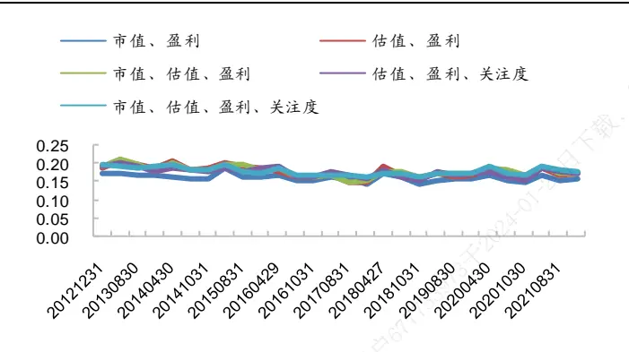
资料来源：Wind，海通证券研究所

图3 风格分类与行业分类的最大相似度
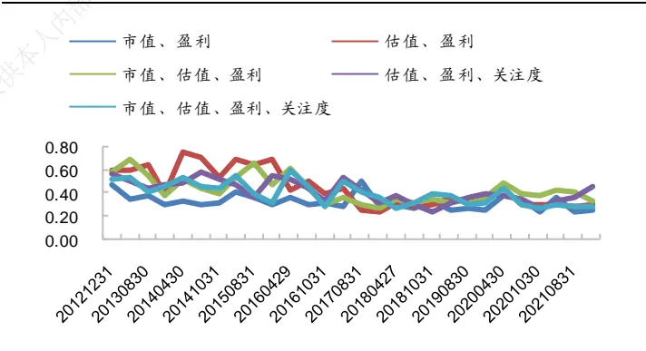
资料来源：Wind，海通证券研究所

由于被我们用来分类的 5 种风格因子组合形式为包含与被包含的关系，因此它们之间的分类相似度较高。以“估值、盈利、关注度”和“市值、估值、盈利、关注度”这两种风格分类为例，它们在 2013.01-2021.10 期间的平均相似度为 51%，最大相似度为90%，相似程度相对较高。

[Table_Pic 图 Pe] 4 风格分类之间的平均相似度（2013.01-2021.10）

| 平均相似度 |  |  |  |  | 最大相似度 |  |  |  |  |  |
| --- | --- | --- | --- | --- | --- | --- | --- | --- | --- | --- |
|  | 市值、盈利估值、盈利 | 市值、估值、 盈利 | 估值、盈利、 关注度 | 市值、估值、 盈利、关注度 |  |  | 市值、盈利估值、盈利 | 市值、估值 、盈利 | 估值、盈利 、关注度 | 市值、估值、 盈利、关注度 |
| 市值、盈利 | 1 | 0.29 | 0.43 | 0.25 | 0.34 | 市值、盈利 | 1 0.52 | 0.74 | 0.49 | 0.63 |
| 估值、盈利 | 1 | 0.47 | 0.45 | 0.38 | 估值、盈利 |  | 1 | 0.89 | 0.83 | 0.80 |
| 市值、估值、盈利 |  | 1 | 0.40 | 0.50 | 市值、估值、盈利 |  |  | 1 | 0.74 | 0.86 |
| 估值、盈利、关注度 |  |  | 1 | 0.51 | 估值、盈利、关注度 |  |  |  | 1 | 0.90 |
| 市值、估值、盈利、关注度 |  |  |  | 1 | 市值、估值、盈利、关注度 |  |  |  |  | 1 |

资料来源：Wind，海通证券研究所

## 风格分类的稳定性

分类的稳定性可以用相邻两期分类结果的相似度来刻画，即 t-1 期某类别的成分股， t 期有多少仍属于该类别。平均来看，前述 5 种分类风格下，相邻两期类别的平均重合度在 30%-40%左右，具备一定的分类稳定性。

图5 不同因子分类相邻两期的相似度
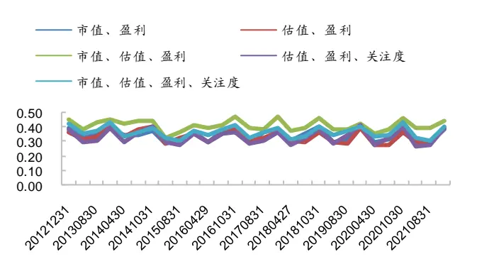
资料来源：Wind，海通证券研究所

图6 不同因子分类相邻两期的平均相似度（2013.01-2021.10）
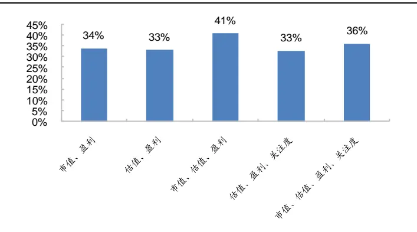
资料来源：Wind，海通证券研究所

## 2. 风格分类在多因子模型上的应用

因子的选股效果易受到行业影响，因此在因子处理时通常会对行业进行正交化处理，以提升因子的稳定性。参考行业中性的做法，我们也可考察类别中性化后，常用因子的选股效果，以及股票风格分类在多因子组合构建上的应用。

## 2.1 风格类因子

通常情况下，我们会结合公司基本面来考察个股的估值和大小盘风格等。因此，对于风格类因子，我们采用盈利（基本面）与估值作为分类指标。例如，对于市值因子，根据市值和盈利的分类结果进行中性化；对于估值因子，则根据估值和盈利的分类结果进行中性化。市值因子、市值平方因子、估值因子类别中性化后的选股收益如下表所示。

表 1 类别中性化后风格因子的选股收益（2013.01-2021.10）

| 市值因子 |  |  |  |  |  |
| --- | --- | --- | --- | --- | --- |
| 753973于2024- | IC表现 |  | 分10组多空收益 |  |  |
|  | 月均IC 波动率 | ICIR | 月均收益 | 波动率 | 信息比 |
| 原始因子 | -4.09% 14.26% | -0.99 | 2.47% | 7.33% | 1.17 |
| 行业中性化 | -3.70% | 13.19% -0.97 | 2.08% | 6.60% | 1.09 |
| 类别中性化 | -4.50% 9.34% | -1.67 | 2.17% | 4.70% | 1.60 |
| 市值平方 |  |  |  |  |  |
|  | 月均IC | IC 表现 波动率 ICIR | 月均收益 | 分10组多空收益 波动率 | 信息比 |
| 原始因子 | 2.65% | 7.89% 1.16 | 0.44% | 4.39% | 0.35 |
| 行业中性化 | 4.17% | 5.93% 2.43 | 1.26% | 2.52% | 1.73 |
| 类别中性化 | 4.49% 5.72% | 2.72 | 1.93% | 2.93% | 2.29 |
| 估值 |  |  |  |  |  |
|  | IC 表现 波动率 | ICIR |  | 分10组多空收益 |  |
| 原始因子 | 月均IC -1.88% 13.93% | -0.47 | 月均收益 0.59% | 波动率 6.21% | 信息比 0.33 |
| 行业中性化 | -2.62% 9.40% | -0.97 | 1.02% | 3.93% | 0.90 |
| 类别中性化 | -3.80% 5.62% | -2.34 | 1.58% |  | 1.89 |
|  |  |  |  | 2.89% |  |

资料来源： ，海通证券研究所

由上表可见，除市值因子外，其余两个风格因子行业中性化后的月均 IC都有所增加，同时波动率下降，相应的 ICIR 都有较为明显的提升；即，剔除行业影响可改善市值平方和估值因子的选股收益。

行业中性化后，若再类别中性化，则因子选股效果进一步增厚，同时波动率下降，ICIR 提升明显。例如，对于估值因子，行业中性化后因子的月均 IC 为-2.62%，年化 ICIR为-0.97；而进一步类别中性化，则因子的 IC可提升至-3.80%，年化 ICIR 为-2.34。

需要注意的是，类别中性化和直接正交相应因子并不完全等同。前者是将具有相似风格特征的股票归为一类，中性化时，同等对待同类股票的风格特征；而后者则是独立对待每只股票和每种风格。两种中性化的结果也不一样，例如，对于市值平方因子，若对市值、ROE分类进行类别中性化，则其年化 ICIR为 2.72；但若将市值平方因子对分类因子（市值、ROE）直接线性正交，则 ICIR 为 2.50。多空收益也呈现类似特征，市值平方类别中性化后的信息比（2.29）大幅优于直接正交分类因子的信息比（1.76）。

图7 直接正交分类因子v.s类别中性化的市值平方因子分组收益（2013.01-2021.10）
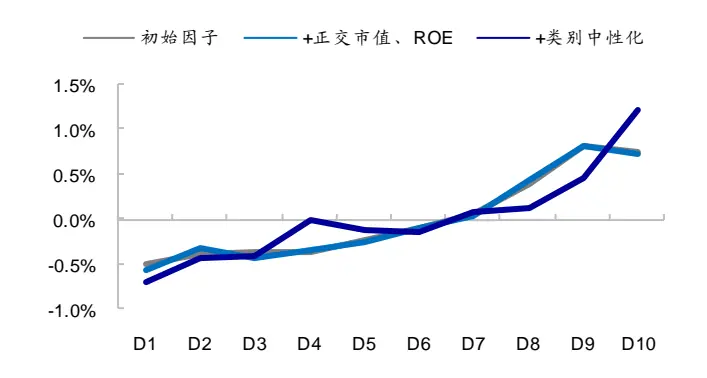
资料来源：Wind，海通证券研究所

图8 直接正交分类因子 v.s 类别中性化的市值平方因子 ICIR(2013.01-2021.10)
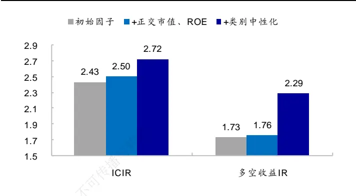
资料来源： ，海通证券研究所

## 2.2 技术类因子

技术类因子与公司的基本面通常关联较小，因此我们采用市值、估值和关注度这 3个风格特征对股票分类。类别中性化后，常用技术因子的表现如表 所示。从中可见，无论是反转因子、换手率因子还是换手率波动率因子，类别中性化均可提升因子的稳定性，波动率都有不同程度的下降，相应的 ICIR 以及多空收益 IR都有一定幅度的提升。即，类别中性化后，技术因子的选股效应得到进一步改善。

表 2 类别中性化后技术因子的选股收益（2013.01-2021.10）

| 反转因子 |  |  |  |  |  |
| --- | --- | --- | --- | --- | --- |
| 用677 | IC表现 |  |  | 分10组多空收益 |  |
|  | 月均IC | 波动率 | ICIR | 月均收益 波动率 | 信息比 |
| 原始因子 | -3.90% | 8.24% -1.64 | 1.67% | 3.51% | 1.65 |
| 行业中性化 类别中性化 | -4.13% | 7.68% -1.86 | 1.75% | 3.28% | 1.85 |
| -4.36% | 7.38% | -2.05 | 1.87% | 3.25% | 1.99 |
| 换手率因子 |  |  |  |  |  |
|  | IC 表现 月均IC 波动率 | ICIR | 月均收益 | 分10组多空收益 波动率 | 信息比 |
| 原始因子 | -4.55% | 15.26% | -1.03 | 1.49% 6.51% | 0.79 |
| 行业中性化 | -6.17% 11.20% | -1.91 | 2.49% | 3.91% | 2.20 |
| 类别中性化 | -6.37% 8.68% | -2.54 | 2.34% | 3.21% | 2.53 |
| 换手率波动率因子 |  |  |  |  |  |
|  | IC 表现 月均IC 波动率 | ICIR | 月均收益 | 分10组多空收益 波动率 | 信息比 |
| 原始因子 | -5.57% 13.87% | -1.39 | 2.09% | 7.17% | 1.01 |
| 行业中性化 | -6.90% 10.92% | -2.19 | 3.14% | 5.47% | 1.99 |
| 类别中性化 | -7.00% 8.94% | -2.72 | 2.92% | 4.80% | 2.11 |

资料来源：Wind，海通证券研究所

## 2.3 基本面因子

对于基本面因子，我们采用估值、盈利和关注度这 3个风格特征对股票分类。类别中性化后，常用基本面因子的表现如下表所示。

表 3 类别中性化后基本面因子的选股收益（2013.01-2021.10）

| ROE 因子 |  |  |  |  |
| --- | --- | --- | --- | --- |
|  | IC 表现 |  | 分10组多空收益 |  |
|  | 月均IC 波动率 | ICIR | 月均收益 波动率 | 信息比 |
| 原始因子 | 2.50% 9.55% | 0.91 | 0.91% 3.99% | 0.79 |
| 行业中性化 | 3.89% 6.52% | 2.07 | 1.40% 3.10% | 1.56 |
| 类别中性化 | 4.14% 5.40% | 2.65 | 1.89% 3.05% | 2.15 |

SUE 因子

|  | IC 表现 |  | 分10组多空收益 |  |  |
| --- | --- | --- | --- | --- | --- |
|  | 月均IC 波动率 | ICIR | 月均收益 | 波动率 | 信息比 |
| 原始因子 | 3.55% 6.58% | 1.87 | 1.20% | 2.78% | 1.49 |
| 行业中性化 | 4.03% 4.53% | 3.08 | 1.42% | 2.15% | 2.29 |
| 类别中性化 | 3.84% 3.61% | 3.68 | 1.38% | 1.79% | 2.67 |

资料来源： ，海通证券研究所

整体来看，类别中性化可提升基本面因子的稳定性，ROE、SUE 因子的 IC 和多空收益波动率虽都有不同幅度的下降，但相应的信息比却有一定幅度的提升。即，类别中性化后，基本面因子的选股稳定性也可得到一定改善。

## 2.4 风格分类在多因子组合构建上的应用

前文对比了类别中性化前后单因子的选股效果，本节将从多因子组合构建角度出发，探索风格分类的应用。

## 2.4.1 收益预测

在个股收益预测模块，整体来看，类别中性化可以提升单类因子和复合因子预测能力的稳定性和信息比，以及 top 组合的业绩表现。但需要注意的是，相比于行业中性化因子的 top100 组合，类别中性化因子的 top100 组合具有更高的小市值暴露。因此，在大盘风格较为显著的 2017、2019-2020 年，表现不如行业中性化因子的 top100 组合。

## 类别中性化可提升单类因子的预测 ICIR

将反转、换手率、换手率波动率 3因子等权打分构建复合技术因子，类别中性化后，该技术因子月均 IC 为-7.43%，ICIR 为-3.05；月均分 10 组多空收益 2.91%，信息比 3.10，优于基于原始行业中性化指标所构建的因子。

同样地，将 ROE和 SUE两个因子等权打分构建复合基本面因子，类别中性化后，该基本面因子月均 IC为 5.35%，ICIR 为 3.81，也优于原始行业中性化的基本面因子。

表 4 类别中性化后的复合因子表现（2013.01-2021.10）

|  |  | IC 表现 |  |  | 分10组多空收益 |  |  |
| --- | --- | --- | --- | --- | --- | --- | --- |
| 技术因子 |  | 月均值 | 年化波动率 | ICIR | 月均值 | 年化波动率 | IR |
|  | 类别中性化 | -7.43% | 8.45% | -3.05 | 2.91% | 3.25% | 3.10 |
|  | 原始行业中性化 | -7.18% | 10.50% | -2.37 | 2.82% | 3.93% | 2.49 |
| 基本面因子 | 类别中性化 | 5.35% | 4.86% | 3.81 | 2.17% | 2.72% | 2.76 |
|  | 原始行业中性化 | 4.92% | 6.54% | 2.61 | 1.76% | 2.72% | 2.24 |

资料来源：Wind，海通证券研究所

## 类别中性化可提升多因子的预测 ICIR

将技术因子、基本面因子以及中盘因子（市值平方）3 类因子等权打分，构建复合因子，考察其预测 IC以及分十组的多空收益，结果如下表所示。从中可见，类别中性化后，复合因子预测能力有所提升，月均 IC小幅增加，而波动率下降明显，相应的信息比显著提升。此外，从分组收益角度，类别中性化后，复合因子多空收益更加对称。

表 5 类别中性化复合因子的选股收益（2013.01-2021.10）

|  | 类别中性化 |  |  |  | 行业中性化 |  |  |  |
| --- | --- | --- | --- | --- | --- | --- | --- | --- |
|  | 月均值 | 波动率 | ICIR | p值 | 月均值 | 波动率 | ICIR | p值 |
| 空头 | -1.76% | 1.69% | -3.62 | 0.000 | -1.95% | 2.25% | -2.99 | 0.000 |
| 多头 | 1.60% | 1.99% | 2.79 | 0.000 | 1.27% | 1.59% | 2.76 | 0.000 |
| 多空收益 | 3.36% | 3.19% | 3.65 | 0.000 | 3.21% | 3.46% | 3.21 | 0.000 |
| IC | 8.77% | 6.99% | 4.35 | 0.000 | 8.67% | 8.21% | 3.66 | 0.000 |

资料来源：Wind，海通证券研究所

选择复合因子得分最高的 100 只股票构建等权组合，自 2013 年初至 2021 年 10 月底，年化收益 33.9%，优于同期的中证 500 指数，以及基于行业中性化因子所构建的top100 组合。

分年度来看，类别中性化 组合在 、 年表现不如行业中性化top100 组合，这可能与市值风格有一定关系。类别中性化复合因子 top100 组合的小市值暴露高于行业中性化复合因子，前者小市值因子分位点均值为 14.5%，后者为 50.0%；因此，在大盘风格较强的 2017 年、2019-2020 年，类别中性化因子的 top100 组合不如行业中性化因子的 top100 组合。

表 6 类别中性化多因子 top100 等权组合分年度收益率（2013.01-2021.10）

| 中证500 指数 | 类别中性化因子 top100 组合 | 行业中性化因子 top100 组合 |
| --- | --- | --- |
| 2013 | 16.9% 54.6% | 32.8% |
| 2014 -26 | 39.0% 80.5% | 44.5% |
| 2015 | 43.1% 193.6% | 105.9% |
| 2016 | -17.8% 15.7% | 11.3% |
| 2017 | -0.2% -19.4% | -2.8% |
| 2018 | -33.3% -16.1% | -22.3% |
| 2019 | 26.4% 40.9% | 49.0% |
| 2020 | 20.9% 20.0% | 34.5% |
| 2021 | 10.3% | 21.2% 9.3% |
| 全区间 | 9.0% | 33.9% 25.2% |

资料来源：Wind，海通证券研究所

## 2.4.2 风险控制

在组合优化过程中，为控制风险，通常会约束组合相对于基准指数的行业偏离、风格偏离。而作为一种股票分类方法，我们也可尝试控制类别偏离。

采用常见低频技术因子、基本面因子、高频因子构建收益预测模型，在个股偏离1%、成分股最低权重 80%、因子敞口 0.5 个标准差、市值中性的基础上、再约束风格分类中性，构建沪深 300 指数增强组合，其业绩表现如表 7 所示。为进行比较，我们也列示了其他条件不变，将类别中性替换为行业中性的情况下，增强组合的收益表现。

结果显示，相比于行业中性，类别中性可在不明显增加风险的基础上，提升组合的超额收益。相应地，组合的信息比和收益回撤比均有所改善。时间序列角度来看，类别中性组合分年度收益分布更加均匀，年超额收益波动率为 4.2%，明显低于行业中性组合年超额收益的波动率 5.4%。

分年度来看，类别中性组合主要在 2017、2019-2020 年表现稍逊行业中性组合，这可能与此阶段市场行业特征比风格特征更加鲜明所致。我们以收益最高 1/3 行业的波动率来和收益最高 1/3 风格类别的波动率来分别表征行业和类别的分化度，并计算两者分化度之差。差值越大，表明相对风格分类而言，行业分类的分化度越高，即市场的行业特征更加鲜明。在这种情况下，类别中性化的优势减弱，行业中性化组合的收益更高。

实际上，行业与类别分化度之差，和类别中性组合相对行业中性组合的超额收益，呈显著负相关，两者相关系数为-0.22。在 2017、2019-2020 这 3 年间，行业特征更加鲜明，上涨行业的收益分化度很高，一定程度上降低了有行业偏离的类别中性化组合的相对优势。

表 7 类别中性化沪深 300 增强组合业绩表现（2013.01-2021.10）

| 沪深300 指数 | 类别中性化组合 |  |  | 行业中性化组合 |  |  |
| --- | --- | --- | --- | --- | --- | --- |
|  | 超额收益 | 跟踪误差 | 最大回撤 | 超额收益 | 跟踪误差 | 最大回撤 |
| 2013 | -7.6% | 10.1% 4.4% | 2.8% | 0.8% | 3.6% | 3.4% |
| 2014 | 51.7% | 12.7% 3.8% | 2.1% | 1.6% | 2.9% | 3.6% |
| 2015 | 5.6% | 19.1% 6.4% | 3.8% | 16.3% | 6.4% | 4.3% |
| 2016 | -11.3% | 4.4% 4.3% | 3.4% | 3.7% | 4.0% | 3.1% |
| 2017 | 21.8% | 7.5% 3.2% | 2.2% | 12.9% | 2.9% | 1.3% |
| 2018 | -25.3% | 4.5% 3.3% | 2.5% | 5.1% | 3.3% | 2.3% |
| 2019 | 36.1% | 7.7% 3.1% | 2.7% | 9.1% | 2.7% | 2.1% |
| 2020 | 27.2% | 13.3% 3.7% | 1.9% | 16.2% | 3.8% | 1.9% |
| 2021 | -5.8% | 12.5% 5.5% | 4.5% | 5.1% | 5.0% | 2.8% |
| 全区间 | 7.8% | 10.2% 4.3% | 4.5% 全区间统计 | 7.7% | 4.0% | 4.3% |
| 内部 |  |  |  |  |  |  |
| 收益率 类别中性化组合 10.2% |  | 跟踪误差 | 信息比 最大回撤 |  | 收益回撤比 | 月胜率 |
|  |  | 4.3% | 2.23 | 4.5% | 2.25 | 71.7% |
| 行业中性化组合 7.7% |  | 4.0% | 1.85 | 4.3% | 1.76 | 64.2% |

资料来源：Wind，海通证券研究所

图9 行业分化度越低，类别中性组合的相对收益越高(2013.01-2021.10)
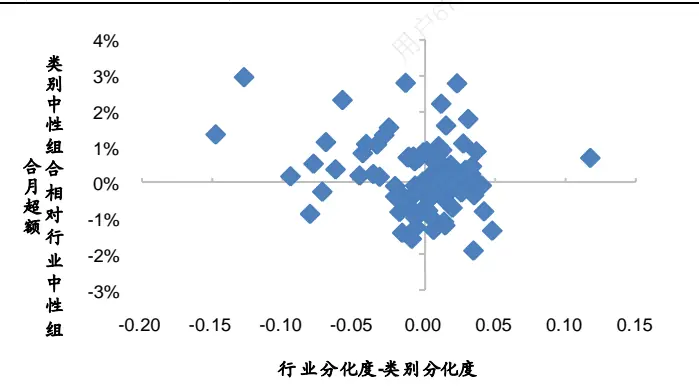
资料来源：Wind，海通证券研究所

图10 类别中性组合相对行业中性组合的累计超额收益
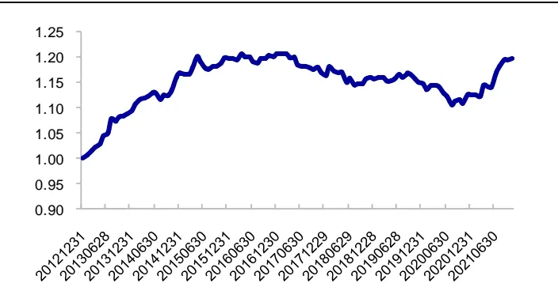
资料来源：Wind，海通证券研究所

综上所述，在个股收益预测模块，类别中性化可以提升单类因子与复合因子预测收益的稳定性和信息比。但需要注意的是，从多头组合角度来看，相比于行业中性化因子所构建的 top100 组合，类别中性化因子的 top100 组合具有更高的小市值暴露，因此在大盘风格较为显著的 2017、2019-2020 年，表现不如行业中性化因子。

在风险控制模块，相比于行业中性，风格类别中性可以在不明显增加风险的条件下，提升指数增强策略的超额收益。因此，信息比和收益回撤比均有所改善。

## 3. 风格分类的动量溢出效应

基本面相似或者关联的公司股价间存在动量溢出效应。即，当一家公司的股价受到外在信息冲击后，信息传递至关联或相似公司的过程会存在延迟，从而形成股价间的领先-滞后效应。

最常见的动量溢出效应存在于行业之中。对于股票 i，计算其所属行业中除自身以外其余个股的平均收益，作为股票 i 的行业动量因子。正交市值、行为（累计收益、换手率）因子后，行业动量因子的选股效果如下表所示。

表 8 剔除市值、行为因子后，行业动量因子的选股效果（三级行业，2013.01-2021.10）

|  | 周频 |  |  |  | 月频 |  |  |  |
| --- | --- | --- | --- | --- | --- | --- | --- | --- |
|  | 次均收益 | 次胜率 | p值 | 年化信息比 | 次均收益 | 次胜率 | p值 | 年化信息比 |
| 低动量 | -0.22% | 33.0% | 0.000 | -2.40 | -0.44% | 39.6% | 0.005 | -0.96 |
| 高动量 | 0.18% | 55.5% | 0.000 | 1.21 | 0.51% | 53.8% | 0.016 | 0.82 |
| 多空收益 | 0.39% | 65.2% | 0.000 | 2.07 | 0.95% | 60.4% | 0.003 | 1.02 |
| IC | 1.97% | 64.1% | 0.000 | 2.30 | 2.62% | 62.3% | 0.000 | 1.31 |

资料来源：Wind，海通证券研究所

由上表可见，无论是周度还是月度换仓频率下，高行业动量组合的次均收益均高于低行业动量组合，行业动量溢出效应时间序列统计显著。

图11 周度行业动量因子的多空净值（2013.01-2021.10）
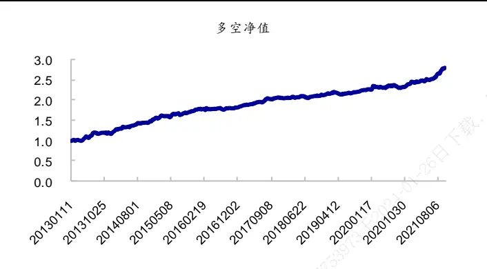
资料来源：Wind，海通证券研究所

图12 月度行业动量因子的多空净值（2013.01-2021.10）
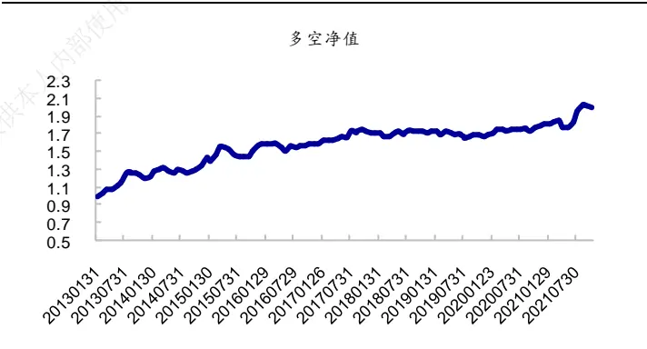
资料来源：Wind，海通证券研究所

按照同样的方式考察周频和月频下，市值、估值、盈利三因子风格分类的动量溢出效应，结果如下表所示。正交市值、行为因子后，风格分类动量因子选股效果显著，无论是周度还是月度换仓频率下，高风格分类动量组合的月均收益均高于低风格分类动量组合。周频次均多空收益为 0.44%，月频为 1.43%，风格分类动量溢出效应时间序列统计显著。但相较而言，月度频率下，风格分类动量的多头效应弱于行业分类。我们猜测，这可能是由于市场短期具有一定的风格趋势，但在相对较长的周期内，还是更具有基本面逻辑的行业/产业形成的趋势更强。

表 9 剔除市值、行为因子后，风格分类动量因子的选股效果（2013.01-2021.10）

|  | 周频 |  |  |  | 月频 |  |  |  |
| --- | --- | --- | --- | --- | --- | --- | --- | --- |
|  | 次均收益 | 次胜率 | p值 | 年化信息比 | 次均收益 | 次胜率 | p值 | 年化信息比 |
| 低动量 | -0.24% | 35.0% | 0.000 | -1.95 | -1.03% | 32.4% | 0.000 | -1.23 |
| 高动量 | 0.19% | 58.8% | 0.000 | 1.34 | 0.40% | 65.7% | 0.026 | 0.76 |
| 多空收益 | 0.44% | 65.3% | 0.000 | 2.03 | 1.43% | 64.8% | 0.001 | 1.13 |
| IC | 2.41% | 66.4% | 0.000 | 2.46 | 3.99% | 63.8% | 0.000 | 1.28 |

资料来源：Wind，海通证券研究所

图13 周度风格分类动量因子的分组收益（2013.01-2021.10）
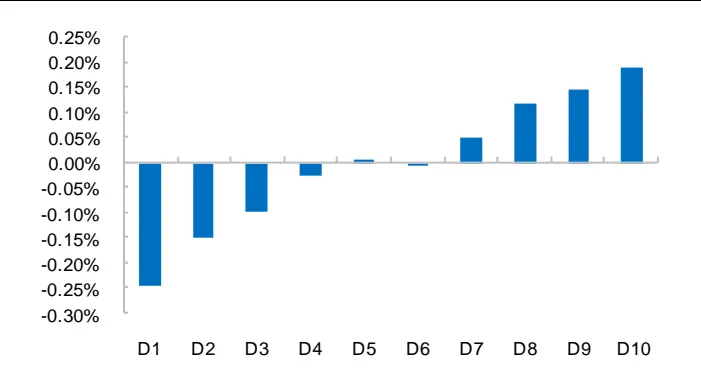
资料来源：Wind，海通证券研究所

图14 周度风格分类动量因子的多空净值（2013.01-2021.10）
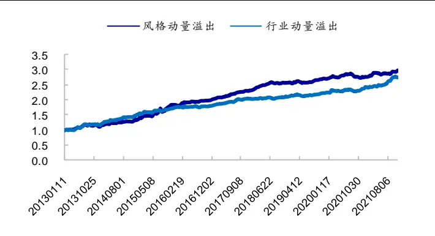
资料来源：Wind，海通证券研究所

图15 月度风格分类动量因子的分组收益（2013.01-2021.10）
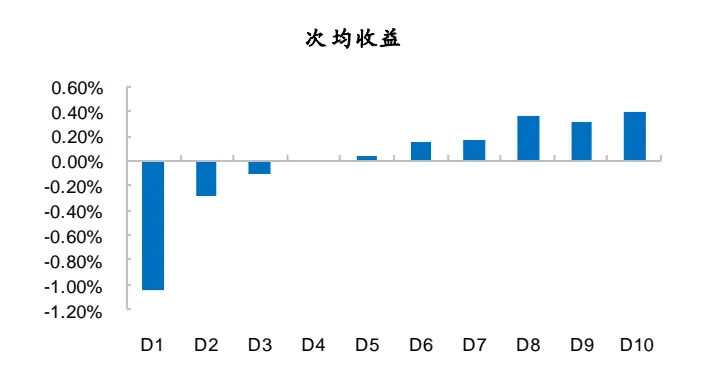
资料来源：Wind，海通证券研究所

图16 月度风格分类动量因子的多空净值（2013.01-2021.10）
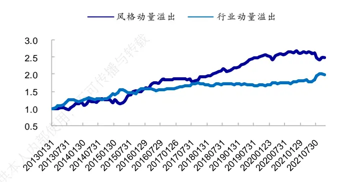
资料来源：Wind，海通证券研究所

既然行业和风格分类都存在显著的动量溢出效应，那么两种溢出效应的相关性如何，风格分类的溢出效应是否可以被行业溢出效应解释呢？接下来，我们将通过考察横截面回归的溢价，对该问题进行研究。

首先，从因子多空收益的时间序列相关系数来看，行业动量和风格分类动量的相关性并不高。周频相关系数为 0.35，月频为-0.59。从月度多空净值曲线也可看出，在行业动量表现平淡的 2017 年下半年至 2019 年，风格分类动量较强；而 2020 年以来，风格分类动量表现一般，行业动量多空净值稳定向上，两者具有一定的互补效应。

其次，构建包含常用风格、技术、基本面、高频以及一级行业虚拟变量的截面回归模型，考察控制常见选股因子后，不同动量因子的截面溢价，结果如下表所示。与分组收益结果一致，无论是周频还是月频下，行业动量与风格分类动量的截面溢价均值都显著大于 0。在同时包含行业动量和风格分类动量的方程 3 中，两因子的显著性仍然得以保持，溢价也没有明显下降。由此可见，风格分类动量与行业动量相对较为独立。

表 10 动量溢出效应的截面溢价（2013.01-2021.10）

| 回归方程 |  | 周频行业动量 风格分类动量 | 月频行业动量 风格分类动量 |
| --- | --- | --- | --- |
| 方程1 参数估计 |  | 0.25% | 0.15% |
|  | 信息比 | 1.96 | 0.94 |
| p值 |  | 0.000 | 0.006 |
| 方程2 参数估计 |  | 0.30% | 0.50% |
| 信息比 |  | 2.04 | 0.99 |
| p值 |  | 0.00 | 0.004 |
| 方程3 参数估计 |  | 0.25% 0.29% | 0.14% 0.47% |
| 信息比 | 1.96 | 1.99 0.93 | 0.92 |
| p值 | 0.00 | 0.00 | 0.007 0.007 |

资料来源：Wind，海通证券研究所

综上所述，我们认为，A 股市场存在较为明显的风格分类动量溢出效应：高风格分类动量组合的月均收益显著高于低风格分类动量组合。而且，风格分类动量溢出效应与行业溢出效应相对较为独立，在同时包含这两个动量因子的截面回归模型中，两者的溢价仍然显著大于 0，具体大小也未有明显下降。

## 4. 全文总结

本文从个股风格特征（市值、估值、盈利、关注度）出发，通过 K-means方法对股票重新分类，并考察风格分类在多因子模型上的应用，以及风格分类的动量溢出效应。

基于风格特征对股票重新分类，并将常用因子进行类别中性化，可以提升因子的稳定性和信息比。在风险控制模块，相比于行业中性，风格类别中性可以在不明显增加指数增强策略风险的基础上，提升策略的超额收益、信息比和收益回撤比，且分年度超额收益分布更加均匀。

与行业类似，A 股市场也存在较为明显的风格分类动量溢出效应：高风格分类动量组合的月均收益显著高于低风格分类动量组合。而且，风格分类动量溢出效应与行业溢转出效应相对较为独立，在同时包含这两个动量因子的截面回归模型中，两者的溢价仍然播显著大于 0，具体大小也未有明显下降。

## 5. 风险提示

模型误设风险，历史统计规律失效风险。人

## 信息披露

分析师声明

[Table冯佳睿yst金融工程研究团队s]

罗蕾金融工程研究团队

本人具有中国证券业协会授予的证券投资咨询执业资格，以勤勉的职业态度，独立、客观地出具本报告。本报告所采用的数据和信息均来自市场公开信息，本人不保证该等信息的准确性或完整性。分析逻辑基于作者的职业理解，清晰准确地反映了作者的研究观点，结论不受任何第三方的授意或影响，特此声明。

## 法律声明

本报告仅供海通证券股份有限公司（以下简称 本公司 ）的客户使用。本公司不会因接收人收到本报告而视其为客户。在任何情况下，本报告中的信息或所表述的意见并不构成对任何人的投资建议。在任何情况下，本公司不对任何人因使用本报告中的任何内容所引致的任何损失负任何责任。

本报告所载的资料、意见及推测仅反映本公司于发布本报告当日的判断，本报告所指的证券或投资标的的价格、价值及投资收入可能转会波动。在不同时期，本公司可发出与本报告所载资料、意见及推测不一致的报告。 播

市场有风险，投资需谨慎。本报告所载的信息、材料及结论只提供特定客户作参考，不构成投资建议，也没有考虑到个别客户特殊的可投资目标、财务状况或需要。客户应考虑本报告中的任何意见或建议是否符合其特定状况。在法律许可的情况下，海通证券及其所属，关联机构可能会持有报告中提到的公司所发行的证券并进行交易，还可能为这些公司提供投资银行服务或其他服务。使

本报告仅向特定客户传送，未经海通证券研究所书面授权，本研究报告的任何部分均不得以任何方式制作任何形式的拷贝、复印件或人复制品，或再次分发给任何其他人，或以任何侵犯本公司版权的其他方式使用。所有本报告中使用的商标、服务标记及标记均为本公司的商标、服务标记及标记。如欲引用或转载本文内容，务必联络海通证券研究所并获得许可，并需注明出处为海通证券研究所，且不得对本文进行有悖原意的引用和删改。

根据中国证监会核发的经营证券业务许可，海通证券股份有限公司的经营范围包括证券投资咨询业务。26

海通证券股份有限公司研究所[Table_PeopleInfo]

| 路颖 所长 (021)23219403 | luying@htsec.com | 高道德 副所长 (021)63411586 gaodd@htsec.com |  | 邓勇 副所长 (021)23219404dengyong@htsec.com |  |
| --- | --- | --- | --- | --- | --- |
| 荀玉根 副所长 (021)23219658 xyg6052@htsec.com |  | 涂力磊 所长助理 (021)23219747 tll5535@htsec.com |  | 余文心 所长助理 (0755)82780398 ywx9461@htsec.com |  |
| 宏观经济研究团队 梁中华(021)23219820 应镓娴(021)23219394 李 俊(021)23154149 联系人 侯 欢(021)23154658 李林芷(021)23219674 | Izh13508@htsec.com yjx12725@htsec.com lj13766@htsec.com hh13288@htsec.com llz13859@htsec.com | 金融工程研究团队 高道德(021)63411586 冯佳睿(021)23219732 郑雅斌(021)23219395 罗 蕾(021)23219984 余浩淼(021)23219883 袁林青(021)23212230 颜 伟(021)23219914 联系人 孙丁茜(021)23212067 张耿宇(021)23212231 郑玲玲(021)23154170 黄雨薇(021)23154387 | gaodd@htsec.com fengjr@htsec.com zhengyb@htsec.com I19773@htsec.com yhm9591@htsec.com ylq9619@htsec.com yw10384@htsec.com sdq13207@htsec.com zgy13303@htsec.com zli13940@htsec.com hyw13116@htsec.com | 金融产品研究团队 高道德(021)63411586 倪韵婷(021)23219419 唐洋运(021)23219004 徐燕红(021)23219326 谈 鑫(021)23219686 庄梓恺(021)23219370 谭实宏(021)23219445 联系人 吴其右(021)23154167 张 弛(021)23219773 滕颖杰(021)23219433 tyj13580@htsec.com 江 涛(021)23219879 jt13892@htsec.com | gaodd@htsec.com niyt@htsec.com tangyy@htsec.com xyh10763@htsec.com tx10771@htsec.com zzk11560@htsec.com tsh12355@htsec.com wqy12576@htsec.com zc13338@htsec.com |
| 王巧喆(021)23154142 wqz12709@htsec.com 联系人 张紫睿 021-23154484 孙丽萍(021)23154124 王冠军(021)23154116 方欣来 021-23219635 政策研究团队 李明亮(021)23219434 | zzr13186@htsec.com slp13219@htsec.com wgj13735@htsec.com fxl13957@htsec.com | 李 影(021)23154117 郑子勋(021)23219733 吴信坤 021-23154147 联系人 余培仪(021)23219400 王正鹤(021)23219812 杨 锦(021)23154504 石油化工行业 邓 勇(021)23219404 | ly11082@htsec.com zzx12149@htsec.com wxk12750@htsec.com ypy13768@htsec.com wzh13978@htesc.com yj13712@htsec.com dengyong@htsec.com | 联系人 医药行业 余文心(0755)82780398 ywx9461@htsec.com | 王园沁 02123154123 wyq12745@htsec.com |
| 吴一萍(021)23219387 wuyiping@htsec.com 朱 蕾(021)23219946 周洪荣(021)23219953 李姝醒 02163411361 汽车行业 | zl8316@htsec.com zhr8381@htsec.com Isx11330@htsec.com | 胡歆(021)23154505 hx11853@htsec.com 公用事业 |  | 朱赵明(021)23154120 梁广楷(010)56760096 联系人 孟 陆 86 10 56760096 周 航(021)23219671 彭 娉(010)68067998 批发和零售贸易行业 | zzm12569@htsec.com Igk12371@htsec.com ml13172@htsec.com zh13348@htsec.com pp13606@htsec.com |
| 曹雅倩(021)23154145 cyq12265@htsec.com 郑 蕾(021)23963569 联系人 房乔华 021-23219807 互联网及传媒 | zl12742@htsec.com fqh12888@htsec.com | 于鸿光(021)23219646 吴 杰(021)23154113 联系人 余玫翰(021)23154141 有色金属行业 | yhg13617@htsec.com wj10521@htsec.com ywh14040@htsec.com | 高 瑜(021)23219415 汪立亭(021)23219399 康 璐(021)23212214 kl13778@htsec.com 联系人 曹蕾娜 cln13796@htsec.com | gy12362@htsec.com wanglt@htsec.com |
| 崔冰睿(021)23219774 cbr14043@htsec.com | kbc13683@htsec.com | 联系人 郑景毅 zjy12711@htsec.com | gjy11909@htsec.com | 金 晶(021)23154128 杨 凡(010)58067828 yf11127@htsec.com | jj10777@htsec.com |
| 毛云聪(010)58067907 陈星光(021)23219104 孙小雯(021)23154120 联系人 康百川(021)23212208 | myc11153@htsec.com cxg11774@htsec.com sxw10268@htsec.com | 施 毅(021)23219480 陈晓航(021)23154392 甘嘉尧(021)23154394 | sy8486@htsec.com cxh11840@htsec.com | 房地产行业 涂力磊(021)23219747 谢 盐(021)23219436 | tll5535@htsec.com xiey@htsec.com |
| 电子行业 |  | 煤炭行业 |  | 电力设备及新能源行业 |  |
| 李 轩(021)23154652 lx12671@htsec.com |  | 李 淼(010)58067998 Im10779@htsec.com |  | 张一弛(021)23219402 | zyc9637@htsec.com |
| 肖隽翀(021)23154139 xjc12802@htsec.com |  | 戴元灿(021)23154146 dyc10422@htsec.com |  | 房 青(021)23219692 | fangq@htsec.com |
| 华晋书 hjs14155@htsec.com |  | 王 涛(021)23219760 wt12363@htsec.com |  | 曾 彪(021)23154148 zb10242@htsec.com |  |
| 联系人 |  | 吴 杰(021)23154113 wj10521@htsec.com |  | 徐柏乔(021)23219171 xbq6583@htsec.com |  |
| 文 灿 wc13799@htsec.com |  |  |  | 张 磊(021)23212001 zl10996@htsec.com |  |
| 薛逸民(021)23219963 xym13863@htsec.com |  |  |  | 联系人 |  |
| 李 潇(010)58067830 lx13920@htsec.com |  |  |  | 姚望洲(021)23154184 ywz13822@htsec.com |  |

| 基础化工行业 |  | 计算机行业 |  | 通信行业 |  | 余伟民(010)50949926 ywm11574@htsec.com |
| --- | --- | --- | --- | --- | --- | --- |
| 刘 威(0755)82764281 Iw10053@htsec.com |  |  | 郑宏达(021)23219392 zhd10834@htsec.com |  |  |  |
| 刘海荣(021)23154130 Ihr10342@htsec.com |  |  | 杨 林(021)23154174 yl11036@htsec.com | 联系人 |  |  |
|  | 张翠翠(021)23214397 zcc11726@htsec.com |  | 于成龙(021)23154174 ycl12224@htsec.com |  | 杨彤昕 010-56760095 ytx12741@htsec.com |  |
|  | 孙维容(021)23219431 swr12178@htsec.com |  | 洪 琳(021)23154137 hl11570@htsec.com |  | 夏 凡(021)23154128 xf13728@htsec.com |  |
|  | 李 智(021)23219392 lz11785@htsec.com | 联系人 | 杨 蒙(0755)23617756 ym13254@htsec.com |  |  |  |

| 非银行金融行业 |  | 交通运输行业 |  | 纺织服装行业 |  |
| --- | --- | --- | --- | --- | --- |
|  | 孙 婷(010)50949926 st9998@htsec.com |  | 虞 楠(021)23219382 yun@htsec.com |  | 梁 希(021)23219407 lx11040@htsec.com |
|  | 何 婷(021)23219634 ht10515@htsec.com |  | 罗月江（010）56760091 lyj12399@htsec.com | 陈 宇(021)23219442 cy13115@htsec.com | 盛 开(021)23154510 sk11787@htsec.com |

| 建筑建材行业 | 机械行业 | 钢铁行业 |
| --- | --- | --- |
| 冯晨阳(021)23212081 fcy10886@htsec.com | 余炜超(021)23219816 swc11480@htsec.com | 刘彦奇(021)23219391 liuyq@htsec.com |
| 潘莹练(021)23154122 pyl10297@htsec.com | 赵玥炜(021)23219814 zyw13208@htsec.com | 周慧琳(021)23154399 zhl11756@htsec.com |
| 申 浩(021)23154114 sh12219@htsec.com 颜慧菁 yhj12866@htsec.com | 赵靖博(021)23154119 zjb13572@htsec.com | 与转载 |

| 建筑工程行业 农林牧渔行业 |  |  | 食品饮料行业 |  |  |
| --- | --- | --- | --- | --- | --- |
| 张欣劫 zxj12156@htsec.com |  | 丁 频(021)23219405 dingpin@htsec.com | 不可 | 闻宏伟(010)58067941 whw9587@htsec.com |  |
|  |  | 陈 阳(021)23212041 cy10867@htsec.com |  | 颜慧菁 yhj12866@htsec.com |  |
|  | 联系人 孟亚琦(021)23154396 myq12354@htsec.com |  |  | 张宇轩(021)23154172 zyx11631@htsec.com | 程碧升(021)23154171 cbs10969@htsec.com |

| 军工行业 | 银行行业 | 社会服务行业 |  |
| --- | --- | --- | --- |
| 张恒晅 zhx10170@htsec.com | 孙 婷(010)50949926 st9998@htsec.com | 汪立亭(021)23219399 wanglt@htsec.com |  |
| 张高艳 0755-82900489 zgy13106@htsec.com 联系人 | 解巍巍 xww12276@htsec.com 林加力(021)23154395 ljl12245@htsec.com | 许樱之(755)82900465 xyz11630@htsec.com 联系人 |  |
| 刘砚菲 021-2321-4129 lyf13079@htsec.com | 联系人 |  | 毛弘毅(021)23219583 mhy13205@htsec.com |
|  | 董栋梁(021) 23219356 ddl13206@htsec.com | 王祎婕(021)23219768 wyj13985@htsec.com |  |

| 家电行业 |  | 造纸轻工行业 |
| --- | --- | --- |
| 陈子仪(021)23219244 chenzy@htsec.com |  | 汪立亭(021)23219399 wanglt@htsec.com |
| 李 阳(021)23154382 ly11194@htsec.com |  | 郭庆龙 gql13820@htsec.com |
| 朱默辰(021)23154383 zmc11316@htsec.com |  | 联系人 |
| 刘 璐(021)23214390 II11838@htsec.com | 用户67775 | 柳文韬(021)23219389 Iwt13065@htsec.com 王文杰 wwj14034@htsec.com |

## 研究所销售团队

深广地区销售团队

伏财勇(0755)23607963 fcy7498@htsec.com

蔡铁清(0755)82775962 ctq5979@htsec.com

辜丽娟(0755)83253022 gulj@htsec.com

刘晶晶(0755)83255933 liujj4900@htsec.com

饶 伟(0755)82775282 rw10588@htsec.com

欧阳梦楚(0755)23617160

oymc11039@htsec.com

巩柏含 gbh11537@htsec.com

滕雪竹 0755 23963569 txz13189@htsec.com 上海地区销售团队 胡雪梅(021)23219385 huxm@htsec.com 黄 诚(021)23219397 hc10482@htsec.com 季唯佳(021)23219384 jiwj@htsec.com 黄 毓(021)23219410 huangyu@htsec.com 李 寅 021-23219691 ly12488@htsec.com 胡宇欣(021)23154192 hyx10493@htsec.com 马晓男 mxn11376@htsec.com 邵亚杰 23214650 syj12493@htsec.com 杨祎昕(021)23212268 yyx10310@htsec.com 毛文英(021)23219373 mwy10474@htsec.com 谭德康 tdk13548@htsec.com 王祎宁 wyn14183@htsec.com

北京地区销售团队
朱 健(021)23219592 zhuj@htsec.com
殷怡琦(010)58067988 yyq9989@htsec.com
郭 楠 010-5806 7936 gn12384@htsec.com
杨羽莎(010)58067977 yys10962@htsec.com
张丽萱(010)58067931 zlx11191@htsec.com
郭金垚(010)58067851 gjy12727@htsec.com
张钧博 zjb13446@htsec.com
高 瑞 gr13547@htsec.com
上官灵芝 sglz14039@htsec.com
董晓梅 dxm10457@htsec.com

海通证券股份有限公司研究所

地址：上海市黄浦区广东路 689号海通证券大厦 9楼

电话：（021）23219000

传真：（021）23219392

网址：www.htsec.com