## [Tab相关研究

Table_ReportInfo]《天弘量化投资团队及杨超先生侧写——做有逻辑、有深度、有特色的基本面量化》2021.12.13

《A股国际化进程新篇章——汇添富中国 互联互通 投资价值分析》2021.12.10

《何以成为机构的心头好——解开广发

多因子的“投资密码”》2021.12.06

分析师:冯佳睿

Tel:(021)23219732

Email:fengjr@htsec.com

证书:S0850512080006

分析师:余浩淼

Tel:(021)23219883

Email:yhm9591@htsec.com

证书:S0850516050004

# 选股因子系列研究（七十五）——限价订单簿（LOB）的还原和应用

## [Table_Sum投资要点：

上交所于 2021 年 5 月推出逐笔委托 Level2 行情数据，至此，沪深两市 Level2 高频行情已经完整。在这样的背景下，本文从逐笔委托与逐笔成交两个市场最细粒度的行情数据出发，介绍这些数据潜在的使用方法，探索未来可供进一步研发的方向。

连续竞价阶段用逐笔数据还原盘口行情，可以带来诸多优势。首先，理论上，可将订单簿的更新频率提升到 0.01 秒以内。其次，最大程度上避免快照行情可能存在较大迟滞这一问题，实时跟踪订单簿的全貌。最后，由逐笔数据还原的连续竞价阶段的盘口行情包含更加丰富的信息。

- 由概率论中的大数定律可知，提升交易频率是实现预期正收益的重要途经。然而，更高的交易频率也使得策略收益对交易成本更加敏感。我们常常会发现，一些回测表现良好的策略，运用于实际交易后，效果不尽如人意。一个相当重要的原因就是低估了交易成本。倘若我们能在回测中引入模拟撮合系统，那就可以更加准确地估计交易成本，从而更合理地评估和推断策略在真实交易中的效果。

- 一个可能的改进 策略的思路是追求在每个 秒下单时，尽可能完成交易，避免过多的未成交订单堆积到分钟末被强制成交，也即，尽可能降低强制成交比例。在流动性充裕的环境下，限价单 TWAP 策略应该比市价单 TWAP 策略有更低的交易成本。然而，如果每个 秒的限价单成交概率较低，就会导致很多订单堆积在分钟末被迫以市价单成交。而一旦堆积的量超过了最优对手方价格的委托量时，则相比均匀的市价单 TWAP策略就会产生亏损。

- 从海外的经验来看，从 LOB 中提取的信息一般可分为静态的订单簿和动态的订单流。其中，订单簿信息包括每个股票不同时刻和价位的买卖委托情况；订单流信息包括不同价位上买卖委托订单、成交订单和撤单的统计数据。有了上述 LOB基础指标，我们便可衍生出其他更为复杂的指标，用以刻画当前的买卖状态，并指导下单。

- 利用订单簿相对强弱等 4 个 LOB 衍生指标，得到下个 3 秒限价单成交概率的预测值，以此指导下单，改进 TWAP 策略。基于改进的 TWAP 策略，可以提高限价单的成交概率、降低强制成交比例。对于京东方 A和证券 ETF，改进的 TWAP策略全面优于简单的市价单和限价单 TWAP 策略，日均能够带来 0.3-1.4 个 bp左右的成本下降。

从 出发，可以提取更多甚至海量的有关投资者行为和市场微观结构的特征。但是，线性合成这些特征得到因子或交易信号的方式，可能存在难以突破的瓶颈。而深度学习正是我们面对这两个需求时，较为理想的解决方案。因为它既需要大量特征的输入，又可以提供非线性的合成方式。

- 风险提示。市场系统性风险、模型误设风险、有效因子变动风险。

上交所于 2021 年 5 月推出逐笔委托 Level2 行情数据，至此，沪深两市 Level2 高频行情已经完整。在这样的背景下，本文从逐笔委托与逐笔成交两个市场最细粒度的行情数据出发，介绍这些数据潜在的使用方法，探索未来可供进一步研发的方向。

## 1. 限价订单簿（LOB）的还原

## 1.1 沪深交易所 Level2 行情简介

根据沪深交易所的 Level2 官方文档《上海证券交易所 LDDS 系统 Level-2 行情接口说明书》与《深圳证券交易所 STEP 行情数据接口规范》，可将交易所的 Level2 行情分成以下两种类别。

表 1 沪深交易所 Level2行情类别

| 快照行情 | 时间频率 | 3秒或3秒后盘口状态出现变化时更新 |
| --- | --- | --- |
|  | 快照行情包含数据 | 截止当前时刻的当日高开低收价格 |
|  |  | 区间成交笔数 |
|  |  | 截止当前时刻的总成交量、总成交额 |
|  |  | 十档买卖委托量、委托价、委托单数 |
|  |  | 买一卖一前50笔订单的委托量 |
| 逐笔行情 | 时间频率 | 每0.01 秒内所有成交与委托细节 |
|  | 逐笔委托包含数据人内部使用， | 逐笔数据统一序号 |
|  |  | 订单编号（深市即逐笔数据统一序号） |
|  |  | 委托价格、数量 |
|  |  | 委托方向 |
|  |  | 订单类型 |
|  | 仅供逐笔成交包含数据1-26日 | 逐笔数据统一序号买单编号、卖单编号 |
|  |  | 成交价格、成交数量 |
|  |  | 成交类型 |

资料来源：上海证券交易所，深圳证券交易所，海通证券研究所整理

交易所的 Level2 行情采样于交易所核心交易系统中的交易信息，快照行情与逐笔行情拥有不同的时间粒度，我们猜测，两者可能由不同的采样程序负责采集并生成。

逐笔委托与逐笔成交拥有统一序号，我们认为，两者应由同一采样程序处理生成。虽然逐笔数据的最小时间单位为 0.01 秒，但在 0.01 秒中可能包含几十甚至上百条逐笔信息。因此，可利用逐笔行情的统一编号将每个 0.01 秒中的逐笔委托与逐笔成交信息排序，从而还原出成交、委托行为的先后顺序，保证后续盘口还原等操作的顺利完成。

需要注意的是，沪深交易所的逐笔行情存在较为显著的差异。实时数据的推送方式上，深交所理论上每 0.01 秒就会推送最新的逐笔数据，而上交所则是将过去 3秒内所有的逐笔数据与快照数据一起打包后推送。

数据结构上，两者的差异主要体现在以下三个方面。

首先，深交所撤单信息保存于逐笔成交行情中，每个逐笔成交均标有“成交”与“撤单”两种执行类型中的一种。上交所撤单信息包含在逐笔委托行情中，有专门的“删除委托订单”字段。

其次，深交所逐笔委托中包含对手方最优与本手方最优两种市价单类型，但订单价格显示为 0 或-1。因此，这些订单的实际委托价格需要利用前序逐笔信息计算。

最后，深交所逐笔成交行情涉及的所有订单均可在逐笔委托行情中找到对应的委托信息；而上交所的逐笔行情中，若某订单全部成交，则逐笔委托行情中无该订单信息。

## 1.2限价订单簿（LOB）的还原

由上文可知，逐笔行情与快照行情仅是对同一数据不同时间粒度的采样。因此，理论上来说，利用更高频率的逐笔行情应当可以还原频率较低的快照行情。由于 A股在集合竞价和连续竞价阶段的成交撮合方式不同，使得这两个阶段的快照行情也有差异。因此，在用逐笔行情还原时，需要对两个阶段分开处理。

## 集合竞价阶段

在集合竞价阶段，快照行情只有两档数据。其中，买一价和卖一价相同，为虚拟成交价，买一量和卖一量为行情发布时刻的虚拟匹配量；买二量和卖二量分别为买方和卖方在虚拟成交价上剩余的虚拟未匹配量，因此只可能在买方或卖方一侧有数据。显然，从快照行情中，我们无法得到集合竞价阶段，不同价位真实的买卖委托情况。

但是，利用逐笔数据还原，就可以得到集合竞价阶段不同价位下的买卖挂单信息，从而对集合竞价阶段的市场状态有更为精确的描述。下图展示了某个股票经过逐笔数据还原后的盘口信息与快照行情的对比，两者的差异一目了然。

图1 集合竞价阶段，盘口快照行情与逐笔数据还原后的盘口行情样例
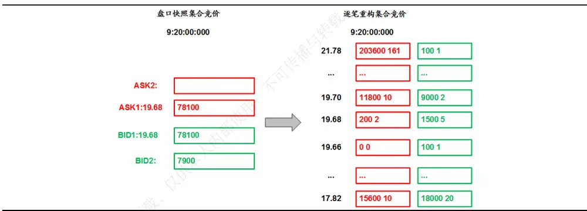
资料来源： ，海通证券研究所

## 连续竞价阶段

和集合竞价阶段相比，连续竞价阶段的快照行情相对更为复杂。如下图所示，连续竞价阶段的第一个完整快照行情出现于 9:25，即集合竞价结束的那一刻。每 3秒或更长周期更新一次，主要包含买卖前十档的价量信息和每档的成交笔数，以及买一和卖一档位前 50个订单的委托明细。

图2 连续竞价阶段，盘口快照行情样例
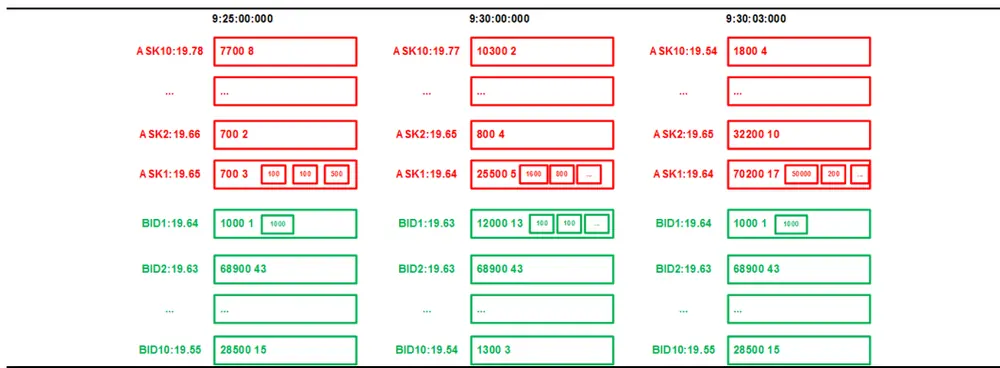
资料来源：Wind，海通证券研究所

与快照行情相比，逐笔委托中包含了连续竞价阶段的全部委托单信息，如，挂撤单时间点等，因而可以捕捉更为完整的集合竞价阶段的投资者行为。下图为某个股票在连续竞价阶段，经逐笔数据还原后的盘口行情。其中，实线部分为快照行情时点的盘口行情，虚线则为相邻两个快照时点间的盘口行情。

[Table_Pic 图 Pe]3 连续竞价阶段，逐笔数据还原后的盘口行情样例
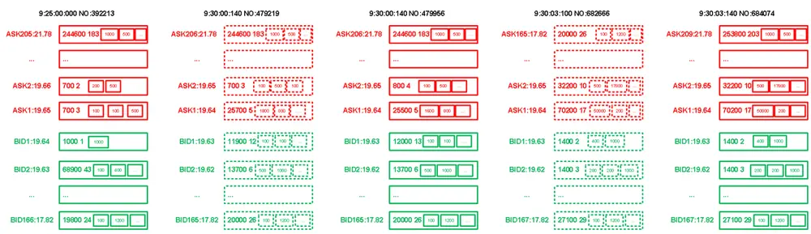
资料来源： ，海通证券研究所

我们认为，连续竞价阶段用逐笔数据还原盘口行情，可以带来以下信息优势。

首先，理论上，可将订单簿的更新频率提升到 0.01 秒以内。即，每一个新到订单对订单簿产生影响后，最新的盘口行情。

其次，在对比由逐笔行情还原和交易所直接推送的快照行情后，我们发现， 起，交易所直接推送的每个股票第一个快照行情的时间戳并非都是 ，而是至少延迟了 秒。进一步比较不同股票的延迟状况，还可发现，在交易所每次推送的 秒快照中，每个股票相对 3 秒整点的延迟几乎是相同的。由此，我们猜测，交易所很可能是以 秒为周期，按照证券代码的顺序依次生成快照行情。所以，对于那些代码排序靠后的证券，交易所直接推送的快照行情可能存在较大的迟滞，对投资决策产生不利影响。而使用逐笔数据还原，则可最大程度上避免这一问题，实时跟踪订单簿的全貌。

最后，由逐笔数据还原的连续竞价阶段的盘口行情包含更加丰富的信息。总档位最高可达数百档，理论上可以涵盖涨跌停价之间所有可能的成交价格。每一档中又包含所有订单的委托量、委托时间等细节信息，不再局限于第一档的前 50 个订单。

## 2. 限价订单簿（LOB）的应用 1：模拟撮合与 TWAP策略

## 2.1模拟撮合系统

由概率论中的大数定律可知，提升交易频率是实现预期正收益的重要途经。然而，更高的交易频率也使得策略收益对交易成本更加敏感。我们常常会发现，一些回测表现良好的策略，运用于实际交易后，效果不尽如人意。一个相当重要的原因就是低估了交易成本。倘若我们能在回测中引入模拟撮合系统，那就可以更加准确地估计交易成本，从而更合理地评估和推断策略在真实交易中的效果。

下图展示了我们用某个股票的逐笔数据构造的一个模拟撮合过程示例。由于是委卖队列，因此越靠近队列右侧的委托单，执行的优先级越高。某一时刻，卖一价为 19.65元，此价格上有 3个委托量为 1 手的订单。假设策略信号为卖出 1 手，且需要尽快成交。那么，当前的市场状态下，这 1 手虚拟订单就应该排在卖一委托队列的第 4位。

继续观察还原后的订单簿，如果在这个时刻后，存在大于等于卖一价的买单或撤单信息，那么就可以通过订单信息中的订单编号，定位该成交或撤单是否消耗虚拟订单的前序订单，从而实时判定虚拟订单的成交优先级。直到前序订单全部成交或撤销，若还存在新的大于等于卖一价的买单存在，则虚拟订单被成交，完成撮合。由此可见，有了逐笔数据还原的盘口行情，我们可以大致掌握订单多久会成交，成交的概率有多大。

图4 模拟撮合过程示例
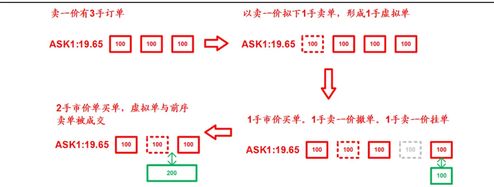
资料来源：Wind，海通证券研究所

由上述这个简单的例子可见，经逐笔数据还原的盘口行情可以尽可能保证模拟撮合过程中成交优先级的精确性，从而更好地估计交易成本。然而，这种方法仅对委托量较小的订单适用。当虚拟订单的委托量非常大时，对盘口行情的冲击很难用模拟撮合过程刻画和度量，需要更为复杂的系统和深入的研究。

## 2.2限价单与市价单 TWAP 策略

实践中，机构投资者在交易时，都会不同程度地使用算法交易策略。为的是通过分散下单，降低冲击成本和极端交易价格对整体交易成本的影响。有了模拟撮合系统，我们就可以更好地评估所用算法交易策略产生的交易成本。

常见的算法交易策略有 VWAP与 TWAP两大类。由于 VWAP 策略需要股票的成交量分布，因此在交易考核过程中更多以 TWAP为基准，评价算法交易的分散下单效果。最简单的 TWAP算法交易策略又可分为市价单 TWAP和限价单 TWAP两种，具体定义如下：

- 市价单 TWAP：每 3 秒下等量的市价单。

限价单 TWAP：每 3秒以本方最优价下等量限价单。若没有成交则撤单，每个分钟内所有未成交部分在该分钟末以市价单一次性下出。

为了更好地说明和比较这两种 TWAP策略，我们选取京东方 A、中国平安两只股票，证券 ETF、创业板 50ETF两只 ETF进行模拟实践。考虑到机构投资者在建仓时，一般会选在全天流动性最好的开盘后半小时；或者为了捕捉当日开盘成交信息，会在开盘后第二个半小时进行交易。我们分别在这两个时段进行了测试。

同时，为了更加接近真实的交易状态，我们对模拟订单加入盘口委托队列设臵了 0.5秒的延迟。即，订单实际加入的是从下单信号发出时刻计，0.5 秒之后的盘口委托队列。考虑到股票与 ETF的流动性差异，对于股票，我们测试了在两个半小时内成交 1000 万与 1 亿的结果；对于 ETF，需要成交的金额则分别为 200 万与 2000 万。

下表展示的是限价单 TWAP 策略在 2 个股票和 2个 ETF上的模拟效果。其中，限价单日均超额收益代表限价单相对市价单所节省的成本，限价单日均胜率为成交价格优于市价单的限价单占比，日均强制成交比例为每分钟末一次性以市价单成交的量占当日总成交量的比例，日均强制成交亏损为强制成交金额相对本手方最优价的亏损。

表 2 限价单 TWAP 算法交易策略的模拟结果（2021.06-2021.08）

|  |  |  | 限价单日均超额收益 |  | 限价单日均胜率 |  | 日均强制成交比例 |  | 日均强制成交亏损 |  |
| --- | --- | --- | --- | --- | --- | --- | --- | --- | --- | --- |
| 京东方A |  | 9:30-10:00 | 买入 | 卖出 | 买入 | 卖出 | 买入 | 卖出 | 买入 | 卖出 |
|  | 1000万 | 9:30-10:00 | 0.005% | 0.007% -0.003% | 59.15% | 71.83% | 90.21% | 89.73% | -0.003% | -0.003% |
|  | 1亿 |  | -0.005% |  | 28.17% | 35.21% | 90.74% | 90.23% | -0.017% | -0.016% |
|  | 1000万 | 10:00-10:30 | 0.002% | 0.002% | 53.52% | 60.56% | 95.94% | 95.97% | -0.002% | -0.002% |
| 中国平安 | 1亿 | 10:00-10:30 | -0.006% | -0.007% | 19.72% | 26.76% | 96.31% | 96.31% | -0.010% | -0.012% |
|  | 1000万 | 9:30-10:00 | 0.004% | 0.007% | 67.61% | 78.87% | 47.71% | 43.97% | -0.006% | -0.005% |
|  | 1亿 | 9:30-10:00 | -0.003% | -0.001% | 32.39% | 46.48% | 52.93% | 49.06% | -0.028% | -0.029% |
|  | 1000万 | 10:00-10:30 | 0.001% | 0.002% | 54.93% | 66.20% | 61.58% | 59.85% | -0.005% | -0.004% |
|  | 1亿 | 10:00-10:30 | -0.011% | -0.013% | 8.45% | 11.27% | 67.76% | 65.53% | -0.026% | -0.031% |
| 证券ETF | 200 万 | 9:30-10:00 | 0.008% | 0.009% | 63.38% | 74.65% | 78.00% | 76.77% | -0.005% | -0.004% |
|  | 2000万 | 9:30-10:00 | -0.003% | -0.002% | 39.44% | 46.48% | 80.02% | 78.80% | -0.021% | -0.021% |
|  | 200万 | 10:00-10:30 | 0.004% | 0.000% | 63.38% | 47.89% | 87.46% | 87.01% | -0.004% | -0.003% |
|  | 2000万 | 10:00-10:30 | -0.007% | -0.012% | 35.21% | 19.72% | 88.75% | 88.38% | -0.018% | -0.018% |
| 创业板 50ETF | 200万 | 9:30-10:00 | 0.006% | 0.002% | 56.34% | 61.97% | 87.05% | 86.94% | -0.001% | -0.001% |
|  | 2000万 | 9:30-10:00 | 0.002% | -0.002% | 50.70% | 50.70% | 87.34% | 87.22% | -0.007% | -0.006% |
|  | 200万 | 10:00-10:30 | 0.004% | -0.001% | 60.56% | 45.07% | 92.63% | 92.64% | -0.001% | -0.001% |
|  | 2000万 | 10:00-10:30 | 0.001% | -0.004% | 50.70% | 33.80% | 92.90% | 92.86% | -0.004% | -0.004% |

资料来源：Wind，海通证券研究所

如上表所示，当需要成交的金额提升时，限价单 策略的表现均有一定程度下滑，具体表现在日均超额收益和日均胜率的降低，程度则与强制成交比例以及随之而来的强制成交亏损的提高负相关。即，强制成交的比例越高，强制成交亏损越大，日均超额收益和日均胜率越低。另外，从上表中还可发现，在流动性相对较差的第二个半小时内，强制成交比例明显高于第一个半小时。

理论上，在流动性充裕的环境下，限价单 策略应该比市价单 策略有更低的交易成本。然而，从上表中的对比分析可以看出，如果每个 3秒的限价单成交概率较低，就会导致很多订单堆积在分钟末被迫以市价单成交。而一旦堆积的量超过了最优对手方价格的委托量时，则相比均匀的市价单 TWAP策略就会产生亏损，从而侵蚀掉限价单成交部分累积的超额收益。

因此，一个可能的改进思路是追求在每个 3秒下单时，尽可能完成交易，避免过多的未成交订单堆积到分钟末被强制成交，也即，尽可能降低强制成交比例。具体而言，我们在每次下单时，都以保证成交为目标，在限价单和市价单中择优而从。若限价单成交概率高，则优先限价单；反之，则优先市价单。因此，我们需要设计一种机制或一个指标，来帮助我们决策，当前应该是下限价单还是市价单。

## 3. 限价订单簿（LOB）的应用 2：改进 TWAP策略

## 3.1限价买卖委托成交概率

强制成交的产生是由于短期价格向上（向下），卖出（买入）限价委托更易于成交时，投资者尝试以限价形式买入（卖出）。因此，如果某个指标可以标识当前时刻买入限价委托与卖出限价委托哪个更易成交，那就可以提升下单的成交概率，从而降低最终的强制成交比例。

定义3秒内成交量最大的限价买入订单的委托量与3秒内全部限价买入委托量的比值，减去 3秒内成交量最大的限价卖出订单的委托量与 3 秒内全部限价卖出委托量的比值，为限价买卖委托成交概率（下简称买卖成交概率）。

$$
\begin{aligned}TradeRatio_{t_{j}}=&BidMatchVol_{max,t_{j}}/BidOrderVol_{t_{j}}\\&-AskMatchVol_{max,t_{j}}/AskOrderVol_{t_{j}}\end{aligned}
$$

3 秒内成交量最大的买入限价单代表较短时间内，买入限价单的实际最大可成交量。它与全部买入限价委托量的比值可在一定程度上刻画这个 3 秒内，下买入限价单的成交概率。当下买入限价单的成交概率大于下卖出限价单的成交概率，即买卖成交概率大于0 时，可以认为买入限价单更易成交，反之则是卖出限价单更易成交。

根据这个指标，可改进原来的限价单 TWAP策略。对于买入委托，若买卖成交概率大于 0，则下买入限价单，否则下买入市价单；对于卖出委托，若买卖成交概率小于 0，则下卖出限价单，否则下卖出市价单。图 5-10 展示的是根据改进后的限价单 TWAP策略，前文 4 个证券的限价单的成交概率与强制成交比例。

图5 京东方 A限价单成交概率
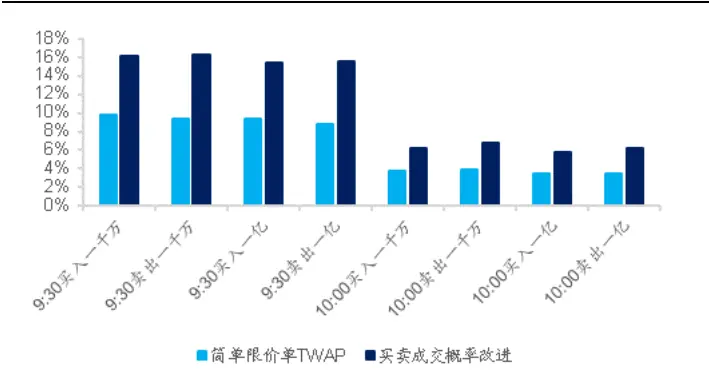
资料来源：Wind，海通证券研究所

图6 京东方 A强制成交比例
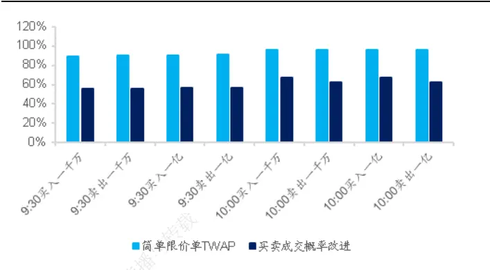
资料来源：Wind，海通证券研究所

图7 中国平安限价单成交概率
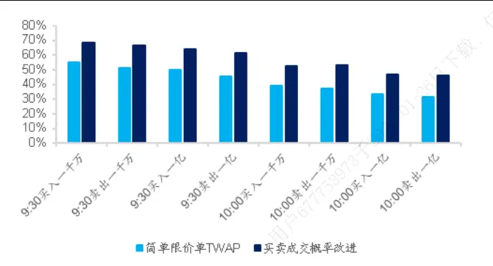
资料来源：Wind，海通证券研究所

图8 中国平安强制成交比例
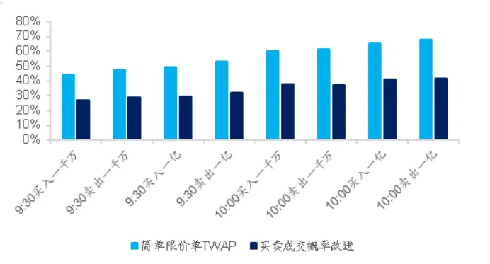
资料来源：Wind，海通证券研究所

图9 证券 ETF限价单成交概率
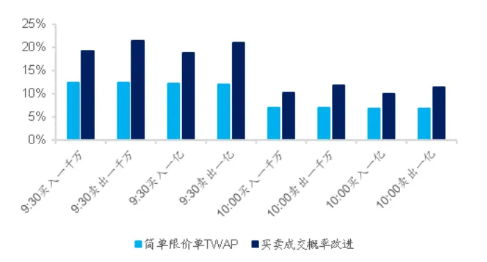
资料来源：Wind，海通证券研究所

图10 证券 ETF强制成交比例
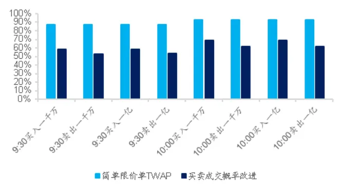
资料来源：Wind，海通证券研究所

图11 创业板 50ETF限价单成交概率
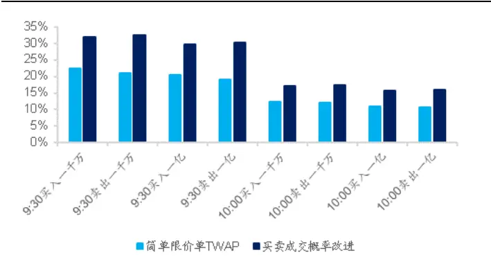
资料来源：Wind，海通证券研究所

图12 创业板 50ETF强制成交比例
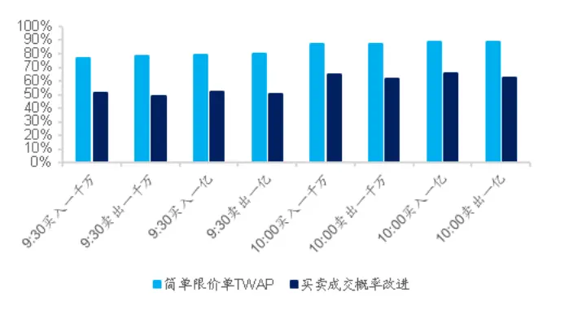
资料来源：Wind，海通证券研究所

无论是股票还是 ETF，使用改进后的 TWAP策略均可显著提升限价单的成交概率，并降低分钟末的强制成交比例。不过，利用买卖成交概率指导下单决策的效果虽好，却无法用于实践，因为它是下单指令的滞后指标。即，在这个 3秒初我们要做出下限价单还是市价单的决策，依据却是之后这个 3秒的成交信息。

所以，更加切实可行的办法是，基于下单时可获得的信息构建指标。如果它能对买卖成交概率有一定的预测能力，我们可以期待会产生接近的效果。

## 3.2基于限价订单簿（LOB）指标改进 TWAP 策略

要寻找能预测买卖成交概率的指标，同样得从还原后的限价订单簿（LOB）出发。从海外的经验来看，从 LOB中提取的信息一般可分为静态的订单簿和动态的订单流。其中，订单簿信息包括每个股票不同时刻和价位的买卖委托情况；订单流信息包括不同价位上买卖委托订单、成交订单和撤单的统计数据。具体的指标及其定义如下表所示。

表 3 LOB 常用指标

| 数据类型用户677753973订单簿指标 | 指标名 | 变量释义 |
| --- | --- | --- |
|  | $\left\|\overline{P_{A_{it_{j}}}}\right\|$ | 第i档j时刻委卖价 |
|  | $V_{A_{it_{j}}}$ | 第i档j时刻委卖量 |
|  | $C_{A_{it_{j}}}$ | 第i档j时刻委卖单数 |
|  | $P_{mid_{t_{j}}}$ | t时刻买卖中间价 |
|  | $\left\|\overline{P_{B_{it_{j}}}}\right\|$ | 第i档j时刻委买价 |
|  | $V_{B_{it_{j}}}$ | 第i档j时刻委买量 |
|  | $\left\|\overline{C_{B_{it_{j}}}}\right\|$ | 第i档j时刻委买单数 |
| 订单流指标 | $OrderVol_{A_{i}t_{j-1,j}}$ | j-1 到 j 时间内第i 档委卖单委托量 |
|  | $\left\|{OrderAmt}_{A_{i}t_{j-1,j}}\right\|$ | j-1 到 j 时间内第i 档委卖单委托金额 |
|  | $OrderCount_{A_{i}t_{j-1,j}}$ | j-1 到j 时间内第i 档委卖单委托数量 |
|  | $\left\|{OrderVol}_{B_{i}t_{j-1,j}}\right\|$ | j-1 到 j 时间内第i 档委买单委托量 |
|  | $OrderAmt_{B_{i}t_{j-1,j}}$ | j-1 到 j 时间内第i 档委买单委托金额 |
|  | $\left\|{OrderCount}_{B_{i}t_{j-1,j}}\right\|$ | j-1 到 j时间内第i 档委买单委托单数量 |
|  | $MatchVol_{A_{i}t_{j-1,j}}$ | j-1 到 j 时间内第 i 档委卖单成交量 |
|  | $\left\|{Mat}ch{{Amt}_{A_{i}t_{j-1,j}}}\right\|$ | j-1 到 j 时间内第i 档委卖单成交金额 |
|  | $MatchCount_{A_{i}t_{j-1,j}}$ | j-1 到j时间内第i档委卖单成交单数量 |
|  | $\left\|{MatchVol}_{B_{i}t_{j-1,j}}\right\|$ | j-1 到 j 时间内第i 档委买单成交量 |
|  | $MatchAmt_{B_{i}t_{j-1,j}}$ | j-1 到 j 时间内第i 档委买单成交金额 |
|  | $\left\|\begin{matrix}{MatchCount_{B_{i}t_{j-1,j}}}\\\end{matrix}\right\|$ | j-1 到 j 时间内第i 档委买单成交单数量 |
|  | $CancelVol_{A_{i}t_{j-1,j}}$ | j-1 到 j 时间内第 i 档委卖单撤单量 |
|  | $\left\|CancelAmt_{A_{i}t_{j=1,j}}\right\|$ | j-1 到 j 时间内第i档委卖单撤单金额 |
|  | $CancelCount_{A_{i}t_{j-1,j}}$ | j-1 到 j时间内第i档委卖单撤单数量 |
|  | $\boxed{CancelVol_{B_{i}t_{j-\mathtt{i},j}}}$ | j-1 到 j时间内第i档委买单撤单量 |
|  | $CancelAmt_{B_{i}t_{j-1,j}}$ | j-1 到 j时间内第 i档委买单撤单金额 |
|  | $\left\|{{CancelCount}_{B_{i}t_{j-\mathtt{i},j}}}\right\|$ | j-1 到j时间内第i档委买单撤单数量 |

资料来源：海通证券研究所整理

有了上述 LOB 基础指标，我们便可衍生出其他更为复杂的指标，用以刻画当前的买卖状态，并指导下单。

比如，下一个 3 秒内的成交情况必然与当前的委托状态息息相关。如果当前买一价的委买量很大，那么限价买单的成交难度就会上升。因此，订单簿的强弱是影响成交概率的重要因素之一。于是，我们可以构建如下的 LOB衍生指标。

t 时刻买一和卖一价位上的订单簿相对强弱：

$$
SheetDiff_{t_{j}}=\left(V_{B_{1t_{j}}}-V_{A_{1t_{j}}}\right)/\left(V_{B_{1t_{j}}}+V_{A_{1t_{j}}}\right)
$$

此外，过去一段时间内订单簿的变化，包括发生的委托、撤单和成交，反映了所有市场参与者对该证券的观点，同样会影响未来成交概率的高低。假设过去一段时间内，买一价的成交量大幅高于卖一价，说明对手方流动性充足，通过买一价买入的难度较小。此时，下限价买单应当更容易成交。由此，我们得到了第二个 LOB衍生指标，它基于j-1时刻到j 时刻的订单流信息。

成交相对强弱：

$$
MatchDiff_{t_{j-1,j}}=\left(MatchVol_{B_{1}t_{j-1,j}}-MatchVol_{A_{1}t_{j-1,j}}\right)\bigr/TotVol_{B_{1}t_{j-1,j}}
$$

其中，

$$
\begin{aligned}TotVol_{B_{1}t_{J-1,j}}&=OrderVol_{B_{1}t_{J-1,j}}+OrderVol_{A_{1}t_{J-1,j}}+CancelVol_{B_{1}t_{J-1,j}}\\&\quad+CancelVol_{A_{1}t_{J-1,j}}+MatchVol_{B_{1}t_{J-1,j}}+MatchVol_{A_{1}t_{J-1,j}}\end{aligned}
$$

类似地，我们还可以构建过去一段时间内，与买一价和卖一价上挂单量和撤单量的变化相关的 LOB衍生指标。

挂单相对强弱：

$$
OrderDiff_{t_{j-1,j}}=\Big(OrderVol_{B_{1}t_{j-1,j}}-OrderVol_{A_{1}t_{j-1,j}}\Big)\big/TotVol_{B_{1}t_{j-1,j}}
$$

撤单相对强弱：

$$
CancellDiff_{t_{j-1,j}}=\left(CancellVol_{B_{1}t_{j-1,j}}-CaClVol_{A_{1}t_{j-1,j}}\right)\Big/TotalVol_{B_{1}t_{j-1,j}}
$$

从上述 4个指标的构建方式可知，订单簿相对强弱在将要下单的这个 3秒初即可获得；成交、挂单和撤单的相对强弱使用的也是历史数据，为简单计，我们取最近一个 3秒的 LOB信息计算。

那么，这 4 个领先指标对前文中已被证明能够有效降低强制成交比例的指标——买卖成交概率的预测效果如何，将决定它们能否达成预设的目标。

为此，我们首先计算了上述 4 个 LOB 衍生指标与买卖成交概率的 IC，结果如下表所示。整体来看，订单簿相对强弱的预测效果最好，挂单相对强弱次之。不过，同样的指标应用于不同证券，结果也是大相径庭。相对而言，这 4 个衍生指标更适用于京东方A 和证券 ETF。

表 4 LOB 衍生指标与买卖成交概率的 IC（2021.06-2021.08）

|  |  | 订单簿相对强弱 |  | 挂单相对强弱 |  | 成交相对强弱 |  | 撤单相对强弱 |  |
| --- | --- | --- | --- | --- | --- | --- | --- | --- | --- |
| 京东方A |  | IC | T值 | IC | T值 | IC | T值 | IC | T值 |
|  | 9:30-10:00 | -0.381 | -33.149 | 0.228 | 26.062 | -0.026 | -2.297 | -0.013 | -2.074 |
|  | 10:00-10:30 | -0.437 | -33.780 | 0.235 | 31.237 | -0.008 | -0.731 | -0.020 | -3.105 |
| 中国平安 | 9:30-10:00 | -0.124 | -18.476 | 0.048 | 10.079 | -0.123 | -14.735 | -0.021 | -4.343 |
|  | 10:00-10:30 | -0.164 | -27.546 | 0.058 | 13.860 | -0.092 | -11.213 | -0.016 | -3.998 |
| 证券ETF | 9:30-10:00 | -0.291 | -35.515 | 0.116 | 21.224 | -0.023 | -2.207 | 0.056 | 10.587 |
|  | 10:00-10:30 | -0.300 | -39.355 | 0.113 | 26.962 | -0.005 | -0.622 | 0.054 | 12.231 |
| 创业板 | 9:30-10:00 | -0.113 | -16.925 | 0.055 | 11.520 | -0.050 | -7.685 | 0.012 | 2.310 |
| 50ETF | 10:00-10:30 | -0.137 | -21.153 | 0.052 | 12.423 | -0.024 | -5.115 | 0.001 | 0.378 |

资料来源：Wind，海通证券研究所

根据上表的结果，我们以 4个 LOB 衍生指标为自变量，买卖成交概率为因变量构建回归模型。每天都使用上个交易日的数据更新模型，然后在每个 3秒初，代入当日可得的最新指标，预测买卖成交概率，以此作为决策依据。下表展示的是使用2021.06-2021.08 的数据，测试得到的回归模型的预测精度。

表 5 LOB 衍生指标对买卖成交概率的预测精度（2021.06-2021.08）

|  |  | MAE | MSE | R-square | 准确率1 | 精确率2 | 召回率3 | F-score⁴ |
| --- | --- | --- | --- | --- | --- | --- | --- | --- |
| 京东方A | 9:30-10:00 | 0.526 | 0.616 | 0.068 | 64.0% | 68.7% | 66.8% | 67.7% |
|  | 10:00-10:30 | 0.517 | 0.610 | 0.137 | 66.1% | 72.8% | 68.8% | 70.7% |
|  | 9:30-10:00 | 0.318 | 0.466 | 0.020 | 55.5% | 57.3% | 61.2% | 59.2% |
| 中国平安 证券ETF | 10:00-10:30 | 0.364 | 0.501 | 0.031 | 56.7% | 59.4% | 61.4% | 60.4% |
|  | 9:30-10:00 | 0.586 | 0.667 | 0.049 | 63.1% | 70.1% | 68.3% | 69.2% |
|  | 10:00-10:30 | 0.594 | 0.671 | 0.050 | 63.2% | 72.4% | 68.8% | 70.6% |
| 创业板 | 9:30-10:00 | 0.527 | 0.607 | -0.027 | 54.5% | 63.1% | 61.0% | 62.0% |
| 50ETF | 10:00-10:30 | 0.554 | 0.623 | -0.038 | 54.8% | 66.2% | 61.4% | 63.7% |

资料来源：Wind，海通证券研究所

若从 MSE、MAE和 R-square 的角度来评价，上述回归模型的预测效果均不甚理想。但在实践中，买卖成交概率或其预测值都是被当作一个 2 分类变量使用。即，我们只关心它大于 还是小于 。因此，如果从分类模型评价标准来看，准确率与 都超过 50%。对于京东方与证券 ETF，准确率超过 60%，F-score 更是超过 65%。由此可见，从分类的角度，模型还是有一定的预测能力。

于是，我们便可使用预测值代替买卖成交概率，为京东方 等 个证券在下个 秒是下限价单还是市价单提供决策依据。如图 所示，基于预测值改进的 策略，同样可以提高限价单的成交概率、降低强制成交比例，且改进效果与真实值较为接近。

图13 改进 TWAP策略的京东方 A限价单成交概率
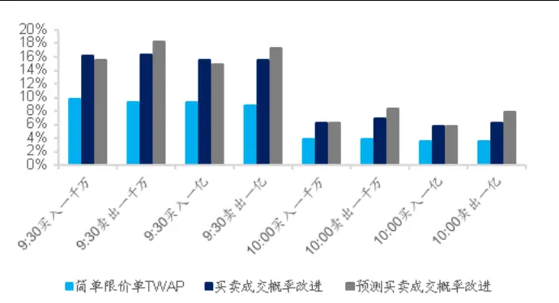
资料来源：Wind，海通证券研究所

图14 改进 TWAP策略的京东方 A强制成交比例
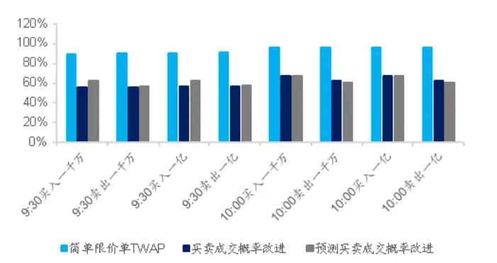
资料来源：Wind，海通证券研究所

图15 改进 TWAP策略的中国平安限价单成交概率
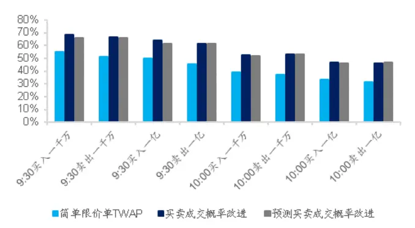
资料来源：Wind，海通证券研究所

图16 改进 TWAP策略的中国平安强制成交比例
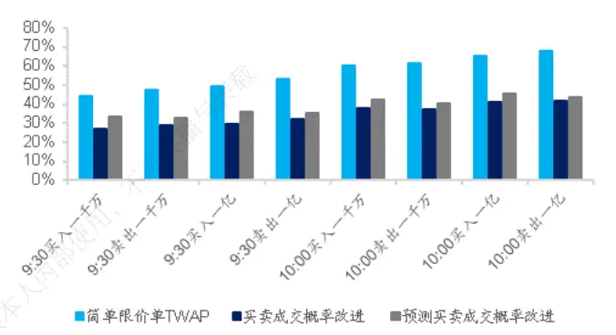
资料来源：Wind，海通证券研究所

图17 改进 TWAP策略的证券 ETF限价单成交概率
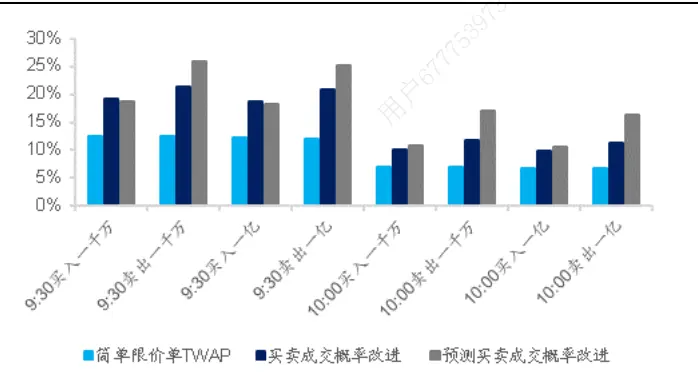
资料来源：Wind，海通证券研究所

图18 改进 TWAP策略的证券 ETF强制成交比例
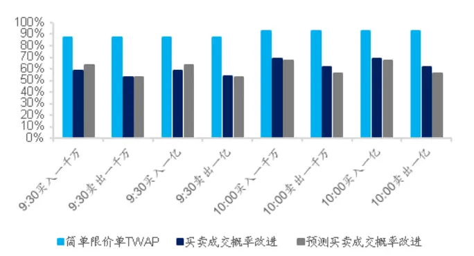
资料来源：Wind，海通证券研究所

图19 改进 TWAP策略的创业板 50ETF限价单成交概率
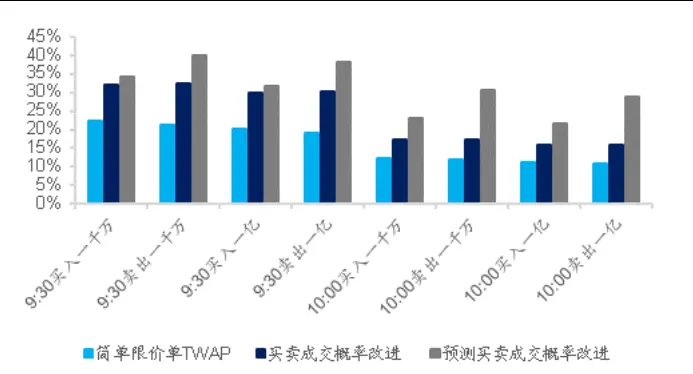
资料来源：Wind，海通证券研究所

图20 改进 TWAP策略的创业板 50ETF强制成交比例
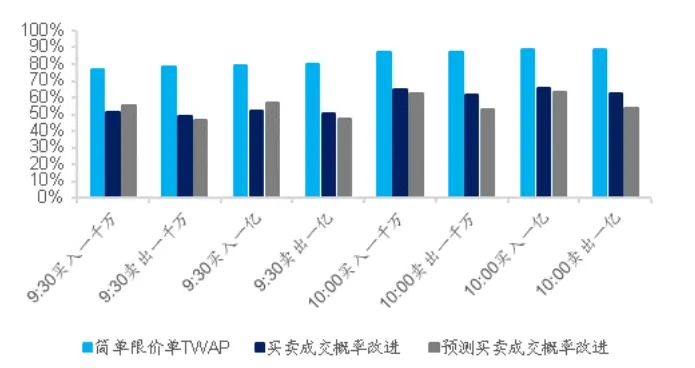
资料来源：Wind，海通证券研究所

下表进一步展示了使用基于预测值改进的 TWAP策略，在我们的模拟撮合系统中，所产生的优势。具体包括两类评价指标，（1）相对市价单（限价单）的超额收益：即改进后策略相对于市价单（限价单）TWAP策略节省的成本；（2）相对市价单（限价单）的胜率：相对于市价单（限价单）TWAP策略产生成本节省的天数占比。超额收益和胜率越高，表明交易策略对成本的改善越显著。

表 6 改进 TWAP 策略相对简单 TWAP 策略的优势（2021.06-2021.08）

|  |  |  | 相对市价单超额收益 |  | 相对市价单胜率 |  | 相对限价单超额收益 |  | 相对限价单胜率 |  |
| --- | --- | --- | --- | --- | --- | --- | --- | --- | --- | --- |
| 京东方A |  | 9:30-10:00 | 买入 | 卖出 0.010% | 买入 87.32% | 卖出 | 买入 | 卖出 | 买入 | 卖出 |
|  | 1000万 |  | 0.016% |  |  | 69.01% | 0.008% | 0.005% | 71.83% | 67.61% |
|  | 1亿 | 9:30-10:00 | 0.008% | 0.004% | 66.20% | 52.11% | 0.011% | 0.009% | 81.69% | 74.65% |
|  | 1000万 | 10:00-10:30 | 0.014% | 0.012% | 88.73% | 87.32% | 0.012% | 0.010% | 88.73% | 84.51% |
| 中国平安 | 1亿 | 10:00-10:30 | 0.008% | 0.007% | 76.06% | 77.46% | 0.014% | 0.013% | 91.55% | 90.14% |
|  | 1000万 | 9:30-10:00 | 0.003% | -0.005% | 69.01% | 32.39% | -0.004% | -0.010% | 32.39% | 16.90% |
|  | 1亿 | 9:30-10:00 | -0.003% | -0.010% | 45.07% | 21.13% | -0.002% | -0.007% | 39.44% | 22.54% |
|  | 1000万 | 10:00-10:30 | -0.001% | -0.004% | 52.11% | 28.17% | -0.002% | -0.005% | 28.17% | 18.31% |
|  | 1亿 | 10:00-10:30 | -0.011% | -0.011% | 12.68% | 4.23% | 0.002% | 0.000% | 67.61% | 56.34% |
| 证券ETF | 200万 | 9:30-10:00 | 0.006% | 0.004% | 67.61% | 61.97% | 0.004% | -0.002% | 71.83% | 50.70% |
|  | 2000万 | 9:30-10:00 | 0.003% | 0.002% | 60.56% | 53.52% | 0.005% | 0.000% | 73.24% | 60.56% |
|  | 200 万 | 10:00-10:30 | 0.006% | 0.006% | 67.61% | 74.65% | 0.007% | 0.002% | 77.46% | 59.15% |
|  | 2000万 | 10:00-10:30 | 0.004% | 0.004% | 63.38% | 67.61% | 0.008% | 0.003% | 78.87% | 67.61% |
| 创业板 50ETF | 200 万 | 9:30-10:00 | 0.002% | -0.002% | 58.82% | 42.65% | -0.008% | -0.009% | 29.41% | 26.47% |
|  | 2000万 | 9:30-10:00 | -0.006% | -0.007% | 38.24% | 34.29% | -0.004% | -0.004% | 38.24% | 45.59% |
|  | 200 万 | 10:00-10:30 | -0.004% | 0.001% | 39.71% | 57.35% | -0.004% | -0.004% | 36.76% | 44.12% |
|  | 2000万 | 10:00-10:30 | -0.012% | -0.005% | 14.71% | 38.24% | 0.000% | 0.001% | 51.47% | 70.59% |

资料来源：Wind，海通证券研究所

我们欣喜地发现，对于京东方 A和证券 ETF，改进的 TWAP策略全面优于简单的市价单和限价单 TWAP策略，日均能够带来 0.3-1.4 个 bp 左右的成本下降。但对于中国平安和创业板 50ETF，效果就差了很多。这似乎和前文的结果矛盾，毕竟这两个证券在改进的 TWAP策略下，强制成交比例实实在在被降低了不少。

事实上，强制成交比例的降低，往往是以更高的市价单成交比例为代价。如果分钟末强制成交比例降低所带来的成本减少，无法弥补分钟内市价单成交比例提升所带来的成本增加，那么最终的交易成本很有可能还不如简单的限价单 TWAP策略。

由此可见，设计一个好的算法交易策略绝非易事，不同的证券可能需要个性化的指标和不同复杂程度的模型。但仅从本文的案例来看，简单的 LOB衍生指标和回归模型不失为一个良好的起点。

## 4. 限价订单簿（LOB）的应用 3：挖掘高频价量因子

限价订单簿（LOB）是对市场内股票价量信息最细粒度的刻画，任何价量指标都可以被视作是一系列 基础指标经过某种运算后的结果。与合成后的单一因子相比，这些基础指标包含更多信息，为我们寻找更优的收益预测因子提供了丰富的原材料。

## 4.1买入意愿因子的 LOB指标分解

在海通量化团队前期的报告《高频因子的现实与幻想》中，我们结合盘口快照与逐笔成交数据，构建了开盘后买入意愿占比因子。即， 间，每个股票的买入意愿与总成交金额的比值。其中，买入意愿定义为净委买增额与净主买成交额的和，前者依赖盘口变动，后者则根据主买主卖计算。

图21 基于盘口快照与逐笔成交数据的买入意愿示意
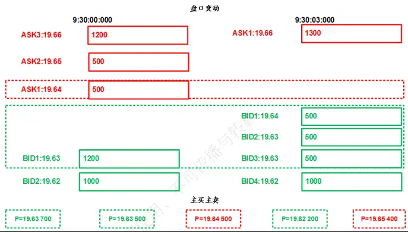
资料来源：Wind，海通证券研究所

我们将委买增额定义为第二个 Tick 中委买价高于第一个 Tick 买一价的所有委买单的委托金额之和，与第一个 Tick 买一价委托金额的差值（上图“盘口变动”部分的绿色虚线框）。

相应地，委卖增额定义为第二个 Tick 中委卖价低于第一个 Tick 卖一价的所有委卖单的委托金额（本例中为 0）之和，与第一个 Tick 卖一价委托金额的差值（上图“盘口变动”部分红色虚线框）。

净委买增额定义为委买增额与委卖增额的差。净主买成交额定义为，这两个 Tick 之间，主动买入金额（上图“主买主卖”部分的红色虚线框）与主动卖出金额（上图“主买主卖”部分的绿色虚线框）的差。

从上述计算过程可见，买入意愿因子本质上刻画的是两个 Tick 之间委托队列的变化和成交的情况，根据 1.2 节的介绍，这一过程完全可由更加精细的 LOB来实现。

如下图所示，连续竞价开始后的第一个 3秒内，微观市场结构的变化过程如下：

9:30:01:100，卖出市价单主动吃掉买一档的两个限价单；

9:30:02:000，卖出市价单主动吃掉买一档的 200 股限价单，买入市价单主动吃掉卖一档的 500 股限价单；

9:30:03:000，卖一档的 100 股限价单和买二档 100 股限价单被撤销，同时，买四档有 200 股限价单挂入，买一档和买三档各有 400 股限价单挂入。

[Table_Pic 图 Pe]22 基于逐笔委托和逐笔成交数据的买入意愿示意
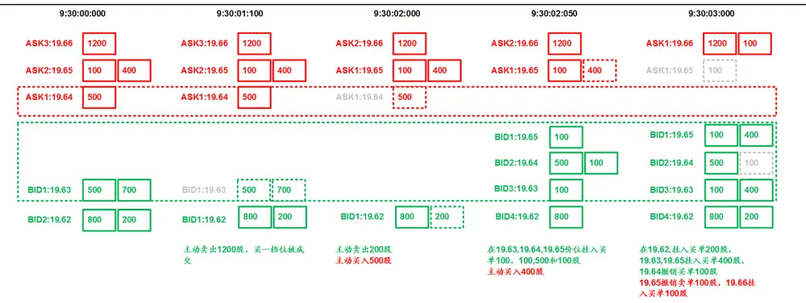
资料来源： ，海通证券研究所

经过上述数次订单挂撤与成交后，盘口状态从 9:30:00 变化至 9:30:03 处，与图 21所示的两个盘口快照完全对应。同时，根据前文对买入意愿的定义，我们可以进一步将其分解为图 22虚线框中挂单、撤单、成交的变化，以及该时间段内虚线框内外所有的成交变化，这 4个部分（均为 9:30-10:00 的数据，下同）。

首先，定义委买增量价格集合为：价格上涨时，取 3 秒初买一价 $\mathsf{B}_{1,\mathrm{t}}$ 与 3秒末买一价 $\mathbf{B}_{1,\mathrm{t}+3}$ 之间的所有价格；价格下跌时，取 $\mathsf{B}_{1,\mathrm{t}}$ 。

$$
Set_{bid}=\left\{B_{i}\left|\left\{\begin{matrix}{[\;B_{1,t},B_{1,t+3}\;],}&{B_{1,t+3}>B_{1,t}}\\{B_{1,t},}&{B_{1,t+3}\leq B_{1,t}}\end{matrix}\right\}\right.\right.
$$

类似地，定义委卖增量价格集合为：价格下跌时，取 3秒末卖一价 $\mathsf{A}_{1,\mathsf{t}+3}$ 与 3秒初卖一价 $\mathsf{A}_{1,\mathrm{t}}$ 之间的所有价格；价格上涨时，取 $\mathsf{A}_{1,\mathsf{t}}$

$$
Set_{ask}=\left\{A_{i}\left|\left\{\begin{aligned}{[A_{1,t+3_{i}},A_{1,t}],}&{{}\quad A_{1,t+3}<A_{1,t}}\\{A_{1,t},}&{{}\quad A_{1,t+3}\geq A_{1,t}}\end{aligned}\right\}\right.\right.
$$

其次，按买卖方向分别、依次汇总价格属于上述两个集合的挂单金额，撤单金额与成交金额。

$$
\begin{aligned}&BidSetOrderAmt_{j,j+3}=\sum OrederAmt_{B_{it_{j,j+3}}}\setminus B_i\in Set_{bid}\\&\\&BidSetCancellAmt_{j,j+3}=\sum ConcelAmt_{B_{it_{j,j+3}}}\setminus B_i\in Set_{bid}\\&\\&BidSetMatchAmt_{j,j+3}=\sum MatchAmt_{B_{it_{j,j+3}}}\setminus B_i\in Set_{bid}\\&\\&AsksSetOrderAmt_{j,j+3}=\sum OrederAmt_{A_{it_{j,j+3}}}\setminus A_i\in Set_{ask}\\&\\&AsksSetCancellAmt_{j,j+3}=\sum ConcelAmt_{A_{it_{j,j+3}}}\setminus A_i\in Set_{ask}\\&\\&AsksSetMatchAmt_{j,j+3}=\sum MatchAmt_{A_{it_{j,j+3}}}\setminus A_i\in Set_{ask}\\\end{aligned}
$$

第三，将每个买方指标减去对应的卖方指标，即可得到：净挂单金额，净撤单金额与净成交金额。

$$
\begin{aligned}&NetSetOrderAmt_{j,j+3}=BidSetOrderAmt_{i,j+3}-AskSetOrderAmt_{j,j+3}\\&\\&NetSetCaneLAmt_{j,j+3}=BidSetCaneLAmt_{j,j+3}-AskSetCaneLAmt_{i,j+3}\\&\\&NetSetMatchAmt_{j,j+3}=BidSetMatchAmt_{j,j+3}-AskSetMatchAmt_{j,j+3}\\\end{aligned}
$$

由此，可得净委买增额。

$$
\begin{aligned}NetIncAmt_{j,j+3}&=NetSetOrderAmt_{j,j+3}-NetSetCancellAmt_{j,j+3}\\&-NetSetMatchAmt_{j,j+3}\end{aligned}
$$

净主买金额的定义较为简单。首先，我们定义 3秒内所有买、卖金额。

$$
\begin{aligned}&BidMatchAmt_{j,j+3}=\sum MatchAmt_{B_it_{j,j+3}}\\&\\&AskMatchAmt_{j,j+3}=\sum MatchAmt_{A_it_{j,j+3}}\\\end{aligned}
$$

由于这两个指标都是根据限价订单上的成交金额计算的，实际上都属于被动成交。因此，用买入金额减卖出金额得到的是被动净买入金额，与主动净买入（净主买）金额互为相反数。

$$
NetMatchAmt_{j,j+3}=BiMAetchAmt_{j,j+3}-AskMatchAmt_{j,j+3}
$$

根据上述分析和定义，买入意愿就可进一步表示为挂单、撤单、成交和净被动买入四个因子的等权复合（不考虑正负号）。

$$
\begin{array}{rl}&{\quad BidIntentionAmt_{j,i+3}}\\&{=NetIncAmt_{j,i+3}-NetMatchAmt_{j,j+3}}\\&{=NetSetOrderAmt_{j,i+3}-NetSetCancelAmt_{j,j+3}-NetSetMatchAmt_{j,j+3}-NetMatchAmt_{j,j+3}}\end{array}
$$

虽然我们通过 指标给出了更加复杂的买入意愿定义，但本质上，它和从 秒快照数据得到的因子刻画的是同一种投资者行为，因此，两者在选股效果上应该没有差异。事实也是如此。如下表所示，两种不同方法得到的因子，在 、 和收益等方面几乎完全一致。

表 7 开盘后买入意愿占比因子的选股效果（深交所，2016.01-2021.09）

|  | IC | IC-IR | IC 胜率 | 多空月均 收益 | 多头月均 收益 | 空头月均 收益 |
| --- | --- | --- | --- | --- | --- | --- |
| 开盘后买入意愿占比（LOB） | 0.034 | 4.006 | 88.9% | 1.25% | 0.79% | -0.46% |
| 开盘后买入意愿占比（快照） | 0.034 | 3.988 | 88.9% | 1.19% | 0.75% | -0.44% |

资料来源：Wind，海通证券研究所

## 4.2从 LOB指标到特征提取

通过上述例子，我们验证了前文的观点：任何价量指标都可以被视作是一系列 LOB基础指标经过某种运算后的结果。不过，既然最终的选股效果没有差别，那把简单计算复杂化的意义何在呢？

依然以买入意愿因子为例，在上文中，我们将其表示为 4 个 LOB衍生指标的等权复合，它们各自代表了市场微观结构变化的一个方面。也就是说，从 LOB出发重构现有价量因子的过程，为我们提供了更加多维、立体的观察视角。从中，我们可以构建出更为丰富的描述市场微观结构特征的因子，并寻找其中蕴含的交易信号。这一优势，是原先使用 Tick 数据所不具备的。

例如，当买入意愿因子被分解为挂单、撤单、成交和被动净买入后，我们很自然地会联想到以下问题，这 4 个衍生指标各自除以同期的总成交金额作为新因子的选股效果

## 如何，等权线性复合（不考虑正负号）是不是最优的信号提取方式？

为此，我们首先考察每个因子的选股效果，如下表所示，开盘后被动净买入占比的IC 绝对值最高，开盘后净成交占比次之，开盘后净挂单占比再次，而开盘后净撤单占比的 IC 则接近于 0。

表 8 开盘后买入意愿分解后的细分因子选股效果（深交所，2016.01-2021.09）

|  | IC | IC-IR | IC 胜率 | 多空 月均收益 | 多头 月均收益 | 空头 月均收益 |
| --- | --- | --- | --- | --- | --- | --- |
| 开盘后净挂单占比 | 0.014 | 1.728 | 69.8% | 0.50% | 0.38% | -0.12% |
| 开盘后净撤单占比 | 0.009 | 1.392 | 66.7% | 0.32% | 0.54% | 0.23% |
| 开盘后净成交占比 | -0.022 | -2.452 | 19.0% | 1.37% | 0.49% | -0.33% |
| 开盘后被动净买入占比 | -0.027 | -2.942 | 19.0% | 1.38% | 0.59% | -0.34% |

资料来源： ，海通证券研究所

进一步考察 4个因子的相关性（见表 9），我们发现，开盘后净撤单占比因子和开盘后被动净买入占比因子高度相关。结合前者羸弱的选股能力，我们不禁怀疑复合时赋予两者相同的权重是否合理。此外，开盘后净挂单占比因子和开盘后净成交占比因子也有不低的相关性。

表 9 开盘后买入意愿分解后的细分因子相关性（深交所，2016.01-2021.09）

|  | 开盘后净挂单 占比 | 开盘后净撤单 占比 | 开盘后净成交 占比 | 开盘后被动净买入 占比 |
| --- | --- | --- | --- | --- |
| 开盘后净挂单占比 |  | 0.279 | 0.415 | 0.177 |
| 开盘后净撤单占比 | 0.279 使用 |  | -0.171 | 0.873 |
| 开盘后净成交占比 | 0.415 | -0.171 |  | -0.200 |
| 开盘后被动净买入占比 | 0.177 | 0.873 | -0.200 |  |

资料来源：Wind，海通证券研究所

综合因子之间 的差异和两两之间的相关性，我们认为，如果不考虑因子的实际意义，单从信号挖掘的角度， 个因子等权线性复合（不考虑正负号），或许并不是最优方案。因此，我们尝试用先逐次正交、再 IC加权的方式重新构建复合因子，并考察它的选股效果。

表 10 开盘后买入意愿分解后细分因子 IC加权复合的选股效果（深交所，2016.01-2021.09）

| 日 | IC | IC-IR | IC 胜率 | 多空 月均收益 | 多头 月均收益 | 空头 月均收益 |
| --- | --- | --- | --- | --- | --- | --- |
| 复合因子（正交+IC加权） | 0.034 | 4.023 | 90.5% | 1.31% | 0.79% | -0.51% |
| 开盘后买入意愿占比（LOB） | 0.034 | 4.006 | 88.9% | 1.25% | 0.79% | -0.46% |
| 开盘后买入意愿占比（快照） | 0.034 | 3.988 | 88.9% | 1.19% | 0.75% | -0.44% |

资料来源：Wind，海通证券研究所

由上表可见，复合因子展现出略优于两个原始因子的选股效果。具体表现在更高的IC-IR、IC 胜率和多空月均收益，但提升幅度极其有限。

是不是前进的方向有错呢？我们不该就此灰心。尽管上述尝试并未取得令人振奋的结果，但我们认为，它的意义却是非凡的。首先，我们证明了，从 LOB出发，可以提取更多甚至海量的有关投资者行为和市场微观结构的特征；其次，线性合成这些特征得到因子或交易信号的方式，可能在高频数据领域存在难以突破的瓶颈。而深度学习正是我们面对这两个需求时，较为理想的解决方案。因为它既需要大量特征的输入，又可以提供非线性的合成方式。在本系列的下一篇报告中，我们将详细介绍如何使用深度学习挖掘高频因子。

## 5. 总结与讨论

随着上交所推出逐笔委托数据，对于沪深两市投资者微观行为的刻画都可以精细到秒以内的频率上。本文基于逐笔数据，通过一些简单的案例介绍了限价订单簿（LOB）还原、模拟撮合系统、TWAP算法交易以及高频价量因子挖掘，这 4 个最常用的应用方向，为更进一步的算法交易优化和高频因子构建提供了扎实的基础和全新的视角。

本文涉及的所有方法均是从线性模型出发，目的时希望借助最朴素的技术，展现逐笔数据中蕴含的价值。从结果来看，无论是对算法交易策略还是高频价量因子，线性模型带来的改进很难做到全面而稳定。我们认为，在高频数据领域，利用更复杂的非线性模型，如深度学习，来解决交易信号生成等问题，或许是合理且必须的选择。

## 6. 风险提示

市场系统性风险、模型误设风险、有效因子变动风险。

# 信息披露

分析师声明

[Table冯佳睿yst金融工程研究团队s]

余浩淼金融工程研究团队

本人具有中国证券业协会授予的证券投资咨询执业资格，以勤勉的职业态度，独立、客观地出具本报告。本报告所采用的数据和信息均来自市场公开信息，本人不保证该等信息的准确性或完整性。分析逻辑基于作者的职业理解，清晰准确地反映了作者的研究观点，结论不受任何第三方的授意或影响，特此声明。

## 法律声明

本报告仅供海通证券股份有限公司（以下简称“本公司”）的客户使用。本公司不会因接收人收到本报告而视其为客户。在任何情况下，本报告中的信息或所表述的意见并不构成对任何人的投资建议。在任何情况下，本公司不对任何人因使用本报告中的任何内容所引致的任何损失负任何责任。

本报告所载的资料、意见及推测仅反映本公司于发布本报告当日的判断，本报告所指的证券或投资标的的价格、价值及投资收入可能载会波动。在不同时期，本公司可发出与本报告所载资料、意见及推测不一致的报告。

市场有风险，投资需谨慎。本报告所载的信息、材料及结论只提供特定客户作参考，不构成投资建议，也没有考虑到个别客户特殊的可投资目标、财务状况或需要。客户应考虑本报告中的任何意见或建议是否符合其特定状况。在法律许可的情况下，海通证券及其所属不关联机构可能会持有报告中提到的公司所发行的证券并进行交易，还可能为这些公司提供投资银行服务或其他服务。用

本报告仅向特定客户传送，未经海通证券研究所书面授权，本研究报告的任何部分均不得以任何方式制作任何形式的拷贝、复印件或内复制品，或再次分发给任何其他人，或以任何侵犯本公司版权的其他方式使用。所有本报告中使用的商标、服务标记及标记均为本公本司的商标、服务标记及标记。如欲引用或转载本文内容，务必联络海通证券研究所并获得许可，并需注明出处为海通证券研究所，且仅不得对本文进行有悖原意的引用和删改。载，

根据中国证监会核发的经营证券业务许可，海通证券股份有限公司的经营范围包括证券投资咨询业务。日

海通证券股份有限公司研究所[Table_PeopleInfo]

路 颖所长

(021)23219403 luying@htsec.com高道德 副所长(021)63411586 gaodd@htsec.com邓 勇副所长

(021)23219404 dengyong@htsec.com

| 荀玉根 副所长 | 涂力磊 所长助理 | 余文心 所长助理 |
| --- | --- | --- |
| (021)23219658 xyg6052@htsec.com | (021)23219747 tll5535@htsec.com | (0755)82780398 ywx9461@htsec.com |

| 宏观经济研究团队 |  | 金融工程研究团队 |  | 金融产品研究团队 |  |
| --- | --- | --- | --- | --- | --- |
| 梁中华(021)23219820 应镓娴(021)23219394 李 俊(021)23154149 联系人 | Izh13508@htsec.com yjx12725@htsec.com lj13766@htsec.com | 高道德(021)63411586 冯佳睿(021)23219732 郑雅斌(021)23219395 罗 蕾(021)23219984 | gaodd@htsec.com fengjr@htsec.com zhengyb@htsec.com I19773@htsec.com | 高道德(021)63411586 倪韵婷(021)23219419 唐洋运(021)23219004 徐燕红(021)23219326 | gaodd@htsec.com niyt@htsec.com tangyy@htsec.com |
| 李林芷(021)23219674 | hh13288@htsec.com Ilz13859@htsec.com | 余浩淼(021)23219883 袁林青(021)23212230 颜 伟(021)23219914 联系人 孙丁茜(021)23212067 张耿宇(021)23212231 郑玲玲(021)23154170 | yhm9591@htsec.com ylq9619@htsec.com yw10384@htsec.com sdq13207@htsec.com zgy13303@htsec.com | 谈 鑫(021)23219686 庄梓恺(021)23219370 谭实宏(021)23219445 联系人 吴其右(021)23154167 张 弛(021)23219773 | tx10771@htsec.com zzk11560@htsec.com tsh12355@htsec.com wqy12576@htsec.com zc13338@htsec.com |
| 固定收益研究团队 姜珮珊(021)23154121 | jps10296@htsec.com | 策略研究团队 荀玉根(021)23219658 | cjh13945@htsec.com xyg6052@htsec.com | 章画意(021)23154168 中小市值团队 钮宇鸣(021)23219420 | zhy13958@htsec.com |
| 王巧喆(021)23154142 联系人 张紫睿 021-23154484 | wqz12709@htsec.com | 高 上(021)23154132 李 影(021)23154117 郑子勋(021)23219733 | gs10373@htsec.com ly11082@htsec.com zzx12149@htsec.com | 潘莹练(021)23154122 联系人 王园沁 02123154123 | ymniu@htsec.com pyl10297@htsec.com |
| 孙丽萍(021)23154124 王冠军(021)23154116 方欣来 021-23219635 | zzr13186@htsec.com slp13219@htsec.com wgj13735@htsec.com fxl13957@htsec.com | 吴信坤 021-23154147 联系人 余培仪(021)23219400 杨 锦(021)23154504 王正鹤(021)23219812 | wxk12750@htsec.com ypy13768@htsec.com yj13712@htsec.com |  | wyq12745@htsec.com |
| 吴一萍(021)23219387 朱 蕾(021)23219946 周洪荣(021)23219953 李姝醒 02163411361 | wuyiping@htsec.com zl8316@htsec.com zhr8381@htsec.com Isx11330@htsec.com | 朱军军(021)23154143 胡歆(021)23154505 | zjj10419@htsec.com hx11853@htsec.com | 郑 琴(021)23219808 贺文斌(010)68067998 朱赵明(021)23154120 梁广楷(010)56760096 联系人 孟 陆 86 10 56760096 | zq6670@htsec.com hwb10850@htsec.com zzm12569@htsec.com Igk12371@htsec.com |
|  |  | 吴 杰(021)23154113 | wj10521@htsec.com |  |  |
|  |  | 于鸿光(021)23219646 | yhg13617@htsec.com |  |  |
|  | cyq12265@htsec.com | 傅逸帆(021)23154398 | dyc10422@htsec.com fyf11758@htsec.com |  |  |
|  | wm10860@htsec.com | 公用事业 戴元灿(021)23154146 |  | 批发和零售贸易行业 |  |
|  |  |  |  | 彭 娉(010)68067998 |  |
|  |  |  |  | 周 |  |
|  |  |  |  | 航(021)23219671 | zh13348@htsec.com |
|  |  |  |  |  | pp13606@htsec.com |
| 汽车行业 |  |  |  |  |  |
| 王 猛(021)23154017 |  |  |  |  |  |
| 曹雅倩(021)23154145 |  |  |  |  |  |
|  |  |  |  | 李宏科(021)23154125 | Ihk11523@htsec.com |
| 郑 蕾(021)23963569 |  |  |  | 高 瑜(021)23219415 | gy12362@htsec.com |
|  | zi12742@htsec.com |  |  |  |  |
| 联系人 |  |  |  | 汪立亭(021)23219399 | wanglt@htsec.com |
| 房乔华 021-23219807 |  |  |  | 康 璐(021)23212214 | kl13778@htsec.com |
|  | fqh12888@htsec.com | 联系人 |  | 联系人 |  |
|  |  | 余玫翰(021)23154141 | ywh14040@htsec.com | 曹蕾娜 cln13796@htsec.com |  |
| 互联网及传媒 |  |  |  |  |  |
|  |  | 有色金属行业 |  | 房地产行业 |  |
| 毛云聪(010)58067907 | myc11153@htsec.com | 施 毅(021)23219480 | sy8486@htsec.com | 涂力磊(021)23219747 |  |
| 陈星光(021)23219104 |  |  |  |  | tll5535@htsec.com |
|  | cxg11774@htsec.com | 陈晓航(021)23154392 | cxh11840@htsec.com | 谢 盐(021)23219436 |  |
|  |  |  |  |  | xiey@htsec.com |
| 孙小雯(021)23154120 | sxw10268@htsec.com | 甘嘉尧(021)23154394 | gjy11909@htsec.com | 金 晶(021)23154128 | jj10777@htsec.com |
| 联系人 |  | 联系人 |  |  |  |
| 康百川(021)23212208 |  | 郑景毅 |  |  |  |
|  | kbc13683@htsec.com | zjy12711@htsec.com |  |  |  |
|  |  | 佘金花 |  |  |  |
|  |  | sjh13785@htsec.com |  |  |  |
| 崔冰睿(021)23219774 | cbr14043@htsec.com |  |  |  |  |
| 电子行业 |  | 煤炭行业 |  | 电力设备及新能源行业 |  |
| 李 轩(021)23154652 lx12671@htsec.com |  | 李 淼(010)58067998 Im10779@htsec.com |  | 张一弛(021)23219402 | zyc9637@htsec.com |
| 肖隽翀(021)23154139 xjc12802@htsec.com |  | 戴元灿(021)23154146 dyc10422@htsec.com |  | 房 青(021)23219692 | fangq@htsec.com |
| 华晋书 hjs14155@htsec.com |  | 王 涛(021)23219760 wt12363@htsec.com |  | 曾 彪(021)23154148 zb10242@htsec.com |  |
| 联系人 |  | 吴 杰(021)23154113 wj10521@htsec.com |  | 徐柏乔(021)23219171 xbq6583@htsec.com |  |
| 文 灿(021)23154401 wc13799@htsec.com |  |  |  | 张 磊(021)23212001 zl10996@htsec.com |  |
| 薛逸民(021)23219963 xym13863@htsec.com |  |  |  | 联系人 |  |
| 李 潇(010)58067830 lx13920@htsec.com |  |  |  | 姚望洲(021)23154184 ywz13822@htsec.com |  |

| 基础化工行业 |  | 计算机行业 |  | 通信行业 |  |
| --- | --- | --- | --- | --- | --- |
| 刘 威(0755)82764281 Iw10053@htsec.com |  |  | 郑宏达(021)23219392 zhd10834@htsec.com |  | 余伟民(010)50949926 ywm11574@htsec.com |
| 刘海荣(021)23154130 Ihr10342@htsec.com |  |  | 杨 林(021)23154174 yl11036@htsec.com | 联系人 |  |
|  | 张翠翠(021)23214397 zcc11726@htsec.com |  | 于成龙(021)23154174 ycl12224@htsec.com |  | 杨彤昕 010-56760095 ytx12741@htsec.com |
| 孙维容(021)23219431 swr12178@htsec.com |  |  | 洪 琳(021)23154137 hl11570@htsec.com |  | 夏 凡(021)23154128 xf13728@htsec.com |
| 李 智(021)23219392 lz11785@htsec.com |  | 联系人 | 杨 蒙(0755)23617756 ym13254@htsec.com |  |  |

| 非银行金融行业 |  |  | 交通运输行业 |  | 纺织服装行业 |  |
| --- | --- | --- | --- | --- | --- | --- |
|  |  | 孙 婷(010)50949926 st9998@htsec.com |  | 虞 楠(021)23219382 yun@htsec.com |  | 梁 希(021)23219407 lx11040@htsec.com |
|  |  | 何 婷(021)23219634 ht10515@htsec.com |  | 罗月江（010）56760091 lyj12399@htsec.com |  | 盛 开(021)23154510 sk11787@htsec.com |
| 联系人 |  |  |  | 陈 宇(021)23219442 cy13115@htsec.com |  |  |
|  |  | 任广博(010)56760090 rgb12695@htsec.com |  |  |  |  |
|  | 曹 锟 010-56760090 ck14023@htsec.com |  |  |  |  |  |

| 建筑建材行业 | 机械行业 | 钢铁行业 |
| --- | --- | --- |
| 冯晨阳(021)23212081 fcy10886@htsec.com | 余炜超(021)23219816 swc11480@htsec.com | 刘彦奇(021)23219391 liuyq@htsec.com |
| 潘莹练(021)23154122 pyl10297@htsec.com | 赵玥炜(021)23219814 zyw13208@htsec.com | 周慧琳(021)23154399 zhl11756@htsec.com |
| 申 浩(021)23154114 sh12219@htsec.com 颜慧菁 yhj12866@htsec.com | 赵靖博(021)23154119 zjb13572@htsec.com | 番与转 |

| 建筑工程行业 | 农林牧渔行业 |  | 食品饮料行业 |
| --- | --- | --- | --- |
| 张欣劫 zxj12156@htsec.com |  | 可 丁 频(021)23219405 dingpin@htsec.com | 闻宏伟(010)58067941 whw9587@htsec.com |
|  |  | 陈 阳(021)23212041 cy10867@htsec.com | 颜慧菁 yhj12866@htsec.com |
|  | 联系人 孟亚琦(021)23154396 myq12354@htsec.com |  | 张宇轩(021)23154172 zyx11631@htsec.com 程碧升(021)23154171 cbs10969@htsec.com |

| 军工行业 | 银行行业 | 社会服务行业 |  |
| --- | --- | --- | --- |
| 张恒晅 zhx10170@htsec.com | 孙 婷(010)50949926 st9998@htsec.com | 汪立亭(021)23219399 wanglt@htsec.com | 许樱之(755)82900465 xyz11630@htsec.com |
| 张高艳 0755-82900489 zgy13106@htsec.com 联系人 | 林加力(021)23154395 Ijl12245@htsec.com 联系人 | 联系人 |  |
| 刘砚菲 021-2321-4129 lyf13079@htsec.com | 董栋梁(021)23219356 ddl13206@htsec.com | 毛弘毅(021)23219583 mhy13205@htsec.com | 王祎婕(021)23219768 wyj13985@htsec.com |

| 家电行业 |  | 造纸轻工行业 |
| --- | --- | --- |
| 陈子仪(021)23219244 | chenzy@htsec.com | 汪立亭(021)23219399 wanglt@htsec.com |
| 李 阳(021)23154382 | ly11194@htsec.com | 郭庆龙 gql13820@htsec.com |
| 朱默辰(021)23154383 | zmc11316@htsec.com | 联系人 |
| 刘 璐(021)23214390 | II11838@htsec.com 用户67775 | 柳文韬(021)23219389 Iwt13065@htsec.com |
|  |  | 王文杰 wwj14034@htsec.com |
|  |  | 吕科佳 Ikj14091@htsec.com |
|  |  | 高翩然 gpr14257@htsec.com |

## 研究所销售团队

深广地区销售团队
伏财勇(0755)23607963 fcy7498@htsec.com蔡铁清(0755)82775962 ctq5979@htsec.com辜丽娟(0755)83253022 gulj@htsec.com
刘晶晶(0755)83255933 liujj4900@htsec.com饶 伟(0755)82775282 rw10588@htsec.com欧阳梦楚(0755)23617160
oymc11039@htsec.com
巩柏含 gbh11537@htsec.com
滕雪竹 0755 23963569 txz13189@htsec.com
上海地区销售团队
胡雪梅(021)23219385 huxm@htsec.com
黄 诚(021)23219397 hc10482@htsec.com
季唯佳(021)23219384 jiwj@htsec.com
黄 毓(021)23219410 huangyu@htsec.com
李 寅 021-23219691 ly12488@htsec.com
胡宇欣(021)23154192 hyx10493@htsec.com
马晓男 mxn11376@htsec.com
邵亚杰 23214650 syj12493@htsec.com
杨祎昕(021)23212268 yyx10310@htsec.com
毛文英(021)23219373 mwy10474@htsec.com
谭德康 tdk13548@htsec.com
王祎宁(021)23219281 wyn14183@htsec.com
北京地区销售团队
朱 健(021)23219592 zhuj@htsec.com
殷怡琦(010)58067988 yyq9989@htsec.com
郭 楠 010-5806 7936 gn12384@htsec.com
杨羽莎(010)58067977 yys10962@htsec.com
张丽萱(010)58067931 zlx11191@htsec.com
郭金垚(010)58067851 gjy12727@htsec.com
张钧博 zjb13446@htsec.com
高 瑞 gr13547@htsec.com
上官灵芝 sglz14039@htsec.com
董晓梅 dxm10457@htsec.com
海通证券股份有限公司研究所
地址：上海市黄浦区广东路 689号海通证券大厦 9楼
电话：（021）23219000
传真：（021）23219392
网址：www.htsec.com