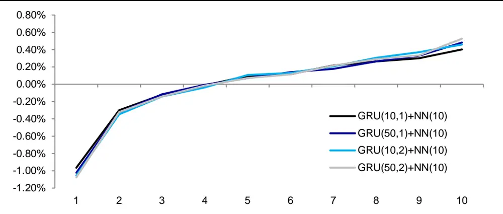
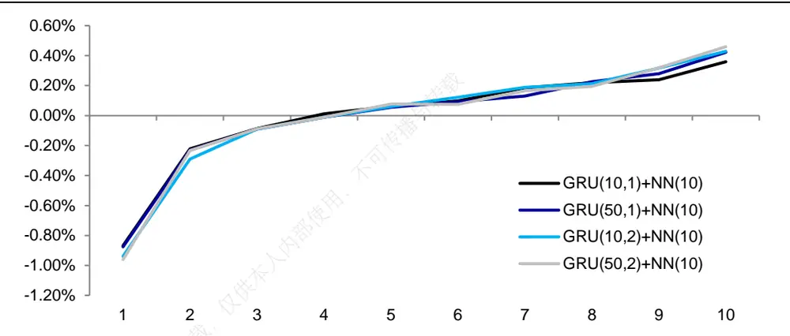
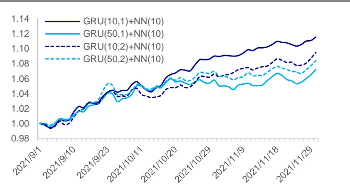
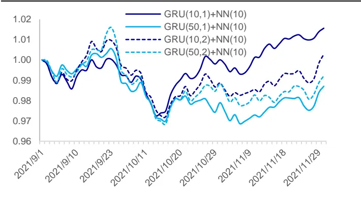

## [Tab相关研究

Table_ReportInfo]《选股因子系列研究（六十九）——高频因子的现实与幻想》2020.07.30《选股因子系列研究（七十一）——逐笔大单因子与大资金行为》《博道量化投资团队及杨梦女士侧写——基本面因子为锚，模型驱动风格切换》2021.08.18

分析师:冯佳睿

Tel:(021)23219732

Email:fengjr@htsec.com

证书:S0850512080006

分析师:袁林青

Tel:(021)23212230

Email:ylq9619@htsec.com

证书:S0850516050003

# 选股因子系列研究（七十六）——基于深度学习的高频因子挖掘

## 投资要点：

2021 年 6 月，上交所推出逐笔委托数据，自此投资者已经可以在逐笔委托级别刻画交易行为。随着高频数据越来越丰富，投资者对于高频因子的关注也越来越高。前期发布的系列报告测试结果表明，高频数据中蕴含着丰富的 。基于逻辑构建得到的高频因子，即使在月度上依旧存在着较为显著的选股能力。然而，随着高频因子研究的深入，基于简单逻辑越来越难挖掘得到相对于系列前期高频因子具有额外选股能力的因子。

- 可使用 RNN+NN 的框架挖掘高频数据序列中的 Alpha。考虑到深度学习中的循环神经网络模型（RNN）较为适用于处理序列信息，我们使用 RNN 提取高频序列信息，并将提取结果输入全连接神经网络，从而得到最终的因子值。基于上述思路，本文搭建了“RNN+NN”的模型框架，使用 30 分钟级别的高频数据序列作为模型输入，挖掘周度高频因子。

- 深度学习高频因子具有极为显著的周度选股能力。因子周均 IC 达 0.08，周度胜率在 80%以上。因子收益区分效果较为明显，周均多空收益为约为 1.5%。其中，周均多头超额收益约为 0.5%，空头超额收益约为-1.0%。

- 深度学习高频因子与常规低频因子以及高频因子低相关，正交处理后，因子周度选股能力依旧显著，且稳定性进一步提升。周均 IC 约为 0.07，周度胜率进一步上升至 90%，周均多空收益达 1.4%。

- 沪深 300内单独训练的深度学习高频因子具有更为显著的周度选股能力。因子周均 IC 接近 0.05，周度胜率接近 70%，周均多空收益超 0.7%。

- LSTM+NN 训练得到的因子同样具有显著的选股能力，但是相比于 GRU+NN 的提升并不明显。虽然 LSTM 引入了更多的参数、结构更加复杂，但是模型训练得到的因子并未相比于 GRU 模型产生显著的改进。这一现象在正交因子上同样可被观测到。

- 深度学习高频因子的引入，能为传统多因子组合带来较为明显的超额收益提升。且随着模型复杂度的提升，模型对于高频数据序列的信息提取能力更强，带来的超额收益改进更为明显。基础模型年化超额约为 26%，而在引入了深度学习高频因子后，模型年化超额收益最多可上升至 32%，最大提升幅度约为 6%。

- 风险提示。市场系统性风险、资产流动性风险以及政策变动风险会对策略表现产生较大影响。

年 月，上交所推出逐笔委托数据，自此投资者已经可以在逐笔委托级别刻画交易行为。伴随着高频数据的补全，投资者对于高频因子的关注也越来越高。我们前期发布的系列报告测试结果表明，高频数据中蕴含着丰富的 Alpha。基于逻辑构建的高频因子，即使在月度上依旧存在着较为显著的选股能力。

随着对于高频因子研究的深入，我们常常思考以下几个问题：

1） 基于简单逻辑越来越难挖掘得到相对于系列前期高频因子具有额外选股能力的因子。且伴随着调仓频率的提升，预测周期的变短，挖掘因子时是否依旧需要从逻辑出发？

2） 当前高频数据序列的信息提取手段较为简单，基本都是算 1、2、3阶矩。如何更好地提取高频数据序列中的 Alpha？

3） 高频数据字段较多，可从不同角度刻画投资者行为。同时，指标的组合方式众多，简单的试错法效率很低。如何高效地组合指标构建有效因子？

从上述几个问题出发，本文以 164 个半个小时频率的高频指标序列作为模型输入，构建了周度迭代的深度学习模型，并挖掘深度学习高频因子。本文共分为五个部分，第一部分介绍了常见的 RNN模型以及模型整体架构，第二部分展示了深度学习高频因子的周度选股能力，第三部分测试了深度学习高频因子在添加到常规多因子模型后，对于模型的提升，第四部分总结了全文，第五部分提示了风险。

## 1. 引言

自 2017 年以来，我们发布了一系列报告尝试基于不同级别的高频数据（如，分钟 K线、3秒盘口委托挂单、逐笔成交以及逐笔委托）构建高频因子。传统的高频因子构建思路往往是从一个直观的逻辑出发，并通过较为简单的计算步骤得到因子值。由于高频数据提供了全新的刻画投资者行为的角度，该种方法在我们初步尝试高频因子时，的确取得了不错的效果。

然而随着研究的深入，基于简单逻辑已越来越难挖掘得到相对于系列前期高频因子具有额外选股能力的因子。大部分高频因子，由于数据同源，因子之间的相关性通常不低，因此很难相对于现有因子或模型提供显著的信息增益。与此同时，跟随近年来调仓频率提升的趋势，部分投资者开始更加关注高频因子在短周期选股上的应用。因此，通过机器学习的方法挖掘高频因子，并叠加高频的模型迭代无疑是一个值得考虑的选择。

此外，我们在前期专题报告中计算高频因子时，大多通过人工的方式将指标降频为日度或月度指标值。考虑到深度学习中的循环神经网络模型（RNN）较为适用于处理序列信息，我们使用 RNN提取高频序列信息，并将提取结果输入全连接神经网络，从而得到最终的因子值。基于上述思路，本文搭建了“RNN+NN”的模型框架，使用 30 分钟级别的高频数据序列作为模型输入，挖掘周度高频因子。

## 1.1 循环神经网络模型简介

循环神经网络（Recurrent Neural Networks，后文统一简称为 RNN） 是一种常用的神经网络结构，它源自于 1982 年 Saratha Sathasivam 提出的霍普菲尔德网络。其特有的循环概念及其记忆性，使得它在处理和预测序列数据的问题上有着良好的表现。RNN 的核心思路是利用序列信息，对于每个输入的序列执行相同的操作，当前输出结果取决于模型前期输出的记忆以及当前的输入。

长短期记忆模型（Long Short-Term Memory，后文统一简称为 LSTM）以及门控循环单元（Gate Recurrent Unit，后文统一简称为 GRU）是较为常用的两种 RNN 模型。考虑到现存文献对于上述两类模型的介绍较多，本文在此仅简要介绍这两类模型。

LSTM 是较早被提出的 RNN 门控算法，它较好地解决了 RNN 模型中梯度消失的问题。LSTM 单元包含 3 个门控：输入门（Input Gate）、遗忘门（Forget Gate）和输出门（Output Gate）。下式简要列示了 LSTM单元的更新方式。

$$
\begin{aligned}i_{t}&=\sigma(W_{ii}x_{t}+b_{ii}+W_{hi}h_{t-1}+b_{hi})\\f_{t}&=\sigma(W_{if}x_{t}+b_{if}+W_{hf}h_{t-1}+b_{hf})\\g_{t}&=tanh(W_{ig}x_{t}+b_{ig}+W_{hg}h_{t-1}+b_{hg})\\o_{t}&=\sigma(W_{io}x_{t}+b_{io}+W_{ho}h_{t-1}+b_{ho})\\c_{t}&=f_{t}\odot c_{t-1}+i_{t}\odot g_{t}\\h_{t}&=o_{t}\odot tanh(c_{t})\end{aligned}
$$

简单来说，输入门（i）决定了前一期模型状态 $(h_{t-1})$ 和当期模型输入 $(x_{t})$ 对于模型内部状态 $(c_{1})$ 更新的影响幅度，遗忘门（f）决定了前一期模型内部状态 $(c_{t-1})$ 对于模型内部状态 $(c_{\mathrm{t}})$ 更新的影响幅度，输出 $门(\mathsf{o_t})$ 决定了内部状态 $(c_{\mathrm{t}})$ 对于模型状态$(h_{t})$ 更新的影响幅度。

GRU 相较于 LSTM结构更为简单，GRU单元包含 2 个门控：更新门（Update Gate）和复位门（Reset Gate），其中，复位门 $(\mathbf{\nabla}r_{\mathrm{t}})$ 的功能与 LSTM 单元中的输入门类似，而更新门 $(z_{t})$ 则同时实现了 LSTM 单元中遗忘门和输出门的功能。下式简要列示了 GRU单元的更新方式。

$$
\begin{aligned}&r_{t}=\sigma(W_{ir}x_{t}+b_{ir}+W_{hr}h_{t-1}+b_{hr})\\&z_{t}=\sigma(W_{iz}x_{t}+b_{iz}+W_{hk}h_{t-1}+b_{hz})\\&n_{t}=tanh(W_{in}x_{t}+b_{in}+r_{t}(W_{hn}h_{t-1}+b_{hn}))\\&h_{t}=(1-z_{t})n_{t}+z_{t}*h_{t-1}\\\end{aligned}
$$

## 1.2 数据说明

本文基于分钟 K线数据、盘口委托挂单数据、逐笔成交数据构建得到了 164 个 30分钟频率的指标序列，并将其作为模型的输入。（具体指标构建细节可咨询报告作者。）

基于分钟 K线数据的指标，刻画了股票收益、收益波动、成交金额、成交笔数等方面的特征。

基于 3秒盘口委托挂单数据的指标，刻画了股票盘口委买变化、委卖变化和净委买变化等方面的特征。

基于逐笔成交数据的指标有两类。第一类刻画投资者的主动买入 卖出行为，并与委托数据结合刻画买入意愿；第二类刻画不同大小的买单/卖单特征。（系列前期报告《选股因子系列研究（七十二）——大单的精细化处理与大单因子重构》的研究结果表明，大单相关因子具有较强的选股能力。在后续的样本外跟踪中，因子的选股能力十分稳定。）

本文在构建模型时，滚动使用股票过去 20个交易日的高频指标序列，预测股票未来 5 个交易日的收益。因此，每期模型的输入为 N*160*164 的三维矩阵。当然，投资者可根据自身需求，调整输入的数据频率和预测周期。

## 1.3 模型设定与超参数

本文采用 RNN+NN 的架构进行短期收益预测。考虑到常见 RNN模型中，GRU 的结构更简单、参数更少、训练速度更快，本文首先采用了 GRU+NN 的架构。当然，后文也会展示基于 LSTM+NN 训练得到的因子的绩效。

在训练模型时，每 5日进行一次模型迭代，每次滚动使用过去 6个月的数据。其中，前 5 个月为训练集，后 1个月为验证集。考虑到模型初始化存在随机性，同一组超参数会训练 5次，并在预测时以 5 次的均值作为最终的输出结果。

模型的损失函数为-1*IC，优化器选用 ADAM，使用 mini-batch 的方式训练模型，batch 大小为 1000。为了防止模型出现过拟合，引入随机失活和早停机制。

本文在测试时，考虑了以下超参数的组合：

1）GRU 层数：1层、2层；

2）GRU 隐含状态大小：10、50；

3）NN 层数：1层；

4）NN 神经元数量：10。

受训练效率的制约，本文测试的模型超参数组合较少。我们也会在后续研究中，测试更多超参数组合下的表现。

## 2. 深度学习高频因子的单因子测试

## 2.1 原始因子绩效

下表展示了不同超参数组合下，深度学习高频因子的周度选股能力。

表 1 深度学习高频因子周度选股能力（原始因子，2014.01-2021.11）

|  | 周均IC | 年化ICIR | 周度胜率 | 周均多空收益 | 周均多头超额 | 周均空头超额 |
| --- | --- | --- | --- | --- | --- | --- |
| GRU(10,1)+NN(10) | 0.075 | 5.44 | 81% | 1.35% | 0.37% | -0.98% |
| GRU(50,1)+NN(10) | 0.079 | 5.95 | 81% | 1.48% | 0.44% | -1.04% |
| GRU(10,2)+NN(10) | 0.082 | 5.66 | 81% | 1.46% | 0.41% | -1.04% |
| GRU(50,2)+NN(10) | 0.083 | 6.19 | 82% | 1.54% | 0.49% | -1.05% |

资料来源：Wind，海通证券研究所

由上表可见，深度学习高频因子具有极为显著的周度选股能力。因子周均IC达0.08，周度胜率在 80%以上。因子收益区分效果明显，周均多空收益为约为 1.5%。其中，周均多头超额收益约为 0.5%，空头超额收益约为-1.0%。

下图进一步展示了因子的分组超额收益特征。（按因子值从低到高将股票分为10组，计算各组股票相对市场周度收益的超额收益。）

图1 深度学习高频因子分组超额收益分布（原始因子，2014.01-2021.11）

资料来源：Wind，海通证券研究所

观察上图可知，因子组间收益单调性较为明显，尤其是在第 2组至第 10组之间。即使在多头组别中（8-10 组），因子依旧呈现出明显的线性特征。值得注意的是，因子空头组合（第 1组）负向收益极为明显，表明因子具有较强的空头特征。

下表进一步展示了不同年度中，因子的多头超额收益（第 10 组-市场平均收益）和多空收益（第 10 组-第 1组）。

表 2 深度学习高频因子分年度收益表现（原始因子，2014.01-2021.11）

|  | GRU(10,1)+NN(10) |  | GRU(50,1)+NN(10) |  | GRU(10,2)+NN(10) |  | GRU(50,2)+NN(10) |  |
| --- | --- | --- | --- | --- | --- | --- | --- | --- |
|  | 多头超额 | 多空收益 | 多头超额 | 多空收益 | 多头超额 | 多空收益 | 多头超额 | 多空收益 |
| 2014 | 27.3% | 64.5% | 39.3% | 85.9% | 34.4% | 72.7% | 49.4% | 95.7% |
| 2015 | 74.4% | 159.8% | 90.8% | 188.7% | 68.4% | 159.9% | 86.9% | 178.0% |
| 2016 | 31.9% | 65.9% | 39.2% | 75.0% | 40.7% | 75.1% | 41.5% | 79.2% |
| 2017 | 16.4% | 49.2% | 18.6% | 50.7% | 23.5% | 59.2% | 20.0% | 52.6% |
| 2018 | 14.2% | 46.0% | 14.3% | 46.7% | 15.5% | 50.2% | 17.9% | 50.5% |
| 2019 | 26.9% | 80.5% | 29.3% | 86.4% | 24.9% | 80.9% | 33.1% | 91.2% |
| 2020 | 19.1% | 62.9% | 16.3% | 58.2% | 20.8% | 66.6% | 13.5% | 57.9% |
| 2021.11.30 | -15.7% | 19.4% | -9.5% | 22.6% | -16.3% | 19.3% | -1.1% | 33.6% |
| 全区间 | 21.3% | 64.3% | 25.8% | 70.9% | 24.1% | 69.5% | 29.1% | 74.6% |

资料来源： ，海通证券研究所

由上表可见，原始因子虽然在整个回测区间上展现出较好的选股能力，但是在年的收益表现普遍较弱。这可能是因为我们将模型的损失函数设为-1*IC，得到的因子很有可能受到常规风格因子和低频因子的影响。因此，实际应用中，建议进行正交化处理。

## 2.2 正交因子绩效

下表展示了深度学习高频因子与部分低频因子以及基于逻辑构建的高频因子之间的截面相关性。

表 3 深度学习高频因子与常规低频因子、高频因子的截面相关性（2014.01-2021.11）

|  | GRU(10,1)+NN(10) | GRU(50,1)+NN(10) | GRU(10,2)+NN(10) | GRU(50,2)+NN(10) |
| --- | --- | --- | --- | --- |
| 市值 | -0.07 | -0.06 | -0.04 | -0.04 |
| 中盘 | -0.09 | -0.09 | -0.09 | -0.08 |
| 估值 | 0.05 | 0.05 | 0.05 | 0.05 |
| 换手 | -0.18 | -0.16 | -0.17 | -0.15 |
| 改进反转 | -0.17 | -0.16 | -0.17 | -0.16 |
| 市场波动占比 | 0.08 | 0.08 | 0.08 | 0.07 |
| 盈利 | -0.01 | 0.00 | 0.01 | 0.00 |
| 盈利增长 | 0.00 | 0.01 | 0.01 | 0.01 |
| 分析师推荐 | 0.01 | 0.01 | 0.03 | 0.02 |
| 尾盘成交占比 | -0.01 | -0.03 | -0.03 | -0.03 |
| 开盘后买入意愿强度 | 0.09 | 0.09 | 0.11 | 0.10 |
| 开盘后大单净买入占比 | 0.07 | 0.08 | 0.10 | 0.10 |

资料来源： ，海通证券研究所

观察上表可知，深度学习高频因子与常规因子间的相关性极低，普遍在-0.2~0.2的范围内。相对而言，与换手和改进反转存在一定的相关性。因此，我们进一步将深度学习高频因子对行业、市值、反转和换手因子进行正交化处理，再考察正交因子的表现。

表 4 深度学习高频因子周度选股能力（正交因子，2014.01-2021.11）

|  | 周均IC | 年化 ICIR | 周度胜率 | 周均多空收益 | 周均多头超额 | 周均空头超额 |
| --- | --- | --- | --- | --- | --- | --- |
| GRU(10,1)+NN(10) | 0.063 | 8.16 | 89% | 1.17% | 0.31% | -0.86% |
| GRU(50,1)+NN(10) | 0.066 | 8.99 | 91% | 1.29% | 0.40% | -0.89% |
| GRU(10,2)+NN(10) | 0.070 | 8.53 | 91% | 1.33% | 0.40% | -0.93% |
| GRU(50,2)+NN(10) | 0.071 | 9.26 | 91% | 1.38% | 0.46% | -0.92% |

资料来源：Wind，海通证券研究所

观察上表可知，深度学习高频因子在正交后依旧存在较为显著的周度选股能力。周均 IC 约为 0.07，周度胜率进一步上升至 90%，周均多空收益达 1.4%，其中，周均多头超额收益达 0.46%。

下图展示了因子的分组多空收益。正交后的深度学习高频因子依旧呈现出了较为明显的组间收益单调性。

图2 深度学习高频因子分组超额收益分布（正交因子，2014.01-2021.11）

资料来源：Wind，海通证券研究所

下表进一步展示了正交因子的分年度多头超额收益和多空收益。

表 5 深度学习高频因子分年度收益表现（正交因子，2014.01-2021.11）

|  | GRU(10,1)+NN(10) |  | GRU(50,1)+NN(10) |  | GRU(10,2)+NN(10) |  | GRU(50,2)+NN(10) |  |
| --- | --- | --- | --- | --- | --- | --- | --- | --- |
|  | 多头超额 | 多空收益 | 多头超额 | 多空收益 | 多头超额 | 多空收益 | 多头超额 | 多空收益 |
| 2014 | 11.2% | 51.3% | 22.4% | 62.3% | 25.2% | 65.9% | 33.7% | 72.8% |
| 2015 | 60.4% | 135.8% | 77.8% | 163.6% | 74.2% | 154.0% | 99.0% | 184.7% |
| 2016 | 19.2% | 47.1% | 28.3% | 58.0% | 24.6% | 53.9% | 31.1% | 62.5% |
| 2017 | 12.5% | 38.0% | 13.4% | 38.7% | 17.4% | 46.8% | 16.2% | 43.1% |
| 2018 | 10.0% | 38.3% | 12.4% | 41.8% | 12.7% | 44.2% | 13.2% | 42.6% |
| 2019 | 21.6% | 71.9% | 22.6% | 73.9% | 26.2% | 79.1% | 27.6% | 82.5% |
| 2020 | 10.8% | 50.6% | 11.7% | 53.0% | 11.1% | 54.9% | 7.3% | 49.1% |
| 2021.11.30 | 13.9% | 51.6% | 21.2% | 56.1% | 18.3% | 55.6% | 24.8% | 60.8% |
| 全区间 | 17.9% | 56.8% | 23.3% | 63.6% | 23.5% | 65.1% | 27.2% | 68.5% |

资料来源：Wind，海通证券研究所

正交后的深度学习高频因子年化多头超额收益在 18%-28%的范围内，年化多空收益在 的范围内。在各个超参数组合下，因子在 年都呈现出显著的正向超额收益。相比于原始因子，正交因子在 2021 年的改善相当明显。

下图进一步展示了 2021 年 9 月以来，正交后的深度学习高频因子的多空净值和多头超额净值走势。

图3 深度学习高频因子多空净值（正交后，2021.09-2021.11）

资料来源：Wind，海通证券研究所

图4 深度学习高频因子多头超额（正交后，2021.09-2021.11）

资料来源：Wind，海通证券研究所

观察上图不难发现，2021 年 9 月以来，正交后的深度学习高频因子的多空相对强弱指数并未出现明显回撤，呈震荡向上的走势。然而，因子多头超额在 2021 年 9 月 15 日至 2021 年 10 月 14 日之间，出现了较为明显的回撤。但 2021 年 10 月 14 日以后，因子多头超额又呈现震荡回升的态势，回撤的修复速度较快。

## 2.3 不同范围下的因子表现

考虑到许多投资者更加关注模型在沪深 300 指数和中证 800 指数内的选股能力，下文继续展开测试。除了使用全市场数据训练得到的因子，本文还对比了分别使用沪深 300成分股和中证 800 成分股训练得到的因子。

需要注意的是，由于在沪深 指数和中证 指数内单独训练模型时，截面样本损失量较大，因而相较全市场模型更易出现过拟合。虽然可以通过早停机制进行控制，但是效果的改进依旧较为有限。我们建议适当延长训练集的历史窗口或者提升数据频率来扩大训练集样本量，从而提升模型的稳健性。

下表展示了全市场训练的因子和沪深 300 指数内单独训练的因子，在沪深 300 成分股上的周度选股能力。

表 6 不同范围训练的深度学习高频因子周度选股能力对比（原始因子，沪深 300指数内，2015.01-2021.11）

|  | 训练范围 | 周均IC | 年化 ICIR | 周度胜率 | 周均多空收益 | 周均多头超额 | 周均空头超额 |
| --- | --- | --- | --- | --- | --- | --- | --- |
| GRU(10,1)+NN(10) | 全市场 | 0.035 F | 1.884 | 60% | 0.61% | 0.19% | -0.42% |
|  | 沪深 300 内 | 0.043 | 2.207 | 64% | 0.66% | 0.23% | -0.43% |
| GRU(50,1)+NN(10) | 全市场 | 0.038 | 2.066 | 62% | 0.59% | 0.19% | -0.40% |
|  | 沪深 300 内 | 0.046 | 2.465 | 67% | 0.72% | 0.23% | -0.49% |
| GRU(10,2)+NN(10) | 全市场 | 0.038 | 1.958 | 61% | 0.63% | 0.19% | -0.44% |
|  | 沪深 300 内 | 0.050 | 2.480 | 67% | 0.77% | 0.23% | -0.54% |
| GRU(50,2)+NN(10) | 全市场 | 0.040 | 2.138 | 62% | 0.69% | 0.22% | -0.48% |
|  | 沪深 300 内 | 0.050 | 2.451 | 65% | 0.69% | 0.24% | -0.46% |

资料来源： ，海通证券研究所

由上表可见，沪深 300 内单独训练的深度学习高频因子具有更为显著的周度选股能力。周均 IC接近 0.05，周度胜率接近 70%，周均多空收益约为 0.7%。相比而言，基于全市场数据训练得到的高频因子，在周均 IC、周度胜率以及周均多空收益上皆表现更弱。

下表进一步展示了两个因子的多头组合不同年度的超额收益。

表 7 不同范围训练的深度学习高频因子分年度多头超额收益对比（原始因子，沪深 300指数内，2015.01-2021.11）

|  | GRU(10,1)+NN(10) |  | GRU(50,1)+NN(10) |  | GRU(10,2)+NN(10) |  | GRU(50,2)+NN(10) |  |
| --- | --- | --- | --- | --- | --- | --- | --- | --- |
|  | 全市场训练 | 300 内训练 | 全市场训练 | 300 内训练 | 全市场训练 | 300 内训练 | 全市场训练 | 300 内训练 |
| 2015 | 60.6% | 30.9% | 40.0% | 26.2% | 57.1% | 8.9% | 44.7% | 20.2% |
| 2016 | 12.5% | 10.6% | 13.3% | 14.1% | 15.8% | 15.5% | 12.9% | 9.1% |
| 2017 | 7.7% | 16.5% | 15.1% | 21.3% | 17.3% | 14.0% | 16.9% | 26.2% |
| 2018 | 5.7% | 13.4% | 6.4% | 13.6% | 0.7% | 12.0% | 8.2% | 5.6% |
| 2019 | -2.7% | 8.7% | 3.8% | 8.2% | 0.8% | 14.8% | -7.4% | 7.0% |
| 2020 | 27.2% | 23.2% | 17.9% | 7.7% | 28.7% | 47.6% | 15.0% | 16.9% |
| 2021.11.30 | -23.4% | -11.9% | -18.6% | -8.0% | -27.1% | -17.3% | -6.4% | 5.0% |
| 全区间 | 9.4% | 12.1% | 9.4% | 11.6% | 9.6% | 11.9% | 11.0% | 12.3% |

资料来源：Wind，海通证券研究所

大部分年份中，沪深 300 内单独训练得到的因子皆呈现出了更强的多头选股能力。特别是最近几年，市场分化度较高，沪深 300 内单独训练得到的因子呈现出更为明显的多头超额收益。

我们进一步对比正交因子的选股能力，结果如下表所示。

表 8 不同范围训练的深度学习高频因子周度选股能力对比（正交因子，沪深 300指数内，2015.01-2021.11）

|  | 模型训练范围 | 周均IC | 年化 ICIR | 周度胜率 | 周均多空收益 | 周均多头超额 | 周均空头超额 |
| --- | --- | --- | --- | --- | --- | --- | --- |
| GRU(10,1)+NN(10) | 全市场 | 0.028 | 2.664 | 60% | 0.43% | 0.16% | -0.27% |
|  | 沪深 300 内 | 0.025 | 2.435 | 63% | 0.37% | 0.18% | -0.19% |
| GRU(50,1)+NN(10) | 全市场 | 0.029 | 2.778 | 64% | 0.47% | 0.14% | -0.33% |
|  | 沪深 300 内 | 0.030 | 3.047 | 67% | 0.40% | 0.15% | -0.25% |
| GRU(10,2)+NN(10) | 全市场 | 0.034 | 3.217 仅供本 | 66% | 0.45% | 0.19% | -0.27% |
|  | 沪深 300 内 | 0.033 | 3.219 | 69% | 0.46% | 0.24% | -0.22% |
| GRU(50,2)+NN(10) | 全市场 | 0.033 | 3.086 | 66% | 0.45% | 0.13% | -0.32% |
|  | 沪深 300 内 | 0.032 | 3.059 | 67% | 0.47% | 0.22% | -0.25% |

资料来源：Wind，海通证券研究所

从上表来看，正交后，不同范围内训练得到的因子表现接近。但从下表的正交因子多头组合分年度超额收益来看，大部分超参数组合下，沪深 300 内单独训练得到的因子表现更优。

表 9 不同范围训练的深度学习高频因子分年度多头超额收益对比（正交因子，沪深 300指数内，2015.01-2021.11）

|  | GRU(10,1)+NN(10) |  | GRU(50,1)+NN(10) |  | GRU(10,2)+NN(10) |  | GRU(50,2)+NN(10) |  |
| --- | --- | --- | --- | --- | --- | --- | --- | --- |
|  | 全市场训练 | 300 内训练 | 全市场训练 | 300 内训练 | 全市场训练 | 300 内训练 | 全市场训练 | 300 内训练 |
| 2015 | 60.2% | 18.4% | 30.2% | 20.1% | 61.4% | 15.9% | 47.6% | 23.0% |
| 2016 | 8.4% | 0.3% | 4.6% | 1.5% | 5.7% | 4.7% | 1.2% | 1.1% |
| 2017 | 15.8% | 19.2% | 19.1% | 16.1% | 21.5% | 22.8% | 15.2% | 24.6% |
| 2018 | 0.9% | 7.0% | 1.1% | 10.6% | 2.3% | 8.1% | -4.0% | 2.8% |
| 2019 | -3.4% | 20.3% | -1.7% | 7.4% | 1.5% | 20.5% | -4.3% | 21.7% |
| 2020 | -3.4% | -2.6% | -12.5% | -3.8% | -6.4% | 13.8% | -5.7% | 2.6% |
| 2021.11.30 | -6.5% | 5.8% | 14.1% | 1.1% | -2.4% | 2.8% | 8.2% | 7.9% |
| 全区间 | 8.2% | 9.0% | 7.2% | 7.4% | 9.8% | 11.9% | 6.5% | 10.7% |

资料来源：Wind，海通证券研究所

类似地，我们也可对比全市场训练的因子和中证 800 指数内单独训练的因子，正交后在中证 800 成分股上的周度选股能力。

表 10 不同范围训练的深度学习高频因子周度选股能力对比（正交因子，中证 800指数内，2015.01-2021.11）

|  | 模型训练范围 | 周均IC | 年化 ICIR | 周度胜率 | 周均多空收益 | 周均多头超额 | 周均空头超额 |
| --- | --- | --- | --- | --- | --- | --- | --- |
| GRU(10,1)+NN(10) | 全市场 | 0.042 | 4.799 | 77% | 0.74% | 0.26% | -0.48% |
|  | 中证 800 内 | 0.040 | 4.870 | 77% | 0.70% | 0.29% | -0.40% |
| GRU(50,1)+NN(10) | 全市场 | 0.044 | 5.250 | 78% | 0.76% | 0.29% | -0.48% |
|  | 中证 800 内 | 0.044 | 5.219 | 77% | 0.76% | 0.28% | -0.48% |
| GRU(10,2)+NN(10) | 全市场 | 0.048 | 5.149 | 80% | 0.83% | 0.34% | -0.48% |
|  | 中证 800 内 | 0.047 | 5.128 | 78% | 0.82% | 0.32% | -0.50% |
| GRU(50,2)+NN(10) | 全市场 | 0.046 | 5.335 | 78% | 0.78% | 0.30% | -0.48% |
|  | 中证 800 内 | 0.050 | 5.519 | 80% | 0.91% | 0.33% | -0.58% |

资料来源： ，海通证券研究所

和沪深 300 内的结果一致，两个因子在周度 IC 上的差异并不明显。进一步观察下表模型多头组合分年度收益表现可知，部分超参数组合下，中证 800 内单独训练得到的高频因子更优。

表 11 不同训练范围的深度学习高频因子分年度多头超额收益对比（正交因子，中证 800指数内，2015.01-2021.11）

|  | GRU(10,1)+NN(10) |  | GRU(50,1)+NN(10) |  | GRU(10,2)+NN(10) |  | GRU(50,2)+NN(10) |  |
| --- | --- | --- | --- | --- | --- | --- | --- | --- |
|  | 全市场训练 | 800 内训练 | 全市场训练 | 800 内训练 | 全市场训练 | 800 内训练 | 全市场训练 | 800 内训练 |
| 2015 | 65.1% | 55.1% | 63.2% | 51.7% | 69.4% | 46.1% | 64.6% | 39.7% |
| 2016 | 7.4% | 9.5% | 9.6% | 3.5% | 13.0% | 7.1% | 14.9% | 8.3% |
| 2017 | 16.0% | 19.5% | 19.1% | 20.9% | 21.8% | 25.2% | 18.1% | 23.2% |
| 2018 | 6.5% | 12.6% | 5.8% | 12.2% | 13.2% | 8.3% | 8.9% | 13.3% |
| 2019 | 13.1% | 12.8% | 13.1% | 12.4% | 16.7% | 15.9% | 10.8% | 14.7% |
| 2020 | 8.0% | 10.4% | -1.7% | 1.8% | 6.3% | 15.6% | -4.9% | 13.4% |
| 2021.11.30 | 0.5% | 2.5% | 17.4% | 10.9% | 6.1% | 13.6% | 16.3% | 14.9% |
| 全区间 | 14.0% | 15.9% | 15.6% | 14.6% | 18.7% | 17.2% | 16.3% | 17.4% |

资料来源： ，海通证券研究所

## 2.4 GRU + NN 与 LSTM + NN 的对比

下表展示了分别基于 GRU+NN 和 LSTM+NN 训练得到的深度学习高频因子的周度选股能力。

表 12 不同模型架构下深度学习高频因子周度选股能力对比（原始因子，2014.01-2021.11）

|  | 模型架构 | 周均IC | 年化 ICIR | 周度胜率 | 周均多空收益 | 周均多头超额 | 周均空头超额 |
| --- | --- | --- | --- | --- | --- | --- | --- |
| RNN(10,1)+NN(10) | GRU+NN | 0.075 | 5.440 | 81% | 1.35% | 0.37% | -0.98% |
|  | LSTM+NN | 0.076 | 5.765 | 80% | 1.36% | 0.40% | -0.96% |
| RNN(50,1)+NN(10) | GRU+NN | 0.079 | 5.954 | 81% | 1.48% | 0.44% | -1.04% |
|  | LSTM+NN | 0.078 | 6.127 | 82% | 1.37% | 0.40% | -0.96% |
| RNN(10,2)+NN(10) | GRU+NN | 0.082 | 5.659 | 81% | 1.46% | 0.41% | -1.04% |
|  | LSTM+NN | 0.084 | 5.981 | 81% | 1.52% | 0.44% | -1.08% |
| RNN(50,2)+NN(10) | GRU+NN | 0.083 | 6.186 | 82% | 1.54% | 0.49% | -1.05% |
|  | LSTM+NN | 0.082 | 6.260 | 83% | 1.52% | 0.48% | -1.05% |

资料来源：Wind，海通证券研究所

测试结果表明，LSTM+NN 下的深度学习高频因子同样呈现出较为显著的周度选股能力。值得注意的是，虽然 LSTM 引入了更多参数、结构更复杂，但是模型训练得到的因子并未相比于 GRU 模型产生显著的改进。这一现象在正交因子上同样可被观测到。

表 13 不同模型架构下深度学习高频因子周度选股能力对比（正交因子，2014.01-2021.11）

|  | 模型架构 | 周均IC | 年化ICIR | 周度胜率 | 周均多空收益 | 周均多头超额 | 周均空头超额 |
| --- | --- | --- | --- | --- | --- | --- | --- |
| RNN(10,1)+NN(10) | GRU+NN | 0.063 | 8.158 | 89% | 1.17% | 0.31% | -0.86% |
|  | LSTM+NN | 0.062 | 8.648 | 90% | 1.16% | 0.33% | -0.83% |
| RNN(50,1)+NN(10) | GRU+NN | 0.066 | 8.986 | 91% | 1.29% | 0.40% | -0.89% |
|  | LSTM+NN | 0.064 | 8.706 | 90% | 1.23% | 0.36% | -0.87% |
| RNN(10,2)+NN(10) | GRU+NN | 0.070 | 8.531 | 91% | 1.33% | 0.40% | -0.93% |
|  | LSTM+NN | 0.070 | 8.857 | 90% | 1.34% | 0.40% | -0.95% |
| RNN(50,2)+NN(10) | GRU+NN | 0.071 | 9.256 | 91% | 1.38% | 0.46% | -0.92% |
|  | LSTM+NN | 0.069 | 9.056 | 90% | 1.36% | 0.44% | -0.92% |

资料来源：Wind，海通证券研究所

考虑到 GRU结构更加简单、参数更少、训练速度更快的特性，我们建议投资者以GRU+NN 作为切入点，开启自己的深度学习挖掘高频因子的旅程。当然，LSTM+NN 模型的改进不明显，也有可能是模型超参数设定的原因，我们之后还将进一步测试。

## 2.5 小结

首先，我们展示了基于全市场数据训练得到的深度学习高频因子的周度选股能力。回测结果表明，因子选股能力极为显著，与常规低频因子相关性低。在剔除行业、市值、反转以及换手因子的影响后，因子周度选股能力依旧显著，且胜率得到进一步的提升。

其次，若投资者更加关注模型在特定指数范围内的选股能力，可考虑在相关指数范围内单独训练。测试结果表明，沪深 300 内单独训练的深度学习高频因子，分年度收益明显优于全市场训练。对于中证 800 指数，两种训练方式差异并不明显。

最后，我们对比了 GRU+NN 和 LSTM+NN 训练得到的深度学习高频因子的周度选股能力。测试结果表明，LSTM+NN 同样有效，但并未相对 GRU+NN 产生显著提升。

## 3. 引入深度学习高频因子的中证 500指数增强模型

下面，我们讨论在基础的周度中证 500 指数增强组合中，引入深度学习高频因子后，是否能产生收益提升。基础模型使用的因子有：市值、中盘（市值三次方）、估值、换手、反转、波动、盈利、SUE、分析师推荐、尾盘成交占比、开盘后买入意愿占比和开盘后大单净买入占比。

在预测个股收益时，首先采用回归法得到因子溢价，再计算最近 12 个月的因子溢价均值估计下期的因子溢价，最后乘以最新一期的因子值。

风险控制模型主要包括以下几个方面的约束：

1） 个股权重偏离：相对基准偏离不超过 1%或 2%；

2） 因子敞口：常规低频因子敞 $\口\leq\pm0.5$ ，高频因子敞口≤ ±2.0；

3） 行业偏离：严格中性；

4） 换手率限制：单次单边换手不超过 30%、40%、50%。

组合优化目标为最大化预期收益，目标函数如下：

$$
\underset{w_{i}}{max}\sum\mu_{i}w_{i}
$$

其中， $w_{\mathrm{i}}$ 为组合中股票 i的权重， $\mu_{\mathrm{i}}$ 为股票 i的预期超额收益。为了使本文的结论贴近实践，如无特别说明，下文的测算均假定以次日均价调仓，同时扣除 3‰的交易成本。

下表展示了不同模型在不同的个股偏离和换手率约束下的全区间年化超额收益。从中可见，深度学习高频因子的引入为大部分模型带来了较为明显的超额收益提升。且随着模型复杂度的提升，模型对高频数据序列的信息提取能力更强，带来的超额收益改进更大。基础模型年化超额约为 26%，而在引入了深度学习高频因子后，模型年化超额收益最多可上升至 32%，最大提升幅度约为 6%。

表 14 引入深度学习高频因子的中证 500指数增强组合的年化超额收益（2015.01-2021.11）

| 周度单边换手上限 | 基准偏离上限 | 基础模型 | GRU(10,1)+NN(10) | GRU(50,1)+NN(10) | GRU(10,2)+NN(10) | GRU(50,2)+NN(10) |
| --- | --- | --- | --- | --- | --- | --- |
| 30% | 1% | 25.2% | 26.8% | 28.1% | 25.7% | 26.7% |
|  | 2% | 26.4% | 30.6% | 31.2% | 29.8% | 31.3% |
| 40% | 1% | 26.3% | 25.2% | 27.7% | 25.8% | 28.1% |
|  | 2% | 26.2% | 29.5% | 31.8% | 27.6% | 31.9% |
| 50% | 1% | 25.4% | 24.1% | 26.8% | 24.5% | 26.9% |
|  | 2% | 27.2% | 24.7% | 28.6% | 26.8% | 30.2% |

资料来源：Wind，海通证券研究所

下表为 2021 年的收益表现。引入深度学习高频因子后，大部分模型同样都取得了更好的收益表现，YTD 收益可从基础模型的 10%-16%最多提升至 30%。

表 15 引入深度学习高频因子的中证 500指数增强组合的年化超额收益（2021.01-2021.11）

| 周度单边换手上限 | 基准偏离上限 | 基础模型 | GRU(10,1)+NN(10) | GRU(50,1)+NN(10) | GRU(10,2)+NN(10) | GRU(50,2)+NN(10) |
| --- | --- | --- | --- | --- | --- | --- |
| 30% | 1% | 10.0% | 19.9% | 24.2% 内部使 | 16.6% | 16.9% |
|  | 2% | 16.1% | 19.7% | 26.6% | 20.1% | 21.1% |
| 40% | 1% | 13.0% | 14.3% 仅供本人 | 21.5% | 14.3% | 20.6% |
|  | 2% | 15.5% | 19.8% | 29.9% | 21.7% | 23.3% |
| 50% | 1% | 13.7% | 13.4% | 20.6% | 14.1% | 16.5% |
|  | 2% | 16.1% | 16.2% | 26.9% | 19.4% | 26.4% |

资料来源：Wind，海通证券研究所

## 4. 总结

本文从高频指标序列出发，使用 的模型架构训练生成了深度学习高频因子。回测结果表明，该类因子具有较为显著的周度选股能力，且与常规低频因子和基于逻辑构建的高频因子的截面相关性较低。在剔除行业、市值、反转以及换手后，因子依旧呈现出极为显著的周度选股能力，且周度胜率进一步上升。

对于特定选股域，如沪深 300 指数内，单独训练得到的因子具有更显著的选股能力，且在分年度上具有更好的收益表现。值得注意的是，在特定股票范围内单独训练股票时，会损失较多的截面样本，我们建议适当延长训练集的历史窗口，从而增加训练集样本量。

最后，本文将深度学习高频因子放入常规的周度调仓的中证 指数增强组合中。测试结果表明，在控制组合换手率和相对于基准偏离的情况下，深度学习高频因子的引入，能够进一步增强组合的收益，为组合提供增量信息。

综上所述，本文初步搭建了基于深度学习的高频因子训练框架，并得到了具有显著周度选股能力的高频因子。在后续的研究中，我们会对模型进行更加深入的细化与改进。由于深度学习模型的细节较多，且都会对训练结果产生影响，本文受篇幅限制无法一一展开讨论。若投资者对于相关细节感兴趣，欢迎联系我们交流讨论。

## 5. 风险提示

市场系统性风险、资产流动性风险以及政策变动风险会对策略表现产生较大影响。

# 信息披露

分析师声明

[Table冯佳睿yst金融工程研究团队s]

袁林青金融工程研究团队

本人具有中国证券业协会授予的证券投资咨询执业资格，以勤勉的职业态度，独立、客观地出具本报告。本报告所采用的数据和信息均来自市场公开信息，本人不保证该等信息的准确性或完整性。分析逻辑基于作者的职业理解，清晰准确地反映了作者的研究观点，结论不受任何第三方的授意或影响，特此声明。

## 法律声明

本报告仅供海通证券股份有限公司（以下简称 本公司 ）的客户使用。本公司不会因接收人收到本报告而视其为客户。在任何情况下，本报告中的信息或所表述的意见并不构成对任何人的投资建议。在任何情况下，本公司不对任何人因使用本报告中的任何内容所引致的任何损失负任何责任。

本报告所载的资料、意见及推测仅反映本公司于发布本报告当日的判断，本报告所指的证券或投资标的的价格、价值及投资收入可能会波动。在不同时期，本公司可发出与本报告所载资料、意见及推测不一致的报告。

市场有风险，投资需谨慎。本报告所载的信息、材料及结论只提供特定客户作参考，不构成投资建议，也没有考虑到个别客户特殊的播投资目标、财务状况或需要。客户应考虑本报告中的任何意见或建议是否符合其特定状况。在法律许可的情况下，海通证券及其所属可关联机构可能会持有报告中提到的公司所发行的证券并进行交易，还可能为这些公司提供投资银行服务或其他服务。

本报告仅向特定客户传送，未经海通证券研究所书面授权，本研究报告的任何部分均不得以任何方式制作任何形式的拷贝、复印件或复制品，或再次分发给任何其他人，或以任何侵犯本公司版权的其他方式使用。所有本报告中使用的商标、服务标记及标记均为本公司的商标、服务标记及标记。如欲引用或转载本文内容，务必联络海通证券研究所并获得许可，并需注明出处为海通证券研究所，且本不得对本文进行有悖原意的引用和删改。仅

根据中国证监会核发的经营证券业务许可，海通证券股份有限公司的经营范围包括证券投资咨询业务。下载

海通证券股份有限公司研究所[Table_PeopleInfo]

| 路颖 所长 (021)23219403 | luying@htsec.com | 高道德 副所长 (021)63411586 gaodd@htsec.com |  | 邓勇 副所长 (021)23219404 dengyong@htsec.com |  |
| --- | --- | --- | --- | --- | --- |
| 荀玉根 副所长 (021)23219658 xyg6052@htsec.com |  | 涂力磊 所长助理 (021)23219747 tIl5535@htsec.com |  | 余文心 所长助理 (0755)82780398 ywx9461@htsec.com |  |
| 宏观经济研究团队 梁中华(021)23219820 应镓娴(021)23219394 李 俊(021)23154149 联系人 侯 欢(021)23154658 李林芷(021)23219674 | lzh13508@htsec.com yjx12725@htsec.com lj13766@htsec.com hh13288@htsec.com llz13859@htsec.com | 金融工程研究团队 高道德(021)63411586 冯佳睿(021)23219732 郑雅斌(021)23219395 罗 蕾(021)23219984 余浩淼(021)23219883 袁林青(021)23212230 颜 伟(021)23219914 联系人 孙丁茜(021)23212067 张耿宇(021)23212231 郑玲玲(021)23154170 黄雨薇(021)23154387 | gaodd@htsec.com fengjr@htsec.com zhengyb@htsec.com I19773@htsec.com yhm9591@htsec.com ylq9619@htsec.com yw10384@htsec.com sdq13207@htsec.com zgy13303@htsec.com zll13940@htsec.com hyw13116@htsec.com | 金融产品研究团队 高道德(021)63411586 倪韵婷(021)23219419 唐洋运(021)23219004 徐燕红(021)23219326 谈 鑫(021)23219686 庄梓恺(021)23219370 谭实宏(021)23219445 联系人 吴其右(021)23154167 张 弛(021)23219773 滕颖杰(021)23219433 江 涛(021)23219879 jt13892@htsec.com 章画意(021)23154168 zhy13958@htsec.com | gaodd@htsec.com niyt@htsec.com tangyy@htsec.com xyh10763@htsec.com tx10771@htsec.com zzk11560@htsec.com tsh12355@htsec.com wqy12576@htsec.com zc13338@htsec.com tyj13580@htsec.com |
| 联系人 张紫睿 021-23154484 孙丽萍(021)23154124 王冠军(021)23154116 方欣来 021-23219635 政策研究团队 李明亮(021)23219434 Iml@htsec.com 吴一萍(021)23219387 wuyiping@htsec.com | zzr13186@htsec.com slp13219@htsec.com wgj13735@htsec.com fxl13957@htsec.com | 李 影(021)23154117 郑子勋(021)23219733 吴信坤 021-23154147 联系人 余培仪(021)23219400 王正鹤(021)23219812 杨 锦(021)23154504 石油化工行业 邓 勇(021)23219404 | ly11082@htsec.com zzx12149@htsec.com wxk12750@htsec.com ypy13768@htsec.com wzh13978@htesc.com yj13712@htsec.com dengyong@htsec.com 朱军军(021)23154143 zjj10419@htsec.com | 联系人 医药行业 余文心(0755)82780398 ywx9461@htsec.com | 王园沁 02123154123 wyq12745@htsec.com |
| 朱 蕾(021)23219946 zl8316@htsec.com 胡歆(021)23154505 周洪荣(021)23219953 李姝醒 02163411361 汽车行业 | zhr8381@htsec.com Isx11330@htsec.com | 公用事业 |  | 朱赵明(021)23154120 梁广楷(010)56760096 联系人 孟陆 86 10 56760096 周航(021)23219671 彭 娉(010)68067998 | zzm12569@htsec.com Igk12371@htsec.com ml13172@htsec.com zh13348@htsec.com pp13606@htsec.com |
| cbr14043@htsec.com |  |  |  |  |  |
|  | zl12742@htsec.com | 于鸿光(021)23219646 | fyf11758@htsec.com | 高 瑜(021)23219415 | Ihk11523@htsec.com gy12362@htsec.com |
| 曹雅倩(021)23154145 | cyq12265@htsec.com | 傅逸帆(021)23154398 |  | 李宏科(021)23154125 |  |
| 王 猛(021)23154017 | wm10860@htsec.com | 戴元灿(021)23154146 | dyc10422@htsec.com | 批发和零售贸易行业 |  |
| 郑 蕾(021)23963569 |  | 吴 杰(021)23154113 |  |  |  |
|  |  |  | yhg13617@htsec.com | 汪立亭(021)23219399 | wanglt@htsec.com |
| 联系人 | fqh12888@htsec.com |  |  |  |  |
|  |  |  | wj10521@htsec.com | 康 璐(021)23212214 |  |
| 房乔华 021-23219807 |  | 联系人 |  | 联系人 | kl13778@htsec.com |
|  |  | 余玫翰(021)23154141 | ywh14040@htsec.com | 曹蕾娜 cln13796@htsec.com |  |
| 互联网及传媒 |  |  |  |  |  |
| 毛云聪(010)58067907 | myc11153@htsec.com | 有色金属行业 |  | 房地产行业 |  |
| 陈星光(021)23219104 |  | 施 毅(021)23219480 | sy8486@htsec.com | 涂力磊(021)23219747 | tll5535@htsec.com |
| 孙小雯(021)23154120 | cxg11774@htsec.com | 陈晓航(021)23154392 | cxh11840@htsec.com | 谢 盐(021)23219436 xiey@htsec.com |  |
|  | sxw10268@htsec.com | 甘嘉尧(021)23154394 | gjy11909@htsec.com | 金 晶(021)23154128 jj10777@htsec.com |  |
| 崔冰睿(021)23219774 | kbc13683@htsec.com | 余金花 sjh13785@htsec.com |  |  |  |
| 联系人 |  |  |  |  |  |
|  |  | 联系人 |  |  |  |
|  |  | 郑景毅 zjy12711@htsec.com |  |  |  |

| 电子行业 | 煤炭行业 | 电力设备及新能源行业 |  |
| --- | --- | --- | --- |
| 李 轩(021)23154652 Ix12671@htsec.com | 李 淼(010)58067998 Im10779@htsec.com | 张一弛(021)23219402 | zyc9637@htsec.com |
| 肖隽翀(021)23154139 xjc12802@htsec.com | 戴元灿(021)23154146 dyc10422@htsec.com | 房 青(021)23219692 | fangq@htsec.com |
| 华晋书 hjs14155@htsec.com | 王 涛(021)23219760 wt12363@htsec.com | 曾 彪(021)23154148 zb10242@htsec.com |  |
| 联系人 | 吴 杰(021)23154113 wj10521@htsec.com | 徐柏乔(021)23219171 xbq6583@htsec.com |  |
| 文 灿 wc13799@htsec.com |  | 张 磊(021)23212001 zl10996@htsec.com |  |
| 薛逸民(021)23219963 xym13863@htsec.com |  | 联系人 |  |
| 李 潇(010)58067830 lx13920@htsec.com |  | 姚望洲(021)23154184 ywz13822@htsec.com |  |

| 基础化工行业 | 计算机行业 | 通信行业 |
| --- | --- | --- |
| 刘 威(0755)82764281 Iw10053@htsec.com | 郑宏达(021)23219392 zhd10834@htsec.com | 余伟民(010)50949926 ywm11574@htsec.com |
| 刘海荣(021)23154130 Ihr10342@htsec.com | 杨 林(021)23154174 yl11036@htsec.com | 联系人 |
| 张翠翠(021)23214397 zcc11726@htsec.com | 于成龙(021)23154174 ycl12224@htsec.com | 杨彤昕 010-56760095 ytx12741@htsec.com |
| 孙维容(021)23219431 swr12178@htsec.com | 洪 琳(021)23154137 hl11570@htsec.com | 夏 凡(021)23154128 xf13728@htsec.com |
| 李 智(021)23219392 lz11785@htsec.com | 联系人 杨 蒙(0755)23617756 ym13254@htsec.com |  |

| 非银行金融行业 |  | 交通运输行业 |  | 纺织服装行业 |  |
| --- | --- | --- | --- | --- | --- |
|  | 孙 婷(010)50949926 st9998@htsec.com |  | 虞 楠(021)23219382 yun@htsec.com |  | 梁 希(021)23219407 lx11040@htsec.com |
|  | 何 婷(021)23219634 ht10515@htsec.com |  |  | 罗月江（010）56760091 lyj12399@htsec.com 陈 宇(021)23219442 cy13115@htsec.com | 盛 开(021)23154510 sk11787@htsec.com |

| 建筑建材行业 | 机械行业 | 钢铁行业 |
| --- | --- | --- |
| 冯晨阳(021)23212081 fcy10886@htsec.com | 余炜超(021)23219816 swc11480@htsec.com | 刘彦奇(021)23219391 liuyq@htsec.com |
| 潘莹练(021)23154122 pyl10297@htsec.com | 赵玥炜(021)23219814 zyw13208@htsec.com | 周慧琳(021)23154399 zhl11756@htsec.com |
| 申 浩(021)23154114 sh12219@htsec.com 颜慧菁 yhj12866@htsec.com | 赵靖博(021)23154119 zjb13572@htsec.com | 与转载 |

| 建筑工程行业 农林牧渔行业 |  |  | 食品饮料行业 |  |
| --- | --- | --- | --- | --- |
| 张欣劼 zxj12156@htsec.com |  | 丁 频(021)23219405 dingpin@htsec.com | 可传 | 闻宏伟(010)58067941 whw9587@htsec.com |
|  |  | 陈 阳(021)23212041 cy10867@htsec.com |  | 颜慧菁 yhj12866@htsec.com |
|  | 联系人 |  |  | 张宇轩(021)23154172 zyx11631@htsec.com |
|  |  | 孟亚琦(021)23154396 myq12354@htsec.com |  | 程碧升(021)23154171 cbs10969@htsec.com |

| 军工行业 | 银行行业 | 社会服务行业 |  |
| --- | --- | --- | --- |
| 张恒晅 zhx10170@htsec.com | 孙 婷(010)50949926 st9998@htsec.com | 汪立亭(021)23219399 wanglt@htsec.com |  |
| 张高艳 0755-82900489 zgy13106@htsec.com 联系人 | 林加力(021)23154395 Ijl12245@htsec.com 联系人 | 许樱之(755)82900465 xyz11630@htsec.com 联系人 |  |
| 刘砚菲021-2321-4129 lyf13079@htsec.com | 董栋梁(021)23219356 ddI13206@htsec.com | 毛弘毅(021)23219583 mhy13205@htsec.com | 王祎婕(021)23219768 wyj13985@htsec.com |

| 家电行业 |  | 造纸轻工行业 |
| --- | --- | --- |
| 陈子仪(021)23219244 chenzy@htsec.com |  | 汪立亭(021)23219399 wanglt@htsec.com |
| 李 阳(021)23154382 ly11194@htsec.com |  | 郭庆龙 gql13820@htsec.com |
| 朱默辰(021)23154383 zmc11316@htsec.com |  | 联系人 |
| 刘 璐(021)23214390 II11838@htsec.com |  | 柳文韬(021)23219389 Iwt13065@htsec.com |
|  | 用户67775 | 王文杰 wwj14034@htsec.com 吕科佳 Ikj14091@htsec.com |

## 研究所销售团队

深广地区销售团队

伏财勇(0755)23607963 fcy7498@htsec.com

蔡铁清(0755)82775962 ctq5979@htsec.com

辜丽娟(0755)83253022 gulj@htsec.com

刘晶晶(0755)83255933 liujj4900@htsec.com

饶 伟(0755)82775282 rw10588@htsec.com

欧阳梦楚(0755)23617160

oymc11039@htsec.com

巩柏含 gbh11537@htsec.com

滕雪竹 0755 23963569 txz13189@htsec.com

上海地区销售团队
胡雪梅(021)23219385 huxm@htsec.com
黄 诚(021)23219397 hc10482@htsec.com
季唯佳(021)23219384 jiwj@htsec.com
黄 毓(021)23219410 huangyu@htsec.com
李 寅 021-23219691 ly12488@htsec.com
胡宇欣(021)23154192 hyx10493@htsec.com
马晓男 mxn11376@htsec.com
邵亚杰 23214650 syj12493@htsec.com
杨祎昕(021)23212268 yyx10310@htsec.com
毛文英(021)23219373 mwy10474@htsec.com
谭德康 tdk13548@htsec.com
王祎宁(021)23219281 wyn14183@htsec.com
北京地区销售团队
朱 健(021)23219592 zhuj@htsec.com
殷怡琦(010)58067988 yyq9989@htsec.com
郭 楠 010-5806 7936 gn12384@htsec.com
杨羽莎(010)58067977 yys10962@htsec.com
张丽萱(010)58067931 zlx11191@htsec.com
郭金垚(010)58067851 gjy12727@htsec.com
张钧博 zjb13446@htsec.com
高 瑞 gr13547@htsec.com
上官灵芝 sglz14039@htsec.com
董晓梅 dxm10457@htsec.com

海通证券股份有限公司研究所

地址：上海市黄浦区广东路 689号海通证券大厦 9楼

电话：（021）23219000

传真：（021）23219392

网址：www.htsec.com