## [Tab相关研究

Table_ReportInfo]《选股因子系列研究（六十九）——高频

因子的现实与幻想》2020.07.30

《选股因子系列研究（七十二）——大单的精细化处理与大单因子重构》

## 2021.01.20

《选股因子系列研究（七十五）——基于深度学习的高频因子挖掘》2021.12.24

分析师:冯佳睿

Tel:(021)23219732

Email:fengjr@htsec.com

证书:S0850512080006

分析师:袁林青

Tel:(021)23212230

Email:ylq9619@htsec.com

证书:S0850516050003

# 选股因子系列研究（七十七）——改进深度学习高频因子的 9个尝试

## 投资要点：

系列前期报告从高频指标序列出发，使用 RNN+NN 的模型架构训练生成了深度学习高频因子。回测结果表明，该类因子具有较为显著的周度选股能力。在报告发布后，我们得到了许多有建设性的反馈。在总结多方面信息后，本文在 9 个方面对模型进行了尝试性的改进，并展示了测试结果。需要注意的是，并非有所的尝试都能提升模型表现，但是考虑到深度学习模型在搭建中具有较高的试错成本，本文展示了所有尝试的结果，希望与大家进一步交流。

- 尝试 1：训练中控制因子与行业、风格及低频技术因子的相关性。在训练过程中引入正交层，使模型在指定的正交约束下生成高频因子。相同参数下，新因子有更强的周度选股能力，添加至中证 500 增强组合中，也能取得更大的收益提升。

- 尝试 2：输入特征压缩。基于人工逻辑压缩输入特征集合，由此训练得到的因子，选股能力并未减弱。

- 尝试 ：调整特征标准化方式。在处理输入特征时，有不处理、时间序列标准化和截面标准化三种方式。对比三者训练得到的因子的选股能力可知，截面标准化效果最好、不处理次之、时间序列标准化较弱。

- 尝试 4：提升输入特征频率。将输入特征的频率提升至 10 分钟，并未改善因子的选股能力。我们猜测，当输入特征的频率较高、序列较长时，简单模型相对较弱的信息提取能力，无法训练得到更有效的因子。

- 尝试 5：改变训练集/验证集切分比例。压缩验证集的长度，可将更多近期数据放入模型训练，进一步提升因子的选股能力。

- 尝试 6：输入特征中引入环境变量。简单地引入环境变量，无法提升因子的选股效果，也不能增强模型应对不同市场环境的能力。

- 尝试 7：调整预测目标。将模型预测目标调整为风险调整超额收益后，虽会小幅降低因子周均 IC，但是会带来因子多头超额收益的提升。

- 尝试 8：延长训练集。在更长的滚动训练窗口下，因子周度选股能力会得到进一步增强。

- 尝试 9：提升模型复杂度。增加模型参数量并不能提升因子周度选股能力，这表明，当前模型的复杂程度可能已经足够从输入特征中提取有效信息。若想要使用更复杂的模型，可考虑扩充输入特征的信息量。

- 风险提示。市场系统性风险、资产流动性风险以及政策变动风险会对策略表现产生较大影响。

系列前期报告从高频指标序列出发，使用 的模型架构训练生成了深度学习高频因子。回测结果表明，该类因子具有较为显著的周度选股能力。在报告发布后，我们得到了许多有建设性的反馈。在总结多方面信息后，本文在 个方面对模型进行了尝试性的改进，并展示了测试结果。需要注意的是，并非有所的尝试都能提升模型表现，但是考虑到深度学习模型在搭建中具有较高的试错成本，本文展示了所有尝试的结果，希望与大家进一步交流。

本文分为四个部分。第一部分介绍深度学习高频因子 2022 年以来的收益表现；第二部分展示不同尝试的测试结果，并给出相关建议；第三部分总结全文；第四部分提示风险。

## 1. 深度学习高频因子表现跟踪

2022 年 2 月以来，深度学习高频因子呈现出较为稳定的收益表现。下图分别展示了因子的周度多空收益和周度多头超额收益表现。

图1 2022年深度学习高频因子周度多空收益
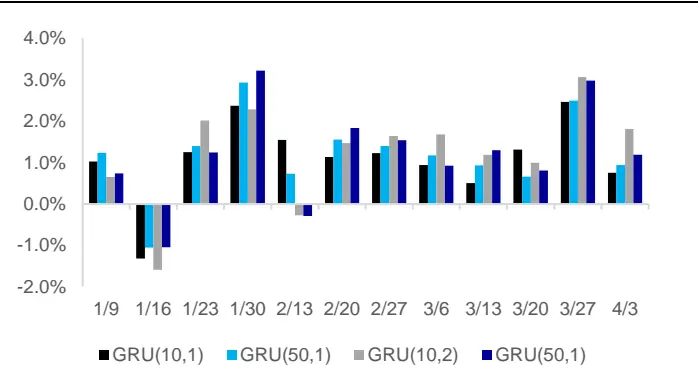
资料来源：Wind，海通证券研究所

图2 2022年深度学习高频因子周度多头超额收益
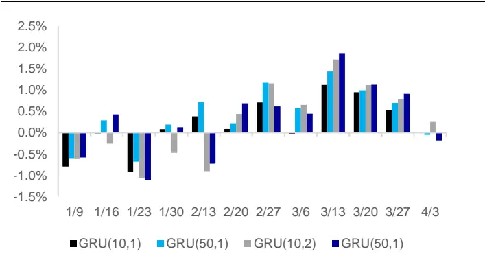
资料来源： ，海通证券研究所

观察上图可知，2022 年以来，因子的多空收益依旧极为稳定。除了 1月的第 2周多空收益普遍为负以外，各因子在其余时间中皆有较好的多空收益区分能力。进一步观察因子的周度多头超额收益可知，因子多头超额在 1 月表现偏弱，但是 2 月以来展现出较强的收益性。下图进一步展示了因子 2022 年以来的多空相对强弱和多头超额的净值，结论也是类似的。

图3 深度学习高频因子多空相对强弱净值
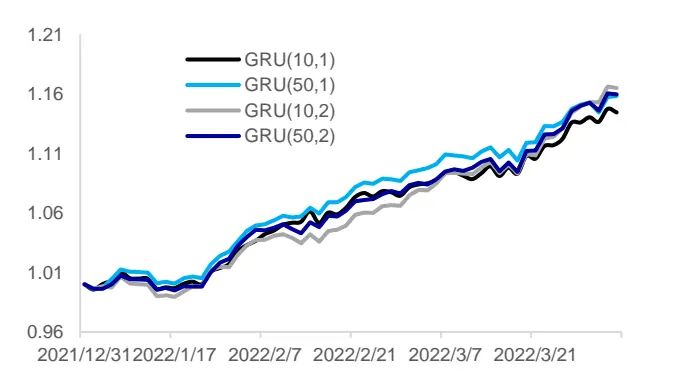
资料来源：Wind，海通证券研究所

图4 深度学习高频因子多头相对强弱净值
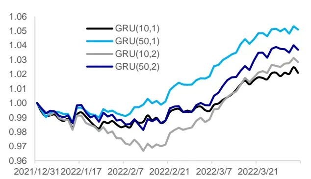
资料来源：Wind，海通证券研究所

截至 2022 年 4月 1 日，各深度学习因子在 2022 年皆取得了显著的多空收益。不同参数下，多空收益处于 11%~12%的范围内。此外，各因子多头组合也取得了一定的超额收益，处于 2%~5%的范围内。下表具体展示了不同参数下，深度学习高频因子 2022年的多空收益和多头超额收益。

表 1 2022年深度学习高频因子多空收益和多头超额收益

|  | GRU(10,1) | GRU(50,1) | GRU(10,2) | GRU(50,2) |
| --- | --- | --- | --- | --- |
| 多空收益 | 11.6% | 12.9% | 13.1% | 12.9% |
| 多头超额收益 | 1.9% | 4.6% | 2.6% | 3.3% |

资料来源： ，海通证券研究所

## 2. 改进深度学习高频因子的 9个尝试

基于路演交流的反馈，本章展示了 9个不同方面尝试的结果。在对比不同模型训练得到的因子的选股能力时，一方面会测试单因子选股能力。另一方面会将因子以增量因子的方式加入周度调仓的中证500指数增强组合中，对比加入前后组合超额收益的变化。

基础模型使用的因子包括：市值、中盘（市值三次方）、估值、换手、反转、波动、盈利、SUE、分析师推荐、尾盘成交占比、买入意愿占比和大单净买入占比。

在预测个股收益时，我们首先采用回归法得到因子溢价，再计算最近 12 个月的因子溢价均值估计下期的因子溢价，最后乘以最新一期的因子值。

风险控制模型主要包括以下几个方面的约束：

1） 基准权重偏离：相对偏离不超过 1%或者 2%；

2） 因子敞口：常规低频因子敞口≤ ±0.5，高频因子敞口≤ ±2.0；

3） 行业偏离：严格中性；

4） 换手率限制：单次单边换手不超过 30%、40%和 50%。

组合优化目标为最大化预期收益，目标函数如下所示：

$$
\underset{w_{i}}{max}\sum\mu_{i}w_{i}
$$

其中， $w_{\mathrm{i}}$ 为组合中股票 i的权重，μ 为股票 i的预期超额收益。为使本文的结论贴近实践，如无特别说明，下文的测算均假定以次日均价调仓，同时扣除 3‰的交易成本。

## 2.1 尝试 1：训练中控制因子与行业、风格及低频技术因子的相关性

在常规的深度学习因子训练流程中，训练得到的因子与常规低频因子之间的相关性并不可控。虽然深度学习因子与低频因子之间截面相关性的长期均值较低，但是在特定截面上，深度学习因子可能与低频因子之间高度相关。下图分别展示了不同时点上，系列前期报告计算得到的深度学习高频因子与市值及 因子的截面相关性。

图5 深度学习高频因子与市值因子截面相关性
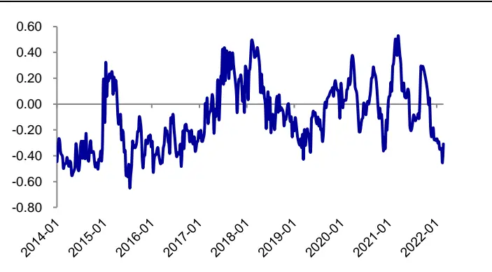
资料来源：Wind，海通证券研究所

图6 深度学习高频因子与 BP因子截面相关性
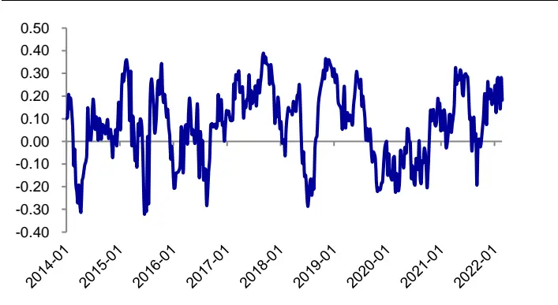
资料来源：Wind，海通证券研究所

观察上图不难发现，虽然深度学习高频因子与市值及 因子之间截面相关性的长期均值接近于 0。但是在特定时点上，深度学习高频因子依旧可能与风格类因子间存在明显关联。例如，2022 年年初，深度学习高频因子与市值因子负相关，与 BP因子正相关。但是 2021 年 6 月，深度学习高频因子又与市值因子正相关，与 BP因子负相关。这种与其他因子，特别是风格或行业因子之间不稳定的相关性，可能会在市场风格快速切换的环境下，影响深度学习高频因子表现的稳定性。

因此，不妨考虑在模型的训练中引入正交层，从而保证训练得到的因子与指定因子集合低相关。由于因子正交本质上是回归取残差，因此可表达成矩阵计算的形式，并以正交层的形式引入到模型训练中。下图对比展示了不同时点上，正交层引入前后训练得到的因子与市值因子及 BP因子的截面相关性。

图7 正交层引入前后深度学习高频因子与市值因子截面相关性
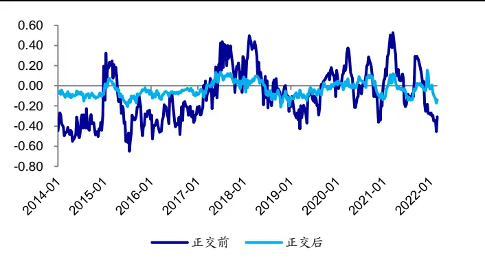
资料来源：Wind，海通证券研究所

图8 正交层引入前后深度学习高频因子与BP因子截面相关性
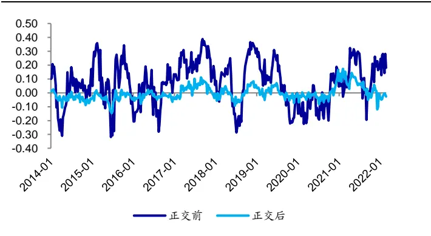
资料来源：Wind，海通证券研究所

观察上图不难发现，引入正交层能够较好地控制训练得到的因子与指定因子之间的截面相关性。值得注意的是，由于本节在进行正交时是按照根号市值加权，因此正交层引入后，训练得到的因子与市值因子及 BP因子的截面 Pearson 相关系数不是严格为 0。下表对比展示了正交层引入前后训练得到的因子的周度选股能力。

表 2 正交层引入前后深度学习高频因子周度选股能力（2014.01~2022.03）

|  | IC 均值 | 年化ICIR | 周度胜率 | 周均多空收益 | 周均多头超额 | 周均空头超额 |
| --- | --- | --- | --- | --- | --- | --- |
| 原始模型-原始因子值 | 0.087 | 6.06 | 81% | 1.62% | 0.52% | 1.11% |
| 原始模型-正交因子值 | 0.072 | 8.58 | 92% | 1.37% | 0.42% | 0.95% |
| 正交模型-原始因子值 | 0.077 | 8.68 | 90% | 1.46% | 0.47% | 0.99% |
| 正交模型-正交因子值 | 0.078 | 9.00 | 91% | 1.46% | 0.47% | 0.99% |

资料来源：Wind，海通证券研究所

正交层引入前，因子的选股能力会受到正交处理的影响，因子在正交后的周均多头超额为 0.42%。在控制其他变量的前提下，引入正交层后，训练得到的因子对于正交并不敏感，因子的正交不会对周度选股能力产生明显影响。因子的周均多头超额为 0.47%，相比于正交层引入前训练得到的因子出现了小幅提升。

这一区别有可能是来自于因子生成思路的调整。在正交层引入前，因子生成的思路是通过深度学习模型寻找有效的因子，然后将因子相对指定因子正交后再使用。而在正交层引入后，因子生成的思路是在正交约束之下，通过深度学习模型寻找有效的因子。除了对比因子周度选股能力外，还可观察因子作为增量因子对周度调仓组合表现的影响。

表 3 正交层引入前后深度学习高频因子周度组合添加测试（2016.01~2022.03）

|  |  | 30%单边换手约束 |  | 40%单边换手约束 |  | 50%单边换手约束 |  |
| --- | --- | --- | --- | --- | --- | --- | --- |
|  |  | 1%偏离 | 2%偏离 | 1%偏离 | 2%偏离 | 1%偏离 | 2%偏离 |
| 80%中证 500 内选股 | 基础模型 | 14.6% | 17.9% | 12.8% | 16.9% | 12.4% | 15.3% |
|  | 基础模型+原始深度学习因子 | 16.5% | 16.7% | 15.3% | 15.6% | 13.9% | 14.9% |
| 全市场选股 | 基础模型+引入正交层的深度学习因子 | 16.5% | 17.8% | 16.4% | 18.1% | 14.6% | 16.9% |
|  | 基础模型 | 17.1% | 17.1% | 17.4% | 16.8% | 16.4% | 17.1% |
|  | 基础模型+原始深度学习因子 | 19.0% | 20.0% | 17.0% | 19.5% | 17.0% | 17.1% |
|  | 基础模型+引入正交层的深度学习因子 | 19.7% | 23.4% | 18.9% | 21.7% | 17.8% | 19.8% |

资料来源： ，海通证券研究所

观察上表测试结果可知，引入正交层后训练得到的因子对于基础模型具有更强的提升效果。结合上述测试结果，我们建议，在实际构建模型的流程中引入正交层。

## 2.2 尝试 2：输入特征压缩

系列前期报告使用 164 个 30 分钟级别高频指标序列作为模型的输入，但是我们并未对输入特征进行筛选过滤。虽然深度学习模型本身具有较强的信息提取能力，但是输入特征中的冗余信息依旧会对最终训练结果产生一定的影响。

不妨进行一个简单的实验。在控制模型参数的前提下，在初始特征中添加服从正态分布的随机特征，即，白噪声。并考察模型在添加不同量级的冗余信息后，训练得到的因子的周度选股能力。下图对比展示了模型在不添加随机特征以及添加 50、100 和 150个随机特征后，训练得到的因子的周均 IC。

图9 添加随机特征对于深度学习高频因子周均 IC的影响
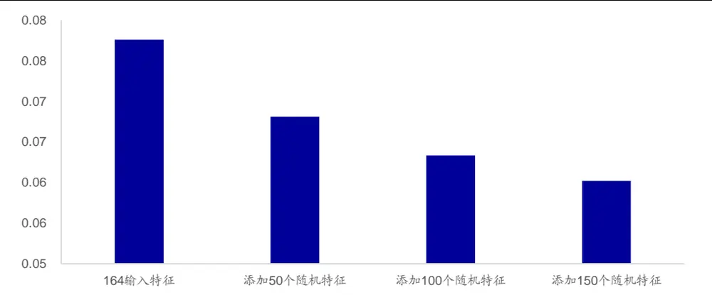
资料来源：Wind，海通证券研究所

观察上图不难发现，随着输入特征中冗余信息量的提升，训练得到的因子的周均 IC也逐步降低。因此，对于当前的模型，可考虑压缩特征集合来控制输入特征中的冗余信息。需要注意的是，我们暂未找到有效且量化的方法筛选输入特征，因而暂且使用主观逻辑的方式压缩输入集合，将输入特征数量从 164 个减少至 63个。下表对比了输入特征压缩前后，模型训练得到的因子的周度选股能力。

表 4 输入特征压缩前后深度学习高频因子周度选股能力（2014.01~2022.03）

|  | IC 均值 | 年化ICIR | 周度胜率 | 周均多空收益 | 周均多头超额 | 周均空头超额 |
| --- | --- | --- | --- | --- | --- | --- |
| 输入特征压缩前 | 0.078 | 9.00 | 91% | 1.46% | 0.47% | 0.99% |
| 输入特征压缩后 | 0.080 | 9.36 | 92% | 1.53% | 0.49% | 1.04% |

资料来源：Wind，海通证券研究所

虽然压缩输入特征后的模型训练得到的因子在全区间上表现更优，但从下图对比展示的压缩前后因子的分年度多头超额收益看，压缩特征并非在所有的年份中皆表现更好。

图10 输入特征压缩前后因子分年度多头超额收益
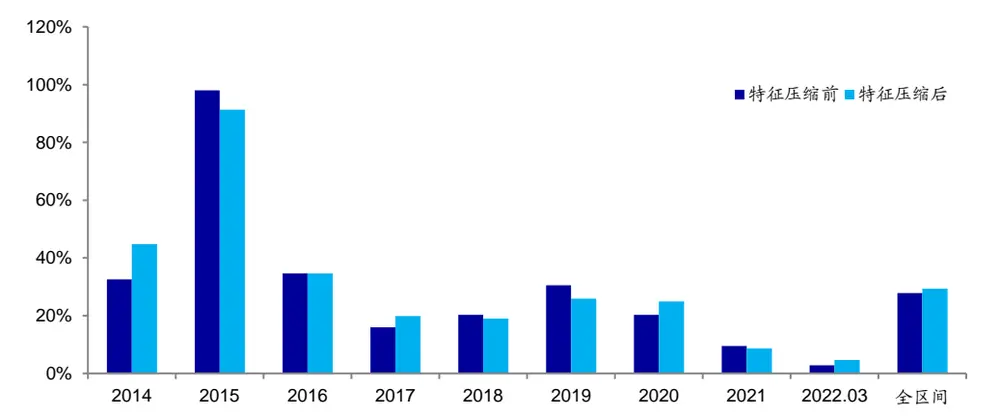
资料来源：Wind，海通证券研究所

观察组合添加测试的结果可以发现，压缩输入特征后得到的因子，在大部分参数下皆带来了更好的收益表现。

表 5 输入特征压缩前后深度学习高频因子周度组合添加测试（2016.01~2022.03）

|  |  | 30%单边换手约束 |  | 40%单边换手约束 |  | 50%单边换手约束 |  |
| --- | --- | --- | --- | --- | --- | --- | --- |
|  |  | 1%偏离 | 2%偏离 | 1%偏离 | 2%偏离 | 1%偏离 | 2%偏离 |
| 80%中证 500 内选股 | 基础模型 | 14.6% | 17.9% | 12.8% | 16.9% | 12.4% | 15.3% |
|  | 基础模型+正交层+164因子 | 16.5% | 17.8% | 16.4% | 18.1% | 14.6% | 16.9% |
|  | 基础模型+正交层+63因子 | 16.7% | 19.7% | 17.1% | 19.8% | 16.0% | 19.4% |
| 全市场选股 | 基础模型 | 17.1% | 17.1% | 17.4% | 16.8% | 16.4% | 17.1% |
|  | 基础模型+正交层+164因子 | 19.7% | 23.4% | 18.9% | 21.7% | 17.8% | 19.8% |
|  | 基础模型+正交层+63因子 | 21.1% | 21.9% | 21.2% | 21.6% | 20.0% | 20.6% |

资料来源：Wind，海通证券研究所

上述测试结果表明，输入特征中存在较多冗余信息会影响最终因子的周度选股能力，我们建议适当进行筛选，但筛选方法需要进一步探索。

## 2.3 尝试 3：调整特征标准化方式

除了特征的筛选，特征的处理同样值得关注。此处有三种选择：1）原始特征不做处理；2）时间序列标准化；3）横截面标准化。下表在控制变量的前提下，对比展示了用不同处理方式训练得到的因子的周度选股能力。

表 6 不同特征处理方式下深度学习高频因子周度选股能力（2014.01~2022.03）

|  | IC 均值 | 年化 ICIR | 周度胜率 | 周均多空收益 | 周均多头超额 | 周均空头超额 |
| --- | --- | --- | --- | --- | --- | --- |
| 原始特征 | 0.057 | 6.88 | 85% | 1.04% | 0.27% | 0.77% |
| 时序标准化 | 0.023 | 3.59 | 72% | 0.45% | 0.18% | 0.27% |
| 截面标准化 | 0.080 | 9.36 | 92% | 1.53% | 0.49% | 1.04% |

资料来源：Wind，海通证券研究所

观察上表可知，在以增量截面选股因子为目标的情境下，横截面标准化处理相对更好，原始特征不做处理次之，时间序列标准化相对较差。进一步对比不同处理方法下因子的多头超额收益，可以发现，截面标准化处理后的特征能够帮助模型在大部分年度中取得更好的多头收益表现。因此，在处理输入特征时，我们推荐先做横截面标准化。

图11 不同特征处理方式下深度学习高频因子分年度多头超额收益
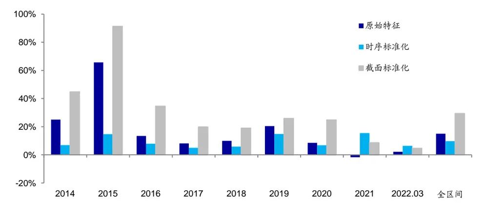
资料来源： ，海通证券研究所

## 2.4 尝试 4：提升输入特征频率

系列前期报告使用 30分钟频率的特征作为模型的输入，本节尝试进一步将特征频率提升至 10 分钟。考虑到 10 分钟频率的特征序列应具有更大的信息含量，因此，我们期望能够得到的更好的因子。下表对比展示因子的周度选股能力。

表 7 不同输入特征频率下深度学习高频因子周度选股能力（2014.01~2022.03）

|  | IC 均值 | 年化ICIR | 周度胜率 | 周均多空收益 | 周均多头超额 | 周均空头超额 |
| --- | --- | --- | --- | --- | --- | --- |
| 10分钟 | 0.071 | 8.97 | 92% | 1.33% | 0.39% | 0.94% |
| 30分钟 | 0.080 | 9.36 | 92% | 1.53% | 0.49% | 1.04% |

资料来源：Wind，海通证券研究所

观察上表不难发现，特征频率的提升并未带来因子效果的改进，反而产生了小幅减弱。考虑到 10分钟频率的特征序列的信息含量更大，我们猜测，因子选股能力不升反降是由于输入序列长度大幅提升，但是模型信息提取能力有限，无法有效提取信息。因此，我们不建议在模型架构较为简单时，使用过于高频的特征序列。

下图进一步对比了输入特征频率提升前后，因子的分年度多头超额收益。不难发现，输入特征频率提升后，训练得到的因子的多头超额收益在各年中皆出现了减弱。

图12 不同输入特征频率下深度学习高频因子分年度多头超额收益（2014.01~2022.03）
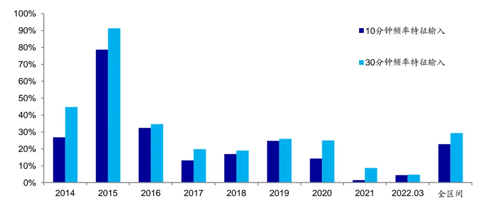
资料来源：Wind，海通证券研究所

## 2.5 尝试 5：改变训练集/验证集切分比例

系列前期报告滚动使用过去 120 个交易日的数据进行模型训练，其中前 100 个交易日作为训练集，后 20个交易日作为验证集。然而，该方法会导致近期数据无法被及时纳入模型训练中。

因此，可考虑压缩验证集，从而将更多近期数据纳入到模型训练中。不妨使用一种极端的划分方法，将前 115 个交易日作为训练集，最后 5 个交易日作为验证集。下表对比了两种数据切分方法下，得到的因子的周度选股能力。（本节将两模型分别简称为100/20 模型以及 115/5 模型。）

表 8 不同训练集/验证集切分方法下深度学习高频因子周度选股能力（2014.01~2022.03）

|  | IC 均值 | 年化ICIR | 周度胜率 | 周均多空收益 | 周均多头超额 | 周均空头超额 |
| --- | --- | --- | --- | --- | --- | --- |
| 100/20 模型 | 0.080 | 9.36 | 92% | 1.53% | 0.49% | 1.04% |
| 115/5 模型 | 0.083 | 9.68 | 93% | 1.61% | 0.54% | 1.06% |

资料来源： ，海通证券研究所

观察上表可知，115/5 模型因子的周度选股能力得到了进一步的增强，周均 IC、年化 ICIR、周均多空收益、多头超额和空头超额皆得到了提升。分年度来看，因子的多头超额收益也在大部分的年份中得到了提升。

图13 不同训练集/验证集切分方法下深度学习高频因子分年度多头超额收益
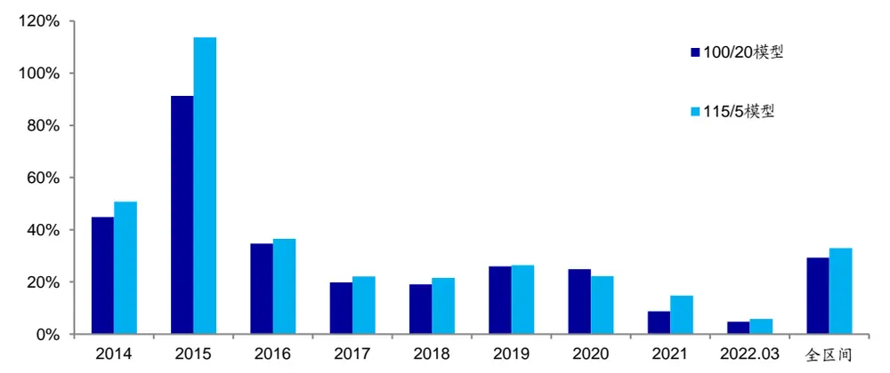
资料来源：Wind，海通证券研究所

下表进一步对比了两模型的因子在添加至周度模型后的组合表现。在部分参数下，115/5模型训练得到的因子在加入组合后有更好的收益表现。但当选股域为80%中证500成分股或个股偏离幅度较大时，115/5 模型相对于 100/20 模型并未展现出明显优势。结合单因子测试和增量添加测试的结果，我们倾向于使用更短的验证集，把更多近期数据加入模型的训练中。

表 9 不同训练集/验证集切分方法下深度学习高频因子周度组合添加测试（2016.01~2022.03）

|  |  | 30%单边换手约束 |  | 40%单边换手约束 |  | 50%单边换手约束 |  |
| --- | --- | --- | --- | --- | --- | --- | --- |
|  |  | 1%偏离 | 2%偏离 | 1%偏离 | 2%偏离 | 1%偏离 | 2%偏离 |
| 80%中证 500 内选股 | 100/20 模型 | 16.7% | 19.7% | 17.1% | 19.8% | 16.0% | 19.4% |
| 全市场选股 | 115/5 模型 | 18.8% | 19.3% | 17.8% | 19.3% | 16.6% | 17.7% |
|  | 100/20 模型 | 21.1% | 21.9% | 21.2% | 21.6% | 20.0% | 20.6% |
|  | 115/5 模型 | 20.1% | 22.8% | 20.5% | 21.1% | 19.1% | 19.5% |

资料来源：Wind，海通证券研究所

## 2.6 尝试 6：输入特征中引入环境变量

为了让模型能够更加灵活地应对市场变化，我们不仅可以调整模型训练中训练集验证集的切分方式，还可引入环境变量。考虑到模型训练的是量价类因子，我们在构建环境变量时，主要选择刻画市场的成交、涨跌、涨跌分化度等与交易相关的指标。下表对比展示了模型在引入环境变量前后的因子周度选股能力。

表 10 环境变量引入前后深度学习高频因子周度选股能力（2014.01~2022.03）

|  | IC 均值 | 年化 ICIR | 周度胜率 | 周均多空收益 | 周均多头超额 | 周均空头超额 |
| --- | --- | --- | --- | --- | --- | --- |
| 无环境变量 | 0.083 | 9.68 | 93% | 1.61% | 0.54% | 1.06% |
| 添加环境变量 | 0.078 | 9.32 | 91% | 1.44% | 0.51% | 0.94% |

资料来源： ，海通证券研究所

不难发现，环境变量的引入并未达到预期中的效果，反而使因子的周度选股能力小幅下降。分年度观察因子的多头超额收益同样可发现，在市场结构快速切换的 2021 年，环境变量的引入未带来模型效果的改善。因此，我们不建议以简单的方式引入环境变量。

图14 环境变量引入前后深度学习高频因子分年度多头超额收益
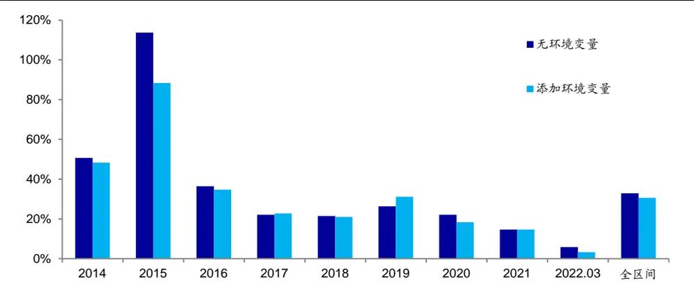
资料来源： ，海通证券研究所

## 2.7 尝试 7：调整预测目标

本节尝试调整模型的预测目标。原始模型的预测目标为股票未来的周度超额收益，本节将预测目标进一步调整为风险调整后的周度超额收益。下表对比了预测目标调整前后的因子周度选股能力。

表 11 预测目标调整前后深度学习高频因子周度选股能力（2014.01~2022.03）

|  | IC 均值 | 年化ICIR | 周度胜率 | 周均多空收益 | 周均多头超额 | 周均空头超额 |
| --- | --- | --- | --- | --- | --- | --- |
| 预测超额收益 | 0.083 | 9.68 | 93% | 1.61% | 0.54% | 1.06% |
| 预测风险调整超额 | 0.081 | 9.42 | 91% | 1.54% | 0.60% | 0.94% |

资料来源：Wind，海通证券研究所

在调整了预测目标后，虽然因子周均 IC 小幅下降，但是因子的周均多头超额收益得到了提升。进一步观察因子分年度多头超额收益同样可发现，预测目标调整后的模型训练得到的因子，在大部分年份中都取得了更高的多头超额收益。

图15 预测目标调整前后深度学习高频因子分年度多头超额收益
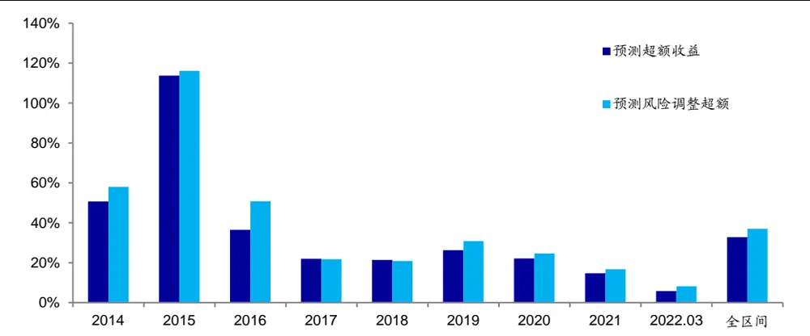
资料来源： ，海通证券研究所

下表进一步对比了两模型因子在添加至周度模型后的组合表现。预测目标调整后的模型同样在组合添加测试中展现了更好的收益表现。在大部分模型参数下，预测目标调整后的模型训练得到的因子，在加入周度组合后都带来了更高的超额收益。

表 12 预测目标调整前后深度学习高频因子周度组合添加测试（2016.01~2022.03）

|  |  | 30%单边换手约束 |  | 40%单边换手约束 |  | 50%单边换手约束 |  |
| --- | --- | --- | --- | --- | --- | --- | --- |
|  |  | 1%偏离 | 2%偏离 | 1%偏离 | 2%偏离 | 1%偏离 | 2%偏离 |
| 80%中证 500 内选股 | 预测超额收益 | 18.8% | 19.3% | 17.8% | 19.3% | 16.6% | 17.7% |
| 全市场选股 | 预测风险调整超额 | 18.9% | 21.8% | 18.2% | 19.3% | 16.3% | 17.4% |
|  | 预测超额收益 | 20.1% | 22.8% | 20.5% | 21.1% | 19.1% | 19.5% |
|  | 预测风险调整超额 | 22.2% | 23.5% | 19.9% | 23.4% | 19.0% | 21.6% |

资料来源：Wind，海通证券研究所

因此，若投资者希望进一步提升因子多头选股能力，我们建议，可考虑将预测目标从超额收益调整为风险调整后超额收益。

## 2.8 尝试 8：延长训练集

系列前期报告滚动使用过去 个交易日的数据训练模型。本节将考察训练集长度延长后的因子表现。不妨将滚动回看窗口从 120 个交易日提升至过去 240 个交易日。下表对比展示了两模型的周度选股能力。（由于 240 日滚动训练模型需要更多的前臵数据，因此本节在比较单因子选股能力时，展示的是 2015 年以来的结果。）

表 13 不同训练集长度下深度学习高频因子周度选股能力（2015.01~2022.03）

|  | IC 均值 | 年化ICIR | 周度胜率 | 周均多空收益 | 周均多头超额 | 周均空头超额 |
| --- | --- | --- | --- | --- | --- | --- |
| 120 个交易日滚动训练 | 0.080 | 9.25 | 90% | 1.55% | 0.58% | 0.97% |
| 240个交易日滚动训练 | 0.091 | 10.45 | 94% | 1.75% | 0.60% | 1.14% |

资料来源：Wind，海通证券研究所

观察上表不难发现，滚动 个交易日训练可得到周度选股能力更强的因子。相比于滚动 120 个交易日训练得到的因子，训练集延长后的因子在周均 IC、年化 ICIR、胜率、周均多空收益、周均多头超额收益等方面皆出现了提升。下图进一步对比展示了延长训练集前后因子的分年度多头超额收益，240 个交易日滚动训练模型在 2015 年、2017年、2019 年和 2021 年略胜一筹。

图16 不同训练集长度下深度学习高频因子分年度多头超额收益
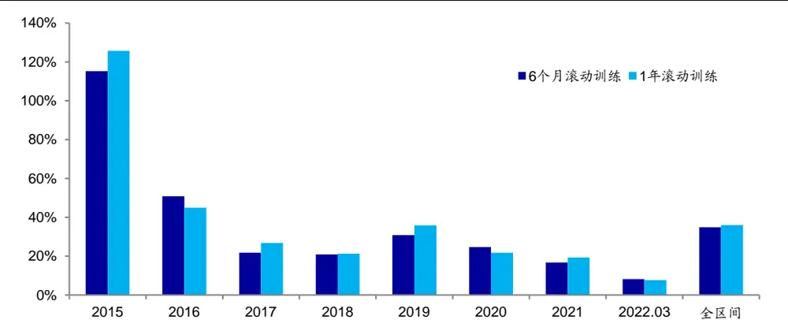
资料来源：Wind，海通证券研究所

下表进一步对比了两模型训练得到的因子，作为增量因子添加至周度中证 500 增强组合后的表现。

表 14 不同训练集长度下深度学习高频因子周度组合添加测试（2016.01~2022.03）

|  |  | 30%单边换手约束 |  | 40%单边换手约束 |  | 50%单边换手约束 |  |
| --- | --- | --- | --- | --- | --- | --- | --- |
| 80%中证 500 |  | 1%偏离 | 2%偏离 | 1%偏离 | 2%偏离 | 1%偏离 | 2%偏离 |
|  | 120 个交易日滚动训练 | 18.9% | 21.8% | 18.2% | 19.3% | 16.3% | 17.4% |
| 内选股 全市场选股 | 240 个交易日滚动训练 | 18.4% | 18.7% | 18.2% | 18.3% | 16.5% | 16.5% |
|  | 120个交易日滚动训练 | 22.2% | 23.5% | 19.9% | 23.4% | 19.0% | 21.6% |
|  | 240个交易日滚动训练 | 21.9% | 23.0% | 20.4% | 22.6% | 19.5% | 20.9% |

资料来源：Wind，海通证券研究所

观察上表可知，组合增量添加测试的结果与单因子测试结果并不一致。滚动 240 个交易日训练得到的因子在添加到组合后，并未得到更高的超额收益。因此，我们认为，延长训练集未必能在各方面都获得提升，是否采用依赖于模型设定和优化目标。

## 2.9 尝试 9：提升模型复杂度

除了调整测试集长度外，我们还可以进一步提升模型的复杂度，考察能否从当前输入特征中提取更多的信息，从而得到更加有效的选股因子。本节在对比测试时，使用的模型已引入正交层、使用 63 个特征作为模型的输入、使用 5日为验证集，并以风险调整后超额收益作为预测目标。下表对比展示了 5种模型复杂度下因子的周度选股能力。

表 15 不同模型复杂度下深度学习高频因子周度选股能力（2015.01~2022.03）

|  | IC 均值 | 年化 ICIR | 周度胜率 | 周均多空收益 | 周均多头超额 | 周均空头超额 |
| --- | --- | --- | --- | --- | --- | --- |
| 120 个交易日滚动训练(GRU(50,2)) | 0.080 | 9.25 | 90% | 1.55% | 0.58% | 0.97% |
| 240 个交易日滚动训练(GRU(50,2)) | 0.091 | 10.45 | 94% | 1.75% | 0.60% | 1.14% |
| 240 个交易日滚动训练(GRU(100,2)) | 0.089 | 10.33 | 94% | 1.70% | 0.61% | 1.10% |
| 240 个交易日滚动训练(GRU(50,3)) | 0.089 | 10.21 | 93% | 1.71% | 0.61% | 1.10% |
| 240 个交易日滚动训练(GRU(100,3)) | 0.088 | 10.33 | 94% | 1.70% | 0.61% | 1.09% |

资料来源： ，海通证券研究所

观察上表不难发现，随着模型复杂度的提升，因子的周度选股能力并未出现进一步增强。具体来看，因子在周均 、周度胜率、周均多空收益、周均多头超额等方面并未有进一步的提升。这表明，更加复杂的模型可能已经无法从当前的输入特征中获得更多的选股信息。我们认为，更复杂的模型或许需要搭配更丰富的信息输入，才能得到更显著的周度选股因子。下图进一步对比了不同模型训练得到的因子的分年度多头超额收益。

图17 不同模型复杂度下深度学习高频因子分年度多头超额收益
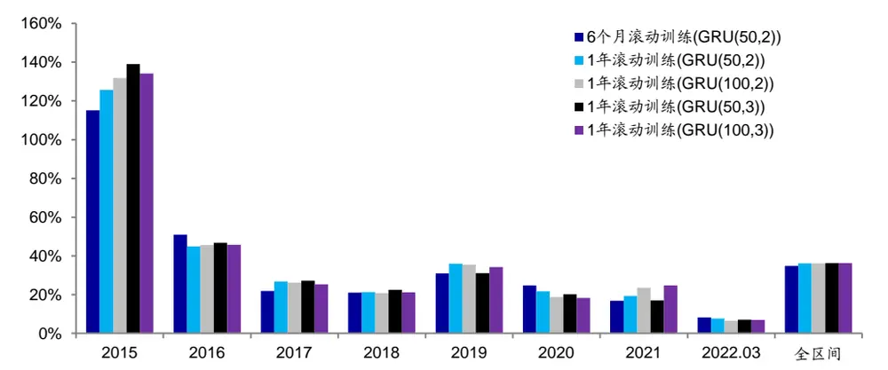
资料来源：Wind，海通证券研究所

下表进一步展示了不同模型训练得到的因子，作为增量因子添加到周度调仓增强组合后的收益表现。观察下表不难发现，120 个交易日滚动+GRU(50,2)训练得到的因子展现出并不弱于复杂模型的增量添加效果。因此，在当前模型输入下，考虑到计算量，我们依旧建议，使用 120个交易日滚动+GRU(50,2)的方式训练模型。当然，如果输入特征中包含更加丰富的信息，或可考虑使用更加复杂的模型提取信息。

表 16 不同模型复杂度下深度学习高频因子周度组合添加测试（2016.01~2022.03）

|  |  | 30%单边换手约束1%偏离 2%偏离 | 40%单边换手约束1%偏离 2%偏离 | 50%单边换手约束1%偏离 2%偏离 |  |
| --- | --- | --- | --- | --- | --- |
| 80%中证 500内选股 | 120 个交易日滚动训练(GRU(50,2)) | 18.9% 21.8% | 18.2% 19.3% | 16.3% 17.4% |  |
|  | 240个交易日滚动训练(GRU(50,2)) | 18.4% 18.7% | 18.2% 18.3% | 16.5% 16.5% |  |
|  | 240 个交易日滚动训练(GRU(100,2)) | 19.2% 20.3% | 17.5% 19.4% | 16.0% 17.9% |  |
|  | 240 个交易日滚动训练(GRU(50,3)) | 17.6% 19.5% | 17.8% 17.4% | 16.2% 17.4% |  |
|  | 240 个交易日滚动训练(GRU(100,3)) | 18.5% 18.1% | 17.8% 17.5% | 16.6% 17.3% |  |
| 全市场选股240 个交易日滚动训练(GRU(100,3)) |  | 120 个交易日滚动训练(GRU(50,2)) | 22.2% 23.5% | 19.9% 23.4% |  |
|  |  | 240 个交易日滚动训练(GRU(50,2)) | 21.9% 23.0% | 20.4% 22.6% | 19.5% 20.9% |
|  |  | 240 个交易日滚动训练(GRU(100,2)) | 21.3% 22.7% | 21.5% 23.2% | 20.5% 22.6% |
|  |  | 240 个交易日滚动训练(GRU(50,3)) | 20.4% 21.5% | 19.9% 21.0% | 19.1% 19.9% |
|  |  | 21.2% 21.4% | 21.0% 21.5% | 19.8% 21.1% |  |

资料来源：Wind，海通证券研究所

## 3. 总结

本文在系列前期报告的基础之上，根据路演交流的反馈，对于现有的深度学习高频因子训练框架进行了多方面的改进尝试。测试结果表明，有 5个尝试能进一步提升深度学习高频因子的选股能力。

1） 在搭建模型时，可考虑引入正交层，在训练过程中直接控制相关性；

2） 在输入特征时，可考虑进行一定的筛选，避免冗余信息产生干扰；

3） 在处理特征时，可考虑使用截面标准化的方式；

4） 在训练模型时，可考虑使用更短的验证集，纳入更多近期数据；

） 在设定预测目标时，可考虑使用风险调整后超额收益。

然而，也有 4个尝试并未达到预期中的效果。

1） 在模型架构不变时，大幅提升输入特征频率可能会因模型信息提取能力不足，减弱因子的选股能力；

2） 简单引入环境变量并不能带来模型灵活度的提升；

3） 更长的滚动训练周期虽能提升因子的周度选股能力，但在作为增量因子添加至组合时，并未得到一致的结果；

4） 在当前的输入特征下，更复杂的模型并不能榨取出更多的选股能力，更丰富的信息输入或许是使用复杂模型的前提。

由于反馈的建议较多，本报告无法展示全部结果，我们会在后续报告中进一步尝试提升模型的表现。

## 4. 风险提示

市场系统性风险、资产流动性风险以及政策变动风险会对策略表现产生较大影响。

# 信息披露

分析师声明

[Table冯佳睿yst金融工程研究团队s]

袁林青金融工程研究团队

本人具有中国证券业协会授予的证券投资咨询执业资格，以勤勉的职业态度，独立、客观地出具本报告。本报告所采用的数据和信息均来自市场公开信息，本人不保证该等信息的准确性或完整性。分析逻辑基于作者的职业理解，清晰准确地反映了作者的研究观点，结论不受任何第三方的授意或影响，特此声明。

## 法律声明

本报告仅供海通证券股份有限公司（以下简称 本公司 ）的客户使用。本公司不会因接收人收到本报告而视其为客户。在任何情况下，本报告中的信息或所表述的意见并不构成对任何人的投资建议。在任何情况下，本公司不对任何人因使用本报告中的任何内容所引致的任何损失负任何责任。

本报告所载的资料、意见及推测仅反映本公司于发布本报告当日的判断，本报告所指的证券或投资标的的价格、价值及投资收入可能会波动。在不同时期，本公司可发出与本报告所载资料、意见及推测不一致的报告。

市场有风险，投资需谨慎。本报告所载的信息、材料及结论只提供特定客户作参考，不构成投资建议，也没有考虑到个别客户特殊的投资目标、财务状况或需要。客户应考虑本报告中的任何意见或建议是否符合其特定状况。在法律许可的情况下，海通证券及其所属关联机构可能会持有报告中提到的公司所发行的证券并进行交易，还可能为这些公司提供投资银行服务或其他服务。

本报告仅向特定客户传送，未经海通证券研究所书面授权，本研究报告的任何部分均不得以任何方式制作任何形式的拷贝、复印件或复制品，或再次分发给任何其他人，或以任何侵犯本公司版权的其他方式使用。所有本报告中使用的商标、服务标记及标记均为本公司的商标、服务标记及标记。如欲引用或转载本文内容，务必联络海通证券研究所并获得许可，并需注明出处为海通证券研究所，且不得对本文进行有悖原意的引用和删改。

根据中国证监会核发的经营证券业务许可，海通证券股份有限公司的经营范围包括证券投资咨询业务。

## 海通证券股份有限公司研究所[Table_PeopleInfo]

路 颖所长

(021)23219403 luying@htsec.com

高道德 副所长(021)63411586 gaodd@htsec.com

邓 勇副所长

(021)23219404 dengyong@htsec.com

| 荀玉根 副所长 (021)23219658 xyg6052@htsec.com | 涂力磊 所长助理 | 余文心 所长助理 |
| --- | --- | --- |
|  | (021)23219747 tll5535@htsec.com | (0755)82780398 ywx9461@htsec.com |

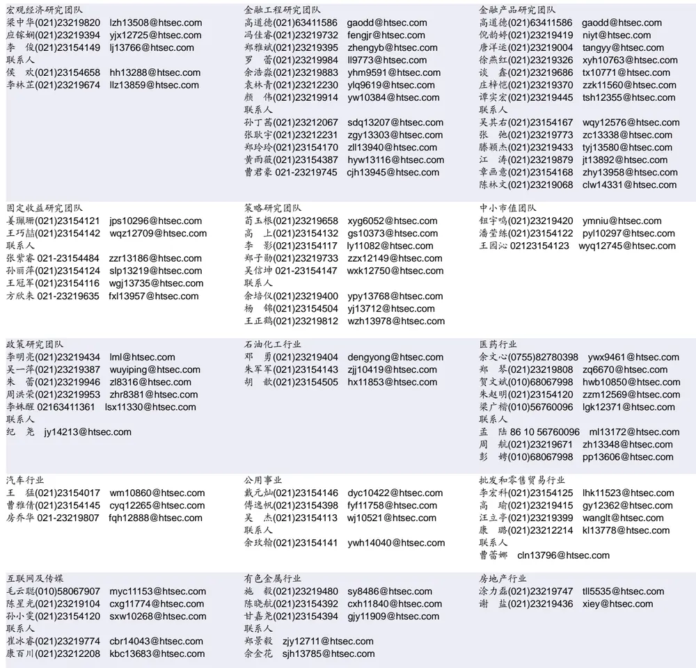

| 电子行业 | 煤炭行业 | 电力设备及新能源行业 |  |
| --- | --- | --- | --- |
| 李 轩(021)23154652 lx12671@htsec.com | 李 淼(010)58067998 Im10779@htsec.com | 张一弛(021)23219402 | zyc9637@htsec.com |
| 肖隽翀(021)23154139 xjc12802@htsec.com | 戴元灿(021)23154146 dyc10422@htsec.com | 房 青(021)23219692 | fangq@htsec.com |
| 华晋书02123219748 hjs14155@htsec.com | 王 涛(021)23219760 wt12363@htsec.com | 徐柏乔(021)23219171 xbq6583@htsec.com |  |
| 联系人 | 吴 杰(021)23154113 wj10521@htsec.com | 张 磊(021)23212001 zl10996@htsec.com |  |
| 文 灿(021)23154401 wc13799@htsec.com |  | 联系人 |  |
| 薛逸民(021)23219963 xym13863@htsec.com |  | 姚望洲(021)23154184 | ywz13822@htsec.com |
| 李 潇(010)58067830 lx13920@htsec.com |  | 柳文韬(021)23219389 | Iwt13065@htsec.com |

| 基础化工行业 | 计算机行业 | 通信行业 |
| --- | --- | --- |
| 刘 威(0755)82764281 Iw10053@htsec.com 刘海荣(021)23154130 Ihr10342@htsec.com | 郑宏达(021)23219392 zhd10834@htsec.com | 余伟民(010)50949926 ywm11574@htsec.com 杨彤昕 010-56760095 ytx12741@htsec.com |
| 张翠翠(021)23214397 zcc11726@htsec.com | 杨 林(021)23154174 yl11036@htsec.com 于成龙(021)23154174 ycl12224@htsec.com | 联系人 |
| 孙维容(021)23219431 swr12178@htsec.com | 洪 琳(021)23154137 hl11570@htsec.com | 夏 凡(021)23154128 xf13728@htsec.com |
| 李 智(021)23219392 Iz11785@htsec.com | 联系人 |  |
|  | 杨 蒙(0755)23617756 ym13254@htsec.com |  |

| 非银行金融行业 |  | 交通运输行业 | 纺织服装行业 |  |  |
| --- | --- | --- | --- | --- | --- |
|  | 孙 婷(010)50949926 st9998@htsec.com | 虞 楠(021)23219382 yun@htsec.com |  |  | 梁 希(021)23219407 Ix11040@htsec.com |
|  | 何 婷(021)23219634 ht10515@htsec.com | 罗月江（010）56760091 lyj12399@htsec.com |  | 盛 开(021)23154510 sk11787@htsec.com |  |
| 联系人 | 任广博(010)56760090 rgb12695@htsec.com | 陈 宇(021)23219442 cy13115@htsec.com |  |  |  |

| 建筑建材行业 |  | 机械行业 |  | 钢铁行业 |
| --- | --- | --- | --- | --- |
| 冯晨阳(021)23212081 fcy10886@htsec.com |  | 余炜超(021)23219816 | swc11480@htsec.com | 刘彦奇(021)23219391 liuyq@htsec.com |
| 潘莹练(021)23154122 | pyl10297@htsec.com | 赵玥炜(021)23219814 | zyw13208@htsec.com | 周慧琳(021)23154399 zhl11756@htsec.com |
| 申 浩(021)23154114 sh12219@htsec.com |  | 赵靖博(021)23154119 zjb13572@htsec.com |  |  |
| 颜慧菁 yhj12866@htsec.com |  | 联系人 刘绮雯 021-23154659 Iqw14384@htsec.com |  |  |

| 建筑工程行业 | 农林牧渔行业 | 食品饮料行业 |  |
| --- | --- | --- | --- |
| 张欣劼 zxj12156@htsec.com | 陈 阳(021)23212041 cy10867@htsec.com | 颜慧菁 yhj12866@htsec.com |  |
| 联系人 |  |  | 张宇轩(021)23154172 zyx11631@htsec.com |
| 曹有成(021)63411398 cyc13555@htsec.com |  |  | 程碧升(021)23154171 cbs10969@htsec.com |

| 军工行业 | 银行行业 | 社会服务行业 |
| --- | --- | --- |
| 张恒晅 zhx10170@htsec.com 联系人 | 孙 婷(010)50949926 st9998@htsec.com 林加力(021)23154395 ljl12245@htsec.com | 汪立亭(021)23219399 wanglt@htsec.com 许樱之(755)82900465 xyz11630@htsec.com |
| 刘砚菲021-2321-4129 lyf13079@htsec.com | 联系人 | 联系人 |
|  | 董栋梁(021) 23219356 ddl13206@htsec.com | 毛弘毅(021)23219583 mhy13205@htsec.com 王祎婕(021)23219768 wyj13985@htsec.com |

| 家电行业 |  | 造纸轻工行业 |
| --- | --- | --- |
| 陈子仪(021)23219244 | chenzy@htsec.com | 汪立亭(021)23219399 wanglt@htsec.com |
| 李 阳(021)23154382 | ly11194@htsec.com | 郭庆龙 gql13820@htsec.com |
| 朱默辰(021)23154383 | zmc11316@htsec.com | 高翩然 gpr14257@htsec.com |
| 刘 璐(021)23214390 II11838@htsec.com |  | 联系人 |
|  |  | 王文杰 wwj14034@htsec.com |
|  |  | 吕科佳 |
|  |  | Ikj14091@htsec.com |

## 研究所销售团队

深广地区销售团队
伏财勇(0755)23607963 fcy7498@htsec.com蔡铁清(0755)82775962 ctq5979@htsec.com辜丽娟(0755)83253022 gulj@htsec.com
刘晶晶(0755)83255933 liujj4900@htsec.com饶 伟(0755)82775282 rw10588@htsec.com欧阳梦楚(0755)23617160
oymc11039@htsec.com
巩柏含 gbh11537@htsec.com
滕雪竹 0755 23963569 txz13189@htsec.com张馨尹 0755-25597716 zxy14341@htsec.com

上海地区销售团队 胡雪梅(021)23219385 huxm@htsec.com 黄 诚(021)23219397 hc10482@htsec.com 季唯佳(021)23219384 jiwj@htsec.com 黄 毓(021)23219410 huangyu@htsec.com 李 寅 021-23219691 ly12488@htsec.com 胡宇欣(021)23154192 hyx10493@htsec.com 马晓男 mxn11376@htsec.com 邵亚杰 23214650 syj12493@htsec.com 杨祎昕(021)23212268 yyx10310@htsec.com 毛文英(021)23219373 mwy10474@htsec.com 谭德康 tdk13548@htsec.com 王祎宁(021)23219281 wyn14183@htsec.com

北京地区销售团队
朱 健(021)23219592 zhuj@htsec.com
殷怡琦(010)58067988 yyq9989@htsec.com
郭 楠 010-5806 7936 gn12384@htsec.com
杨羽莎(010)58067977 yys10962@htsec.com
张丽萱(010)58067931 zlx11191@htsec.com
郭金垚(010)58067851 gjy12727@htsec.com
张钧博 zjb13446@htsec.com
高 瑞 gr13547@htsec.com
上官灵芝 sglz14039@htsec.com
董晓梅 dxm10457@htsec.com

海通证券股份有限公司研究所

地址：上海市黄浦区广东路 689号海通证券大厦 9楼

电话：（021）23219000

传真：（021）23219392

网址：www.htsec.com