## [Tab相关研究

Table_ReportInfo]《全天候思维下的多维度、多策略方法论——广发基金邱世磊投资风格分析》

2022.04.13

《兴业量化投资团队及楼华锋先生侧写——严控风险，灵活应对不同市场环境》2022.04.12

《选股因子系列研究（七十七）——改进深度学习高频因子的 个尝试》2022.04.07

分析师:冯佳睿

Tel:(021)23219732

Email:fengjr@htsec.com

证书:S0850512080006

分析师:罗蕾

Tel:(021)23219984

Email:ll9773@htsec.com

证书:S0850516080002

# 选股因子系列研究（七十八）——构造 A股价值组合的三种范式

## 投资要点：

本文介绍了构造 A股价值组合的三种范式——深度价值组合、低估值组合、以及有基本面支撑的低估值组合，并考察和分析它们的业绩表现。

范式一：深度价值组合。深度价值策略是指，买入公司股价低于其清算价值的股票。当股价持续低于清算价值时，理论上我们可以买入所有股票，将流动资产变现并清偿债务，剩余还可以得到公司所有权及若干现金。由此可见，当股价低于清算价时，意味着该股票很便宜，具有较高的安全边际。深度价值策略实现收益需要时间，持有期为 1 年时，策略相对于 wind 全 A 指数年化超额 5%左右（2013.01-2022.03）。分年度来看，深度价值组合的业绩表现不太稳定，2014年、2017-2020 年期间，组合表现不如市场指数。这在一定程度上可能与 A股市场深度价值个股较少，导致结果不稳定有关，大部分季报期满足条件的个股不足10 只。

- 范式二：低估值组合。估值指标是另外一种用于确定价值型股票的方式，估值低意味着股票价格被低估。控制市值、换手率、SUE 风格后，过去 10 年间，以低估值指标反映的 A股价值风格明显。沪深 300 纯价值组合相对指数月超额收益统计显著，全区间年超额大概在 左右。价值风格较强的年份主要有 年、2016-2018 年、2021-2022 年。分月度来看，价值风格具有一定的 1月效应。即，1 月的价值风格显著弱于其它月份。

- 低估值因子同时具有个股选择和行业选择效果；但相较而言，个股选择收益更为明显，且稳定性更高。分年度来看，2016-2017 年价值风格突出，主要源于个股选择；而 2014 年、2018 年，以及最近两年的价值风格，行业和个股选择贡献各半。价值风格的回撤中，行业贡献普遍较大，如 2013 年、2019-2020 年，均主要源于行业选择。

- 范式三：有基本面支撑的低估值组合。价值投资，即选择便宜的、估值低的股票构建组合。但估值低不是买入股票的唯一考量要素，价格上涨还需其它动力。低估值组合的收益优势，主要源于其较强的防御性，下跌捕获比例显著低于其他股票。但同时，其进攻性（上涨捕获比例）也较弱。而有基本面支撑，则不仅可以提升组合的进攻性，防御性也更强，从而上涨空间更大。本文主要构建了两种有基本面支撑的低估值组合—— 盈利组合和估值 增长组合。

- PB-盈利组合。2013 年初至 2022 年 3 月，年化收益 32.4%，相对 wind 全 A 年超额 23.0%。绝大部分年份，组合相对指数均具有 10%以上的超额收益。加权方式和换仓频率对组合收益影响较小。不同换仓频率和加权方式下，2013 年以来组合相对 wind全 A的年超额均在 20%以上。

- 估值-增长组合。2013 年初至 2022 年 3 月，年化收益 34.6%，相对 wind 全 A年超额 25.2%。分年度来看，绝大部分年份的超额收益均在 10%以上。估值-增长组合与 PB-盈利组合重合度较低，交集个股数占比仅 20%左右。

- 风险提示：模型误设风险，历史统计规律失效风险。

本文介绍了构造 A股价值组合的三种范式——深度价值组合、低估值组合、以及有基本面支撑的低估值组合，并考察和分析它们的业绩表现。

## 1. 范式一：深度价值组合

价值投资旨在将资本的安全性与潜在高收益结合起来。格雷厄姆和多德认为，寻找这种机会的方法之一是“net net”概念。股价低于每股清算价值的公司被定义为“netnets”，也称为深度价值股票。格雷厄姆和多德认为，一家公司不应以低于其清算价值的价格出售，因为这是人们预期公司破产清算时可以得到的价值。“net nets”同时结合了安全性（或安全边际）——股价几乎没有进一步下跌的空间，以及上涨潜力——因为大多数这类公司的股价最终会上涨。

如上所述，深度价值策略是指，买入公司股价低于其清算价值的股票。其中，清算价值是指如果公司宣布破产并被清算，公司资产将获得的预期价值。当公司股价持续低于其清算价值时，理论上我们可以买入所有股票，将流动资产变现并清偿债务，剩余还可以得到公司所有权及若干现金。由此可见，当股价低于清算价值时，意味着该股票很便宜，具有较高的安全边际。

由于清算价值无法直接获得，我们可以使用净流动资产价值（net current assetvalue，NCAV）来粗略估算清算价值：

$$
$\mathsf{NCAV1}{=}[现金{+}0.75^{\star}应收账款{+}0.5^{\star}存贷{-}(总负债{+}(化先股)]/流通股本$
$$

除了上述方法外，也可采用流动资产来计算，如：

$$
\mathrm{NCAV2}=[0.75^{\ast}流动资产-(总负债+优先股)]/总股本
$$

每年季报披露月份（4 月、8 月、10 月底），选择 NCAV 低于股价的公司，构建等权组合。如下图所示，在刚刚满足深度价值条件时，组合相对市场（wind全 A指数）的超额收益并不明显，甚至为负。可见，深度价值组合实现回报需要时间，通常有一个等待期。

图1 深度价值组合不同持有时间的平均累计超额收益
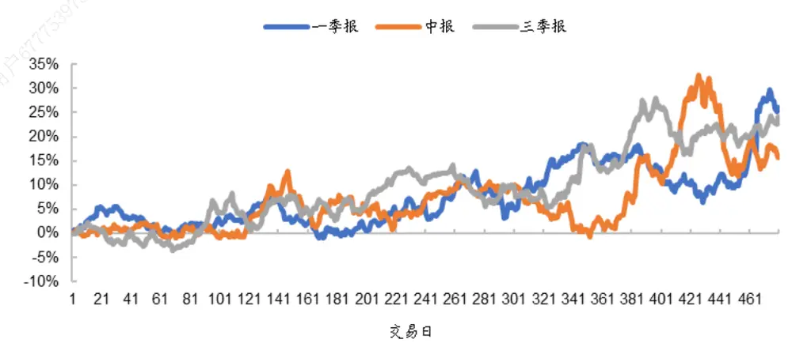
资料来源： ，海通证券研究所

由于深度价值组合实现收益需要时间，因此我们在季报披露结束后的 3个月买入，即 7 月底（一季报）、11 月底（中报）、1月底（三季报）换仓。持有 1 年，扣除单边千3 的交易费用后，深度价值组合每年的业绩表现如下列图表所示。

表 1 深度价值组合的业绩表现（2013.01-2022.03）

|  |  | NCAV1 组合 |  |  | NCAV2 组合 |  |
| --- | --- | --- | --- | --- | --- | --- |
|  |  | 等权 | 超额收益 | 价值加权 | 等权 | 价值加权 |
| 2013 | wind 全 A | 绝对收益 | 绝对收益 | 超额收益 | 绝对收益 超额收益 | 绝对收益 超额收益 |
|  | 5.4% | 65.3% | 59.9% 64.5% | 59.1% | 63.1% 57.7% | 61.8% 56.4% |
| 2014 | 52.4% | 50.1% -2.3% | 54.9% | 2.5% | 46.1% -6.3% | 48.2% -4.2% |
| 2015 | 38.5% | 81.1% | 42.6% 90.4% | 52.0% | 86.7% 48.2% | 84.5% 46.0% |
| 2016 | -12.9% | -18.9% | -6.0% -20.3% | -7.4% | 5.8% 18.7% | 5.6% 18.5% |
| 2017 | 4.9% | -3.3% | -8.3% -3.3% | -8.3% | -17.5% -22.5% | -17.5% -22.5% |
| 2018 | -28.3% | -31.2% | -3.0% -32.3% | -4.0% | -38.2% -9.9% | -38.7% -10.4% |
| 2019 | 33.0% | 23.2% | -9.8% 29.6% | -3.4% | 27.8% -5.2% | 29.0% -4.0% |
| 2020 | 25.6% | 16.7% | -9.0% 21.6% | -4.0% | 8.0% -17.6% | 5.5% -20.1% |
| 2021 | 9.2% | 20.4% | 11.2% 26.2% | 17.0% | 22.1% 12.9% | 25.7% 16.5% |
| 2022 | -13.9% | -15.2% | -1.3% -12.8% | 1.1% | -11.8% 2.1% | -7.3% 6.6% |
| 全区间 | 9.4% | 14.7% | 5.3% 17.3% | 8.0% | 14.7% 5.3% | 15.4% 6.0% |

资料来源：Wind，海通证券研究所

图2 深度价值组合（估值加权）相对于 wind全 A的累计净值
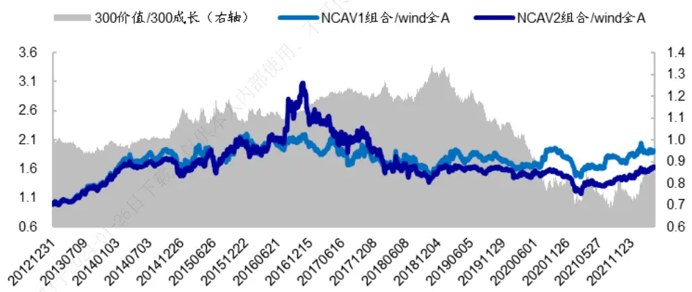
资料来源：Wind，海通证券研究所

自 2013 年初至 2022 年 3 月，NCAV1 等权组合年化收益 14.7%，而同期 wind 全 A指数年化9.4%，组合相对wind全A指数年超额5.3%。NCAV2等权组合年化收益14.7%，超额收益 5.3%。从加权方式来看，无论是 NCAV1 组合还是 NCAV2 组合，都是价值加权（BP加权，下同）优于等权加权。

分年度来看，深度价值组合的业绩表现并不稳定。2014 年、2017-2020 年期间，两个深度价值组合的表现较差，不如市场指数（wind全 A）。这在一定程度上可能与 A股市场深度价值个股较少、导致结果不稳定有关。如图 3、图 4所示，大部分季报期满足条件的个股不足 10 只。

深度价值组合的个股数随着市场环境变化而有所不同。2013 年到 2016 年，随着深度价值个股的上涨，估值修复，满足条件的个股数逐渐减少；至 2015-2017 年期间，深度价值个股平均每期不足 5只。近几年，股价低于清算价值的股票数量逐渐增加，至最新一期（2021Q3），NCAV1 组合包含个股数 18 只，NCAV2 组合包含个股数 30只。

图3 NCAV1 组合每期个股数
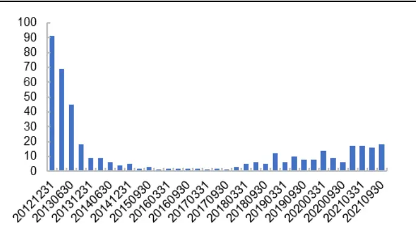
资料来源：Wind，海通证券研究所

图4 NCAV2 组合每期个股数
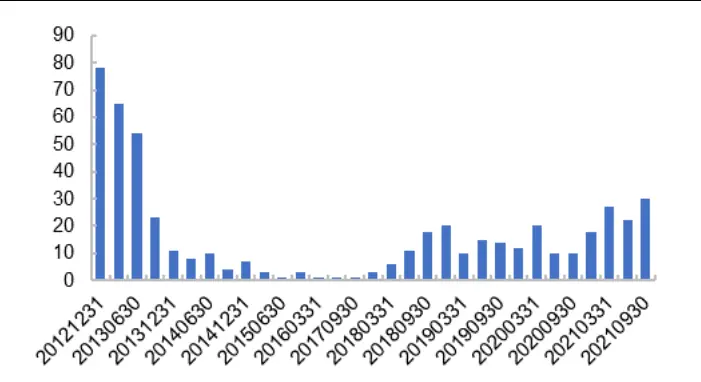
资料来源：Wind，海通证券研究所

## 2. 范式二：低估值组合

估值指标是另外一种用于确定价值型股票的方式，估值低意味着股票价格被低估。常用的估值指标有：市净率（PB）、市盈率（PE）、市现率（市值/经营现金流，PCF）、股息率等。

在最近 3年连续有现金分红的股票池里，等权加总上述 4 个常见估值指标，分别选择估值复合因子得分最高的 20、50 和 100 只股票，构建低估值组合。扣除单边千 3 交易费用后，组合相对于 wind 全 A指数的超额收益如表 2 所示。

从低估值市值加权组合来看，在价值风格占优（300 价值指数优于沪深 300 指数）的年份，如 2016-2018 年、2021-2022 年，低估值组合显著优于 wind全 A指数。而在成长风格占优时，如 2013 年、2015 年、2019-2020 年，低估值组合表现较差，超额收益为负。

对比不同加权方式，等权与价值加权组合接近；且整体优于市值加权组合。Top50等权组合 2013 年初至 2022 年 3 月年化收益 21.0%，相对于 wind 全 A 年化超额 11.6%；分年度来看，除 2020 年略微跑输指数外，其余年份都优于市场指数。

表 2 低估值组合相对于 wind 全 A 指数的超额收益（2013.01-2022.03）

|  | wind 全 A | top100 |  |  | top50 |  |  | top20 |  |  | 300 价值 相对沪深 300 超额 |
| --- | --- | --- | --- | --- | --- | --- | --- | --- | --- | --- | --- |
|  |  | 等权 | 价值加权 | 市值加权 | 等权 | 价值加权 | 市值加权 | 等权 | 价值加权 | 市值加权 |  |
| 2013 | 5.4% | 7.1% | 6.1% | -7.7% | 10.8% | 10.5% | -4.6% | 10.3% | 9.2% | -8.8% | -4.2% |
| 2014 | 52.4% | 8.7% | 8.5% | 8.8% | 3.6% | 6.3% | 3.7% | 1.5% | 1.4% | -8.7% | 11.8% |
| 2015 | 38.5% | 26.6% | 20.4% | -16.0% | 35.8% | 34.0% | -5.5% | 52.3% | 43.4% | 0.1% | -0.6% |
| 2016 | -12.9% | 14.3% | 14.3% | 17.1% | 13.5% | 13.5% | 18.0% | 19.5% | 19.2% | 11.0% | 6.5% |
| 2017 | 4.9% | -2.3% | -0.7% | 5.3% | 0.1% | 1.5% | 8.8% | 0.2% | -0.1% | 9.7% | 10.6% |
| 2018 | -28.3% | 6.2% | 7.3% | 10.8% | 5.3% | 7.2% | 9.5% | 6.3% | 8.1% | 12.4% | 6.3% |
| 2019 | 33.0% | -2.2% | -3.4% | -1.7% | 2.0% | -0.9% | -6.2% | 4.0% | -2.0% | -3.7% | -11.9% |
| 2020 | 25.6% | -6.3% | -5.8% | -20.1% | -0.2% | -0.8% | -15.4% | -5.2% | -2.7% | -8.3% | -27.0% |
| 2021 | 9.2% | 17.5% | 15.9% | 6.9% | 21.4% | 22.0% | 14.6% | 25.6% | 21.0% | 17.7% | 1.0% |
| 2022 | -13.9% | 12.7% | 16.1% | 13.4% | 16.4% | 21.3% | 19.2% | 25.7% | 29.4% | 21.6% | 9.6% |
| 全区间 | 9.4% | 9.0% | 8.9% | 2.9% | 11.6% | 12.5% | 5.8% | 14.8% | 13.9% | 6.1% | 0.5% |

资料来源：Wind，海通证券研究所

如前所述，等权和市值加权方式下，低估值组合的业绩表现存异，这主要受市值风格影响。为剥离市场其他风格影响，进一步提取纯价值组合的收益表现，我们采用线性优化的方式，获取其它风格暴露为 0的低估值纯因子组合：

$$
\begin{aligned}\max_{w}w^{\prime}\cdot\mu&\downarrow\\s.t.w^{\prime}\cdot e&=1\\l\leq w&\leq w\\&\vdots\downarrow\end{aligned}
$$

其中，优化目标为最大化估值复合因子得分；约束条件包括：个股权重偏离上限（1%）、市值、换手率和 SUE风格中性，成分股权重不低于 80%。

不同换仓频率下，扣除单边千 3 的交易费用后，按照上述优化模型得到的沪深 300纯价值组合 2013 年初至 2022 年 3 月的年化超额收益如下图左所示，超额收益波动率如下图右所示。其中，季换仓为每年 3、6、9、12 月调仓，半年换仓为每年 6、12 月调仓，年换仓为每年 12 月调仓。

图 沪深 纯价值组合相对沪深 指数的年化超额收益(2013.01-2022.03)
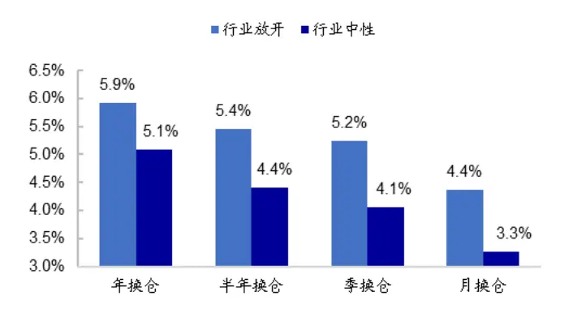
资料来源： ，海通证券研究所

图 沪深 纯价值组合相对沪深 指数日超额收益的年波动率（2013.01-2022.03）
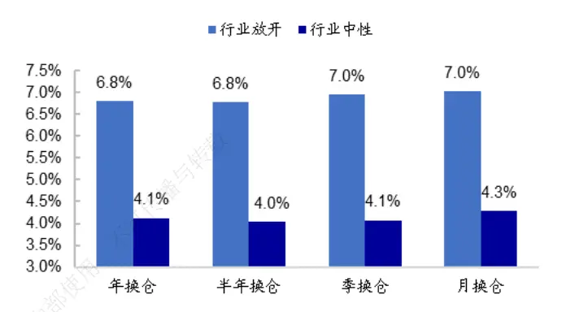
资料来源：Wind，海通证券研究所

图7 沪深 300纯价值组合相对沪深 300分年度超额收益（2013.01-2022.03，半年度换仓）
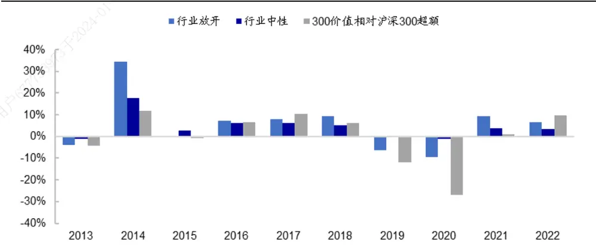
资料来源：Wind，海通证券研究所

## 结果显示：

1） 剥离其它风格影响后，过去 10 年间，以低估值指标反映的 A股价值风格明显。大部分年份，沪深 300 纯价值组合相对于沪深 300 指数都具有正超额，全区间年化超额收益大概在 4%-5%左右。价值风格较强的年份主要有 2014、2016-2018、以及2021-2022年。

2） 换仓频率越低，低估值组合的业绩表现越优。可见，与深度价值组合特征相似，低估值组合实现收益需要时间。

3） 行业放开组合的收益率均高于行业中性组合，可见，低估值因子同时具有个股选择和行业选择效果。但相较而言，个股选择收益更为明显，且稳定性更高。以年换仓为例，行业放开组合的年超额为 5.9%，高于行业中性组合（5.1%）；但行业放开的边际贡献仅 0.8%。从风险角度来看，行业放开组合超额收益的波动率为 ，明显高于行业中性组合的 。可见，低估值因子的个股选择收益更为明显，且稳定性相对更高。

4） 分年度来看，2016-2017 年价值风格突出，主要源于个股选择（图 7）；而 2014年、2018 年，以及最近两年的价值风格，则行业和个股选择贡献各半。价值风格的回撤，行业贡献普遍较大。如 2013 年、2019-2020 年，行业中性组合收益接近于 0，而行业放开组合的收益显著为负。

时间序列来看，沪深 300 纯价值组合相对目标指数超额收益统计显著，t 检验 p值小于 0.05。相对而言，行业中性组合的稳定性高于行业放开组合。

分月度来看，价值风格具有一定的 1月效应。如图 9 所示，将 1 月超额收益累加起来，整体趋势往下；而将每年 2-12 月的月均超额收益累加起来，整体稳定向上。即，1月的价值风格弱于其它月份。将行业中性纯价值组合的月超额收益，对常数项和 1月虚拟变量进行回归，1月虚拟变量的回归系数显著小于 0，相应的 t 值为-2.84，可见价值风格 1月效应统计显著。

表 3 沪深 300纯价值组合超额收益时间序列统计结果（2013.01-2022.03，半年换仓）

|  | 月超额序列t检验 | 加入1月虚拟变量回归 |  |  |
| --- | --- | --- | --- | --- |
|  |  | 行业放开 不可传播 |  | 行业中性 |
|  | 行业放开 行业中性 | 常数项 | 1月 | 常数项 1月 |
| 年超额 | 5.3% 4.2% 内 | 6.7% | -14.9% 5.5% | -13.8% |
| t值 | 2.05 2.94 | 2.46 | -1.64 | 3.75 -2.84 |
| p值 | 0.043 0.004 | 0.016 | 0.103 | 0.000 0.005 |

资料来源：Wind，海通证券研究所
注：年超额为月均超额

图8 沪深 300 纯价值组合相对沪深 300 指数的累计超额(2013.01-2022.03）
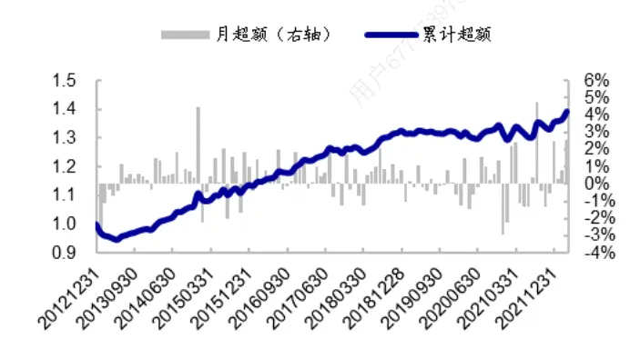
资料来源：Wind，海通证券研究所

图9 沪深 300 纯价值组合 1 月累计超额（2013.01-2022.03）
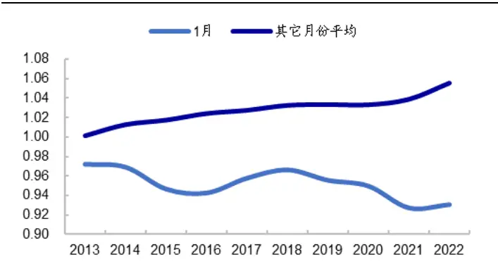
资料来源： ，海通证券研究所

横截面来看（图 10），2015 年以来，各常见宽基（沪深 300、中证 500、中证 1000）纯价值组合相对指数的超额收益均为正。且超额收益各年度特征较为一致，价值风格较强的阶段主要有 2016-2018 年、2021-2022 年，而 2019-2020 年则以成长风格为主。

注：由于最早可获得的中证 1000 指数成分股权重数据为 2014 年 10 月，所以对比各宽基指数时，时间区间为 2015 年以来。

图10 常见宽基纯价值组合相对指数分年度超额收益（2015.01-2022.03，半年换仓，行业放开）
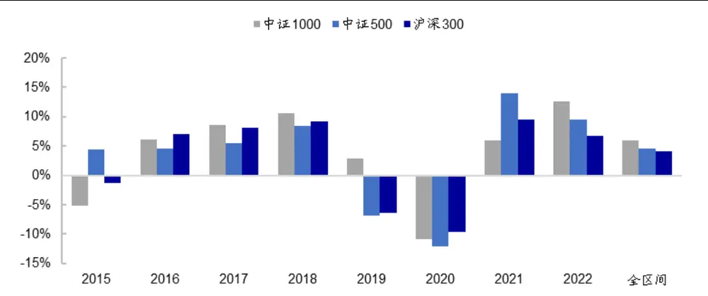
资料来源：Wind，海通证券研究所

综上所述，控制市值、换手率、 风格后，过去 年间，以低估值指标反映的股价值风格明显。沪深 纯价值组合相对指数月超额收益统计显著，全区间年超额大概在 4%-5%左右。价值风格较强的年份主要有 2014 年、2016-2018 年、2021-2022年。分月度来看，价值风格具有一定的 1月效应，即，1 月的价值风格显著弱于其它月份。

低估值因子同时具有个股选择和行业选择效果；但相较而言，个股选择收益更为明显，且稳定性更高。分年度来看，2016-2017 年价值风格突出，主要源于个股选择；而2014 年、2018 年，以及最近两年的价值风格，行业和个股选择贡献各半。价值风格的回撤中，行业贡献普遍较大，如 2013 年、2019-2020 年，均主要源于行业选择。

## 3. 范式三：有基本面支撑的低估值组合

价值投资，即选择便宜的、估值低的股票构建组合。但估值低不是买入股票的唯一考量要素，价格上涨还需其它动力。因此，本节进一步考察有基本面支撑的低估值组合。

## 3.1 PB-盈利组合

根据 ROE和 SUE因子对全市场股票进行等权打分，构建公司的盈利因子得分。基于盈利得分，将全 A个股等分为 5组，D1 为盈利最差的 20%股票，而 D5 为盈利最好的 20%股票。同样地，基于 PB 将全 A股票也等分为 5 组，D1 组为低估值组合，而 D5组为高估值组合。图 展示了不同盈利与估值组合的交集个股数占比，图 为交集组合相对于样本等权组合的年超额（月均超额*12）。

图11 PB 与盈利交集组合个股数占比（2013.01-2022.03）
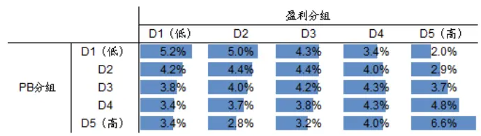
资料来源： ，海通证券研究所

图12 PB 与盈利交集组合超额收益（2013.01-2022.03）

|  |  | 盈利分组 |  |  |  |  |
| --- | --- | --- | --- | --- | --- | --- |
|  |  | D1(低) | D2 | D3 | D4 | D5（高） |
| PB分组 | D1(低) | 3.0% | -09% | 2. % | 3. | 11. 1% |
|  | D2 | 5 6% | 2% | 1. % | 3. | 8. 6% |
|  | D3 | -6. 4% | 5.8% 5 | -08% | 5. 3% | 8. 7% |
|  | D4 | -5. 6% | 4 4% | 4% | 2. | 6. 9% |
|  | D5(高) | -10. .3% | -9.2% | -6.4% | -25% | 5. 8% |
|  | D1-D5 | 7.3% | 8.3% | 8.3% | 6.0% | 5.9% |

资料来源： ，海通证券研究所

从个股数占比来看，盈利最优的 D5股票集中，PB高的股票个数最多，而 PB低的股票数量少；基本面最差的 股票集中， 高的股票数量少，而 低的股票数量多。可见，对于绝大部分股票而言，其估值水平与盈利状况较为匹配。即，盈利好的公司，大部分估值较高；而盈利差的公司，大部分估值较低。

从交集组合的收益表现来看，不同盈利分组中，低 PB组合的收益率普遍高于高估PB 组合，这可能主要源于低估值组合较强的防御性。

具体来看，如图 14 所示，低估值组合的下跌捕获比例（市场月收益率小于 0时，组合月均收益与市场月均收益之比）显著低于高估值组合，基本都在 以下。特别是盈利优异的 D5股票集中，低估值组合的防御性更强，下跌捕获比例仅为 0.43。但同时，市场上涨时低估值组合的进攻性也不如高估值组合。相较而言，两者上涨捕获比例的差距要远远小于下跌捕获比例，这使得防御性更强的低估值组合过去几年间具有收益优势。

通过基本面优选，可以同时提升低估值组合的进攻性和防御性。如图 13、14 所示，在低估值 D1 组里，高盈利组的上涨捕获比例和下跌捕获比例均明显高于低盈利组。

图13 PB 与盈利交集组合上涨捕获比例（2013.01-2022.03）

|  |  | 盈利分组 |  |  |  |  |
| --- | --- | --- | --- | --- | --- | --- |
|  |  | D1(低) | D2 | D3 | D4 | D5（高） |
| PB分组 | D1(低) | 0.82 | 0.82 | 0.87 | 0.86 | 0.93 |
|  | D2 | 0.93 | 1.02 | 1.03 | 1.01 | 1.03 |
|  | D3 | 1.00 | 0.98 | 1.06 | 1.10 | 1.07 |
|  | D4 | 1.04 | 1.07 | 1.09 | 1.11 | 1.09 |
|  | D5(高) | 0.97 | 0.97 | 1.02 | 1.06 | 1.05 |

资料来源： ，海通证券研究所

图14 PB 与盈利交集组合下跌捕获比例（2013.01-2022.03）

|  |  | 盈利分组 |  |  |  |  |
| --- | --- | --- | --- | --- | --- | --- |
|  |  | D1(低) | D2 | D3 | D4 | D5（高） |
| PB分组 | D1(低） | 0.81 | 0.73 | 0.71 | 0.63 | 0.43 |
|  | D2 | 1.10 | 1.08 | 0.98 | 0.86 | 0.71 |
|  | D3 | 1.25 | 1.20 | 1.13 | 0.96 | 0.77 |
|  | D4 | 1.29 | 1.29 | 1.21 | 1.10 | 0.88 |
|  | D5（高） | 1.35 受与转载 | 1.32 | 1.28 | 1.20 | 0.87 |

资料来源： ，海通证券研究所

从组合个股特征来看，与全市场相比，低估值的价值组合和高估值的成长组合，市值都相对偏大。与高估值组合相比，低估值组合的换手率较低，即交易活跃度较低。同时，分析师较少覆盖。盈利好、估值高的成长个股，分析师关注度最高，出具的报告篇数最多。

图15 PB 与盈利交集的个股特征（2013.01-2022.03，均值）
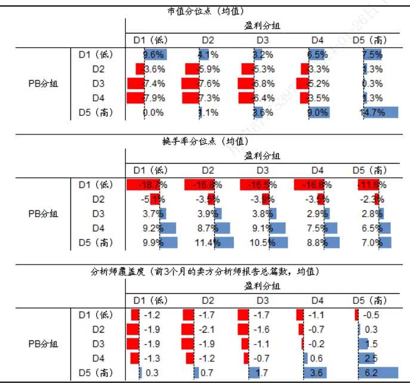
资料来源： ，海通证券研究所
注：图为交集个股各指标分位点均值，与样本池所有个股指标分位点均值之差

图16 PB 与盈利交集个股特征（2013.01-2022.03，中位数）
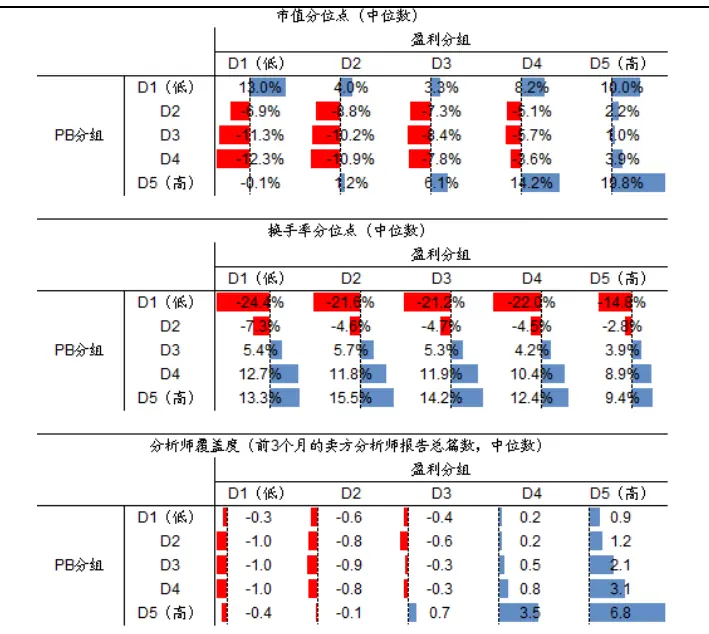
资料来源： ，海通证券研究所
注：图为交集个股各指标分位点中位数，与样本池所有个股指标分位点中位数之差

我们在盈利最好的 D5组合与低估值组合的交集股票池中，采用位序估值和市场关注度指标作进一步的优选。

## 市场关注度优选

基于过去 1 个月日均换手率将全 A个股等分为 5 组，取上述 PB-盈利交集股票池与

低换手率组合的交集，以此来选择近期交易活跃度低、关注度较低的低估值个股。

## 位序估值优选

为降低陷入低估值陷阱的概率，我们剔除长期位序估值低于 10%的个股。同时为避免追高，我们剔除近期估值持续攀升的股票，即短期位序估值高于 90%的个股。其中，位序估值是指，（个股估值/wind 全 A估值）这个指标在过去一段时间内的相对位臵；“长期”是指过去 3年，“短期”是指过去 3个月。

下文我们将盈利 D5 与估值 D1 的交集简称为“组合 1”，经过交易活跃度优选的组合称为“组合 2”，同时经过位序估值优选和市场关注度优选的组合称为“组合 3”。表 4展示了这 3 个等权组合的业绩表现。

2013 年初至 2022 年 3 月期间，组合 1（基础低估值组合）年化收益 26.1%，同期wind 全 A指数年化 9.4%，组合 1相对 wind 全 A指数年化超额 16.7%。经过活跃度优选的组合 2，表现相对更优，区间年化超额 18.2%。在组合 2基础上，进一步通过位序估值优选构建的组合 3，年化收益 32.4%，超额收益 23.0%。绝大部分年份，组合 3 相对于 wind全 A指数均具有 10%以上的年超额。

表 4 PB-盈利等权组合的业绩表现（2013.01-2022.03）

|  | wind 全 A | 基础池（组合1） |  | +活跃度优选（组合2） |  | +估值优选+活跃度（组合3） |  |
| --- | --- | --- | --- | --- | --- | --- | --- |
|  |  | 组合 | 超额收益 | 组合 | 超额收益 | 组合 | 超额收益 |
| 2013 | 5.4% | 24.4% | 18.9% | 25.6% | 20.2% | 17.9% | 12.5% |
| 2014 | 52.4% | 66.3% | 13.8% | 67.9% | 15.5% | 62.0% | 9.6% |
| 2015 | 38.5% | 78.2% | 39.7% | 84.7% | 46.2% | 95.0% | 56.5% |
| 2016 | -12.9% | 8.1% | 21.1% | 12.3% | 25.2% | 13.1% | 26.0% |
| 2017 | 4.9% | 23.7% | 18.8% | 25.4% | 20.4% | 30.3% | 25.3% |
| 2018 | -28.3% | -19.3% | 8.9% | -17.7% | 10.6% | -14.8% | 13.4% |
| 2019 | 33.0% | 33.9% | 0.8% | 36.0% | 3.0% | 40.9% | 7.9% |
| 2020 | 25.6% | 19.8% | -5.8% | 21.1% | -4.5% | 37.8% | 12.2% |
| 2021 | 9.2% | 30.5% | 21.4% | 23.9% | 14.8% | 44.3% | 35.1% |
| 2022 | -13.9% | 2.4% | 16.3% | 2.9% | 16.8% | 2.5% | 16.4% |
| 全区间 | 9.4% | 26.1% | 16.7% | 27.5% | 18.2% | 32.4% | 23.0% |

资料来源：Wind，海通证券研究所

分年度来看，2019 至 2020 年，成长风格显著，300 成长指数显著优于 300 价值指数（图 17）。在这两年间，组合 1和组合 2表现较为平淡，相对于 wind 全 A指数的超额收益较低，甚至为负。经过位序估值优选，可剔除表现差的个股，相应的组合 3这两年的超额收益也超过 。

从个股数（图 18）来看，组合 1平均每期包含个股数 39 只。从前面的个股特征来看，有基本面支撑（盈利高）的低估值组合普遍换手率较低，因此“交易活跃度优选”剔除的个股数很少，组合 2每期个股数与组合 1较为接近，平均为 34只。位序估值优选会剔除一半左右的股票，组合 3平均每期个股数为 15 只。

图17 PB-盈利等权组合相对于 wind全 A的累计净值
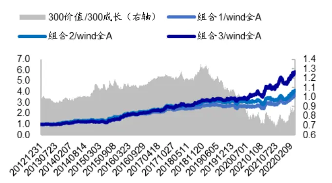
资料来源：Wind，海通证券研究所

图18 PB-盈利组合每期包含个股数
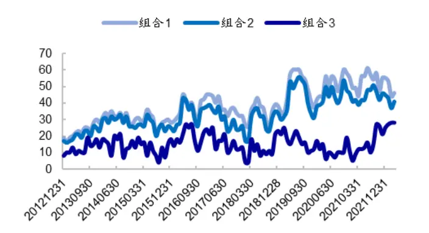
资料来源：Wind，海通证券研究所

从加权方式来看，对于经过市场关注度和估值优选后的组合 3，等权、价值加权、市值加权 3 种加权方式下的业绩表现无明显差异。

表 5 PB-盈利优选组合的业绩表现（2013.01-2022.03）

|  | 等权组合 |  | 价值加权组合 |  | 市值加权组合 |  |
| --- | --- | --- | --- | --- | --- | --- |
|  | 绝对收益 | 超额收益 | 绝对收益 | 超额收益 | 绝对收益 | 超额收益 |
| 2013 | 17.9% | 12.5% | 15.7% | 10.3% | 8.9% | 3.4% |
| 2014 | 62.0% | 9.6% | 65.8% | 13.3% | 76.4% | 24.0% |
| 2015 | 95.0% | 56.5% | 90.3% | 51.8% | 95.2% | 56.7% |
| 2016 | 13.1% | 26.0% | 国 19.1% | 32.0% | 14.1% | 27.0% |
| 2017 | 30.3% | 25.3% HE | 29.1% | 24.1% | 33.5% | 28.5% |
| 2018 | -14.8% | 13.4% | -13.3% | 15.0% | -9.1% | 19.2% |
| 2019 | 40.9% | 7.9% | 40.1% | 7.1% | 36.9% | 3.8% |
| 2020 | 37.8% | 12.2% | 35.0% | 9.4% | 28.2% | 2.6% |
| 2021 | 44.3% | 35.1% | 43.7% | 34.5% | 36.4% | 27.2% |
| 2022 | 2.5% | 16.4% | 2.9% | 16.8% | 3.5% | 17.4% |
| 全区间 | 32.4% | 23.0% | 32.6% | 23.2% | 31.8% | 22.4% |

资料来源：Wind，海通证券研究所

按照季报更新频率来调仓，即每年 4月、8 月、10 月底调仓，组合收益无明显衰减，2013 年以来相对 wind全 A 的年超额均在 20%以上。

表 6 不同换仓频率下，PB-盈利优选组合年超额（2013.01-2022.03）

|  | 4、8、10月底换仓 月频 |
| --- | --- |
| 等权 | 22.0% 23.0% |
| 价值加权 | 22.1% 23.2% |
| 市值加权 | 20.8% 22.4% |

资料来源：Wind，海通证券研究所

## 3.2估值-增长组合

本节的“有基本面支撑的低估值组合”，着重考察低估值、高增长的股票。其中，增长因子为一致预期 2年复合增长率、预期净利润调整、SUE 因子的综合得分；估值为市净率、市盈率、股息率因子的综合得分。组合构建方式与前一节相同，即增长因子多头与估值因子多头组合取交集，然后进行交易活跃度和位序估值优选。

2013 年初至 2022 年 3 月，估值-增长等权组合平均每期包含 20 只股票。组合年化收益 34.6%，相对 wind 全 A年超额 25.2%。分年度来看，绝大部分年份的超额收益均在 10%以上。

图19 估值-增长等权组合相对 wind全 A指数的累计超额
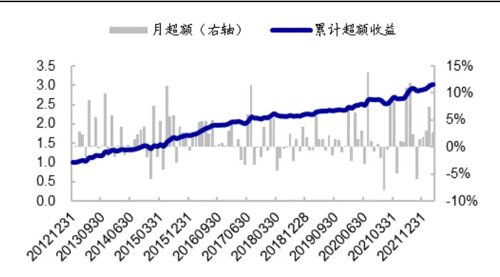
资料来源：Wind，朝阳永续，海通证券研究所

图20 估值-增长组合每期个股数
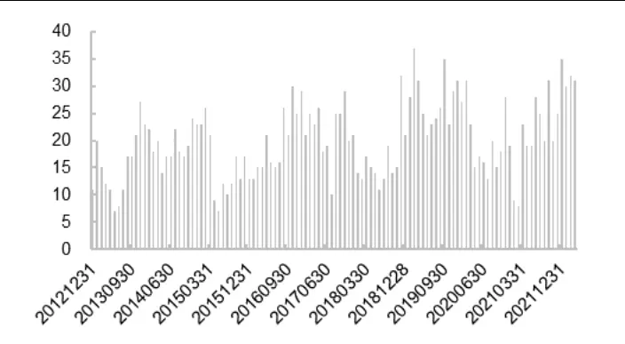
资料来源：Wind，朝阳永续，海通证券研究所

表 7 估值-增长组合的业绩表现（2013.01-2022.03）

|  | 等权组合 |  | 价值加权组合 |  | 市值加权组合 |  |
| --- | --- | --- | --- | --- | --- | --- |
|  | 绝对收益 | 超额收益 | 绝对收益 | 超额收益 | 绝对收益 | 超额收益 |
| 2013 | 42.9% | 37.4% | 42.9% | 32.6% | 25.6% | 20.2% |
| 2014 | 58.2% | 5.7% | 58.2% | 18.8% | 58.6% | 6.1% |
| 2015 | 91.1% | 52.6% | 91.1% | 41.7% | 69.8% | 31.3% |
| 2016 | 18.4% | 31.4% | 18.4% | 28.3% | 15.8% | 28.7% |
| 2017 | 20.6% | 15.7% | 20.6% | 14.8% | 30.4% | 25.4% |
| 2018 | -21.4% | 6.9% | -21.4% | 9.0% | -24.6% | 3.6% |
| 2019 | 46.4% | 13.4% | 46.4% | 11.6% | 36.4% | 3.4% |
| 2020 | 46.0% | 20.3% | 46.0% | 26.3% | 31.1% | 5.5% |
| 2021 | 53.5% | 44.4% | 53.5% | 37.9% | 35.1% | 26.0% |
| 2022 | -1.8% | 12.1% | -1.8% | 14.2% | -0.2% | 13.7% |
| 全区间 | 34.6% | 25.2% | 34.6% | 25.0% | 27.2% | 17.9% |

资料来源：Wind，朝阳永续，海通证券研究所

估值 增长组合与 组合重合度较低，交集个股数占比 左右。两个策略取并集，平均每期包含个股数 31 只。并集组合的业绩表现处于两个子策略之间，不同加权方式下，组合 2013 年以来相对于 wind全 A的年超额均在 20%以上。

表 8 PB-盈利与估值-增长并集组合的业绩表现（2013.01-2022.03）

|  | 等权组合 |  | 价值加权组合 |  | 市值加权组合 |  |
| --- | --- | --- | --- | --- | --- | --- |
|  | 绝对收益 | 超额收益 | 绝对收益 | 超额收益 | 绝对收益 | 超额收益 |
| 2013 | 31.6% | 26.1% | 31.6% | 21.3% | 17.3% | 11.9% |
| 2014 | 59.6% | 7.2% | 59.6% | 16.3% | 67.7% | 15.2% |
| 2015 | 99.9% | 61.4% | 99.9% | 49.2% | 83.8% | 45.3% |
| 2016 | 15.5% | 28.4% | 15.5% | 30.2% | 15.0% | 28.0% |
| 2017 | 23.7% | 18.8% | 23.7% | 19.6% | 32.2% | 27.3% |
| 2018 | -17.6% | 10.6% | -17.6% | 12.3% | -16.8% | 11.5% |
| 2019 | 43.6% | 10.6% | 43.6% | 9.6% | 36.9% | 3.9% |
| 2020 | 44.8% | 19.2% | 44.8% | 18.2% | 30.1% | 4.5% |
| 2021 | 49.9% | 40.7% | 49.9% | 36.2% | 35.9% | 26.7% |
| 2022 | 0.2% | 14.1% | 0.2% | 15.5% | 1.7% | 15.6% |
| 全区间 | 34.4% | 25.0% | 34.4% | 24.6% | 29.9% | 20.5% |

资料来源：Wind，海通证券研究所

## 3.3 小结

价值投资，即选择便宜的、估值低的股票构建组合。但估值低不是买入股票的唯一考量要素，价格上涨还需其它动力。有基本面支撑，不仅可以提升低估值组合的进攻性，防御性也更强，上涨空间更大。本节构建了两种有基本面支撑的低估值组合：PB-盈利、和估值-增长。

盈利组合 年初至 年 月，年化收益 ，相对 全 年超额23.0%。加权方式和换仓频率对组合收益的影响较小。不同换仓频率和加权方式下，2013年以来组合相对 wind全 A 的年超额均在 20%以上。

估值-增长组合 2013 年初至 2022 年 3 月，年化收益 34.6%，相对 wind 全 A 年超额 25.2%。分年度来看，绝大部分年份的超额收益均在 10%以上。估值-增长组合与 PB-盈利组合重合度较低，交集个股数占比仅 20%左右。

## 4. 总结

本文介绍了构造 A股价值组合的三种范式——深度价值组合、低估值组合、以及有基本面支撑的低估值组合，并考察和分析它们的业绩表现。

范式一：深度价值组合。深度价值策略是指，买入公司股价低于其清算价值的股票。当股价持续低于清算价值时，理论上我们可以买入所有股票，将流动资产变现并清偿债务，剩余还可以得到公司所有权及若干现金。由此可见，当股价低于清算价时，意味着该股票很便宜，具有较高的安全边际。深度价值策略实现收益需要时间，持有期为 1 年时，策略相对于 wind全 A 指数年化超额 5%左右（2013.01-2022.03）。分年度来看，深度价值组合的业绩表现不太稳定， 年、 年期间，组合表现不如市场指数。这在一定程度上可能与 A股市场深度价值个股较少，导致结果不稳定有关，大部分季报期满足条件的个股不足 10 只。

范式二：低估值组合。估值指标是另外一种用于确定价值型股票的方式，估值低意味着股票价格被低估。控制市值、换手率、SUE风格后，过去 10 年间，以低估值指标反映的 A股价值风格明显。沪深 300 纯价值组合相对指数月超额收益统计显著，全区间年超额大概在 4%-5%左右。价值风格较强的年份主要有 2014 年、2016-2018 年、2021-2022 年。分月度来看，价值风格具有一定的 1 月效应。即，1月的价值风格显著弱于其它月份。

低估值因子同时具有个股选择和行业选择效果；但相较而言，个股选择收益更为明显，且稳定性更高。分年度来看，2016-2017 年价值风格突出，主要源于个股选择；而2014 年、2018 年，以及最近两年的价值风格，行业和个股选择贡献各半。价值风格的回撤中，行业贡献普遍较大，如 2013 年、2019-2020 年，均主要源于行业选择。

范式三：有基本面支撑的低估值组合。价值投资，即选择便宜的、估值低的股票构建组合。但估值低不是买入股票的唯一考量要素，价格上涨还需其它动力。低估值组合的收益优势，主要源于其较强的防御性，下跌捕获比例显著低于其他股票。但同时，其进攻性（上涨捕获比例）也较弱。而有基本面支撑，则不仅可以提升组合的进攻性，防御性也更强，从而上涨空间更大。本文主要构建了两种有基本面支撑的低估值组合——PB-盈利组合和估值-增长组合。

PB-盈利组合。2013 年初至 2022 年 3 月，年化收益 32.4%，相对 wind 全 A 年超额 23.0%。绝大部分年份，组合相对指数均具有 10%以上的超额收益。加权方式和换仓频率对组合收益影响较小。不同换仓频率和加权方式下，2013 年以来组合相对 wind 全A 的年超额均在 20%以上。

估值-增长组合。2013 年初至 2022 年 3 月，年化收益 34.6%，相对 wind全 A年超额 25.2%。分年度来看，绝大部分年份的超额收益均在 10%以上。估值-增长组合与 PB-盈利组合重合度较低，交集个股数占比仅 20%左右。

## 5. 风险提示

模型误设风险，历史统计规律失效风险。

## 信息披露

分析师声明

[Table冯佳睿yst金融工程研究团队s]

罗蕾金融工程研究团队

本人具有中国证券业协会授予的证券投资咨询执业资格，以勤勉的职业态度，独立、客观地出具本报告。本报告所采用的数据和信息均来自市场公开信息，本人不保证该等信息的准确性或完整性。分析逻辑基于作者的职业理解，清晰准确地反映了作者的研究观点，结论不受任何第三方的授意或影响，特此声明。

## 法律声明

本报告仅供海通证券股份有限公司（以下简称 本公司 ）的客户使用。本公司不会因接收人收到本报告而视其为客户。在任何情况下，本报告中的信息或所表述的意见并不构成对任何人的投资建议。在任何情况下，本公司不对任何人因使用本报告中的任何内容所引致的任何损失负任何责任。

本报告所载的资料、意见及推测仅反映本公司于发布本报告当日的判断，本报告所指的证券或投资标的的价格、价值及投资收入可能转会波动。在不同时期，本公司可发出与本报告所载资料、意见及推测不一致的报告。 播

市场有风险，投资需谨慎。本报告所载的信息、材料及结论只提供特定客户作参考，不构成投资建议，也没有考虑到个别客户特殊的可投资目标、财务状况或需要。客户应考虑本报告中的任何意见或建议是否符合其特定状况。在法律许可的情况下，海通证券及其所属，关联机构可能会持有报告中提到的公司所发行的证券并进行交易，还可能为这些公司提供投资银行服务或其他服务。使

本报告仅向特定客户传送，未经海通证券研究所书面授权，本研究报告的任何部分均不得以任何方式制作任何形式的拷见，复印件或复制品，或再次分发给任何其他人，或以任何侵犯本公司版权的其他方式使用。所有本报告中使用的商标、服务标记及标记均为本公司的商标、服务标记及标记。如欲引用或转载本文内容，务必联络海通证券研究所并获得许可，并需注明出处为海通证券研究所，且不得对本文进行有悖原意的引用和删改。

根据中国证监会核发的经营证券业务许可，海通证券股份有限公司的经营范围包括证券投资咨询业务。26

## 海通证券股份有限公司研究所[Table_PeopleInfo]

路 颖所长

(021)23219403 luying@htsec.com

高道德 副所长(021)63411586 gaodd@htsec.com

邓 勇副所长

(021)23219404 dengyong@htsec.com

| 荀玉根 副所长 (021)23219658 xyg6052@htsec.com | 涂力磊 所长助理 | 余文心 所长助理 |
| --- | --- | --- |
|  | (021)23219747 tll5535@htsec.com | (0755)82780398 ywx9461@htsec.com |

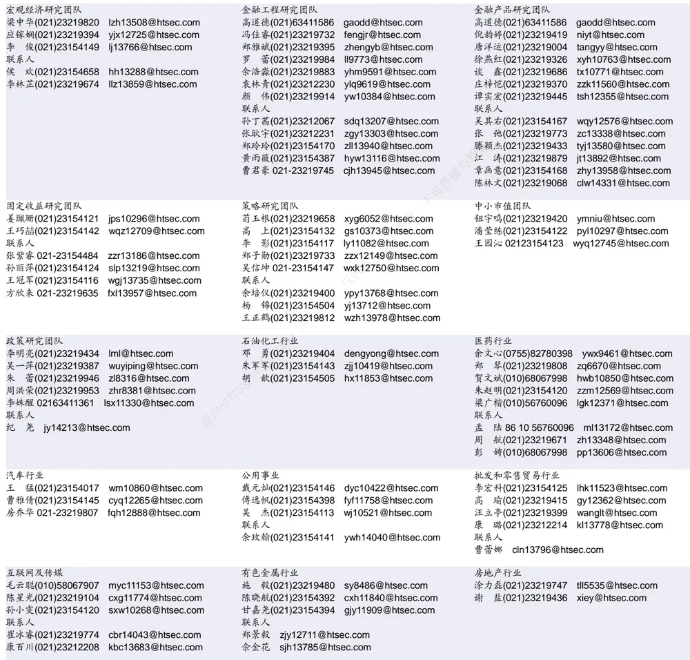

| 基础化工行业 | 计算机行业 | 通信行业 |
| --- | --- | --- |
| 刘 威(0755)82764281 Iw10053@htsec.com | 郑宏达(021)23219392 zhd10834@htsec.com | 余伟民(010)50949926 ywm11574@htsec.com |
| 刘海荣(021)23154130 Ihr10342@htsec.com | 杨 林(021)23154174 yl11036@htsec.com | 杨彤昕 010-56760095 ytx12741@htsec.com |
| 张翠翠(021)23214397 zcc11726@htsec.com | 于成龙(021)23154174 ycl12224@htsec.com | 联系人 |
| 孙维容(021)23219431 swr12178@htsec.com | 洪 琳(021)23154137 hl11570@htsec.com | 夏 凡(021)23154128 xf13728@htsec.com |
| 李 智(021)23219392 lz11785@htsec.com | 联系人 杨 蒙(0755)23617756 ym13254@htsec.com |  |

| 非银行金融行业 |  | 交通运输行业 | 纺织服装行业 |  |  |
| --- | --- | --- | --- | --- | --- |
|  | 孙 婷(010)50949926 st9998@htsec.com | 虞 楠(021)23219382 yun@htsec.com |  |  | 梁 希(021)23219407 lx11040@htsec.com |
|  | 何 婷(021)23219634 ht10515@htsec.com | 罗月江（010）56760091 lyj12399@htsec.com |  | 盛 开(021)23154510 sk11787@htsec.com |  |
| 联系人 | 任广博(010)56760090 rgb12695@htsec.com | 陈 宇(021)23219442 cy13115@htsec.com |  |  |  |

| 建筑建材行业 |  | 机械行业 |  | 钢铁行业 |
| --- | --- | --- | --- | --- |
| 冯晨阳(021)23212081 fcy10886@htsec.com |  | 佘炜超(021)23219816 | swc11480@htsec.com | 刘彦奇(021)23219391 liuyq@htsec.com |
| 潘莹练(021)23154122 | pyl10297@htsec.com | 赵玥炜(021)23219814 | zyw13208@htsec.com | 周慧琳(021)23154399 zhl11756@htsec.com |
| 申 浩(021)23154114 sh12219@htsec.com |  | 赵靖博(021)23154119 | zjb13572@htsec.com |  |
| 颜慧菁 yhj12866@htsec.com |  | 联系人 刘绮雯 021-23154659 | lqw14384@htsec.com 专播与转载 |  |

| 建筑工程行业 张欣劼 zxj12156@htsec.com | 农林牧渔行业 |  | 食品饮料行业 |  |
| --- | --- | --- | --- | --- |
|  |  | 陈 阳(021)23212041 cy10867@htsec.com |  | 颜慧菁 yhj12866@htsec.com |
| 联系人 |  |  |  | 张宇轩(021)23154172 zyx11631@htsec.com |
| 曹有成(021)63411398 cyc13555@htsec.com |  | 7部使 | 程碧升(021)23154171 cbs10969@htsec.com |  |

| 军工行业 | 银行行业 |  | 社会服务行业 |
| --- | --- | --- | --- |
| 张恒晅 zhx10170@htsec.com 联系人 | 孙 婷(010)50949926 林加力(021)23154395 Ijl12245@htsec.com | st9998@htsec.com | 汪立亭(021)23219399 wanglt@htsec.com 许樱之(755)82900465 xyz11630@htsec.com |
| 刘砚菲 021-2321-4129 lyf13079@htsec.com | 联系人 |  | 联系人 |
|  | 董栋梁(021) 23219356 ddl13206@htsec.com 26 |  | 毛弘毅(021)23219583 mhy13205@htsec.com 王祎婕(021)23219768 wyj13985@htsec.com |

| 家电行业 |  | 造纸轻工行业 |
| --- | --- | --- |
| 陈子仪(021)23219244 | chenzy@htsec.com | 汪立亭(021)23219399 wanglt@htsec.com |
| 李 阳(021)23154382 | ly11194@htsec.com | 郭庆龙 gql13820@htsec.com |
| 朱默辰(021)23154383 | zmc11316@htsec.com | 高翩然 gpr14257@htsec.com |
| 刘 璐(021)23214390 | II11838@htsec.com 用户67775 | 联系人 王文杰 wwj14034@htsec.com |

## 研究所销售团队

深广地区销售团队
伏财勇(0755)23607963 fcy7498@htsec.com蔡铁清(0755)82775962 ctq5979@htsec.com辜丽娟(0755)83253022 gulj@htsec.com
刘晶晶(0755)83255933 liujj4900@htsec.com饶 伟(0755)82775282 rw10588@htsec.com欧阳梦楚(0755)23617160
oymc11039@htsec.com
巩柏含 gbh11537@htsec.com
滕雪竹 0755 23963569 txz13189@htsec.com张馨尹 0755-25597716 zxy14341@htsec.com
上海地区销售团队
胡雪梅(021)23219385 huxm@htsec.com
黄 诚(021)23219397 hc10482@htsec.com
季唯佳(021)23219384 jiwj@htsec.com
黄 毓(021)23219410 huangyu@htsec.com
李 寅 021-23219691 ly12488@htsec.com
胡宇欣(021)23154192 hyx10493@htsec.com
马晓男 mxn11376@htsec.com
邵亚杰 23214650 syj12493@htsec.com
杨祎昕(021)23212268 yyx10310@htsec.com
毛文英(021)23219373 mwy10474@htsec.com
谭德康 tdk13548@htsec.com
王祎宁(021)23219281 wyn14183@htsec.com
北京地区销售团队
朱 健(021)23219592 zhuj@htsec.com
殷怡琦(010)58067988 yyq9989@htsec.com
郭 楠 010-5806 7936 gn12384@htsec.com
杨羽莎(010)58067977 yys10962@htsec.com
张丽萱(010)58067931 zlx11191@htsec.com
郭金垚(010)58067851 gjy12727@htsec.com
张钧博 zjb13446@htsec.com
高 瑞 gr13547@htsec.com
上官灵芝 sglz14039@htsec.com
董晓梅 dxm10457@htsec.com

海通证券股份有限公司研究所

地址：上海市黄浦区广东路 689号海通证券大厦 9楼

电话：（021）23219000

传真：（021）23219392

网址：www.htsec.com