## [Tab相关研究

[Table_ReportInfo]《选股因子系列研究（六十九）——高频因子的现实与幻想》2020.07.30

《选股因子系列研究（七十五）——基于深度学习的高频因子挖掘》《选股因子系列研究（七十七）——改进深度学习高频因子的 9个尝试》

2022.04.07

分析师:冯佳睿

Tel:(021)23219732

Email:fengjr@htsec.com

证书:S0850512080006

分析师:袁林青

Tel:(021)23212230

Email:ylq9619@htsec.com

证书:S0850516050003

# 选股因子系列研究（七十九）——用注意力机制优化深度学习高频因子

## 投资要点：

本系列前期报告从高频指标序列出发，使用 RNN+NN 的模型架构生成了深度学习高频因子。回测结果表明，该类因子具有较为显著的周度选股能力。然而，在后续研究中，我们发现，当模型输入特征频率较高、序列较长时， 和 的记忆性会受到挑战，使得模型生成的因子选股效果明显减弱。为了解决 G 和 S在输入序列较长时产生的“遗忘”问题，本文在原模型的基础上引入注意力机制。

人工逻辑类高频因子受到的挑战越来越大。 ，反转型高频因子呈现较为明显的失效迹象。进入 2022 年后，除平均单笔流出金额占比外，其余反转型高频因子的多头超额收益仍未出现好转。动量型高频因子的表现分化明显。开盘后买入意愿占比因子依旧有显著的多头超额收益，而开盘后买入意愿强度因子表现较差。2021 年表现较好的开盘后大单净买入占比/强度因子 2022 年回撤幅度较大，但 4月底以来已呈现大幅回升的态势。

- 深度学习高频因子 年四季度的回撤，一方面可能是市场风格的快速切换所致，另一方面可能是源于因子本身的拥挤。为此，我们在报告《改进深度学习高频因子的 9 个尝试》中，提出了几项颇有成效的改进方案。具体包括，正交层的引入、训练集与验证集的重新切分、预测目标的调整。改进后的因子表现明显提升，不仅 2021 年四季度的回撤幅度显著缩窄，而且于 12 月下旬便开始反弹，大幅领先于改进前的因子。

- 在处理长度大幅提升的序列时，GRU 和 LSTM 模型信息提取能力不足的问题被暴露出来。换句话说，当输入序列过长时，GRU 和 LSTM 模型前期学习到的特征很难体现在最终的输出中，也就是模型“遗忘”了部分信息。例如，当我们尝试将模型的输入特征频率从30分钟提升至10分钟时，因子表现反而出现了下降。

引入注意力机制缓解“遗忘”问题。对于 RNN 每一期输出的隐含状态进行第二次信息提取，再输入后续模型，而非简单地使用最后一期的隐含状态。至于如何实现信息再提取，最简单的思路就是对每期的隐含状态赋权，并将它们一同输入后续模型中。

- 当特征频率为 10 分钟时，引入注意力机制可以优化深度学习高频因子的多头超额收益。在全区间（ ）以及大部分年份中，引入注意力机制后的因子多头超额收益更优。尤为值得一提的是，因子 2020 年至今的表现显著提升，期间的回撤大幅减小，净值创新高的速度也更快，在一定程度上改善了潜在的因子拥挤问题。此外，注意力机制的引入还大幅提高了因子的自相关性，使得多头组合的换手率明显下降，对实际应用更有价值。

- 用残差注意力机制替换简单注意力机制能够进一步优化深度学习高频因子的表现。具体表现为，因子不仅在 年起的每一年都取得了更高的多头超额收益，而且在 期间，展现出不弱于原始模型的业绩，尤其是在简单注意力机制模型表现较弱的 2019 年。此外，因子的自相关性显著高于原始模型，因而 Top组合的换手率更低。

- 风险提示。市场系统性风险、因子失效风险、模型误设风险。

本系列前期报告从高频指标序列出发，使用 的模型架构生成了深度学习高频因子。回测结果表明，该类因子具有较为显著的周度选股能力。然而，在后续研究中，我们发现，当模型输入特征频率较高、序列较长时，GRU 和 LSTM 的记忆性会受到挑战，使得模型生成的因子选股效果明显减弱。为了解决 和 在输入序列较长时产生的“遗忘”问题，本文在原模型的基础上引入注意力机制。

本文共有七个部分。第一部分回顾部分人工逻辑类高频因子和深度学习高频因子的收益表现；第二部分将注意力机制融入现有的深度学习高频因子训练框架；第三部分对比因子的周度选股能力；第四部分使用残差注意力机制模型进一步优化因子表现；第五部分展示因子添加至周度调仓组合后的表现；第六部分总结全文；第七部分提示风险。

## 1. 高频因子表现跟踪

年 月以来，我们前期开发并持续跟踪的人工逻辑类高频因子的表现遭遇了较大的挑战。以下两图分别展示了反转型和动量型高频因子的多头组合相对全市场平均的强弱净值。（本节涉及的高频因子均已对常规低频因子正交。）

图1 反转型高频因子多头组合/全市场平均
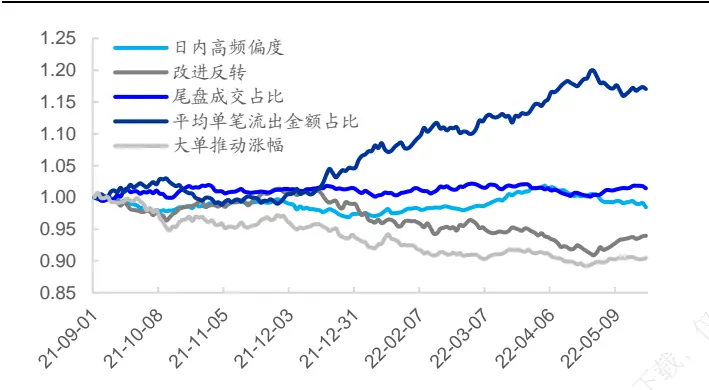
资料来源：Wind，海通证券研究所

图2 动量型高频因子多头组合/全市场平均
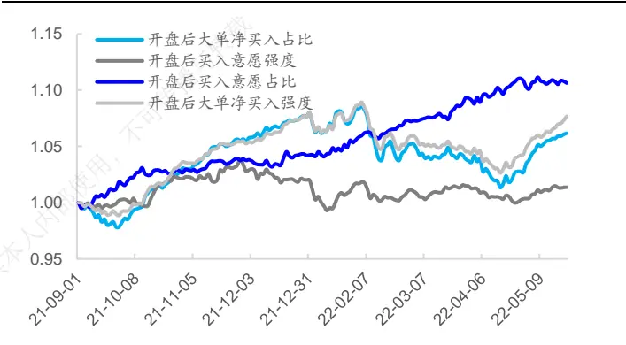
资料来源：Wind，海通证券研究所

2021.09-2021.12，反转型高频因子呈现较为明显的失效迹象。进入 2022 年后，除平均单笔流出金额占比外，其余反转型高频因子的多头超额收益仍未出现好转。

动量型高频因子的表现分化明显。开盘后买入意愿占比因子依旧有显著的多头超额收益，而开盘后买入意愿强度因子表现较差。2021 年表现较好的开盘后大单净买入占比/强度因子 2022 年回撤幅度较大，但 4 月底以来已呈现大幅回升的态势。

由于人工逻辑类高频因子受到的挑战越来越大，我们在前期报告《基于深度学习的高频因子挖掘》中，进一步构建了深度学习高频因子，并予以实时跟踪。

图3 深度学习高频因子多头组合/全市场平均
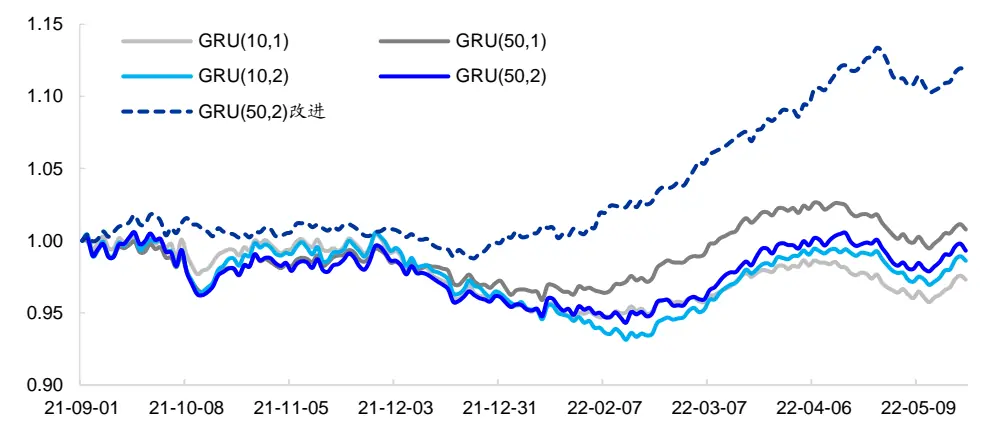
资料来源：Wind，海通证券研究所

由上图可见，深度学习高频因子（实线）在 2021.09-2022.01 期间，多头超额收益表现不佳，出现了一定程度的回撤。不过，2022 年 2月以来，深度学习高频因子的表现回升明显。

我们认为，深度学习高频因子 2021 年四季度的回撤，一方面可能是市场风格的快速切换所致，另一方面可能是源于因子本身的拥挤。为此，我们在报告《改进深度学习高频因子的 9个尝试》中，提出了几项颇有成效的改进方案。具体包括，正交层的引入、训练集与验证集的重新切分、预测目标的调整。改进后的因子（虚线）表现明显提升，不仅 2021 年四季度的回撤幅度显著缩窄，而且于 12月下旬便开始反弹，大幅领先于改进前的因子。

## 2. Attention is All You Need

但是，在这一系列的改进中，我们发现，当我们尝试将模型的输入特征频率从 30分钟提升至 10分钟时，因子表现，如周均 IC、ICIR和分年多头超额收益，反而出现了下降（表 1、图 4）。

表 1 不同输入特征频率下，深度学习高频因子周度选股能力（2016.01-2022.05）

|  | IC 均值 | 年化 ICIR | 周度胜率 | 周均多头超额 | 周均空头超额 | 周均多空 |
| --- | --- | --- | --- | --- | --- | --- |
| 30 分钟频率特征输入 | 0.079 | 9.473 | 92% | 0.42% | -1.02% | 1.44% |
| 10分钟频率特征输入 | 0.070 | 9.156 | 92% | 0.33% | -0.92% | 1.24% |

资料来源：Wind，海通证券研究所

直觉上，更高频的输入特征应当包含更多的信息，选股效果也会更好，但相反的测试结果不得不让人思考可能的原因。我们认为，在处理长度大幅提升的序列时，GRU 和LSTM 模型信息提取能力不足的问题被暴露出来。换句话说，当输入序列过长时，GRU和 LSTM 模型前期学习到的特征很难体现在最终的输出中，也就是模型“遗忘”了部分信息。

图4 不同输入特征频率下，深度学习高频因子分年度多头超额收益
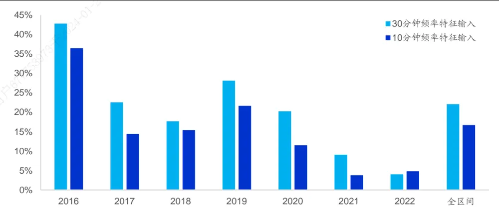
资料来源：Wind，海通证券研究所

具体到我们当前使用的模型中，高频特征集合被输入 RNN 后，可得到 T 期的隐含状态。经过迭代后，最后一期的隐含状态被输入后续模型。我们发现，这一做法在输入序列长度适中时不会产生较为严重的“遗忘”问题，最后一期的隐含状态依旧能够保留早期数据中的重要信息。但输入序列一旦过长，即使是本身就用于解决序列“记忆性”问题的 GRU和 LSTM 模型，也会“遗忘”大量早期数据中的信息。

面对“遗忘”问题，一个较为直接的解决办法是，对于 RNN 每一期输出的隐含状态进行第二次信息提取，再输入后续模型，而非简单地使用最后一期的隐含状态。至于如何实现信息再提取，最简单的思路就是对每期的隐含状态赋权，而权重则可以通过引入注意力机制来确定。

图5 注意力机制示意
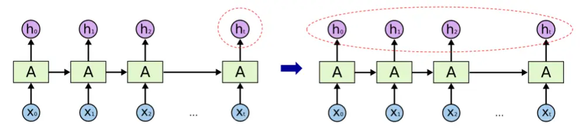
资料来源：海通证券研究所整理

注意力机制的研究发轫于上世纪 90 年代。2014 年 Volodymyr 发表的《RecurrentModels of Visual Attention》，介绍了它在视觉领域的应用。2017 年，随着 Ashish Vaswani等人撰写的《Attention is All You Need》的发表，注意力机制开始被推广至 NLP、CV等领域。近年来，注意力机制因具备较强的处理信息“遗忘”问题的能力，而被广泛应用于时间序列数据的研究中。

简单来说，注意力机制的本质是将人类关注重要信息而忽略无效信息的行为方式应用在机器上，让机器学会感知数据中重要和不重要的信息。在本文的应用情境下，就是训练模型学会如何在历史各期隐含状态之间合理分配权重，将更高的权重赋予重要时刻。

注意力机制有多种形式，本文选择的是自注意力机制（Self-Attention）。即，使用查询（Query）-键（Key）-值（Value）的模式计算注意力分数。由于篇幅的限制，本文不详细介绍自注意力机制，感兴趣的投资者可自行查阅相关内容或咨询作者。基于注意力分数，我们可对 RNN输出的各期隐含状态赋权，并将它们一同输入后续模型中。引入注意力机制后的深度学习高频因子的训练流程如下图所示。

图6 引入注意力机制的深度学习模型
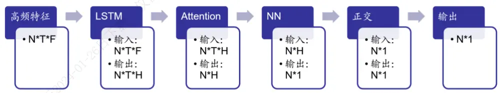
资料来源：海通证券研究所整理

## 3. 引入注意力机制后的因子表现

## 3.1 特征频率为 10 分钟时的因子表现

下表展示了滚动 6 个月训练且特征频率为 10 分钟时，引入注意力机制前后，因子费前的周度选股能力。

表 2 引入注意力机制后，深度学习高频因子的周度选股能力（特征频率 10分钟，原始超额收益，2016.01-2022.05）

|  | 周均IC | 年化 ICIR | IC 周度胜率 | 周均多头超额 | 周均空头超额 | 周均多空收益 | 因子值 自相关性 | Top 10%组合 周均换手率 |
| --- | --- | --- | --- | --- | --- | --- | --- | --- |
| 原始模型 | 0.070 | 9.156 | 92% | 0.33% | -0.92% | 1.24% | 0.31 | 73% |
| 引入注意力机制后 | 0.066 | 7.290 | 88% | 0.38% | -0.77% | 1.15% | 0.65 | 50% |

资料来源：Wind，海通证券研究所

引入注意力机制后，因子周均 IC、ICIR 和 IC周度胜率虽出现了小幅下降，但周均多头超额收益反而有所增加。同时，因子的自相关性从原来的 0.31 大幅提升至 0.65，Top 10%组合的周均换手率则从原来的 73%下降至 50%。

在实际应用中，更高的换手率意味着更高的成本。因此，引入注意力机制对因子多头超额收益的提升幅度或将比上表中展示的更加显著。

组合换手率的下降主要是因为，原模型仅使用 RNN模型最后一期的隐含状态作为后续模型的输入，而引入注意力机制后，历史各期的隐含状态会按照一定的权重共同向后传导，相当于对历史信息进行了平滑。因此，最终得到的因子自相关性更高，由此构建的多头组合的换手率更低。

下图进一步对比了引入注意力机制前后，因子的分年度多头超额收益。在全区间以及大部分年份中，引入注意力机制都可提升因子的多头选股能力。尤其是 2020-2022 年，提升幅度较为明显。但需要注意的是，引入注意力机制也会使得 2019 年的多头超额收益蒙受较大幅度的损失。

图7 引入注意力机制后，深度学习高频因子分年度多头超额收益（特征频率 10分钟，原始超额收益）
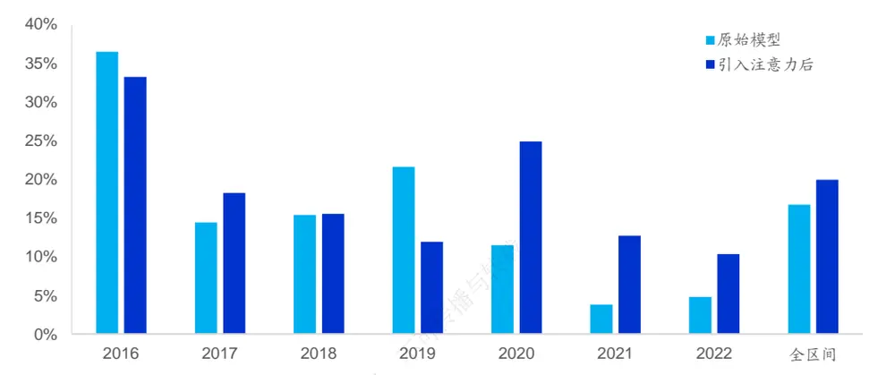
资料来源：Wind，海通证券研究所

我们进一步观察引入注意力机制前后，因子 2021 年 9 月至今的多头超额收益以及相对全市场平均的强弱走势。引入注意力机制后，因子的回撤大幅减小，相对净值创新高的速度更快，改进十分明显。

图 引入注意力机制后，深度学习高频因子周度多头超额收益（特征频率 10分钟，原始超额收益）
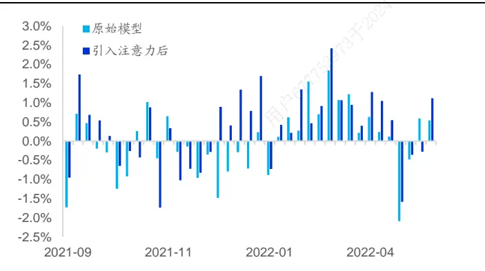
资料来源： ，海通证券研究所

图9 引入注意力机制后，深度学习高频因子多头组合/全市场平均（特征频率 10分钟，原始超额收益）
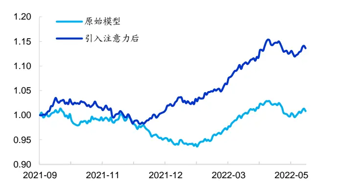
资料来源： ，海通证券研究所

在报告《改进深度学习高频因子的 个尝试》中，我们发现，用风险调整后收益代替原始收益作为预测目标，可提升深度学习高频因子的表现。引入注意力机制后，同样可从以下图表中观察到选股效果的提升，且改进的幅度和方式与使用原始超额收益一致。

表 3 引入注意力机制后，深度学习高频因子的周度选股能力（特征频率 10分钟，风险调整后超额收益，2016.01-2022.05）

|  | 周均IC | 年化 ICIR | 周度胜率 | 周均多头超额 | 周均空头超额 | 周均多空收益 | 因子值 自相关性 | Top 10%组合 周均换手 |
| --- | --- | --- | --- | --- | --- | --- | --- | --- |
| 原始模型 | 0.069 | 9.077 | 91% | 0.42% | -0.83% | 1.24% | 0.33 | 73% |
| 引入注意力机制后 | 0.065 | 7.304 | 86% | 0.45% | -0.68% | 1.12% | 0.65 | 50% |

资料来源：Wind，海通证券研究所

图10 引入注意力机制后，深度学习高频因子分年度多头超额收益（特征频率 10分钟，风险调整后超额收益）
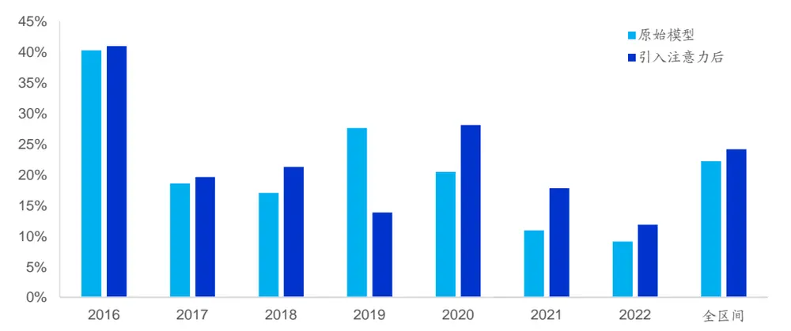
资料来源：Wind，海通证券研究所

图11 引入注意力机制后，深度学习高频因子周度多头超额收益（特征频率 10分钟，风险调整后超额收益）
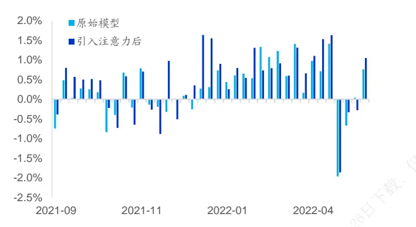
资料来源：Wind，海通证券研究所

图12 引入注意力机制后，深度学习高频因子多头组合/全市场平均（特征频率 10分钟，风险调整后超额收益）
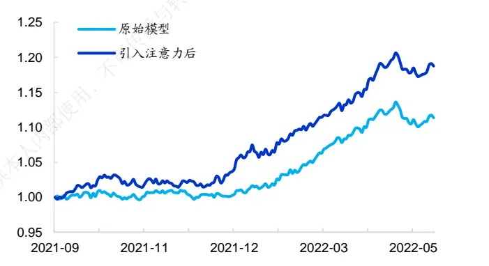
资料来源：Wind，海通证券研究所

综上所述，我们认为，在利用 GRU或 LSTM 生成深度学习高频因子的过程中，若输入特征的频率较高、序列较长，可引入注意力机制优化因子的多头超额收益。根据我们的测试结果，2016-2022.05，引入注意力机制的因子有着更高的多头年化超额收益。

更为值得一提的是，因子 2020 年至今的表现显著提升，2021.09-2022.01 期间的回撤大幅减小，净值创新高的速度也更快，在一定程度上改善了潜在的因子拥挤问题。此外，注意力机制的引入还大幅提高了因子的自相关性，使得多头组合的换手率明显下降，对实际应用更有价值。

## 3.2 特征频率为 30 分钟时的因子表现

引入注意力机制有效改善了特征频率为 10分钟时，GRU 和 LSTM 模型的信息“遗忘”问题。那么，当频率下降至 30分钟后，是否也会产生类似的效果呢？

表 4 引入注意力机制后，深度学习高频因子的周度选股能力（特征频率 30分钟，2016.01-2022.05）

| 预测目标 | 模型 | 周均IC | 年化ICIR | 周度胜率 | 周均 多头超额 | 周均 空头超额 | 周均 多空收益 | 因子值 自相关性 | Top 10%组 合周均换手 |
| --- | --- | --- | --- | --- | --- | --- | --- | --- | --- |
| 原始超额收 益 | 原始模型 | 0.079 | 9.473 | 92% | 0.42% | -1.02% | 1.44% | 0.35 | 71% |
|  | 引入注意力机制 | 0.067 | 7.091 | 86% | 0.39% | -0.79% | 1.18% | 0.65 | 50% |
| 风险调整后 超额收益 | 原始模型 | 0.076 | 9.134 | 90% | 0.49% | -0.88% | 1.37% | 0.36 | 71% |
|  | 引入注意力机制 | 0.065 | 7.072 | 86% | 0.46% | -0.65% | 1.12% | 0.65 | 50% |

资料来源：Wind，海通证券研究所

如上表所示，除了 Top 10%组合换手率下降以外，因子的表现全面不及原始模型。不过，由以下两图可见，引入注意力机制在一定程度上提升了 2020 年至今的因子多头超额收益。

图13 引入注意力机制后，深度学习高频因子分年度多头超额收益（特征频率 30分钟，原始超额收益）
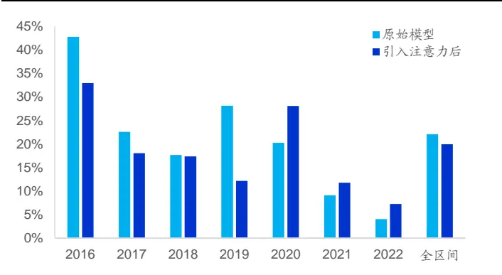
资料来源：Wind，海通证券研究所

图14 引入注意力机制后，深度学习高频因子分年度多头超额收益（特征频率 30分钟，风险调整后超额收益）
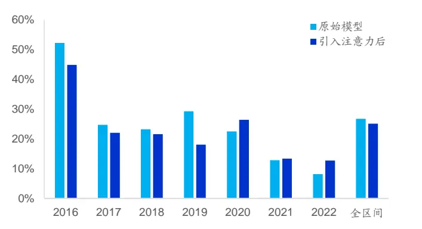
资料来源：Wind，海通证券研究所

类似地，特征频率为 30 分钟时，引入注意力机制同样能显著改善因子在 2021 年四季度的回撤幅度。

图15 引入注意力机制后，深度学习高频因子多头组合/全市场平均（特征频率 30分钟，原始超额收益）
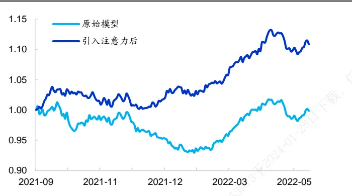
资料来源：Wind，海通证券研究所

图16 引入注意力机制后，深度学习高频因子多头组合/全市场平均（特征频率 30分钟，风险调整后超额收益）
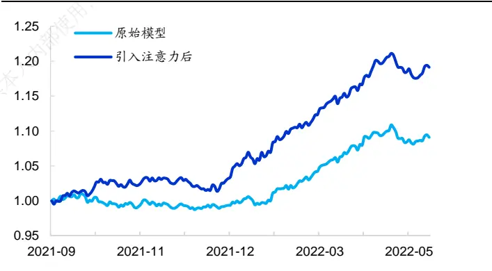
资料来源：Wind，海通证券研究所

综合以上分析结果，我们认为，在利用 GRU 或者 LSTM 训练深度学习高频因子的过程中，引入注意力机制至少是一个值得一试的选择。首先，多头组合的换手率下降几乎是确定的，这对那些有一定换手率约束的机构投资者，如公募基金，有着十分积极的意义。其次，当输入序列较长时，训练得到的因子的多头超额收益获得了较为显著的提升。第三，不论特征频率为 10 分钟还是 30 分钟，2020 年至今的因子表现都明显改善，包括每一年度更高的超额收益、2021 年四季度更小的回撤以及更快的净值创新高速度。

## 4. 残差连接与注意力机制的结合

然而，不论是何种特征频率或预测目标，引入注意力机制后，因子 2019 年的表现都出现了大幅下降，难免让人担忧因子的稳健性。因此，我们借鉴 Transformer模型的理念，在引入注意力机制的基础上结合残差连接（后文简称为残差注意力），进一步优化深度学习高频因子。

下表展示了输入特征频率为 10 分钟时，原始模型、引入注意力机制和残差注意力机制后，因子选股效果的对比。

在两种预测目标下，引入残差注意力机制后，因子的周均 IC 回升到了和原始模型几乎一致的水平。与此同时，多头超额收益则相对引入注意力机制的因子进一步提升。因子自相关性和 Top 10%组合的换手率方面，引入残差注意力机制的模型恰好是另外两个模型的折中。

表 5 引入残差注意力机制后，深度学习高频因子的周度选股能力（特征频率 10分钟，2016.01-2022.05）

| 预测目标 | 模型 | 周均IC | 年化 ICIR | 周度胜率 | 周均 多头超额 | 周均 空头超额 | 周均 多空收益 | 因子值 自相关性 | Top 10%组 合周均换手 |
| --- | --- | --- | --- | --- | --- | --- | --- | --- | --- |
| 原始超额收 益 | 原始模型 | 0.070 | 9.16 | 92% | 0.33% | -0.92% | 1.24% | 0.31 | 73% |
|  | 引入注意力机制 | 0.066 | 7.29 | 88% | 0.38% | -0.77% | 1.15% | 0.65 | 50% |
|  | 引入残差注意力 | 0.071 | 8.35 | 89% | 0.40% | -0.85% | 1.25% | 0.48 | 63% |
| 风险调整后 超额收益 | 原始模型 | 0.069 | 9.08 | 91% | 0.42% | -0.83% | 1.24% | 0.33 | 73% |
|  | 引入注意力机制 | 0.065 | 7.30 | 86% | 0.45% | -0.68% | 1.12% | 0.65 | 50% |
|  | 引入残差注意力 | 0.068 | 8.20 | 89% | 0.48% | -0.73% | 1.21% | 0.50 | 62% |

资料来源：Wind，海通证券研究所

将特征频率降至 30 分钟后，三个模型对应的因子业绩表现和特征频率为 10分钟时无异。具体表现为，引入残差注意力机制后的因子有更高的多头超额收益，相对适中的因子自相关性和周度换手率。

表 6 引入残差注意力机制后，深度学习高频因子的周度选股能力（特征频率 30分钟，2016.01-2022.05）

| 预测目标 | 模型 | 周均IC | 年化ICIR | 周度胜率 | 周均 多头超额 | 周均 空头超额 | 周均 多空收益 | 因子值 自相关性 | Top 10%组 合周均换手 |
| --- | --- | --- | --- | --- | --- | --- | --- | --- | --- |
| 原始超额收 益 | 原始模型 | 0.079 | 9.47 | 92% | 0.42% | -1.02% | 1.44% | 0.35 | 71% |
|  | 引入注意力机制 | 0.067 | 7.09 | 86% | 0.39% | -0.79% | 1.18% | 0.65 | 50% |
|  | 引入残差注意力 | 0.076 | 8.34 | 89% | 0.44% | -0.92% | 1.36% | 0.51 | 61% |
| 风险调整后 超额收益 | 原始模型 | 0.076 | 9.13 | 90% | 0.49% | -0.88% | 1.37% | 0.36 | 71% |
|  | 引入注意力机制 | 0.065 | 7.07 | 86% | 0.46% | -0.65% | 1.12% | 0.65 | 50% |
|  | 引入残差注意力 | 0.073 | 8.18 | 88% | 0.51% | -0.77% | 1.28% | 0.53 | 60% |

资料来源：Wind，海通证券研究所

下图展示了不同模型的分年度多头超额收益。引入残差注意力机制并没有明显削弱注意力机制模型 年至今的选股表现，同时， 年的多头超额收益也大致与原始模型持平。因此，在两种特征频率之下，2016 年以来，残差注意力机制模型均获得了最高的年化超额收益。

图17 引入残差注意力机制后，深度学习高频因子分年度多头超额收益（原始超额收益）
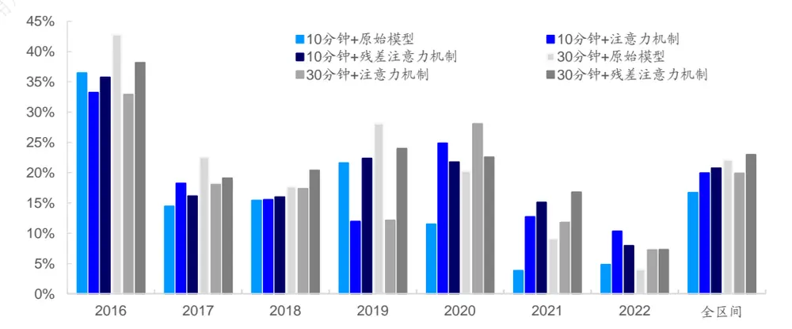
资料来源： ，海通证券研究所

将预测目标变化为风险调整后超额收益，得到了和图 17 类似的结果。相对而言，特征频率为 分钟时，引入残差注意力机制生成的因子在所有模型中的多头年化超额收益最高。

图18 引入残差注意力机制后，深度学习高频因子分年度多头超额收益（风险调整后超额收益）
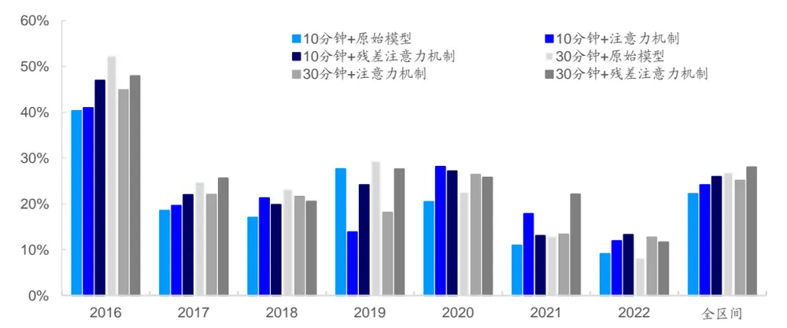
资料来源：Wind，海通证券研究所

如以下 4图所示，2021 年 9 月以来，注意力机制模型和残差注意力机制模型的表现较为接近，均显著优于相同特征频率下的原始模型。

图19 引入残差注意力机制后，深度学习高频因子多头组合/全市场平均（特征频率 10分钟，原始超额收益）
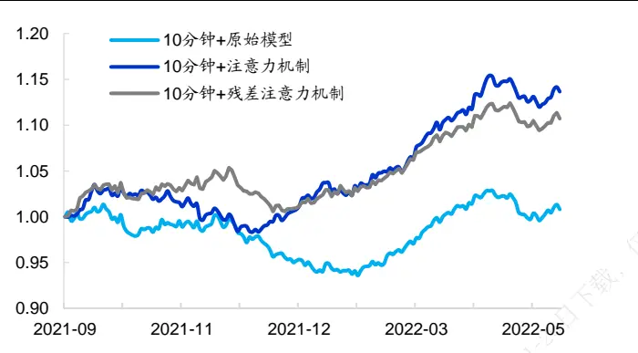
资料来源：Wind，海通证券研究所

图 引入残差注意力机制后，深度学习高频因子多头组合/全市场平均（特征频率 30分钟，原始超额收益）
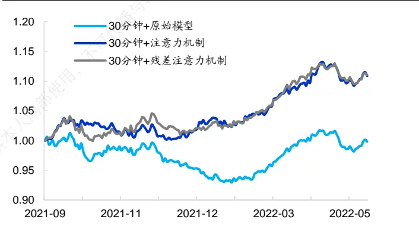
资料来源：Wind，海通证券研究所

图21 引入残差注意力机制后，深度学习高频因子多头组合/全市场平均（特征频率 10分钟，风险调整后超额收益）
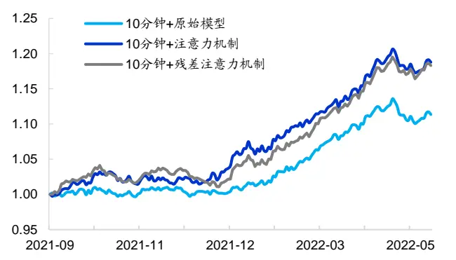
资料来源：Wind，海通证券研究所

图22 引入残差注意力机制后，深度学习高频因子多头组合/全市场平均（特征频率 30分钟，风险调整后超额收益）
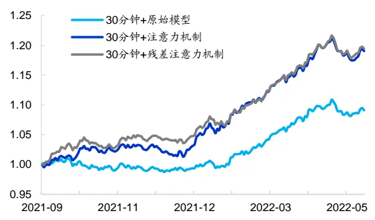
资料来源：Wind，海通证券研究所

综上所示，我们认为，用残差注意力机制替换简单注意力机制能够进一步优化深度学习高频因子的表现。具体表现为，因子不仅在 年起的每一年都取得了更高的多头超额收益，而且在 2016-2019 期间，展现出不弱于原始模型的业绩，尤其是在简单注意力机制模型表现较弱的 2019 年。此外，因子的自相关性显著高于原始模型，因而 Top10%组合的换手率更低。

## 5. 组合添加测试

分别将引入注意力机制前后，RNN 模型生成的深度学习因子加入周度调仓的中证500 指数增强模型，对比最终的业绩。其他因子包括：市值、中盘（市值三次方）、估值、换手、反转、波动、盈利、SUE、分析师推荐、尾盘成交占比、买入意愿占比和大单净买入占比。

在预测个股收益时，我们首先采用回归法得到因子溢价，再计算最近 12 个月的因子溢价均值估计下期的因子溢价，最后乘以最新一期的因子值。

风险控制模型包括以下几个方面的约束：

1） 个股偏离：相对基准的偏离幅度不超过 1%、2%；

2） 因子敞口：市值、估值中性、常规低频因子≤ ±0.5，高频因子≤ ±2.0；

3） 行业偏离：严格中性；

4） 换手率限制：单次单边换手不超过 30%。

组合的优化目标为最大化预期收益，目标函数如下所示：

$$
max\sum\mu_{i}w_{i}
$$

其中， $\mathsf{W}_{\mathrm{i}}$ 为组合中股票 i的权重，μ 为股票 i的预期超额收益。为使本文的结论贴近实践，如无特别说明，下文的测算均假定以次日均价成交，同时扣除 3‰的交易成本。

由下表可见，将注意力机制模型生成的因子替换原始高频因子，均能有效改进原始模型 2021 年至今的超额收益。当个股偏离为 2%时，全区间的年化超额收益也获得提升。

表 7 周度调仓的中证 500增强组合超额收益

| 53973于20 | 原始模型 (30 分钟) | 注意力机制 (30分钟) | 注意力机制 (10分钟) 个股偏离 1% | 残差注意力机制 (30分钟) | 残差注意力机制 (10分钟) |
| --- | --- | --- | --- | --- | --- |
| 2016 | 33.4% | 29.6% | 27.3% | 29.8% | 30.7% |
| 2017 | 17.5% | 15.9% | 15.4% | 17.0% | 19.8% |
| 2018 | 16.7% | 15.3% | 15.6% | 19.6% | 17.5% |
| 2019 | 23.5% | 17.2% | 18.1% | 17.1% | 15.9% |
| 2020 | 22.6% | 18.1% | 18.9% | 19.9% | 17.5% |
| 2021 | 11.6% | 17.1% | 14.3% | 11.5% | 18.3% |
| 2022 | 3.1% | 5.2% | 4.7% | 4.7% | 5.8% |
| 全区间 | 19.7% | 18.4% | 17.7% | 18.8% | 19.7% |
|  |  |  | 个股偏离 2% |  |  |
| 2016 | 30.7% | 31.2% | 30.9% | 33.2% | 31.7% |
| 2017 | 18.9% | 19.6% | 15.5% | 21.8% | 26.0% |
| 2018 | 16.9% | 16.8% | 17.9% | 18.0% | 16.0% |
| 2019 | 25.2% | 12.8% | 12.5% | 26.1% | 15.4% |
| 2020 | 22.7% | 18.8% | 21.1% | 17.4% | 14.9% |
| 2021 | 9.5% | 23.6% | 25.8% | 19.3% | 20.6% |
| 2022 | 5.1% | 5.1% | 6.1% | 6.1% | 8.0% |
| 全区间 | 19.9% | 19.9% | 20.2% | 22.0% | 20.8% |

资料来源： ，海通证券研究所

简单分析发现，2019 年超额收益下降的原因是，引入简单注意力机制后，深度学习高频因子的 降低，使其在以因子动量赋权的多因子模型中，权重低于原始因子，从而降低了对收益的贡献。使用残差注意力机制模型生成的因子代替后，权重大体接近于原始因子，故而增强组合的超额收益得到了进一步优化。

图23 深度学习高频因子在收益预测模型中的权重
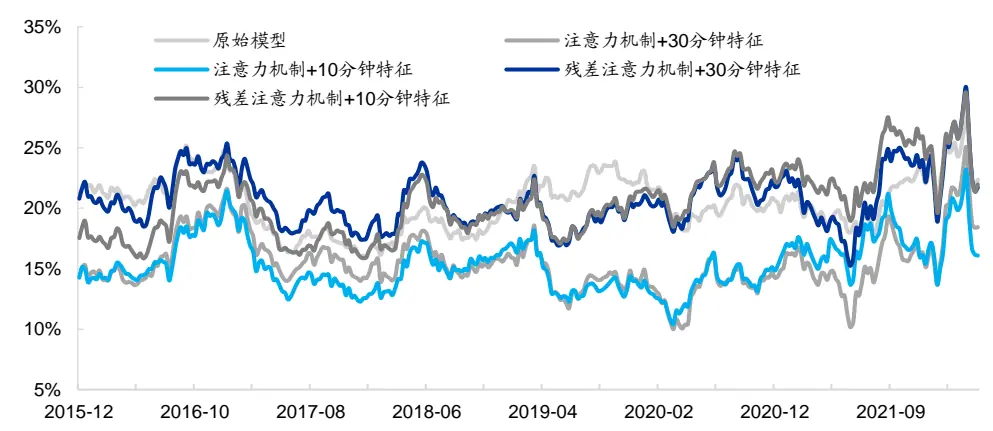
资料来源： ，海通证券研究所

和单因子的结果类似，2021 年 9 月以来，使用简单或残差注意力机制生成的深度学习高频因子的中证 500 增强组合有着更好的超额收益表现。

图24 周 度 调 仓 的 中 证 500 增 强 组 合 超 额 净 值（2021.09-2021.05，个股偏离 1%）
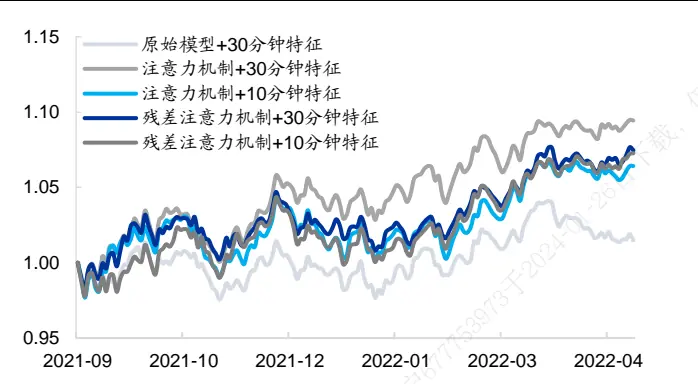
资料来源：Wind，海通证券研究所

图25 周 度 调 仓 的 中 证 500 增 强 组 合 超 额 净 值（2021.09-2021.05，个股偏离 2%）
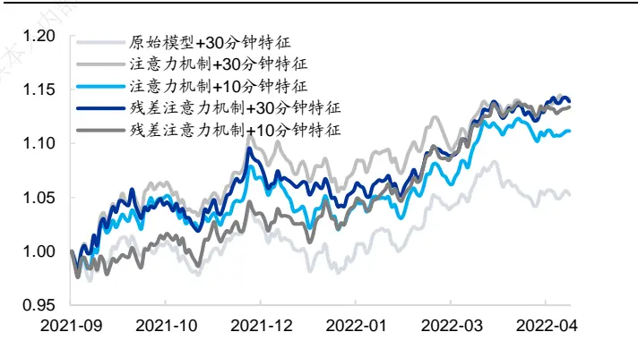
资料来源：Wind，海通证券研究所

## 6. 总结

在前期报告中，基于 分钟的高频指标序列，我们使用 的模型架构训练生成的深度学习高频因子具有突出的周度选股能力。然而，当输入特征的频率缩短至分钟，即序列长度大幅增加时， 和 生成的因子选股效果反而出现了下降。我们认为，原因可能是这两个模型在处理较长的序列时，产生了信息“遗忘”的问题。因此，本文在原来的训练过程中，引入注意力机制对 RNN 每一期输出的隐含状态进行第二次信息提取，再输入后续模型，而非简单地使用最后一期的隐含状态。

回测结果表明，当输入特征的频率较高、序列较长时，引入注意力机制可以优化因子的多头年化超额收益。更为值得一提的是，因子 年至今的表现有着较为显著的提升， 期间的回撤大幅减小，净值创新高的速度也更快，在一定程度上改善了潜在的因子拥挤问题。此外，注意力机制的引入还大幅提高了因子的自相关性，使得多头组合的换手率明显下降，对实际应用更有价值。

但是，引入注意力机制后，因子 年的表现出现了大幅下降，因此，我们进一步用残差注意力机制替换简单注意力机制，不仅保持了 2020 年以来的优异表现，而且大幅提升了 2019 年的多头超额收益，取得了较为完美的平衡。

将注意力机制模型生成的因子替换原深度学习高频因子，加入周度调仓的中证 500指数增强模型，均能有效改进原模型 2021 年至今的超额收益。当个股偏离为 2%时，全区间的年化超额收益也获得提升。

## 7. 风险提示

市场系统性风险、因子失效风险、模型误设风险。

# 信息披露

分析师声明

[Table冯佳睿yst金融工程研究团队s]

袁林青金融工程研究团队

本人具有中国证券业协会授予的证券投资咨询执业资格，以勤勉的职业态度，独立、客观地出具本报告。本报告所采用的数据和信息均来自市场公开信息，本人不保证该等信息的准确性或完整性。分析逻辑基于作者的职业理解，清晰准确地反映了作者的研究观点，结论不受任何第三方的授意或影响，特此声明。

## 法律声明

本报告仅供海通证券股份有限公司（以下简称 本公司 ）的客户使用。本公司不会因接收人收到本报告而视其为客户。在任何情况下，本报告中的信息或所表述的意见并不构成对任何人的投资建议。在任何情况下，本公司不对任何人因使用本报告中的任何内容所引致的任何损失负任何责任。

本报告所载的资料、意见及推测仅反映本公司于发布本报告当日的判断，本报告所指的证券或投资标的的价格、价值及投资收入可能会波动。在不同时期，本公司可发出与本报告所载资料、意见及推测不一致的报告。

市场有风险，投资需谨慎。本报告所载的信息、材料及结论只提供特定客户作参考，不构成投资建议，也没有考虑到个别客户特殊的播投资目标、财务状况或需要。客户应考虑本报告中的任何意见或建议是否符合其特定状况。在法律许可的情况下，海通证券及其所属可关联机构可能会持有报告中提到的公司所发行的证券并进行交易，还可能为这些公司提供投资银行服务或其他服务。

本报告仅向特定客户传送，未经海通证券研究所书面授权，本研究报告的任何部分均不得以任何方式制作任何形式的拷贝、复印件或复制品，或再次分发给任何其他人，或以任何侵犯本公司版权的其他方式使用。所有本报告中使用的商标、服务标记及标记均为本公司的商标、服务标记及标记，如欲引用或转载本文内容，务必联络海通证券研究所并获得许可，并需注明出处为海通证券研究所，目不得对本文进行有悖原意的引用和删改。仅

根据中国证监会核发的经营证券业务许可，海通证券股份有限公司的经营范围包括证券投资咨询业务。下载

## 海通证券股份有限公司研究所[Table_PeopleInfo]

路 颖所长

(021)23219403 luying@htsec.com

高道德 副所长(021)63411586 gaodd@htsec.com

邓 勇副所长

(021)23219404 dengyong@htsec.com

| 荀玉根 副所长 (021)23219658 xyg6052@htsec.com | 涂力磊 所长助理 | 余文心 所长助理 |
| --- | --- | --- |
|  | (021)23219747 tll5535@htsec.com | (0755)82780398 ywx9461@htsec.com |

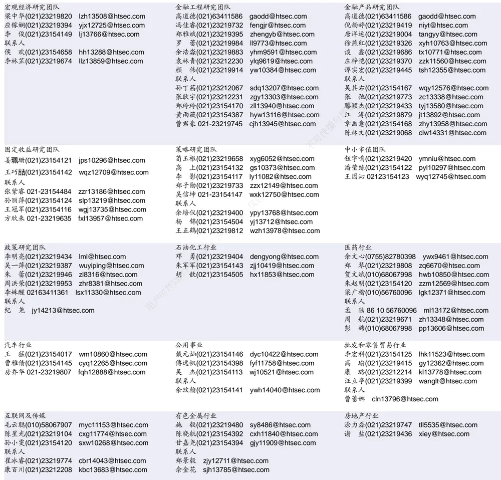

| 电子行业 |  | 煤炭行业 |  |  | 电力设备及新能源行业 |  |
| --- | --- | --- | --- | --- | --- | --- |
|  | 李 轩(021)23154652 lx12671@htsec.com |  |  | 李 淼(010)58067998 Im10779@htsec.com | 张一弛(021)23219402 | zyc9637@htsec.com |
| 肖隽翀(021)23154139 xjc12802@htsec.com |  |  | 王 涛(021)23219760 wt12363@htsec.com |  | 房 青(021)23219692 | fangq@htsec.com |
| 华晋书02123219748 hjs14155@htsec.com |  |  | 吴 杰(021)23154113 wj10521@htsec.com |  | 徐柏乔(021)23219171 xbq6583@htsec.com |  |
| 联系人 |  |  |  |  | 张 磊(021)23212001 zl10996@htsec.com 联系人 |  |
| 薛逸民(021)23219963 | 文 灿(021)23154401 wc13799@htsec.com |  |  |  | 姚望洲(021)23154184 | ywz13822@htsec.com |
|  | xym13863@htsec.com |  |  |  | 柳文韬(021)23219389 | Iwt13065@htsec.com |
|  | 李 潇(010)58067830 lx13920@htsec.com |  |  |  | 吴锐鹏 wrp14515@htsec.com |  |

| 基础化工行业 | 计算机行业 | 通信行业 |  |
| --- | --- | --- | --- |
| 刘 威(0755)82764281 Iw10053@htsec.com | 郑宏达(021)23219392 zhd10834@htsec.com | 杨彤昕 010-56760095 ytx12741@htsec.com | 余伟民(010)50949926 ywm11574@htsec.com |
| 张翠翠(021)23214397 zcc11726@htsec.com 孙维容(021)23219431 swr12178@htsec.com | 杨 林(021)23154174 yl11036@htsec.com 于成龙(021)23154174 ycl12224@htsec.com | 联系人 |  |
| 李 智(021)23219392 lz11785@htsec.com | 洪 琳(021)23154137 hl11570@htsec.com | 夏 凡(021)23154128 xf13728@htsec.com |  |
|  | 联系人 |  |  |
|  | 杨 蒙(0755)23617756 ym13254@htsec.com |  |  |

| 非银行金融行业 | 交通运输行业 | 纺织服装行业 |  |  |
| --- | --- | --- | --- | --- |
| 何 婷(021)23219634 ht10515@htsec.com | 虞 楠(021)23219382 yun@htsec.com |  |  | 梁 希(021)23219407 lx11040@htsec.com |
| 任广博(010)56760090 rgb12695@htsec.com | 罗月江（010）56760091 lyj12399@htsec.com |  | 盛 开(021)23154510 sk11787@htsec.com |  |
| 孙 婷(010)50949926 st9998@htsec.com 联系人 | 陈 宇(021)23219442 cy13115@htsec.com |  |  |  |

| 建筑建材行业 | 机械行业 |  | 钢铁行业 |
| --- | --- | --- | --- |
| 冯晨阳(021)23212081 fcy10886@htsec.com | 余炜超(021)23219816 swc11480@htsec.com |  | 刘彦奇(021)23219391 liuyq@htsec.com |
| 潘莹练(021)23154122 pyl10297@htsec.com | 赵玥炜(021)23219814 zyw13208@htsec.com |  | 周慧琳(021)23154399 zhl11756@htsec.com |
| 申 浩(021)23154114 sh12219@htsec.com 颜慧菁 yhj12866@htsec.com | 赵靖博(021)23154119 zjb13572@htsec.com |  |  |
|  | 联系人 刘绮雯(021)23154659 Iqw14384@htsec.com | 可传播与转 |  |

| 建筑工程行业 | 农林牧渔行业 | 食品饮料行业 |  |
| --- | --- | --- | --- |
| 张欣劼 zxj12156@htsec.com | 陈 阳(021)23212041 cy10867@htsec.com |  | 颜慧菁 yhj12866@htsec.com |
| 联系人 |  | 长人内 | 张宇轩(021)23154172 zyx11631@htsec.com |
| 曹有成(021)63411398 cyc13555@htsec.com |  |  | 程碧升(021)23154171 cbs10969@htsec.com |

| 军工行业 | 银行行业 | 社会服务行业 |  |
| --- | --- | --- | --- |
| 张恒晅 zhx10170@htsec.com 联系人 | 林加力(021)23154395ljl12245@htsec.com 联系人 | 汪立亭(021)23219399 wanglt@htsec.com | 许樱之(755)82900465 xyz11630@htsec.com |
| 刘砚菲021-2321-4129 lyf13079@htsec.com | 董栋梁(021)23219356 ddI13206@htsec.com | 联系人 | 毛弘毅(021)23219583 mhy13205@htsec.com |
|  | 024-01- | 王祎婕(021)23219768 wyj13985@htsec.com |  |

| 家电行业 |  | 造纸轻工行业 |  |
| --- | --- | --- | --- |
| 陈子仪(021)23219244 chenzy@htsec.com |  |  | 郭庆龙 gql13820@htsec.com |
| 李 阳(021)23154382 ly11194@htsec.com |  |  | 高翩然 gpr14257@htsec.com |
|  | 朱默辰(021)23154383 zmc11316@htsec.com | 联系人 |  |
| 刘 璐(021)23214390 II11838@htsec.com |  | 用户67775 | 王文杰 wwj14034@htsec.com 吕科佳 Ikj14091@htsec.com |

## 研究所销售团队

深广地区销售团队
伏财勇(0755)23607963 fcy7498@htsec.com蔡铁清(0755)82775962 ctq5979@htsec.com辜丽娟(0755)83253022 gulj@htsec.com
刘晶晶(0755)83255933 liujj4900@htsec.com饶 伟(0755)82775282 rw10588@htsec.com欧阳梦楚(0755)23617160
oymc11039@htsec.com
巩柏含 gbh11537@htsec.com
滕雪竹 0755 23963569 txz13189@htsec.com张馨尹 0755-25597716 zxy14341@htsec.com
上海地区销售团队
胡雪梅(021)23219385 huxm@htsec.com
黄 诚(021)23219397 hc10482@htsec.com
季唯佳(021)23219384 jiwj@htsec.com
黄 毓(021)23219410 huangyu@htsec.com
李 寅 021-23219691 ly12488@htsec.com
胡宇欣(021)23154192 hyx10493@htsec.com
马晓男 mxn11376@htsec.com
邵亚杰 23214650 syj12493@htsec.com
杨祎昕(021)23212268 yyx10310@htsec.com
毛文英(021)23219373 mwy10474@htsec.com
谭德康 tdk13548@htsec.com
王祎宁(021)23219281 wyn14183@htsec.com
北京地区销售团队
朱 健(021)23219592 zhuj@htsec.com
殷怡琦(010)58067988 yyq9989@htsec.com
郭楠010-5806 7936 gn12384@htsec.com
杨羽莎(010)58067977 yys10962@htsec.com
张丽萱(010)58067931 zlx11191@htsec.com
郭金垚(010)58067851 gjy12727@htsec.com
张钧博 zjb13446@htsec.com
高 瑞 gr13547@htsec.com
上官灵芝 sglz14039@htsec.com
董晓梅 dxm10457@htsec.com

海通证券股份有限公司研究所

地址：上海市黄浦区广东路 689号海通证券大厦 9楼

电话：（021）23219000

传真：（021）23219392

网址：www.htsec.com