## [Tab相关研究

Table_ReportInfo]《选股因子系列研究（七十九）——用注

意力机制优化深度学习高频因子》

2022.05.31

《ETF中的增强基因——富国基金 ETF产品线的优雅与犀利》2022.05.23

《广发基金罗洋：以稳定盈利为盾，以周期成长为矛》2022.05.14

分析师:冯佳睿

Tel:(021)23219732

Email:fengjr@htsec.com

证书:S0850512080006

分析师:罗蕾

Tel:(021)23219984

Email:ll9773@htsec.com

证书:S0850516080002

# 选股因子系列研究（八十）——股票久期的定义、溢价及应用

## 投资要点：

本文介绍了两种股票久期模型，考察了不同久期股票的基本面特征，并探索了久期因子的溢价和应用方式。

隐含久期模型。隐含久期基于公司现金流构建，与估值、盈利、增长等公司基本面密切相关。特别地， 和 是对未来现金流有强假设时，隐含久期的特例。因此，隐含久期与 、 的相关性很高。同时，高盈利、低增长的公司短期内实现的现金流价值大，股票隐含久期短；而高增长、低盈利的公司短期内现金支付少，隐含久期长。即，隐含久期与盈利负相关，而与增速正相关。

与债券久期类似，隐含久期也是衡量股票风险特征的一个有效指标。隐含久期可以衡量股票波动率对预期股权回报冲击的敏感性。隐含久期长的股票，对预期股权回报冲击更为敏感，风险也更大。隐含久期与股票的波动率和 beta 高度正相关，并且在预测未来波动率 时，对历史波动率 具有增量解释能力。

债券相似度。与隐含久期模型不同，债券相似度不需要预测未来的随机现金流，而是生成一个衡量股票“债券相似度”的指标。债券相似度是从统计学角度衡量股票与债券的相似性，它与基本面、波动性之间的关系不像隐含久期那样具有经济学含义，且相关性普遍较小。

- 股票的收益率曲线。参考债券久期，我们也利用股票久期指标估计了股票的收益率曲线。从结果来看，无论是隐含久期，还是债券相似度，均与股票收益负相关。即，长久期股票的收益率低于短久期股票。关于久期与股票收益之间的负相关关系，一个可能的解释是投资者的非理性。市场参与者通常对久期长、估值高的“魅力股”的增长前景过于乐观，并将这些证券的价格推升至不合理的高水平。随后，这些股票未能达到预期，导致未来收益率较低。

- 隐含久期因子的溢价。2013 年初至 2022 年 4 月，隐含久期因子的年化多空收益为 9.8%，统计显著。但该因子多头效应弱、空头效应强，多头收益并不显著。隐含久期因子与估值因子具有很高的相关性，月多空收益的相关系数高达 0.86。但相较而言，隐含久期因子的稳定性更高；且隐含久期因子多空收益对 PB 因子多空收益回归的 alpha 显著为正，表明隐含久期因子未被 PB 因子合理定价；而PB因子对隐含久期因子回归的 alpha 为负，表明 PB 因子的选股收益可以被隐含久期因子解释。将隐含久期因子加入指数增强策略，可降低组合的波动率和相对回撤，提升组合的收益风险比。

- 债券相似度因子的溢价。2013 年初至 2022 年 4 月，剥离其他 alpha 因子影响后，债券相似度因子的年化多空收益为 4.5%，月胜率 60.7%，且多空收益相对较为平均。将债券相似度因子加入指数增强策略，可提升组合超额收益，同时降低波动性和相对回撤。

- 利率变动与股票久期。利率上行，会导致股票价格下降。相对而言，短久期股票下降幅度更小，此时短久期股票更具吸引力，久期因子表现较优；而利率下行，股票价格上升，短久期股票上升幅度相对较小，吸引力下降，久期因子表现较差。从实证结果来看，利率变化与久期因子表现呈正相关性。其中，隐含久期与利率变化的相关系数为 0.16，债券相似度与利率变化的相关系数为 0.06。

- 风险提示：模型误设风险，历史统计规律失效风险。

将资产价格与现金流联系起来是资 $\cdot 产$ 定价理论的核心。对于固定收益证券而言，基于未来现金流的贴现预期来分析证券的风险，已有一套成熟缜密的分析框架。久期概念得到学者和从业者的广泛认可和应用，债券久期已成为一个重要且公认的风险指标。而关于 A股的久期，鲜有理论和实证分析。本文介绍了两种股票久期模型，考察了不同久期股票的基本面特征，并探索了久期因子的溢价和应用方式。

## 1. 股票久期的定义与估算

## 1.1 现金流折现法

债券久期的经典度量指标是麦考利久期，其计算公式如下所示：

$$
D=\frac{\sum_{t=1}^{T}t\times\left(CF_{t}/(1+r)^{t}\right)}{P}\tag{1}
$$

其中， $\mathbf{C}\mathsf{F}_{\mathsf{t}}$ 为 t时刻的现金流，r 为到期收益率，P为债券价格。久期是债券收到各期现金流时间的加权平均值，其权重是每期现金流对债券价值的相对贡献。简单来讲，久期代表债券承诺现金流的平均到期日。

久期在债券分析中的主要作用是，衡量债券价格 P对到期收益率 r变化的敏感性。将债券价格对到期收益率求导，有：

$$
\frac{\partial P}{\partial r}=-P\times\frac{D}{1+r}\tag{2}
$$

经过近似变化后，由下式可知，债券价格变化和到期收益率变化之间呈线性负相关，而久期则决定了后者对前者的影响程度。

$$
\cfrac{\Delta P}{P}\approx-\cfrac{D}{1+r}\Delta r\tag{3}
$$

将久期的概念拓展到股票，主要面临两大问题：

1) 债券现金流支付通常是有限期的，而股票支付可能是无限的。

2)债券支付的金额和时间通常是提前规定的，不存在太大的不确定性；而股票支付则没有提前规定，且可能存在很大的不确定性。

为了解决第一个问题，参考 Dechow, Sloan, Soliman 2004 年发表的文章《ImpliedEquity Duration: A New Measure of Equity Risk》1，我们将公式（1）中的久期分解为时间长度为 T 的有限期，以及无限期两部分：

$$
\begin{aligned}D=&\frac{\sum_{t=1}^{T}t\times CF_{t}/(1+r)^{t}}{\sum_{t=1}^{T}CF_{t}/(1+r)^{t}}\times\frac{\sum_{t=1}^{T}CF_{t}/(1+r)^{t}}{P}\downarrow\\&+\frac{\sum_{t=T+1}^{\infty}t\times CF_{t}/(1+r)^{t}}{\sum_{t=T+1}^{\infty}CF_{t}/(1+r)^{t}}\times\frac{\sum_{t=T+1}^{\infty}CF_{t}/(1+r)^{t}}{P}\end{aligned}\tag{4}
$$

由于我们讨论的是股票，所以 P 代表股票市值，CF代表向股东支付的净现金流，r 代表预期股权回报率。公式（4）表明，股票久期可以分解为有限期现金流久期和无限期现金流久期的价值加权之和。

接下来，我们假设有限期后的现金流为永续年金形式（无限期等额支付），其折现值为股票市值与有限期内现金流折现值之差。即：

$$
\sum_{t=T+1}^{\infty}{\frac{CF_{t}}{(1+r)^{t}}}=\left(P-\sum_{t=1}^{T}{\frac{CF_{t}}{(1+r)^{t}}}\right)\tag{5}
$$

因此，由时刻 T 开始的永续年金，其久期为 $\mathsf{T}+(1+\mathsf{r})/\mathsf{r};$ ；同时将公式（5）代入公式（4）可得：

$$
D=\frac{\sum_{t=1}^{T}t\times CF_{t}/(1+r)^{t}}{P}+\left(T+\frac{1+r}{r}\right)\times\frac{\left(P-\sum_{t=1}^{T}CF_{t}/(1+r)^{t}\right)}{P}\tag{6}
$$

关于无限期现金流，通常是假设现金流以固定的增速增长。但假定无限期现金流为永续年金形式较为容易处理，且不失一般性。因为只要预测期足够长，足以耗尽公司或行业特定超正常增长的机会，最终增长率将是一个横截面常数，所以不会成为股票久期横截面差异的重要来源。由于永续年金的现值是从观察到的股票价格中推断出来的，因此我们将由此产生的久期称为“隐含”久期。换句话说，我们对股票久期的衡量，不是基于对未来现金流的必然理性预测，而是基于投资者的共识预期，这反映在股票价格中。

以上讨论是关于股票无限期现金流的问题。要完成公式（6）的第二个问题是预测有限期内的现金支付， $\mathrm{CF_t,~0<t\leq T}$ ，我们从会计恒等式开始。该恒等式反映了净现金支付与盈利、账面资 $v产$ 价值之间的关系：

$$
CF_{t}=E_{t}-\left(BV_{t}-\widehat{BV}_{t-1}\right)\tag{7}
$$

其中， $\mathsf{E}_{\mathsf{t}}$ 为 t期末的会计盈利， $\mathrm{BV_{t}}$ 为 t 期末的账面资产价值，公式（7）可进一步写为：

$$
CF_{t}=BV_{t-1}\times\left[\frac{E_{t}}{BV_{t-1}}-\frac{(BV_{t}-BV_{t-1})}{BV_{t-1}}\right]\tag{8}
$$

公式（8）显示，要预测股票的净现金流，需要预测：（1）净资产收益率 ROE，即 $E_{\mathrm{t}}/BV_{\mathrm{t-1}}$ 1；以及（2）股权增长率 g， $(\mathrm{BV_{t}-BV_{t-1}})/\mathrm{BV_{t-1}}$

参考前文提到的《Implied Equity Duration》一文，ROE 遵循一个缓慢的均值回复过程：回归的平均值接近股权成本。因此，我们将净资产收益率建模为一阶自回归过程，自相关系数为净资产收益率的长期均值回归率，长期均值为权益成本（预期股权回报率）。

与历史股权增长率相比，历史营业收入增长率更能反映未来的股权增长。营业收入增长率与净资产收益率类似，遵循均值回复过程。但回复速度往往更快，其回复的平均值接近长期宏观经济增速。因此，同样可将股权增长率建模为一阶自回归过程，自相关系数等于营业收入增长率的长期均值回归率，均值等于长期 GDP增速。

根据以上讨论，现金流折现法中的隐含久期估计需要 4个财务指标和 4个预测参数作为输入变量。4 个财务指标分别为账面价值 BV（当前和滞后一年）、营业收入 S（当前和滞后一年）、盈利 E（当前）和市值 P（当前）。4 个预测参数分别为净资产收益率的自相关系数、营业收入增长率的自相关系数、预期股权回报率和长期 GDP 增速。

使用 2005 年至 2021 年的年度数据，我们得到 A股 ROE 和营业收入的自相关系数分别为 0.67 和 0.23。Dechow, Sloan, Soliman 发现，美国 1961 年至 1999 年期间，ROE和营业收入增长率的自相关系数分别为 0.57 和 0.24。与海外结论一致，A股的营业收入增长率的均值回复速度快于 ROE。至于预期股权回报率和长期 GDP 增速，我们采用文献中的值，分别为 12%和 6%。另外，以 T=20 作为有限预测期。

综上所述，基于一阶自回归模型，我们可以预测未来有限期 T 内，每一期的 ROE和股权增长率 g，将两者之差乘以上一期末的账面资产价值 BV即为每一期的现金流；再将每一期的现金流代入公式（6）即可求得股票的隐含久期。从上述的计算过程可知，对于高盈利、低增长的公司而言，有限期内的现金支付多、权重大，而无限久期权重小，股票的隐含久期短。对于高增长、低盈利的公司而言，有限期内现金支付少，无限久期权重大，股票的隐含久期长。

2013 年以来，全部 A股的平均隐含久期为 21.4 年，90%分位点为 27.3 年。无限期久期为 T+(1+r)/r=29.3 年，绝大部分 A股的久期都小于该长度。这表明，公司在有限期（20 年）内都支付了一部分价值。然而，也有一些公司的久期为负，我们认为，这有可能代表股价被低估了，也可能是盈利持续性的假设有误。

表 1 A 股隐含久期的描述性统计（2013.01-2022.04）

| 均值 | 标准差 | 最小值 | 10%分位点 | 中位数 | 90%分位点 最大值 |
| --- | --- | --- | --- | --- | --- |
| 久期 21.4 | 7.3 | -146.1 | 13.4 | 23.3 | 27.3 29.3 |

资料来源：Wind，海通证券研究所

## 1.2 债券相似度

与隐含久期模型不同，债券相似度不需要预测未来的随机现金流，而是生成一个衡量股票“债券相似度”的指标（即估计“债券 beta”）。在其他条件相同的情况下，短久期股票（预计短期内会支付很大一部分现金流价值）的现金流可能比长久期股票更稳定、更可预测。因此，相对而言是“债券式的”。

将每只股票相对无风险利率的超额收益对 10 年期国债的月度超额收益和股市月度超额收益进行滚动 5年的回归：

$$
r_{j,t}-r_{rf,t}=\alpha_{j}+\beta_{j}\big(r_{mkt}-r_{rf,t}\big)+b_{j}\big(r_{TY10}-r_{rf,t}\big)+\epsilon_{j,t},\forall t=\tau-T,\cdots,\tau.\tag{9}
$$

其中，T=5 年，τ为当前时间，b 为股票 j的债券 beta，我们将经过波动率调整后的债券 beta 称为“债券相似度”。需要注意的是，为了区分股票特定债券 beta（这是我们试图捕捉的变量）和股市、债市波动之间的一般相关性，我们在上式中加入了股市超额收益作为控制变量。

我们将有数据的 A股根据债券相似度由小到大排序，并等分为 10 组。D1为债券相似度最低的 10%股票组合，D10 为债券相似度最高的 10%股票组合。如下图左所示，不同债券相似度股票的股市 beta 无明显差异，即债券 beta 与股票 beta 相关性较低。

不过，随着债券相似度的上升，股票组合的隐含久期也逐渐拉长（下图左）；反过来，随着隐含久期的拉长，股票组合的债券相似度也逐渐上升（下图右）。即，债券相似度与隐含久期正相关。

图1 债券相似度分组的平均隐含久期（2013.01-2022.04）
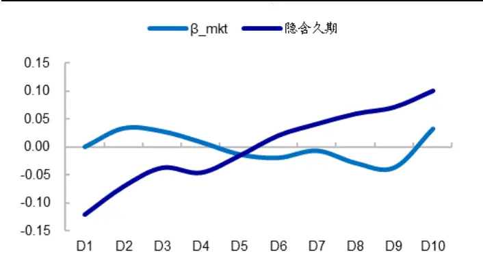
资料来源：Wind，海通证券研究所

图2 隐含久期分组的平均债券相似度（2013.01-2022.04）
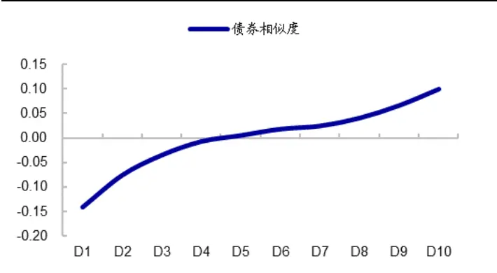
资料来源：Wind，海通证券研究所

## 2. 不同久期股票的特征

理论上，久期计算依赖于公司的预期现金流，与公司基本面密切相关。因而，在应用时，可以衡量股票预期股权回报率的变动风险。下文将从实证分析角度，考察不同久期股票的基本面特征，以及股票久期是否与债券久期类似，可用于刻画股票的风险。

## 2.1 隐含久期

## 2.1.1 基本面特征

由隐含久期的计算过程可知，有限期内实现的现金流价值越大，隐含久期越短；而有限期内的现金支付又与 ROE、增速之差成正比。由此可猜测，隐含久期小的公司，应呈现高盈利、低增长特征；而隐含久期长的公司，则呈低盈利、高增长特征。

我们将有数据的 A股根据隐含久期由小到大排序，并等分为 10组。D1 为隐含久期最小的 10%股票组合，D10 为隐含久期最长的 10%股票组合。如下图左所示，随着隐含久期逐渐拉长，股票的盈利能力逐渐下降，而增速逐渐提高。

图3 隐含久期分组的基本面特征（2013.01-2022.04）
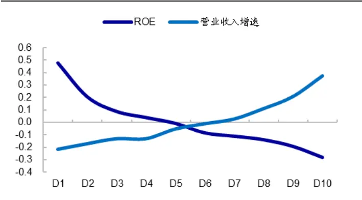
资料来源：Wind，海通证券研究所

图4 隐含久期分组的平均估值（2013.01-2022.04）
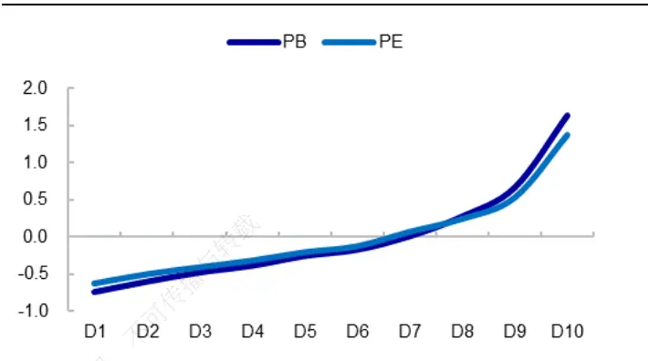
资料来源：Wind，海通证券研究所

如上图右所示，隐含久期长的公司估值高，而隐含久期短的公司估值低。实际上，隐含久期与 PB、PE这些估值指标密切相关，它们之间的这种关系可以通过隐含久期公式（6）的一些特殊形式联系起来。这些特殊形式涉及如下假设：有限预测期内的现金支付为年金形式（等额支付）。

支付时间长度为 T 的年金 A的久期为：

$$
D_{A}=\frac{1+r}{r}-\frac{T}{(1+r)^{T}-1},\tag{10}
$$

其现值为：

$$
PV_{A}=A\times\frac{1-(1/(1+r)^{T})}{r}.\tag{11}
$$

将以上两式代入公式（6）可知，有限预测期内现金支付为年金形式（A）的股票，其隐含久期为：

$$
D=T+{\frac{1+r}{r}}-{\frac{A/r}{P}}\times T.\tag{12}
$$

由上式可见，随着有限预测期内的现金支付增加，股票的隐含久期逐渐缩短。

公式（12）是理解隐含久期与 PE、PB之间关系的关键。当我们假设有限预测期内，资产增长率 g为 0，且 ROE保持不变时（即 $\mathsf{E}_{\mathsf{t}}/\mathsf{B}\mathsf{V}_{\mathsf{t}-1}{=}\mathsf{E}_{0}/\mathsf{B}\mathsf{V}_{-1},$ 对于 0<t≤T），根据公式（8）有 $\mathsf{CF}_{\mathsf{t}}{=}\mathsf{E}_{0},$ ，即有限预测期的现金支付为年金形式，其等额支付值为 $\mathsf{E}_{0},$ 。相应地，股票隐含久期为：

$$
D=T+\frac{1+r}{r}-\frac{E_{0}}{P}\times\frac{T}{r}.\tag{13}
$$

由上式可知，隐含久期和 PE正相关。因此，对于股权增长率 g较低且净资产收益率 ROE高度持续的公司，市盈率 PE很好地代表了股票的隐含久期。

为了理解隐含久期与 PB之间的关系，我们假设有限预测期内，资产增长率 g 为 0，且净资产收益率 ROE在预测期的第一年即回复为股权成本（即 $\mathsf{E_t/BN_{t-1}=r}$ ，0<t≤T）。根据公式（8）有 $\mathrm{CF}_{\mathrm{t}}=\mathrm{r}^{\star}\mathrm{BV}_{0}$ ，即有限预测期的现金支付为年金形式，其等额支付值为$\mathsf{r}^{\star}\mathsf{B}\mathsf{V}_{0}.$ 。相应地，股票隐含久期为：

$$
D=T+\frac{1+r}{r}-\frac{BV_{0}}{P}\times T.\tag{14}
$$

在这种特殊形式下，隐含久期和 PB正相关。对于股权增长率 g较低且 ROE迅速回复均值的公司来说，PB是一个很好的久期估算指标。

隐含久期与这些常见估值指标之间的密切联系表明，这些估值指标可以作为股票久期的粗略估算。但事实上，与估值指标一样，隐含久期也仅仅只是股票久期的一种估算。

## 2.1.2 波动率特征

根据久期的定义有，

$$
h=\frac{\Delta P}{P}\approx-\frac{D}{1+r}\Delta r
$$

对上式中的关系进行实证检验很困难，因为预期股权回报率 r的变化无法直接观察到。尽管如此，我们可以使用上式来考察预期股权回报冲击对不同久期个股收益波动性的影响。若将波动性定义为标准差，则根据上式有：

$$
\sigma(h)\approx\frac{D}{1+r}\sigma(\Delta r)
$$

需要注意的是，上式仅说明了预期股权回报冲击对波动率的作用，它忽略了其他潜在的波动来源，比如现金流冲击等。上式表明，对于长久期股票而言，预期股权回报冲击对股票收益波动率的影响更大。即，随着股票久期拉长，股票波动率逐渐增大。

图5 隐含久期分组的历史波动率特征（2013.01-2022.04）
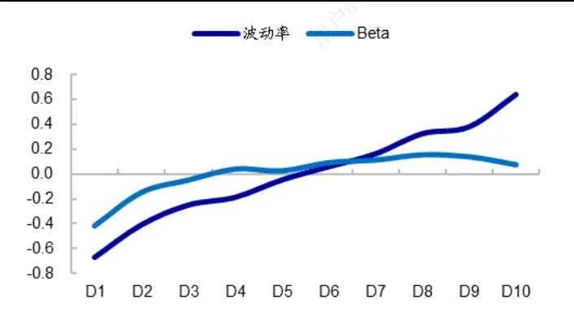
资料来源：Wind，海通证券研究所

图6 隐含久期分组的未来波动率特征（2013.01-2022.04）
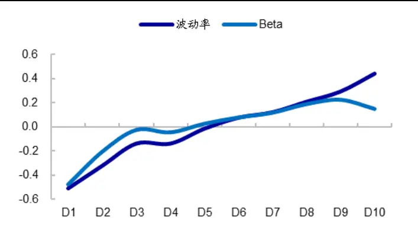
资料来源：Wind，海通证券研究所

如上图左所示，隐含久期与股票历史波动率（相关系数 ）和 （相关系数0.17）强正相关。随着隐含久期拉长，股票的历史波动率（过去 2 年周收益波动率）和beta（过去 2年周收益率相对 wind 全 A指数的 beta）均逐渐上升，久期长的股票历史波动率和市场 beta 均较高。另一方面，长久期股票未来 2 年的波动率和 beta 也高于短久期股票（上图右）。由此可见，预期股权回报冲击对长久期股票收益波动率的影响更大。

表 2 考察了隐含久期对股票未来收益波动率的预测能力。其中，方程 1-3 的回归因变量为股票未来 2 年的周收益波动率，方程 4-6的因变量为未来 2 年周收益率相对 wind全 A 指数的 beta。

方程 的结果表明，隐含久期与股票未来波动率显著正相关。方程 和方程 的对比结果表明，当我们在包含股票历史波动率的回归方程中加入隐含久期时，隐含久期仍然具有显著为正的回归系数，且模型调整 R方有所提升。可见，隐含久期在预测股票未来波动率时，具有增量贡献。

同样地，方程 4-6 的结果显示，隐含久期与股票未来 beta 显著正相关；且加入隐含久期后，模型调整 R方有所增加。由此可见，隐含久期在预测股票 beta 时，也具有增量贡献。

表 2 隐含久期对股票未来波动率的预测能力（2013.01-2022.04）

| 波动率 | 方程1 |  | 隐含久期 | 历史波动率/beta | 调整R方 |
| --- | --- | --- | --- | --- | --- |
|  |  | 系数 | 0.25 |  | 0.06 |
|  |  | t值 | 38.79 |  |  |
|  |  | p值 | 0.00 |  |  |
|  |  | 系数 |  | 0.35 | 0.12 |
|  | 方程2 | t值 | 转载 | 56.07 |  |
|  |  | p值 系数 |  | 0.000 |  |
| t值 |  | 0.14 20.72 | 0.30 44.67 | 0.14 |  |
| Beta |  |  |  |  |  |
|  |  | p值 | 0.00 | 0.00 |  |
|  |  | 系数 t值 | 0.18 |  | 0.03 |
|  | 方程4 仅供本 |  | 27.28 0.00 |  |  |
|  |  | p值 系数 |  | 0.28 | 0.08 |
|  |  | t值 |  | 43.02 |  |
|  | 方程5 753973于2024-01-26日下载， |  |  | 0.000 |  |
|  |  | p值 系数 |  | 0.25 |  |
|  |  | 0.14 | 39.32 | 0.09 |  |
| 方程6 |  | t值 21.30 p值 0.00 | 0.00 |  |  |

资料来源：Wind，海通证券研究所

## 2.1.3 小结

综上所述，隐含久期与 PB、PE相关性高。更进一步，PB、PE是对未来现金流有特定假设时，隐含久期指标的特例。从基本面角度来看，隐含久期小的公司，呈高盈利、低增长特征；而隐含久期长的公司，呈低盈利、高增长特征。

隐含久期可以衡量股票波动率对预期股权回报冲击的敏感性。隐含久期长的股票，对预期股权回报冲击更为敏感。长久期股票的历史波动性和未来波动性（收益率波动率和市场 beta），都高于短久期股票。且隐含久期在预测股票未来波动率及 beta 时，具有增量贡献。

## 2.2 债券相似度

债券相似度是从统计学角度来衡量股票与债券的相似性，因此，它与基本面、波动性之间的关系不像隐含久期那样具有经济学含义。如图 7-10 所示，债券相似度与公司估值和股票收益波动性的相关性较小，与营收增速之间的关系也不像隐含久期那样明显。

有较高盈利的公司才有可能在短期内支付较多现金，缩短久期。如图 7 所示，债券相似度低的公司的 ROE确实高于债券相似度高的公司，这一点与隐含久期的特征一致。

图7 债券相似度分组的基本面特征（2013.01-2022.04）
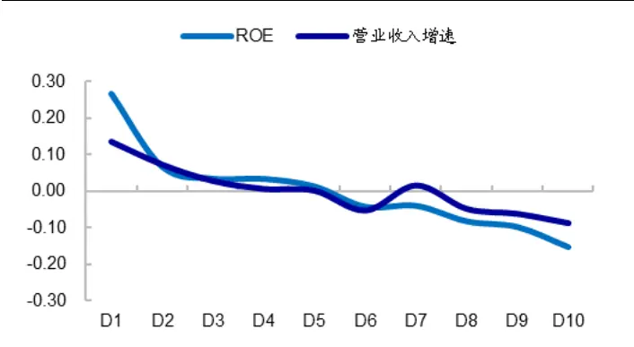
资料来源：Wind，海通证券研究所

图8 债券相似度分组的平均估值（2013.01-2022.04）
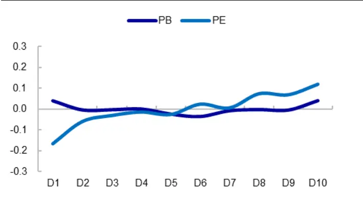
资料来源：Wind，海通证券研究所

图9 债券相似度分组的历史波动率特征（2013.01-2022.04）
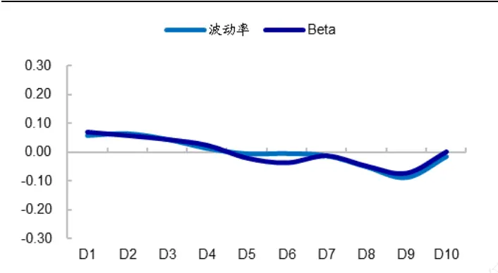
资料来源：Wind，海通证券研究所

图10 债券相似度分组的未来波动率特征（2013.01-2022.04）
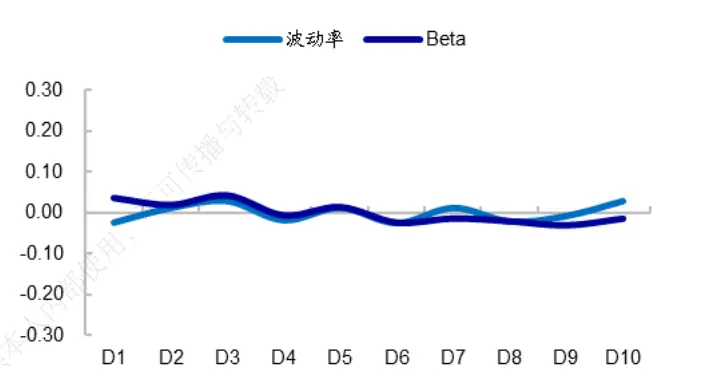
资料来源：Wind，海通证券研究所

## 2.3 小结

隐含久期与债券相似度两个指标相关性相对较低，平均 0.06。两者与盈利、市值都具有一定的负相关性，即，久期长的公司普遍 ROE较低、市值较小。

隐含久期基于公司现金流构建，与估值、盈利、增长等基本面指标具有一定的相关性。特别地，PB、PE是对未来现金流有强假设时，隐含久期指标的特例。因此，隐含久期与 PB、PE相关性很高，超过 0.4。同时，隐含久期小的公司，呈高盈利、低增长特征，即，隐含久期与盈利负相关，而与增速正相关。

此外，与债券久期类似，隐含久期是用于衡量股票风险特征的一个有效指标。隐含久期可以衡量股票波动率对预期股权回报冲击的敏感性。隐含久期长的股票，对预期股权回报冲击更为敏感。长久期股票的历史波动性和未来波动性，都高于短久期股票。而且，隐含久期对于预测股票未来波动率及 beta，具有增量贡献。

债券相似度是从统计学角度衡量股票与债券的相似性，因此，它与基本面、波动性之间的关系不像隐含久期那样具有经济学含义，且相关性普遍较小。

图11 隐 含 久 期 与 基 本 面 、 波 动 率 指 标 的 截 面 相 关 性（2013.01-2022.04）
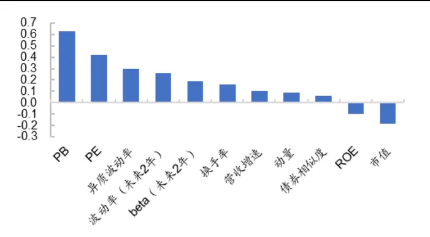
资料来源：Wind，海通证券研究所

图12 债券相似度与基本面、波动率指标的截面相关性（2013.01-2022.04）
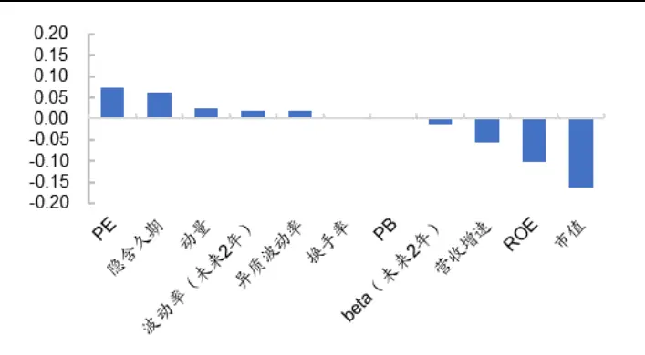
资料来源： ，海通证券研究所

## 3. 久期因子的溢价

接下来，我们考察不同久期股票的收益表现，即久期与股票收益之间的关系。

## 3.1 隐含久期

首先，参考债券久期，我们利用隐含久期构建股票的收益率曲线。即，将所有股票根据隐含久期进行分类，从会计年度结束后 4 个月开始，计算每个久期类别的平均年收益率，绘制出股票收益率曲线。如图 13 所示，股票收益率曲线单调下降，从久期小于 1年类别的 35.5%下降到大于 20 年类别的 11.9%。

另一方面，我们也将股票根据隐含久期从小到大等分为 组，考察了每组股票相对样本等权组合的年超额收益（月超额 ，下同）。如下图右所示，随着隐含久期逐渐拉长，股票收益整体呈单调下降趋势。即，隐含久期越长，股票收益越低，两者呈较为明显的负相关。

从选股收益来看，隐含久期因子呈多头效应弱，空头效应强的特征。2013 年初至2022 年 4 月，因子多头年超额 3.4%，空头年超额 6.4%，多空年收益 9.8%。其中，多头是指隐含久期最小的 10%股票组合，空头是指隐含久期最长的 10%股票组合。

图13 股票收益率曲线（2013.01-2022.04）
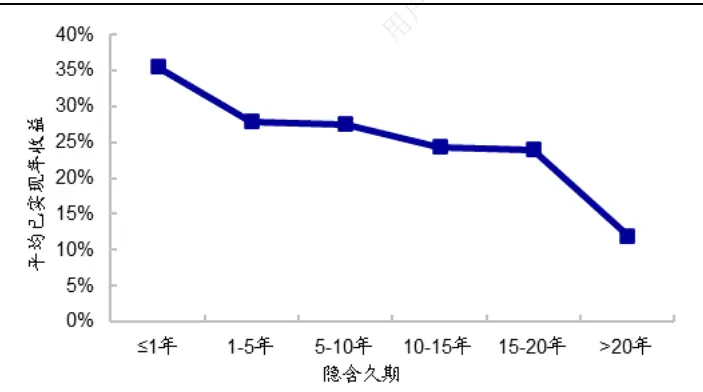
资料来源：Wind，海通证券研究所

图14 隐含久期分组的年超额收益（2013.01-2022.04）
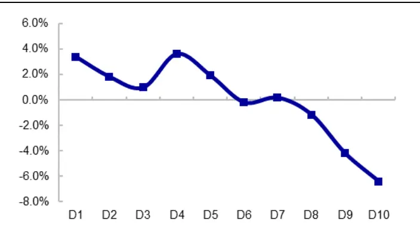
资料来源：Wind，海通证券研究所

关于久期与股票收益之间的负相关关系，一个可能的解释是投资者的非理性。市场参与者通常对“魅力股”的增长前景过于乐观，并将这些证券的价格推升至不合理的高水平。随后，这些股票未能达到预期，导致未来股票回报率较低。这类魅力股的估值高、增长快、隐含久期长，投资者的热情推动其市场价格相对于短期基本面走高，出现过度反应。如图 所示，分析师对长久期股票的预测增长率明显高于短久期股票，而实际上这些股票未来 年的增长率与短久期股票并无显著区别。

图15 隐含久期分组的净利润增速（2013.01-2022.04）
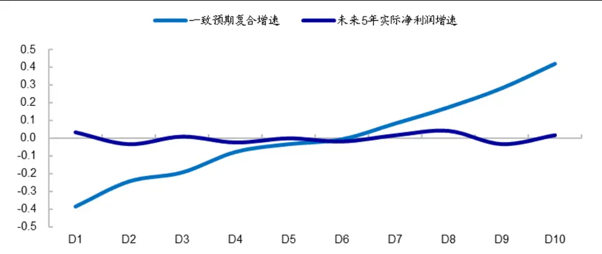
资料来源：Wind，海通证券研究所

如前文所述， 是对未来现金流有特定假设时，隐含久期指标的一个特例。因此，隐含久期与 PB因子天然具有较强的相关性。实际上，从选股收益来看，两者均呈多头效应弱空头效应强的特征，且月多空收益时间序列相关性高达 0.86。

相较而言，隐含久期因子的稳定性更高，多空收益的波动率远远小于 PB因子。此外，估值因子发生回撤时，隐含久期因子的回撤也相对较小。例如，2019-2020 年，价值型股票出现相对回撤，PB因子多空收益累计回撤 31.5%，而隐含久期因子的回撤较小，为 23.3%。

表 3 隐含久期因子的多空收益（2013.01-2022.04）

|  | 隐含久期 |  |  |  |  | PB |  |  |  |  |
| --- | --- | --- | --- | --- | --- | --- | --- | --- | --- | --- |
|  | 年收益 | 月胜率 | 年波动率 | t值 | p值 | 年收益 | 月胜率 | 年波动率 | t值 | p值 |
| D1 | 3.4% | 55.4% | 8.5% | 1.22 | 0.225 | -0.3% | 46.4% | 12.3% | -0.08 | 0.933 |
| D10 | -6.4% | 40.2% | 7.9% | -2.48 | 0.015 | -6.1% | 43.8% | 10.9% | -1.72 | 0.089 |
| 多空 | 9.8% | 55.4% | 14.6% | 2.05 | 0.043 | 5.8% | 49.1% | 21.4% | 0.83 | 0.410 |

资料来源：Wind，海通证券研究所

图16 隐含久期因子累计多空收益（2013.01-2022.04）
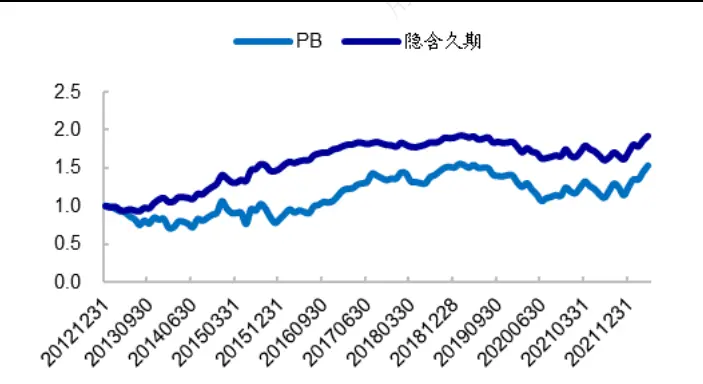
资料来源：Wind，海通证券研究所

图17 隐含久期因子各年度累计多空收益（2013.01-2022.04）
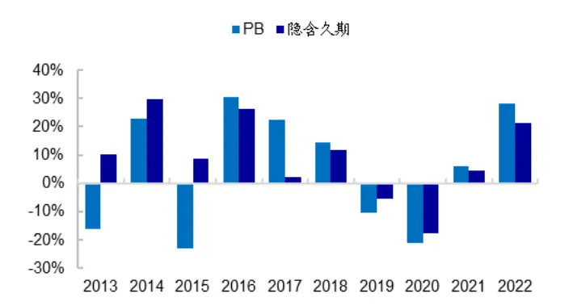
资料来源：Wind，海通证券研究所

将隐含久期与 PB因子月多空收益互为被解释变量和解释变量进行回归，结果如下表所示。隐含久期因子对 PB因子回归的年化 alpha 为 6.4%，显著为正，表明隐含久期因子未被 PB因子合理定价。而 PB因子对隐含久期因子回归的 alpha 为负，表明 PB因子的选股收益可以被隐含久期因子解释。

表 4 隐含久期多空收益对 PB因子多空收益的回归（2013.01-2022.04）

| Y alpha PB |  |  | Y alpha 隐含久期 |  |  |  |
| --- | --- | --- | --- | --- | --- | --- |
|  |  |  | 系数 6.4% 0.59 |  |  | 系数 -6.6% 1.26 |
| 隐含久期 | t值 | 2.62 17.96 | PB | t值 | -1.82 17.96 |  |
|  | p值 | 0.010 0.000 |  | p值 | 0.071 0.000 |  |

资料来源：Wind，海通证券研究所

除 PB以外，隐含久期因子还与波动率、盈利、增长等指标具有较强的相关性。下表统计了原始隐含久期因子，以及正交 PB、其他因子（量价因子、基本面因子）、行业后的隐含久期因子的多空收益表现。

正交 PB因子后，虽然隐含久期因子的选股收益有所下降，但稳定性更高，月胜率明显提升。进一步正交其他 alpha 因子后，隐含久期因子的选股收益下滑一半，年多空收益降至 3.9%，但仍然显著。

表 5 正交隐含久期因子的多空收益（2013.01-2022.04）

| 因子 | 因子处理方式 | 年收益 | 月胜率 | t值 | p 值 |
| --- | --- | --- | --- | --- | --- |
| 隐含久期 | 原始因子 | 9.8% | 55.4% | 2.05 | 0.043 |
|  | 正交PB | 6.8% | 63.4% | 2.41 | 0.018 |
|  | 正交PB、及其他因子、行业 | 3.9% | 53.6% | 2.32 | 0.022 |
| PB | 原始因子 | 5.8% | 49.1% | 0.83 | 0.410 |
|  | 正交隐含久期 | 2.2% | 50.0% | 0.44 | 0.659 |
|  | 正交隐含久期、及其他因子、行业 | -3.5% | 46.4% | -0.85 | 0.398 |

资料来源：Wind，海通证券研究所

正交其他因子后，隐含久期因子的选股收益下降，多头效应更弱，因此对指数增强组合的超额收益影响较小。但无论是沪深 300 指数增强还是中证 500 指数增强，加入隐含久期因子都能降低组合的风险，提升风险调整收益。

表 6 加入隐含久期因子前后，指数增强组合的收益风险特征（2013.01-2022.04）

| 沪深300 | 2024 | 收益率 | 波动率 | 信息比 | 最大回撤 | 收益回撤比 | 月胜率 |
| --- | --- | --- | --- | --- | --- | --- | --- |
|  | 原模型 | 12.9% | 5.0% | 2.44 | 5.7% | 2.26 | 69.7% |
| 指数增强 中证500 | +隐含久期 | 12.9% | 4.9% | 2.50 | 5.1% | 2.52 | 69.7% |
|  | 原模型 | 19.2% | 6.3% | 2.82 | 7.1% | 2.71 | 78.9% |
| 指数增强 | +隐含久期 | 19.2% | 6.1% | 2.89 | 5.2% | 3.72 | 78.0% |

资料来源：Wind，海通证券研究所

## 3.2 债券相似度

与隐含久期类似，债券相似度与股票未来 1个月的收益也呈负相关关系，即债券相似度越小，股票收益越高。但债券相似度因子与 PB因子的相关性较低，两者月多空收益的相关系数为-0.20。债券相似度正交 PB后，选股收益也并没有明显变化。

剥离价量、基本面、PB和行业因子影响后，债券相似度因子的年化多空收益为4.5%，月胜率 60.7%，统计显著。且多空收益相对较为平均，多头收益年化 2.7%，空头 1.8%。

加入债券相似度因子，可提升指数增强组合的业绩表现。对于沪深 300 指数增强组合，年超额收益可由 12.9%提升至 13.5%，同时，超额波动率和最大回撤均有所降低，信息比和收益回撤比都获得提升。同样地，对于中证 指数增强组合，年超额可由提升至 ，信息比由 提升至 ，收益回撤比由 提升至 。

图18 债券相似度分组的年超额收益（2013.01-2022.04）
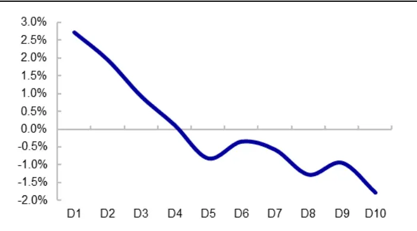
资料来源：Wind，海通证券研究所

图19 债券相似度累计多空收益（2013.01-2022.04）
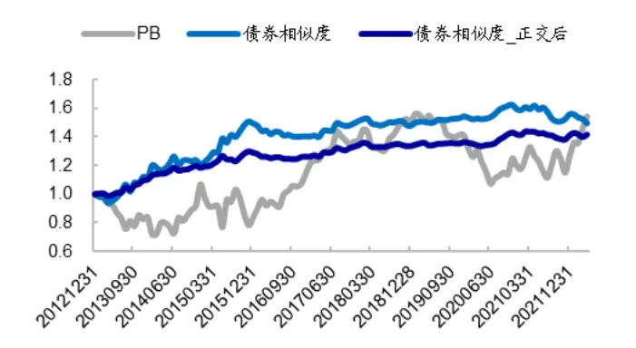
资料来源：Wind，海通证券研究所

表 7 债券相似度因子的多空收益（2013.01-2022.04）

|  | 多头收益 |  |  |  | 多空收益 |  |  |  |
| --- | --- | --- | --- | --- | --- | --- | --- | --- |
|  | 年收益 | 月胜率 | t值 | p值 | 年收益 | 月胜率 | t值 | p值 |
| 原始因子 | 3.4% | 51.8% | 2.07 | 0.041 | 5.3% | 56.3% | 1.78 | 0.078 |
| 正交PB | 3.2% | 51.8% | 2.00 | 0.048 | 5.1% | 52.7% | 1.75 | 0.083 |
| 正交PB、及其他因子、行业 | 2.7% | 58.9% | 2.65 | 0.009 | 4.5% | 60.7% | 2.90 | 0.004 |

资料来源：Wind，海通证券研究所

表 8 加入债券相似度因子前后，指数增强组合的收益风险特征（2013.01-2022.04）

|  |  | 收益率 | 波动率 | 信息比 | 最大回撤 | 收益回撤比 | 月胜率 |
| --- | --- | --- | --- | --- | --- | --- | --- |
| 沪深 300 指数增强 | 原模型 | 12.9% | 5.0% | 2.44 | 5.7% | 2.26 | 69.7% |
|  | +债券相似度 | 13.5% | 4.9% | 2.59 | 4.6% | 2.96 | 71.6% |
| 中证500 | 原模型 | 19.2% | 6.3% | 2.82 | 7.1% | 2.71 | 78.9% |
| 指数增强 | +债券相似度 | 19.8% | 6.2% | 2.94 | 5.5% | 3.57 | 78.0% |

资料来源：Wind，海通证券研究所

## 3.3 小结

参考债券久期，我们可以利用久期指标来估计股票的收益率曲线。从结果来看，无论是隐含久期，还是债券相似度，均与股票收益负相关。即，长久期股票的未来收益率低于短久期股票。关于久期与股票收益之间的负相关关系，一个可能的解释是投资者的非理性。市场参与者通常对“魅力股”的增长前景过于乐观，并将这些证券的价格推升至不合理的高水平。随后，这些股票未能达到预期，导致股票未来收益率较低。

从选股收益来看，2013年初至2022年4月，隐含久期因子的年化多空收益为3.9%，但该因子呈多头收益弱、空头收益强的特征，多头收益并不显著。将因子加入指数增强策略，对组合业绩表现的影响较小。债券相似度因子的年化多空收益为 4.5%，月胜率，且多空收益相对较为平均。加入指数增强策略后，可同时提升组合的超额收益，并降低组合的波动和回撤。

## 4. 利率变动与股票久期

根据久期的定义，当预期股权回报率 r小幅变化时，股票收益率与 r的变化之间是久期的简单线性关系：

$$
\cfrac{\Delta P}{P}\approx-\cfrac{D}{1+r}\Delta r.
$$

由上式可知，预期股权回报率 r上升，会导致股票价格下降。相对而言，短久期股票下降幅度更小，此时短久期股票更具吸引力；而预期股权回报率下降，会导致股票价格上升。相对而言，短久期股票上升幅度较小，此时短久期股票的吸引力下降。即，预期股权回报率变化与久期因子表现应呈正相关关系。

由于预期股权回报率无法直接获得，我们以利率作为代替。这是因为，两者作为资本的回报率，长期应当处于均衡状态。即，变化方向应当一致。如若不然，假设短期内受某些外部因素影响，预期股权回报率相对利率大幅上升，那么资金就会抛弃债券投向股权，进而导致预期股权回报率下降，利率上升；反之亦然。

基于此，股票久期和利率之间的关系应为，利率上升，短久期股票更具吸引力，久 期因子表现优异；而利率下降，短久期股票的吸引力下降，久期因子表现较差。

实际上，以 10年国债到期收益率代表利率，计算久期因子多空收益与利率的关系可发现，短久期股票（隐含久期最小的 10%股票）月超额收益（相对样本等权组合）与利率的相关系数为 0.19。即，利率上行，短久期股票的超额收益上升。而长久期股票（隐含久期最大的 股票）月超额收益与利率的相关系数为 。即，利率下行，长久期股票的超额收益上升。隐含久期因子月多空收益与利率呈正相关关系，相关系数为 0.16。

债券相似度与利率的关系也呈现类似特征，低债券相似度股票超额收益与利率正相关（0.04），而高债券相似度股票超额收益与利率负相关（-0.07）。债券相似度因子月多空收益与利率呈正相关关系，相关系数为 0.06。

如以下两图所示，2016.10-2017.12，2020.05- 2021.03，为利率上行阶段，2018.01-2020.04，2021.04-2022.01 为利率下行阶段。利率上行阶段，隐含久期和债券相似度因子的表现均显著优于利率下行阶段（表 9）。

图20 隐含久期累计多空收益与利率变动（2016.01-2022.04）
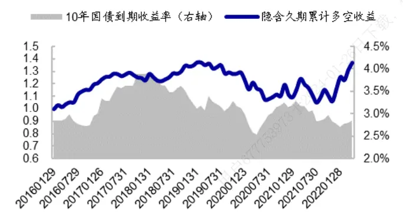
资料来源：Wind，海通证券研究所

图21 债券相似度累计多空收益与利率变动（2016.01-2022.04）
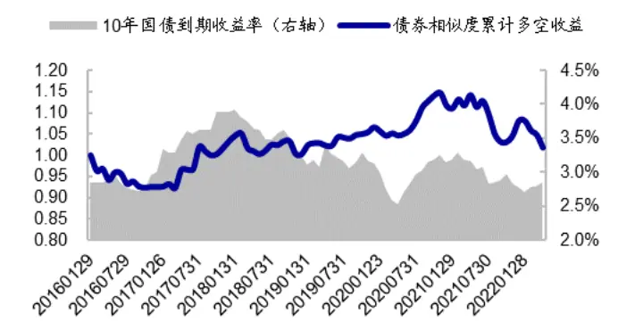
资料来源：Wind，海通证券研究所

表 9 利率周期与久期因子的选股收益（2016.01-2022.04）

|  |  |  | 隐含久期 |  |  | 债券相似度 |  |  |
| --- | --- | --- | --- | --- | --- | --- | --- | --- |
|  | 开始月份 | 结束月份 | 多头收益 | 空头收益 | 多空收益 | 多头收益 | 空头收益 | 多空收益 |
| 上行周期 | 2016.10 | 2017.12 | 6.9% | 0.8% | 6.0% | 3.1% | -5.5% | 8.6% |
| 下行周期 | 2018.01 | 2020.04 | -2.3% | 0.5% | -2.8% | 0.4% | -0.1% | 0.5% |
| 上行周期 | 2020.05 | 2021.03 | 3.5% | -5.0% | 8.5% | 6.0% | -1.7% | 7.7% |
| 下行周期 | 2021.04 | 2022.01 | -3.3% | -5.0% | 1.7% | 0.6% | 4.9% | -4.3% |

资料来源：Wind，海通证券研究所

## 5. 总结

本文介绍了两种股票久期模型，考察了不同久期股票的基本面特征，并探索了久期因子的溢价和应用方式。

隐含久期基于公司现金流构建，与估值、盈利、增长等公司基本面密切相关。特别地，PB和 PE是对未来现金流有强假设时，隐含久期的特例。因此，隐含久期与 PB、PE 的相关性很高。同时，高盈利、低增长的公司短期内实现的现金流价值大，股票隐含久期短；而高增长、低盈利的公司短期内现金支付少，隐含久期长。即，隐含久期与盈利负相关，而与增速正相关。

与债券久期类似，隐含久期也是衡量股票风险特征的一个有效指标。隐含久期可以衡量股票波动率对预期股权回报冲击的敏感性。隐含久期长的股票，对预期股权回报冲击更为敏感。隐含久期与股票波动率、beta 高度正相关，并且在预测未来波动率/beta时，对历史波动率/beta 具有增量解释能力。

与隐含久期模型不同，债券相似度不需要预测未来的随机现金流，而是生成一个衡量股票“债券相似度”的指标。在其他条件相同的情况下，短久期股票（预计短期内会支付很大一部分现金流价值）的现金流可能比长久期股票更稳定、更可预测，因此相对而言是“债券式的”。债券相似度是从统计学角度衡量股票与债券的相似性，它与基本面、波动性之间的关系不像隐含久期那样具有经济学含义，且相关性普遍较小。

参考债券久期，我们也利用股票久期指标估计了股票的收益率曲线。从结果来看，无论是隐含久期，还是债券相似度，均与股票收益负相关。即，长久期股票的收益率低于短久期股票。关于久期与股票收益之间的负相关关系，一个可能的解释是投资者的非理性。市场参与者通常对“魅力股”的增长前景过于乐观，并将这些证券的价格推升至不合理的高水平。随后，这些股票未能达到预期，导致未来收益率较低。

隐含久期因子具备较为显著的溢价。2013 年初至 2022 年 4 月，隐含久期因子的年化多空收益为 ，统计显著。但该因子多头效应弱、空头效应强，多头收益并不显著。隐含久期因子与估值因子具有很高的相关性，月多空收益的相关系数高达 0.86。但相较而言，隐含久期因子的稳定性更高。隐含久期因子多空收益对 因子多空收益回归的alpha 显著为正，表明隐含久期因子未被 PB因子合理定价；而 PB因子对隐含久期因子回归的 alpha 为负，表明 PB因子的选股收益可以被隐含久期因子解释。将隐含久期因子加入指数增强策略，可降低组合的波动率和相对回撤，提升组合的收益风险比。

债券相似度因子的选股收益较为稳定，2013 年初至 2022 年 4 月，剥离其他 alpha因子影响后，债券相似度因子的年化多空收益为 4.5%，月胜率 60.7%，且多空收益相对较为平均。将债券相似度因子加入指数增强策略，可提升组合超额收益，同时降低波动和相对回撤。

根据久期的定义，当预期股权回报率 r变化时，股票收益率与 r 变化之间是久期的简单线性关系。若以利率变化反映预期股权回报率的变化，则有：利率上行，短久期股票更具吸引力，久期因子表现优异；而利率下行，短久期股票的吸引力下降，久期因子表现较差。从实证结果来看，利率变化与久期因子表现呈正相关关系，其中，隐含久期因子月多空收益与利率变化的相关系数为 0.16，债券相似度因子为 0.06。

## 6. 风险提示

模型误设风险，历史统计规律失效风险。

## 信息披露

分析师声明

[Table冯佳睿yst金融工程研究团队s]

罗蕾金融工程研究团队

本人具有中国证券业协会授予的证券投资咨询执业资格，以勤勉的职业态度，独立、客观地出具本报告。本报告所采用的数据和信息均来自市场公开信息，本人不保证该等信息的准确性或完整性。分析逻辑基于作者的职业理解，清晰准确地反映了作者的研究观点，结论不受任何第三方的授意或影响，特此声明。

## 法律声明

本报告仅供海通证券股份有限公司（以下简称 本公司 ）的客户使用。本公司不会因接收人收到本报告而视其为客户。在任何情况下，本报告中的信息或所表述的意见并不构成对任何人的投资建议。在任何情况下，本公司不对任何人因使用本报告中的任何内容所引致的任何损失负任何责任。

本报告所载的资料、意见及推测仅反映本公司于发布本报告当日的判断，本报告所指的证券或投资标的的价格、价值及投资收入可能会波动。在不同时期，本公司可发出与本报告所载资料、意见及推测不一致的报告。

市场有风险，投资需谨慎。本报告所载的信息、材料及结论只提供特定客户作参考，不构成投资建议，也没有考虑到个别客户特殊的与投资目标、财务状况或需要。客户应考虑本报告中的任何意见或建议是否符合其特定状况。在法律许可的情况下，海通证券及其所属关联机构可能会持有报告中提到的公司所发行的证券并进行交易，还可能为这些公司提供投资银行服务或其他服务。可

本报告仅向特定客户传送，未经海通证券研究所书面授权，本研究报告的任何部分均不得以任何方式制作任何形式的拷贝、复印件或复制品，或再次分发给任何其他人，或以任何侵犯本公司版权的其他方式使用。所有本报告中使用的商标、服务标记及标记均为本公部司的商标、服务标记及标记。如欲引用或转载本文内容，务必联络海通证券研究所并获得许可，并需注明出处为海通证券研究所，且不得对本文进行有悖原意的引用和删改。

根据中国证监会核发的经营证券业务许可，海通证券股份有限公司的经营范围包括证券投资咨询业务。

## 海通证券股份有限公司研究所[Table_PeopleInfo]

路 颖所长

(021)23219403 luying@htsec.com

高道德 副所长(021)63411586 gaodd@htsec.com

邓 勇副所长

(021)23219404 dengyong@htsec.com

| 荀玉根 副所长 (021)23219658 xyg6052@htsec.com | 涂力磊 所长助理 | 余文心 所长助理 |
| --- | --- | --- |
|  | (021)23219747 tll5535@htsec.com | (0755)82780398 ywx9461@htsec.com |

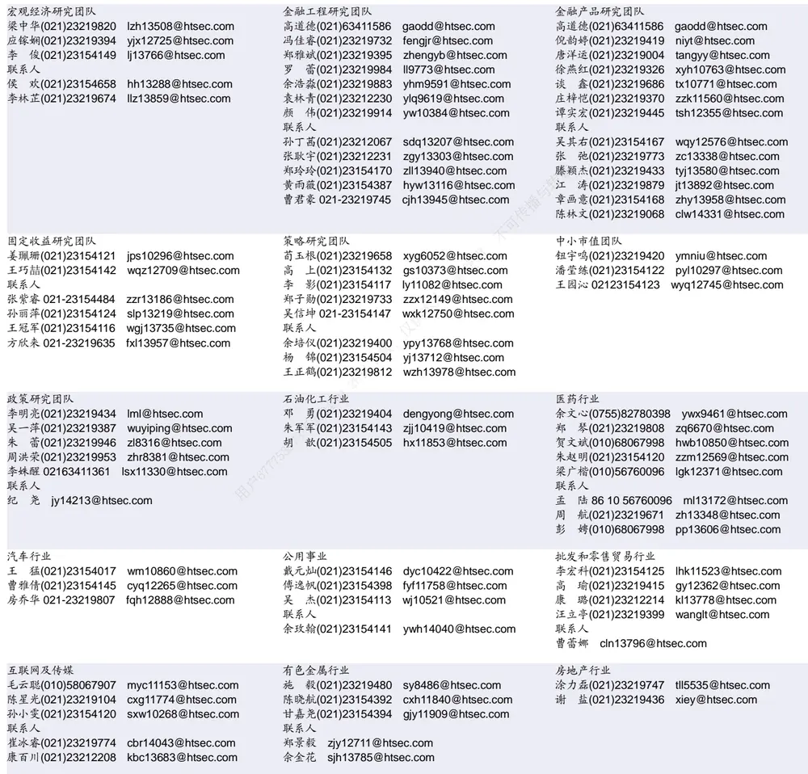

| 电子行业 |  | 煤炭行业 |  | 电力设备及新能源行业 |  |
| --- | --- | --- | --- | --- | --- |
| 李 轩(021)23154652 lx12671@htsec.com |  |  | 李 淼(010)58067998 Im10779@htsec.com | 张一弛(021)23219402 | zyc9637@htsec.com |
| 肖隽翀(021)23154139 xjc12802@htsec.com |  |  | 王 涛(021)23219760 wt12363@htsec.com | 房 青(021)23219692 | fangq@htsec.com |
| 华晋书 02123219748 hjs14155@htsec.com 联系人 |  |  | 吴 杰(021)23154113 wj10521@htsec.com | 徐柏乔(021)23219171 xbq6583@htsec.com 张 磊(021)23212001 zl10996@htsec.com |  |
| 文 灿(021)23154401 wc13799@htsec.com |  |  |  | 联系人 |  |
|  | 薛逸民(021)23219963 xym13863@htsec.com |  |  | 姚望洲(021)23154184 ywz13822@htsec.com |  |
|  | 李 潇(010)58067830 Ix13920@htsec.com |  |  | 柳文韬(021)23219389 Iwt13065@htsec.com |  |
|  |  |  |  | 吴锐鹏 wrp14515@htsec.com |  |

| 基础化工行业 | 计算机行业 | 通信行业 |
| --- | --- | --- |
| 刘 威(0755)82764281 Iw10053@htsec.com | 郑宏达(021)23219392 zhd10834@htsec.com | 余伟民(010)50949926 ywm11574@htsec.com |
| 张翠翠(021)23214397 zcc11726@htsec.com | 杨 林(021)23154174 yl11036@htsec.com | 杨彤昕 010-56760095 ytx12741@htsec.com |
| 孙维容(021)23219431 swr12178@htsec.com | 于成龙(021)23154174 ycl12224@htsec.com | 联系人 |
| 李 智(021)23219392 lz11785@htsec.com | 洪 琳(021)23154137 hl11570@htsec.com | 夏 凡(021)23154128 xf13728@htsec.com |
|  | 联系人 杨 蒙(0755)23617756 ym13254@htsec.com |  |

| 非银行金融行业 |  | 交通运输行业 |  | 纺织服装行业 |  |  |
| --- | --- | --- | --- | --- | --- | --- |
|  | 何 婷(021)23219634 ht10515@htsec.com |  | 虞 楠(021)23219382 yun@htsec.com |  |  | 梁 希(021)23219407 lx11040@htsec.com |
|  | 任广博(010)56760090 rgb12695@htsec.com |  | 罗月江（010）56760091 lyj12399@htsec.com |  | 盛 开(021)23154510 sk11787@htsec.com |  |
|  | 孙 婷(010)50949926 st9998@htsec.com |  | 陈 宇(021)23219442 cy13115@htsec.com |  |  |  |
| 联系人 |  |  |  |  |  |  |

| 建筑建材行业 | 机械行业 | 钢铁行业 |
| --- | --- | --- |
| 冯晨阳(021)23212081 fcy10886@htsec.com | 余炜超(021)23219816 swc11480@htsec.com | 刘彦奇(021)23219391 liuyq@htsec.com |
| 潘莹练(021)23154122 pyl10297@htsec.com | 赵玥炜(021)23219814 zyw13208@htsec.com | 周慧琳(021)23154399 zhl11756@htsec.com T传播与 |
| 申 浩(021)23154114 sh12219@htsec.com 颜慧菁 yhj12866@htsec.com | 赵靖博(021)23154119 zjb13572@htsec.com 联系人 |  |
|  | 刘绮雯(021)23154659 Iqw14384@htsec.com |  |

| 建筑工程行业 | 农林牧渔行业 |  | 食品饮料行业 |
| --- | --- | --- | --- |
| 张欣劼 zxj12156@htsec.com | 陈 阳(021)23212041 cy10867@htsec.com |  | 颜慧菁 yhj12866@htsec.com |
| 联系人 |  |  | 张宇轩(021)23154172 zyx11631@htsec.com |
| 曹有成(021)63411398 cyc13555@htsec.com |  | 人内部 | 程碧升(021)23154171 cbs10969@htsec.com |

| 军工行业 | 银行行业 | 社会服务行业 |  |
| --- | --- | --- | --- |
| 张恒晅 zhx10170@htsec.com 联系人 | 林加力(021)23154395 ljl12245@htsec.com 联系人 | 汪立亭(021)23219399 wanglt@htsec.com | 许樱之(755)82900465 xyz11630@htsec.com |
| 刘砚菲 021-2321-4129 lyf13079@htsec.com | 董栋梁(021)23219356 ddl13206@htsec.com -26 | 联系人 | 毛弘毅(021)23219583 mhy13205@htsec.com 王祎婕(021)23219768 wyj13985@htsec.com |

| 家电行业 |  | 造纸轻工行业 |  |
| --- | --- | --- | --- |
| 陈子仪(021)23219244 chenzy@htsec.com |  |  | 郭庆龙 gql13820@htsec.com |
| 李 阳(021)23154382 ly11194@htsec.com |  | 高翩然 | gpr14257@htsec.com |
| 朱默辰(021)23154383 | zmc11316@htsec.com | 联系人 |  |
| 刘 璐(021)23214390 II11838@htsec.com |  | 用户67775 | 王文杰 wwj14034@htsec.com 吕科佳 Ikj14091@htsec.com |

## 研究所销售团队

深广地区销售团队
伏财勇(0755)23607963 fcy7498@htsec.com蔡铁清(0755)82775962 ctq5979@htsec.com辜丽娟(0755)83253022 gulj@htsec.com
刘晶晶(0755)83255933 liujj4900@htsec.com饶 伟(0755)82775282 rw10588@htsec.com欧阳梦楚(0755)23617160
oymc11039@htsec.com
巩柏含 gbh11537@htsec.com
滕雪竹 0755 23963569 txz13189@htsec.com张馨尹 0755-25597716 zxy14341@htsec.com
上海地区销售团队
胡雪梅(021)23219385 huxm@htsec.com
黄 诚(021)23219397 hc10482@htsec.com
季唯佳(021)23219384 jiwj@htsec.com
黄 毓(021)23219410 huangyu@htsec.com
李 寅 021-23219691 ly12488@htsec.com
胡宇欣(021)23154192 hyx10493@htsec.com
马晓男 mxn11376@htsec.com
邵亚杰 23214650 syj12493@htsec.com
杨祎昕(021)23212268 yyx10310@htsec.com
毛文英(021)23219373 mwy10474@htsec.com
谭德康 tdk13548@htsec.com
王祎宁(021)23219281 wyn14183@htsec.com
北京地区销售团队
朱 健(021)23219592 zhuj@htsec.com
殷怡琦(010)58067988 yyq9989@htsec.com
郭 楠 010-5806 7936 gn12384@htsec.com
杨羽莎(010)58067977 yys10962@htsec.com
张丽萱(010)58067931 zlx11191@htsec.com
郭金垚(010)58067851 gjy12727@htsec.com
张钧博 zjb13446@htsec.com
高 瑞 gr13547@htsec.com
上官灵芝 sglz14039@htsec.com
董晓梅 dxm10457@htsec.com

海通证券股份有限公司研究所

地址：上海市黄浦区广东路 689号海通证券大厦 9楼

电话：（021）23219000

传真：（021）23219392

网址：www.htsec.com