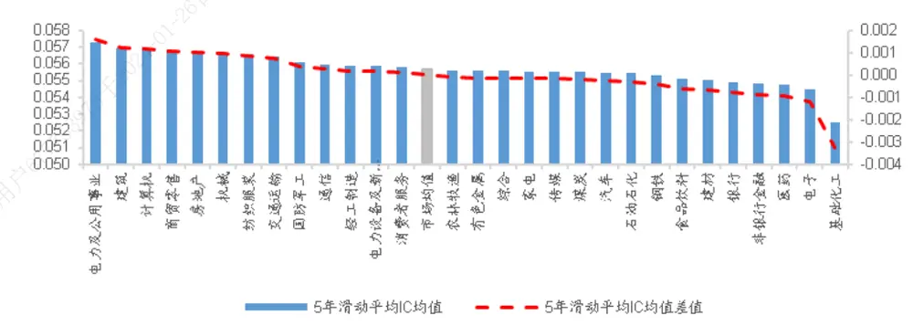
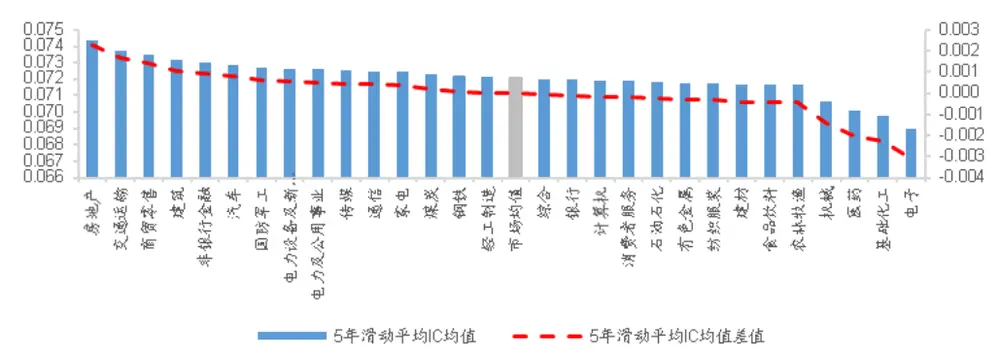
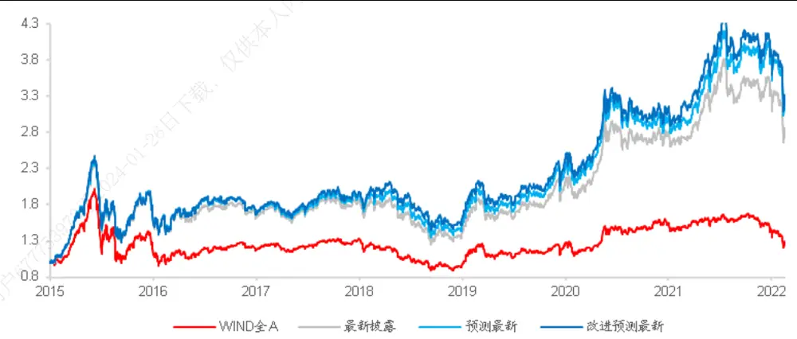
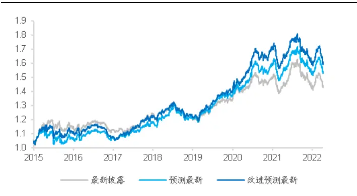
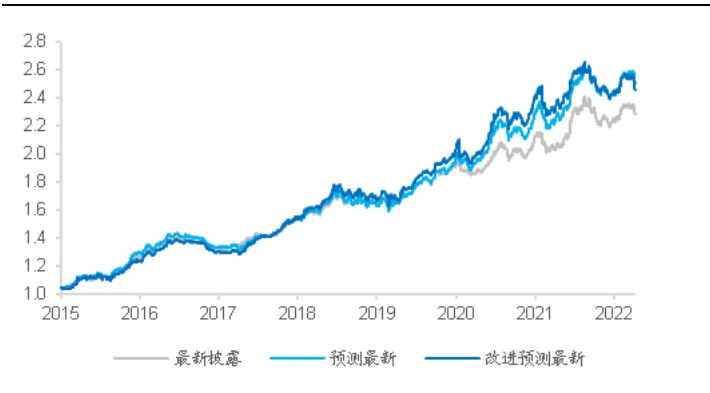
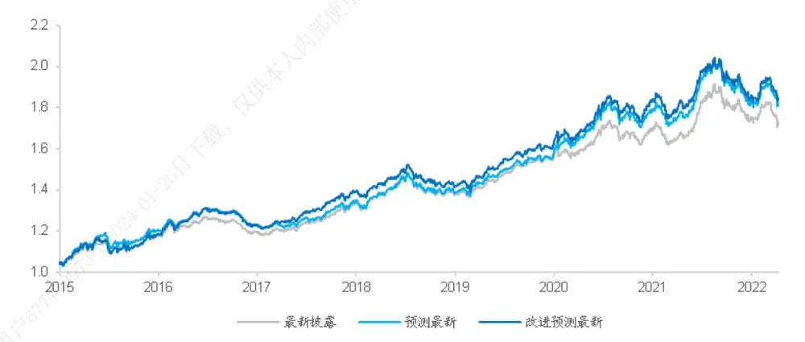
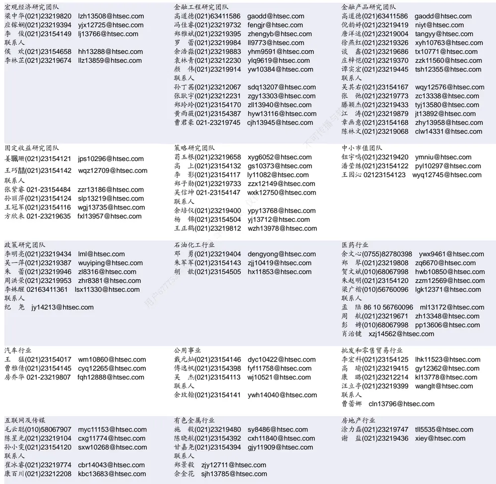

## [Tab相关研究

Table_ReportInfo]《新晋中观行业“捕手”——华夏基金李彦投资风格分析》2022.06.20

《周期视角研判成长，供给切入捕捉拐点——广发成长动力三年持有期基金投资价值分析》2022.06.16

《选股因子系列研究（八十）——股票久期的定义、溢价及应用》2022.06.06

分析师:冯佳睿

Tel:(021)23219732

Email:fengjr@htsec.com

证书:S0850512080006

分析师:余浩淼

Tel:(021)23219883

Email:yhm9591@htsec.com

证书:S0850516050004

# 选股因子系列研究（八十一）——净利润相关指标的进一步改进

## [Table_Sum投资要点：

一个好的量化因子需要同时具备可用性、可靠性与有效性三个特征。可用性（availability）：可以通过数据商或者其他渠道获得，不存在明显的缺失或滞后。可靠性（reliability）：市场中的绝大部分股票都会产生该类数据，不存在大面积的数据隐藏。有效性（effectiveness）：根据数据构建的因子能够区分不同股票未来一段时间内的收益表现，或者说市场对于因子有和预期一致的反应。

- 因子可用性的改善。我们将最新披露 替换为已披露的业绩快报或业绩预告公布的数值，和一致预期 共同作为预测变量，建立当期真实 的预测模型。在得到预测值后，我们进一步采用 历史波动率倒数加权的方式，降低预测精度较差的那部分股票的影响，从而在一定程度上缓解了最新披露 O的滞后问题，提升了选股效果。

- ROE因子有效性的改善。在每一个季度末，依次剔除 30 个中信一级行业中的一与个，计算过去 年剩余行业所有股票当季真实 的 均值，与全部股票当季传真实 O 的 C 均值之差，以此作为刻画每个行业对 O 因子有效性影响程度不的量化指标。如果这个差值大于 ，就降低该行业内股票的权重。用，

- SUE 因子有效性的改善。采用和改善 ROE 因子有效性相同的方式，调整 SUE内因子的权重，同样可以提升因子的溢价和多空收益。本

- 使用改善后的 ROE和 SUE因子，显著增强了基本面多因子组合的业绩表现。搭载，配高评级机构家数构建的全市场多头组合与指数增强组合，均能在不增加风险的日前提下，提高年化收益。-2

- 风险提示。市场系统性风险、模型误设风险、有效因子变动风险。2

随着 A股市场有效性的逐步提升，绩优股表现越发优异。从因子角度来看，代表公司业绩的 ROE因子，选股效果愈加显著。因此，对于业绩相关因子，特别是 ROE因子的深入研究，或将成为未来寻找市场有效 alpha 的重要方向。

## 1. 有效选股因子的三个条件

我们认为，利用金融数据构建选股因子，一般需要数据满足三个层次的要求，才能实现较为理想的选股效果。

（1）可用性（availability）：可以通过数据商或者其他渠道获得，不存在明显的缺失或滞后。

（2）可靠性（reliability）：市场中的绝大部分股票都会产生该类数据，不存在大面积的数据隐藏。

（3）有效性（effectiveness）：根据数据构建的因子能够区分不同股票未来一段时间内的收益表现，或者说市场对于因子有和预期一致的反应。

另类金融数据常常不满足上述三个要求中的一个或多个。以供应链数据为例，一方面，几乎所有的金融数据提供商都无法即时搜集所有公司主动或被动披露的供应链情况。很多中小企业的供应链数据，甚至是无法获取的。另一方面，就算得到公司真实的供应链数据，不同行业或不同发展阶段的公司，市场对其供应链数据变动的反应也会有所差异。例如，非制造业企业供应链状况的变化对其股价的影响就相对小一些。

技术面指标基本可以完全满足上述三个要求。只有在涨跌停一字板和停牌情况下，才无法获取数据或对有效性产生影响，正常交易的所有股票几乎都具备这三个特征。因此，为保证有足够的样本进行模型训练与预测，技术面指标比另类金融数据更适合放入量化模型，尤其是机器学习这类“黑盒”量化模型。

而对于常用的财务指标，如 ，根据监管机构的要求，上市公司都会定期披露财务报告，以揭示公司的运营状况，故数据的可靠性能得到较为充分的保障。但财报的披露往往滞后，市场对不同类型或行业公司 ROE的反应也有所差异。因此，想要提升 ROE因子的选股表现，可以从改善 ROE 数据的可用性与有效性入手。

## 2. ROE因子选股效果的改善

## 2.1ROE 因子可用性的改善

在前期报告《使用基本面逻辑改进 ROE因子》中，我们提出，ROE因子的有效性主要来自于当期真实 ROE，而常用的最新披露 ROE因为数据披露滞后，只是被当作当期真实 ROE的预测值来使用。受此启发，我们以最新披露 ROE和一致预期 ROE为预测变量，建立当期真实 的预测模型。在得到预测值后，我们进一步采用 历史波动率倒数加权的方式，降低预测精度较差的那部分股票的影响，从而在一定程度上缓解了最新披露 ROE的滞后问题，提升了选股效果。

但是，从三季报发布到年报发布之间的真空期实在过长，以至于在当年一季度结束时，最新可获得的 ROE依然是上年三季报的数据，这也会影响预测精度。不过，随着上市公司信息披露规则的完善，越来越多的公司会在年报披露前的一两个月，发布业绩快报或业绩预告。于是，我们就可以通过业绩快报或预告中的信息更新预测值，提升预测的准确性。

因此可以考虑在业绩快报或业绩预告披露后，将最新披露 替换为已披露的业绩快报或业绩预告公布的数值，重新预测当期真实 。其中，业绩预告的数据采用上下限的均值。如有多个业绩快报或预告，使用预测时可获得的最新数值。

表 1 用业绩快报或业绩预告替换最新披露 ROE后，得到的 ROE预测值的因子溢价（2014.01-2022.04）

| 全市场 |  | 因子溢价 | 溢价t值 | 溢价胜率 | 多头收益 | 空头收益 | 多空收益 |
| --- | --- | --- | --- | --- | --- | --- | --- |
|  | 最新披露 ROE | 0.27% | 5.508 | 69.0% | 0.50% | -0.64% | 1.14% |
|  | 最新披露 ROE+一致预期 ROE | 0.28% | 4.618 | 70.0% | 0.43% | -0.86% | 1.29% |
|  | 业绩快报 ROE+一致预期 ROE | 0.29% | 4.962 | 71.0% | 0.45% | -0.92% | 1.37% |
|  | 业绩预告 ROE+一致预期 ROE | 0.26% | 4.584 | 69.0% | 0.29% | -0.98% | 1.27% |
|  | 最新披露 ROE | 0.37% | 3.919 | 63.0% | 0.45% | -0.49% | 0.94% |
|  | 沪深 最新披露 ROE+一致预期 ROE | 0.44% | 4.226 | 67.0% | 0.56% | -0.80% | 1.37% |
| 300 中证 | 业绩快报 ROE+一致预期 ROE | 0.45% | 4.193 | 65.0% | 0.53% | -0.83% | 1.36% |
|  | 业绩预告 ROE+一致预期 ROE | 0.45% | 4.264 | 65.0% | 0.33% | -0.80% | 1.13% |
|  | 最新披露 ROE | 0.29% | 3.843 | 73.0% | 0.50% | -0.52% | 1.02% |
|  | 最新披露 ROE+一致预期 ROE | 0.23% | 2.787 | 65.0% | 0.42% | -0.76% | 1.18% |
| 500 中000 | 业绩快报 ROE+一致预期 ROE | 0.26% | 3.136 | 67.0% | 0.46% | -0.87% | 1.34% |
|  | 业绩预告 ROE+一致预期 ROE | 0.23% | 2.840 | 64.0% | 0.36% | -0.96% | 1.31% |
|  | 最新披露 ROE | 0.33% | 4.838 | 69.0% | 0.47% | -0.58% | 1.05% |
|  | 最新披露 ROE+一致预期 ROE 业绩快报 ROE+一致预期 ROE | 0.33% | 4.386 | 65.0% | 0.45% | -0.75% | 1.21% |
|  | 业绩预告 ROE+一致预期 ROE | 0.35% 0.33% | 4.557 4.460 | 70.0% 68.0% | 0.49% 0.28% | -0.82% -0.82% | 1.32% 1.10% |

资料来源：Wind，朝阳永续，海通证券研究所

由上表可见，除开中证 这一选股空间，使用业绩快报公布的 O 替换最新一次财报披露的 ROE得到的预测值，均可获得更高的因子溢价。而除开沪深 300 这一选股空间，新因子的多头超额收益也有一定的提升。因此，我们认为，总体而言，用业绩快报的数据可以改进当期真实 ROE的预测，适当增强因子的选股能力。

然而，当我们用业绩预告代替最新披露 时，因子表现全面下降。我们猜测，这是因为业绩预告通常只公布净利润的区间，且变动频繁。而我们用的是最新公布的区间上下限均值，误差较大，因此反而降低了因子的选股能力。

## 2.2ROE 因子有效性的改善

全市场而言，ROE确实是一个颇为有效的财务类因子，但不同行业的 ROE对于公司股票市场价值的影响程度却有很大差异。例如，在电力及公用事业、房地产、纺织服装和商贸零售四个行业内，ROE 受投资者认可与使用的程度就相对比较低。

这是因为，电力及公用事业主要受政策影响，房地产行业 存在延迟确认的情况，当期 ROE主要由往年的土地拍卖和融资状况决定。而对于纺织服装与商贸零售行业，除 ROE外，市场更倾向于叠加周转率等指标，综合评判公司股票的市场价值。

为了验证这四个行业的股价表现受 ROE的影响相对较小，我们将这四个行业股票剔除后，再考察 ROE因子的选股效果，结果如下表所示。

表 2 剔除 4 个行业后的 ROE 因子溢价（2014.01-2022.04）

| 全市场 |  | 因子溢价 | 溢价T值 | 溢价胜率 | 多头收益 | 空头收益 | 多空收益 |
| --- | --- | --- | --- | --- | --- | --- | --- |
|  | ROE | 0.27% | 5.508 | 69.0% | 0.50% | -0.64% | 1.14% |
|  | 预测 ROE | 0.28% | 4.618 | 70.0% | 0.43% | -0.86% | 1.29% |
|  | 预测 ROE+剔除 4 个行业 | 0.29% | 4.483 | 71.0% | 0.51% | -0.89% | 1.40% |
|  | ROE | 0.37% | 3.919 | 63.0% | 0.45% | -0.49% | 0.94% |
| 300 | 预测 ROE | 0.44% | 4.226 | 67.0% | 0.56% | -0.80% | 1.37% |
|  | 预测 ROE+剔除 4 个行业 | 0.48% | 4.185 | 71.0% | 0.67% | -0.74% | 1.41% |
| 中证 | ROE | 0.29% | 3.843 | 73.0% | 0.50% | -0.52% | 1.02% |
| 500 | 预测 ROE | 0.23% | 2.787 | 65.0% | 0.42% | -0.76% | 1.18% |
| 中00 | 预测 ROE+剔除 4 个行业 | 0.26% | 2.829 | 71.0% | 0.67% | -1.02% | 1.69% |
|  | ROE | 0.33% | 4.838 | 69.0% | 0.47% | -0.58% | 1.05% |
|  | 预测 ROE | 0.33% | 4.386 | 65.0% | 0.45% | -0.75% | 1.21% |
|  | 预测 ROE+剔除 4 个行业 | 0.36% | 4.292 | 71.0% | 0.60% | -0.81% | 1.41% |

资料来源：Wind，朝阳永续，海通证券研究所

剔除 4个行业后，使用最新披露 ROE+一致预期数据得到的预测 ROE因子，可以获得更高的溢价和多头收益。由此可见，这些不太适合用 评价投资价值的行业确实在一定程度上影响了 ROE选股的有效性。

但是，以上处理来自对行业特性的主观定性认知，很有可能随时间的推移、环境的不同而出现变化。因此，对于不同行业是如何影响 ROE的有效性，我们需要一套客观定量的评价标准。

具体地，在每一个季度末，依次剔除 30 个中信一级行业中的一个，计算过去 5 年剩余行业所有股票当季真实ROE的IC均值，与全部股票当季真实ROE的IC均值之差，以此作为刻画每个行业对 ROE 因子有效性影响程度的量化指标。

显然，差值越大，表明剔除该行业后，ROE因子有效性得到的提升也越大。即，该行业的股票并不适合使用 ROE 区分未来表现。差值越小，甚至为负，则代表剔除该行业对 ROE因子的提升较小，甚至影响了 ROE的有效性。即，在这个行业内，利用 ROE因子选股有较好的效果。

如下图所示，分别剔除电力及公用事业、房地产、纺织服装和商贸零售中的一个后，因子的 均值上升幅度较大。这表明，先前的主观判断是正确的，这些行业不适合用 ROE选股。然而，我们还发现，剔除建筑，计算机行业，IC 均值也出现了上升。这可能是没有经过数据分析前，我们未曾预料到的。

图1 剔除不同行业后，当期 ROE 因子 5 年滑动平均 IC（2014.01-2022.04）

资料来源：Wind，海通证券研究所

于是，我们提出了一种简单的定量判别规则。对于行业 A，若将其剔除后，ROE因子的 5年 IC滚动均值，与剔除前滚动均值的差大于 0.05%，则代表该行业对 ROE因子的有效性影响较大，应当予以调整。直接删除该行业全部股票显然不合理，因此我们采用降低权重的做法。

具体地，对于我们判别为影响较大的行业，其成分股的预测 在被用于计算时，权重变为 1/2。或按照差值超过 0.05%的幅度等比例分级靠档，差值每上升 1 个 bp，该行业内股票的权重下降 。我们将这两种因子权重调整方式分别称之为等权降权和分级降权。

如下表所示，在对部分影响较大的行业的个股预测 ROE 降权后，因子溢价、多头收益、多空收益都获得了较为显著的提升。由此可见，和引入业绩快报类似，对预测 ROE做适当的权重调整，同样可以改进因子的选股效果。

表 3 用历史真实 ROE 选股效果调整权重后的 ROE 因子溢价（2014.01-2022.04）

| 全市场 |  | 因子溢价 | 溢价T值 | 溢价胜率 | 多头收益 | 空头收益 | 多空收益 |
| --- | --- | --- | --- | --- | --- | --- | --- |
|  | ROE | 0.27% | 5.508 | 69.0% | 0.50% | -0.64% | 1.14% |
|  | 预测 ROE | 0.28% | 4.618 | 70.0% | 0.43% | -0.86% | 1.29% |
|  | 预测 ROE+等权降权 | 0.31% | 4.543 | 72.0% | 0.54% | -0.79% | 1.33% |
|  | 预测 ROE+分级降权 | 0.31% | 4.515 | 72.0% | 0.52% | -0.79% | 1.31% |
|  | ROE | 0.37% | 3.919 | 63.0% | 0.45% | -0.49% | 0.94% |
|  | 预测 ROE | 0.44% | 4.226 | 67.0% | 0.56% | -0.80% | 1.37% |
| 沪深 300 中证 500 | 预测 ROE+等权降权 | 0.48% | 4.053 | 66.0% | 0.70% | -0.66% | 1.36% |
|  | 预测 ROE+分级降权 | 0.48% | 4.010 | 65.0% | 0.72% | -0.73% | 1.45% |
|  | ROE | 0.29% | 3.843 | 73.0% | 0.50% | -0.52% | 1.02% |
|  | 预测 ROE | 0.23% | 2.787 | 65.0% | 0.42% | -0.76% | 1.18% |
|  | 预测 ROE+等权降权 | 0.26% | 2.685 | 62.0% | 0.61% | -0.66% | 1.27% |
| 中000 | 预测 ROE+分级降权 | 0.26% | 2.682 | 63.0% | 0.63% | -0.69% | 1.32% |
|  | ROE | 0.33% | 4.838 | 69.0% | 0.47% | -0.58% | 1.05% |
|  | 预测 ROE | 0.33% | 4.386 | 65.0% | 0.45% | -0.75% | 1.21% |
|  | 预测 ROE+等权降权 | 0.37% | 4.229 | 67.0% | 0.61% | -0.65% | 1.26% |
|  | 预测 ROE+分级降权 | 0.36% | 4.194 | 66.0% | 0.68% | -0.71% | 1.39% |

资料来源：Wind，朝阳永续，海通证券研究所

下面，我们进一步把上述两个改进方案结合。首先，用业绩快报的 ROE代替最新披露 ROE，和一致预期 ROE共同得到当期真实 ROE的预测；随后，根据每个行业历史当期真实 ROE的选股效果，对预测 ROE实施分级靠档降权。

下表展示了经过两步改进后，因子的表现。和我们常用的 ROE（最新披露）相比，新因子的选股效果全面提升。尤其是在沪深 300 中，因子溢价和多头收益显著增强。我们认为，这些结果表明，从可用性和有效性两个角度改进 ROE因子是成功的。

表 4 用业绩快报修正预测，叠加历史真实 ROE选股效果加权后的 ROE因子溢价（2014.01-2022.04）

| 全市场 |  | 因子溢价 | 溢价T值 | 溢价胜率 | 多头收益 | 空头收益 | 多空收益 |
| --- | --- | --- | --- | --- | --- | --- | --- |
|  | ROE | 0.27% | 5.508 | 69.0% | 0.50% | -0.64% | 1.14% |
|  | 预测 ROE | 0.28% | 4.618 | 70.0% | 0.43% | -0.86% | 1.29% |
|  | 快报修正预测 ROE+分级加权 | 0.32% | 4.771 | 71.0% | 0.52% | -0.88% | 1.39% |
|  | ROE | 0.37% | 3.919 | 63.0% | 0.45% | -0.49% | 0.94% |
| 沪0 $00 | 预测 ROE | 0.44% | 4.226 | 67.0% | 0.56% | -0.80% | 1.37% |
|  | 快报修正预测 ROE+分级加权 | 0.48% | 3.983 | 71.0% | 0.66% | -0.79% | 1.45% |
|  | ROE | 0.29% | 3.843 | 73.0% | 0.50% | -0.52% | 1.02% |
|  | 预测 ROE | 0.23% | 2.787 | 65.0% | 0.42% | -0.76% | 1.18% |
| 中证 800 | 快报修正预测 ROE+分级加权 | 0.28% | 2.968 | 71.0% | 0.64% | -0.79% | 1.43% |
|  | ROE | 0.33% | 4.838 | 69.0% | 0.47% | -0.58% | 1.05% |
|  | 预测 ROE | 0.33% | 4.386 | 65.0% | 0.45% | -0.75% | 1.21% |
|  | 快报修正预测 ROE+分级加权 | 0.38% | 4.337 | 71.0% | 0.64% | -0.78% | 1.41% |

资料来源：Wind，朝阳永续，海通证券研究所

## 3. SUE因子选股效果的改善

## 3.1SUE 因子特性分析

除 ROE外，SUE也是常见的与盈利相关的选股指标，用于描述超预期的盈余状况，一般会和 ROE搭配使用。计算公式如下：

$$
\tt SUE=DREV/SD(DREV_{t=1...4})
$$

其中，DREV 为净利润同比增量， 为过去四个季度净利润同比增量的标准差。从计算公式来看，SUE也可认为是波动率调整后的净利润同比变化。

根据我们对 ROE的研究经验，披露时间严重滞后的财务指标之所以有选股效果，往往是因为它们对当期未公布的最新值存在一定的预测性。那么，SUE的选股有效性是不是也来源于此呢？

因此，我们首先计算得到最新披露 SUE和未披露的当期真实 SUE的相关系数为0.34，显著低于最新披露 ROE 和未披露的当期真实 ROE的相关系数（0.55）。随后，我们分别将最新披露 SUE和 ROE对它们各自未披露的当期真实值正交，检验残差的选股效果。

如下表所示，最新披露 ROE 正交当期真实值后，IC接近于 0；而最新披露 SUE正交当期真实值后，IC为 0.021。由此可见，最新披露 ROE的选股效果完全来自于对真实值的业绩动量效应，但最新披露 SUE还包含了其他信息。

另一方面，由于 ROE和 SUE的计算都用到了净利润，两者应有较高的相关性。根据我们的计算，SUE与最新披露 ROE的相关系数在 0.5 左右。因此，我们进一步考察正交 ROE后，业绩动量效应是否是最新披露 SUE选股有效性的主要来源。

表 5 最新披露 ROE 和当期真实 ROE、SUE 因子选股效果对比（2014.01-2022.04）

|  | 和当期真实值相关 系数 | IC 均值 | IC-IR | IC 胜率 | 多头收 益 | 空头收 益 | 多空收 益 |
| --- | --- | --- | --- | --- | --- | --- | --- |
| 最新披露 ROE | 0.547 | 0.029 | 1.999 | 68.8% | 0.53% | -0.62% | 1.15% |
| 最新披露 ROE: 正交当期真实 ROE | - | -0.004 | -0.329 | 39.8% | 0.02% | 0.32% | -0.31% |
| 最新披露 SUE | 0.341 | 0.052 | 3.403 | 87.1% | 0.96% | -0.71% | 1.67% |
| 最新披露 SUE：正交当期真实 SUE | - | 0.021 | 1.587 | 66.7% | 0.43% | -0.03% | 0.46% |
| 最新披露 SUE:正交 ROE | 0.335 | 0.040 | 3.089 | 81.7% | 0.73% | -0.56% | 1.29% |
| 最新披露 SUE：依次正交 ROE、当期真实 SUE |  | 0.033 | 2.276 | 74.2% | 0.69% | -0.22% | 0.91% |

资料来源：Wind，朝阳永续，海通证券研究所

剔除 ROE的影响后，最新披露 SUE的 IC 虽从 0.052降至 0.040，但依然较为显著。继续正交当期真实 SUE后，IC 从 0.040仅小幅下降至 0.033。

综上所述，我们认为，SUE 因子虽也有一定的业绩动量效应，但由于其本质为净利润的同比差分，故效应显著弱于 ROE。而进一步与 ROE正交后，业绩动量效应对 SUE因子选股效果的影响会进一步减弱。

因为 因子的选股效果主要来自业绩动量，所以改善数据披露滞后性可以提升因子的选股效果。然而从上述分析可见，数据滞后对 SUE选股效果的影响并不明显，因此我们跳过因子可用性的改善步骤，直接尝试改进因子的有效性。

## 3.2SUE 因子有效性的改善

和改进 ROE因子有效性的方法类似，我们同样逐一剔除每个行业，考察 SUE因子IC 的变化。

如下图所示，不同行业对 S 因子选股效果的影响大于对 O 的影响。这表明，调整不同行业股票 SUE的权重，或许可以使因子表现获得更为显著的提升。此外，剔除同一个行业对 与 因子的影响也有差异，例如，剔除纺织服装行业后，选股效果提升明显，说明该行业个股不适用 ROE因子选股；而 SUE因子的 IC 反而有所下降，说明市场在评价该行业个股时，反而认可公司的 。

图2 剔除不同行业后，当期 SUE 因子 5 年滑动平均 IC（2014.01-2022.04）

资料来源： ，海通证券研究所

类似地，我们以 0.05%为阈值确定不同行业股票的权重，调整后的 SUE因子的选股效果如下表所示。

表 6 用历史真实 SUE 选股效果调整权重后的 SUE 因子溢价（2014.01-2022.04）

| 全市场 |  | 因子溢价 | 溢价T值 | 溢价胜率 | 多头收益 | 空头收益 | 多空收益 |
| --- | --- | --- | --- | --- | --- | --- | --- |
|  | 正交ROE | 0.40% | 7.947 | 82.0% | 0.71% | -0.55% | 1.26% |
|  | 正交 ROE+等权降权 | 0.44% | 7.843 | 83.0% | 0.75% | -0.55% | 1.30% |
|  | 正交 ROE+分级降权 | 0.44% | 7.834 | 81.0% | 0.76% | -0.54% | 1.30% |
|  | 正交 ROE | 0.22% | 2.379 | 67.0% | 0.11% | -0.56% | 0.67% |
| 沪深 300 中证 | 正交 ROE+等权降权 | 0.27% | 2.523 | 64.0% | 0.07% | -0.52% | 0.59% |
|  | 正交 ROE+分级降权 | 0.28% | 2.581 | 64.0% | 0.10% | -0.58% | 0.69% |
|  | 正交 ROE | 0.43% | 5.935 | 71.0% | 0.62% | -0.69% | 1.31% |
|  | 正交 ROE+等权降权 | 0.49% | 6.183 | 75.0% | 0.80% | -0.62% | 1.41% |
| 500 中证 | 正交 ROE+分级降权 | 0.50% | 6.180 | 73.0% | 0.94% | -0.65% | 1.59% |
|  | 正交 ROE | 0.33% | 4.899 | 71.0% | 0.63% | -0.57% | 1.20% |
|  | 正交 ROE+等权降权 | 0.40% | 4.945 | 72.0% | 0.58% | -0.57% | 1.15% |
| 800 全市场 | 正交 ROE+分级降权 | 0.40% | 4.970 | 71.0% | 0.68% | -0.61% | 1.28% |
|  | 正交预测 ROE | 0.41% | 7.966 | 81.0% | 0.76% | -0.61% | 1.38% |
|  | 正交预测 ROE+等权降权 | 0.46% | 7.926 | 82.0% | 0.76% | -0.63% | 1.39% |
| 沪深 300 | 正交预测 ROE+分级降权 | 0.46% | 7.942 | 81.0% | 0.74% | -0.63% | 1.37% |
|  | 正交预测 ROE | 0.24% | 2.483 | 62.0% | 0.15% | -0.42% | 0.57% |
|  | 正交预测 ROE+等权降权 | 0.30% | 2.625 | 64.0% | 0.09% | -0.38% | 0.48% |
|  | 正交预测 ROE+分级降权 | 0.31% | 2.716 | 62.0% | 0.09% | -0.38% | 0.47% |
|  | 正交预测 ROE | 0.48% | 6.357 | 75.0% | 0.66% | -0.68% | 1.34% |
| 中证 500 中证 | 正交预测 ROE+等权降权 | 0.55% | 6.645 | 74.0% | 0.56% | -0.69% | 1.25% |
|  | 正交预测 ROE+分级降权 | 0.56% | 6.667 | 73.0% | 0.69% | -0.79% | 1.48% |
|  | 正交预测 ROE | 0.37% | 5.063 | 75.0% | 0.61% | -0.58% | 1.19% |
|  | 正交预测 ROE+等权降权 | 0.44% | 5.163 | 75.0% | 0.50% | -0.60% | 1.10% |
| 800 | 正交预测 ROE+分级降权 | 0.44% | 5.228 | 74.0% | 0.61% | -0.64% | 1.25% |

资料来源： ，朝阳永续，海通证券研究所

无论是和最新披露 ROE还是和预测 ROE正交，权重调整显著改善了 SUE因子的选股表现，因子溢价和多空收益都出现提升。相对而言，分级靠档降权方式的改善效果更为稳定。

## 4. 基本面因子组合

改善因子的一个重要目标是用于多因子模型，力求获得更加稳健优异的选股绩效。因此，我们将改善后的 ROE和 SUE因子，搭配高评级机构数建立三因子模型，并构建两类组合：全市场多头组合与指数增强组合。

## 4.1全市场多头组合

全市场多头组合共有 3个，每个组合采用的因子如下。

（1） 最新披露组合：最新披露 ROE、最新披露 SUE、最高评级机构数。

（2） 预测最新组合：预测最新 ROE（叠加业绩快报）、最新披露 SUE、最高评级机构数。

（3） 改进预测最新组合：根据历史真实 ROE表现加权调整的预测最新 ROE（叠加业绩快报），根据历史真实 SUE表现加权调整的最新披露 SUE，最高评级机构数。

回测过程中，为了尽可能贴近实际交易，我们对成本与换仓价格均采取非常保守的设臵。以开盘后半小时每 10秒的 TWAP价格换仓，并在此基础上设臵 0.1%的冲击成本，0.05%的佣金成本。考虑到卖出股票印花税的影响，实际双边成本在 0.5%左右。

约束这 3个全市场多头组合的个股权重不得大于 1%，即，至少选择 100 只股票。同时为了防止过度的市值偏离，我们还对对组合的市值与非线性市值因子做了±0.3倍标准差的暴露约束。

图3 全市场多头组合累计净值（2015.01-2022.04）

资料来源：Wind，朝阳永续，海通证券研究所

由上图可见，3 个组合均能显著战胜Wind全 A指数。并且，随着对 ROE和 SUE因子的不断改善，组合的表现也逐步提升。改进预测最新组合年化收益 ，为三者最高，夏普比率和收益回撤比也优于 Wind全 A指数和另外两个组合。由此可见，前文提出的改善 ROE和 SUE的思路，不仅增强了单因子的表现，也有助于提升多因子模型的选股效果。

表 7 全市场多头组合的收益风险特征（2015.01-2022.04）

|  | 年化收益 | 年化波动 | 夏普比 | 最大回撤 | 收益回撤比 |
| --- | --- | --- | --- | --- | --- |
| Wind 全 A | 3.6% | 26.2% | 0.136 | 56.0% | 0.064 |
| 最新披露组合 | 15.5% | 28.2% | 0.551 | 48.6% | 0.320 |
| 预测最新组合 | 17.6% | 28.2% | 0.625 | 48.2% | 0.365 |
| 改进预测最新组合 | 17.9% | 28.4% | 0.631 | 48.7% | 0.368 |

资料来源：Wind，朝阳永续，海通证券研究所

## 4.2指数增强组合

进一步在多头组合的基础上添加一定的约束，构建沪深 300、中证 500 与中证 800指数增强组合。具体的约束条件包括，不低于 50%的成分股权重，行业偏离不超过 50%，月度跟踪误差不高于 3%等。

由图 4-6的累计超额收益可见，改进预测最新组合表现最优。相对而言，中证 500增强组合的改善效果最明显，年化超额收益上升 1.1%（表 8）。

图4 沪深 300 增强组合累计超额（2015.01-2022.04）

资料来源：Wind，朝阳永续，海通证券研究所

图5 中证 500 增强组合累计超额（2015.01-2022.04）

资料来源：Wind，朝阳永续，海通证券研究所

图6 中证 800 增强组合累计超额（2015.01-2022.04）

资料来源：Wind，海通证券研究所

表 8 指数增强组合的收益风险特征（2015.01-2022.04）

| 沪深300 |  | 年化超额收益 | 年化超额波动 | 信息比 | 超额最大回撤 | 超额收益回撤比 |
| --- | --- | --- | --- | --- | --- | --- |
|  | 最新披露组合 | 4.6% | 7.6% | 0.608 | 13.6% | 0.340 |
|  | 预测最新组合 | 5.7% | 7.9% | 0.724 | 14.8% | 0.384 |
| 中证500 | 改进预测最新组合 | 6.3% | 8.0% | 0.791 | 12.7% | 0.495 |
|  | 最新披露组合 | 11.7% | 6.6% | 1.782 | 8.9% | 1.308 |
|  | 预测最新组合 | 11.8% | 6.9% | 1.703 | 9.8% | 1.204 |
| 中证800 | 改进预测最新组合 | 12.8% | 7.4% | 1.745 | 9.9% | 1.304 |
|  | 最新披露组合 | 7.4% | 6.2% | 1.188 | 11.1% | 0.663 |
|  | 预测最新组合 | 8.2% | 6.4% | 1.285 | 10.0% | 0.817 |
|  | 改进预测最新组合 | 8.4% | 6.6% | 1.277 | 11.0% | 0.766 |

资料来源：Wind，朝阳永续，海通证券研究所

由于我们的目的是评估上文提出的因子改善方案对多因子模型的影响，因此在构建组合时，只使用了 ROE、SUE 和高评级机构数这三个因子，与综合应用技术面因子甚至高频因子的组合相比，业绩表现略显逊色。但仅就这个简单的三因子组合而言，从可用性和有效性角度出发改进 ROE 与 SUE因子，确实不失为一个可以尝试的方向。

## 5. 总结

如果说因子择时是基于因子在不同时间段和市场状态下的表现差异，对因子投资的一种改进方案。那么本文以及前序报告《使用基本面逻辑改进 ROE因子》提出的基于因子有用性、可靠性和有效性的三维度改进方法，则是以因子在截面上的表现差异为基础，提出的改进方案。这是因为，即使是同一个因子，也可能由于数据获取时间的先后或行业运行逻辑的差异，而呈现不同的选股表现。

例如，最为常见的基本面指标——ROE和 SUE，就面临着财报披露滞后、不同行业逻辑不同等潜在的影响选股有效性的问题。为此，我们通过引入一致预期和业绩快报，试图改善滞后问题；再以历史上两个因子在各个行业内的选股表现为基础，适当调整因子值的权重，试图降低那些不适用这两个因子的行业的干扰。

不论是从单因子还是多因子的检验结果来看，我们提出的两个改进步骤还是比较有效的。既提升了多头组合的（超额）收益，而且对选股范围的敏感性也较低，值得投资者参考。

## 6. 风险提示

市场系统性风险、模型误设风险、有效因子变动风险。用，

# 信息披露

分析师声明

[Table冯佳睿yst金融工程研究团队s]

余浩淼金融工程研究团队

本人具有中国证券业协会授予的证券投资咨询执业资格，以勤勉的职业态度，独立、客观地出具本报告。本报告所采用的数据和信息均来自市场公开信息，本人不保证该等信息的准确性或完整性。分析逻辑基于作者的职业理解，清晰准确地反映了作者的研究观点，结论不受任何第三方的授意或影响，特此声明。

## 法律声明

本报告仅供海通证券股份有限公司（以下简称“本公司”）的客户使用。本公司不会因接收人收到本报告而视其为客户。在任何情况下，本报告中的信息或所表述的意见并不构成对任何人的投资建议。在任何情况下，本公司不对任何人因使用本报告中的任何内容所引致的任何损失负任何责任。

本报告所载的资料、意见及推测仅反映本公司于发布本报告当日的判断，本报告所指的证券或投资标的的价格、价值及投资收入可能载会波动。在不同时期，本公司可发出与本报告所载资料、意见及推测不一致的报告。

市场有风险，投资需谨慎。本报告所载的信息、材料及结论只提供特定客户作参考，不构成投资建议，也没有考虑到个别客户特殊的可投资目标、财务状况或需要。客户应考虑本报告中的任何意见或建议是否符合其特定状况。在法律许可的情况下，海通证券及其所属不关联机构可能会持有报告中提到的公司所发行的证券并进行交易，还可能为这些公司提供投资银行服务或其他服务。用

本报告仅向特定客户传送，未经海通证券研究所书面授权，本研究报告的任何部分均不得以任何方式制作任何形式的拷贝、复印件或内复制品，或再次分发给任何其他人，或以任何侵犯本公司版权的其他方式使用。所有本报告中使用的商标、服务标记及标记均为本公本司的商标、服务标记及标记。如欲引用或转载本文内容，务必联络海通证券研究所并获得许可，并需注明出处为海通证券研究所，且仅不得对本文进行有悖原意的引用和删改。载，

根据中国证监会核发的经营证券业务许可，海通证券股份有限公司的经营范围包括证券投资咨询业务。日

## 海通证券股份有限公司研究所[Table_PeopleInfo]

路 颖所长

(021)23219403 luying@htsec.com

高道德 副所长(021)63411586 gaodd@htsec.com

邓 勇副所长

(021)23219404 dengyong@htsec.com

| 荀玉根 副所长 | 涂力磊 所长助理 | 余文心 所长助理 |
| --- | --- | --- |
| (021)23219658 xyg6052@htsec.com | (021)23219747 tll5535@htsec.com | (0755)82780398 ywx9461@htsec.com |

| 电子行业 |  | 煤炭行业 |  | 电力设备及新能源行业 |  |  |
| --- | --- | --- | --- | --- | --- | --- |
|  | 李 轩(021)23154652 lx12671@htsec.com |  | 李 淼(010)58067998 Im10779@htsec.com |  | 张一弛(021)23219402 | zyc9637@htsec.com |
|  | 肖隽翀(021)23154139 xjc12802@htsec.com |  | 王 涛(021)23219760 wt12363@htsec.com |  | 房 青(021)23219692 | fangq@htsec.com |
|  | 华晋书 02123219748 hjs14155@htsec.com |  | 吴 杰(021)23154113 wj10521@htsec.com |  | 徐柏乔(021)23219171 xbq6583@htsec.com |  |
| 联系人 |  |  |  |  | 张 磊(021)23212001 zl10996@htsec.com |  |
|  | 文 灿(021)23154401 wc13799@htsec.com |  |  |  | 联系人 |  |
|  | 薛逸民(021)23219963 | xym13863@htsec.com |  |  | 姚望洲(021)23154184 ywz13822@htsec.com | Iwt13065@htsec.com |
|  | 李 潇(010)58067830 lx13920@htsec.com |  |  |  | 柳文韬(021)23219389 吴锐鹏 wrp14515@htsec.com |  |

| 基础化工行业 | 计算机行业 | 通信行业 |  |
| --- | --- | --- | --- |
| 刘 威(0755)82764281 Iw10053@htsec.com | 郑宏达(021)23219392 zhd10834@htsec.com | 杨彤昕 010-56760095 ytx12741@htsec.com | 余伟民(010)50949926 ywm11574@htsec.com |
| 张翠翠(021)23214397 zcc11726@htsec.com 孙维容(021)23219431 swr12178@htsec.com | 杨 林(021)23154174 yl11036@htsec.com 于成龙(021)23154174 ycl12224@htsec.com | 联系人 |  |
| 李 智(021)23219392 lz11785@htsec.com | 洪 琳(021)23154137 hl11570@htsec.com | 夏 凡(021)23154128 xf13728@htsec.com |  |
|  | 联系人 |  |  |
|  | 杨 蒙(0755)23617756 ym13254@htsec.com |  |  |

| 非银行金融行业 | 交通运输行业 | 纺织服装行业 |  |
| --- | --- | --- | --- |
| 何 婷(021)23219634 ht10515@htsec.com | 虞 楠(021)23219382 yun@htsec.com |  | 梁 希(021)23219407 lx11040@htsec.com |
| 任广博(010)56760090 rgb12695@htsec.com | 罗月江（010）56760091 lyj12399@htsec.com |  | 盛 开(021)23154510 sk11787@htsec.com |
| 孙 婷(010)50949926 st9998@htsec.com 联系人 | 陈 宇(021)23219442 cy13115@htsec.com |  |  |

| 建筑建材行业 | 机械行业 |  | 钢铁行业 |
| --- | --- | --- | --- |
| 冯晨阳(021)23212081 fcy10886@htsec.com | 余炜超(021)23219816 swc11480@htsec.com |  | 刘彦奇(021)23219391 liuyq@htsec.com |
| 潘莹练(021)23154122 pyl10297@htsec.com | 赵玥炜(021)23219814 zyw13208@htsec.com |  | 周慧琳(021)23154399 zhl11756@htsec.com |
| 申 浩(021)23154114 sh12219@htsec.com 颜慧菁 yhj12866@htsec.com | 赵靖博(021)23154119 zjb13572@htsec.com |  |  |
|  | 联系人 刘绮雯(021)23154659 Iqw14384@htsec.com | 可传播与转 |  |

| 建筑工程行业 | 农林牧渔行业 | 食品饮料行业 |  |
| --- | --- | --- | --- |
| 张欣劼 zxj12156@htsec.com | 陈 阳(021)23212041 cy10867@htsec.com | 颜慧菁 yhj12866@htsec.com |  |
| 联系人 |  |  | 张宇轩(021)23154172 zyx11631@htsec.com |
| 曹有成(021)63411398 cyc13555@htsec.com | 大人内音 |  | 程碧升(021)23154171 cbs10969@htsec.com |

| 军工行业 | 银行行业 | 社会服务行业 |  |
| --- | --- | --- | --- |
| 张恒晅 zhx10170@htsec.com 联系人 | 林加力(021)23154395ljl12245@htsec.com 联系人 | 汪立亭(021)23219399 wanglt@htsec.com | 许樱之(755)82900465 xyz11630@htsec.com |
| 刘砚菲021-2321-4129 lyf13079@htsec.com | 董栋梁(021)23219356 ddI13206@htsec.com | 联系人 | 毛弘毅(021)23219583 mhy13205@htsec.com |
|  | 024-01- | 王祎婕(021)23219768 wyj13985@htsec.com |  |

| 家电行业 |  | 造纸轻工行业 |  |
| --- | --- | --- | --- |
| 陈子仪(021)23219244 chenzy@htsec.com |  |  | 郭庆龙 gql13820@htsec.com |
| 李 阳(021)23154382 ly11194@htsec.com |  |  | 高翩然 gpr14257@htsec.com |
|  | 朱默辰(021)23154383 zmc11316@htsec.com | 联系人 |  |
| 刘 璐(021)23214390 II11838@htsec.com |  | 用户67775 | 王文杰 wwj14034@htsec.com 吕科佳 Ikj14091@htsec.com |

## 研究所销售团队

深广地区销售团队
伏财勇(0755)23607963 fcy7498@htsec.com蔡铁清(0755)82775962 ctq5979@htsec.com辜丽娟(0755)83253022 gulj@htsec.com
刘晶晶(0755)83255933 liujj4900@htsec.com饶 伟(0755)82775282 rw10588@htsec.com欧阳梦楚(0755)23617160
oymc11039@htsec.com
巩柏含 gbh11537@htsec.com
滕雪竹 0755 23963569 txz13189@htsec.com张馨尹 0755-25597716 zxy14341@htsec.com
上海地区销售团队
胡雪梅(021)23219385 huxm@htsec.com
黄 诚(021)23219397 hc10482@htsec.com
季唯佳(021)23219384 jiwj@htsec.com
黄 毓(021)23219410 huangyu@htsec.com
李 寅 021-23219691 ly12488@htsec.com
胡宇欣(021)23154192 hyx10493@htsec.com
马晓男 mxn11376@htsec.com
邵亚杰 23214650 syj12493@htsec.com
杨祎昕(021)23212268 yyx10310@htsec.com
毛文英(021)23219373 mwy10474@htsec.com
谭德康 tdk13548@htsec.com
王祎宁(021)23219281 wyn14183@htsec.com
北京地区销售团队
朱 健(021)23219592 zhuj@htsec.com
殷怡琦(010)58067988 yyq9989@htsec.com
郭 楠 010-5806 7936 gn12384@htsec.com
杨羽莎(010)58067977 yys10962@htsec.com
张丽萱(010)58067931 zlx11191@htsec.com
郭金垚(010)58067851 gjy12727@htsec.com
张钧博 zjb13446@htsec.com
高 瑞 gr13547@htsec.com
上官灵芝 sglz14039@htsec.com
董晓梅 dxm10457@htsec.com
海通证券股份有限公司研究所
地址：上海市黄浦区广东路 689号海通证券大厦 9楼
电话：（021）23219000
传真：（021）23219392
网址：www.htsec.com