## [Tab相关研究

Table_ReportInfo]《用投资逻辑赋予被动产品长久的生命力——华宝基金指数产品线的初心和野望》2022.07.06

《“碳中和”投资深度透视（下）》2022.06.30

《新能源赛道买什么？》

分析师:冯佳睿

Tel:(021)23219732

Email:fengjr@htsec.com

证书:S0850512080006

分析师:罗蕾

Tel:(021)23219984

Email:ll9773@htsec.com

证书:S0850516080002

# 选股因子系列研究（八十二）——不可忽视的无形资产

## 投资要点：

近年来，无形资产已成为企业资本存量中重要且快速增长的一部分。这些内部创造的无形资产是公司总资本的重要组成部分，会对公司未来收入/现金流产生影响。而大部分无形资产是通过对员工、品牌和知识资本的投资而创造，这些投资是企业支出，因此不会出现在资产负债表上，这有可能导致对公司股权资本的低估。本文首先定义并计算了 A股的无形资产，在此基础上构建无形资产调整后的 PB因子（PB_INT），考察它的选股效果。

无形资产调整后 的因子业绩表现。 因子累计 走势与传统 因子较为接近，两者月度 IC 相关系数达 0.95。这表明，与 PB因子相似，PB_INT 因子也能捕获市场的“价值效应”。相较而言，PB_INT 因子在 PB因子表现优异时，具有更高的稳定性，波动率更低，而信息比更高；在 PB 因子表现较差时，回撤更小。

因子与常见估值因子的比较。时间序列上，不同估值指标所反映的价值成长风格走势较为接近。从单因子多头收益角度来看，股息率因子表现最优。从多因子模型角度来看，若线性剥离其它因子的影响，则 、 、股息率这些常见估值因子并无突出的选股效果，IC 不显著。即，这些因子的选股效果可以通过线性配臵其它因子来获得，对多因子模型无明显增量信息。而 PB_INT 因子剥离掉市值、基本面、预期、量价这些常见因子后，仍具有显著的 alpha，IC 均值为-0.02，t 值为-3.46。

- 横截面角度，PB_INT 和 PB 因子在大盘中的选股效果最优，原始因子和正交因子的 IC表现均统计显著。至于 PE和股息率，原始因子在中盘股中的表现最优，统计显著；但线性剥离基本面、价量、预期等因子影响后，IC表现不再显著。

- 我们基于无形资产和 PB_INT 构建了 4个选股组合。

- （1）无形资产投入高的股票组合。对于一些高新技术以及品牌价值比较大的产业，无形资产的投入不可忽视。2019 年以来，消费+TMT 板块，无形资产占比高的股票超额收益逐渐显现，每年相对于样本等权组合均可获得 10%以上的超额收益。

- （2）低估值组合。在比较公司的估值水平时，与传统 PB因子相比，无形资产调整后的 PB 因子对于研发支出高、广告投入大的公司更为公平、合理，因子所选出的多头个股行业分布更为均衡。

- （3）价值组合。在构建价值型的组合时，采用 PB_INT 因子替代 PB因子，可更为公平合理地比较个股的估值水平，得到的价值组合（如 PB-ROE优选组合）在价值风格失效时，相对回撤更小，具有更稳定、更优异的业绩表现。

- （4）指数增强组合。正交常见因子后，PB_INT 因子的选股收益仍然显著，将其作为 alpha 因子加入到多因子打分模型中，可改善指数增强组合的业绩表现。

- 风险提示：模型误设风险，历史统计规律失效风险。

价值投资需要一个基本面的锚，以确定哪些股票相对其基本面价值的定价是“昂贵”或是“便宜”的。Fama和 French（1992、1993）以账面价值作为确定公司价值的锚，构建了 PB因子，成为金融学中广为流传、研究最多的异象之一。

近年来，无形资产已成为企业资本存量中重要且快速增长的一部分。而大部分无形资产是通过对员工、品牌和知识资本的投资而创造，这些投资是企业支出，因此不会出现在资产负债表上，这有可能导致对公司资本的低估。基于此所构建的 PB因子就有可能高估研发投入高、维护品牌支出较大的公司。因此，本文首先定义并计算了 A股的无形资产，在此基础上构建无形资产调整后的 PB因子（PB_INT），考察它的选股效果。

## 1. 企业的无形资产

稳健性要求容易导致对股权资本价值的低估，因为很多内部产生的无形资产都不在资产负债表上确认。例如，在创新、专利或软件上的投入，会有一部分确认为费用化的研发支出；提升品牌价值的广告支出、建立人力资本的劳动力支出等，会计入销售和管理费用。相反，从外部获得的无形资产（如，专利和商标），则以商誉的形式进行资本化，并在资产负债表上报告。

由于向知识经济转型或内部创造的无形资产也是公司总资本的重要组成部分，会对公司未来收入/现金流产生影响。因此，我们在公司账面价值 B上，将这部分资产加进来。同时，为减少并购重组的影响，并防止无形资产的重复计算，我们将商誉剔除。最终，可得到经无形资产调整后的账面价值 BINT，

$$
B_{i,t}^{INT}=B_{i,t}-GDWL_{i,t}+INT_{i,t}
$$

其中， $\mathsf{B}_{\mathrm{i,t}}$ 是公司账面价值， $\mathsf{GDWL}_{\mathrm{i,t}}$ 是商誉， $\mathsf{INT}_{\mathrm{i,t}}$ 是无形资产价值。

至于无形资产的度量，我们参考 Dion Bongaerts, Xiaowei Kang, Mathijs van Dijk2022 年发表的文章《The Intangibles Premium: Risk or Mispricing?》1，将内部创造的无形资产资本化。具体包括知识资本（KC）和组织资本（OC）两部分：

$$
INT_{i,t}=KC_{i,t}+OC_{i,t}.
$$

知识资本通过累加公司的研发支出来估算：

$$
KC_{i,t}=(1-\delta_{R8D})\cdot KC_{i,t-1}+R\&D_{i,t}
$$

其中， ${\mathsf{KC}}_{\mathrm{i,t}}$ 是 t期末的知识资本， $\delta_{\tt R8D}$ 是折现率（取 30%）， $\mathsf{R}\&\mathsf{D}_{\mathrm{i,t}}$ 是 t 期的研发支出。初始知识资本为：

$$
KC_{i,0}=R\&D_{i,1}/(g+\delta_{R\&D})
$$

其中， $\mathsf{R}\&\mathsf{D}_{\mathsf{i},1}$ 是最早可获得的研发支出数据。g取 20%，是 2006 年以来（可获得研发支出的最早日期）股票研发支出的平均增速。

组织资本则可使用部分销售及管理费用（ ）作为代理变量。同样参考前文提到的文献，我们将 SG&A费用的 30%作为组织资本，未资本化的其余 70%的 SG&A费用则视作支持当前而非未来运营的成本。相应地，公司内部创造的组织资本通过累加的 费用来构建：

$$
OC_{i,t}=(1-\delta_{SG\&A})\cdot OC_{i,t-1}+30\%*SG\&A_{i,t}
$$

其中， ${\mathsf{OC}}_{\mathrm{i,t}}$ 是 t 期末的组织资本， $\mathtt{\delta_{SG8A}}$ 是折现率（取 30%）， $\mathsf{SG}\&\mathsf{A}_{\mathrm{i,t}}$ 是 t 期的销售及管理费用。初始组织资本按照与知识资本相同的方式处理。

A股企业的无形资产占总资本之比处于一个较高的水平，截止 2021 年年报，占比为 13.8%。不同行业的无形资产占比差异较大，消费行业，如家电、消费者服务等，提升品牌价值的广告、销售支出较高；技术性行业，如计算机、医药等，研发投入比较大，相应的无形资产占比都比较高。而煤炭、有色金属、交运等周期行业，研发投入和管理销售支出都较少，无形资产占比相对较低。

图1 不同行业的无形资产占比（2021年年报）
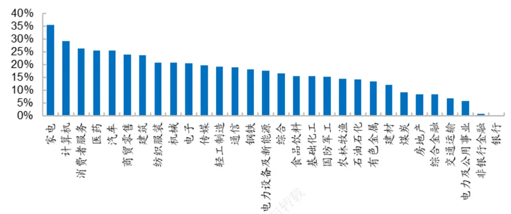
资料来源：Wind，海通证券研究所

随着无形资产在企业资本存量中变得愈发重要，我们认为，忽视这部分资产价值可能造成对公司资本的低估，导致那些研发投入高或在品牌维护方面支出较高的公司，PB过高。当我们使用 PB 选股时，就容易剔除家电、计算机、消费者服务、医药等无形资产占比较高的行业，选择周期行业，从而拖累股票组合或 PB 因子的业绩表现。

我们根据无形资产占比和 PB因子将全 A个股分别等分为 5 组，考察两个因子分组的交集组合相对于全 A等权组合的年超额收益（月均超额*12），结果如图 2所示。

图2 无形资产占比与 PB 交集组合的年化超额收益率（2013.01-2022.05）

|  | D1 | D2 | PB分组 D3 | 53973 D4 | D5 |
| --- | --- | --- | --- | --- | --- |
| D1 无形资产占比 | -0.4% | -5.1% | -5.3% | -7.3% | -10.7% |
|  | D2 | 2.5% 2.3% | 2.0% | -0.6% | -6.5% |
|  | D3 | 3.1% 5.6% | 3.3% | 2.5% | 4.6% |
|  | D4 3.7% | 5.1% | 1.7% | 1.8% | -4.1% |
|  | D5 | 1.4% | 4.2% | 0.3% | -29% |
| 全部 | 5.0% 2.0% | 1.6% | 1.4% | -0.1% | -4.9% |
| D5-D1 | 5.4% | 6.6% | 9.6% | 7.6% | 7.8% |
| 月胜率 | 56.6% | 60.2% | 58.4% | 65.5% | 59.3% |
| t值 | 1.98 | 2.49 | 3.15 | 2.44 | 2.19 |
| p值 | 0.051 | 0.014 | 0.002 | 0.016 | 0.031 |

资料来源：Wind，海通证券研究所

图3 无形资产调整后的 PB因子与传统 PB因子的截面相关系数（2013-2021）
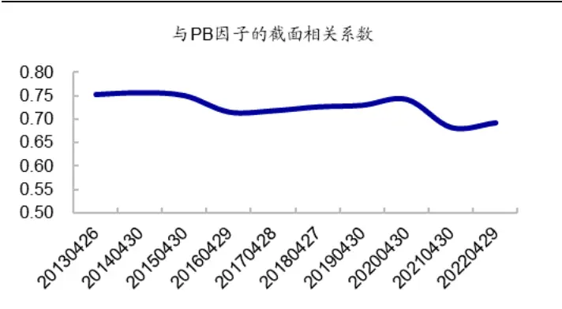
资料来源：Wind，海通证券研究所

从中可见，同样是属于 PB 最高的 20%股票，无形资产占比高的个股收益率显著高于无形资产占比低的股票，两者的年化多空收益差为 7.8%。因此，若我们在净资产 B上加入将无形资产，构建无形资产调整后的 PB因子（记为 PB_INT），则无形资产占比高的高 PB 个股可能就不再属于高估值组。在这种情况下，用 PB 去评价上市公司的估值水平，或许会更加准确。

横截面上， PB_INT 与 PB 因子相关性高，2022 年 4 月底相关系数为 0.69。因子与市值因子线性相关性较弱，头尾部股票市值均偏大。除此之外，PB_INT 与 ROE、SUE和预期净利润调整因子都呈一定的正相关关系。与 PB 因子相似，PB_INT 低的公司基本面（盈利、增长）弱于 PB_INT 高的公司。

图4 PB_INT 分组组合的平均风格暴露（2013.01-2022.05）
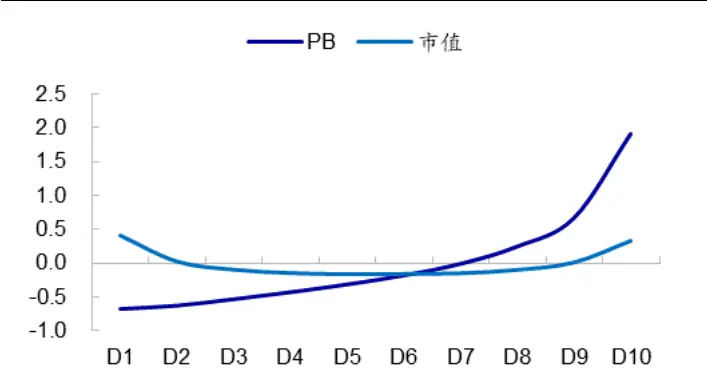
资料来源：Wind，海通证券研究所

图5 PB_INT 分组组合的基本面因子暴露（2013.01-2022.05）
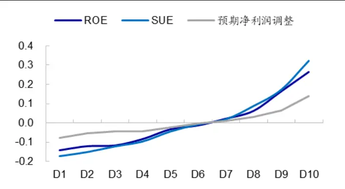
资料来源：Wind，海通证券研究所

表 1 PB_INT 与基本面因子的平均截面相关系数（2013.01-2022.05）

|  | 市值 | ROE | SUE | 预期净利润调整 |
| --- | --- | --- | --- | --- |
| PB_INT | 0.06 | 0.12 | 0.14 | 0.06 |
| PB | 0.04 | 0.11 | 0.12 | 0.05 |

资料来源： ，海通证券研究所

## 2. 无形资产调整后的 PB因子选股效果

## 2.1 单因子的选股效果

月度换仓，根据 PB_INT 因子将全 A个股等分为 10 组，每一组股票等权组合相对于全 A等权组合的年超额（月超额*12）如图 6所示。从分组收益来看，PB_INT 与股票收益显著负相关，PB_INT 越高，股票收益表现越差，因子分 10 组年化多空收益差为10.9%。与 PB因子相比，PB_INT 因子的多头收益更高，而空头收益更低。

图6 PB_INT 因子的分组收益（2013.01-2022.05）
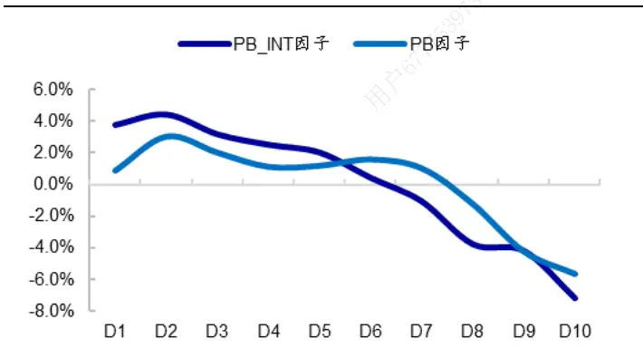
资料来源： ，海通证券研究所

图7 PB_INT 因子与 PB 因子多空收益的累计收益差(2013.01-2022.05)
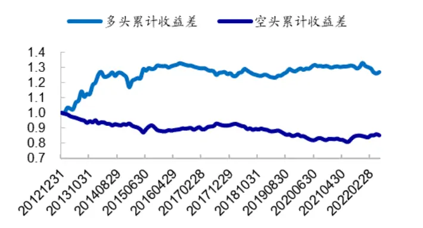
资料来源： ，海通证券研究所

计算 PB_INT 与股票下月收益率的相关系数，即 IC，累加后得到图 8。2013.01-2022.05，PB_INT 因子的月均 IC 为-0.027，统计显著。时间序列来看，PB_INT 因子与PB 因子的累计 IC走势较为接近，两者月度 IC 的相关系数高达 0.95。

分阶段来看，PB 因子表现优异时，如 2013.08-2019.04，2020.07-2022.05（称之为“价值风格”阶段），PB_INT 因子的表现也较为突出。相对而言，PB_INT 因子的选股效果（IC 表现和多空收益）略优于 PB因子，且波动率更低，稳定性更高（表 2）。

而 PB 因子表现较差、价值风格发生回撤时，如 2013.01-2013.07，2019.05-2020.06（称之为“成长风格”阶段），PB_INT 因子表现也较差，但回撤小于 PB因子。

图8 PB_INT 因子的累计 IC（2013.01-2022.05）
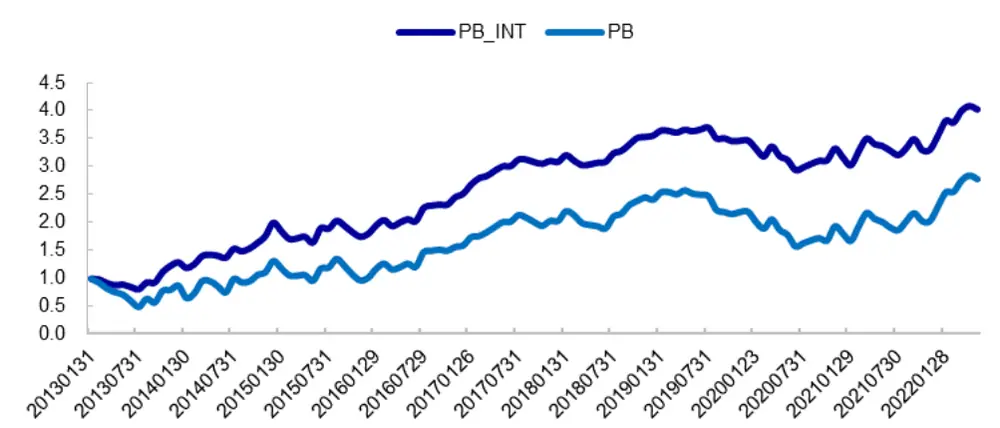
资料来源：Wind，海通证券研究所

表 2 PB_INT 因子的选股效果（2013.01-2022.05）

|  |  | 多空收益 |  |  |  |  | IC表现 |  |  |  |  |
| --- | --- | --- | --- | --- | --- | --- | --- | --- | --- | --- | --- |
|  |  | 年收益 | 波动率 | 月胜率 t值 | p值 |  | 月均IC | 波动率 | 月胜率 t值 | p值 |  |
| 全区间 | PB_INT | 10.9% | 5.3% | 59.3% | 1.84 | 0.068 | -0.027 | 10.8% | 60.2% | -2.64 | 0.009 |
|  | PB | 6.5% | 6.8% | 52.2% | 0.85 | 0.397 | -0.016 | 12.0% | 52.2% | -1.38 | 0.169 |
| 价值风格 | PB_INT | 17.7% | 5.4% | 64.1% | 2.61 | 0.011 | -0.043 | 10.6% | 66.3% | -3.87 | 0.000 |
|  | PB | 16.5% | 7.1% | 60.9% | 1.88 | 0.064 | -0.036 | 11.7% | 60.9% | -2.94 | 0.004 |
| 成长风格 | PB_INT | -18.5% | 3.8% | 38.1% | -1.86 | 0.078 | 0.043 | 8.7% | 33.3% | 2.29 | 0.033 |
|  | PB | -37.4% | 3.8% | 14.3% | -3.74 | 0.001 | 0.073 | 9.1% | 14.3% | 3.69 | 0.001 |

资料来源：Wind，海通证券研究所

综上所述，无形资产调整后的 PB因子在 PB因子表现优异时，波动率更低，信息比更高；而在 PB因子表现较差时，回撤更小。我们认为，相比于 PB因子，PB_INT 因子具有更高的稳定性，选股效果更优。

横截面上，正交 PB因子后（表 3），PB_INT 因子的选股收益略有下滑，但稳定性有所提升，波动率下降，月胜率增加。正交基本面、量价、预期等常见因子和行业后，PB_INT 因子的月均 IC 为-0.02，月胜率 72.6%，时间序列走势（图 9）更为平稳，统计显著。

图9 正交 PB_INT 和 PB 因子的累计 IC
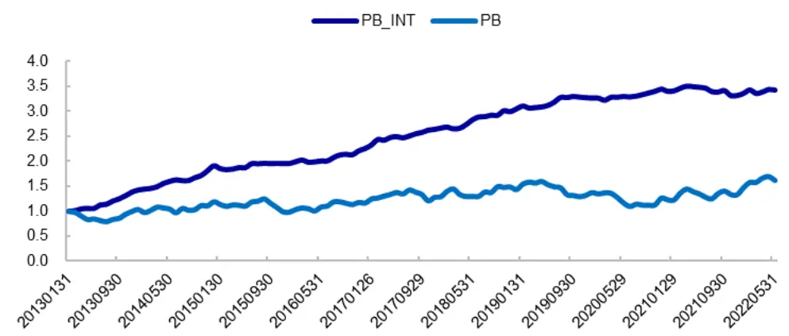
资料来源：Wind，海通证券研究所

表 3 正交 PB_INT 因子的选股效果（2013.01-2022.05）

|  | 多空收益 |  |  |  |  | IC 表现 |  |  |  |  |
| --- | --- | --- | --- | --- | --- | --- | --- | --- | --- | --- |
|  | 年收益 | 波动率 | 月胜率 | t值 | p值 | 月均IC | 波动率 | 月胜率 | t值 | p值 |
| 原始因子 | 10.9% | 5.3% | 59.3% | 1.84 | 0.068 | -0.027 | 10.8% | 60.2% | -2.64 | 0.009 |
| 正交 PB | 9.1% | 2.3% | 61.9% | 3.45 | 0.001 | -0.023 | 5.4% | 69.0% | -4.48 | 0.000 |
| 正交PB、及其他常 见因子和行业 | 8.7% | 1.6% | 71.7% | 4.76 | 0.000 | -0.021 | 3.8% | 72.6% | -5.99 | 0.000 |

资料来源： ，海通证券研究所

从 BINT 的构建过程可知，PB_INT 主要有两个参数，一个是增长率 g，另一个是折现率 δ，初始参数为 g=20%，δ=30%。下表展示了在不同参数下，PB_INT 因子的 IC表现。结果显示，因子 IC对参数的敏感性较低，原始因子的月均 IC 在-0.03 左右，正交因子的月均 IC在-0.02 左右。

表 4 不同参数下，PB_INT 因子的 IC 表现统计（2013.01-2022.05）

|  |  | 原始因子 |  | 正交常见因子、行业 |  |  |
| --- | --- | --- | --- | --- | --- | --- |
| 增长率 | 折现率 | 月均IC | 月胜率 | t值 | 月均IC 月胜率 | t值 |
| 0.1 | 0.1 | -0.031 | 60.2% | -2.99 | -0.025 72.6% | -6.08 |
|  | 0.2 | -0.029 | 60.2% | -2.82 | -0.023 71.7% | -6.08 |
|  | 0.3 | -0.027 | 60.2% | -2.65 | -0.022 72.6% | -5.99 |
| 0.2 | 0.1 | -0.031 | 59.3% | -3.00 | -0.024 73.5% | -6.19 |
|  | 0.2 | -0.029 | 60.2% | -2.81 | -0.023 70.8% | -6.08 |
|  | 0.3 | -0.027 | 60.2% | -2.64 | -0.021 72.6% | -5.99 |
| 0.3 | 0.1 | -0.030 | 59.3% | -2.90 | -0.023 71.7% | -5.87 |
|  | 0.2 | -0.029 | 60.2% | -2.79 | -0.023 70.8% | -6.11 |
|  | 0.3 | -0.027 | 60.2% | -2.64 | -0.021 72.6% | -5.98 |

资料来源：Wind，海通证券研究所

如前文所述，无形资产由知识资本（KC）和组织资本（OC）组成，我们将这两项分开，分别考察 KC调整 PB因子（PB_KC）、OC 调整 PB因子（PB_OC）的业绩表现，结果如下表所示。从中可见，分项调整 PB因子和无形资产调整后的 PB因子表现较为接近， 表现均统计显著。且 者相关性高，原始因子月度 的两两相关系数均在以上，正交因子的相关系数也都在 以上。相对而言， 因子略优于分项调整PB 因子。

表 5 知识资本和组织资本调整后的 PB因子选股效果统计（2013.01-2022.05）

|  |  | 分10组多空收益 |  |  |  | IC 表现 |  |  |  |  |
| --- | --- | --- | --- | --- | --- | --- | --- | --- | --- | --- |
|  |  | 年收益 | 月胜率 | 波动率 | t值 | p值 | 月均IC 月胜率 | 波动率 | t值 | p值 |
| 原始因子 正交PB、 | PB_INT | 10.9% | 59.3% | 5.3% | 1.84 | 0.068 | -0.027 | 60.2% 10.8% | -2.64 | 0.009 |
|  | PB_OC | 9.3% | 58.4% | 5.4% | 1.52 | 0.130 -0.023 | 54.0% | 11.0% | -2.22 | 0.029 |
|  | PB_KC | 9.9% | 57.5% | 5.1% | 1.72 | 0.088 | -0.022 57.5% | 9.8% | -2.39 | 0.019 |
|  | PB_INT | 8.7% | 71.7% | 1.6% | 4.76 | 0.000 | -0.021 72.6% | 3.8% | -5.99 | 0.000 |
| 常见因子 和行业 | PB_OC | 7.5% | 69.0% | 1.7% | 3.93 | 0.000 | -0.019 73.5% | 3.9% | -5.23 | 0.000 |
|  | PB_KC | 8.5% | 69.0% | 1.8% | 4.23 | 0.000 | -0.018 72.6% | 3.5% | -5.53 | 0.000 |

资料来源： ，海通证券研究所

## 2.2与其他常见估值因子选股效果的对比

除 PB以外，常见的估值因子还有 PE、股息率等，这些因子累计 IC走势整体非常接近，时间序列相关性高。其中，PB_INT 因子与 PB相关性最高，为 0.95；与 PE和股息率因子的相关系数也不低于 0.6，分别为 0.60 和 0.77。即整体来看，不同估值指标所反映的价值/成长风格较为接近。

图10 常见估值因子的累计 IC（2013.01-2022.05）
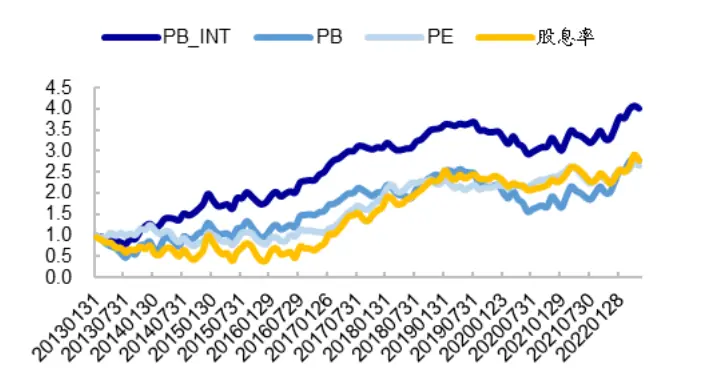
资料来源：Wind，海通证券研究所

图11 常见估值因子 IC 的相关系数（2013.01-2022.05）
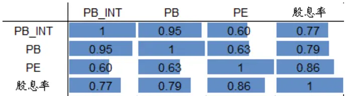
资料来源：Wind，海通证券研究所

从单因子多头收益角度来看，股息率因子表现最优。无论是原始因子、还是剥离了市值和行业影响后的因子，股息率的多头组合收益率都高于 PB和 PE因子。我们猜测，这也是很多价值型指数普遍以高股息形式出现的原因之一。

表 6 常见估值因子分 10 组多空收益统计（2013.01-2022.05）

| 原始因子 |  |  |  |  |  |  |
| --- | --- | --- | --- | --- | --- | --- |
|  | 多头收益 |  |  | 多空收益 |  |  |
|  | 年收益 | 波动率 t值 | p值 | 年收益 传播与转载 | 波动率 t值 | p值 |
| PB_INT | 3.8% | 3.1% 1.07 | 0.288 | 10.9% 5.3% | 1.84 | 0.068 |
| PB | 0.9% | 4.3% 0.18 | 0.854 | 6.5% 6.8% | 0.85 | 0.397 |
| PE | -1.9% 4.6% | -0.36 | 0.716 | 2.7% 6.1% | 0.39 | 0.695 |
| 股息率 | 2.1% 3.5% | 0.54 | 0.592 | 4.7% 3.8% | 1.01 | 0.317 |

正交常见因子（市值、价量、基本面、预期因子）和行业

|  | 多头收益 |  |  |  | 多空收益 |  |  |
| --- | --- | --- | --- | --- | --- | --- | --- |
|  | 年收益 | 波动率 t值 | 下载 p值 |  | 年收益 波动率 | t值 | p值 |
| PB_INT | 0.2% | 1.1% | 0.19 0.849 | 7.6% | 2.4% | 2.83 | 0.005 |
| PB | -4.0% | 1.3% -2.74 | 0.007 | 1.1% | 2.6% | 0.39 | 0.697 |
| PE | -7.4% | 1.3% | -4.88 0.000 | -5.9% | 1.9% | -2.82 | 0.006 |
| 股息率 | 3.4% | 2.0% 1.52 | 0.132 | 2.0% | 1.4% | 1.21 | 0.229 |

资料来源：Wind，海通证券研究所

但是从多因子模型角度来看，若线性剥离其它因子的影响，则 PB、PE、股息率这些常见估值因子并无突出的选股效果， 均不显著。即，这些因子的选股效果可以通过线性配臵其他因子来获得，对多因子模型无明显增量信息。而 PB_INT 因子剥离掉市值、基本面、预期、量价这些常见因子后，仍具有显著的 alpha，IC 均值为-0.02，t 值为-3.46。

表 7 常见估值因子的 IC 表现（2013.01-2022.05）

|  | 原始因子 |  |  |  |  | 正交常见因子和行业 |  |  |  |  |
| --- | --- | --- | --- | --- | --- | --- | --- | --- | --- | --- |
|  | IC 均值 | 月胜率 | 波动率 | t值 | p值 | IC 均值 | 月胜率 | 波动率 | t值 | p值 |
| PB_INT | -0.03 | 60.2% | 10.8% | -2.64 | 0.009 | -0.02 | 61.1% | 5.7% | -3.46 | 0.001 |
| PB | -0.02 | 52.2% | 12.0% | -1.38 | 0.169 | -0.01 | 49.6% | 6.1% | -0.96 | 0.339 |
| PE | -0.01 | 56.6% | 8.6% | -1.82 | 0.071 | 0.00 | 47.8% | 3.9% | 1.04 | 0.299 |
| 股息率 | 0.02 | 52.2% | 11.7% | 1.43 | 0.154 | 0.01 | 54.9% | 4.6% | 1.24 | 0.218 |

资料来源：Wind，海通证券研究所

将全 A个股根据市值划分为大、中、小盘，考察常见估值因子在这 3种股票池中的IC 表现，结果如表 8 所示。其中，市值最大的前 20%的个股称为大盘股，市值分位点处于 20%至 50%之间的称为中盘股，市值最小的 50%的个股称为小盘股。

原始因子角度，估值因子普遍在中盘股中表现最优，月均 IC 在 3%-4%左右，统计显著。大盘股中表现最优的估值因子是 PB_INT，而在小盘股中表现最优的因子是 PE和股息率。

正交因子角度，与全市场选股结论一致，表现最优的均为 PB_INT 因子，大中盘中的 IC 在 1%的臵信度下统计显著；其次为 PB因子，大、中盘股中的月均 IC 均为-0.014。而 PE、股息率这两个因子，线性剥离基本面、价量、预期等常见因子影响后，无显著选股效果。

表 8 大中小盘股票中，常见估值因子的 IC表现（2013.01-2022.05）

|  |  |  | PB_INT |  | PB |  | PE |  | 股息率 |  |  |
| --- | --- | --- | --- | --- | --- | --- | --- | --- | --- | --- | --- |
|  |  |  | 大盘 中盘 | 小盘 | 大盘 中盘 | 小盘 | 大盘 | 中盘 | 小盘 大盘 | 中盘 | 小盘 |
| 原始因 子 | 月均IC | -0.033 | -0.038 | -0.015 | -0.025 -0.033 | -0.007 | -0.012 | -0.034 | -0.021 0.014 | 0.026 | 0.021 |
|  | 月胜率 | 66.4% | 68.1% | 46.9% | 56.6% 53.1% | 47.8% | 56.6% | 66.4% | 57.5% | 57.5% 59.3% | 53.1% |
|  | 波动率 | 8.5% | 8.5% | 16.0% | 9.2% 11.8% | 18.6% | 6.6% | 7.9% | 14.9% 7.0% | 9.4% | 16.9% |
|  | t值 | -4.15 | -4.72 | -0.99 | -2.95 -2.95 | -0.43 | -2.02 | -4.58 | -1.51 2.11 | 2.90 | 1.34 |
|  | p值 | 0.000 | 0.000 | 0.326 | 0.004 0.004 | 0.671 | 0.046 | 0.000 | 0.133 0.037 | 0.004 | 0.183 |
| 正交因 子 | 月均IC | -0.023 | -0.027 | -0.015 | -0.014 -0.014 | 0.001 | 0.005 | -0.002 | 0.022 0.003 | 0.006 | 0.013 |
|  | 月胜率 | 60.2% | 70.8% | 54.9% | 57.5% | 61.1% 47.8% | 42.5% | 54.9% | 34.5% | 53.1% 54.0% | 52.2% |
|  | 波动率 | 7.9% | 5.1% | 9.8% | 7.4% 5.7% | 10.4% | 5.5% | 4.7% | 7.3% 6.0% | 4.6% | 8.4% |
|  | t值 | -3.13 | -5.51 | -1.67 | -1.96 | -2.55 0.11 | 1.02 | -0.37 | 3.25 | 0.55 1.31 | 1.60 |
|  | p值 | 0.002 | 0.000 | 0.098 | 0.052 0.012 | 0.913 | 0.311 | 0.716 | 0.002 0.582 | 0.193 | 0.113 |

资料来源：Wind，海通证券研究所
注：正交因子是指，因子正交市值、价量、基本面、预期因子和行业后的残差部分

综上所述，时间序列上，不同估值指标所反映的价值/成长风格走势较为接近。从单因子多头收益角度来看，股息率因子表现最优。从多因子模型角度来看，若线性剥离其他因子的影响，则 PB、PE、股息率这些常见估值因子并无明显选股效果，IC 不显著。而 PB_INT 因子仍具有显著的 alpha，IC 均值为-0.02，t 值为-3.46。

## 3. 基于无形资产的选股组合

## 3.1无形资产投入高的股票组合

中国经济正全面向高质量发展转型，可以预计，无形资产对于企业的重要性也会越来越高。特别是一些高新技术产业，研发投入在一定程度上反映了公司未来的发展潜力。如左下图所示，无形资产占比与股票收益率显著正相关，无形资产占比越低，收益表现越差。这一现象在消费+TMT 板块内更为明显，无形资产占比因子的多空收益显著高于全市场。

图12 无形资产占比因子分组收益（2013.01-2022.05）
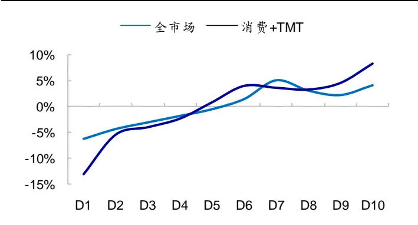
资料来源：Wind，海通证券研究所

图13 无形资产占比 top30 组合累计超额（2013.01-2022.05）
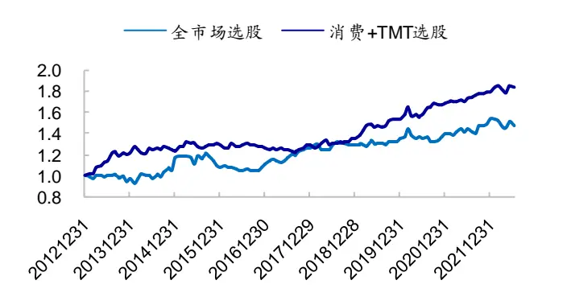
资料来源：Wind，海通证券研究所

月度再平衡，选择样本空间内（全 A/消费+TMT 板块）无形资产占比最高的 30 只股票构建等权组合，其相对于样本等权组合的累计超额收益如右上图所示。从中可见，

2019 年以来，无形资产占比高的股票超额收益逐渐凸显。尤其是消费+TMT 板块，每年超额收益均在 10%以上。由此可见，对于一些高新技术以及品牌价值比较大的产业，无形资产的投入不可忽视。

表 9 无形资产占比 top30 组合分年度收益率（2013.01-2022.05）

|  | 全市场选股 |  | 消费+TMT板块选股 |  |
| --- | --- | --- | --- | --- |
|  | 组合收益 | 超额收益 | 组合收益 | 超额收益 |
| 2013 | 21.1% | -1.5% | 73.1% | 32.7% |
| 2014 | 75.9% | 29.5% | 36.9% | 1.0% |
| 2015 | 68.4% | -11.8% | 104.9% | 5.9% |
| 2016 | -6.3% | 4.7% | -17.9% | -3.3% |
| 2017 | 0.1% | 14.1% | -12.7% | 2.1% |
| 2018 | -28.5% | 1.6% | -23.4% | 5.1% |
| 2019 | 35.5% | 7.5% | 59.1% | 23.7% |
| 2020 | 23.3% | 4.6% | 31.9% | 15.2% |
| 2021 | 44.9% | 18.1% | 30.9% | 13.3% |
| 2022 | -17.5% | -3.9% | -13.0% | 3.8% |
| 全区间 | 18.0% | 6.3% | 21.5% | 9.0% |

资料来源： ，海通证券研究所
注：超额收益为相对于样本空间个股等权组合的超额

## 3.2低估值组合

由前文可知，在公司账面价值 B上加上无形资产，所构建的 PB因子对于研发投入高、维护品牌支出较大的公司更为公平和合理。据此构建的低估值组合，行业分布应当更加均衡。

事实也确实如此。如下图所示，与传统 PB因子相比，PB_INT 因子的 top100 多头组合在汽车、机械、电子等这些无形资产较多的行业占比更高，而在金融和周期板块，如银行、房地产、煤炭、钢铁行业的占比更低。

图14 PB_INT 和 PB 因子 top100 组合的行业个股数分布（2019.01-2022.05）
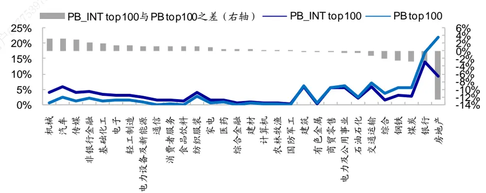
资料来源：Wind，海通证券研究所

图15 PB_INT 和 PB 因子 top100 组合的板块个股数分布（2019.01-2022.05）
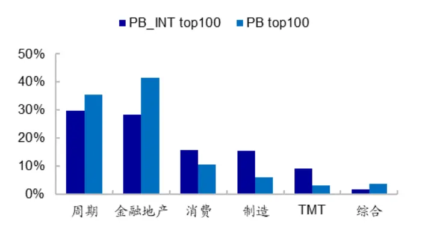
资料来源：Wind，海通证券研究所

图16 PB_INT 和 PB 因子 top100 组合各板块个股数占比之差(2019.01-2022.05)
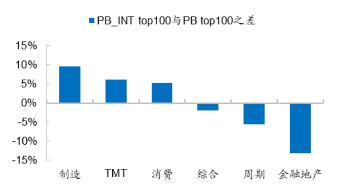
资料来源：Wind，海通证券研究所

从业绩表现来看，PB_INT top100 等权组合 2013 年以来年化收益 16.6%，相对于PB top100等权组合年超额2%。由于PB_INT头部个股的行业分布更加均衡，类似19-20年价值风格回撤时，PB_INT top100 组合相对于 PB top100 组合具有收益优势。

表 10 PB_INT top100 等权组合的收益率（2013.01-2022.05）

| PB_INT top100 | PB top100 |
| --- | --- |
| 2013 27.1% | -0.8% |
| 2014 86.7% | 96.4% |
| 2015 56.8% | 29.3% |
| 2016 2.6% | 6.9% |
| 2017 0.0% 人内部使户 | 11.4% |
| 2018 -24.9% | -20.3% |
| 2019 22.3% | 20.7% |
| 2020 1.3% 载 | 0.0% |
| 2021 18.2% | 17.2% |
| 2022 3.3% | 8.4% |
| 全区间 16.6% | 14.6% |

资料来源：Wind，海通证券研究所

## 3.3价值组合

在构建价值组合时，通常会用到估值因子，例如 PB-ROE 策略，基本思路是选择PB 低、同时 ROE高的股票构建组合。在海通量化团队的前期报告《构造 A股价值组合的三种范式》中，我们通过头部股票取交集的方式，构造的 PB-ROE优选组合具有较为优异的业绩表现。在这种用到 PB 因子的价值策略中，若用横截面比较上更为公平的PB_INT 因子作为替代，或许可以得到一个相对更为合理的结果。

首先，从行业分布（图 17）来看，传统的 PB-ROE 优选组合会更多地分布在房地产、非银金融等大金融板块，以及煤炭、钢铁、交运、电力及公用事业等周期板块。而经无形资产调整后的 PB 因子在估值比较上，对于研发投入大、广告支出多的公司相对更为公平。相应的 PB_INT-ROE 优选组合在医药、电子、计算机、机械等高新技术行业，以及食品饮料等广告投入大的行业中，股票数量更多。

图17 PB_INT-ROE 优选与 PB-ROE 优选组合的行业个股数分布（2019.01-2022.05）
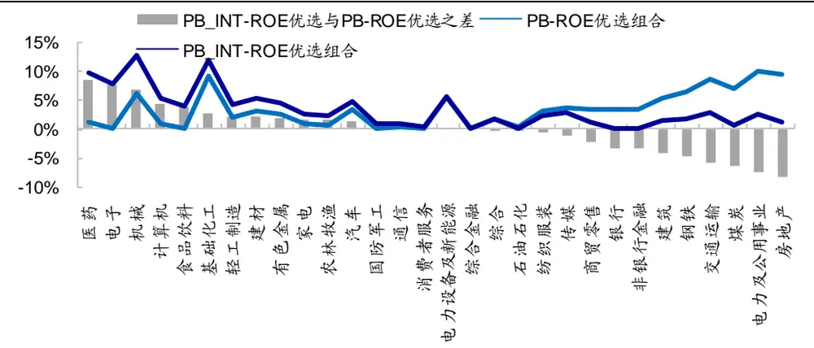
资料来源：Wind，海通证券研究所

从业绩表现来看，2013 年初至 2022 年 5 月，PB_INT-ROE 优选组合年化收益37.6%，同期 PB-ROE 优选组合年化收益 31.7%。即，采用 PB_INT 替代 PB 因子，策略年化收益可提升 5.9%。

表 11 PB_INT-ROE 优选和 PB-ROE 优选组合收益对比（2013.01-2022.05）

|  | 绝对收益 |  | 相对 wind 全 A 超额 | 相对普通股票型基金指数超额 |  |
| --- | --- | --- | --- | --- | --- |
|  | PB-ROE | PB_INT-ROE | PB-ROE PB_INT-ROE | PB-ROE | PB_INT-ROE |
| 2013 | 17.9% | 48.7% | 12.5% 43.2% | 2.4% | 33.2% |
| 2014 | 62.0% | 64.8% | 9.6% 12.3% | 38.3% | 41.1% |
| 2015 | 95.0% | 138.1% | 56.5% 99.6% | 48.0% | 91.1% |
| 2016 | 13.1% | 12.3% | 26.0% 25.3% | 25.5% | 24.7% |
| 2017 | 30.3% | 26.8% | 25.3% 21.9% | 14.2% | 10.7% |
| 2018 | -14.8% | -13.6% | 13.4% 14.6% | 9.5% | 10.7% |
| 2019 | 40.9% | 40.9% | 7.9% 7.9% | -6.2% | -6.1% |
| 2020 | 37.8% | 57.0% | 12.2% 31.4% | -20.3% | -1.1% |
| 2021 | 44.3% | 33.1% | 35.1% 24.0% | 34.7% | 23.5% |
| 2022 | 1.9% | -4.6% | 19.4% 13.0% | 20.1% | 13.6% |
| 全区间 | 31.7% | 37.6% | 23.0% 28.9% | 17.9% | 23.8% |

资料来源：Wind，海通证券研究所

分阶段来看，与单因子分析结果一致，在价值风格发生回撤时，PB_INT-ROE优选组合的相对回撤更小。如前文提到的 2013.01-2013.07 及 2019.05-2020.06，价值风格发生回撤。在这两个阶段，PB-ROE优选组合显著跑输普通股票型基金指数（885000），超额收益分别为-15.9%和-32.2%（图 18）。若使用 PB_INT 替代 PB，构建 PB_INT-ROE优选组合，则在这两个价值风格失效阶段，超额收益分别为 0.8%和-5.1%。组合仅在第二个价值风格回撤期，小幅跑输普通股票型基金指数，相对回撤明显减小。

图18 PB_INT-ROE优选组合相对普通股票型基金指数累计超额收益
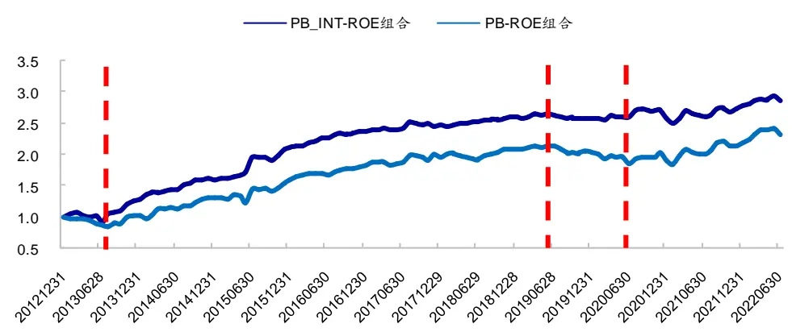
资料来源：Wind，海通证券研究所

综上所述，采用 因子替代 因子，可更为公平合理地对个股估值水平进行横截面比较。相应地，基于 PB_INT 因子所构造的价值策略（如 PB-ROE策略）具有更稳定、更优异的业绩表现。在价值风格发生回撤时，组合的相对回撤更小。

## 3.4指数增强组合

将 PB_INT 因子作为 alpha 因子加入多因子打分模型，可提升指数增强组合的超额收益，降低超额波动率，提升信息比和收益回撤比。分年度来看，绝大部分年份加入PB_INT 因子的组合都优于原增强组合。

表 12 加入 PB_INT 因子，指数增强组合的业绩表现（2013.04-2022.05）

| 沪深300 |  | 收益率 | 波动率 | 信息比 | 最大回撤 | 收益回撤比 | 月胜率 |
| --- | --- | --- | --- | --- | --- | --- | --- |
|  | 原模型 | 12.2% | 4.9% | 2.29 | 4.8% | 2.57 | 70.9% |
| 指数增强 | +PB_INT | 12.8% | 4.6% | 2.50 | 4.3% | 3.01 | 73.6% |
| 中证500 | 原模型 | 20.0% | 6.2% | 2.84 | 7.1% | 2.80 | 78.2% |
| 指数增强 | +PB_INT | 20.6% | 6.1% | 2.96 | 7.1% | 2.88 | 80.0% |

资料来源：Wind，海通证券研究所

表 13 加入 PB_INT 因子前后，指数增强组合分年度超额收益（2013.04-2022.05）

|  | 沪深 300 指数增强 |  | 中证 500 指数增强 |  |  |
| --- | --- | --- | --- | --- | --- |
|  | 原模型 | +PB_INT因子 | 收益变化 | 原模型 +PB_INT 因子 | 收益变化 |
| 2013 | 9.9% | 10.5% | 0.6% | 21.8% 21.7% | -0.1% |
| 2014 | 19.4% | 20.8% | 1.4% | 30.1% 34.7% | 4.6% |
| 2015 | 29.8% | 29.7% | 0.0% | 48.8% 51.3% | 2.5% |
| 2016 | 9.0% | 9.5% | 0.5% | 17.1% 17.8% | 0.8% |
| 2017 | 10.4% | 9.4% | -1.0% | 12.6% 13.5% | 0.9% |
| 2018 | 3.8% | 3.2% | -0.6% | 9.1% 8.3% | -0.8% |
| 2019 | 5.3% | 5.8% | 0.5% | 12.9% 12.1% | -0.8% |
| 2020 | 25.0% | 25.9% | 0.9% | 21.8% 21.9% | 0.0% |
| 2021 | 5.1% | 7.8% | 2.7% | 23.3% 24.1% | 0.8% |
| 2022 | 3.1% | 3.6% | 0.5% | 2.1% 2.3% | 0.2% |
| 全区间 | 12.2% | 12.8% | 0.6% | 20.0% 20.6% | 0.6% |

资料来源：Wind，海通证券研究所

## 4. 总结

近年来，无形资产已成为企业资本存量中重要且快速增长的一部分。这些内部创造的无形资产是公司总资本的重要组成部分，会对公司未来收入/现金流产生影响。而大部分无形资产是通过对员工、品牌和知识资本的投资而创造，这些投资是企业支出，因此不会出现在资产负债表上，这有可能导致对公司股权资本的低估。本文首先定义并计算了 A股的无形资产，在此基础上构建无形资产调整后的 PB 因子（PB_INT），考察它的选股效果。

无形资产调整后的 PB因子累计 IC走势与传统 PB因子较为接近，两者月度 IC相关系数达 0.95。这表明，与 PB 因子相似，PB_INT 因子也能捕获市场的“价值效应”。相较而言，PB_INT 因子在 PB 因子表现优异时，具有更高的稳定性，波动率更低，而信息比更高；在 PB因子表现较差时，回撤更小。

时间序列上，不同估值指标所反映的价值/成长风格走势较为接近。从单因子多头收益角度来看，股息率因子表现最优。从多因子模型角度来看，若线性剥离其它因子的影响，则 PB、PE、股息率这些常见估值因子并无突出的选股效果，IC不显著。即，这些因子的选股效果可以通过线性配臵其它因子来获得，对多因子模型无明显增量信息。而PB_INT 因子剥离掉市值、基本面、预期、量价这些常见因子后，仍具有显著的 alpha，IC 均值为-0.02，t 值为-3.46。

横截面角度，PB_INT 和 PB 因子在大盘中的选股效果最优，原始因子和正交因子的 IC 表现均统计显著。至于 PE 和股息率，原始因子在中盘股中的表现最优，统计显著；但线性剥离基本面、价量、预期等因子影响后，IC 表现不再显著。

我们基于无形资产和 PB_INT 构建了 4个选股组合。

（1）无形资产投入高的股票组合。对于一些高新技术以及品牌价值比较大的产业，无形资产的投入不可忽视。2019 年以来，消费+TMT 板块，无形资产占比高的股票超额收益逐渐显现，每年相对于样本等权组合均可获得 10%以上的超额收益。

（2）低估值组合。在比较公司的估值水平时，与传统 PB 因子相比，无形资产调整后的 PB因子对于研发支出高、广告投入大的公司更为公平、合理，因子所选出的多头个股行业分布更为均衡。

（3）价值组合。在构建价值型的组合时，采用 PB_INT 因子替代 PB因子，可更为公平合理地比较个股的估值水平，得到的价值组合（如 PB-ROE 优选组合）在价值风格失效时，相对回撤更小，具有更稳定、更优异的业绩表现。

（4）指数增强组合。正交常见因子后，PB_INT 因子的选股收益仍然显著，将其作为 alpha 因子加入到多因子打分模型中，可改善指数增强组合的业绩表现。

## 5. 风险提示

模型误设风险，历史统计规律失效风险。

# 信息披露

分析师声明

[Table冯佳睿yst金融工程研究团队s]

罗蕾金融工程研究团队

本人具有中国证券业协会授予的证券投资咨询执业资格，以勤勉的职业态度，独立、客观地出具本报告。本报告所采用的数据和信息均来自市场公开信息，本人不保证该等信息的准确性或完整性。分析逻辑基于作者的职业理解，清晰准确地反映了作者的研究观点，结论不受任何第三方的授意或影响，特此声明。

## 法律声明

本报告仅供海通证券股份有限公司（以下简称“本公司”）的客户使用。本公司不会因接收人收到本报告而视其为客户。在任何情况下，本报告中的信息或所表述的意见并不构成对任何人的投资建议。在任何情况下，本公司不对任何人因使用本报告中的任何内容所引致的任何损失负任何责任。

本报告所载的资料、意见及推测仅反映本公司于发布本报告当日的判断，本报告所指的证券或投资标的的价格、价值及投资收入可能载会波动。在不同时期，本公司可发出与本报告所载资料、意见及推测不一致的报告。

市场有风险，投资需谨慎。本报告所载的信息、材料及结论只提供特定客户作参考，不构成投资建议，也没有考虑到个别客户特殊的可投资目标、财务状况或需要。客户应考虑本报告中的任何意见或建议是否符合其特定状况。在法律许可的情况下，海通证券及其所属不关联机构可能会持有报告中提到的公司所发行的证券并进行交易，还可能为这些公司提供投资银行服务或其他服务。用

本报告仅向特定客户传送，未经海通证券研究所书面授权，本研究报告的任何部分均不得以任何方式制作任何形式的拷贝、复印件或内复制品，或再次分发给任何其他人，或以任何侵犯本公司版权的其他方式使用。所有本报告中使用的商标、服务标记及标记均为本公本司的商标、服务标记及标记。如欲引用或转载本文内容，务必联络海通证券研究所并获得许可，并需注明出处为海通证券研究所，且不得对本文进行有悖原意的引用和删改。载，

根据中国证监会核发的经营证券业务许可，海通证券股份有限公司的经营范围包括证券投资咨询业务。日

## 海通证券股份有限公司研究所[Table_PeopleInfo]

路 颖所长

(021)23219403 luying@htsec.com

高道德 副所长(021)63411586 gaodd@htsec.com

邓 勇副所长

(021)23219404 dengyong@htsec.com

| 荀玉根 副所长 | 涂力磊 所长助理 | 余文心 所长助理 |
| --- | --- | --- |
| (021)23219658 xyg6052@htsec.com | (021)23219747 tll5535@htsec.com | (0755)82780398 ywx9461 @htsec.com |

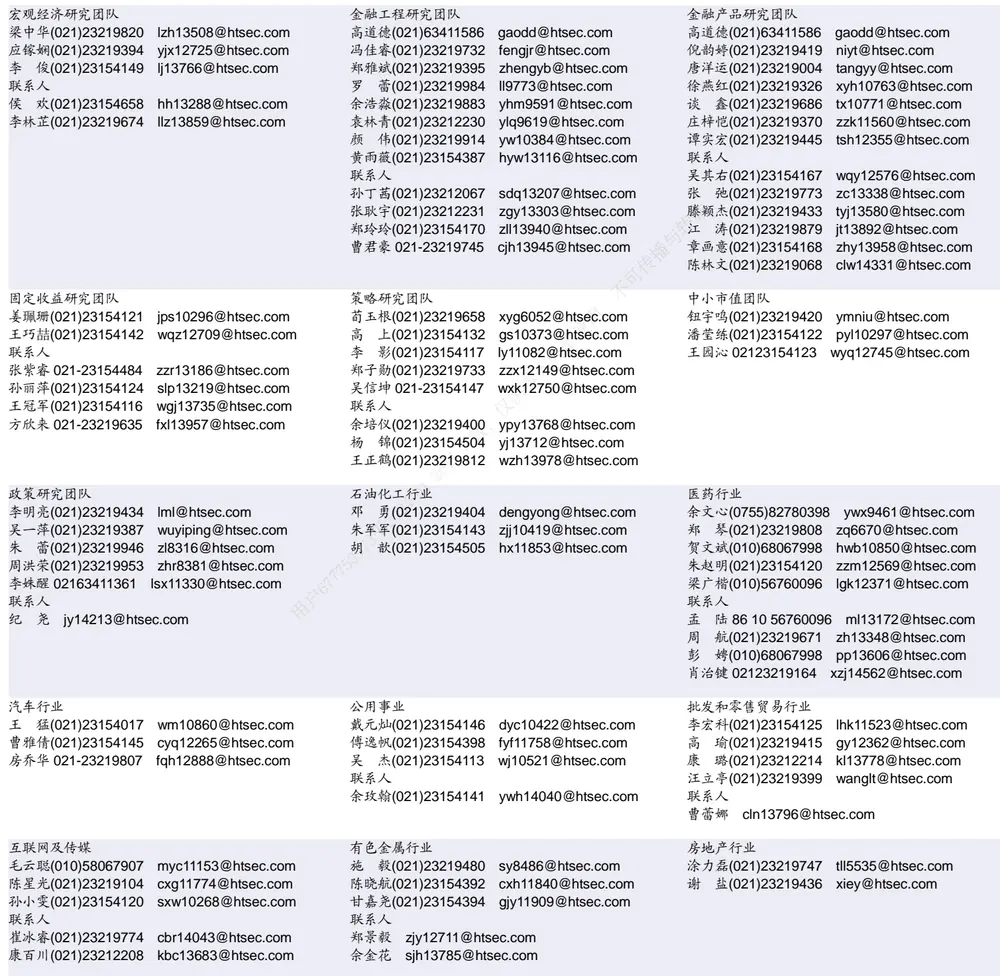

| 电子行业 |  | 煤炭行业 |  |  | 电力设备及新能源行业 张一弛(021)23219402 |  |
| --- | --- | --- | --- | --- | --- | --- |
| 李 轩(021)23154652 肖隽翀(021)23154139 华晋书 02123219748 | lx12671@htsec.com xjc12802@htsec.com hjs14155@htsec.com | 王 | 李 淼(010)58067998 涛(021)23219760 吴 杰(021)23154113 | Im10779@htsec.com wt12363@htsec.com wj10521@htsec.com | 房 青(021)23219692 徐柏乔(021)23219171 | zyc9637@htsec.com fangq@htsec.com xbq6583@htsec.com |
| 联系人 文 灿(021)23154401 薛逸民(021)23219963 | wc13799@htsec.com xym13863@htsec.com |  |  |  | 张 磊(021)23212001 联系人 | zl10996@htsec.com |
| 基础化工行业 | 李 潇(010)58067830 lx13920@htsec.com |  |  |  | 姚望洲(021)23154184 柳文韬(021)23219389 吴锐鹏 wrp14515@htsec.com | ywz13822@htsec.com Iwt13065@htsec.com |
| 刘 威(0755)82764281 | Iw10053@htsec.com zcc11726@htsec.com |  | 计算机行业 郑宏达(021)23219392 | zhd10834@htsec.com | 通信行业 |  |
| 李 智(021)23219392 | 张翠翠(021)23214397 孙维容(021)23219431 swr12178@htsec.com |  | 杨 林(021)23154174 于成龙(021)23154174 | yl11036@htsec.com ycl12224@htsec.com | 余伟民(010)50949926 杨彤昕 010-56760095 | ywm11574@htsec.com ytx12741@htsec.com |
|  | lz11785@htsec.com | 联系人 | 洪 琳(021)23154137 杨 蒙(0755)23617756 | hl11570@htsec.com ym13254@htsec.com | 联系人 夏 凡(021)23154128 | xf13728@htsec.com |
| 非银行金融行业 何 婷(021)23219634 |  | 交通运输行业 | 虞 楠(021)23219382 yun@htsec.com |  |  |  |
| 任广博(010)56760090 孙 婷(010)50949926 | ht10515@htsec.com |  | 罗月江(010）56760091 lyj12399@htsec.com |  | 纺织服装行业 |  |
| 联系人 | rgb12695@htsec.com st9998@htsec.com |  |  |  | 梁 希(021)23219407 | lx11040@htsec.com |
| 曹 锟 010-56760090 |  |  | 陈 宇(021)23219442 cy13115@htsec.com |  | 盛 开(021)23154510 | sk11787@htsec.com |
| 建筑建材行业 | ck14023@htsec.com |  |  |  |  |  |
| 冯晨阳(021)23212081 |  | 机械行业 |  |  | 钢铁行业 |  |
| 潘莹练(021)23154122 | fcy10886@htsec.com |  | 佘炜超(021)23219816 |  |  |  |
| 申 浩(021)23154114 | pyl10297@htsec.com |  | 赵玥炜(021)23219814 赵靖博(021)23154119 | swc11480@htsec.com zyw13208@htsec.com | 刘彦奇(021)23219391 | liuyq@htsec.com |
| 颜慧菁 yhj12866@htsec.com | sh12219@htsec.com |  |  | zjb13572@htsec.com | 周慧琳(021)23154399 | zhl11756@htsec.com |
|  |  | 联系人 |  | lqw14384@htsec.com 传播与 |  |  |
|  |  | 刘绮雯(021)23154659 |  |  |  |  |
| 建筑工程行业 |  | 食品饮料行业 |  |  |  |  |
| 张欣劫 zxj12156@htsec.com |  |  |  |  |  |  |
| 联系人 |  |  | 颜慧菁 yhj12866@htsec.com |  | 军工行业 |  |
|  |  |  |  |  | 张恒晅 zhx10170@htsec.com |  |
| 曹有成(021)63411398 cyc13555@htsec.com |  |  | 张宇轩(021)23154172 | zyx11631@htsec.com | 联系人 |  |
|  |  |  | 程碧升(021)23154171 | cbs10969@htsec.com | 刘砚菲 021-2321-4129 | lyf13079@htsec.com |
|  |  |  |  |  | 胡舜杰(021)23154483 | hsj14606@htsec.com |
| 银行行业 |  |  |  |  |  |  |
| 林加力(021)23154395 |  | 社会服务行业 |  |  | 家电行业 |  |
| 联系人 | ljl12245@htsec.com | 汪立亭(021)23219399 |  | wanglt@htsec.com | 陈子仪(021)23219244 | chenzy@htsec.com |
| 董栋梁(021) 23219356 |  | 许樱之(755)82900465 |  | xyz11630@htsec.com | 李 阳(021)23154382 | ly11194@htsec.com |
|  | ddl13206@htsec.com | 联系人 |  |  | 朱默辰(021)23154383 | zmc11316@htsec.com |
| 徐凝碧(021)23154134 xnb14607@htsec.com |  | 毛弘毅(021)23219583 | 王祎婕(021)23219768 | mhy13205@htsec.com wyj13985@htsec.com | 刘 璐(021)23214390 | II11838@htsec.com |

## 造纸轻工行业

郭庆龙 gql13820@htsec.com 高翩然 gpr14257@htsec.com 吕科佳 lkj14091@htsec.com 联系人 王文杰 wwj14034@htsec.com

## 研究所销售团队

深广地区销售团队
伏财勇(0755)23607963 fcy7498@htsec.com蔡铁清(0755)82775962 ctq5979@htsec.com辜丽娟(0755)83253022 gulj@htsec.com
刘晶晶(0755)83255933 liujj4900@htsec.com饶 伟(0755)82775282 rw10588@htsec.com欧阳梦楚(0755)23617160
oymc11039@htsec.com
巩柏含 gbh11537@htsec.com
滕雪竹 0755 23963569 txz13189@htsec.com张馨尹 0755-25597716 zxy14341@htsec.com
上海地区销售团队
胡雪梅(021)23219385 huxm@htsec.com
黄 诚(021)23219397 hc10482@htsec.com
季唯佳(021)23219384 jiwj@htsec.com
黄 毓(021)23219410 huangyu@htsec.com
李 寅 021-23219691 ly12488@htsec.com
胡宇欣(021)23154192 hyx10493@htsec.com
马晓男 mxn11376@htsec.com
邵亚杰 23214650 syj12493@htsec.com
杨祎昕(021)23212268 yyx10310@htsec.com
毛文英(021)23219373 mwy10474@htsec.com
谭德康 tdk13548@htsec.com
王祎宁(021)23219281 wyn14183@htsec.com
北京地区销售团队
朱 健(021)23219592 zhuj@htsec.com
殷怡琦(010)58067988 yyq9989@htsec.com
郭 楠 010-5806 7936 gn12384@htsec.com
杨羽莎(010)58067977 yys10962@htsec.com
张丽萱(010)58067931 zlx11191@htsec.com
郭金垚(010)58067851 gjy12727@htsec.com
张钧博 zjb13446@htsec.com
高 瑞 gr13547@htsec.com
上官灵芝 sglz14039@htsec.com
董晓梅 dxm10457@htsec.com

海通证券股份有限公司研究所

地址：上海市黄浦区广东路 689号海通证券大厦 9楼

电话：（021）23219000

传真：（021）23219392

网址：www.htsec.com