## [Tab相关研究

[Table_ReportInfo]《中证 1000 股指期货上市，量化对冲的 春天来了？》2022.08.12

《进击的广发基金：一场影响深远的投研升级改革》2022.08.05

《抗击新冠生力军——布局后疫情时代疫苗产业》2022.08.05

分析师:冯佳睿

Tel:(021)23219732

Email:fengjr@htsec.com

证书:S0850512080006

分析师:罗蕾

Tel:(021)23219984

Email:ll9773@htsec.com

证书:S0850516080002

# 选股因子系列研究（八十三）——盈利加速的定量刻画与高增长组合的构建

## 投资要点：

盈利加速因子，衡量的是从一个季度到下一个季度盈利增速的变化。其中，盈利增速用标准化的 EPS同比变化来表示，即 EPS的同比变化除以对比基数。对比基数可以采用：去年同期 EPS 的绝对值（EAA）、上季度末的股价（EAP）、最近 8 个季度 EPS的标准差（EAV）。

不同盈利加速公司的特征。盈利加速因子与市值、估值及价量类因子相关性较低。在基本面因子中，盈利加速与增长类因子的线性相关性较为明显，而与盈利水平本身的线性相关性较弱。盈利增长加速的公司，平均增速和净利润调整幅度均高于盈利增长减速的公司。从行业分布来看，与全 个股相比，盈利加速公司更多地分布在基础化工、电力设备及新能源、通信、计算机、传媒等高新技术行业。

- 盈利加速因子的选股效果。盈利加速因子与股票收益显著正相关，即使剥离常见因子的影响，该因子仍存在显著的选股效果。 年初至 ，原始因子分 组年化多空收益 ，月均 C为 ，月胜率 ；正交因子年化多空收益 ，月均 C为 ，月胜率 ，统计显著。相对而言，在大盘股、高增长股票集中，选股效果更优。盈利加速因子与股票收益之间的正相关关系，可能源于盈利加速对公司未来增长的增量预测能力。

- 高增长组合。在高增长股票集中，盈利加速公司的收益优势更为明显，因子分 10组年化多空收益达 10.3%。因此，我们可以利用盈利加速因子提升高增长组合的业绩表现。具体地，将盈利加速、SUE、预期净利润调整等反映公司增长的因子等权加总，构建复合增长因子，选择得分最高的 50 只股票构建等权组合。2013年初至 2022.07，高增长组合年化收益 34.2%，相对于 wind 全 A 指数年超额25.4%。而且，利用高频因子可进一步增厚高增长组合的业绩表现。

小市值+高增长组合。在增长因子打分模型中加入小市值因子，选择复合因子得分最高的 50 只股票构建小市值+高增长组合。该组合自 2013 年初至 2022.07（下同）年化收益 43.4%，相对于国证 2000 指数年化超额 32.1%。与原高增长组合相比，该组合在小市值因子上的暴露更高。小市值+高增长组合在小盘风格较强的 2013-2015 年和 2021-2022 年，明显优于原组合；而在大盘风格走强的2017-2020 年，表现也弱于原组合。

- 大小盘中的高增长组合。在全 A 市值最小的 30%股票池里，选择增长复合因子得分最高的 50 只股票构建小盘中的高增长组合。该组合 2013 年以来年化收益39.5%，相对于国证 2000 指数年化超额 28.2%。按照同样的方式构建大盘中的高增长组合，该组合 13 年以来年化收益 24.0%，相对于沪深 300 指数年化超额19.3%。

偏成长风格的小市值 高增长组合。如果想进一步放大成长风格，可在选股过程中加入估值指标。考虑到 因子选股效果不稳定，所以我们未采用直接将其加入复合打分的方式，而是采用事前剔除低 PB 个股的方式来实现。偏成长风格的小市值 高增长组合的高估值成长属性更突出。该组合在成长风格较强的 年初至 ，累计收益 ，明显优于未进行低估值剔除的组合（ ）。同样地，在价值风格走强的 ，累计收益，表现弱于未进行低估值剔除的组合（ ）。

- 风险提示。历史统计规律失效风险，因子失效风险。

本文定义了盈利加速因子，该因子与股票收益显著正相关。即使剥离盈利和 SUE影响后，该因子仍存在显著的选股效果。盈利加速因子与股票收益之间的正相关关系，可能源于盈利加速对公司未来增长的增量预测能力。2012Q3- 2021Q1，未来 1-4个季度净利润增速对单季度盈利加速因子的截面回归结果显示，盈利加速因子越大，公司未来的平均净利润增速越高。最后，我们基于盈利加速及几个常见增长因子，构建了风格特征较为明确的高增长组合。

## 1.盈利加速的定量刻画

盈利加速（Earnings acceleration），衡量的是从一个季度到下一个季度盈利增速的变化。具体地，t季度的盈利加速因子等于，t 季度的盈利增速减去 t-1季度的盈利增速。其中，盈利增速用标准化的 EPS 同比变化来表示，即 EPS 的同比变化除以对比基数。

我们考虑了三种用于衡量盈利增速的对比基数：t-4 季度每股收益的绝对值（EGA）、t-1 季度末的股价（EGP）以及最近 8 个季度（包括第 t 季度）EPS的标准差（EGV）。相应的盈利加速因子分别记之为 EAA、EAP和 EAV：

$$
\mathrm{EAA_{i,t}=EGA_{i,t}-EGA_{i,t-1}=\frac{EPS_{i,t}-EPS_{i,t-4}}{\left|EPS_{i,t-4}\right|}-\frac{EPS_{i,t-1}-EPS_{i,t-5}}{\left|EPS_{i,t-5}\right|}},
$$

$$
\mathrm{EAP_{i,t}=EGP_{i,t}-EGP_{i,t-1}=\frac{EPS_{i,t}-EPS_{i,t-4}}{StockPrice_{i,t-1}}-\frac{EPS_{i,t-1}-EPS_{i,t-5}}{StockPrice_{i,t-2}}},
$$

$$
\mathrm{EAV_{i,t}=EGV_{i,t}-EGV_{i,t-1}=\frac{EPS_{i,t}-EPS_{i,t-4}}{SDEPS_{i,t}}-\frac{EPS_{i,t-1}-EPS_{i,t-5}}{SDEPS_{i,t-1}}}.
$$

图 1 展示了盈利加速因子与常见因子的平均截面相关系数，从中可见，该因子与市值、估值及价量类因子相关性较低。在基本面因子中，其与增长类因子的线性相关性较为明显。盈利增长加速的公司，平均增速和净利润调整幅度均高于盈利增长减速的公司。但盈利加速因子与盈利水平本身的线性相关性相对较弱，盈利增长加速公司的平均盈利水平与全市场平均水平无异；盈利增长大幅减速的公司，盈利水平相对较差。

图1 盈 利 加 速 因 子 与 常 见 因 子 的 平 均 截 面 相 关 系 数（2013.01-2022.07）
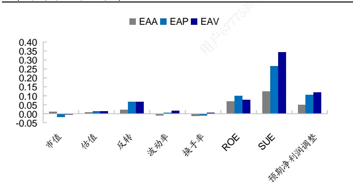
资料来源： ，海通证券研究所

图2 盈利加速因子分组的平均 ROE 暴露（2013.01-2022.07）
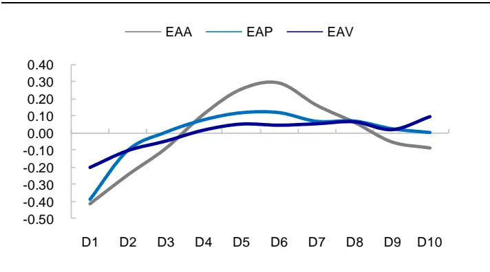
资料来源： ，海通证券研究所

图3 盈利加速因子分组的平均 SUE 暴露（2013.01-2022.07）
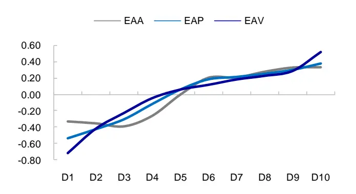
资料来源：Wind，海通证券研究所

图4 盈 利 加 速 因 子 分 组 的 平 均 预 期 净 利 润 调 整 暴 露（2013.01-2022.07）
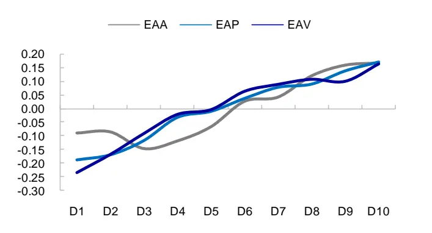
资料来源：Wind，海通证券研究所

下图展示了 2022 年 1 季度 EAV 因子得分最高 1/10 股票的行业分布。与全 A 个股相比，盈利加速公司更多地分布在基础化工、电力设备及新能源、通信、计算机、传媒等高新技术行业。

图5 EAV 因子得分最高 1/10股票的行业分布（2022Q1）
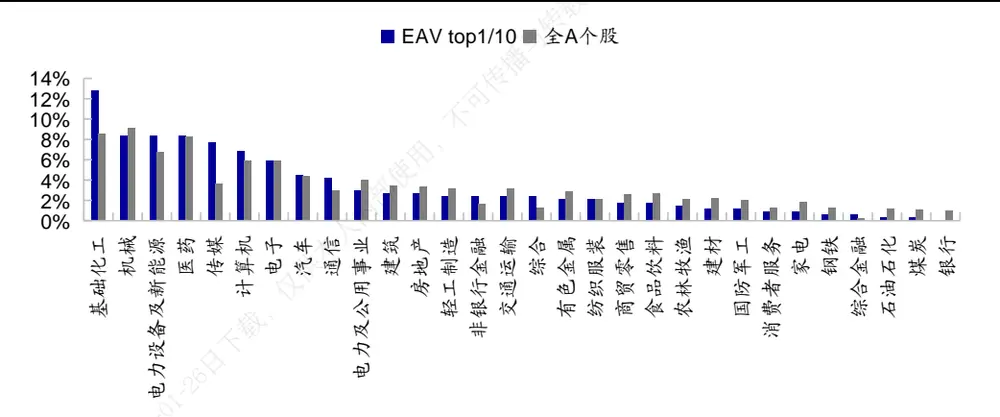
资料来源：Wind，海通证券研究所

## 2.盈利加速因子的选股效果

左下图统计了盈利加速因子分 10 组后，每个组合相对于全 A等权组合的年化超额收益率（月均超额*12）。整体来看，盈利加速因子越大，股票未来收益表现越优。相对而言，EAP和 EAV因子的选股效果优于 EAA因子。EAP和 EAV因子的年化多头超额收益在 5%左右，年化多空收益在 10%左右，均统计显著。EAP 和 EAV因子的月均 IC为 0.02 左右，月胜率 70%以上，同样都统计显著。

图6 盈利加速因子分组的年超额收益（2013.01-2022.07）
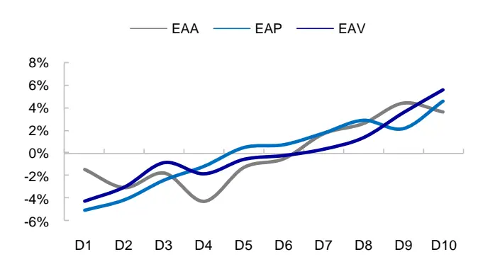
资料来源：Wind，海通证券研究所

图7 EAV 因子的累计 IC（2013.01-2022.07）
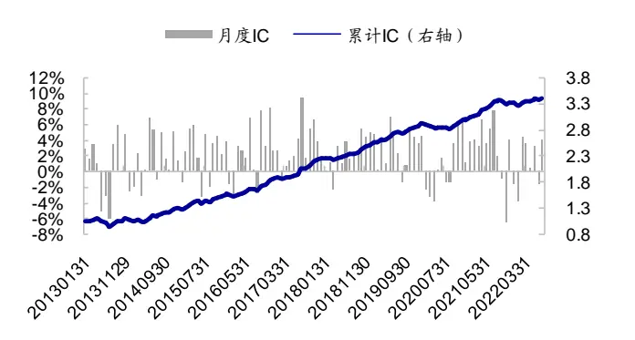
资料来源：Wind，海通证券研究所

表 1 盈利加速因子的选股收益（2013.01-2022.07）

|  |  | 年收益/月均IC | 月胜率 | 波动率 | t值 | p值 |
| --- | --- | --- | --- | --- | --- | --- |
| 多头收益 | EAA | 3.6% | 60.0% | 1.1% | 2.91 | 0.004 |
|  | EAP | 4.6% | 61.7% | 1.8% | 2.31 | 0.023 |
|  | EAV | 5.5% | 64.3% | 1.0% | 5.13 | 0.000 |
| 多空收益 | EAA | 5.1% | 64.3% | 1.4% | 3.21 | 0.002 |
|  | EAP | 9.6% | 68.7% | 1.6% | 5.32 | 0.000 |
|  | EAV | 9.7% | 73.0% | 1.5% | 5.92 | 0.000 |
| IC 表现 | EAA | 0.009 | 60.9% | 2.8% | 3.22 | 0.002 |
|  | EAP | 0.022 | 71.3% | 4.0% | 6.08 | 0.000 |
|  | EAV | 0.021 | 76.5% | 3.3% | 6.91 | 0.000 |

资料来源：Wind，海通证券研究所

由于盈利加速因子与增长类因子相关性较高，为剥离其他因子影响，考察该因子的增量信息，我们将盈利加速因子对常见风格、基本面、预期类、价量类因子及行业进行正交处理，所得因子的选股效果如下表所示。

表 2 正交盈利加速因子的选股收益（2013.01-2022.07）

|  | 多头收益 |  |  |  | 多空收益 |  |  |  | IC 表现 |  |  |  |
| --- | --- | --- | --- | --- | --- | --- | --- | --- | --- | --- | --- | --- |
|  | 年收益 | 月胜率 | 波动率 | t值 | 年收益 | 月胜率 | 波动率 | t值 | 月均IC | 月胜率 | 波动率 | t值 |
| EAP | 2.2% | 54.8% | 1.7% | 1.16 | 6.1% | 66.1% | 1.4% | 3.81*** | 0.01 | 61.7% | 3.1% | 2.82*** |
| EAV | 2.7% | 58.3% | 0.9% | 2.87*** | 4.8% | 58.3% | 1.3% | 3.18*** | 0.01 | 62.6% | 2.9% | 3.36*** |

资料来源：Wind，海通证券研究所

正交后，盈利加速因子的分组收益有所下滑，但仍统计显著。相对而言， 因子的多头收益更为稳定。正交EAV因子年化多空收益4.8%，月均IC为0.01，月胜率62.6%。下文中，我们主要以 EAV为例，来考察盈利加速因子的选股效果。

下表展示了盈利加速因子在不同市值股票集中的有效性。其中，大盘为市值最大的20%股票，中盘为市值分位点处于 20%-50%之间的股票，小盘为市值最小的 50%股票。结果显示，盈利加速异象在不同市值股票集中，均显著存在。若线性剥离常见因子影响，EAV 因子在大盘中的选股效果最优，边际增量信息最多。

表 3 不同市值股票集中，EAV 因子的选股收益（2013.01-2022.07）

| 原始因子 |  |  |  |  |  |  |  |  |  |  |  |
| --- | --- | --- | --- | --- | --- | --- | --- | --- | --- | --- | --- |
|  | 多头收益 |  |  |  | 多空收益 |  |  | IC 表现 |  |  |  |
|  | 年收益 | 月胜率 | 波动率 | t值 | 年收益 | 月胜率 波动率 | t值 | 月均IC | 月胜率 | 波动率 | t值 |
| 大盘 | 7.3% | 56.5% | 2.2% | 2.96*** | 12.0% | 62.6% | 2.9% 3.73*** | 0.027 | 69.6% | 6.5% | 4.39*** |
| 中盘 | 4.7% | 64.3% | 1.6% | 2.57** | 8.0% | 62.6% 2.4% | 3.02*** | 0.021 | 67.0% | 5.0% | 4.45*** |
| 小盘 | 3.9% | 58.3% | 1.0% | 3.42*** | 7.4% | 68.7% 1.7% | 3.97*** | 0.016 | 69.6% | 3.6% | 4.88*** |
| 正交因子 |  |  |  |  |  |  |  |  |  |  |  |
|  |  | 多头收益 |  |  |  | 多空收益 |  |  | IC 表现 |  |  |
|  | 年收益 | 月胜率 | 波动率 | t值 | 年收益 | 月胜率 波动率 | t值 | 月均IC | 月胜率 | 波动率 | t值 |
| 大盘 | 6.2% | 55.7% | 2.0% | 2.76*** | 11.2% | 65.2% | 2.3% 4.31*** | 0.017 | 65.2% | 4.8% | 3.92*** |
| 中盘 | -0.2% | 47.0% | 1.5% | -0.09 | 1.2% | 49.6% | 2.1% 0.52 | 0.009 | 55.7% | 4.1% | 2.35** |
| 小盘 | 0.8% | 51.3% | 1.1% | 0.66 | 2.2% | 51.3% | 1.6% 1.19 | 0.003 | 50.4% | 3.4% | 0.98 |

资料来源： ，海通证券研究所

进一步根据增长因子 SUE 将全 A个股等分为 3 组，考察 EAV因子在不同增长公司中的选股效果，结果如下表所示。从中可见，在高增长股票集中，盈利加速公司的收益优势更为明显，高 EAV与低 EAV 组合的年化多空收益可达 10.3%。

表 4 不同 SUE 股票集中，EAV 因子的选股收益（2013.01-2022.07）

| 原始因子 多头收益 |  |  |  |  |  |  |  |  |  |  |  |
| --- | --- | --- | --- | --- | --- | --- | --- | --- | --- | --- | --- |
|  |  |  |  |  | 多空收益 |  |  | IC 表现 |  |  |  |
| SUE | 年收益 | 月胜率 | 波动率 | t值 | 年收益 | 月胜率 | 波动率 | t值 月均IC | 月胜率 | 波动率 | t值 |
| 高 | 6.1% | 54.8% | 2.1% | 2.63*** | 10.3% | 60.9% | 2.8% | 3.26*** 2.2% | 63.5% | 6.3% | 3.75*** |
| 中 | 1.2% | 47.8% | 1.4% | 0.74 | 4.4% | 59.1% 2.2% | 1.74* | 1.0% | 58.3% | 4.6% | 2.37** |
| 低 | 2.7% | 54.8% | 1.5% | 1.67* | 3.3% | 60.0% | 2.3% 1.31 | 0.5% | 58.3% | 5.0% | 1.10 |
| 正交因子 |  |  |  |  |  |  |  |  |  |  |  |
|  |  | 多头收益 |  |  |  | 多空收益 |  |  | IC 表现 |  |  |
| SUE | 年收益 | 月胜率 | 波动率 | t值 | 年收益 | 月胜率 | 波动率 t值 | 月均IC | 月胜率 | 波动率 | t值 |
| 高 | 4.5% | 51.3% | 1.7% | 2.33** | 5.4% | 57.4% | 2.3% | 2.10*** | 1.4% 60.9% | 4.3% | 3.59*** |
| 中 | -0.5% | 44.3% | 1.2% | -0.37 | 1.7% | 53.9% | 1.8% 0.81 | 0.4% | 55.7% | 3.5% | 1.35 |
| 低 | 2.1% | 50.4% | 1.3% | 1.38 | 3.2% | 58.3% | 1.9% 1.48 | 0.5% | 53.0% | 4.1% | 1.22 |

资料来源：Wind，海通证券研究所

关于盈利加速因子与股票收益之间显著的正相关关系，我们猜测可能源于盈利加速对公司未来增长的增量预测能力。每个季度根据 EAV因子将全 A股票等分为 10 组，统计每组股票未来 1 年的实际净利润同比增速，结果如图 8 所示。从中可见，盈利加速因子越大，公司的平均净利润增速越高。

进一步，我们采用如下截面回归方程，控制 SUE、当期盈利增速、ROE等公司基本面的影响，考察盈利加速对公司未来增长（净利润同比增速）的增量预测能力。

$$
\mathrm{Growth}_{\mathrm{t+k}}=\propto+\beta_{1}\cdot\mathrm{EAV}_{\mathrm{t}}+\beta_{2}\cdot\mathrm{SUE}_{\mathrm{t}}+\beta_{3}\cdot\mathrm{Growth}_{\mathrm{t}}+\cdots+\varepsilon_{\mathrm{k}},\mathrm{k}=1,2,3,4
$$

图 9 展示了预测未来 1年（k=4）增速时，EAV每期的回归系数。

图8 盈利加速因子分组的未来 1 年平均净利润增速（2012Q3-2021Q1）
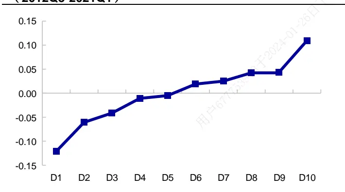
资料来源：Wind，海通证券研究所

图 盈利加速因子在预测未来 年净利润增速模型中的截面回归系数（2012Q3-2021Q1）
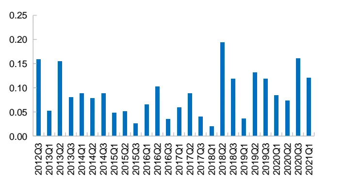
资料来源：Wind，海通证券研究所

由表 5可见，盈利加速因子与未来 1-4个季度的净利润增速显著正相关。在净利润增速预测方程中加入 EAV因子，模型 R方均有所提升。即，盈利加速对公司未来增长具有增量预测能力。

表 5 盈利加速因子对未来净利润增速的预测能力（2012Q3-2021Q1）

| Y |  | EAV | SUE | 当期净利润增速 | ROE | 预期净利润调整 | 市值 | R方 |  |
| --- | --- | --- | --- | --- | --- | --- | --- | --- | --- |
| 未来1个季 度净利润同 比增速 | 方程1 | 回归系数 0.03 | 0.08 |  | 0.20 | 0.03 | 0.02 | 0.02 | 7.8% |
|  |  | t值 | 2.62 | 7.65 | 12.24 | 4.23 | 3.85 | 4.21 |  |
|  |  | p值 | 0.01 | 0.00 | 0.00 | 0.00 | 0.00 | 0.00 |  |
|  |  | 回归系数 |  | 0.06 | 0.21 | 0.03 | 0.02 | 0.03 | 7.3% |
|  | 方程2 | t值 |  | 8.23 | 13.43 | 4.17 | 4.42 | 4.72 |  |
|  |  | p值 |  | 0.00 | 0.00 | 0.00 | 0.00 | 0.00 |  |
| 未来2个季 度净利润同 比增速 | 方程1 | 回归系数 | 0.09 | 0.06 | 0.13 | 0.01 | 0.02 | 0.03 | 4.5% |
|  |  | t值 | 9.72 | 4.33 | 12.25 | 1.01 | 5.06 | 5.42 |  |
|  |  | p值 | 0.00 | 0.00 | 0.00 | 0.32 | 0.00 | 0.00 |  |
|  | 方程2 | 回归系数 |  | 0.03 | 0.14 | 0.01 | 0.02 | 0.04 | 3.6% |
|  |  |  | t值 | 2.58 | 15.91 | 0.64 | 5.68 | 6.30 |  |
|  |  | p值 | 0.02 | 0.00 | 0.53 | 0.00 | 0.00 |  |  |
| 未来3个季 度净利润同 比增速 | 方程1 | 回归系数 | 0.13 | 0.07 | 0.03 | 0.00 | 0.03 | 0.03 | 2.6% |
|  |  | t值 | 13.14 | 5.80 | 5.48 | 0.65 | 4.26 | 4.81 |  |
|  |  | p值 | 0.00 | 0.00 | 0.00 | 0.52 | 0.00 | 0.00 |  |
|  | 方程2 | 回归系数 |  | 0.02 | 0.04 | 0.00 | 0.03 | 0.04 | 1.1% |
|  |  | t值 |  | 3.34 | 5.64 | 0.14 | 4.23 | 5.70 |  |
|  |  | p值 |  | 0.00 | 0.00 | 0.89 | 0.00 | 0.00 |  |
| 未来1年净 利润同比增 速 | 方程1 | 回归系数 | 0.09 | 0.06 | -0.02 | 0.00 | 0.02 | 0.03 | 1.6% |
|  |  | t值 | 9.69 | 5.09 | -3.77 | -0.56 | 3.88 | 3.98 |  |
|  |  | p值 | 0.00 | 0.00 | 0.00 | 0.58 | 0.00 | 0.00 |  |
|  | 方程2 | 回归系数 |  | 0.03 | -0.02 | 0.00 | 0.02 | 0.03 | 0.8% |
|  |  | t值 |  | 3.93 | -4.38 | -0.84 | 3.88 | 4.50 |  |
|  |  | p值 |  | 0.00 | 0.00 | 0.41 | 0.00 | 0.00 |  |

资料来源：Wind，海通证券研究所

综上所述，盈利加速因子与股票收益显著正相关，即使剔除 、预期净利润调整等常见增长因子的影响，EAV也具有显著的选股效果。相对而言，EAV在大盘股、高增长股票集中，选股效果更优。盈利加速因子与股票收益之间显著的正相关关系，可能源于盈利加速因子对公司未来增长的增量预测能力。

## 3.基于盈利加速构建高增长组合

## 3.1 盈利加速的 6种模式及股价表现

根据净利润同比增速和盈利加速情况，可以将公司增长划分为 6种模式：

- 模式 1：EAV>0（t 期的增速大于 t-1期），t 期和 t-1期的增速都为正；

- 模式 2：EAV>0，t 期增速为正，而 t-1 期的增速为负；

- 模式 3：EAV>0，t 期和 t-1期的增速都为负；

- 模式 4：EAV<0，t 期和 t-1期的增速都为正；

- 模式 5：EAV<0，t 期增速为负，而 t-1 期的增速为正；

- 模式 6：EAV<0，t 期和 t-1期的增速都为负。

年初至 年 月， 种盈利加速模式中，模式 ，即最近 期增速都为正、但增速在降低的公司数量最多，平均占比 20.5%；而模式 6，即最近 2期增速都为负、且负增速在扩大的公司数量最少，平均占比 12.1%。

从业绩表现来看，在 种模式中，盈利持续增长且增速扩大的股票组合（模式 ），收益最高， 年以来年化收益 ，相对 全 指数年超额 。需要注意的是，增速扭转对股价的影响并没有盈利持续影响大。如模式 1和 2，两者都为盈利加速，模式 1 是盈利增长持续，模式 2是由负增速转为正增速，但后者的股价表现不如前者。类似地，对于模式 和 ，两者都为盈利减速，模式 是增长由正转负，模式 是持续负增长，相对而言，负增长持续的模式 6，股价反应幅度更大，负超额更明显。

表 6 不同盈利加速模式的股票组合业绩表现（2013.01-2022.07）

| 个股数占比 | 绝对收益 | 相对 wind 全 A 超额 |
| --- | --- | --- |
| 模式1 | 16.7% 16.9% | 8.1% |
| 模式2 | 18.1% 13.3% | 4.5% |
| 模式3 | 14.9% 5.2% | -3.6% |
| 模式4 | 20.5% 11.7% | 2.9% |
| 模式5 | 17.7% 6.1% | -2.7% |
| 模式6 | 12.1% 3.1% | -5.7% |

资料来源：Wind，海通证券研究所

在盈利加速模式 1 的股票集中，选择 EAV最高的 50 只股票构建等权组合，其业绩表现如下表所示。2013.01-2022.07，组合年化收益 20.9%，相对 wind 全 A 指数年超额12.0%，月胜率 63.2%。

表 7 盈利加速模式 1中，盈利加速 top50组合分年度业绩表现（2013.01-2022.07）

| 组合收益 | wind 全 A | 超额收益 | 月胜率 |
| --- | --- | --- | --- |
| 2013 16.1% | 0.3% | 15.8% | 66.7% |
| 2014 50.1% | 52.4% | -2.3% | 58.3% |
| 2015 108.4% | 38.5% | 69.9% | 91.7% |
| 2016 -3.2% | -12.9% | 9.7% | 75.0% |
| 2017 -7.2% | 4.9% | -12.1% | 41.7% |
| 2018 -20.4% | -28.3% | 7.9% | 66.7% |
| 2019 35.6% | 33.0% 内部使用 | 2.6% | 41.7% |
| 2020 26.3% | 25.6% | 0.6% | 50.0% |
| 2021 24.2% | 9.2% | 15.0% | 66.7% |
| 2022 9.5% | -11.9% | 21.5% | 71.4% |
| 全区间 20.9% | 8.8% | 12.0% | 63.2% |

资料来源：Wind，海通证券研究所

## 3.2 高增长组合

由前文可知，在高增长股票集中，盈利加速公司的收益优势更为明显，高 EAV与低EAV 组合的年化多空收益差高达 10.3%。因此，我们可以利用 EAV因子进一步提升高增长组合的业绩表现。

盈利加速、SUE、预期净利润调整、累计研发投入，这 4 个因子都可在一定程度上反映公司的成长性。同时，为防止估值过高，我们加入 PB_INT 因子作为平衡。即采用上述 5个因子等权加总，构建复合增长因子。其中，累计研发投入的刻画指标为知识资本占总资本之比；PB_INT 为无形资产调整后的 PB因子，该因子可相对公平地对比不同行业/类型公司的估值水平，且具有显著的选股收益。知识资本和 PB_INT 的计算方式参见《选股因子系列研究（八十二）——不可忽视的无形资产》。上述因子均进行去极值、标准化、以及正交市值处理。

月度换仓，选择复合增长因子得分最高的 50 只股票，构建增长 top50组合 1。2013年以来，组合市值中位数约为 60-70 亿，市值所处分位点在 50%-60%之间（图 10），且在各大板块都有分布（图 11）。2022 年以来，TMT 板块的高增长个股明显增加，制造、消费板块的高增长股票则有所减少。

图10 增长 top50 组合 1 的市值中位数（2013.01-2022.07）
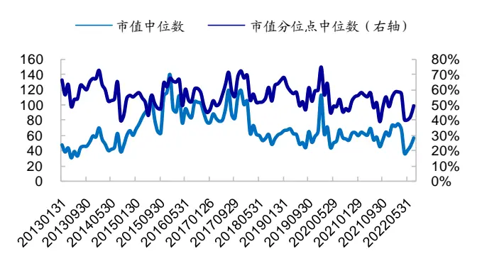
资料来源：Wind，海通证券研究所

图11 增长 top50 组合 1 的板块分布（2013.01-2022.07）
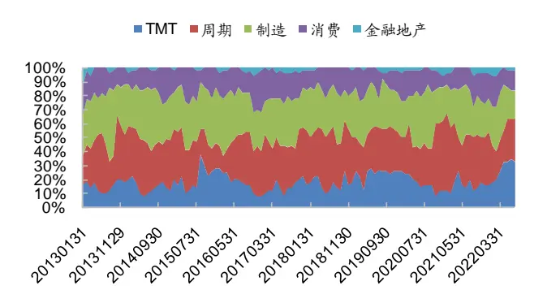
资料来源：Wind，海通证券研究所

扣除单边千 3的交易费用后，截止 2022.07，增长 top50 组合 1自 2013 年 1 月底以来，年化收益 34.2%，同期 wind 全 A指数年化收益 8.8%，组合相对于指数年化超额25.4%。除 2018 年以外，增长 top50 组合 1 在其余年份相对 wind 全 A 指数均有 10%以上的正超额。

表 8 增长 top50 组合 1 分年度业绩表现（2013.01-2022.07）

| 组合收益 | wind 全 A 指数 | 超额收益 | 月胜率 |
| --- | --- | --- | --- |
| 2013 25.8% | 0.3% | 25.5% | 66.7% |
| 2014 63.6% | 52.4% | 11.1% | 83.3% |
| 2015 123.7% | 38.5% 内部使用 | 85.2% | 83.3% |
| 2016 0.0% | -12.9% | 13.0% | 83.3% |
| 2017 15.7% | 4.9% | 10.8% | 50.0% |
| 2018 -21.0% | -28.3% | 7.2% | 58.3% |
| 2019 50.2% | 33.0% | 17.2% | 50.0% |
| 2020 47.8% | 25.6% | 22.2% | 75.0% |
| 2021 52.7% | 9.2% | 43.5% | 58.3% |
| 2022 14.3% | -11.9% | 26.2% | 71.4% |
| 全区间 34.2% | 8.8% | 25.4% | 68.4% |

资料来源：Wind，海通证券研究所

利用高频因子，可进一步优选高增长组合。具体地，将上述 5个因子以及尾盘成交占比和开盘后大单净买入金额占比，共 7个因子等权加总，构建复合因子，选择得分最高的 50 只股票构建增长 top50 组合 2。2013.01 以来，组合年化收益 37.7%，相对 wind全 指数年化超额 。

表 9 增长 top50 组合 2 分年度业绩表现（2013.01-2022.07）

| wind 全 A 指数 | 增长 top50 组合 1 | 增长 top50 组合 2 |
| --- | --- | --- |
| 2013 0.3% | 25.8% | 35.7% |
| 2014 52.4% | 63.6% | 53.5% |
| 2015 38.5% | 123.7% | 149.9% |
| 2016 -12.9% | 0.0% | 5.4% |
| 2017 4.9% | 15.7% | 25.7% |
| 2018 -28.3% | -21.0% | -19.4% |
| 2019 33.0% | 50.2% | 47.3% |
| 2020 25.6% | 47.8% | 60.0% |
| 2021 9.2% | 52.7% | 41.7% |
| 2022 -11.9% | 14.3% | 12.5% |
| 全区间 8.8% | 34.2% | 37.7% |

资料来源： ，海通证券研究所

与增长 top50组合 1相比，组合 2的成长风格更为突出。我们参照 FF3 模型，构建A 股的市值、估值和 SUE因子，然后将两个组合的月收益率分别对市场（wind 全 A指数）以及这 3个风格因子回归。如下表所示，增长 top50组合 2在高估值、高 SUE因子上的暴露更大。即，组合 2 在成长风格上的暴露相对更为明显。

表 10 增长 top50 组合 1 和 2 月度收益的 4 因子回归（2013.01-2022.07）

|  | 增长 top50 组合 1 |  |  | 增长 top50 组合 2 |  |  |
| --- | --- | --- | --- | --- | --- | --- |
|  | 系数 | t值 | p值 | 系数 | t值 | p值 |
| 年 alpha | 8.24% | 1.83 | 0.075 | 7.13% | 1.57 | 0.116 |
| 市场 | 0.97 | 24.50 | 0.000 | 0.99 | 24.76 | 0.000 |
| 市值 | 0.67 | 8.94 | 0.000 | 0.56 | 7.43 | 0.000 |
| 估值 | 0.14 | 2.21 | 0.036 | -0.02 | -0.34 | 0.376 |
| SUE | 0.41 | 2.28 | 0.031 | 0.82 | 4.56 | 0.000 |

资料来源：Wind，海通证券研究所
注：年 alpha 为 alpha*12，下同

从业绩表现来看， 年初至 年 月 日，市场呈非常明显的成长风格，成长指数显著优于 价值指数。在此期间，成长风格暴露更高的组合 业绩表现更优，累计收益 210.3%（组合 1 累计收益 188.7%）。2021.07.21- 2022.04.25，市场呈较为明显的价值风格，300 价值指数明显优于 300 成长指数。在此期间，成长风格暴露更高的组合 ，回撤也更为明显，累计收益 （组合 累计收益 ）。2022.06.30，市场反弹，wind全 A指数累计上涨 24.0%，同时成长风格优于价值风格，300 成长指数相对于 300 价值指数累计超额 22.3%。在此阶段，成长风格暴露更高的组合 2 业绩表现更优，累计收益 39.4%（组合 1 累计收益 35.6%）。

图12 不同市场风格下，增长 top50 组合 1 和 2 的表现对比（2013.01-2022.07）
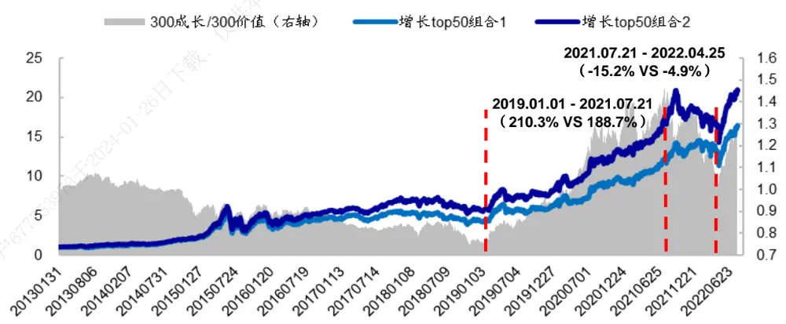
资料来源：Wind，海通证券研究所

## 3.3 大小盘中的高增长组合

若要构建风格倾向更为明显的组合，则可通过加入相应因子或划定选股池等方法来实现。

例如，我们在增长因子打分模型中加入小市值因子，选择复合因子得分最高的 50只股票构建小市值+高增长组合。与原高增长组合相比，该组合在小市值因子上的暴露更高，四因子回归模型中的小市值 beta 由 0.56 增加到 0.98（表 12）。从业绩表现来看（表 11），小市值+高增长组合在小盘风格较强的 2013-2015 年和 2021-2022 年，明显优于原组合；而在大盘风格走强的 2017-2020 年，表现也弱于原组合。

又如，通过划定样本池，同样可以获得小市值风格特征较为明显的组合。具体地，将样本池限定在全 A市值最小的 30%股票池里，选择增长和高频复合因子得分最高的50 只股票构建等权组合，其小市值 beta 由 0.56 增加到 1.22。与加入小市值因子的方式相比，划定选股池的方法对风格的影响更直接，得到组合的小市值暴露更高。因此，在小盘风格强的 2013-2015 年，划定选股池得到组合的收益更高；同时在小盘走弱时，表现会弱于加入小市值因子的方法。

类似地，我们也可以在市值最大 30%股票池中构建高增长组合。2013 年以来，该组合年化收益 24.0%，相对于沪深 300 指数年超额 19.3%。除 2014 年小幅跑输指数外，其余年份均优于沪深 300 指数。

表 11 带风格倾向的高增长组合历史业绩表现（2013.01-2022.07）

|  | 绝对收益 |  |  |  |  | 相对基准指数的超额收益1 |  |  |  |  |
| --- | --- | --- | --- | --- | --- | --- | --- | --- | --- | --- |
|  | 增长 top50 组合2 | +小市值因 子 | 样本池：小 市值 30% | 样本池：大 市值 30% | +低估值个 股剔除 | 增长 top50 组合2 | +小市值 因子 | 样本池：小 市值 30% | 样本池：大 市值 30% | +低估值个 股剔除 |
| 2013 | 35.7% | 47.4% | 47.3% | 14.6% | 61.2% | 10.8% | 22.5% | 22.4% | 27.9% | 36.3% |
| 2014 | 53.5% | 68.2% | 83.0% | 48.3% | 71.5% | 11.1% | 25.8% | 40.6% | -3.4% | 29.1% |
| 2015 | 149.9% | 182.6% | 179.1% | 82.3% | 181.8% | 61.8% | 94.5% | 91.0% | 76.7% | 93.6% |
| 2016 | 5.4% | 15.4% | 16.7% | -7.0% | 14.1% | 17.5% | 27.6% | 28.8% | 4.3% | 26.2% |
| 2017 | 25.7% | 6.2% | -18.5% | 34.2% | -0.9% | 42.6% | 23.1% | -1.6% | 12.5% | 16.0% |
| 2018 | -19.4% | -20.9% | -21.2% | -21.7% | -25.7% | 14.3% | 12.9% | 12.6% | 3.6% | 8.1% |
| 2019 | 47.3% | 48.4% | 48.6% | 40.4% | 55.5% | 23.9% | 24.9% | 25.2% | 4.3% | 32.1% |
| 2020 | 60.0% | 58.6% | 50.6% | 40.9% | 64.9% | 43.2% | 41.8% | 33.8% | 13.7% | 48.0% |
| 2021 | 41.7% | 50.9% | 41.2% | 33.6% | 58.6% | 12.5% | 21.7% | 12.0% | 38.8% | 29.4% |
| 2022 | 12.5% | 27.1% | 32.6% | -3.2% | 10.7% | 20.7% | 35.2% | 40.8% | 12.4% | 18.9% |
| 全区间 | 37.7% | 43.4% | 39.5% | 24.0% | 42.8% | 26.4% | 32.1% | 28.2% | 19.3% | 31.5% |

资料来源：Wind，海通证券研究所

注 ：除组合“样本池：大市值 ”的基准指数为沪深 以外，其余几个组合的基准指数均为国证

如果想进一步放大成长风格，可在选股过程中加入估值指标。但考虑到 PB因子的选股效果不稳定，所以我们未采用直接将其加入复合打分的方式，来构建偏成长风格的组合，而是采用事前剔除低 PB 个股的方式来实现。即在全 A 范围内，将 PB最低的 30%股票剔除，在剩余股票中选择复合因子得分最高的 50 只股票构建偏成长风格的小市值+高增长组合。

如表 12所示，事前剔除也可以提升组合的成长风格暴露，组合在低估值因子上的暴露由 变为 ，即高估值成长属性更突出。从业绩表现来看，该组合在成长风格较强的 2019 年初至 2021.07.21，累计收益 223.2%，明显优于未进行低估值剔除的组合（197.2%）。同样地，在价值风格走强的 2021.07.21-2022.04.25，该组合累计收益-0.7%，表现弱于未进行低估值剔除的组合（5.4%）。

表 12 不同风格的高增长组合月度收益的 4因子回归（2013.01-2022.07）

|  | +小市值因子 |  |  | 样本池：小市值 top30% |  | +低估值剔除 |  |  |
| --- | --- | --- | --- | --- | --- | --- | --- | --- |
|  | 系数 | t值 | p值 | 系数 t值 | p值 | 系数 | t值 | p值 |
| 年 alpha | 11.5% | 2.64 | 0.013 | 8.3% 2.35 | 0.026 | 12.6% | 3.17 | 0.003 |
| 市场 | 0.99 | 25.83 | 0.000 | 0.96 30.98 | 0.000 | 1.03 | 29.33 | 0.000 |
| 市值 | 0.98 | 13.49 | 0.000 | 1.22 20.60 | 0.000 | 0.96 | 14.41 | 0.000 |
| 估值 | -0.01 | -0.09 | 0.397 | 0.05 1.05 | 0.230 | -0.21 | -3.59 | 0.001 |
| SUE | 0.51 | 2.96 | 0.006 | 0.36 2.55 | 0.016 | 0.50 | 3.14 | 0.003 |

资料来源： ，海通证券研究所

## 4. 总结

本文定义了盈利加速因子，该因子衡量的是从一个季度到下一个季度盈利增速的变化。其中，盈利增速用标准化的 EPS同比变化来表示，即 EPS 的同比变化除以对比基数。对比基数可以采用：去年同期 的绝对值（ ）、上季度末的股价（ ）、最近 8 个季度 EPS的标准差（EAV）。

盈利加速因子与市值、估值及价量类因子相关性较低。在基本面因子中，盈利加速与增长类因子的线性相关性较为明显，而与盈利水平本身的线性相关性较弱。盈利增长加速的公司，平均增速和净利润调整幅度均高于盈利增长减速的公司。从行业分布来看，与全 A个股相比，盈利加速公司更多地分布在基础化工、电力设备及新能源、通信、计算机、传媒等高新技术行业。

盈利加速因子与股票收益显著正相关，即使剥离常见因子的影响，该因子仍存在显著的选股效果。2013 年初至 2022.07，原始 EAV因子分 10组年化多空收益 9.7%，月均 IC 为 0.02，月胜率 76.5%；正交因子年化多空收益 4.8%，月均 IC为 0.01，月胜率62.6%，统计显著。相对而言，EAV在大盘股、高增长股票集中，选股效果更优。盈利加速因子与股票收益之间的正相关关系，可能源于盈利加速对公司未来增长的增量预测能力。

在高增长股票集中，盈利加速公司的收益优势更为明显，因子分 10 组年化多空收益达 10.3%。因此，我们可以利用盈利加速因子提升高增长组合的业绩表现。具体地，将盈利加速、SUE、预期净利润调整等反映公司增长的因子等权加总，构建复合增长因子，选择得分最高的 50 只股票构建等权组合。2013 年初至 2022.07，高增长组合年化收益 34.2%，相对于 wind 全 A 指数年超额 25.4%。而且，利用高频因子可进一步增厚高增长组合的业绩表现。

在增长因子打分模型中加入小市值因子，选择复合因子得分最高的 50只股票构建小市值+高增长组合。该组合自 2013 年初至 2022.07（下同）年化收益 43.4%，相对于国证 2000 指数年化超额 32.1%。与原高增长组合相比，该组合在小市值因子上的暴露更高。小市值+高增长组合在小盘风格较强的 2013-2015 年和 2021-2022 年，明显优于原组合；而在大盘风格走强的 2017-2020 年，表现也弱于原组合。

在全 市值最小的 股票池里，选择增长复合因子得分最高的 只股票构建小盘中的高增长组合。该组合 2013 年以来年化收益 39.5%，相对于国证 2000 指数年化超额28.2%。按照同样的方式构建大盘中的高增长组合，该组合13年以来年化收益24.0%，相对于沪深 300 指数年化超额 19.3%。

如果想进一步放大成长风格，可在选股过程中加入估值指标。考虑到 PB因子选股效果不稳定，所以我们未采用直接将其加入复合打分的方式，而是采用事前剔除低 PB个股的方式来实现。偏成长风格的小市值+高增长组合的高估值成长属性更突出。该组合在成长风格较强的 2019 年初至 2021.07.21，累计收益 223.2%，明显优于未进行低估值剔除的组合（197.2%）。同样地，在价值风格走强的 2021.07.21-2022.04.25，累计收益-0.7%，表现弱于未进行低估值剔除的组合（5.4%）。

## 5.风险提示

历史统计规律失效风险，因子失效风险。

# 信息披露

分析师声明

[Table冯佳睿yst金融工程研究团队s]

罗蕾金融工程研究团队

本人具有中国证券业协会授予的证券投资咨询执业资格，以勤勉的职业态度，独立、客观地出具本报告。本报告所采用的数据和信息均来自市场公开信息，本人不保证该等信息的准确性或完整性。分析逻辑基于作者的职业理解，清晰准确地反映了作者的研究观点，结论不受任何第三方的授意或影响，特此声明。

## 法律声明

本报告仅供海通证券股份有限公司（以下简称“本公司”）的客户使用。本公司不会因接收人收到本报告而视其为客户。在任何情况下，本报告中的信息或所表述的意见并不构成对任何人的投资建议。在任何情况下，本公司不对任何人因使用本报告中的任何内容所引致的任何损失负任何责任。

本报告所载的资料、意见及推测仅反映本公司于发布本报告当日的判断，本报告所指的证券或投资标的的价格、价值及投资收入可能载会波动。在不同时期，本公司可发出与本报告所载资料、意见及推测不一致的报告。

市场有风险，投资需谨慎。本报告所载的信息、材料及结论只提供特定客户作参考，不构成投资建议，也没有考虑到个别客户特殊的可投资目标、财务状况或需要。客户应考虑本报告中的任何意见或建议是否符合其特定状况。在法律许可的情况下，海通证券及其所属不关联机构可能会持有报告中提到的公司所发行的证券并进行交易，还可能为这些公司提供投资银行服务或其他服务。用

本报告仅向特定客户传送，未经海通证券研究所书面授权，本研究报告的任何部分均不得以任何方式制作任何形式的拷贝、复印件或内复制品，或再次分发给任何其他人，或以任何侵犯本公司版权的其他方式使用。所有本报告中使用的商标、服务标记及标记均为本公本司的商标、服务标记及标记。如欲引用或转载本文内容，务必联络海通证券研究所并获得许可，并需注明出处为海通证券研究所，且不得对本文进行有悖原意的引用和删改。载，

根据中国证监会核发的经营证券业务许可，海通证券股份有限公司的经营范围包括证券投资咨询业务。日

## 海通证券股份有限公司研究所[Table_PeopleInfo]

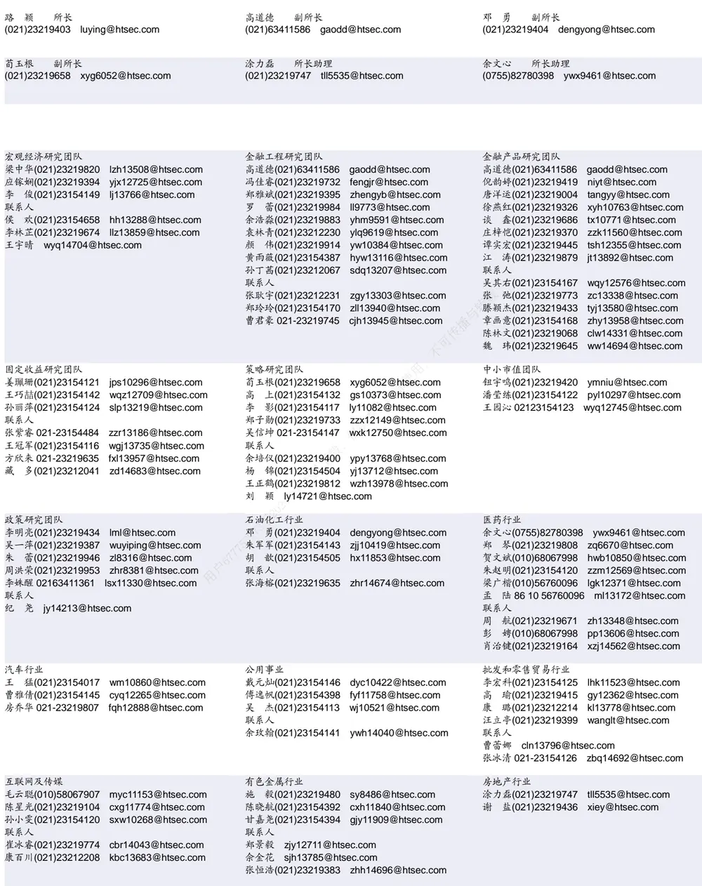

| 建筑工程行业 |  | 食品饮料行业 |  | 军工行业 |  |
| --- | --- | --- | --- | --- | --- |
| 张欣劫 18515295560 | zxj12156@htsec.com | 颜慧菁 yhj12866@htsec.com |  | 张恒晅 zhx10170@htsec.com |  |
| 联系人 |  | 张宇轩(021)23154172 | zyx11631@htsec.com | 联系人 |  |
| 曹有成 18901961523 | cyc13555@htsec.com | 程碧升(021)23154171 cbs10969@htsec.com |  | 刘砚菲 021-2321-4129 | lyf13079@htsec.com |
| 郭好格 13718567611 | ghg14711@htsec.com | 联系人 张嘉颖(021)23154019 | ziv14705@htsec.com | 胡舜杰(021)23154483 | hsj14606@htsec.com |

| 电子行业 |  | 煤炭行业 |  | 电力设备及新能源行业 |  |
| --- | --- | --- | --- | --- | --- |
| 李 轩(021)23154652 lx12671@htsec.com |  |  | 李 淼(010)58067998 Im10779@htsec.com | 张一弛(021)23219402 zyc9637@htsec.com |  |
| 肖隽翀(021)23154139 xjc12802@htsec.com |  | 王 | 涛(021)23219760 wt12363@htsec.com | 房 青(021)23219692 fangq@htsec.com |  |
| 华晋书02123219748 hjs14155@htsec.com |  |  | 吴 杰(021)23154113 wj10521@htsec.com | 徐柏乔(021)23219171 xbq6583@htsec.com |  |
| 联系人 |  | 联系人 |  | 张 磊(021)23212001 zl10996@htsec.com |  |
| 文 灿(021)23154401 薛逸民(021)23219963 | wc13799@htsec.com |  | 朱 彤(021)23212208 zt14684@htsec.com | 联系人 | 姚望洲(021)23154184 ywz13822@htsec.com |
| 李 潇(010)58067830 | xym13863@htsec.com |  |  |  |  |
|  | lx13920@htsec.com |  |  | 柳文韬(021)23219389 Iwt13065@htsec.com 吴锐鹏 wrp14515@htsec.com |  |

| 基础化工行业 | 计算机行业 | 通信行业 |
| --- | --- | --- |
| 刘 威(0755)82764281 Iw10053@htsec.com 张翠翠(021)23214397 zcc11726@htsec.com | 郑宏达(021)23219392 zhd10834@htsec.com 杨 林(021)23154174 yl11036@htsec.com | 余伟民(010)50949926 ywm11574@htsec.com 杨彤昕 010-56760095 ytx12741@htsec.com |
| 孙维容(021)23219431 swr12178@htsec.com | 于成龙(021)23154174 ycl12224@htsec.com | 联系人 |
| 李 智(021)23219392 Iz11785@htsec.com | 洪 琳(021)23154137 hl11570@htsec.com | 夏 凡(021)23154128 xf13728@htsec.com |
|  | 联系人 杨 蒙(0755)23617756 ym13254@htsec.com | 徐 卓 xz14706@htsec.com |

| 非银行金融行业 |  | 交通运输行业 |  | 纺织服装行业 |  |  |
| --- | --- | --- | --- | --- | --- | --- |
|  | 何 婷(021)23219634 ht10515@htsec.com |  | 虞 楠(021)23219382 yun@htsec.com |  |  | 梁 希(021)23219407 lx11040@htsec.com |
|  | 任广博(010)56760090 rgb12695@htsec.com |  | 罗月江(010）56760091 lyj12399@htsec.com |  | 盛 开(021)23154510 sk11787@htsec.com |  |
|  | 孙 婷(010)50949926 st9998@htsec.com |  | 陈宇(021)23219442 cy13115@htsec.com |  | 联系人 |  |
| 联系人 |  |  |  |  |  | 王天璐(021)23219405 wtl14693@htsec.com |

| 建筑建材行业 | 机械行业 |  | 钢铁行业 |
| --- | --- | --- | --- |
| 冯晨阳(021)23212081 fcy10886@htsec.com |  | 赵玥炜(021)23219814 zyw13208@htsec.com | 刘彦奇(021)23219391 liuyq@htsec.com |
| 潘莹练(021)23154122 pyl10297@htsec.com |  | 赵靖博(021)23154119 zjb13572@htsec.com 丁传播 | 周慧琳(021)23154399 zhl11756@htsec.com |
| 申 浩(021)23154114 sh12219@htsec.com 颜慧菁 yhj12866@htsec.com | 联系人 | 刘绮雯(021)23154659 lqw14384@htsec.com |  |

| 银行行业 林加力(021)23154395 Ijl12245@htsec.com | 社会服务行业 |  | 家电行业 |
| --- | --- | --- | --- |
|  | 汪立亭(021)23219399 wanglt@htsec.com |  | 陈子仪(021)23219244 chenzy@htsec.com |
| 联系人 董栋梁(021)23219356 ddl13206@htsec.com |  | 许樱之(755)82900465 xyz11630@htsec.com | 李 阳(021)23154382 ly11194@htsec.com |
| 徐凝碧(021)23154134 xnb14607@htsec.com | 联系人 毛弘毅(021)23219583 mhy13205@htsec.com |  | 朱默辰(021)23154383 zmc11316@htsec.com |
|  |  |  | 刘 璐(021)23214390 II11838@htsec.com |
|  | 王祎婕(021)23219768 wyj13985@htsec.com |  |  |

## 造纸轻工行业

郭庆龙 gql13820@htsec.com

高翩然 gpr14257@htsec.com

吕科佳 lkj14091@htsec.com

王文杰 wwj14034@htsec.com

## 研究所销售团队

深广地区销售团队

伏财勇(0755)23607963 fcy7498@htsec.com

蔡铁清(0755)82775962 ctq5979@htsec.com

辜丽娟(0755)83253022 gulj@htsec.com

刘晶晶(0755)83255933 liujj4900@htsec.com

饶 伟(0755)82775282 rw10588@htsec.com

欧阳梦楚(0755)23617160

oymc11039@htsec.com

巩柏含 gbh11537@htsec.com

滕雪竹 0755 23963569 txz13189@htsec.com

张馨尹 0755-25597716 zxy14341@htsec.com上海地区销售团队胡雪梅(021)23219385 huxm@htsec.com黄 诚(021)23219397 hc10482@htsec.com季唯佳(021)23219384 jiwj@htsec.com黄 毓(021)23219410 huangyu@htsec.com李 寅 021-23219691 ly12488@htsec.com胡宇欣(021)23154192 hyx10493@htsec.com马晓男 mxn11376@htsec.com邵亚杰 23214650 syj12493@htsec.com杨祎昕(021)23212268 yyx10310@htsec.com毛文英(021)23219373 mwy10474@htsec.com谭德康 tdk13548@htsec.com王祎宁(021)23219281 wyn14183@htsec.com张歆钰 zxy14733@htsec.com周之斌 zzb14815@htsec.com

北京地区销售团队
朱 健(021)23219592 zhuj@htsec.com
殷怡琦(010)58067988 yyq9989@htsec.com
郭 楠 010-5806 7936 gn12384@htsec.com
杨羽莎(010)58067977 yys10962@htsec.com
张丽萱(010)58067931 zlx11191@htsec.com
郭金垚(010)58067851 gjy12727@htsec.com
张钧博 zjb13446@htsec.com
高 瑞 gr13547@htsec.com
上官灵芝 sglz14039@htsec.com
董晓梅 dxm10457@htsec.com
姚 坦 yt14718@htsec.com

海通证券股份有限公司研究所

地址：上海市黄浦区广东路 689号海通证券大厦 9楼

电话：（021）23219000

传真：（021）23219392

网址：www.htsec.com