## [Tab相关研究

Table_ReportInfo]《当龙头遇上成长》2022.08.22

《选股因子系列研究（八十三）——盈利加速的定量刻画与高增长组合的构建》2022.08.17

《中证 股指期货上市，量化对冲的春天来了？》2022.08.12

Tel:(021)23219732

分析师:冯佳睿

Email:fengjr@htsec.com

证书:S0850512080006

分析师:罗蕾

Tel:(021)23219984

Email:ll9773@htsec.com

证书:S0850516080002

# 选股因子系列研究（八十四）——选股因子的季节效应及其成因

## 投资要点：

本文考察常见选股因子的季节效应，主要包括月历效应和假日效应。

- 年以来，常见因子的业绩表现。 年 月至 年 月的 年间， 股整体呈小盘价值风格，即小市值、低估值股票优于大市值、高估值股票；但与其他因子相比，这两个因子波动率大、稳定性低，月胜率仅 左右。而低涨幅、低波动、低换手、高 O 和高 S 异象统计显著，且稳定性高，年胜率在90%-95%左右。整体来看，同类因子相关性较强，而不同类别因子相关性较弱。此外，小市值因子与反转因子呈正相关关系，即小盘风格较强时，反转效应突出。低估值因子与波动率因子显著正相关，而与 O 、S 显著负相关。即价值风格下，低波动的股票表现优异；而成长风格下，盈利好、增速快的公司表现突出。

- 月历效应。岁末年初，在寻找投资主题的过程中，投资者会比较关注公司基本面，基本面因子表现优异。 月份，受投资者情绪以及市场流动性宽松影响，小盘风格显著，小市值因子有效概率大。经历 、 月份的极端小盘行情后， 月份低波动、低换手率股票更胜一筹，小盘风格则暂时休整。 月份，年报、一季报披露完毕，基本面优异的公司受到投资者较大关注，ROE、SUE因子表现突出；同时，财报披露后，一些成长股的成长属性得以验证，成长风格走强的概率较大。进入下半年，与上半年相比，投资者情绪相对较为谨慎，热点延续性较弱，月收益率、换手率、波动率等反转类因子表现较为优异。此外，中报披露后，9-10 月份，基本面因子表现突出。

- 假日效应。从节假日角度来看，节前市场追逐确定性，低换手、高盈利的大盘蓝筹股，更受投资者青睐。大市值、低换手率、高 ROE 因子表现突出，选股收益明显优于其他因子，且显著强于节后。节后市场转而追求高弹性，前期跌得多的个股、小盘成长股，更受投资者欢迎。小市值、高估值、反转因子表现突出，选股收益明显优于其他因子。

- 季节效应的应用。若季节效应得以延续，在部分时间点，我们可以配臵一定比例相应风格的卫星策略；或者在指增风控模型中放松相应风格的约束，来增加因子暴露，提升业绩表现。例如，节前高盈利策略超额收益显著，而节后小市值+高增长策略超额收益空间更大。即相对而言，节前更适合配臵高盈利组合，而节后则可配臵小市值+高增长组合。对于指增策略而言，有条件地放松风格因子的约束，可以在不明显增加风险的情况下，较为明显地提升沪深 300 和中证 500 指数增强组合的超额收益率。

- 风险提示。历史统计规律失效风险，模型误设风险。

本文考察常见选股因子的季节效应，主要包括月历效应和假日效应。在考察时，因子均经过去极值和标准化处理。除市值因子以外，其余因子还对市值和行业进行了正交处理。考察时间区间为 2005 年 7 月至 2022 年 6 月，共 17 年数据。

为纵向对比因子在不同时期的选股收益，我们以股票收益率对因子值截面回归的月溢价，来反映因子的选股效果。在横截面回归方程中，回归溢价代表增加一个标准差的因子暴露，平均而言，能带来多少收益。

## 1.常见因子的历史业绩表现

05 年以来，市场整体呈小盘价值风格，即小市值、低估值股票优于大市值、高估值股票（表 1）。但与其他因子相比，这两个因子波动率较大、稳定性较低，月胜率仅 50%左右，年胜率 55.6%。而反转、波动率、换手率、ROE和 SUE 因子的选股收益更为稳定，月胜率均超过 ，年胜率在 左右。

小市值因子与反转因子呈正相关关系，与其他价量因子和基本面因子呈负相关关系（图 ）。即，小盘风格较强时，反转效应也较强。如 年，小盘风格显著，反转因子的表现也非常突出。低估值因子则与波动率因子显著正相关，而与 ROE、SUE显著负相关。即，价值风格下，低波动的股票表现优异；而成长风格下，盈利好、增速快的股票表现突出。

同类因子相关性较强，而不同类别因子相关性较弱。例如，2014 年，ROE和 SUE表现较弱，而反转、换手率、波动率表现较强；2020 年，价量因子普遍失效，而基本面因子表现优异。

表 1 常见因子的月溢价统计（2005.07- 2022.06）

|  | 年化单位溢价 | 月胜率 | 年波动率 | t值 | p值 |
| --- | --- | --- | --- | --- | --- |
| 市值 | -4.1% | 56.9% | 8.3% | -2.03 | 0.044 |
| PB | -1.8% | 50.0% | 5.9% | -1.27 | 0.207 |
| 反转 | -5.3% | 67.6% | 3.6% | -6.08 | 0.000 |
| 波动率 | -5.7% | 69.1% | 4.1% | -5.77 | 0.000 |
| 换手率 | -7.8% | 71.1% | 5.3% | -5.99 | 0.000 |
| ROE | 4.6% | 63.2% | 3.8% | 4.96 | 0.000 |
| SUE | 4.4% | 75.0% | 2.3% | 7.81 | 0.000 |

资料来源：Wind，海通证券研究所
注：（ ）年化单位溢价为月溢价 ，下同；（ ）月胜率为溢价方向与因子选股方向相同的月度占比

图1 常见因子月度溢价的相关性（2005.07-2022.06）
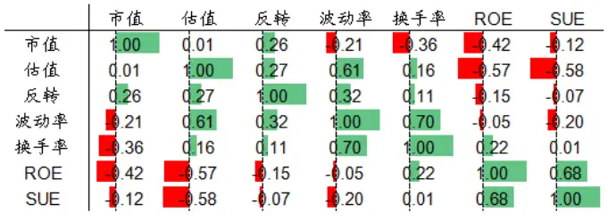
资料来源：Wind，海通证券研究所
注：在计算相关系数时，因子溢价方向均调整为正向

图2 市值因子每年年化溢价累计走势（2005.07-2022.06）
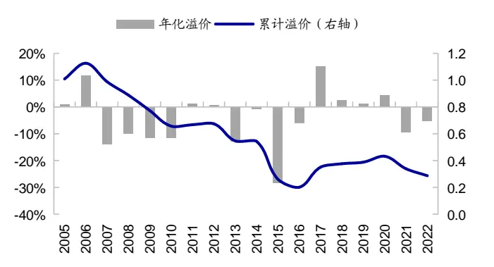
资料来源： ，海通证券研究所

图3 估值因子每年年化溢价累计走势（2005.07-2022.06）
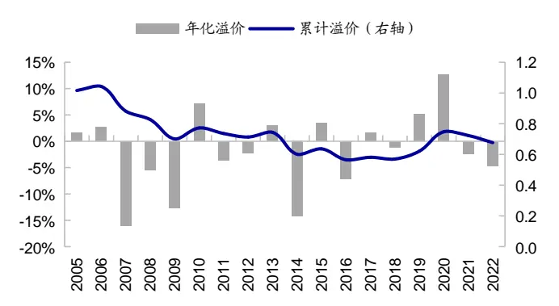
资料来源：Wind，海通证券研究所

图4 反转因子每年年化溢价累计走势（2005.07-2022.06）
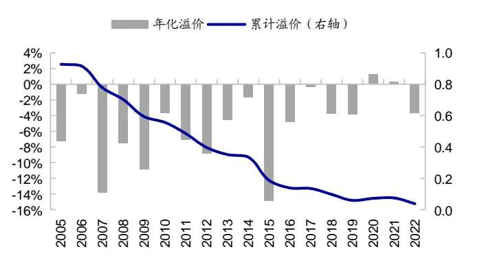
资料来源：Wind，海通证券研究所

图5 波动率因子每年年化溢价累计走势（2005.07-2022.06）
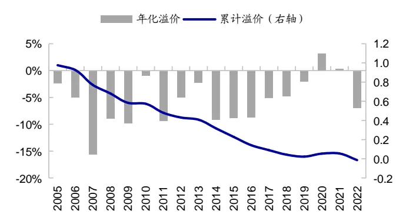
资料来源：Wind，海通证券研究所

图6 换手率因子每年年化溢价累计走势（2005.07-2022.06）
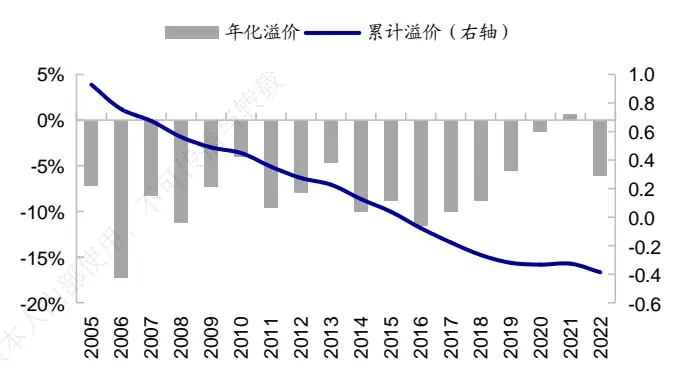
资料来源：Wind，海通证券研究所

图7 ROE 因子每年年化溢价累计走势（2005.07-2022.06）
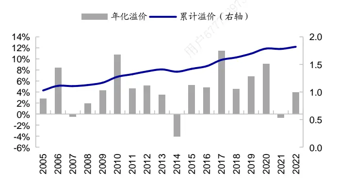
资料来源：Wind，海通证券研究所

图8 SUE 因子每年年化溢价累计走势（2005.07-2022.06）
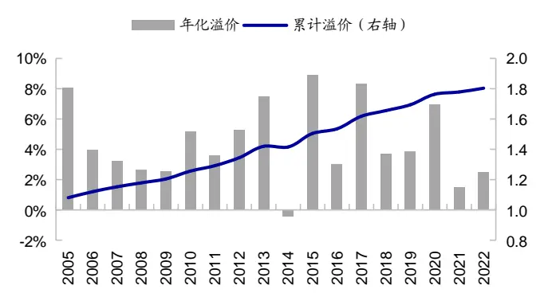
资料来源：Wind，海通证券研究所

## 2.月历效应

## 2.1 市值

2005 年 7 月至 2022 年 6 月，市值因子的年化单位溢价（月均溢价*12，下同）为-4.1%，统计显著。即，过去 17 年间，市场整体呈小盘风格；平均来看，1 个标准差的小盘暴露能带来 4.1%的超额收益。

分月度来看，小市值因子在 2、3 月份的表现最为突出。在这两个月份，因子年化单位溢价均超过 19%，年胜率超过 80%，收益幅度和稳定性均明显优于其他月份。而与之相邻的 1、4月份，则小盘较弱，甚至呈一定的大盘风格。除此之外，5 月份和 8 月份小盘风格也相对较强，概率不低于 70%。

为剔除个别年份异常值造成的影响，我们通过构建带有 2、3 月份以及 5、8 月份的虚拟变量，对市值因子的月溢价序列进行稳健回归。如表 3 所示，考虑异常值影响后，2、3 月份的市值因子溢价显著为负，因子年化单位溢价达 18.4%。5、8月份的溢价也显著为负，但收益幅度略小于 2、3月份，年化 11.0%。可见，2-3 月份以及 5、8 月份小盘风格显著。

与 2-3 月份以及 5、8月份的小盘风格不同，6 月、12月份，市值因子溢价为正（表2），即市场整体呈大盘风格。但大盘溢价稳定性较弱，6 月份大盘走强的概率为 70.6%，12 月份为 52.9%。

表 2 市值因子的月历效应统计（2005.07-2022.06）

| 年化单位溢价 | 次胜率 | 年波动率 | t值 | p值 |
| --- | --- | --- | --- | --- |
| 1月 | -0.4% 52.9% | 8.5% | -0.06 | 0.951 |
| 2月 | -19.3% 88.2% | 5.6% | -4.12 | 0.001 |
| 3月 -19.0% | 82.4% | 5.8% | -3.91 | 0.001 |
| 4月 8.3% | 64.7% | 7.1% | 1.40 | 0.181 |
| 5月 -16.6% | 70.6% | 9.4% | -2.09 | 0.053 |
| 6月 | 8.1% 70.6% | 6.8% | 1.42 | 0.175 |
| 7月 | -2.7% 52.9% | 7.5% | -0.43 | 0.673 |
| 8月 | -11.5% 76.5% | 5.9% | -2.33 | 0.033 |
| 9月 | -0.8% 47.1% | 4.2% | -0.23 | 0.824 |
| 10月 | 4.4% 58.8% | 7.4% | 0.71 | 0.488 |
| 11月 | -11.9% 58.8% | 10.8% | -1.30 | 0.212 |
| 12月 | 12.6% 52.9% | 11.8% | 1.27 | 0.222 |
| 全区间 | -4.1% 56.9% | 8.3% | -2.03 | 0.044 |

资料来源： ，海通证券研究所
注：次胜率是指溢价方向与平均溢价方向相同的年度占比，下同

表 3 市值因子月份虚拟变量的稳健性回归（2005.07-2022.06）

|  | 年化单位溢价 | t值 | p值 |
| --- | --- | --- | --- |
| 2、3月份 | -18.4% | -4.32 | 0.000 |
| 5、8月份 | -11.0% | -2.58 | 0.011 |
| 其他月份 | 0.8% | 0.36 | 0.723 |

资料来源：Wind，海通证券研究所

图9 市值因子不同月份的平均年化单位溢价（2005.07-2022.06）
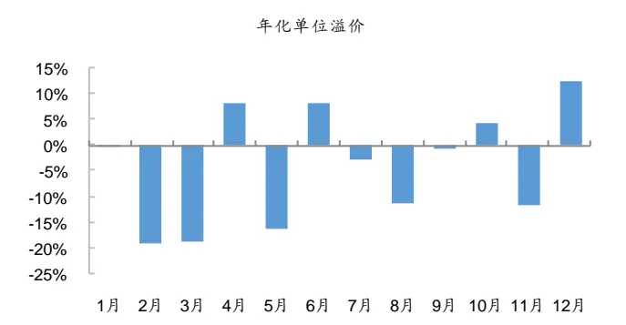
资料来源：Wind，海通证券研究所

图10 市值因子每年 2月份的月溢价
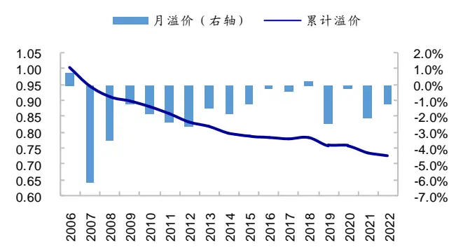
资料来源：Wind，海通证券研究所

图11 市值因子每年 3月份的月溢价
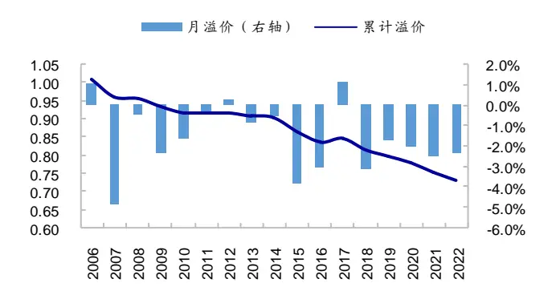
资料来源：Wind，海通证券研究所

图12 市值因子每年 12月份的月溢价
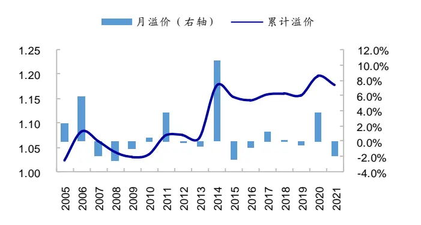
资料来源：Wind，海通证券研究所

2 月份的小盘效应可能与投资者情绪有关。A股存在较为明显的“春季躁动”行情，2006年以来绝大部分年份的2月份，wind全A指数均上涨，年胜率76.5%，平均涨幅高达 （图 ）。临近春节，投资者风险偏好提升，市场表现喜人。而平均来看，小盘股的上涨弹性远远高于大盘股。基于市值将全 A个股等分为 10 组，市值最小 1/10 股票组合的上涨捕获比例为 ，而市值最大 股票组合的上涨捕获比例仅为 。可见，市场上涨时，小市值个股的上涨空间更大。在春季躁动行情的带动下，上涨弹性更大的小市值股票更受投资者青睐，相应地，2月份的小盘溢价突出。

3 月、5月、8月份的小盘风格可能与流动性宽松有关。如图 14 所示，反映资金面松紧程度的 7天回购利率在这 3 个自然月均达到局部低点。流动性宽松，市场对流动性高的大盘股配臵需求降低，而具有流动性溢价的小盘股的投资需求增加。受流动性溢价驱动，3 月、5月、8月份的小盘风格也较强。

资金价格的“半年末效应”可能是每年 6月、12 月小盘风格走弱、大盘风格走强的重要原因。半年末是金融机构考核的关键时点，这个时候，金融机构对资金的需求往往都比较旺盛，从而带来了资金价格规律性上升的现象。如图 14所示，7天回购利率在 6月、12月通常都会季节性冲高。在高企的资金成本下，投资机构倾向于增加高流动性资产的配臵，以应对潜在的产品结算与赎回。基于流动性配臵需求的上升，高流动性的大市值股票在 6月、12 月份的表现优于低流动性的小市值股票。

图13 Wind全 A指数每年 2月份的收益率
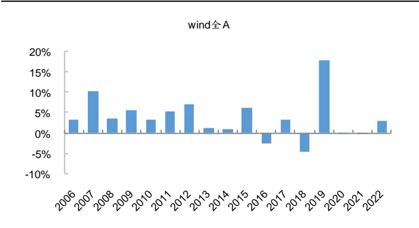
资料来源：Wind，海通证券研究所

图14 各自然月日均 7 天回购利率（2005.07-2022.06）
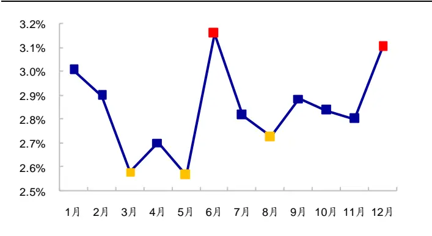
资料来源：Wind，海通证券研究所

## 2.2 估值

2005 年 7 月至 2022 年 6 月，估值因子的年化单位溢价为-1.8%（表 4）。即，过去17 年间，市场整体呈价值风格；平均来看，1个标准差的价值风格暴露能带来年化 1.8%的超额收益；但该因子稳定性弱，统计不显著。

分月度来看，与全区间的价值风格不同，在 5、6月份，估值因子与股票收益呈正相关关系。即估值越高，股票收益表现越优，市场呈成长风格，概率为 82.4%。为剔除异常值造成的影响，我们通过构建带有 5、6 月份的虚拟变量，对估值因子的月溢价序列进行稳健回归。如表 5 所示，在考虑异常值影响后，5、6 月份的估值因子溢价显著为正，即成长风格显著，因子年化单位溢价为 11.0%；其他月份则呈较为显著的价值风格，但溢价相对较小，年化 3.5%。可见，5、6 月份的成长风格显著。

表 4 估值因子的月历效应统计（2005.07-2022.06）

|  | 年化单位溢价 | 次胜率 | 年波动率 | t值 | p值 |
| --- | --- | --- | --- | --- | --- |
| 1月 | -5.3% | 70.6% | 6.5% | -0.97 | 0.345 |
| 2月 | -5.9% | 58.8% | 6.0% | -1.17 | 0.260 |
| 3月 | -5.9% | 47.1% | 5.2% | -1.34 | 0.200 |
| 4月 | -0.8% | 58.8% | 5.9% | -0.16 | 0.873 |
| 5月 | 9.7% | 82.4% | 5.1% | 2.29 | 0.036 |
| 6月 | 9.1% | 82.4% | 6.9% | 1.58 | 0.134 |
| 7月 | -8.7% | 64.7% | 5.4% | -1.90 | 0.076 |
| 8月 | -2.3% | 52.9% | 5.2% | -0.53 | 0.603 |
| 9月 | -2.4% | 41.2% | 4.1% | -0.69 | 0.503 |
| 10月 | 2.3% | 41.2% | 4.7% | 0.58 | 0.569 |
| 11月 | -6.3% | 58.8% | 5.1% | -1.49 | 0.156 |
| 12月 | -5.3% | 52.9% | 8.5% 传播 | -0.74 | 0.467 |
| 全区间 | -1.8% | 50.0% | 5.9% | -1.27 | 0.207 |

资料来源：Wind，海通证券研究所

表 5 估值因子月份虚拟变量的稳健性回归（2005.07-2022.06）

| 下载 | 年化单位溢价 | t值 | p值 |
| --- | --- | --- | --- |
| 5、6月份 | 11.0% | 3.46 | 0.001 |
| 其他月份 | -3.5% | -2.43 | 0.016 |

资料来源： ，海通证券研究所

图15 估值因子不同月份的年化单位溢价（2005.07-2022.06）
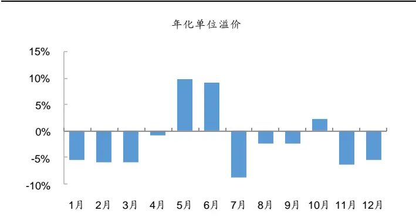
资料来源：Wind，海通证券研究所

图16 估值因子 5、6 月份的累计单位溢价（2005.07-2022.06）
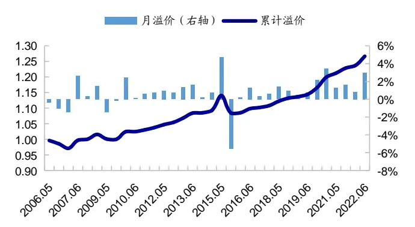
资料来源：Wind，海通证券研究所

5、6 月份的成长风格可能源于业绩支撑。随着年报、一季报披露完毕，一些成长股的成长属性得以验证。如下表所示，2005-2021 年，估值最高的 1/10 股票上年度净利润增速的中位数为 29.2%，显著高于估值最低的 1/10 股票（-5.3%）。业绩快速增长，基本面向好的成长股在年报披露完后的 5、6月份，更受投资者关注，收益表现相对较优。

表 6 估值因子分 10组多头组合和空头组合的业绩增速中位数（2005-2021）

|  | 1 季度净利润增速 |  |
| --- | --- | --- |
|  | D1 D10 | D1 D10 |
| 净利润增速中位数 | -5.4% 24.6% | -5.3% 29.2% |

资料来源：Wind，海通证券研究所

## 2.3 价量因子

2005 年 7 月至 2022 年 6 月，市场整体呈反转效应，低涨幅、低波动率、低换手率的股票具有正超额收益，反转因子、波动率因子、换手率因子的年化单位溢价分别为-5.3%、-5.7%、-7.8%。3 个价量因子的稳定性均较强，月胜率在 70%左右，统计显著。

整体来看，价量因子下半年的表现强于上半年。以反转因子为例，该因子在 1-6 月有效的概率大概在 60%左右，而 7-12月有效的概率基本都在 70%以上，可见反转因子下半年的稳定性更高。此外，2、3月份经历极端小盘行情后，4 月份低波、低换手率股票更胜一筹，小盘风格则暂时休整。

表 7 价量因子的月历效应统计（2005.07-2022.06）

|  | 反转 |  |  |  | 波动率 |  |  |  | 换手率 |  |  |  |
| --- | --- | --- | --- | --- | --- | --- | --- | --- | --- | --- | --- | --- |
|  | 年化单 位溢价 | 次胜率 | 年波动 率 | t值 | 年化单 位溢价 | 次胜率 | 年波动 率 | t值 | 年化单 位溢价 | 次胜率 | 年波动 率 | t值 |
| 1月 | -5.1% | 58.8% | 4.2% | -1.45 | -7.0% | 82.4% | 3.7% | -2.27 | -7.2% | 76.5% | 5.5% | -1.55 |
| 2月 | -6.2% | 58.8% | 4.0% | -1.85 | 4.4% | 64.7% | 3.9% | 1.35 | 8.0% | 70.6% | 5.5% | 1.75 |
| 3月 | -6.4% | 70.6% | 3.5% | -2.17 | -10.6% | 64.7% | 4.0% | -3.20 | -6.5% | 64.7% | 5.2% | -1.47 |
| 4月 | -1.1% | 64.7% | 3.1% | -0.42 | -7.0% | 76.5% | 3.0% | -2.78 | -13.2% | 76.5% | 5.0% | -3.14 |
| 5月 | -3.8% | 58.8% | 3.5% | -1.28 | 0.8% | 41.2% | 3.9% | 0.24 | -5.7% | 70.6% | 5.2% | -1.30 |
| 6月 | -3.8% | 47.1% | 4.0% | -1.14 | -6.7% | 64.7% | 5.8% | -1.36 | -9.9% | 64.7% | 7.5% | -1.57 |
| 7月 | -9.1% | 70.6% | 4.8% | -2.25 | -8.3% | 76.5% | 4.4% | -2.27 | -7.5% | 70.6% | 6.4% | -1.39 |
| 8月 | -5.4% | 70.6% | 4.5% | -1.42 | -6.9% | 70.6% | 4.2% | -1.94 | -11.3% | 82.4% | 4.7% | -2.88 |
| 9月 | -5.6% | 100.0% | 1.7% | -3.91 | -8.1% | 88.2% | 3.1% | -3.14 | -11.1% | 94.1% | 2.7% | -4.81 |
| 10月 | -5.2% | 70.6% | 2.8% | -2.20 | -4.3% | 64.7% | 3.4% | -1.50 | -6.0% | 64.7% | 5.8% | -1.23 |
| 11月 | -6.2% | 64.7% | 3.2% | -2.29 | -6.7% | 76.5% | 2.6% | -3.04 | -11.0% | 82.4% | 3.4% | -3.80 |
| 12月 | -6.1% | 76.5% | 3.8% | -1.93 | -7.9% | 70.6% | 5.0% | -1.89 | -11.9% | 76.5% | 4.4% | -3.18 |
| 全区间 | -5.3% | 67.6% | 3.6% | -6.08 | -5.7% | 69.1% | 4.1% | -5.77 | -7.8% | 71.1% | 5.3% | -5.99 |

资料来源：Wind，海通证券研究所

图17 价量因子不同月份的平均年化单位溢价（2005.07-2022.06）
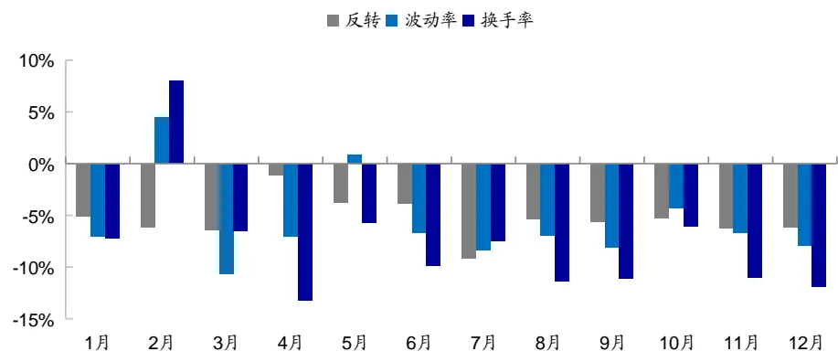
资料来源：Wind，海通证券研究所

为剔除异常值造成的影响，我们通过构建带有上半年（1-6 月份为 1）、下半年（7-12月份为 1）的虚拟变量，对价量因子的月溢价序列进行稳健回归。如表 8 所示，在考虑异常值影响后，上半年、下半年价量因子的溢价均显著为负，即反转效应在上半年和下半年均显著有效。相对而言，下半年的溢价要高于上半年，且稳定性更高，t值更显著。特别是对于换手率因子，上半年的年化单位溢价为-5.9%，下半年为-10.9%，两者相差5.1%，统计显著。可见，整体来看，下半年的价量因子表现相对更优。

表 8 价量因子月份虚拟变量的稳健性回归（2005.07-2022.06）

|  | 反转 |  |  | 波动率 |  |  | 换手率 |  |  |
| --- | --- | --- | --- | --- | --- | --- | --- | --- | --- |
|  | 年化单位溢价 | t值 | p值 | 年化单位溢价 | t值 | p值 | 年化单位溢价 | t值 | p值 |
| 上半年 | -3.5% | -2.85 | 0.005 | -4.1% | -3.09 | 0.002 | -5.9% | -3.49 | 0.001 |
| 下半年 | -6.0% | -4.93 | 0.000 | -7.0% | -5.29 | 0.000 | -10.9% | -6.49 | 0.000 |

资料来源：Wind，海通证券研究所

下半年反转效应相对较强可能与投资者情绪周期有关。上半年，投资者开始寻找新年的投资机会。在这个过程中，情绪相对乐观，热点主题和个股的延续性强，反转效应相应较弱。而下半年，情绪逐渐谨慎，热点的延续性较弱，涨幅也比上半年小。相应地，反转效应较强。

实际上，如下表所示，上半年涨幅最高的 100 只股票相对于全 A等权组合的平均超额收益率为 ，而下半年为 。即，以涨幅最高的 只股票反映的热点收益率，上半年比下半年高 13.7%。此外，统计截面个股收益分化度（波动率），上半年为 35.4%，下半年为 29.6%，上半年的个股分化度明显高于下半年，这也从另一方面反映出上半年热点的延续性较强。

表 9 上半年和下半年的热点延续性统计（2005.07-2022.06）

|  | 截面收益分化度 | top100 平均超额收益率 | bottom100 平均超额收益率 |
| --- | --- | --- | --- |
| 上半年 | 35.4% | 106.8% | -48.7% |
| 下半年 | 29.6% | 93.1% | -42.2% |

资料来源：Wind，海通证券研究所

## 2.4 基本面因子

2005 年 7 月至 2022 年 6 月，ROE因子、SUE因子的年化单位溢价分别为 4.6%、4.4%，统计显著。即平均来看，1个标准差的 ROE和 SUE 暴露，分别能带来 4.6%和4.4%的年化超额收益。

整体来看，年报和中报披露后，5-6 月份，9-10 月份，基本面因子表现较优，ROE和 SUE因子有效的概率较大。另外，岁末年初，在寻找投资主题的过程中，投资者也会比较注重公司基本面。

表 10 基本面因子的月历效应统计（2005.07-2022.06）

|  | ROE |  |  |  |  |  | SUE |  |  |  |
| --- | --- | --- | --- | --- | --- | --- | --- | --- | --- | --- |
|  | 年化单位 溢价 | 月胜率 | 年波动率 | t值 | p值 | 年化单位 溢价 | 月胜率 | 年波动率 | t值 | p值 |
| 1月 | 9.5% | 82.4% | 2.9% | 3.85 | 0.001 | 6.2% | 88.2% | 1.9% | 3.86 | 0.001 |
| 2月 | -5.7% | 52.9% | 4.6% | -1.48 | 0.158 | -2.0% | 47.1% | 2.8% | -0.82 | 0.424 |
| 3月 | 2.3% | 47.1% | 3.1% | 0.86 | 0.401 | 5.2% | 82.4% | 1.6% | 3.89 | 0.001 |
| 4月 | 4.1% | 64.7% | 4.3% | 1.13 | 0.274 | 2.9% | 76.5% | 2.2% | 1.60 | 0.130 |
| 5月 | 8.2% | 76.5% | 3.5% | 2.84 | 0.012 | 4.2% | 82.4% | 2.3% | 2.16 | 0.046 |
| 6月 | 16.2% | 100.0% | 3.4% | 5.62 | 0.000 | 9.7% | 94.1% | 2.0% | 5.92 | 0.000 |
| 7月 | 4.7% | 58.8% | 4.0% | 1.39 | 0.184 | 6.2% | 82.4% | 2.5% | 2.91 | 0.010 |
| 8月 | -1.9% | 58.8% | 3.8% | -0.62 | 0.547 | 1.5% | 58.8% | 1.8% | 0.99 | 0.335 |
| 9月 | 3.0% | 52.9% | 3.0% | 1.16 | 0.263 | 4.7% | 70.6% | 2.5% | 2.28 | 0.037 |
| 10月 | 5.0% | 64.7% | 2.9% | 2.09 | 0.053 | 6.2% | 76.5% | 2.0% | 3.58 | 0.003 |
| 11月 | -0.1% | 52.9% | 3.7% | -0.02 | 0.980 | 2.2% | 58.8% | 1.9% | 1.41 | 0.178 |
| 12月 | 10.4% | 76.5% | 3.3% | 3.69 | 0.002 | 5.9% | 76.5% | 2.9% | 2.40 | 0.029 |
| 全区间 | 4.6% | 63.2% | 3.8% | 4.96 | 0.000 | 4.4% | 75.0% | 2.3% | 7.81 | 0.000 |

资料来源：Wind，海通证券研究所

图18 ROE 因子不同月份的平均年化单位溢价（2005.07-2022.06）
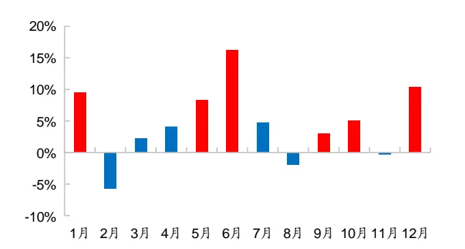
资料来源：Wind，海通证券研究所

图19 SUE 因子不同月份的平均年化单位溢价（2005.07-2022.06）
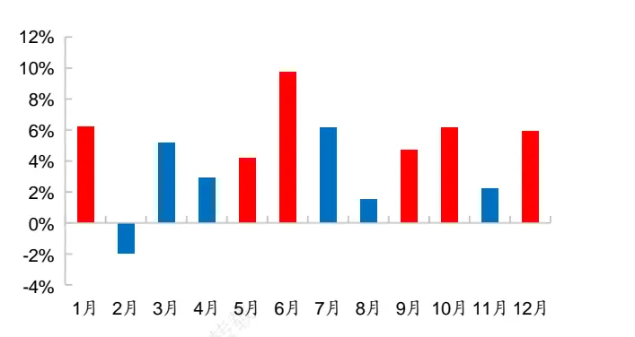
资料来源： ，海通证券研究所

为剔除异常值造成的影响，我们通过构建 5-6 月份、9-10 月份、12-1 月份因子值为1，其余月份为 0 的虚拟变量，对基本面因子的月溢价序列进行稳健回归。如表 11 所示，在考虑异常值影响后，上述月份基本面因子的溢价显著为正。ROE年化单位溢价为8.4%，SUE因子年化单位溢价为 6.5%，均显著优于其他月份。可见，年报、中报披露后及岁末年初，基本面因子的表现较为优异。

表 11 基本面因子月份虚拟变量的稳健性回归（2005.07-2022.06）

| -26 | ROE |  |  | SUE |  |  |
| --- | --- | --- | --- | --- | --- | --- |
|  | 年化单位溢价 | t值 | p值 | 年化单位溢价 | t值 | p值 |
| 岁末年初及年 报、中报期 | 8.4% | 6.91 | 0.000 | 6.5% | 8.22 | 0.000 |
| 其他月份 | 1.0% | 0.84 | 0.404 | 3.1% | 3.91 | 0.000 |

资料来源：Wind，海通证券研究所

## 2.5 小结

综上所述，过去 17 年间，常见因子的表现存在一定的月历效应。岁末年初，在寻找投资主题的过程中，投资者会比较关注公司基本面，基本面因子表现优异。2-3月份，受投资者情绪以及市场流动性宽松影响，小盘风格显著，小市值因子有效概率大。经历2、3 月份的极端小盘行情后，4月份低波动、低换手率股票更胜一筹，小盘风格则暂时休整。 月份，年报、一季报披露完毕，基本面优异的公司受到投资者较大关注， 、SUE 因子表现突出；同时，财报披露后，一些成长股的成长属性得以验证，成长风格走强的概率较大。进入下半年，与上半年相比，投资者情绪相对较为谨慎，热点延续性较弱，月收益率、换手率、波动率等反转类因子表现较为优异。此外，中报披露后的月份，基本面因子表现突出。

表 12 常见因子不同月份溢价的信息比（2005.07-2022.06）

|  | 市值 | 估值 | 反转 | 波动率 | 换手率 | ROE | SUE |
| --- | --- | --- | --- | --- | --- | --- | --- |
| 1月 | -0.05 | -0.82 | -1.22 | -1.91 | -1.30 | 3.23 | 3.25 |
| 2月 | -3.46 | -0.98 | -1.55 | 1.13 | 1.47 | -1.24 | -0.69 |
| 3月 | -3.28 | -1.12 | -1.82 | -2.69 | -1.24 | 0.72 | 3.27 |
| 4月 | 1.17 | -0.14 | -0.35 | -2.33 | -2.64 | 0.95 | 1.34 |
| 5月 | -1.76 | 1.92 | -1.08 | 0.20 | -1.10 | 2.38 | 1.82 |
| 6月 | 1.19 | 1.33 | -0.95 | -1.14 | -1.32 | 4.72 | 4.98 |
| 7月 | -0.36 | -1.60 | -1.89 | -1.91 | -1.17 | 1.17 | 2.44 |
| 8月 | -1.96 | -0.45 | -1.20 | -1.63 | -2.42 | -0.52 | 0.84 |
| 9月 | -0.19 | -0.58 | -3.28 | -2.64 | -4.04 | 0.98 | 1.92 |
| 10月 | 0.60 | 0.49 | -1.85 | -1.26 | -1.04 | 1.75 | 3.01 |
| 11月 | -1.09 | -1.25 | -1.93 | -2.55 | -3.19 | -0.02 | 1.18 |
| 12月 | 1.07 | -0.63 | -1.62 | -1.59 | -2.67 | 3.10 | 2.02 |
| 全区间 | -0.49 | -0.31 | -1.48 | -1.40 | -1.45 | 1.20 | 1.90 |

资料来源：Wind，海通证券研究所

## 3.假日效应

除双休日外，A 股休市的节假日包括：元旦、春节、清明、五一、端午、中秋、国庆。统计假期前 5 个交易日和后 5个交易日的因子溢价，结果如下表所示。

表 13 常见因子的假日效应（2005.07-2022.06）

|  |  | 均值 | 溢价>0 比例 | 波动率 | t值 | p值 |
| --- | --- | --- | --- | --- | --- | --- |
| 市值 | 假期前 | 0.40% | 62.6% | 1.07% | 3.84 | 0.000 |
|  | 假期后 | -0.38% | 30.8% | 1.17% | -3.37 | 0.001 |
|  | 前-后 | 0.78% | 73.8% | 1.73% | 5.08 | 0.000 |
| 估值 | 假期前 | 0.00% | 56.1% | 0.51% | 0.04 | 0.966 |
|  | 假期后 | -0.21% | 42.1% 使用 | 0.72% | -2.98 | 0.004 |
|  | 前-后 | 0.21% | 60.7% | 0.93% | 2.46 | 0.015 |
| 反转 | 假期前 | -0.10% | 36.4% | 0.61% | -1.67 | 0.098 |
|  | 假期后 | -0.21% | 29.9% | 0.66% | -3.27 | 0.001 |
|  | 前-后 | 0.11% | 51.4% | 0.92% | 1.28 | 0.204 |
| 波动率 | 假期前 | -0.09% | 45.8% | 0.53% | -1.84 | 0.068 |
|  | 假期后 | 0.02% | 56.1% | 0.73% | 0.23 | 0.822 |
|  | 前-后 | -0.11% | 42.1% | 0.84% | -1.26 | 0.208 |
| 换手率 | 假期前 | -0.40% | 20.6% | 0.67% | -6.13 | 0.000 |
|  | 假期后 | 0.16% | 55.1% | 0.90% | 1.83 | 0.071 |
|  | 前-后 | -0.56% | 30.8% | 1.12% | -5.12 | 0.000 |
| ROE | 假期前 | 0.23% | 76.6% |  |  | 0.000 |
|  | 假期后 | 0.11% | 57.9% | 0.37% 0.47% | 6.53 2.51 | 0.014 |
|  | 前-后 | 0.12% | 58.9% |  |  | 0.044 |
| SUE | 假期前 | 0.10% |  | 0.56% | 2.02 | 0.000 |
|  | 假期后 | 0.09% | 72.9% 70.1% | 0.21% 0.27% | 5.23 3.39 | 0.001 |
|  | 前-后 | 0.02% | 50.5% | 0.36% | 0.52 | 0.603 |

资料来源：Wind，海通证券研究所

节前市场追逐确定性，低换手、高盈利的大盘蓝筹股更受投资者青睐。大市值、低换手率、高ROE因子的平均5日溢价分别为0.40%、0.40、0.23%，次胜率分别为62.6%、79.4%、76.6%，表现突出；选股收益明显优于其他因子，且显著强于节后（表 13）。

节后市场转而追求高弹性，前期跌得多的个股、小盘成长股，更受投资者欢迎。小市值、高估值、反转因子的平均 5日溢价分别为 0.38%、0.21%、0.21%，次胜率分别为 69.2%、57.9%、70.1%，均在 1%的臵信度下统计显著，表现突出，选股收益明显优于其他因子。基本面因子中，节后盈利因子的表现明显下滑；而 SUE因子则整体较为稳定，节前节后无显著差异。

图20 市值因子假期前后 5 日的累计溢价（2005.07- 2022.06）
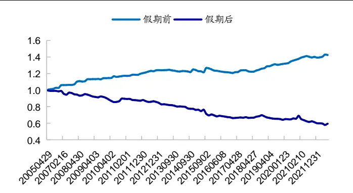
资料来源：Wind，海通证券研究所

图21 估值因子假期前后 5 日的累计溢价（2005.07- 2022.06）
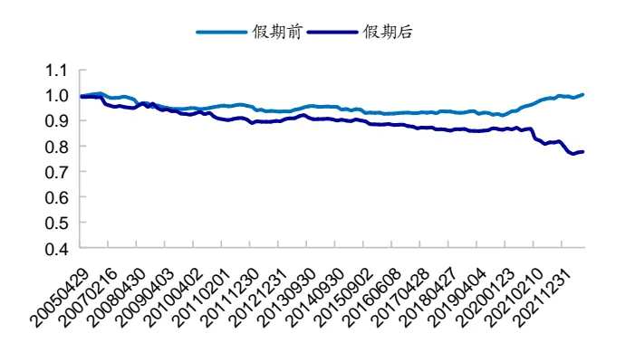
资料来源：Wind，海通证券研究所

图22 反转因子假期前后 5 日的累计溢价（2005.07- 2022.06）
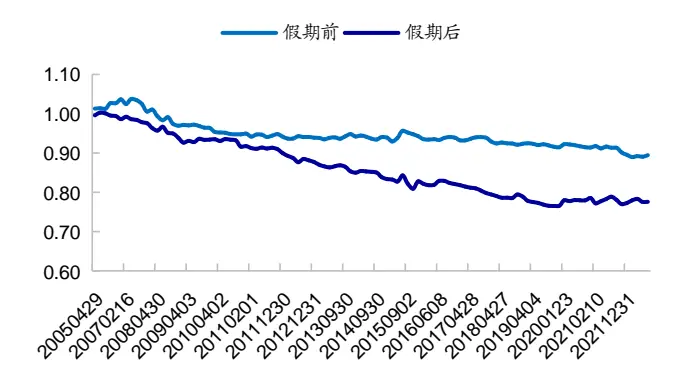
资料来源：Wind，海通证券研究所

图23 换手率因子假期前后 5 日的累计溢价（2005.07- 2022.06）
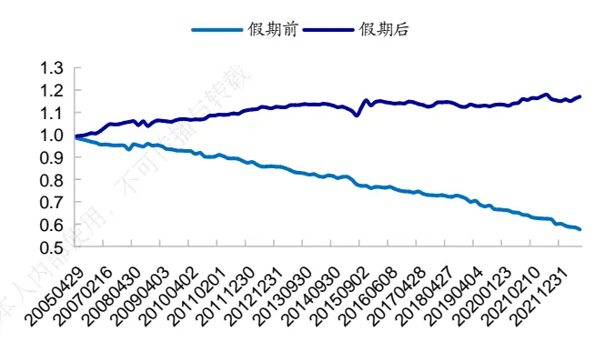
资料来源：Wind，海通证券研究所

图24 ROE 因子假期前后 5 日的累计溢价（2005.07- 2022.06）
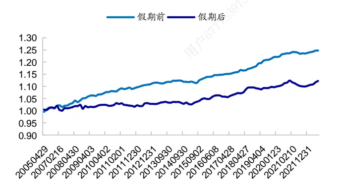
资料来源：Wind，海通证券研究所

图25 SUE 因子假期前后 5 日的累计溢价（2005.07- 2022.06）
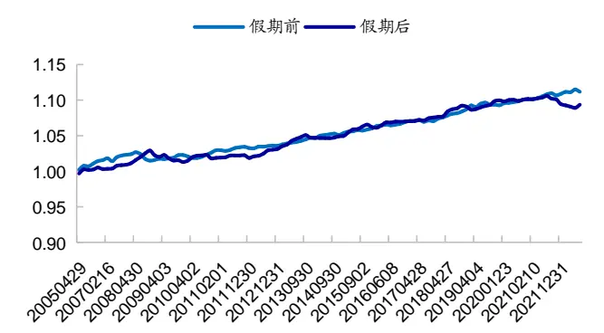
资料来源：Wind，海通证券研究所

## 4. 季节效应的简单应用

根据因子的季节效应，我们可以做一些简单的应用。例如，配臵一定比例的卫星策略，或者在风控模型中放松风格约束等，以此来增加组合在相应风格上的暴露，提升业绩表现。

## 4.1 策略配臵

根据节假日效应，节前市场追逐确定性，低换手、高盈利的大盘蓝筹股表现优异。

因此，节前可配臵相关风格的策略，如高盈利组合。该组合节前 5 个交易日相对 wind全 A指数的平均超额收益为 0.75%，次胜率 65.6%，统计显著（表 14）。高盈利组合的构建可参见《如何优雅地抄基金经理作业（四）——盈利、增长、现金流：不可多得的基本面三角》。

而节后，市场追求高弹性，前期跌得多的、小盘成长股，更受投资者欢迎。因此，节后可配臵相关风格的策略，如小市值+高增长组合。该组合节前平均跑输 wind 全 A指数 0.18%；而节后表现优异，相对市场平均超额 1.55%，次胜率 75.0%，统计显著。小市值+高增长组合的构建可参见《选股因子系列研究（八十三）——盈利加速的定量刻画与高增长组合的构建》。

即，从持有 5个交易日的结果来看，节前高盈利组合表现优异，而节后小市值+高增长组合表现突出。

图26 假期前 5日，小市值+高增长组合、高盈利组合相对 wind全 的累计超额（ ）
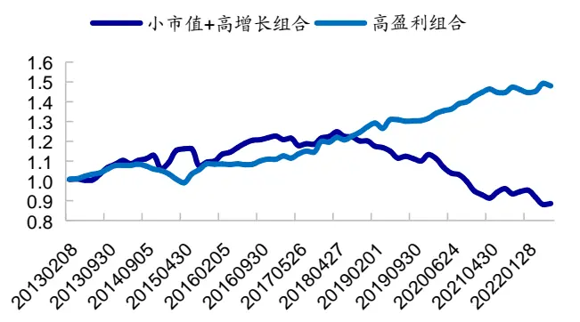
资料来源：Wind，海通证券研究所

图27 假期后 5日，小市值+高增长组合、高盈利组合相对 wind全 A 的累计超额（2013.01- 2022.06）
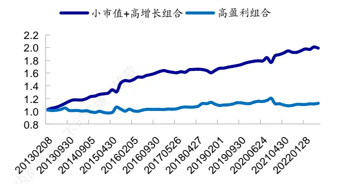
资料来源：Wind，海通证券研究所

表 14 假期前后 5日，小市值+高增长组合与高盈利组合的业绩表现（2013.01- 2022.06）

|  |  | 次均收益 | 次胜率 | 波动率 | t值 | p值 |
| --- | --- | --- | --- | --- | --- | --- |
| 假期前5日 组合-wind 全 A | 小市值+高增长组合 | -0.18% | 57.8% | 2.7% | -0.54 | 0.592 |
|  | 高盈利组合 | 0.75% | 65.6% | 1.7% | 3.46 | 0.001 |
| 假期后5日 组合-wind 全 A | 小市值+高增长组合 | 1.55% | 75.0% | 3.0% | 4.18 | 0.000 |
|  | 高盈利组合 | 0.20% | 54.7% | 2.2% | 0.71 | 0.482 |
| 小市值+高增长 -高盈利 | 假期前5日 | -0.93% | 43.8% | 3.6% | -2.09 | 0.040 |
|  | 假期后5日 | 1.35% | 64.1% | 4.7% | 2.32 | 0.024 |

资料来源：Wind，海通证券研究所

图28 假期前后，小市值+高增长、高盈利组合相对 wind 全 A 指数的平均累计超额收益（2005.07-2022.06）
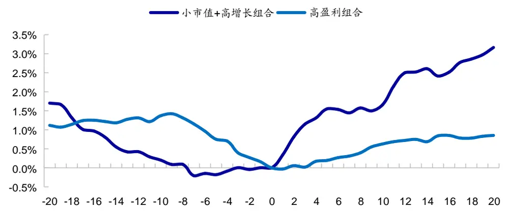
资料来源：Wind，海通证券研究所

上图统计假期前后 1-20 个交易日，小市值+高增长组合与高盈利组合相对于 wind全 A 指数的平均累计超额收益。结果显示，假期前 1-10 个交易日，高盈利组合超额收益突出，且显著优于小市值+高增长组合。而假期后，特别是假期后 1-5 个交易日，小市值+高增长组合超额收益突出，且显著优于高盈利组合。可见，节前更适合配臵高盈利组合，而节后小市值+高增长组合的超额收益空间更大。

## 4.2 风控模型放松约束

例如，对于市值因子，若将 2、3、5、8 月份的市值暴露由 0放松到 0.5 个标准差，其他月份保持市值中性不变，对指数增强组合超额收益表现有显著提升。由下表可见，该方法可以在不明显增加风险的情况下，提升沪深 300 和中证 500 指数增强组合的超额收益率。特别是对于 alpha 来源较少的沪深 300 增强组合而言，更是如此。年化超额收益可由 10.7%提升至 14.1%；分年度来看，过去 10 年中有 9年均跑赢原组合。

表 15 放松市值约束对指数增强组合超额收益表现的影响（2013.04-2022.06）

|  | 沪深 300 增强组合 |  |  |  |  | 中证 500 增强组合 |  |  |  |  |  |
| --- | --- | --- | --- | --- | --- | --- | --- | --- | --- | --- | --- |
|  | 原沪深 300 增强组合 超额收 跟踪误 | 最大回 | 超额收 跟踪误 | 2、3、5、8月份放开市值敞口 | 最大回 |  | 原中证 500 增强组合 |  |  | 2、3、5、8月份放松市值敞口 |  |
|  |  |  |  |  |  | 超额收 跟踪误 |  |  |  | 最大回 超额收 | 跟踪误 最大回 |
| 2013 | 益 10.6% | 差 5.1% | 撤 4.1% | 益 差 12.4% 5.4% | 撤 4.4% | 益 18.4% | 差 5.4% | 撤 3.2% | 益 18.0% | 差 5.4% | 撤 3.3% |
| 2014 | 9.8% | 4.1% | 4.1% | 18.4% | 4.1% 2.6% | 28.6% | 4.1% | 1.1% | 39.1% | 4.2% | 1.2% |
| 2015 | 20.9% | 5.8% | 3.7% | 28.0% 6.2% | 3.2% | 48.6% | 10.6% | 4.8% | 60.1% | 10.5% | 4.4% |
| 2016 | 5.1% | 3.3% | 2.4% | 7.1% 3.5% | 2.4% | 16.9% | 4.5% | 2.3% | 17.7% | 5.0% | 1.9% |
| 2017 | 14.3% | 3.1% | 1.4% | 12.1% | 3.1% 1.6% | 11.5% | 4.2% | 3.9% | 8.1% | 4.3% | 4.0% |
| 2018 | 5.4% | 3.3% | 2.3% | 5.7% | 3.5% 2.6% | 9.0% | 5.0% | 2.7% | 7.3% | 5.5% | 5.2% |
| 2019 | 3.4% | 3.1% | 3.4% | 7.4% | 3.3% 3.2% | 12.5% | 4.7% | 7.1% | 15.8% | 4.7% | 3.9% |
| 2020 | 16.6% | 4.6% | 2.7% | 20.9% | 4.3% 2.2% | 20.5% | 6.4% | 3.3% | 19.3% | 6.5% | 3.3% |
| 2021 | 14.3% | 5.9% | 3.7% | 19.3% | 5.7% 3.7% | 20.7% | 7.5% | 4.5% | 20.3% | 7.6% | 5.0% |
| 2022 | 1.1% | 6.9% | 3.9% | 3.8% | 6.5% 3.6% | 1.8% | 4.6% | 2.3% | 5.6% | 6.7% | 2.3% |
| 全区间 | 10.7% | 4.5% | 4.2% | 14.1% | 4.6% | 4.4% | 18.7% 6.1% | 7.1% | 20.4% | 6.3% | 5.2% |

资料来源： ，海通证券研究所

对于估值因子，若 5、6 月份较强的成长风格得以延续，那么我们可以在这两个月份放松估值敞口（由 0.2 放大为 1）。结果显示，这两个月较宽松的成长风格暴露，可以在不明显增加风险的情况下，提升指数增强组合的超额收益率，年化提升 ；分年度来看，过去 年间有 年均跑赢原组合。

表 16 放松估值约束对中证 500增强组合超额收益表现的影响（2013.04-2022.06）

|  | 原中证 500 增强组合 |  |  |  | 5、6月份放开估值敞口 |  |  |  |
| --- | --- | --- | --- | --- | --- | --- | --- | --- |
|  | 超额收益 | 跟踪误差 | 信息比 | 最大回撤 | 超额收益 | 跟踪误差 | 信息比 | 最大回撤 |
| 2013 | 18.0% | 5.4% | 3.85 | 3.3% | 18.7% | 5.5% | 3.90 | 3.3% |
| 2014 | 39.1% | 4.2% | 6.08 | 1.2% | 37.7% | 4.2% | 5.85 | 1.2% |
| 2015 | 60.1% | 10.5% | 3.76 | 4.4% | 58.9% | 10.5% | 3.70 | 4.4% |
| 2016 | 17.7% | 5.0% | 4.17 | 1.9% | 17.7% | 5.1% | 4.12 | 1.9% |
| 2017 | 8.1% | 4.3% | 1.86 | 4.0% | 8.4% | 4.3% | 1.92 | 4.0% |
| 2018 | 7.3% | 5.5% | 1.98 | 5.2% | 8.0% | 5.5% | 2.16 | 5.2% |
| 2019 | 15.8% | 4.7% | 2.52 | 3.9% | 16.1% | 4.7% | 2.55 | 3.9% |
| 2020 | 19.3% | 6.5% | 2.36 | 3.3% | 20.2% | 6.5% | 2.45 | 3.2% |
| 2021 | 20.3% | 7.6% | 2.28 | 5.0% | 23.7% | 7.7% | 2.59 | 5.0% |
| 2022 | 5.6% | 6.7% | 1.97 | 2.3% | 5.9% | 6.7% | 2.07 | 2.3% |
| 全区间 | 20.4% | 6.3% | 2.94 | 5.2% | 21.0% | 6.4% | 2.99 | 5.2% |

资料来源：Wind，海通证券研究所

## 5. 总结

年 月至 年 月的 年间， 股整体呈小盘价值风格，即小市值、低估值股票优于大市值、高估值股票；但与其他因子相比，这两个因子波动率大、稳定性低，月胜率仅 左右。而低涨幅、低波动、低换手、高 和高 异象统计显著，且稳定性高，年胜率在 左右。整体来看，同类因子相关性较强，而不同类别因子相关性较弱。此外，小市值因子与反转因子呈正相关关系，即小盘风格较强时，反转效应突出。低估值因子与波动率因子显著正相关，而与 ROE、SUE显著负相关。即价值风格下，低波动的股票表现优异；而成长风格下，盈利好、增速快的公司表现突出。

常见选股因子表现出一定的季节效应，主要包括月历效应和假日效应。

岁末年初，在寻找投资主题的过程中，投资者会比较关注公司基本面，基本面因子表现优异。 月份，受投资者情绪以及市场流动性宽松影响，小盘风格显著，小市值因子有效概率大。经历 2、3 月份的极端小盘行情后，4 月份低波动、低换手率股票更胜一筹，小盘风格则暂时休整。 月份，年报、一季报披露完毕，基本面优异的公司受到投资者较大关注，ROE、SUE 因子表现突出；同时，财报披露后，一些成长股的成长属性得以验证，成长风格走强的概率较大。进入下半年，与上半年相比，投资者情绪相对较为谨慎，热点延续性较弱，月收益率、换手率、波动率等反转类因子表现较为优异。此外，中报披露后，9-10 月份，基本面因子表现突出。

从节假日角度来看，节前市场追逐确定性，低换手、高盈利的大盘蓝筹股，更受投资者青睐。大市值、低换手率、高 ROE因子表现突出，选股收益明显优于其他因子，且显著强于节后。节后市场转而追求高弹性，前期跌得多的个股、小盘成长股，更受投资者欢迎。小市值、高估值、反转因子表现突出，选股收益明显优于其他因子。

若季节效应得以延续，在部分时间点，我们可以配臵一定比例相应风格的卫星策略；或者在指增风控模型中放松相应风格的约束，来增加因子暴露，提升业绩表现。例如，节前高盈利策略超额收益显著，而节后小市值+高增长策略超额收益空间更大。即相对而言，节前更适合配臵高盈利组合，而节后则可配臵小市值+高增长组合。对于指增策略而言，有条件地放松风格因子的约束，可以在不明显增加风险的情况下，较为明显地提升沪深 300 和中证 500 指数增强组合的超额收益率。

## 6.风险提示

历史统计规律失效风险，模型误设风险。

## 信息披露

分析师声明

[Table冯佳睿yst金融工程研究团队s]

罗蕾金融工程研究团队

本人具有中国证券业协会授予的证券投资咨询执业资格，以勤勉的职业态度，独立、客观地出具本报告。本报告所采用的数据和信息均来自市场公开信息，本人不保证该等信息的准确性或完整性。分析逻辑基于作者的职业理解，清晰准确地反映了作者的研究观点，结论不受任何第三方的授意或影响，特此声明。

## 法律声明

本报告仅供海通证券股份有限公司（以下简称 本公司 ）的客户使用。本公司不会因接收人收到本报告而视其为客户。在任何情况下，本报告中的信息或所表述的意见并不构成对任何人的投资建议。在任何情况下，本公司不对任何人因使用本报告中的任何内容所引致的任何损失负任何责任。

本报告所载的资料、意见及推测仅反映本公司于发布本报告当日的判断，本报告所指的证券或投资标的的价格、价值及投资收入可能转会波动。在不同时期，本公司可发出与本报告所载资料、意见及推测不一致的报告。 播

市场有风险，投资需谨慎。本报告所载的信息、材料及结论只提供特定客户作参考，不构成投资建议，也没有考虑到个别客户特殊的投资目标、财务状况或需要。客户应考虑本报告中的任何意见或建议是否符合其特定状况。在法律许可的情况下，海通证券及其所属，关联机构可能会持有报告中提到的公司所发行的证券并进行交易，还可能为这些公司提供投资银行服务或其他服务。使

本报告仅向特定客户传送，未经海通证券研究所书面授权，本研究报告的任何部分均不得以任何方式制作任何形式的拷见，复印件或复制品，或再次分发给任何其他人，或以任何侵犯本公司版权的其他方式使用。所有本报告中使用的商标、服务标记及标记均为本公司的商标、服务标记及标记。如欲引用或转载本文内容，务必联络海通证券研究所并获得许可，并需注明出处为海通证券研究所，且不得对本文进行有悖原意的引用和删改。

根据中国证监会核发的经营证券业务许可，海通证券股份有限公司的经营范围包括证券投资咨询业务。26

海通证券股份有限公司研究所[Table_PeopleInfo]
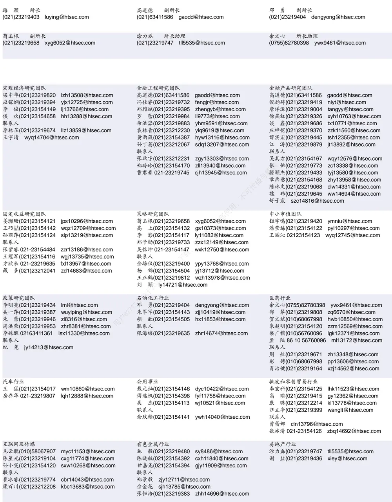

| 电子行业 |  | 煤炭行业 |  |  | 电力设备及新能源行业 |  |
| --- | --- | --- | --- | --- | --- | --- |
| 李 轩(021)23154652 | lx12671@htsec.com |  | 李 淼(010)58067998 | Im10779@htsec.com | 张一弛(021)23219402 | zyc9637@htsec.com |
| 肖隽翀(021)23154139 | xjc12802@htsec.com | 王 | 涛(021)23219760 | wt12363@htsec.com | 房 青(021)23219692 | fangq@htsec.com |
| 华晋书 02123219748 | hjs14155@htsec.com |  | 吴 杰(021)23154113 wj10521@htsec.com |  | 徐柏乔(021)23219171 | xbq6583@htsec.com |
| 联系人 | 薛逸民(021)23219963 xym13863@htsec.com | 联系人 | 朱 彤(021)23212208 zt14684@htsec.com |  | 张 磊(021)23212001 联系人 | zl10996@htsec.com |
| 文 灿(021)23154401 | wc13799@htsec.com |  |  |  | 姚望洲(021)23154184 | ywz13822@htsec.com |
| 李 潇(010)58067830 | lx13920@htsec.com |  |  |  | 柳文韬(021)23219389 | Iwt13065@htsec.com |
|  |  |  |  |  | 吴锐鹏 |  |
|  |  |  |  |  | wrp14515@htsec.com 马菁菁 mji14734@btsec |  |

| 基础化工行业 |  | 计算机行业 |  | 通信行业 |  |
| --- | --- | --- | --- | --- | --- |
| 刘 威(0755)82764281 张翠翠(021)23214397 孙维容(021)23219431 李 智(021)23219392 | Iw10053@htsec.com zcc11726@htsec.com swr12178@htsec.com lz11785@htsec.com | 郑宏达(021)23219392 杨 林(021)23154174 于成龙(021)23154174 洪 琳(021)23154137 | zhd10834@htsec.com yl11036@htsec.com ycl12224@htsec.com hl11570@htsec.com | 余伟民(010)50949926 杨彤昕 010-56760095 联系人 | ywm11574@htsec.com ytx12741@htsec.com |
| 李 博 Ib14830@htsec.com |  | 联系人 杨 蒙(0755)23617756 ym13254@htsec.com |  | 夏 凡(021)23154128 xf13728@htsec.com 徐 卓 xz14706@htsec.com |  |
| 非银行金融行业 |  | 交通运输行业 |  | 纺织服装行业 |  |
| 何 婷(021)23219634 ht10515@htsec.com |  | 虞 楠(021)23219382 yun@htsec.com |  | 梁 希(021)23219407 lx11040@htsec.com sk11787@htsec.com |  |
| 任广博(010)56760090 rgb12695@htsec.com |  | 罗月江(010）56760091 lyj12399@htsec.com |  | 盛 开(021)23154510 |  |
| 孙 婷(010)50949926 st9998@htsec.com |  | 陈 宇(021)23219442 cy13115@htsec.com |  | 联系人 |  |
| 联系人 |  |  |  | 王天璐(021)23219405 wtl14693@htsec.com |  |
| 曹 锟010-56760090 ck14023@htsec.com 肖 尧(021)23154171 |  |  |  |  |  |
| xy14794@htsec.com |  | 机械行业 |  |  |  |
| 建筑建材行业 冯晨阳(021)23212081 fcy10886@htsec.com |  | 赵玥炜(021)23219814 zyw13208@htsec.com |  | 钢铁行业 刘彦奇(021)23219391 liuyq@htsec.com |  |
| 潘莹练(021)23154122 pyl10297@htsec.com 申 浩(021)23154114 sh12219@htsec.com |  | 赵靖博(021)23154119 zjb13572@htsec.com 联系人 |  |  |  |
| 颜慧菁 yhj12866@htsec.com |  | 刘绮雯(021)23154659 lqw14384@htsec.com |  |  |  |
| 建筑工程行业 |  | 食品饮料行业 3使 |  | 军工行业 |  |
| 张欣劫 18515295560 zxj12156@htsec.com |  | 颜慧菁 yhj12866@htsec.com |  | 张恒晅 zhx10170@htsec.com |  |
| 联系人 |  | 张宇轩(021)23154172 zyx11631@htsec.com |  | 联系人 |  |
| 曹有成 18901961523 cyc13555@htsec.com |  | 程碧升(021)23154171 cbs10969@htsec.com |  | 刘砚菲 021-2321-4129 lyf13079@htsec.com |  |
| 郭好格 13718567611 ghg14711@htsec.com |  | 联系人 张嘉颖(021)23154019 |  | 胡舜杰(021)23154483 hsj14606@htsec.com |  |
| 银行行业 |  | zjy14705@htsec.com |  | 家电行业 |  |
| 林加力(021)23154395 ljl12245@htsec.com |  | 社会服务行业 汪立亭(021)23219399 wanglt@htsec.com |  | 陈子仪(021)23219244 chenzy@htsec.com |  |
| 联系人 |  | 许樱之(755)82900465 xyz11630@htsec.com |  | 李 阳(021)23154382 ly11194@htsec.com |  |
| 董栋梁(021) 23219356 ddl13206@htsec.com |  |  |  | 朱默辰(021)23154383 zmc11316@htsec.com |  |
|  |  | 联系人 |  | 刘 璐(021)23214390 II11838@htsec.com |  |
| 徐凝碧(021)23154134 xnb14607@htsec.com |  | 毛弘毅(021)23219583 mhy13205@htsec.com 王祎婕(021)23219768 wyj13985@htsec.com |  |  |  |

## 造纸轻工行业

郭庆龙 gql13820@htsec.com

高翩然 gpr14257@htsec.com

吕科佳 lkj14091@htsec.com

王文杰 wwj14034@htsec.com

## 研究所销售团队

深广地区销售团队

伏财勇(0755)23607963 fcy7498@htsec.com

蔡铁清(0755)82775962 ctq5979@htsec.com

辜丽娟(0755)83253022 gulj@htsec.com

刘晶晶(0755)83255933 liujj4900@htsec.com

饶 伟(0755)82775282 rw10588@htsec.com

欧阳梦楚(0755)23617160

oymc11039@htsec.com

巩柏含 gbh11537@htsec.com

滕雪竹 0755 23963569 txz13189@htsec.com

张馨尹 0755-25597716 zxy14341@htsec.com上海地区销售团队胡雪梅(021)23219385 huxm@htsec.com黄 诚(021)23219397 hc10482@htsec.com季唯佳(021)23219384 jiwj@htsec.com黄 毓(021)23219410 huangyu@htsec.com李 寅 021-23219691 ly12488@htsec.com胡宇欣(021)23154192 hyx10493@htsec.com马晓男 mxn11376@htsec.com邵亚杰 23214650 syj12493@htsec.com杨祎昕(021)23212268 yyx10310@htsec.com毛文英(021)23219373 mwy10474@htsec.com谭德康 tdk13548@htsec.com王祎宁(021)23219281 wyn14183@htsec.com张歆钰 zxy14733@htsec.com周之斌 zzb14815@htsec.com

北京地区销售团队
朱 健(021)23219592 zhuj@htsec.com
殷怡琦(010)58067988 yyq9989@htsec.com
郭 楠 010-5806 7936 gn12384@htsec.com
杨羽莎(010)58067977 yys10962@htsec.com
张丽萱(010)58067931 zlx11191@htsec.com
郭金垚(010)58067851 gjy12727@htsec.com
张钧博 zjb13446@htsec.com
高 瑞 gr13547@htsec.com
上官灵芝 sglz14039@htsec.com
董晓梅 dxm10457@htsec.com
姚 坦 yt14718@htsec.com

海通证券股份有限公司研究所

地址：上海市黄浦区广东路 689号海通证券大厦 9楼

电话：（021）23219000

传真：（021）23219392

网址：www.htsec.com