## [Tab相关研究

Table_ReportInfo]《选股因子系列研究（五十六）——买卖单数据中的 Alpha》2019.11.05《选股因子系列研究（五十七）——基于主动买入行为的选股因子》《选股因子系列研究（七十二）——大单的精细化处理与大单因子重构》2021.01.18

分析师:冯佳睿

Tel:(021)23219732

Email:fengjr@htsec.com

证书:S0850512080006

分析师:袁林青

Tel:(021)23212230

Email:ylq9619@htsec.com

证书:S0850516050003

# 选股因子系列研究（八十五）——买卖单主动成交中的隐藏信息

## 投资要点：

在系列前期报告中，我们基于逐笔成交数据中的买单号与卖单号还原买单与卖单，并基于各股票买卖单成交额的分布，计算大单阈值及大单相关因子。进一步研究发现，虽然逐笔成交数据的每笔成交都有明确的主动成交方向（集合竞价时段的成交除外），但是买单（卖单）并非完全是由主动买入（主动卖出）构成。因此，我们可在大单、中单和小单的基础上，计算各类单的主动成交度，并构建相应因子。

小单主动成交度的月度选股能力较为突出。即，小单的主动成交性越强，股票未来超额表现越好。相比而言，小买单主动成交度略强于小卖单主动成交度，因子月均 IC 达 0.05。组间收益单调性较强、多空收益分布相对较为均匀。因子月度多空收益为 1.78%，月均多头超额收益达 0.80%。

- 基于不同时段计算的小单主动成交度皆呈现出显著的月度选股能力。相比而言，盘中（10:00-15:00）小买单主动成交度的选股能力更加显著。此外，小买单超额主动成交度因子并未呈现出更强的选股能力，而小卖单超额主动成交度的月度选股能力优于小卖单主动成交度。

- 正交后的因子表现。使用全天及盘中数据计算得到的小买单主动成交度因子在正交后，依旧具有显著的截面选股能力。此外，因子多空收益虽受到正交的影响有所下滑，但分布依旧较为均匀。

- 不同选股空间中的因子表现。原始因子在中证 800 外有更高的 IC。但正交后，因子在中证 800 内外的选股能力差距明显收窄。多头超额收益呈现类似特征，正交前后，因子均在中证 800 外有更显著的选股能力，但正交在一定程度上缩小了这种差异。

周度选股能力。与月度的结果类似，原始因子在中证 800 外呈现更高的周均 IC。但这一差距在正交后明显减弱，因子在不同选股范围中的周均 IC 较为接近。因子在中证 800 外的多头超额收益表现更好。正交后，这一现象依然较为明显。

- 中证 500增强组合添加测试。当基础模型中不包含深度学习高频因子时，小买单主动成交度因子的引入有助于提升组合的收益表现。随着约束条件的不同，年化超额收益的提升幅度在 0.5%-1.5%之间。但当基础模型包含深度学习因子时，超额收益的提升并不稳定，决定于所选的风控模型参数。中证 1000 增强组合的添加测试结果类似。

- 风险提示。市场系统性风险、资产流动性风险以及政策变动风险会对策略表现产生较大影响。

在系列前期报告中，我们基于逐笔成交数据中的买单号与卖单号还原买单与卖单，并基于各股票买卖单成交额的分布，计算大单阈值及大单相关因子。进一步研究发现，虽然逐笔成交数据的每笔成交都有明确的主动成交方向（集合竞价时段的成交除外），但是买单（卖单）并非完全是由主动买入（主动卖出）构成。因此，我们可在大单、中单和小单的基础上，计算各类单的主动成交度，并构建相应因子。

本文共分为五个部分，第一部分简要阐述买单与卖单主动成交度因子的构建思路，第二部分讨论因子的选股能力，第三部分对比因子在加入中证 500 增强及中证 1000 增强组合后对组合收益的影响，第四部分总结全文，第五部分提示风险。

## 1. 买单与卖单的主动成交度

在系列前期报告《选股因子系列研究（五十六）——买卖单数据中的 Alpha》、《选股因子系列研究（七十二）——大单的精细化处理与大单因子重构》中，我们介绍了如何基于逐笔成交数据中的买单号与卖单号对股票的买单与单进行还原。下表为某股票2022 年 8 月 31 日的部分逐笔成交数据示例。

表 1 某股票 2022年 8月 31日部分逐笔成交数据

| 日期 | 时间 | BS 标志 | 成交价格 | 成交量 | 成交金额 | 卖单号 | 买单号 |
| --- | --- | --- | --- | --- | --- | --- | --- |
| 20220831 | 93013070 | B | 12.37 | 1300 | 16081 | 1059641 | 1067061 |
| 20220831 | 93013780 | B | 12.38 | 2000 | 24760 | 375071 | 1089354 |
| 20220831 | 93014060 | S | 12.37 | 600 | 7422 | 1098116 | 1067061 |
| 20220831 | 93014150 | S | 12.37 | 100 部使用， | 1237 | 1100016 | 1067061 |
| 20220831 | 100555780 | B | 12.6 | 2100 | 26460 | 13817379 | 13821190 |
| 20220831 | 100555780 | B | 12.6 | 700 | 8820 | 13818562 | 13821190 |
| 20220831 | 100555780 | B | 12.6 | 100 | 1260 | 13818637 | 13821190 |
| 20220831 | 100555780 | B | 12.6 | 1000 | 12600 | 13820328 | 13821190 |
| 20220831 | 100555900 | S | 12.6 | 500 | 6300 | 13821562 | 13821190 |
| 20220831 | 100555940 | S | 12.6 | 500 | 6300 | 13821674 | 13821190 |
| 20220831 | 100556480 | B | 12.61 | 2500 | 31525 | 13591202 | 13823304 |
| 20220831 | 100556480 | B | 12.61 | 500 | 6305 | 13594235 | 13823304 |
| 20220831 | 100556480 | B | 12.61 | 800 | 10088 | 13596475 | 13823304 |
| 20220831 | 100556480 | B | 12.61 | 200 | 2522 | 13598731 | 13823304 |
| 20220831 | 100556490 | S | 12.6 | 100 | 1260 | 13823321 | 13821190 |

资料来源：海通证券研究所整理

我们尝试对上表中买单号为 1067061 和 13821190 的买单进行还原，结果如下表所示。买单号为 1067061 的买单总金额为 24,740 元，其中主动买入成交金额为 16,081元，被动买入成交金额为 8,659 元；买单号为 13821190 的买单总金额为 63,000 元，其中主动买入成交金额为 49,140 元，被动买入成交金额为 13,860 元。

表 2 部分买单还原结果

| 日期 | 时间 | BS 标志 | 成交价格 | 成交量 | 成交金额 | 卖单号 | 买单号 |
| --- | --- | --- | --- | --- | --- | --- | --- |
| 20220831 | 93013070 | B | 12.37 | 1300 | 16081 | 1059641 | 1067061 |
| 20220831 | 93014060 | S | 12.37 | 600 | 7422 | 1098116 | 1067061 |
| 20220831 | 93014150 | S | 12.37 | 100 | 1237 | 1100016 | 1067061 |
|  |  | 总计 |  | 2000 | 24740 |  |  |
| 20220831 | 100555780 | B | 12.6 | 2100 | 26460 | 13817379 | 13821190 |
| 20220831 | 100555780 | B | 12.6 | 700 | 8820 | 13818562 | 13821190 |
| 20220831 | 100555780 | B | 12.6 | 100 | 1260 | 13818637 | 13821190 |
| 20220831 | 100555780 | B | 12.6 | 1000 | 12600 | 13820328 | 13821190 |
| 20220831 | 100555900 | S | 12.6 | 500 | 6300 | 13821562 | 13821190 |
| 20220831 | 100555940 | s | 12.6 | 500 | 6300 | 13821674 | 13821190 |
| 20220831 | 100556490 | S | 12.6 | 100 | 1260 | 13823321 | 13821190 |
|  | 总计 |  |  | 5000 | 63000 |  |  |

资料来源：海通证券研究所整理

由此可见，并非所有买单（卖单）皆是主动触碰盘口的卖单（买单）成交的。那么，是否可构建因子刻画买单或者卖单的主动成交度呢？答案是肯定的。在系列前期报告《选股因子系列研究（五十七）——基于主动买入行为的选股因子》中，我们构建了净主买相关因子。测试结果表明，因子具有正向选股能力。上述报告是从逐笔成交的角度刻画股票特征，计算股票的净主买占比。而从买卖单的角度来看，全天净主买占比因子与全天买单主动成交度因子等价。

那么，从买卖单的角度构建主动成交度因子有什么优势呢？一方面，我们将逐笔数据中的因子构建都统一到了买卖单的视角，使得因子构建的逻辑更加统一；另一方面，我们不仅可从全部买单或卖单出发度量主动成交度，还可结合买卖单大小的划分，进一步统计大单、中单以及小单的主动成交度，使得因子构建的空间更大、可能性更多。

各股票每日买单和卖单的大单、中单及小单主动成交度的计算方式如下所示：

$$
大买(卖)单主动成交度=\frac{大买(卖)单主动成交金额}{大买(卖)单成交金额}
$$

$$
中买(卖)单主动成交度=\frac{中买(卖)单主动成交金额}{中买(卖)单成交金额}
$$

$$
小买(卖)单主动成交度=\frac{小买(卖)单主动成交金额}{小买(卖)单成交金额}
$$

其中，大单、中单及小单的阈值分别设定为成交额大于均值 倍标准差、大于均值且小于等于均值+1 倍标准差、小于均值。（均值及标准差皆基于个股 20 日成交分布滚动计算，具体计算方法可参考专题报告《选股因子系列研究（七十二）——大单的精细化处理与大单因子重构》。）

在计算因子时，本文依旧采用多日滚动均值的方式，我们也会在后续报告中对因子其他构建方式进行拓展讨论。

## 2. 主动成交度因子的选股能力

## 2.1 买卖单主动成交度因子月度选股能力

下表展示了大单、中单及小单主动成交度因子的月度选股能力。

表 3 买卖单主动成交度因子月度选股能力（2014-2022.09）

| 因子名称 | 月均IC | 年化ICIR | 月度胜率 | 月均多空收益 | 月均多头超额 | 月均空头超额 |
| --- | --- | --- | --- | --- | --- | --- |
| 大买单主动成交度 | -0.004 | -0.18 | 53% | -0.04% | -0.18% | -0.14% |
| 中买单主动成交度 | 0.028 | 1.20 | 66% | 1.00% | 0.54% | -0.46% |
| 小买单主动成交度 | 0.050 | 2.00 | 74% | 1.78% | 0.80% | -0.98% |
| 大卖单主动成交度 | -0.008 | -0.34 | 56% | 0.31% | 0.11% | -0.20% |
| 中卖单主动成交度 | 0.013 | 0.59 | 59% | 0.45% | 0.23% | -0.22% |
| 小卖单主动成交度 | 0.036 | 1.21 | 67% | 1.25% | 0.53% | -0.72% |

资料来源：Wind，海通证券研究所

由上表可见，大单和中单的主动成交度并未呈现出显著的月度选股能力，反而小单主动成交度的月度选股能力较为突出。即，小单的主动成交性越强，股票未来超额表现越好。相比而言，小买单主动成交度略强于小卖单主动成交度，因子月均 IC达 0.05。值得注意的是，小买单主动成交度与小卖单主动成交度因子皆为正向选股因子。即，无论是小买单还是小卖单，主动成交度越高，股票未来超额收益更优。

从因子分组收益分布的角度看，小买单主动成交度因子组间收益单调性较强、多空收益分布相对较为均匀。因子月度多空收益为 1.78%，月均多头超额收益达 0.80%。

图1 买卖单主动成交度因子分组收益（2014-2022.09）
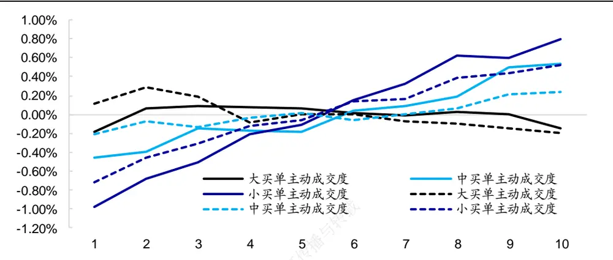
资料来源：Wind，海通证券研究所

## 2.2小单主动成交度因子月度选股能力的进一步分析

我们可从两个方面对小单主动成交度因子的计算进行调整与细化。一方面，可尝试使用日内不同时段的数据计算因子。如，使用 的数据计算开盘后主动成交度，使用 的数据计算盘中主动成交度；另一方面，可计算小单主动成交度与大单主动成交度的差值，即，小单超额主动成交度。

如下表所示，基于不同时段计算的小单主动成交度皆呈现出显著的月度选股能力。相比而言，盘中小买单主动成交度的选股能力更加显著。此外，小买单超额主动成交度因子并未呈现出更强的选股能力，而小卖单超额主动成交度的月度选股能力优于小卖单主动成交度。

表 4 小单主动成交度因子月度选股能力（2014-2022.09）

| 因子名称 | 月均IC | 年化 ICIR | 月度胜率 | 月均多空收益 | 月均多头超额 | 月均空头超额 |
| --- | --- | --- | --- | --- | --- | --- |
| 小买单主动成交度（全天） | 0.050 | 2.00 | 74% | 1.78% | 0.80% | -0.98% |
| 小买单超额主动成交度（全天） | 0.048 | 1.90 | 74% | 1.65% | 0.72% | -0.93% |
| 小卖单主动成交度（全天） | 0.036 | 1.21 | 67% | 1.25% | 0.53% | -0.72% |
| 小卖单超额主动成交度（全天） | 0.037 | 1.45 | 67% | 1.11% | 0.49% | -0.61% |
| 小买单主动成交度（开盘后） | 0.045 | 1.84 | 71% | 1.51% | 0.65% | -0.86% |
| 小买单超额主动成交度（开盘后） | 0.036 | 1.42 | 66% | 0.96% | 0.55% | -0.41% |
| 小卖单主动成交度（开盘后） | 0.020 | 0.67 | 58% | 0.47% | 0.41% | -0.06% |
| 小卖单超额主动成交度（开盘后） | 0.030 | 1.13 | 61% | 0.77% | 0.49% | -0.28% |
| 小买单主动成交度（盘中） | 0.053 | 2.11 | 75% | 1.84% | 0.81% | -1.03% |
| 小买单超额主动成交度（盘中） | 0.050 | 2.02 | 76% | 1.70% | 0.72% | -0.98% |
| 小卖单主动成交度（盘中） | 0.034 | 1.22 | 67% | 1.15% | 0.42% | -0.73% |
| 小卖单超额主动成交度（盘中） | 0.038 | 1.57 | 70% | 1.14% | 0.51% | -0.63% |

资料来源： ，海通证券研究所

考虑到小买单主动成交度（全天）和小买单主动成交度（盘中）的选股能力较强，后文将重点讨论这两个因子的业绩表现。下图为两者不同年度的多头超额收益。

图2 小买单主动成交度因子分年度多头超额收益（2014-2022.09）
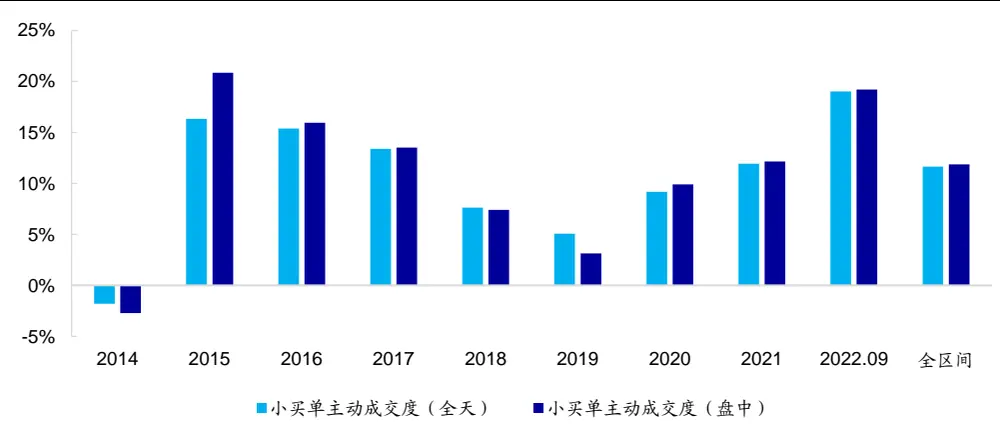
资料来源：Wind，海通证券研究所

小买单主动成交度因子在 2014 年、2018 年和 2019 年的表现偏弱，但 2020 年以来呈逐年增强的态势，尤其是 2022 年以来多头超额收益表现突出。分月度来看，因子在 22 年 1-4 月间的多头效应较为稳定，但在 4-6 月的市场反弹期，因子多头效应出现一定幅度的回撤，并持续震荡调整至 8月中旬。随后，因子多头效应出现较为明显的回升。

图3 小买单主动成交度因子多头超额净值
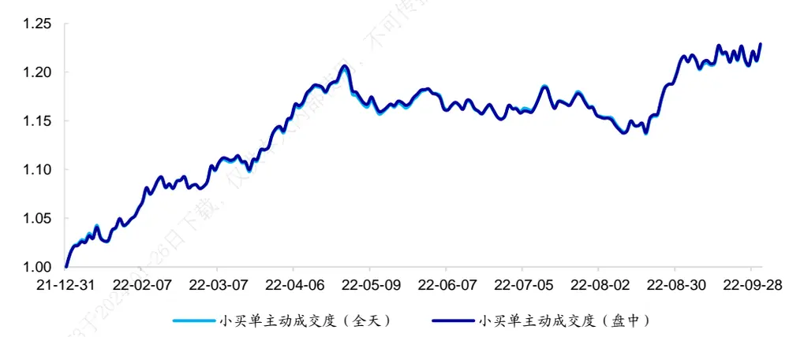
资料来源：Wind，海通证券研究所

## 2.3 正交小单主动成交度因子的月度选股能力

由下表可见，截面相关性测试表明，小买单主动成交度因子与常见因子之间的相关性并不高。其中，小买单主动成交度与换手率有一定的负相关性，与大单及买入意愿之间有一定的正相关性。

表 5 小买单主动成交度因子与常规因子之间的截面相关性（2014-2022.09）

| 小买单主动成交度（全天） 小卖单主动成交度（盘中） |  |
| --- | --- |
| 市值 | -0.07 -0.05 |
| 反转 | 0.11 0.10 |
| 换手率 | -0.28 -0.28 |
| BP | 0.20 0.19 |
| 改进反转 | 0.06 0.08 |
| 开盘后买入意愿占比 | 0.20 0.17 |
| 全天买入意愿占比 | 0.28 0.29 |
| 开盘后大单净买入占比 | 0.25 0.23 |
| 全天大单净买入占比 | 0.21 0.21 |

资料来源：Wind，海通证券研究所

我们将小单主动成交度因子相对行业、市值、换手、反转因子进行正交化处理，进一步测试其月度选股能力，结果如下表所示。

表 6 小单主动成交度因子月度选股能力（正交后，2014-2022.09）

| 因子名称 | 月均IC | 年化ICIR | 月度胜率 | 月均多空收益 | 月均多头超额 | 月均空头超额 |
| --- | --- | --- | --- | --- | --- | --- |
| 小买单主动成交度（全天） | 0.032 | 2.41 | 76% | 1.15% | 0.62% | -0.52% |
| 小买单超额主动成交度（全天） | 0.023 | 1.92 | 74% | 0.88% | 0.51% | -0.37% |
| 小卖单主动成交度（全天） | 0.002 | 0.19 | 54% | 0.20% | 0.16% | -0.03% |
| 小卖单超额主动成交度（全天） | 0.010 | 0.74 | 58% | 0.42% | 0.34% | -0.09% |
| 小买单主动成交度（开盘后） | 0.027 | 2.27 | 72% | 0.90% | 0.46% | -0.44% |
| 小买单超额主动成交度（开盘后） | 0.010 | 0.91 | 60% | 0.43% | 0.32% | -0.11% |
| 小卖单主动成交度（开盘后） | -0.011 | -0.97 | 63% | 0.31% | 0.35% | 0.03% |
| 小卖单超额主动成交度（开盘后） | 0.005 | 0.45 | 52% | 0.16% | 0.27% | 0.10% |
| 小买单主动成交度（盘中） | 0.033 | 2.41 | 77% | 1.22% | 0.65% | -0.57% |
| 小买单超额主动成交度（盘中） | 0.026 | 2.09 | 77% | 0.96% | 0.59% | -0.36% |
| 小卖单主动成交度（盘中） | 0.004 | 0.32 | 54% | 0.21% | 0.09% | -0.12% |
| 小卖单超额主动成交度（盘中） | 0.011 | 0.79 | 58% | 0.41% | 0.37% | -0.05% |

资料来源：Wind，海通证券研究所

使用全天及盘中数据计算得到的小买单主动成交度因子在正交后，依旧具有显著的截面选股能力。此外，因子多空收益虽受到正交的影响有所下滑，但分布依旧较为均匀。

下图进一步展示了正交后的小买单主动成交度（全天）及小买单主动成交度（盘中）的分年度多头超额收益。

图4 小买单主动成交度因子分年度多头超额收益（正交后，2014-2022.09）
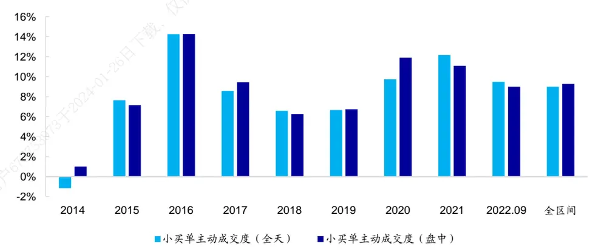
资料来源：Wind，海通证券研究所

和正交前类似，除 2014 年外，正交后的小买单主动成交度因子的多头效应依旧较为稳定而突出。2022 年以来，多头效应同样优异。具体地，1-4 月中旬稳定向上，4-6月的市场反弹期出现一定幅度的回撤，8月上旬以来重回升势。

图5 小买单主动成交度因子多头超额净值（正交后）
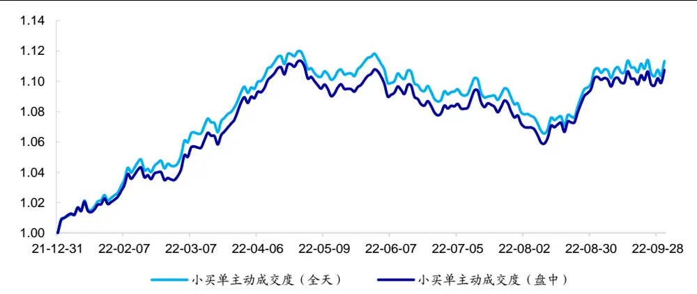
资料来源：Wind，海通证券研究所

## 2.4小买单主动成交度因子在不同股票范围内的月度选股能力

下图展示了因子正交前后在全市场、沪深 300 指数内、中证 800 指数内、外的选股能力。

图6 不同股票范围内因子月均 IC（正交前，2014.01-2022.09）
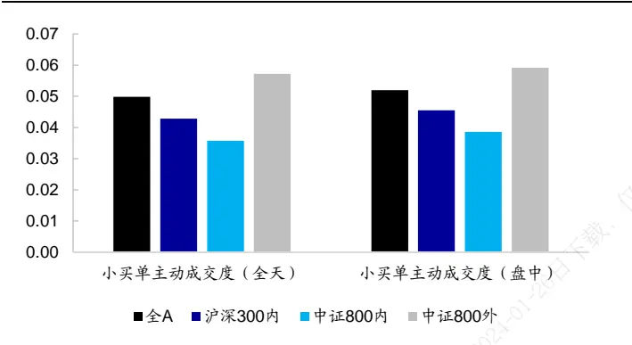
资料来源：Wind，海通证券研究所

图7 不同股票范围内因子月均 IC（正交后，2014.01-2022.09）
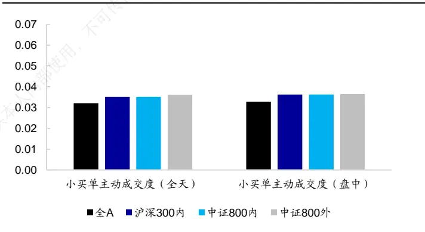
资料来源：Wind，海通证券研究所

由以上两图可见，原始因子在中证 800 外有更高的 IC。但正交后，因子在中证 800内外的选股能力差距明显收窄。

图8 不同股票范围内因子年化多头超额收益（正交前，2014.01-2022.09）
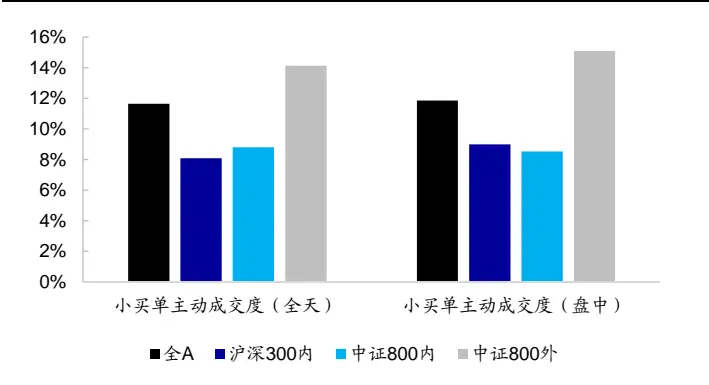
资料来源：Wind，海通证券研究所

图9 不同股票范围内因子年化多头超额收益（正交后，2014.01-2022.09）
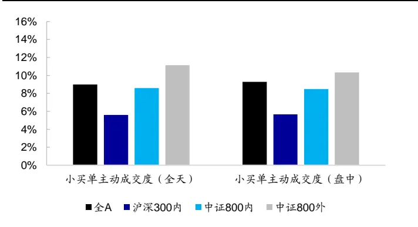
资料来源：Wind，海通证券研究所

多头超额收益呈现类似特征，正交前后，因子均在中证 800 外有更显著的选股能力，但正交在一定程度上缩小了这种差异。

下图进一步展示了 年以来因子正交前后在不同选股范围中的多头净值走势。

图10 不同股票范围内因子多头超额净值走势（全天小买单主动成交度，正交前）
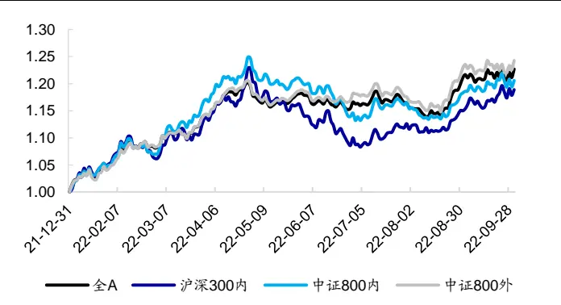
资料来源：Wind，海通证券研究所

图11 不同股票范围内因子多头超额净值走势（盘中小买单主动成交度，正交前）
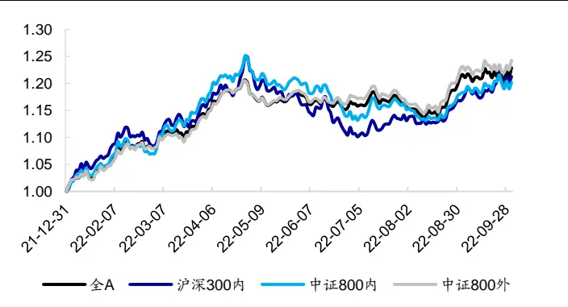
资料来源：Wind，海通证券研究所

图12 不同股票范围内因子多头超额净值走势（全天小买单主动成交度，正交后）
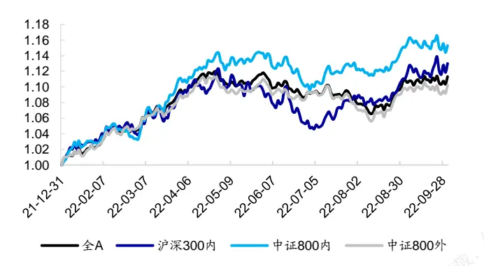
资料来源：Wind，海通证券研究所

图13 不同股票范围内因子多头超额净值走势（盘中小买单主动成交度，正交后）
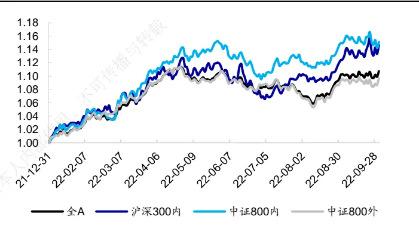
资料来源：Wind，海通证券研究所

2022 年以来，无论是原始因子还是正交因子，在 1-4月中旬及 8月中旬以来都呈现较为明显的多头效应。其中，正交因子在中证 800 内的多头收益相对更优。

## 2.5小买单主动成交度因子的周度选股能力

近年来，量化投资者的调仓频率出现了较大的提升，高频因子更多地被用于周度选股模型中。因此，本节测试因子在周度调仓频率下的选股能力，结果如以下两图所示。

图14 小买单主动成交度因子周均 IC 对比（正交前，2014.01-2022.09）
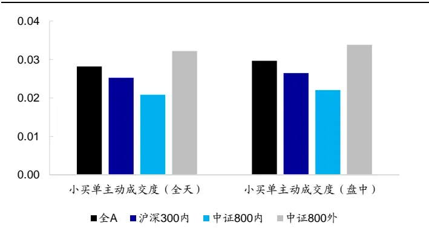
资料来源：Wind，海通证券研究所

图15 小 买 单 主 动 成 交 度 周 均 IC 对 比 （ 正 交 后 ，2014.01-2022.09）
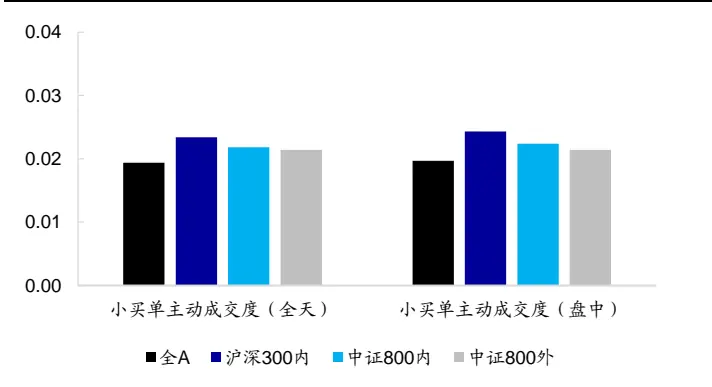
资料来源：Wind，海通证券研究所

与月度的结果类似，原始因子在中证 800 外呈现更高的周均 IC。但这一差距在正交后明显减弱，因子在不同选股范围中的周均 IC 较为接近。

从以下两图中的多头超额收益可见，因子在中证 800 外的表现更好。正交后，这一现象依然较为明显。

图16 小买单主动成交度因子年化多头超额收益对比（正交前，2014.01-2022.09）
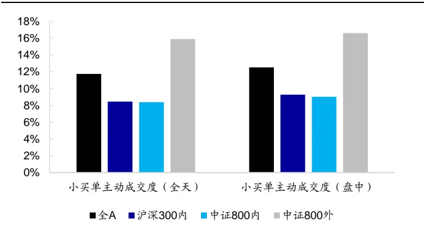
资料来源：Wind，海通证券研究所

图17 小买单主动成交度年化多头超额收益对比（正交后，2014.01-2022.09）
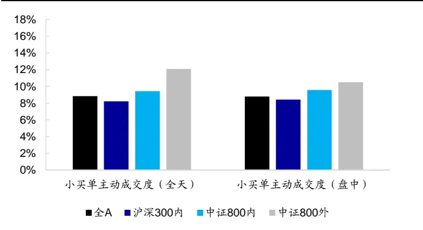
资料来源：Wind，海通证券研究所

2022 年以来，周度换仓的小买单主动成交度因子在不同选股空间中的多头效应较为类似，均是在 1月到 4月中旬及 8月中旬以来，表现较为出色。

图18 小买单主动成交度因子多头超额净值（全天小买单主动成交度，正交前）
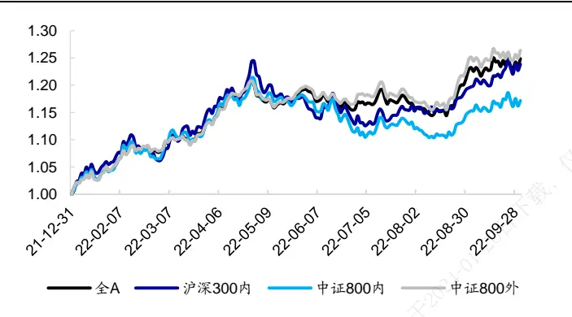
资料来源：Wind，海通证券研究所

图19 小买单主动成交度因子多头超额净值（盘中小买单主动成交度，正交前）
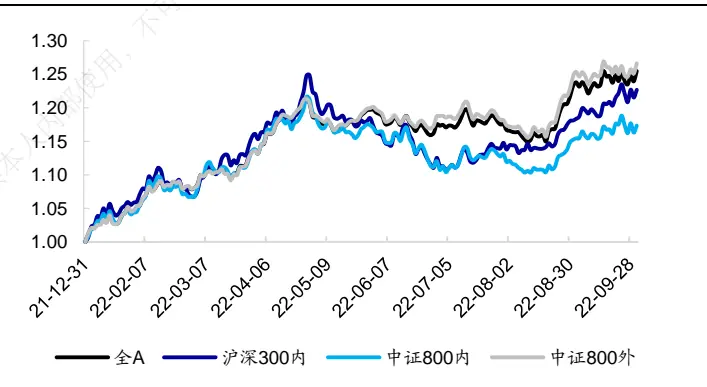
资料来源：Wind，海通证券研究所

图20 小买单主动成交度因子多头超额净值（全天小买单主动成交度，正交后）
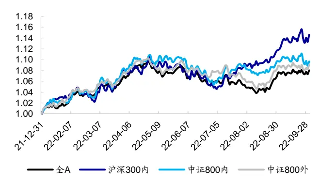
资料来源：Wind，海通证券研究所

图21 小买单主动成交度因子多头超额净值（盘中小买单主动成交度，正交后）
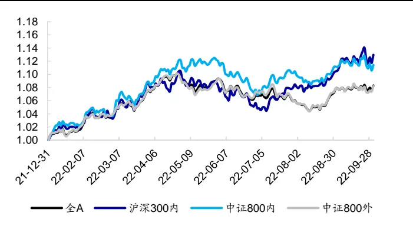
资料来源：Wind，海通证券研究所

## 3. 指数增强组合添加测试

由于投资者对周度模型的接受程度越来越高，故我们尝试将小买单主动成交度作为增量因子添加至中证 500 和中证 1000 指数增强模型，并考察对组合收益的影响。

与前期报告的测试设定类似，本文收益预测模型中所使用的基础因子包括：市值、中盘（市值三次方）、估值、换手、反转、波动、盈利、SUE、尾盘成交占比、买入意愿、大单净买入以及改进深度学习高频因子。其中，对于盈利与 SUE，我们分别测试了暴露/不暴露基本面敞口两种情况下，组合的收益表现。此外，我们还探讨了基础模型中包含/不包含深度学习高频因子的效果。

在预测个股收益时，我们首先采用回归法得到因子溢价，再计算最近 12 个月的因子溢价均值估计下期的因子溢价，最后乘以最新一期的因子值。

风险控制模型包括以下几个方面的约束：

1） 个股偏离：相对基准的偏离幅度不超过 0.5%/1%/2%；

2） 因子敞口：市值、估值中性、常规低频因子≤ ±0.5，高频因子≤ ±2.0；

3） 行业偏离：严格中性/行业偏离上限 2%/行业偏离上限 4%；

4） 换手率限制：单次单边换手不超过 30%。

组合的优化目标为最大化预期收益，目标函数如下所示：

$$
\underset{w_{i}}{max}\sum\mu_{i}w_{i}
$$

其中， $w_{\mathrm{i}}$ 为组合中股票 i的权重，μ 为股票 i的预期超额收益。为使本文的结论贴近实践，如无特别说明，下文的测算均假定以次日均价成交，同时扣除 3‰的交易成本。

## 3.1 中证 500指数增强组合添加测试

下表展示了不同参数下，小买单主动成交度因子在加入组合前后的超额收益表现。

表 7 中证 500指数增强组合超额收益（不包含深度学习高频因子，2016.01-2022.09）

|  |  | 个股偏离0.5% |  | 个股偏离1% |  | 个股偏离 2% |  |
| --- | --- | --- | --- | --- | --- | --- | --- |
|  |  | 无基本面 | 有基本面 | 无基本面 | 有基本面 | 无基本面 | 有基本面 |
| 基础模型 | 行业中性 | 11.6% | 14.3% | 12.8% | 16.0% | 11.3% | 14.7% |
|  | 行业偏离 2% | 13.5% | 16.3% | 15.2% | 17.3% | 14.6% | 16.9% |
|  | 行业偏离 4% | 15.0% | 16.0% | 16.9% | 18.2% | 15.4% | 17.7% |
| +小买单主动成 交度（全天） | 行业中性 | 13.1% | 15.9% | 13.2% | 18.4% | 13.8% | 16.0% |
|  | 行业偏离 2% | 14.4% | 16.8% | 15.8% | 18.0% | 16.7% | 16.4% |
|  | 行业偏离 4% | 15.4% | 17.1% | 16.7% | 19.7% | 16.9% | 18.0% |
| +小买单主动成 交度（盘中） | 行业中性 | 13.5% | 15.6% | 12.9% | 18.0% | 13.6% | 16.4% |
|  | 行业偏离 2% | 14.7% | 16.5% | 15.9% | 18.0% | 16.8% | 16.9% |
|  | 行业偏离 4% | 15.7% | 17.5% | 15.7% | 18.6% | 18.5% | 18.3% |

资料来源：Wind，海通证券研究所

当基础模型中不包含深度学习高频因子时，小买单主动成交度因子的引入有助于提升组合的收益表现。随着约束条件的不同，年化超额收益的提升幅度在 0.5%-1.5%之间。

下图对比展示了个股偏离为 1%、有基本面敞口暴露、行业中性组合在加入因子前后的分年度收益表现。引入小买单主动成交度因子后，组合的超额收益在大部分年份中均得到进一步增强。

图22 因子加入前后，中证 500指数增强组合分年度超额收益（不包含深度学习高频因子）
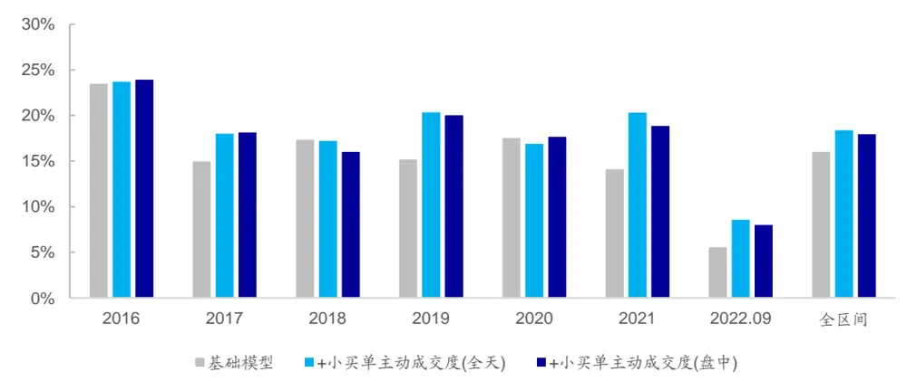
资料来源： ，海通证券研究所

然而，当基础模型包含深度学习高频因子时，引入小买单主动成交度因子对组合超额收益的提升效果，既不明显，也不稳定。

表 8 中证 500指数增强组合超额收益（包含深度学习高频因子，2016.01-2022.09）

|  |  | 个股偏离 0.5% |  | 个股偏离1% |  | 个股偏离 2% |  |
| --- | --- | --- | --- | --- | --- | --- | --- |
|  |  | 无基本面 | 有基本面 | 无基本面 | 有基本面 | 无基本面 | 有基本面 |
| 基础模型 | 行业中性 | 15.7% | 17.3% | 16.7% | 18.5% | 17.3% | 19.8% |
|  | 行业偏离 2% | 17.7% | 18.4% | 20.4% | 20.4% | 19.1% | 21.4% |
|  | 行业偏离 4% | 18.6% | 20.4% | 21.4% | 22.5% | 22.3% | 23.9% |
| +小买单主动成 交度（全天） | 行业中性 | 15.5% | 16.8% | 16.6% | 18.6% | 17.3% | 19.9% |
|  | 行业偏离 2% | 17.7% | 18.4% | 19.0% | 20.7% | 19.1% | 20.4% |
|  | 行业偏离 4% | 18.7% | 19.9% | 20.7% | 22.3% | 20.1% | 23.0% |
| +小买单主动成 交度（盘中） | 行业中性 | 15.8% | 17.3% | 16.9% | 18.6% | 17.7% | 19.6% |
|  | 行业偏离 2% | 17.9% | 17.9% | 19.2% | 20.9% | 19.5% | 20.4% |
|  | 行业偏离 4% | 18.7% | 20.1% | 20.4% | 22.2% | 19.9% | 23.6% |

资料来源：Wind，海通证券研究所

## 3.2 中证 1000 指数增强组合添加测试

由以下两表可见，将小买单主动成交度因子加入中证 1000 增强后的超额收益变化和上一节类似。当基础模型不包含深度学习因子时，超额收益有稳定的提升，幅度在0.5%-2.0%之间；但当基础模型包含深度学习因子时，超额收益的提升并不稳定，决定于所选的风控模型参数。

表 9 中证 1000指数增强组合超额收益（不包含深度学习高频因子，2016.01-2022.09）

|  |  | 个股偏离 0.5% |  | 个股偏离1% |  | 个股偏离 2% |  |
| --- | --- | --- | --- | --- | --- | --- | --- |
|  |  | 无基本面 | 有基本面 | 无基本面 | 有基本面 | 无基本面 | 有基本面 |
| 基础模型 | 行业中性 | 16.7% | 20.0% | 17.2% | 20.2% | 15.7% | 17.8% |
|  | 行业偏离 2% | 17.8% | 20.7% | 19.9% | 21.4% | 18.6% | 22.0% |
|  | 行业偏离 4% | 18.5% | 20.8% | 21.2% | 22.6% | 21.9% | 22.7% |
| +小买单主动成 交度（全天） | 行业中性 | 17.1% | 20.6% | 18.0% | 21.0% | 16.6% | 17.4% |
|  | 行业偏离 2% | 19.8% | 22.1% | 19.5% | 23.4% | 19.8% | 20.7% |
|  | 行业偏离 4% | 20.7% | 22.5% | 21.2% | 22.2% | 20.5% | 23.1% |
| +小买单主动成 交度（盘中） | 行业中性 | 17.4% | 20.5% | 17.9% | 21.4% | 16.6% | 18.2% |
|  | 行业偏离 2% | 19.4% | 22.1% | 19.6% | 23.7% | 19.0% | 21.4% |
|  | 行业偏离 4% | 20.6% | 22.2% | 21.2% | 22.5% | 20.6% | 22.8% |

资料来源：Wind，海通证券研究所

表 10 中证 1000指数增强组合超额收益（包含深度学习高频因子，2016.01-2022.09）

|  |  | 个股偏离 0.5% |  | 个股偏离1% |  | 个股偏离 2% |  |
| --- | --- | --- | --- | --- | --- | --- | --- |
|  |  | 无基本面 | 有基本面 | 无基本面 | 有基本面 | 无基本面 | 有基本面 |
| 基础模型 | 行业中性 | 22.6% | 24.7% | 23.7% | 25.0% | 23.4% | 25.5% |
|  | 行业偏离 2% | 23.7% | 25.2% | 25.7% | 26.9% | 26.6% | 28.3% |
|  | 行业偏离 4% | 24.2% | 24.8% | 25.6% | 27.1% | 26.4% | 28.8% |
| +小买单主动成 交度（全天） | 行业中性 | 22.5% | 24.3% | 23.1% | 25.9% | 24.4% | 26.7% |
|  | 行业偏离 2% | 23.5% | 25.8% | 25.4% | 28.2% | 25.7% | 28.4% |
|  | 行业偏离 4% | 24.4% | 25.6% | 25.0% | 28.1% | 27.0% | 28.6% |
| +小买单主动成 交度（盘中） | 行业中性 | 22.6% | 24.5% | 23.7% | 26.4% | 24.5% | 26.0% |
|  | 行业偏离 2% | 23.7% | 25.3% | 24.8% | 27.7% | 26.2% | 28.6% |
|  | 行业偏离 4% | 24.7% | 26.0% | 24.5% | 27.9% | 27.8% | 29.1% |

资料来源： ，海通证券研究所

下图展示了不包含深度学习高频因子时，个股偏离为 1%、有基本面敞口暴露、行业中性的增强组合，在加入因子前后的分年度超额收益表现。对比来看，小买单主动成交度因子的引入能够提升组合在 2016、2017、2020、2021 以及 2022 年的超额收益。

图23 因子加入前后，中证 1000指数增强组合分年度超额收益（不包含深度学习高频因子）
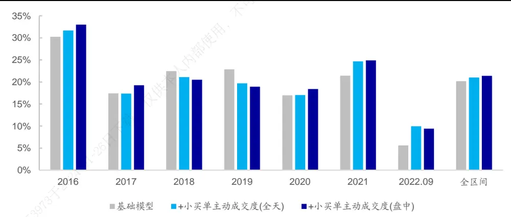
资料来源：Wind，海通证券研究所

## 4. 总结

本文从买卖单的角度定义了买单与卖单的主动成交度，并针对大单、中单以及小单构建了主动成交度因子。

测试结果表明，小单主动成交度的月度选股能力较为突出。即，小单的主动成交性越强，股票未来超额表现越好。相比而言，小买单主动成交度略强于小卖单主动成交度，因子月均 IC 达 0.05。组间收益单调性较强、多空收益分布相对较为均匀。因子月度多空收益为 1.78%，月均多头超额收益达 0.80%。

当基础模型中不包含深度学习高频因子时，将小买单主动成交度因子的引入中证500 增强组合有助于提升超额收益。随着约束条件的不同，年化超额收益的提升幅度在0.5%-1.5%之间。但当基础模型包含深度学习因子时，超额收益的提升并不稳定，决定于所选的风控模型参数。中证 1000 增强组合的添加测试结果类似。

## 5. 风险提示

市场系统性风险、资产流动性风险以及政策变动风险会对策略表现产生较大影响。

# 信息披露

分析师声明

[Table冯佳睿yst金融工程研究团队s]

袁林青金融工程研究团队

本人具有中国证券业协会授予的证券投资咨询执业资格，以勤勉的职业态度，独立、客观地出具本报告。本报告所采用的数据和信息均来自市场公开信息，本人不保证该等信息的准确性或完整性。分析逻辑基于作者的职业理解，清晰准确地反映了作者的研究观点，结论不受任何第三方的授意或影响，特此声明。

## 法律声明

本报告仅供海通证券股份有限公司（以下简称 本公司 ）的客户使用。本公司不会因接收人收到本报告而视其为客户。在任何情况下，本报告中的信息或所表述的意见并不构成对任何人的投资建议。在任何情况下，本公司不对任何人因使用本报告中的任何内容所引致的任何损失负任何责任。

本报告所载的资料、意见及推测仅反映本公司于发布本报告当日的判断，本报告所指的证券或投资标的的价格、价值及投资收入可能会波动。在不同时期，本公司可发出与本报告所载资料、意见及推测不一致的报告。

市场有风险，投资需谨慎。本报告所载的信息、材料及结论只提供特定客户作参考，不构成投资建议，也没有考虑到个别客户特殊的播投资目标、财务状况或需要。客户应考虑本报告中的任何意见或建议是否符合其特定状况。在法律许可的情况下，海通证券及其所属可关联机构可能会持有报告中提到的公司所发行的证券并进行交易，还可能为这些公司提供投资银行服务或其他服务。

本报告仅向特定客户传送，未经海通证券研究所书面授权，本研究报告的任何部分均不得以任何方式制作任何形式的拷贝、复印件或复制品，或再次分发给任何其他人，或以任何侵犯本公司版权的其他方式使用。所有本报告中使用的商标、服务标记及标记均为本公司的商标、服务标记及标记，如欲引用或转载本文内容，务必联络海通证券研究所并获得许可，并需注明出处为海通证券研究所，目不得对本文进行有悖原意的引用和删改。仅

根据中国证监会核发的经营证券业务许可，海通证券股份有限公司的经营范围包括证券投资咨询业务。下载

海通证券股份有限公司研究所[Table_PeopleInfo]

| 路颖 所长 (021)23219403 | 高道德 luying@htsec.com | 副所长 (021)63411586 gaodd@htsec.com | 邓勇 副所长 (021)23219404dengyong@htsec.com |
| --- | --- | --- | --- |
| 荀玉根 副所长 (021)23219658 xyg6052@htsec.com | 涂力磊 所长助理 | (021)23219747 tll5535@htsec.com | 余文心 所长助理 (0755)82780398 ywx9461@htsec.com |
| 宏观经济研究团队 梁中华(021)23219820 Izh13508@htsec.com 应镓娴(021)23219394 yjx12725@htsec.com 李 俊(021)23154149 lj13766@htsec.com 侯 欢(021)23154658 hh13288@htsec.com 联系人 李林芷(021)23219674 Ilz13859@htsec.com 王宇晴 wyq14704@htsec.com | 金融工程研究团队 高道德(021)63411586 冯佳睿(021)23219732 郑雅斌(021)23219395 罗 蕾(021)23219984 余浩淼(021)23219883 袁林青(021)23212230 黄雨薇(021)23154387 张耿宇(021)23212231 联系人 郑玲玲(021)23154170 曹君豪 021-23219745 | gaodd@htsec.com fengjr@htsec.com zhengyb@htsec.com I19773@htsec.com yhm9591@htsec.com ylq9619@htsec.com hyw13116@htsec.com zgy13303@htsec.com zll13940@htsec.com cjh13945@htsec.com | 金融产品研究团队 高道德(021)63411586 gaodd@htsec.com 倪韵婷(021)23219419 niyt@htsec.com 唐洋运(021)23219004 tangyy@htsec.com 徐燕红(021)23219326 xyh10763@htsec.com 谈 鑫(021)23219686 tx10771@htsec.com 庄梓恺(021)23219370 zzk11560@htsec.com 谭实宏(021)23219445 tsh12355@htsec.com 江 涛(021)23219879 jt13892@htsec.com 联系人 吴其右(021)23154167 wqy12576@htsec.com 张弛(021)23219773 zc13338@htsec.com 滕颖杰(021)23219433 tyj13580@htsec.com |
| 固定收益研究团队 姜珮珊(021)23154121 王巧喆(021)23154142 孙丽萍(021)23154124 联系人 张紫睿 021-23154484 王冠军(021)23154116 方欣来 021-23219635 藏 多(021)23212041 zd14683@htsec.com | jps10296@htsec.com wqz12709@htsec.com slp13219@htsec.com zzr13186@htsec.com wgj13735@htsec.com fxl13957@htsec.com | 荀玉根(021)23219658 xyg6052@htsec.com 高 上(021)23154132 gs10373@htsec.com 李 影(021)23154117 ly11082@htsec.com 郑子勋(021)23219733 zzx12149@htsec.com 吴信坤 021-23154147 wxk12750@htsec.com 余培仪(021)23219400 ypy13768@htsec.com yj13712@htsec.com | 中小市值团队 钮宇鸣(021)23219420 ymniu@htsec.com 潘莹练(021)23154122 pyl10297@htsec.com 王园沁02123154123 wyq12745@htsec.com |
| 政策研究团队 李明亮(021)23219434 吴一萍(021)23219387 | 石油化工行业 Iml@htsec.com wuyiping@htsec.com zhr8381@htsec.com |  |  |
|  |  |  | 联系人 |
|  |  |  | 批发和零售贸易行业 |
| 汽车行业 |  |  | 彭 娉(010)68067998 肖治键(021)23219164 |
|  |  |  | 梁广楷(010)56760096 孟 陆 86 10 56760096 联系人 周航(021)23219671 |
| 李姝醒02163411361 Isx11330@htsec.com 联系人 纪 尧 jy14213@htsec.com |  | 张海榕(021)23219635 zhr14674@htsec.com | 贺文斌(010)68067998 朱赵明(021)23154120 |
| 周洪荣(021)23219953 |  | hx11853@htsec.com | 郑 琴(021)23219808 |
|  |  | dengyong@htsec.com zjj10419@htsec.com | 医药行业 余文心(0755)82780398 |
|  | 邓勇(021)23219404 朱军军(021)23154143 |  | ywx9461@htsec.com |
| 朱 蕾(021)23219946 zl8316@htsec.com | 胡歆(021)23154505 |  | zq6670@htsec.com |
|  | 联系人 |  | hwb10850@htsec.com |
|  |  |  | zzm12569@htsec.com |
|  |  |  | Igk12371@htsec.com |
|  |  |  | ml13172@htsec.com |
|  |  |  | zh13348@htsec.com |
|  |  |  | pp13606@htsec.com |
|  |  |  | xzj14562@htsec.com |
|  | 公用事业 |  |  |
| 王 猛(021)23154017 wm10860@htsec.com | 戴元灿(021)23154146 |  |  |
|  |  | dyc10422@htsec.com |  |
| 房乔华021-23219807 fqh12888@htsec.com | 傅逸帆(021)23154398 |  | 李宏科(021)23154125 Ihk11523@htsec.com |
|  |  | fyf11758@htsec.com | 高 瑜(021)23219415 |
|  | 吴 杰(021)23154113 |  | gy12362@htsec.com |
|  |  | wj10521@htsec.com | 康 璐(021)23212214 kl13778@htsec.com |
|  | 联系人 |  | 汪立亭(021)23219399 wanglt@htsec.com |
|  | 余玫翰(021)23154141 |  |  |
|  |  | ywh14040@htsec.com |  |
|  |  |  | 张冰清 021-23154126 zbq14692@htsec.com |
|  |  |  | 曹蕾娜 cln13796@htsec.com |
| 互联网及传媒 |  |  |  |
|  |  |  | 房地产行业 |
| 毛云聪(010)58067907 |  |  |  |
|  | 有色金属行业 | cxh11840@htsec.com |  |
|  |  |  | 涂力磊(021)23219747 tI15535@htsec.com |
|  | 陈晓航(021)23154392 |  |  |
| 陈星光(021)23219104 |  |  |  |
|  | myc11153@htsec.com | gjy11909@htsec.com | 谢 盐(021)23219436 |
|  |  | 甘嘉尧(021)23154394 | xiey@htsec.com |
|  | cxg11774@htsec.com |  |  |
| 孙小雯(021)23154120 |  |  |  |
|  | 联系人 |  |  |
|  | sxw10268@htsec.com |  |  |
| 联系人 |  | 郑景毅 zjy12711@htsec.com | 联系人 |

| 电子行业 | 煤炭行业 |  | 电力设备及新能源行业 |  |
| --- | --- | --- | --- | --- |
| 李 轩(021)23154652 lx12671@htsec.com |  | 李 淼(010)58067998 Im10779@htsec.com | 张一弛(021)23219402 zyc9637@htsec.com |  |
| 肖隽翀(021)23154139 xjc12802@htsec.com |  | 王 涛(021)23219760 wt12363@htsec.com | 房 青(021)23219692 fangq@htsec.com |  |
| 华晋书 02123219748 hjs14155@htsec.com |  | 吴 杰(021)23154113 wj10521@htsec.com | 徐柏乔(021)23219171 xbq6583@htsec.com |  |
| 薛逸民(021)23219963 xym13863@htsec.com 联系人 | 联系人 | 朱 彤(021)23212208 zt14684@htsec.com | 张 磊(021)23212001 zl10996@htsec.com 联系人 |  |
| 文 灿(021)23154401 wc13799@htsec.com |  |  |  | 姚望洲(021)23154184 ywz13822@htsec.com |
|  |  |  | 柳文韬(021)23219389 Iwt13065@htsec.com |  |

| 基础化工行业 |  | 计算机行业 |  | 通信行业 |  |
| --- | --- | --- | --- | --- | --- |
| 刘 威(0755)82764281 张翠翠(021)23214397 孙维容(021)23219431 李 智(021)23219392 | Iw10053@htsec.com zcc11726@htsec.com swr12178@htsec.com lz11785@htsec.com | 郑宏达(021)23219392 杨 林(021)23154174 于成龙(021)23154174 洪 琳(021)23154137 | zhd10834@htsec.com yl11036@htsec.com ycl12224@htsec.com hl11570@htsec.com | 余伟民(010)50949926 杨彤昕 010-56760095 联系人 | ywm11574@htsec.com ytx12741@htsec.com |
| 李 博 Ib14830@htsec.com |  | 联系人 杨 蒙(0755)23617756 ym13254@htsec.com |  | 夏 凡(021)23154128 xf13728@htsec.com 徐 卓 xz14706@htsec.com |  |
| 非银行金融行业 |  | 交通运输行业 |  | 纺织服装行业 |  |
| 何 婷(021)23219634 ht10515@htsec.com |  | 虞 楠(021)23219382 yun@htsec.com |  | 梁 希(021)23219407 lx11040@htsec.com sk11787@htsec.com |  |
| 任广博(010)56760090 rgb12695@htsec.com |  | 罗月江(010）56760091 lyj12399@htsec.com |  | 盛 开(021)23154510 |  |
| 孙 婷(010)50949926 st9998@htsec.com |  | 陈 宇(021)23219442 cy13115@htsec.com |  | 联系人 |  |
| 联系人 |  |  |  | 王天璐(021)23219405 wtl14693@htsec.com |  |
| 曹 锟010-56760090 ck14023@htsec.com 肖 尧(021)23154171 xy14794@htsec.com |  |  |  |  |  |
| 建筑建材行业 |  | 机械行业 |  |  |  |
| 冯晨阳(021)23212081 fcy10886@htsec.com |  | 赵玥炜(021)23219814 zyw13208@htsec.com |  | 钢铁行业 刘彦奇(021)23219391 liuyq@htsec.com |  |
| 潘莹练(021)23154122 pyl10297@htsec.com 申 浩(021)23154114 sh12219@htsec.com |  | 赵靖博(021)23154119 zjb13572@htsec.com 联系人 |  |  |  |
| 颜慧菁 yhj12866@htsec.com |  | 刘绮雯(021)23154659 lqw14384@htsec.com |  |  |  |
| 建筑工程行业 |  | 食品饮料行业 3使 |  | 军工行业 |  |
| 张欣劫 18515295560 zxj12156@htsec.com |  | 颜慧菁 yhj12866@htsec.com |  | 张恒晅 zhx10170@htsec.com |  |
| 联系人 |  | 张宇轩(021)23154172 zyx11631@htsec.com |  | 联系人 |  |
| 曹有成 18901961523 cyc13555@htsec.com 郭好格 13718567611 |  | 程碧升(021)23154171 cbs10969@htsec.com |  | 刘砚菲 021-2321-4129 lyf13079@htsec.com |  |
| ghg14711@htsec.com |  | 联系人 张嘉颖(021)23154019 zjy14705@htsec.com |  | 胡舜杰(021)23154483 hsj14606@htsec.com |  |
| 银行行业 |  |  |  | 家电行业 |  |
| 林加力(021)23154395 ljl12245@htsec.com |  | 社会服务行业 汪立亭(021)23219399 wanglt@htsec.com |  | 陈子仪(021)23219244 chenzy@htsec.com |  |
| 联系人 |  | 许樱之(755)82900465 xyz11630@htsec.com |  | 李 阳(021)23154382 ly11194@htsec.com |  |
| 董栋梁(021) 23219356 ddl13206@htsec.com |  |  |  | 朱默辰(021)23154383 zmc11316@htsec.com |  |
| 徐凝碧(021)23154134 xnb14607@htsec.com |  | 联系人 |  | 刘 璐(021)23214390 II11838@htsec.com |  |
|  |  | 毛弘毅(021)23219583 mhy13205@htsec.com 王祎婕(021)23219768 wyj13985@htsec.com |  |  |  |

## 造纸轻工行业

郭庆龙 gql13820@htsec.com

高翩然 gpr14257@htsec.com

吕科佳 lkj14091@htsec.com

王文杰 wwj14034@htsec.com

## 研究所销售团队

深广地区销售团队

伏财勇(0755)23607963 fcy7498@htsec.com

蔡铁清(0755)82775962 ctq5979@htsec.com

辜丽娟(0755)83253022 gulj@htsec.com

刘晶晶(0755)83255933 liujj4900@htsec.com

饶 伟(0755)82775282 rw10588@htsec.com

欧阳梦楚(0755)23617160

oymc11039@htsec.com

巩柏含 gbh11537@htsec.com

滕雪竹 0755 23963569 txz13189@htsec.com

张馨尹 0755-25597716 zxy14341@htsec.com上海地区销售团队胡雪梅(021)23219385 huxm@htsec.com黄 诚(021)23219397 hc10482@htsec.com季唯佳(021)23219384 jiwj@htsec.com黄 毓(021)23219410 huangyu@htsec.com李 寅 021-23219691 ly12488@htsec.com胡宇欣(021)23154192 hyx10493@htsec.com马晓男 mxn11376@htsec.com邵亚杰 23214650 syj12493@htsec.com杨祎昕(021)23212268 yyx10310@htsec.com毛文英(021)23219373 mwy10474@htsec.com谭德康 tdk13548@htsec.com王祎宁(021)23219281 wyn14183@htsec.com张歆钰 zxy14733@htsec.com周之斌 zzb14815@htsec.com

北京地区销售团队
朱 健(021)23219592 zhuj@htsec.com
殷怡琦(010)58067988 yyq9989@htsec.com
郭 楠 010-5806 7936 gn12384@htsec.com
杨羽莎(010)58067977 yys10962@htsec.com
张丽萱(010)58067931 zlx11191@htsec.com
郭金垚(010)58067851 gjy12727@htsec.com
张钧博 zjb13446@htsec.com
高 瑞 gr13547@htsec.com
上官灵芝 sglz14039@htsec.com
董晓梅 dxm10457@htsec.com
姚 坦 yt14718@htsec.com

海通证券股份有限公司研究所

地址：上海市黄浦区广东路 689号海通证券大厦 9楼

电话：（021）23219000

传真：（021）23219392

网址：www.htsec.com