## [Tab相关研究

Table_ReportInfo]《选股因子系列研究（五十六）——买卖单数据中的 》《选股因子系列研究（五十七）——基于主动买入行为的选股因子》《选股因子系列研究（七十二）——大单的精细化处理与大单因子重构》2021.01.18

分析师:冯佳睿

Tel:(021)23219732

Email:fengjr@haitong.com

证书:S0850512080006

分析师:袁林青

Tel:(021)23212230

Email:ylq9619@haitong.com

证书:S0850516050003

# 选股因子系列研究（八十六）——深度学习高频因子的特征工程

## 投资要点：

近年来，高频数据逐渐成为量化策略中一类重要的 Alpha 来源。除了用传统的基于人工逻辑的方式构建高频因子外，深度学习也是一种高效、可行的高频因子构建方法。然而，我们在日常的路演交流中发现，初涉深度学习的投资者往往对深度学习高频因子的特征工程（如，特征的构建、处理、归因和筛选）存在各种各样的研究需求。因此，本文旨在通过多方面的对比测试，为广大投资者在特征工程层面提供一定的参考。

- 深度学习高频因子的特征构建。本文使用“原始数据 分钟级基础指标 目标频率衍生指标”的方式生成高频特征。即，基于原始数据生成一系列分钟级的基础指标，这类指标旨在捕捉原始数据中的基本信息。因此计算往往不会过于复杂，它们将作为后续特征计算的输入数据。得到基础指标序列后，本文先确定算子，再通过不断变换输入的基础指标序列生成特征。其中，算子既可以由简单的四则混合运算或统计计算衍化得到，也可以从人工逻辑因子研发经验中归纳总结。

- 深度学习高频因子的特征处理。具体包括，分布调整、极值处理和标准化。基于波动率、成交金额、成交笔数和买卖单数生成的特征，通常具有较为明显的偏度。因此，分布调整是特征处理的第一步。特征中的极值也会影响模型的训练效果，因此，我们采用和常规的因子极值处理类似的方法，即， 倍标准差截断。和低频数据类似，高频数据同样量纲差异巨大。因此，为减轻这个问题对模型训练带来的影响，标准化也是很有必要的。

- 深度学习高频因子的特征归因。常见的特征归因模型大致有基于梯度（Gradient）和基于扰动（Perturbation）两类。其中，基于梯度的归因方法又称作反向传播归因法，基于扰动的归因方法又称作前向传播归因法。本文选用积分梯度法进行特征归因，因为该方法具备完整性（Completeness）。即，所有特征归因后的贡献度之和为模型输出与基线输出之间的差值。通过积分梯度法归因，我们亦可得到每一个特征的绝对贡献度，进而比较它们对预测结果的重要性。

深度学习高频因子的特征筛选。当特征数量从 精简至 或 后，在任何一种处理方式下，因子的 IC 均未出现下降，而年化多头超额收益则进一步提升。但是，如果特征数量进一步降至 ，反而有可能造成 或多头超额收益的下降。因此，我们认为，和线性模型类似，深度学习模型的特征筛选同样是有必要且有益的。它可以剔除冗余信息、缩短训练时间、优化计算资源，并较为显著地提升模型表现。然而，过度精简特征也会损失有效信息，降低训练所得因子的选股能力，故我们需要在模型的简约和效果之间取得平衡。

- 深度学习高频因子在指数增强组合中的应用与对比。将深度学习高频因子引入中证 和中证 增强策略，我们通过测试发现，首先，同样是 特征集合，偏度调整和去极值均能大概率提升年化超额收益；其次，一定程度的特征筛选（或 特征集合），也在绝大多数情况下，获得了优于原始集合的表现；第三，过度的特征筛选，如仅保留 32 个特征，则有可能损失重要信息，产生负面效应。最后，单一截面和跨截面两种标准化方式的差异较小。

- 风险提示。市场系统性风险、资产流动性风险、政策变动风险、因子失效风险。

近年来，高频数据逐渐成为量化策略中一类重要的 Alpha 来源。除了用传统的基于人工逻辑的方式构建高频因子外，深度学习也是一种高效、可行的高频因子构建方法。在前期的系列专题报告中，我们首先基于高频数据构建 30 分钟级别的特征，再通过深度学习模型生成高频因子。在后续的样本外跟踪中，因子展现出了较为稳定的选股能力。

然而，我们在日常的路演交流中发现，初涉深度学习的投资者往往对深度学习高频因子的特征工程（如，特征的构建、处理、归因和筛选）存在各种各样的研究需求。因此，本文旨在通过多方面的对比测试，为广大投资者在特征工程层面提供一定的参考。

本文共分为八个部分，第一部分引出涉及的各项内容，第二到第五部分依次讨论特征的构建、处理、归因和筛选，第六部分测试深度学习高频因子加入指数增强组合后的表现，第七部分总结全文，第八部分提示风险。

## 1. 引言

在本系列的前期报告《选股因子系列研究（七十五）——基于深度学习的高频因子挖掘》中，我们基于高频数据构建了一系列 30 分钟级别的特征，并通过深度学习模型得到了深度学习高频因子。在后续的持续跟踪中（详情可参考《高频选股因子周报》），深度学习高频因子在周度上呈现出很强的选股能力。

对于初涉深度学习的投资者来说，特征工程无疑是他们面临的第一个难点。随着路演交流的增多，我们发现，投资者对于深度学习高频因子特征工程相关的疑问，可总结为如下四个方面。

1） 如何更加高效、便捷地从不同频率的高频数据中生成特征？

2） 对特征进行分布上的调整/去极值的处理/不同的标准化方式，会对最终结果产生怎样的影响？

3） 如何度量每个特征对最终预测值的贡献？

4） 如何定量筛选模型的输入特征？

基于上述问题，我们将深度学习高频因子的特征工程分解为 4个步骤。

特征构建：该步骤负责从不同频率的高频数据生成原始特征。由于投资者可能存在对不同周期收益的预测需求，因此，特征构建应具有高效生成不同频率特征的能力。

特征处理：由于原始的特征常常存在各方面的问题，如，分布偏度大、异常值、量纲差异等。因此，上一步生成的特征在输入模型前通常需要进一步处理。

特征归因：该步骤负责度量特征对最终预测结果的贡献度。理论上来说，特征构建步骤可以产生成千上万的特征，但并非每一个都能对当前的预测问题有显著贡献。因此，特征归因能够帮助我们区分有效特征与冗余特征。

特征筛选：在特征归因的基础之上，我们还可进一步对特征进行筛选，从而使模型更加精简，降低过拟合的风险。

本文将在后续的 4 个章节中，围绕上述 4个步骤展开详细讨论。

## 2. 深度学习高频因子的特征构建

高频数据通常有不同的频率层级，具体可分为，分钟级别的 K线数据、3 秒级别的盘口快照与委托队列数据、0.01 秒级别的逐笔成交与逐笔委托数据。高效处理不同级别的高频数据，是特征工程极为重要的第一步。我们基于自身的实践，提供两种解决方案。

1）仅依赖频率最高的数据：由于逐笔成交与逐笔委托数据中信息丰富，理论上，仅使用逐笔级数据就可还原得到频率较低的 K线及盘口信息。

2）高频数据降频：顾名思义，将快照级及逐笔级数据均降频至分钟级，或将 3 个层级的数据统一调整至某一频率（如，5分钟、10 分钟等）。

两相对比，第一种方案显然更为理想，能够完整地保存高频数据中的信息。但是，该方案对数据处理能力有着很高的要求，实践难度较大。另一方面，在预测周度收益时，模型输入特征的频率也不必过高。即使采用频率最高的数据计算特征，最终仍需将特征的频率降至分钟或者小时级别。因此，除非收益预测的周期很短，我们认为，将各类高频数据统一降频至分钟级别，不失为一种更加高效且可行的选择。

本文使用“原始数据 分钟级基础指标 目标频率衍生指标”的方式生成高频特征。首先，基于原始数据生成一系列分钟级的基础指标。这类指标旨在捕捉原始数据中的基本信息，因此计算往往不会过于复杂，它们将作为后续特征计算的输入数据。例如，基于逐笔成交数据计算分钟级的主买、主卖金额序列。有了这一步处理，在后续的计算时，就可以便捷地融合不同频率高频数据的信息，生成各种各样的特征。

得到基础指标序列后，通常有两种方式生成特征。1）固定输入，变换算子；2）固定算子，变换输入。本文使用第二种方式，即，事先确定算子，通过不断变换输入的基础指标序列生成特征。其中，算子既可以由简单的四则混合运算或统计计算衍化得到，也可以从人工逻辑因子研发经验中归纳总结。例如，从下行波动占比这一人工逻辑类高频因子出发，我们可得到如下算子：

$$
F\sp{\prime}{\bar{1}}{\bar{5}}\vdash\mathfrak{k}(a,b)=\frac{\sum_{b<0}a}{\sum a}
$$

将上述算子的输入替换为大买单金额，则可得下行大买单金额占比这一特征。

再如，从平均单笔流出金额占比这一人工逻辑类高频因子，我们可得到如下算子：

$$
+\infty\operatorname{4s}24\ 种\stackrel{\mathrm{A}}{=}\operatorname{4s}24\ln2\operatorname{\pm4}2\operatorname{\pm4}2539\operatorname{\pm5}25\operatorname{\pm}20.6=\frac{\operatorname*{mean}_{b<0}\left(\frac{a}{\#\{a\}}\right)}{\operatorname*{mean}\left(\frac{a}{\#\{a\}}\right)}
$$

其中，#{a}代表 a的数量。将上述算子的输入替换为小买单金额与单数，则可得下行小买单单均金额占比这一特征。

照此方法，我们先基于分钟 K线数据、3秒盘口快照数据和逐笔成交数据生成一系列分钟级基础指标序列，再通过各种算子得到 176 个 30 分钟级别的特征（下简称 176特征集合）。

下表展示了将 176 特征集合作为深度学习模型的输入时，训练得到的因子的周度选股能力。因子周均 IC为 0.072，周度胜率逾 90%，TOP 10%多头组合年化超额收益达29.2%（相对所有股票平均）。2014-2022，因子每年都能获得 10%以上的多头超额收益。

表 1 176 特征集合的因子表现（2014-2022）

| 周均IC | 年化 ICIR | 月度胜率 | 年化多头超额 | 年化空头超额 | 年化多空收益 |
| --- | --- | --- | --- | --- | --- |
| 176 特征集合 0.072 | 8.884 | 90% | 28.5% | -38.8% | 67.3% |

资料来源：Wind，海通证券研究所

根据上述结果，我们认为，作为深度学习模型的输入特征，176 特征集合蕴含着较为丰富的信息。下面，我们将通过因子的进一步处理和筛选，尝试提升因子的表现。

图1 176特征集合深度学习高频因子分年度多头超额收益
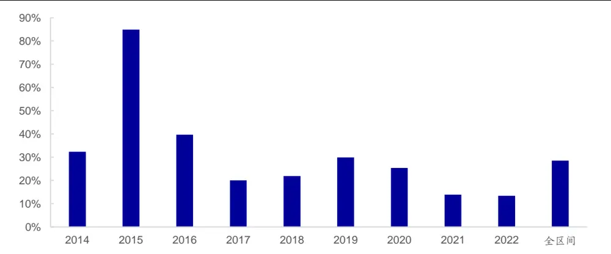
资料来源：Wind，海通证券研究所

## 3. 深度学习高频因子的特征处理

通过分钟级基础指标序列生成的特征，常常存在一些问题。如，有偏的分布、极端异常值等。因此，在将特征输入至模型前，需要对于特征进行一定的处理和校准。

## 3.1 特征分布调整

一般说来，特征分布的调整是特征处理的第一步。例如，使用波动率、成交金额、成交笔数和买卖单数生成的特征，通常具有较为明显的偏度。如图 所示，收益波动率的原始截面分布呈显著的右偏。这表明，有一部分数据的值显著高于其他样本，很容易对模型训练产生影响。因此，我们有必要事先对一些分布偏度较大的特征进行调整。

图2 收益波动率的原始截面分布
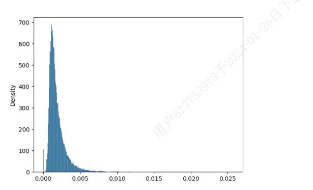
资料来源：Wind，海通证券研究所

图3 收益波动率经偏度调整后的截面分布
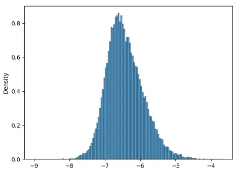
资料来源：Wind，海通证券研究所

如图 3所示，经过取自然对数调整偏度后，特征的分布更为对称，极端值也温和了许多。下表对比了 176 特征集合分布调整前后，训练得到的因子表现。

表 2 176特征集合经偏度调整后的因子表现（2014-2022）

|  | 周均IC | 年化 ICIR | 月度胜率 | 年化多头超额 | 年化空头超额 | 年化多空收益 |
| --- | --- | --- | --- | --- | --- | --- |
| 176 特征集合 | 0.072 | 8.884 | 90% | 28.5% | -38.8% | 67.3% |
| 176特征集合 (偏度调整) | 0.073 | 9.158 | 90% | 31.1% | -38.6% | 69.7% |

资料来源：Wind，海通证券研究所

偏度调整后，因子的周均 IC、年化 ICIR、周度胜率、年化多头超额收益、年化多空收益有了一定的提升。分年度来看，分布调整主要对 2015 年产生了较大的影响，收益提升显著，其余年份并无显著改变。

这一现象符合我们的预期，因为 2015 年的市场较为特殊，5、6月份出现异常波动，个股收益波动率较易出现异常值，从而影响模型的训练效果。调整偏度后，这一影响在很大程度上被消解，故最终的改善幅度较大。

因此，我们认为，将分布调整作为特征处理的第一步是很有必要的。首先，对于本身分布较为对称的特征，调整与否并不会产生很大的影响。其次，考虑到输出特征的算子类型丰富，难免会生成一些偏度较大的特征；或是特征数量大幅减少后，有偏特征的影响会进一步凸显。那么此时，偏度处理将有助于整个深度学习模型有效性和稳定性的提升。

图4 偏度调整后，176特征集合深度学习高频因子分年度多头超额收益
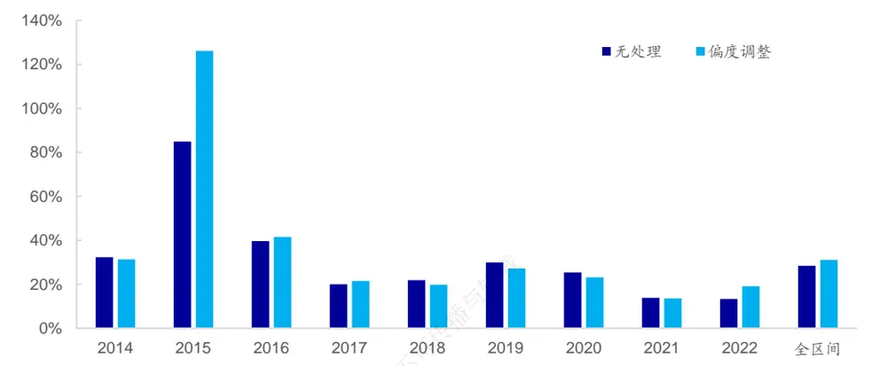
资料来源：Wind，海通证券研究所

## 3.2 特征极值处理

除整体分布的问题外，特征中的极值同样也会影响模型的训练效果，因此也有必要事先调整。我们采用和常规的因子极值处理类似的方法，即，N倍标准差截断。下表展示了 176 特征集合在偏度调整的基础上，进一步处理极值后，训练得到的因子表现。

表 3 176特征集合经偏度调整&去极值后的因子表现（2014-2022）

|  | 周均IC | 年化 ICIR | 月度胜率 | 年化多头超额 | 年化空头超额 | 年化多空收益 |
| --- | --- | --- | --- | --- | --- | --- |
| 176 特征集合 | 0.072 | 8.884 | 90% | 28.5% | -38.8% | 67.3% |
| 176特征集合 (偏度调整) | 0.073 | 9.158 | 90% | 31.1% | -38.6% | 69.7% |
| 176 特征集合 (偏度调整&去 极值） | 0.073 | 9.265 | 91% | 31.4% | -38.7% | 70.1% |

资料来源：Wind，海通证券研究所

和仅做分布调整的结果相比，去极值后，因子的周均 IC、年化 ICIR、胜率、多头超额收益都得到一定幅度的提升。分年度来看，同时处理偏度与极值问题后，176 特征集合的多头超额收益更加稳定，仅在 2018 和 2019 年小幅跑输无任何处理的结果。

图5 偏度调整&去极值后，176特征集合深度学习高频因子分年度多头超额收益
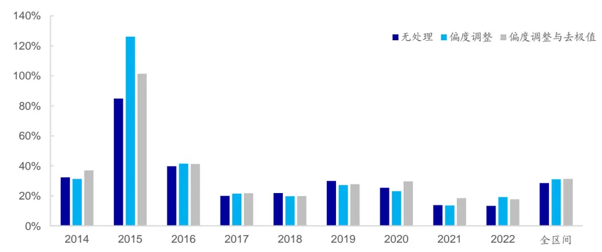
资料来源：Wind，海通证券研究所

## 3.3 特征标准化

和低频数据类似，高频数据，如，成交笔数、成交金额、收益率、波动率等，同样量纲差异巨大。因此，为减轻这个问题对模型训练带来的影响，标准化也是很有必要的。在系列前期报告《选股因子系列研究（七十七）——改进深度学习高频因子的 9 个尝试》中，我们对比了不同标准化方法下模型的效果，并发现，在生成高频因子这一情境下，横截面标准化是一个更好的选择。

但是，单一截面的标准化并不包含数据的时间序列信息，只是对特征在截面上排序。深度学习模型更像是在简单地合成特征在不同截面的相对大小，而非提炼特征的序列信息。而我们采用的 G 或 S 等深度学习模型，其优势就在于处理时间序列数据时，可以保留序列之间的相依信息。

因此，我们尝试将单一截面的标准化调整为跨越多个截面的统一标准化（下简称跨截面标准化）。即，单一截面的标准化是在每个截面上，计算 N个股票某个特征的均值与标准差；跨截面标准化则是在 T 个截面上，计算 T*N 个股票某个特征的均值与标准差。我们期望，后者可以保留部分特征的时间序列信息。

以下图表展示了采用不同标准化方式下， 特征集合训练得到的高频因子的表现。

表 4 不同截面标准化方式下的因子表现对比（2014-2022）

| 标准化方式 | 特征处理 | 周均IC | 年化 ICIR | 周度胜率 | 年化多头 超额 | 年化空头 超额 | 年化多空 收益 |
| --- | --- | --- | --- | --- | --- | --- | --- |
| 单一截面 标准化 | 无处理 | 0.072 | 8.884 | 90% | 28.5% | -38.8% | 67.3% |
|  | 偏度调整 | 0.073 | 9.158 | 90% | 31.1% | -38.6% | 69.7% |
|  | 偏度调整& 去极值 | 0.073 | 9.265 | 91% | 31.4% | -38.7% | 70.1% |
| 跨截面 标准化 | 无处理 | 0.072 | 8.973 | 92% | 29.4% | -39.0% | 68.3% |
|  | 偏度调整 偏度调整& | 0.073 | 9.241 | 91% | 31.9% | -37.9% | 69.8% |
|  | 去极值 | 0.071 | 9.110 | 91% | 30.7% | -37.5% | 68.2% |

资料来源：Wind，海通证券研究所

在不对原始特征做任何处理或仅调整偏度的做法下，跨截面标准化小幅优于单一截面标准化。然而，进一步去极值后，单一截面标准化的因子表现反而更好。因此，我们认为，跨截面标准化并不如预期那般显著提升了模型效果，在实际应用中，投资者可根据实际情况和自身偏好，选择其中一种标准化方式。

图6 不同标准化方式下，176特征集合深度学习高频因子分年度多头超额收益（偏度调整）
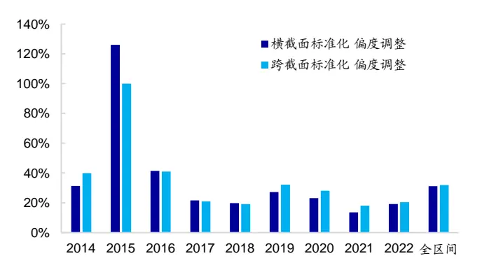
资料来源：Wind，海通证券研究所

图7 不同标准化方式下，176特征集合深度学习高频因子分年度多头超额收益（偏度调整&去极值）
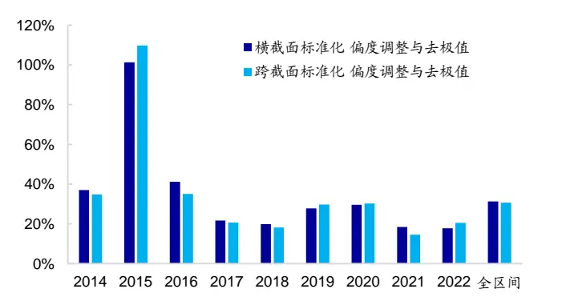
资料来源：Wind，海通证券研究所

## 4. 深度学习高频因子的特征归因

前文讨论了特征输入模型前的相关处理，本部分将关注特征输入模型后的归因分析。由于输入深度学习模型的特征通常数量众多，其中难免存在冗余变量，而过多的冗余变量将带来更多的参数和更高的过拟合风险。因此，一个好的特征贡献度归因模型就显得十分重要。它有助于投资者确定特征对模型最终预测结果的贡献，并以此筛选特征、精简模型。

常见的特征归因模型大致有基于梯度（Gradient）和基于扰动（Perturbation）两类。其中，基于梯度的归因方法又称作反向传播归因法，具体包括：Saliency、Gradient*Input、DeepLift、SHAP 和 IG 等方法。

1） Saliency法（显著性法），以输出相对输入的梯度度量特征贡献度。

） （梯度 输入），顾名思义，以输出相对输入的梯度和输入的乘积度量特征贡献度。需要注意的是，深度学习模型的非线性特点使得梯度会随着特征取值的不同而发生变化，因此，简单的梯度 输入的形式并不能精准刻画特征对最终预测结果的贡献。

3） DeepLift，全称 Deep Learning Important Features，基于链式反向传导法则，先设定一个基准输入，得到相应的基准输出；再计算任意一个输入对应的输出与基准输出之间的差值；随后，将该差值分解至每一个输入特征之上，得到各特征的归因值。

4） SHAP，全称 Shapley Additive Explanation，其核心思想是，通过计算模型在包含和不包含某一输入特征时的输出差，度量特征的贡献。但是，当特征数量较大时，穷尽所有的特征组合需要耗费大量的时间和计算资源。因此，在实际应用中，往往会借助其他方法对理论 SHAP进行逼近，最常用的就是和梯度方法结合的 DeepLiftShap 以及和梯度方法结合的 GraidentShap。

5） IG，全称 Integrated Gradient（积分梯度），是对梯度*输入的一种改良。因为梯度*输入的方法会随输入的不同而变化，故归因的准确性得不到保障。为了改进这一不足，可在事先设定的基线模型与模型输入间确定一条路径，并沿着该路径对梯度进行积分。根据相关文献1，积分梯度法具有敏感性（Sensitivity）及实现不变性（Implementation Invariance）。

基于扰动的归因方法又称作前向传播归因法，具体包括：特征删除法、特征排序法和 Shapely Value Sampling 等。

1） 特征删除法，将某一特征的数值替换为选定值后，模型输出的变化可用来度量特征的贡献度。

2） 特征排序法，对某一 batch 中的样本特征随机排序，计算与排序前模型输出之间的差值，即可度量特征的贡献度。

3） Shapely Value Sampling，和 SHAP 的思路相似，按照不同的顺序逐步添加输入特征，计算添加前后模型输出的变化，得到特征的贡献度。

本文选用积分梯度法进行特征归因，因为该方法具备完整性（Completeness）。即，所有特征归因后的贡献度之和为模型输出与基线输出之间的差值。下图为积分梯度法对某股票收益预测的归因结果。其中，归因项为模型输出与基线输出之间的差值，残余项为未被归因模型解释的部分。从下图的结果来看，归因效果极佳，残余项接近于 0。

图8 积分梯度法归因对模型输出的分解
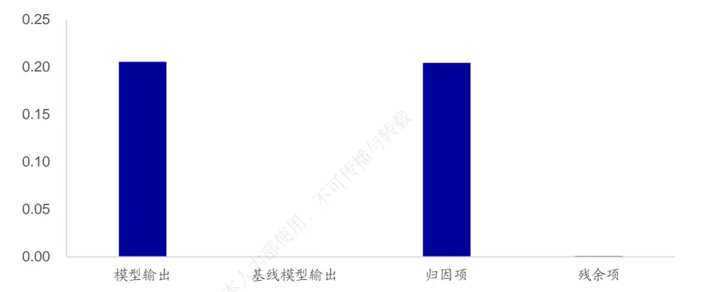
资料来源：Wind，海通证券研究所

通过积分梯度法归因，我们亦可得到每一个特征的绝对贡献度，进而比较它们对预测结果的重要性。如下图所示，特征 1、96 和 172 的贡献度远超其他特征，而特征 44、19 则基本没有贡献。

[Table_Pic 图 Pe]9 各特征对某股票收益预测的绝对贡献度
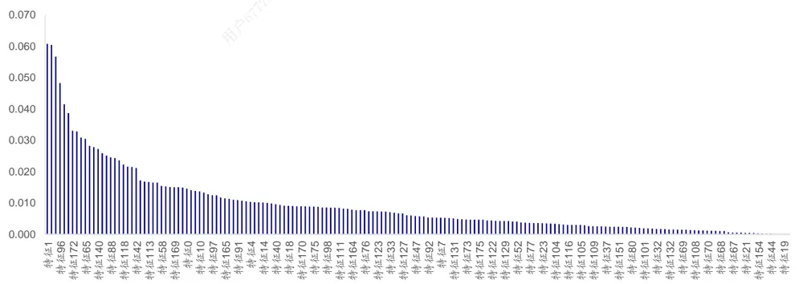
资料来源： ，海通证券研究所

进一步，我们可计算全区间内每个特征绝对贡献度的时间序列均值，从全局的角度度量特征对模型的贡献，并为特征的筛选提供参考。下表展示了 2013 年以来，经偏度调整、去极值及单一截面标准化后，每个特征的平均绝对贡献度。其中，特征 159、87、160、88、1、162、81、19 的平均绝对贡献度都在 0.04 以上，而特征 143、119、142、95、20、71、117、137 则低于 0.02，特征之间的差异十分明显。

表 5 176特征集合贡献度一览（偏度调整、去极值、单一截面标准化）

| 特征 | 平均贡献度 | 特征 | 平均贡献度 | 特征 | 平均贡献度 | 特征 | 平均贡献度 | 特征 | 平均贡献度 |
| --- | --- | --- | --- | --- | --- | --- | --- | --- | --- |
| 特征1 | 0.0413 | 特征37 | 0.0274 | 特征73 | 0.0234 | 特征 109 | 0.0280 | 特征145 | 0.0234 |
| 特征2 | 0.0387 | 特征38 | 0.0250 | 特征74 | 0.0248 | 特征110 | 0.0254 | 特征146 | 0.0246 |
| 特征3 | 0.0290 | 特征39 | 0.0268 | 特征75 | 0.0268 | 特征111 | 0.0398 | 特征147 | 0.0258 |
| 特征4 | 0.0216 | 特征40 | 0.0243 | 特征76 | 0.0270 | 特征112 | 0.0396 | 特征148 | 0.0240 |
| 特征5 | 0.0371 | 特征 41 | 0.0230 | 特征77 | 0.0224 | 特征113 | 0.0206 | 特征149 | 0.0227 |
| 特征6 | 0.0271 | 特征42 | 0.0217 | 特征78 | 0.0282 | 特征114 | 0.0345 | 特征150 | 0.0253 |
| 特征7 | 0.0362 | 特征 43 | 0.0244 | 特征79 | 0.0264 | 特征115 | 0.0326 | 特征 151 | 0.0244 |
| 特征8 | 0.0353 | 特征44 | 0.0255 | 特征80 | 0.0224 | 特征116 | 0.0284 | 特征152 | 0.0223 |
| 特征9 | 0.0265 | 特征 45 | 0.0267 | 特征81 | 0.0406 | 特征117 | 0.0199 | 特征 153 | 0.0390 |
| 特征10 | 0.0343 | 特征 46 | 0.0296 | 特征82 | 0.0393 | 特征118 | 0.0206 | 特征154 | 0.0374 |
| 特征11 | 0.0239 | 特征 47 | 0.0253 | 特征 83 | 0.0287 | 特征119 | 0.0182 | 特征 155 | 0.0318 |
| 特征12 | 0.0238 | 特征 48 | 0.0250 | 特征84 | 0.0388 | 特征120 | 0.0239 | 特征156 | 0.0355 |
| 特征13 | 0.0366 | 特征 49 | 0.0242 | 特征 85 | 0.0335 | 特征121 | 0.0242 | 特征 157 | 0.0346 |
| 特征14 | 0.0236 | 特征50 | 0.0248 | 特征86 | 0.0281 | 特征122 | 0.0252 | 特征158 | 0.0314 |
| 特征15 | 0.0382 | 特征51 | 0.0248 | 特征87 | 0.0467 | 特征123 | 0.0228 | 特征159 | 0.0472 |
| 特征16 | 0.0248 | 特征52 | 0.0277 | 特征88 | 0.0438 | 特征124 | 0.0237 | 特征160 | 0.0446 |
| 特征17 | 0.0325 | 特征53 | 0.0274 | 特征 89 | 0.0299 | 特征125 | 0.0233 | 特征161 | 0.0326 |
| 特征18 | 0.0254 | 特征54 | 0.0249 | 特征 90 | 0.0348 | 特征126 | 0.0241 | 特征162 | 0.0413 |
| 特征19 | 0.0402 | 特征55 | 0.0252 | 特征 91 | 0.0341 | 特征127 | 0.0227 | 特征 163 | 0.0357 |
| 特征20 | 0.0195 | 特征56 | 0.0251 | 特征92 | 0.0288 | 特征128 | 0.0228 | 特征164 | 0.0312 |
| 特征 21 | 0.0235 | 特征57 | 0.0319 | 特征 93 | 0.0214 | 特征129 | 0.0331 | 特征 165 | 0.0222 |
| 特征22 | 0.0229 | 特征58 | 0.0321 | 特征94 | 0.0238 | 特征130 | 0.0337 | 特征166 | 0.0229 |
| 特征 23 | 0.0207 | 特征59 | 0.0225 | 特征95 | 0.0193 | 特征131 | 0.0250 | 特征 167 | 0.0206 |
| 特征24 | 0.0226 | 特征60 | 0.0295 | 特征96 | 0.0249 | 特征132 | 0.0312 | 特征168 | 0.0276 |
| 特征 25 | 0.0214 | 特征 61 | 0.0298 | 特征 97 | 0.0247 | 特征 133 | 0.0263 | 特征 169 | 0.0274 |
| 特征26 | 0.0292 | 特征62 | 0.0240 | 特征98 | 0.0273 | 特征134 | 0.0239 | 特征170 | 0.0345 |
| 特征 27 | 0.0327 | 特征 63 | 0.0295 | 特征 99 | 0.0327 | 特征 135 | 0.0298 | 特征171 | 0.0321 |
| 特征28 | 0.0344 | 特征64 | 0.0304 | 特征100 | 0.0265 | 特征136 | 0.0305 | 特征172 | 0.0318 |
| 特征 29 | 0.0264 | 特征 65 | 0.0210 | 特征101 | 0.0252 | 特征137 | 0.0199 | 特征173 | 0.0301 |
| 特征30 特征31 | 0.0274 | 特征 66 | 0.0288 | 特征102 | 0.0272 | 特征138 | 0.0327 | 特征174 | 0.0322 |
|  | 0.0281 | 特征 67 | 0.0293 | 特征 103 | 0.0265 | 特征139 | 0.0309 | 特征175 | 0.0301 |
| 特征32 | 0.0262 | 特征 68 | 0.0225 | 特征 104 | 0.0244 | 特征140 | 0.0275 | 特征176 | 0.0288 |
| 特征33 | 0.0270 | 特征 69 | 0.0252 | 特征 105 | 0.0353 | 特征141 | 0.0205 |  |  |
| 特征34 | 0.0233 | 特征70 | 0.0252 | 特征 106 | 0.0361 | 特征142 | 0.0191 |  |  |
| 特征35 | 0.0322 | 特征71 | 0.0196 | 特征107 | 0.0257 | 特征143 | 0.0179 |  |  |
| 特征36 | 0.0294 | 特征72 | 0.0244 | 特征108 | 0.0298 | 特征144 | 0.0229 |  |  |

资料来源： ，海通证券研究所

## 5. 深度学习高频因子的特征筛选

## 5.1 特征的静态精选

根据特征归因模型给出的全区间平均贡献度的高低（表 5），我们可对原始的 176特征集合进行精选，将特征总数缩减至 64个（下简称静态 64特征集合）。下表展示了不同处理方式下，使用 176 特征集合与静态 64 特征集合分别训练，所得深度学习高频因子的表现。

表 6 176特征集合与静态 64特征集合的因子表现（2014-2022）

| 标准化方式 | 特征处理 | 特征集合 | 周均IC | 年化ICIR | 周度胜率 | 年化多头超额 | 年化空头超额 | 年化多空收益 |
| --- | --- | --- | --- | --- | --- | --- | --- | --- |
| 单一截面 标准化 | 无处理 | 176特征 | 0.072 | 8.884 | 90% | 28.5% | -38.8% | 67.3% |
|  |  | 静态 64 特征 | 0.075 | 8.708 | 90% | 32.6% | -39.1% | 71.7% |
|  | 偏度调整 | 176特征 | 0.073 | 9.158 | 90% | 31.1% | -38.6% | 69.7% |
|  |  | 静态 64 特征 | 0.077 | 9.082 | 90% | 34.2% | -39.3% | 73.5% |
| 跨截面 标准化 | 偏度调整& 去极值 | 176特征 | 0.073 | 9.265 | 91% | 31.4% | -38.7% | 70.1% |
|  |  | 静态 64 特征 | 0.075 | 8.752 | 90% | 34.1% | -37.9% | 72.1% |
|  | 无处理 | 176 特征 | 0.072 | 8.973 | 92% | 29.4% | -39.0% | 68.3% |
|  | 偏度调整 | 静态 64 特征 | 0.074 | 8.657 | 90% | 31.8% | -38.8% | 70.6% |
|  |  | 176特征 | 0.073 | 9.241 | 91% | 31.9% | -37.9% | 69.8% |
|  |  | 静态64 特征 | 0.075 | 8.833 | 90% | 33.3% | -37.8% | 71.1% |
|  | 偏度调整& 去极值 | 176特征 | 0.071 | 9.110 | 91% | 30.7% | -37.5% | 68.2% |
|  |  | 静态 64 特征 | 0.073 | 8.765 | 91% | 34.0% | -37.5% | 71.5% |

资料来源：Wind，海通证券研究所

在相同的特征处理方式下，使用静态 64 特征训练得到的因子在 IC 和年化多头超额收益上，都优于 176 特征集合。

分年度来看（表 7），不论是单一截面标准化还是跨截面标准化，静态 64 特征集合训练得到的因子，其多头超额收益在绝大多数年份上都高于原始的 集合。这表明，根据贡献度精简特征之后，我们有效地剔除了冗余信息，进一步提升了深度学习模型的表现。

表 7 176特征集合与静态 64特征集合训练所得因子的分年度多头超额收益（2014-2022）

|  | 横截面标准化 |  |  |  |  |  | 跨截面标准化 |  |  |  |  |  |
| --- | --- | --- | --- | --- | --- | --- | --- | --- | --- | --- | --- | --- |
|  | 无处理 |  | 偏度调整 |  | 偏度调整&去极值 |  | 无处理 |  | 偏度调整 |  | 偏度调整&去极值 |  |
|  | 176 特征 | 静态64 特征 | 176 特征 | 静态64 特征 | 176 特征 | 静态64 特征 | 176 特征 | 静态64 特征 | 176 特征 | 静态64 特征 | 176 特征 | 静态64 特征 |
| 2014 | 32.3% | 43.1% | 31.3% | 43.6% | 37.0% | 36.1% | 41.1% | 47.7% | 40.0% | 40.2% | 34.9% | 43.5% |
| 2015 | 84.9% | 108.2% | 126.2% | 129.1% | 101.4% | 128.5% | 86.9% | 92.4% | 100.1% | 115.2% | 109.8% | 110.5% |
| 2016 | 39.7% | 50.5% | 41.5% | 43.6% | 41.2% | 42.7% | 38.9% | 43.8% | 41.0% | 39.6% | 35.1% | 41.1% |
| 2017 | 20.0% | 22.1% | 21.5% | 22.1% | 21.7% | 22.5% | 21.5% | 19.1% | 21.1% | 21.0% | 20.6% | 20.9% |
| 2018 | 21.9% | 21.2% | 19.8% | 21.5% | 19.9% | 21.9% | 21.3% | 20.8% | 19.2% | 21.2% | 18.2% | 19.7% |
| 2019 | 29.9% | 25.0% | 27.2% | 31.7% | 27.8% | 32.6% | 28.8% | 30.0% | 32.3% | 31.5% | 29.7% | 34.8% |
| 2020 | 25.4% | 24.5% | 23.1% | 22.0% | 29.7% | 21.4% | 23.2% | 28.4% | 28.2% | 25.4% | 30.3% | 27.2% |
| 2021 | 13.9% | 20.4% | 13.6% | 15.8% | 18.4% | 18.8% | 18.7% | 18.8% | 18.0% | 19.4% | 14.6% | 21.6% |
| 2022 | 13.4% | 15.7% | 19.2% | 24.1% | 17.8% | 25.6% | 12.1% | 17.0% | 20.3% | 24.2% | 20.5% | 24.7% |
| 全区间 | 28.5% | 32.6% | 31.1% | 34.2% | 31.4% | 34.1% | 29.4% | 31.8% | 31.9% | 33.3% | 30.7% | 34.0% |

资料来源： ，海通证券研究所

## 5.2 特征的动态精选

上一节中的特征精选是基于全区间的平均贡献度，因而必然引入了未来信息。在实际应用中，动态地筛选特征才是更为合理可行的方案。具体地，

1） 每次预测时，先使用 176 特征集合训练模型；

2） 使用积分梯度法进行特征归因，计算每个特征的贡献度；

3） 选取贡献度最高的 128/64/32 个特征（下简称动态 128/64/32 特征集合）再次训练模型，并生成最终的预测值。

下表展示了不同特征处理方式下，动态筛选特征后的因子表现。

表 8 176 特征集合与动态 128/64/32 特征集合的因子表现（2014-2022）

| 标准化方式 特征处理 |  | 特征集合 | 周均IC | 年化 ICIR | 周度胜率 | 年化多头超额 | 年化空头超额 | 年化多空收益 |
| --- | --- | --- | --- | --- | --- | --- | --- | --- |
| 单一截面 标准化 | 无处理 | 176特征 | 0.072 | 8.884 | 90% | 28.5% | -38.8% | 67.3% |
|  |  | 动态128特征 | 0.073 | 8.994 | 90% | 29.4% | -39.3% | 68.7% |
|  |  | 动态 64特征 | 0.074 | 8.853 | 90% | 30.2% | -38.7% | 68.9% |
|  |  | 动态32特征 176特征 | 0.072 | 8.413 | 89% | 29.4% | -38.5% | 67.9% |
|  |  |  | 0.073 | 9.158 | 90% | 31.1% | -38.6% | 69.7% |
|  |  | 动态128特征 偏度调整 | 0.074 | 8.961 | 91% | 31.8% | -37.6% | 69.4% |
|  |  | 动态 64 特征 | 0.074 | 8.764 | 91% | 33.4% | -38.0% | 71.4% |
|  |  | 动态32 特征 | 0.074 | 8.646 | 90% | 31.6% | -38.1% | 69.7% |
|  |  | 176特征 | 0.073 | 9.265 | 91% | 31.4% | -38.7% | 70.1% |
|  | 偏度调整& 去极值 | 动态128特征 动态 64 特征 | 0.074 | 9.056 | 90% | 31.6% | -38.8% | 70.3% |
|  |  | 0.074 | 8.610 | 89% | 32.8% | -38.2% | 71.0% |  |
| 动态32 特征 |  | 0.072 | 8.660 | 89% | 34.4% | -36.4% | 70.9% |  |
| 跨截面 标准化 | 无处理 | 176特征 | 0.072 | 8.973 92% | 29.4% | -39.0% |  | 68.3% |
|  |  | 动态128特征 | 0.073 | 9.021 | 91% | 31.8% | -38.4% | 70.2% |
|  |  | 动态 64特征 | 0.072 | 8.732 | 90% | 30.4% | -38.7% | 69.1% |
|  |  | 动态32 特征 | 0.070 | 8.354 | 89% | 30.5% | -37.8% | 68.3% |
|  |  | 176特征 | 0.073 | 9.241 | 91% | 31.9% | -37.9% | 69.8% |
|  | 动态128特征 偏度调整 动态 64 特征 | 0.072 | 9.046 | 90% | 32.4% | -37.7% | 70.1% |  |
|  |  | 0.074 | 9.119 | 90% | 33.6% | -38.2% | 71.8% |  |
|  |  | 动态32 特征 0.071 | 8.380 | 89% | 31.7% | -36.6% | 68.3% |  |
|  | 偏度调整& | 176 特征 | 0.071 | 9.110 91% | 30.7% | -37.5% |  | 68.2% |
| 动态128特征 |  | 0.072 | 9.094 | 91% | 32.1% | -37.9% | 70.0% |  |
| 去极值 动态 64 特征 |  | 0.072 | 8.744 | 91% | 32.0% | -37.3% | 69.2% |  |
|  |  | 动态32特征 | 0.070 | 8.539 | 89% | 32.4% | -36.2% | 68.7% |

资料来源：Wind，海通证券研究所

当特征数量从 176 精简至 128或 64 后，在任何一种处理方式下，因子的 IC 均未出现下降，而年化多头超额收益则进一步提升。但是，如果特征数量进一步降至 32，反而有可能造成 或多头超额收益的下降。因此，我们认为，和线性模型类似，深度学习模型的特征筛选同样是有必要且有益的。它可以剔除冗余信息、缩短训练时间、优化计算资源，并较为显著地提升模型表现。然而，过度精简特征也会损失有效信息，降低训练所得因子的选股能力，故我们需要在模型的简约和效果之间取得平衡。

以下两图分别为两种标准化方式下，动态筛选特征后，深度学习因子的分年度多头超额收益。除了 2017 和 2020 年，使用动态筛选后的特征，多头超额收益均有可能超越原始的 176 特征集合。

图10 176特征集合与动态128/64/32特征集合深度学习高频因子分年度多头超额收益（单一截面标准化+偏度调整+去极值）
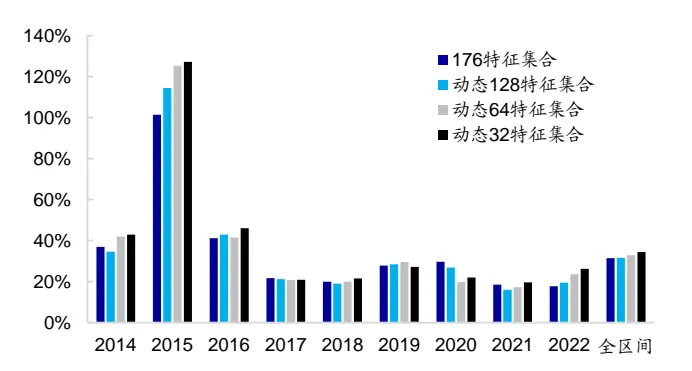
资料来源：Wind，海通证券研究所

图11 176特征集合与动态128/64/32特征集合深度学习高频因子分年度多头超额收益（跨截面标准化+偏度调整+去极值）
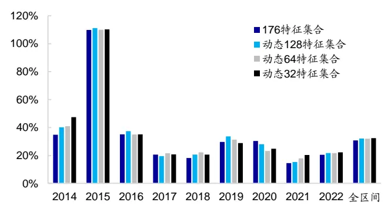
资料来源：Wind，海通证券研究所

下表进一步展示了使用 176 特征集合和动态 64 特征集合训练得到的因子的分年度多头超额收益。不同处理方式下，动态 64特征集合都取得了不弱于原始集合的业绩。

表 9 176特征集合与动态 64特征集合训练所得因子的分年度多头超额收益（2014-2022）

|  | 单一截面标准化 |  |  |  |  |  | 跨截面标准化 |  |  |  |  |  |
| --- | --- | --- | --- | --- | --- | --- | --- | --- | --- | --- | --- | --- |
|  | 无处理 |  | 偏度调整 |  | 偏度调整&去极值 |  | 无处理 |  | 偏度调整 |  | 偏度调整&去极值 |  |
|  | 176 特征 | 动态64 特征 | 176 特征 | 动态64 特征 | 176 特征 | 动态64 特征 | 176 特征 | 动态64 特征 | 176 特征 | 动态64 特征 | 176 特征 | 动态64 特征 |
| 2014 | 32.3% | 42.3% | 31.3% | 39.6% | 37.0% | 42.0% | 41.1% | 39.9% | 40.0% | 46.8% | 34.9% | 40.9% |
| 2015 | 84.9% | 105.0% | 126.2% | 109.9% | 101.4% | 125.3% | 86.9% | 101.4% | 100.1% | 115.4% | 109.8% | 110.0% |
| 2016 | 39.7% | 47.7% | 41.5% | 42.4% | 41.2% | 41.5% | 38.9% | 39.8% | 41.0% | 39.2% | 35.1% | 34.9% |
| 2017 | 20.0% | 18.0% | 21.5% | 21.7% | 21.7% | 20.8% | 21.5% | 23.0% | 21.1% | 21.1% | 20.6% | 21.6% |
| 2018 | 21.9% | 17.7% | 19.8% | 22.8% | 19.9% | 19.9% | 21.3% | 18.9% | 19.2% | 20.8% | 18.2% | 22.2% |
| 2019 | 29.9% | 24.1% | 27.2% | 30.9% | 27.8% | 29.5% | 28.8% | 27.5% | 32.3% | 31.7% | 29.7% | 31.3% |
| 2020 | 25.4% | 25.9% | 23.1% | 25.3% | 29.7% | 19.8% | 23.2% | 25.0% | 28.2% | 24.7% | 30.3% | 23.1% |
| 2021 | 13.9% | 16.9% | 13.6% | 18.9% | 18.4% | 17.2% | 18.7% | 14.8% | 18.0% | 20.4% | 14.6% | 17.8% |
| 2022 | 13.4% | 13.5% | 19.2% | 23.1% | 17.8% | 23.5% | 12.1% | 17.2% | 20.3% | 23.0% | 20.5% | 21.7% |
| 全区间 | 28.5% | 30.2% | 31.1% | 33.4% | 31.4% | 32.8% | 29.4% | 30.4% | 31.9% | 33.6% | 30.7% | 32.0% |

资料来源：Wind，海通证券研究所

## 6. 深度学习高频因子在指数增强组合中的应用与对比

为了更好地分析前文对特征的一系列处理方式，本章将深度学习模型训练得到的因子引入周度调仓的中证 500 和中证 1000 指数增强组合，考察收益风险特征的变化。与本系列前序专题报告的测试设定类似，收益预测模型中所使用的基础因子包括：市值、中盘（市值三次方）、估值、换手、反转、波动、盈利、SUE、尾盘成交占比、买入意愿占比、大单净买入占比和深度学习高频因子。

在预测个股收益时，我们首先采用回归法得到因子溢价，再计算最近 12 个月的因子溢价均值估计下期的因子溢价，最后乘以最新一期的因子值。

风险控制模型包括以下几个方面的约束：

1） 个股偏离：相对基准的偏离幅度不超过 0.5%/1%/2%；

2） 因子敞口：市值、估值中性、常规低频因子≤ ±0.5，高频因子≤ ±2.0；

3） 行业偏离：严格中性/行业偏离上限 2%；

4） 换手率限制：单次单边换手不超过 30%。

组合的优化目标为最大化预期收益，目标函数如下所示：

$$
max\sum\mu_{i}w_{i}
$$

其中， $\mathsf{W}_{\mathrm{i}}$ 为组合中股票 i的权重，μ 为股票 i的预期超额收益。为使本文的结论贴近实践，如无特别说明，下文的测算均假定以次日均价成交，同时扣除 3‰的交易成本。

## 6.1 中证 500 增强组合

如下表所示，首先，同样是 特征集合，偏度调整和去极值均能大概率提升年化超额收益；其次，一定程度特征的筛选（ 或 特征集合），也在绝大多数情况下，获得了优于原始集合的表现；第三，过度的特征筛选，如仅保留 32 个特征，则有可能损失重要信息，产生负面效应。最后，单一截面和跨截面两种标准化方式的差异较小。

表 10 添加不同深度学习高频因子后，中证 500增强组合年化超额收益（2014-2022）

|  |  |  | 行业中性 |  |  |  | 行业偏离 2% 个股偏离 |  |
| --- | --- | --- | --- | --- | --- | --- | --- | --- |
| 标准化方式 | 特征处理 | 特征集合 | 个股偏离 0.5% | 个股偏离 1% | 个股偏离 2% | 个股偏离 0.5% | 个股偏离 1% | 2% |
|  |  | 176特征 | 14.1% | 15.2% | 15.8% | 16.6% | 18.1% | 17.7% |
|  | 无处理 | 静态 64 特征 | 14.5% | 15.7% | 17.3% | 16.3% | 18.0% | 18.7% |
|  |  | 动态128特征 动态64 特征 | 14.4% | 16.0% | 15.2% | 16.4% | 18.2% | 18.1% |
|  |  | 动态 32 特征 | 14.7% | 15.3% | 16.2% | 15.7% | 17.7% | 16.7% |
|  |  | 176特征 | 13.7% 14.9% | 15.7% | 15.4% | 15.8% | 16.8% | 16.3% |
|  |  | 静态 64 特征 | 15.2% | 16.0% | 15.7% 18.3% | 16.4% | 17.9% | 18.8% |
|  | 动态128特征 | 14.7% | 16.6% |  | 17.4% | 17.7% | 19.5% |  |
|  | 标准化 偏度调整& 去极值 | 偏度调整 | 15.5% | 15.7% | 18.4% | 16.7% | 18.7% | 19.5% |
|  |  | 动态 64 特征 动态 32 特征 | 15.3% | 16.3% | 17.2% | 17.8% | 18.5% | 19.8% |
| 176 特征 |  | 14.8% | 16.0% | 16.3% | 16.6% | 17.4% | 16.9% |  |
| 静态 64 特征 |  | 14.4% | 15.4% | 16.7% 17.8% | 17.5% | 18.0% | 17.6% |  |
| 动态128特征 |  | 15.4% | 16.1% 17.1% | 17.7% | 16.5% | 18.1% | 18.8% |  |
| 动态64 特征 |  | 15.0% | 16.1% | 16.9% | 17.3% | 19.1% | 20.6% |  |
| 动态 32 特征 |  | 15.1% | 16.0% | 18.1% | 17.0% 17.0% | 17.3% | 18.5% |  |
| 跨截面 标准化 |  | 176 特征 | 14.2% |  | 15.5% |  | 18.1% | 18.7% |
|  | 无处理 | 静态 64 特征 | 14.1% | 14.6% |  | 16.7% | 16.5% | 16.7% |
|  |  | 动态128特征 | 14.8% | 15.8% | 16.6% | 16.4% | 18.6% | 18.7% |
|  |  | 动态 64 特征 | 13.9% | 14.7% | 14.3% | 16.6% | 17.3% | 17.3% |
|  |  | 动态32特征 | 13.9% | 15.2% | 18.4% | 16.0% | 16.8% | 17.2% |
|  |  | 176特征 | 14.7% | 13.8% | 15.5% | 16.2% | 15.9% | 16.6% |
|  | 偏度调整 | 静态 64 特征 |  | 14.8% | 17.2% | 16.7% | 16.6% | 18.4% |
|  |  | 动态128特征 | 14.7% | 16.1% | 17.2% | 17.4% | 18.5% | 18.3% |
|  |  | 动态 64 特征 | 14.3% | 15.0% | 15.9% | 16.8% | 17.4% | 16.7% |
|  |  | 动态 32 特征 | 15.6% 14.9% | 16.9% | 17.2% 17.4% | 17.7% | 17.8% | 18.1% |
|  |  |  |  | 16.2% |  | 16.9% | 18.2% | 16.9% |
|  | 偏度调整& 去极值 | 176特征 | 15.6% | 16.6% | 17.7% | 16.8% | 18.9% | 19.7% |
|  |  | 静态 64 特征 | 15.2% | 16.0% | 17.6% | 17.4% | 18.7% | 18.8% |
|  |  | 动态128特征 | 15.1% | 16.4% | 17.4% | 17.6% | 17.9% | 19.7% |
|  |  | 动态 64 特征 动态32特征 | 15.2% | 16.9% | 18.4% | 17.1% | 18.4% | 17.6% |
|  |  |  | 15.2% | 16.4% | 17.6% | 17.6% | 18.5% | 18.7% |

资料来源：Wind，海通证券研究所

作为示例，我们选取了行业偏离 2%、个股偏离 0.5%、单一截面标准化及偏度调整这组参数下，使用动态 64 特征集合训练得到的高频因子加入中证 500 增强后，策略的分年度收益风险特征及相对基准的强弱曲线。

表 11 中证 500增强组合分年度收益风险特征

|  | 超额收益 | 最大回撤 | 跟踪误差 | 月度胜率 | 信息比率 | 收益回撤比 |
| --- | --- | --- | --- | --- | --- | --- |
| 2016 | 25.2% | 1.5% | 4.3% | 92% | 5.82 | 17.25 |
| 2017 | 17.3% | 2.1% | 4.1% | 100% | 4.21 | 8.37 |
| 2018 | 14.5% | 2.3% | 4.4% | 92% | 3.30 | 6.25 |
| 2019 | 16.9% | 1.8% | 3.7% | 83% | 4.54 | 9.20 |
| 2020 | 20.5% | 3.0% | 5.5% | 83% | 3.73 | 6.83 |
| 2021 | 20.8% | 5.8% | 7.7% | 67% | 2.72 | 3.59 |
| 2022 | 10.5% | 3.2% | 5.5% | 83% | 1.92 | 3.28 |
| 全区间 | 17.8% | 5.8% | 5.2% | 86% | 3.43 | 3.07 |

资料来源：Wind，海通证券研究所

2016-2022 年，策略年化超额收益 17.8%，2022 年超额收益 10.5%。全区间月度胜率 86%，信息比和收益回撤比均大于 3。

图12 中证 500增强组合相对基准的强弱走势（2016-2022）
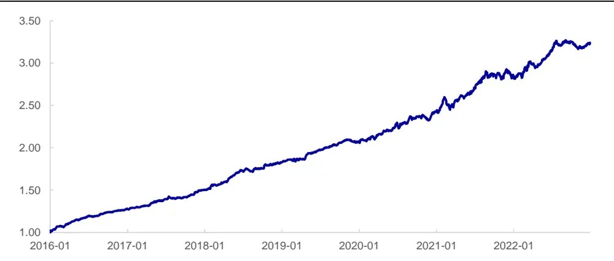
资料来源：Wind，海通证券研究所

## 6.2 中证 1000 增强组合

如下表所示，将不同处理方式下的深度学习高频因子引入中证 1000 增强策略，得到了和中证 500 增强类似的效果和结论。即，特征的预处理，包括偏度调整和去极值，是有必要的；特征的筛选同样有助业绩的改善，但不宜过度。

表 12 添加不同深度学习高频因子后，中证 1000增强组合年化超额收益（2014-2022）

|  |  |  | 行业中性 |  |  | 行业偏离 2% |  |  |
| --- | --- | --- | --- | --- | --- | --- | --- | --- |
| 标准化方式 | 特征处理 | 特征集合 | 个股偏离 0.5% | 个股偏离 1% | 个股偏离 2% | 个股偏离 0.5% | 个股偏离 1% | 个股偏离 2% |
|  | 无处理 | 176 特征 | 20.7% | 20.7% | 24.2% | 22.6% | 22.4% | 23.2% |
|  |  | 静态 64 特征 | 20.9% | 19.8% | 22.2% | 22.3% | 22.1% | 22.8% |
|  |  | 动态128特征 动态64 特征 | 20.7% 20.5% | 21.0% | 21.2% | 22.7% | 23.0% | 22.3% |
|  |  |  |  | 19.5% | 19.2% | 22.7% | 22.1% | 20.1% |
|  | 偏度调整 | 动态32特征 | 21.0% | 18.9% | 19.6% | 22.2% | 21.7% | 20.2% |
|  |  | 176特征 | 20.4% | 20.4% | 22.0% | 23.0% | 23.1% | 23.6% |
|  |  | 静态 64 特征 | 21.2% | 21.9% | 22.9% | 23.0% | 24.3% | 25.3% |
|  |  | 动态128特征 | 21.1% | 21.6% | 23.9% | 23.9% | 23.9% | 23.7% |
|  |  | 动态64 特征 | 22.5% | 21.7% | 21.5% | 24.3% | 24.1% | 23.4% |
| 动态32 特征 176 特征 |  | 21.2% 21.6% | 21.5% | 21.4% | 23.0% | 23.0% | 23.4% |  |
| 静态 64 特征 |  | 21.3% | 21.3% | 22.8% | 23.6% | 23.7% | 24.1% |  |
| 偏度调整& 去极值 |  |  | 20.0% | 21.8% | 23.1% | 23.5% | 22.5% |  |
|  | 动态128特征 | 21.8% | 22.2% | 21.4% | 23.8% | 24.5% | 24.5% |  |
|  | 动态 64 特征 动态32 特征 | 21.5% | 21.7% | 21.2% | 23.1% | 24.0% | 22.6% |  |
|  |  | 21.8% | 22.6% | 22.3% | 23.7% | 23.8% | 23.3% |  |
| 跨截面 标准化 | 无处理 | 176特征 | 21.1% | 20.3% | 20.8% | 22.6% | 23.9% | 21.9% |
|  |  | 静态 64 特征 | 20.8% | 20.8% | 20.2% | 22.8% | 23.2% | 22.5% |
|  |  | 动态128特征 | 21.5% | 20.7% | 22.0% | 23.1% | 24.0% | 21.9% |
|  |  | 动态 64 特征 | 21.3% | 19.3% | 20.9% | 22.4% | 22.6% | 21.5% |
|  |  | 动态32 特征 | 20.4% | 20.5% | 19.4% | 21.9% | 21.8% | 19.6% |
|  | 176 特征 | 21.2% | 22.2% | 22.1% | 22.5% | 24.4% | 24.6% |  |
|  | 偏度调整 | 静态 64 特征 | 21.6% | 20.8% | 21.7% | 22.8% | 23.1% | 23.2% |
|  |  | 动态128特征 | 20.9% | 20.2% | 21.0% | 22.9% | 23.4% | 21.2% |
| 动态 64 特征 |  | 21.7% | 22.5% | 22.2% | 24.2% | 23.8% | 23.4% |  |
| 动态32特征 |  | 20.7% | 21.9% | 20.4% | 22.8% | 23.0% | 23.0% |  |

| 偏度调整& 去极值 | 176特征 | 21.5% | 20.9% | 21.0% | 23.4% | 22.8% | 23.1% |
| --- | --- | --- | --- | --- | --- | --- | --- |
|  | 静态 64 特征 | 22.1% | 22.8% | 21.3% | 24.3% | 24.4% | 24.4% |
|  | 动态128特征 | 22.1% | 22.8% | 23.5% | 23.7% | 25.0% | 23.7% |
|  | 动态 64 特征 | 21.4% | 21.3% | 22.3% | 23.4% | 23.5% | 23.2% |
|  | 动态32特征 | 21.4% | 21.4% | 20.5% | 23.1% | 22.0% | 22.9% |

资料来源：Wind，海通证券研究所

同样地，我们选取了行业偏离 2%、个股偏离 0.5%、单一截面标准化及偏度调整这组参数下，加入动态 特征集合训练得到的高频因子后，中证 增强策略的分年度收益风险特征及相对基准的强弱曲线。

表 13 中证 1000增强组合分年度收益风险特征

|  | 超额收益 | 最大回撤 | 跟踪误差 | 月度胜率 | 信息比率 | 收益回撤比 |
| --- | --- | --- | --- | --- | --- | --- |
| 2016 | 34.2% | 0.9% | 5.1% | 100% | 6.65 | 36.24 |
| 2017 | 23.8% | 0.8% | 4.0% | 100% | 5.95 | 31.09 |
| 2018 | 20.9% | 1.3% | 4.3% | 92% | 4.82 | 16.50 |
| 2019 | 24.6% | 2.0% | 4.2% | 92% | 5.76 | 12.18 |
| 2020 | 29.1% | 2.8% | 5.8% | 83% | 5.06 | 10.50 |
| 2021 | 24.8% | 4.0% | 5.8% | 67% | 4.28 | 6.26 |
| 2022 | 14.2% | 2.3% | 4.7% | 83% | 3.03 | 6.29 |
| 全区间 | 24.3% | 4.0% | 4.9% | 88% | 4.97 | 6.16 |

资料来源：Wind，海通证券研究所

2016-2022 年，策略年化超额收益 24.3%，2022 年超额收益 14.2%。全区间月度胜率 88%，信息比接近 5，收益回撤比大于 6。

图13 中证 1000增强组合相对基准的强弱走势（2016-2022）
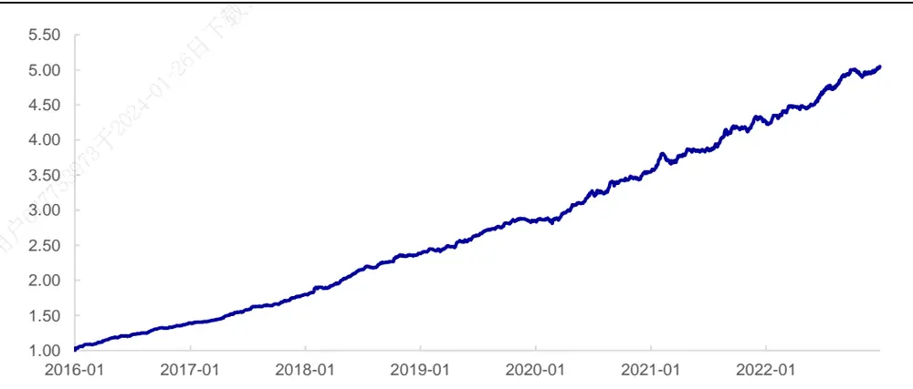
资料来源：Wind，海通证券研究所

## 7. 总结

特征工程是深度学习高频因子训练中的第一步，也是极为重要的一步。为此，本文从特征构成、特征处理、特征归因和特征筛选这 个方面，对特征工程的相关问题展开全方位的讨论。根据我们详尽的测试，特征处理，尤其是特征分布的调整，对深度学习模型生成的因子有相当显著的影响；特征归因，不仅有助于我们考察和评价不同特征对模型的贡献，更为进一步的特征筛选奠定了基础。

特征筛选，可以有效剔除原始特征中的冗余信息，缩短训练时间、优化计算资源，并较为显著、稳定地提升模型表现。在本文介绍的多种归因方法中，积分梯度法简单直接、易于理解，且效果良好，较为适合在实际中应用。据此筛选原始特征后，不论是单因子检验，还是加入中证 500 和中证 1000 增强，都较为明显地改善了业绩表现。

## 8. 风险提示

市场系统性风险、资产流动性风险、政策变动风险、因子失效风险。

# 信息披露

分析师声明

[Table冯佳睿yst金融工程研究团队s]

袁林青金融工程研究团队

本人具有中国证券业协会授予的证券投资咨询执业资格，以勤勉的职业态度，独立、客观地出具本报告。本报告所采用的数据和信息均来自市场公开信息，本人不保证该等信息的准确性或完整性。分析逻辑基于作者的职业理解，清晰准确地反映了作者的研究观点，结论不受任何第三方的授意或影响，特此声明。

## 法律声明

本报告仅供海通证券股份有限公司（以下简称 本公司 ）的客户使用。本公司不会因接收人收到本报告而视其为客户。在任何情况下，本报告中的信息或所表述的意见并不构成对任何人的投资建议。在任何情况下，本公司不对任何人因使用本报告中的任何内容所引致的任何损失负任何责任。

本报告所载的资料、意见及推测仅反映本公司于发布本报告当日的判断，本报告所指的证券或投资标的的价格、价值及投资收入可能会波动。在不同时期，本公司可发出与本报告所载资料、意见及推测不一致的报告。

市场有风险，投资需谨慎。本报告所载的信息、材料及结论只提供特定客户作参考，不构成投资建议，也没有考虑到个别客户特殊的播投资目标、财务状况或需要。客户应考虑本报告中的任何意见或建议是否符合其特定状况。在法律许可的情况下，海通证券及其所属可关联机构可能会持有报告中提到的公司所发行的证券并进行交易，还可能为这些公司提供投资银行服务或其他服务。

本报告仅向特定客户传送，未经海通证券研究所书面授权，本研究报告的任何部分均不得以任何方式制作任何形式的拷贝、复印件或复制品，或再次分发给任何其他人，或以任何侵犯本公司版权的其他方式使用。所有本报告中使用的商标、服务标记及标记均为本公司的商标、服务标记及标记，如欲引用或转载本文内容，务必联络海通证券研究所并获得许可，并需注明出处为海通证券研究所，目不得对本文进行有悖原意的引用和删改。仅

根据中国证监会核发的经营证券业务许可，海通证券股份有限公司的经营范围包括证券投资咨询业务。下载

## 海通证券股份有限公司研究所[Table_PeopleInfo]

| 路颖 所长 (021)23219403 luying@haitong.com | 邓勇 | 副所长 (021)23219404 dengyong@haitong.com | 荀玉根 副所长 | (021)23219658 xyg6052@haitong.com |
| --- | --- | --- | --- | --- |
| 涂力磊 所长助理 (021)23219747 tll5535@haitong.com | 余文心 所长助理 (0755)82780398 ywx9461 @haitong.com |  |  |  |
| 宏观经济研究团队 梁中华(021)23219820 lzh13508@haitong.com 应镓娴(021)23219394 yjx12725@haitong.com 李 俊(021)23154149 lj13766@haitong.com | 金融工程研究团队 冯佳睿(021)23219732 郑雅斌(021)23219395 罗 蕾(021)23219984 | fengjr@haitong.com zhengyb@haitong.com II9773@haitong.com | 金融产品研究团队 倪韵婷(021)23219419 唐洋运(021)23219004 徐燕红(021)23219326 谈 鑫(021)23219686 | niyt@haitong.com tangyy@haitong.com xyh10763@haitong.com tx10771@haitong.com |
| 联系人 李林芷(021)23219674 Ilz13859@haitong.com 王宇晴 wyq14704@haitong.com 侯 欢(021)23154658 hh13288@haitong.com | 联系人 | 余浩淼(021)23219883 袁林青(021)23212230 郑玲玲(021)23154170 曹君豪 021-23219745 黄雨薇(021)23154387 张耿宇(021)23212231 | ylq9619@haitong.com zll13940@haitong.com 联系人 cjh13945@haitong.com hyw13116@haitong.com zgy13303@haitong.com | 庄梓恺(021)23219370 zzk11560@haitong.com 谭实宏(021)23219445 tsh12355@haitong.com 吴其右(021)23154167 wqy12576@haitong.com 滕颖杰(021)23219433 tyj13580@haitong.com 章画意(021)23154168 zhy13958@haitong.com 陈林文(021)23219068 clw14331@haitong.com 魏 玮(021)23219645 ww14694@haitong.com 江 涛(021)23219819 jt13892@haitong.com 舒子宸 szc14816@haitong.com 张弛(021)23219773 |
| 王巧喆(021)23154142 联系人 王冠军(021)23154116 方欣来 021-23219635 藏 多(021)23212041 孙丽萍(021)23154124 | wqz12709@haitong.com wgj13735@haitong.com fxl13957@haitong.com zd14683@haitong.com 联系人 slp13219@haitong.com | 高 上(021)23154132 gs10373@haitong.com 李 影(021)23154117 ly11082@haitong.com 郑子勋(021)23219733 zzx12149@haitong.com 吴信坤 021-23154147 wxk12750@haitong.com 余培仪(021)23219400 ypy13768@haitong.com | 潘莹练(021)23154122 联系人 | pyl10297@haitong.com 王园沁 02123154123 wyq12745@haitong.com |
|  | wuyiping@haitong.com 联系人 |  |  |  |
|  |  |  | fyf11758@haitong.com |  |
|  |  |  | dyc10422@haitong.com | 批发和零售贸易行业 李宏科(021)23154125 |
|  |  | 公用事业 |  |  |
|  |  |  |  | 娉(010)68067998 |
|  |  |  |  | 航(021)23219671 |
|  |  | 张海榕(021)23219635 | zhr14674@haitong.com | 朱赵明(021)23154120 梁广楷(010)56760096 |
|  |  |  | hx11853@haitong.com | 贺文斌(010)68067998 |
| 朱 蕾(021)23219946 | zhr8381@haitong.com | 胡 歆(021)23154505 |  | 郑 琴(021)23219808 |
| 吴一萍(021)23219387 | zl8316@haitong.com | 朱军军(021)23154143 | dengyong@haitong.com zjj10419@haitong.com | 余文心(0755)82780398 ywx9461@haitong.com |
|  |  |  |  | zq6670@haitong.com |
| 周洪荣(021)23219953 |  |  |  | hwb10850@haitong.com |
|  | Isx11330@haitong.com |  |  | zzm12569@haitong.com |
| 李姝醒 02163411361 |  |  |  |  |
| 联系人 |  |  |  | Igk12371@haitong.com |
|  |  |  | 联系人 |  |
| 纪 尧 jy14213@haitong.com |  |  |  |  |
|  |  |  | 周 | zh13348@haitong.com |
|  |  |  | 彭 |  |
|  |  |  |  | pp13606@haitong.com |
|  |  |  |  | 孟 陆86 10 56760096 ml13172@haitong.com |
|  |  |  |  | 肖治键(021)23219164 xzj14562@haitong.com |
| 汽车行业 |  |  |  |  |
| 王猛(021)23154017 | wm10860@haitong.com | 戴元灿(021)23154146 |  |  |
|  | lym15114@haitong.com |  |  | Ihk11523@haitong.com |
| 刘一鸣(021)23154145 |  | 傅逸帆(021)23154398 wj10521@haitong.com | 高 瑜(021)23219415 | gy12362@haitong.com |
|  |  | 吴 杰(021)23154113 | 汪立亭(021)23219399 | wanglt@haitong.com |
| 联系人 | fqh12888@haitong.com |  |  |  |
| 房乔华 021-23219807 |  | 联系人 | 联系人 |  |
|  |  | 余玫翰(021)23154141 ywh14040@haitong.com |  | 张冰清 021-23154126 zbq14692@haitong.com |
|  |  |  |  | 曹蕾娜 cln13796@haitong.com |
| 互联网及传媒 |  | 有色金属行业 | 房地产行业 |  |
|  |  | 陈晓航(021)23154392 |  |  |
| 毛云聪(010)58067907 | myc11153@haitong.com | cxh11840@haitong.com | 涂力磊(021)23219747 | tll5535@haitong.com |
|  |  | 甘嘉尧(021)23154394 | 谢 盐(021)23219436 |  |
| 陈星光(021)23219104 | cxg11774@haitong.com | gjy11909@haitong.com |  | xiey@haitong.com |
|  |  | 联系人 | 联系人 |  |
| 孙小雯(021)23154120 | sxw10268@haitong.com |  |  |  |
| 联系人 |  | 郑景毅 zjy12711@haitong.com |  | 曾佳敏(021)23154399 zjm14937@haitong.com |

| 电子行业 Ix12671@haitong.com | 煤炭行业 |  | 电力设备及新能源行业 |  |  |
| --- | --- | --- | --- | --- | --- |
| 李 轩(021)23154652 肖隽翀(021)23154139 华晋书 02123219748 联系人 文 灿(021)23154401 薛逸民(021)23219963 | xym13863@haitong.com | 李 淼(010)58067998 zt14684@haitong.com | Im10779@haitong.com wt12363@haitong.com | 房 青(021)23219692 徐柏乔(021)23219171 吴 杰(021)23154113 | fangq@haitong.com xbq6583@haitong.com wj10521@haitong.com |
|  |  |  | xjc12802@haitong.com 王 涛(021)23219760 |  |  |
|  |  |  | hjs14155@haitong.com 联系人 朱彤(021)23212208 wc13799@haitong.com |  |  |
| 基础化工行业 |  |  |  | 柳文韬(021)23219389 Iwt13065@haitong.com 吴锐鹏 wrp14515@haitong.com 马菁菁 mjj14734@haitong.com |  |
| 刘 威(0755)82764281 Iw10053@haitong.com 张翠翠(021)23214397 zcc11726@haitong.com 孙维容(021)23219431 swr12178@haitong.com lz11785@haitong.com | 计算机行业 郑宏达(021)23219392 zhd10834@haitong.com 杨 林(021)23154174 yl11036@haitong.com ycl12224@haitong.com hl11570@haitong.com |  |  | 通信行业 余伟民(010)50949926 ywm11574@haitong.com 联系人 |  |
| 李 智(021)23219392 联系人 李 博 Ib14830@haitong.com | 于成龙(021)23154174 洪 琳(021)23154137 联系人 杨 蒙(0755)23617756 ym13254@haitong.com 杨昊翊 yhy15080@haitong.com |  |  | 夏 凡(021)23154128 xf13728@haitong.com 杨彤昕 010-56760095 ytx12741@haitong.com 徐 卓 xz14706@haitong.com |  |
| 非银行金融行业 何 婷(021)23219634 ht10515@haitong.com | 交通运输行业 纺织服装行业 |  |  |  |  |
| 孙 婷(010)50949926 st9998@haitong.com 联系人 曹 锟 010-56760090 ck14023@haitong.com | 虞 楠(021)23219382 yun@haitong.com 罗月江（010）56760091 lyj12399@haitong.com 陈 宇(021)23219442 cy13115@haitong.com |  |  | 梁 希(021)23219407 lx11040@haitong.com 盛 开(021)23154510 sk11787@haitong.com 联系人 |  |
| 任广博(010)56760090 rgb12695@haitong.com 肖 尧(021)23154171 xy14794@haitong.com |  |  |  | 王天璐(021)23219405 wtl14693@haitong.com |  |
| 建筑建材行业 冯晨阳(021)23212081 fcy10886@haitong.com 潘莹练(021)23154122 | 机械行业 赵玥炜(021)23219814 zyw13208@haitong.com 赵靖博(021)23154119 zjb13572@haitong.com |  |  | 钢铁行业 刘彦奇(021)23219391 liuyq@haitong.com |  |
| pyl10297@haitong.com 申 浩(021)23154114 sh12219@haitong.com 颜慧菁 yhj12866@haitong.com | 联系人 刘绮雯(021)23154659 Iqw14384@haitong.com |  |  |  |  |
| 建筑工程行业 张欣劼 18515295560 zxj12156@haitong.com | 农林牧渔行业 联系人 |  |  | 食品饮料行业 |  |
| 联系人 巩健 曹有成 18901961523 cyc13555@haitong.com 郭好格 13718567611 ghg14711@haitong.com | gj15051@haitong.com |  |  | 颜慧菁 yhj12866@haitong.com 张宇轩(021)23154172 zyx11631@haitong.com 程碧升(021)23154171 cbs10969@haitong.com |  |
|  |  |  |  | 联系人 张嘉颖(021)23154019 zjy14705@haitong.com |  |
| 军工行业 张恒晅 zhx10170@haitong.com | 银行行业 林加力(021)23154395 ljl12245@haitong.com 联系人 董栋梁(021)23219356 ddl13206@haitong.com |  |  | 社会服务行业 汪立亭(021)23219399 wanglt@haitong.com |  |
| 联系人 刘砚菲 021-2321-4129 lyf13079@haitong.com | 徐凝碧(021)23154134 xnb14607@haitong.com |  |  | 许樱之(755)82900465 xyz11630@haitong.com 联系人 |  |
| 胡舜杰(021)23154483 hsj14606@haitong.com |  |  |  | 毛弘毅(021)23219583 mhy13205@haitong.com 王祎婕(021)23219768 wyj13985@haitong.com |  |
| 家电行业 造纸轻工行业 |  |  |  |  |  |
|  | gql13820@haitong.com wwj14034@haitong.com gpr14257@haitong.com |  |  |  |  |
| 陈子仪(021)23219244 chenzy@haitong.com 郭庆龙 | Ikj14091@haitong.com |  |  |  |  |
| 李 阳(021)23154382 ly11194@haitong.com 朱默辰(021)23154383 zmc11316@haitong.com 刘 璐(021)23214390 II11838@haitong.com | 联系人 王文杰 高翩然 吕科佳 |  |  |  |  |

## 研究所销售团队

## 深广地区销售团队

伏财勇(0755)23607963 fcy7498@haitong.com

蔡铁清(0755)82775962 ctq5979@haitong.com

辜丽娟(0755)83253022 gulj@haitong.com

刘晶晶(0755)83255933 liujj4900@haitong.com

饶 伟(0755)82775282 rw10588@haitong.com

欧阳梦楚(0755)23617160

oymc11039@haitong.com

巩柏含 gbh11537@haitong.com

滕雪竹 0755 23963569 txz13189@haitong.com

张馨尹 0755-25597716 zxy14341@haitong.com

海通证券股份有限公司研究所

地址：上海市黄浦区广东路 689号海通证券大厦 9楼

网址：www.htsec.com

传真：（021）23219392

电话：（021）23219000

上海地区销售团队上海地区销售团队

胡雪梅(021)23219385 huxm@haitong.com 黄 诚(021)23219397 hc10482@haitong.com 季唯佳(021)23219384 jiwj@haitong.com 黄 毓(021)23219410 huangyu@haitong.com 李 寅 021-23219691 ly12488@haitong.com 胡宇欣(021)23154192 hyx10493@haitong.com 马晓男 mxn11376@haitong.com 邵亚杰 23214650 syj12493@haitong.com 杨祎昕(021)23212268 yyx10310@haitong.com 毛文英(021)23219373 mwy10474@haitong.com 谭德康 tdk13548@haitong.com 王祎宁(021)23219281 wyn14183@haitong.com 张歆钰 zxy14733@haitong.com 周之斌 zzb14815@haitong.com

北京地区销售团队
殷怡琦(010)58067988 yyq9989@haitong.com
董晓梅 dxm10457@haitong.com
郭 楠 010-5806 7936 gn12384@haitong.com
杨羽莎(010)58067977 yys10962@haitong.com
张丽萱(010)58067931 zlx11191@haitong.com
郭金垚(010)58067851 gjy12727@haitong.com
张钧博 zjb13446@haitong.com
高 瑞 gr13547@haitong.com
上官灵芝 sglz14039@haitong.com
姚 坦 yt14718@haitong.com