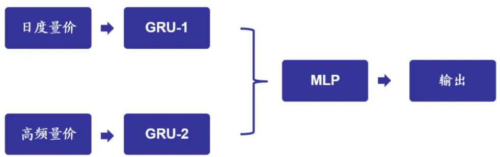
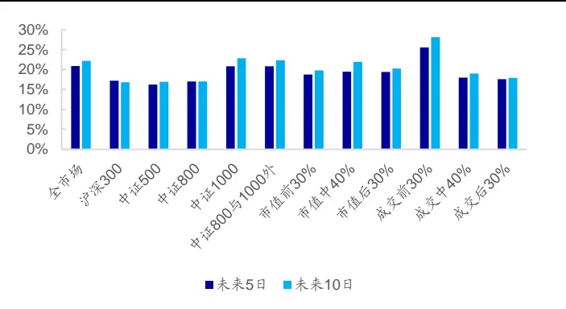
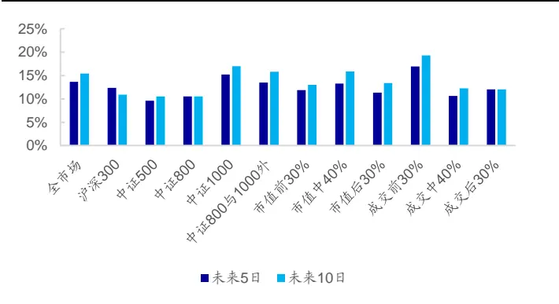
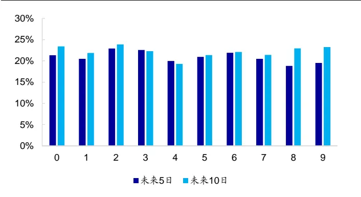
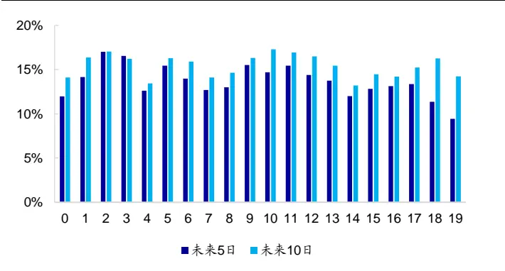

## [Tab相关研究

Table_ReportInfo]《选股因子系列研究（七十七）——改进深度学习高频因子的 9个尝试》

2022.04.06

《选股因子系列研究（七十九）——用注意力机制优化深度学习高频因子》

2022.05.24

《选股因子系列研究（八十六）——深度学习高频因子的特征工程》

分析师:冯佳睿

Tel:(021)23219732

Email:fengjr@haitong.com

证书:S0850512080006

分析师:袁林青

Tel:(021)23212230

Email:ylq9619@haitong.com

证书:S0850516050003

# 选股因子系列研究（八十七）——高频与日度量价数据混合的深度学习因子

## 投资要点：

在本系列的前期报告中，我们介绍了如何使用深度学习模型挖掘高频数据中包含的Alpha。本文在此基础上引入低频量价信息，并在较长的周期内，和高频数据共同训练，寻找更多的增量信息。

本文将 个日频特征和 个 分钟频特征共同输入深度学习模型，并大幅延长训练和迭代周期后，得到了新的混频深度学习因子。 年以来，在 日和10 日两种预测标签的设定下，因子呈现出显著的周度选股能力。周均 IC 达到0.10，TOP10%和 TOP 100 多头组合的多路径平均年化超额收益分别高达 30%和 35%。

相对而言，成交金额较高、市值适中的这一类股票，更适合混频因子的发挥。如果按宽基指数划分，因子在中证 800 与 1000 外的股票中，IC和多头超额收益最优，其次是全市场中。表现相对较差的是在沪深300成分股中，但IC依然有0.071，多头超额收益也能达到 25%。若按市值大小划分，处于中间 40%的股票中，因子的 C 和多头超额收益皆为最高，其次是市值最小的 股票；若按成交金额高低划分，反而是最高的 30%股票中，因子表现更好，IC 超过 0.11，多头超额收益更是在 35%以上。

- 在原先仅使用高频数据训练因子的基础上加入低频量价特征，以及采用非线性的加权，都有可能获得更好的因子或收益预测。对比高频深度学习因子（改进 GRU和残差注意力）、高频深度学习因子和低频量价因子经 IC 加权复合后的因子及混频深度学习因子的选股效果，我们发现，与低频量价因子复合较为显著地提升了原始高频深度学习因子的 IC 和 RankIC，但也付出了 ICIR 和胜率下降的代价。而将低频和高频特征一同输入深度学习模型，则获得了 IC 最高的因子。同时，其余评价指标，如 ICIR、RankIC、胜率等，都处在较优的水平上。

- 将混频因子直接作为股票的收益预测，构建周度调仓的中证 500和中证 1000 增强组合。若没有成分股约束，中证 500 增强组合的年化超额收益最高可达 22%；但加入约束后，年化超额收益则会下降至 16%。不过，有无成分股约束对中证1000 增强组合的影响甚微，两种假设下的年化收益都可达到 25%左右。

- 混频深度学习模型的另一种应用。如果希望通过深度学习模型同时挖掘多个两两正交的增量因子，只需在 MLP 与输出层之间加入一个正交层，就可以在不大幅改变模型整体架构及损失函数的前提下，实现目标。在损失函数为 MSE 的设定下，通过这种方式得到的 32 个因子，周均 IC在 0.03-0.04 之间，TOP 10%组合年化超额收益为 5%-12%。

- 风险提示。市场系统性风险、资产流动性风险、政策变动风险、因子失效风险。

在本系列的前期报告中，我们介绍了如何使用深度学习模型挖掘高频数据中包含的Alpha。本文在此基础上引入低频量价信息，并在较长的周期内，和高频数据共同训练，寻找更多的增量信息。

## 1. 混频模型的训练流程

本文在构建特征时，使用以下日频和高频数据的相关字段，共得到 26个日频特征和 64 个 60 分钟频特征。（分钟频特征的构建可参考系列前期报告《选股因子系列研究（八十六）——深度学习高频因子的特征工程》）。

1） 日频量价数据：开盘价、最高价、最低价、收盘价、成交额、成交量；

2） 分钟 K线数据：开盘价、最高价、最低价、收盘价、成交额、成交量、成交笔数；

3） 3 秒盘口快照数据：盘口前 10 档委买/委卖价、前 10 档委买/委卖量；

4） 逐笔成交数据：成交价、成交量、BS标志、买单号、卖单号。

日频量价特征重点刻画股票的日度收益、日度价格形态、交易活跃度和流动性等，高频量价特征则重点刻画股票的日内微观结构，如，高频收益、成交分布、量价形态、盘口委托变化、主买/主卖变化、大/中/小单交易行为等。不过，需要注意的是，由于逐笔成交数据存在可获取性和字段完整性问题，我们统一将 2013 年 5 月之前的高频量价特征填充为 0。

由于深度学习模型的输入包含日频和 60 分钟频两条特征序列，为简化计算，本文在构建深度神经网络时，采用了两个独立的 GRU 模块，分别提取不同频率输入特征的信息。随后，我们利用 MLP对两个 GRU的输出结果进行整合，并输出最终的模型预测。

图1 混频模型网络架构示意图

资料来源：海通证券研究所

在前期仅使用高频特征挖掘深度学习因子的报告中，我们习惯使用较短周期的数据训练模型，并进行周频迭代。在引入日频特征后，本文大幅延长了训练和迭代周期，具体设定如下。

1） 验证早停集：最近 120 个交易日的数据；

2） 训练集：1200 个交易日的数据（与验证早停集不交叉）。

3） 模型迭代：2017 年以来，每隔 120 个交易日迭代一次；

4） 输入特征：每个股票过去 60 个交易日的日频量价与 60 分钟频高频量价序列；

5） 预测标签：股票未来 5日（T+1~T+6）收益率、未来 10日收益率（T+1~T+11）；

6） 损失函数：MSE；

7） 早停机制：MSE连续 5期在验证早停集上不改善，则停止训练；

8） 重复训练和推理：同一组超参的模型重复训练 5次，推理时使用 5 个模型的均值作为模型输出。

为表述方便，后文统一将使用未来 5日和 10日收益作为预测标签训练得到的因子，分别简称为未来 5 日因子和未来 10日因子。

## 2. 混频深度学习因子的选股能力

本部分主要展示未来 5日和未来 10日因子的周频、双周频及月频选股能力。由于调仓路径可能影响因子选股效果，故后文若未特别说明，因子的表现均为多路径的平均。例如，测试周频选股能力时，IC、年化 ICIR、胜率等为 5 条路径的平均值。当然，后文也会展示不同路径的结果。

## 2.1 周频选股能力

如下表所示，两个因子均呈现十分显著的周度选股能力。不同成交价假设下，因子周均 IC和 Rank IC 接近甚至超过 0.1，周度胜率逾 85%。相对而言，未来 5日因子的表现更优，但自相关性更低，因而换手率略高。

表 1 周频因子选股能力（2017-2023.03）

| 未来5 日 |  | IC 均值 | 年化 ICIR | 胜率 | Rank IC 均值 | 年化 ICIR | 胜率 | 因子自相 关性 | TOP 10% 组合换手 |  |
| --- | --- | --- | --- | --- | --- | --- | --- | --- | --- | --- |
|  | TO收盘 | 0.120 | 9.236 | 92% | 0.116 | 7.947 | 89% |  |  |  |
|  | T1开盘 | 0.107 | 8.500 | 90% | 0.106 | 7.405 | 87% | 0.53 | 64% |  |
|  | T1均价 | 0.104 | 8.418 | 91% | 0.099 | 7.047 | 85% |  |  |  |
|  | T1收盘 | 0.100 | 8.085 | 89% | 0.095 | 6.850 | 85% |  |  |  |
|  | TO收盘 | 0.111 | 8.179 | 89% | 0.115 | 7.726 | 87% |  |  |  |
|  | 未来10 日 | T1开盘 | 0.103 | 7.793 | 88% | 0.107 | 7.309 | 86% | 0.66 | 56% |
| T1均价 |  | 0.102 | 7.853 | 87% | 0.102 | 7.136 | 85% |  |  |  |
| T1收盘 |  | 0.098 | 7.568 | 88% | 0.099 | 6.959 | 85% |  |  |  |

资料来源：Wind，海通证券研究所

如果我们希望获得 Rank IC更高的因子，可对预测标签进行强制正态分布调整。这样一来，因子周均 IC虽小幅下降，但 Rank IC 提升明显（表 2）。当然，本文并不单纯追求更高的 Rank IC，因此后文依旧以未调整的预测标签训练因子。

表 2 预测标签调整的周频因子选股能力（2017-2023.03）

| 未来5 日 |  | IC 均值 | 年化 ICIR | 胜率 | Rank IC 均值 | 年化 ICIR | 胜率 | 因子自相 关性 | TOP 10% 组合换手 |
| --- | --- | --- | --- | --- | --- | --- | --- | --- | --- |
|  | TO收盘 | 0.114 | 7.434 | 87% | 0.136 | 8.822 | 90% | 0.60 | 62% |
|  | T1开盘 | 0.104 | 6.878 | 85% | 0.125 | 8.162 | 88% |  |  |
|  | T1均价 | 0.102 | 6.915 | 85% | 0.119 | 7.932 | 88% |  |  |
|  | T1收盘 | 0.097 | 6.571 | 83% | 0.115 | 7.631 | 86% |  |  |
|  | 未来10 日 | TO收盘 | 0.105 | 6.732 | 85% | 0.131 | 8.448 | 89% | 0.70 56% |
|  |  | T1开盘 | 0.099 | 6.369 | 83% | 0.121 | 7.866 | 87% |  |
| T1均价 |  | 0.099 | 6.496 | 83% | 0.118 | 7.801 | 88% |  |  |
| T1收盘 |  | 0.094 | 6.189 | 82% | 0.114 | 7.535 | 87% |  |  |

资料来源：Wind，海通证券研究所

上述深度学习因子以低频量价和高频量价特征作为模型输入，且未在训练中添加相关性约束，可以预期，它与原始量价类因子存在一定的相关性。因此，我们计算了该因子与常见因子之间的截面相关性均值及截面相关性绝对值的均值，结果如下表所示。

表 3 周频因子与常见因子的截面相关性（2017-2023.03）

| 相关性均值 |  |  | 相关性绝对值均值 |  |
| --- | --- | --- | --- | --- |
|  | 未来5日 | 未来10日 | 未来5日 | 未来10日 |
| 市值 | -0.10 | -0.13 | 0.16 | 0.17 |
| BP | 0.05 | 0.08 | 0.13 | 0.14 |
| 反转_1个月 | -0.23 | -0.25 | 0.24 | 0.25 |
| 换手率_1个月 | -0.20 | -0.27 | 0.26 | 0.30 |
| 系统波动占比_1个月 | 0.21 | 0.24 | 0.22 | 0.24 |
| ROE | 0.00 | -0.01 | 0.07 | 0.08 |
| SUE | 0.00 | -0.01 | 0.06 | 0.06 |
| 尾盘成交占比_1个月 | 0.04 | 0.06 | 0.10 | 0.11 |
| 开盘后买入意愿强度_1个月 | 0.14 | 0.16 | 0.15 | 0.17 |
| 开盘后买入意愿占比_1个月 | 0.09 | 0.09 | 0.11 | 0.11 |
| 开盘后大单净买入占比_1个月 | 0.12 | 0.12 | 0.13 | 0.14 |
| 开盘后大单净买入强度_1个月 | 0.10 | 0.11 | 0.12 | 0.13 |

资料来源： ，海通证券研究所

混频深度学习因子与反转、换手率和波动率三个低频量价因子的相关性相对较高，绝对值均值处在 0.2-0.3 之间；和风格类因子（市值、估值）及高频量价因子（后 5 行）的相关性在 0.1-0.2 之间，和基本面因子（ROE和 SUE）的相关性最低，不超过 0.1。

下表展示了两个因子多头组合相对全市场平均的分年度超额收益。为了更贴近实践，本文在构建多头组合时，考虑了股票停牌及涨跌停板的限制，并假定按次日均价成交。

表 4 周频因子多头组合分年度超额收益

|  |  | 2017 | 2018 | 2019 | 2020 | 2021 | 2022 | 2023.03 | 全区间 |
| --- | --- | --- | --- | --- | --- | --- | --- | --- | --- |
| TOP 10% 组合 | 未来5日 | 24.9% | 34.1% | 36.7% | 37.9% | 27.8% | 20.1% | 1.0% | 29.4% |
|  | 未来 10日 | 18.6% | 45.7% | 35.8% | 28.2% | 31.1% | 24.7% | 3.8% | 30.8% |
|  | 未来5日 | 33.3% | 43.5% | 42.7% | 40.7% | 27.6% | 23.4% | 0.4% | 34.4% |
| TOP 100 组合 | 未来10日 | 23.6% | 63.5% | 47.4% | 23.8% | 26.0% | 23.2% | 2.5% | 34.4% |

资料来源：Wind，海通证券研究所

TOP10%组合的多路径平均年化超额收益约为 30%，而 TOP100 组合的多路径平均年化超额收益更高，达到 34%以上。2023 年以来，未来 10日因子的多头效应更强。

由表 1和 2可知，两个因子的换手率高达 60%左右。因此，我们在双边千三的交易成本假定下，进一步考察因子的费后多头超额收益。

表 5 周频因子多头组合分年度超额收益（扣费后）

|  |  | 2017 | 2018 | 2019 | 2020 | 2021 | 2022 | 2023.03 | 全区间 |
| --- | --- | --- | --- | --- | --- | --- | --- | --- | --- |
| TOP 10% 组合 | 未来5日 | 16.0% | 24.6% | 21.5% | 22.5% | 13.5% | 9.7% | -0.7% | 17.6% |
|  | 未来10 日 | 11.9% | 35.8% | 23.5% | 15.4% | 18.7% | 14.6% | 2.0% | 20.3% |
|  | 未来5日 | 22.2% | 31.2% | 24.0% | 22.4% | 10.4% | 10.2% | -2.1% | 19.7% |
| 组合 | 未来10日 | 15.1% | 50.1% | 30.7% | 8.9% | 10.5% | 10.6% | 0.1% | 21.1% |

资料来源：Wind，海通证券研究所

如上表所示，交易成本对因子多头效应的影响较为明显。不同标签下，超额收益都降至 20%左右。由于未来 5日因子的换手率更高，故受到的影响更大。不仅年化超额收益不足 20%，2023 年以来仍为负超额收益。

在上文的回测中，为避免调仓路径的影响，我们以多条路径的均值评价因子的选股能力。下表进一步展示了每条路径上，因子的 IC 和多头组合超额收益。从中可见，TOP100 组合在预测标签为 5 日的情形下，年化超额收益受路径的影响最大。最优路径和最差路径上，年化超额收益的差异超过 10%。我们猜测，这一现象很可能是各调仓路径上，因股票的可交易状态不同使得待选池有所差异而导致的。

表 6 不同路径上的周频因子选股能力（T1均价调仓，2017-2023.03）

| 未来5日 | 路径编号 | IC 均值 | Rank IC 均值 | 年化超额 (TOP 10%) | 年化超额 (TOP 100) |
| --- | --- | --- | --- | --- | --- |
|  | 0 | 0.102 | 0.099 | 31.6% | 38.1% |
|  | 1 | 0.104 | 0.099 | 29.9% | 36.7% |
|  | 2 | 0.106 | 0.101 | 29.6% | 34.0% |
|  | 3 | 0.105 | 0.100 | 29.0% | 36.0% |
|  | 4 | 0.102 | 0.097 | 27.0% | 27.3% |
|  | 0 | 0.100 | 0.102 | 31.2% | 35.2% |
| 未来10日 | 1 | 0.101 | 0.101 | 30.9% | 34.2% |
|  | 2 | 0.104 | 0.102 | 30.1% | 33.4% |
|  | 3 | 0.104 | 0.104 | 32.3% | 33.8% |
|  | 4 | 0.100 | 0.102 | 29.5% | 35.5% |

资料来源： ，海通证券研究所

上述结果都是从全市场所有股票（剔除次新和 ST）的回测中得到，但考虑到大多数公募基金的量化产品都有较为严格的选股范围约束，我们进一步测试了因子在不同指数成分股内及各市值和成交金额区间的选股能力。

由下表可见，如果按宽基指数划分，因子在中证 800 与 1000 外的股票中，IC 和多头超额收益最优，其次是全市场中。表现相对较差的是在沪深 300 成分股中，但 IC 依然有 0.071，多头超额收益也能达到 25%。

若按市值大小划分，处于中间 40%的股票中，因子的 IC 和多头超额收益皆为最高，其次是市值最小的 30%股票；若按成交金额高低划分，反而是最高的 30%股票中，因子表现更好，IC超过 0.11，多头超额收益更是在 35%以上。

表 7 周频因子在不同选股空间中的表现（2017-2023.03）

| IC 均值 |  |  | TOP 10%组合多头超额 |  |
| --- | --- | --- | --- | --- |
| 选股空间 | 未来5日 | 未来10日 | 未来5日 | 未来10日 |
| 全市场 | 0.104 | 0.102 | 29.4% | 30.8% |
| 沪深 300 | 0.071 | 0.063 | 25.4% | 22.6% |
| 中证500 | 0.074 | 0.073 | 24.7% | 24.6% |
| 中证 800 | 0.074 | 0.070 | 25.7% | 24.4% |
| 中证1000 | 0.102 | 0.100 | 27.8% | 30.1% |
| 中证 800 与 1000 外 | 0.116 | 0.114 | 29.8% | 31.1% |
| 市值前 30% | 0.083 | 0.081 | 26.8% | 26.9% |
| 市值中 40% | 0.113 | 0.112 | 26.7% | 29.1% |
| 市值后 30% | 0.109 | 0.108 | 28.0% | 28.9% |
| 成交前 30% | 0.114 | 0.112 | 35.6% | 37.4% |
| 成交中 40% | 0.098 | 0.098 | 25.9% | 27.0% |
| 成交后 30% | 0.090 | 0.088 | 25.3% | 26.3% |

资料来源：Wind，海通证券研究所

总体来看，该因子在不同范围内的选股效果都较为出色。相对而言，成交金额较高、市值适中的这一类股票，更适合因子的发挥。

## 2.2 混频训练和线性加权的对比

在前期的深度学习因子挖掘报告中，我们使用 分钟的高频特征训练得到因子，并将其放入传统的线性加权打分模型，和其他因子共同预测收益，而本文则是通过一个非线性模型直接完成了上述三个步骤。为了探究这两种方式的差异，我们对比了高频深度学习因子（改进 GRU 和残差注意力）、高频深度学习因子和低频量价因子经 IC 加权复合后的因子及混频深度学习因子的选股效果。

表 8 三类因子的周频选股能力对比（2017-2023.03）

|  | IC 均值 | 年化 ICIR | 胜率 | Rank IC 均值 | 年化 ICIR | 胜率 | 因子自 相关性 | TOP 10% 组合换手 |
| --- | --- | --- | --- | --- | --- | --- | --- | --- |
| 改进 GRU | 0.064 | 8.269 | 90% | 0.068 | 8.290 | 90% | 0.37 | 71% |
| 残差注意力 | 0.064 | 7.970 | 88% | 0.067 | 7.553 | 88% | 0.54 | 60% |
| 改进 GRU +低频量价 | 0.073 | 4.798 | 76% | 0.100 | 6.804 | 84% | 0.66 | 57% |
| 残差注意力 +低频量价 | 0.072 | 4.810 | 76% | 0.099 | 6.802 | 84% | 0.73 | 51% |
| 未来5日 | 0.104 | 8.418 | 91% | 0.099 | 7.047 | 85% | 0.53 | 64% |
| 未来10日 | 0.102 | 7.853 | 87% | 0.102 | 7.136 | 85% | 0.66 | 56% |

资料来源： ，海通证券研究所

由上表可见，与低频量价因子复合较为显著地提升了原始高频深度学习因子的 IC和RankIC，但也付出了 ICIR和胜率下降的代价。而将低频和高频特征一同输入深度学习模型，则获得了 IC最高的因子。同时，其余评价指标，如 ICIR、RankIC、胜率等，都处在较优的水平上。

进一步对比多头组合的超额收益，结论也是类似的。 年以来，混频因子的年化超额收益高于另两类因子 个百分点。因此，我们认为，在原先仅使用高频数据训练因子的基础上加入低频量价特征，以及采用非线性的加权，都有可能获得更好的因子或收益预测。这也给了我们另外一个启示，如果想要构建更多、更有效的量价因子，混频训练的深度学习模型或许是一条可行的思路，下文也将对此给出简单的示例。

表 9 三类因子的多头组合分年度超额收益对比

| TOP 10% 组合 |  | 2017 | 2018 | 2019 | 2020 | 2021 | 2022 | 2023.03 | 全区间 |
| --- | --- | --- | --- | --- | --- | --- | --- | --- | --- |
|  | 改进 GRU | 18.9% | 19.0% | 27.0% | 20.4% | 8.9% | 15.4% | 2.8% | 18.4% |
|  | 残差注意力 | 20.6% | 19.3% | 24.9% | 19.1% | 5.6% | 19.2% | 4.1% | 18.7% |
|  | 改进 GRU +低频量价 | 14.6% | 14.3% | 18.1% | 7.3% | 1.1% | 22.4% | 2.8% | 13.7% |
|  | 残差注意力 +低频量价 | 15.1% | 14.8% | 18.3% | 5.5% | 1.1% | 25.2% | 3.4% | 14.2% |
|  | 未来5日 | 24.9% | 34.1% | 36.7% | 37.9% | 27.8% | 20.1% | 1.0% | 29.4% |
|  | 未来10日 | 18.6% | 45.7% | 35.8% | 28.2% | 31.1% | 24.7% | 3.8% | 30.8% |
| TOP 100 组合 | 改进 GRU | 23.0% | 23.7% | 28.9% | 28.3% | 0.8% | 9.5% | 1.8% | 18.8% |
|  | 残差注意力 改进 GRU | 23.4% | 24.7% | 24.3% | 23.8% | -5.6% | 17.4% | 3.5% | 18.7% |
|  | +低频量价 | 18.1% | 14.7% | 19.5% | 8.2% | -3.7% | 21.3% | 1.6% | 13.5% |
|  | 残差注意力 +低频量价 | 17.8% | 15.6% | 15.9% | 8.3% | -1.7% | 25.4% | 2.6% | 14.3% |
|  | 未来5日 | 33.3% | 43.5% | 42.7% | 40.7% | 27.6% | 23.4% | 0.4% | 34.4% |
|  | 未来10 日 | 23.6% | 63.5% | 47.4% | 23.8% | 26.0% | 23.2% | 2.5% | 34.4% |

资料来源：Wind，海通证券研究所

## 2.3 双周频和月频选股能力

我们进一步考察在双周和月的换仓频率下，因子的选股能力。如下表所示，当持有期延长后，因子的 IC显著上升。在任何一种成交价格的假设下，IC和 Rank IC都高于0.1。但是，作为高频因子，更低的换仓频率必然导致超额收益大幅下降。月频换仓下，因子多头年化超额收益仅为 15%左右，相比表 4中周度换仓的 30%，降幅高达 50%。即使是考虑 3‰交易成本的周频换仓因子（表 5），超额收益依然高于未计算成本的月频因子。因此，我们认为，在相对合理的成本下，高频因子还是更加适合在短周期下使用。

表 10 双周频和月频因子选股能力（2017-2023.03）

|  |  | 双周频因子 多头超额 |  |  |  | 月频因子 |  |  |  |
| --- | --- | --- | --- | --- | --- | --- | --- | --- | --- |
|  |  | IC 均值 | RANK IC 均值 | (TOP 10%) | 多头超额 (TOP 100) | IC 均值 | RANK IC 均值 | 多头超额 (TOP 10%) | 多头超额 (TOP 100) |
| 未来 5 日 | TO 收盘 | 0.125 | 0.120 |  |  | 0.124 | 0.120 |  |  |
|  | T1 开盘 | 0.114 | 0.111 |  |  | 0.115 | 0.112 |  |  |
|  | T1 均价 | 0.111 | 0.105 | 20.9% | 22.7% | 0.112 | 0.106 | 13.7% | 14.5% |
|  | T1 收盘 | 0.108 | 0.103 | 20.9% | 23.0% | 0.109 | 0.105 | 13.8% | 14.9% |
|  | TO收盘 | 0.122 | 0.125 |  |  | 0.126 | 0.127 |  |  |
| 未 来 1 | T1 开盘 | 0.115 | 0.117 | ■ |  | 0.119 | 0.121 |  |  |
| 0 | T1 均价 | 0.113 | 0.112 | 22.2% | 23.6% | 0.116 | 0.116 | 15.4% | 15.9% |
| 日 | T1 收盘 | 0.110 | 0.110 | 22.1% | 23.5% | 0.114 | 0.115 | 15.5% | 16.1% |

资料来源：Wind，海通证券研究所

类似地，我们也回测了双周频和月频因子在不同选股范围内的年化多头超额收益，结果如以下两图所示。在中证 800 和中证 1000 以外或成交金额较大的股票中，因子的多头超额收益更高。

图2 双周频因子在不同选股空间中的 TOP 10%组合年化多头超额收益（T1 均价成交，2017-2023.03）

资料来源：Wind，海通证券研究所

图3 月频因子在不同选股空间中的 TOP 10%组合年化多头超额收益（T1 均价成交，2017-2023.03）

资料来源：Wind，海通证券研究所

和周频换仓相比，双周频和月频换仓的路径更多，因而不同路径上的超额收益差异也更大。由以下两图可见，双周频和月频因子 TOP 10%多头组合在最优和最差路径上，年化超额收益的差异分别接近 4%和 7%。

图4 双周频因子在不同调仓路径上的 TOP 10%组合年化多头超额收益（T1 均价成交，2017-2023.03）

资料来源：Wind，海通证券研究所

图5 月频因子在不同调仓路径上的 TOP 10%组合年化多头超额收益（T1 均价成交，2017-2023.03）

资料来源：Wind，海通证券研究所

## 3. 用混频因子构建指数增强组合

为了进一步考察混频训练所得因子的效果，我们将其作为股票的收益预测，构建周度调仓的中证 500 和中证 1000 增强组合。

其中，中证 500 增强组合的风险控制模块包括以下几个方面的约束。

1） 个股偏离：相对基准的权重偏离不超过 0.5%/1%；

2） 因子暴露：市值、估值中性，常规低频因子≤ ±0.8；

3） 行业偏离：严格中性/行业偏离上限 2%；

4） 选股空间：全市场/90%指数成分股权重；

5） 换手率限制：单次单边换手不超过 30%。

不同于中证 500 增强组合，在构建中证 1000 增强组合时，市值和估值因子不再设定为完全中性，而是允许有±0.2 的暴露。

两个组合的优化目标皆为最大化预期收益，目标函数如下所示。

$$
\underset{w_{i}}{max}\sum\mu_{i}w_{i}
$$

其中， $w_{\mathrm{i}}$ 为组合中股票 的权重， 为股票 的预期超额收益。为使本文的结论贴近实践，如无特别说明，下文的测算均假定以次日均价成交，同时扣除 3‰的交易成本。考虑到调仓路径可能对最终结果产生影响，我们也展示了组合在 5 条路径下的业绩表现。

## 3.1 中证 500 增强组合

如下表所示，随风控模型参数的变化，中证 500 增强组合在各条路径上的年化超额收益在 之间波动。相对而言，使用未来 日因子的组合有更高的超额收益。我们认为，这可能是预测标签和换仓周期匹配的缘故，也可能是因为量价因子对短周期收益的预测精度更高。

2023 年以来，中证 500 增强组合各路径上的超额收益，在 0.7%-5.6%之间不等。虽都为正超额，但最优与最差路径之间的收益差距超过 4%。

表 11 中证 500增强组合年化超额收益（全市场）

|  |  |  |  | 2017.01-2023.03 |  |  | 2023.01-2023.03 |  |  |
| --- | --- | --- | --- | --- | --- | --- | --- | --- | --- |
|  |  | 行业中性 |  | 行业偏离 2% |  | 行业中性 |  | 行业偏离 2% |  |
|  | 调仓路径 | 个股偏离 0.5% | 个股偏离 1% | 个股偏离 0.5% | 个股偏离 1% | 个股偏离 0.5% | 个股偏离 1% | 个股偏离 0.5% | 个股偏离 1% |
|  | 0 | 16.3% | 20.3% | 17.7% | 21.0% | 2.2% | 1.6% | 1.1% | 0.9% |
|  | 1 | 17.0% | 19.7% | 19.5% | 21.9% | 3.6% | 5.6% | 2.4% | 1.3% |
|  | 2 | 17.3% | 20.4% | 19.5% | 22.7% | 2.2% | 3.4% | 2.1% | 2.8% |
|  | 3 | 17.8% | 20.4% | 18.3% | 21.9% | 2.9% | 3.2% | 2.6% | 1.5% |
|  | 4 | 16.9% | 18.7% | 17.3% | 20.8% | 1.3% | 2.1% | 0.2% | 1.2% |
| 未来10日 | 0 | 12.8% | 15.3% | 15.3% | 17.2% | 2.7% | 3.0% | 2.6% | 3.2% |
|  | 1 | 15.7% | 18.3% | 17.6% | 18.8% | 3.1% | 4.1% | 2.2% | 4.7% |
|  | 2 | 16.0% | 19.6% | 17.8% | 19.6% | 2.9% | 4.5% | 2.8% | 4.0% |
|  | 3 | 15.6% | 18.3% | 16.8% | 19.8% | 1.7% | 1.7% | 0.7% | 1.1% |
|  | 4 | 15.3% | 17.4% | 17.4% | 21.2% | 2.5% | 3.5% | 1.9% | 2.3% |

资料来源：Wind，海通证券研究所

添加 90%成分股权重约束后，各组合年化超额收益从 15%-22%下降至 10%-15%，依然是使用未来 5 日因子的业绩表现更好。2023 年以来，超额收益从 0%-5%下降至-2%-1.5%。

表 12 中证 500增强组合年化超额收益（90%成分股权重约束）

| 2017.01-2023.03 |  |  |  |  |  | 2023.01-2023.03 |  |  |  |
| --- | --- | --- | --- | --- | --- | --- | --- | --- | --- |
|  | 调仓路径 | 行业中性 |  | 行业偏离 2% |  | 行业中性 |  | 行业偏离 2% |  |
|  |  | 个股偏离 0.5% | 个股偏离 1% | 个股偏离 0.5% | 个股偏离 1% | 个股偏离 0.5% | 个股偏离 1% | 个股偏离 0.5% | 个股偏离 1% |
| 未来5日 | 0 | 10.8% | 13.8% | 12.5% | 16.3% | 0.4% | 0.6% | 0.0% | -0.2% |
|  | 1 | 11.3% | 14.3% | 12.8% | 15.0% | 0.8% | 0.1% | 0.6% | -0.2% |
|  | 2 | 12.0% | 13.4% | 13.8% | 14.3% | 1.3% | 1.1% | 0.1% | -0.1% |
|  | 3 | 11.1% | 13.6% | 12.2% | 15.0% | 1.0% | 1.4% | 0.1% | -0.2% |
|  | 4 | 11.2% | 12.7% | 13.4% | 14.3% | 0.8% | 1.0% | 0.0% | -0.4% |
|  | 0 | 9.0% | 9.6% | 11.6% | 12.4% | 0.2% | 0.7% | -0.4% | -0.2% |
| 未来10日 | 1 | 10.3% | 11.3% | 11.5% | 13.8% | -0.5% | 0.3% | 0.2% | -0.2% |
|  | 2 | 10.6% | 11.9% | 12.2% | 13.8% | -0.3% | -0.4% | -0.3% | 0.4% |
|  | 3 | 10.4% | 11.0% | 12.0% | 12.4% | -0.2% | 0.6% | -0.1% | -1.8% |
|  | 4 | 9.4% | 10.0% | 11.2% | 11.9% | -1.4% | -0.7% | -1.3% | -1.6% |

资料来源：Wind，海通证券研究所

下表为全市场选股、行业中性、个股偏离 1%、调仓路径 3，这组参数下的中证 500增强组合分年度收益风险特征。

表 13 中证 500 增强组合分年度收益风险特征（2017-2023.03）

|  | 超额收益 | 超额最大回撤 | 跟踪误差 | 信息比率 | 月度胜率 |
| --- | --- | --- | --- | --- | --- |
| 2017 | 24.7% | 2.3% | 5.6% | 4.49 | 92% |
| 2018 | 17.3% | 3.3% | 5.7% | 3.01 | 92% |
| 2019 | 27.0% | 3.0% | 5.3% | 5.08 | 92% |
| 2020 | 19.1% | 3.7% | 5.9% | 3.26 | 75% |
| 2021 | 23.1% | 5.1% | 6.8% | 3.42 | 83% |
| 2022 | 13.3% | 2.2% | 5.6% | 2.36 | 67% |
| 2023.03 | 3.2% | 2.0% | 4.3% | 4.21 | 67% |
| 全区间 | 20.4% | 5.1% | 5.8% | 3.53 | 83% |

资料来源：Wind，海通证券研究所

2017 年以来，组合年化超额收益 20.4%，超额最大回为 5.1%，发生在 2021 年。值得注意的是，2022 年以来，组合的超额收益明显弱于历史平均水平。我们猜测，因子拥挤或市场环境的变化都有可能是较为重要的原因。

## 3.2 中证 1000 增强组合

下表展示的是不同风控模型参数下，全市场选股的中证 1000 增强组合在不同路径上的超额收益。随风险控制参数的变化，组合 2017 年以来的年化超额收益在 18%~27%之间。使用未来 5 日因子或是放松行业约束，都能获得更优的业绩表现。

2023 年以来，中证 1000 增强组合各路径上超额收益的差异依然较大。相对而言，路径 0-3的表现优于路径 4-5。

表 14 中证 1000增强组合年化超额收益（全市场）

|  |  |  |  | 2017.01-2023.03 |  |  | 2023.01-2023.03 |  |  |
| --- | --- | --- | --- | --- | --- | --- | --- | --- | --- |
|  |  |  | 行业中性 |  | 行业偏离 2% |  | 行业中性 |  | 行业偏离 2% |
| 未来5日 | 调仓路径 | 个股偏离 0.5% | 个股偏离 1% | 个股偏离 0.5% | 个股偏离 1% | 个股偏离 0.5% | 个股偏离 1% | 个股偏离 0.5% | 个股偏离 1% |
|  | 0 | 22.1% | 23.0% | 22.2% | 22.3% | 2.7% | 1.8% | 0.6% | -0.7% |
|  | 1 | 19.8% | 21.6% | 23.5% | 23.7% | 4.0% | 4.0% | 2.8% | -0.2% |
|  | 2 | 22.5% | 24.9% | 23.1% | 26.5% | 4.4% | 2.4% | 1.9% | 1.5% |
|  | 3 | 22.4% | 23.4% | 25.0% | 24.4% | 3.3% | 4.7% | 2.3% | 1.4% |
|  | 4 | 21.8% | 22.8% | 23.4% | 24.0% | 2.5% | 1.1% | 0.3% | 0.0% |
|  | 0 | 20.0% | 18.8% | 21.5% | 21.0% | 4.3% | 4.6% | 3.2% | 3.4% |
| 未来10 日 | 1 | 20.3% | 21.6% | 21.9% | 23.4% | 4.8% | 5.6% | 2.8% | 3.8% |
|  | 2 | 22.6% | 25.2% | 23.6% | 25.3% | 3.9% | 5.0% | 2.6% | 3.0% |
|  | 3 | 22.4% | 22.9% | 23.0% | 22.7% | 3.2% | 3.1% | 1.5% | 1.3% |
|  | 4 | 20.5% | 21.1% | 21.7% | 21.8% | 3.5% | 3.9% | 2.4% | 2.6% |

资料来源： ，海通证券研究所

添加 90%成分股权重约束后，各参数和路径下，组合 2017 年以来的超额收益变化不大，与中证 500 增强组合的回测结果大不相同。我们认为，这可能是由于因子在中证500 成分股内的选股效果显著弱于全市场，而在中证 1000内选股则与全市场无异有关。

表 15 中证 1000增强组合年化超额收益（90%成分股权重约束）

| 2017.01-2023.03 |  |  |  |  | 2023.01-2023.03 |  |  |  |  |
| --- | --- | --- | --- | --- | --- | --- | --- | --- | --- |
|  |  |  | 行业中性 行业偏离 2% |  |  | 行业中性 |  | 行业偏离 2% |  |
| 未来5日 | 调仓路径 | 个股偏离 0.5% | 个股偏离 1% | 个股偏离 0.5% | 个股偏离 1% | 个股偏离 0.5% | 个股偏离 1% | 个股偏离 0.5% | 个股偏离 1% |
|  | 0 | 18.9% | 22.1% | 20.5% | 22.8% | 3.8% | 3.7% | 3.0% | 2.2% |
|  | 1 | 18.7% | 22.8% | 20.7% | 24.0% | 3.5% | 6.5% | 2.0% | 4.4% |
|  | 2 | 19.5% | 22.5% | 23.1% | 25.1% | 4.4% | 5.8% | 3.5% | 4.6% |
|  | 3 | 19.4% | 23.8% | 22.7% | 25.2% | 4.2% | 5.9% | 3.7% | 3.1% |
|  | 4 | 19.9% | 21.6% | 21.3% | 23.8% | 4.2% | 6.4% | 3.5% | 4.0% |
|  | 0 | 17.3% | 20.9% | 19.6% | 21.1% | 3.4% | 4.3% | 2.8% | 3.0% |
| 未来10日 | 1 | 19.7% | 23.0% | 21.1% | 23.2% | 4.3% | 5.8% | 2.8% | 5.2% |
|  | 2 | 21.1% | 23.3% | 23.7% | 24.2% | 3.8% | 3.9% | 2.5% | 2.4% |
|  | 3 | 21.0% | 23.3% | 22.7% | 25.3% | 3.7% | 3.3% | 2.2% | 2.3% |
|  | 4 | 19.0% | 20.0% | 20.8% | 20.9% | 4.9% | 3.5% | 2.9% | 3.4% |

资料来源：Wind，海通证券研究所

下表为 90%成分股权重约束、行业偏离 2%、个股偏离 1%、调仓路径 3，这组参数下的中证 1000 增强组合分年度收益风险特征。

表 16 中证 1000 增强组合分年度收益风险特征（2017-2023.03）

|  | 超额收益 超额最大回撤 | 跟踪误差 | 信息比率 | 月度胜率 |
| --- | --- | --- | --- | --- |
| 2017 28.3% | 3.2% | 6.1% | 4.68 | 92% |
| 2018 20.5% | 2.5% | 6.4% | 3.20 | 92% |
| 2019 35.3% | 2.2% | 5.3% | 6.65 | 83% |
| 2020 17.8% | 4.2% | 6.5% | 2.72 | 67% |
| 2021 37.6% | 6.5% | 7.8% | 4.83 | 75% |
| 2022 16.1% | 3.4% | 5.8% | 2.80 | 83% |
| 2023.03 3.1% | 2.3% | 6.2% | 2.91 | 67% |
| 全区间 25.2% | 6.5% | 6.3% | 3.97 | 81% |

资料来源： ，海通证券研究所

2017 年以来，组合年化超额收益 25.2%。由于选择了较大的行业与个股偏离，故超额最大回撤达到 6.5%，发生在 2021 年，跟踪误差也有 6.3%。2022 年以来，组合的超额收益同样明显弱于历史平均水平。

## 4. 模型扩展

上文将深度学习模型的输出直接作为收益预测，并利用风控模型构建指数增强组合。但每个人对深度学习模型有着不同的应用方式，有人偏好使用更加稳健成熟的机器学习模型合成最终信号，也有人希望通过深度学习模型同时挖掘多个增量因子。后者催生了以下两个新的需求。

1） 用深度学习模型生成相互正交的因子集合；

2） 用深度学习模型生成与指定因子集合正交，且内部相互正交的因子集合。

由于因子正交本质上是线性变换，因此，我们只需在 MLP与输出层之间加入一个正交层，就可以在不大幅改变模型整体架构及损失函数的前提下，实现上述两种需求。下文简要展示了这一思路的输出结果，我们也将在后续的系列报告中，继续探讨其具体应用方法和相应的策略表现。

## 4.1 相互正交因子集合的生成

下图为添加正交层后，训练得到的 32 个因子两两之间的平均截面相关性绝对值。因为我们是用 5次训练结果的推理均值作为最终因子值，所以因子间的相关性并不严格为 0，但绝大多数都小于 0.15，基本实现了因子正交的效果。

图[Table_PicPe]6 32 个因子的截面相关性绝对值均值（相互正交，2017-2023.03）

|  | fct0 | fct1 | fct2 | fct3 | fct4 | fct5 | fct6 | fct7 | fct8 | fct9 | fct10 | fct11 | fct12 | fct13 | fct14 | fct15 | fct16 | fct17 | fct18 | fct19 | fct20 | fct21 | fct22 | fct23 | fct24 | fct25 | fct26 | fct27 | fct28 | fct29 | fct30 | fct31 |
| --- | --- | --- | --- | --- | --- | --- | --- | --- | --- | --- | --- | --- | --- | --- | --- | --- | --- | --- | --- | --- | --- | --- | --- | --- | --- | --- | --- | --- | --- | --- | --- | --- |
| fct1 | 0.10 |  | 0.14 | 0.10 | 0.09 | 0.09 | 0.08 | 0.11 | 0.12 | 0.12 | 0.10 | 0.13 | 0.11 | 0.10 | 0.13 | 0.10 | 0.10 | 0.10 | 0.10 | 0.12 | 0.12 | 0.09 | 0.11 | 0.13 | 0.09 | 0.12 | 0.12 | 0.11 | 0.10 | 0.12 | 0.12 | 0.13 |
| fct2 | 0.11 | 0.14 |  | 0.07 | 0.09 | 0.13 | 0.11 | 0.10 | 0.06 | 0.10 | 0.10 | 0.14 | 0.10 | 0.08 | 0.12 | 0.12 | 0.10 | 0.12 | 0.11 | 0.07 | 0.12 | 0.09 | 0.11 | 0.11 | 0.13 | 0.13 | 0.13 | 0.09 | 0.08 | 0.12 | 0.10 | 0.12 |
| fct3 | 0.12 | 0.10 | 0.07 |  | 0.12 | 0.12 | 0.10 | 0.11 | 0.10 | 0.08 | 0.10 | 0.13 | 0.11 | 0.08 | 0.09 | 0.11 | 0.11 | 0.13 | 0.14 | 0.13 | 0.11 | 0.10 | 0.14 | 0.12 | 0.10 | 0.09 | 0.13 | 0.09 | 0.10 | 0.12 | 0.13 | 0.09 |
| fct4 | 0.08 | 0.09 | 0.09 | 0.12 |  | 0.10 | 0.14 | 0.10 | 0.11 | 0.11 | 0.13 | 0.11 | 0.08 | 0.15 | 0.10 | 0.14 | 0.11 | 0.09 | 0.10 | 0.12 | 0.11 | 0.10 | 0.14 | 0.11 | 0.07 | 0.11 | 0.12 | 0.09 | 0.10 | 0.11 | 0.09 | 0.13 |
| fct5 | 0.12 | 0.09 | 0.13 | 0.12 | 0.10 |  | 0.12 | 0.11 | 0.07 | 0.11 | 0.10 | 0.08 | 0.08 | 0.09 | 0.11 | 0.12 | 0.12 | 0.10 | 0.09 | 0.10 | 0.10 | 0.12 | 0.09 | 0.12 | 0.12 | 0.13 | 0.12 | 0.08 | 0.11 | 0.11 | 0.11 | 0.13 |
| fct6 | 0.09 | 0.08 | 0.11 | 0.10 | 0.14 | 0.12 |  | 0.12 | 0.11 | 0.07 | 0.14 | 0.13 | 0.11 | 0.09 | 0.09 | 0.09 | 0.08 | 0.12 | 0.09 | 0.11 | 0.13 | 0.12 | 0.12 | 0.10 | 0.09 | 0.12 | 0.11 | 0.11 | 0.09 | 0.10 | 0.12 | 0.09 |
| fct7 | 0.12 | 0.11 | 0.10 | 0.11 | 0.10 | 0.11 | 0.12 |  | 0.12 | 0.10 | 0.11 | 0.10 | 0.13 | 0.08 | 0.10 | 0.13 | 0.11 | 0.10 | 0.09 | 0.11 | 0.10 | 0.09 | 0.10 | 0.13 | 0.10 | 0.09 | 0.11 | 0.16 | 0.10 | 0.09 | 0.12 | 0.07 |
| fct8 | 0.10 | 0.12 | 0.06 | 0.10 | 0.11 | 0.07 | 0.11 | 0.12 |  | 0.12 | 0.11 | 0.12 | 0.11 | 0.13 | 0.11 | 0.11 | 0.10 | 0.11 | 0.09 | 0.09 | 0.10 | 0.10 | 0.10 | 0.12 | 0.11 | 0.10 | 0.12 | 0.11 | 0.15 | 0.11 | 0.09 | 0.11 |
| fct9 | 0.10 | 0.12 | 0.10 | 0.08 | 0.11 | 0.11 | 0.07 | 0.10 | 0.12 |  | 0.16 | 0.09 | 0.13 | 0.11 | 0.14 | 0.16 | 0.12 | 0.10 | 0.11 | 0.09 | 0.12 | 0.13 | 0.13 | 0.11 | 0.10 | 0.10 | 0.15 | 0.10 | 0.12 | 0.09 | 0.09 | 0.11 |
| fct10 | 0.08 | 0.10 | 0.10 | 0.10 | 0.13 | 0.10 | 0.14 | 0.11 | 0.11 | 0.16 |  | 0.10 | 0.11 | 0.11 | 0.10 | 0.10 | 0.11 | 0.09 | 0.09 | 0.08 | 0.12 | 0.08 | 0.09 | 0.11 | 0.13 | 0.08 | 0.11 | 0.10 | 0.11 | 0.13 | 0.11 | 0.13 |
| fct11 | 0.11 | 0.13 | 0.14 | 0.13 | 0.11 | 0.08 | 0.13 | 0.10 | 0.12 | 0.09 | 0.10 |  | 0.10 | 0.11 | 0.08 | 0.10 | 0.11 | 0.12 | 0.11 | 0.14 | 0.09 | 0.15 | 0.11 | 0.13 | 0.11 | 0.10 | 0.11 | 0.11 | 0.10 | 0.13 | 0.12 | 0.11 |
| fct12 | 0.10 | 0.11 | 0.10 | 0.11 | 0.08 | 0.08 | 0.11 | 0.13 | 0.11 | 0.13 | 0.11 | 0.10 |  | 0.12 | 0.11 | 0.11 | 0.12 | 0.10 | 0.08 | 0.10 | 0.11 | 0.12 | 0.09 | 0.13 | 0.11 | 0.13 | 0.10 | 0.15 | 0.12 | 0.12 | 0.13 | 0.08 |
| fct13 | 0.09 | 0.10 | 0.08 | 0.08 | 0.15 | 0.09 | 0.09 | 0.08 | 0.13 | 0.11 | 0.11 | 0.11 | 0.12 |  | 0.13 | 0.15 | 0.09 | 0.11 | 0.10 | 0.10 | 0.10 | 0.13 | 0.10 | 0.11 | 0.07 | 0.11 | 0.10 | 0.10 | 0.13 | 0.12 | 0.10 | 0.12 |
| fct14 | 0.10 | 0.13 | 0.12 | 0.09 | 0.10 | 0.11 | 0.09 | 0.10 | 0.11 | 0.14 | 0.10 | 0.08 | 0.11 | 0.13 |  | 0.12 | 0.09 | 0.09 | 0.14 | 0.10 | 0.12 | 0.11 | 0.10 | 0.09 | 0.12 | 0.12 | 0.10 | 0.09 | 0.09 | 0.09 | 0.11 | 0.09 |
| fct15 | 0.12 | 0.10 | 0.12 | 0.11 | 0.14 | 0.12 | 0.09 | 0.13 | 0.11 | 0.16 | 0.10 | 0.10 | 0.11 | 0.15 | 0.12 |  | 0.10 | 0.10 | 0.09 | 0.11 | 0.12 | 0.10 | 0.11 | 0.10 | 0.10 | 0.11 | 0.10 | 0.11 | 0.14 | 0.07 | 0.11 | 0.09 |
| fct16 | 0.09 | 0.10 | 0.10 | 0.11 | 0.11 | 0.12 | 0.08 | 0.11 | 0.10 | 0.12 | 0.11 | 0.11 | 0.12 | 0.09 | 0.09 | 0.10 |  | 0.12 | 0.10 | 0.10 | 0.12 | 0.13 | 0.10 | 0.10 | 0.07 | 0.11 | 0.08 | 0.11 | 0.12 | 0.10 | 0.11 | 0.13 |
| fct17 | 0.12 | 0.10 | 0.12 | 0.13 | 0.09 | 0.10 | 0.12 | 0.10 | 0.11 | 0.10 | 0.09 | 0.12 | 0.10 | 0.11 | 0.09 | 0.10 | 0.12 |  | 0.10 | 0.07 | 0.11 | 0.10 | 0.12 | 0.11 | 0.13 | 0.12 | 0.12 | 0.09 | 0.10 | 0.11 | 0.10 | 0.12 |
| fct18 | 0.10 | 0.10 | 0.11 | 0.14 | 0.10 | 0.09 | 0.09 | 0.09 | 0.09 | 0.11 | 0.09 | 0.11 | 0.08 | 0.10 | 0.14 | 0.09 | 0.10 | 0.10 |  | 0.13 | 0.11 | 0.10 | 0.12 | 0.10 | 0.11 | 0.13 | 0.08 | 0.09 | 0.13 | 0.14 | 0.11 | 0.09 |
| fct19 | 0.10 | 0.12 | 0.07 | 0.13 | 0.12 | 0.10 | 0.11 | 0.11 | 0.09 | 0.09 | 0.08 | 0.14 | 0.10 | 0.10 | 0.10 | 0.11 | 0.10 | 0.07 | 0.13 |  | 0.08 | 0.09 | 0.12 | 0.11 | 0.11 | 0.12 | 0.13 | 0.11 | 0.08 | 0.08 | 0.13 | 0.09 |
| fct20 | 0.10 | 0.12 | 0.12 | 0.11 | 0.11 | 0.10 | 0.13 | 0.10 | 0.10 | 0.12 | 0.12 | 0.09 | 0.11 | 0.10 | 0.12 | 0.12 | 0.12 | 0.11 | 0.11 | 0.08 |  | 0.10 | 0.10 | 0.11 | 0.10 | 0.10 | 0.10 | 0.12 | 0.11 | 0.11 | 0.10 | 0.12 |
| fct21 | 0.13 | 0.09 | 0.09 | 0.10 | 0.10 | 0.12 | 0.12 | 0.09 | 0.10 | 0.13 | 0.08 | 0.15 | 0.12 | 0.13 | 0.11 | 0.10 | 0.13 | 0.10 | 0.10 | 0.09 | 0.10 |  | 0.10 | 0.11 | 0.09 | 0.09 | 0.10 | 0.13 | 0.11 | 0.11 | 0.08 | 0.14 |
| fct22 | 0.13 | 0.11 | 0.11 | 0.14 | 0.14 | 0.09 | 0.12 | 0.10 | 0.10 | 0.13 | 0.09 | 0.11 | 0.09 | 0.10 | 0.10 | 0.11 | 0.10 | 0.12 | 0.12 | 0.12 | 0.10 | 0.10 |  | 0.12 | 0.11 | 0.11 | 0.11 | 0.11 | 0.11 | 0.11 | 0.11 | 0.07 |
| fct23 | 0.11 | 0.13 | 0.11 | 0.12 | 0.11 | 0.12 | 0.10 | 0.13 | 0.12 | 0.11 | 0.11 | 0.13 | 0.13 | 0.11 | 0.09 | 0.10 | 0.10 | 0.11 | 0.10 | 0.11 | 0.11 | 0.11 | 0.12 |  | 0.11 | 0.13 | 0.10 | 0.13 | 0.09 | 0.09 | 0.07 | 0.11 |
| fct24 | 0.13 | 0.09 | 0.13 | 0.10 | 0.07 | 0.12 | 0.09 | 0.10 | 0.11 | 0.10 | 0.13 | 0.11 | 0.11 | 0.07 | 0.12 | 0.10 | 0.07 | 0.13 | 0.11 | 0.11 | 0.10 | 0.09 | 0.11 | 0.11 |  | 0.10 | 0.11 | 0.11 | 0.08 | 0.09 | 0.13 | 0.10 |
| fct25 | 0.09 | 0.12 | 0.13 | 0.09 | 0.11 | 0.13 | 0.12 | 0.09 | 0.10 | 0.10 | 0.08 | 0.10 | 0.13 | 0.11 | 0.12 | 0.11 | 0.11 | 0.12 | 0.13 | 0.12 | 0.10 | 0.09 | 0.11 | 0.13 | 0.10 |  | 0.13 | 0.08 | 0.12 | 0.10 | 0.11 | 0.12 |
| fct26 | 0.06 | 0.12 | 0.13 | 0.13 | 0.12 | 0.12 | 0.11 | 0.11 | 0.12 | 0.15 | 0.11 | 0.11 | 0.10 | 0.10 | 0.10 | 0.10 | 0.08 | 0.12 | 0.08 | 0.13 | 0.10 | 0.10 | 0.11 | 0.10 | 0.11 | 0.13 |  | 0.11 | 0.08 | 0.12 | 0.10 | 0.09 |
| fct27 | 0.11 | 0.11 | 0.09 | 0.09 | 0.09 | 0.08 | 0.11 | 0.16 | 0.11 | 0.10 | 0.10 | 0.11 | 0.15 | 0.10 | 0.09 | 0.11 | 0.11 | 0.09 | 0.09 | 0.11 | 0.12 | 0.13 | 0.11 | 0.13 | 0.11 | 0.08 | 0.11 |  | 0.13 | 0.11 | 0.08 | 0.12 |
| fct28 | 0.09 | 0.10 | 0.08 | 0.10 | 0.10 | 0.11 | 0.09 | 0.10 | 0.15 | 0.12 | 0.11 | 0.10 | 0.12 | 0.13 | 0.09 | 0.14 | 0.12 | 0.10 | 0.13 | 0.08 | 0.11 | 0.11 | 0.11 | 0.09 | 0.08 | 0.12 | 0.08 | 0.13 |  | 0.08 | 0.12 | 0.10 |
| fct29 | 0.13 | 0.12 | 0.12 | 0.12 | 0.11 | 0.11 | 0.10 | 0.09 | 0.11 | 0.09 | 0.13 | 0.13 | 0.12 | 0.12 | 0.09 | 0.07 | 0.10 | 0.11 | 0.14 | 0.08 | 0.11 | 0.11 | 0.11 | 0.09 | 0.09 | 0.10 | 0.12 | 0.11 | 0.08 |  | 0.09 | 0.10 |
| fct30 | 0.13 | 0.12 | 0.10 | 0.13 | 0.09 | 0.11 | 0.12 | 0.12 | 0.09 | 0.09 | 0.11 | 0.12 | 0.13 | 0.10 | 0.11 | 0.11 | 0.11 | 0.10 | 0.11 | 0.13 | 0.10 | 0.08 | 0.11 | 0.07 | 0.13 | 0.11 | 0.10 | 0.08 | 0.12 | 0.09 |  | 0.07 |
| fct31 | 0.07 | 0.13 | 0.12 | 0.09 | 0.13 | 0.13 | 0.09 | 0.07 | 0.11 | 0.11 | 0.13 | 0.11 | 0.08 | 0.12 | 0.09 | 0.09 | 0.13 | 0.12 | 0.09 | 0.09 | 0.12 | 0.14 | 0.07 | 0.11 | 0.10 | 0.12 | 0.09 | 0.12 | 0.10 | 0.10 | 0.07 |  |

资料来源：Wind，海通证券研究所

下表为这 32 个因子的周频选股能力。在损失函数为 MSE 的设定下，因子周均 IC在 0.03-0.04 之间，TOP 10%组合年化超额收益为 5%-12%。

表 17 32个因子的周频选股能力（相互正交，2017-2023.03）

|  | IC 均值 | 周度 胜率 | 多头 超额 | IC 均值 | 周度 胜率 | 多头 超额 | IC 均值 | 周度 胜率 | 多头 超额 |  | IC 均值 | 周度 胜率 | 多头 超额 |
| --- | --- | --- | --- | --- | --- | --- | --- | --- | --- | --- | --- | --- | --- |
| fct0 | 0.037 | 73% | 7.1% | fct8 | 0.042 78% | 8.1% | fct16 | 0.043 79% | 10.8% | fct24 | 0.043 | 78% | 7.9% |
| fct1 | 0.037 | 77% | 8.5% | fct9 | 0.033 73% | 6.5% | fct17 | 0.041 79% | 9.1% | fct25 | 0.040 | 74% | 6.5% |
| fct2 | 0.043 | 76% | 8.9% | fct10 | 0.039 77% | 7.6% | fct18 | 0.042 81% | 11.5% | fct26 | 0.030 | 73% | 5.2% |
| fct3 | 0.039 | 79% | 9.7% | fct11 | 0.036 77% | 4.8% | fct19 | 0.035 73% | 5.7% | fct27 | 0.036 | 76% | 8.6% |
| fct4 | 0.037 | 79% | 5.9% | fct12 | 0.040 77% | 9.1% | fct20 | 0.038 81% | 7.1% | fct28 | 0.039 | 72% | 6.7% |
| fct5 | 0.042 | 78% | 11.1% | fct13 | 0.040 76% | 8.2% | fct21 | 0.040 79% | 10.4% | fct29 | 0.038 | 71% | 8.1% |
| fct6 | 0.036 | 75% | 5.5% | fct14 | 0.035 76% | 5.0% | fct22 | 0.031 71% | 5.2% | fct30 | 0.034 | 74% | 7.2% |
| fct7 | 0.035 | 76% | 5.6% | fct15 | 0.038 72% | 9.9% | fct23 | 0.045 80% | 11.4% | fct31 | 0.047 | 80% | 11.6% |

资料来源：Wind，海通证券研究所

## 4.2 与指定因子集合正交，且内部相互正交的因子集合生成

假设我们要求深度学习模型输出的 32 个因子在相互正交的同时，与行业、市值和正交。由下图可见，我们同样较好地实现了这一目标。因子与市值和 的平均截面相关性绝对值仅为 0.04-0.06。与此同时，32 个因子内部也保持着较低的相关性。

[Table_Pic 图 Pe]7 32个因子的截面相关性绝对值均值（内部相互正交，且与行业、市值和 BP正交，2017-2023.03）

|  | fct0 | fct1 | fct2 | fct3 | fct4 | fct5 | fct6 | fct7 | fct8 | fct9 | fct10 | fct11 | fct12 | fct13 | fct14 | fct15 | fct16 | fct17 | fct18 | fct19 | fct20 | fct21 | fct22 | fct23 | fct24 | fct25 | fct26 | fct27 | fct28 | fct29 | fct30 | fct31 | size | bp |
| --- | --- | --- | --- | --- | --- | --- | --- | --- | --- | --- | --- | --- | --- | --- | --- | --- | --- | --- | --- | --- | --- | --- | --- | --- | --- | --- | --- | --- | --- | --- | --- | --- | --- | --- |
| fct1 | 0.10 |  | 0.14 | 0.10 | 0.09 | 0.09 | 0.08 | 0.11 | 0.12 | 0.12 | 0.10 | 0.13 | 0.11 | 0.10 | 0.13 | 0.10 | 0.10 | 0.10 | 0.10 | 0.12 | 0.12 | 0.09 | 0.11 | 0.13 | 0.09 | 0.12 | 0.12 | 0.11 | 0.10 | 0.12 | 0.12 | 0.13 | 0.04 | 0.06 |
| fct2 | 0.11 | 0.14 |  | 0.07 | 0.09 | 0.13 | 0.11 | 0.10 | 0.06 | 0.10 | 0.10 | 0.14 | 0.10 | 0.08 | 0.12 | 0.12 | 0.10 | 0.12 | 0.11 | 0.07 | 0.12 | 0.09 | 0.11 | 0.11 | 0.13 | 0.13 | 0.13 | 0.09 | 0.08 | 0.12 | 0.10 | 0.12 | 0.04 | 0.05 |
| fct4 | 0.08 | 0.09 | 0.09 | 0.12 |  | 0.10 | 0.14 | 0.10 | 0.11 | 0.11 | 0.13 | 0.11 | 0.08 | 0.15 | 0.10 | 0.14 | 0.11 | 0.09 | 0.10 | 0.12 | 0.11 | 0.10 | 0.14 | 0.11 | 0.07 | 0.11 | 0.12 | 0.09 | 0.10 | 0.11 | 0.09 | 0.13 | 0.04 | 0.06 |
| fct5 | 0.12 | 0.09 | 0.13 | 0.12 | 0.10 |  | 0.12 | 0.11 | 0.07 | 0.11 | 0.10 | 0.08 | 0.08 | 0.09 | 0.11 | 0.12 | 0.12 | 0.10 | 0.09 | 0.10 | 0.10 | 0.12 | 0.09 | 0.12 | 0.12 | 0.13 | 0.12 | 0.08 | 0.11 | 0.11 | 0.11 | 0.13 | 0.04 | 0.06 |
| fct6 | 0.09 | 0.08 | 0.11 | 0.10 | 0.14 | 0.12 |  | 0.12 | 0.11 | 0.07 | 0.14 | 0.13 | 0.11 | 0.09 | 0.09 | 0.09 | 0.08 | 0.12 | 0.09 | 0.11 | 0.13 | 0.12 | 0.12 | 0.10 | 0.09 | 0.12 | 0.11 | 0.11 | 0.09 | 0.10 | 0.12 | 0.09 | 0.04 | 0.05 |
| fct7 | 0.12 | 0.11 | 0.10 | 0.11 | 0.10 | 0.11 | 0.12 |  | 0.12 | 0.10 | 0.11 | 0.10 | 0.13 | 0.08 | 0.10 | 0.13 | 0.11 | 0.10 | 0.09 | 0.11 | 0.10 | 0.09 | 0.10 | 0.13 | 0.10 | 0.09 | 0.11 | 0.16 | 0.10 | 0.09 | 0.12 | 0.07 | 0.04 | 0.06 |
| fct8 | 0.10 | 0.12 | 0.06 | 0.10 | 0.11 | 0.07 | 0.11 | 0.12 |  | 0.12 | 0.11 | 0.12 | 0.11 | 0.13 | 0.11 | 0.11 | 0.10 | 0.11 | 0.09 | 0.09 | 0.10 | 0.10 | 0.10 | 0.12 | 0.11 | 0.10 | 0.12 | 0.11 | 0.15 | 0.11 | 0.09 | 0.11 | 0.04 | 0.05 |
| fct9 | 0.10 | 0.12 | 0.10 | 0.08 | 0.11 | 0.11 | 0.07 | 0.10 | 0.12 |  | 0.16 | 0.09 | 0.13 | 0.11 | 0.14 | 0.16 | 0.12 | 0.10 | 0.11 | 0.09 | 0.12 | 0.13 | 0.13 | 0.11 | 0.10 | 0.10 | 0.15 | 0.10 | 0.12 | 0.09 | 0.09 | 0.11 | 0.04 | 0.05 |
| fct11 | 0.11 | 0.13 | 0.14 | 0.13 | 0.11 | 0.08 | 0.13 | 0.10 | 0.12 | 0.09 | 0.10 |  | 0.10 | 0.11 | 0.08 | 0.10 | 0.11 | 0.12 | 0.11 | 0.14 | 0.09 | 0.15 | 0.11 | 0.13 | 0.11 | 0.10 | 0.11 | 0.11 | 0.10 | 0.13 | 0.12 | 0.11 | 0.04 | 0.06 |
| fct12 | 0.10 | 0.11 | 0.10 | 0.11 | 0.08 | 0.08 | 0.11 | 0.13 | 0.11 | 0.13 | 0.11 | 0.10 |  | 0.12 | 0.11 | 0.11 | 0.12 | 0.10 | 0.08 | 0.10 | 0.11 | 0.12 | 0.09 | 0.13 | 0.11 | 0.13 | 0.10 | 0.15 | 0.12 | 0.12 | 0.13 | 0.08 | 0.04 | 0.06 |
| fct14 | 0.10 | 0.13 | 0.12 | 0.09 | 0.10 | 0.11 | 0.09 | 0.10 | 0.11 | 0.14 | 0.10 | 0.08 | 0.11 | 0.13 |  | 0.12 | 0.09 | 0.09 | 0.14 | 0.10 | 0.12 | 0.11 | 0.10 | 0.09 | 0.12 | 0.12 | 0.10 | 0.09 | 0.09 | 0.09 | 0.11 | 0.09 | 0.04 | 0.05 |
| fct15 | 0.12 | 0.10 | 0.12 | 0.11 | 0.14 | 0.12 | 0.09 | 0.13 | 0.11 | 0.16 | 0.10 | 0.10 | 0.11 | 0.15 | 0.12 |  | 0.10 | 0.10 | 0.09 | 0.11 | 0.12 | 0.10 | 0.11 | 0.10 | 0.10 | 0.11 | 0.10 | 0.11 | 0.14 | 0.07 | 0.11 | 0.09 | 0.04 | 0.06 |
|  |  |  |  |  |  |  |  |  |  |  | 0.11 | 0.11 | 0.12 | 0.09 | 0.09 | 0.10 |  | 0.12 | 0.10 | 0.10 | 0.12 | 0.13 | 0.10 | 0.10 | 0.07 | 0.11 | 0.08 | 0.11 | 0.12 | 0.10 | 0.11 | 0.13 | 0.04 | 0.05 |
| fct17 | 0.12 | 0.10 | 0.12 | 0.13 | 0.09 | 0.10 | 0.12 | 0.10 | 0.11 | 0.10 | 0.09 | 0.12 | 0.10 | 0.11 | 0.09 | 0.10 | 0.12 |  | 0.10 | 0.07 | 0.11 | 0.10 | 0.12 | 0.11 | 0.13 | 0.12 | 0.12 | 0.09 | 0.10 | 0.11 | 0.10 | 0.12 | 0.05 | 0.06 |
| fct18 | 0.10 | 0.10 | 0.11 | 0.14 | 0.10 | 0.09 | 0.09 | 0.09 | 0.09 | 0.11 | 0.09 | 0.11 | 0.08 | 0.10 | 0.14 | 0.09 | 0.10 | 0.10 |  | 0.13 | 0.11 | 0.10 | 0.12 | 0.10 | 0.11 | 0.13 | 0.08 | 0.09 | 0.13 | 0.14 | 0.11 | 0.09 | 0.04 | 0.05 |
| fct19 | 0.10 | 0.12 | 0.07 | 0.13 | 0.12 | 0.10 | 0.11 | 0.11 | 0.09 | 0.09 | 0.08 | 0.14 | 0.10 | 0.10 | 0.10 | 0.11 | 0.10 | 0.07 | 0.13 |  | 0.08 | 0.09 | 0.12 | 0.11 | 0.11 | 0.12 | 0.13 | 0.11 | 0.08 | 0.08 | 0.13 | 0.09 | 0.04 | 0.05 |
| fct20 | 0.10 | 0.12 | 0.12 | 0.11 | 0.11 | 0.10 | 0.13 | 0.10 | 0.10 | 0.12 | 0.12 | 0.09 | 0.11 | 0.10 | 0.12 | 0.12 | 0.12 | 0.11 | 0.11 | 0.08 |  | 0.10 | 0.10 | 0.11 | 0.10 | 0.10 | 0.10 | 0.12 | 0.11 | 0.11 | 0.10 | 0.12 | 0.04 | 0.05 |
| fct21 | 0.13 | 0.09 | 0.09 | 0.10 | 0.10 | 0.12 | 0.12 | 0.09 | 0.10 | 0.13 | 0.08 | 0.15 | 0.12 | 0.13 | 0.11 | 0.10 | 0.13 | 0.10 | 0.10 | 0.09 | 0.10 |  | 0.10 | 0.11 | 0.09 | 0.09 | 0.10 | 0.13 | 0.11 | 0.11 | 0.08 | 0.14 | 0.04 | 0.05 |
| fct22 | 0.13 | 0.11 | 0.11 | 0.14 | 0.14 | 0.09 | 0.12 | 0.10 | 0.10 | 0.13 | 0.09 | 0.11 | 0.09 | 0.10 | 0.10 | 0.11 | 0.10 | 0.12 | 0.12 | 0.12 | 0.10 | 0.10 |  | 0.12 | 0.11 | 0.11 | 0.11 | 0.11 | 0.11 | 0.11 | 0.11 | 0.07 | 0.04 | 0.05 |
| fct23 | 0.11 | 0.13 | 0.11 | 0.12 | 0.11 | 0.12 | 0.10 | 0.13 | 0.12 | 0.11 | 0.11 | 0.13 | 0.13 | 0.11 | 0.09 | 0.10 | 0.10 | 0.11 | 0.10 | 0.11 | 0.11 | 0.11 | 0.12 |  | 0.11 | 0.13 | 0.10 | 0.13 | 0.09 | 0.09 | 0.07 | 0.11 | 0.04 | 0.05 |
| fct25 | 0.09 | 0.12 | 0.13 | 0.09 | 0.11 | 0.13 | 0.12 | 0.09 | 0.10 | 0.10 | 0.08 | 0.10 | 0.13 | 0.11 | 0.12 | 0.11 | 0.11 | 0.12 | 0.13 | 0.12 | 0.10 | 0.09 | 0.11 | 0.13 | 0.10 |  | 0.13 | 0.08 | 0.12 | 0.10 | 0.11 | 0.12 | 0.04 | 0.05 |
| fct26 | 0.06 | 0.12 | 0.13 | 0.13 | 0.12 | 0.12 | 0.11 | 0.11 | 0.12 | 0.15 | 0.11 | 0.11 | 0.10 | 0.10 | 0.10 | 0.10 | 0.08 | 0.12 | 0.08 | 0.13 | 0.10 | 0.10 | 0.11 | 0.10 | 0.11 | 0.13 |  | 0.11 | 0.08 | 0.12 | 0.10 | 0.09 | 0.04 | 0.06 |
| fct28 | 0.09 | 0.10 | 0.08 | 0.10 | 0.10 | 0.11 | 0.09 | 0.10 | 0.15 | 0.12 | 0.11 | 0.10 | 0.12 | 0.13 | 0.09 | 0.14 | 0.12 | 0.10 | 0.13 | 0.08 | 0.11 | 0.11 | 0.11 | 0.09 | 0.08 | 0.12 | 0.08 | 0.13 |  | 0.08 | 0.12 | 0.10 | 0.04 | 0.05 |
| fct29 | 0.13 | 0.12 | 0.12 | 0.12 | 0.11 | 0.11 | 0.10 | 0.09 | 0.11 | 0.09 | 0.13 | 0.13 | 0.12 | 0.12 | 0.09 | 0.07 | 0.10 | 0.11 | 0.14 | 0.08 | 0.11 | 0.11 | 0.11 | 0.09 | 0.09 | 0.10 | 0.12 | 0.11 | 0.08 |  | 0.09 | 0.10 | 0.04 | 0.06 |
| fct30 | 0.13 | 0.12 | 0.10 | 0.13 | 0.09 | 0.11 | 0.12 | 0.12 | 0.09 | 0.09 | 0.11 | 0.12 | 0.13 | 0.10 | 0.11 | 0.11 | 0.11 | 0.10 | 0.11 | 0.13 | 0.10 | 0.08 | 0.11 | 0.07 | 0.13 | 0.11 | 0.10 | 0.08 | 0.12 | 0.09 |  | 0.07 | 0.04 | 0.05 |
| fct31 | 0.07 | 0.13 | 0.12 | 0.09 | 0.13 | 0.13 | 0.09 | 0.07 | 0.11 | 0.11 | 0.13 | 0.11 | 0.08 | 0.12 | 0.09 | 0.09 | 0.13 | 0.12 | 0.09 | 0.09 | 0.12 | 0.14 | 0.07 | 0.11 | 0.10 | 0.12 | 0.09 | 0.12 | 0.10 | 0.10 | 0.07 |  | 0.04 | 0.06 |

资料来源：Wind，海通证券研究所

如下表所示，加入行业、市值和 BP的正交约束后，因子集合整体的选股能力受到明显削弱。和未作正交前（表 15）相比，因子 IC从 0.03-0.04 降至 0.015-0.025，类似影响也同样发生在因子的多头年化超额收益上。

表 18 32个因子的周频选股能力（内部相互正交，且与行业、市值和 BP正交，2017-2023.03）

|  | IC 均值 | 周度 胜率 | 多头 超额 | IC 均值 | 周度 胜率 | 多头 超额 | IC 均值 | 周度 胜率 | 多头 超额 |  | IC 均值 | 周度 胜率 | 多头 超额 |
| --- | --- | --- | --- | --- | --- | --- | --- | --- | --- | --- | --- | --- | --- |
| fct0 | 0.021 | 67% | 2.7% | fct8 | 0.017 65% | 1.2% | fct16 | 0.026 70% | 4.4% | fct24 | 0.015 | 63% | 1.6% |
| fct1 | 0.018 | 64% | -0.1% | fct9 | 0.018 | 65% 2.8% | fct17 | 0.020 66% | 3.1% | fct25 | 0.020 | 65% | 1.1% |
| fct2 | 0.020 | 65% | 2.2% | fct10 | 0.019 62% | 3.4% | fct18 | 0.019 66% | -0.6% | fct26 | 0.020 | 65% | 3.7% |
| fct3 | 0.022 | 67% | 3.5% | fct11 | 0.019 66% | 1.8% | fct19 | 0.018 61% | 2.3% | fct27 | 0.023 | 67% | 4.7% |
| fct4 | 0.022 | 66% | 5.5% | fct12 | 0.021 64% | 3.4% | fct20 | 0.016 63% | 2.8% | fct28 | 0.020 | 66% | 3.3% |
| fct5 | 0.018 | 62% | 2.2% | fct13 | 0.020 67% | 3.1% | fct21 | 0.018 64% | 0.3% | fct29 | 0.015 | 63% | 1.5% |
| fct6 | 0.016 | 65% | 1.3% | fct14 | 0.019 67% | 2.1% | fct22 | 0.021 63% | 2.3% | fct30 | 0.019 | 67% | 2.4% |
| fct7 | 0.021 | 66% | 2.3% | fct15 | 0.020 67% | 3.0% | fct23 | 0.027 71% | 5.6% | fct31 | 0.017 | 59% | 3.2% |

资料来源：Wind，海通证券研究所

## 5. 总结

本文将 26 个日频特征和 64 个 60 分钟频特征共同输入深度学习模型，并大幅延长训练和迭代周期后，得到了新的混频深度学习因子。2017年以来，在 5 日和 10 日两种预测标签的设定下，因子呈现出显著的周度选股能力。周均 IC达到 0.10，TOP 10%和TOP 100 多头组合的多路径平均年化超额收益分别高达 30%和 35%。

如果按宽基指数划分，因子在中证 与 外的股票中， 和多头超额收益最优，其次是全市场中。表现相对较差的是在沪深 成分股中，但 依然有 ，多头超额收益也能达到 25%。若按市值大小划分，处于中间 40%的股票中，因子的 IC 和多头超额收益皆为最高，其次是市值最小的 30%股票；若按成交金额高低划分，反而是最高的 30%股票中，因子表现更好，IC 超过 0.11，多头超额收益更是在 35%以上。

对比高频深度学习因子（改进 和残差注意力）、高频深度学习因子和低频量价因子经 IC加权复合后的因子及混频深度学习因子的选股效果，我们发现，与低频量价因子复合较为显著地提升了原始高频深度学习因子的 IC和 RankIC，但也付出了 ICIR 和胜率下降的代价。而将低频和高频特征一同输入深度学习模型，则获得了 IC 最高的因子。同时，其余评价指标，如 ICIR、RankIC、胜率等，都处在较优的水平上。

将混频因子直接作为股票的收益预测，构建周度调仓的中证 500 和中证 1000 增强组合。若没有成分股约束，中证 500 增强组合的年化超额收益最高可达 22%；但加入约束后，年化超额收益则会下降至 16%。不过，有无成分股约束对中证 1000 增强组合的影响甚微，两种假设下的年化收益都可达到 25%左右。

如果希望通过深度学习模型同时挖掘多个两两正交的增量因子，只需在 MLP与输出层之间加入一个正交层，就可以在不大幅改变模型整体架构及损失函数的前提下，实现目标。在损失函数为 MSE的设定下，通过这种方式得到的 32 个因子，周均 IC在0.03-0.04 之间，TOP 10%组合年化超额收益为 5%-12%。

## 6. 风险提示

市场系统性风险、资产流动性风险、政策变动风险、因子失效风险。

# 信息披露

分析师声明

[Table冯佳睿yst金融工程研究团队s]

袁林青金融工程研究团队

本人具有中国证券业协会授予的证券投资咨询执业资格，以勤勉的职业态度，独立、客观地出具本报告。本报告所采用的数据和信息均来自市场公开信息，本人不保证该等信息的准确性或完整性。分析逻辑基于作者的职业理解，清晰准确地反映了作者的研究观点，结论不受任何第三方的授意或影响，特此声明。

## 法律声明

本报告仅供海通证券股份有限公司（以下简称 本公司 ）的客户使用。本公司不会因接收人收到本报告而视其为客户。在任何情况下，本报告中的信息或所表述的意见并不构成对任何人的投资建议。在任何情况下，本公司不对任何人因使用本报告中的任何内容所引致的任何损失负任何责任。

本报告所载的资料、意见及推测仅反映本公司于发布本报告当日的判断，本报告所指的证券或投资标的的价格、价值及投资收入可能会波动。在不同时期，本公司可发出与本报告所载资料、意见及推测不一致的报告。

市场有风险，投资需谨慎。本报告所载的信息、材料及结论只提供特定客户作参考，不构成投资建议，也没有考虑到个别客户特殊的投资目标、财务状况或需要。客户应考虑本报告中的任何意见或建议是否符合其特定状况。在法律许可的情况下，海通证券及其所属关联机构可能会持有报告中提到的公司所发行的证券并进行交易，还可能为这些公司提供投资银行服务或其他服务。

本报告仅向特定客户传送，未经海通证券研究所书面授权，本研究报告的任何部分均不得以任何方式制作任何形式的拷贝、复印件或复制品，或再次分发给任何其他人，或以任何侵犯本公司版权的其他方式使用。所有本报告中使用的商标、服务标记及标记均为本公司的商标、服务标记及标记。如欲引用或转载本文内容，务必联络海通证券研究所并获得许可，并需注明出处为海通证券研究所，且不得对本文进行有悖原意的引用和删改。

根据中国证监会核发的经营证券业务许可，海通证券股份有限公司的经营范围包括证券投资咨询业务。

## 海通证券股份有限公司研究所[Table_PeopleInfo]

| 路颖 所长 (021)23219403 luying@haitong.com | 邓勇 | 副所长 (021)23219404 dengyong@haitong.com | 荀玉根 (021)23219658 xyg6052@haitong.com | 副所长 |
| --- | --- | --- | --- | --- |
| 涂力磊 所长助理 余文心 所长助理 (021)23219747 tll5535@haitong.com | (0755)82780398 ywx9461@haitong.com 金融工程研究团队 |  |  |  |
| 宏观经济研究团队 梁中华(021)23219820 应镓娴(021)23219394 李 俊(021)23154149 侯 欢(021)23154658 联系人 李林芷(021)23219674 Ilz13859@haitong.com 王宇晴 wyq14704@haitong.com 贺 媛 hy15210@haitong.com 固定收益研究团队 姜珮珊(021)23154121 jps10296@haitong.com | lzh13508@haitong.com yjx12725@haitong.com lj13766@haitong.com hh13288@haitong.com 联系人 | 冯佳睿(021)23219732 fengjr@haitong.com 郑雅斌(021)23219395 zhengyb@haitong.com 罗 蕾(021)23219984 I19773@haitong.com 余浩淼(021)23219883 yhm9591@haitong.com 袁林青(021)23212230 ylq9619@haitong.com 黄雨薇(021)23185655 hyw13116@haitong.com 张耿宇(021)23212231 zgy13303@haitong.com 郑玲玲(021)23154170 zll13940@haitong.com 曹君豪 021-23219745 cjh13945@haitong.com 卓洢萱 zyx15314@haitong.com | 金融产品研究团队 倪韵婷(021)23219419 唐洋运(021)23185680 徐燕红(021)23219326 谈 鑫(021)23219686 庄梓恺(021)23219370 谭实宏(021)23219445 江 涛(021)23219819 张 弛(021)23219773 吴其右(021)23185675 滕颖杰(021)23219433 联系人 章画意(021)23154168 陈林文(021)23219068 魏 玮(021)23219645 舒子宸 szc14816@haitong.com 中小市值团队 | niyt@haitong.com tangyy@haitong.com xyh10763@haitong.com tx10771@haitong.com zzk11560@haitong.com tsh12355@haitong.com jt13892@haitong.com zc13338@haitong.com wqy12576@haitong.com tyj13580@haitong.com zhy13958@haitong.com clw14331@haitong.com ww14694@haitong.com |
| 孙丽萍(021)23154124 张紫睿 021-23154484 联系人 王冠军(021)23154116 方欣来 021-23219635 藏 多(021)23212041 | wqz12709@haitong.com slp13219@haitong.com zzr13186@haitong.com wgj13735@haitong.com 联系人 fxl13957@haitong.com zd14683@haitong.com | 高 上(021)23154132 gs10373@haitong.com 郑子勋(021)23219733 zzx12149@haitong.com 吴信坤 021-23154147 wxk12750@haitong.com 杨 锦(021)23185661 yj13712@haitong.com 余培仪(021)23185663 ypy13768@haitong.com 王正鹤(021)23219812 wzh13978@haitong.com 刘 颖(021)23214131 ly14721@haitong.com 陈 菲 cf15315@haitong.com 石油化工行业 邓 勇(021)23219404 dengyong@haitong.com | 潘莹练(021)23154122 王园沁 02123154123 医药行业 余文心(0755)82780398 ywx9461@haitong.com | pyl10297@haitong.com wyq12745@haitong.com |
| 李姝醒 02163411361 联系人 纪尧 jy14213@haitong.com | Isx11330@haitong.com 张海榕(021)23219635 zhr14674@haitong.com |  | 朱赵明(021)23154120 梁广楷(010)56760096 孟 陆 86 10 56760096 周 航(021)23219671 联系人 彭 娉(010)68067998 肖治键(021)23219164 张 澄(010)56760096 批发和零售贸易行业 | 贺文斌(010)68067998 hwb10850@haitong.com zzm12569@haitong.com Igk12371@haitong.com ml13172@haitong.com zh13348@haitong.com pp13606@haitong.com xzj14562@haitong.com zc15254@haitong.com |
| 汽车行业 王 猛(021)23154017 房乔华 021-23219807 | wm10860@haitong.com fqh12888@haitong.com | 吴 杰(021)23154113 wj10521@haitong.com | 汪立亭(021)23219399 |  |
| 崔冰睿(021)23219774 cbr14043@haitong.com |  |  |  |  |
|  |  |  | 张冰清 021-23154126 |  |
|  |  |  |  | 曹蕾娜cln13796@haitong.com |
|  |  | 阎 石ys14098@haitong.com |  |  |
|  | zjy15229@haitong.com | 傅逸帆(021)23154398 | fyf11758@haitong.com | wanglt@haitong.com |
| 张觉尹 021-23185705 |  |  |  |  |
|  |  |  |  | Ihk11523@haitong.com |
| 刘一鸣(021)23154145 |  | 联系人 |  | 李宏科(021)23154125 |
|  | lym15114@haitong.com |  |  | 高 瑜(021)23219415 gy12362@haitong.com |
|  |  | 余玫翰(021)23154141 ywh14040@haitong.com |  |  |
|  |  |  | 联系人 |  |
|  |  |  |  | zbq14692@haitong.com |
| 互联网及传媒 |  | 有色金属行业 |  |  |
|  |  |  | 房地产行业 |  |
| 毛云聪(010)58067907 | myc11153@haitong.com | 陈先龙 02123219406 cxl15082@haitong.com | 涂力磊(021)23219747 | tll5535@haitong.com |
|  |  | cxh11840@haitong.com | 谢 盐(021)23219436 |  |
| 陈星光(021)23219104 | cxg11774@haitong.com | 陈晓航(021)23154392 |  |  |
|  |  |  |  | xiey@haitong.com |
|  | sxw10268@haitong.com | 甘嘉尧(021)23154394 |  |  |
| 孙小雯(021)23154120 |  |  |  |  |
|  |  |  | gjy11909@haitong.com 联系人 |  |
|  |  |  |  | 曾佳敏(021)23154399 zjm14937@haitong.com |
| 康百川(021)23212208 |  |  |  |  |
|  |  | 联系人 |  |  |
|  | kbc13683@haitong.com |  |  |  |
|  |  | 张恒浩(021)23219383 | zhh14696@haitong.com |  |

| 电子行业 | 煤炭行业 |  |  | 电力设备及新能源行业 |  |
| --- | --- | --- | --- | --- | --- |
| 张晓飞 zxf15282@haitong.com 李 轩(021)23154652 Ix12671@haitong.com |  | 李 淼(010)58067998 王 涛(021)23219760 | Im10779@haitong.com wt12363@haitong.com | 吴 杰(021)23154113 房 青(021)23219692 | wj10521@haitong.com fangq@haitong.com |
| 肖隽翀(021)23154139 xjc12802@haitong.com | 联系人 | 朱彤(021)23212208 |  | 徐柏乔(021)23219171 马天一 02123219171 | xbq6583@haitong.com mty15264@haitong.com |
| 华晋书 02123185608 hjs14155@haitong.com 薛逸民(021)23219963 xym13863@haitong.com 联系人 |  | zt14684@haitong.com | 联系人 | 姚望洲(021)23154184 ywz13822@haitong.com 马菁菁 mjj14734@haitong.com |  |
| 文 灿(021)23154401 wc13799@haitong.com 郦奕滢lyy15347@haitong.com 基础化工行业 | 计算机行业 |  |  | 吴志鹏 wzp15273@haitong.com |  |
| 刘 威(0755)82764281 Iw10053@haitong.com 张翠翠(021)23214397 zcc11726@haitong.com 孙维容(021)23219431 swr12178@haitong.com 李 智(021)23219392 lz11785@haitong.com | 郑宏达(021)23219392 zhd10834@haitong.com 杨 林(021)23154174 yl11036@haitong.com 于成龙(021)23154174 ycl12224@haitong.com 洪 琳(021)23154137 hl11570@haitong.com 联系人 |  |  | 通信行业 余伟民(010)50949926 ywm11574@haitong.com 杨彤昕 010-56760095 ytx12741@haitong.com 联系人 |  |
| 李博Ib14830@haitong.com 非银行金融行业 | 杨 蒙(0755)23617756 ym13254@haitong.com 杨昊翊 yhy15080@haitong.com 夏思寒 xsh15310@haitong.com |  |  | 夏 凡(021)23154128 xf13728@haitong.com 徐 卓 xz14706@haitong.com |  |
| 孙 婷(010)50949926 st9998@haitong.com 何 婷(021)23219634 ht10515@haitong.com 任广博(010)56760090 rgb12695@haitong.com 罗月江(010)56760091 | 交通运输行业 虞 楠(021)23219382 yun@haitong.com 陈 宇(021)23219442 cy13115@haitong.com 盛 开(021)23154510 |  |  | 纺织服装行业 梁 希(021)23219407 lx11040@haitong.com |  |
| 联系人 曹 锟 010-56760090 ck14023@haitong.com | lyj12399@haitong.com |  |  | sk11787@haitong.com 联系人 王天璐(021)23219405 wtl14693@haitong.com |  |
| 肖 尧(021)23154171 xy14794@haitong.com 建筑建材行业 机械行业 |  |  |  |  |  |
| 冯晨阳(021)23212081 fcy10886@haitong.com 潘莹练(021)23154122 pyl10297@haitong.com 赵靖博(021)23154119 | 赵玥炜(021)23219814 zyw13208@haitong.com zjb13572@haitong.com |  |  | 钢铁行业 刘彦奇(021)23219391 liuyq@haitong.com |  |
| 申 浩(021)23154114 sh12219@haitong.com | 联系人 刘绮雯(021)23154659 Iqw14384@haitong.com |  |  |  |  |
| 建筑工程行业 张欣劼18515295560 zxj12156@haitong.com 联系人 巩 健(021)23219402 gj15051@haitong.com | 农林牧渔行业 李 淼(010)58067998 Im10779@haitong.com |  |  | 食品饮料行业 颜慧菁 yhj12866@haitong.com 张宇轩(021)23154172 zyx11631@haitong.com |  |
| 曹有成 18901961523 cyc13555@haitong.com 郭好格 13718567611 ghg14711@haitong.com | 冯 鹤 fh15342@htesc.com 程碧升(021)23154171 联系人 |  |  | cbs10969@haitong.com zjy14705@haitong.com |  |
|  |  |  |  | 张嘉颖(021)23154019 |  |
| 军工行业 张恒晅 zhx10170@haitong.com | 银行行业 林加力(021)23154395 ljl12245@haitong.com |  |  | 社会服务行业 汪立亭(021)23219399 wanglt@haitong.com 许樱之(755)82900465 xyz11630@haitong.com |  |
| 联系人 联系人 | 董栋梁(021) 23219356 ddl13206@haitong.com 联系人 |  |  | mhy13205@haitong.com |  |
| 刘砚菲 021-2321-4129 lyf13079@haitong.com | 徐凝碧(021)23154134 xnb14607@haitong.com 毛弘毅(021)23219583 |  |  |  |  |
| 胡舜杰(021)23154483 hsj14606@haitong.com | 王祎婕(021)23219768 wyj13985@haitong.com |  |  |  |  |
| 家电行业 | 造纸轻工行业 环保行业 |  |  |  |  |
| 陈子仪(021)23219244 chenzy@haitong.com | 郭庆龙 gql13820@haitong.com 戴元灿(021)23154146 dyc10422@haitong.com |  |  |  |  |
| 李 阳(021)23154382 ly11194@haitong.com | 吕科佳 Ikj14091@haitong.com 联系人 |  |  |  |  |
|  | 高翩然 gpr14257@haitong.com |  |  |  |  |
| 刘 璐(021)23214390 II11838@haitong.com |  |  | 杨寅琛 yyc15266@haitong.com |  |  |
| 联系人 吕浦源 lpy15307@haitong.com | 王文杰 wwj14034@haitong.com |  |  |  |  |

## 研究所销售团队

深广地区销售团队

伏财勇(0755)23607963 fcy7498@haitong.com

蔡铁清(0755)82775962 ctq5979@haitong.com

辜丽娟(0755)83253022 gulj@haitong.com

刘晶晶(0755)83255933 liujj4900@haitong.com

饶 伟(0755)82775282 rw10588@haitong.com

欧阳梦楚(0755)23617160

oymc11039@haitong.com

巩柏含 gbh11537@haitong.com

张馨尹 0755-25597716 zxy14341@haitong.com

海通证券股份有限公司研究所

网址：www.htsec.com

电话：（021）23219000

传真：（021）23219392

地址：上海市黄浦区广东路 689号海通证券大厦 9楼上海地区销售团队胡雪梅(021)23219385 huxm@haitong.com黄 诚(021)23219397 hc10482@haitong.com季唯佳(021)23219384 jiwj@haitong.com黄 毓(021)23219410 huangyu@haitong.com胡宇欣(021)23154192 hyx10493@haitong.com马晓男 mxn11376@haitong.com邵亚杰 23214650 syj12493@haitong.com杨祎昕(021)23212268 yyx10310@haitong.com毛文英(021)23219373 mwy10474@haitong.com谭德康 tdk13548@haitong.com王祎宁(021)23219281 wyn14183@haitong.com张歆钰 zxy14733@haitong.com周之斌 zzb14815@haitong.com

北京地区销售团队
殷怡琦(010)58067988 yyq9989@haitong.com
董晓梅 dxm10457@haitong.com
郭 楠 010-5806 7936 gn12384@haitong.com
张丽萱(010)58067931 zlx11191@haitong.com
郭金垚(010)58067851 gjy12727@haitong.com
张钧博 zjb13446@haitong.com
高 瑞 gr13547@haitong.com
上官灵芝 sglz14039@haitong.com
姚 坦 yt14718@haitong.com