## [Tab相关研究

Table_ReportInfo]《选股因子系列研究（七十九）——用注意力机制优化深度学习高频因子》

2022.05.24

《选股因子系列研究（八十六）——深度学习高频因子的特征工程》2023.01.24《选股因子系列研究（八十七）——高频与日度量价数据混合的深度学习因子》2023.05.13

分析师:冯佳睿

Tel:(021)23219732

Email:fengjr@haitong.com

证书:S0850512080006

分析师:袁林青

Tel:(021)23212230

Email:ylq9619@haitong.com

证书:S0850516050003

# 选股因子系列研究（八十八）——多颗粒度特征的深度学习模型：探索和对比

## 投资要点：

在本系列的前期报告中，我们分别单独使用低频和高频特征作为输入，训练得到了深度学习因子。并在接近 2年的样本外跟踪期内，观察到了稳定优异的业绩表现。但是随着研究和交流的深入，新的问题也产生了。由于不同频率数据的存在，同一个特征可在多个频率上计算。那么，它们包含的信息是完全一样的，还是互有增益呢？为此，本文探索和对比了几类多颗粒度模型，并提出了一些行之有效的改进方案。

从单颗粒度模型到多颗粒度模型。尽管使用单一的日度特征已经可以实现不俗的业绩，但更细颗粒度的特征依然有值得挖掘的有效信息。因此，本文引入了两类多颗粒度模型。（1）“多颗粒度输入，一次性训练”：将不同颗粒度的特征均作为模型输入，并通过独立的 GRU 提取序列信息；随后，将 GRU 的输出结果合并，再通过 MLP 得到最终的输出。（2）“单颗粒度训练，输出集成”：单独训练每一个颗粒度的特征，输出对标签的预测；在最终的推理阶段，集成不同颗粒度模型的输出。

- 在不同标签长度、调仓周期和成交价格假设下，多颗粒度模型的 RankIC和年化多头超额收益，相比单颗粒度模型都得到了不同程度的提升。整体而言，输出集成方式的效果最好， 日标签对应的费前年化超额收益可达 。

- 双向 AGRU 多颗粒度模型。为缓解早期重要信息的遗忘问题，我们不仅引入了注意力机制，还将 GRU 模型从单向改为双向。即，分别按顺序和逆序学习特征序列，并提取信息。和传统的单向 GRU相比，双向 AGRU 多颗粒度模型的 RankIC、ICIR 和多头超额收益都得到了全面而稳定的提升。具体地，周均 Rank IC超过 0.12，Top10%和 Top100 组合的费前多头超额收益分别为 33%和 40%。

- 微 软 亚 研 院 在 《 Multi-Granularity Residual Learning with ConfidenceEstimation for Time Series Prediction》一文中，提出了多颗粒度残差学习网络。其核心理念是，将多个相同的模块叠加，形成整体网络架构，但每个模块只单独处理一个颗粒度的数据。从第二个模块起，输入的特征都需通过取残差的方式，剔除前一颗粒度已包含的信息，即，只保留该粒度特有的信息。每个模块都会输出该颗粒度下，对最终标签的预测。再将所有预测集成，作为最终的预测。

- 将双向 AGRU 多颗粒度模型的输出值作为股票的收益预测，构建周度调仓的中证 500 和中证 1000 AI 增强组合。2017.01-2023.07，无成分股约束时，中证 500和中证1000AI增强组合分别取得15%-20%和25%-30%的年化超额收益。其中，2023 年的 YTD 超额收益分别为 10%-16%和 15%-18%。添加 80%成分股权重约束后，两个组合的超额收益分别下降 5%-6%和 2%-3%，至 10%-15%和23%-27%。

风险提示。市场系统性风险、资产流动性风险、政策变动风险、因子失效风险。

在本系列的前期报告中，我们分别单独使用低频和高频特征作为输入，训练得到了深度学习因子。并在接近 2年的样本外跟踪期内，观察到了稳定优异的业绩表现。但是随着研究和交流的深入，新的问题也产生了。由于不同频率数据的存在，同一个特征可在多个频率上计算。那么，它们包含的信息是完全一样的，还是互有增益呢？

为了探索这一问题，本文首先展示了单颗粒度模型的效果。在此基础上，尝试搭建两类融合不同频率特征信息的多颗粒度模型。并针对潜在的信息遗忘问题，对模型做了积极的改进。此外，微软亚研院（ ） 年提出的多颗粒度残差学习网络，也在本文中得到了初步的复现。最后，利用多颗粒度模型的收益预测，本文实现了近似“端到端”的指数增强组合构建。

## 1. 单颗粒度模型

前期报告《选股因子系列研究（八十七）——高频与日度量价数据混合的深度学习因子》中，我们使用不同频率的量价数据构建日度和小时级特征，作为深度学习模型的输入。本文进一步构建 30 分钟级别的特征，以便更好地对比相同网络结构与超参数的单颗粒度模型下，各频率特征训练得到的因子有效性（表 1）。如无特殊说明，下文所有结果均基于次日均价成交这一假设计算得到，且为多条轨道的平均值。轨道条数等于调仓周期，交易成本为双边千分之三。

表 1 单颗粒度模型表现对比（2017-2023.07）

| 标签 长度 | 特征 颗粒度 | Rank iC | ICIR |  | Top10%组合年化超额 |  | Top100 组合年化超额 |  |
| --- | --- | --- | --- | --- | --- | --- | --- | --- |
|  |  |  |  |  | 费前 | 费后 | 费前 | 费后 |
| 5日 | 日度 | 0.118 | 7.54 | 87% | 30.3% | 20.1% | 37.2% | 24.4% |
|  | 60 分钟 | 0.116 | 7.35 | 86% | 27.1% | 16.8% | 31.9% | 18.6% |
|  | 30分钟 | 0.119 | 7.56 | 87% | 28.7% | 18.4% | 31.9% | 18.6% |
| 10日 | 日度 | 0.121 | 7.37 | 87% | 31.5% | 21.8% | 34.3% | 21.7% |
|  | 60分钟 | 0.119 | 7.33 | 86% | 29.6% | 20.3% | 32.1% | 20.1% |
|  | 30 分钟 | 0.117 | 7.20 | 85% | 27.3% | 18.4% | 30.7% | 19.3% |

资料来源：Wind，海通证券研究所

由上表可见，2017-2023.07，基于日度特征训练得到因子有更高的多头超额收益（相对全市场所有股票平均，下文如未明确说明，皆是如此）。那么，这是否意味着高频特征并无增量信息呢？我们进一步对比单颗粒度模型的分年度多头超额收益（表 2）。

表 2 单颗粒度模型 TOP10%组合分年度超额收益（2017-2023.07，费前）

| 标签 长度 | 特征 颗粒度 | 2017 | 2018 | 2019 | 2020 | 2021 | 2022 | 2023.07YTD | 全区间 (年化) |
| --- | --- | --- | --- | --- | --- | --- | --- | --- | --- |
|  | 日度 | 21.7% | 39.4% | 24.9% | 33.5% | 22.7% | 32.9% | 16.9% | 30.3% |
| 5日 | 60分钟 | 19.7% | 38.2% | 25.2% | 30.2% | 15.7% | 28.1% | 14.1% | 27.1% |
|  | 30分钟 | 19.2% | 43.2% | 24.7% | 29.7% | 19.2% | 29.5% | 15.5% | 28.7% |
|  | 日度 | 15.3% | 42.2% | 33.9% | 36.0% | 29.7% | 29.7% | 17.1% | 31.5% |
| 10日 | 60分钟 | 22.1% | 48.6% | 29.6% | 21.6% | 15.5% | 30.0% | 17.2% | 29.6% |
|  | 30分钟 | 16.2% | 46.9% | 22.8% | 19.7% | 16.0% | 31.9% | 16.5% | 27.3% |

资料来源：Wind，海通证券研究所

使用日度特征训练得到的因子，并非每一年都表现最优。部分年度中，以 60分钟或 30 分钟特征作为输入的模型，取得了更高的超额收益。例如，当预测标签为未来 10日收益时，用 60分钟特征训练得到的因子在 2017、2018 和 2023 年的表现都更胜一筹；而 2022 年，则是输入 30 分钟特征能获得更高的超额收益。

因此，我们认为，尽管使用单一的日度特征已经可以实现不俗的业绩，但更细颗粒度的特征依然有值得挖掘的有效信息。进一步开发包含不同频率特征的多颗粒度模型，有望提升因子的收益，增强业绩的稳定性。

## 2. 多颗粒度模型

本文尝试使用如下两种最为常见的多颗粒度模型，融合不同频率特征中的信息。

（1）“多颗粒度输入，一次性训练”（后文简称“混合输入”）：将不同颗粒度的特征均作为模型输入，并通过独立的 GRU提取序列信息；随后，将 GRU的输出结果合并，再通过 MLP得到最终的输出。

（2）“单颗粒度训练，输出集成”：单独训练每一个颗粒度的特征，输出对标签的预测；在最终的推理阶段，集成不同颗粒度模型的输出。本文共测试了两种方案，一是集成日度、60 分钟和 30 分钟三个模型的输出（后文简称“输出集成”），二是只集成最粗和最细两个颗粒度模型的输出，即日度和 30 分钟频（后文简称“输出集成 1”）。集成也有多种方式，如简单平均，机器学习中的树模型、基于互信息的对比学习等。为方便计，本文使用简单平均。

图1 “多颗粒度输入，一次性训练”示意图
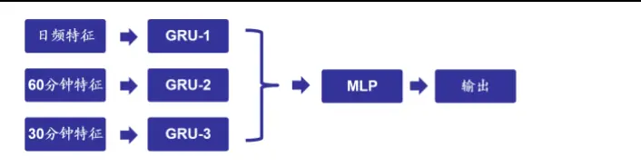
资料来源：海通证券研究所整理

图2 “单颗粒度训练，输出集成”示意图
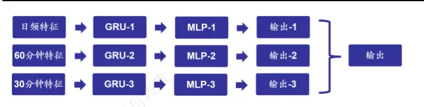
资料来源：海通证券研究所整理

下表展示了不同标签长度、调仓周期和成交价格假设下，各单/多颗粒度模型的 RankIC。虽然基于日度特征的单颗粒度模型已展现出较强的周度与双周度选股能力，但通过加入细颗粒度特征，Rank IC 得到了普遍的提升。

表 3 多颗粒度模型 Rank IC 对比（2017-2023.07）

| 标签 长度 | 特征 颗粒度 | T+0 收盘 | 周频调仓 |  |  | 双周频调仓 |  |  |  |
| --- | --- | --- | --- | --- | --- | --- | --- | --- | --- |
|  |  |  | T+1 均价 | T+1 开盘 | T+1 收盘 | T+0 收盘 | T+1 均价 | T+1 开盘 | T+1 收盘 |
| 5日 | 日度 | 0.132 | 0.118 | 0.121 | 0.113 | 0.142 | 0.129 | 0.133 | 0.126 |
|  | 60分钟 | 0.131 | 0.116 | 0.120 | 0.111 | 0.143 | 0.129 | 0.133 | 0.126 |
|  | 30分钟 | 0.135 | 0.119 | 0.123 | 0.114 | 0.147 | 0.133 | 0.137 | 0.130 |
|  | 混合输入 | 0.139 | 0.121 | 0.127 | 0.117 | 0.148 | 0.133 | 0.138 | 0.130 |
|  | 输出集成 | 0.139 | 0.122 | 0.127 | 0.118 | 0.150 | 0.136 | 0.140 | 0.132 |
|  | 输出集成1 | 0.139 | 0.123 | 0.127 | 0.119 | 0.151 | 0.136 | 0.141 | 0.133 |
|  | 日度 | 0.131 | 0.121 | 0.122 | 0.117 | 0.146 | 0.136 | 0.139 | 0.134 |
| 10日 | 60 分钟 | 0.130 | 0.119 | 0.121 | 0.114 | 0.146 | 0.135 | 0.138 | 0.132 |
|  | 30分钟 | 0.129 | 0.117 | 0.120 | 0.113 | 0.143 | 0.132 | 0.135 | 0.129 |
|  | 混合输入 | 0.134 | 0.120 | 0.124 | 0.116 | 0.147 | 0.135 | 0.139 | 0.132 |
|  | 输出集成 | 0.136 | 0.124 | 0.126 | 0.119 | 0.151 | 0.140 | 0.143 | 0.137 |
|  | 输出集成1 | 0.136 | 0.124 | 0.126 | 0.119 | 0.151 | 0.140 | 0.142 | 0.136 |

资料来源：Wind，海通证券研究所

进一步对比不同模型 Top10%组合的分年度超额收益，如下表所示，在所有年份上，总有多颗粒度模型能排在前两位。整体而言，输出集成方式的效果最好，10 日标签对应的年化超额收益可达 31.5%。

表 4 多颗粒度模型分年度多头超额收益（2017-2023.07，次日均价交易，费前）

| 标签 长度 | 特征颗粒度 | 2017 | 2018 | 2019 | 2020 | 2021 | 2022 | 2023.07 YTD | 全区间 (年化) |
| --- | --- | --- | --- | --- | --- | --- | --- | --- | --- |
| 5日 | 日度 | 21.7% | 39.4% | 24.9% | 33.5% | 22.7% | 32.9% | 16.9% | 30.3% |
|  | 60 分钟 | 19.7% | 38.2% | 25.2% | 30.2% | 15.7% | 28.1% | 14.1% | 27.1% |
|  | 30分钟 | 19.2% | 43.2% | 24.7% | 29.7% | 19.2% | 29.5% | 15.5% | 28.7% |
|  | 混合输入 | 26.7% | 37.5% | 27.9% | 31.6% | 24.8% | 31.9% | 14.8% | 30.8% |
|  | 输出集成 | 20.5% | 43.3% | 25.5% | 33.2% | 20.4% | 34.7% | 15.5% | 30.6% |
|  | 输出集成1 | 21.3% | 43.9% | 25.2% | 32.8% | 22.7% | 35.8% | 16.2% | 31.4% |
|  | 日度 | 15.3% | 42.2% | 33.9% | 36.0% | 29.7% | 29.7% | 17.1% | 31.5% |
|  | 60分钟 | 22.1% | 48.6% | 29.6% | 21.6% | 15.5% | 30.0% | 17.2% | 29.6% |
|  | 30 分钟 | 16.2% | 46.9% | 22.8% | 19.7% | 16.0% | 31.9% | 16.5% | 27.3% |
|  | 混合输入 | 18.6% | 45.3% | 31.5% | 29.3% | 23.4% | 34.8% | 15.6% | 31.3% |
| 输出集成 | 18.2% | 50.4% | 31.4% | 26.7% | 21.5% | 33.6% | 17.1% | 31.5% |  |
| 输出集成1 | 16.0% | 48.1% | 31.0% | 29.2% | 25.5% | 33.4% | 16.9% | 31.4% |  |

资料来源：Wind，海通证券研究所

## 3. 双向 AGRU多颗粒度模型

尽管混合输入或输出集成提升了单颗粒度模型的选股能力，但由于依然使用传统GRU，当特征的颗粒度较细（如 60分钟或 30 分钟）时，“失忆”问题就不可避免。因此，想要进一步提升因子有效性，增强循环神经网络（RNN）的记忆性很有必要。

Transformer类的网络结构是很多学术文献的首选，但通常需要较大的参数量才能获得理想的结果。而在周度或双周度收益预测的情景之下，用于训练的样本较为有限，因此该类模型未必适用。但我们可以借鉴 Transformer类网络中的核心思想——注意力机制，即，对历史上各期隐含状态进行注意力加权，来改进传统 GRU。

图3 注意力加权示意图
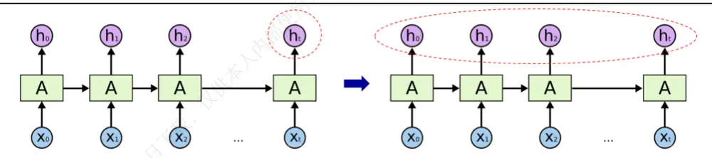
资料来源：海通证券研究所整理

除了引入注意力机制外，我们还将 GRU模型从单向改为双向。即，分别按顺序和逆序学习特征序列，并提取信息，进一步缓解早期重要信息的遗忘问题。最终的模型简记为双向 AGRU。

下图展示了双向 AGRU 单颗粒模型的年化多头超额收益。显然，几乎在所有参数下，超额收益都得到了较为显著的提升。

图4 双向 AGRU 单颗粒度模型 Top10%组合超额收益（2017-2023.07，费前）
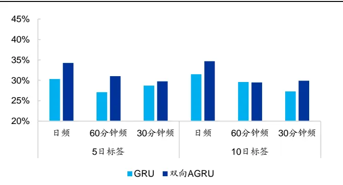
资料来源： ，海通证券研究所

图5 双向 AGRU 单颗粒度模型 Top100 组合超额收益（2017-2023.07，费前）
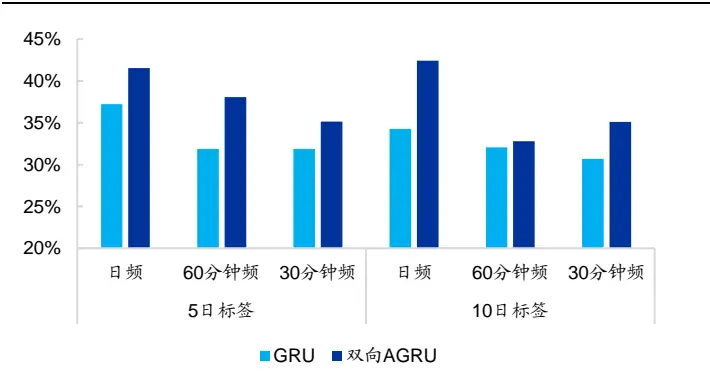
资料来源：Wind，海通证券研究所

进一步由下表可见，改为双向 AGRU 后，绝大部分单颗粒度模型的周度 Rank IC、ICIR、超额收益都获得明显的改善，费后超额收益的平均提升幅度约为 4%-5%。

表 5 双向 AGRU 单颗粒度模型表现对比（2017-2023.07）

| 标签 长度 | 特征颗粒度 | Rank IC | ICIR | 胜 率 | Top10%组合年化超额 |  | Top100组合年化超额 |  |
| --- | --- | --- | --- | --- | --- | --- | --- | --- |
|  |  |  |  |  | 费前 | 费后 | 费前 | 费后 |
| 5日 | 日度 | 0.118 | 7.54 | 87% | 30.3% | 20.1% | 37.2% | 24.4% |
|  | 日度-双向 AGRU | 0.122 | 7.80 | 88% | 34.2% | 23.7% | 41.5% | 28.1% |
|  | 60 分钟 | 0.116 | 7.35 | 86% | 27.1% | 16.8% | 31.9% | 18.6% |
|  | 60 分钟-双向 AGRU | 0.120 | 7.70 | 88% | 31.0% | 21.3% | 38.1% | 25.6% |
|  | 30 分钟 | 0.119 | 7.56 | 87% | 28.7% | 18.4% | 31.9% | 18.6% |
|  | 30 分钟-双向 AGRU | 0.120 | 7.64 | 87% | 29.7% | 20.1% | 35.1% | 22.7% |
| 10 日 | 日度 | 0.121 | 7.37 | 87% | 31.5% | 21.8% | 34.3% | 21.7% |
|  | 日度-双向 AGRU | 0.121 | 7.45 | 87% | 34.7% | 25.7% | 42.4% | 31.0% |
|  | 60 分钟 | 0.119 | 7.33 | 86% | 29.6% | 20.3% | 32.1% | 20.1% |
|  | 60 分钟-双向 AGRU | 0.118 | 7.35 | 86% | 29.5% | 20.7% | 32.8% | 21.7% |
|  | 30 分钟 | 0.117 | 7.20 | 85% | 27.3% | 18.4% | 30.7% | 19.3% |
|  | 30 分钟-双向 AGRU | 0.118 | 7.12 | 85% | 29.9% | 21.5% | 35.1% | 24.1% |

资料来源：Wind，海通证券研究所

以下图表为双向 AGRU 多颗粒度模型的收益表现。和传统的单向 GRU 相比，新模型的 Rank IC、ICIR 和多头超额收益都得到了全面而稳定的提升。

图6 双向 AGRU 多颗粒度模型 Top10%组合超额收益（2017-2023.07，费前）
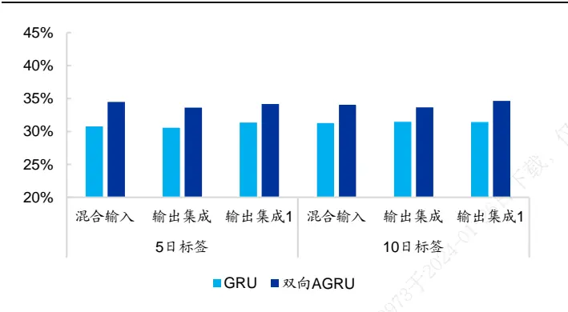
资料来源：Wind，海通证券研究所

图7 双向 AGRU 多颗粒度模型 Top100 组合超额收益（2017-2023.07，费前）
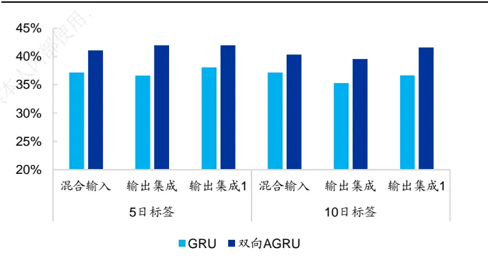
资料来源：Wind，海通证券研究所

表 6 双向 AGRU 多颗粒度模型表现对比（2017-2023.07）

| 标签 长度 | 特征颗粒度 | Rank IC | ICIR | 胜 率 | Top10%组合 年化超额 |  | Top100 组合 年化超额 |  |
| --- | --- | --- | --- | --- | --- | --- | --- | --- |
|  |  |  |  |  | 费前 | 费后 | 费前 | 费后 |
| 5日 | 混合输入 | 0.121 | 7.83 | 88% | 30.8% | 20.0% | 37.1% | 23.5% |
|  | 混合输入-双向 AGRU | 0.125 | 8.09 | 88% | 34.5% | 23.5% | 41.1% | 27.1% |
|  | 输出集成 | 0.122 | 7.63 | 87% | 30.6% | 20.6% | 36.6% | 23.8% |
|  | 输出集成-双向 AGRU | 0.126 | 7.87 | 88% | 33.6% | 24.0% | 42.0% | 29.3% |
|  | 输出集成1 | 0.123 | 7.71 | 87% | 31.4% | 21.4% | 38.1% | 25.3% |
|  | 输出集成 1-双向 AGRU | 0.127 | 7.88 | 88% | 34.2% | 24.3% | 42.0% | 29.2% |
|  | 混合输入 | 0.120 | 7.37 | 86% | 31.3% | 21.9% | 37.2% | 25.1% |
| 10日 | 混合输入-双向 AGRU | 0.124 | 7.67 | 87% | 34.1% | 24.9% | 40.3% | 28.4% |
|  | 输出集成 | 0.124 | 7.41 | 86% | 31.5% | 22.5% | 35.3% | 23.7% |
|  | 输出集成-双向 AGRU | 0.124 | 7.43 | 86% | 33.7% | 25.2% | 39.6% | 28.6% |
|  | 输出集成1 | 0.124 | 7.40 | 86% | 31.4% | 22.4% | 36.7% | 24.8% |
|  | 输出集成 1-双向 AGRU | 0.125 | 7.42 | 87% | 34.6% | 26.2% | 41.6% | 30.6% |

资料来源：Wind，海通证券研究所

具体地，双向 AGRU 混合输入和输出集成模型的周均 IC 都超过 0.12，Top10%和Top100 组合的费前多头超额收益分别为 33%和 40%。考虑双边 0.3%的交易成本后，两个组合的多头超额收益依然可以达到 24%和 30%。

以下两图展示的是双向 AGRU 多颗粒度模型的分年度费前多头超额收益，从中可见，2019-2022 年，超额收益分布较为均匀，未出现明显的衰减态势。2023 年，各模型Top10%和 Top100 组合的 YTD 超额收益约为 18%和 21%。

图8 双向 AGRU 多颗粒度模型 Top10%组合分年度超额收益（2017-2023.07，10 日标签，费前）
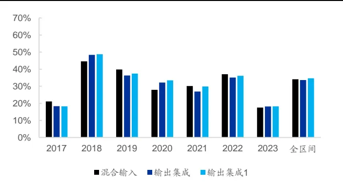
资料来源：Wind，海通证券研究所

图9 双向 AGRU 多颗粒度模型 Top100 组合分年度超额收益（2017-2023.07，10 日标签，费前）
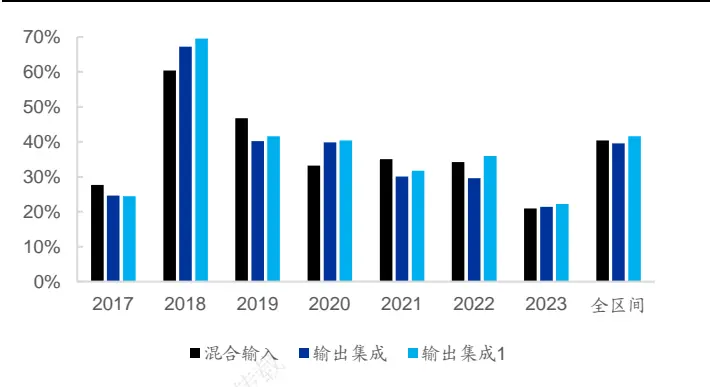
资料来源：Wind，海通证券研究所

下图为 Top10%组合 2023 年 1 至 7月的费前累计超额收益，两次较大幅度的回撤分别发生在 3月上旬至 4月上旬和 5月中旬至 6 月中旬。6 月中旬至 7月底，超额收益累积迅速，且较为平稳。

图10 双向 AGRU 多颗粒度模型 Top10%组合累计超额收益（2023.01-2023.07，费前）
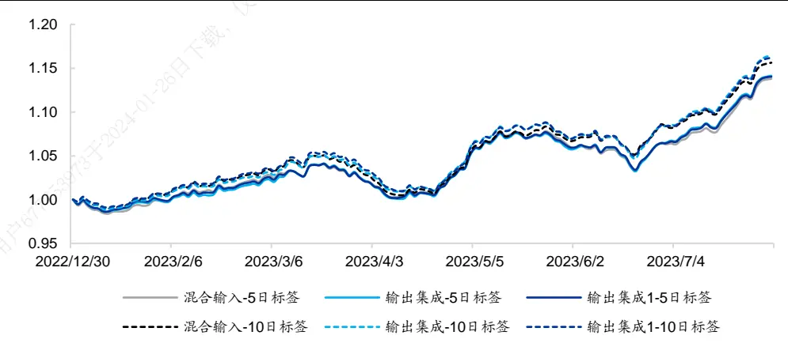
资料来源：Wind，海通证券研究所

以上测试结果均以全市场为选股范围，但实际投资常常面临各种约束。因此，考察模型在不同选股空间中的表现，有着很强的现实意义。以下两图分别展示了因子的 RankIC 和多头超额收益。从中可见，模型在中证 800 成分股内表现较为一般，周均 Rank IC仅为 0.08-0.09，多头超额收益约 20%，都显著低于全市场的结果。

模型表现较好的选股域包括中证 1000 内、中证 1800 外、国证 2000 内和国证 3000外，Rank IC 都高于 0.12，费前多头超额收益均超过 30%。若进一步考虑成交活跃度，将选股范围限定在成交金额排名前 20%的股票内，Rank IC和多头超额收益依然可以达到 12%和 30%。

图11 双向 AGRU 多颗粒度模型在不同选股空间中的周均 Rank IC（2017-2023.07，10 日标签）
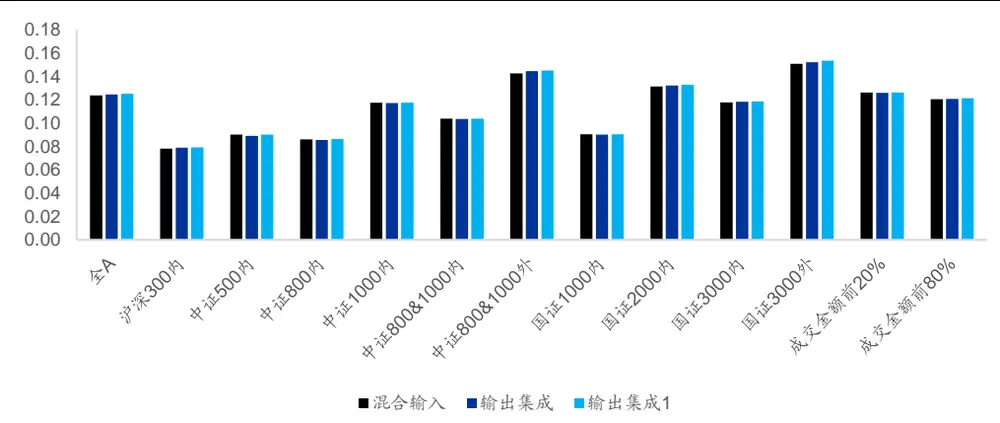
资料来源：Wind，海通证券研究所

图12 双向 AGRU 多颗粒度模型在不同选股空间中的年化多头超额收益（2017-2023.07，Top10%组合，10日标签，费前）
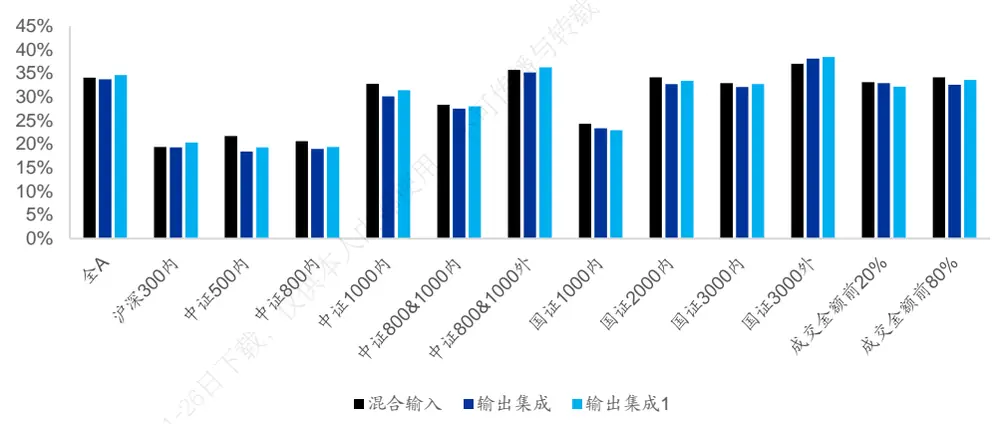
资料来源：Wind，海通证券研究所

如下图所示，截至 2023 年 7 月，模型在中证 500、中证 1000 和国证 2000 成分股内的 YTD超额收益分别为 6%-7%、8%-9%和 11%-12%，均显著低于历史平均水平。有趣的是，模型反而在沪深 300 成分股内获得了 14%-16%的 YTD 超额收益，远高于历史平均水平。我们认为，这种选股有效性的此消彼长，或许反映了策略在不同选股域中的拥挤情况。

图13 双向 AGRU 多颗粒度模型在不同选股空间中的多头超额收益（2023.01-2023.07，10 日标签，费前）
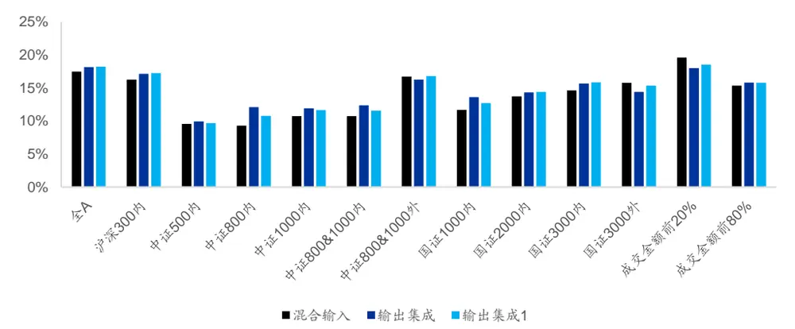
资料来源：Wind，海通证券研究所

## 4. 多颗粒度残差学习网络

除了混合输入和输出集成外，融合多颗粒度特征的新模型也不断涌现。例如，微软亚研院在《Multi-Granularity Residual Learning with Confidence Estimation for TimeSeries Prediction》一文中，提出了多颗粒度残差学习网络。其核心理念是，不同颗粒度特征存在较为严重的信息冗余，因此，如何提取每个颗粒度的特有信息，而剔除重复部分，对最终的模型构建非常重要。此外，不同颗粒度特征的有效性往往会随时间变化，还需要判定每个颗粒度特征是否对最终预测有足够的影响。

具体地，将多个相同的模块叠加，形成整体网络架构，但每个模块只单独处理一个颗粒度的数据。从第二个模块起，输入的特征都需通过取残差的方式，剔除前一颗粒度已包含的信息，即，只保留该颗粒度特有的信息。考虑到不同颗粒度特征的维数有差异，因此需要通过简单的线性变换实现维数对齐，便于计算残差。每个模块都会输出该颗粒度下，对最终标签的预测。再将所有预测集成，作为最终的预测。

图14 多颗粒度残差学习网络示意图
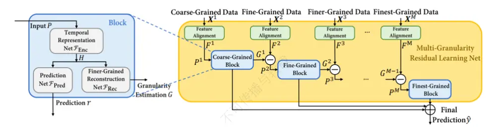
资料来源：《Multi-Granularity Residual Learning with Confidence Estimation for Time Series Prediction》，海通证券研究所

每个模块又由 3个不同的部分构成，

1） 时序信息编码网络：双层 GRU，用于提取时间序列输入的信息。

2） 预测网络：产生当前颗粒度特征的预测，用于和其他颗粒度预测的最终集成。

3） 细粒度重构网络：提取并重构当前颗粒度的信息，用于和下一颗粒度的特征计算残差。

在集成各颗粒度的预测时，文献也对比了多种解决方案。例如，简单平均，注意力加权、使用对比学习加权。感兴趣的读者可参阅原文，了解更多细节。

在设计损失函数时，除了 MSE以外，文献进一步加入了重构损失项和 L2 正则项。其中，重构损失项为每一颗粒度的输入与上一颗粒度重构输出的 Forbenius Norm。

$$
\mathcal{L}=\sum_{i=1}^{N}||y^{i}-\hat{y}^{i}||^{2}+\lambda_{1}\sum_{i=1}^{N}\mathcal{L}_{Rec}+\frac{\lambda_{\theta}}{2}||\theta||_{F}^{2}
$$

本文尝试复现上述残差学习网络，训练周度选股因子，并与前文的多颗粒度模型进行对比。由于该网络的结构和损失函数都较为复杂，模型训练的开销巨大。因此，我们仅测试日度及 30 分钟两种颗粒度，结果如下表所示。

表 7 多颗粒度残差学习网络的周度选股能力（2017-2023.07）

| 特征颗粒度 | Rank ic | ICIR | 胜率 | Top10%组合多头年化超额 |  | Top100 组合多头年化超额 |  |
| --- | --- | --- | --- | --- | --- | --- | --- |
|  |  |  |  | 费前 | 费后 | 费前 | 费后 |
| 日度 | 0.118 | 7.54 | 87% | 30.3% | 20.1% | 37.2% | 24.4% |
| 30分钟 | 0.119 | 7.56 | 87% | 28.7% | 18.4% | 31.9% | 18.6% |
| 输出集成 | 0.123 | 7.71 | 87% | 31.4% | 21.4% | 38.1% | 25.3% |
| 多颗粒度残差学习 | 0.114 | 7.49 | 86% | 27.9% | 18.6% | 32.1% | 21.1% |

资料来源：Wind，海通证券研究所

多颗粒度残差学习网络并未展现出显著的优势，相反，Rank IC、ICIR、多头组合超额收益均弱于输出集成模型。由以下两图的分年度超额收益可见，多颗粒度残差学习网络仅在 2019 和 2023 年表现较优，其余年份上均有所不及，尤其是 2021 和 2022 年。但考虑到该网络对应的损失函数中，存在两个可调整的超参数，本文未能达到文献所展示的那般优异的效果，或许和超参数的选择有关。在后续的研究中，我们还会对该网络进行更加详细的研究和测试。

图15 多颗粒度残差学习网络 Top10%组合分年度超额收益（2017-2023.07，费前）
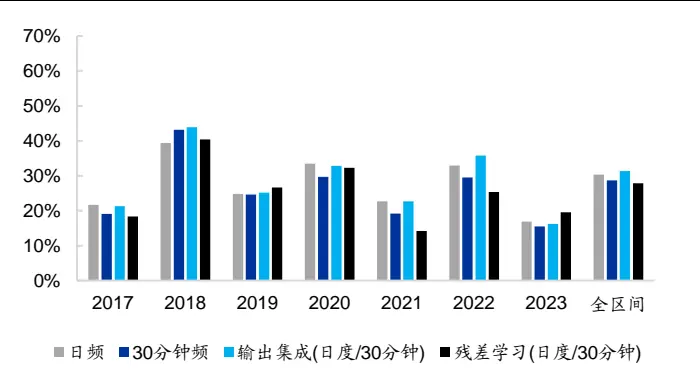
资料来源：Wind，海通证券研究所

图16 多颗粒度残差学习网络 Top100 组合分年度超额收益（2017-2023.07，费前）
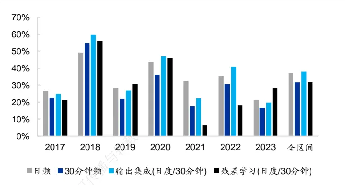
资料来源：Wind，海通证券研究所

## 5. AI 指数增强组合

为了进一步考察双向 G 多颗粒度模型的效果，我们将其输出值作为股票的收益预测，构建周度调仓的中证 500 和中证 1000AI 增强组合。其中，增强组合的风险控制模块包括以下几个方面的约束。

1） 个股偏离：相对基准的权重偏离不超过 0.5%/1%；

2） 因子暴露：估值中性、市值（500 增强：中性；1000 增强：[-0.2, 0.2]），常规低频因子：[-0.8, 0.8]；

3） 行业偏离：严格中性/偏离上限 2%；

4） 选股空间：全市场/80%指数成分股权重；

5） 换手率限制：单次单边换手不超过 30%。

两个组合的优化目标均为最大化预期收益，目标函数如下所示。

$$
max\sum\mu_{i}w_{i}
$$

其中， $\mathsf{W}_{\mathrm{i}}$ 为组合中股票 i的权重， $\mu_{\mathrm{i}}$ 为股票 i的预期超额收益。为使测试结果贴近实践，下文的测算均假定以次日均价成交，同时扣除双边 3‰的交易成本。

## 5.1 中证 500 AI 增强组合

如下表所示， ，随风控参数的变化，基于双向 多颗粒模型的中证 500AI 增强组合（无成分股约束），年化超额收益为 15%-20%。其中，2023 年的 YTD 超额收益为 10%-16%。相较而言，使用未来 10 日超额收益作为训练标签的模型，整体超额收益更高。我们认为，这可能是因为标签越短，模型表现越依赖于交易能力。在次日均价成交的设定下，短标签模型反而处于劣势。

表 8 中证 500AI增强组合超额收益（全市场）

|  |  | 2017.01-2023.07（年化） |  |  |  | 2023.01-2023.07(YTD) |  |  |  |
| --- | --- | --- | --- | --- | --- | --- | --- | --- | --- |
|  |  | 行业中性 个股偏离 |  | 行业偏离 2% 个股偏离 |  | 行业中性 个股偏离 |  | 行业偏离 2% |  |
| 标签 | 模型名称 |  |  |  |  |  |  | 个股偏离 |  |
|  |  | 0.5% | 1% | 0.5% | 1% | 0.5% | 1% | 0.5% | 1% |
| 5日 | 混合输入 | 15.3% | 17.6% | 17.7% | 19.0% | 10.2% | 13.5% | 11.0% | 14.5% |
|  | 输出集成 | 16.4% | 18.6% | 19.0% | 21.4% | 12.0% | 12.6% | 11.8% | 11.4% |
|  | 输出集成1 | 15.9% | 19.2% | 18.4% | 20.3% | 11.6% | 14.1% | 11.9% | 12.0% |
| 10日 | 混合输入 | 15.4% | 16.6% | 17.5% | 19.0% | 13.5% | 12.6% | 12.0% | 11.8% |
|  | 输出集成 | 16.3% | 18.4% | 18.4% | 20.5% | 13.3% | 15.7% | 13.1% | 16.2% |
|  | 输出集成1 | 16.7% | 18.9% | 19.1% | 20.6% | 12.9% | 16.2% | 13.6% | 15.9% |

资料来源：Wind，海通证券研究所

添加 80%成分股权重约束后，各组合年化超额收益从 15%-20%下降至 10%-15%。其中，2023 年的 YTD 超额收益从 10%-16%下降至 7%-12%。由此可见，成分股约束对中证 500 增强组合的超额收益有着较为显著的影响。类似地，10 日标签模型的超额收益相对更高。

表 9 中证 500AI增强组合超额收益（80%成分股权重约束）

| 标签 | 模型名称 | 2017.01-2023.07（年化） |  |  | 2023.01-2023.07(YTD） |  |  |  |
| --- | --- | --- | --- | --- | --- | --- | --- | --- |
|  |  | 行业中性 个股偏离 |  | 行业偏离 2% |  | 行业中性 行业偏离 2% |  |  |
|  |  | 1% | 个股偏离 |  | 个股偏离 |  | 个股偏离 |  |
| 5日 | 混合输入 | 0.5% | 0.5% | 1% | 0.5% | 1% | 0.5% | 1% |
|  | 输出集成 | 11.3% 10.6% | 12.9% | 12.1% | 7.5% | 8.5% | 8.7% | 9.6% |
|  |  | 11.1% 11.9% | 12.5% | 13.9% | 8.2% | 9.5% | 9.1% | 11.3% |
| 10日 | 输出集成1 | 11.0% 11.5% | 12.3% | 14.2% | 7.6% 7.8% | 10.9% | 8.6% | 11.9% |
|  | 混合输入 | 9.8% 11.4% | 12.4% | 12.6% | 8.9% | 11.0% | 9.7% | 10.2% |
|  | 输出集成 | 10.4% 11.5% | 12.7% | 14.2% | 10.0% | 11.2% | 9.9% | 12.5% |
|  | 输出集成1 | 10.9% 11.7% | 12.7% | 14.8% |  | 11.6% | 10.6% | 10.8% |

资料来源：Wind，海通证券研究所

下表为“全市场选股、行业中性、个股偏离 、输出集成”这组特定参数的中证500 AI 增强组合的分年度收益风险特征。2017 年以来，组合年化超额收益 18.9%，超额最大回 ，发生在 年。其中， 和 年表现相对较弱， 年超额收益 16.2%。

表 10 中证 500 AI 增强组合分年度收益风险特征（2017-2023.07）

| 超额收益 | 超额最大回撤 | 跟踪误差 | 信息比率 | 月度胜率 |
| --- | --- | --- | --- | --- |
| 2017 12.9% | 2.1% | 5.7% | 2.27 | 83% |
| 2018 23.1% | 2.8% | 6.0% | 3.87 | 92% |
| 2019 12.8% | 2.9% | 5.5% | 2.33 | 67% |
| 2020 21.4% | 4.0% | 6.3% | 3.37 | 75% |
| 2021 20.5% | 5.1% | 7.5% | 2.73 | 75% |
| 2022 14.1% | 2.5% | 6.4% | 2.20 | 92% |
| 2023.07YTD 16.2% | 2.4% | 4.7% | 6.57 | 86% |
| 全区间 18.9% | 5.1% | 6.1% | 3.08 | 81% |

资料来源：Wind，海通证券研究所

## 5.2 中证 1000 AI 增强组合

如下表所示，2017.01-2023.07，随风控参数的变化，基于双向 AGRU 多颗粒模型的中证 1000AI 增强组合（无成分股约束），年化超额收益为 25%-30%。其中，2023年的 YTD超额收益为 15%-18%。相较而言，放松个股或行业偏离，以及使用未来 10日超额收益作为训练标签，可以获得更好的业绩表现。

表 11 中证 1000AI增强组合超额收益（全市场）

| 标签 | 模型名称 | 2017.01-2023.07（年化） |  |  | 2023.01-2023.07(YTD） 行业中性 行业偏离 2% |  |  |  |
| --- | --- | --- | --- | --- | --- | --- | --- | --- |
|  |  | 行业中性 个股偏离 |  | 行业偏离 2% 个股偏离 |  | 个股偏离 | 个股偏离 |  |
| 5日 |  | 0.5% | 1% | 0.5% | 1% | 0.5% 1% | 0.5% | 1% |
|  | 混合输入 | 25.1% | 26.0% | 26.9% 28.5% | 16.3% | 16.2% | 16.7% | 14.7% |
|  | 输出集成 | 25.8% | 27.6% | 27.9% | 29.1% | 15.6% 16.6% | 15.3% | 15.8% |
| 10日 | 输出集成1 | 24.8% | 25.4% | 27.2% 26.7% | 16.1% 16.1% | 15.1% | 16.9% | 14.9% |
|  | 混合输入 | 24.6% | 25.4% | 26.5% | 28.0% | 16.2% | 15.9% | 16.4% |
|  | 输出集成 | 26.3% | 28.0% 27.9% | 30.9% | 16.5% | 17.2% | 15.8% | 18.2% |
|  | 输出集成1 | 26.8% | 29.2% 28.0% | 31.0% | 17.2% | 18.6% | 17.9% | 18.0% |

资料来源：Wind，海通证券研究所

添加 80%成分股权重约束后，各风控参数下，组合的年化超额收益为 22%-28%。其中，2023 年的 YTD 超额收益为 11%-16%。和无成分股约束的结果相比，下降 2%-3%，幅度明显小于中证 500AI 增强组合。我们猜测，可能的原因是，近年来，深度学习模型在中证 500 成分股内的选股效果逐步下滑，且显著弱于全市场；而在中证 1000 成分股内，则依然可以维持和全市场接近的表现。

表 12 中证 1000AI增强组合超额收益（80%成分股权重约束）

|  |  | 2017.01-2023.07（年化） |  |  |  | 2023.01-2023.07(YTD） |  |  |  |
| --- | --- | --- | --- | --- | --- | --- | --- | --- | --- |
|  |  | 行业中性 个股偏离 |  | 行业偏离 2% 个股偏离 |  | 行业中性 个股偏离 |  | 行业偏离 2% 个股偏离 |  |
| 标签 | 模型名称 | 0.5% 1% |  | 0.5% 1% | 0.5% | 1% | 0.5% | 1% |  |
| 5日 | 混合输入 | 22.9% | 22.0% | 25.7% | 25.7% | 11.4% | 11.6% | 11.8% | 11.8% |
|  | 输出集成 | 23.2% | 24.4% | 25.6% | 27.1% | 12.2% | 13.6% | 12.5% | 13.8% |
|  | 输出集成1 | 22.6% | 24.2% | 25.1% | 26.6% | 12.2% | 13.1% | 12.6% | 13.6% |
|  | 混合输入 | 21.9% | 22.6% | 24.4% | 24.5% | 13.9% | 14.3% | 13.8% | 12.3% |
| 10日 | 输出集成 | 23.5% | 24.4% | 25.9% | 26.7% | 13.6% | 14.3% | 13.8% | 14.8% |
|  | 输出集成1 | 23.4% | 25.8% | 25.3% | 28.3% | 13.3% | 16.0% | 14.2% | 15.9% |

资料来源：Wind，海通证券研究所

下表为“80%成分股权重约束、行业中性、个股偏离 1%、输出集成”这组特定参数的中证 1000 AI 增强组合的分年度收益风险特征。2017年以来，组合年化超额收益28.0%，超额最大回撤 5.8%，发生在 2020 年。其中，2023 年 YTD 超额收益 17.2%。

表 13 中证 1000 AI 增强组合分年度收益风险特征（2017-2023.07）

| 超额收益 | 超额最大回撤 | 跟踪误差 | 信息比率 | 月度胜率 |
| --- | --- | --- | --- | --- |
| 2017 28.6% | 2.9% | 6.3% | 4.58 | 100% |
| 2018 34.1% | 2.2% | 6.7% | 5.09 | 92% |
| 2019 25.6% | 2.2% | 5.4% | 4.71 | 83% |
| 2020 22.2% | 5.8% | 7.8% | 2.86 | 83% |
| 2021 28.9% | 4.9% | 9.6% | 3.00 | 58% |
| 2022 20.8% | 4.4% | 8.0% | 2.61 | 83% |
| 2023.07YTD 17.2% | 4.6% | 6.5% | 5.09 | 71% |
| 全区间（年化） 28.0% | 5.8% | 7.3% | 3.82 | 82% |

资料来源：Wind，海通证券研究所

## 6. 总结

尽管使用单一的日度特征已经可以实现不俗的业绩，但更细颗粒度的特征依然有值得挖掘的有效信息。因此，本文引入了两类多颗粒度模型。（1）“多颗粒度输入，一次性训练”：将不同颗粒度的特征均作为模型输入，并通过独立的 GRU 提取序列信息；随后，将 GRU的输出结果合并，再通过 MLP得到最终的输出。（2）“单颗粒度训练，输出集成”：单独训练每一个颗粒度的特征，输出对标签的预测；在最终的推理阶段，集成不同颗粒度模型的输出。

在不同标签长度、调仓周期和成交价格假设下，多颗粒度模型的 Rank IC和年化多头超额收益，相比单颗粒度模型都得到了不同程度的提升。整体而言，输出集成方式的效果最好，10 日标签对应的费前年化超额收益可达 31.5%。

为缓解早期重要信息的遗忘问题，我们不仅引入了注意力机制，还将 GRU模型从单向改为双向。即，分别按顺序和逆序学习特征序列，并提取信息。和传统的单向 GRU相比，双向 AGRU 多颗粒度模型的 Rank IC、ICIR 和多头超额收益都得到了全面而稳定的提升。具体地，周均 Rank IC超过 0.12，Top10%和 Top100 组合的费前多头超额收益分别为 33%和 40%。

微软亚研院在《Multi-Granularity Residual Learning with Confidence Estimation forTime Series Prediction》一文中，提出了多颗粒度残差学习网络。其核心理念是，将多转个相同的模块叠加，形成整体网络架构，但每个模块只单独处理一个颗粒度的数据。从第二个模块起，输入的特征都需通过取残差的方式，剔除前一颗粒度已包含的信息，即，传只保留该粒度特有的信息。每个模块都会输出该颗粒度下，对最终标签的预测。再将所不有预测集成，作为最终的预测。

将双向 AGRU 多颗粒度模型的输出值作为股票的收益预测，构建周度调仓的中证500 和中证 1000 AI 增强组合。2017.01-2023.07，无成分股约束时，中证 500 和中证本1000 AI 增强组合分别取得 15%-20%和 25%-30%的年化超额收益。其中，2023 年的仅YTD 超额收益分别为 10%-16%和 15%-18%。添加 80%成分股权重约束后，两个组合载，的超额收益分别下降 5%-6%和 2%-3%，至 10%-15%和 23%-27%。日

## 7. 风险提示024-

市场系统性风险、资产流动性风险、政策变动风险、因子失效风险。39

# 信息披露

分析师声明

[Table冯佳睿yst金融工程研究团队s]

袁林青金融工程研究团队

本人具有中国证券业协会授予的证券投资咨询执业资格，以勤勉的职业态度，独立、客观地出具本报告。本报告所采用的数据和信息均来自市场公开信息，本人不保证该等信息的准确性或完整性。分析逻辑基于作者的职业理解，清晰准确地反映了作者的研究观点，结论不受任何第三方的授意或影响，特此声明。

## 法律声明

本报告仅供海通证券股份有限公司（以下简称 本公司 ）的客户使用。本公司不会因接收人收到本报告而视其为客户。在任何情况下，本报告中的信息或所表述的意见并不构成对任何人的投资建议。在任何情况下，本公司不对任何人因使用本报告中的任何内容所引致的任何损失负任何责任。

本报告所载的资料、意见及推测仅反映本公司于发布本报告当日的判断，本报告所指的证券或投资标的的价格、价值及投资收入可能会波动。在不同时期，本公司可发出与本报告所载资料、意见及推测不一致的报告。

市场有风险，投资需谨慎。本报告所载的信息、材料及结论只提供特定客户作参考，不构成投资建议，也没有考虑到个别客户特殊的播投资目标、财务状况或需要。客户应考虑本报告中的任何意见或建议是否符合其特定状况。在法律许可的情况下，海通证券及其所属可关联机构可能会持有报告中提到的公司所发行的证券并进行交易，还可能为这些公司提供投资银行服务或其他服务。

本报告仅向特定客户传送，未经海通证券研究所书面授权，本研究报告的任何部分均不得以任何方式制作任何形式的拷贝、复印件或复制品，或再次分发给任何其他人，或以任何侵犯本公司版权的其他方式使用。所有本报告中使用的商标、服务标记及标记均为本公司的商标、服务标记及标记。如欲引用或转载本文内容，务必联络海通证券研究所并获得许可，并需注明出处为海通证券研究所，且本不得对本文进行有悖原意的引用和删改。仅

根据中国证监会核发的经营证券业务许可，海通证券股份有限公司的经营范围包括证券投资咨询业务。下载

海通证券股份有限公司研究所[Table_PeopleInfo]
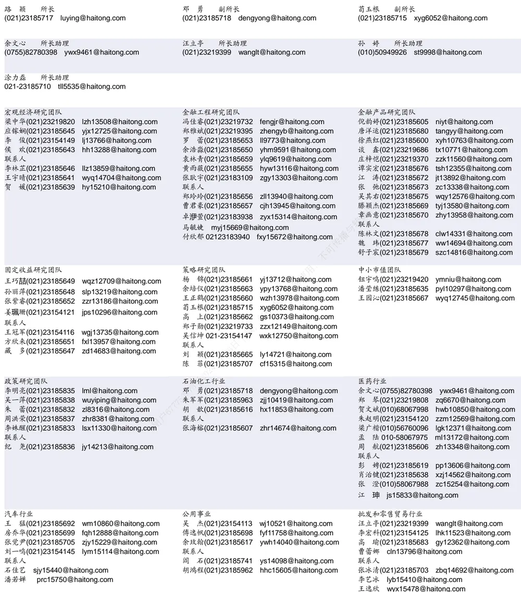

## 研究所销售团队

## 深广地区销售团队

伏财勇(0755)23607963 fcy7498@haitong.com

蔡铁清(0755)82775962 ctq5979@haitong.com

辜丽娟(0755)83253022 gulj@haitong.com

刘晶晶(0755)83255933 liujj4900@haitong.com

饶 伟(0755)82775282 rw10588@haitong.com

欧阳梦楚(0755)23617160

oymc11039@haitong.com

巩柏含 gbh11537@haitong.com

张馨尹 0755-25597716 zxy14341@haitong.com

海通证券股份有限公司研究所

地址：上海市黄浦区广东路 689号海通证券大厦 9楼

电话：（021）23219000

传真：（021）23219392

网址：www.htsec.com

上海地区销售团队 胡雪梅(021)23219385 huxm@haitong.com 黄 诚(021)23219397 hc10482@haitong.com 季唯佳(021)23219384 jiwj@haitong.com 黄 毓(021)23219410 huangyu@haitong.com 胡宇欣(021)23154192 hyx10493@haitong.com 马晓男 mxn11376@haitong.com 邵亚杰 23214650 syj12493@haitong.com 杨祎昕(021)23212268 yyx10310@haitong.com 毛文英(021)23219373 mwy10474@haitong.com 谭德康 tdk13548@haitong.com 王祎宁(021)23219281 wyn14183@haitong.com 张歆钰 zxy14733@haitong.com 周之斌 zzb14815@haitong.com

北京地区销售团队
殷怡琦(010)58067988 yyq9989@haitong.com
董晓梅 dxm10457@haitong.com
郭 楠 010-5806 7936 gn12384@haitong.com
张丽萱(010)58067931 zlx11191@haitong.com
郭金垚(010)58067851 gjy12727@haitong.com
张钧博 zjb13446@haitong.com
高 瑞 gr13547@haitong.com
上官灵芝 sglz14039@haitong.com
姚 坦 yt14718@haitong.com