## [Tab相关研究

Table_ReportInfo]《A 股蓄势期，布局选龙头——关注MSCI 中国 A50潜在的估值修复机会》2023.10.16

《选股因子系列研究（八十八）——多颗粒度特征的深度学习模型：探索和对比》2023.09.11

《风控模型还有必要吗？——国证 2000增强方案的尝试和思考》

分析师:冯佳睿

Tel:(021)23219732

Email:fengjr@haitong.com

证书:S0850512080006

分析师:罗蕾

Tel:(021)23185653

Email:ll9773@haitong.com

证书:S0850516080002

# 选股因子系列研究（八十九）——买入评级因子的改进及其在大盘股优选策略中的应用

## 投资要点：

2023 年，买入评级因子的表现显著下滑，月均溢价接近于 0（2023.01-2023.09）。针对这一现象，本文统计和分析了可能影响买入评级因子溢价的因素，并设法改善基础买入评级因子的选股表现。进一步，由于买入评级因子在大市值个股中的覆盖率更高，因此我们尝试在大盘选股策略中应用该因子，并基于此构建了大盘优选组合。

报告类型上，买入评级报告以深度和点评报告为主，且 年以来，这两类报告在买入评级报告中的合计占比持续增加。截至 2023 年，两者合计占比已超过90%。从选股效果来看，深度报告具有最高的截面溢价，其次为点评报告。一般个股报告和调研报告的溢价相对较低，尤其是 年以来，这两类报告的月度因子溢价显著降低。

- 新增买入评级 vs 连续买入评级。受报告发布时间与事件发生之间的时滞影响，2023 年连续买入评级因子的溢价略微为负；而新增买入评级因子仍具有较为明显的正溢价，大于零的月份占比为 66.7%。

- 有基本面支撑 vs 基本面较差。有基本面支撑的买入评级因子历史溢价表现显著优于没有基本面支撑的因子。2013.01-2023.09 期间，前者月均溢价 0.95%，而后者仅 0.22%；2023 年，前者月均溢价为正，而后者为负。

其他影响因素：分析师发布的报告篇数和每个股票对应的买入评级报告数量。分析师过去 个月发布的报告篇数越多或历史买入评级报告的溢价越高，则相应的买入评级因子的未来溢价也更高。至少有 篇买入评级报告覆盖的股票，溢价高于只有 1篇买入评级报告覆盖的。虽然以上两个因素都有一定区分效果，但全区间内不论怎么划分都能获得溢价一致为正的因子，故不宜作为剔除标准。

- 新增且有基本面支撑的买入评级因子。该因子 年的月均溢价依然可达，月胜率 ， 为 。但该因子的覆盖度不高（因子值为 的个股占比仅 左右），因此，我们认为，它或许更适合用于在特定选股池中构建风格类的 Smart beta 组合。

- 大盘优选组合 1。2013.01-2023.09，在全 A 市值最大的 400 只股票中，选择多因子得分最高的 50 只股票所构建的大盘优选组合 1 年化收益 17.6%，相对沪深300 指数年超额 14.6%，月胜率 72.7%，年化跟踪误差和最大相对回撤分别为7.5%和 7.1%。

- 大盘优选组合 2。2013.01-2023.09，在全 A 市值最大的 500 只股票中，选择多因子得分最高的 100 只股票所构建的大盘优选组合 2，相对沪深 300 指数年超额10.5%，月胜率 69.5%，年化跟踪误差和最大相对回撤均为 6.1%。

- 风险提示。模型误设风险、历史统计规律失效风险、因子失效风险。

2023 年，买入评级因子的表现显著下滑，月均溢价接近于 0（2023.01-2023.09）。针对这一现象，本文统计和分析了可能影响买入评级因子溢价的因素，并设法改善基础买入评级因子的选股表现。进一步，由于买入评级因子在大市值个股中的覆盖率更高，因此我们尝试在大盘选股策略中应用该因子，并基于此构建了大盘优选组合。

## 1. 买入评级报告及因子

朝阳永续数据库将收录的分析师报告，根据评级划分为 5 个等级：卖出、减持、中性、增持、买入。我们统计每一年所有分析师报告中，不同评级报告的篇数占比，结果如图 1所示。图 2为每年买入评级报告覆盖个股占年末 A股总数之比。

2013 年以来，买入评级报告占比稳定增加，而没有出具评级的报告占比大幅降低。截至 2023.09，当年所有报告中，买入评级占比 61.5%。其次为增持，占比 29.9%；卖出、减持、中性报告占比低，合计不超过 0.5%。从年覆盖度来看，买入评级报告覆盖的A 股个数占比中枢在 50%左右。

图1 分析师报告的评级分布（2013.01-2023.09）
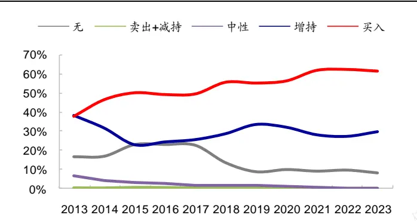
资料来源：朝阳永续，海通证券研究所

图2 各年买入评级报告覆盖个股占 A股数之比（2013-2023）
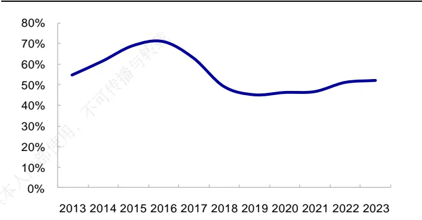
资料来源：朝阳永续，海通证券研究所
注：统计截至 2023.09，即 2023年为 1-9月买入评级报告覆盖的个股数占A股数之比

我们按照如下方式构建买入评级因子：若过去 1个月有买入评级报告覆盖，则因子值为 1，否则为 0。在考察因子选股效果时，为剔除其他风格的影响，将上述虚拟变量因子对市值、估值、盈利、动量 4个因子正交，最终得到因子累计月度溢价如图 3所示。

2013 年以来（截至 2023.09，下同），买入评级因子月均溢价 0.74%，月胜率 65.9%，ICIR 为 1.60，统计显著。但 2021 年以来，买入评级因子的选股效果有所减弱（图 4）。特别是 2023 年，买入评级因子仅在 33.3%的月度获得正收益，月均溢价下降至 0.03%。

图3 买入评级因子累计月度溢价（2013.01-2023.09）
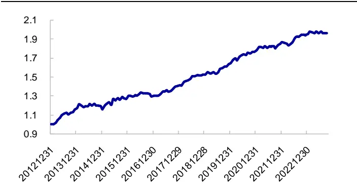
资料来源：Wind，朝阳永续，海通证券研究所

图4 买入评级因子分年度月均溢价（2013.01-2023.09）
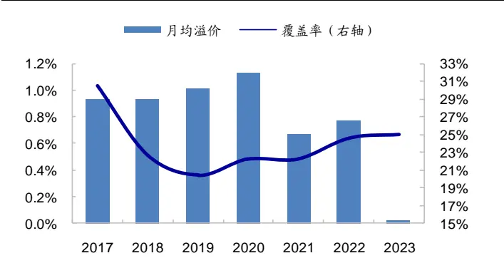
资料来源：Wind，朝阳永续，海通证券研究所

针对这一现象，下文统计和分析了可能影响买入评级因子溢价的因素，并设法改善基础买入评级因子的选股表现。

## 2. 买入评级因子相关影响因素

本节考察报告类型、是否新增买入、是否有基本面支撑、买入评级报告篇数、出具买入评级的分析师特点等因素，对买入评级因子选股效果的影响。

## 2.1 买入评级报告类型

朝阳永续数据库将分析师报告类型主要分为一般个股报告、深度报告、调研报告和点评报告。如图 5 所示，买入评级报告以点评报告为主，2023 年占比 83.1%；其次为一般个股报告和深度报告，两者分别占比 9.8%和 7.0%；调研报告最少，占比仅 0.1%。从变化趋势来看，点评报告和深度报告的占比增加；而一般个股报告和调研报告的占比持续减少。

图5 买入评级报告类型占比（2013.01-2023.09）
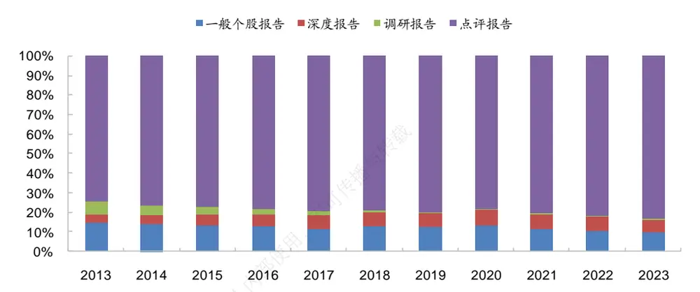
资料来源：Wind，朝阳永续，海通证券研究所

表 统计了不同类型买入评级报告发布后，因子未来一个月的截面溢价。从中可见，深度报告具有最高的月均溢价，其次为点评报告；一般个股报告和调研报告的溢价相对较低。特别是调研报告，由于覆盖率较低（因子值为 1的个股占全 A个股之比），溢价时序波动很大，选股效果统计不显著。

表 1 不同报告类型的买入评级因子溢价表现（2013.01-2023.09）

|  |  | 月均溢价 | 溢价波动率 | ICIR | t值 | p值 | 胜率 | 覆盖率 |
| --- | --- | --- | --- | --- | --- | --- | --- | --- |
| 2013-2023 | 一般个股报告 | 0.48% | 5.1% | 1.13 | 3.71 | 0.000 | 63.6% | 7.8% |
|  | 深度报告 | 0.84% | 6.2% | 1.62 | 5.32 | 0.000 | 70.5% | 4.9% |
|  | 调研报告 | 0.35% | 18.4% | 0.23 | 0.74 | 0.462 | 57.4% | 1.5% |
|  | 点评报告 | 0.69% | 5.2% | 1.60 | 5.25 | 0.000 | 69.8% | 21.6% |
|  | 深度&点评 | 0.78% | 5.4% | 1.73 | 5.67 | 0.000 | 67.4% | 23.5% |
|  | 所有报告 | 0.74% | 5.6% | 1.60 | 5.26 | 0.000 | 65.9% | 25.8% |
| 21年以来 | 一般个股报告 | -0.03% | 5.3% | -0.07 | -0.12 | 0.907 | 45.5% | 7.0% |
|  | 深度报告 | 0.43% | 5.8% | 0.89 | 1.48 | 0.148 | 60.6% | 5.8% |
|  | 调研报告 | -1.58% | 26.4% | -0.72 | -1.19 | 0.244 | 42.4% | 0.1% |
|  | 点评报告 | 0.50% | 4.6% | 1.29 | 2.14 | 0.040 | 69.7% | 19.7% |
|  | 深度&点评 | 0.62% | 5.1% | 1.46 | 2.41 | 0.022 | 60.6% | 22.2% |
|  | 所有报告 | 0.53% | 5.4% | 1.19 | 1.97 | 0.057 | 57.6% | 23.9% |

资料来源：Wind，朝阳永续，海通证券研究所

而从近几年溢价相对历史溢价的表现来看，下滑速度最快的也是一般个股报告和调研报告。基于这两类报告所构建的买入评级因子，2021 年以来，月均溢价为负。

若只考虑深度和点评两种报告类型，基于此所构建的买入评级因子 2013 年以来的月均溢价为 0.78%，高于基于所有类型报告所构建的买入评级因子（0.74%），且溢价的波动率也有所降低。尤其是 2021 年以来，该因子月均溢价 0.62%，明显优于初始买入评级因子（0.53%），胜率和 ICIR 也都具有相对优势。

由于买入评级报告以深度和点评两种类型为主，且两者的合计占比也从 2013 年的78.7%持续提升至 2023 年的 90.1%（图 6）；同时，这两类报告构建的因子溢价表现最优。因此，下文提及的买入评级因子均只基于深度和点评报告。

图6 买入评级报告中点评&深度合计占比（截至 2023.09）
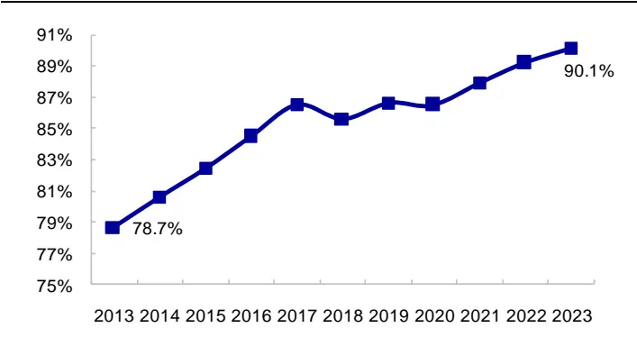
资料来源：Wind，朝阳永续，海通证券研究所

图7 买入评级报告个股的市值和 PB 分布（2013.01-2023.09）
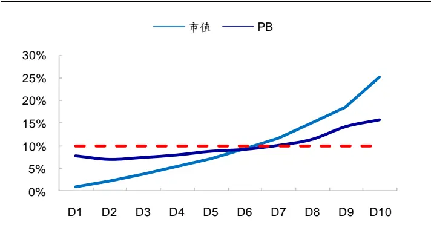
资料来源：Wind，朝阳永续，海通证券研究所

我们根据市值将全 A个股等分为 10组，其中 D1 为市值最小的 10%股票，D10 为市值最大的 10%股票。然后统计买入评级个股在每一组中的占比，以此考察分析师推荐股票的市值分布特征。结果显示，与全 A个股市值分布相比（各组占比相同，10%），买入评级个股在大市值组别中占比显著更高（图 ）。类似地，我们也考察了买入评级个股的 PB和基本面特征。结果显示，分析师给予买入评级的公司普遍估值较高、基本面较好（图 7-8）。

如图 9所示，买入评级个股过去一个月累计收益的分布呈两端高，中间低的特征。即，分析师推荐的股票大部分要么历史涨幅比较大，受关注度比较高；要么跌幅比较大，性价比高；而涨幅处于中间部分的股票，分析师相对较少给予买入评级。

图8 买入评级报告个股的基本面分布（2013.01-2023.09）
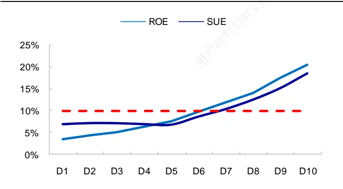
资料来源：Wind，朝阳永续，海通证券研究所

图9 买入评级报告个股的月收益率分布（2013.01-2023.09）
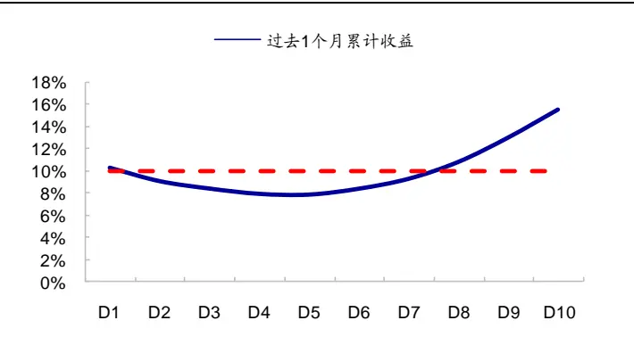
资料来源：Wind，朝阳永续，海通证券研究所

综上所述，买入评级报告以深度和点评两种类型为主，且 2013 年以来，这两类报告在买入评级报告中的合计占比持续增加。截至9月，2023年两者合计占比已超过90%。而从选股效果来看，深度报告具有最高的截面溢价，其次为点评报告；一般个股报告和调研报告的溢价相对较低，尤其是 2021 年以来，这两类报告的月溢价显著下滑。

## 2.2 新增买入评级

近 1 年来，买入评级报告发布后，溢价可以累积的时间变短。如图 10所示，全区间（2013.01-2023.09，下同），月度买入评级因子在报告发布后的 1-9周溢价持续上升，即超额收益在 9周的窗口期内可以持续累积。但 2022 年下半年以来（截至 2023.09），这种溢价累积的窗口期显著缩短。从第 5周开始，累计溢价就开始持续下降。这一现象表明，因子收益的衰减变得更快。

针对这一问题，我们尝试将买入评级虚拟变量因子分解为两部分：新增买入评级和连续买入评级。其中，新增买入评级是指，当月因子值为 1，同时上月因子值为 0 的新增的买入评级个股。即上个月未有买入评级报告覆盖，而本月有；连续买入评级则是指，上月、本月都有买入评级报告覆盖的股票。从构建方式可知，新增和连续买入评级合并即为买入评级因子。

图10 月度买入评级因子滞后 K 周的次均溢价（2013.01-2023.09）
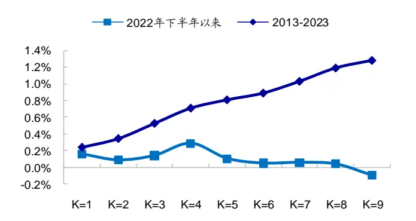
资料来源： ，朝阳永续，海通证券研究所

图11 新增买入评级与连续买入评级因子的分年度月均溢价（2013.01-2023.09）
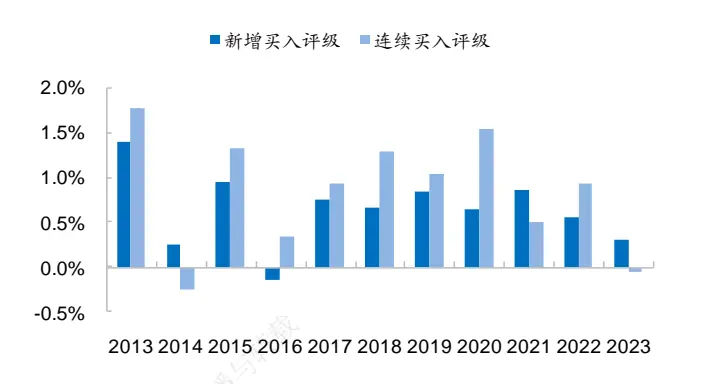
资料来源：Wind，朝阳永续，海通证券研究所

全区间来看，新增买入评级与连续买入评级因子的 ICIR 较为接近（1.47 vs 1.63），但两者呈现不一样的收益风险特征。新增买入评级因子的收益时序波动较小（年化波动率为 5.3%），而连续买入评级因子的溢价高（月均溢价为 0.87%）。

近 3 年，新增买入评级的选股效果优于连续买入评级。尤其是 2023 年，前者月均溢价 ，月胜率 ；而后者月均溢价略微为负，月胜率小于 。即今年以来，买入评级报告的溢价累计持续时间相对较短，时效性强。我们猜测，这可能在一定程度上与报告发布的时滞性有关。

表 2 新增买入评级与连续买入评级因子溢价表现（2013.01-2023.09）

|  | 新增买入评级 |  |  |  |  | 连续买入评级 |  |  |  |
| --- | --- | --- | --- | --- | --- | --- | --- | --- | --- |
|  | 月均溢价 | 溢价波动率 | ICIR | 胜率 | 覆盖率 | 月均溢价 | 溢价波动率 ICIR | 胜率 | 覆盖率 |
| 2013-2016 | 0.61% | 6.3% | 1.17 | 54.2% | 12.5% | 0.79% | 7.2% 1.32 | 64.6% | 13.3% |
| 2017-2020 | 0.72% | 4.2% | 2.07 | 70.8% | 9.8% | 1.19% | 5.5% 2.60 | 81.3% | 12.3% |
| 2021-2023 | 0.59% | 5.4% | 1.31 | 69.7% | 10.3% | 0.51% | 6.3% 0.96 | 57.6% | 11.9% |
| 2023年 | 0.30% | 5.0% | 0.70 | 66.7% | 11.6% | -0.06% | 3.3% -0.22 | 33.3% | 11.8% |
| 2013-2023 | 0.65% | 5.3% | 1.47 | 64.3% | 10.9% | 0.87% | 6.4% 1.63 | 69.0% | 12.5% |

资料来源：Wind，朝阳永续，海通证券研究所

以财报期为例，如图 所示， 以前， 月份买入评级报告覆盖的个股数最多，到 5 月份则数显著减少。这可能意味着，事件（财报）与报告之间的滞后时间相对较短，绝大部分与财报相关的报告可能在 4月份已发布。2023 年，5月份覆盖的个股数与 4 月份无明显差异。通过与往年的对比，我们认为，很多针对 4 月份财报的分析师报告，到5 月份才陆续发布。即，买入评级报告发布时，可能离事件（财报）已滞后一段时间，市场已有所反映，因此溢价累积的持续时间也较以往更短一些。

图12 4、5月买入评级报告覆盖的个股数（2013-2023）
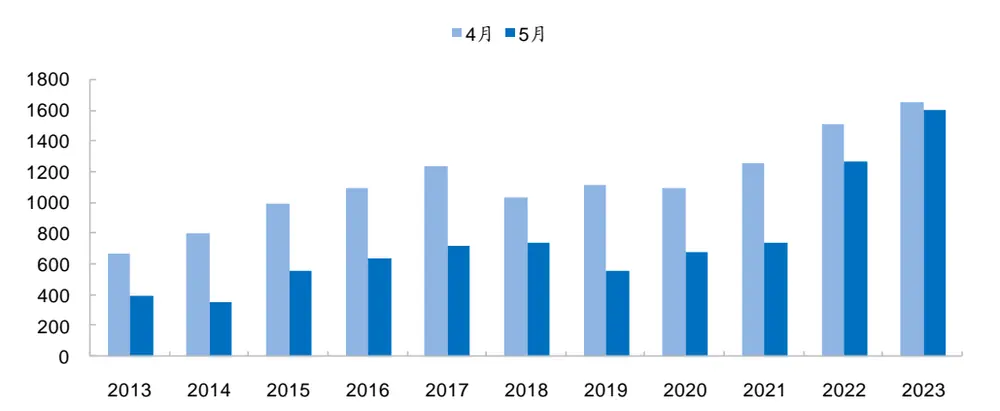
资料来源：Wind，朝阳永续，海通证券研究所

## 2.3有基本面支撑的买入评级

直观上，有基本面数据支撑的买入评级报告更具说服力，相应的溢价水平或许更高。我们将买入评级因子分解为“有基本面支撑的买入评级”和“其他买入评级”两部分。其中，有基本面支撑是指，公司的 高于全 个股 的下 分位点，即不属于SUE 最差的 1/3；其他买入评级则为，当月有买入评级报告覆盖且不属于有基本面支撑部分的个股。“有基本面支撑的买入评级”和“其他买入评级”合并即为买入评级因子。

如下表所示，有基本面支撑的买入评级因子历史溢价表现显著优于其他买入评级因子。2013-2023 年，前者月均溢价为 0.95%，ICIR 为 2.0；后者月均溢价仅为 0.22%，ICIR 低于 1，且统计不显著。即全区间内，若公司基本面很差（属于 SUE最低的 1/3），即使有分析师出具买入评级报告，短期内（ 个月）也不具备显著的超额收益。

表 3 有基本面支撑的买入评级因子溢价表现（2013.01-2023.09）

|  | 有基本面支撑的买入评级 |  |  |  |  | 其他买入评级 |  |  |  |
| --- | --- | --- | --- | --- | --- | --- | --- | --- | --- |
|  | 月均溢价 | 溢价波动率 | ICIR | 胜率 |  | 覆盖率 月均溢价 | 溢价波动率 ICIR | 胜率 | 覆盖率 |
| 2013-2016 | 0.94% | 7.0% | 1.61 | 62.5% | 20.0% | -0.15% | 6.1% -0.29 | 41.7% | 5.8% |
| 2017-2020 | 1.13% | 4.5% | 3.04 | 79.2% | 17.4% | 0.51% | 5.5% 1.12 | 58.3% | 4.7% |
| 2021-2023 | 0.69% | 5.2% | 1.59 | 60.6% | 16.9% | 0.33% | 6.9% 0.57 | 54.5% | 5.3% |
| 2023年 | 0.33% | 3.5% | 1.14 | 44.4% | 17.0% | -0.22% | 5.5% -0.48 | 33.3% | 6.4% |
| 2013-2023 | 0.95% | 5.7% | 2.00 | 68.2% | 18.2% | 0.22% | 6.2% 0.43 | 51.2% | 5.3% |

资料来源：Wind，朝阳永续，海通证券研究所

图13 有基本面支撑的买入评级因子分年度月均溢价（2013.01-2023.09）
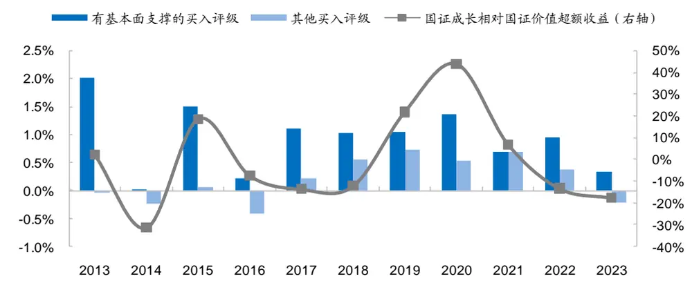
资料来源：Wind，朝阳永续，海通证券研究所

不过，在 2019-2021 年成长风格显著优于价值风格的环境下，即使没有基本面支撑，买入评级报告发布后 1个月的月均溢价仍超过 0.5%，且统计显著。但在其他成长风格并不显著占优的阶段，失去基本面支撑后，买入评级因子的溢价表现相当一般。

综合表 2-3的结果，我们认为，2023 年买入评级因子的溢价下滑至 0附近，可能在一定程度上与连续买入评级、没有基本面支撑的买入评级的因子溢价为负有关。因此，我们尝试将这两个部分从原始因子中剥离，构建新增且有基本面支撑的买入评级因子。

下表展示了该因子及其他买入评级因子（全部买入评级与新增且有基本面支撑买入评级的差集）的溢价表现。2013-2020 年，两个因子的溢价接近；但近 3 年，新增且有基本面支撑的买入评级因子的溢价显著优于其他买入评级因子。尤其是 2023 年，前者溢价为正，而后者为负，差异更为明显。

表 4 新增且有基本面支撑的买入评级因子溢价表现（2013.01-2023.09）

|  | 买入评级类型 | 月均溢 价 | 溢价波 动率 | ICIR | p值 | 胜率 | 覆盖率 |
| --- | --- | --- | --- | --- | --- | --- | --- |
| 2013-2020 | 新增且有基本面支撑 | 0.86% | 5.9% | 1.76 | 0.000 | 66.7% | 8.4% |
|  | 其他 | 0.83% | 5.9% | 1.68 | 0.000 | 67.7% | 15.5% |
| 2021-2023 | 新增且有基本面支撑 | 0.71% | 5.1% | 1.67 | 0.009 | 72.7% | 7.6% |
|  | 其他 | 0.44% | 5.9% | 0.89 | 0.151 | 54.5% | 14.6% |
| 2023 | 新增且有基本面支撑 | 0.55% | 4.4% | 1.51 | 0.227 | 88.9% | 8.3% |
|  | 其他 | -0.15% | 3.4% | -0.53 | 0.657 | 33.3% | 15.1% |

资料来源：Wind，朝阳永续，海通证券研究所

## 2.4其他相关因素

除上述因素外，本文还分析了其他报告相关因素对买入评级因子溢价的影响。如下表所示，过去 个月发布报告篇数越多的分析师，其出具的买入评级报告溢价相对更高。买入评级报告历史溢价越高的分析师，相应的因子溢价也更高。但全区间来看，虽然这些因素都有一定的区分效果，但不同类别分析师的买入评级报告都具有较为显著的正溢价，不宜用作剔除指标。

表 5 分析师因素与买入评级因子溢价表现（2013.01-2023.09）

| 影响因素 |  | 月均溢价 | 溢价波动率 | ICIR | t值 | p值 | 胜率 | 覆盖率 |
| --- | --- | --- | --- | --- | --- | --- | --- | --- |
| 过去6个月分 析师撰写报 告篇数 | 最少的1/4 | 0.67% | 6.9% | 1.16 | 3.82 | 0.000 | 63.6% | 4.3% |
|  | (1/4,3/4] | 0.77% | 5.0% | 1.82 | 5.96 | 0.000 | 69.8% | 18.0% |
|  | 最多的1/4 | 0.78% | 5.5% | 1.69 | 5.55 | 0.000 | 69.0% | 20.5% |
| 买入报告历 史超额收益 | 最低的1/4 | 0.52% | 6.0% | 1.04 | 3.40 | 0.001 | 65.9% | 10.8% |
|  | (1/4,3/4] | 0.76% | 5.4% | 1.68 | 5.51 | 0.000 | 67.4% | 20.7% |
|  | 最高的1/4 | 0.84% | 5.6% | 1.81 | 5.94 | 0.000 | 73.6% | 11.3% |

资料来源：Wind，朝阳永续，海通证券研究所

买入评级报告篇数也会影响因子溢价。我们发现，至少有 篇买入评级报告覆盖的个股对应的因子溢价更高；而只有 1篇买入评级报告覆盖的个股，因子溢价相对偏低，但波动率也更低。但全区间内，两者的溢价均显著高于 0。

表 6 买入评级报告篇数与买入评级因子溢价表现（2013.01-2023.09）

| 买入评级 报告篇数 | 月均溢价 | 溢价波动率 | ICIR | t值 | p值 | 胜率 | 覆盖率 |
| --- | --- | --- | --- | --- | --- | --- | --- |
| 1篇 | 0.43% | 4.1% | 1.27 | 4.16 | 0.000 | 62.8% | 10.5% |
| 至少2篇 | 0.80% | 5.8% | 1.66 | 5.44 | 0.000 | 69.8% | 13.7% |

资料来源：Wind，朝阳永续，海通证券研究所

## 2.5 小结

本节我们考察了报告类型、是否新增买入、是否有基本面支撑、买入评级报告篇数、出具买入评级的分析师特点等因素，对买入评级因子选股效果的影响。

报告类型上，买入评级报告以深度和点评报告为主，且 2013 年以来，这两类报告在买入评级报告中的合计占比持续增加。截至 2023 年，两者合计占比已超过 90%。从选股效果来看，深度报告具有最高的截面溢价，其次为点评报告。一般个股报告和调研报告的溢价相对较低，尤其是 2021 年以来，这两类报告的月度因子溢价显著降低。

受报告发布时间与事件发生之间的时滞影响，2023 年连续买入评级因子的溢价略微为负；而新增买入评级因子仍具有较为明显的正溢价，大于零的月份占比为 66.7%。

有基本面支撑的买入评级因子历史溢价表现显著优于没有基本面支撑的因子。2013.01-2023.09 期间，前者月均溢价 0.95%，而后者仅 0.22%；2023 年，前者月均溢价为正，而后者为负。

其他可能影响买入评级因子溢价表现的因素还包括，分析师发布的报告篇数和每个股票对应的买入评级报告数量。分析师过去 个月发布的报告篇数越多或历史买入评级报告的溢价越高，则相应的买入评级因子的未来溢价也更高。至少有 2 篇买入评级报告覆盖的股票，溢价高于只有 1 篇买入评级报告覆盖的。虽然以上两个因素都有一定区分效果，但全区间内不论怎么划分都能获得溢价一致为正的因子，故不宜作为剔除标准。

综上所述，我们认为，2023 年以来，基于全部买入评级报告所构建的买入评级因子表现走平（图 14），有多方面因素影响，如报告类型、报告发布时滞变化等。但如果能更精细地筛选买入评级报告，则相应的因子仍有较为显著的选股收益。例如，基于深度和点评报告构建的新增且有基本面支撑的买入评级因子，2023 年以来月均溢价 0.55%，月胜率 88.9%，ICIR 高于 1.5。

图14 不同买入评级因子 2022 年下半年以来的累计溢价（2022.07-2023.09）
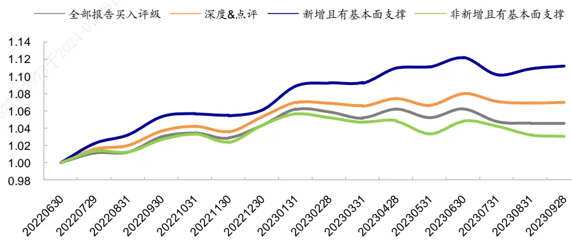
资料来源： ，朝阳永续，海通证券研究所

## 3. 利用买入评级因子优选大市值个股

由上文可知，新增且有基本面支撑的买入评级报告对应的买入评级因子，溢价较高。尤其是 年以来，溢价表现明显优于其他买入评级报告。但该因子的覆盖度不高（因子值为 的个股占比仅 左右），如果加入全部 股的多因子模型，能提供的边际信息较少。但在限定选股池的情况下，该因子特有的信息就会变得有价值；因此，我们认为，改进后的买入评级因子或许更适合用于在特定选股池中构建风格类的 组合。

另一方面，买入评级报告在大盘股中的覆盖度更高。如图 15 所示，新增且有基本面支撑的买入评级报告，在市值最大的 个股中的占比，显著高于市场分布。同时，图 显示，该因子在大市值股票中的覆盖度更高。因此，本节尝试在大盘选股策略中应用改进后的买入评级因子。

图15 新增且有基本面支撑的买入评级个股的市值分布（2013.01-2023.09）
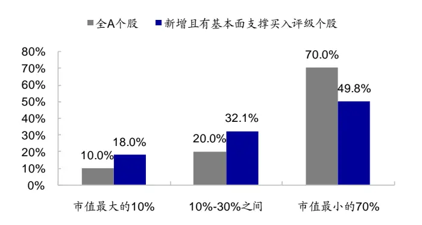
资料来源：Wind，朝阳永续，海通证券研究所

图16 新增且有基本面支撑买入评级因子在不同市值股票中的覆盖度（2013.01-2023.09）
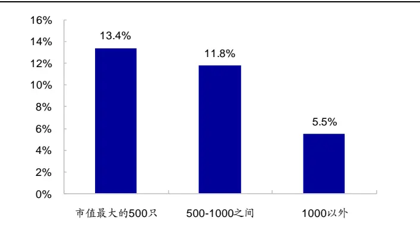
资料来源：Wind，朝阳永续，海通证券研究所

分析师覆盖度（过去 3 个月分析师出具的报告总篇数）与买入评级因子都为离散型变量，反映了分析师不同的观点。前者为整个分析师群体的关注程度，后者为分析师的评级判断。因此，我们将两者等权复合，构建分析师观点因子。

在全 A市值最大的 400 只股票中，等权复合价值、盈利、增长、累计研发投入占比、预期净利润调整、分析师观点、低波低换手、反转、尾盘成交占比、开盘后大单净买入金额占比 个因子，月度换仓，选择复合因子得分最高的 只股票构建市值加权组合（限制单只个股权重上限 10%）。按照这种方式构建的组合，我们简称为大盘优选组合。扣除单边千 3的交易费用后，其业绩表现如表 7所示。

其中，价值因子为无形资产调整的 与最新 的等权复合；盈利因子为单季度ROE 同比变化/过去 4 期 ROE 同比变化波动率；增长因子为 SUE与 EAV的等权复合；低波低换手因子为低波动率与低换手率的等权复合。

表 7 大盘优选组合业绩表现（2013.01-2023.09）

| 沪深300 |  | 不加分析师观点因子 |  |  |  |  | +分析师观点因子 |  |  |  |  |
| --- | --- | --- | --- | --- | --- | --- | --- | --- | --- | --- | --- |
|  |  | 组合收益 | 超额收益 | 超额波动 率 | 信息比 | 相对回撤 | 组合收益 | 超额收益 | 超额波动 率 | 信息比 | 相对回撤 |
| 2013 | 指数 -13.3% | -5.1% | 8.2% | 7.1% | 1.41 | 4.2% | -2.2% | 11.1% | 7.3% | 1.84 | 3.9% |
| 2014 | 51.7% | 62.5% | 10.8% | 6.2% | 1.15 | 6.8% | 66.2% | 14.5% | 5.9% | 1.61 | 6.7% |
| 2015 | 5.6% | 33.9% | 28.3% | 11.9% | 2.16 | 6.0% | 33.9% | 28.4% | 11.5% | 2.23 | 7.1% |
| 2016 | -11.3% | 0.6% | 11.8% | 6.8% | 1.98 | 3.6% | 1.0% | 12.3% | 6.4% | 2.12 | 3.6% |
| 2017 | 21.8% | 32.2% | 10.4% | 5.4% | 1.59 | 2.9% | 36.8% | 15.1% | 5.8% | 2.12 | 2.3% |
| 2018 | -25.3% | -11.9% | 13.4% | 6.4% | 2.68 | 3.2% | -14.5% | 10.8% | 6.2% | 2.27 | 2.9% |
| 2019 | 36.1% | 39.7% | 3.7% | 5.5% | 0.49 | 5.6% | 48.4% | 12.4% | 5.7% | 1.55 | 5.0% |
| 2020 | 27.2% | 45.3% | 18.1% | 6.7% | 2.07 | 4.1% | 52.9% | 25.7% | 7.4% | 2.60 | 5.1% |
| 2021 | -5.2% | 10.9% | 16.1% | 11.7% | 1.34 | 8.0% | 8.2% | 13.4% | 9.9% | 1.33 | 6.8% |
| 2022 | -21.6% | -8.8% | 12.8% | 8.2% | 1.87 | 5.8% | -10.4% | 11.2% | 7.8% | 1.77 | 4.0% |
| 2023 | -4.7% | -0.4% | 4.3% | 6.6% | 0.93 | 4.0% | 0.0% | 4.7% | 5.9% | 1.14 | 4.1% |
| 全区间 | 3.0% | 16.2% | 13.2% | 7.8% | 1.60 | 8.0% | 17.6% | 14.6% | 7.5% | 1.85 | 7.1% |

资料来源：Wind，朝阳永续，海通证券研究所

2013.01-2023.09，大盘优选组合年化收益 17.6%，而同期沪深 300 指数年收益3.0%，组合相对沪深 300 指数年化超额 14.6%，月胜率 72.7%。与未加入分析师观点因子的大盘优选组合相比，加入该因子后，组合年化收益提升 1.5%，同时超额波动率、相对回撤都有所降低。

分年度来看，绝大部分年份中（占比 72.7%），加入分析师观点因子均可提升大盘优选组合的超额收益，相对于沪深 300 指数的超额收益分布也更加均匀。除 2023 年外，其余年份的超额收益均超过 10%。

按照如上方式构建的大盘优选组合，相对沪深 300 指数，在低估值和高增长上具有正向暴露（图 17）。即，该组合呈现 GARP（价值成长）风格。

得益于这一特征，组合在价值风格强的月份，超额收益更高；但是在成长风格强的月份，也具备显著的正向超额收益，月度均值 （图 ）。其中，成长风格强是指，国证成长指数优于国证价值指数的月份；反之，即为价值风格强。

图17 大盘优选组合相对沪深 300 指数的平均风格暴露（2013.01-2023.09）
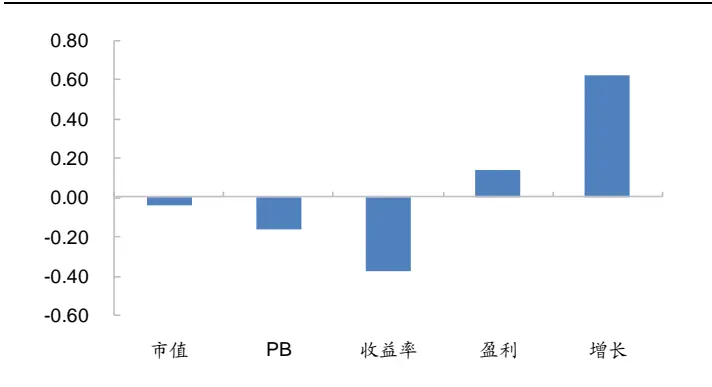
资料来源：Wind，朝阳永续，海通证券研究所

图18 价值、成长风格与大盘优选组合的月均超额收益（2013.01-2023.09）
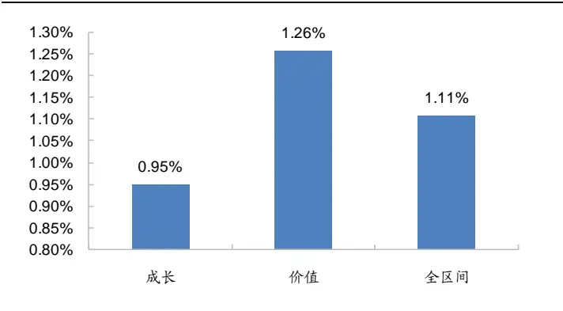
资料来源：Wind，朝阳永续，海通证券研究所

如图 17所示，组合在高增长因子上的暴露最高。因此，我们统计了增长因子收益为正和为负的月度，大盘优选组合相对沪深 300 指数的超额收益表现，具体如表 8所示。从中可见，在增长因子有效（收益为正）的阶段，组合超额收益明显更高，月度均值达1.24%，稳定性也更好。但在增长因子失效（收益为负）的阶段，组合也有显著为正的超额收益。我们认为，这可能源于选股模型中其他因子的贡献，使得组合虽然在高增长因子上有最高的暴露，但并不会被其完全支配。

表 8 增长因子收益与大盘优选组合的月均超额收益（2013.01-2023.09）

| 26日 |  | 月均超额 | 月胜率 | t值 | p值 |
| --- | --- | --- | --- | --- | --- |
| 全区间 |  | 1.11% | 72.7% | 6.02 | 0.000 |
|  | 收益>0 | 1.24% | 75.8% | 5.96 | 0.000 |
|  | 收益<0 | 0.78% | 64.9% | 2.07 | 0.045 |

资料来源：Wind，朝阳永续，海通证券研究所

接下来，我们对选股池、组合持股数量、个股权重上限这 3 个参数进行敏感性测试。具体地，

- 选股池：分别为全 A市值最大的 300/400/500 只股票；

- 组合持股数量：top50/top100；

- 个股权重上限：5%/10%。

不同参数下，按照前述多因子选股方法构建的大盘优选组合的业绩表现如表 9所示。显然，加入分析师观点因子都能提升大盘优选组合的收益，同时降低超额波动率和相对回撤。因而，相应的收益风险比都能得到较为明显的改善。

表 9 选股池、选股数量和权重上限对大盘优选组合超额收益表现的影响（2013.01-2023.09）

| 选股池 | 选股数 | 个股权重上限 |  | 超额收益 | 超额波动率 | 信息比 | 相对回撤 | 月胜率 |  |
| --- | --- | --- | --- | --- | --- | --- | --- | --- | --- |
| 市值最大 top300 | top50 | 10% | 对照组 | 10.2% | 7.3% | 1.34 | 9.0% | 68.8% |  |
|  |  |  | +分析师观点 | 11.1% | 6.9% | 1.55 | 7.2% | 69.5% |  |
|  |  |  | 对照组 | 9.9% | 6.6% | 1.44 | 7.0% | 65.6% |  |
|  |  | 5% 5% | +分析师观点 | 11.3% | 6.5% | 1.67 | 6.5% | 71.1% |  |
|  |  |  | 对照组 | 7.6% | 5.2% | 1.40 | 9.0% | 63.3% |  |
|  | 市值最大 top400 | top100 top50 | 10% | +分析师观点 | 8.5% | 4.9% | 1.69 | 6.7% | 65.6% |
| 对照组 |  |  |  | 13.2% | 7.8% | 1.60 | 8.0% | 71.9% |  |
|  |  |  | +分析师观点 | 14.6% | 7.5% | 1.85 | 7.1% | 72.7% |  |
|  |  | 5% | 对照组 | 13.0% | 7.7% | 1.61 | 8.8% | 73.4% |  |
| top100 |  | 5% | +分析师观点 | 14.1% | 7.6% | 1.78 | 7.8% | 71.9% |  |
|  |  |  | 对照组 | 8.4% | 5.8% | 1.40 | 9.0% | 68.8% |  |
| 市值最大 top500 | top50 | 10% | +分析师观点 | 8.9% | 5.5% | 1.58 | 6.7% | 69.5% |  |
|  |  |  | 对照组 | 12.4% | 8.2% | 1.44 | 13.5% | 65.6% |  |
|  |  | 5% | +分析师观点 | 15.0% | 8.1% | 1.76 | 11.1% | 72.7% |  |
|  |  |  | 对照组 | 12.3% | 8.5% | 1.40 | 14.3% | 68.8% |  |
|  | top100 | 5% | +分析师观点 | 14.5% | 8.4% | 1.66 | 12.9% | 71.1% |  |
|  |  |  | 对照组 | 9.4% | 6.3% | 1.43 | 9.1% | 67.2% |  |
|  |  | +分析师观点 | 10.5% | 6.1% | 1.64 | 6.1% | 69.5% |  |  |

资料来源：Wind，朝阳永续，海通证券研究所

若要增加收益，可扩大选股池范围，纳入一些市值相对较小的股票。例如，在持有50 只股票、个股最大权重上限为 10%的参数下，选股池由市值最大的 300 只股票扩容至 500 只股票，年化超额收益可由 11.1%增加至 15.0%。

若要降低超额波动率和回撤，可降低个股集中度。例如，在市值最大的 500 只股票中，选择复合因子得分最高的 100 只股票构建优选组合，且设臵个股最大权重上限 5%，则组合相对沪深 300 指数的年化超额波动率为 6.1%，最大相对回撤 6.1%。当然，超额收益也小幅下降至 10.5%，但信息比仍高于 1.5。而且，2013-2023 年每一年均可取得正超额收益（表 10）。

表 10大盘优选组合的超额收益表现（top500 中选股/top100/权重上限 5%，2013.01-2023.09）

|  | 组合收益 | 沪深 300 指数 | 超额收益 | 超额波动 率 | 信息比 | 相对回撤 | 月胜率 |
| --- | --- | --- | --- | --- | --- | --- | --- |
| 2013 | -5.3% | -13.3% | 8.0% | 6.0% | 1.63 | 3.1% | 58.3% |
| 2014 | 59.3% | 51.7% | 7.7% | 4.5% | 1.13 | 3.1% | 66.7% |
| 2015 | 38.0% | 5.6% | 32.4% | 10.1% | 2.82 | 6.1% | 83.3% |
| 2016 | -5.4% | -11.3% | 5.9% | 5.7% | 1.26 | 3.4% | 75.0% |
| 2017 | 31.7% | 21.8% | 9.9% | 4.8% | 1.69 | 2.7% | 58.3% |
| 2018 | -17.1% | -25.3% | 8.2% | 4.9% | 2.23 | 2.3% | 83.3% |
| 2019 | 39.5% | 36.1% | 3.5% | 4.0% | 0.63 | 4.5% | 50.0% |
| 2020 | 39.0% | 27.2% | 11.7% | 5.1% | 1.84 | 2.8% | 75.0% |
| 2021 | 8.4% | -5.2% | 13.6% | 8.3% | 1.61 | 5.6% | 50.0% |
| 2022 | -14.8% | -21.6% | 6.8% | 6.1% | 1.38 | 3.8% | 83.3% |
| 2023 | 0.1% | -4.7% | 4.8% | 4.9% | 1.38 | 3.3% | 77.8% |
| 全区间 | 13.5% | 3.0% | 10.5% | 6.1% | 1.64 | 6.1% | 69.5% |

资料来源：Wind，朝阳永续，海通证券研究所

图19 大盘优选组合相对净值走势（top400 中选股/top50/权重上限 10%，2013.01-2023.09）
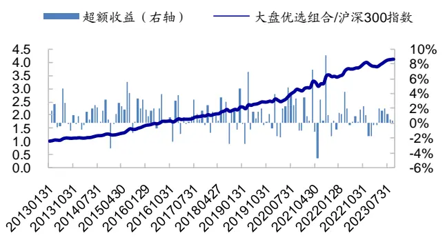
资料来源：Wind，朝阳永续，海通证券研究所

图20 大盘优选组合相对净值走势（top500 中选股/top100/权重上限 5%，2013.01-2023.09）
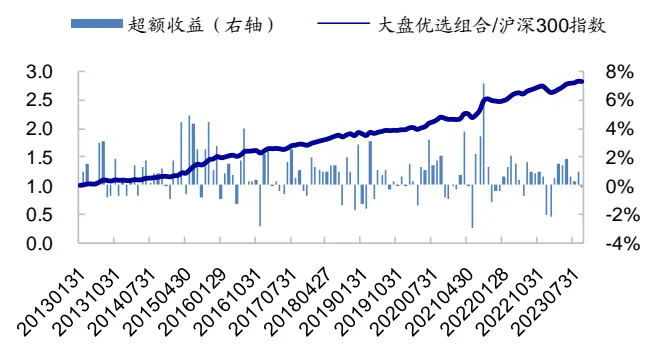
资料来源：Wind，朝阳永续，海通证券研究所

本节尝试在大盘股中，利用新增且有基本面支撑的买入评级因子改善选股策略的业绩表现。回测显示，在不同参数下，加入该因子都能提升大盘优选组合收益，同时降低超额波动率和相对回撤，相应的收益风险比得到较为明显的改善。

2013.01-2023.09，（1）在全 A市值最大的 400 只股票中，选择多因子得分最高的只股票所构建的大盘优选组合年化收益 ，相对沪深 指数年超额 ，月胜率 ，年化跟踪误差和最大相对回撤分别为 和 。（ ）在全 市值最大的 500 只股票中，选择多因子得分最高的 100 只股票所构建的大盘优选组合相对沪深指数年超额 ，月胜率 ，年化跟踪误差和最大相对回撤均为 。

## 4. 总结

2023 年，买入评级因子的表现显著下滑，月均溢价接近于 0（2023.01-2023.09）。针对这一现象，本文统计和分析了可能影响买入评级因子溢价的因素，并设法改善基础买入评级因子的选股表现。进一步，由于买入评级因子在大市值个股中的覆盖率更高，因此我们尝试在大盘选股策略中应用该因子，并基于此构建了大盘优选组合。

报告类型上，买入评级报告以深度和点评报告为主，且 2013 年以来，这两类报告在买入评级报告中的合计占比持续增加。截至 2023 年，两者合计占比已超过 90%。从选股效果来看，深度报告具有最高的截面溢价，其次为点评报告。一般个股报告和调研报告的溢价相对较低，尤其是 2021 年以来，这两类报告的月度因子溢价显著降低。

受报告发布时间与事件发生之间的时滞影响， 年连续买入评级因子的溢价略微为负；而新增买入评级因子仍具有较为明显的正溢价，大于零的月份占比为 66.7%。

有基本面支撑的买入评级因子历史溢价表现显著优于没有基本面支撑的因子。2013.01-2023.09 期间，前者月均溢价 0.95%，而后者仅 0.22%；2023 年，前者月均溢价为正，而后者为负。

综合这些影响因素的分析，我们构建新增且有基本面支撑的买入评级因子。该因子2023 年的月均溢价依然可达 0.55%，月胜率 88.9%，ICIR 为 1.51。但该因子的覆盖度不高（因子值为 1的个股占比仅 8%左右），因此，我们认为，它或许更适合用于在特定选股池中构建风格类的 Smart beta 组合。

大盘优选组合 。 ，在全 市值最大的 只股票中，选择多因子得分最高的 50 只股票所构建的大盘优选组合 1 年化收益 17.6%，相对沪深 300 指数年超额 14.6%，月胜率 72.7%，年化跟踪误差和最大相对回撤分别为 7.5%和 7.1%。

大盘优选组合 2。2013.01-2023.09，在全 A 市值最大的 500 只股票中，选择多因子得分最高的 100 只股票所构建的大盘优选组合 2，相对沪深 300 指数年超额 10.5%，月胜率 69.5%，年化跟踪误差和最大相对回撤均为 6.1%。

## 5. 风险提示

模型误设风险、历史统计规律失效风险、因子失效风险。

# 信息披露

分析师声明

[Table冯佳睿yst金融工程研究团队s]

罗蕾金融工程研究团队

本人具有中国证券业协会授予的证券投资咨询执业资格，以勤勉的职业态度，独立、客观地出具本报告。本报告所采用的数据和信息均来自市场公开信息，本人不保证该等信息的准确性或完整性。分析逻辑基于作者的职业理解，清晰准确地反映了作者的研究观点，结论不受任何第三方的授意或影响，特此声明。

## 法律声明

本报告仅供海通证券股份有限公司（以下简称“本公司”）的客户使用。本公司不会因接收人收到本报告而视其为客户。在任何情况下，本报告中的信息或所表述的意见并不构成对任何人的投资建议。在任何情况下，本公司不对任何人因使用本报告中的任何内容所引致的任何损失负任何责任。

本报告所载的资料、意见及推测仅反映本公司于发布本报告当日的判断，本报告所指的证券或投资标的的价格、价值及投资收入可能载会波动。在不同时期，本公司可发出与本报告所载资料、意见及推测不一致的报告。

市场有风险，投资需谨慎。本报告所载的信息、材料及结论只提供特定客户作参考，不构成投资建议，也没有考虑到个别客户特殊的可投资目标、财务状况或需要。客户应考虑本报告中的任何意见或建议是否符合其特定状况。在法律许可的情况下，海通证券及其所属不关联机构可能会持有报告中提到的公司所发行的证券并进行交易，还可能为这些公司提供投资银行服务或其他服务。用

本报告仅向特定客户传送，未经海通证券研究所书面授权，本研究报告的任何部分均不得以任何方式制作任何形式的拷贝、复印件或内复制品，或再次分发给任何其他人，或以任何侵犯本公司版权的其他方式使用。所有本报告中使用的商标、服务标记及标记均为本公本司的商标、服务标记及标记。如欲引用或转载本文内容，务必联络海通证券研究所并获得许可，并需注明出处为海通证券研究所，且仅不得对本文进行有悖原意的引用和删改。载，

根据中国证监会核发的经营证券业务许可，海通证券股份有限公司的经营范围包括证券投资咨询业务。日

## 海通证券股份有限公司研究所[Table_PeopleInfo]

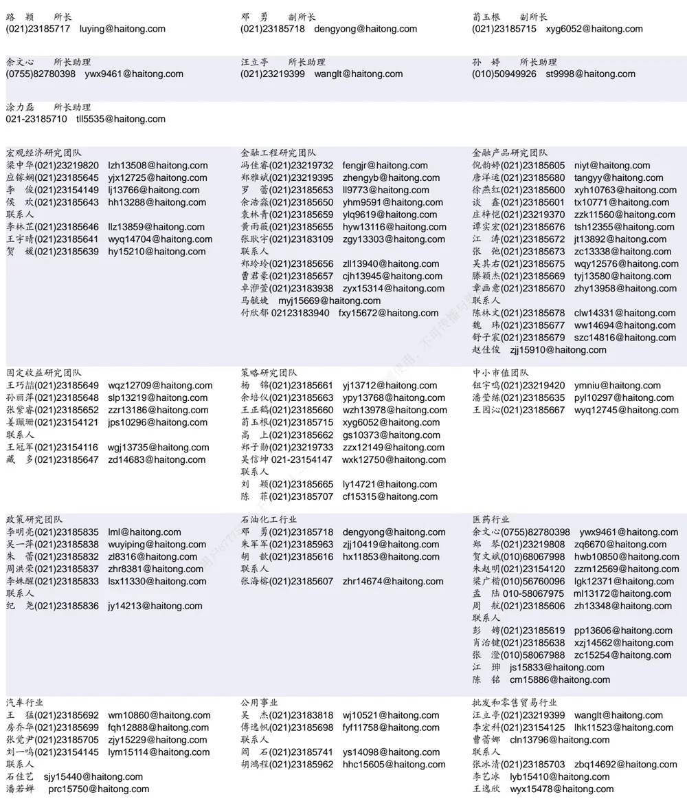

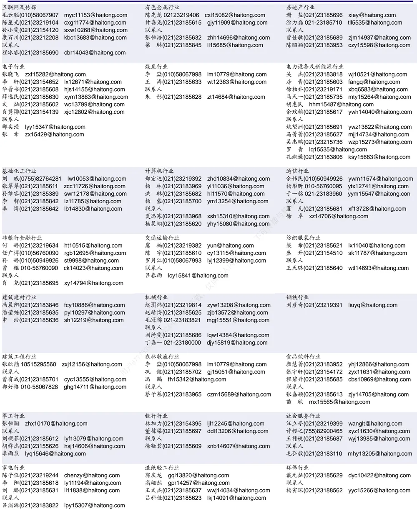

## 研究所销售团队

深广地区销售团队

伏财勇(0755)23607963 fcy7498@haitong.com

蔡铁清(0755)82775962 ctq5979@haitong.com

辜丽娟(0755)83253022 gulj@haitong.com

刘晶晶(0755)83255933 liujj4900@haitong.com

饶 伟(0755)82775282 rw10588@haitong.com

欧阳梦楚(0755)23617160

oymc11039@haitong.com

巩柏含 gbh11537@haitong.com

张馨尹 0755-25597716 zxy14341@haitong.com

海通证券股份有限公司研究所

地址：上海市黄浦区广东路 689号海通证券大厦 9楼

电话：（021）23219000

网址：www.htsec.com 传真：（021）23219392 上海地区销售团队 胡雪梅(021)23219385 huxm@haitong.com 黄 诚(021)23219397 hc10482@haitong.com 季唯佳(021)23219384 jiwj@haitong.com 黄 毓(021)23219410 huangyu@haitong.com 胡宇欣(021)23154192 hyx10493@haitong.com 马晓男 mxn11376@haitong.com 邵亚杰 23214650 syj12493@haitong.com 杨祎昕(021)23212268 yyx10310@haitong.com 毛文英(021)23219373 mwy10474@haitong.com 谭德康 tdk13548@haitong.com 王祎宁(021)23219281 wyn14183@haitong.com 张歆钰 zxy14733@haitong.com 周之斌 zzb14815@haitong.com

北京地区销售团队
殷怡琦(010)58067988 yyq9989@haitong.com
董晓梅 dxm10457@haitong.com
郭 楠 010-5806 7936 gn12384@haitong.com
张丽萱(010)58067931 zlx11191@haitong.com
郭金垚(010)58067851 gjy12727@haitong.com
高 瑞 gr13547@haitong.com
上官灵芝 sglz14039@haitong.com
姚 坦 yt14718@haitong.com