## [Tab相关研究

Table_ReportInfo]《上证 50 的“价值”，深证 50 的“成长”：龙头指数的沉稳与飞扬》2023.11.15

《选股因子系列研究（八十九）——买入评级因子的改进及其在大盘股优选策略中的应用》2023.10.25

《A股蓄势期，布局选龙头——关注中国 潜在的估值修复机会》2023.10.16

分析师:冯佳睿

Tel:(021)23219732

Email:fengjr@haitong.com

证书:S0850512080006

分析师:罗蕾

Tel:(021)23185653

Email:ll9773@haitong.com

证书:S0850516080002

# 选股因子系列研究（九十）——理解红利投资，加入红利投资，超越红利投资

## 投资要点：

2022 年以来，A 股市场震荡下行。截至 2023Q3，市场（国证 1000 指数，下同）累计下跌 25.0%。在这样的背景下，红利投资因其突出的抗跌能力，而受到广泛关注。红利类产品的规模也由 2021 年底的 907.4 亿元，增加至 2023Q3 的 1104.7 亿元，增幅高达 。

- 红利投资是指投资于能够带来稳定和丰厚现金红利的上市公司的策略。其中，资本利得和股息收入是红利投资的两种回报来源。我们认为，红利投资可以获得稳定的现金分红，有效提升组合业绩和稳定性。此外，股息支付率高的公司盈利状况更加成熟稳定。同时，估值较低，安全边际高，预期收益的波动相对较小，抗风险能力强。

- 红利投资潜在的适用人群。中证红利指数中长期业绩较优，波动和回撤都较小。尤其是当基金整体投资绩效不佳时，能够成为分散风险的有利工具，具备很强的防御属性。但作为同一枚硬币的另一面，中证红利指数的收益弹性较弱。个别年份，如 2019-2020 年，年度收益不及偏股混合型基金指数的一半。因此，我们认为，红利投资适合那些对收益弹性要求不高、可以承受短期业绩增长较慢的心理压力、但追求中长期资产稳健增值的投资者。

- 红利投资可能的适用环境。当美债利率上行或市场波动放大时，避险情绪推动资金从成长性资产转向价值型资产，此时红利投资具备较高的性价比。不仅月均收益为正，且显著优于成长风格。当社融同比下降时，红利投资相对成长风格同样是较优的选择。

- 3 种“红利+”策略：（1）红利指数增强组合、（2）红利属性较强的红利+策略：“红利+成长”、“红利+低波”；（3）红利属性较弱的“红利+分红潜力”策略。5甘其中，红利指数增强组合相对基准的风控较为严格，而后两者脱离了风控模型。从相对业绩表现来看，指数增强框架下的组合跟踪基准较为紧密，而脱离风控模型的“红利+”策略超额收益更为可观。

- 高分红属性较强的红利+成长和红利+低波策略具备很好的防御性。2019 年以来，每一年的回撤都小于 20%。若站在绝对收益的角度，则 2013 年至今，除 2018年收益为负外，其余年份皆为正收益。

- “杠铃式”配臵。若按 4:6 的比例混合高防御性的红利+成长组合与高收益弹性的小市值高增长组合，可使得分年度收益更加稳健。年度再平衡的“杠铃式”组合，2013 年以来，年化收益高达 33.1%。除 2018 年收益为负以外，其余年份的收益率都超过 10%，收益分布相较单一组合更加均匀。

“固收 ”组合。以红利 策略作为股票端的“固收 ”组合，时间序列收益稳定性显著高于沪深 300 指数。特别是红利+低波策略，2013 年以来，以其作为股票端的 10-90 中枢“固收+”组合，除 2016 年收益为 1.6%以外，其余年份均不低于 3%，且 2017 年以来每一年的回撤都小于 1.5%。

- 风险提示。模型误设风险、历史统计规律失效风险、因子失效风险。

2022 年以来，A股市场震荡下行。截至 2023Q3，市场（国证 1000 指数，下同）累计下跌 25.0%。在这样的背景下，红利投资因其突出的抗跌能力，而受到广泛关注。红利类产品的规模也由 2021 年底的 907.4 亿元，增加至 2023Q3 的 1104.7亿元，增幅高达 21.7%。那么，红利投资究竟具备哪些独特的优势，更加适合怎样的环境；实际投资中，除了红利类的被动指数产品，是否可以构建兼顾高分红和上涨弹性的“红利 ”组合。针对这些问题，本文进行了系统的梳理和总结，以供关注红利策略的投资者参考。

## 1. 理解红利投资

## 1.1 红利投资的概念和优势

红利投资通常是指，投资于能带来稳定、丰厚现金红利的上市公司，以期获得现金回报及长期资本回报的策略。资本利得和股息收入是红利投资的两种回报来源，前者取决于股票的二级市场表现。后者通常用股息率表征：股息率 = 现金分红总额/总市值，是构建红利策略时最常用的因子之一。例如，上证红利、中证红利等指数，均是在待选样本池内挑选现金股息率最高的股票，并构建股息率加权组合。

股息率又可以分拆为两个部分，红利支付率和估值 。具体地，股息率 现金分红总额/总市值 =（现金分红总额/净利润）*（净利润/总市值）= 红利支付率/PE。由该等式可知，上市公司的红利支付率越高、估值越低，股息率越高。其中，红利支付率是指，以现金红利的形式分配给股东的金额占公司净利润的比例。

我们认为，红利投资具有以下优势。

获得稳定的现金分红，提升组合业绩和稳定性。如图 1所示，中证红利指数的股息率显著高于沪深 300 指数。尤其是 2021 年以来，两者差距更明显。截至2023.09，中证红利指数的股息率（过去 12 个月）为 5.84%，远高于沪深 300指数的 3.04%。稳定的股息率给红利投资贡献了显著的收益。2013 年以来，中证红利指数累计上涨 118.3%。考虑分红再投资的中证红利全收益指数累计上涨 248.6%（图 2），稳定分红的收益贡献甚至高于资本利得。

图1 中证红利和沪深 300指数的历史股息率（过去 12个月）
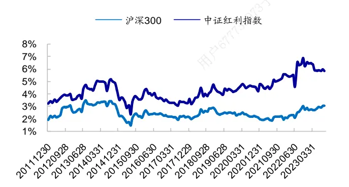
资料来源：Wind，海通证券研究所

图2 中证红利及其全收益指数的历史净值走势
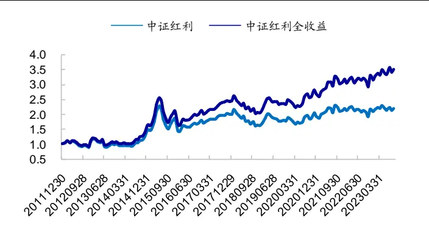
资料来源：Wind，海通证券研究所

红利支付率高的上市公司，经营相对成熟稳定，年度利润波动小。我们以过去5 年年净利润均值/标准差这个指标反映公司的盈利稳定性。图 3展示了 2022年度不同红利支付率的公司过去 5年（2018-2022）的平均盈利稳定性。其中，D1-D3 为 2022 年有现金分红的公司，D1为红利支付率最低的 1/3 股票，D3为红利支付率最高的 1/3 股票。显然，红利支付率越高，盈利越稳定。

估值低的公司，整体安全边际高，收益率的波动较小，抗风险能力强。我们在每年 4月底，根据公司的 PE将所有股票从小到大等分为 5 组（对应 D1-D5），统计每组股票未来1年根据月收益率计算的平均年化波动率，结果如图4所示。从中可见，估值越低，股票预期收益的波动越小。

图3 2022 年红利支付率分组公司的过去 5 年盈利稳定性（2018-2022）
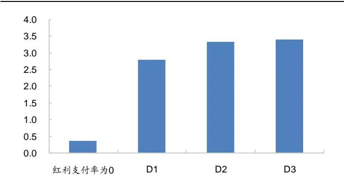
资料来源：Wind，海通证券研究所

图4 PE 分 组 股 票 未 来 1 年 的 月 收 益 波 动 率（2013.05-2023.09）
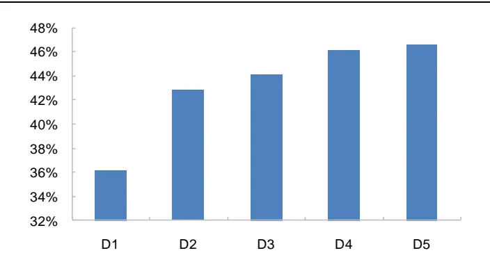
资料来源： ，海通证券研究所

综上所述，红利投资是指投资于能够带来稳定和丰厚现金红利的上市公司的策略。其中，资本利得和股息收入是红利投资的两种回报来源。我们认为，红利投资可以获得稳定的现金分红，有效提升组合业绩和稳定性。此外，股息支付率高的公司盈利状况更加成熟稳定。同时，估值较低，安全边际高，预期收益的波动相对较小，抗风险能力强。

## 1.2 海外红利投资的发展与现状

从海外经验来看，近 20 年，美国红利类产品的数量和规模整体呈稳定增长的态势。我们统计 Lipper 中注册地在美国的 ETF和共同基金中，名称包含“div”的产品数量和规模变化1，结果如图 5-6 所示。

图5 美国红利类 ETF的数量及规模
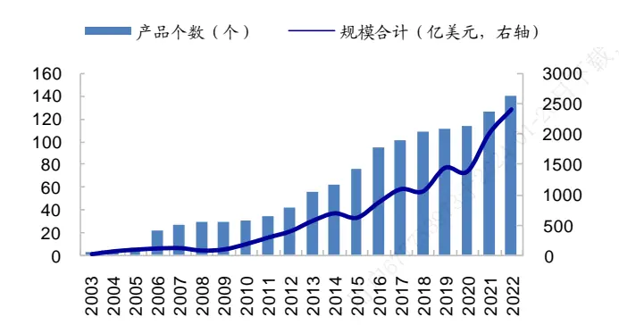
资料来源：Lipper，海通证券研究所

图6 美国红利类共同基金的数量及规模
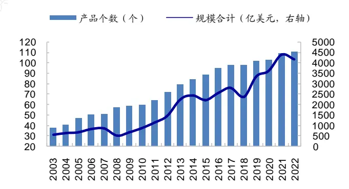
资料来源：Lipper，海通证券研究所

2003 年，红利类产品基本都以共同基金的形式存在。红利 ETF的数量仅 2只，规模合计 亿美元；而红利共同基金的数量为 只，规模合计 亿美元。 年开始，红利类 ETF的数量和规模迅速增长。数量由 2015 年底的 75 只，增加到 2022年底的 只， 年里新发了近 倍的红利类 。规模也由 年的 亿美元，增加了 2.93 倍，至 2022 年底达 2404.8 亿美元。

截至 2022 年底，红利共同基金的数量反而不及 ETF，为 128 只；但合计规模更高，为 4470 亿美元。若将两种产品形式合并统计，则美国红利产品数量共 268 只，总规模6874.8 亿美元。

## 1.3 我国红利投资的发展现状

## 1.3.1 我国上市公司分红状况

如图 7所示，我国上市公司分红总额逐年增加。2022 年度 A股分红总额 2.14 万亿元2，与当年年底的 A股总市值之比为 2.45%。将每年的分红总额除以当年所有公司的净利润总额，计算整体法下 A股的红利支付率。如图 8所示，2022 年底，A股红利支付率为 40.7%。

图7 A股年度分红总额（万亿元，2012-2022）
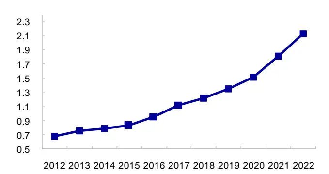
资料来源：Wind，海通证券研究所

图8 A股股息率和红利支付率（整体法）
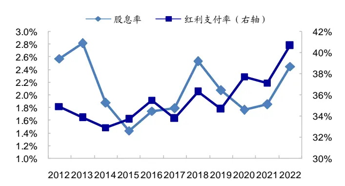
资料来源：Wind，海通证券研究所

2018年以来，A股分红公司占比有所下降，由2017年的80.5%降至2022年的68.3%（图 9）。我们认为，这更多的是由于上市公司数量大幅增加后，盈利（净利润为正）的公司占比下降所致。若以当年盈利的公司中分红公司的占比考察上市公司的分红意愿，则如图 9的红色曲线所示，A股上市公司的分红意愿整体保持稳定，在 83%左右。即，当年盈利的公司，平均有 83%左右进行了现金分红。

2022 财年，

（1）盈利的公司中，分红公司占比 83.3%。即，有 16.7%的公司盈利但未分红，这部分公司的行业分布如图 10 所示。从中可见，与全 A的行业分布相比，这类公司更多的出现在电子、通信、传媒、电力设备和新能源等成长性板块；而医药、食品饮料等消费板块的上市公司，分红意愿通常较高，盈利但未分红的公司占比相对较少。

图9 A 股年度分红公司占比（2012-2022）
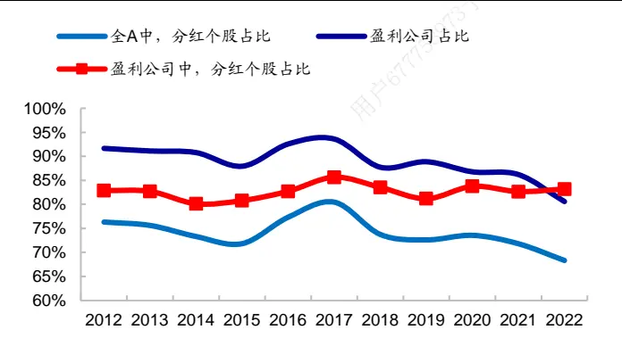
资料来源：Wind，海通证券研究所

图10 2022财年，盈利的公司中，未分红个股的行业分布
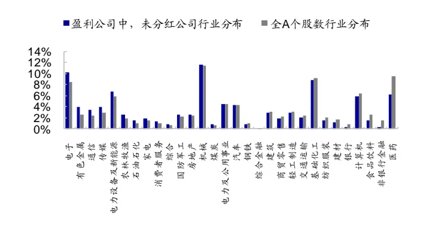
资料来源：Wind，海通证券研究所

（2）A股上市公司的红利支付率分布如图 11 所示。有 31.7%的公司未分红，红利支付率在 0%-40%之间的公司占比 42.5%，24.5%的公司红利支付率超过 40%。特别地，全部 A股中，有 3.4%的公司红利支付率超过 100%，即，现金分红超过其当年净利润。

（3）A股上市公司的股息率（现金分红总额/截至当年年末的总市值）分布如图 12所示。其中，股息率在0%-1%之间的公司占比31.4%，在1%-2%之间的公司占比17.8%；另有 19.0%的公司，股息率超过 2%。

图11 A股红利支付率分布（2022财年）
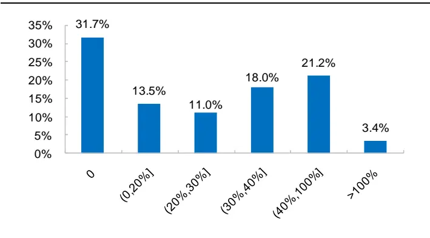
资料来源：Wind，海通证券研究所

图12 A股股息率分布（2022财年）
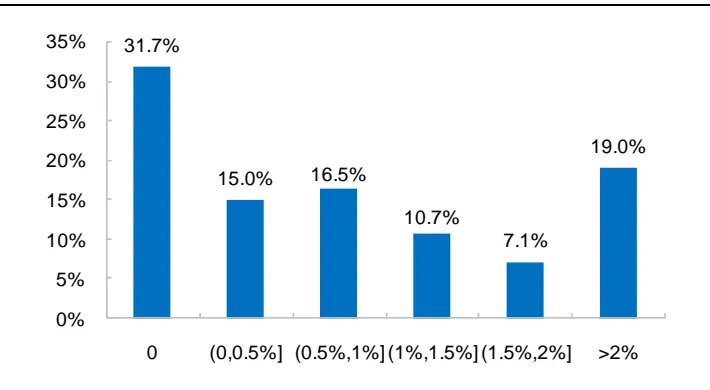
资料来源：Wind，海通证券研究所

（4）红利支付率超过 50%的行业有，食品饮料、通信、煤炭、传媒、纺织服装和家电，分别为 70.3%、58.4%、54.8%、53.9%、53.6%和 51.3%。股息率最高的 6 个行业依次为煤炭（8.7%）、石油石化（6.3%）、银行（6.3%）、通信（3.9%）、家电（3.5%）和交通运输（3.4%）。

图13 各行业红利支付率和股息率（2022财年）
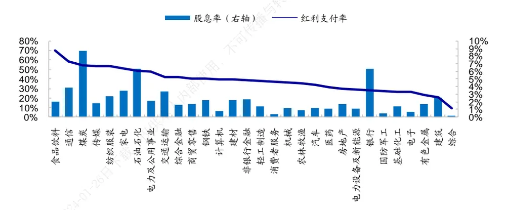
资料来源：Wind，海通证券研究所

高分红公司通常也有较好的延续性。即，过去 1 年分红率高的公司，未来 1 年继续保持高分红的可能性更大，平均股息率也更高。

具体地，我们根据 t-1年的红利支付率（股息率）将 t-1年有分红的公司等分为 5 组，统计每一组公司 t 年的平均红利支付率（股息率）和具备高分红属性的平均概率。其中，高分红属性是指上市公司的红利支付率（或股息率）排名全市场前 20%。

图14 红利支付率和股息率的延续性（2013-2022）
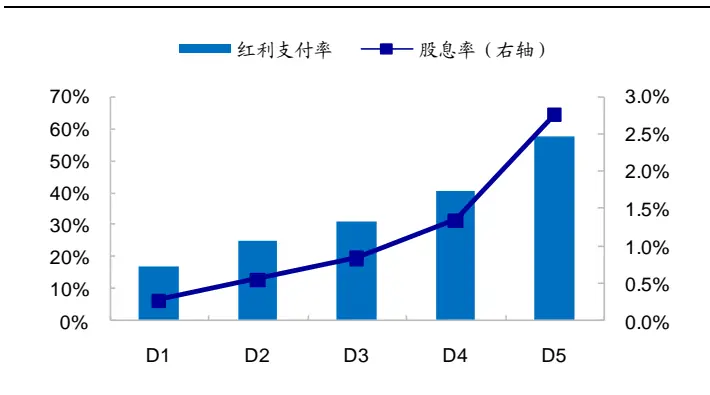
资料来源： ，海通证券研究所

图15 不同红利支付率组别中，出现高分红公司的平均比例（2013-2022）
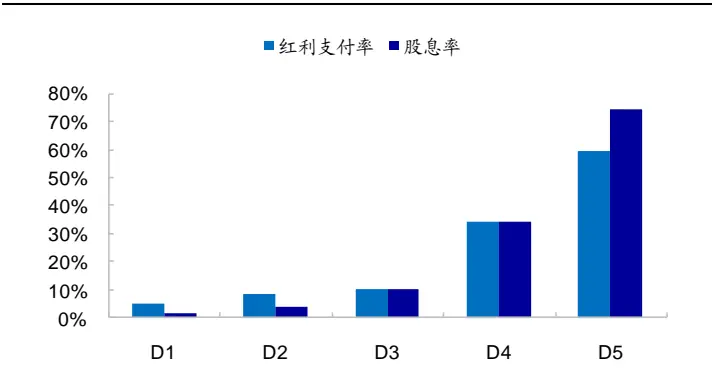
资料来源： ，海通证券研究所

由图 14可见，红利支付率及股息率的延续性都很强。t-1 年红利支付率最高的 20%公司，t年的平均红利支付率为 57.3%，t 年也属于红利支付率最高 20%的概率为 59.5%，两个指标均显著高于其他组别。同样地，t-1 年股息率最高的 20%公司，t 年的平均股息率为 2.8%，t年也属于股息率最高 20%的概率为 74.2%，都显著高于其他组别。

综上所述，2012 年以来，A股盈利的公司中，支付红利的公司占比较为稳定，中枢为 83%左右。2022 年财年，那些盈利但未分红的公司更多地出现在电子、通信、传媒、电力设备和新能源等成长性板块。而医药、食品饮料等消费板块的分红意愿通常较高，盈利但未分红公司的占比相对较少。

股息率和红利支付率是用来刻画公司分红水平的两个常见指标，它们在时间序列上都有较好的延续性。即，过去 1 年分红水平较高的公司，未来 1年继续保持高分红的可能性更大，平均股息率/红利支付率也更高。

## 1.3.2 红利类产品介绍

我们将股票型基金和混合型基金（剔除偏债型）中，业绩比较基准包含“红利”或“股息”字样的基金定义红利类产品，其历史产品数量和规模变化如图 16 所示。目前，国内公募基金中，既有采用高股息策略的主动选股型基金，也有跟踪红利指数的被动型指数基金。截至 2023Q3，市场共有 97 只红利类产品，规模合计 1104.7亿元。其中，成立最早的是中海分红增利（398011），于 2005.06.16 成立，为主动选股基金。

类型上（图 17），红利类产品最早以灵活配臵性基金为主。2010 年起，偏股混合型成为红利产品的主要形式。2019 年以来，被动产品迅速发展，当年新增 9只被动指数型红利产品，2 只增强指数型红利产品。自此，被动指数型基金成为红利产品的主要形式。

图16 红利产品个数及规模变化（2015Q4-2023Q3）
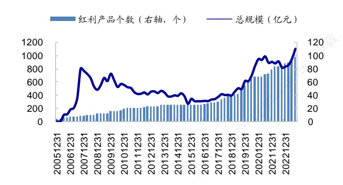
资料来源：Wind，海通证券研究所

图17 红利基金主要产品类型变化（只，2015Q4-2023Q3）
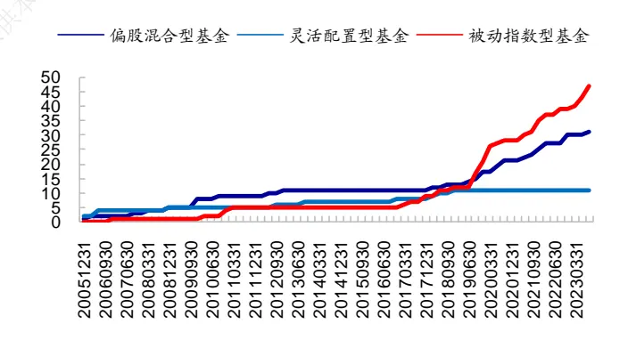
资料来源：Wind，海通证券研究所

如图 18所示，截至 2023Q3，被动指数型红利产品共 47 只，规模总计 566.8 亿元，占所有红利产品总规模之比为 51.3%。偏股混合型、灵活配臵型和增强指数型的规模分列 2-4 位，主动管理的普通股票型红利类基金规模最小。

红利类产品两次规模大幅增长分别发生在 2016 年下半年-2018 年和 2022 年至今。前一个阶段，红利类股票型基金（含被动和增强，下同）的规模由 15.6 亿元增加至 108.0亿元，增幅接近 6 倍，而同期股票型基金总规模仅增加 21.4%。2022 年以来，红利类股票型基金的规模由 400.0 亿元增加至 2023Q3 的 688.4 亿元，增幅为 72.1%，而同期股票型基金总规模仅增加 9.3%。

图18 国内不同类型红利类基金的规模总计（亿元，2023Q3）
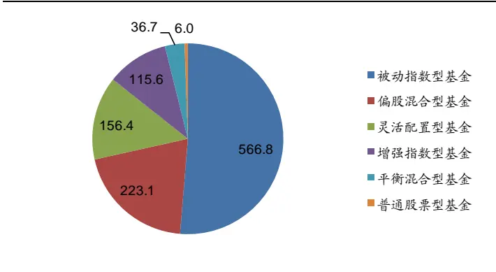
资料来源：Wind，海通证券研究所

图19 红利类股票型基金的规模变化（2010Q4-2023Q3）
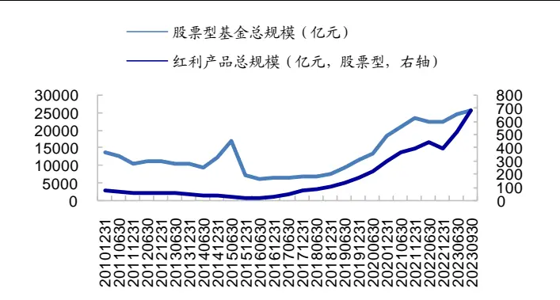
资料来源：Wind，海通证券研究所

红利类产品更受个人投资者偏爱，2023 中报的持有规模占比高达 69.3%。不过，年起，随着被动型红利类产品数量的快速增加，机构持有者的占比显著提升。已由2018 年底的 12%，持续增加至 2023 年中报的 30.7%。其中，指数型产品（含被动和增强）的机构投资者占比最高，平衡混合型的机构投资者占比最低。我们认为，同样是红利投资，机构更倾向于配臵被动型产品，而个人则喜欢持有主动型产品。

图20 红利产品的持有人结构（2010H2-2023H1）
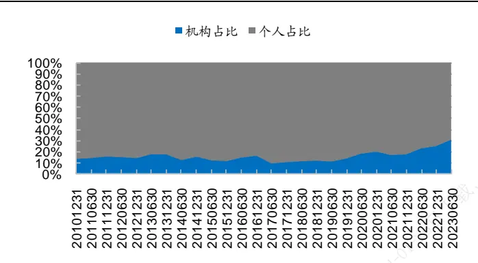
资料来源：Wind，海通证券研究所

图21 2023H1不同类型红利产品的持有人结构
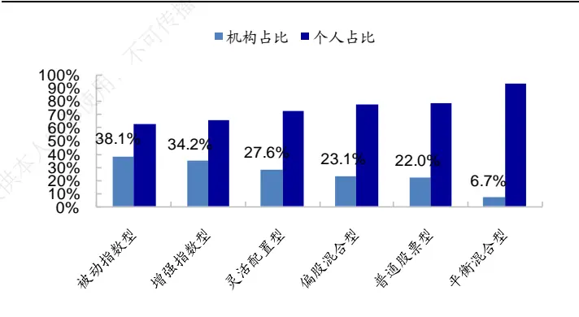
资料来源：Wind，海通证券研究所

## 1.4 小结

红利投资是指投资于能够带来稳定和丰厚现金红利的上市公司的策略。其中，资本利得和股息收入是红利投资的两种回报来源。我们认为，红利投资可以获得稳定的现金分红，有效提升组合业绩和稳定性。此外，股息支付率高的公司盈利状况更加成熟稳定。同时，估值较低，安全边际高，预期收益的波动相对较小，抗风险能力强。

2012 年以来，我国上市公司分红总额逐年增加。2022 年度 A股分红总额 2.14 万亿元，与当年年底的 A股总市值之比为 2.45%。A股盈利的公司中，支付红利的公司占比也较为稳定，中枢为 83%左右。

股息率和红利支付率是用来刻画公司分红水平的两个常见指标，它们在时间序列上都有较好的延续性。即，过去 1 年分红水平较高的公司，未来 1年继续保持高分红的可能性更大，平均股息率/红利支付率也更高。

目前，国内公募基金中，既有采用高股息策略的主动选股型基金，也有跟踪红利指数的被动型指数基金。截至 ，市场共有 只红利类产品，规模合计 亿元。截至 2023Q3，被动指数型红利产品共 47 只，规模总计 566.8 亿元，占所有红利产品总规模之比为 51.3%。2022 年以来，红利类股票型基金的规模由 400.0 亿元增加至2023Q3 的 688.4 亿元，增幅为 72.1%，而同期股票型基金总规模仅增加 9.3%。红利类产品更受个人投资者偏爱，2023 中报的持有规模占比高达 69.3%。不过，2019 年起，随着被动型红利类产品数量的快速增加，机构持有者的占比显著提升。

## 2. 加入红利投资

## 2.1 红利投资适合什么样的投资者

本节以被动指数型红利产品跟踪数量最多的指数——中证红利指数（000922）为例，分析红利策略的收益风险特征，并由此推断红利投资潜在的适用人群。

中证红利指数采用的是最经典、最直接的红利投资模式，即，挑选红利支付率高、股息率高的股票构建组合。具体地，在剔除流动性差的（成交额或市值排名后 20%）股票后，按如下两个步骤筛选成分股。

要求公司过去三年连续现金分红且过去三年股利支付率的均值和过去一年股利支付率均大于 0 且小于 1。

对样本空间内证券，按照过去三年平均现金股息率由高到低排名，选取排名靠前的 100 只上市公司证券作为指数样本。

选出成分股后，按股息率加权，且单只个股的权重不超过 10%；总市值在 100 亿元以下的单只个股，权重不超过 0.5%。

表 1 中证红利指数的历史业绩表现（2013.01-2023.09）

|  | 中证红利 |  | 中证红利全收益 |  | 沪深 300 全收益 |  | 中证 500 全收益 |  | 偏股混合型基金指数 |  |
| --- | --- | --- | --- | --- | --- | --- | --- | --- | --- | --- |
|  | 收益率 | 最大回撤 | 收益率 | 最大回撤 | 收益率 | 最大回撤 | 收益率 | 最大回撤 | 收益率 | 最大回撤 |
| 2013 | -10.2% | 25.4% | -6.7% | 23.9% | -5.3% | 21.2% | 18.1% | 16.5% | 12.7% | 10.6% |
| 2014 | 51.7% | 8.9% | 57.6% | 8.1% | 55.8% | 10.4% | 40.5% | 12.5% | 22.2% | 13.5% |
| 2015 | 26.9% | 44.9% | 29.9% | 44.1% | 7.2% | 42.9% | 43.8% | 50.4% | 43.2% | 43.3% |
| 2016 | -7.6% | 23.9% | -4.3% | 23.9% | -9.3% | 23.5% | -17.2% | 30.8% | -13.0% | 26.4% |
| 2017 | 17.6% | 6.8% | 21.3% | 6.6% | 24.3% | 6.1% | 0.6% | 13.7% | 14.1% | 6.9% |
| 2018 | -19.2% | 29.7% | -16.2% | 27.1% | -23.6% | 30.4% | -32.5% | 36.9% | -23.6% | 27.0% |
| 2019 | 15.7% | 19.5% | 20.9% | 16.2% | 39.2% | 13.1% | 28.1% | 20.6% | 45.0% | 11.8% |
| 2020 | 3.5% | 14.9% | 8.2% | 14.9% | 29.9% | 16.1% | 22.3% | 15.2% | 55.9% | 15.2% |
| 2021 | 13.4% | 15.4% | 18.2% | 15.2% | -3.5% | 17.1% | 17.2% | 9.6% | 7.7% | 16.4% |
| 2022 | -5.5% | 16.3% | -0.4% | 12.6% | -19.8% | 27.5% | -18.9% | 28.9% | -21.0% | 27.3% |
| 2023 | 4.8% | 12.0% | 10.4% | 10.3% | -2.5% | 10.6% | -1.4% | 12.3% | -9.5% | 16.8% |
| 全区间 | 6.9% | 46.5% | 11.3% | 45.7% | 5.9% | 46.1% | 6.5% | 64.1% | 9.3% | 43.3% |

资料来源：Wind，海通证券研究所

如表 1所示，中证红利指数具有较优的长期业绩表现，2013 年以来年化收益 6.9%。而且，由于指数成分股分红率高，因此在股价表现之外，每年还能获得稳定高额的分红。若考虑红利再投资，中证红利全收益指数 2013 年以来年化收益 11.3%，明显优于沪深300 全收益指数和中证 500 全收益指数。

我们认为，高股息通常意味着一家公司拥有较为充裕的现金流，经营相对成熟稳定。而且市场下跌时，高股息能有效改善组合业绩，降低回撤和波动，表现出较好的防御性。但这也意味着组合的成长空间相对较小，收益弹性略有不足。上述两个特征也充分体现在指数的收益风险特征之上。

风险维度，除 年股市异常波动期间也未能幸免外，中证红利指数其余年份的年度回撤均控制在 30%以内。尤其是 2019 年以来，每年的回撤均在 20%以内。以偏股混合型基金指数（885001）反映基金整体的投资情况，统计该指数下跌月份，其余各指数的月均跌幅与 885001 月均跌幅之比，记为下跌捕获比例，用以反映指数的防御性。如表 2所示，中证红利指数的下跌捕获比例为 0.63，不仅大幅低于 1，而且显著小于沪深 300 和中证 500。即，在基金整体投资绩效不佳的情况下，红利指数的跌幅较小，具备较强的防御性，能给投资者带来更好的持有体验。

收益维度，中证红利指数的年度收益鲜少高于 30%。个别年份，如 2019-2020 年，业绩表现显著弱于沪深 300 和中证 500 指数；和偏股混合型基金指数相比，更是不及其年收益的一半。由表 2可见，中证红利指数的上涨捕获比例小于 1，也小于沪深 300 和中证 500 指数。即，在基金整体投资绩效优异的情况下，红利指数的涨幅较小，收益弹性弱于其他指数。

表 2 885001 上涨和下跌月份，中证红利指数的月均收益（2013.01-2023.09）

|  |  | 上涨（样本数：74 个月，占比 57.4%） | 下跌（样本数：55个月，占比 42.6%） 下跌捕获比例 |
| --- | --- | --- | --- |
| 月均收益 | 上涨捕获比例 |  | 月均收益 |
| 中证红利 | 3.4% | 0.74 | -2.9% |
| 中证红利全收益 | 3.8% | 0.82 | -2.5% |
| 沪深 300 全收益 | 4.1% | 0.89 | -3.9% 0.97 |
| 中证 500 全收益 | 4.7% | 1.02 | -4.5% 1.12 |

资料来源：Wind，海通证券研究所

综上所述，中证红利指数中长期业绩较优，波动和回撤都较小。尤其是当基金整体投资绩效不佳时，能够成为分散风险的有利工具，具备很强的防御属性。但作为同一枚硬币的另一面，中证红利指数的收益弹性较弱。个别年份，如 2019-2020 年，年度收益不及偏股混合型基金指数的一半。因此，我们认为，红利投资适合那些对收益弹性要求不高、可以承受短期业绩增长较慢的心理压力、但追求中长期资产稳健增值的投资者。

## 2.2 红利投资适用于什么样的环境

红利投资通常会利用股息率来选股，而股息率取决于红利支付率、估值两个要素。红利支付率高的公司，盈利通常较为稳定，但同时成长空间也相对较小。因此在成长景气风格下，高股息公司的吸引力相对较弱。本节主要从价值、成长的相对角度出发，对红利投资所适合的环境进行分析和探讨。

## 2.2.1 美债利率

价值风格与预期股权回报率变化密切相关。根据 模型，预期股权回报率 上升，会导致股票价格下降；相对而言，价值型股票（类似短久期债券）价格的下降幅度更小，抗跌性更好。即，预期回报率上升时，避险情绪可能推动资金从成长性资产转向价值型资产。此时，经营稳定的高股息（估值低）公司更具吸引力。我们认为，美债利率作为全球资产定价的重要参考指标，可以近似反映预期股权回报率的变化，从而帮助投资者判断红利投资的性价比。

下图展示了 年期美债利率的变化与中证红利指数的累计净值。为平滑短期波动，我们对美债利率做了 日的滚动平均（下同）。另外，为分析红利与成长的相对优势，图中还展示了中证红利相对国证成长指数的累计净值。

图22 2年期美债利率与中证红利指数历史净值走势
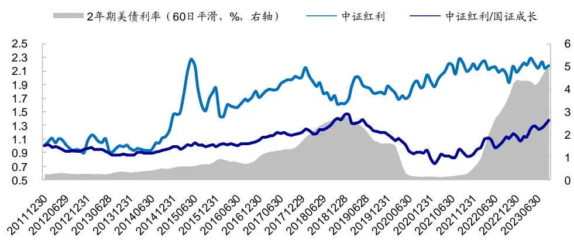
资料来源：Wind，海通证券研究所

由上图可见，美债利率快速上升期，如，2016 年下半年至 2018 年和 2022 年以来，中证红利指数持续优于国证成长指数。即，预期股权回报率上升，高股息公司相对而言更具吸引力。

由于美债利率变化的延续性较强，因此，我们尝试利用当前利率的同比变化，判断未来 1个月的红利/成长风格切换。具体规则为，若当前利率高于 1年前（同比值为正），则认为利率处于上行期，未来 1 个月红利占优；反之，则认为利率处于下行期，未来 1个月成长占优。

按照上述规则划分利率上/下行期，统计次月中证红利指数、红利相对国证 1000、红利相对国证成长指数的业绩表现，结果如表 3所示。在我们划分的利率上行期的次月，

红利指数有突出的绝对收益，年化值高达 12.9%，且显著优于利率下行期（-4.1%）。

红利指数相对成长风格（国证成长指数）有十分显著的正超额，而利率下行期则刚好相反。

表 3 美债利率变化与次月中证红利指数的业绩表现（2013.01-2023.09）

| 中证红利 |  |  |  | 中证红利-国证1000 |  |  |  | 中证红利-国证成长 |  |  |
| --- | --- | --- | --- | --- | --- | --- | --- | --- | --- | --- |
|  | 样本数 | 年收益 | 月胜率 | t值 | 年收益 | 月胜率 | t值 | 年收益 | 月胜率 | t值 |
| 全区间 | 130 | 8.8% | 53.8% | 1.38 | 2.3% | 52.3% | 0.74 | 3.0% | 53.8% | 0.68 |
| 利率上行 | 99 | 12.9% | 57.6% | 1.70 | 7.2% | 58.6% | 2.23 | 11.4% | 62.6% | 2.54 |
| 利率下行 | 31 | -4.1% | 41.9% | -0.36 | -13.2% | 32.3% | -1.84 | -23.7% | 25.8% | -2.39 |

资料来源： ，海通证券研究所
注：年收益为月均收益*12

综上所述，我们认为，美债利率上行，避险情绪推动资金从成长性资产转向价值型资产。此时，红利投资具备较高的性价比，不仅月均收益为正，且显著优于成长风格。

## 2.2.2 社融增速

社会融资规模存量指一定时期末实体经济（非金融企业和个人）从金融体系获得的资金余额。当企业融资需求扩大时，经济复苏预期提高，此时或更有利于资本支出需求较高的成长型企业。下图展示了社融规模存量同比与中证红利指数累计净值走势。整体来看，社融增速同比下降阶段，如 2021 年以来，中证红利指数优于国证成长指数。

图23 社融同比与中证红利指数历史净值走势
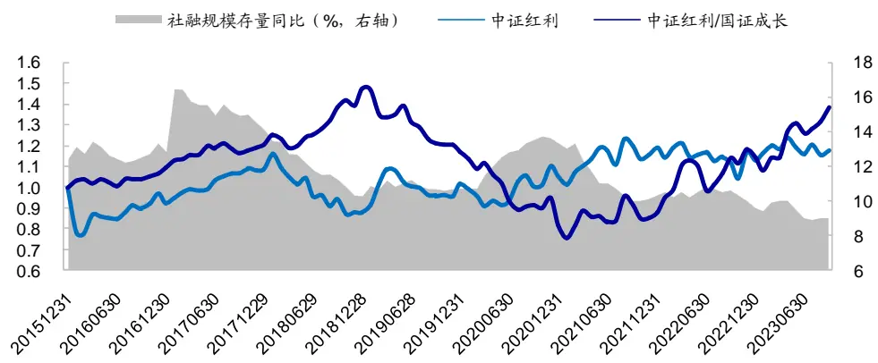
资料来源：Wind，海通证券研究所

类似地，我们也尝试利用当前的社融增速，判断未来 1个月的红利/成长风格切换。具体规则为，若最新一期可获得的社融同比高于 6个月前，则预判未来 1 个月成长占优；反之，则预判未来 1个月红利占优。如表 4所示，在我们划分的社融同比下降期的次月，红利指数优于国证成长指数的概率为 66%，收益差高达 12.8%，并在 10%的臵信度下统计显著。

但红利指数的绝对收益表现一般，年化值仅 0.5%，大幅弱于社融同比上升期次月的表现。我们认为，这可能是由于，当经济向好的预期降低，企业的盈利增速将放缓，股票类资产的整体表现都会弱于经济向好预期强烈的阶段。

表 4 社融同比变化与次月中证红利指数的业绩表现（2016.07-2023.09）

|  |  |  |  |  | 中证红利-国证1000 |  |  | 中证红利-国证成长 |  |  |
| --- | --- | --- | --- | --- | --- | --- | --- | --- | --- | --- |
|  | 样本数 | 年收益 | 月胜率 | t值 | 年收益 | 月胜率 | t值 | 年收益 | 月胜率 | t值 |
| 全区间 | 87 | 5.2% | 54.0% | 0.93 | 3.0% | 57.5% | 0.70 | 3.2% | 57.5% | 0.51 |
| 社融同比下降 | 53 | 0.5% | 47.2% | 0.07 | 8.7% | 64.2% | 1.78 | 12.8% | 66.0% | 1.81 |
| 社融同比上升 | 34 | 12.4% | 64.7% | 1.46 | -5.7% | 47.1% | -0.72 | -11.4% | 44.1% | -1.02 |

资料来源： ，海通证券研究所
注：年收益为月均收益

综上所述，我们认为，在社融同比下降的时期，红利投资具备较为突出的相对投资价值。2/3 的月份内，中证红利指数优于国证成长指数。但此时，红利指数的绝对收益表现较弱，月均收益接近于 0。

## 2.2.3 市场波动

理论上，市场波动大时，投资者的避险情绪高企，防御性强的高股息股票吸引力大增。但图 24 中，中证红利指数的走势和国证 1000 的波动率之间并未表现出类似的关系。

图24 市场波动与中证红利指数历史净值走势
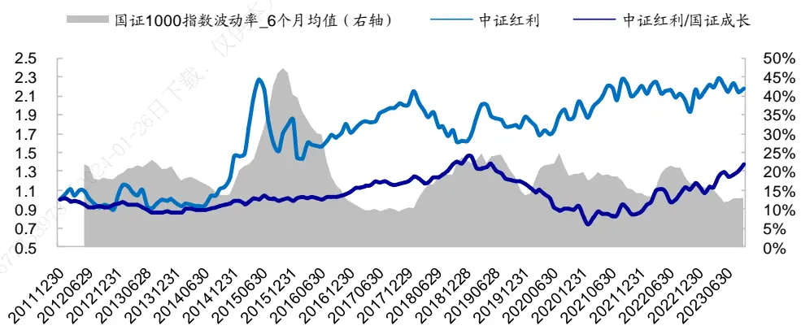
资料来源：Wind，海通证券研究所

于是，我们进一步按照如下规则划分市场阶段。若当月市场（国证 指数）的日收益波动率高于过去 6 个月波动率的均值，则认为市场波动放大；反之，则认为市场波动减小。统计波动放大和减小期，次月中证红利指数、红利相对国证 1000、红利相对国证成长指数的业绩表现，结果如表 5 所示。在我们划分的波动放大期的次月，

- 红利指数显著优于国证成长指数，年化超额 12.8%；

- 红利指数有较优的绝对收益表现，年化值 11.1%，高于市场波动减小期的次月（7.2%）。

表 5 市场波动变化与次月中证红利指数的业绩表现（2013.01-2023.09）

| 中证红利 |  |  |  |  | 中证红利-国证1000 |  |  | 中证红利-国证成长 |  |  |
| --- | --- | --- | --- | --- | --- | --- | --- | --- | --- | --- |
|  | 样本数 | 年收益 | 月胜率 | t值 | 年收益 | 月胜率 | t值 | 年收益 | 月胜率 | t值 |
| 全区间 | 130 | 8.8% | 53.8% | 1.38 | 2.3% | 52.3% | 0.74 | 3.0% | 53.8% | 0.68 |
| 市场波动放大 | 54 | 11.1% | 59.3% | 1.16 | 9.1% | 59.3% | 1.91 | 12.8% | 53.7% | 2.03 |
| 市场波动减小 | 76 | 7.2% | 50.0% | 0.84 | -2.7% | 47.4% | -0.67 | -4.2% | 53.9% | -0.71 |

资料来源：Wind，海通证券研究所注：年收益为月均收益

综上所述，我们认为，市场波动放大，投资者避险情绪高，红利投资的性价比提升，在 59%的月份获得正收益；且显著优于成长风格，相对国证成长指数年化超额 12.8%。

## 2.3 小结

中证红利指数中长期业绩较优，波动和回撤都较小。尤其是当基金整体投资绩效不佳时，能够成为分散风险的有利工具，具备很强的防御属性。但作为同一枚硬币的另一面，中证红利指数的收益弹性较弱。个别年份，如 年，年度收益不及偏股混合型基金指数的一半。因此，我们认为，红利投资适合那些对收益弹性要求不高、可以承受短期业绩增长较慢的心理压力、但追求中长期资产稳健增值的投资者。

如果想选择合适的时机参与红利投资，同时规避潜在的弱势期，可以关注美债利率、社融规模和市场波动三个指标。当美债利率上行或市场波动放大时，避险情绪推动资金从成长性资产转向价值型资产，此时红利投资具备较高的性价比。不仅月均收益为正，且显著优于成长风格。当社融同比下降时，红利投资相对成长风格同样是较优的选择。但需要注意的是，社融同比下降可能意味着经济向好的预期较弱，股票类资产整体表现低迷，红利投资也不例外，绝对收益的年化值在 0附近。

如图 所示， 年下半年以来，美债利率持续上行，叠加国内社融同比放缓，成长风格受到明显压制。防御性较强的中证红利指数则表现平稳，相应的超额收益持续攀升。此外，截至 2023.09，中证红利指数的股息率（近 12 个月）为 5.84%，远高于无风险利率，进一步增加了红利投资的吸引力。

图25 2021H2以来的美债利率与中证红利指数走势
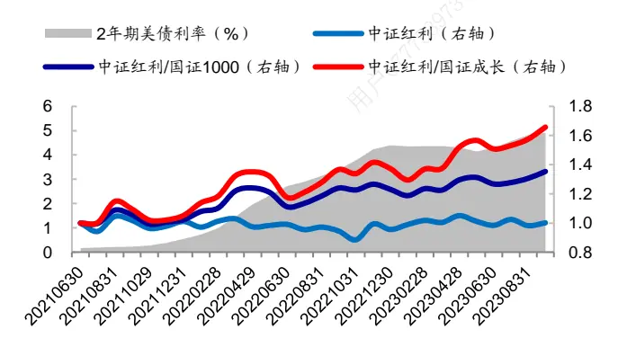
资料来源： ，海通证券研究所

图26 2021H2以来的社融同比与中证红利指数走势
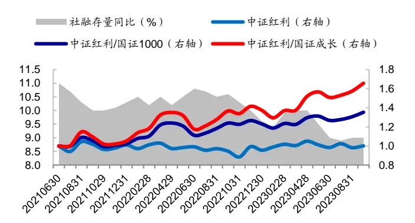
资料来源： ，海通证券研究所

进一步，我们根据美债利率和市场波动把 2013.01-2023.09 划分为 4个阶段，统计每个阶段相应月份的次月，中证红利指数的绝对和相对收益表现，结果分别列于表 6-7。

当美债利率上行且市场波动放大时，投资者避险情绪高企，红利投资吸引力大增。中证红利指数收益为正的月份占比超过 60%，年收益高于 10%，且显著优于市场。此时，成长风格表现最差，年收益 ，中证红利指数相对优势凸显。

当美债利率上行和市场波动放大这两个条件的其中之一发生时，红利投资同样不失为一个较优的选择。不过，此时中证红利指数相对市场和成长风格的超额收益不如美债利率上行且市场波动放大的情形。

美债利率下行且市场波动减小时，投资者情绪普遍较为乐观，成长风格的投资机会最佳。国证成长指数收益为正的月份占比将近 80%，年收益 30.4%，业绩表现显著优于市场。此时，中证红利指数表现最差，年收益-10.7%，仅在 36.8%的月份获得正收益。因此，我们认为，在这样的环境下，红利投资并不是合理的选择。

表 6 不同美债利率、市场波动情况下，中证红利指数的表现（2013.01-2023.09）

|  |  |  | 中证红利 中证红利全收益 |  | 国证 1000 |  | 国证成长 |  |  |
| --- | --- | --- | --- | --- | --- | --- | --- | --- | --- |
|  | 样本数 | 年收益 | 月胜率 | 年收益 | 月胜率 | 年收益 | 月胜率 | 年收益 | 月胜率 |
| 全区间 | 130 | 8.8% | 53.8% | 12.9% | 59.2% | 6.5% | 53.8% | 5.8% | 54.6% |
| 利率上行，波动放大 | 42 | 12.4% | 61.9% | 15.7% | 64.3% | 2.1% | 54.8% | -3.0% | 45.2% |
| 利率上行，波动减小 | 57 | 13.2% | 54.4% | 17.1% | 57.9% | 8.5% | 54.4% | 4.8% | 52.6% |
| 利率下行，波动放大 | 12 | 6.5% | 50.0% | 9.6% | 58.3% | 1.8% | 50.0% | 2.6% | 58.3% |
| 利率下行，波动减小 | 19 | -10.7% | 36.8% | -3.5% | 52.6% | 13.8% | 52.6% | 30.4% | 78.9% |

资料来源：Wind，海通证券研究所

表 7 不同市场环境下，中证红利指数的相对收益表现（2013.01-2023.09）

| 中证红利-国证 1000 |  |  |  |  | 中证红利-国证成长 |  |  |
| --- | --- | --- | --- | --- | --- | --- | --- |
|  | 样本数 | 年收益 | 月胜率 | t值 | 年收益 | 月胜率 | t值 |
| 全区间 | 130 | 2.3% | 52.3% | 0.74 | 3.0% | 53.8% | 0.68 |
| 利率上行，波动放大 | 42 | 10.4% | 59.5% | 2.15 | 15.4% | 57.1% | 2.32 |
| 利率上行，波动减小 | 57 | 4.8% | 57.9% | 1.10 | 8.4% | 66.7% | 1.38 |
| 利率下行，波动放大 | 12 | 4.7% | 58.3% | 0.34 | 3.9% | 41.7% | 0.23 |
| 利率下行，波动减小 | 19 | -24.5% | 15.8% | -3.49 | -41.1% | 15.8% | -3.81 |

资料来源： ，海通证券研究所

## 3. 超越红利投资

由上文可知，红利投资波动小、回撤低，长期收益稳健，还能获得较高的股息收入。但是，收益弹性稍显不足， 年的表现相对落后。因此，我们尝试将股息率与其他选股因子结合，构建“红利+”组合。在此基础上，我们利用红利类策略“防御性强”的特征，将其应用于“固收+”和“杠铃式”这类配臵型组合中。

## 3.1 “红利+”组合

根据当前被动指数型红利产品跟踪的指数，可大致将红利类策略分为两类：普通红利策略和“红利 ”策略。前者是指，直接选择样本空间中股息率最高的股票构建组合，如中证红利、上证红利、消费红利等指数。“红利 ”策略则是指，除股息率外，还叠加其他指标，如波动率、基本面因子等，复合选股的方式，如红利低波、红利质量指数等。

如表 8所示，叠加了其他选股因子的“红利+”策略，如，红利低波全收益指数（H20269）、红利质量全收益指数（931468），全区间的收益表现都优于普通红利策略——中证红利全收益指数。但是，在选股时给予其他因子的权重越大，相应的股息收入也就越小。例如，红利质量指数仅用公司分红情况划定样本池，具体选股时并未用到与股息率相关的因子，故红利属性显著弱于中证红利和红利低波指数。截至 ，红利质量指数股息率 ，仅略高于沪深 指数，远低于中证红利和红利低波指数。

不同红利指数的分年度业绩表现也存在较大差异。其中，中证红利和红利低波指数年度收益分布接近，价值风格较为纯粹。2019-2020 年，成长风格走强（国证成长优于国证价值指数）时，两者当年的收益都不尽如人意，而红利质量指数则表现较为优异。不过，随着 年至今价值风格占优，这两个指数的业绩表现发生反转，大幅超越红利质量指数。

表 8 3个红利全收益指数与其他指数的业绩表现对比（2013.01-2023.09）

|  | 中证红利（全） |  | 红利低波（全） |  | 红利质量（全） |  | 沪深300（全） |  | 国证成长 | 国证价值 | 国证 1000 |
| --- | --- | --- | --- | --- | --- | --- | --- | --- | --- | --- | --- |
|  | 收益率 | 最大回撤 | 收益率 | 最大回撤 | 收益率 | 最大回撤 | 收益率 最大回撤 |  |  |  |  |
| 2013 | -6.70% | 23.90% | 14.60% | 16.80% | 17.50% | 11.00% | -5.30% | 21.20% | -1.0% | -3.0% | 1.4% |
| 2014 | 57.6% | 8.1% | 57.8% | 7.6% | 24.8% | 14.0% | 55.8% | 10.4% | 32.7% | 64.1% | 47.3% |
| 2015 | 29.9% | 44.1% | 16.1% | 40.5% | 52.7% | 39.0% | 7.2% | 42.9% | 26.9% | 8.4% | 18.4% |
| 2016 | -4.3% | 23.9% | 0.1% | 20.6% | 0.3% | 23.7% | -9.3% | 23.5% | -15.6% | -8.1% | -15.5% |
| 2017 | 21.3% | 6.6% | 23.6% | 5.6% | 46.5% | 6.6% | 24.3% | 6.1% | 6.8% | 20.6% | 11.4% |
| 2018 | -16.2% | 27.1% | -16.4% | 27.5% | -16.4% | 30.4% | -23.6% | 30.4% | -34.0% | -21.7% | -28.0% |
| 2019 | 20.9% | 16.2% | 20.9% | 12.6% | 45.7% | 14.2% | 39.2% | 13.1% | 45.3% | 23.7% | 34.6% |
| 2020 | 8.2% | 14.9% | 2.0% | 17.5% | 43.3% | 16.9% | 29.9% | 16.1% | 48.6% | 4.9% | 27.5% |
| 2021 | 18.2% | 15.2% | 16.3% | 16.9% | 9.0% | 15.7% | -3.5% | 17.1% | 5.4% | -1.4% | 1.5% |
| 2022 | -0.4% | 12.6% | 3.5% | 13.5% | -12.0% | 19.7% | -19.8% | 27.5% | -27.5% | -14.0% | -21.3% |
| 2023 | 10.4% | 10.3% | 16.4% | 12.3% | 1.4% | 11.2% | -2.5% | 10.6% | -13.2% | 4.5% | -4.7% |
| 全区间 | 11.3% | 45.7% | 13.1% | 42.5% | 17.4% | 39.0% | 5.9% | 46.1% | 3.3% | 5.2% | 4.3% |
| 股息率 | 5.8% |  | 6.1% |  | 3.2% |  | 3.0% |  | 2.2% | 4.9% | 2.7% |

资料来源：Wind，海通证券研究所

参考传统量化增强组合的构建思路，以及前文提及的常见红利类指数的特征，下文分别构建了如下 3 种“红利+”策略：（1）红利指数增强组合；（2）红利属性较强的“红利+”策略：“红利+成长”、“红利+低波”；（3）红利属性较弱的“红利+分红潜力”策略。

## 3.1.1 红利增强组合

中证红利和国企红利是反映 A股红利风格的重要参考指数，本节采用经典的指数增强框架，即，在控制相对基准的风格暴露、个股偏离等约束下，最大化组合预期收益的方式，构建相应指数的增强组合。

具体地，我们基于风格、技术、基本面、预期和高频因子构建收益预测模型，在成分股权重 、个股偏离 ，股息率中性，因子敞口 倍标准差等约束条件下，构建中证红利/国企红利指数增强组合，其相对基准指数的净值走势分别如图 27-28 所示。

图27 中证红利指数增强组合的相对净值走势
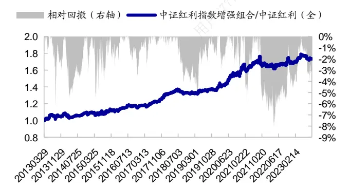
资料来源：Wind，海通证券研究所

图28 国企红利指数增强组合的相对净值走势
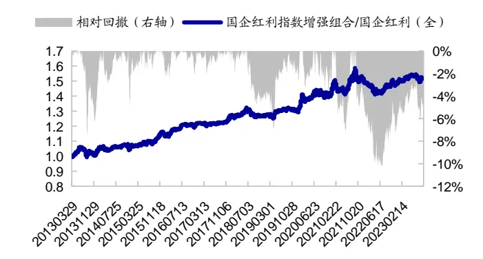
资料来源：Wind，海通证券研究所

扣除单边 3‰的交易成本后，2013.03-2023.09，

（1）中证红利指数增强组合年化收益 17.6%，而同期中证红利指数（全）年化收益 ，组合相对指数年化超额 ，跟踪误差 。每一年，增强组合相对中证红利指数均存在正超额，年胜率 100%，月胜率 63.5%。

（2）国企红利指数增强组合年化收益 17.0%，而同期国企红利指数（全）年化收益 12.4%，组合相对指数年化超额 4.6%，跟踪误差 4.6%。每一年，增强组合相对国企红利指数均存在正超额，年胜率 100%，月胜率 56.3%。

表 9 中证红利和国企红利指数增强组合的历史业绩表现（2013.03-2023.09）

|  | 中证红利指数（全）增强组合 |  |  |  |  |  | 国企红利指数（全）增强组合 |  |  |  |  |  |
| --- | --- | --- | --- | --- | --- | --- | --- | --- | --- | --- | --- | --- |
|  | 增强组合 |  | 指数 |  | 超额收益 |  | 增强组合 |  | 指数 |  | 超额收益 |  |
|  | 收益率 | 最大 回撤 | 收益率 | 最大 回撤 | 收益率 | 相对 回撤 | 收益率 | 最大 回撤 | 收益率 | 最大 回撤 | 收益率 | 相对 回撤 |
| 2013 | -0.5% | 15.5% | -6.4% | 18.1% | 5.9% | 6.2% | 3.7% | 14.3% | 1.9% | 16.0% | 1.8% | 7.5% |
| 2014 | 60.4% | 11.2% | 57.6% | 8.1% | 2.8% | 5.6% | 75.5% | 7.5% | 68.1% | 8.2% | 7.4% | 5.2% |
| 2015 | 35.5% | 44.2% | 29.9% | 44.1% | 5.6% | 4.9% | 18.5% | 40.9% | 8.6% | 40.5% | 9.9% | 1.7% |
| 2016 | -0.4% | 24.5% | -4.3% | 23.9% | 3.9% | 3.6% | 3.1% | 22.1% | -2.1% | 20.2% | 5.2% | 2.1% |
| 2017 | 34.7% | 5.6% | 21.3% | 6.6% | 13.4% | 2.2% | 32.1% | 5.2% | 27.5% | 5.8% | 4.6% | 2.0% |
| 2018 | -14.9% | 26.3% | -16.2% | 27.1% | 1.3% | 4.1% | -13.1% | 26.9% | -13.7% | 26.8% | 0.5% | 4.8% |
| 2019 | 24.0% | 13.7% | 20.9% | 16.2% | 3.2% | 2.5% | 23.8% | 12.7% | 21.8% | 16.5% | 2.0% | 2.6% |
| 2020 | 29.5% | 15.0% | 8.2% | 14.9% | 21.3% | 3.3% | 11.6% | 15.0% | 1.8% | 17.5% | 9.8% | 3.6% |
| 2021 | 21.1% | 19.3% | 18.2% | 15.2% | 2.9% | 6.5% | 21.9% | 22.7% | 16.1% | 18.9% | 5.8% | 7.3% |
| 2022 | 0.7% | 13.0% | -0.4% | 12.6% | 1.0% | 4.5% | 5.0% | 12.1% | 4.5% | 12.5% | 0.5% | 5.3% |
| 2023 | 13.8% | 11.6% | 10.4% | 10.3% | 3.4% | 3.9% | 15.0% | 11.6% | 13.4% | 12.1% | 1.6% | 3.4% |
| 全区间 | 17.6% | 44.5% | 11.6% | 45.7% | 6.0% | 8.1% | 17.0% | 41.1% | 12.4% | 43.3% | 4.6% | 10.3% |

资料来源：Wind，海通证券研究所

## 3.1.2 红利+成长、红利+低波

参考红利低波指数的构建思路，本节采用股息率因子（过去 年的平均分红总额个股最新市值，下同）叠加其他 alpha 因子，构建了红利属性较强的红利+成长、红利+低波策略。在实施具体的选股策略之前，我们先剔除了全 范围内截至选股日上市不足个月、 及过去 年日均总市值或日均成交额最低的 股票。

## 红利+成长

红利+成长组合，即利用成长因子（SUE）对股息率因子实现收益增厚，具体步骤如下所示。

- 基础池：SUE与股息率因子等权打分，选择复合因子得分最高的 1/2 股票；

高股息 100：选择基础池中股息率最高的 100 只股票；

- 成长 50：在前一步确定的 100只股票中，再选择 SUE 因子最高的 50只股票；

- 加权和再平衡方式：股息率加权，单只个股权重不超过 10%，月度换仓。

扣除单边 3‰的交易成本后，2013 年以来（截至 2023.09，下同），红利+成长组合年化收益 20.9%，而同期中证红利指数年化收益 11.3%，组合相对指数年化超额 9.6%。每一年，红利+成长组合相对中证红利指数均存在正超额，年胜率 100%，月胜率 58.1%。风险指标上，红利 成长组合全区间最大回撤小于中证红利指数，绝大部分年份的回撤也更小。

若降低交易频率至季度调仓，则 2013 年以来年化收益 21.2%，略高于月度调仓的结果。由于两者差异不大，后文在构建红利 低波和红利 分红潜力组合时，均采用季度调仓，以降低交易成本带来的影响。

这里，季度调仓是指每年季报披露结束后，即，4、8、10 月底，完成调仓。但是，考虑到当年 10月至次年 4月的间隔时间长达半年，因此中间再增设一个调仓点，12 月。即，全年一共调仓 4次，分别于 4、8、10、12 月底调仓。

表 10 红利+成长组合的历史业绩表现（2013.01-2023.09）

| 红利+成长（月度调仓） |  |  | 中证红利（全） |  | 超额收益 | 红利+成长（季度调仓） |  |
| --- | --- | --- | --- | --- | --- | --- | --- |
|  | 收益率 | 最大回撤 | 收益率 | 最大回撤 |  | 收益率 | 最大回撤 |
| 2013 | 11.6% | 17.6% | -6.7% | 23.9% | 18.4% | 11.2% | 17.3% |
| 2014 | 60.9% | 7.8% | 57.6% | 8.1% | 3.3% | 69.7% | 7.8% |
| 2015 | 51.1% | 39.0% | 29.9% | 44.1% | 21.2% | 46.7% | 38.8% |
| 2016 | 3.4% | 21.8% | -4.3% | 23.9% | 7.7% | 1.7% | 21.8% |
| 2017 | 22.8% | 8.2% | 21.3% | 6.6% | 1.5% | 25.8% | 7.4% |
| 2018 | -9.6% | 24.3% | -16.2% | 27.1% | 6.6% | -16.1% | 29.4% |
| 2019 | 31.9% | 14.5% | 20.9% | 16.2% | 11.0% | 36.0% | 13.4% |
| 2020 | 20.8% | 13.0% | 8.2% | 14.9% | 12.6% | 19.6% | 13.3% |
| 2021 | 33.9% | 13.9% | 18.2% | 15.2% | 15.8% | 33.1% | 14.8% |
| 2022 | 0.8% | 17.5% | -0.4% | 12.6% | 1.2% | 6.0% | 13.1% |
| 2023 | 14.4% | 14.7% | 10.4% | 10.3% | 4.0% | 15.4% | 12.3% |
| 全区间 | 20.9% | 39.0% | 11.3% | 45.7% | 9.6% | 21.2% | 38.8% |

资料来源：Wind，海通证券研究所

## 红利+低波

红利+低波组合主要利用低波因子优选高股息个股，具体步骤如下。

基础池：将 SUE、ROE（TTM）同比变化和盈利质量（（过去一年经营活动现金流-过去一年营业利润）/最新财报总资产）3 个因子等权复合打分，选择得分最高的 1/2 股票；

- 高股息 75：选择基础池中股息率最高的 75 只股票；

- 低波 50：在前一步确定的 75 只股票中，选择低波和低换手两个因子综合得分最高的 50 只股票；

- 加权方式：股息率加权，单只个股权重不超过 10%。

扣除单边 3‰的交易成本后，2013 年以来，红利+低波组合年化收益 21.6%。同期，红利低波全收益指数年化收益 13.1%，组合相对指数年化超额 8.6%。每一年，红利+低波组合相对红利低波指数均存在正超额，年胜率 100%，月胜率 58.9%。风险指标上，红利+成长组合全区间最大回撤略小于红利低波全收益指数。

表 11红利+低波组合的历史业绩表现（2013.01-2023.09）

|  | 红利+低波 |  | 红利低波（全） |  | 超额收益 |
| --- | --- | --- | --- | --- | --- |
|  | 收益率 | 最大回撤 | 收益率 | 最大回撤 |  |
| 2013 | 18.4% | 15.5% | 14.6% | 16.8% | 3.9% |
| 2014 | 68.0% | 6.7% | 57.8% | 7.6% | 10.2% |
| 2015 | 51.3% | 41.8% | 16.1% | 40.5% | 35.2% |
| 2016 | 1.1% | 25.8% | 0.1% | 20.6% | 1.0% |
| 2017 | 27.8% | 6.2% | 23.6% | 5.6% | 4.3% |
| 2018 | -14.3% | 28.2% | -16.4% | 27.5% | 2.1% |
| 2019 | 27.5% | 14.9% | 20.9% | 12.6% | 6.6% |
| 2020 | 11.7% | 13.8% | 2.0% | 17.5% | 9.7% |
| 2021 | 33.3% | 13.6% | 16.3% | 16.9% | 17.0% |
| 2022 | 10.3% | 13.1% | 3.5% | 13.5% | 6.9% |
| 2023 | 17.6% | 7.7% | 16.4% | 12.3% | 1.2% |
| 全区间 | 21.6% | 41.8% | 13.1% | 42.5% | 8.6% |

资料来源： ，海通证券研究所

## 3.1.3 红利+分红潜力

红利质量指数在选股过程中并未直接用到股息率因子，只是利用分红指标划定一个分红持续性较高的股票池，然后在其中利用基本面因子优选个股。参考这个指数的做法，红利+分红潜力组合具体选股步骤如下。

- 高分红股票池：过去 3年连续现金分红，最新一年红利支付率在 0 到 1之间；

- 多因子 50：将 ROE、SUE、盈利质量、分析师观点和低换手率 5 个因子等权复合打分，选择得分最高的 50 只股票；

其中，盈利质量因子为，（过去一年经营活动现金流-过去一年营业利润）/最新财报总资产；分析师观点因子为，分析师覆盖度与分析师买入评级的等权复合。

- 加权方式：股息率加权，单只个股权重不超过 10%。

扣除单边 3‰的交易成本后，2013 年以来，红利+分红潜力组合年化收益 25.2%。同期，红利质量全收益指数年化收益 17.4%，组合相对指数年化超额 7.8%。每一年，红利+分红潜力组合相对红利质量指数均存在正超额，年胜率 100%，月胜率 60.5%。

表 12 红利+分红潜力组合的历史业绩表现（2013.01-2023.09）

|  | 红利+分红潜力 |  | 红利质量（全） |  |
| --- | --- | --- | --- | --- |
|  | 收益率 | 最大回撤 可传播与 | 收益率 最大回撤 | 超额收益 |
| 2013 | 28.3% | 16.8% | 17.5% 11.0% | 10.8% |
| 2014 | 36.0% | 12.0% 24.8% | 14.0% | 11.1% |
| 2015 | 64.0% | 42.9% | 52.7% 39.0% | 11.2% |
| 2016 | 6.3% | 25.1% | 0.3% 23.7% | 6.0% |
| 2017 | 53.0% | 4.9% | 46.5% 6.6% | 6.5% |
| 2018 | -15.8% | 28.6% | -16.4% 30.4% | 0.6% |
| 2019 | 51.7% | 15.9% | 45.7% 14.2% | 6.1% |
| 2020 | 45.8% | 14.4% | 43.3% 16.9% | 2.5% |
| 2021 | 22.1% | 13.6% | 9.0% 15.7% | 13.1% |
| 2022 | -5.4% | 20.6% | -12.0% 19.7% | 6.6% |
| 2023 | 11.7% | 8.9% | 1.4% 11.2% | 10.2% |
| 全区间 | 25.2% | 42.9% | 17.4% 39.0% | 7.8% |

资料来源：Wind，海通证券研究所

## 3.1.4 小结

本节构建了如下 种红利 策略：（ ）红利指数增强组合、（ ）红利属性较强的红利+策略：“红利+成长”、“红利+低波”；（3）红利属性较弱的“红利+分红潜力”策略。其中，红利指数增强组合相对基准的风控较为严格，而后两者脱离了风控模型。从相对业绩表现来看，指数增强框架下的组合跟踪基准较为紧密，而脱离风控模型的“红利+”策略超额收益更为可观。

2013.03-2023.09，中证红利指数增强组合年化收益 17.6%，相对中证红利指数（全）年化超额 6.0%，跟踪误差 4.8%。每一年，增强组合相对中证红利指数均存在正超额，年胜率 100%，月胜率 63.5%。国企红利指数增强组合年化收益 17.0%，相对国企红利指数（全）年化超额 4.6%，跟踪误差 4.6%。每一年，增强组合相对中证红利指数均存在正超额，年胜率 100%，月胜率 56.3%。

红利 成长、红利 低波策略在选股时都给予股息率因子较高的权重，呈现出更为纯粹的高股息特征。因此，2022 年以来表现都较为优异，净值走势接近（图 29）。若计算两个组合相对市场的月超额收益和风格指数的相关系数（图 30），则可发现两者与成长风格显著负相关，而与价值风格显著正相关。

红利+分红潜力策略在选股时，没有实际用到股息率因子，只是利用过去 3年的分红状况筛选一个初步的股票池。然后，在其中用股息率以外的基本面因子选股，以反映公司的分红潜力，整体构建思路与红利质量指数类似。由于红利+分红潜力策略与红利质量指数均使用了一些增长类因子，因此，选出来的股票与价值风格（国证价值指数）呈负相关，高股息特征不如红利+成长和红利+低波策略纯粹。该组合在 2019-2020 年间表现较为突出，但 2022 年以来，收益显著低于红利+成长和红利+低波。

图29 红利+策略的累计净值走势
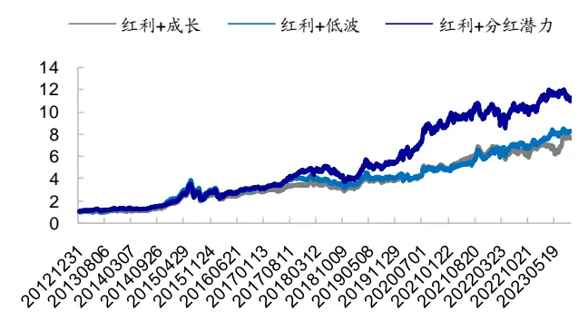
资料来源： ，海通证券研究所

图30 红利+策略相对国证 1000 月超额收益的相关系数（2013.01-2023.09）

|  | 红利+成 红利+低 红利+分红利低波中证红利 红利质量长 波 红潜力 |  |  |  |  |  | 国证成长国证价值 |  |
| --- | --- | --- | --- | --- | --- | --- | --- | --- |
| 红利+成长 |  | 60.2% | 61.5% | 57.0% | 23.3% | 6.2% | -35.5% | 44.3% |
| 中证红利 | 60.2% |  | 80.9% | 86.2% | 25.4% | 3.2% | -64.4% | 69.2% |
| 红利+低波 | 61.5% | 80.9% |  | 80.2% | 42.8% | 9.4% | -56.8% | 59.1% |
| 红利低波 | 57.0% | 86.2% | 80.2% |  | 24.4% | 9.3% | -63.6% | 77.4% |
| 红利+分红潜力 | 23.3% | 25.4% | 42.8% | 24.4% |  | 51.6% | -4.5% | -14.0% |
| 红利质量 | 6.2% | 3.2% | 9.4% | 9.3% | 51.6% |  | 22.4% | -25.6% |
| 国证成长 | -35.5% | -64.4% | -56.8% | -63.6% | -4.5% | 22.4% |  | -65.4% |
| 国证价值 | 44.3% | 69.2% | 59.1% | 77.4% | -14.0% | -25.6% | -65.4% |  |

资料来源： ，海通证券研究所

表 13“红利+”组合分年度收益对比（2013.01-2023.09）

|  | 红利+成长 | 中证红利 | 红利+低波 | 红利低波 | 红利+分红 潜力 | 红利质量 | 国证成长 | 国证价值 | 国证 1000 |
| --- | --- | --- | --- | --- | --- | --- | --- | --- | --- |
| 2013 | 11.6% | -6.7% | 18.4% | 14.6% | 28.3% | 17.5% | -1.0% | -3.0% | 1.4% |
| 2014 | 60.9% | 57.6% | 68.0% | 57.8% | 36.0% | 24.8% | 32.7% | 64.1% | 47.3% |
| 2015 | 51.1% | 29.9% | 51.3% | 16.1% | 64.0% | 52.7% | 26.9% | 8.4% | 18.4% |
| 2016 | 3.4% | -4.3% | 1.1% | 0.1% | 6.3% | 0.3% | -15.6% | -8.1% | -15.5% |
| 2017 | 22.8% | 21.3% | 27.8% | 23.6% | 53.0% | 46.5% | 6.8% | 20.6% | 11.4% |
| 2018 | -9.6% | -16.2% | -14.3% | -16.4% | -15.8% | -16.4% | -34.0% | -21.7% | -28.0% |
| 2019 | 31.9% | 20.9% | 27.5% | 20.9% | 51.7% | 45.7% | 45.3% | 23.7% | 34.6% |
| 2020 | 20.8% | 8.2% | 11.7% | 2.0% | 45.8% | 43.3% | 48.6% | 4.9% | 27.5% |
| 2021 | 33.9% | 18.2% | 33.3% | 16.3% | 22.1% | 9.0% | 5.4% | -1.4% | 1.5% |
| 2022 | 0.8% | -0.4% | 10.3% | 3.5% | -5.4% | -12.0% | -27.5% | -14.0% | -21.3% |
| 2023 | 14.4% | 10.4% | 17.6% | 16.4% | 11.7% | 1.4% | -13.2% | 4.5% | -4.7% |
| 全区间 | 20.9% | 11.3% | 21.6% | 13.1% | 25.2% | 17.4% | 3.3% | 5.2% | 4.3% |

资料来源：Wind，海通证券研究所

## 3.2 “红利+”组合的应用

由上一节可知，高分红属性较强的红利 成长和红利 低波策略一方面相对红利指数超额收益较高，另一方面还具备很好的防御性。2019 年以来，每一年的回撤都小于 20%。若站在绝对收益的角度，则 2013 年至今，除 2018 年收益为负外，其余年份皆为正收益。基于这一特征，我们尝试将两个组合应用于“杠铃式”配臵和“固收+”策略中。

## 3.2.1 “杠铃式”配臵

若按 4:6 的比例混合高防御性的红利+成长组合与高收益弹性的小市值高增长组合，可使得分年度收益更加稳健。如下表所示，年度再平衡的“杠铃式”组合，2013 年以来，年化收益高达 33.1%。除 2018 年收益为负以外，其余年份的收益率都超过 10%，收益分布相较单一组合更加均匀。

表 14 红利+成长与小市值高增长“杠铃式”配臵组合分年度收益（2013.02-2023.09）

| 红利+成长 | 小市值高增长 | 40%红利成长+60%小市值高增长 |
| --- | --- | --- |
| 2013 7.9% | 47.4% | 31.6% |
| 2014 | 60.9% 68.2% | 65.3% |
| 2015 | 51.1% 182.6% | 130.0% |
| 2016 | 3.4% 15.4% | 10.6% |
| 2017 | 22.8% 6.2% | 12.9% |
| 2018 | -9.6% -20.9% | -16.4% |
| 2019 | 31.9% 48.4% | 41.8% |
| 2020 | 20.8% 58.6% | 43.5% |
| 2021 | 33.9% 50.9% | 44.1% |
| 2022 | 0.8% 17.9% | 11.1% |
| 2023 | 14.4% 30.4% | 24.0% |
| 全区间 | 20.7% 40.3% | 33.1% |

资料来源： ，海通证券研究所

如果是以相对收益的稳健性或同业排名为目标，那我们常常会选择沪深 指数或偏股混合型基金（ ）指数为业绩比较基准，前者反映 股市场流动性好、代表性强的股票的整体表现，后者代表偏股型基金的整体业绩。但这两个指数的风格有所差异，个别年份的收益率也相去甚远，因此，想要连续稳定地同时战胜这两个指数并非易事。

例如，我们在前期专题报告《如何优雅地抄基金经理作业（七）——偏股基金指数（885001）增强必须还原持仓吗？》中，以 885001 为基准构建了 885001 增强组合。年以来，组合业绩表现突出，相对沪深 全收益指数和 的年化超额收益在 20%左右（表 15）。但该组合 2014 年跑输沪深 300 指数的幅度超过 30%，2018 年又同时弱于两个基准。

又如，小市值高增长组合收益弹性大， 年以来年化收益高达 。但小盘风格过于鲜明，2017 年跑输沪深 300 指数的幅度接近 20%（表 15）。即便和红利+成长组合按 6:4 混合，依然落后沪深 300 约 10个百分点。

因此，我们尝试结合多个风格组合，按年度再平衡的方式，配臵 30%的红利+低波组合、30%的小市值高增长组合和 40%的 885001 增强组合。如表 15所示，复合组合绝大部分年份均能同时战胜沪深 300 指数和 885001，且未出现同时跑输的情况。即使极个别年份不及两个基准的其中之一，跑输幅度也在 6%以下，超额收益分布更均匀。

表 15 复合组合的业绩表现（2013.02-2023.09）

|  | 红利+低 波收益 | 小市值高增长 |  |  | 885001 增强 |  |  | 复合组合 |  |  |  |
| --- | --- | --- | --- | --- | --- | --- | --- | --- | --- | --- | --- |
|  |  | 组合收益 | 相对300 超额 | 相对 885001 超额 | 组合收益 | 相对 300 超额 | 相对 885001 超额 | 组合收益 | 相对 300 超额 | 相对 885001 超额 | 在偏股混 合型基金 中的排名 |
| 2013 | 11.7% | 47.4% | 58.6% | 39.6% | 37.3% | 48.4% | 29.4% | 32.6% | 43.8% | 24.8% | 2.4% |
| 2014 | 68.0% | 68.2% | 12.4% | 46.0% | 23.7% | -32.2% | 1.5% | 50.4% | -5.5% | 28.1% | 3.6% |
| 2015 | 51.3% | 182.6% | 175.4% | 139.5% | 80.7% | 73.4% | 37.5% | 102.4% | 95.2% | 59.3% | 1.2% |
| 2016 | 1.1% | 15.4% | 24.7% | 28.4% | 7.3% | 16.6% | 20.3% | 7.9% | 17.1% | 20.9% | 2.8% |
| 2017 | 27.8% | 6.2% | -18.0% | -7.9% | 58.8% | 34.6% | 44.7% | 33.7% | 9.5% | 19.6% | 9.5% |
| 2018 | -14.3% | -20.9% | 2.8% | 2.7% | -26.4% | -2.8% | -2.8% | -21.1% | 2.5% | 2.5% | 33.0% |
| 2019 | 27.5% | 48.4% | 9.2% | 3.4% | 64.9% | 25.7% | 19.9% | 48.7% | 9.6% | 3.7% | 39.4% |
| 2020 | 11.7% | 58.6% | 28.7% | 2.7% | 77.6% | 47.7% | 21.7% | 52.2% | 22.3% | -3.7% | 63.3% |
| 2021 | 33.3% | 50.9% | 54.4% | 43.2% | 39.8% | 43.3% | 32.1% | 41.2% | 44.7% | 33.5% | 4.6% |
| 2022 | 10.3% | 17.9% | 37.8% | 39.0% | -12.8% | 7.0% | 8.2% | 3.4% | 23.2% | 24.4% | 1.1% |
| 2023 | 17.6% | 30.4% | 32.9% | 40.0% | 0.8% | 3.3% | 10.3% | 14.7% | 17.2% | 24.2% | 1.1% |
| 全区间 | 21.2% | 40.3% | 35.0% | 31.4% | 27.9% | 22.6% | 19.0% | 30.7% | 25.4% | 21.8% |  |

资料来源：Wind，海通证券研究所

## 3.2.2“固收+”策略

高分红、高防御性的特征，使得红利投资成为了“固收+”产品颇为偏爱的股票端策略。本节尝试用“红利+”组合（扣费后）搭配Wind 短期纯债型基金指数（885062.WI）在股债 10-90 和 20-80 两个中枢下，构建月度再平衡的“固收+”组合，并和股票端为沪深 300 全收益指数的基准对比，结果如表 16所示。

表 16“红利+”策略为股票端的“固收+”组合收益风险特征（2013.01-2023.09）

| 股债 10-90 中枢 |  |  |  |  |  |  |  |  |  |  |  |  |
| --- | --- | --- | --- | --- | --- | --- | --- | --- | --- | --- | --- | --- |
|  | 红利+成长 |  |  | 红利+低波 |  |  | 红利+分红潜力 |  |  | 沪深 300 全收益 |  |  |
|  | 收益率 | 回撤 | 月胜率 | 收益率 | 回撤 | 月胜率 | 收益率 | 回撤 | 月胜率 | 收益率 | 回撤 | 月胜率 |
| 2013 | 4.6% | 2.0% | 75.0% | 5.1% | 1.8% | 83.3% | 6.0% | 2.1% | 91.7% | 2.8% | 2.2% | 75.0% |
| 2014 | 10.9% | 0.7% | 100.0% | 11.4% | 0.7% | 100.0% | 8.9% | 0.9% | 100.0% | 10.7% | 0.7% | 100.0% |
| 2015 | 9.6% | 3.6% | 75.0% | 9.6% | 4.3% | 66.7% | 10.7% | 4.1% | 75.0% | 5.9% | 4.2% | 58.3% |
| 2016 | 1.7% | 2.1% | 66.7% | 1.6% | 2.5% | 75.0% | 2.1% | 2.4% | 66.7% | 0.4% | 2.3% | 58.3% |
| 2017 | 5.1% | 0.8% | 91.7% | 5.5% | 0.6% | 91.7% | 7.5% | 0.6% | 91.7% | 5.2% | 0.6% | 100.0% |
| 2018 | 3.7% | 1.1% | 75.0% | 3.1% | 1.0% | 66.7% | 3.0% | 1.8% | 75.0% | 2.0% | 1.1% | 58.3% |
| 2019 | 6.2% | 1.1% | 83.3% | 5.8% | 1.2% | 83.3% | 7.8% | 1.3% | 83.3% | 6.8% | 1.2% | 91.7% |
| 2020 | 4.3% | 1.3% | 83.3% | 3.4% | 1.2% | 75.0% | 6.3% | 1.4% | 91.7% | 5.0% | 1.6% | 75.0% |
| 2021 | 6.1% | 1.2% | 83.3% | 6.1% | 1.2% | 83.3% | 5.1% | 1.2% | 83.3% | 2.6% | 1.3% | 83.3% |
| 2022 | 2.2% | 1.4% | 58.3% | 3.0% | 1.4% | 83.3% | 1.5% | 1.5% | 50.0% | -0.1% | 1.7% | 50.0% |
| 2023 | 4.0% | 0.9% | 55.6% | 3.9% | 0.4% | 88.9% | 3.4% | 0.7% | 77.8% | 2.0% | 0.7% | 66.7% |
| 全区间 | 5.4% | 3.6% | 77.5% | 5.4% | 4.3% | 81.4% | 5.8% | 4.1% | 80.6% | 4.0% | 4.2% | 74.4% |
| 年平均 | 5.3% | 1.5% | 77.0% | 5.3% | 1.5% | 81.6% | 5.7% | 1.6% | 80.6% | 3.9% | 1.6% | 74.2% |

股债 20-80 中枢

|  | 红利+成长 |  |  | 红利+低波 |  |  | 红利+分红潜力 |  |  | 沪深 300 全收益 |  |  |
| --- | --- | --- | --- | --- | --- | --- | --- | --- | --- | --- | --- | --- |
|  | 收益率 | 回撤 | 月胜率 | 收益率 | 回撤 | 月胜率 | 收益率 | 回撤 | 月胜率 | 收益率 | 回撤 | 月胜率 |
| 2013 | 5.6% | 3.6% | 66.7% | 6.7% | 3.2% | 66.7% | 8.5% | 3.7% | 91.7% | 2.1% | 3.9% | 58.3% |
| 2014 | 15.8% | 1.2% | 91.7% | 16.9% | 1.2% | 91.7% | 11.7% | 1.6% | 83.3% | 15.4% | 1.5% | 83.3% |
| 2015 | 14.1% | 8.2% | 75.0% | 14.1% | 9.2% | 66.7% | 16.3% | 9.4% | 75.0% | 6.5% | 9.2% | 58.3% |
| 2016 | 2.2% | 4.3% | 66.7% | 1.9% | 5.1% | 66.7% | 2.9% | 4.9% | 83.3% | -0.4% | 4.6% | 58.3% |
| 2017 | 6.9% | 1.7% | 91.7% | 7.8% | 1.2% | 91.7% | 11.9% | 1.0% | 83.3% | 7.2% | 1.2% | 100.0% |
| 2018 | 2.3% | 2.7% | 41.7% | 1.2% | 3.2% | 50.0% | 0.9% | 4.6% | 75.0% | -1.1% | 3.5% | 41.7% |
| 2019 | 8.9% | 2.4% | 75.0% | 8.2% | 2.6% | 75.0% | 12.1% | 3.0% | 83.3% | 10.1% | 2.5% | 83.3% |
| 2020 | 6.1% | 2.6% | 66.7% | 4.4% | 2.6% | 50.0% | 10.3% | 3.0% | 75.0% | 7.7% | 3.3% | 66.7% |
| 2021 | 9.1% | 2.7% | 83.3% | 8.9% | 2.6% | 83.3% | 7.0% | 2.6% | 75.0% | 2.0% | 2.9% | 66.7% |
| 2022 | 2.3% | 3.2% | 41.7% | 3.9% | 2.7% | 58.3% | 0.9% | 3.6% | 41.7% | -2.3% | 4.3% | 41.7% |
| 2023 | 5.4% | 2.2% | 44.4% | 5.4% | 1.2% | 88.9% | 4.3% | 1.6% | 77.8% | 1.6% | 1.5% | 55.6% |
| 全区间 | 7.2% | 8.2% | 68.2% | 7.3% | 9.2% | 71.3% | 8.0% | 9.4% | 76.7% | 4.4% | 9.2% | 65.1% |
| 年平均 | 7.2% | 3.2% | 67.7% | 7.2% | 3.2% | 71.7% | 7.9% | 3.6% | 76.8% | 4.4% | 3.5% | 64.9% |

资料来源：Wind，海通证券研究所

由上表可见，无论是 10-90 还是 20-80 中枢，以“红利+”策略为股票端的“固收+”组合， 年至今的每一年都能获得正收益。尤其是 中枢下，红利 低波策略的“固收+”组合，除 2016 年收益率为 1.6%以外，其余年份均高于 3%。而简单使用沪深300指数作为股票端，并不能达到相同的效果。尤其是股票仓位较高的20-80中枢，2016、2018 和 2022 年的收益均为负。从月度获取正收益的概率看，“红利+”策略的“固收+”组合也普遍优于沪深 300 指数，显示出较强的稳定性，有助于提升投资者的持有体验。

不仅如此，“红利+”策略的“固收+”组合绝大部分年份的收益和回撤也显著优于基准（红利+分红潜力策略的高分红属性相对较低，风险更高，故对应“固收+”组合的回撤较大）。尤其是红利+成长和红利+低波策略，2017 年以来，10-90 股债中枢的“固收+”组合每一年的回撤都小于 1.5%。

## 3.2.3 小结

高分红属性较强的红利+成长和红利+低波策略具备很好的防御性。2019 年以来，每一年的回撤都小于 20%。若站在绝对收益的角度，则 2013 年至今，除 2018 年收益为负外，其余年份皆为正收益。基于这一特征，我们尝试将两个组合应用于“杠铃式”配臵和“固收+”策略中。

若按 4:6 的比例混合高防御性的红利+成长组合与高收益弹性的小市值高增长组合，可使得分年度收益更加稳健。年度再平衡的“杠铃式”组合，2013 年以来，年化收益高达 33.1%。除 2018 年收益为负以外，其余年份的收益率都超过 10%，收益分布相较单一组合更加均匀。

如果是以相对收益的稳健性或同业排名为目标，那我们常常会选择沪深 指数或偏股混合型基金（ ）指数为业绩比较基准。但这两个指数的风格有所差异，个别年份的收益率也相去甚远，因此，想要连续稳定地同时战胜这两个指数并非易事。于是，我们尝试用不同风格的红利+低波组合、小市值高增长组合和 885001 增强组合构建复合组合。绝大部分年份上，该组合均能同时战胜沪深 300 指数和 885001，且未出现同时跑输的情况。即使极个别年份不及两个基准的其中之一，跑输幅度也在 6%以下，超额收益分布更均匀。

以红利+策略作为股票端的“固收+”组合，时间序列收益稳定性显著高于沪深 300指数。特别是红利+低波策略，2013 年以来，以其作为股票端的 10-90 中枢“固收+”组合，除 2016 年收益为 1.6%以外，其余年份均不低于 3%，且 2017 年以来每一年的回撤都小于 1.5%。

## 4. 总结

2022 年以来，A股市场震荡下行。截至 2023Q3，市场（国证 1000 指数，下同）累计下跌 。在这样的背景下，红利投资因其突出的抗跌能力，而受到广泛关注。红利类产品的规模也由 2021 年底的 907.4 亿元，增加至 2023Q3 的 1104.7亿元，增幅高达 21.7%。那么，红利投资究竟具备哪些独特的优势，更加适合怎样的环境；实际投资中，除了红利类的被动指数产品，是否可以构建兼顾高分红和上涨弹性的“红利+”组合。针对这些问题，本文进行了系统的梳理和总结，以供关注红利策略的投资者参考。

红利投资是指投资于能够带来稳定和丰厚现金红利的上市公司的策略。其中，资本利得和股息收入是红利投资的两种回报来源。我们认为，红利投资可以获得稳定的现金分红，有效提升组合业绩和稳定性。此外，股息支付率高的公司盈利状况更加成熟稳定。同时，估值较低，安全边际高，预期收益的波动相对较小，抗风险能力强。

目前，国内公募基金中，既有采用高股息策略的主动选股型基金，也有跟踪红利指数的被动型指数基金。截至 2023Q3，市场共有 97 只红利类产品，规模合计 1104.7亿元。截至 ，被动指数型红利产品共 只，规模总计 亿元，占所有红利产品总规模之比为 51.3%。2022 年以来，红利类股票型基金的规模由 400.0 亿元增加至2023Q3 的 688.4 亿元，增幅为 72.1%，而同期股票型基金总规模仅增加 9.3%。红利类产品更受个人投资者偏爱，2023 中报的持有规模占比高达 69.3%。不过，2019 年起，随着被动型红利类产品数量的快速增加，机构持有者的占比显著提升。

中证红利指数中长期业绩较优，波动和回撤都较小。尤其是当基金整体投资绩效不佳时，能够成为分散风险的有利工具，具备很强的防御属性。但作为同一枚硬币的另一面，中证红利指数的收益弹性较弱。个别年份，如 2019-2020 年，年度收益不及偏股混合型基金指数的一半。因此，我们认为，红利投资适合那些对收益弹性要求不高、可以承受短期业绩增长较慢的心理压力、但追求中长期资产稳健增值的投资者。

如果想选择合适的时机参与红利投资，同时规避潜在的弱势期，可以关注美债利率、社融规模和市场波动三个指标。当美债利率上行或市场波动放大时，避险情绪推动资金从成长性资产转向价值型资产，此时红利投资具备较高的性价比。不仅月均收益为正，且显著优于成长风格。当社融同比下降时，红利投资相对成长风格同样是较优的选择。

但需要注意的是，社融同比下降可能意味着经济向好的预期较弱，股票类资产整体表现低迷，红利投资也不例外，绝对收益的年化值在 0附近。

根据当前被动指数型红利产品跟踪的指数，可大致将红利类策略分为两类：普通红利策略和“红利+”策略。前者是指，直接选择样本空间中股息率最高的股票构建组合，如中证红利、上证红利、消费红利等指数。“红利+”策略则是指，除股息率外，还叠加其他指标，如波动率、基本面因子等，复合选股的方式，如红利低波、红利质量指数等。

本文构建了 种“红利 ”策略：（ ）红利指数增强组合、（ ）红利属性较强的红利+策略：“红利+成长”、“红利+低波”；（3）红利属性较弱的“红利+分红潜力”策略。其中，红利指数增强组合相对基准的风控较为严格，而后两者脱离了风控模型。从相对业绩表现来看，指数增强框架下的组合跟踪基准较为紧密，而脱离风控模型的“红利 ”策略超额收益更为可观。红利+成长、红利+低波组合，给予股息率因子较高的权重，呈较为纯粹的高股息特征， 年以来表现优异。红利 分红潜力策略参考红利质量指数的构建思路，在过去 3 年分红水平较高的股票池里选择基本面好的股票，以反映公司的分红潜力。该组合给予股息因子的权重相对较小，高股息属性相对较弱。

高分红属性较强的红利+成长和红利+低波策略具备很好的防御性。2019 年以来，每一年的回撤都小于 。若站在绝对收益的角度，则 年至今，除 年收益为负外，其余年份皆为正收益。基于这一特征，我们尝试将两个组合应用于“杠铃式”配臵和“固收+”策略中。

若按 4:6 的比例混合高防御性的红利+成长组合与高收益弹性的小市值高增长组合，传可使得分年度收益更加稳健。年度再平衡的“杠铃式”组合，2013 年以来，年化收益高不达 33.1%。除 2018 年收益为负以外，其余年份的收益率都超过 10%，收益分布相较单用，一组合更加均匀。

以红利+策略作为股票端的“固收+”组合，时间序列收益稳定性显著高于沪深 300本指数。特别是红利+低波策略，2013 年以来，以其作为股票端的 10-90 中枢“固收+”仅组合，除 2016 年收益为 1.6%以外，其余年份均不低于 3%，且 2017 年以来每一年的载，

## 5. 风险提示24-0

模型误设风险、历史统计规律失效风险、因子失效风险。97

# 信息披露

分析师声明

[Table冯佳睿yst金融工程研究团队s]

罗蕾金融工程研究团队

本人具有中国证券业协会授予的证券投资咨询执业资格，以勤勉的职业态度，独立、客观地出具本报告。本报告所采用的数据和信息均来自市场公开信息，本人不保证该等信息的准确性或完整性。分析逻辑基于作者的职业理解，清晰准确地反映了作者的研究观点，结论不受任何第三方的授意或影响，特此声明。

## 法律声明

本报告仅供海通证券股份有限公司（以下简称“本公司”）的客户使用。本公司不会因接收人收到本报告而视其为客户。在任何情况下，本报告中的信息或所表述的意见并不构成对任何人的投资建议。在任何情况下，本公司不对任何人因使用本报告中的任何内容所引致的任何损失负任何责任。

本报告所载的资料、意见及推测仅反映本公司于发布本报告当日的判断，本报告所指的证券或投资标的的价格、价值及投资收入可能载会波动。在不同时期，本公司可发出与本报告所载资料、意见及推测不一致的报告。

市场有风险，投资需谨慎。本报告所载的信息、材料及结论只提供特定客户作参考，不构成投资建议，也没有考虑到个别客户特殊的可投资目标、财务状况或需要。客户应考虑本报告中的任何意见或建议是否符合其特定状况。在法律许可的情况下，海通证券及其所属不关联机构可能会持有报告中提到的公司所发行的证券并进行交易，还可能为这些公司提供投资银行服务或其他服务。用

本报告仅向特定客户传送，未经海通证券研究所书面授权，本研究报告的任何部分均不得以任何方式制作任何形式的拷贝、复印件或内复制品，或再次分发给任何其他人，或以任何侵犯本公司版权的其他方式使用。所有本报告中使用的商标、服务标记及标记均为本公本司的商标、服务标记及标记。如欲引用或转载本文内容，务必联络海通证券研究所并获得许可，并需注明出处为海通证券研究所，且仅不得对本文进行有悖原意的引用和删改。载，

根据中国证监会核发的经营证券业务许可，海通证券股份有限公司的经营范围包括证券投资咨询业务。日

海通证券股份有限公司研究所[Table_PeopleInfo]
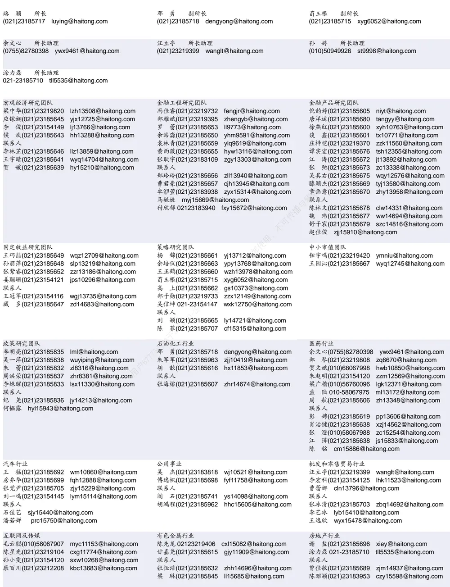

| 电子行业 张晓飞 zxf15282@haitong.com |  | 煤炭行业 李 淼(010)58067998 Im10779@haitong.com |  | 电力设备及新能源行业 吴 杰(021)23183818 | wj10521@haitong.com |
| --- | --- | --- | --- | --- | --- |
| 李 轩(021)23154652 lx12671@haitong.com 华晋书(021)23185608 hjs14155@haitong.com 薛逸民(021)23185630 xym13863@haitong.com 文 灿(021)23185602 wc13799@haitong.com 肖隽翀(021)23154139 xjc12802@haitong.com 崔冰睿(021)23185690 cbr14043@haitong.com 联系人 |  | 王 涛(021)23185633 联系人 朱 彤(021)23185628 | wt12363@haitong.com zt14684@haitong.com | 房 青(021)23185603 fangq@haitong.com 徐柏乔(021)23219171 xbq6583@haitong.com 马天一(021)23185735 mty15264@haitong.com 胡惠民 hhm15487@haitong.com 余玫翰(021)23185617 ywh14040@haitong.com 联系人 |  |
| 郦奕滢 lyy15347@haitong.com 张幸 zx15429@haitong.com |  |  |  | 姚望洲(021)23185691 马菁菁(021)23185627 吴志鹏(021)23215736 罗 青(021)23185966 孔淑媛(021)23183806 | ywz13822@haitong.com mjj14734@haitong.com wzp15273@haitong.com lq15535@haitong.com ksy15683@haitong.com |
| 刘 威(0755)82764281 Iw10053@haitong.com 张翠翠(021)23185611 zcc11726@haitong.com yl11036@haitong.com |  | 计算机行业 郑宏达(021)23219392 zhd10834@haitong.com 杨 林(021)23183969 |  | 通信行业 余伟民(010)50949926 ywm11574@haitong.com |  |
|  |  | 洪 琳(021)23185682 hl11570@haitong.com |  | 杨彤昕 010-56760095 ytx12741@haitong.com |  |
| 孙维容(021)23185389 | swr12178@haitong.com lz11785@haitong.com | 杨 蒙(021)23185700 联系人 |  | 于一铭 021-23183960 yym15547@haitong.con |  |
| 李 智(021)23185842 |  | ym13254@haitong.com | 联系人 |  |  |
| 李 博(021)23185642 | Ib14830@haitong.com | 夏思寒(021)23183968 xsh15310@haitong.com | 夏 凡(021)23185681 xf13728@haitong.com 徐 卓 xz14706@haitong.com |  |  |
|  |  | 杨昊翊(021)23185620 | yhy15080@haitong.com |  |  |
| 何 婷(021)23219634 ht10515@haitong.com |  | 虞 楠(021)23219382 yun@haitong.com | 纺织服装行业 梁 希(021)23185621 | lx11040@haitong.com |  |
| 任广博(010)56760090 婷(010)50949926 | rgb12695@haitong.com | 陈 宇(021)23185610 cy13115@haitong.com | 盛 开(021)23154510 | sk11787@haitong.com |  |
| 孙 | st9998@haitong.com | 罗月江(010)58067993 lyj12399@haitong.com | 联系人 王天璐(021)23185640 |  |  |
| 曹 锟010-56760090 ck14023@haitong.com 联系人 联系人 |  | 吕春雨 Icy15841@haitong.com |  | wtl14693@haitong.com |  |
| 肖 尧(021)23185695 | xy14794@haitong.com |  | 传播 |  |  |
| 建筑建材行业 |  | 机械行业 | 钢铁行业 |  |  |
| 冯晨阳(021)23183846 fcy10886@haitong.com 毛冠锦 021-23183821 mgj15551@haitong.com 申 浩(021)23185636 sh12219@haitong.com |  | 赵靖博(021)23185625 zjb13572@haitong.com 赵玥炜(021)23219814 zyw13208@haitong.com |  | 刘彦奇(021)23219391 liuyq@haitong.com |  |
|  |  | 联系人 丁嘉一021-23180000 刘绮雯(021)23185686 | djy15819@haitong.com lqw14384@haitong.com |  |  |
| 建筑工程行业 张欣劼 18515295560 zxj12156@haitong.com 联系人 |  | 农林牧渔行业 李 淼(010)58067998 Im10779@haitong.com 巩 健(021)23185702 gj15051@haitong.com |  | 食品饮料行业 颜慧菁(021)23183952 yhj12866@haitong.com 张宇轩(021)23154172 |  |
| 曹有成(021)23185701 郭好格(010)58067828 | cyc13555@haitong.com ghg14711@haitong.com | 冯 鹤 fh15342@haitong.com 联系人 |  | 程碧升(021)23185685 联系人 | zyx11631@haitong.com cbs10969@haitong.com |
|  |  | 蔡子慕(021)23183965 czm15689@haitong.com |  | 苗 欣 mx15565@haitong.com | 张嘉颖(021)23185613 zjy14705@haitong.com |
| 军工行业 | zhx10170@haitong.com | 银行行业 林加力(021)23154395 ljl12245@haitong.com |  | 社会服务行业 |  |
| 张恒晅(021)23183943 联系人 |  | 董栋梁(021)23185697 ddl13206@haitong.com |  | 汪立亭(021)23219399 许樱之(755)82900465 | wanglt@haitong.com xyz11630@haitong.com |
| 刘砚菲(021)23185612 | lyf13079@haitong.com hsj14606@haitong.com | 联系人 徐凝碧(021)23185609 xnb14607@haitong.com |  | 王祎婕(021)23185687 | wyj13985@haitong.com |
| 胡舜杰(021)23155686 | lyq15646@haitong.com |  |  | 联系人 毛弘毅(021)23183110 |  |
| 李雨泉(021)23185843 |  |  |  |  | mhy13205@haitong.com |
| 家电行业 |  | 造纸轻工行业 |  | 环保行业 |  |
|  | chenzy@haitong.com | 郭庆龙 gql13820@haitong.com |  | 戴元灿(021)23185629 |  |
| 陈子仪(021)23219244 |  | 高翩然 gpr14257@haitong.com |  |  | dyc10422@haitong.com |
| 李 阳(021)23185618 刘 璐(021)23185631 | ly11194@haitong.com II11838@haitong.com | 王文杰(021)23185637 wwj14034@haitong.com |  | 联系人 杨寅琛(021)23188562 yyc15266@haitong.com |  |

## 研究所销售团队

深广地区销售团队

伏财勇(0755)23607963 fcy7498@haitong.com

蔡铁清(0755)82775962 ctq5979@haitong.com

辜丽娟(0755)83253022 gulj@haitong.com

刘晶晶(0755)83255933 liujj4900@haitong.com

饶 伟(0755)82775282 rw10588@haitong.com

欧阳梦楚(0755)23617160

oymc11039@haitong.com

巩柏含 gbh11537@haitong.com

张馨尹 0755-25597716 zxy14341@haitong.com

海通证券股份有限公司研究所

地址：上海市黄浦区广东路 689号海通证券大厦 9楼

电话：（021）23219000

网址：www.htsec.com 传真：（021）23219392 上海地区销售团队 胡雪梅(021)23219385 huxm@haitong.com 黄 诚(021)23219397 hc10482@haitong.com 季唯佳(021)23219384 jiwj@haitong.com 黄 毓(021)23219410 huangyu@haitong.com 胡宇欣(021)23154192 hyx10493@haitong.com 马晓男 mxn11376@haitong.com 邵亚杰 23214650 syj12493@haitong.com 杨祎昕(021)23212268 yyx10310@haitong.com 毛文英(021)23219373 mwy10474@haitong.com 谭德康 tdk13548@haitong.com 王祎宁(021)23219281 wyn14183@haitong.com 张歆钰 zxy14733@haitong.com 周之斌 zzb14815@haitong.com

北京地区销售团队
殷怡琦(010)58067988 yyq9989@haitong.com
董晓梅 dxm10457@haitong.com
郭 楠 010-5806 7936 gn12384@haitong.com
张丽萱(010)58067931 zlx11191@haitong.com
郭金垚(010)58067851 gjy12727@haitong.com
高 瑞 gr13547@haitong.com
上官灵芝 sglz14039@haitong.com
姚 坦 yt14718@haitong.com
董 晋 dj15843@haitong.com
王 勇 wy15756@haitong.com