## [Tab相关研究

[Table_ReportInfo]《债券量化系列之一——企业债多因子

体系初探》2020.06.04

《海通金工指数增强组合介绍》

2020.06.01

《通往绝对收益之路（二）——通过

轮动的绝对收益策略》2020.05.28

分析师:冯佳睿

Tel:(021)23219732

Email:fengjr@haitong.com

证书:S0850512080006

分析师:余浩淼

Tel:(021)23185650

Email:yhm9591@haitong.com

证书:S0850516050004

## 选股因子系列研究（九十一）——组合规模、交易成本和大单冲击对因子表现的影响分析

## [Table_Sum投资要点：

本文以交易金额占某一时段成交额之比、触发盘口流动性成本和包含大单冲击成本在内的总成本为筛选条件，确定可交易的股票池，并计算相应的因子 IC 与全部 A股中 IC 的差值，循序渐进地探讨了各类流动性的约束条件和成本对因子表现的影响。其中，换仓频率设定为月度和周度，分别对应长周期和短周期两种策略；涉及的因子有，基本面——ROE 和 SUE，技术面——换手率、特质波动率、反转和非流动性，高频——大单净买入金额占比、买入意愿强度和尾盘成交占比、深度学习（周度换仓）。

- 组合规模筛选可交易股票池。我们计算每个股票过去 21 个交易日全天（月度换仓）或开盘后半小时（周度换仓）的成交额均值，以该数值的 5%大于等于组合规模的 0.1%为条件，确定股票池。

- 组合规模对因子表现的影响分析。月度换仓下，ROE 和 3 个高频因子几乎不受影响，而换手率等 个低频量价因子受组合规模的影响巨大。除反转因子外，其余因子的 都随规模的上升而单调下降。周度换仓下，选股范围的大幅缩窄，对因子表现的影响更加突出。在组合规模达到 30 亿以上后，绝大部分因子的 IC

交易成本筛选可交易股票池。根据前期报告中设计的交易成本预测模型，我们可以得到不同组合规模或成交金额占比之下，每只股票潜在的盘口流动性成本。那就可以把前文统一且固定参数的股票池确定方法调整为，如果某只股票的下单金额大到需要承担盘口流动性成本，即，超过买一或卖一委托金额的均值时，就认定该股票无法完成交易，不纳入股票池。

- 交易成本对因子表现的影响分析。月度换仓下，除尾盘成交占比外，其余因子的IC 几乎都低于全部 A股中的结果。而且，随着规模的增加，差距也逐渐拉大；周度换仓下，根据盘口流动性成本确定股票池，因子表现受到的影响较小。

- 大单冲击成本筛选可交易股票池。在得到估计的大单冲击成本后，我们将其与上一章的交易成本（价格波动、买卖价差和盘口流动性）叠加。若某个股票的总成本超过 1%，则认为该股票不可交易，予以剔除。随后，在满足条件的股票池中，重新评估因子的表现。

大单冲击成本对因子表现的影响分析。月度换仓下，纳入大单冲击成本对因子的影响整体较弱，只有 SUE和特质波动率因子在组合规模超过 50 亿后，IC有较为明显的下滑；周度换仓下，是出现大单交易的概率及相应的大单冲击成本陡然上升，所有因子的 IC 相对全部 A 股中的结果都有较大的改变。其中，特质波动率、换手率和两个深度学习因子的 IC都出现了大幅下滑。

- 风险提示。本报告所有分析均基于公开信息，不构成任何投资建议；权益产品收益波动较大，适合具备一定风险承受能力的投资者持有。

市场流动性对股票交易有严重的影响。例如，当某个股票单日的下单金额高于过去一段时间日成交金额均值的一定百分比时，管理人往往会认为该股票流动性不足，从而放弃交易，并转向流动性更好的股票。这本质上是对选股范围施加了隐形的限制，而且，这种限制会随着管理规模的增加愈发凸显，最终使策略的实际表现与理论收益相去甚远。

因此，在设计量化策略并进行回测时，引入流动性方面的考量，就有着非常重要的意义。由于当前大多数量化策略都基于因子开发，故本文聚焦于股票流动性及其衍生问题对因子表现的影响，尝试为更好地评估和应用因子提供更加贴近实践的视角。

## 1. 市场流动性分析及其对选股范围的潜在影响

## 1.1市场流动性变化趋势

直观上，市场的流动性和行情密切相关。当某一风格、板块、行业或主题成为市场热点时，相应股票的交投活跃，流动性自然变得很好。例如，我们从 2014 年起，分年度统计不同市值股票的平均成交金额，一窥市场流动性的变化趋势。具体地，把全市场股票按每年的日均成交金额等分成 20 组，再求组内均值。

由下图可见，不同年份，股票的平均成交金额差异巨大。全面下跌的 2018 年，各市值组别股票的平均成交金额显著小于其他年份，意味着当年的市场流动性较为紧张；2015 年，市场涨幅喜人，投资者情绪高涨，各组别的平均成交额在所有年份中都位列第一，市场流动性较为充裕。

图1 流动性分组的组内平均成交金额（亿元，2014.01-2023.08）

|  | 1 | 2 | 3 | 4 | 5 | 6 | 7 | 8 | 9 | 10 | 11 | 12 | 13 | 14 | 15 | 16 | 17 | 18 | 19 | 20 |
| --- | --- | --- | --- | --- | --- | --- | --- | --- | --- | --- | --- | --- | --- | --- | --- | --- | --- | --- | --- | --- |
| 2014 | 0.12 | 0.18 | 0.23 | 0.27 | 0.31 | 0.36 | 0.41 | 0.46 | 0.52 | 0.59 | 0.67 | 0.77 | 0.88 | 1.02 | 1.20 | 1.45 | 1.80 | 2.35 | 3.41 | 8.94 |
| 2015 | 0.30 | 0.73 | 0.93 | 1.11 | 1.27 | 1.45 | 1.63 | 1.82 | 2.03 | 2.26 | 2.53 | 2.84 | 3.21 | 3.66 | 4.23 | 5.00 | 6.08 | 7.82 | 11.23 | 28.86 |
| 2016 | 0.16 | 0.37 | 0.46 | 0.53 | 0.61 | 0.69 | 0.77 | 0.86 | 0.97 | 1.08 | 1.21 | 1.36 | 1.54 | 1.76 | 2.03 | 2.38 | 2.87 | 3.63 | 5.02 | 10.75 |
| 2017 | 0.08 | 0.19 | 0.24 | 0.28 | 0.32 | 0.37 | 0.42 | 0.48 | 0.54 | 0.62 | 0.71 | 0.81 | 0.94 | 1.11 | 1.33 | 1.62 | 2.05 | 2.75 | 4.13 | 10.79 |
| 2018 | 0.05 | 0.09 | 0.12 | 0.15 | 0.18 | 0.21 | 0.24 | 0.29 | 0.33 | 0.39 | 0.46 | 0.53 | 0.63 | 0.76 | 0.93 | 1.16 | 1.49 | 2.04 | 3.13 | 8.82 |
| 2019 | 0.07 | 0.13 | 0.17 | 0.21 | 0.25 | 0.29 | 0.34 | 0.40 | 0.46 | 0.53 | 0.62 | 0.73 | 0.87 | 1.03 | 1.25 | 1.55 | 1.98 | 2.66 | 4.03 | 10.95 |
| 2020 | 0.05 | 0.14 | 0.19 | 0.24 | 0.30 | 0.37 | 0.44 | 0.53 | 0.63 | 0.75 | 0.89 | 1.06 | 1.27 | 1.53 | 1.87 | 2.33 | 3.00 | 4.07 | 6.22 | 17.04 |
| 2021 | 0.04 | 0.10 | 0.15 | 0.19 | 0.24 | 0.30 | 0.37 | 0.45 | 0.54 | 0.65 | 0.79 | 0.96 | 1.17 | 1.44 | 1.81 | 2.33 | 3.10 | 4.40 | 7.04 | 21.42 |
| 2022 | 0.05 | 0.13 | 0.18 | 0.23 | 0.29 | 0.35 | 0.41 | 0.49 | 0.58 | 0.68 | 0.81 | 0.95 | 1.14 | 1.37 | 1.67 | 2.09 | 2.69 | 3.68 | 5.62 | 14.81 |
| 2023 | 0.03 | 0.12 | 0.17 | 0.22 | 0.27 | 0.32 | 0.38 | 0.44 | 0.52 | 0.61 | 0.72 | 0.85 | 1.01 | 1.22 | 1.49 | 1.85 | 2.40 | 3.28 | 5.08 | 14.54 |

资料来源：Wind，海通证券研究所

另一方面，日均成交金额最高的第 20 组与最低的第 1组之间的成交金额差异似有随时间拉大的趋势。为了剔除各年份市场自身流动性的影响，更好地观察不同分组日均成交金额的差异，我们计算每一组日均成交金额相对市场日均成交金额中位数的倍数。

图2 流动性分组的组内平均成交金额相对全市场中位数的倍数（2014.01-2023.08）

|  | 1 | 2 | 3 | 4 | 5 | 6 | 7 | 8 | 9 | 10 | 11 | 12 | 13 | 14 | 15 | 16 | 17 | 18 | 19 | 20 |
| --- | --- | --- | --- | --- | --- | --- | --- | --- | --- | --- | --- | --- | --- | --- | --- | --- | --- | --- | --- | --- |
| 2014 | 0.18 | 0.27 | 0.34 | 0.41 | 0.48 | 0.56 | 0.64 | 0.73 | 0.83 | 0.94 | 1.07 | 1.23 | 1.42 | 1.65 | 1.95 | 2.35 | 2.92 | 3.81 | 5.47 | 13.50 |
| 2015 | 0.13 | 0.30 | 0.38 | 0.45 | 0.52 | 0.60 | 0.67 | 0.76 | 0.85 | 0.95 | 1.06 | 1.20 | 1.36 | 1.56 | 1.82 | 2.16 | 2.65 | 3.45 | 5.03 | 13.60 |
| 2016 | 0.14 | 0.32 | 0.40 | 0.47 | 0.53 | 0.60 | 0.67 | 0.76 | 0.85 | 0.95 | 1.06 | 1.19 | 1.35 | 1.55 | 1.79 | 2.10 | 2.54 | 3.23 | 4.48 | 9.70 |
| 2017 | 0.13 | 0.28 | 0.35 | 0.42 | 0.49 | 0.56 | 0.63 | 0.72 | 0.82 | 0.94 | 1.08 | 1.24 | 1.45 | 1.71 | 2.05 | 2.51 | 3.20 | 4.31 | 6.53 | 17.41 |
| 2018 | 0.11 | 0.22 | 0.28 | 0.35 | 0.42 | 0.49 | 0.58 | 0.68 | 0.79 | 0.93 | 1.09 | 1.28 | 1.52 | 1.82 | 2.22 | 2.77 | 3.59 | 4.91 | 7.57 | 21.51 |
| 2019 | 0.11 | 0.22 | 0.28 | 0.35 | 0.42 | 0.50 | 0.58 | 0.68 | 0.79 | 0.93 | 1.09 | 1.28 | 1.53 | 1.83 | 2.24 | 2.79 | 3.59 | 4.87 | 7.42 | 20.46 |
| 2020 | 0.06 | 0.17 | 0.23 | 0.30 | 0.37 | 0.45 | 0.54 | 0.65 | 0.77 | 0.92 | 1.10 | 1.31 | 1.57 | 1.90 | 2.33 | 2.91 | 3.75 | 5.11 | 7.84 | 21.58 |
| 2021 | 0.06 | 0.15 | 0.21 | 0.27 | 0.34 | 0.42 | 0.52 | 0.63 | 0.76 | 0.91 | 1.10 | 1.34 | 1.64 | 2.03 | 2.56 | 3.29 | 4.39 | 6.23 | 9.99 | 30.82 |
| 2022 | 0.06 | 0.17 | 0.24 | 0.31 | 0.39 | 0.47 | 0.56 | 0.66 | 0.78 | 0.92 | 1.09 | 1.29 | 1.54 | 1.85 | 2.27 | 2.83 | 3.65 | 4.99 | 7.63 | 20.14 |
| 2023 | 0.05 | 0.18 | 0.26 | 0.33 | 0.40 | 0.48 | 0.57 | 0.67 | 0.79 | 0.92 | 1.09 | 1.29 | 1.53 | 1.85 | 2.26 | 2.82 | 3.64 | 5.00 | 7.73 | 22.16 |

资料来源：Wind，海通证券研究所

由上图可见，2017 年以来，随着 A股市场机构化程度的提升，日均成交金额最高组别相对市场中位数的倍数逐渐稳定在 20倍附近。相反，日均成交金额最低组别相对市场中位数的倍数，则从 14 年开始逐年降低至 23 年的 0.05 倍。

由于我们是对所有股票 20 等分，因此随着股票总数逐年增加，每个分组中的股票数目也是同步增加的。日均成交金额最大组的相对倍数稳定和最小组的相对倍数下降，意味着越来越多股票的流动性正在变差，这对管理规模较大的基金经理而言，是不得不正视的问题。

## 1.2市场流动性对选股范围的潜在影响

当我们在对量化策略进行回测时，往往习惯于按当日收盘价完成调仓。但实际上，交易信号通常都在盘后生成，因此交易需要等到下一个交易日。然而，这一天中，交易时段的不同会使最终获得的实际收益大相径庭。对于任何一个投资者，无论是看多买入股票还是看空卖出股票，都希望实际收益能够尽可能贴近按前收盘价计算的数值，从而减少因交易问题造成的理论 alpha 的损失。

为对比不同时段的交易保留股票收益的能力，我们定义收益保存比例为，（收盘价/成交均价-1）/（收盘价/前收盘价-1）。该指标表示按不同交易策略对应的成交价交易，所获得的收益率与理论收益率（按前收盘交易）的比值。下图展示了信号发出后的次日，分别以开盘后半小时和全天 VWAP 为成交价，得到的收益保存比例。显然，开盘后半小时内完成交易相比全天可保留更多的理论收益（alpha）。

图3 开盘后半小时均价与全天均价成交的收益保存比例（2014.01-2023.08）
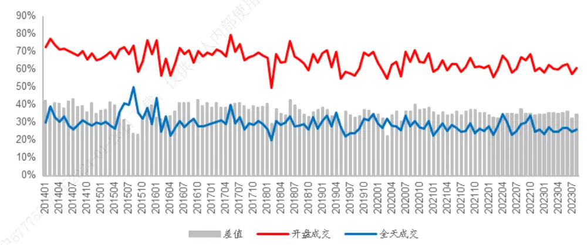
资料来源：Wind，海通证券研究所

对于换仓频率为月度或更长周期的策略而言，这点差异的影响较小，甚至可以忽略不计；但对周度及以下换仓频率的策略，就会产生巨大影响。因此，在实施短周期策略时，我们建议在开盘后半小时内拆单交易；而当换仓周期为月度或更长时，全天内拆单交易会更加从容。

但是，如果某只股票需要交易的金额较大，同时流动性欠佳，那么即使全天交易，也只能完成预定金额的很小比例。此时，我们就认为该股票丧失可交易性，将其从选股范围中剔除。根据这一思路，我们可对短/长周期策略设计不同的流动性筛选条件。

短周期：交易当天，组合内每只股票开盘后半小时成交金额的 5%大于组合规模的 0.1%；

- 长周期：交易当天，组合内每只股票全天交易金额的 5%大于组合规模的 0.1%。

我们设定 1000 万、5000 万、1 亿、5 亿、10 亿、50 亿和 100 亿，共 7 个不同的组合规模，分别考察不同规模下，短周期和长周期策略在剔除符合各自筛选条件的股票后，最终的可交易股票数量及其占比。

图4 长周期策略可交易股票数量（2014.01-2023.08）
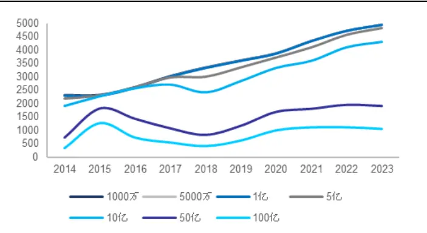
资料来源：Wind，海通证券研究所

图5 长周期策略可交易股票数量占比（2014.01-2023.08）
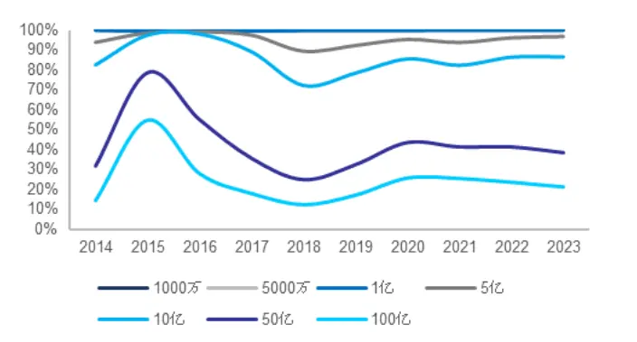
资料来源： ，海通证券研究所

如以上两图所示，随着组合规模的增长，长周期策略可交易股票的数量及其占比单调下降，但并非线性。当规模≤10 亿时，可交易股票的数量未受太大影响。2023 年，约在 3500-4500 只之间。但当规模达到 50 亿时，可交易股票的数量骤降至 1500 只；100亿时，仅有 1000 只左右的股票可交易。

另一方面，随着时间推移，上市公司数量越来越多，组合规模较小（≤10 亿）时，可交易股票的数量及其占比 2018 年以来逐渐上升。但对于 50亿及以上的规模，数量则基本稳定在 1000-1500 只，占比在 30%-40%之间。

在周度换仓假设下，由于交易需要在开盘后半小时内完成，故可交易股票的数量及占比对组合规模更加敏感。当规模≥5亿时，就开始显著下降；当规模达到 50（100）亿后，可交易股票的数量便不足 500（200）只，占比仅为 10%（5%）。

图6 短周期策略可交易股票数量（2014.01-2023.08）
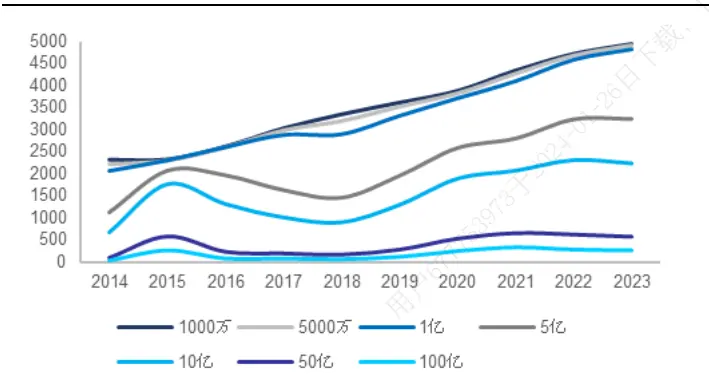
资料来源：Wind，海通证券研究所

图7 短周期策略可交易股票数量占比（2014.01-2023.08）
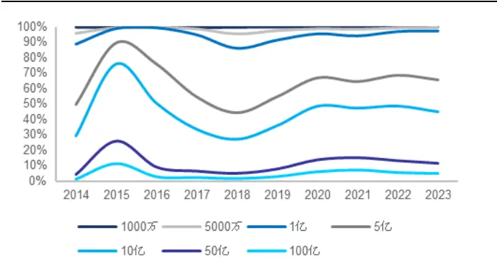
资料来源：Wind，海通证券研究所

综上所述，我们认为，以往基于因子全市场表现所构造的多因子组合，未必能完全适应规模扩大后的产品。利用先验的股票成交金额信息，适当地划定选股范围，然后在其中筛选有效因子，并构建组合或许是更好的方式。

## 2. 组合规模对因子表现的影响分析

根据股票的历史成交额确定选股范围，是应对不同管理规模的常用方法。因此，考察不同组合规模对因子表现的影响，等同于对比在和规模相匹配的各个股票池内，因子的表现差异。

具体地，我们计算每个股票过去 21个交易日全天（月度换仓）或开盘后半小时（周度换仓）的成交额均值，以该数值的 5%大于等于组合规模的 0.1%为条件，确定股票池。在其中，计算常用的基本面因子——ROE和 SUE，技术面因子——换手率、特质波动率、反转和非流动性，高频因子——大单净买入金额占比、买入意愿强度和尾盘成交占比、深度学习因子（周度换仓）的 IC。

这里，组合规模是一个参数，设定为 1000 万、5000 万、1 亿、5 亿、10 亿、50亿和 100 亿。所有因子都做了市值、行业和估值中性化，技术面因子还和基本面因子中性化，而高频因子、深度学习因子则同时和基本面及技术面因子中性化（下同）。为方便对比，将所有与收益率负相关的因子乘以-1 后，再计算 IC。

## 2.1组合规模对因子月度IC的影响分析

由下表可见，当组合规模≤10 亿时，各因子的 IC 相比股票池为全部 A股的结果，几乎没有任何变化，反转因子的IC甚至还有小幅提升。但当组合规模上升至50亿，SUE、特质波动率、换手率和非流动性因子的 IC开始出现下降。当组合规模进一步达到 100亿后，这 4 个因子的 IC继续降低。同时，反转因子也受到了一定的拖累。由此可见，组合规模的增大带来的选股范围的缩窄，对部分因子，尤其是低频量价因子的表现还是产生了不可忽视的负面影响。

表 1 不同组合规模下的因子月度 IC（2014.01-2023.08）

|  | 全A | 1000万 | 5000万 | 1亿 | 5亿 | 10亿 | 50亿 | 100亿 |
| --- | --- | --- | --- | --- | --- | --- | --- | --- |
| ROE | 0.033 | 0.033 | 0.033 | 0.033 | 0.033 | 0.034 | 0.037 | 0.037 |
| SUE | 0.032 | 0.032 | 0.032 | 0.032 | 0.031 | 0.031 | 0.027 | 0.026 |
| 特质波动率 | 0.048 | 0.048 | 0.048 | 0.048 | 0.048 | 0.048 | 0.044 | 0.037 |
| 换手率 | 0.054 | 0.049 | 0.049 | 0.049 | 0.048 | 0.049 | 0.038 | 0.031 |
| 反转 | 0.041 | 0.045 | 0.045 | 0.045 | 0.046 | 0.047 | 0.045 | 0.039 |
| 非流动性 | 0.023 | 0.023 | 0.023 | 0.023 | 0.023 | 0.023 | 0.016 | 0.009 |
| 尾盘成交占比 | 0.035 | 0.035 | 0.035 | 0.035 | 0.036 | 0.037 | 0.046 | 0.044 |
| 买入意愿强度 | 0.032 | 0.032 | 0.032 | 0.032 | 0.032 | 0.033 | 0.035 | 0.034 |
| 大单净买入占比 | 0.039 | 0.039 | 0.039 | 0.039 | 0.039 | 0.040 | 0.042 | 0.041 |

资料来源：Wind，海通证券研究所

为了更加清晰地考察因子 IC 随组合规模的变化，我们以 1 亿为间隔，计算规模在1-100 亿递增的过程中，因子在逐渐变小的选股范围内的 IC 与全部 A股中 IC 的差值。

图8 不 同 组 合 规 模 下 ， 基 本 面 因 子 的 月 度 IC 差 值（2014.01-2023.08）
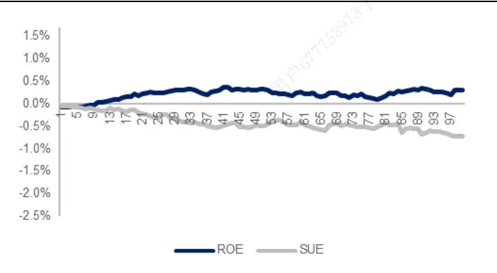
资料来源：Wind，海通证券研究所

图9 不 同 组 合 规 模 下 ， 技 术 面 因 子 的 月 度 IC 差 值（2014.01-2023.08）
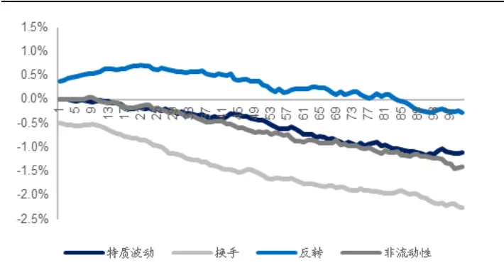
资料来源：Wind，海通证券研究所

ROE和 3 个高频因子（尾盘成交占比、买入意愿强度和大单净买入占比）在组合规模适中乃至较大时，有更高的 IC。这意味着，我们至少无需担心这 4个因子在市值较大或流动性较好股票中的表现，会出现大幅衰减。

相反，换手率等 4个低频量价因子受组合规模的影响巨大。除反转因子外，其余因子的 IC都随规模的上升而单调下降。特质波动率和非流动性因子在规模处于 10 亿以下时，尚能维持较优的表现。但当规模进一步上升，其 IC 的衰减幅度也越来越大。反转因子在组合规模高于 80亿后，IC 也不及全部 A股中的结果。因此，我们建议，在应用低频量价因子时，需把组合规模、市场流动性等因素作为关键变量，纳入决策中。

图10 不 同 组 合 规 模 下 ， 高 频 因 子 的 月 度 IC 差 值（2014.01-2023.08）
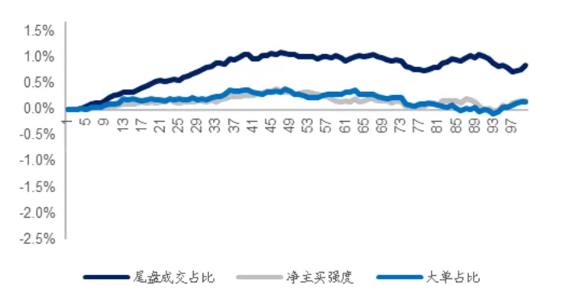
资料来源：Wind，海通证券研究所

以上的测试表明，即使是交易约束相对宽松、对信号发出后的下一个交易日的收益保存比例没有太高要求，即，允许在全天内完成交易的月度换仓，组合规模对部分因子表现的影响依然显著。那么，当换仓频率提高，对交易的要求越来越严格后，更应警惕因子选股能力潜在的衰减，不能简单地根据全部 A股中的测试结果判断或挑选因子。

## 2.2组合规模对因子周度IC的影响分析

由于周度调仓下的持仓周期较短，每一天的收益都很重要。因此，投资者必然希望提高信号次日的收益保存比例，从而倾向于在开盘后半小时内完成交易。于是，我们将股票的筛选条件改为，过去 个交易日开盘后半小时成交额的 大于等于组合规模的。随后，在和表 相同的规模设定下，计算因子的 。

表 2 不同组合规模下的因子周度 IC（2014.01-2023.08）

|  | 全市场 | 1000万 | 5000万 | 1亿 | 5亿 | 10亿 | 50亿 | 100亿 |
| --- | --- | --- | --- | --- | --- | --- | --- | --- |
| ROE | 0.019 | 0.018 | 0.018 | 0.019 | 0.020 | 0.021 | 0.017 | 0.006 |
| SUE | 0.019 | 0.019 | 0.018 | 0.018 | 0.018 | 0.018 | 0.013 | 0.002 |
| 特质波动率 | 0.041 | 0.041 | 0.041 | 0.041 | 0.039 | 0.036 | 0.019 | 0.011 |
| 换手率 | 0.036 | 0.028 | 0.028 | 0.028 | 0.024 | 0.020 | 0.011 | 0.006 |
| 反转 | 0.035 | 0.039 | 0.039 | 0.039 | 0.042 | 0.042 | 0.032 | 0.018 |
| 非流动性 | 0.012 | 0.012 | 0.012 | 0.012 | 0.010 | 0.007 | 0.006 | 0.005 |
| 尾盘成交占比 | 0.024 | 0.024 | 0.024 | 0.024 | 0.027 | 0.029 | 0.022 | 0.012 |
| 买入意愿强度 | 0.022 | 0.022 | 0.023 | 0.023 | 0.024 | 0.025 | 0.020 | 0.011 |
| 大单净买入占比 | 0.034 | 0.034 | 0.034 | 0.035 | 0.036 | 0.037 | 0.038 | 0.019 |
| 深度学习因子1 | 0.062 | 0.062 | 0.062 | 0.062 | 0.062 | 0.061 | 0.042 | 0.020 |
| 深度学习因子2 | 0.054 | 0.054 | 0.054 | 0.054 | 0.054 | 0.052 | 0.031 | 0.013 |

资料来源：Wind，海通证券研究所

和月度换仓的结果类似，10 亿对大多数因子而言，依然是一个“安全”的规模，仅换手率和非流动性因子的 IC 降幅较大。当规模上升至 50 亿后，除大单净买入占比因子的表现未受影响外，其余因子的 IC都出现不同程度的降低。而在规模达到 100 亿之后，即使是表现一直较为稳定的深度学习因子，IC 也未能超过 0.02。

根据我们的计算，开盘后半小时的成交金额大致为全天的 1/3。这使得当组合规模超过 50亿后，不满足筛选条件的股票大幅增加，导致因子 IC的计算难度陡然上升，结果的稳定性也无法保证。所以，我们主要考察规模在 1- 50 亿之间，并按 1亿递增的过程中，因子在逐渐变小的选股范围内的 IC与全部 A股中 IC 的差值，结果如图 11-14 所示。

图11 不 同 组 合 规 模 下 ， 基 本 面 因 子 的 周 度 IC 差 值（2014.01-2023.08）
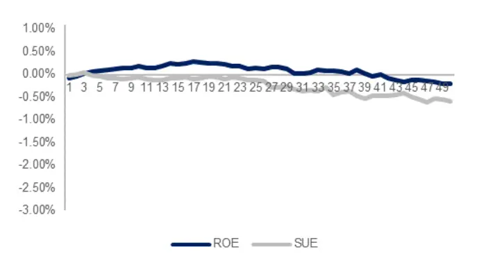
资料来源：Wind，海通证券研究所

图12 不 同 组 合 规 模 下 ， 技 术 面 因 子 的 周 度 IC 差 值（2014.01-2023.08）
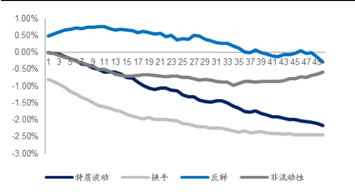
资料来源：Wind，海通证券研究所

图13 不 同 组 合 规 模 下 ， 高 频 因 子 的 周 度 IC 差 值（2014.01-2023.08）
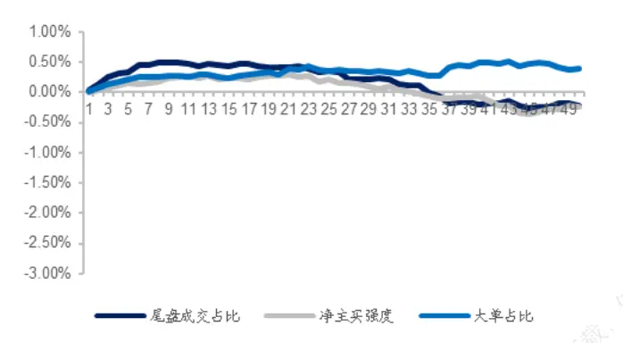
资料来源：Wind，海通证券研究所

图14 不同组合规模下，深度学习因子的周度 IC 差值（2014.01-2023.08）
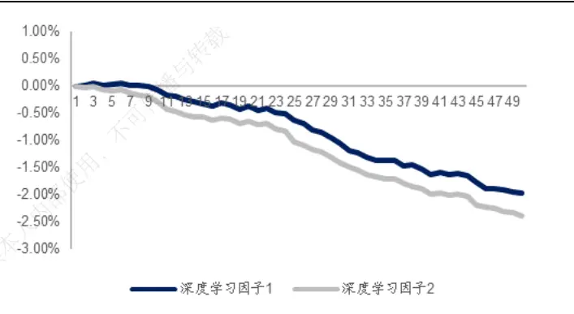
资料来源：Wind，海通证券研究所

周度换仓带来的选股范围的大幅缩窄，对因子表现的影响显而易见。在剔除流动性不那么好的股票后，仅大单净买入占比因子的 IC有所提升，其余因子在组合规模达到30 亿以上后，IC 都低于全部 A 股中的结果。其中，尤以低频量价因子中的特质波动率和换手率，以及高频深度学习因子的降幅为甚。

## 3. 交易成本对因子表现的影响分析

上文根据股票历史成交额确定可交易的股票池时，对所有股票采用了统一的标准。即，过去一段时间内成交额均值的 5%大于组合规模的 0.1%。其背后的逻辑是，交易不满足这一条件的股票，容易产生过高的交易成本，使得信号在该股票上无法获取收益。但这一标准过于简单粗暴，甚至不合理。每个股票的交易活跃度差异很大，有些股票在交易金额占比超过成交额均值 5%时，依然不会有额外的交易成本；而有些流动性差的股票可能在占比达到 2%后，就会面临高昂的交易成本。所以，更加严谨的确定可交易股票池的方法是，为每个股票设定交易成本的阈值，如果交易金额过大导致成本高于阈值，则放弃该股票的交易，并予以剔除。

在海通量化团队前期的专题报告——《高频策略交易成本的分析和预测》中，我们将交易成本细分为价格波动、买卖价差、盘口流动性、价格走势和限价单成交概率五个组成部分，并设计了基于高频数据的预测模型，来获得前三部分的估计值。我们尝试将该模型应用于股票池的筛选，以考察这三个部分对因子表现的影响。

## 3.1个股交易成本分析

理论上，无论下单量多少，投资者均需承担价格波动和买卖价差。而且，根据成本计算公式，价格波动和买卖价差并不随下单量的增加而上升。因此，我们首先分析两者是否会对因子表现产生影响。为了避免量纲对结果的干扰，我们直接用收益率减预测的交易成本，再计算 IC。即，高成本的股票被放到了空头端。

表 3 价格波动和买卖价差对因子 IC 的影响（2021.07-2023.08）

|  | 月度 |  |  | 周度 |  |  |
| --- | --- | --- | --- | --- | --- | --- |
|  | 原始 | 扣除成本 (开盘后) | 扣除成本 (全天) | 原始 | 扣除成本 (开盘后) | 扣除成本 (全天) |
| ROE | 0.011 | 0.010 | 0.010 | 0.008 | 0.008 | 0.008 |
| SUE | 0.006 | 0.006 | 0.006 | 0.009 | 0.009 | 0.009 |
| 特质波动 | 0.035 | 0.034 | 0.034 | 0.027 | 0.027 | 0.027 |
| 换手 | 0.052 | 0.052 | 0.052 | 0.026 | 0.027 | 0.026 |
| 反转 | 0.038 | 0.038 | 0.038 | 0.033 | 0.034 | 0.033 |
| 非流动性 | 0.010 | 0.010 | 0.010 | 0.004 | 0.003 | 0.004 |
| 尾盘成交占比 | 0.016 | 0.017 | 0.017 | 0.010 | 0.010 | 0.010 |
| 净主买强度 | 0.032 | 0.032 | 0.032 | 0.017 | 0.016 | 0.017 |
| 大单净买入占比 | 0.014 | 0.012 | 0.013 | 0.010 | 0.010 | 0.010 |
| 深度学习因子1 | - | - | - | 0.042 | 0.042 | 0.042 |
| 深度学习因子2 |  |  | - | 0.036 | 0.036 | 0.036 |

资料来源：Wind，海通证券研究所

如上表所示，不论是月度还是周度换仓，也不论是在开盘后半小时内还是全天完成交易，因子 IC几乎不受价格波动和买卖价差的影响。这表明，当组合规模变大，投资者虽可能面临更高的交易成本，但其中的价格波动和买卖价差并不会降低因子表现。

那么，交易成本中的第三部分——盘口流动性是如何影响因子 C的呢？我们认为，如果股票的下单量过大，比如使用 TWAP策略时，连续“吃”掉对手盘的一档委托订单，那么很容易诱发订单簿向不利于自身的方向变动，产生额外的冲击成本。从而扭曲理论收益，最终降低因子的 C。

前文在测算组合规模对因子表现的影响时，为了计算方便，我们简单地以某个股票一段时间内成交额均值的 5%大于等于组合规模的 0.1%为标准，挑选可交易的股票。但在计算盘口流动性成本时，组合规模的 和成交额均值的 便成了两个参数。显然，5 亿规模的 0.1%和 50 亿规模的 0.1%，交易同一个股票的难度和成本不可直接等同；而50 亿规模的 0.1%，即 500万，同时交易大盘股和小盘股，占成交额均值的比例很有可能截然不同，那么两者对应的成本也将大相径庭。因此，我们对这两个参数分别展开测试，以此获得对盘口流动性成本的直观认识。

首先是组合规模，以下两图展示了规模按 1亿的间隔从 1-50 亿递增时，假设每只股票都以组合规模的 交易，产生的流动性成本，即收益损失幅度的分布。

图15 不同组合规模对应的盘口流动性成本（开盘后半小时，2021.07-2023.08）
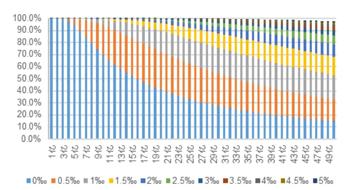
资料来源：Wind，海通证券研究所

图16 不 同 组 合 规 模 对 应 的 盘 口 流 动 性 成 本 （ 全 天 ，2021.07-2023.08）
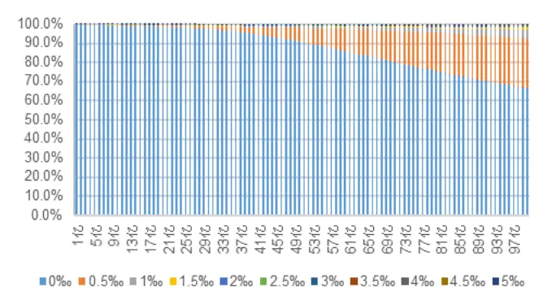
资料来源：Wind，海通证券研究所

由图 15可见，如果在开盘后半小时内完成交易，随着组合规模的逐步增加，盘口流动性带来的成本越来越大。当组合规模达到 16亿时，50%的股票都需承担盘口流动性成本；而当组合规模上升至 50 亿时，近 70%股票的盘口流动性成本超过 1‰。

如果是全天完成交易，投资者承担的盘口流动性成本显著降低。即便组合规模达到100 亿，也有近 70%的股票不存在额外的盘口流动性成本，仅有不到 10%股票的盘口流动性成本大于 1‰。

其次是占成交金额的百分比，我们计算了每只股票的下单金额占过去 21 个交易日开盘后半小时或全天成交金额均值的比例，按 1%的间隔从 1%到 30%递增时，对应的流动性成本，即收益损失幅度的分布，结果如以下两图所示。

图17 不同成交金额占比对应的盘口流动性成本（开盘后半小时，2021.07-2023.08）
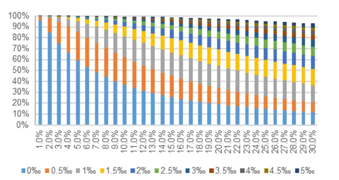
资料来源：Wind，海通证券研究所

图18 不同成交金额占比对应的盘口流动性成本（全天，2021.07-2023.08）
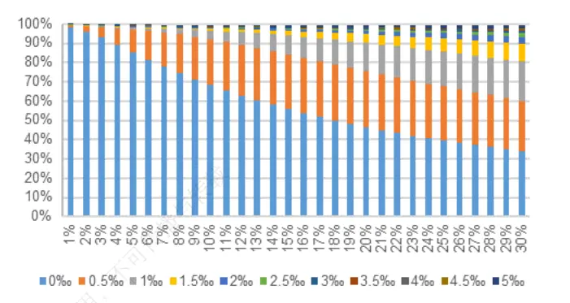
资料来源： ，海通证券研究所

若是开盘后半小时内完成交易，那么下单金额占 21 日成交金额均值的比例达到 7%时，就有超过半数的股票需承担盘口流动性成本；若是全天，则占比接近 18%时，才有一半股票需承担盘口流动性成本。

综上所述，根据前期报告中设计的交易成本预测模型，我们可以得到不同组合规模或成交金额占比之下，每只股票潜在的盘口流动性成本。那就可以把前文统一且固定参数的股票池确定方法调整为，如果某只股票的下单金额大到需要承担盘口流动性成本，即，超过买一或卖一委托金额的均值时，就认定该股票无法完成交易，不纳入股票池。

## 3.2交易成本对因子月度IC的影响分析

我们依然以 1亿为间隔，得到 1-100 亿之间规模递增的 100 个组合，并假设每只股票的交易金额占比为 0.1%。随后，基于 3.1 节的股票筛选方式得到对应的无盘口流动性成本的股票池，再从收益率中扣除价格波动和买卖价差成本，计算月度因子 IC。

图19 盘口流动性成本筛选后，基本面因子的月度 IC 差值（2021.08-2023.08）
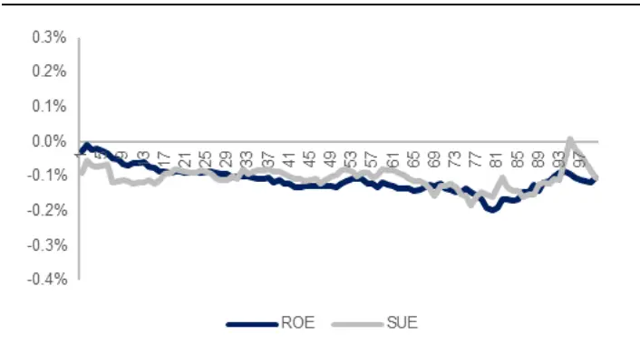
资料来源：Wind，海通证券研究所

图20 盘口流动性成本筛选后，技术面因子的月度 IC 差值（2021.08-2023.08）
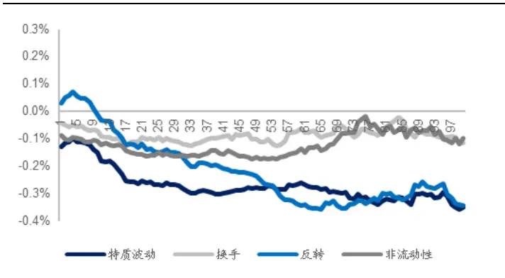
资料来源：Wind，海通证券研究所

由图 19-21 可见，除尾盘成交占比外，其余因子的 IC几乎都低于全部 A股中的结果。而且，随着规模的增加，差距也逐渐拉大。但若是对比图 12 和图 20，则可发现，统一且固定参数的股票筛选方法对应的 IC降幅要大得多。

图21 盘口流动性成本筛选后，高频因子的月度 IC 差值（2021.08-2023.08）
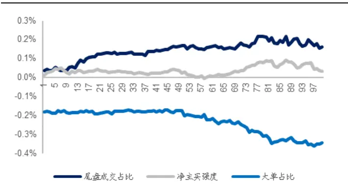
资料来源：Wind，海通证券研究所

我们认为，盘口流动性成本与成交金额大小并不呈严格的线性关系，按成交金额占比确定股票池，可能会高估流动性对因子表现的影响程度，容易误判因子的可用性。

## 3.3交易成本对因子周度 IC的影响分析

若是周频调仓，我们仍假设交易需在开盘后半小时内完成，并将规模限制在 1-50亿之间变化，其余设定和 3.2 节完全相同。

图22 盘口流动性成本筛选后，基本面因子的周度 IC 差值（2021.07-2023.08）
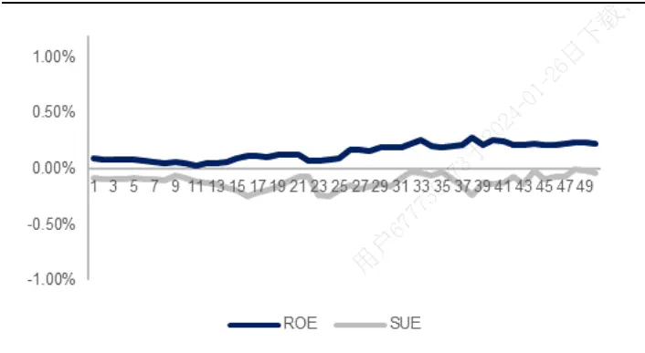
资料来源：Wind，海通证券研究所

图23 盘口流动性成本筛选后，技术面因子的周度 IC 差值（2021.07-2023.08）
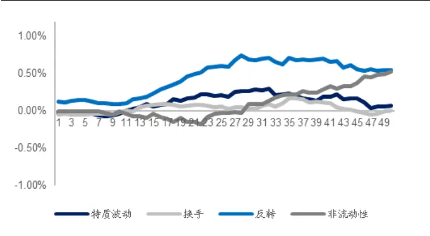
资料来源：Wind，海通证券研究所

图24 盘口流动性成本筛选后，高频因子的周度 IC 差值（2021.07-2023.08）
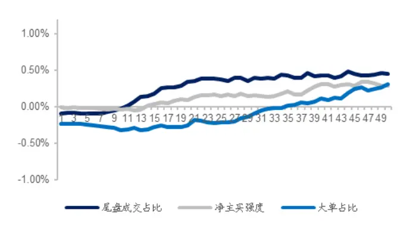
资料来源：Wind，海通证券研究所

图25 盘口流动性成本筛选后，深度学习因子的周度 IC 差值（2021.07-2023.08）
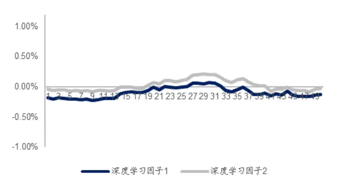
资料来源：Wind，海通证券研究所

整体来看，根据盘口流动性成本确定股票池，对因子在周度调仓下的表现影响较小。尤其是图 23 中的低频量价因子和图 25 中的深度学习因子，当使用固定且统一的成交金额占比筛选股票时，它们的 IC 都随着规模的增加而大幅下降（图 12 和 14）。由此可见，更加精细的流动性刻画，有助于我们更好地评价因子的绩效。

## 4. 大单冲击成本对因子表现的影响分析

## 4.1大单冲击成本的定义与计算

上一章的成本预测模型实际上暗含着一个假定，即，投资者下的委托单不会对市场产生任何冲击。但事实是，在一个充满博弈的市场中，任何人的行为都有可能打破当前短暂的均衡状态。尤其是当订单的金额较大时，市场很有可能加速朝对己方不利的方向运动，带来更大的冲击成本。这对可交易股票池的确定和因子 的计算，都有着不可忽视的影响。因此，我们尝试借鉴海通量化团队前期的专题报告——《选股因子系列研究（七十二）——大单的精细化处理与大单因子重构》中，大单因子的构建思路，估计这部分大单冲击成本。

具体地，当我们下单金额较大，不得不用大单完成买入交易时，本质上增加的是该股票交易当天的大单净主买金额占比；反之，则为减少。显然，前者会抬升股票价格，后者则会降低。这就给我们估计大单的冲击成本提供了思路，把开盘后半小时或全天的VWAP 相对前收盘价的收益率作为交易成本的度量，与同时段的大单净主买占比回归，以此刻画大单净主买占比一个单位的变动带来的收益率变化，即，大单冲击成本。

下图展示了回归系数的时间序列变化。除 2015 年股市异常波动期间，其余时点的回归系数都较为平稳。因此，如果我们需要估计当前下的这个大单大约会产生多少冲击成本，可使用最近 21个交易日的回归系数均值建立预测模型。

图26 大单冲击成本与大单净主买占比的回归系数（2014.01-2023.08）
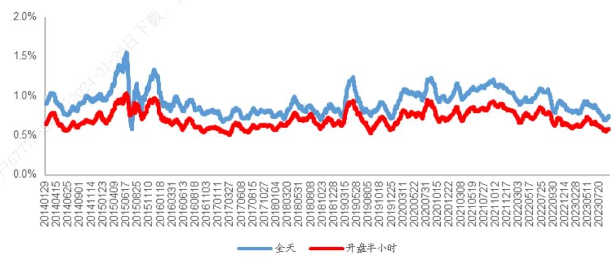
资料来源： ，海通证券研究所

假设我们的策略都在每月（周）最后一个交易日产生信号，并默认将下单金额平均拆分到 237*6（30*6）个订单中，即，每分钟等时间间隔交易 6次。那么，就可得到不同组合规模下，每个股票的交易金额占规模的 0.1%时，出现大单交易的股票占比。

当换仓频率为月度时（图 27），一方面，2018 年以前，无论组合规模多大，全天拆单后，均不会出现大单交易。但是最近三年，同样的下单金额，出现大单交易的股票占比显著上升。另一方面，当组合规模较小（10 亿以下），即，单个股票的交易金额不高时，也极少出现大单交易。

与全天下单的情形不同，开盘后半小时内完成交易的下单次数大幅减少，因此，当组合规模较大时（20 亿及以上），极易出现大单交易。2018 年以来，50 亿规模的组合几乎一定会遭遇我们所定义的大单交易（图 28）。

图27 月度换仓出现大单交易的股票占比（2014.03-2023.08）
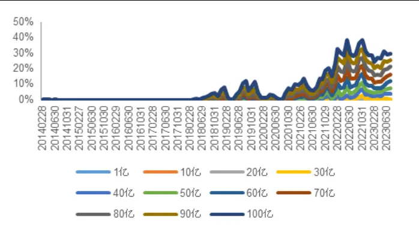
资料来源：Wind，海通证券研究所

图28 周度换仓出现大单交易的股票占比（2014.01-2023.08）
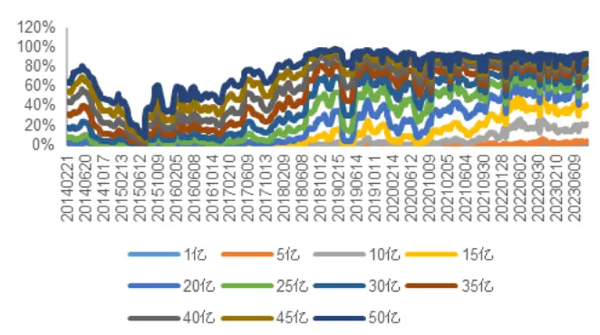
资料来源：Wind，海通证券研究所

在得到估计的大单冲击成本后，我们将其与上一章的交易成本（价格波动、买卖价差和盘口流动性）叠加。若某个股票的总成本超过 1%，则认为该股票不可交易，予以剔除。随后，在满足条件的股票池中，重新评估因子的表现。

## 4.2大单冲击成本对因子月度 IC的影响分析

首先，我们考察月频调仓、全天交易的假设下，1-100 亿元之间按 1亿递增的 100个不同规模的组合对应的股票池中，因子 IC 与全部 A股中 IC的差值。其中，组合内每个股票的交易金额为组合规模的 0.1%；计算 IC 时，收益扣除了总成本。

图29 总 成 本 筛 选 后 ， 基 本 面 因 子 的 月 度 IC 差 值（2021.08-2023.08）
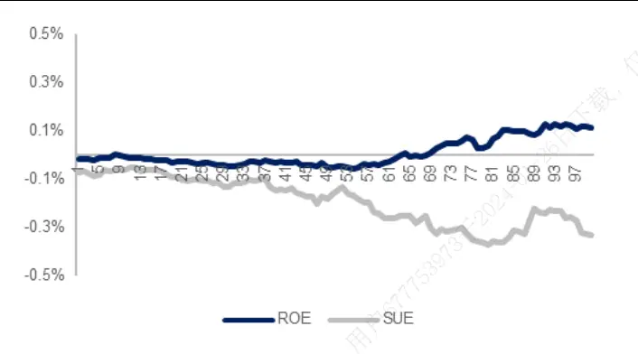
资料来源：Wind，海通证券研究所

图30 总 成 本 筛 选 后 ， 技 术 面 因 子 的 月 度 IC 差 值（2021.08-2023.08）
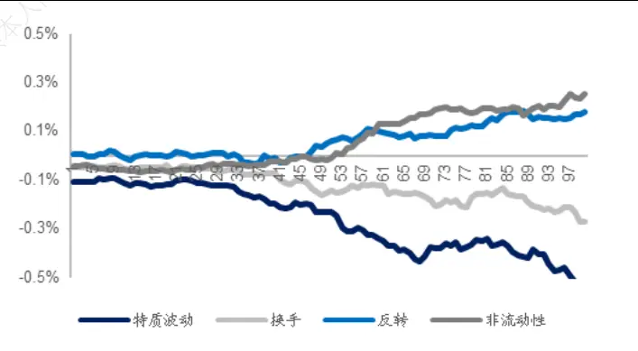
资料来源：Wind，海通证券研究所

图31 总 成 本 筛 选 后 ， 高 频 因 子 的 月 度 IC 差 值（2021.08-2023.08）
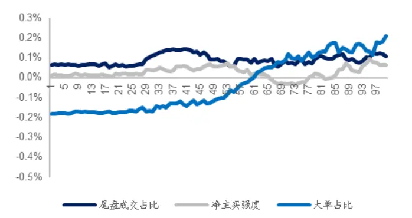
资料来源：Wind，海通证券研究所

由图 31-33 可见，纳入大单冲击成本对因子月度 IC的影响整体较弱。只有 SUE和特质波动率因子在组合规模超过 50亿后，IC 有较为明显的下滑。我们认为，这是由于经过总成本的过滤后，剩余股票出现大单交易的概率相对较低，即便出现，产生的大单冲击成本也不高。

## 4.3大单冲击成本对因子周度 IC的影响分析

其次，我们考察周频调仓、开盘后半小时内交易的假设下，1-50 亿元之间按 1 亿递增的 50个不同规模的组合对应的股票池中，因子 IC与全部 A股中 IC的差值。

图32 总 成 本 筛 选 后 ， 基 本 面 因 子 的 周 度 IC 差 值（2021.07-2023.08）
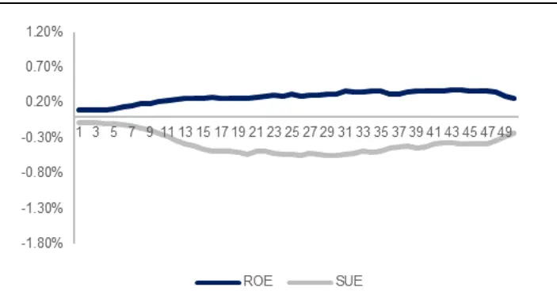
资料来源：Wind，海通证券研究所

图33 总 成 本 筛 选 后 ， 技 术 面 因 子 的 周 度 IC 差 值（2021.07-2023.08）
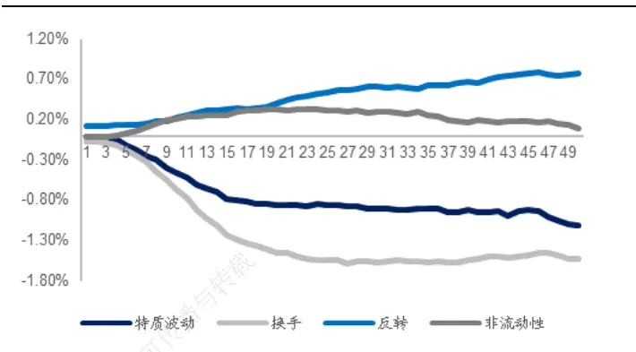
资料来源： ，海通证券研究所

图34 总 成 本 筛 选 后 ， 高 频 因 子 的 周 度 IC 差 值（2021.07-2023.08）
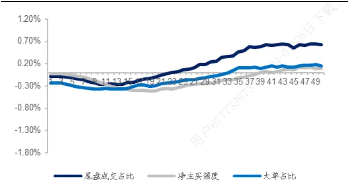
资料来源：Wind，海通证券研究所

图35 总 成 本 筛 选 后 ， 深 度 学 习 因 子 的 周 度 IC 差 值（2021.07-2023.08）
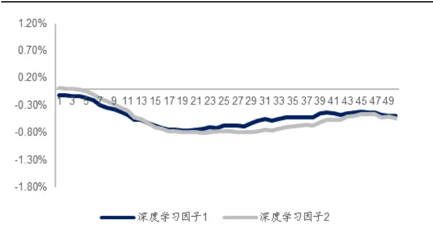
资料来源：Wind，海通证券研究所

因为是限定在开盘后半小时内完成交易，所以被过滤的股票数量大大增加。同时，出现大单交易的概率及相应的大单冲击成本也陡然上升。这使得所有因子的 IC，相对全部 A股中的结果都有了较大的改变。其中，特质波动率、换手率和两个深度学习因子的都出现了大幅下滑。上述结果也提醒我们，对于那些在全市场中表现优异的因子，我们仍需审慎地评估，以免过度高估它们在实际应用中的贡献。

综上所述，通过建立 VWAP相对作收盘价的收益率和大单净主买金额占比因子的回归模型，我们得到了大单冲击成本的一种预测方式。事实上，并非只有大单会对市场产生冲击，不同类型的主动成交订单在累积到一定程度后，可能都会影响交易成本。而且，这些影响也未必与订单大小呈简单的线性关系。此外，在全天的不同时刻下单，冲击也会不一样。以上种种因素，都需要进一步细化研究。本文的线性模型虽然简单粗糙，但依然不失为一个好的起点。

## 5. 总结与思考

在流动性充沛、均匀的环境下，股票的可交易性一般不会作为考察因子表现的重要约束条件。但随着注册制出台，A股上市公司的数量快速增加，不同股票的流动性差异渐趋扩大，使得因子的理论表现与不同管理规模下的实际表现之间往往存在较大差距。

本文以交易金额占某一时段成交额之比、触发盘口流动性成本和包含大单冲击成本在内的总成本为筛选条件，确定可交易的股票池，并计算相应的因子 IC与全部 A股中的差值，循序渐进地探讨了各类流动性的约束条件和成本对因子表现的影响。其中，换仓频率设定为月度和周度，分别对应长周期和短周期两种策略；涉及的因子有，基本面—— 和 ，技术面——换手率、特质波动率、反转和非流动性，高频——大单净买入金额占比、买入意愿强度和尾盘成交占比、深度学习（周度换仓）。

首先，我们计算每个股票过去 21 个交易日全天（月度换仓）或开盘后半小时（周度换仓）的成交额均值，以该数值的 5%大于等于组合规模的 0.1%为条件，确定股票池。

月度换仓下，ROE和 3 个高频因子几乎不受影响，而换手率等 4个低频量价因子受组合规模的影响巨大。除反转因子外，其余因子的 IC都随规模的上升而单调下降。周度换仓下，选股范围的大幅缩窄，对因子表现的影响更加突出。在组合规模达到 30 亿以上后，绝大部分因子的 IC都低于全部 A股中的结果。

其次，根据前期报告中设计的交易成本预测模型，我们可以得到不同组合规模或成交金额占比之下，每只股票潜在的盘口流动性成本。那就可以把前文统一且固定参数的股票池确定方法调整为，如果某只股票的下单金额大到需要承担盘口流动性成本，即，超过买一或卖一委托金额的均值时，就认定该股票无法完成交易，不纳入股票池。

月度换仓下，除尾盘成交占比外，其余因子的 IC几乎都低于全部 A股中的结果。而且，随着规模的增加，差距也逐渐拉大；周度换仓下，根据盘口流动性成本确定股票池，因子表现受到的影响较小。

第三，在得到估计的大单冲击成本后，我们将其与上一章的交易成本（价格波动、买卖价差和盘口流动性）叠加。若某个股票的总成本超过 1%，则认为该股票不可交易，予以剔除。随后，在满足条件的股票池中，重新评估因子的表现。

月度换仓下，纳入大单冲击成本对因子 IC的影响整体较弱，只有 SUE和特质波动率因子在组合规模超过 50 亿后，IC 有较为明显的下滑；周度换仓下，是出现大单交易的概率及相应的大单冲击成本陡然上升，所有因子的 IC 相对全部 A股中的结果都有较大的改变。其中，特质波动率、换手率和两个深度学习因子的 IC都出现了大幅下滑。

综上所述，我们认为，在设计量化策略并进行回测时，引入流动性方面的考量，有着非常重要的意义。对于那些在全市场中表现优异的因子，我们仍需审慎地评估，以免过度高估它们在实际应用中的贡献。

## 6. 风险提示

本报告所有分析均基于公开信息，不构成任何投资建议；权益产品收益波动较大，适合具备一定风险承受能力的投资者持有。

# 信息披露

分析师声明

[Table冯佳睿yst金融工程研究团队s]

余浩淼金融工程研究团队

本人具有中国证券业协会授予的证券投资咨询执业资格，以勤勉的职业态度，独立、客观地出具本报告。本报告所采用的数据和信息均来自市场公开信息，本人不保证该等信息的准确性或完整性。分析逻辑基于作者的职业理解，清晰准确地反映了作者的研究观点，结论不受任何第三方的授意或影响，特此声明。

## 法律声明

本报告仅供海通证券股份有限公司（以下简称“本公司”）的客户使用。本公司不会因接收人收到本报告而视其为客户。在任何情况下，本报告中的信息或所表述的意见并不构成对任何人的投资建议。在任何情况下，本公司不对任何人因使用本报告中的任何内容所引致的任何损失负任何责任。

本报告所载的资料、意见及推测仅反映本公司于发布本报告当日的判断，本报告所指的证券或投资标的的价格、价值及投资收入可能载会波动。在不同时期，本公司可发出与本报告所载资料、意见及推测不一致的报告。

市场有风险，投资需谨慎。本报告所载的信息、材料及结论只提供特定客户作参考，不构成投资建议，也没有考虑到个别客户特殊的可投资目标、财务状况或需要。客户应考虑本报告中的任何意见或建议是否符合其特定状况。在法律许可的情况下，海通证券及其所属不关联机构可能会持有报告中提到的公司所发行的证券并进行交易，还可能为这些公司提供投资银行服务或其他服务。用

本报告仅向特定客户传送，未经海通证券研究所书面授权，本研究报告的任何部分均不得以任何方式制作任何形式的拷贝、复印件或内复制品，或再次分发给任何其他人，或以任何侵犯本公司版权的其他方式使用。所有本报告中使用的商标、服务标记及标记均为本公本司的商标、服务标记及标记。如欲引用或转载本文内容，务必联络海通证券研究所并获得许可，并需注明出处为海通证券研究所，且仅不得对本文进行有悖原意的引用和删改。载，

根据中国证监会核发的经营证券业务许可，海通证券股份有限公司的经营范围包括证券投资咨询业务。日

海通证券股份有限公司研究所[Table_PeopleInfo]

| 路颖 所长 (021)23185717 luying@haitong.com | 邓勇 副所长 | (021)23185718 dengyong@haitong.com | 荀玉根 副所长 (021)23185715 xyg6052@haitong.com |
| --- | --- | --- | --- |
| 余文心 所长助理 汪立亭 (0755)82780398 ywx9461@haitong.com | 所长助理 (021)23219399 wanglt@haitong.com | 孙婷 | 所长助理 (010)50949926 st9998@haitong.com |
| 涂力磊 所长助理 021-23185710 tl15535@haitong.com 宏观经济研究团队 金融工程研究团队 金融产品研究团队 梁中华(021)23219820 Izh13508@haitong.com 冯佳睿(021)23219732 |  |  |  |
| 应镓娴(021)23185645 yjx12725@haitong.com 李 俊(021)23154149 lj13766@haitong.com 侯 欢(021)23185643 hh13288@haitong.com 联系人 李林芷(021)23185646 Ilz13859@haitong.com 王宇晴(021)23185641 wyq14704@haitong.com 贺 媛(021)23185639 hy15210@haitong.com | 郑雅斌(021)23219395 罗 蕾(021)23185653 余浩淼(021)23185650 袁林青(021)23185659 黄雨薇(021)23185655 张耿宇(021)23183109 郑玲玲(021)23185656 联系人 曹君豪(021)23185657 卓洢萱(021)23183938 马毓婕 myj15669@haitong.com | fengjr@haitong.com zhengyb@haitong.com II9773@haitong.com yhm9591@haitong.com ylq9619@haitong.com hyw13116@haitong.com zgy13303@haitong.com zli13940@haitong.com cjh13945@haitong.com zyx15314@haitong.com 付欣郁 02123183940 fxy15672@haitong.com | 倪韵婷(021)23185605 niyt@haitong.com 唐洋运(021)23185680 tangyy@haitong.com 徐燕红(021)23185600 xyh10763@haitong.com 谈 鑫(021)23185601 tx10771@haitong.com 庄梓恺(021)23219370 zzk11560@haitong.com 谭实宏(021)23185676 tsh12355@haitong.com 江 涛(021)23185672 jt13892@haitong.com 张 弛(021)23185673 zc13338@haitong.com 吴其右(021)23185675 wqy12576@haitong.com 滕颖杰(021)23185669 tyj13580@haitong.com 章画意(021)23185670 zhy13958@haitong.com 联系人 陈林文(021)23185678 clw14331@haitong.com 魏 玮(021)23185677 ww14694@haitong.com 舒子宸(021)23185679 szc14816@haitong.com |
| 固定收益研究团队 王巧喆(021)23185649 孙丽萍(021)23185648 张紫睿(021)23185652 姜珮珊(021)23154121 联系人 王冠军(021)23154116 藏 多(021)23185647 zd14683@haitong.com | 策略研究团队 wqz12709@haitong.com slp13219@haitong.com zzr13186@haitong.com jps10296@haitong.com wgj13735@haitong.com 联系人 | 杨 锦(021)23185661 yj13712@haitong.com 余培仪(021)23185663 ypy13768@haitong.com 王正鹤(021)23185660 wzh13978@haitong.com 荀玉根(021)23185715 xyg6052@haitong.com 高 上(021)23185662 gs10373@haitong.com 郑子勋(021)23219733 zzx12149@haitong.com 吴信坤 021-23154147 wxk12750@haitong.com 刘颖(021)23185665 ly14721@haitong.com | 赵佳俊zjj15910@haitong.com 中小市值团队 钮宇鸣(021)23219420 ymniu@haitong.com 王园沁(021)23185667 wyq12745@haitong.com |
| 陈 菲(021)23185707 政策研究团队 李明亮(021)23185835 Iml@haitong.com 吴一萍(021)23185838 朱 蕾(021)23185832 zl8316@haitong.com 周洪荣(021)23185837 李姝醒(021)23185833 联系人 纪 尧(021)23185836 jy14213@haitong.com 何韫露 hyl15943@haitong.com | 石油化工行业 邓 勇(021)23185718 wuyiping@haitong.com 朱军军(021)23185963 胡歆(021)23185616 zhr8381@haitong.com 联系人 Isx11330@haitong.com 张海榕(021)23185607 | dengyong@haitong.com zjj10419@haitong.com hx11853@haitong.com zhr14674@haitong.com | 医药行业 余文心(0755)82780398 ywx9461@haitong.com 郑 琴(021)23219808 zq6670@haitong.com 贺文斌(010)68067998 hwb10850@haitong.com 朱赵明(021)23154120 zzm12569@haitong.com 梁广楷(010)56760096 Igk12371@haitong.com 孟 陆010-58067975 ml13172@haitong.com 周 航(021)23185606 zh13348@haitong.com 联系人 彭 娉(021)23185619 pp13606@haitong.com 肖治键(021)23185638 xzj14562@haitong.com 张 澄(010)58067988 zc15254@haitong.com 江 珅(021)23185638 js15833@haitong.com |
| 汽车行业 王 猛(021)23185692 wm10860@haitong.com 房乔华(021)23185699 fqh12888@haitong.com 张觉尹(021)23185705 zjy15229@haitong.com 刘一鸣(021)23154145 lym15114@haitong.com 联系人 | 公用事业 吴 杰(021)23183818 傅逸帆(021)23185698 联系人 阎 石(021)23185741 胡鸿程(021)23185962 | wj10521@haitong.com fyf11758@haitong.com ys14098@haitong.com 联系人 hhc15605@haitong.com | 陈 铭 cm15886@haitong.com 批发和零售贸易行业 汪立亭(021)23219399 wanglt@haitong.com 李宏科(021)23154125 Ihk11523@haitong.com 曹蕾娜 cln13796@haitong.com 张冰清(021)23185703 zbq14692@haitong.com 李艺冰 lyb15410@haitong.com |

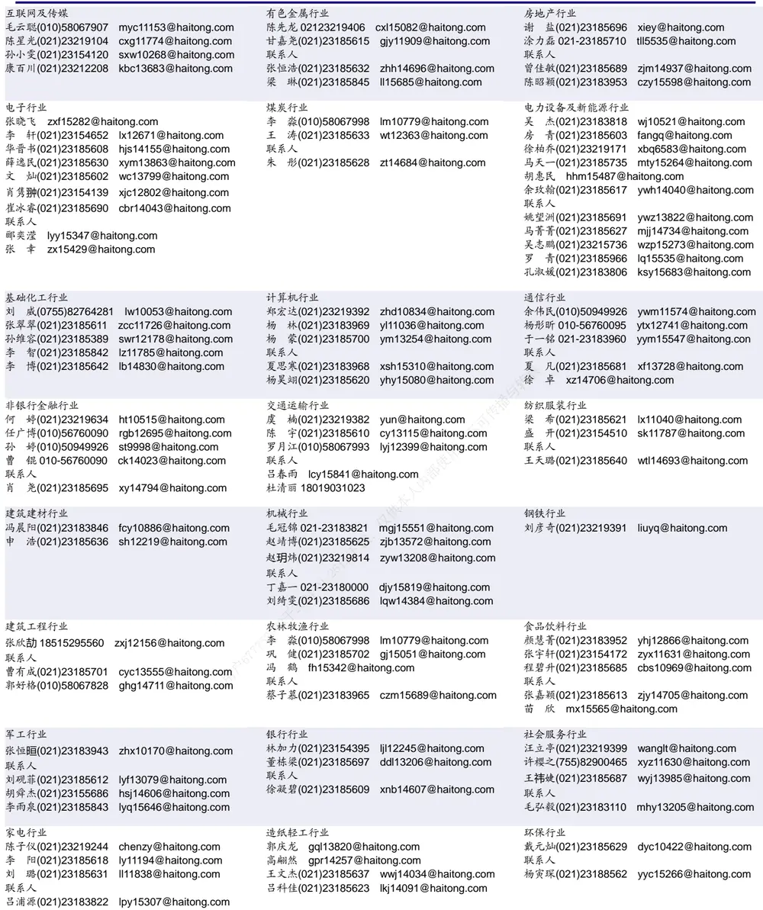

## 研究所销售团队

深广地区销售团队

伏财勇(0755)23607963 fcy7498@haitong.com

蔡铁清(0755)82775962 ctq5979@haitong.com

辜丽娟(0755)83253022 gulj@haitong.com

刘晶晶(0755)83255933 liujj4900@haitong.com

饶 伟(0755)82775282 rw10588@haitong.com

欧阳梦楚(0755)23617160

oymc11039@haitong.com

巩柏含 gbh11537@haitong.com

张馨尹 0755-25597716 zxy14341@haitong.com

海通证券股份有限公司研究所

地址：上海市黄浦区广东路 689号海通证券大厦 9楼

电话：（021）23219000

网址：www.htsec.com 传真：（021）23219392 上海地区销售团队 胡雪梅(021)23219385 huxm@haitong.com 黄 诚(021)23219397 hc10482@haitong.com 季唯佳(021)23219384 jiwj@haitong.com 黄 毓(021)23219410 huangyu@haitong.com 胡宇欣(021)23154192 hyx10493@haitong.com 马晓男 mxn11376@haitong.com 邵亚杰 23214650 syj12493@haitong.com 杨祎昕(021)23212268 yyx10310@haitong.com 毛文英(021)23219373 mwy10474@haitong.com 谭德康 tdk13548@haitong.com 王祎宁(021)23219281 wyn14183@haitong.com 张歆钰 zxy14733@haitong.com 周之斌 zzb14815@haitong.com

北京地区销售团队
殷怡琦(010)58067988 yyq9989@haitong.com
董晓梅 dxm10457@haitong.com
郭 楠 010-5806 7936 gn12384@haitong.com
张丽萱(010)58067931 zlx11191@haitong.com
郭金垚(010)58067851 gjy12727@haitong.com
高 瑞 gr13547@haitong.com
上官灵芝 sglz14039@haitong.com
姚 坦 yt14718@haitong.com
董 晋 dj15843@haitong.com
王 勇 wy15756@haitong.com