## [Tab相关研究

Table_ReportInfo]《选股因子系列研究（九十一）——组合规模、交易成本和大单冲击对因子表现的影响分析》2023.12.13

《从质疑到成为：微盘股行情的逻辑和本质》2023.12.11

《量化这一年：希望、考验、突破》2023.12.11

分析师:余浩淼

Tel:(021)23185650

Email:yhm9591@haitong.com

证书:S0850516050004

## 选股因子系列研究（九十二）——组合约束对其收益表现的影响分析

## 投资要点：

多头加权方法可以显著提升纯多头组合表现。多因子模型最简单的形式为等权的纯多头组合，即选取预期收益最高的 只股票构建等权组合。在计算因子收益的过程中，给多头股票更高的权重，从而降低 IC 较高，但多头端选股效果羸弱的因子收益，削弱这部分因子对出多头组合的影响，可以使组合年化收益与信息比均有一定程度的提升。

添加换手率，跟踪误差控制约束条件后，提高多头股票权重已无法提升超额收益。纯多头组合选取的是预期收益最高的若干只股票，而最低权数分组加权方法提升的恰恰是对这部分股票的预测效果。加入各种约束条件后，都使得组合中的股票不再全部来自于预期收益较高的那部分股票。因此，完全以提升多头部分占多空收益比例 为目标的改进方案，无法获得预期的收益改善效果。而其降低多空收益 的劣势则会被充分反应，使组合的收益表现出现下滑。

约束的增强组合构建过程可转化为标准形式的线性规划问题，通过蒙特卡洛模拟可以找到可行域范围的顶点中权重普遍较低甚至为 的股票。目前最为常用的指数增强组合的约束条件，主要针对市值、非线性市值、估值的暴露和行业、个股的偏离等，结合组合总权重等隐性约束条件，可将带约束的增强组合构建过程转化为标准形式的线性规划问题。对于标准形式的线性规划问题，如果存在有界的最优解，那么至少有一个最优解在其可行域的顶点上。通过蒙特卡洛模拟方法，可以近似找到给定约束条件下所有可行域范围的顶点，并找到这些顶点中权重普遍较低甚至为 的股票，在计算因子收益时降低它们的权重，应当可以起到提升增强组合收益的效果。

通过蒙特卡洛模拟获得权重参考系数进行加权，可以提升组合表现。利用蒙特卡洛模拟法得到的权重参考系数代表了任意预期收益序列下，股票进入增强组合的概率，其极大值与极小值可能更具代表性。调低（高）权重参考系数极大（小）值股票的权重后，指数增强组合理论年化超额收益有一定程度提升。在考虑成本并压缩换手的情况下，只降低权数极小值股票的权重，依然可以提升组合表现。

- 风险提示。本报告所有分析均基于公开信息，不构成任何投资建议；权益产品收益波动较大，适合具备一定风险承受能力的投资者持有。

## 1. 股票权重与纯多头组合选股效果

## 1.1 多头加权法下，纯多头组合的理论表现

多因子模型最简单的形式为等权的纯多头组合。简单来说，直接选取全市场范围内，预期收益最高的 N 只股票构建等权组合。然而，很多时候我们发现，在多因子模型中加入 IC 较高的因子，并不一定能提升纯多头组合的业绩表现。

股票的预期收益通常利用回归法计算。即，先利用截面回归算出过去 N期多因子模型中，每个因子的回归系数，该系数过去 期的均值即为因子收益。然后，将当期每个股票的每个因子值乘以对应的因子收益，求和得到该股票的预期收益。

由于因子值往往会经过标准化与去极值的处理，所以回归得到的因子收益等价于因子 IC 除以当期所有股票收益率的标准差。因此，高 IC 的因子也有着更高的因子收益，在最终股票预期收益的计算中对应更高的因子权重。

但由因子 的计算公式可知，它是由因子多空两端的选股效果共同决定的。而在计算预期收益并选取股票时，由于没有做空机制，就需要因子在多头端有更好的表现，才可以保证预期收益对实际收益有更好的预测效果。因此，如果某个因子的高 主要得益于其空头端优秀的选股效果，虽然其在多头端没有选股能力，却依然会在计算股票预期收益的过程中获得非常高的因子权重。尽管因子空头端的选股能力对于防止差股票进入组合有一定的效果，但由于有很高的因子权重，无效的多头端表现更有可能扰乱，甚至拉低纯多头组合的表现。

造成上述问题的主要原因在于，计算因子收益时，没有考虑到因子 IC及其对应的因子收益的构成来源，等权的计算方法错误地抬高了多头表现较差的因子权重。因此，如果我们换一种角度，在计算因子收益的过程中，给多头股票更高的权重，从而降低 IC 较高，但多头端选股效果羸弱的因子收益，削弱这部分因子对出多头组合的影响。那么，相比用等权方法计算因子收益，应当可以获得更好的组合表现。

我们选取 ROE、SUE、分析师高评分数（股票过去 3个月在分析师报告中被给予最高评级的数量）、换手率、反转、特质波动、非流动性、尾盘成交占比、买入意愿强度、大单净买入占比、高频深度学习因子和日频深度学习因子共 12个因子，对其进行市值、非线性市值、估值及行业中性化的处理和逐次正交。在全市场范围内，通过加权最小二乘回归，计算多因子模型的因子收益，得到预期收益。以周度为换仓频率，选取预期收益最高 100 个股票构建三个等权纯多头组合。其中，加权最小二乘回归的股票权重由如下三种方式确定。

- 等权法：计算因子收益时，每个股票等权。

- 分组加权法：计算因子收益时，对股票历史收益率分组，给历史收益较高的股票更高权重。

最低权数分组加权：计算因子收益时，对股票历史收益率分组，给历史收益较高股票更高的权重，同时保证低收益组获得的权重与高收益组权重的差距不至于过大。

后两种加权方法都需对股票收益率分组，并对组内股票加权。具体加权方式如下，

$$
w_{i}=w_{min}+(g_{l}-g_{0})/(g_{N}-g_{0})*(1-w_{min})
$$

其中， $w_{i}$ 为股票 i的权数。 $w_{min}$ 为设定的最小权数，为大于等于 0、小于等于 1 的小数。我们将股票收益率按照 k-median 算法进行聚类后，分为 N 组，N等于股票总数除以 100。然后用指数加权移动平均算法，确定最小的第 0 组权数 $\mathcal{G}_{0}$ 到最大的第 N组权数 。这里， 为股票 i所在分组的权数。

分组加权与最低权数分组加权的差异在于 $w_{min}$ 的设定，前者完全参照股票收益加权，因此最小权数 $w_{min}$ 为 0，目的是尽可能在权重中体现不同股票收益率的差距；后者则设定 $w_{min}$ 为 0.9，目的是使权重最小股票与最大股票的权重差异不超过 90%。

为了最大限度地避免其他因素对组合表现的干扰，我们先比较三种加权方式所对应组合的理论收益率。即，以前收盘价计算且不考虑任何交易成本的累计净值，相对中证全指的超额收益表现（下同），结果如以下图表所示。

图1 不同因子收益加权组合全市场理论超额（2017.01-2023.09）
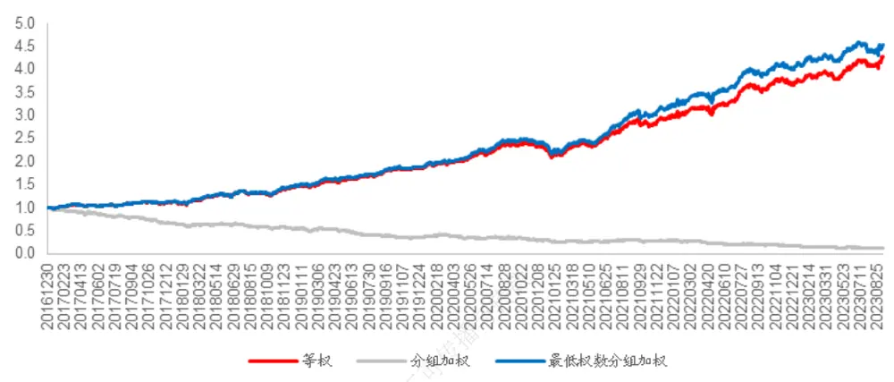
资料来源：Wind，海通证券研究所

表 1 不同因子收益加权组合全市场理论超额统计（2017.01-2023.09）

| 等权 | 分组加权 | 最低权数分组加权 |
| --- | --- | --- |
| 年化超额收益 24.5% | -26.1% | 25.6% |
| 信息比 2.656 | -1.422 | 2.726 |
| 2017 13.8% | -33.0% | 14.7% |
| 2018 28.6% | -17.0% | 29.8% |
| 2019 28.2% | -33.6% | 27.5% |
| 2020 20.6% 户67 | -16.6% | 24.0% |
| 2021 33.4% | -2.4% | 38.4% |
| 2022 23.8% | -41.2% | 25.7% |
| 2023 14.5% | -24.2% | 10.8% |

资料来源：Wind，海通证券研究所

当我们不限定最低权数，完全按照股票收益率加权计算因子收益时，会严重破坏因子表现，使所有因子彻底失效。而当控制股票收益率权重，使收益率最低股票的权重不低于收益率最高股票的 90%时，组合年化收益与信息比均有一定程度的提升。因此，后文中，我们只考察最低权数分组加权方法的特性。

下表展示了在使用新的加权方式计算因子收益后，12 个因子的权重 $weight_{f_{i}}$ 以及因子的多空收益和多头超额收益。因子权重 $weight_{f_{i}}$ 的定义如下，

$$
weight_{f_{i}}=\frac{abs(Revenue_{f_{i}})}{\left/\sum_{i=1}^{n}abs(Revenue_{f_{i}})\right.}
$$

其中， $abs(Revenue_{f_{i}})$ 为因子 i的回归系数（因子收益）的绝对值。

表 2 因子收益加权前后因子收益权重变化与因子多空表现（2017.01-2023.09）

|  | 等权因子权重 | 最低权数分组加权因子权重 | 权重变动 | 多空收益 | 多头超额 | 多头超额占比 |
| --- | --- | --- | --- | --- | --- | --- |
| ROE | 8.88% | 9.01% | 0.13% | 0.48% | 0.17% | 34.5% |
| 分析师高评分数 | 4.11% | 4.43% | 0.33% | 0.18% | 0.12% | 66.1% |
| SUE | 6.58% | 7.16% | 0.57% | 0.31% | 0.17% | 54.7% |
| 特质波动 | 10.90% | 9.96% | -0.94% | 0.49% | 0.17% | 33.4% |
| 换手率 | 12.49% | 11.00% | -1.50% | -0.85% | 0.18% | 21.6% |
| 反转 | 9.09% | 7.94% | -1.15% | -0.69% | -0.04% | -5.8% |
| 非流动性 | 2.65% | 2.74% | 0.09% | 0.18% | -0.02% | -11.8% |
| 尾盘成交占比 | 5.91% | 6.53% | 0.62% | -0.31% | 0.00% | 1.1% |
| 买入意愿强度 | 5.81% | 6.16% | 0.35% | 0.21% | 0.00% | -1.5% |
| 大单净买入占比 | 13.11% | 14.02% | 0.90% | 0.63% | 0.26% | 40.6% |
| 高频深度学习因子 | 10.64% | 11.05% | 0.41% | 0.86% | 0.32% | 37.3% |
| 日频深度学习因子 | 8.03% | 8.02% | -0.01% | 0.65% | 0.19% | 29.5% |
| 等权组合复合因子 |  |  |  | 1.77% | 0.41% | 23.4% |
| 最低权数分组加权复合因子 |  |  | - | 1.75% | 0.44% | 25.0% |

资料来源： ，海通证券研究所

权重明显下降的三个因子——特质波动、换手率和反转中，除反转因子外，并没有明显的多头收益较低的特征；而多头收益为负的非流动性因子，权重未受到显著影响；权重本来较低的尾盘成交占比和买入意愿强度因子，反而有所上升。因子复合后，多空收益略有下降，但多头超额收益及多头超额收益占比都有所提升，这也是表 1 中最低权数分组加权纯多头组合收益提升的主要原因。

以上对比表明，分组加权的方式对参数有一定的依赖性，将空头股票权重降为 0 所得到的因子收益，使因子几乎完全丧失了对未来股票收益的预测能力。而上文设定的0.9，也未必是最优参数。

## 1.2多头加权法下，纯多头组合考虑换手与交易成本后的表现

上一节讨论了不同因子收益加权方式所构建的纯多头组合，在不考虑交易成本时的理论收益。然而，在实际应用中，交易成本对组合收益的影响不可忽视，尤其是在周度换仓的频率下。因此，我们进一步加入换手率不高于 30%的约束条件，尽可能降低高换手产生的交易成本，对组合真实收益的影响。

以下图表展示了考虑交易成本和添加换手率约束后，等权与最低权数分组加权构建纯多头组合的累计及分年度超额收益。

图2 不同因子收益加权全市场组合收益率超额（2017.01-2023.09）
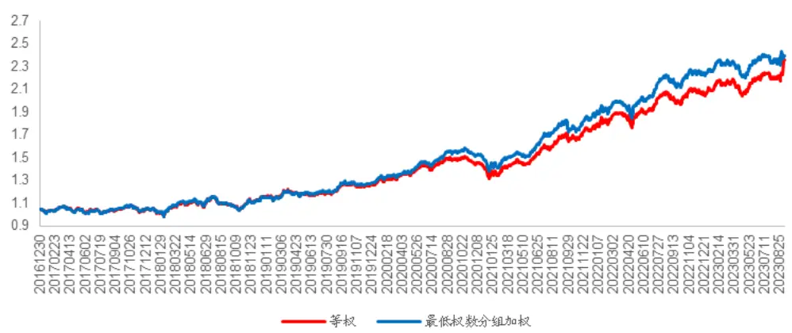
资料来源：Wind，海通证券研究所

表 3 不同因子收益加权全市场组合收益率超额统计（2017.01-2023.09）

| 等权 | 最低权数分组加权 |
| --- | --- |
| 年化超额收益 13.4% | 13.7% |
| 信息比 1.480 | 1.524 |
| 2017 0.1% | 0.5% |
| 2018 10.7% | 9.4% |
| 2019 10.2% | 12.7% |
| 2020 11.4% | 15.4% |
| 2021 28.3% | 29.8% |
| 2022 16.2% | 18.6% |
| 2023 13.7% | 6.8% |

资料来源： ，海通证券研究所

考虑交易成本后，最低权数分组加权方法相对等权方法的收益提升程度显著下降，尤以 2023 年最为明显。我们猜测，这可能源于添加了换手率的约束。

## 1.3多头加权法下，指数增强组合考虑换手与交易成本后的表现

相较纯多头组合，指数增强组合是更为普适的产品形式。而其中，又以沪深 300 与中证 500 指数增强最为常见。为了控制跟踪误差，指数增强组合往往会约束市值、非线性市值、估值等风险因子的暴露，同时控制行业、个股和成分股的偏离。本节在构建指数增强组合的过程中，设定如下约束条件。

a. 组合在市值、非线性市值和估值上的暴露相对指数的偏离不超过 0.3。

b. 当个股不属于指数成分股或者属于指数成分股但在指数中的权重 小于 1%，那么它在组合中的权重范围为 0%-1%；当个股在指数中的权重 超过 1%，那么它在组合中的权重范围为 到 。

c. 当行业在指数中的权重 小于 2%时，它在组合中的权重范围为 0%-2%；在指数中的权重 为 2%-4%时，它在组合中的权重范围为 到 4%。在指数中的权重 大于 4%时，它在组合中的权重范围为 到w + min(w * 0.1, w – 4%) 。

我们分别采用等权与最低权数分组加权两种因子复合方式，在控制换手率不超过30%的情况下，得到沪深 300 和中证 500 增强组合，其累计和分年度超额收益如以下图表所示。

图3 因 子 收 益 加 权 300 增 强 组 合 收 益 率 超 额（2017.01-2023.09）
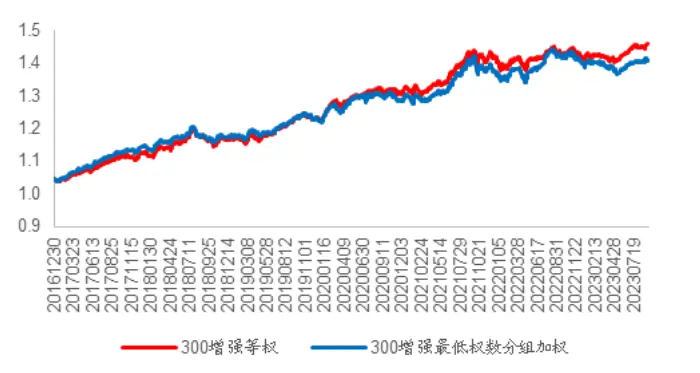
资料来源： ，海通证券研究所

图4 因 子 收 益 加 权 500 增 强 组 合 收 益 率 超 额（2017.01-2023.09）
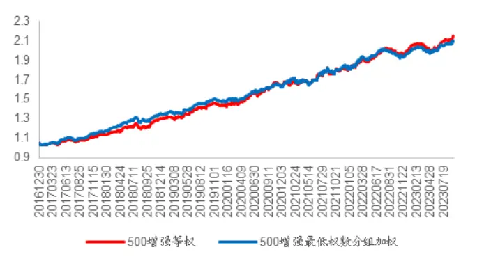
资料来源： ，海通证券研究所

表 4 因子收益加权增强组合收益率超额统计（2017.01-2023.09）

|  | 300 增强等权 | 300增强最低权数分组 加权 | 500增强等权 | 500增强最低权数分组 加权 |
| --- | --- | --- | --- | --- |
| 年化超额收益 | 5.3% | 4.8% | 11.8% | 11.4% |
| 信息比 | 1.521 | 1.299 | 2.357 | 2.265 |
| 2017 | 7.8% | 9.6% | 9.3% | 12.6% |
| 2018 | 3.9% | 3.1% | 15.3% | 15.6% |
| 2019 | 5.0% | 3.7% | 10.7% | 10.1% |
| 2020 | 7.7% | 6.2% | 17.0% | 14.4% |
| 2021 | 7.1% | 6.1% | 9.3% | 9.3% |
| 2022 | 1.5% | 2.5% | 11.7% | 9.0% |
| 2023 | 2.6% | 0.7% | 5.2% | 4.8% |

资料来源： ，海通证券研究所

对于增强组合而言，利用最低权数分组加权的方式提高多头股票权重，已无法提升超额收益。相反，改变权重使因子在全市场范围内选股能力下滑的劣势却进一步凸显。结合 节中只添加换手率约束便得最低权数分组加权的纯多头组合，相对等权组合的收益提升效果下降，我们可以认为，该加权方法之所以只对纯多头组合有效，是因为纯多头组合选取的是预期收益最高的若干只股票，而最低权数分组加权方法提升的恰恰是对这部分股票的预测效果。我们通过以下的论证过程加以说明。

假设复合因子的多空收益为 ，多头端和空头段的股票收益分别为 $\mathtt{R}_{long}$ 和 $\mathtt{R}_{short}$ ，于是有，

$$
\mathbb{R}=\mathbb{R}_{long}-\mathbb{R}_{short}
$$

多头收益占多空收益的比例记为，

$$
\mathbb{R}_{long-ratio}=\mathbb{R}_{long}/\mathbb{R}
$$

当我们采用最低权数分组加权时，本质上是给多头端股票以更高权重。但这也会使多空收益 出现一定程度的下降， $\mathbb{R}_{long-ratio}$ 则会有一定程度的提升。因此，控制最小权数等价于在多空收益 的下降与多头收益占多空收益的比例 $long-ratio$ 的提升之间寻求平衡，从而保证多头收益 $\mathtt{R}_{long}$ 得到改进。显然，将最小权数设定为 0，使多因子模型完全丧失收益预测能力，多空收益 大幅下降，甚至为负。此时，无论 $\log-\mathrm{ratio}$ 提升多少，都无法改进 $\mathtt{R}_{long}$

综上所述，无论是简单加入换手率约束，还是为了构建沪深 、中证 指数增强组合而加入的更复杂的约束条件，都使得组合中的股票不再全部来自于预期收益较高的那部分股票。因此，像最低权数分组加权这样的，完全以提升多头部分占多空收益比例 $\mathsf{R}_{long-ratio}.$ 为目标的改进方案，自然无法获得预期的收益改善效果。而这种方法降低多空收益 的劣势则会被充分反应，使得组合的收益表现反而出现下滑。

## 2. 指数增强约束下的股票权重设定

由上文的分析可知，构建组合过程中添加的约束对股票入选组合的概率有很强的影响力。因此，我们希望可以找到一种简便方法，刻画在特定约束条件下，每只股票入选组合的概率。

## 2.1增强组合构建的线性规划基本型转换

如 1.3 节所示，目前最为常用的指数增强组合的约束条件，主要针对市值、非线性市值、估值的暴露和行业、个股的偏离。如果需要更加严格，也会考虑加入换手、特质波动等风险因子暴露的约束。因此，在不控制组合换手率的情况下，结合组合总权重等隐性约束条件，我们可将带约束的增强组合构建过程，转化为如下的最优化问题。

$$
\max\sum_{i=0}^{n}c_{i}*x_{i}
$$

$$
\operatorname{s.t}1\geq\sum_{\operatorname{i}=0}^{n}x_{\operatorname{i}}\geq0.95\tag{2}
$$

$$
mv_{index}+0.3\geq\sum_{i=0}^{n}mv_{i}*x_{i}\geq mv_{index}-0.3\quad(3)
$$

$$
nlmv_{index}+0.3\geq\sum_{i=0}^{n}nlmv_{i}*x_{i}\geq nlmv_{index}-0.3\quad(4)
$$

$$
pb_{\mathrm{index}}+0.3\geq\sum_{\mathrm{i}=0}^{\mathrm{n}}pb_{\mathrm{i}}*x_{\mathrm{i}}\geq pb_{\mathrm{index}}-0.3\tag{5}
$$

$$
Pctmax_{indus_{m}}\geq\sum_{i\in I_{indus_{m}}}x_{i}\geq Pctmin_{indus_{m}}\tag{6}
$$

m m

$$
Pctmax_{i}\geq x_{i}\geq Pctmin_{i}\tag{7}
$$

m m

其中， $c_{\mathrm{i}}和x_{\mathrm{i}}分$ 别表示第 i个股票的预期收益和权重。(1)式为目标函数；(2)式为组合的总权重约束，即，组合总权重在 95%到 100%之间；(3)式为市值约束， $mv_{index}.$ 表示指数的市值暴露， $mv_{\mathrm{i}}$ 表示股票 i的市值暴露，即，组合总市值暴露与指数的偏离不超过0.3；(4)式和(5)式分别为非线性市值与估值的约束，即，组合在非线性市值与估值上的暴露与指数的偏离不超过 0.3； $nlmv_{index}$ 为指数的非线性市值暴露， $nlmv_{\mathrm{i}}$ 为第 i个股票的非线性市值暴露， $pb_{index}$ 为指数的估值暴露， 为第 i个股票的估值暴露。 (6) 式及以下省略的 29个不等 $式$ ，为组合的行业约束， $Petmax_{indus_{m}}$ 与 $Pctmin_{indus_{m}}$ 分别为组合在行业 m 占比的上/下限，计算方法与 1.3 节中的约束 c 相同。(7)式为个股权重约束，$Pctmax_{i}$ 与 $Pctmin_{i}$ 分别为第 i个股票在组合中的权重上/下限，计算方法与 1.3 节中的约束 b 相同。

上述带约束的优化问题可进一步转化为下述线性规划问题的标准形式，

$$
\min_{x\in R^{n}}c^{T}*x
$$

$$
s.tA*x=b,x\geq0
$$

其中， $c^{T}$ 即股票预期收益向量。由于是求最小值，因此需将全部股票的预期收益 $1^{x}-1$ 。同时，为将原始约束条件转化为 $A*x=b,x\geq0$ 形式，需要进行以下调整。

首先，对于 $\cdot Pctmin_{i}$ 大于 0，即权重最低的股票，在其个股约束条件中减去该最低权重，从而使其变为满足 $x_{\mathrm{i}}\geq0$ 条件的新权重。再将行业、市值等其他约束条件中 $的x_{i}$ 替换为新的 $x_{i},$ ，并根据 $x_{i}的$ 系数，对这些约束条件的上下界做出相应调整。

其次，将(2)到(6)中同时拥有上下界的约束条件全部调整为 $a^{T}*x\leq b_{j}$ 的形式，其中

下界大于 0 的条件需要转化为两个条件。

最后，对所有行列式填充虚拟变量，构建系数矩阵 ，满足 这一形式。假设该期有股票数 n，扩充后的约束条件数为 m，则约束矩阵 A为(n+m,2n+m)的二维矩阵。对应地，向量 b为(n+m,1)的一维向量。

## 2.2组合优化情景下线性规划解的特性

对于标准形式的线性规划问题，如果存在有界的最优解，那么至少有一个最优解在其可行域的顶点上。也就是说，当组合优化问题给定了约束条件，除非因约束条件互相矛盾无法求解，则无论给出怎样的股票预期收益，最优解一定位于约束条件确定的可行域顶点处，即在一个有限的离散域中。

一般情况下，指数增强组合的约束条件不与收益因子的选择，股票预期收益的计算有直接关系。如果约束条件确定的所有可行域顶点中，某些股票的权重均非常低；甚至更极端的情况下，部分股票在所有顶点处的权重均为 ，那么，无论多因子模型对这些股票的预期收益有多高，均无法入选增强组合。换言之，它们对增强组合的贡献为 0。如果多因子模型中的某几个因子的收益（ ）主要由这些股票贡献，且这几个因子在模型中有着较高的权重，那么它们大概率无法对增强组合产生正向选股贡献。

因此，如果我们可以事先计算出给定约束条件下，所有可行域范围的顶点，并找到这些顶点中权重普遍较低甚至为 0的股票，那么只需要在计算因子收益时降低它们的权重，应当可以起到提升增强组合收益的效果。

## 2.3基于蒙特卡洛模拟的股票权重设定

计算可行域的全部顶点以遍历所有可能的最优解，本身也是线性规划的解法之一。但其最大问题在于，需要消耗大量的时间。穷举法的一般过程为，从 2n+m 个变量中，抽取 n+m 个，并将剩余 n个变量设定为 0，进而构建出(n+m)*(n+m)的方程组。求解该方程组，并保留满足每一项均大于等于 0的解，即可得到有效解集。

从上述过程可以看出，理论上需要进行 次计算才能得到所有解。但由于约束矩阵 A 具备稀疏性，所以有效解的数量远小于理论值 。不过，股票数 n 通常是几千的数量级，因而计算量依然非常庞大。另一方面，上述约束条件完全从市值、行业等角度出发构建，与预期收益向量并无直接相关性，因此，每个解出现的概率受预期收益向量的影响并不是相等的，这对股票权重的确定，尤其是上限的确定也会有一定影响。

综合算法复杂度与概率分布，我们尝试采用蒙特卡洛模拟的方式，以上文 1.3 节中给出的 增强与 增强的约束条件为组合约束条件，模拟 次包含全市场所有个股票的预期收益向量，求解得到对应的满足 1.3 节中组合约束条件的 M 个不同的组合权重向量，并以这 M个权重向量的加和作为多因子模型中计算因子收益的权重参考系数，最后以该权重参考系数作为计算因子收益时股票权重的参考。我们寄希望于通过尽可能多的模拟次数，使所求的 个权重向量尽可能覆盖到可行域的所有顶点。同时，也尽可能逼近在该约束条件下，各个顶点成为最优解的概率分布。

为了尽可能满足覆盖可行域顶点的要求，在进行蒙特卡洛模拟时，我们设臵了如下要求。

以过去一周所有股票的收益率为基准，由高到低等分为 100 组，以从小到大第i组的最大值 与最小值 作为模拟过程中，第 i分位数的收益率区间上下界。

- 假设总共进行 M=100*N 次蒙特卡洛模拟，保证每个股票进入 100 个股票预期收益率分位数区段的概率相等。

- 每次蒙特卡洛模拟时，保证所有股票尽可能均匀地分入 100 个分位数区段，避免某个分位数区段分入的股票过多。

当股票被分入到第 i分位数区段时，随机生成一个百分比 p，并有 ，然后以 $+p*(Rmax_{i}-Rmin_{i})$ 作为该股票的模拟收益率，保证组内股票收益率大小有充分的随机性。

考虑到计算效率，设 N为 100，即，进行 M=100*100=10000 次蒙特卡洛模拟。以下两图展示了权重参考系数小于等于 x的股票占全市场股票的累计比例。

图5 沪深 300 不同权重参考系数股票占比（2017.01-2023.09）
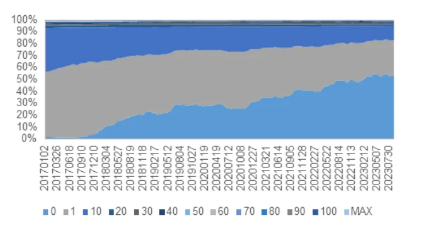
资料来源：Wind，海通证券研究所

图6 中证 500 不同权重参考系数股票占比（2017.01-2023.09）
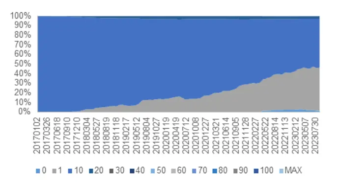
资料来源：Wind，海通证券研究所

结合 1.3 中的个股约束条件，绝大部分股票的权重在经最低权重调整后，被限定在0%-1%之间。而模拟过程中，股票被分入 100 个分位数区段的概率是相等的。因此，如果权重参考系数为 1，意味着模拟过程中，该股票只有在预期收益落在全样本最高的 1%左右分位数区段时，才会进入组合；权重参考系数显著大于 1则意味着该股票哪怕预期收益较低，也会被选入组合当中；权重参考系数等于 0则意味着，预期收益无论多高，该股票都难以进入组合。

对应地，图 5与图 6 中各个权重参考系数股票的累积占比分布，表示在 1.3 节中的组合约束条件下，股票进入组合的概率差异。很明显，对于沪深 300 而言，难以被选到的股票占比一直较高，股票权重参考系数也很不均匀。而中证 500 中难以被选入组合的股票占比则要低一些，股票权重参考系数也相对更加均匀。但我们也发现，无论是沪深300 还是中证 500，难以被选到的股票占比都在逐步提升。即，越来越多的股票哪怕其预期收益位于全市场的前 1%，依然无法进入组合。

这就使得实际的选股空间相对全市场范围大幅缩窄，而在此之内由回归得到的因子收益也会发生显著的变化。换言之，因为约束条件的存在，全市场回归得到的因子收益或许无法代表它在实际选股空间中的选股能力，对指数增强组合的贡献自然也会下降。例如，图 6 中，随着时间推移，中证 500 可选股票的数量越来越少。这意味着，很多有效性体现在中证 500 指数中市值较小股票之上，而显得在中证 500 中有效的因子，很有可能因为约束条件导致选股范围缩窄，无法选到这些小市值股票，从而很难对增强组合再有较大的贡献。

于是，我们进一步通过蒙特卡洛模拟得到股票权重参考系数，并以此为参考设定股票权重，重新计算因子收益，考察这种方法能否提升指数增强组合的收益表现。

## 2.4基于蒙特卡洛模拟的加权指数增强表现

利用蒙特卡洛模拟法得到的权重参考系数代表了任意预期收益序列下，股票进入增强组合的概率。然而，给定收益因子后，线性规划问题在约束条件划定的可行域中的不同顶点处取得最优解的分布并不一定完全均匀。因此，对于权重参考系数而言，极大值与极小值可能更具代表性。我们首先考察调低（高）权重参考系数极大（小）值股票的权重后，无交易成本的增强组合的理论收益，结果如以下图表所示。

图7 蒙 特 卡 洛 模 拟 加 权 300 增 强 组 合 理 论 超 额（2017.01-2023.09）
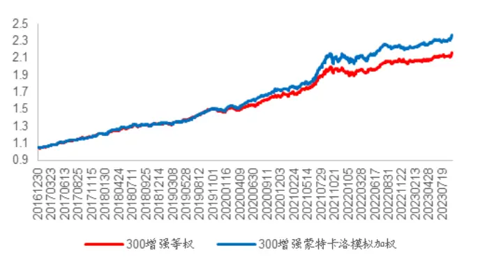
资料来源：Wind，海通证券研究所

图8 蒙 特 卡 洛 模 拟 加 权 500 增 强 组 合 理 论 超 额（2017.01-2023.09）
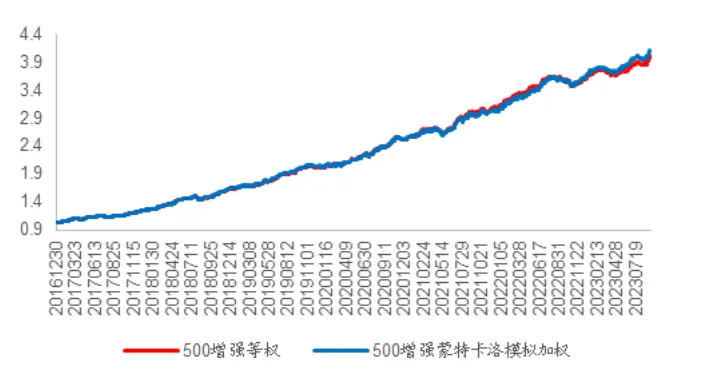
资料来源：Wind，海通证券研究所

表 5 蒙特卡洛模拟加权增强组合理论超额（2017.01-2023.09）

|  | 300增强等权 | 300增强蒙特卡洛模拟 加权 | 500增强等权 | 500 增强蒙特卡洛模拟 加权 |
| --- | --- | --- | --- | --- |
| 年化超额收益 | 11.9% | 13.5% | 22.9% | 23.4% |
| 信息比 | 2.656 | 2.733 | 4.136 | 4.241 |
| 2017 | 16.7% | 16.9% | 22.4% | 22.4% |
| 2018 | 10.1% | 10.4% | 31.2% | 31.7% |
| 2019 | 10.6% | 11.2% | 23.9% | 24.2% |
| 2020 | 14.4% | 17.6% 内部 | 27.7% | 27.6% |
| 2021 | 16.6% | 22.0% | 21.8% | 20.4% |
| 2022 | 6.7% 仅供 | 6.1% | 17.4% | 19.6% |
| 2023 | 4.4% | 6.1% | 8.5% | 10.4% |

资料来源：Wind，海通证券研究所

改进后的指数增强组合，年化超额收益有一定程度提升，尤其是沪深 300 增强，而中证 500 增强近两年的改善效果也越来越显著。

然而，实际投资中，交易成本不可忽视。同时，我们还需对组合施加额外的换手率约束。而这一约束与组合构建本身有时间序列的相关性，所以对未考虑换手率约束计算得到的股票权重参考系数而言，极大值可能不再代表着股票有很大概率会进入组合。但考虑到线性约束条件的特性，极小值可能仍能代表股票有较低的进入概率。因此，在考虑交易成本后，我们只降低权重参考系数极小值股票的权重，相应增强组合的超额收益如以下图表所示。

图9 蒙 特 卡 洛 模 拟 加 权 300 增 强 组 合 收 益 率 超 额（2017.01-2023.09）
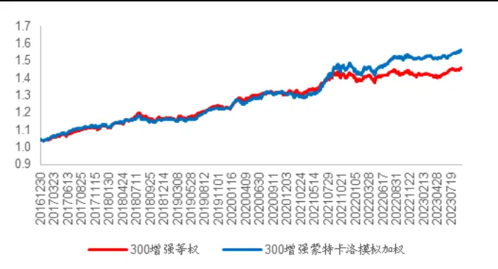
资料来源： ，海通证券研究所

图10 蒙 特 卡 洛 模 拟 加 权 500 增 强 组 合 收 益 率 超 额（2017.01-2023.09）
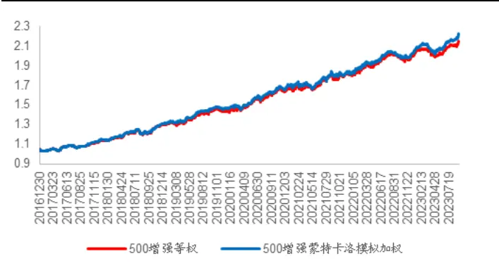
资料来源： ，海通证券研究所

表 6 蒙特卡洛模拟加权增强组合超额收益（2017.01-2023.09）

|  | 300 增强等权 | 300 增强蒙特卡洛模拟 加权 | 500增强等权 | 500增强蒙特卡洛模拟 加权 |
| --- | --- | --- | --- | --- |
| 年化超额收益 | 5.3% | 6.5% | 11.8% | 12.4% |
| 信息比 | 1.521 | 1.786 | 2.357 | 2.498 |
| 2017 | 7.8% | 8.4% | 9.3% | 10.2% |
| 2018 | 3.9% | 3.3% | 15.3% | 15.4% |
| 2019 | 5.0% | 5.0% | 10.7% | 12.0% |
| 2020 | 7.7% | 6.9% | 17.0% | 16.7% |
| 2021 | 7.1% | 11.7% | 9.3% | 8.3% |
| 2022 | 1.5% | 4.7% | 11.7% | 12.4% |
| 2023 | 2.6% | 3.2% | 5.2% | 7.4% |

资料来源：Wind，海通证券研究所

在考虑成本并压缩换手的情况下，通过蒙特卡洛模拟获得权重参考系数进行加权，降低难以进入组合的股票的权重，依然可以提升组合表现。尤其对于沪深 300 而言，提升效果更加明显，中证 的提升效果也在近两年逐渐显现。

## 3. 思考

无论何种方式构建因子组合，显性或隐含的约束总是在所难免，而约束本身也会使股票实际的选股范围与全市场计算因子收益时的股票范围有明显差异，这就导致部分高收益的因子对组合收益的贡献并不如预期那般显著。因此，改变因子收益的计算方式，或许可以使因子在限定的选股范围内展现出更好的效果。

本文的测试发现，通过加权最小二乘回归计算因子收益，可一定程度上提升组合的收益表现。然而，由于因子本身的特性已固定，在多因子模型中加权无法从根本上改变因子在限定选股范围内的表现。极端情况下，假设全市场范围内的因子收益完全由约束条件下，没有权数的股票所贡献，那么加权最小二乘回归也仅能调低这些因子的占比，尽量避免这些因子对组合产生干扰，但无法提供增量的选股信息。

通过加权最小二乘回归重新计算因子收益，本质是希望在复合因子选股效果下降，与约束条件下的局部选股效果占比提升中找到平衡，但加权的最终的效果会受未被降低权重的因子的选股效果所束缚。因此，如何在因子构建的过程中，将组合的约束条件对选股范围限定的影响考虑其中，或者在构建如深度学习因子等复合因子的过程中，调整受约束条件影响的股票的权重，或许能得到更好的选股效果。

## 4. 风险提示

本报告所有分析均基于公开信息，不构成任何投资建议；权益产品收益波动较大，适合具备一定风险承受能力的投资者持有。

# 信息披露

分析师声明

[Table余浩淼yst金融工程研究团队s]

本人具有中国证券业协会授予的证券投资咨询执业资格，以勤勉的职业态度，独立、客观地出具本报告。本报告所采用的数据和信息均来自市场公开信息，本人不保证该等信息的准确性或完整性。分析逻辑基于作者的职业理解，清晰准确地反映了作者的研究观点，结论不受任何第三方的授意或影响，特此声明。

## 法律声明

本报告仅供海通证券股份有限公司（以下简称 本公司 ）的客户使用。本公司不会因接收人收到本报告而视其为客户。在任何情况下，本报告中的信息或所表述的意见并不构成对任何人的投资建议。在任何情况下，本公司不对任何人因使用本报告中的任何内容所引致的任何损失负任何责任。

本报告所载的资料、意见及推测仅反映本公司于发布本报告当日的判断，本报告所指的证券或投资标的的价格、价值及投资收入可能载会波动。在不同时期，本公司可发出与本报告所载资料、意见及推测不一致的报告。

市场有风险，投资需谨慎。本报告所载的信息、材料及结论只提供特定客户作参考，不构成投资建议，也没有考虑到个别客户特殊的投资目标、财务状况或需要。客户应考虑本报告中的任何意见或建议是否符合其特定状况。在法律许可的情况下，海通证券及其所属不关联机构可能会持有报告中提到的公司所发行的证券并进行交易，还可能为这些公司提供投资银行服务或其他服务。用，

本报告仅向特定客户传送，未经海通证券研究所书面授权，本研究报告的任何部分均不得以任何方式制作任何形式的拷贝、复印件或复制品，或再次分发给任何其他人，或以任何侵犯本公司版权的其他方式使用。所有本报告中使用的商标、服务标记及标记均为本公司的商标、服务标记及标记。如欲引用或转载本文内容，务必联络海通证券研究所并获得许可，并需注明出处为海通证券研究所，且不得对本文进行有悖原意的引用和删改。载，

根据中国证监会核发的经营证券业务许可，海通证券股份有限公司的经营范围包括证券投资咨询业务。日

海通证券股份有限公司研究所[Table_PeopleInfo]
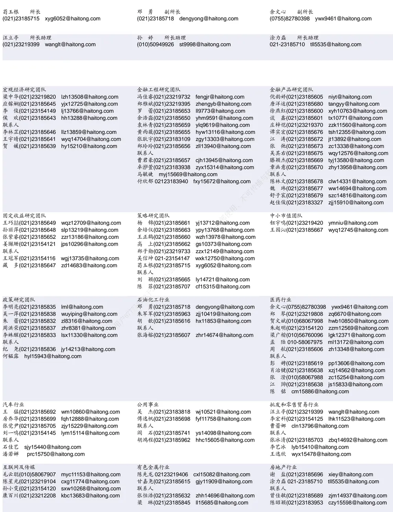

## 研究所销售团队

伏财勇(0755)23607963 fcy7498@haitong.com

蔡铁清(0755)82775962 ctq5979@haitong.com

辜丽娟(0755)83253022 gulj@haitong.com

刘晶晶(0755)83255933 liujj4900@haitong.com

饶 伟(0755)82775282 rw10588@haitong.com

欧阳梦楚(0755)23617160

oymc11039@haitong.com

巩柏含 gbh11537@haitong.com

张馨尹 0755-25597716 zxy14341@haitong.com

海通证券股份有限公司研究所

网址：www.htsec.com

传真：（021）23219392

电话：（021）23219000

地址：上海市黄浦区广东路 689号海通证券大厦 9楼 胡雪梅(021)23219385 huxm@haitong.com 黄 诚(021)23219397 hc10482@haitong.com 季唯佳(021)23219384 jiwj@haitong.com 黄 毓(021)23219410 huangyu@haitong.com 胡宇欣(021)23154192 hyx10493@haitong.com 马晓男 mxn11376@haitong.com 毛文英(021)23219373 mwy10474@haitong.com 谭德康 tdk13548@haitong.com 邵亚杰 23214650 syj12493@haitong.com 王祎宁(021)23219281 wyn14183@haitong.com 周之斌 zzb14815@haitong.com 杨祎昕(021)23212268 yyx10310@haitong.com 张歆钰 zxy14733@haitong.com

殷怡琦(010)58067988 yyq9989@haitong.com 
董晓梅 dxm10457@haitong.com 
郭 楠 010-5806 7936 gn12384@haitong.com 
张丽萱(010)58067931 zlx11191@haitong.com 
郭金垚(010)58067851 gjy12727@haitong.com 
高 瑞 gr13547@haitong.com 
姚 坦 yt14718@haitong.com 
上官灵芝 sglz14039@haitong.com 
王 勇 wy15756@haitong.com 
董 晋 dj15843@haitong.com