## [Tab相关研究

Table_ReportInfo]《选股因子系列研究（八十六）——深度学习高频因子的特征工程》《选股因子系列研究（八十七）——高频与日度量价数据混合的深度学习因子》2023.05.13

《选股因子系列研究（八十八）——多颗粒度特征的深度学习模型：探索和对比》2023.09.11

分析师:冯佳睿

Tel:(021)23219732

Email:fengjr@haitong.com

证书:S0850512080006

分析师:袁林青

Tel:(021)23212230

Email:ylq9619@haitong.com

证书:S0850516050003

# 选股因子系列研究（九十三）——深度学习因子的“模型动物园”

## 投资要点：

在系列前期报告中，我们基于不同颗粒度的特征，使用 RNN 类模型训练得到深度学习因子。本文在此基础上，对比和讨论不同类别深度学习模型训练得到的因子的周度选股能力，并对于多模型集成因子的效果进行测试与分析。

- 卷积类模型呈现出显著的周度选股能力。其中，TCN类模型表现较优，因子周均Rank IC 和极值组合超额收益与 BiAGRU 模型接近。BiATCN 周均 Rank IC 为0.137，Top10%组合年化超额收益 33.8%。

- Transformer 类模型呈现出显著的周度选股能力，但略弱于 BiAGRU 模型。其中，Transformer 表现最优，Informer 次之，PatchTST 相对较弱。Transformer 模型周均 Rank IC 为 0.129，Top10%组合年化超额收益 30.6%。

- 线性类模型呈现出显著的周度选股能力，但明显弱于 模型。其中，表现最优， 和 次之， 相对较弱。 周均Rank IC 为 0.12，Top10%组合年化超额收益 26.8%。此外，在引入 DLinear 对输入特征的进行处理后， G 的极值组合超额收益小幅提升。

- 多模型集成。不同模型训练得到的因子之间虽然存在较高的截面相关性，但极值组合的历年多头超额收益依旧有一定的差异，尤其是对比 BiAGRU 和其余模型。通过简单的分析可知，不同模型对量价信息的学习和调整速度并不一致，使得它们在特定时段的表现出现分化。由于模型的网络结构、超参数选择等因素皆会影响模型对量价信息的学习和调整，我们尝试将不同网络训练得到的因子等权集成，希望获得更稳健的因子表现。

- 集成模型表现更优。BiAGRU 模型叠加 BiATCN 或 Transformer 后，因子表现进一步提升。周均 Rank IC 在 0.14 以上，Top10%组合和 Top100 组合的年化超额收益分别为 34%和 40%左右。综合来看，+BiATCN 模型和+BiATCN+Transformer模型的周度选股能力更强。

- AI 指数增强。以 BiAGRU 模型为基础，再与其他模型集成后，全市场选股的中证 500 增强组合的年化超额收益从 16.5%提升至 17.4%-18.5%；全市场选股的中证 1000 增强组合年化超额收益从 22.5%提升至 24.3%-25.1%，80%成分股约束的中证 1000 增强组合年化超额收益从 20.0%提升至 20.5%-21.4%。其中，BiAGRU+BiATCN 和+BiATCN+Transformer 模型的超额收益相对更高。

风险提示。市场系统性风险、资产流动性风险、政策变动风险、因子失效风险。

在系列前期报告中，我们基于不同颗粒度的特征，使用 RNN 类模型训练得到深度学习因子。本文在此基础上，对比和讨论不同类别深度学习模型训练得到的因子的周度选股能力，并对于多模型集成因子的效果进行测试与分析。

## 1. 深度学习因子的“模型动物园”

随着学术研究的深入，越来越多的深度学习模型被应用于时间序列的预测问题中。除经典的 RNN 类模型外，卷积类模型、Transformer类模型、线性类模型也常常出现在我们的视野中。

那么，基于其他类别深度学习模型训练得到的因子是否具有显著的周度选股能力？与系列前期专题报告提出的双向 AGRU（下简称 BiAGRU）模型相比，两者的差异又有多少？为了回答这些问题，本章在保持输入特征、预测目标和训练设定一致的前提下，测试不同的深度学习模型训练所得因子的周度选股能力。具体设定请参考本系列前期的专题报告——《选股因子系列研究（八十八）——多颗粒度特征的深度学习模型：探索和对比》。由于笔者算力有限，本文仅使用日颗粒度的特征训练模型。

## 1.1 卷积类模型

由于卷积类模型可有效捕获和学习局部特征，因此，我们对时间序列数据使用该类模型，捕捉股票特征序列中的短期趋势、周期性变化或局部模式。在众多卷积类模型中，本节重点测试 TCN和 TimesNet 两种网络结构。

TCN（Temporal Convolutional Network）简称时域卷积网络，是一种专门针对时间序列数据设计的深度学习模型。结构源于卷积神经网络（CNN），但在处理序列数据时表现出了独特的优势。

TCN使用一维卷积层来捕捉时间序列中的局部依赖关系，并确保当前输出只依赖于过去的输入，即满足因果性要求，这对未来时间点的预测至关重要。通过使用空洞卷积技术，TCN可以在不增加计算复杂度的情况下，捕获更长时间跨度内的依赖关系，适合时间序列预测。此外， 还借鉴了 等网络的成功经验，采用残差连接机制以解决深度网络训练过程中的梯度消失问题，使得网络可以构建得更深、表达能力更强。

图1 TCN网络结构示意图
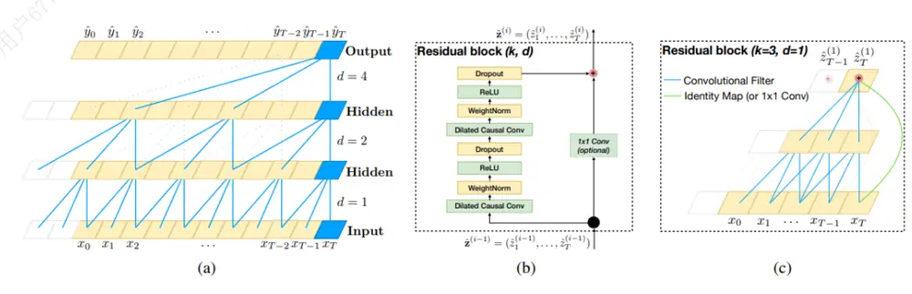
资料来源：《An Empirical Evaluation of Generic Convolutional and Recurrent Networks for SequenceModeling》，海通证券研究所整理

是由清华大学研究团队开发的时序卷积类模型。它创新地将一维时间序列转换为二维空间表示，并运用特殊的网络结构来捕捉和提取时序数据中隐藏的数据变化规律。利用傅里叶变换和时空卷积模块，TimesNet 能够深入挖掘时间序列中的内在关联和结构性信息，从而提升预测性能和准确性。

图2 TimesNet 网络结构示意图
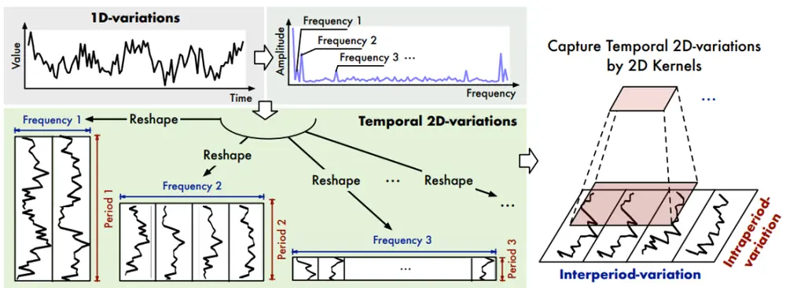
资料来源：《TimesNet: Temporal 2d-variation Modeling for General Time Series Analysis》，海通证券研究所整理

下表展示了基于卷积类模型训练得到的因子的周度选股能力。其中，BiATCN 为叠加双向学习与注意力机制的 TCN模型。

表 1 卷积类模型周度选股能力（2017-2023）

|  | Rank IC |  | Top10%组合超额 |  | Top100 组合超额 |  | 因子值 自相关性 | Top10% 年化双 边换手 (倍) |
| --- | --- | --- | --- | --- | --- | --- | --- | --- |
|  | TO 收盘 | T1 均价 | 费前 | 费后 | 费前 | 费后 |  |  |
| BiAGRU | 0.135 | 0.125 | 32.5% | 24.7% | 38.5% | 28.2% | 0.75 | 40 |
| TCN | 0.133 | 0.121 | 32.6% | 23.0% | 37.3% | 25.1% | 0.68 | 50 |
| BiATCN | 0.137 | 0.126 | 33.8% | 24.5% | 40.6% | 28.6% | 0.70 | 48 |
| TimesNet | 0.124 | 0.115 | 28.7% | 21.1% | 33.5% | 23.8% | 0.77 | 40 |

资料来源：Wind，海通证券研究所

测试结果表明，卷积类模型呈现出显著的周度选股能力。其中，TCN 类模型较优，因子周均 Rank IC、极值组合（即 Top10%和 Top100 组合，下同）超额收益与 BiAGRU模型接近。BiATCN 模型周均 Rank IC 为 0.137，Top10%组合年化超额收益 33.8%。但需要注意的是，TCN 类模型的周度换手率较高，因子周均自相关性较低，Top10%组合年化双边换手 40 倍。BiATCN 模型为 48 倍，明显高于 BiAGRU 模型的 40 倍。

下表展示了卷积类模型极值组合的分年度多头超额收益。2018 年，卷积类模型大幅跑输 BiAGRU 模型，超额收益落后 10%以上。在卷积类模型中，TCN 类模型表现相对更好。2019-2021 年及 2023 年，相对 BiAGRU 模型都能取得更高的超额收益。对比 TCN模型与 模型可见，双向学习与注意力机制的引入，都可进一步提升模型在2018-2019 年和 2022-2023 年的超额收益。

表 2 卷积类模型极值组合分年度多头超额收益（2017-2023）

| Panel A: Top10%组合 |  |  |  |  |  |  |  |  |
| --- | --- | --- | --- | --- | --- | --- | --- | --- |
|  | 2017 | 2018 | 2019 | 2020 | 2021 | 2022 | 2023 | 全区间 |
| BiAGRU | 24.3% | 50.1% | 29.1% | 19.3% | 30.6% | 38.7% | 28.1% | 32.5% |
| TCN | 24.3% | 39.3% | 34.9% | 29.8% | 33.2% | 31.2% | 32.8% | 32.6% |
| BiATCN | 24.2% | 40.3% | 38.8% | 29.1% | 29.0% | 37.2% | 35.1% | 33.8% |
| TimesNet | 19.0% | 36.4% | 31.6% | 20.9% | 27.1% | 31.4% | 31.0% | 28.7% |
|  |  |  |  | Panel B: | Top100 组合 |  |  |  |
|  | 2017 | 2018 | 2019 | 2020 | 2021 | 2022 | 2023 | 全区间 |
|  | 31.1% | 68.8% | 33.2% | 15.7% | 35.6% | 41.3% | 35.8% | 38.5% |
| BiAGRU TCN | 27.7% | 52.4% | 41.0% | 30.3% | 36.8% | 29.7% | 40.5% | 37.3% |
| BiATCN | 26.9% | 54.6% | 44.6% | 28.1% | 33.9% | 45.6% | 46.4% | 40.6% |
| TimesNet | 21.8% | 47.0% | 37.9% | 19.9% | 35.3% | 28.6% | 41.9% | 33.5% |

资料来源：Wind，海通证券研究所

## 1.2 Transformer 类模型

Transformer在 2017 年由 Google 提出，它最初被设计用于自然语言处理，并在机器翻译任务上取得了较大的成功。Transformer的核心特点是采用自注意力机制来捕获序列数据中的长期依赖关系。在时间序列预测方面，自注意力机制允许模型关注序列中任意两个时刻之间的相互影响，而不是局限于局部或近期历史信息。这些特性对于捕捉时间序列数据中的非线性、周期性和长期趋势非常有效。

系列前期报告中提出的 BiAGRU 就引入了这一机制，取得了较好的效果。近年来的一些研究表明，在适当改造后，Transformer 及其变体在某些时间序列预测场景下可以大幅超越常规 RNN 类模型。在众多 Transformer 类模型中，本节重点测试 Transformer、Informer 和 PatchTST 三种网络结构。

相比于经典的 Transformer 架构，Informer 进一步引入时序编码、ProbSpare 自注意力机制和蒸馏机制，进一步提升了 Transformer类模型在时间序列预测问题上的效率和效果。该模型的网络结构示意图如下所示。

图3 Informer 网络结构示意图
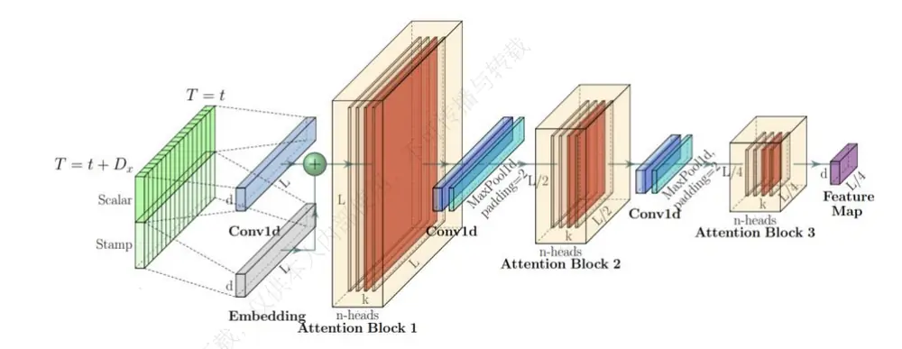
资料来源：《Informer: Beyond Efficient Transformer for Long Sequence Time-Series Forecasting》，海通证券研究所整理

PatchTST 在 Transformer 类模型的基础上，进一步引入通道独立和 Patch 划分的特性，利用独立通道高效地处理包含多个变量的时间序列数据。其中，每个变量被视为一个独立的通道。模型独立处理每个通道中的数据，并通过参数共享的方式，学习不同变量之间的交互关系。

此外，PatchTST 借鉴了图像处理中，对图片进行 Patch 划分的方式，将时间序列数据分割成小的时间片段或窗口，即，Patch。这些 Patch 随后被输入 Transformer主干网络中，进行信息提取。而且，PatchTST 提供了两种训练模式，既可以采用有监督的方式直接根据历史数据预测未来值，也可以采用自监督方式从数据中自我学习潜在结构和规律，提升模型泛化能力。

图4 PatchTST 网络结构示意图
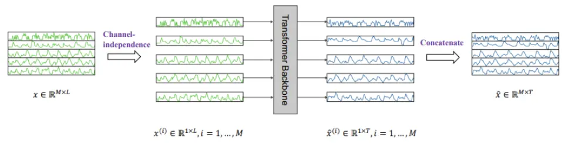
资料来源：《A Time Series is Worth 64 Words Long-term Forecasting with Transformers》，海通证券研究所整理

下表展示了基于 Transformer 类模型训练得到的因子的周度选股能力。从中可见，Transformer 类模型同样有着显著的周度选股能力，但是依旧小幅弱于 BiAGRU 模型。对比不同的 Transformer 类模型，Transformer 周度选股能力最强，Informer 次之，PatchTST 相对较弱。Transformer 模型周均 Rank IC 为 0.129，Top10%组合年化超额收益 30.6%。

表 3 Transformer 类模型周度选股能力（2017-2023）

|  | Rank IC |  | Top10%组合超额 |  | Top100 组合超额 |  | 因子值 自相关性 | Top10% 年化双 边换手 (倍) |
| --- | --- | --- | --- | --- | --- | --- | --- | --- |
|  | TO 收盘 | T1 均价 | 费前 | 费后 | 费前 | 费后 |  |  |
| BiAGRU | 0.135 | 0.125 | 32.5% | 24.7% | 38.5% | 28.2% | 0.75 | 40 |
| Transformer | 0.129 | 0.119 | 30.6% | 22.9% | 35.8% | 25.9% | 0.75 | 40 |
| Informer | 0.125 | 0.115 | 27.9% | 19.5% | 33.6% | 22.7% | 0.72 | 45 |
| PatchTST | 0.111 | 0.105 | 23.7% | 18.1% | 26.7% | 19.3% | 0.80 | 30 |

资料来源：Wind，海通证券研究所

从下表的分年度表现看，Transformer 和 Informer 模型在 2019、2020 和 2023 年皆取得更高的超额收益，而 PatchTST 仅在 2023 年有更强的超额收益。与卷积类模型类似，Transformer类模型 2018 年均明显跑输 BiAGRU 模型，极值组合超额收益落后10%以上。

表 4 Transformer 类模型极值组合分年度多头超额收益（2017-2023）

|  | Panel A: Top10%组合 |  |  |  |  |  |  |  |
| --- | --- | --- | --- | --- | --- | --- | --- | --- |
|  | 2017 | 2018 | 2019 | 2020 | 2021 | 2022 | 2023 | 全区间 |
| BiAGRU | 24.3% | 50.1% | 29.1% | 19.3% | 30.6% | 38.7% | 28.1% | 32.5% |
| Transformer | 17.7% | 39.5% | 33.0% | 21.1% | 28.5% | 38.8% | 31.9% | 30.6% |
| Informer | 13.8% | 36.7% | 33.5% | 19.4% | 27.1% | 32.1% | 31.0% | 27.9% |
| PatchTST | 5.7% | 26.0% | 29.0% | 13.8% | 24.4% | 31.9% | 37.9% | 23.7% |
|  |  |  |  |  | Panel B: Top100 组合 |  |  |  |
|  | 2017 | 2018 | 2019 | 2020 | 2021 | 2022 | 2023 | 全区间 |
|  | 31.1% | 68.8% | 33.2% | 15.7% | 35.6% | 41.3% | 35.8% | 38.5% |
| BiAGRU Transformer | 20.7% | 51.6% | 43.0% | 18.9% | 34.1% | 39.4% | 40.0% | 35.8% |
| Informer | 16.3% | 49.2% | 42.6% | 20.7% | 31.6% | 32.7% | 41.0% | 33.6% |
| PatchTST | 7.3% | 36.9% | 33.1% | 10.1% | 27.4% | 26.4% | 49.2% | 26.7% |

资料来源：Wind，海通证券研究所

## 1.3 线性类模型

近年来，除 RNN类、卷积类和 Transformer类外，线性类模型也开始被用于时间序列预测任务中。和其他类别模型相比，线性类模型的最大特点是结构简单、参数量少。而且，在部分时间序列预测任务上，线性类模型也呈现出不输于其他类别模型的效果。本节重点测试 DLinear、RLinear、RMLP 和 TSMixer 四种网络结构。

DLinear 模型将时间序列分解为趋势序列和残差序列，然后使用两个单层线性网络分别对这两个序列建模，以完成预测任务。RLinear 和 RMLP 模型的思路相同，但是在输入处理上更加简单，本文不再赘述。借鉴 DLinear 对输入特征的处理模式，可进一步构建 DBiAGRU 模型。

图5 DLinear 网络结构示意图
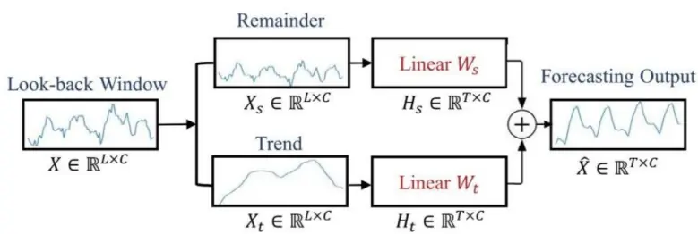
资料来源：《Are Transformers Effective for Time Series Forecasting?》，海通证券研究所整理

TSMixer 借鉴计算机视觉领域中的 MLP-Mixer 架构，有效捕获了时序数据中蕴含的时间模式和交叉变量信息。TSMixer 通过应用类似于 MLP-Mixer 的设计思路，引入时序混合层（Temporal Mixing）和特征混合层（Feature Mixing）。前者融合同一变量在不同时间步长上的特征，以捕捉时序依赖关系；而后者则跨越变量在同一时间点上融合信息，揭示特征间的相互作用。

图6 TSMixer 网络结构示意图
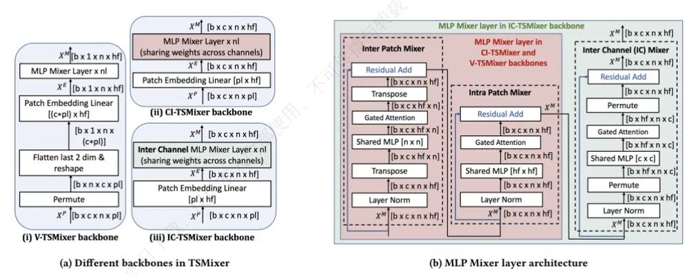
资料来源：《TSMixer: Lightweight MLP-Mixer Model for Multivariate Time Series Forecasting》，海通证券研究所整理

下表展示了基于线性类模型训练得到的因子的周度选股能力。从中可见，线性类模型同样有较为出色的周度选股能力，但也明显不及 BiAGRU 模型。其中，TSMixer 的周度选股能力最强， 和 次之， 较弱。 周均 为 ，Top10%组合年化超额收益 26.8%。此外，在引入 DLinear 对于输入特征的进行处理后，的极值组合超额收益小幅提升。

表 5 线性类模型周度选股能力（2017-2023）

|  | Rank IC |  | Top10%组合超额 |  | Top100 组合超额 |  | 因子值 自相关性 | Top10% 年化双 边换手 (倍) |
| --- | --- | --- | --- | --- | --- | --- | --- | --- |
|  | TO 收盘 | T1 均价 | 费前 | 费后 | 费前 | 费后 |  |  |
| BiAGRU | 0.135 | 0.125 | 32.5% | 24.7% | 38.5% | 28.2% | 0.75 | 40 |
| DBiAGRU | 0.134 | 0.124 | 33.0% | 25.2% | 41.0% | 30.4% | 0.76 | 40 |
| RLinear | 0.111 | 0.105 | 22.5% | 16.5% | 25.7% | 17.8% | 0.80 | 33 |
| RMLP | 0.117 | 0.110 | 24.2% | 17.0% | 27.6% | 18.3% | 0.76 | 40 |
| DLinear | 0.119 | 0.111 | 24.6% | 17.7% | 26.5% | 17.8% | 0.77 | 37 |
| TSMixer | 0.122 | 0.114 | 26.8% | 19.6% | 32.6% | 22.9% | 0.76 | 39 |

资料来源：Wind，海通证券研究所

从下表的分年度表现看，线性类模型在 2017-2018 年显著弱于 BiAGRU 模型，Top10%组合多头超额收益的落后幅度超过 15%。而 RMLP、DLinear 和 TSMixer 模型仅在 2021 和 2023 年有更高的多头超额收益。

表 6 线性类模型极值组合分年度多头超额收益（2017-2023）

|  | Panel A: Top10%组合 |  |  |  |  |  |  |  |
| --- | --- | --- | --- | --- | --- | --- | --- | --- |
|  | 2017 | 2018 | 2019 | 2020 | 2021 | 2022 | 2023 | 全区间 |
| BiAGRU | 24.3% | 50.1% | 29.1% | 19.3% | 30.6% | 38.7% | 28.1% | 32.5% |
| DBiAGRU | 23.0% | 50.8% | 33.1% | 25.5% | 28.1% | 34.5% | 29.9% | 33.0% |
| RLinear | 5.5% | 23.9% | 28.9% | 14.5% | 22.5% | 32.0% | 32.8% | 22.5% |
| RMLP | 8.6% | 28.4% | 32.2% | 12.1% | 22.0% | 29.7% | 38.1% | 24.2% |
| DLinear | 9.1% | 28.7% | 31.5% | 13.4% | 23.8% | 32.3% | 34.4% | 24.6% |
| TSMixer | 12.6% | 32.6% | 32.3% | 19.9% | 22.1% | 30.1% | 37.7% | 26.8% |
|  | Panel B: Top100 组合 |  |  |  |  |  |  |  |
|  | 2017 | 2018 | 2019 | 2020 | 2021 | 2022 | 2023 | 全区间 |
| BiAGRU | 31.1% | 68.8% | 33.2% | 15.7% | 35.6% | 41.3% | 35.8% | 38.5% |
| DBiAGRU | 30.0% | 73.1% | 41.4% | 26.2% | 31.7% | 38.4% | 39.3% | 41.0% |
| RLinear | 7.0% | 33.6% | 34.7% | 10.4% | 25.0% | 29.3% | 42.6% | 25.7% |
| RMLP | 8.9% | 39.6% | 37.7% | 7.4% | 24.0% | 27.4% | 50.9% | 27.6% |
| DLinear | 9.1% | 34.5% | 33.2% | 10.3% | 26.3% | 27.6% | 46.3% | 26.5% |
| TSMixer | 14.2% | 46.7% | 39.3% | 19.9% | 27.6% | 28.1% | 53.6% | 32.6% |

资料来源：Wind，海通证券研究所

## 1.4 本章小结

本章在控制模型输入特征、预测标签、训练设定的前提下，对比基于不同深度学习模型训练所得因子的周度选股能力。根据我们的测试，卷积类模型最强、Transformer类模型次之、线性类模型较弱。其中，BiATCN 模型、TCN模型、Transformer模型表现较好。此外，使用输入特征分解处理的 DBiAGRU 模型也有较为显著的周度选股能力。但我们认为，上述结论并不具备很强的迁移性。由于模型效果受到多方面因素的影响，部分模型在当前测试中效果偏弱，也可能是笔者对超参数、输入特征或预测/调仓频率的设定导致的。投资者可在实际应用中，根据自身需求对模型进一步调优。

## 2. “模型动物园”内的对比与集成

首先，我们考察不同模型训练所得因子的截面相关性。如下表所示，各模型之间的相关性整体较高，线性相关系数均处于 0.7-0.8 的范围内。而同一类别内，不同细分网络结构之间的相关性更是接近或高于 0.85。我们认为，这些结果也较为符合直观认知。虽然各模型的网络结构及其特性存在较大差异，但共同点是，都具有很强的拟合能力。当输入特征、预测标签和训练设定均相同时，模型完全有可能得到相似的因子。

表 7 深度学习因子的截面相关性

|  | BiAGRU | BiATCN | TimesNet | Transformer | Informer | PatchTST | RLinear | RMLP | DLinear | TSMixer |
| --- | --- | --- | --- | --- | --- | --- | --- | --- | --- | --- |
| BiAGRU | 1.00 | 0.76 | 0.77 | 0.77 | 0.76 | 0.74 | 0.79 | 0.75 | 0.76 | 0.78 |
| BiATCN |  | 1.00 | 0.86 | 0.89 | 0.87 | 0.76 | 0.74 | 0.77 | 0.77 | 0.81 |
| TimesNet |  |  | 1.00 | 0.90 | 0.89 | 0.83 | 0.81 | 0.84 | 0.83 | 0.87 |
| Transformer |  |  |  | 1.00 | 0.91 | 0.79 | 0.79 | 0.81 | 0.81 | 0.84 |
| Informer |  |  |  |  | 1.00 | 0.80 | 0.80 | 0.81 | 0.81 | 0.85 |
| PatchTST |  |  |  |  |  | 1.00 | 0.86 | 0.90 | 0.89 | 0.90 |
| RLinear |  |  |  |  |  |  | 1.00 | 0.87 | 0.90 | 0.87 |
| RMLP |  |  |  |  |  |  |  | 1.00 | 0.91 | 0.93 |
| DLinear |  |  |  |  |  |  |  |  | 1.00 | 0.91 |
| TSMixer |  |  |  |  |  |  |  |  |  | 1.00 |

资料来源： ，海通证券研究所

尽管相关性不低，各个模型的 Top10%组合历年的多头超额收益（表 8）和 BiAGRU相比，依旧有一定的差异，大部分年份也是互有高低。但2017和2018两年，却是BiAGRU模型全面优于其余模型。那么，是什么原因导致了这一结果呢？我们认为，不同模型对量价信息的学习和调整速度不一致，使得它们在特定时段的表现出现分化。

表 8 各模型 Top10%组合分年度多头超额收益（2017-2023）

|  | 2017 | 2018 | 2019 | 2020 | 2021 | 2022 | 2023 | 全区间 |
| --- | --- | --- | --- | --- | --- | --- | --- | --- |
| BiAGRU | 24.3% | 50.1% | 29.1% | 19.3% | 30.6% | 38.7% | 28.1% | 32.5% |
| TCN | 24.3% | 39.3% | 34.9% | 29.8% | 33.2% | 31.2% | 32.8% | 32.6% |
| BiATCN | 24.2% | 40.3% | 38.8% | 29.1% | 29.0% | 37.2% | 35.1% | 33.8% |
| TimesNet | 19.0% | 36.4% | 31.6% | 20.9% | 27.1% | 31.4% | 31.0% | 28.7% |
| Transformer | 17.7% | 39.5% | 33.0% | 21.1% | 28.5% | 38.8% | 31.9% | 30.6% |
| Informer | 13.8% | 36.7% | 33.5% | 19.4% | 27.1% | 32.1% | 31.0% | 27.9% |
| PatchTST | 5.7% | 26.0% | 29.0% | 13.8% | 24.4% | 31.9% | 37.9% | 23.7% |
| RLinear | 5.5% | 23.9% | 28.9% | 14.5% | 22.5% | 32.0% | 32.8% | 22.5% |
| RMLP | 8.6% | 28.4% | 32.2% | 12.1% | 22.0% | 29.7% | 38.1% | 24.2% |
| DLinear | 9.1% | 28.7% | 31.5% | 13.4% | 23.8% | 32.3% | 34.4% | 24.6% |
| TSMixer | 12.6% | 32.6% | 32.3% | 19.9% | 22.1% | 30.1% | 37.7% | 26.8% |

资料来源：Wind，海通证券研究所

以 2018 年为例，下图展示了不同模型的 Top10%组合与 BiAGRU 模型的相对强弱净值走势。不难发现，所有模型都是在上半年显著、持续地跑输 模型。但经过2018 年 6 月的迭代后，各模型在下半年都可以跑平、甚至小幅跑赢 BiAGRU 模型。

[Table_Pic 图 Pe]7 各模型 Top10%组合/BiAGRU 模型 Top10%组合的相对强弱净值（2018.01-2018.12）
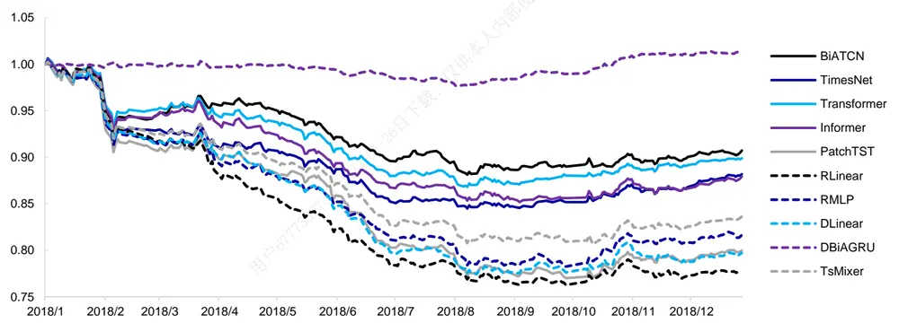
资料来源： ，海通证券研究所

我们通过计算各模型与常规低频量价因子之间的相关性，来推断模型对量价信息的学习模式。当然，由于模型的输入特征同时包含低频和高频量价信息，因此终端因子并不仅仅由低流动性、反转和低波动驱动。但为了讨论方便，我们只计算模型在 2017 年12 月和 2018 年 6 月分别迭代更新后，与这三个因子的相关性。

表 9 各模型与部分低频技术因子的相关性

|  | 低流动性 |  | 反转 |  | 低波动 |  |
| --- | --- | --- | --- | --- | --- | --- |
|  | 2017/12 | 2018/6 | 2017/12 | 2018/6 | 2017/12 | 2018/6 |
| BiAGRU | 0.10 | -0.05 | 0.14 | 0.55 | 0.16 | 0.16 |
| BiATCN | 0.25 | 0.07 | 0.30 | 0.42 | 0.41 | 0.28 |
| TimesNet | 0.38 | 0.04 | 0.35 | 0.57 | 0.46 | 0.31 |
| Transformer | 0.23 | 0.04 | 0.38 | 0.53 | 0.47 | 0.31 |
| Informer | 0.38 | -0.06 | 0.37 | 0.52 | 0.48 | 0.27 |
| PatchTST | 0.32 | 0.10 | 0.47 | 0.65 | 0.52 | 0.38 |
| RLinear | 0.26 | 0.24 | 0.38 | 0.52 | 0.50 | 0.40 |
| RMLP | 0.31 | 0.13 | 0.41 | 0.61 | 0.50 | 0.40 |
| DLinear | 0.37 | 0.18 | 0.44 | 0.51 | 0.51 | 0.41 |
| TSMixer | 0.35 | 0.21 | 0.44 | 0.59 | 0.46 | 0.40 |

资料来源：Wind，海通证券研究所

由上表可见，2017 年 12 月更新后，BiAGRU 模型与低流动性和反转因子的相关性已大幅低于其他模型。而观察下图可以发现，这两个因子的多头超额收益皆在 2018 年上半年出现一定幅度的回撤。这使得那些尚未在两者上降低相关性的模型，显著跑输BiAGRU 模型。

2018 年 6 月更新后，所有模型和反转因子的相关性较为接近。与此同时，其余模型和低流动性、低波动因子的相关性高于 BiAGRU 模型。2018 年下半年，这三个因子的表现较为优异，推动其余模型得到的深度学习因子的超额收益跑赢（平）BiAGRU 模型。

图8 部分低频技术因子 Top10%组合的多头超额净值（2018.01-2018.12）
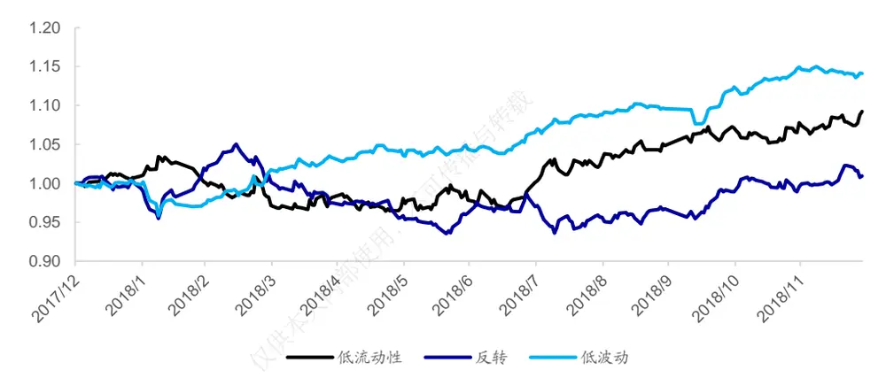
资料来源：Wind，海通证券研究所

由此可见，模型因网络结构、超参数选择等因素的差异，对量价信息的学习和调整速度并不一致，使得极值组合的年化超额收益虽然接近，但在某一时段内的表现却大相径庭，这就给单一模型的使用带来了很大的不确定性。

为了构建更加稳健的深度学习因子，我们可集成不同模型训练得到的因子。考虑到因子之间较高的截面相关性，我们采用最简单的等权方式。下表展示了部分集成模型的因子周度选股能力。为了方便表述，我们将 BiAGRU 与其他模型的等权集成简写为+XXX模型。例如，BiAGRU 与 BiATCN 的等权集成模型可简写为+BiATCN 模型。

表 10 集成模型周度选股能力（2017-2023）

|  | Rank IC |  | Top10%组合超额 |  | Top100 组合超额 |  | 因子值自 相关性 | Top10%年 化双边换手 (倍) |
| --- | --- | --- | --- | --- | --- | --- | --- | --- |
|  | TO 收盘 | T1 均价 | 费前 | 费后 | 费前 | 费后 |  |  |
| BiAGRU | 0.135 | 0.125 | 32.5% | 24.7% | 38.5% | 28.2% | 0.75 | 40 |
| +BiATCN | 0.142 | 0.131 | 35.2% | 26.7% | 41.2% | 30.2% | 0.74 | 43 |
| +BiATCN+Transformer | 0.141 | 0.129 | 34.2% | 26.2% | 39.9% | 29.5% | 0.76 | 40 |
| +DBiAGRU +BiATCN+Transformer | 0.142 | 0.130 | 34.8% | 27.0% | 40.8% | 30.4% | 0.76 | 40 |
| +DBiAGRU +BiATCN+Transformer+TSMixer | 0.140 | 0.129 | 33.8% | 26.2% | 39.6% | 29.6% | 0.77 | 38 |

资料来源：Wind，海通证券研究所

由上表可见，BiAGRU 模型叠加 BiATCN 或 Transformer 后，因子表现得到进一步提升。周均 Rank IC 在 0.14 以上，Top10%组合和 Top100 组合的年化超额收益分别为34%和 40%左右。综合来看，+BiATCN 模型和+BiATCN+Transformer 模型的周度选股能力更强。

从下表的分年度超额收益可见，2019-2023 年期间，集成模型大概率优于 BiAGRU模型。其中，+BiATCN、+BIATCN+Transformer 和+DBiAGRU+BiATCN+Transformer表现相对更好。较为明显的例外是 2021 年，集成模型的 Top100 组合均弱于 BiAGRU模型。

表 11 集成模型极值组合分年度多头超额收益（2017-2023）

|  | Panel A: Top10%组合 |  |  |  |  |  |  |
| --- | --- | --- | --- | --- | --- | --- | --- |
|  | 2017 | 2018 | 2019 | 2020 | 2021 | 2022 2023 | 全区间 |
| BiAGRU | 24.3% | 50.1% | 29.1% | 19.3% | 30.6% 38.7% | 28.1% | 32.5% |
| +BiATCN | 25.8% | 50.0% | 34.9% | 24.8% | 31.7% 40.9% | 31.8% | 35.2% |
| +BiATCN+Transformer | 22.6% | 47.6% | 34.4% | 24.7% | 30.6% 41.5% | 32.3% | 34.2% |
| +DBiAGRU +BiATCN+Transformer | 23.1% | 51.0% | 35.6% | 25.7% | 30.8% 40.4% | 31.8% | 34.8% |
| +DBiAGRU +BiATCN+Transformer+TSMixer | 21.2% | 49.0% | 35.0% | 25.2% | 29.3% 39.0% | 33.0% | 33.8% |
|  |  |  |  | Panel A: Top100 组合 |  |  |  |
|  | 2017 | 2018 | 2019 | 2020 | 2021 | 2022 2023 | 全区间 |
| BiAGRU | 31.1% | 68.8% | 33.2% | 15.7% | 35.6% | 41.3% 35.8% | 38.5% |
| +BiATCN | 30.4% | 69.7% | 36.3% | 20.1% | 30.9% | 46.8% 46.4% | 41.2% |
| +BiATCN+Transformer | 26.5% | 65.1% | 36.6% | 21.2% | 31.6% | 45.8% 45.3% | 39.9% |
| +DBiAGRU +BiATCN+Transformer | 27.0% | 70.8% | 37.3% | 25.1% | 29.5% | 44.4% 44.1% | 40.8% |
| +DBiAGRU +BiATCN+Transformer+TSMixer | 25.8% | 66.6% | 38.5% | 24.3% | 29.5% | 39.5% 47.0% | 39.6% |

资料来源：Wind，海通证券研究所

## 3. 基于模型集成的 AI增强组合

我们以中证 500 和中证 1000 增强组合为例，将各集成模型训练得到的因子作为收益预测，考察它们在指数增强组合中的应用效果。

考虑到成分股约束对增强组合的收益有一定影响，本文分别测试全市场选股和 80%指数成分内选股的两个增强组合的业绩表现。其中，风控模块包括以下几个方面的约束。

1） 个股偏离：相对基准的权重偏离不超过 0.5%；

2） 因子暴露：估值中性、市值中性，常规低频因子：[-0.5, 0.5]；

3） 行业偏离：中信一级行业中性；

4） 选股空间：全市场/80%指数成分股权重；

5） 换手率：单次单边换手不超过 30%。

组合的优化目标均为最大化预期收益，目标函数如下所示。

$$
\underset{w_{i}}{max}\sum\mu_{i}w_{i}
$$

其中，w 为组合中股票 i的权重，μ 为股票 i的预期超额收益。为使测试结果贴近实践，下文的测算均假定以次日均价成交，同时扣除双边 3‰的交易成本。

下表展示了使用不同集成模型构建得到的增强组合的超额收益。全市场选股的中证500 增强组合的年化超额收益从 16.5%提升至 17.4%-18.5%；全市场选股的中证 1000增强组合年化超额收益从 22.5%提升至 24.3%-25.1%，80%成分股约束的中证 1000 增强组合年化超额收益从 20.0%提升至 20.5%-21.4%。其中，+BiATCN 和+BiATCN+Transformer 模型的超额收益相对更高。

表 12 AI 增强组合年化超额收益对比（2017-2023）

|  | 中证 500 增强 |  | 中证 1000 增强 |  |
| --- | --- | --- | --- | --- |
|  | 全市场 | 80%成分股内 | 全市场 | 80%成分股内 |
| BiAGRU | 16.5% | 11.7% | 22.5% | 20.0% |
| +BiATCN | 17.8% | 12.3% | 24.7% | 21.4% |
| +BiATCN+Transformer | 17.4% | 11.8% | 24.3% | 20.5% |
| + DBiAGRU +BiATCN+Transformer | 18.5% | 11.7% | 24.4% | 21.3% |
| + DBiAGRU +BiATCN+Transformer+TSMixer | 18.4% | 11.5% | 25.1% | 20.7% |

资料来源：Wind，海通证券研究所

下表为+DBiAGRU+BiATCN+Transformer 模型对应的全市场中证 500 增强组合的分年度收益风险特征。2017 年以来，组合年化超额收益 18.5%，超额最大回撤 4.0%，发生在 2021 年。分年度来看，2019 和 2021 年表现相对较弱，2023 年超额收益 14.9%。

表 13 中证 500 AI 增强组合分年度收益风险特征（2017-2023）

|  | 超额收益 | 超额最大回撤 | 跟踪误差 | 信息比率 | 月度胜率 |
| --- | --- | --- | --- | --- | --- |
| 2017 | 19.5% | 1.7% | 4.8% | 4.05 | 92% |
| 2018 | 24.6% | 2.5% | 5.0% | 4.91 | 92% |
| 2019 | 16.5% | 1.8% | 4.3% | 3.80 | 75% |
| 2020 | 17.2% | 3.5% | 5.5% | 3.12 | 67% |
| 2021 | 13.6% | 3.7% | 6.4% | 2.13 | 67% |
| 2022 | 18.0% | 1.6% | 5.3% | 3.38 | 92% |
| 2023 | 14.9% | 2.1% | 3.5% | 4.27 | 75% |
| 全区间 | 18.5% | 4.0% | 5.1% | 3.64 | 80% |

资料来源：Wind，海通证券研究所

下图展示了该组合 2023 年以来的超额收益净值走势，区间超额最大回撤发生在2023 年 3 月底至 4 月中旬，幅度略高于 2%，其余时间的回撤均不超过 1.5%。

图9 中证 500AI 增强组合超额净值走势（2023.01-2023.12）
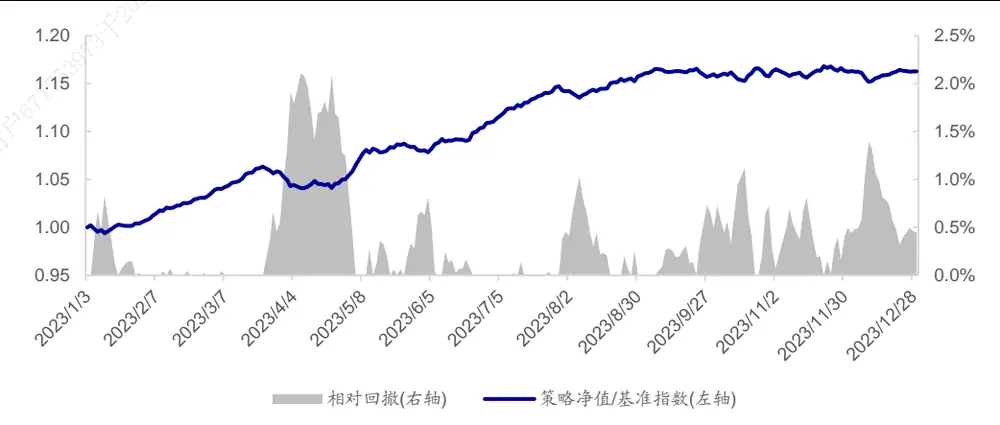
资料来源：Wind，海通证券研究所

下表为+BiATCN 模型对应的全市场中证 1000 增强组合的分年度收益风险特征。2017 年以来，组合年化超额收益 24.7%，超额最大回撤 4.8%，发生在 2021 年。分年度来看，2020 和 2021 年表现相对较弱，2023 年超额收益 21.7%。

表 14 中证 1000 AI 增强组合分年度收益风险特征（2017-2023）

|  | 超额收益 | 超额最大回撤 | 跟踪误差 | 信息比率 | 月度胜率 |
| --- | --- | --- | --- | --- | --- |
| 2017 | 29.4% | 1.8% | 4.3% | 6.77 | 100% |
| 2018 | 32.3% | 1.8% | 5.3% | 6.13 | 100% |
| 2019 | 22.3% | 2.2% | 4.2% | 5.29 | 92% |
| 2020 | 20.5% | 2.9% | 5.8% | 3.51 | 75% |
| 2021 | 15.8% | 4.8% | 7.9% | 1.99 | 67% |
| 2022 | 22.5% | 2.2% | 6.0% | 3.74 | 100% |
| 2023 | 21.7% | 2.4% | 4.4% | 4.89 | 83% |
| 全区间 | 24.7% | 4.8% | 5.6% | 4.41 | 88% |

资料来源：Wind，海通证券研究所

下图展示了该组合 2023 年以来的超额收益净值走势。区间超额回撤较大的时间段有两个，分别为 2023 年 3 月底至 4月中旬和 2023 年 11 月，幅度都接近 2.5%。

图10 中证 1000AI 增强组合超额净值走势（2023.01-2023.12）
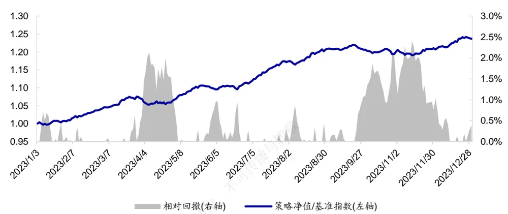
资料来源： ，海通证券研究所

## 4. 总结

本文在系列前期报告的基础之上，对比和讨论了基于不同类别的深度学习模型训练得到的因子的周度选股能力。根据我们的测试结果，卷积类模型、Transformer 类模型和线性类模型皆有十分出色的表现。相对而言，BiATCN 模型、TCN 模型、Transformer模型和 DBiAGRU 模型的周度选股能力更强。

不同模型训练得到的因子之间虽然存在较高的截面相关性，但极值组合的历年多头超额收益依旧有一定的差异，尤其是对比 BiAGRU 和其余模型。通过简单的分析可知，不同模型对量价信息的学习和调整速度并不一致，使得它们在特定时段的表现出现分化。

由于模型的网络结构、超参数选择等因素皆会影响模型对量价信息的学习和调整，我们尝试将不同网络训练得到的因子等权集成，希望获得更稳健的因子表现。从我们的回测结果来看，BiAGRU 模型在叠加 BiATCN 或 Transformer 后，因子周均 Rank IC 和极值组合的超额收益得到进一步提升。应用于增强组合的构建时，亦可观测到类似特征。相对而言，基于 BiAGRU+BiATCN 和+BiATCN+Transformer 模型构建的中证 500 AI 增强组合的超额收益表现更优。

## 5. 风险提示

市场系统性风险、资产流动性风险、政策变动风险、因子失效风险。

# 信息披露

分析师声明

[Table冯佳睿yst金融工程研究团队s]

袁林青金融工程研究团队

本人具有中国证券业协会授予的证券投资咨询执业资格，以勤勉的职业态度，独立、客观地出具本报告。本报告所采用的数据和信息均来自市场公开信息，本人不保证该等信息的准确性或完整性。分析逻辑基于作者的职业理解，清晰准确地反映了作者的研究观点，结论不受任何第三方的授意或影响，特此声明。

## 法律声明

本报告仅供海通证券股份有限公司（以下简称 本公司 ）的客户使用。本公司不会因接收人收到本报告而视其为客户。在任何情况下，本报告中的信息或所表述的意见并不构成对任何人的投资建议。在任何情况下，本公司不对任何人因使用本报告中的任何内容所引致的任何损失负任何责任。

本报告所载的资料、意见及推测仅反映本公司于发布本报告当日的判断，本报告所指的证券或投资标的的价格、价值及投资收入可能会波动。在不同时期，本公司可发出与本报告所载资料、意见及推测不一致的报告。

市场有风险，投资需谨慎。本报告所载的信息、材料及结论只提供特定客户作参考，不构成投资建议，也没有考虑到个别客户特殊的播投资目标、财务状况或需要。客户应考虑本报告中的任何意见或建议是否符合其特定状况。在法律许可的情况下，海通证券及其所属可关联机构可能会持有报告中提到的公司所发行的证券并进行交易，还可能为这些公司提供投资银行服务或其他服务。

本报告仅向特定客户传送，未经海通证券研究所书面授权，本研究报告的任何部分均不得以任何方式制作任何形式的拷贝、复印件或复制品，或再次分发给任何其他人，或以任何侵犯本公司版权的其他方式使用。所有本报告中使用的商标、服务标记及标记均为本公司的商标、服务标记及标记，如欲引用或转载本文内容，务必联络海通证券研究所并获得许可，并需注明出处为海通证券研究所，目不得对本文进行有悖原意的引用和删改。仅

根据中国证监会核发的经营证券业务许可，海通证券股份有限公司的经营范围包括证券投资咨询业务。下载

海通证券股份有限公司研究所[Table_PeopleInfo]
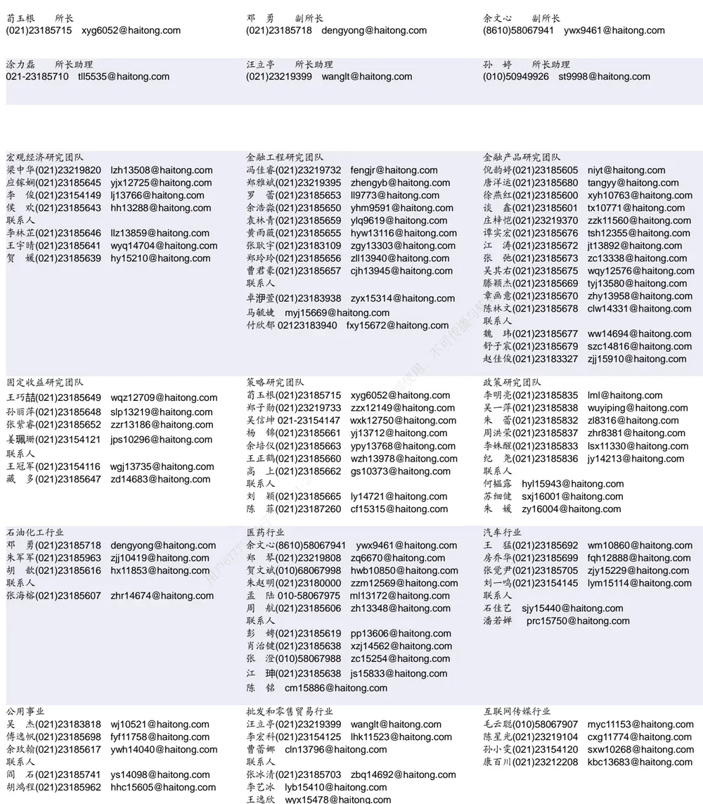

| 有色金属行业 陈先龙 02123219406 cxl15082@haitong.com | 房地产 谢 盐(021)23185696 xiey@haitong.com |  | 电子行业 张晓飞 zxf15282@haitong.com |
| --- | --- | --- | --- |
| 甘嘉尧(021)23185615 gjy11909@haitong.com 联系人 张恒浩(021)23185632 zhh14696@haitong.com 梁 琳(021)23185845 II15685@haitong.com | 涂力磊 021-23185710 联系人 曾佳敏(021)23185689 zjm14937@haitong.com 陈昭颖(021)23183953 czy15598@haitong.com | tll5535@haitong.com | 李 轩(021)23154652 lx12671@haitong.com 华晋书(021)23185608 hjs14155@haitong.com 薛逸民(021)23185630 xym13863@haitong.com 文 灿(021)23185602 wc13799@haitong.com 肖隽翀(021)23154139 xjc12802@haitong.com 崔冰睿(021)23185690 cbr14043@haitong.com 联系人 郦奕滢 lyy15347@haitong.com |
| 煤炭行业 李 淼(010)58067998 Im10779@haitong.com 王 涛(021)23185633 wt12363@haitong.com | 电力设备与新能源行业 吴 杰(021)23183818 房 青(021)23185603 徐柏乔(021)23219171 | wj10521@haitong.com fangq@haitong.com xbq6583@haitong.com | 张 幸(021)23183951 zx15429@haitong.com 基础化工行业 刘 威(0755)82764281 Iw10053@haitong.com 张翠翠(021)23185611 zcc11726@haitong.com 孙维容(021)23185389 swr12178@haitong.com 李 智(021)23185842 lz11785@haitong.com |
|  | 联系人 姚望洲(021)23185691 马菁菁(021)23185627 吴志鹏(021)23215736 罗 青(021)23185966 孔淑媛(021)23183806 王天璐(021)23185640 | ywz13822@haitong.com mjj14734@haitong.com wzp15273@haitong.com lq15535@haitong.com ksy15683@haitong.com |  |
| 计算机行业 郑宏达(021)23219392 杨 林(021)23183969 yl11036@haitong.com 杨 蒙(021)23185700 ym13254@haitong.com | 通信行业 zhd10834@haitong.com 余伟民(010)50949926 杨彤昕 010-56760095 于一铭 021-23183960 | ywm11574@haitong.com ytx12741@haitong.com yym15547@haitong.con | 非银行金融行业 何 婷(021)23219634 ht10515@haitong.com 任广博(010)56760090 rgb12695@haitong.com 孙 婷(010)50949926 st9998@haitong.com 曹 锟010-56760090 ck14023@haitong.com |
| 夏思寒(021)23183968 杨昊翊(021)23185620 yhy15080@haitong.com 朱 瑶(021)23187261 zy15988@haitong.com 交通运输行业 | xsh15310@haitong.com 纺织服装行业 | 夏凡(021)23185681 xf13728@haitong.com 徐 卓xz14706@haitong.com | 联系人 肖 尧(021)23185695 xy14794@haitong.com 建筑材料行业 |
| 虞 楠(021)23219382 yun@haitong.com 陈 宇(021)23185610 cy13115@haitong.com 罗月江(010)58067993 lyj12399@haitong.com 联系人 |  | 梁 希(021)23185621 lx11040@haitong.com 盛 开(021)23154510 sk11787@haitong.com | 冯晨阳(021)23183846 fcy10886@haitong.com 申 浩(021)23185636 sh12219@haitong.com |
| 吕春雨 Icy15841@haitong.com 杜清丽 18019031023 机械行业 mgj15551@haitong.com | 钢铁行业 |  | 建筑工程行业 |
| 毛冠锦 021-23183821 赵靖博(021)23185625 zjb13572@haitong.com 赵玥炜(021)23219814 zyw13208@haitong.com |  | 刘彦奇(021)23219391 liuyq@haitong.com | 张欣劼 18515295560 zxj12156@haitong.com 联系人 |
| 联系人 丁嘉一(021)23187266 djy15819@haitong.com 刘绮雯(021)23185686 Iqw14384@haitong.com |  |  | 曹有成(021)23185701 cyc13555@haitong.com 郭好格(010)58067828 ghg14711@haitong.com |
| 农林牧渔行业 | 食品饮料行业 |  |  |
| 李淼(010)58067998 Im10779@haitong.com | 颜慧菁(021)23183952 | yhj12866@haitong.com | 军工行业 |
| 巩健(021)23185702 gj15051@haitong.com |  |  | 张恒亘(021)23183943 zhx10170@haitong.com 联系人 |
| 冯鹤fh15342@haitong.com |  |  |  |
|  | 张宇轩(021)23154172 | zyx11631@haitong.com |  |
|  |  |  | 胡舜杰(021)23155686 |
|  | 程碧升(021)23185685 | cbs10969@haitong.com | 刘砚菲(021)23185612 lyf13079@haitong.com |
| 联系人 |  |  |  |
| 蔡子慕(021)23183965 czm15689@haitong.com | 联系人 |  | hsj14606@haitong.com |
|  | 张嘉颖(021)23185613 zjy14705@haitong.com |  | 李雨泉(021)23185843 lyq15646@haitong.com |
|  | 苗欣mx15565@haitong.com |  |  |
|  |  |  | 家电行业 |
| 银行行业 | 社会服务行业 |  |  |
| 林加力(021)23154395 ljl12245@haitong.com |  |  |  |
|  | 汪立亭(021)23219399 | wanglt@haitong.com | 陈子仪(021)23219244 chenzy@haitong.com |
| 董栋梁(021)23185697 ddl13206@haitong.com |  | xyz11630@haitong.com | 李 阳(021)23185618 ly11194@haitong.com |
|  | 许樱之(755)82900465 |  |  |
| 联系人 |  |  | 刘 璐(021)23185631 II11838@haitong.com |
|  |  | wyj13985@haitong.com |  |
|  | 王祎婕(021)23185687 |  |  |
| 徐凝碧(021)23185609 xnb14607@haitong.com |  |  |  |
|  | 联系人 |  | 吕浦源(021)23183822 Ipy15307@haitong.com |
|  |  | 毛弘毅(021)23183110 mhy13205@haitong.com |  |
| 造纸轻工行业 |  |  |  |
| 郭庆龙 gql13820@haitong.com |  | dyc10422@haitong.com |  |
|  | 环保行业 |  |  |
|  | 戴元灿(021)23185629 |  |  |
| 高翩然 gpr14257@haitong.com |  |  |  |
|  | 联系人 |  |  |
| 王文杰(021)23185637 wwj14034@haitong.com |  |  |  |

## 研究所销售团队

伏财勇(0755)23607963 fcy7498@haitong.com

蔡铁清(0755)82775962 ctq5979@haitong.com

辜丽娟(0755)83253022 gulj@haitong.com

刘晶晶(0755)83255933 liujj4900@haitong.com

饶 伟(0755)82775282 rw10588@haitong.com

欧阳梦楚(0755)23617160

oymc11039@haitong.com

巩柏含 gbh11537@haitong.com

张馨尹 0755-25597716 zxy14341@haitong.com

海通证券股份有限公司研究所

地址：上海市黄浦区广东路 689号海通证券大厦 9楼

电话：（021）23219000 传真：（021）23219392 胡雪梅(021)23219385 huxm@haitong.com 黄 诚(021)23219397 hc10482@haitong.com 季唯佳(021)23219384 jiwj@haitong.com 黄 毓(021)23219410 huangyu@haitong.com 胡宇欣(021)23154192 hyx10493@haitong.com 马晓男 mxn11376@haitong.com 毛文英(021)23219373 mwy10474@haitong.com 谭德康 tdk13548@haitong.com 邵亚杰 23214650 syj12493@haitong.com 王祎宁(021)23219281 wyn14183@haitong.com 周之斌 zzb14815@haitong.com 杨祎昕(021)23212268 yyx10310@haitong.com 张歆钰 zxy14733@haitong.com

网址：www.htsec.com

殷怡琦(010)58067988 yyq9989@haitong.com 
董晓梅 dxm10457@haitong.com 
郭 楠 010-5806 7936 gn12384@haitong.com 
张丽萱(010)58067931 zlx11191@haitong.com 
郭金垚(010)58067851 gjy12727@haitong.com 
高 瑞 gr13547@haitong.com 
姚 坦 yt14718@haitong.com 
上官灵芝 sglz14039@haitong.com 
王 勇 wy15756@haitong.com 
董 晋 dj15843@haitong.com