## [Tab相关研究

Table_ReportInfo]《选股因子系列研究（九十三）——深度学习因子的“模型动物园”》《选股因子系列研究（九十二）——组合约束对其收益表现的影响分析》

2023.12.27

《选股因子系列研究（九十一）——组合规模、交易成本和大单冲击对因子表现的影响分析》2023.12.13

分析师:冯佳睿

Tel:(021)23219732

Email:fengjr@haitong.com

证书:S0850512080006

分析师:罗蕾

Tel:(021)23185653

Email:ll9773@haitong.com

证书:S0850516080002

# 选股因子系列研究（九十四）——卖方分析师的目标价：有用吗？怎么用？

## 投资要点：

- 一致相对目标收益（CDTR）。本文从分析师角度出发，汇总其对自己所覆盖公司的相对目标收益排名。即，考察分析师 对股票 给出的目标收益，相对于分析师k对其所覆盖的所有股票给出的平均目标收益的超额收益，称为相对目标收益；然后再汇总所有分析师对股票 的相对目标收益，以此构建“一致相对目标收益”（C ）因子。

一致相对目标收益（ ）因子在一定程度上消除了分析师之间目标收益中枢不同的影响。因为有的分析师天然比较乐观，对覆盖的股票都倾向于给出较高的目标价；而有的分析师则较为谨慎，对覆盖股票给出的目标价都比较低。更进一步，比起原先的目标收益空间，该因子实际上更为关注分析师对自己所覆盖股票的排序。

- 因子与股票未来一个月收益显著正相关。分 组后，多头组合年化超额3.3%，空头组合年化超额-4.9%，年化多空收益为 8.2%，均统计显著，月胜率。多空收益在动量和增长上的暴露较为显著。即，动量或增长风格较强时，因子的选股效果相对较优。剔除常见选股因子的影响后，CDTR 因子在Fama-Macbeth 回归下的截面溢价仍显著为正；在时间序列回归下的年化 alpha（系数*12）为 7.0%，统计显著。

- CDTR因子在基金重仓股与非基金重仓股、不同市值股票池、及不同前期涨跌幅股票池中的选股效果。（1）无论是基金重仓股还是非基金重仓股样本空间，CDTR因子值越高，股票未来一个月的收益表现越优。相对而言，非基金重仓股中，因子多空收益更为明显；但基金重仓股中，因子多空收益稳定性更高。（2）在市值较大的股票中， 因子分组多空收益稳定性更高，月胜率超过 ；但市值最大的组别中，多空收益相对较低。（3）在不同涨幅组别中，CDTR 因子越大，股票未来一个月的收益越高，单调性明显。相对而言，涨幅越大的股票池内，因子的选股效果越优，多头及多空收益都更为显著。

- CDTR因子的参数敏感性。构建因子的回看期越长，因子覆盖率越高，但溢价会出现明显削弱。回看期为 3-6 个月时，CDTR因子稳定性高，月胜率超过 65%，t 值大于 4。因子在周度、双周和月度的更新频率下都具有显著的选股效果，但更新频率越快，溢价表现越优。

- CDTR 因子可较为稳定地提升红利优选组合的业绩表现。2013.01-20223.12 期间，组合年化收益 28.1%，相对中证红利全收益指数年化超额 17.5%，月胜率68.2%，年胜率 100%。时间序列上，组合相对中证红利全收益指数的 beta 接近于 1，即，红利优选组合大体捕获了中证红利指数的 beta 收益。剔除市场及主要风格因子贡献后，组合年化 alpha 为 9.8%（月均 0.82%），统计显著。

- 若要降低跟踪误差，可构建有行业约束的红利优选组合。约束越严格，组合的跟踪误差、相对回撤越小。例如，在 2%的行业约束下，组合年化跟踪误差和 2013年以来的最大相对回撤仅分别为 和 ；但相应地，超额收益也有所削弱，由无约束下的年化超额 17.5%下降至 10.3%。但仍然超过 10%，且每一年均可取得正超额。

风险提示。历史统计规律失效风险、因子失效风险。

在前期报告《选股因子系列研究（八十九）——买入评级因子的改进及其在大盘股优选策略中的应用》中，我们对买入评级因子进行了分析和改进。本文将对分析师报告中的另一重要要素——目标价，及其相关的因子构建进行分析和探讨。

## 1. 目标价与目标收益

目标价是分析师报告的重要要素之一，2023 年（截至 2023.12.29，下同），朝阳永续收录的分析师报告中，33.2%有目标价字段数据。按覆盖个股统计，2023 年入库的报告覆盖了 3331 只股票，而有目标价字段的报告覆盖了 2584 只股票，占比达 77.6%。即，分析师覆盖的股票中绝大部分股票都有目标价信息。

图1 有目标价的报告占报告总篇数之比（截至 2023.12.29）
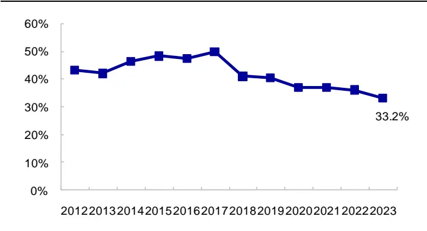
资料来源：朝阳永续，海通证券研究所

图2 有目标价的报告所覆盖的 A股数（截至 2023.12.29）
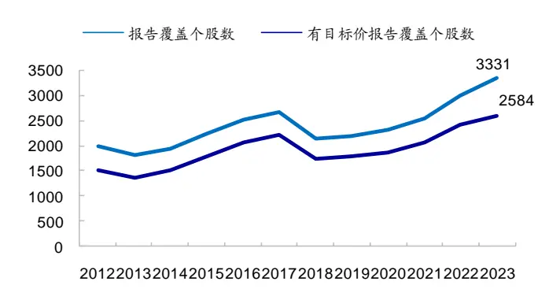
资料来源：朝阳永续，海通证券研究所

朝阳永续会根据不同分析师的目标价汇总一致预期目标价，基于该指标可构建一致预期目标收益因子。即，一致预期目标价/个股当前股价-1。2013 年以来，一致预期目标收益因子的月均股票数量覆盖度为 39.1%，市值覆盖度为 75.8%。其中，数量覆盖度是指有因子值的个股与当时 A 股总数（剔除上市不足 3 个月新股、ST 股）之比，市值覆盖度是指有因子值的个股市值总和占 A股总市值之比。分月度来看（图 4），4-6月和8-10 月，可能受财报期影响，一致预期目标收益因子的覆盖度相对较高。

图3 一致预期目标收益因子的截面覆盖度（截至 2023.12.29）
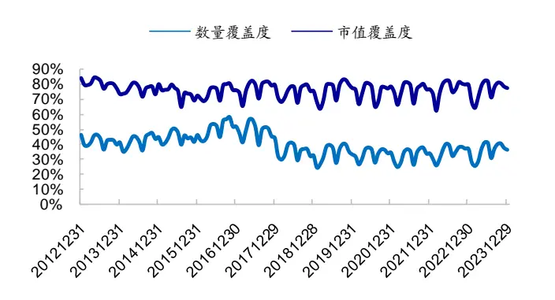
资料来源：Wind，朝阳永续，海通证券研究所

图4 不同月份，一致预期目标收益因子的平均截面覆盖度（2013.01-2023.12）
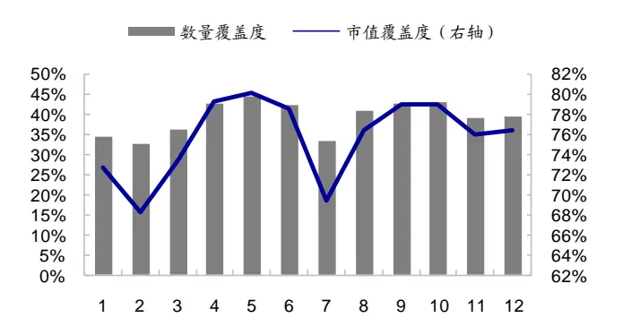
资料来源：Wind，朝阳永续，海通证券研究所

如下表所示，原始的一致目标收益因子具有较好的选股效果。在有因子覆盖的股票池里，其月均溢价为正，月胜率接近 ，相应的 值为 ，统计显著。但该因子对基于常见选股因子所构建的多因子模型并没有明显的增量信息，若剥离常见风格、低频量价、基本面、以及分析师相关（一致预期净利润调整、分析师覆盖度）因子的影响，则该因子的溢价不再显著。

表 1 一致预期目标收益因子选股效果（2013.01-2023.12）

|  | 月均溢价 | 年化波动率 | 信息比 | t值 | p值 | 月胜率 |
| --- | --- | --- | --- | --- | --- | --- |
| 单因子 | 0.29% | 4.7% | 0.73 | 2.43 | 0.017 | 59.8% |
| 多因子模型 | 0.14% | 3.9% | 0.44 | 1.45 | 0.151 | 53.0% |

资料来源：Wind，朝阳永续，海通证券研究所

构建一致预期目标收益因子的初衷是从个股角度综合分析师的观点。但是，一方面，不同分析师的目标收益中枢可能不一；另一方面，目标价给出的时间点也不一样，统一用最新收盘价作为对比基准来反映分析师的看好程度，显得较为粗糙。

本文从分析师角度出发，汇总其对自己所覆盖公司的相对目标收益排名。即，考察分析师 k 对股票 j 给出的目标收益，相对于分析师 k 对其所覆盖的所有股票给出的平均目标收益的超额收益，称为相对目标收益；然后再汇总所有分析师对股票 j 的相对目标收益，以此构建的因子我们称之为“一致相对目标收益”。

具体地，股票 j 的一致相对目标收益（CDTR）的计算方式为，回看过去 3 个月，按权重 ${\sf W}_{\sf k}$ 汇总对股票 j给予目标价的分析师 $(\mathsf{S}_{\mathrm{~j~}}^{\mathsf{A}})$ 所出具的最新相对目标收益。

$$
CDTR_{j}=\sum_{k\epsilon S_{j}^{A}}w_{k}\cdot\left(TR_{j,k}-mean(TR_{k})\right)
$$

其中， $\mathsf{TR}_{\mathsf{j},\mathsf{k}}$ 为分析师 k 对股票 j出具的目标收益（目标价/报告发布前一天个股收盘价-1）；$\left(\mathsf{TR}_{\mathrm{j,k}}\mathsf{-mean}(\mathsf{TR}_{\mathrm{k}})\right.$ ）为分析师 k 对股票 j 出具的相对目标收益，这一步骤在一定程度上消除了分析师之间目标收益中枢不同的影响。因为有的分析师天然比较乐观，对覆盖的股票都倾向于给出较高的目标价；而有的分析师则较为谨慎，对覆盖股票给出的目标价都比较低。更进一步，比起原先的目标收益空间，该因子实际上更为关注分析师对自己所覆盖股票的排序。 ${\sf W}_{\sf k}$ 则为分析师 k 的权重，最简单直接的加权方式即为等权；也可按时间加权，即，分析师发报告的时间距离因子构造时点越近，给予的权重越高。下面，本文将考察一致相对目标收益（CDTR）因子的选股效果。

## 2. 一致相对目标收益（CDTR）因子

## 2.1 CDTR因子的全市场选股效果

一致相对目标收益与一致预期目标收益整体具有较高的相关性。2013.01-2023.12，CDTR_等权和 CDTR_时间加权两个因子与一致预期目标收益因子的平均截面相关系数分别为 42.8%和 43.1%，但它们并不完全相同。

图5 一致相对目标收益因子的截面覆盖度（截至 2023.12.29）
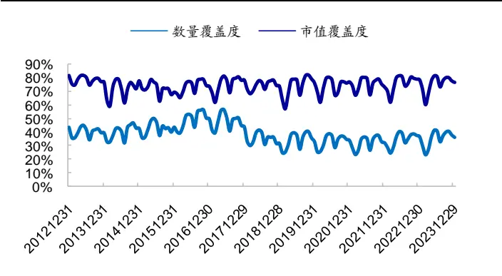
资料来源：Wind，朝阳永续，海通证券研究所

图6 不同月份，一致相对目标收益因子的平均截面覆盖度（2013.01-2023.12）
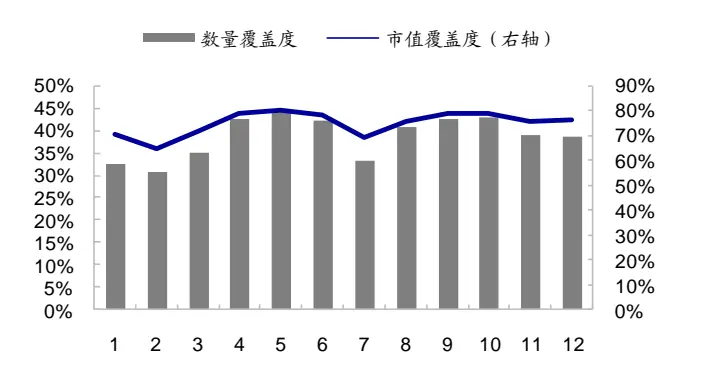
资料来源：Wind，朝阳永续，海通证券研究所

2013 年以来，一致相对目标收益因子的平均股票数量覆盖度为 38.7%，市值覆盖度为 75.0%。分月度来看（图 6），4-6月和 8-10 月，可能受财报期的影响，一致相对目标收益因子的覆盖度较高。但即使是 1、2 月份，数量覆盖度也不低于 30%，市值覆盖度不低于 60%。

考虑到因子较低的数量覆盖度，我们先分析无因子覆盖的这部分股票的特征。全区间内（2013.01-2023.12，下同），无因子覆盖股票的等权组合相对于全 A等权组合的年超额（月均超额*12，下同）在 0附近（表 2）。其中，2014-2016 年、2021-2023 年，该组合累计超额收益稳定上升，即无覆盖股票的平均收益显著优于有覆盖的股票；而2017-2020 年，有因子覆盖股票的平均超额收益又显著优于无覆盖股票（图 7）。

结合 2013 年以来市场风格的切换，我们认为，无因子覆盖组合的超额收益在一定程度上受市值、估值等风格的影响。如表 3所示，若将无因子覆盖股票的月超额收益，对市场（wind 全 A指数）、小市值、低估值、低涨幅、低波动、高盈利、高增长 7个因子的月收益率进行时间序列回归，结果显示，超额收益呈显著的小市值、低估值特征。即，小盘价值风格占优时，无因子覆盖股票的超额收益高；反之，大盘成长风格占优时，无因子覆盖股票的超额收益低。

图7 无因子覆盖股票等权组合累计超额收益（2013.01-2023.12）
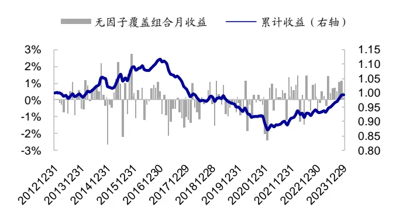
资料来源：Wind，朝阳永续，海通证券研究所

图8 一 致 相 对 目 标 收 益 因 子 分 组 年 化 超 额 收 益（2013.01-2023.12）
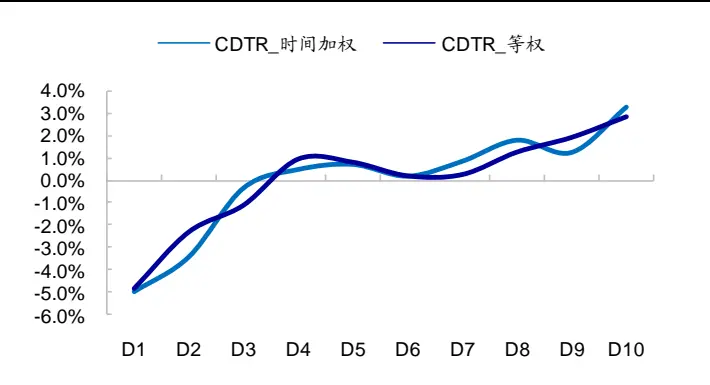
资料来源：Wind，朝阳永续，海通证券研究所

在有因子覆盖的股票池里，一致相对目标收益越高，股票组合未来一个月收益表现越优（图 ）。 时间加权因子得分最高的 股票的等权组合（多头组合）相对有覆盖股票等权组合的年化超额为 ，而因子得分最低的 股票等权组合（空头组合）年化超额 ，因子多空年化收益 ，均统计显著，月胜率 （表 ）。相较而言，时间加权方式构建 CDTR 因子的选股效果略优于等权，但两者都具有显著的多空收益。为表述方便，下文仅展示 CDTR_时间加权因子（简记为 CDTR 因子）的统计结果和分析结论。

表 2 一致相对目标收益因子的分组年化多空收益（2013.01-2023.12）

| CDTR_等权 |  |  |  |  |  | CDTR_时间加权 |  |  |  |  |
| --- | --- | --- | --- | --- | --- | --- | --- | --- | --- | --- |
|  | 年收益 | 月胜率 | 信息比 | t值 | p值 | 年收益 | 月胜率 | 信息比 | t值 | p值 |
| 因子未覆 盖股票 | -0.1% | 53.0% | -0.02 | -0.07 | 0.942 | -0.1% | 53.0% | -0.02 | -0.07 | 0.942 |
| D1 | -4.8% | 35.6% | -0.94 | -3.12 | 0.002 | -4.9% | 37.1% | -1.00 | -3.30 | 0.001 |
| D10 | 2.8% | 53.0% | 0.49 | 1.61 | 0.109 | 3.3% | 57.6% | 0.57 | 1.89 | 0.060 |
| D10-D1 | 7.7% | 65.2% | 1.30 | 4.30 | 0.000 | 8.2% | 65.9% | 1.34 | 4.46 | 0.000 |

资料来源：Wind，朝阳永续，海通证券研究所

如表 3所示，CDTR因子分 10 组多空收益在动量和增长上的暴露较为显著。即，动量或增长风格较强时，因子的选股效果相对较优。但即使剔除主要风格收益的影响，CDTR 因子也具有显著为正的超额收益，年化 alpha（系数*12）为 7.0%，t 值接近 3。

表 3 CDTR 因子月多空收益的 Fama-French 回归（2013.01-2023.12）

|  | CDTR 因子分 10 组多空收益 |  | 无覆盖股票超额收益 |  |  |
| --- | --- | --- | --- | --- | --- |
|  | 系数 | t值 p值 | 系数 | t值 | p值 |
| 年化 alpha | 7.0% | 2.93 0.004 | -1.8% | -3.14 | 0.002 |
| 市场( wind 全 A) | 0.01 | 0.56 0.577 | 0.01 | 1.15 | 0.253 |
| 小市值 | 0.03 | 1.05 0.298 | 0.14 | 18.19 | 0.000 |
| 低估值 | -0.01 | -0.10 0.923 | 0.08 | 4.60 | 0.000 |
| 低涨幅 | -0.17 | -1.70 0.091 | -0.05 | -1.95 | 0.053 |
| 低波动 | -0.06 | -0.70 0.485 | 0.00 | -0.04 | 0.965 |
| 高盈利 | 0.00 | 0.03 | 0.976 -0.08 | -2.71 | 0.008 |
| 高增长 | 0.29 | 2.23 0.027 | 0.01 | 0.45 | 0.651 |

资料来源： ，朝阳永续，海通证券研究所

截面上，为剔除常见选股因子对 CDTR因子潜在的影响，我们采用 Fama-Macbeth截面回归考察因子的溢价表现。对于没有因子值的个股，我们测试了 0 填充和行业均值填充两种方式。由下表可见，结果较为接近，溢价均显著为正。其中，行业均值填充的CDTR 因子月均溢价 0.18%，信息比 1.54。即，剔除其他常见因子影响后，CDTR因子仍具有显著为正的选股收益。

表 4 Fama-MacBeth 截面回归的 CDTR 因子月度溢价（2013.01-2023.12）

|  | 月均溢价 | 波动率 | 信息比 | t值 | p值 | 月胜率 |
| --- | --- | --- | --- | --- | --- | --- |
| CDTR（0填充） | 0.17% | 1.3% | 1.57 | 5.22 | 0.000 | 68.2% |
| CDTR(行业均值填充) | 0.18% | 1.4% | 1.54 | 5.09 | 0.000 | 67.4% |
| 市值 | -0.62% | 6.9% | -1.07 | -3.56 | 0.001 | 35.6% |
| 估值 | -0.13% | 2.7% | -0.58 | -1.91 | 0.059 | 45.5% |
| 累计收益率 | -0.27% | 2.8% | -1.17 | -3.87 | 0.000 | 38.6% |
| 波动率 | -0.24% | 2.9% | -0.98 | -3.26 | 0.001 | 35.6% |
| 换手率 | -0.58% | 4.0% | -1.76 | -5.84 | 0.000 | 25.0% |
| ROE | 0.15% | 2.3% | 0.79 | 2.62 | 0.010 | 56.1% |
| SUE | 0.28% | 1.2% | 2.80 | 9.29 | 0.000 | 81.8% |
| 预期净利润调整 | 0.19% | 1.1% | 2.01 | 6.67 | 0.000 | 74.2% |
| 分析师覆盖度 | 0.39% | 3.1% | 1.50 | 4.98 | 0.000 | 63.6% |

资料来源： ，朝阳永续，海通证券研究所

分年度来看（图 9），除 2017 年低于 0.05%，2014-2015、2019 年高于 0.20%以外，其余年份因子的月均溢价较为接近，大体在 0.10%-0.15%之间变化。月历效应上，每年年底（9-12 月份），因子表现较差；尤其是 12 月，不仅月均溢价小于零，胜率更是不足30%；而年初 1 月及年中 6 月，因子的月均溢价较高，月胜率也超过 90%。

图9 CDTR 因子每年的月均溢价（2013.01-2023.12）
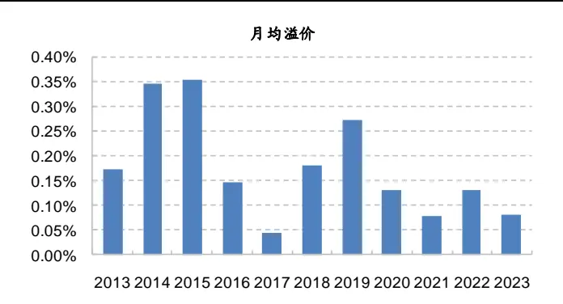
资料来源：Wind，朝阳永续，海通证券研究所

图10 CDTR 因子不同月份的平均溢价（2013.01-2023.12）
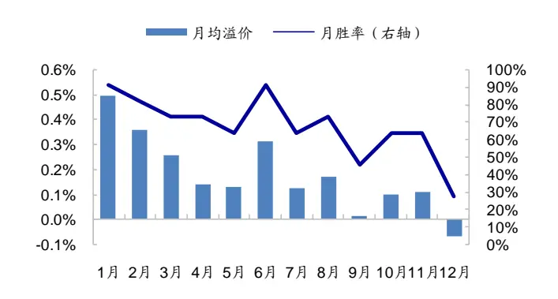
资料来源：Wind，朝阳永续，海通证券研究所

我们进一步考察 CDTR 因子 12 月的反常表现是否在历史上保持稳定，一并分析的还有新增且有基本面支撑的买入评级因子，该因子的构建方法参见《选股因子系列研究（八十九）——买入评级因子的改进及其在大盘股优选策略中的应用》。

由下表可见，无论是 2013-2016 年、还是 2017-2020 年，抑或是 2021 年以来，12月的分析师买入评级及 CDTR因子表现均明显弱于其余月份。我们猜测，这可能与年底动量效应较弱，而 CDTR因子时间序列上呈一定动量、增长特征有关。

表 5 不同时段 CDTR 因子 12 月的溢价表现（2013.01-2023.12）

|  |  | CDTR 因子 |  | 新增且有基本面支撑的买入评级 |  |
| --- | --- | --- | --- | --- | --- |
| 2013-2023年 |  | 月均溢价 | 次胜率 | 月均溢价 | 次胜率 |
|  | 1-11月 | 0.20% | 71.1% | 0.67% | 71.1% |
| 2013-2016年 | 12月 | -0.07% | 27.3% | -0.09% | 27.3% |
|  | 1-11月 | 0.28% | 72.7% | 0.77% | 63.6% |
| 2017-2020年 | 12月 | 0.00% | 50.0% | 0.17% | 50.0% |
|  | 1-11月 | 0.18% | 68.2% | 0.63% | 72.7% |
| 2021年以来 | 12月 | -0.04% | 25.0% | -0.26% | 25.0% |
|  | 1-11月 | 0.12% | 72.7% | 0.59% | 78.8% |
|  | 12月 | -0.21% | 0.0% | -0.21% | 0.0% |

资料来源：Wind，朝阳永续，海通证券研究所

## 2.2 CDTR因子在不同股票池内的选股效果

我们认为，CDTR 因子在市值覆盖度和数量覆盖度上的高低反差，源于分析师覆盖股票时天然的偏倚。即，分析师倾向于关注大市值及前期涨幅较高的股票。为了更好地分析 CDTR因子，我们分别考察了在基金重仓股与非基金重仓股、不同市值股票池、及不同前期涨跌幅股票池内， 因子的选股效果。

如下表所示， 因子在基金（偏股混合型基金与主动股票型基金）重仓股中的覆盖度显著高于非基金重仓股。前者的数量和市值覆盖度分别为 和 ，而非基金重仓股中，数量覆盖度仅 。选股效果上，无因子覆盖股票的等权组合与样本空间等权组合收益无显著差异。而在有因子覆盖的股票池中，无论是基金重仓股还是非基金重仓股样本空间，CDTR 因子值越高，股票未来一个月的收益表现越优。相对而言，非基金重仓股中，因子多空收益更为明显；但基金重仓股中，因子多空收益稳定性更高。

表 6 基金重仓股与非基金重仓股中 CDTR因子的分组收益（2013.01-2023.12）

|  | 基金重仓股 |  |  | 非基金重仓股 |  |  |
| --- | --- | --- | --- | --- | --- | --- |
|  | 年收益 | 月胜率 | p值 | 年收益 | 月胜率 | p值 |
| 样本空间-全A等权 | -0.4% | 47.7% | 0.839 | 0.4% | 52.3% | 0.622 |
| 无覆盖 | 0.0% | 50.8% | 0.992 | -0.3% | 46.2% | 0.501 |
| D1 | -2.8% | 37.1% | 0.020 | -5.2% | 36.4% | 0.000 |
| D2 | 0.6% | 56.8% | 0.570 | -0.1% | 44.7% | 0.913 |
| D3 | -0.8% | 51.5% | 0.430 | 0.9% | 54.5% | 0.423 |
| D4 | 0.8% | 54.5% | 0.385 | 1.7% | 50.8% | 0.098 |
| D5 | 2.3% | 54.5% | 0.079 | 2.7% | 56.8% | 0.075 |
| D5-D1 | 5.1% | 65.9% | 0.001 | 8.0% | 63.6% | 0.000 |
| 数量覆盖度 | 74.6% |  |  | 22.7% |  |  |
| 市值覆盖度 | 90.6% |  |  | 37.5% |  |  |

资料来源： ，朝阳永续，海通证券研究所
注：（1）“无覆盖”是指没有因子值的股票等权组合，相对于样本空间（基金重仓股或非基金重仓股）等权组合的超额收益；（ ） 组的年收益是指， 分组组合相对样本空间有因子值覆盖股票的等权组合的超额收益

若根据总市值从小到大排序将全市场股票等分为5组，D1组为市值最小的1/5股票，D5 组为市值最大的 1/5 股票。如图 11 所示，在市值最大的 D5 组，CDTR 因子的数量覆盖度和市值覆盖度分别为 76.1%和 88.2%，即绝大部分股票都有相应的因子值。而在市值最小的 D1组，因子数量覆盖度仅 10.3%，市值覆盖度 11.0%。

选股效果上，每个市值组别内没有 CDTR因子覆盖的股票均显著跑输样本等权组合（相同市值分组等权组合）。且市值越大，没有因子覆盖的股票跑输基准的幅度也越大。由此可见，如果一个股票的市值较大，但却没有分析师目标价覆盖，那么其未来一个月将会显著走弱。

图11 CDTR因子在不同市值股票池内的月均覆盖度（2013.01-2023.12）
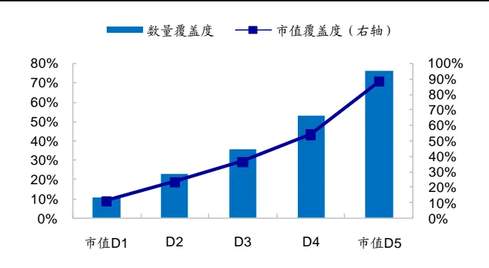
资料来源：Wind，朝阳永续，海通证券研究所

图12 不同市值股票池内，无覆盖股票等权组合的年化超额收益(2013.01- 2023.12)
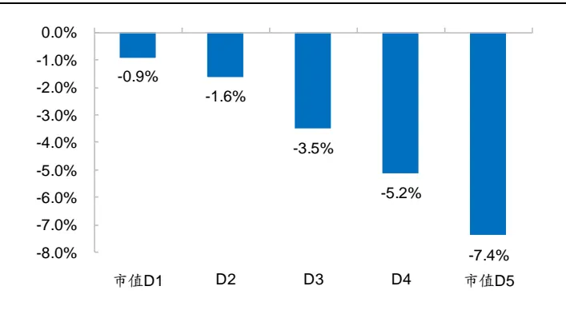
资料来源：Wind，朝阳永续，海通证券研究所

而在有因子覆盖的股票池内（表 7），因子分 5 组的多空收益均显著大于 0。特别是在市值最大的 D4、D5 组中，因子分组多空收益稳定性更高，月胜率超过 60%；但市值最大的 D5 组中，多空收益相对较低。需要注意的是，在市值最小的 D1 组别中，有因子覆盖的股票数量本来就很少，再按 因子分 组，每组中的股票更少，这导致因子分组收益虽高，但波动较大，故信息比在所有组别中最低。

表 7 不同市值股票池内，有 CDTR因子覆盖股票的分 5组多空收益（2013.01- 2023.12）

|  | 年收益 | 月胜率 | 信息比 | t值 | p值 | 数量覆盖度 |
| --- | --- | --- | --- | --- | --- | --- |
| 市值 D1 | 11.0% | 57.6% | 0.61 | 2.04 | 0.044 | 10.3% |
| D2 | 10.5% | 56.1% | 0.85 | 2.82 | 0.006 | 22.8% |
| D3 | 7.1% | 53.8% | 0.71 | 2.35 | 0.020 | 35.6% |
| D4 | 9.5% | 65.2% | 1.22 | 4.06 | 0.000 | 52.7% |
| 市值 D5 | 4.2% | 62.9% | 0.64 | 2.14 | 0.035 | 76.1% |

资料来源：Wind，朝阳永续，海通证券研究所

若根据过去一年的月均收益从小到大排序将全市场股票等分为 5 组，D1 组为月均收益最低的 1/5 股票，D5组为月均收益最高的 1/5 股票。如图 13 所示，历史涨幅越高，CDTR 因子的覆盖度也越高。涨幅最大的 20%股票中，一半股票有 CDTR 因子覆盖，市值覆盖度达到 77.2%；而涨幅最小的 20%股票中，仅 1/3 的股票有 CDTR 因子覆盖。但这部分有覆盖的股票市值也较大，因此市值覆盖度高于数量覆盖度，为 62.7%。

计算不同涨幅组别中，没有分析师覆盖的股票等权组合相对全 A等权组合及该组别股票等权组合的年化超额收益，结果如图 14 所示。对 D1-D4 组的股票而言，没有 CDTR因子覆盖的股票等权组合收益与该组别股票等权组合收益接近，两者的年化收益差距均不超过 1.5%。而对涨幅最大的 1/5 股票，若没有 CDTR 因子覆盖，则未来一个月跑输市场的可能性和幅度都比较大，年化收益落后于全 A 等权组合和 D5 组股票等权组合的幅度均接近 6%，且统计显著。由此可见，如果一个股票的历史涨幅较高，但却没有分析师目标价覆盖，那么其未来一个月将会显著走弱。

图13 在不同历史涨幅组别内，CDTR 因子的平均覆盖度（2013.01- 2023.12）
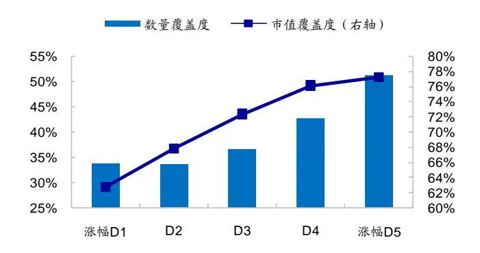
资料来源：Wind，朝阳永续，海通证券研究所

图14 不同历史涨幅组别内，无覆盖股票等权组合的年化超额收益（2013.01- 2023.12）
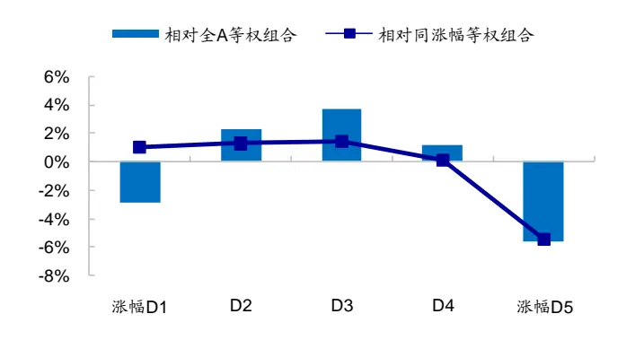
资料来源：Wind，朝阳永续，海通证券研究所

对于有覆盖的股票，在不同涨幅组别中， 因子越大，股票未来一个月的收益越高，单调性明显（图 ）。相对而言，涨幅越大的股票池内， 因子的选股效果越优，多头及多空收益都更为显著（图 ）。例如，在涨幅最大的 组内， 最高 股票的等权组合相对全 等权组合年化超额 ，相对同涨幅样本有因子覆盖股票的等权组合年化超额 4.9%；年化多空收益 11.0%，统计显著。由此可见，即使股票的前期涨幅比较大，当前有着较高相对目标收益（CDTR 因子较大）的股票，动量效应仍有望继续保持。

图15 不同历史涨幅组别内，有覆盖股票的 CDTR 分组收益（2013.01- 2023.12）
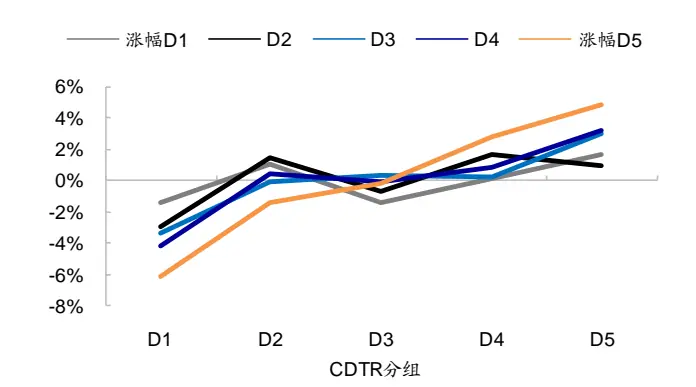
资料来源：Wind，朝阳永续，海通证券研究所

图16 不同历史涨幅组别内，CDTR因子的多头收益和多空收益（2013.01- 2023.12）
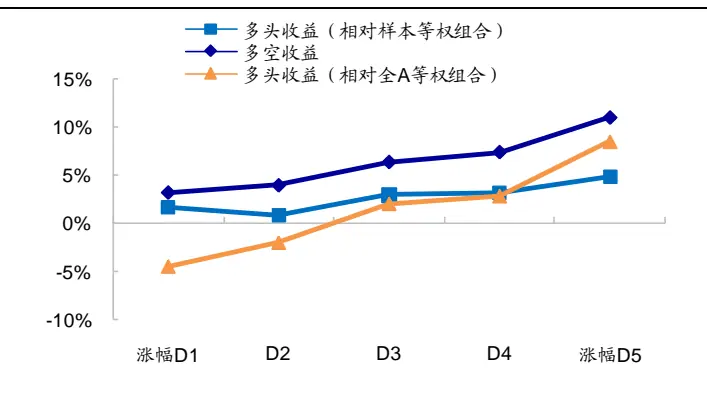
资料来源：Wind，朝阳永续，海通证券研究所

## 2.3 CDTR因子的参数敏感性分析

CDTR 因子的构建涉及两个超参数——回看期和更新频率，它们对因子的选股效果有何影响呢？首先，我们考察不同回看期下因子的溢价表现。如表 8 所示，回看期越长，因子的覆盖度越高。当回看期为 1个月时，CDTR因子的平均股票数量覆盖度为 22.3%，市值覆盖度为 52.0%。即，只覆盖了占市场一半市值的个股。当回看期为 12个月时，因子的数量覆盖度和市值覆盖度分别增加至 56.1%和 86.3%。但当回看期在 6 个月及以上时，因子覆盖度的差异显著减小。

选股效果上，当回看期为 3-6 个月时，CDTR因子的稳定性较高，月胜率超过 65%，t 值高于 4，显著性较强。当回看期超过 6个月，随着回看期的拉长，选股效果逐渐衰退。当回看期为 12个月时，月均因子溢价低于 0.10%，月胜率仅 59.1%。综合考虑覆盖度和因子选股效果，我们建议将因子计算的回看期设为 3-6 个月。

表 8 回看期的敏感性测试（2013.01-2023.12）

| 回看期 | 数量覆盖度 | 市值覆盖度 | 月均溢价 | 波动率 | 信息比 | t值 | p值 | 月胜率 |
| --- | --- | --- | --- | --- | --- | --- | --- | --- |
| 1个月 | 22.3% | 52.0% | 0.17% | 1.9% | 1.09 | 3.62 | 0.000 | 62.9% |
| 3个月 | 38.7% | 75.0% | 0.18% | 1.4% | 1.54 | 5.09 | 0.000 | 67.4% |
| 6个月 | 48.0% | 82.3% | 0.14% | 1.3% | 1.31 | 4.36 | 0.000 | 65.9% |
| 9个月 | 52.6% | 84.7% | 0.12% | 1.3% | 1.08 | 3.59 | 0.000 | 66.7% |
| 12个月 | 56.1% | 86.3% | 0.09% | 1.4% | 0.81 | 2.70 | 0.008 | 59.1% |

资料来源：Wind，朝阳永续，海通证券研究所

其次，我们加快更新频率，由月度调整为双周频和周频，回看期仍为 3 个月（12 周），并考察 CDTR 因子在未来一期（和更新频率对应）的收益表现，结果如表 9-10 所示。从单因子分 10组的多空收益（表 9）来看，更新频率越快，因子多头、空头及多空年化收益越高。尤其是多头收益，提升幅度较为显著。

表 9 周频更新 CDTR 因子分 10 组多空收益（2013.01-2023.12）

|  | 月频 |  |  |  | 双周 |  |  |  | 周频 |  |  |  |
| --- | --- | --- | --- | --- | --- | --- | --- | --- | --- | --- | --- | --- |
|  | 年收益 | 月胜率 | t值 | p值 | 年收益 | 双周胜率 | t值 | p值 | 年收益 周胜率 | t值 |  | p值 |
| 因子未覆盖个股 | -0.1% | 51.9% | -0.05 | 0.961 | 0.1% | 54.2% | 0.13 | 0.894 | 0.0% | 55.3% | 0.00 | 0.998 |
| 空头收益 | -4.8% | 36.6% | -3.28 | 0.001 | -5.5% | 38.3% | -3.33 | 0.001 | -6.9% | 43.2% | -4.48 | 0.000 |
| 多头收益 | 3.2% | 56.5% | 1.83 | 0.070 | 5.3% | 60.2% | 3.30 | 0.001 | 7.3% | 58.3% | 4.33 | 0.000 |
| 多空收益 | 8.0% | 67.2% | 4.31 | 0.000 | 10.8% | 65.5% | 5.69 | 0.000 | 14.3% | 62.5% | 7.28 | 0.000 |

资料来源：Wind，朝阳永续，海通证券研究所

进一步采用 Fama-Macbeth 回归考察剔除其他常见选股因子影响后，CDTR 的截面溢价（表 10）。从中可见，周频更新时，因子的溢价和信息比都更高。因此，我们认为，更快、更及时地更新分析师的目标价观点，具有较为明显的边际正贡献。

表 10 周频更新 CDTR 因子的溢价表现（2013.01-2023.12）

|  | 月度 |  |  | 双周 |  |  | 周频 |  |  |
| --- | --- | --- | --- | --- | --- | --- | --- | --- | --- |
|  | 月均溢价 | 信息比 | 月胜率 | 月均溢价 | 信息比 | 双周胜率 | 月均溢价 | 信息比 | 周胜率 |
| CDTR | 0.18% | 1.54 | 67.4% | 0.23% | 1.94 | 67.3% | 0.29% | 2.39 | 63.8% |
| 市值 | -0.62% | -1.07 | 35.6% | -0.68% | -1.20 | 38.4% | -0.71% | -1.40 | 38.3% |
| 估值 | -0.13% | -0.58 | 45.5% | -0.12% | -0.53 | 47.1% | -0.13% | -0.60 | 48.4% |
| 累计收益率 | -0.27% | -1.17 | 38.6% | -0.49% | -1.59 | 36.5% | -0.57% | -1.94 | 37.7% |
| 波动率 | -0.24% | -0.98 | 35.6% | -0.31% | -1.39 | 38.0% | -0.38% | -1.69 | 38.5% |
| 换手率 | -0.58% | -1.76 | 25.0% | -0.73% | -2.24 | 32.3% | -0.83% | -2.41 | 35.4% |
| ROE | 0.15% | 0.79 | 56.1% | 0.11% | 0.56 | 53.2% | 0.14% | 0.75 | 54.5% |
| SUE | 0.28% | 2.80 | 81.8% | 0.26% | 2.42 | 69.2% | 0.28% | 2.98 | 64.4% |
| 预期净利润调整 | 0.19% | 2.01 | 74.2% | 0.16% | 1.76 | 63.1% | 0.18% | 2.07 | 64.0% |
| 分析师覆盖度 | 0.39% | 1.50 | 63.6% | 0.38% | 1.47 | 62.4% | 0.39% | 1.53 | 59.8% |

资料来源：Wind，朝阳永续，海通证券研究所

## 2.4 小结

综上所述，分析师的一致相对目标收益与股票未来一个月收益显著正相关，CDTR因子越大，股票未来一个月的收益表现越优。2013 年以来，因子多头组合年化超额 3.3%，空头组合年化超额-4.9%，多空年化收益 8.2%，均统计显著，月胜率 65.9%。剔除常见选股因子影响后，CDTR因子的 Fama-Macbeth 截面溢价仍显著为正。

时间序列上， 因子分 组的多空收益在动量、增长上的暴露较为显著。即，动量、增长风格占优时，因子的选股效果更为突出。但即使剔除主要风格的影响，因子也具有显著为正的超额收益，年化 alpha（*12）为 7.0%。

截面上，CDTR 因子在市值大、前期涨幅高的股票池内的覆盖度更高，且没有因子覆盖的股票组合未来一个月表现显著偏弱。对于有因子覆盖的股票，在历史涨幅越大的组别内，因子的选股效果越优。具体表现为，多头和多空收益更显著，分组单调性更强。

参数敏感性上，构建因子的回看期越长，因子覆盖率越高，但溢价会出现明显削弱。回看期为 3-6 个月时，CDTR 因子稳定性高，月胜率超过 65%，t 值大于 4。因子在周度、双周和月度的更新频率下都具有显著的选股效果，但更新频率越快，溢价表现越优。

## 3. 红利优选组合

由上文可知，CDTR 因子在大市值股票中的覆盖度相对更高，因此，本节尝试在偏大盘风格的红利优选策略中应用该因子。

## 3.1 引入 CDTR因子改进红利优选组合

对标中证红利指数，我们按照如下方式构建红利优选组合。首先，确定选股池为，

- 沪深 A股中，剔除 ST 股、上市不足 3 个月的股票以及停牌股。

- 流动性筛选：剔除过去 1 年日均总市值和成交额排名后 20%的股票。

- 分红稳定：过去 3 年连续现金分红，最新一年红利支付率在 0到 1之间。

随后，在上述选股池中，构建多因子模型。具体包括 7个因子：ROE、SUE、盈利质量、CDTR、PB_INT、低估值因子（股息率与 PB等权复合）及低换手率，采用等权方式加总复合。在调仓日（每年 4、8、10、12 月底），选择复合得分最高的 50 只股票构建股息率加权组合，即为红利优选组合。

2013.01-2023.12，组合次均单边换手 67.4%，即，年化单边换手率 2.7 倍。若按次月第一天开盘价成交，扣除单边千 2 的成本后，组合年化收益 28.1%，相对中证红利全收益指数年化超额 17.5%；每年均可获得正超额，年胜率 100%，月胜率 68.2%。和没有 CDTR因子的组合相比，加入 CDTR 因子后，年化收益提升 1.7%，年胜率为 8/11。由此可见，加入 CDTR 因子可较为稳定地增强红利优选组合的业绩表现。

图17 红利优选组合的累计净值走势（2013.01- 2023.12）
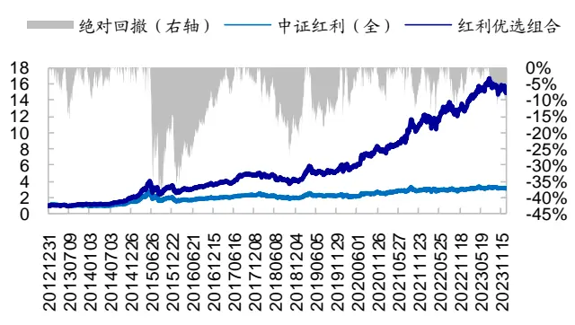
资料来源：Wind，朝阳永续，海通证券研究所

图18 红利优选组合的相对净值走势（2013.01- 2023.12）
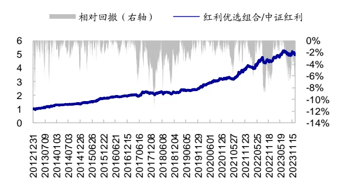
资料来源：Wind，朝阳永续，海通证券研究所

我们还测试了以次月第一天收盘价成交的业绩表现，如下表所示，组合年化收益28.3%，和开盘价成交的结果相比，几乎没有发生改变。我们认为，全区间而言，组合对成交价的敏感度相对较低。此外，红利税对组合收益影响较小。由于组合为季度换仓，持有时间大于 1个月，故我们统一假设红利税为 10%，扣减后，年化收益仅下降 0.21%。

表 11 红利优选组合历史业绩表现（2013.01-2023.12）

|  | 以次月第一天开盘价作为成交价 |  |  |  |  |  |  | 以次月第一天收盘价作为成交价 |  |
| --- | --- | --- | --- | --- | --- | --- | --- | --- | --- |
|  | 无 CDTR | 组合收益 | 中证红利(全) | 超额收益 | 波动率 | 相对回撤 | 月胜率 | 组合收益 超额收益 | 月胜率 |
| 2013 | 25.7% | 21.3% | -6.7% | 28.1% | 14.6% | 9.4% | 75.0% | 23.2% 30.0% | 83.3% |
| 2014 | 58.8% | 62.3% | 57.6% | 4.7% | 6.0% | 5.2% | 66.7% | 62.5% 4.9% | 66.7% |
| 2015 | 69.3% | 74.7% | 29.9% | 44.9% | 11.1% | 5.4% | 83.3% | 88.1% 58.2% | 91.7% |
| 2016 | 3.5% | 4.6% | -4.3% | 8.9% | 5.8% | 2.9% | 66.7% | 5.8% 10.1% | 66.7% |
| 2017 | 31.0% | 33.2% | 21.3% | 11.8% | 11.5% | 7.7% | 66.7% | 33.0% 11.6% | 58.3% |
| 2018 | -15.0% | -16.1% | -16.2% | 0.1% | 10.3% | 8.4% | 50.0% | -17.1% -0.9% | 41.7% |
| 2019 | 39.7% | 43.0% | 20.9% | 22.1% | 8.4% | 3.7% | 66.7% | 41.5% 20.6% | 66.7% |
| 2020 | 32.8% | 36.3% | 8.2% | 28.1% | 9.3% | 3.2% | 83.3% | 35.9% 27.7% | 91.7% |
| 2021 | 45.4% | 52.5% | 18.2% | 34.3% | 11.0% | 5.7% | 83.3% | 50.9% 32.7% | 83.3% |
| 2022 | 8.3% | 6.6% | -0.4% | 7.0% | 10.7% | 9.1% | 50.0% | 4.4% 4.8% | 50.0% |
| 2023 | 16.0% | 20.0% | 6.3% | 13.6% | 10.1% | 7.0% | 58.3% | 16.5% 10.1% | 58.3% |
| 全区间 | 26.4% | 28.1% | 10.6% | 17.5% | 10.2% | 12.0% | 68.2% | 28.3% 17.6% | 68.9% |
| 股息率（2023.10） | 3.59% | 3.47% | 5.95% |  |  |  |  |  |  |

资料来源：Wind，朝阳永续，海通证券研究所

我们将红利优选组合的月收益率对市场（中证红利全收益指数）、小市值、低估值、低涨幅、低波动、高盈利、高增长共 个因子的月收益率回归，结果如表 所示。组合相对中证红利全收益指数的 接近于 ，即，红利优选组合大体捕获了红利指数的beta 收益。此外，相对于指数，组合在小市值和高盈利因子上的暴露显著为正，呈较为鲜明的小盘和高盈利风格；在估值、动量、增长上，则无显著稳定的暴露。

表 12 红利优选组合的收益分解（2013.01-2023.12）

|  | 回归结果 |  |  | 月均 |  | 年化（月均*12） 因子贡献 |
| --- | --- | --- | --- | --- | --- | --- |
|  | 系数 | t值 | p值 | 因子收益 因子贡献 | 因子收益 |  |
| 截距项 | 0.82% | 2.88 | 0.005 |  |  |  |
| 中证红利（全） | 0.98 | 25.61 | 0.000 | 1.02% | 1.00% 12.3% | 12.0% |
| 小市值 | 0.19 | 4.13 | 0.000 | 1.44% | 0.27% 17.3% | 3.2% |
| 低估值 | 0.07 | 0.71 | 0.482 | 0.38% | 0.03% 4.5% | 0.3% |
| 低涨幅 | 0.14 | 1.00 | 0.317 | 0.81% | 0.11% 9.8% | 1.3% |
| 低波动 | -0.19 | -1.73 | 0.086 | 1.00% | -0.19% 12.0% | -2.3% |
| 高盈利 | 0.49 | 2.89 | 0.004 | 0.81% | 0.40% 9.7% | 4.8% |
| 高增长 | -0.17 | -0.91 | 0.365 | 0.81% | -0.13% 9.7% | -1.6% |
| alpha |  |  |  |  | 0.82% | 9.8% |
| 组合 |  |  |  |  | 2.29% | 27.5% |

资料来源：Wind，朝阳永续，海通证券研究所

按月均收益 计算， 期间，组合年化收益 ；同期，中证红利（全）指数年收益 。由于组合相对指数的回归 接近于 （ ），可以认为，市场贡献了 的收益；剔除市场贡献后，组合年化超额为 。除市场外，小市值和高盈利风格也为组合贡献了显著的正超额，分别达到 和 。与此同时，组合在高波动因子上具有一定的正向暴露。而 年以来，市场整体呈低波风格，该因子为组合贡献了年化 2.3%的负收益。剔除市场及主要风格因子的贡献后，组合的年化alpha 为 9.8%（月均 0.82%），统计显著。

分月度来看，红利优选组合在绝大部分月份上相对中证红利全收益指数均存在明显正超额（图 ）。相对而言， 月和 月的超额收益稳定性较差，次胜率仅为 ，而其余月份的次胜率均超过 。此外， 月的超额收益相对较低。更为值得一提的是，高分红主要发生在 月份，中证红利全收益指数显著优于价格指数，想要战胜全收益指数的难度陡然加大。但即使在这些月份上，我们的红利优选组合依然具有明显的超额收益，且月均值不低于 1.4%。

图19 不同月份红利优选组合的月均超额收益（2013.01-2023.12）
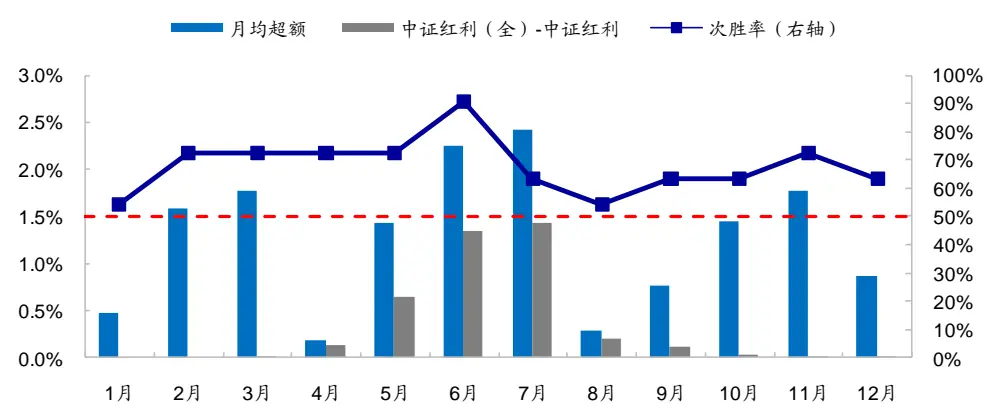
资料来源：Wind，朝阳永续，海通证券研究所

由于组合一年仅换仓 次，且间隔周期至少有 个月（ 、 、 、 月底），因此持有期间的体验也相当重要，为此，我们计算每一期组合中，跑赢中证红利指数全收益指数的个股占比，以及跑赢指数的股票平均超额与跑输的股票平均超额之比（盈亏比），结果如下图所示。组合内个股胜率的均值为 52.3%，即一半以上的股票可跑赢中证红利指数。盈亏比均值达到 ，且绝大部分持仓期（占比 ）上，盈亏比都超过 。这些数据表明，本文策略选出的股票，不仅上涨概率高于下跌概率，上行空间更是显著大于下行空间。

图20 红利优选组合每期的盈亏比与个股胜率（2013.01-2023.12）
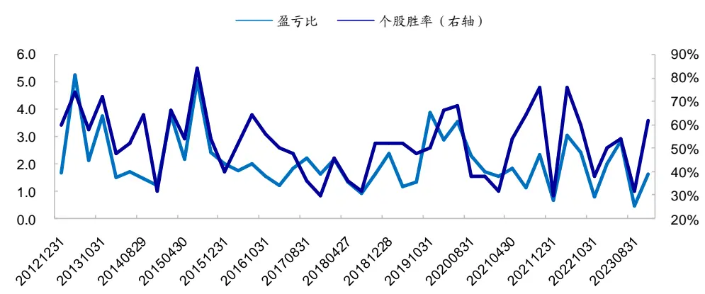
资料来源：Wind，朝阳永续，海通证券研究所

## 3.2 行业偏离约束下的红利优选组合

上述红利优选组合的选股池虽然限定在 3年连续现金分红的样本中，选股过程中也用到了股息率因子，但由于用到了较多其他因子，因此最终组合的行业分布与中证红利指数有一定差异。

以 2023.10 的红利优选组合为例，如下图所示，组合相对指数显著低配金融和周期板块，超配制造和 TMT 板块。特别地，在中证红利指数前两大行业——银行和煤炭上，组合未选到任何股票。较大的行业偏离，使得组合相对中证红利全收益指数的跟踪误差也显著放大，达到年化 10%（表 11）。

图21 红利优选组合相对中证红利指数的行业分布（2023.10）
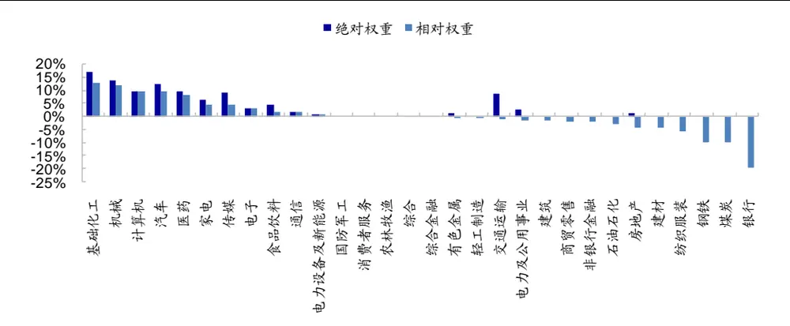
资料来源：Wind，朝阳永续，海通证券研究所

为了改进这一问题，我们尝试构造有行业约束的红利优选组合，具体方式如下。

- 按照 3.1 节的步骤选择复合因子得分最高的 50 只股票作为初始组合。

- 计算给定行业约束下，每一个（中信一级）行业允许的最小权重和最大权重，以及初始组合的行业权重分布。

定位最小权重大于 且初始组合未选到股票的行业，根据多因子模型选择这些行业内复合得分最高的股票进行补充，并称其为补充组合。

- 最终组合即为初始组合+补充组合；重新分配每只持股的权重，使得最终组合满足股息率加权和行业权重约束。

在相同的调仓频率下，我们分别构造了行业权重 2%、3%、5%偏离约束下的红利优选组合。2013 年以来，这 3 种约束下，组合平均每期持有的个股数分别为 58.0、56.4和 54.6 只，次均单边换手率均为 67%左右。表 13 展示了这 3个组合相对于中证红利全收益指数的超额收益表现。

表 13 行业约束下的红利优选组合超额收益表现（2013.01-2023.12）

|  | 行业约束 2% |  |  |  | 行业约束3% |  |  |  | 行业约束5% |  |  |  |
| --- | --- | --- | --- | --- | --- | --- | --- | --- | --- | --- | --- | --- |
|  | 超额收 益 | 跟踪误 差 | 相对回 撤 | 月胜率 | 超额收 益 | 跟踪误 差 | 相对回 撤 | 月胜率 | 超额收 益 | 跟踪误 差 | 相对回 撤 | 月胜率 |
| 2013 | 8.7% | 8.0% | 5.4% | 66.7% | 10.7% | 8.3% | 5.4% | 58.3% | 13.5% | 8.8% | 6.0% | 75.0% |
| 2014 | 3.9% | 5.1% | 3.7% | 50.0% | 4.2% | 5.2% | 4.0% | 50.0% | 6.8% | 5.2% | 3.5% | 66.7% |
| 2015 | 24.9% | 8.5% | 6.5% | 83.3% | 29.9% | 9.0% | 6.3% | 83.3% | 35.5% | 9.0% | 5.8% | 75.0% |
| 2016 | 8.6% | 4.1% | 2.4% | 83.3% | 8.8% | 4.2% | 2.4% | 83.3% | 8.7% | 4.1% | 2.3% | 91.7% |
| 2017 | 3.5% | 6.8% | 5.3% | 50.0% | 5.1% | 7.3% | 5.9% | 50.0% | 8.1% | 8.6% | 6.2% | 58.3% |
| 2018 | 5.8% | 6.4% | 3.6% | 58.3% | 4.1% | 7.0% | 4.7% | 41.7% | 1.5% | 7.6% | 5.8% | 41.7% |
| 2019 | 19.0% | 7.8% | 4.2% | 66.7% | 22.1% | 7.9% | 4.0% | 83.3% | 21.9% | 7.8% | 3.7% | 83.3% |
| 2020 | 6.5% | 7.2% | 5.7% | 66.7% | 10.2% | 7.3% | 4.1% | 58.3% | 17.6% | 7.9% | 3.3% | 75.0% |
| 2021 | 23.3% | 7.6% | 4.3% | 58.3% | 24.9% | 7.5% | 3.6% | 75.0% | 28.1% | 8.3% | 4.3% | 75.0% |
| 2022 | 6.9% | 7.3% | 4.1% | 58.3% | 8.2% | 7.8% | 5.2% | 58.3% | 8.4% | 8.6% | 7.1% | 41.7% |
| 2023 | 5.9% | 6.1% | 4.3% | 58.3% | 7.9% | 6.7% | 4.7% | 58.3% | 9.6% | 7.6% | 5.3% | 58.3% |
| 全区间 | 10.3% | 6.9% | 6.5% | 63.6% | 11.8% | 7.2% | 7.1% | 63.6% | 13.7% | 7.7% | 8.6% | 67.4% |

资料来源：Wind，朝阳永续，海通证券研究所

行业约束越严格，组合的跟踪误差、相对回撤越小。例如，在 2%的行业约束下，组合年化跟踪误差和 2013 年以来的最大相对回撤仅分别为 6.9%和 6.5%；但相应地，超额收益也有所削弱，由无约束下的年化超额 17.5%下降至 10.3%。但仍然超过 10%，且每一年均可取得正超额。

行业约束越宽松，组合的超额收益越高。例如，在 的行业约束下，组合的年化超额收益为 13.7%，高于其余两种情形，月胜率 67.4%。分年度来看，除 2018 年超额收益仅为 1.5%外，其余年份的超额收益均超过 6%。相应地，较大的行业偏离也使组合的风险指标比约束为 2%的情形要高。2013 年以来，年化跟踪误差和最大相对回撤分别为 7.7%和 8.6%。

## 3.3 小结

CDTR 因子可较为稳定地提升红利优选组合的业绩表现。2013.01-20223.12 期间，组合年化收益 28.1%，相对中证红利全收益指数年化超额 17.5%，月胜率 68.2%，年胜率 。时间序列上，组合相对中证红利全收益指数的 接近于 ，即，红利优选组合大体捕获了中证红利指数的 收益。剔除市场及主要风格因子贡献后，组合年化alpha 为 9.8%（月均 0.82%），统计显著。月历效应上，1月和 8 月的超额收益稳定性相对较差，次胜率仅 54.5%，其余月份的次胜率均超过 60%。

由于加入了较多股息率之外的其他选股因子，若不控制行业，红利优选组合的行业分布可能与红利指数相差较大。甚至有可能出现在中证红利指数的前两大行业——银行和煤炭上，没有选出一只股票的情况。这使得红利优选组合的跟踪误差较大，达到年化10%。

若要降低跟踪误差，可构建有行业约束的红利优选组合。约束越严格，组合的跟踪误差、相对回撤越小。例如，在 的行业约束下，组合年化跟踪误差和 年以来的最大相对回撤仅分别为 6.9%和 6.5%；但相应地，超额收益也有所削弱，由无约束下的年化超额 17.5%下降至 10.3%。但仍然超过 10%，且每一年均可取得正超额。

## 4. 全文总结

朝阳永续会根据不同分析师的目标价汇总一致预期目标价，基于该指标可构建一致预期目标收益因子。即，一致预期目标价 个股当前股价 。该因子从个股角度综合分析师的观点。但是，一方面，不同分析师的目标收益中枢可能不一；另一方面，目标价给出的时间点也不一样，统一用最新收盘价作为对比基准来反映分析师的看好程度，显得较为粗糙。因此，剥离常见风格、低频量价、基本面、以及分析师相关（一致预期净利润调整、分析师覆盖度）因子的影响，该因子的选股效果不再显著。

本文从分析师角度出发，汇总其对自己所覆盖公司的相对目标收益排名。即，考察分析师 k 对股票 j给出的目标收益，相对于分析师 k 对其所覆盖的所有股票给出的平均目标收益的超额收益，称为相对目标收益；然后再汇总所有分析师对股票 j的相对目标收益，以此构建“一致相对目标收益”（CDTR）因子。

一致相对目标收益（ ）因子在一定程度上消除了分析师之间目标收益中枢不同的影响。因为有的分析师天然比较乐观，对覆盖的股票都倾向于给出较高的目标价；而有的分析师则较为谨慎，对覆盖股票给出的目标价都比较低。更进一步，比起原先的目标收益空间，该因子实际上更为关注分析师对自己所覆盖股票的排序。

2013 年以来，CDTR因子的平均股票数量覆盖度为 38.7%，市值覆盖度为 75.0%。CDTR 因子与股票未来一个月收益显著正相关。分 10 组后，多头组合年化超额 3.3%，空头组合年化超额-4.9%，年化多空收益为 8.2%，均统计显著，月胜率 65.9%。多空收益在动量和增长上的暴露较为显著。即，动量或增长风格较强时，因子的选股效果相对较优。剔除常见选股因子的影响后，CDTR因子在 Fama-Macbeth 回归下的截面溢价仍显著为正；在时间序列回归下的年化 alpha（系数*12）为 7.0%，统计显著。

我们分别考察了在基金重仓股与非基金重仓股、不同市值股票池、及不同前期涨跌幅股票池内，因子的选股效果。

（1） 无论是基金重仓股还是非基金重仓股样本空间，CDTR 因子值越高，股票未来一个月的收益表现越优。相对而言，非基金重仓股中，因子多空收益更为明显；但基金重仓股中，因子多空收益稳定性更高。

（2） 在市值较大的股票中，CDTR 因子分组多空收益稳定性更高，月胜率超过60%；但市值最大的组别中，多空收益相对较低。

（3） 在不同涨幅组别中，CDTR 因子越大，股票未来一个月的收益越高，单调性明显。相对而言，涨幅越大的股票池内，CDTR 因子的选股效果越优，多头及多空收益都更为显著。

参数敏感性上，构建因子的回看期越长，因子覆盖率越高，但溢价会出现明显削弱。回看期为 3-6 个月时，CDTR 因子稳定性高，月胜率超过 65%，t 值大于 4。因子在周度、双周和月度的更新频率下都具有显著的选股效果，但更新频率越快，溢价表现越优。

CDTR 因子可较为稳定地提升红利优选组合的业绩表现。2013.01-20223.12 期间，组合年化收益 28.1%，相对中证红利全收益指数年化超额 17.5%，月胜率 68.2%，年胜率 100%。时间序列上，组合相对中证红利全收益指数的 beta 接近于 1，即，红利优选组合大体捕获了中证红利指数的 收益。剔除市场及主要风格因子贡献后，组合年化alpha 为 9.8%（月均 0.82%），统计显著。月历效应上，1 月和 8 月的超额收益稳定性相对较差，次胜率仅 54.5%，其余月份的次胜率均超过 60%。

由于加入了较多股息率之外的其他选股因子，若不控制行业，红利优选组合相对中证红利全收益指数的跟踪误差较大，达到年化 10%。若要降低跟踪误差，可构建有行业约束的红利优选组合。约束越严格，组合的跟踪误差、相对回撤越小。例如，在 2%的行业约束下，组合年化跟踪误差和 2013 年以来的最大相对回撤仅分别为 6.9%和 6.5%；但相应地，超额收益也有所削弱，由无约束下的年化超额 17.5%下降至 10.3%。但仍然超过 10%，且每一年均可取得正超额。

## 5. 风险提示

历史统计规律失效风险、因子失效风险。

## 信息披露

分析师声明

[Table冯佳睿yst金融工程研究团队s]

罗蕾金融工程研究团队

本人具有中国证券业协会授予的证券投资咨询执业资格，以勤勉的职业态度，独立、客观地出具本报告。本报告所采用的数据和信息均来自市场公开信息，本人不保证该等信息的准确性或完整性。分析逻辑基于作者的职业理解，清晰准确地反映了作者的研究观点，结论不受任何第三方的授意或影响，特此声明。

## 法律声明

本报告仅供海通证券股份有限公司（以下简称 本公司 ）的客户使用。本公司不会因接收人收到本报告而视其为客户。在任何情况下，本报告中的信息或所表述的意见并不构成对任何人的投资建议。在任何情况下，本公司不对任何人因使用本报告中的任何内容所引致的任何损失负任何责任。

本报告所载的资料、意见及推测仅反映本公司于发布本报告当日的判断，本报告所指的证券或投资标的的价格、价值及投资收入可能会波动。在不同时期，本公司可发出与本报告所载资料、意见及推测不一致的报告。

市场有风险，投资需谨慎。本报告所载的信息、材料及结论只提供特定客户作参考，不构成投资建议，也没有考虑到个别客户特殊的投资目标、财务状况或需要。客户应考虑本报告中的任何意见或建议是否符合其特定状况。在法律许可的情况下，海通证券及其所属关联机构可能会持有报告中提到的公司所发行的证券并进行交易，还可能为这些公司提供投资银行服务或其他服务。

本报告仅向特定客户传送，未经海通证券研究所书面授权，本研究报告的任何部分均不得以任何方式制作任何形式的拷贝、复印件或复制品，或再次分发给任何其他人，或以任何侵犯本公司版权的其他方式使用。所有本报告中使用的商标、服务标记及标记均为本公司的商标、服务标记及标记。如欲引用或转载本文内容，务必联络海通证券研究所并获得许可，并需注明出处为海通证券研究所，且不得对本文进行有悖原意的引用和删改。

根据中国证监会核发的经营证券业务许可，海通证券股份有限公司的经营范围包括证券投资咨询业务。

海通证券股份有限公司研究所[Table_PeopleInfo]
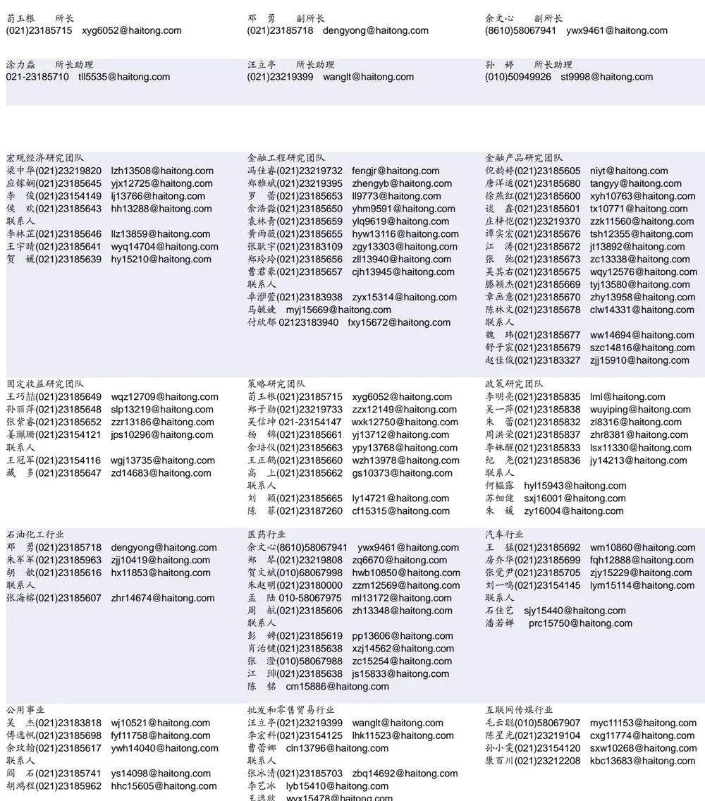

| 有色金属行业 陈先龙 02123219406 cxl15082@haitong.com | 房地产 |  | 电子行业 |  |
| --- | --- | --- | --- | --- |
| 甘嘉尧(021)23185615 gjy11909@haitong.com 联系人 张恒浩(021)23185632 zhh14696@haitong.com | 谢 盐(021)23185696 涂力磊021-23185710 联系人 曾佳敏(021)23185689 陈昭颖(021)23183953 czy15598@haitong.com | xiey@haitong.com tll5535@haitong.com zjm14937@haitong.com | 张晓飞 zxf15282@haitong.com 李轩(021)23154652 华晋书(021)23185608 薛逸民(021)23185630 文 灿(021)23185602 肖隽翀(021)23154139 | lx12671@haitong.com hjs14155@haitong.com xym13863@haitong.com wc13799@haitong.com xjc12802@haitong.com |
|  | 电力设备与新能源行业 |  | 崔冰睿(021)23185690 联系人 郦奕滢 lyy15347@haitong.com 张 幸(021)23183951 zx15429@haitong.com 基础化工行业 刘 威(0755)82764281 Iw10053@haitong.com | cbr14043@haitong.com |
| 联系人 朱 彤(021)23185628 zt14684@haitong.com | 徐柏乔(021)23219171 马天一(021)23185735 联系人 姚望洲(021)23185691 马菁菁(021)23185627 吴志鹏(021)23215736 罗 青(021)23185966 | xbq6583@haitong.com mty15264@haitong.com 胡惠民hhm15487@haitong.com ywz13822@haitong.com mjj14734@haitong.com wzp15273@haitong.com | 孙维容(021)23185389 李 智(021)23185842 李 博(021)23185642 | swr12178@haitong.com lz11785@haitong.com Ib14830@haitong.com |
| 计算机行业 杨林(021)23183969 yl11036@haitong.com 杨 蒙(021)23185700 ym13254@haitong.com 联系人 | 通信行业 余伟民(010)50949926 杨彤昕 010-56760095 于一铭 021-23183960 | ywm11574@haitong.com ytx12741@haitong.com | 非银行金融行业 何 婷(021)23219634 任广博(010)56760090 孙 婷(010)50949926 | ht10515@haitong.com rgb12695@haitong.com st9998@haitong.com |
| 杨昊翊(021)23185620 yhy15080@haitong.com 朱 瑶(021)23187261 zy15988@haitong.com 交通运输行业 虞 楠(021)23219382 yun@haitong.com 陈 宇(021)23185610 cy13115@haitong.com 罗月江(010)58067993 lyj12399@haitong.com | 徐卓 xz14706@haitong.com 纺织服装行业 梁 希(021)23185621 盛 开(021)23154510 sk11787@haitong.com | lx11040@haitong.com | 肖 尧(021)23185695 建筑材料行业 冯晨阳(021)23183846 fcy10886@haitong.com 申 浩(021)23185636 sh12219@haitong.com | xy14794@haitong.com |
| 联系人 吕春雨 Icy15841@haitong.com 杜清丽 18019031023 机械行业 毛冠锦 021-23183821 mgj15551@haitong.com 赵靖博(021)23185625 zjb13572@haitong.com | 钢铁行业 刘彦奇(021)23219391 liuyq@haitong.com |  | 建筑工程行业 张欣劫18515295560 zxj12156@haitong.com |  |
| 赵玥炜(021)23219814 zyw13208@haitong.com 联系人 丁嘉一(021)23187266 djy15819@haitong.com 刘绮雯(021)23185686 Iqw14384@haitong.com 农林牧渔行业 |  |  | 曹有成(021)23185701 郭好格(010)58067828 | cyc13555@haitong.com ghg14711@haitong.com |
| 李 淼(010)58067998 Im10779@haitong.com 巩健(021)23185702 gj15051@haitong.com 冯鹤fh15342@haitong.com | 颜慧菁(021)23183952 张宇轩(021)23154172 | yhj12866@haitong.com zyx11631@haitong.com | 联系人 | 张恒晅(021)23183943 zhx10170@haitong.com |
|  |  |  | 刘砚菲(021)23185612 | lyf13079@haitong.com |
|  | 程碧升(021)23185685 | cbs10969@haitong.com |  |  |
| 联系人 | 联系人 |  | 胡舜杰(021)23155686 | hsj14606@haitong.com |
| 蔡子慕(021)23183965 czm15689@haitong.com |  |  |  |  |
|  |  | 张嘉颖(021)23185613 zjy14705@haitong.com | 李雨泉(021)23185843 | lyq15646@haitong.com |
|  | 苗欣mx15565@haitong.com |  |  |  |
| 银行行业 | 社会服务行业 |  | 家电行业 |  |
| 林加力(021)23154395 |  |  | 陈子仪(021)23219244 chenzy@haitong.com |  |
| ljl12245@haitong.com | 汪立亭(021)23219399 | wanglt@haitong.com |  |  |
|  |  |  |  | ly11194@haitong.com |
| 董栋梁(021)23185697 |  | xyz11630@haitong.com | 李 阳(021)23185618 |  |
| ddl13206@haitong.com | 许樱之(755)82900465 |  |  |  |
|  |  |  | 刘 璐(021)23185631 |  |
|  |  | wyj13985@haitong.com |  | Ii11838@haitong.com |
| 联系人 | 王祎婕(021)23185687 |  |  |  |
|  |  |  | 联系人 |  |
| 徐凝碧(021)23185609 xnb14607@haitong.com |  |  |  |  |
|  |  |  | 吕浦源(021)23183822 Ipy15307@haitong.com |  |
|  | 联系人 | mhy13205@haitong.com |  |  |
|  | 毛弘毅(021)23183110 |  |  |  |
| 造纸轻工行业 |  |  |  |  |
|  | 环保行业 |  |  |  |
| 郭庆龙 gql13820@haitong.com |  |  |  |  |
|  | 戴元灿(021)23185629 dyc10422@haitong.com |  |  |  |
| 高翩然 gpr14257@haitong.com |  |  |  |  |

## 研究所销售团队

伏财勇(0755)23607963 fcy7498@haitong.com

蔡铁清(0755)82775962 ctq5979@haitong.com

刘晶晶(0755)83255933 liujj4900@haitong.com

饶 伟(0755)82775282 rw10588@haitong.com

欧阳梦楚(0755)23617160

oymc11039@haitong.com

巩柏含 gbh11537@haitong.com

张馨尹 0755-25597716 zxy14341@haitong.com

辜丽娟(0755)83253022 gulj@haitong.com

海通证券股份有限公司研究所

电话：（021）23219000

传真：（021）23219392

地址：上海市黄浦区广东路 689号海通证券大厦 9楼

网址：www.htsec.com

胡雪梅(021)23219385 huxm@haitong.com 黄 诚(021)23219397 hc10482@haitong.com 季唯佳(021)23219384 jiwj@haitong.com 黄 毓(021)23219410 huangyu@haitong.com 胡宇欣(021)23154192 hyx10493@haitong.com 马晓男 mxn11376@haitong.com 毛文英(021)23219373 mwy10474@haitong.com 谭德康 tdk13548@haitong.com 邵亚杰 23214650 syj12493@haitong.com 王祎宁(021)23219281 wyn14183@haitong.com 周之斌 zzb14815@haitong.com 杨祎昕(021)23212268 yyx10310@haitong.com 张歆钰 zxy14733@haitong.com

殷怡琦(010)58067988 yyq9989@haitong.com 董晓梅 dxm10457@haitong.com 郭 楠 010-5806 7936 gn12384@haitong.com 张丽萱(010)58067931 zlx11191@haitong.com 郭金垚(010)58067851 gjy12727@haitong.com 高 瑞 gr13547@haitong.com 姚 坦 yt14718@haitong.com 上官灵芝 sglz14039@haitong.com 王 勇 wy15756@haitong.com 董 晋 dj15843@haitong.com 辜丽娟(0755)83253022 gulj@haitong.com