## [Tab相关研究

Table_ReportInfo]《选股因子系列研究（九十四）——卖方分析师的目标价：有用吗？怎么用？》2024.02.06

《选股因子系列研究（九十三）——深度学习因子的“模型动物园”》《选股因子系列研究（九十二）——组合约束对其收益表现的影响分析》2023.12.27

分析师:冯佳睿

Tel:(021)23219732

Email:fengjr@haitong.com

证书:S0850512080006

分析师:余浩淼

Tel:(021)23185650

Email:yhm9591@haitong.com

证书:S0850516050004

# 选股因子系列研究（九十五）——冲击成本的预测和应用

## [Table_Sum投资要点：

并非只有在出现大单时，订单成交才会对市场价格产生影响。从历史数据统计中可以发现， 年以来，随着算法交易被机构投资者广泛应用，日度的成交笔数大幅上升，而平均单笔成交金额则快速下降。因此，我们不能只关注大单，而应研究更多不同类型的订单成交对市场产生的冲击，才能更贴近实际的交易情况。

- 我们将净委买增额、大单净买入金额、净主动买入金额和大单主动净买入金额定义为市场冲击指标， 相对开盘价的涨跌幅为冲击成本。根据两者的正相关性可知，买入 卖出行为会使市场冲击指标变大 小，从而推高 拉低 与开盘价的比值。买入|卖出行为相当于做多|做空，推高|拉低该比值，意味着有一部分做多 做空收益无法被获取，最终都增加了潜在的交易成本。

- 我们利用最简单的 回归，以中性化后的市场冲击指标为自变量，对中性化后的冲击成本进行预测。在开盘后半小时内成交和全天成交两种假设下，预测模型的平均 R2分别为 0.310 和 0.365，且在时间序列上较为稳定。

- 根据线性回归模型预测个股的冲击成本。当我们确定算法交易策略，并可以预计出以该策略下单，会委托多少金额的限价单，以限价单被动成交和以市价单主动成交的金额各占多少比例，以及成交的订单中有多大比例为大单，就可以计算出该算法交易下，4 个市场冲击指标的变化值。将它们代入模型，便可得到冲击成本的预测值。

- 月度换仓时，计算每个股票的成交金额从 10 万递增至 1000 万，共 100 种情况下，考虑预测冲击成本后，因子 IC 的变化。基本面因子、手工高频因子和技术面因子中的反转因子，受到预测冲击成本的影响很小。但技术面因子中的换手、特质波动和非流动性因子则受到了较为剧烈的影响。随着下单金额增大，特质波动因子的 将下降 ，而非流动性和换手因子的 的下降幅度甚至超过了1%。

两个有关预测冲击成本是如何影响因子选股能力的结论。第一，在原始收益率中减去预测冲击成本，并不一定意味着会削弱因子的 IC。部分预测冲击成本较高的股票，其收益被合理地降低，反而使某些因子的选股能力得以提升。第二，周度换仓下，部分因子，如换手的 变化较为极端，表明此时的下单金额已远超模型的可预测范围。可能的原因是当某个股票的市场冲击指标异常时，其预测的冲击成本变得很大，使得原始收益被过度调整，从而导致因子 出现剧烈波动。

- 风险提示。本报告所有分析均基于公开信息，不构成任何投资建议；权益产品收益波动较大，适合具备一定风险承受能力的投资者持有。

## 1. 订单成交与市场冲击分析

在报告《选股因子系列研究（九十一）——组合规模、交易成本和大单冲击对因子表现的影响分析》中，我们讨论了如何利用交易成本预测，更细致地测算组合规模对于因子表现的影响。报告提出，除股价波动，买卖价差，盘口流动性等传统交易成本外，也应重点关注交易过程中随时可能出现的大单带来的潜在冲击成本。

但是，并非只有在出现大单时，订单成交才会对市场价格产生影响。从历史数据统计中可以发现，2018 年以来，随着算法交易被机构投资者广泛应用，日度的成交笔数大幅上升，而平均单笔成交金额则快速下降。因此，我们不能只关注大单，而应当研究更多不同类型的订单成交对市场产生的冲击，才能更加贴近实际的交易情况。

## 1.1不同类型的订单成交与市场冲击指标

市场上虽有各种算法交易策略，但根据最终的交易行为，都可简单归为以下几种。

- 以限价单下单，订单最终被对手方成交。

- 以限价单下单，订单一段时间未被成交后，将订单撤销。

- 以市价单下单，订单直接与对手方订单成交。

无论是何种算法交易策略，在市场中的交易行为均可认为是上述三种的某个组合。而这三种行为，又会对股票订单簿形态和市场的成交情况产生以下影响。

当以限价单买入|卖出时，在订单被成交或撤销前，都会使订单簿的买入|卖出盘口增厚，从而使净委买增额指标增加|降低。

当所下买入|卖出限价单被成交时，市场的成交金额增加；而如果所下的单为大单，则会使大单净买入金额增加|降低。

当以市价单买入|卖出并成交时，买入|卖出方向的主动成交金额增加，从而使净主动买入金额增加|降低；而如果该市价单为大单，会使对应的大单净买入金额和大单主动净买入金额增加|降低。

以上即为所有可能的交易行为对市场产生的影响。其中，除成交金额变动可以认为不会使市场方向发生改变，从而增加冲击成本外，作为构建手工高频因子的基础统计指标——净委买增额、大单净买入金额、净主动买入金额和大单主动净买入金额的变化，都可能会改变股票价格，对市场造成冲击，产生额外的交易冲击成本。

因此，如果我们研究上述统计指标与同时段额外的交易成本之间的相关性，那么在确定股票交易金额与成交方向后，算出这些交易对指标的改变幅度，就可以一定程度上对将要发生的交易会给市场带来怎样的冲击，会增加多少额外的交易成本有所预估。

## 1.2市场冲击指标与冲击成本的相关性

我们将净委买增额、大单净买入金额、净主动买入金额和大单主动净买入金额定义为市场冲击指标，为研究它们与市场冲击成本的相关性，需要再定义市场冲击成本。

在评价因子表现时，往往会以收盘价相对前收盘价或开盘价的涨跌幅作为收益率。而在实际交易过程中，这两个价格都很难实现。因此，一个合理的假设是交易只发生在连续竞价阶段。此时，交易时段内的 VWAP或 TWAP更贴近实际可以交易到的价格。而所谓的冲击成本，本质是我们的交易行为抬高|拉低 VWAP或 TWAP的幅度。那么，我们就可以定义 VWAP或 TWAP相对开盘价的涨跌幅，为连续竞价阶段的交易行为所付出的冲击成本。我们认为，长期来看，VWAP价格与 TWAP 价格没有明显的优劣，故我们简单地将股票的冲击成本定义为，

$$
{\mathsf{Cost}}={\mathsf{WMAP}}/open
$$

进一步假定交易分为开盘后半小时内完成和全天完成两种模式，则上式中的分子则分别对应开盘后半小时 VWAP和全天 VWAP两种价格。

为了剔除不同股票成交金额差异对 个市场冲击指标的影响，我们将每个指标均除以前 21个交易日对应时段（开盘后半小时或全天）的日均成交金额，得到净委买增额占比、大单净买入金额占比、净主动买入金额占比和大单主动净买入金额占比，再计算它们与同期冲击成本的相关性，结果如以下图表所示。

表 1 市场冲击指标与冲击成本的相关性（2016.01-2023.12）

|  | 开盘后半小时内成交 |  |  |  | 全天成交 |  |  |  |
| --- | --- | --- | --- | --- | --- | --- | --- | --- |
|  | 净委买增额 占比 | 大单净买入 金额占比 | 净主动买入 金额占比 | 大单主动净买 入金额占比 | 净委买增额 占比 | 大单净买入 金额占比 | 净主动买入 金额占比 | 大单主动净买 入金额占比 |
| IC | 0.517 | 0.295 | 0.483 | 0.495 | 0.533 | 0.298 | 0.568 | 0.580 |
| ICIR | 46.157 | 11.635 | 37.976 | 41.202 | 41.779 | 11.462 | 47.414 | 49.362 |

资料来源： ，海通证券研究所

图 1 市场冲击指标与冲击成本的分年度相关性（开盘后半小时内成交，2016.01-2023.12）
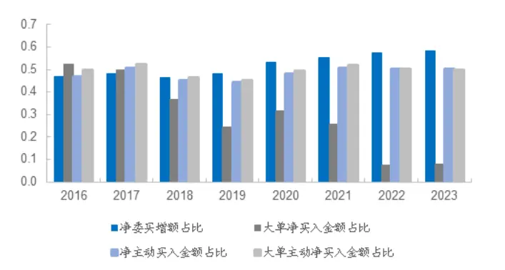
资料来源：Wind，海通证券研究所

图 2 市场冲击指标与冲击成本的分年度相关性（全天成交，2016.01-2023.12）
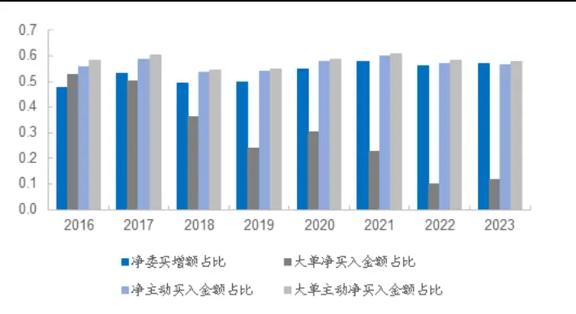
资料来源：Wind，海通证券研究所

无论是整体还是分年度，除大单净买入金额占比外，其余三个指标和冲击成本的相关性均能达到 0.5 左右，且稳定性很高。而大单净买入金额占比与冲击成本之间的相关性自 2018 年起，便开始逐渐衰退，近两年已降至 0.1 左右。

由此可见，我们定义的市场冲击指标确与冲击成本之间有很强的联系。而进一步根据正相关性可知，买入 卖出行为会使指标变大 小，从而推高 拉低 与开盘价的比值。买入|卖出行为相当于做多|做空，推高|拉低该比值，意味着有一部分做多|做空收益无法被获取，最终都增加了潜在的交易成本。所以，我们认为，利用上述市场冲击指标预测同期的冲击成本是一种可行的方案。

## 1.3市场冲击指标与冲击成本的中性化

由于市场冲击指标与常用的手工高频因子有非常强的关联，因此，我们仿照选股因子的中性化处理模式，将这 个指标对市值、估值、行业、 、 、换手率、反转、特质波动、非流动性、尾盘成交占比、买入意愿强度、大单净买入占比、高频深度学习因子和日频深度学习因子进行中性化处理，再计算与冲击成本的相关性。

表 2 中性化市场冲击指标与冲击成本的相关性（2016.01-2023.12）

|  | 开盘半小时成交 |  |  |  | 全天成交 |  |  |  |
| --- | --- | --- | --- | --- | --- | --- | --- | --- |
|  | 净委买增额 占比 | 大单净买入 金额占比 | 净主动买入 金额占比 | 大单主动净买 入金额占比 | 净委买增额 占比 | 大单净买入 金额占比 | 净主动买入 金额占比 | 大单主动净买 入金额占比 |
| IC | 0.454 | 0.275 | 0.413 | 0.425 | 0.467 | 0.269 | 0.495 | 0.507 |
| ICIR | 51.390 | 12.348 | 35.098 | 36.395 | 41.544 | 12.078 | 42.467 | 44.100 |

资料来源：Wind，海通证券研究所

如上表所示，中性化后，市场冲击指标与冲击成本的相关性略有下降。但除了大单净买入金额占比外，其余 3个相关系数依然在 0.4-0.5 之间。我们认为，这说明，剔除风格和 alpha 因子的影响后，市场冲击指标对冲击成本仍保有良好的预测能力。

为了更加清晰地观察这 个指标对冲击成本预测能力的高低，我们在进行风格与alpha 因子中性化后，再按照净主动买入金额占比、净委买增额占比、大单主动净买入占比和大单净买入金额占比的顺序，从第二个指标起，依次对前序指标进行正交，随后重新计算与冲击成本的相关性。

表 3 依次正交后的中性化市场冲击指标与冲击成本的相关性（2016.01-2023.12）

| 开盘半小时成交 |  |  |  |  | 全天成交 |  |  |  |
| --- | --- | --- | --- | --- | --- | --- | --- | --- |
|  | 净委买增额 占比 | 大单净买入 金额占比 | 净主动买入 金额占比 | 大单主动净买 入金额占比 | 净委买增额 占比 | 大单净买入 金额占比 | 净主动买入 金额占比 | 大单主动净买 入金额占比 |
| IC | 0.273 | 0.174 | 0.413 | 0.124 | 0.212 | 0.157 | 0.495 | 0.127 |
| ICIR | 39.385 | 17.386 | 35.098 | 17.026 | 26.956 | 17.834 | 42.467 | 21.805 |

资料来源：Wind，海通证券研究所

作为第一个因子，净主动买入金额占比并不对其他指标正交，因此它和冲击成本的相关性并没有改变而净委买增额占比和大单主动净买入占比指标经过依次正交后，和冲击成本的相关性均下滑明显。这说明，上述三个因子和冲击成本的相关性来源有很大一部分来自相同的因素。但即便如此，正交后依然能有 0.1 的相关性，也意味着因子有自身特定的预测能力。大单净买入占比指标受正交的影响较小，预测能力相对独立。

另一方面，冲击成本也是组合收益的一部分。即，按当日收盘构建组合后，下一个交易日无法获取的那部分 alpha。所以，我们也尝试将冲击成本对股票的风格与 alpha因子正交。其中，风格因子包括行业、市值、非线性市值和估值，alpha 因子同上文市场冲击指标正交部分，共计 12 个。具体地，

首先，将同一中信一级行业的股票归为一类，计算每一类的冲击成本均值，再将每个股票的冲击成本减去其所属行业的冲击成本均值，得到股票的行业调整后冲击成本。

其次，将每个股票的市值、非线性市值、估值和 12 个 alpha 因子，按照固定的顺序，构建为每个股票的 15 维特征向量。利用 K-Median 聚类算法，聚为 40 个类别。再计算每一个类别中所有股票的行业调整后冲击成本均值，用每个股票的行业调整后冲击成本减去其所属类别的行业调整后冲击成本均值，得到该股票最终的调整后冲击成本。以下图表展示了各自中性化后，市场冲击指标与冲击成本的相关性。

表 4 各自中性化后的市场冲击指标与冲击成本的相关性（2016.01-2023.12）

| 开盘半小时成交 |  |  |  |  | 全天成交 |  |  |  |
| --- | --- | --- | --- | --- | --- | --- | --- | --- |
|  | 净委买增额 占比 | 大单净买入 金额占比 | 净主动买入 金额占比 | 大单主动净买 入金额占比 | 净委买增额 占比 | 大单净买入 金额占比 | 净主动买入 金额占比 | 大单主动净买 入金额占比 |
| IC | 0.290 | 0.183 | 0.437 | 0.130 | 0.228 | 0.169 | 0.530 | 0.136 |
| ICIR | 40.040 | 18.057 | 37.621 | 17.115 | 28.818 | 18.444 | 47.710 | 22.322 |

资料来源：Wind，海通证券研究所

图 3 各自中性化后的市场冲击指标与冲击成本的分年度相关性（开盘后半小时内成交，2016.01-2023.12）
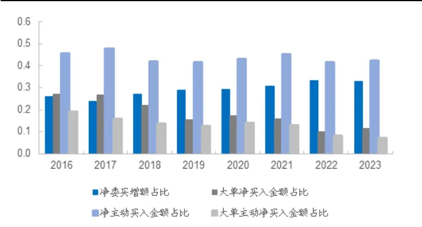
资料来源：Wind，海通证券研究所

图 4 各自中性化后的市场冲击指标与冲击成本的分年度相关性（全天成交，2016.01-2023.12）
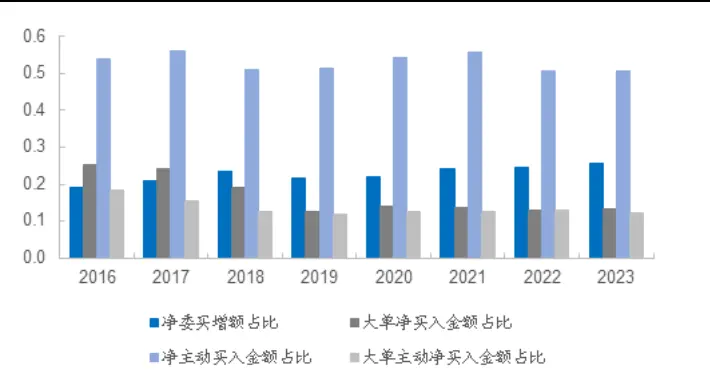
资料来源：Wind，海通证券研究所

冲击成本经过中性化后，与市场冲击指标的相关性比中性化之前（表 ）有所提升，这意味着以此为基础构建预测模型会有更好的效果。而且从分年度的相关性来看，中性化使相关性更加稳健，尤其是对净委买增额占比和净主动买入金额占比两个指标。但大单净买入金额占比、大单主动净买入金额占比指标和冲击成本的相关性依然呈逐年下降的趋势，近两年维持在 0.1 左右。

## 1.4冲击成本预测的线性回归模型

由上文可知，我们提出的 个市场冲击指标——净委买增额占比、大单净买入金额占比、净主动买入金额占比和大单主动净买入金额占比，与中性化后的冲击成本存在较为显著的相关性，因此，我们利用最简单的 回归，以中性化后的市场冲击指标为自变量，对中性化后的冲击成本进行预测，回归系数的时间序列均值如下表所示。

表 5 各自中性化后的冲击成本与市场冲击指标的回归模型（2016.01-2023.12）

|  | 开盘后半小时内成交 |  | 全天成交 |  |
| --- | --- | --- | --- | --- |
|  | 系数 | t值 | 系数 | t值 |
| 截距项 | 0.00% | 0.010 | 0.00% | 0.013 |
| 净委买增额占比 | 0.33% | 21.198 | 0.37% | 18.081 |
| 大单净买入金额占比 | 0.19% | 11.906 | 0.24% | 11.385 |
| 净主动买入金额占比 | 0.49% | 31.557 | 0.82% | 40.280 |
| 大单主动净买入金额占比 | 0.08% | 4.625 | 0.14% | 6.574 |
| 均方误差 | 0.65% | - | 0.87% | - |
| R² | 0.330 |  | 0.387 |  |

资料来源：Wind，海通证券研究所

开盘后半小时内成交和全天成交两种假设下，净委买金额占比与净主动买入金额占比的回归系数均为最大，且 t 值也是最高。此外，全天成交假设下，均方误差和 R2更高。

以下两图分别展示了开盘后半小时内成交与全天成交两种情况下，每一期回归的均方误差与 R2。从中可见，两者在时间序列上均较为稳定。这表明，我们设计的简单回归模型，可以在一定程度上实现预测冲击成本的目标。

图 5 冲击成本与市场冲击指标的回归模型拟合效果（各自中性化，开盘后半小时内成交，2016.01-2023.12）
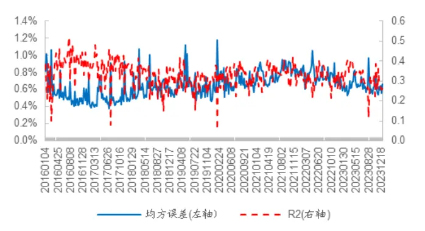
资料来源： ，海通证券研究所

图 6 冲击成本与市场冲击指标的回归模型拟合效果（各自中性化，全天成交，2016.01-2023.12）
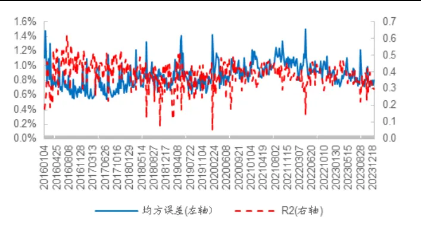
资料来源：Wind，海通证券研究所

于是，我们借鉴构建多因子组合时，因子收益的计算方法，以过去 52期回归的系数均值作为下一期回归模型的系数，再代入最新的冲击成本指标，便可得到中性化后的冲击成本预测。并与实际值相对应，计算预测均方误差与 R2，结果如以下两图所示。

图 7 冲击成本与市场冲击指标的回归模型预测效果（各自中性化，开盘后半小时内成交，2016.01-2023.12）
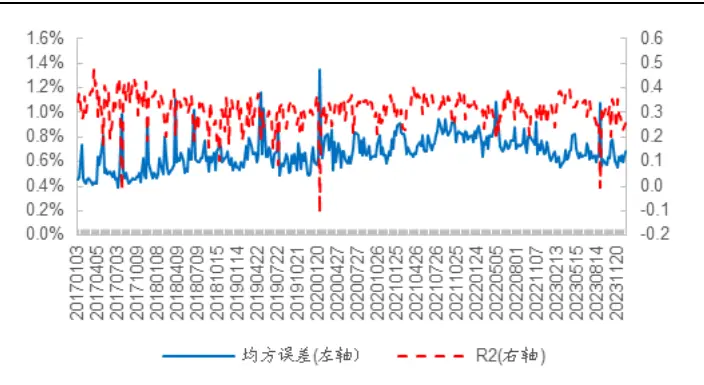
资料来源：Wind，海通证券研究所

图 8 冲击成本与市场冲击指标的回归模型预测效果（各自中性化，全天成交，2016.01-2023.12）
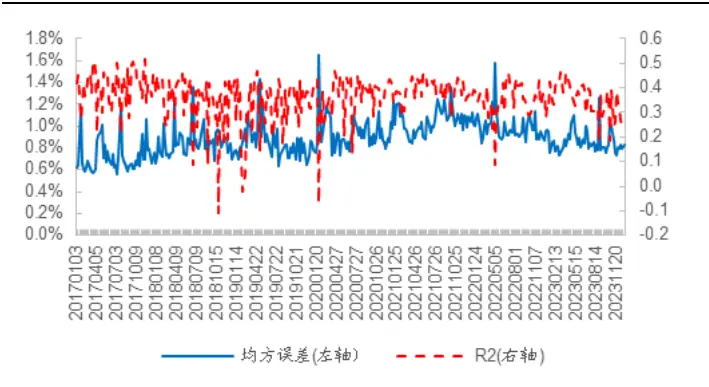
资料来源：Wind，海通证券研究所

开盘后半小时内成交和全天成交两种假设下，预测均方误差均值分别为 0.67%和0.89%，平均 R2分别为 0.310和 0.365。若以这两个指标评价，可以认为，预测效果接近表 5中的同期拟合结果。此外，预测模型的均方误差和 R2同样在时间序列上较为稳定。至此，冲击成本的预测模型搭建完毕，下文关注其应用效果。

## 2. 冲击成本的预测及其对因子选股能力的影响

## 2.1冲击成本预测实例

交易行为往往由算法交易策略所决定。反映到终端指令层面，则具体表现为挂限价单、挂市价单和撤单三个指令。具体地，挂买入|卖出限价单指令，会在被成交或被撤销前，增加 减少市场冲击指标中的净委买增额占比；挂买入 卖出市价单，则会增加 减少净主动买入金额占比。更进一步，如果市价单为大单，则会对应增加|减少大单主动净买入金额占比。最后，无论是以限价单挂单被动成交还是以市价单挂单主动成交，如果所下订单为大单，均会增加|减少大单净买入金额占比。

因此，当我们确定算法交易策略，并可以预计出以该策略下单，会委托多少金额的限价单，以限价单被动成交和以市价单主动成交的金额各占多少比例，以及成交的订单中有多大比例为大单，就可以计算出该算法交易下，4个市场冲击指标的变化值。进而利用 1.4 中的模型，预测冲击成本。

我们以一种最简单的算法交易方式为例，假设，

- 从连续竞价开始，每分钟等金额下单。

- 在前半分钟，先尝试将金额分为 3个限价单挂出。

- 在后半分钟，以市价单分三次将未成交部分下单并成交。

假设按上述算法交易策略下买单 18000 股，对应金额 18000 元，则 3 个限价买单会使净委买增额增加 18000 元。假设其中限价单成交了 50%，则剩下的 9000 股，对应9000 元需以市价单形式下出，即增加了净主动买入金额 9000 元。再假设该股票下单金额为 6000 元时，即被识别为大单，则以限价单形式成交的 1.5 个订单中，1 个可划定为大单，即增加了大单净买入金额 6000 元。而将未成交的 9000 股拆分为 3个订单成交时，每个订单成交金额均为 3000 元，未达到大单标准，因此，对应的大单净买入金额指标变动为 0。将这些变化量代入模型，便可得到中性化后的冲击成本预测值。

上述算法交易策略中，限价单成交占比是关键参数，它决定了净主动买入金额占比这一冲击成本最重要的预测因子。但随着下单金额的增加，限价单成交占比必然会逐步降低。因此，我们使用一种最简单的动态限价单成交占比设定方式。假设限价单成交占比的最小值和最大值分别为 10%和 50%，当下单金额占过去 21个交易日同时段成交金额的比例不超过 1%时，限价单成交占比设为 10%；随着下单金额增加，限价单成交占比会线性下降；当下单金额占过去 21 个交易日同时段成交金额的比例超过 30%时，限价单成交占比设为 50%。

考虑到交易时段的长短导致的资金容纳能力差异，若计划开盘后半小时内成交，则个股下单金额从 10 万递增至 500 万，共 50 种情况；若计划全天成交，则个股下单金额从 10 万递增至 1000 万，共 100 种情况。

以下 图分别展示了不同下单金额的假设下，开盘后半小时内所有股票 个市场冲击指标分 10 组后的平均值。随着下单金额的增加，这 4 个市场冲击指标第 1组与第 10组的均值差距急剧增加，表明不同股票对交易资金容纳能力的差异也在快速放大。当下单金额超过 200 万时，4 个指标第 10 组的均值都超过 100%，意味着该类订单的成交金额已高于过去 个交易日同时段的日均成交额，突破了模型的预测限制。此时，我们虽仍会按照模型预测冲击成本，但准确性必然难以保证，而且很有可能会低估真实的交易成本。

图 9 净委买增额占比指标的十分组均值（开盘后半小时内成交，2017.01-2023.12）
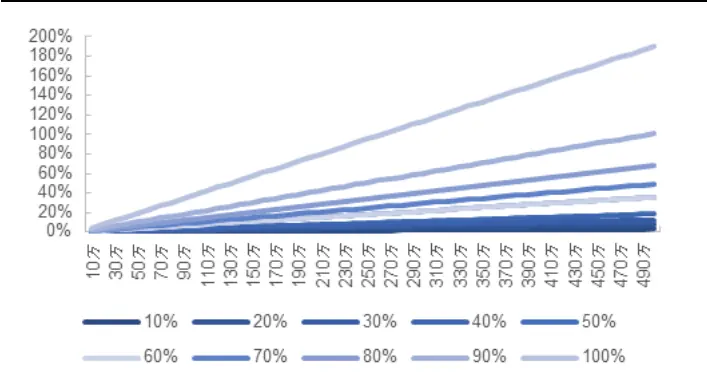
资料来源： ，海通证券研究所

图 10 大单净买入金额占比指标的十分组均值（开盘后半小时内成交，2017.01-2023.12）
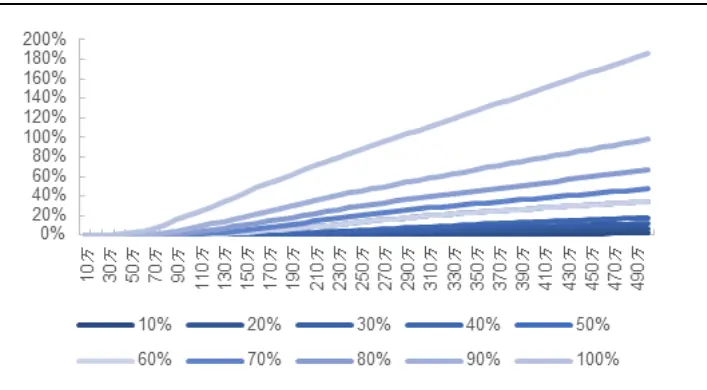
资料来源：Wind，海通证券研究所

图 11 净主动买入金额占比指标的十分组均值（开盘后半小时内成交，2017.01-2023.12）
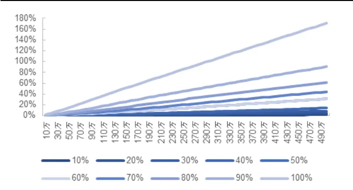
资料来源： ，海通证券研究所

图 12 大单主动净买入金额占比指标的十分组均值（开盘后半小时内成交，2017.01-2023.12）
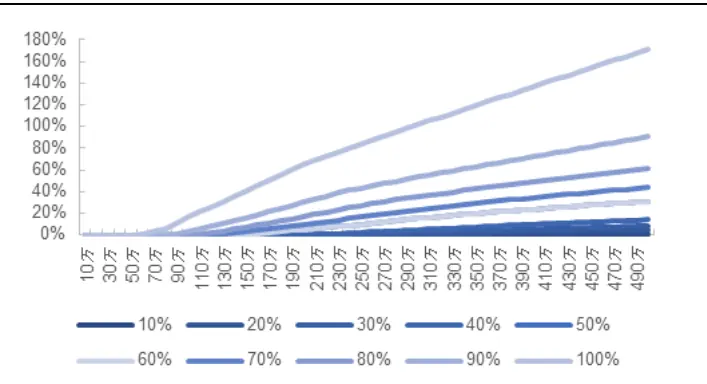
资料来源：Wind，海通证券研究所

基于 个市场冲击指标，我们在不同的下单金额下，根据前文介绍的回归模型，得到了开盘后半小时内成交的冲击成本预测值分 组后的平均值。由下图可见，当开盘后半小时内的下单金额超过 200 万后，预测值第 10 组的交易成本均值将超过 1%；而当下单金额达到 500 万时，甚至会接近 2%。这样的交易成本显然是相当巨大的，对周期较短的交易甚至是不可接受的。

图 13 冲击成本预测值的十分组均值（开盘后半小时内成交，2017.01-2023.12）
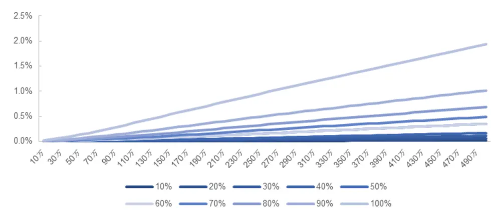
资料来源：Wind，海通证券研究所

类似地，我们计算了全天成交假设下，4 个市场冲击指标分 10组的平均值，以及相应的冲击成本预测值的分 10 组平均，结果如图 14-18 所示。

图 14 净委买增额占比指标的十分组均值（全天成交，2017.01-2023.12）
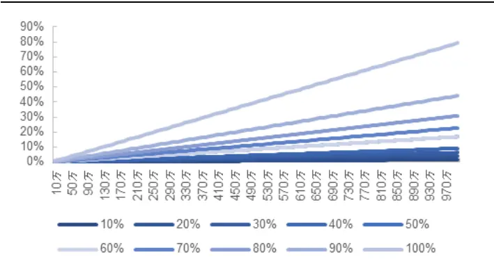
资料来源：Wind，海通证券研究所

图 15 大单净买入金额占比指标的十分组均值（全天成交，2017.01-2023.12
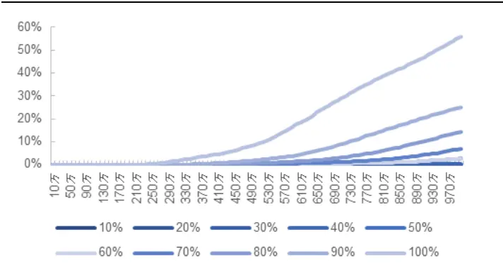
资料来源：Wind，海通证券研究所

图 16 净主动买入金额占比指标的十分组均值（全天成交，2017.01-2023.12）
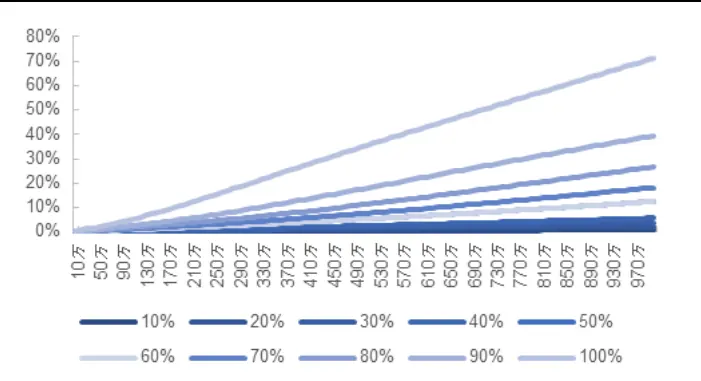
资料来源： ，海通证券研究所

图 17 大单主动净买入金额占比指标的十分组均值（全天成交，2017.01-2023.12）
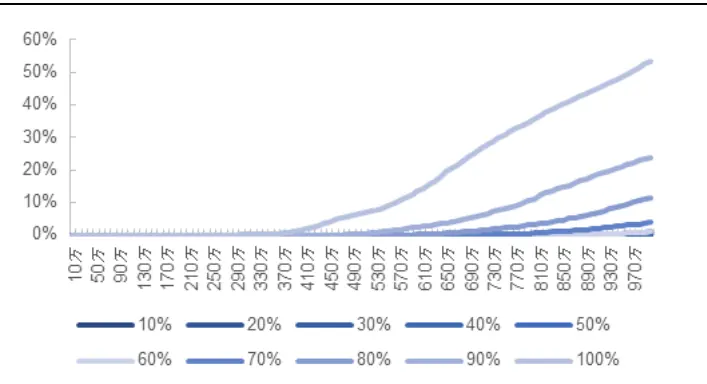
资料来源：Wind，海通证券研究所

和开盘后半小时内成交的假设相比，全天成交对资金的容纳能力要强得多， 个市场冲击指标均未出现大于 100%的极端情况。只有在下单金额超过 500 万时，第 10 组才会超过 50%。

图 18 冲击成本预测值的十分组均值（全天成交，2017.01-2023.12）
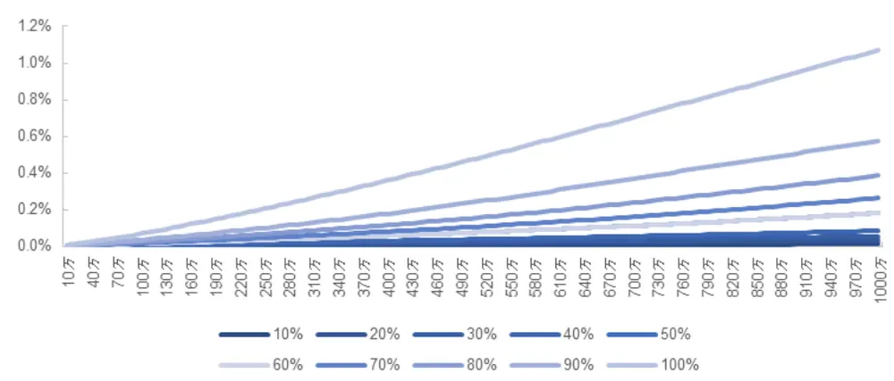
资料来源：Wind，海通证券研究所

显然，随着资金容纳能力的提升，预测的冲击成本出现极端值的概率也大幅下降。只在下单金额超过 万时，第 组的平均冲击成本才会达到 。这表明，模型的稳健性有明显的提升。

## 2.2考虑预测冲击成本后的因子选股能力

和报告《选股因子系列研究（九十一）——组合规模、交易成本和大单冲击对因子表现的影响分析》中，交易成本对因子表现影响的研究方法相同，我们先从原始收益率中减去预测冲击成本，再重新计算因子的 ，并计算与不考虑成本时 的差值。同样考虑两种交易模式，月度换仓策略为全天交易，周度换仓策略为开盘后半小时内交易。用于对比的因子包括，基本面因子——ROE和 SUE，技术面因子——换手率、反转、特质波动和非流动性，手工高频因子——尾盘成交占比、买入意愿强度、大单净买入占比，高频深度学习因子和日频深度学习因子。其中，最后两个因子只用于周度策略。

此外，为防止下单金额过大导致模型失效，我们假定，若下单金额导致 4 个市场冲击指标中的某个大于过去 126个交易日所有股票该指标日度均值最大值的 2.5 倍，则对该指标进行缩尾处理，将其调整为该最大值。

当策略为月度换仓时，我们计算每个股票的成交金额从 10 万递增至 1000 万，共100 种情况下，考虑预测冲击成本后，因子 IC 的变化。

图 19 扣 除 冲 击 成 本 后 的 基 本 面 因 子 月 度 IC 差 值（2017.01-2023.12）
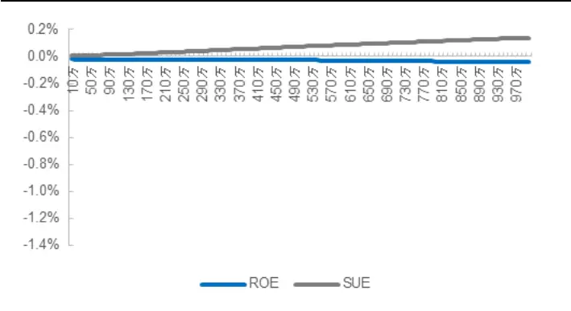
资料来源： ，海通证券研究所

图 20 扣 除 冲 击 成 本 后 的 技 术 面 因 子 月 度 IC 差 值（2017.01-2023.12）
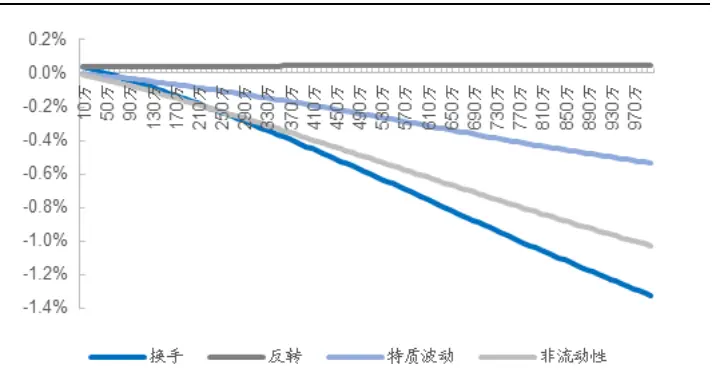
资料来源： ，海通证券研究所

图 21 扣除冲击成本后的手工高频因子月度 IC差值（2017.01-2023.12）
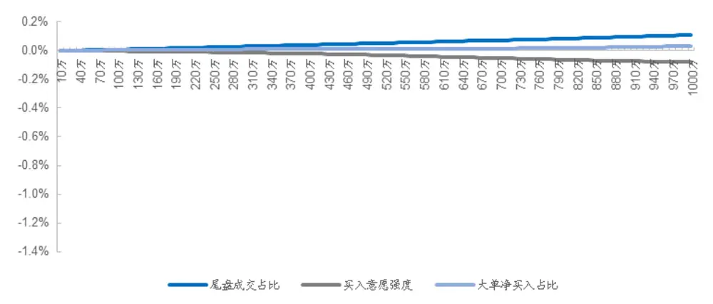
资料来源： ，海通证券研究所

如图 19-21 所示，基本面因子、手工高频因子和技术面因子中的反转因子，受到预测冲击成本的影响很小。但技术面因子中的换手、特质波动和非流动性因子则受到了较为剧烈的影响。随着下单金额增大，特质波动因子的 IC 将下降 0.5%，而非流动性和换手因子的 IC 的下降幅度甚至超过了 1%。

当策略为周度换仓时，我们计算每个股票的成交金额从 10 万递增至 500 万，共 50种情况下，考虑预测冲击成本后，因子 IC的变化。

图 22 扣 除 冲 击 成 本 后 的 基 本 面 因 子 周 度 IC 差 值（2017.01-2023.12）
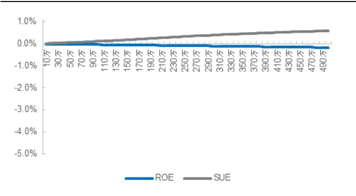
资料来源：Wind，海通证券研究所

图 23 扣 除 冲 击 成 本 后 的 技 术 面 因 子 周 度 IC 差 值（2017.01-2023.12）
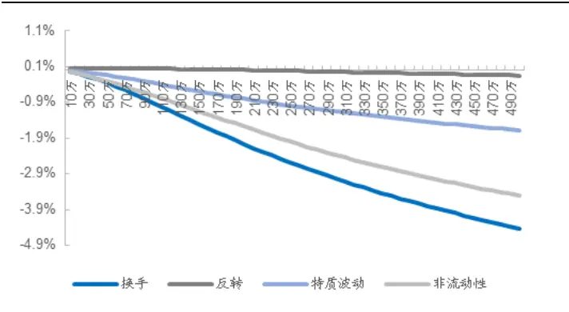
资料来源：Wind，海通证券研究所

图 24 扣 除冲 击成 本后 的手 工高 频因 子周度 IC 差 值（2017.01-2023.12）
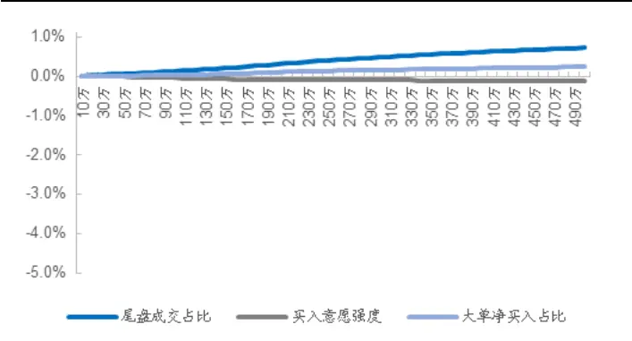
资料来源：Wind，海通证券研究所

图 25 扣 除冲 击成 本后 的深 度学 习因 子周度 IC 差 值（2017.01-2023.12）
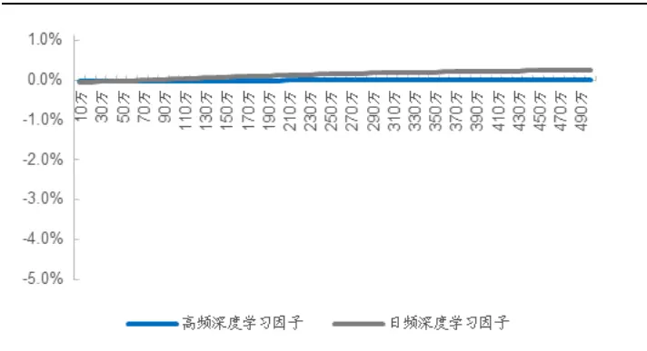
资料来源：Wind，海通证券研究所

和月度结果类似的是，周度换仓假设下，预测冲击成本对除反转外的技术面因子的负面影响尤为显著。换手、特质波动和非流动性因子的 都随着个股成交金额的上升而快速下降。当成交金额达到 500 万时，换手因子 IC 的下降幅度接近 5%。此外，SUE和尾盘成交占比因子受到的正向影响明显强于月度，而大单净买入占比、ROE和日频深度学习因子 IC的最大提升幅度更是接近 2%。

综上所述，我们可以得到两个有关预测冲击成本是如何影响因子选股能力的结论。第一，在原始收益率中减去预测冲击成本，并不一定意味着会削弱因子的 。部分预测冲击成本较高的股票，其收益被合理地降低，反而使某些因子的选股能力得以提升。第二，周度换仓下，部分因子，如换手的 IC变化较为极端，表明此时的下单金额已远超模型的可预测范围。可能的原因是当某个股票的市场冲击指标异常时，其预测的冲击成本变得很大，使得原始收益被过度调整，从而导致因子 IC 出现剧烈波动。因此，怎样合理地调整惩罚阈值，进而找到模型的可预测边界将是未来的重要课题。

## 3. 总结与思考

任何交易行为都会对市场产生冲击，从而带来过去历史统计数据之外的交易成本。然而，无论多复杂的算法交易策略，最终反应在市场上的交易行为只有挂单、撤单、市价成交这几种固定形式。因而，所引发的市场成交和订单簿形态相关统计量的变化也是较为固定的。通过建立这些统计量与交易成本（实际交易价格相对理论价格的损失）的模型，可在一定程度上预测市场行为导致的交易成本。

虽然本文提出的简单线性模型从预测均方误差和 R2来看，具备一定的预测效果，但距离更加精准地预测冲击成本仍有很长的路要走。同时，本文涉及的交易行为也仅仅考虑了在买一|卖一档的挂单。倘若挂单行为更加复杂，如，在多个档位挂单，则需要考虑更丰富的指标和更复杂的非线性模型，来提升冲击成本的预测效果。

根据我们的测试，预测冲击成本对于因子选股能力的影响并不一定是负面的。惩罚部分低流动性的股票，反而会增强某些因子的选股能力。然而，无论是简单的线性模型还是未来可能引入的更加复杂的非线性模型，其预测能力必然是有边界的。当下单金额大于一定阈值之后，任何模型可能都无法预测此类交易行为会对市场产生怎样的影响。因此，在不同的市场环境、下单金额、交易时段等参数组合下，如何界定模型的可预测边界、选择更加适合的模型，也是未来的一个重要研究方向。

## 4. 风险提示

本报告所有分析均基于公开信息，不构成任何投资建议；权益产品收益波动较大，适合具备一定风险承受能力的投资者持有。

## 信息披露

分析师声明

[Table冯佳睿yst金融工程研究团队s]

余浩淼金融工程研究团队

本人具有中国证券业协会授予的证券投资咨询执业资格，以勤勉的职业态度，独立、客观地出具本报告。本报告所采用的数据和信息均来自市场公开信息，本人不保证该等信息的准确性或完整性。分析逻辑基于作者的职业理解，清晰准确地反映了作者的研究观点，结论不受任何第三方的授意或影响，特此声明。

## 法律声明

。本公司不会因接收人收到本报告而视其为客户。在任何情况下，

本报告中的信息或所表述的意见并不构成对任何人的投资建议。在任何情况下，本公司不对任何人因使用本报告中的任何内容所引致的任何损失负任何责任。

本报告所载的资料、意见及推测仅反映本公司于发布本报告当日的判断，本报告所指的证券或投资标的的价格、价值及投资收入可能会波动。在不同时期，本公司可发出与本报告所载资料、意见及推测不一致的报告。

市场有风险，投资需谨慎。本报告所载的信息、材料及结论只提供特定客户作参考，不构成投资建议，也没有考虑到个别客户特殊的投资目标、财务状况或需要。客户应考虑本报告中的任何意见或建议是否符合其特定状况。在法律许可的情况下，海通证券及其所属关联机构可能会持有报告中提到的公司所发行的证券并进行交易，还可能为这些公司提供投资银行服务或其他服务。

本报告仅向特定客户传送，未经海通证券研究所书面授权，本研究报告的任何部分均不得以任何方式制作任何形式的拷贝、复印件或复制品，或再次分发给任何其他人，或以任何侵犯本公司版权的其他方式使用。所有本报告中使用的商标、服务标记及标记均为本公司的商标、服务标记及标记。如欲引用或转载本文内容，务必联络海通证券研究所并获得许可，并需注明出处为海通证券研究所，且不得对本文进行有悖原意的引用和删改。

根据中国证监会核发的经营证券业务许可，海通证券股份有限公司的经营范围包括证券投资咨询业务。

## 海通证券股份有限公司研究所[Table_PeopleInfo]

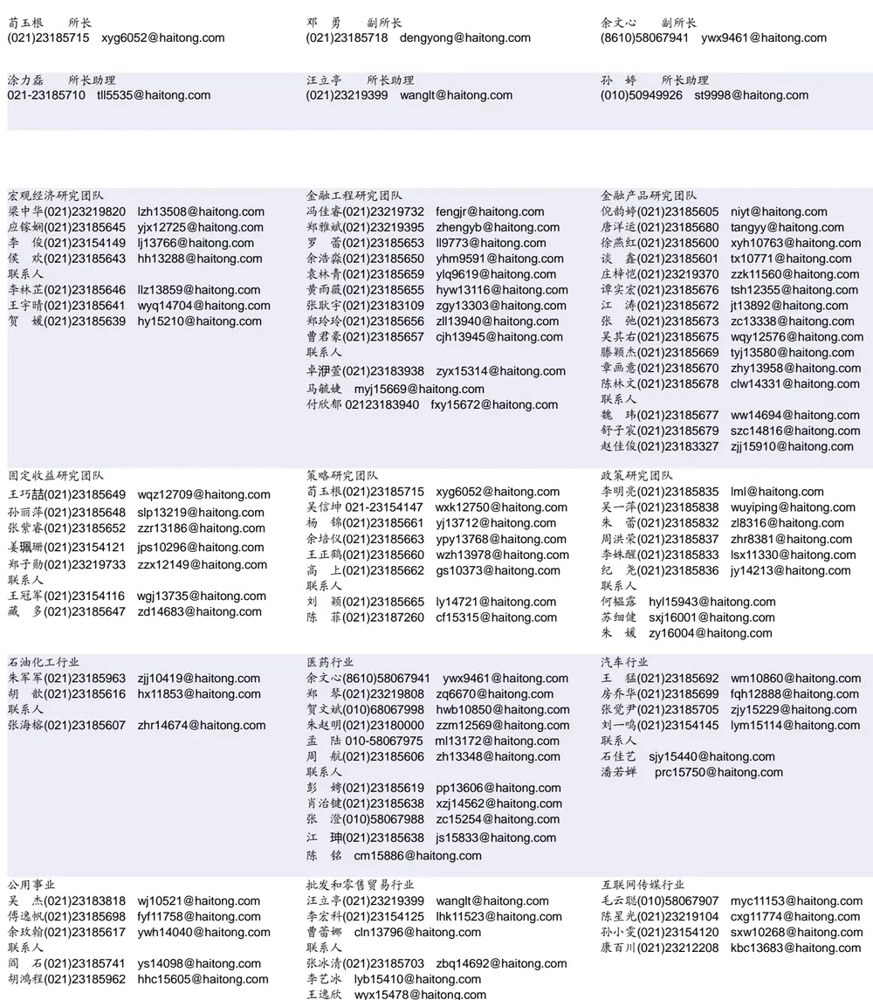

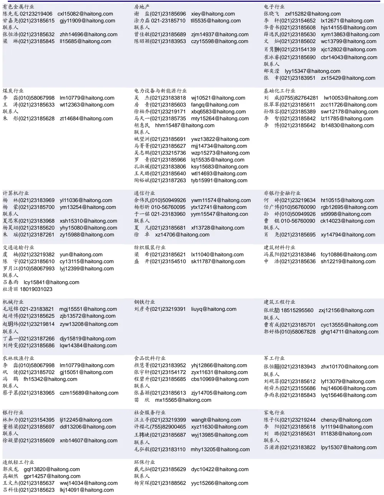

## 研究所销售团队

伏财勇(0755)23607963 fcy7498@haitong.com

蔡铁清(0755)82775962 ctq5979@haitong.com

刘晶晶(0755)83255933 liujj4900@haitong.com

饶 伟(0755)82775282 rw10588@haitong.com

欧阳梦楚(0755)23617160

oymc11039@haitong.com

巩柏含 gbh11537@haitong.com

张馨尹 0755-25597716 zxy14341@haitong.com

辜丽娟(0755)83253022 gulj@haitong.com

海通证券股份有限公司研究所

电话：（021）23219000

传真：（021）23219392

地址：上海市黄浦区广东路 689号海通证券大厦 9楼

网址：www.htsec.com

胡雪梅(021)23219385 huxm@haitong.com 黄 诚(021)23219397 hc10482@haitong.com 季唯佳(021)23219384 jiwj@haitong.com 黄 毓(021)23219410 huangyu@haitong.com 胡宇欣(021)23154192 hyx10493@haitong.com 马晓男 mxn11376@haitong.com 毛文英(021)23219373 mwy10474@haitong.com 谭德康 tdk13548@haitong.com 邵亚杰 23214650 syj12493@haitong.com 王祎宁(021)23219281 wyn14183@haitong.com 周之斌 zzb14815@haitong.com 杨祎昕(021)23212268 yyx10310@haitong.com 张歆钰 zxy14733@haitong.com

殷怡琦(010)58067988 yyq9989@haitong.com 董晓梅 dxm10457@haitong.com 郭 楠 010-5806 7936 gn12384@haitong.com 张丽萱(010)58067931 zlx11191@haitong.com 郭金垚(010)58067851 gjy12727@haitong.com 高 瑞 gr13547@haitong.com 姚 坦 yt14718@haitong.com 上官灵芝 sglz14039@haitong.com 王 勇 wy15756@haitong.com 董 晋 dj15843@haitong.com 辜丽娟(0755)83253022 gulj@haitong.com