## [Tab相关研究

Table_ReportInfo]《大类资产配臵及模型研究（十二）——主权财富基金（ ）的挪威模式：深度透视 GPFG 的主动管理之路》2024.03.04《本轮小微盘股回撤期间，各类投资者的持仓如何变化？》2024.02.27

《“中国版漂亮 50”有何不同？》

2024.02.23

分析师:郑雅斌

Tel:(021)23219395

Email:zhengyb@haitong.com

证书:S0850511040004

分析师:罗蕾

Tel:(021)23185653

Email:ll9773@haitong.com

证书:S0850516080002

# 选股因子系列（九十六）——动量 beta 的择时、优选与 alpha因子构建

## 投资要点：

本文主要对动量因子作了一个大体框架性的研究，包括回看窗口选择、动量 beta 分析、以及动量 alpha 因子构建。在 beta 分析上，我们一方面从时序角度考察了在哪些情景下，动量因子有可能失效，即对动量 beta 进行择时判断；另一方面构建了一个动量 beta 属性高的量化组合。Alpha 因子上，我们尝试利用短期反转对动量因子进行调整和改进。

- 回看窗口。回测结果显示，综合在其他风格因子（小市值、低估值）暴露相对较低、FF3 alpha 较高这两方面的特征，采用 t-11 到 t-5 月的累计涨幅所构建的动量因子相对更具优势。因此本文所分析的动量因子也主要基于该回看窗口构建。

动量因子在什么环境下更容易失效？动量因子的表现在一定程度上依赖市场动量，若市场动能减弱，则后期因子表现相对较差。另外，若市场长、短期月均收益为负，投资者情绪相对较为谨慎，后期高动量组合的延续性也较弱。此外，当动量因子达到较高拥挤度后，具有较高概率发生回撤。

- 动量 与成长相关性较高，但两者并非完全同步。例如， 年上半年、2021.08-09，市场呈明显的价值风格，低估值因子收益显著为正，即高估值成长表现不佳。但在这两个阶段，动量因子收益显著为正。即成长与动量并非完全同步，因此从 beta 组合体系完善性的角度，本文我们也结合其他选股因子，构建一个动量 beta 属性高、同时收益相较于单因子更为稳健的动量组合。

- 高动量 beta 优选组合。在过去 1 年累计收益为正的股票池中，采用动量因子，叠加其他偏增长类的基本面、预期因子增强收益，以及 PB_INT、低关注度因子降低风险，所构建的高动量 beta 优选 100 组合，动量暴露高，历史业绩表现优异，相对市场的超额收益比单因子更为稳健。2012.01-2024.02 期间，市值加权的动量优选组合相对 wind 全 A指数年超额 19.6%，月胜率 69.0%；等权组合相对 wind 全 A 指数年超额 23.6%，月胜率 71.0%。

- 增强动量因子。Alpha 因子角度，通常要求因子收益时序稳定性高。而简单累计收益所构建的动量因子，月均 IC 不足 1%，月胜率不到 60%。因此本文我们也尝试利用短期反转对动量因子进行调整和改进，以期构建一个稳定性相对较高的动量 alpha 因子。

- 增强动量因子历史表现。2005.01-2024.02 期间，因子分 10 组年化多头收益6.3%，空头收益-7.2%，月均 IC 为 2.6%，统计显著。从近些年的表现来看，2012年以来，因子年化多头收益 7.5%，空头收益-7.8%，年化多空 15.3%，月均 IC为 3.0%；正交常见选股因子后，因子月均 IC 有所下降，但稳定性有所提升。正交因子月均 IC 为 2.4%，月胜率 67.6%，ICIR 为 1.16，统计显著。与原始动量因子相比，增强动量因子在本文划分的动量因子表现不佳情景下，回撤相对较小；而在适合动量因子情景下，稳定性更高，多空收益更为明显。

- 风险提示。本报告的分析均基于历史数据统计结果，不构成任何投资建议；当市场环境发生变化时，可能存在历史统计规律失效风险、因子失效风险；统计假设或与实际情况存在差异。

本文对动量因子作了一个大体框架性的研究，主要包括回看窗口选择、动量 beta分析、以及动量 alpha 因子构建。在 beta 分析上，我们一方面从时序角度考察了在哪些情景下，动量因子表现不佳；另一方面构建了一个动量 beta 属性高的量化组合。Alpha因子上，我们尝试利用短期反转对动量因子进行调整和改进。需要注意的是，本文提及的动量单指价格动量，即历史涨幅高的股票相对历史涨幅低的股票在未来的业绩表现。

## 1. 动量因子及其历史业绩表现

动量因子，通常以股票过去一段时间的累计收益率来反映。下表我们统计了 2005年以来，不同回看窗口期下，动量因子分 10 组的多空收益。其中，动量因子得分最高的一组股票我们记之为多头组合（或高动量组合），其相对于样本等权组合的超额收益记为多头收益；而动量因子得分最低的一组股票我们记之为空头组合（低动量组合），其相对于样本等权组合的超额收益记为空头收益。

表 1 不同回看期下，动量因子的多空收益表现（2005.01-2024.02）

| 回看窗口 (月) | 多头收益 |  |  | 空头收益 |  |  | 多空收益 |  |  |
| --- | --- | --- | --- | --- | --- | --- | --- | --- | --- |
|  | 年收益 | 月胜率 | t值 | 年收益 | 月胜率 | t值 | 年收益 | 月胜率 | t值 |
| [t-11,t-1] | -4.2% | 43.0% | -1.43 | -2.6% | 45.2% | -1.14 | -1.7% | 44.3% | -0.34 |
| [t-11,t-2] | -2.1% | 47.4% | -0.75 | -3.6% | 42.2% | -1.67 | 1.5% | 49.6% | 0.32 |
| [t-11,t-3] | -0.2% | 47.8% | -0.07 | -3.7% | 43.5% | -1.82 | 3.5% | 50.9% | 0.80 |
| [t-11,t-4] | -0.3% | 47.0% | -0.11 | -4.7% | 43.0% | -2.37 | 4.4% | 52.2% | 1.01 |
| [t-11,t-5] | 1.2% | 47.8% | 0.47 | -4.8% | 43.5% | -2.49 | 6.0% | 50.4% | 1.47 |
| [t-11,t-6] | 0.2% | 48.3% | 0.09 | -4.7% | 42.2% | -2.55 | 5.0% | 51.7% | 1.30 |

资料来源：Wind，海通证券研究所

整体来看，动量因子呈多头效应弱、空头效应强的特征。相对而言，剔除近期涨跌幅的动量因子表现更优。例如，剔除近 5月涨跌幅，采用 t-11 月至 t-5月累计收益来构建的动量因子，年化空头收益-4.8%，统计显著；年化多头收益 1.2%，也优于其他回测窗口下的因子多头表现。而仅剔除近 1 个月涨跌幅，采用 t-11 月至 t-1月累计收益所构建的动量因子，年化空头收益-2.6%，多头收益甚至为负，-4.2%，表现远不如回看窗口期为[t-11,t-5]的动量因子。

图1 不同回看期下，动量因子累计多空收益（2005.01-2024.02）
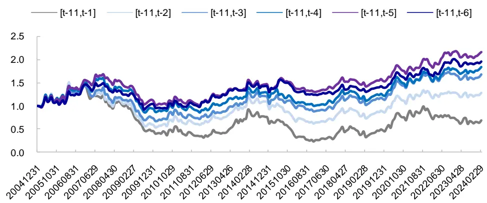
资料来源：Wind，海通证券研究所

时间序列上，不同回看窗口期的动量因子相关性高，累计多空收益走势较为接近（图1），月多空收益相关系数均不低于 0.8（表 2）。

表 2 不同回看期的动量因子多空收益时序相关性（2005.01-2024.02）

| [t-11,t-1] | [t-11,t-2] | [t-11,t-3] | [t-11,t-4] | [t-11,t-5] | [t-11,t-6] |
| --- | --- | --- | --- | --- | --- |
| [t-11,t-1] | 0.96 | 0.93 | 0.86 | 0.83 | 0.80 |
| [t-11,t-2] | 0.96 | 0.97 | 0.91 | 0.87 | 0.83 |
| [t-11,t-3] | 0.93 | 0.97 | 0.96 | 0.90 | 0.85 |
| [t-11,t-4] | 0.86 | 0.91 | 0.96 | 0.93 | 0.86 |
| [t-11,t-5] | 0.83 | 0.87 | 0.90 0.93 |  | 0.95 |
| [t-11,t-6] | 0.80 | 0.83 | 0.85 0.86 | 0.95 |  |

资料来源：Wind，海通证券研究所

我们将动量因子多头组合的月收益率，对市场（样本等权组合）、小市值因子、低估值因子收益率进行时序 FF3回归，结果如下表所示。总体来看，动量组合呈高 beta、大盘成长特征：相对市场 beta 高于 1，在小市值、低估值上的暴露显著为负。相较而言，剔除近期涨跌幅的时间越短，多头组合在大盘成长上的暴露更高。

表 3 动量因子多头组合的 FF3 回归（2005.01-2024.02）

|  | [t-11,t-1] |  | [t-11,t-2] |  | [t-11,t-3] |  | [t-11,t-5] |  | [t-11,t-6] |  |
| --- | --- | --- | --- | --- | --- | --- | --- | --- | --- | --- |
|  | 系数 | t值 | 系数 t值 | 系数 | t值 | [t-11,t-4] 系数 t值 | 系数 | t值 | 系数 | t值 |
| alpha | 4.77% | 2.42 | 6.27% | 3.24 | 7.89% 4.10 | 7.14% | 3.45 | 7.48% | 3.72 | 6.16% 3.41 |
| 市场 | 1.02 | 53.38 | 1.04 | 55.02 | 1.03 55.17 | 1.04 | 51.71 | 1.04 53.33 | 1.04 | 58.99 |
| 小市值 | -0.27 | -9.16 | -0.26 | -9.02 | -0.25 -8.62 | -0.26 | -8.27 | -0.20 -6.50 | -0.17 | -6.15 |
| 低估值 | -0.65 | -16.92 | -0.63 | -16.59 | -0.61 -16.10 | -0.54 | -13.29 | -0.50 | -12.73 -0.50 | -13.99 |

资料来源： ，海通证券研究所

综上所述，从因子角度出发，综合在其他风格因子暴露相对较低、FF3 alpha 较高这两方面的特征，采用 t-11到 t-5 月的累计涨幅构建的动量因子相对更具优势，因此后文中我们将主要对该回看窗口下的动量因子进行分析，具体将从 beta 特征、与 alpha 因子两个角度展开。

Beta 特征上，第二部分我们将从时间序列的角度，来考察在哪些情景下动量因子表现不佳，出现回撤的可能性较高；第三部分，则将结合其他选股因子，构建一个动量属性高、同时收益相较于单因子更为稳健的动量 beta 组合。Alpha 因子上，第四部分我们尝试利用短期反转对动量因子进行调整和改进，构建一个长期稳定性相对更高的动量选股因子。

## 2. 什么情景下，动量因子表现不佳

如前所述，动量因子多头组合相对于市场等权组合的 beta 大于 1，因此我们猜测，动量因子的表现在一定程度上依赖市场动量的延续。若市场动能较弱，则后期动量因子的表现可能相对较差。为验证这一猜测，本节我们考察了在市场动能减弱、以及过去 1年指数无明显涨幅的情景下，后期动量因子的表现。此外，从均值回复的角度来看，若动量因子达到较高拥挤度，则后期因子也有可能出现回撤。因此，本节我们还用位序估值的方式定义了因子拥挤度，并考察该指标处于极端情况时，后期动量因子的表现。

## 2.1 市场动能减弱

若市场动能减弱，出现反转、或变化时，动量因子的表现可能相对较差。如图 2、图 3 所示，当市场上行趋势发生变化时，动量因子表现不佳。基于此，我们根据 wind全 A指数的月度涨幅及 12 月均线，定义了两种动能可能减弱的情形。一是，若前期市场涨幅较大，但当月跌幅明显，则市场动能可能出现反转。二是，当月市场上涨，但 12月月均涨幅连续走弱，则动量延续的可能性相对较小。然后我们统计了这两种情景发生后一个月，动量因子的表现。

图2 Wind 全 A 指数走势与动量因子多空收益（2014.02-2016.02）
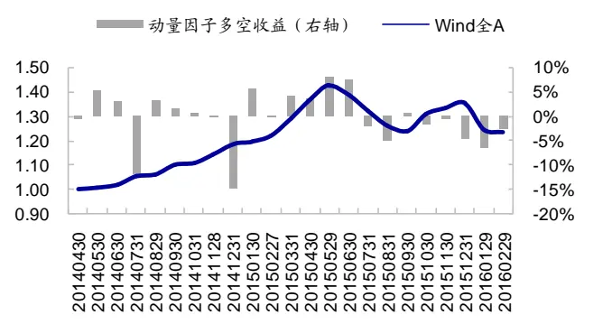
资料来源： ，海通证券研究所

图3 Wind 全 A 指数走势与动量因子多空收益（2021.03-2022.06）
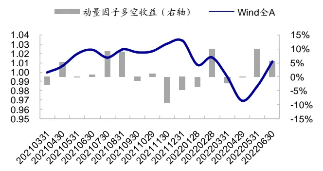
资料来源：Wind，海通证券研究所

## 情形 1：上行趋势遇到较大跌幅，后一个月动量因子的表现

具体来看，若Wind 全 A指数过去 1年月均涨幅超过 5%，即前一年指数走势明显上扬；但 t 月大幅下跌，跌幅超过 10%，则称情形 1 触发。之后一段时间，动量因子表现可能都相对较差，直至市场恢复上行趋势，即指数 12 月月均涨幅连续增加，且当月涨幅超过 月均值才重新使用动量因子。我们统计情形 触发期间动量因子的表现，结果如下表所示。

表 4 上行趋势遇到较大跌幅后，动量因子的表现（2005.01-2024.02）

|  | 年收益 | 月胜率 | t值 | p值 |
| --- | --- | --- | --- | --- |
| 高动量组合 | -14.8% | 33.3% | -2.43 | 0.021 |
| 低动量组合 | 12.2% | 75.8% | 3.47 | 0.002 |
| 高动量-低动量 | -26.9% | 24.2% | -3.32 | 0.002 |

资料来源：Wind，海通证券研究所

2005.01-2024.02 期间，处于情形 1的月份共计 33个月。在此期间，高动量组合（动量因子得分最高的 1/10 股票等权组合，下同）显著跑输基准（全 A等权组合，下同）；而低动量组合显著跑赢基准，月胜率 75.8%。即，在情形 1 圈定的情景内，动量因子显著失效，多空收益反向，截面上呈较为显著的反转效应。

## 情形 2：市场上涨，但动能减弱

具体来看，若市场（Wind全 A指数）t月上涨，但未大幅上涨，即涨幅不超过 10%；同时动能减弱，指数 12 月月均涨幅连续 2个月减小，则称情形 2 触发。我们统计情形 2触发后，下一个月动量因子的表现，结果如下表所示。

表 5 市场上涨，但动能减弱后动量因子的表现（2005.01-2024.02）

| 年收益 | 月胜率 | t值 | p值 |
| --- | --- | --- | --- |
| 高动量组合 -33.7% | 7.1% | -4.87 | 0.000 |
| 低动量组合 | 8.6% 64.3% | 1.83 | 0.090 |
| 高动量-低动量 | -42.3% | -4.62 | 0.000 |

资料来源：Wind，海通证券研究所

2005.01-2024.02 期间，触发情形 2的月份共计 14个月。这些月份的下一个月，高动量组合显著跑输基准，年化跑输达 33.7%，跑输月度占比高达 92.9%，统计显著；而低动量组合显著跑赢基准，月胜率 64.3%。可见，情形 2 触发后，动量因子显著失效，多空收益反向，截面上呈较为显著的反转效应。

## 复合情形：市场动能减弱

无论是指数前期高涨幅后的回撤，还是 12月涨幅均值减弱，都在一定程度上反映出市场动能的减弱。我们将上述两种情形取并集，统称为市场动量减弱，然后统计下一个月动量因子的表现，结果如下表所示。

表 6 动能减弱后，动量因子的表现（2005.01-2024.02）

|  | 动能减弱 |  |  |  | 其他时候 |  |  |  |
| --- | --- | --- | --- | --- | --- | --- | --- | --- |
|  | 年收益 | 月胜率 | t值 | p值 | 年收益 | 月胜率 | t值 | p值 |
| 高动量组合 | -18.5% | 27.9% | -3.59 | 0.001 | 5.7% | 52.2% | 2.01 | 0.046 |
| 低动量组合 | 10.0% | 69.8% | 3.38 | 0.002 | -8.4% | 37.1% | -3.77 | 0.000 |
| 高动量-低动量 | -28.5% | 20.9% | -4.25 | 0.000 | 14.1% | 57.5% | 3.04 | 0.003 |

资料来源：Wind，海通证券研究所

2005.01-2024.02 期间，处于前文定义的动能减弱月份共计 43个月。在此期间，高动量组合显著跑输基准，年化跑输18.5%；而低动量组合显著跑赢基准，年化超额10.0%，均统计显著。即动能减弱阶段，市场整体呈反转效应。

## 2.2市场长、短期月均收益均为负

若市场长、短期收益均为负，则投资者情绪通常较为谨慎，此时动量持续性较弱，相应的因子表现可能较差。

图4 Wind 全 A 指数走势与动量因子累计多空收益（2005.01-2024.02）
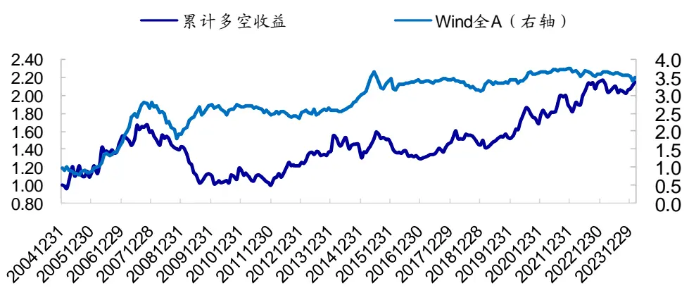
资料来源：Wind，海通证券研究所

基于此，我们将 全 指数 月小幅下跌（跌幅不超过 ），同时指数过去月月均涨幅也为负的情景截取出来，统计其后一个月动量因子的表现，结果如下表所示。2005.01-2024.02 期间，该情景共出现 20次。该情景出现后一个月，高动量组合明显跑输基准，而低动量组合相对基准具有正超额。即，若 wind全 A指数长、短期收益均为负，则后期动量因子表现一般。

表 7 市场长、短期月收益为负，后一个月动量因子的表现（2005.01-2024.02）

| 年收益 | 月胜率 | t值 |  | p值 |
| --- | --- | --- | --- | --- |
| 高动量组合 | -9.8% | 40.0% | -1.18 | 0.252 |
| 低动量组合 | 2.6% | 50.0% | 0.38 | 0.710 |
| 高动量-低动量 | -12.5% | 50.0% | -0.89 | 0.384 |

资料来源： ，海通证券研究所

## 2.3因子拥挤度高

多头组合平均位序估值很高，在一定程度上反映出动量因子拥挤度高。我们计算个

股当前 PB在过去 3年中的分位点（位序估值），然后计算月末多头组合的平均位序估值，如下图阴影面积所示。总体来看，动量因子的优异表现会推动多头组合的位序估值攀升；当达到一定程度后，因子出现拥挤，后期通常会有一些波动和回撤。

图5 多头组合的位序估值与动量因子累计多空收益（2005.01-2024.02）
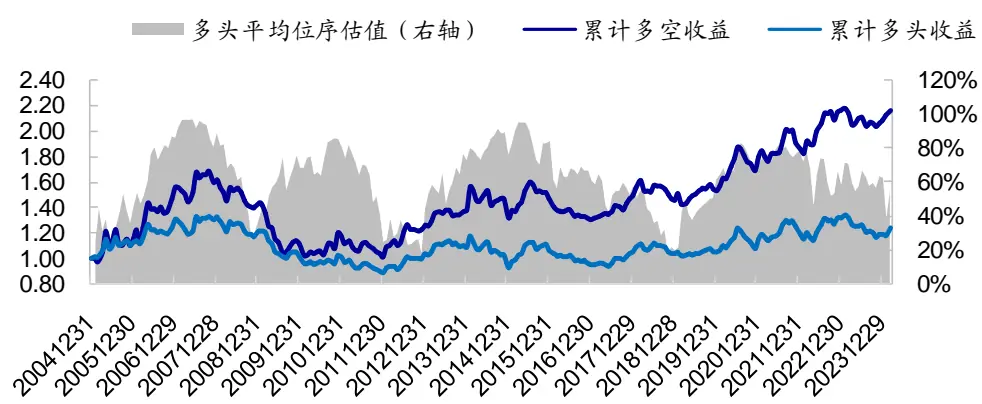
资料来源：Wind，海通证券研究所

根据上述观察，我们将多头平均位序估值高于 80%，同时多头位序估值相对空头位序估值高于 1.1 倍的情形定义为因子拥挤度高。下表统计了拥挤度高的情景发生后一个月，动量因子的表现。

表 8 因子拥挤度攀升到较高水平后一个月，动量因子的表现（2005.01-2024.02）

|  | 年收益 | 月胜率 | t值 | p值 |
| --- | --- | --- | --- | --- |
| 高动量组合 | -16.8% | 25.8% | -2.15 | 0.040 |
| 低动量组合 | 6.5% | 58.1% | 1.36 | 0.183 |
| 高动量-低动量 | -23.3% | 25.8% | -2.03 | 0.052 |

资料来源：Wind，海通证券研究所

期间，处于前文定义的因子拥挤度高的月份共计 个月。在此期间，高动量组合显著跑输基准，年化跑输 16.8%；而低动量组合相对基准具有年化 6.5%的超额收益。即，当动量因子达到较高拥挤度后，具有较高概率出现回撤。

## 2.4 小结

综上所述，动量因子的表现在一定程度上依赖市场动量，若市场动能减弱，则后期因子表现相对较差。另外，若市场长、短期月均收益为负，投资者情绪相对较为谨慎，后期高动量组合的延续性也较弱。此外，当动量因子达到较高拥挤度后，具有较高概率发生回撤。

我们将上述几种可能触发动量因子失效的情形复合起来，记之为动量因子表现不佳情景（下同），然后统计这些情景发生后未来 1个月动量因子的表现，结果如下表所示。为便于对比，我们也统计了 05 年以来上述情景以外的月份，动量因子的表现。可见，当市场动量减弱/长短期月均收益为负/因子拥挤情景出现后，动量因子显著失效，多空收益反向；而其他情景下，动量因子选股收益显著为正。

表 9 不同情景出现后 1个月，动量因子的表现（2005.01-2024.02）

|  | 市场动能减弱/长短期月均收益为负/因子拥 挤 |  |  |  | 其他情景 |  |  |  | 全区间 |  |  |  |
| --- | --- | --- | --- | --- | --- | --- | --- | --- | --- | --- | --- | --- |
|  | 年收益/ 月均IC | 月胜率 | t值 | p值 | 年收益/ 月均IC | 月胜率 | t值 | p值 | 年收益/ 月均IC | 月胜率 | t值 | p值 |
| 高动量 组合 | -15.6% | 28.6% | -3.72 | 0.000 | 10.9% | 58.6% | 3.62 | 0.000 | 1.2% | 47.6% | 0.45 | 0.650 |
| 低动量 组合 | 7.0% | 60.7% | 2.51 | 0.014 | -11.8% | 33.1% | -4.84 | 0.000 | -4.9% | 43.2% | -2.53 | 0.012 |
| 高动量- 低动量 | -22.6% | 28.6% | -3.63 | 0.000 | 22.7% | 63.4% | 4.62 | 0.000 | 6.1% | 50.7% | 1.48 | 0.140 |
| IC | -0.051 | 32.1% | -4.15 | 0.000 | 0.042 | 61.4% | 4.19 | 0.000 | 0.007 | 50.7% | 0.90 | 0.369 |
| RankIC | -0.057 | 38.1% | -4.17 | 0.000 | 0.048 | 63.4% | 4.37 | 0.000 | 0.009 | 54.1% | 1.03 | 0.304 |
| 样本数 | 84 | 36.7% |  |  | 145 | 63.3% |  |  | 229 | 99.6% |  |  |

资料来源：Wind，海通证券研究所

## 3. 高动量 beta优选组合

Beta 角度，动量虽然与成长相关性较高，但两者并不完全一样。例如，2017 年上半年（图 ）、 （图 ），市场呈明显的价值风格，低估值因子收益（ 因子收益）显著为正，即高估值成长表现不佳。但在这两个阶段，动量因子收益显著为正。即成长与动量并非完全同步，因此从 beta 组合体系完善性的角度，本节我们将结合其他选股因子，构建一个动量 属性高、同时收益相较于单因子更为稳健的动量组合。

图6 2017年，低估值与高动量因子的累计收益
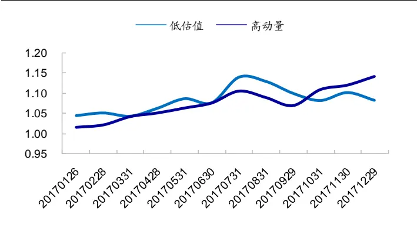
资料来源：Wind，海通证券研究所

图7 2021年，低估值与高动量因子的累计收益
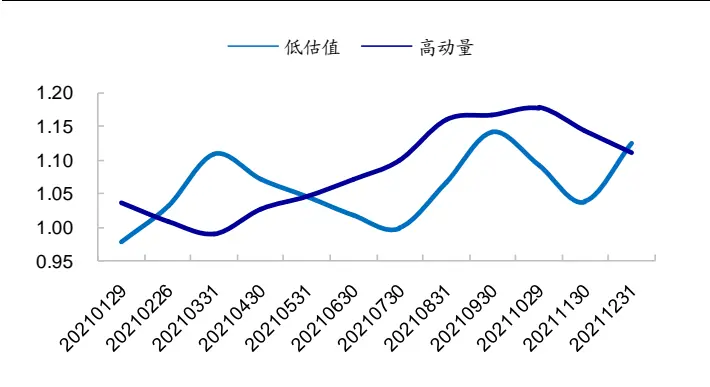
资料来源：Wind，海通证券研究所

具体来看，动量 beta 优选组合构建步骤如下所示：

- 动量基础池：过去 年累计收益为正的沪深 股。

多因子选股：采用 到 月累计收益、S 、预期净利润调整、累计研发占比、分析师覆盖度、PB_INT、低关注度（低波、低换手率等权得分）共 7个因子，进行标准化、市值正交处理后等权打分，选取复合因子得分最高的 100只股票构建等权/市值加权组合。

在上述所选因子中，绝大部分都为偏高增长类的基本面、预期因子，目的是希望对动量 beta 作一个增强和提升；此外还有 PB_INT、低关注度因子，这主要是为了剔除交投活跃、估值很高的股票，避免过度追高，在一定程度上降低组合风险。

图8 市值加权动量优选组合累计净值走势（2012.01-2024.02）
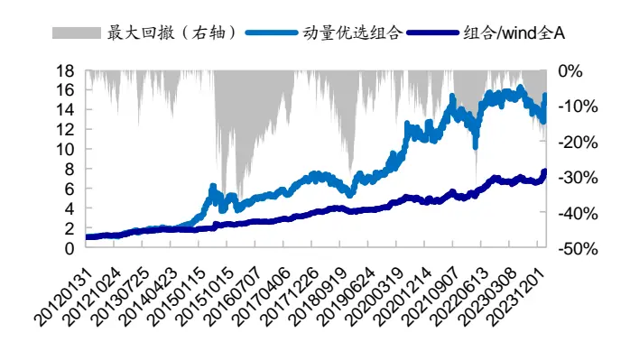
资料来源：Wind，海通证券研究所

图9 等权动量优选组合累计净值走势（2012.01-2024.02）
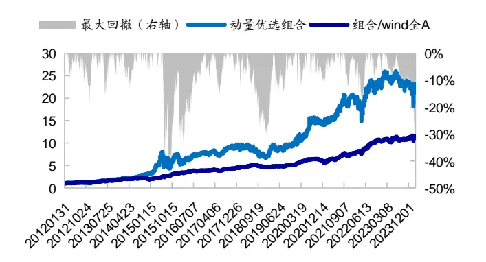
资料来源：Wind，海通证券研究所

月度调仓，扣除单边千 3 交易费用后，市值加权的动量优选组合 12 年以来年化收益 25.4%，而同期 wind全 A指数年化收益 5.9%，组合相对指数年超额 19.6%，年胜率100%，月胜率 69.0%。个股等权加权方式下，组合年化收益 29.5%，相对指数年超额23.6%，月胜率 71.0%。换手率上，市值加权组合、等权组合月均单边换手率分别为50.6%、50.1%。

表 10 动量优选组合历史业绩表现（2012.01-2024.02）

|  | 市值加权组合 |  |  | 等权组合 |  |  |
| --- | --- | --- | --- | --- | --- | --- |
|  | wind 全 A | 组合收益 超额收益 | 月胜率 | 组合收益 | 超额收益 | 月胜率 |
| 2012 | 1.4% | 24.9% | 23.5% | 66.7% | 18.7% 17.3% | 66.7% |
| 2013 | 5.4% | 47.3% 41.9% | 91.7% | 62.2% | 56.8% | 100.0% |
| 2014 | 52.4% | 52.5% | 0.1% 41.7% | 55.5% | 3.1% | 58.3% |
| 2015 | 38.5% | 82.8% | 44.3% 75.0% | 147.5% | 109.0% | 91.7% |
| 2016 | -12.9% | 0.5% | 13.4% | 83.3% 3.3% | 16.2% | 75.0% |
| 2017 | 4.9% | 36.5% | 31.6% | 83.3% 20.0% | 15.0% | 75.0% |
| 2018 | -28.3% | -23.6% | 4.6% | 58.3% | -24.9% 3.3% | 50.0% |
| 2019 | 33.0% | 48.4% | 15.4% | 75.0% | 45.3% 12.3% | 50.0% |
| 2020 | 25.6% | 40.4% | 14.8% | 50.0% | 43.2% 17.6% | 66.7% |
| 2021 | 9.2% | 22.2% | 13.0% | 58.3% | 45.1% 35.9% | 66.7% |
| 2022 | -18.7% | 6.7% | 25.3% | 66.7% | 9.4% 28.0% | 83.3% |
| 2023 | -5.2% | -4.8% | 0.4% | 66.7% | 2.3% 7.5% | 66.7% |
| 2024 | -4.1% | 11.4% | 15.6% | 100.0% | -2.5% 1.7% | 50.0% |
| 全区间 | 5.9% | 25.4% | 19.6% | 69.0% | 29.5% 23.6% | 71.0% |

资料来源：Wind，海通证券研究所

风格暴露上，下表展示了动量优选组合月收益率的 FF回归，其中市场以 wind全 A指数的月收益率反映。回归结果显示，在 3 个风格因子中，动量优选组合的动量暴露最高，即高动量 beta 属性明显。相较而言，市值加权组合在小市值、低估值上的暴露接近于 0；而等权组合除高动量外，还呈小市值特征，这也是 21-23 年期间，等权组合优于市值加权组合的主要原因。

表 11 动量优选组合月收益率的 FF 回归（2013.01-2024.02）

|  | 市值加权组合 |  |  | 等权组合 |  |  |
| --- | --- | --- | --- | --- | --- | --- |
|  | 系数 | t值 | p值 | 系数 | t值 | p值 |
| 截距项 | 1.20% | 4.81 | 0.000 | 1.09% | 4.84 | 0.000 |
| 市场 | 0.95 | 26.02 | 0.000 | 0.93 | 28.32 | 0.000 |
| 小市值 | -0.03 | -0.78 | 0.439 | 0.38 | 9.81 | 0.000 |
| 低估值 | -0.02 | -0.36 | 0.719 | -0.07 | -1.20 | 0.232 |
| 高动量 | 0.58 | 7.01 | 0.000 | 0.55 | 7.34 | 0.000 |

资料来源：Wind，海通证券研究所

市值分布上，我们将全 市值最小的 股票称为小盘股，市值最大的 股票成为大盘股，其余为中盘股（下同）。按照该定义方式，全 A范围内属于中盘股的个股占比 50%。图 11展示了等权动量优选组合 12 年以来的平均市值分布，并与市场等权组合进行了对比。可见，与市场等权组合相比，动量优选组合选出的个股在大盘、中盘中的占比更高，而在小盘中的占比相对偏低。时间序列角度，这种分布会随着前期市场风格的变化而发生波动（图 13）。但绝大部分时候，动量优选组合在小盘中的个股数占比都低于市场（30%）。

对于市值加权组合，我们也将动量优选的市值分布与全 A市值加权组合的市值分布进行了对比（图 10、图 12）。与全 A市值加权组合相比，动量优选组合在中盘上的配臵权重高于市场，而在小盘、大盘中的配臵比例小于市场，但整体两者的市值分布差异较小。

图10 市值加权动量优选组合平均市值分布（2012.01-2024.02）
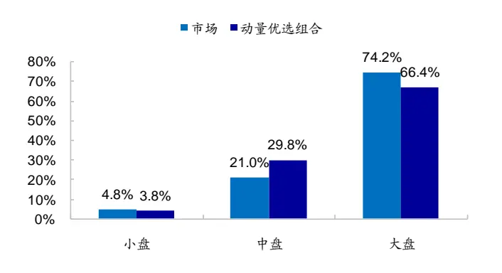
资料来源： ，海通证券研究所

图11 等权动量优选组合平均市值分布（2012.01-2024.02）
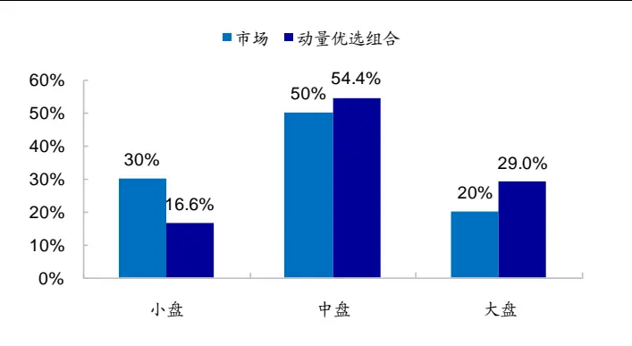
资料来源：Wind，海通证券研究所

图12 市值加权动量优选组合每期市值分布（2012.01-2024.02）
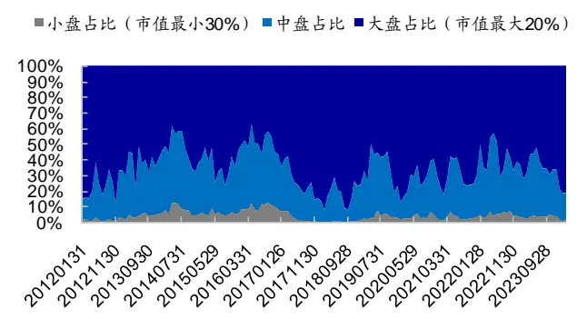
资料来源：Wind，海通证券研究所

图13 等权动量优选组合每期市值分布（2012.01-2024.02）
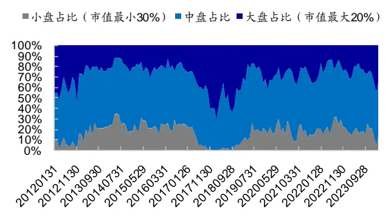
资料来源：Wind，海通证券研究所

行业分布上，动量优选组合平均每期分布于 22 个行业（图 14），等权组合 top1行业权重占比平均为 14.8%（图 15），top3 平均为 36.4%，top5 为 51.9%，行业集中度不算特别高。

图14 动量优选组合每期分布于多少个行业（2012.01-2024.02）
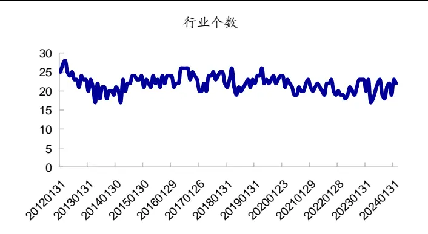
资料来源：Wind，海通证券研究所

图15 等权动量优选组合行业集中度（2012.01-2024.02）
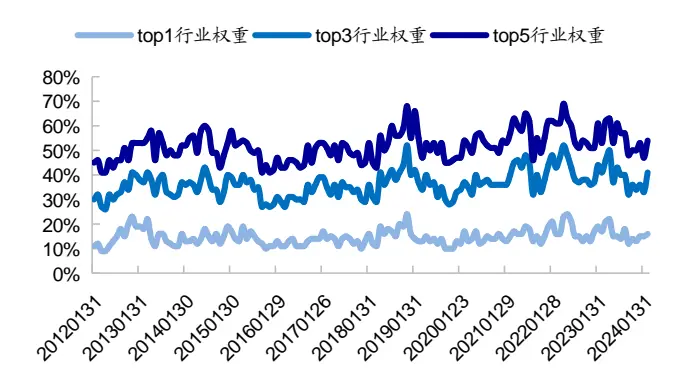
资料来源：Wind，海通证券研究所

根据组合持仓，将其相对于 全 指数的超额收益分解为行业选择贡献、个股选择贡献、与其他三部分，按照单利计算（即年化收益=月均收益*12）年超额，结果如下表所示。

表 12 动量优选组合相对 wind 全 A 指数的超额收益分解（2012.01-2024.02）

| 等权组合 | 市值加权组合 |
| --- | --- |
| 年化超额 17.4% | 21.4% |
| 行业选择贡献 | 7.0% 6.8% |
| 个股选择贡献 | 15.5% 19.4% |
| 其他 | -5.2% -4.8% |

资料来源： ，海通证券研究所
注：此处超额采用单利计算，即年化超额=月均超额*12

结果显示，组合超额收益主要来源于个股选择，行业选择贡献年化为 左右，而个股选择贡献年化均在 以上。且个股选择超额收益的稳定性更高，等权组合个股选择贡献为正的月度占比 77.9%，而行业选择贡献为正的月度占比仅 60.7%；市值加权组合个股选择贡献为正的月度占比 73.8%，而行业选择贡献为正的月度占比仅 64.1%。此外，交易贡献了年化 左右的负收益。

图16 市值加权动量优选组合累计超额收益分解（2012.01-2024.02)
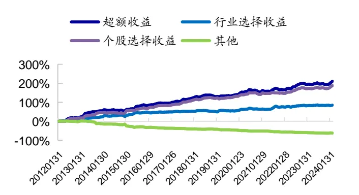
资料来源：Wind，海通证券研究所

图17 等权动量优选组合累计超额收益分解（2012.01-2024.02）
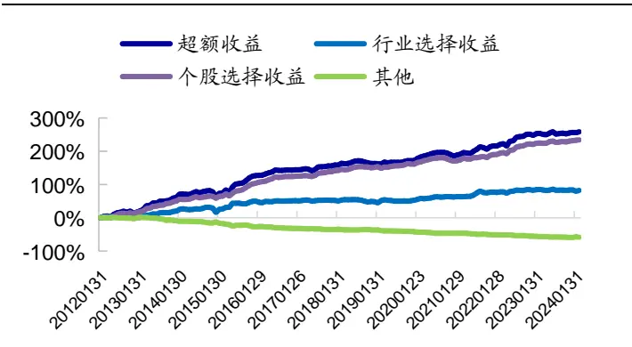
资料来源：Wind，海通证券研究所

时间序列上，根据第二部分统计结果，当市场动量减弱/wind全 A指数长、短期月均收益为负/因子拥挤情景出现后，动量 beta 表现不佳；而其他情景下，因子选股收益显著为正。我们按照同样的方式来判定当前所处情景，然后考察次月动量优选组合相较于 wind全 A指数的超额收益表现，结果如下表所示。

整体来看，动量优选组合叠加了其他有效选股因子，因此超额收益表现比单因子更为稳健。与单因子结论一致，在动量 beta 表现不佳情景出现后，组合业绩表现明显弱于其他情景；但超额收益并未出现反向，优选组合相对于 wind 全 A指数仍具有正超额。

表 13 不同情景下，动量优选组合相对 wind全 A指数的超额收益统计（2012.01-2024.02）

|  | 动量因子可能表现不佳情景 |  |  |  | 其他情景 |  |  |  | 全区间 |  |  |  |
| --- | --- | --- | --- | --- | --- | --- | --- | --- | --- | --- | --- | --- |
|  | 年化收 益 | 月胜率 | t值 | p值 | 年化收 益 | 月胜率 | t值 | p值 | 年化收 益 | 月胜率 | t值 | p值 |
| 市值加权 | 7.3% | 56.5% | 1.48 | 0.145 | 22.1% | 74.7% | 5.38 | 0.000 | 17.4% | 69.0% | 5.35 | 0.000 |
| 等权组合 | 13.6% | 63.0% | 1.68 | 0.099 | 25.0% | 74.7% | 6.13 | 0.000 | 21.4% | 71.0% | 5.64 | 0.000 |

资料来源：Wind，海通证券研究所注：年化收益是指月均超额

综上所述，在过去 1 年累计收益为正的股票池中，采用 t-11 到 t-5 月累计收益动量因子叠加其他偏增长类的基本面、预期因子增强收益，以及 PB_INT、低关注度因子降低风险，所构建的高动量 优选组合，动量暴露高，历史业绩表现优异，相对市场超额收益比单因子更为稳健。其中，市值加权组合相对 wind 全 A 指数年超额 19.6%，月胜率 69.0%；等权组合相对 wind 全 A 指数年超额 23.6%，月胜率 71.0%。

## 4. 增强动量因子——动量和反转的非线性调整

如第一部分所述，若不进行因子择时判断，则 05 年以来，全区间来看，累计收益动量因子的选股收益并不显著。年化多头收益 1.2%，月均 IC 不足 1%。本节我们从 alpha因子角度出发，尝试利用短期反转对动量因子进行调整和改进。

## 4.1利用股票近期表现调整动量因子

结合动量因子与短期反转效应，意味着同等动量因子得分的股票，近 1 个月涨幅越高，未来动量延续的可能性越小。基于此，我们将初始动量因子，乘以股票 t 月超额收益在其过去 1年月超额收益中的分位点，来调整动量因子；以使得同等初始动量的股票，近期涨幅越高，调整后的因子值越低。

需要注意的是，由于动量因子的方向有正有负，为保证动量方向的延续，我们对动量因子为正、和为负的股票分开进行处理。具体来看：

- 若初始动量因子为正，则乘以 t 月超额收益在过去 1 年的降序分位点。即同等初始动量的股票，当月超额越高，乘以的分位点越小，调整动量因子值越低。

若初始动量因子为负，则乘以 t 月超额收益在过去 1 年的升序分位点。即当月超额越高，乘以的分位点数值越高；由于初始因子方向为负，则调整之后动量因子值越低。

值得提及的一点是，前文这种短期反转的调整方式与动量、反转因子的简单线性结合并不完全一样。举例来看，若股票 i 的反转因子得分排名前 10%，而动量因子为负，得分排名靠后，为 60%，若简单线性加总反转因子与动量因子得分，则股票的综合得分为（ ） ，属于综合得分排名靠前的股票。但按照前文所述方式调整，则由于动量因子为负，即使乘以一个较小的分位点调整值，因子值仍为负，是负的动量，排名相对靠后，偏因子空头部分。

此外，初始动量因子我们采用的是，[t-11,t-5]期间股票相对市场周超额收益的均值/超额波动率。相对而言，波动率调整后的动量因子表现较优。

## 4.2增强动量因子的选股效果

2005.01-2024.02 期间，增强动量因子分 10 组年化多头收益 6.3%，空头收益-7.2%，年化多空收益 13.5%，月胜率 62.2%；因子月均 IC 为 2.6%，月胜率 60.0%，统计显著。与原始动量因子相比，各项因子表现指标均有所改善。

图18 增强动量因子分组收益（2005.01-2024.02）
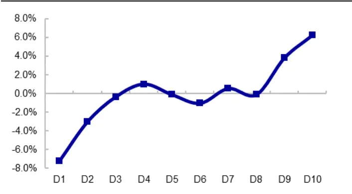
资料来源：Wind，海通证券研究所

图19 增强动量因子累计多空收益（2005.01-2024.02）
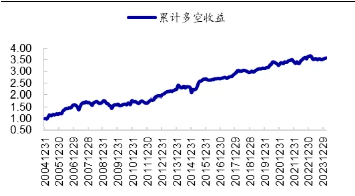
资料来源：Wind，海通证券研究所

表 14 增强动量因子的历史业绩表现（2005.01-2024.02）

|  | 年收益/月均IC | 月胜率 | t值/ICIR | p值 |
| --- | --- | --- | --- | --- |
| 多头组合 | 6.3% | 57.0% | 2.80 | 0.005 |
| 空头组合 | -7.2% | 35.7% | -3.98 | 0.000 |
| 多空收益 | 13.5% | 62.2% | 3.63 | 0.000 |
| IC | 2.6% | 60.0% | 1.00 | 0.001 |
| RanklC | 2.7% | 57.8% | 0.95 | 0.001 |

资料来源：Wind，海通证券研究所

分阶段来看，我们同样按照第二部分的场景划分，考察增强动量因子在特定情景触发后一个月的业绩表现，结果如下表所示。与原动量因子相比，增强动量因子在不适合动量的情景下，回撤相对较小；而在其它情景下，多头收益、IC 均值都更高，且稳定性更高，月胜率、ICIR 均相对更优。

表 15 不同情景下，增强动量因子的表现（2005.01-2024.02）

|  | 市场动能减弱/指数长、短期月均收益为负/因子拥挤 |  |  |  | 其他情景 |  |  |  |
| --- | --- | --- | --- | --- | --- | --- | --- | --- |
|  | 年收益 | 月胜率 | t值 | p值 | 年收益 | 月胜率 | t值 | p值 |
| 高动量组合 | -5.7% | 42.9% | -1.51 | 0.135 | 13.2% | 64.8% | 5.00 | 0.000 |
| 低动量组合 | 0.6% | 47.6% | 0.20 | 0.842 | -11.8% | 28.3% | -5.56 | 0.000 |
| 高动量-低动量 | -6.3% | 48.8% | -1.00 | 0.318 | 25.0% | 69.7% | 5.76 | 0.000 |
| IC | -0.017 | 50.0% | -1.50 | 0.139 | 0.051 | 66.2% | 5.65 | 0.000 |
| RankIC | -0.023 | 44.0% | -1.79 | 0.077 | 0.057 | 65.5% | 5.70 | 0.000 |
| 样本数 | 84 | 36.7% |  |  | 145 | 63.3% |  |  |

资料来源：Wind，海通证券研究所

分年度来看，如下图所示，绝大部分年份，增强动量因子的月均 IC 均高于初始动量因子，年胜率 90%。

图20 增强动量因子分年度月均 IC（2005.01-2024.02）
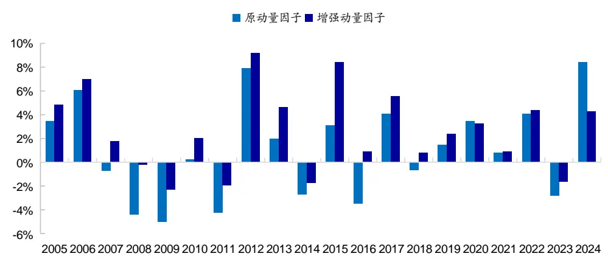
资料来源：Wind，海通证券研究所

下表展示了在沪深 300、中证 500 指数成分股内，增强动量因子分 10 组的多空收益及 IC 表现。在沪深 300 指数成分股内，增强动量因子月均 IC 为 3.9%，年化多空收益 13.3%，统计显著。在中证 500 指数成分股内，增强动量因子月均 IC为 2.4%，年化多空收益 11.1%，统计显著。

表 16 指数成分股内，增强动量因子的业绩表现（2005.01-2024.02）

| 沪深 300 指数成分股 |  |  |  | 中证 500 指数成分股 |  |  |  |
| --- | --- | --- | --- | --- | --- | --- | --- |
|  | 年收益/月均IC 月胜率 | t值 | p值 | 年收益/月均IC | 月胜率 | t值 | p值 |
| 多头收益 | 8.7% | 57.4% | 2.85 | 0.005 | 5.5% | 55.2% 2.08 | 0.039 |
| 空头收益 | -4.6% | 40.4% | -1.70 | 0.091 | -5.6% | 42.2% -2.58 | 0.010 |
| 多空收益 | 13.3% | 59.6% | 2.58 | 0.010 | 11.1% 57.8% | 2.58 | 0.010 |
| IC | 3.9% | 57.0% | 3.37 | 0.001 | 2.4% 54.8% | 2.69 | 0.008 |
| RankIC | 4.2% | 55.7% | 3.34 | 0.001 | 2.7% | 54.3% 2.75 | 0.006 |

资料来源：Wind，海通证券研究所

为剔除其它因子的影响，我们将增强动量因子对市值、估值、月累计收益率（反转因子）、波动率、换手率、ROE、SUE、预期净利润调整因子进行正交处理，下表展示正交因子的选股收益表现。需要注意的是，由于预期因子早期覆盖度相对较低，因此正交因子的表现我们考察的时间区间为 2012.01-2024.02。整体来看，正交后因子稳定性有所提升，月胜率增加，但月均 IC 有所下滑。正交后，因子月均 IC 为 2.4%，月胜率67.6%，ICIR 为 1.16，统计显著。

表 17 正交增强动量因子的选股收益表现（2012.01-2024.02）

| 增强动量因子 |  |  |  |  | 正交后的增强动量因子 |  |  |  |
| --- | --- | --- | --- | --- | --- | --- | --- | --- |
|  | 年收益/月均IC | 月胜率 | t值/ICIR | p值 | 年收益/月均IC | 月胜率 | t值/ICIR | p值 |
| 多头收益 | 7.5% | 58.6% | 2.85 | 0.005 | 5.7% | 59.3% | 2.87 | 0.005 |
| 空头收益 | -7.8% | 33.1% | -3.51 | 0.001 | -8.3% | 26.2% | -4.65 | 0.000 |
| 多空收益 | 15.3% | 65.5% | 3.42 | 0.001 | 14.0% | 67.6% | 4.04 | 0.000 |
| IC | 3.0% | 64.1% | 1.00 | 0.001 | 2.4% | 67.6% | 1.16 | 0.000 |
| RankIC | 3.2% | 60.0% | 0.92 | 0.002 | 2.6% | 66.2% | 1.08 | 0.000 |

资料来源：Wind，海通证券研究所

## 4.3增强动量因子的行业轮动效果

我们采用个股中位数的方式汇总行业动量因子，将行业因子得分最高的 5个行业（中信一级行业）等权组合记为高动量组合，得分最低的 5个行业记为低动量组合，考察其相对 30个中信一级行业等权组合（基准）的业绩表现，结果如下表所示。

表 18 增强动量因子的行业轮动效果（2005.01-2024.02）

|  |  | 动量因子表现不佳情景 |  |  |  | 其他情景 |  |  |  | 全区间 |  |  |  |
| --- | --- | --- | --- | --- | --- | --- | --- | --- | --- | --- | --- | --- | --- |
|  |  | 收益率 | 月胜率 | t值 | p值 | 收益率 | 月胜率 | t值 | p值 | 收益率 | 月胜率 | t值 | p值 |
| 2005.01 | 高动量组合 | -10.8% | 38.1% | -2.20 | 0.031 | 12.0% | 64.8% | 4.60 | 0.000 | 3.7% | 55.0% | 1.44 | 0.151 |
|  | 低动量组合 | 7.6% | 54.8% | 1.46 | 0.148 | -7.5% | 38.6% | -2.51 | 0.013 | -1.9% | 44.5% | -0.72 | 0.475 |
| 2024.02 | 高动量-低动量 | -18.3% | 39.3% | -2.05 | 0.043 | 19.5% | 66.9% | 4.05 | 0.000 | 5.6% | 56.8% | 1.21 | 0.226 |
|  | 高动量组合 | -8.7% | 43.5% | -1.38 | 0.175 | 12.3% | 65.0% | 3.97 | 0.000 | 5.7% | 58.2% | 1.89 | 0.060 |
| 2012.01 2024.02 | 低动量组合 | 4.4% | 52.2% | 0.56 | 0.579 | -7.4% | 38.0% | -2.23 | 0.028 | -3.6% | 42.5% | -1.07 | 0.285 |
|  | 高动量-低动量 | -13.1% | 45.7% | -1.03 | 0.308 | 19.7% | 64.0% | 3.52 | 0.001 | 9.3% | 58.2% | 1.65 | 0.101 |

资料来源：Wind，海通证券研究所

2005.01-2024.02 期间，高动量行业组合相对基准年化超额 3.7%，低动量组合相对基准年化超额-1.9%，虽然年化多空收益超过 5%，但稳定性较差，统计不显著。

时间序列角度，我们按照第二部分的情景划分，考察不同情景下行业动量因子的表现发现，若出现市场动量减弱/wind 全 A指数长、短期月均收益为负/因子拥挤情景，则动量不佳，行业指数整体呈反转效应，即高动量组别超额为负，而低动量组别超额为正。而未触发上述 3种情景时，行业动量效应显著。高动量组别年超额 12.0%，低动量组合年超额-7.5%，因子年化多空收益 19.5%，月胜率 66.9%，统计显著。

图21 行业动量因子累计多空收益（2005.01-2024.02）
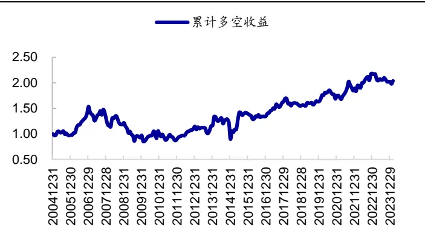
资料来源：Wind，海通证券研究所

图22 行业动量因子累计多空收益（2005.01-2024.02，择时后）
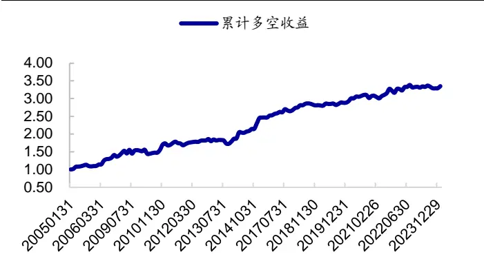
资料来源：Wind，海通证券研究所

## 4.4 小结

本部分我们结合短期反转现象，构建了增强动量因子。相较于简单动量因子，该因子具有较优的业绩表现。2005.01-2024.02 期间，全市场范围内，因子分 10 组年化多头收益 6.3%，空头收益-7.2%，月均 IC为 2.6%，统计显著。与原始动量因子相比，增强动量因子在本文第二部分定义的动量因子表现不佳情景下，回撤相对较小；而在适合动量因子情景下，稳定性更高，多空收益更明显。

## 5. 总结

本文主要对动量因子作了一个大体框架性的研究，包括回看窗口选择、动量 beta 分析、以及动量 alpha 因子构建。在 beta 分析上，我们一方面从时序角度考察了在哪些情景下，动量因子表现不佳；另一方面构建了一个动量 beta 属性高的量化组合。Alpha 因子上，我们尝试利用短期反转对动量因子进行调整和改进。

回看窗口。综合在其他风格因子暴露较低、FF3 alpha 较高这两方面的特征，采用t-11 到 t-5 月的累计涨幅所构建的动量因子相对更具优势。因此本文所分析的动量因子也主要基于该回看窗口期。

动量因子在什么环境下更容易失效？动量因子的表现在一定程度上依赖市场动量，若市场动能减弱，则后期因子表现相对较差。另外，若市场长、短期月均收益为负，投资者情绪相对较为谨慎，后期高动量组合的延续性也较弱。此外，当动量因子达到较高拥挤度后，具有较高概率发生回撤。

在本文划分的市场动能减弱、指数长短期月均收益为负、因子拥挤 种情景发生后的一个月，动量因子失效可能性高。动量因子有效（多空收益为正）的月度占比仅 28.6%，年化多空收益-22.6%，即呈较明显的反转效应。而在上述 3 种情景未触发时，动量因子表现突出。年化多空收益高达 22.7%，月均 IC 4.2%，统计显著。

高动量 beta 优选组合。在过去 1年累计收益为正的股票池中，采用 t-11到 t-5 月累计收益动量因子叠加其他偏增长类的基本面、预期因子增强收益，以及 PB_INT、低关注度因子降低风险，所构建的高动量 beta 优选组合，动量暴露高，历史业绩表现优异，相对市场超额收益比单因子更为稳健。其中，市值加权组合相对 wind全 A指数年超额19.6%，月胜率 69.0%；等权组合相对 wind 全 A 指数年超额 23.6%，月胜率 71.0%。

增强动量因子。我们结合短期反转现象，构建了增强动量因子。相较于简单动量因子，该因子具有较优的业绩表现。2005.01-2024.02 期间，全市场范围内，因子分 10 组年化多头收益 6.3%，空头收益-7.2%，月均 IC 为 2.6%，统计显著。与原始动量因子相比，增强动量因子在本文划分的动量因子表现不佳情景下，回撤相对较小；而在适合动量因子情景下，稳定性更高，多空收益更为明显。

## 6. 风险提示

本报告的分析均基于历史数据统计结果，不构成任何投资建议；当市场环境发生变化时，可能存在历史统计规律失效风险、因子失效风险；统计假设或与实际情况存在差异。

# 信息披露

分析师声明

[Table郑雅斌yst金融工程研究团队s]

罗蕾金融工程研究团队

本人具有中国证券业协会授予的证券投资咨询执业资格，以勤勉的职业态度，独立、客观地出具本报告。本报告所采用的数据和信息均来自市场公开信息，本人不保证该等信息的准确性或完整性。分析逻辑基于作者的职业理解，清晰准确地反映了作者的研究观点，结论不受任何第三方的授意或影响，特此声明。

## 法律声明

本报告仅供海通证券股份有限公司（以下简称“本公司”）的客户使用。本公司不会因接收人收到本报告而视其为客户。在任何情况下，本报告中的信息或所表述的意见并不构成对任何人的投资建议。在任何情况下，本公司不对任何人因使用本报告中的任何内容所引致的任何损失负任何责任。

本报告所载的资料、意见及推测仅反映本公司于发布本报告当日的判断，本报告所指的证券或投资标的的价格、价值及投资收入可能会波动。在不同时期，本公司可发出与本报告所载资料、意见及推测不一致的报告。

市场有风险，投资需谨慎。本报告所载的信息、材料及结论只提供特定客户作参考，不构成投资建议，也没有考虑到个别客户特殊的投资目标、财务状况或需要。客户应考虑本报告中的任何意见或建议是否符合其特定状况。在法律许可的情况下，海通证券及其所属关联机构可能会持有报告中提到的公司所发行的证券并进行交易，还可能为这些公司提供投资银行服务或其他服务。

本报告仅向特定客户传送，未经海通证券研究所书面授权，本研究报告的任何部分均不得以任何方式制作任何形式的拷贝、复印件或复制品，或再次分发给任何其他人，或以任何侵犯本公司版权的其他方式使用。所有本报告中使用的商标、服务标记及标记均为本公司的商标、服务标记及标记。如欲引用或转载本文内容，务必联络海通证券研究所并获得许可，并需注明出处为海通证券研究所，且不得对本文进行有悖原意的引用和删改。

根据中国证监会核发的经营证券业务许可，海通证券股份有限公司的经营范围包括证券投资咨询业务。