## [Tab相关研究

[Table_ReportInfo]《大类资产与中观配臵研究（一）——宏观+量价大小盘双驱轮动策略》

2024.04.22

《选股因子系列（九十六）——动量的择时、优选与 因子构建》

2024.04.22

《大类资产配臵及模型研究（十二）——主权财富基金（ ）的挪威模式：深度透视 GPFG 的主动管理之路》2024.03.04

分析师:郑雅斌

Tel:(021)23219395

Email:zhengyb@haitong.com

证书:S0850511040004

分析师:袁林青

Tel:(021)23185659

Email:ylq9619@haitong.com

证书:S0850516050003

联系人:马毓婕

Tel:(021)23183939

Email:myj15669@haitong.com

# 选股因子系列研究（九十七）——使用图神经网络融合量价信息与基本面信息

## 投资要点：

在系列前期报告中，我们讨论了使用深度学习模型挖掘不同颗粒度量价数据中包含的信息。然而，在使用深度学习模型融合基本面信息与量价信息时，我们遇到了一定的阻碍。简单将基本面信息与量价信息共同作为模型输入特征难以取得理想的效果。因此，本文进一步考虑使用二次加权以及图神经网络两种方式帮助模型更好地融合基本面信息。

可使用深度学习模型提取基本面信息，但是简单将基本面特征与量价特征共同输入模型无法取得理想效果。深度学习基本面因子在不同的预测周期上皆呈现出了一定的选股能力，因子周均 Rank IC 约 0.039，因子月均 Rank IC 约 0.067，Top10%组合超额收益约为 10%。在仅输入基本面特征时，模型能够较好地学习到基本面信息，深度学习基本面因子与 BP、EP、盈利、成长以及 SUE 皆呈现出了极强的相关性。然而，当同时输入基本面特征与量价特征时，模型学习到的基本面信息却较为有限。相比于深度学习量价因子，深度学习复合因子与基本面类因子之间的相关性仅出现了小幅提升。

- 通过二次加权可帮助模型学习到基本面信息，但是模型在 年年初表现依旧欠佳。二次加权模型同样呈现出了较为显著的周度选股能力。模型周均达 0.133，Top10%组合费前年化多头超额收益达 32.1%。分年度来看，二次加权模型虽然在 年以及 年跑输基准模型，但是在 年、 年以及 2024 年皆优于基准模型。二次加权模型与基准模型类似，整体偏小盘、价值、反转、低波与低流动性。然而，二次加权模型在盈利、增长以及 SUE 等基本面因子上呈现出了更加明显的正相关性。

- 引入图神经网络模块后，模型整体表现更好。BiAGRU-GAT 模型同样呈现出了较为显著的周度选股能力。模型周均Rank IC达0.141，年化多头超额收益达32.9%。BiAGRU-GAT 模型虽然在 2019 年、2020 年、2022 年以及 2023 年弱于基准模型，但是在 2017 年、2018 年、2021 年以及 2024 年取得了更好的收益表现。相比于基准模型，BiAGRU-GAT 模型在 2024 年超额回撤明显更小，超额收益表现更加稳定。

- AI增强组合：BiAGRU-GAT模型全市场中证500增强组合年化超额收益17.2%，超额最大回撤 5.6%，发生在 2024 年。2024 年以来，组合取得了 4.2%的超额收益，组合最大回撤明显低于基准模型。BiAGRU-GAT 模型全市场中证 1000 增强组合年化超额收益 24.1%，超额最大回撤 5.0%，发生在 2021 年。2024 年以来组合超额最大回撤为 2.5%。

- 风险提示。市场系统性风险、资产流动性风险、政策变动风险、因子失效风险。

在系列前期报告中，我们讨论了使用深度学习模型挖掘不同颗粒度量价数据中包含的信息。然而，在使用深度学习模型结合基本面信息与量价信息时，我们遇到了一定的阻碍。简单将基本面信息与量价信息共同输入模型难以取得理想的结果。因此，本文进一步考虑使用二次加权以及图神经网络两种方式帮助模型更好地学习基本面信息。测试结果表明，BiAGRU-GAT 模型更好地融合了两类信息，并在 2024 年呈现出了更好的业绩表现。

## 1. 使用简单深度学习模型融合基本面信息

在前期专题报告中，我们使用了不同的深度学习网络架构学习了不同颗粒度的量价信息。测试结果表明，因子在历史上呈现出了较强的选股能力。值得注意的是，由于模型输入皆为量价特征，模型难以学习到基本面信息。由于基本面信息与量价信息低相关，可考虑将基本面特征输入模型从而为模型提供增量信息。那么，基于基本面特征能否提取出有效的选股因子？简单将基本面特征与量价特征共同输入模型能否提升因子表现？本章将尝试通过一系列测试回答上述问题。

为了测试基本面特征的选股能力，我们不妨单纯使用股票历史 12 个季度的基本面特征作为模型输入训练深度学习因子。考虑到输入特征序列长度较短，本节选取了GRU+MLP的网络架构。除了单纯使用基本面特征训练模型外，还可考虑将基本面特征与量价特征共同输入模型进行训练。通过考察该因子的表现，我们可测试深度学习模型融合量价信息与基本面信息的能力。

在训练标签、模型训练设定上，我们延续了系列前期报告《选股因子系列研究（九十三）——深度学习因子的“模型动物园”》中的设定。需要说明的是，将量价模型的训练设臵简单移植到输入全部为基本面特征的模型上并不严谨。由于基本面信息更新频率较低，在模型采样频率较高的情况下，可能会出现输入特征一致，但是标签不同的情况。不过，由于本节测试主要是为了初步测试基本面信息的选股能力，我们并未对这一问题进行针对性调整。下表展示了深度学习基本面因子以及深度学习复合因子的选股能力。

表 1 深度学习因子选股能力（2017.01-2024.04）

| 调仓间隔 | 因子名称 | Rank IC |  | Top10%超额 |  | Top100 超额 |  |
| --- | --- | --- | --- | --- | --- | --- | --- |
|  |  | TO 收盘 | T1 均价 | 费前 | 费后 | 费前 | 费后 |
| 5日 | 深度学习量价因子 | 0.139 | 0.129 | 32.6% | 24.5% | 38.3% | 27.4% |
|  | 深度学习基本面因子 | 0.039 | 0.040 | 10.4% | 9.3% | 14.2% | 12.9% |
|  | 深度学习复合因子 | 0.140 | 0.130 | 32.2% | 24.2% | 35.6% | 25.2% |
| 10日 | 深度学习量价因子 | 0.161 | 0.150 | 26.2% | 21.3% | 29.8% | 23.5% |
|  | 深度学习基本面因子 | 0.049 | 0.049 | 11.0% | 10.0% | 14.0% | 12.8% |
|  | 深度学习复合因子 | 0.162 | 0.152 | 26.1% | 21.3% | 28.8% | 22.7% |
| 15日 | 深度学习量价因子 | 0.165 | 0.158 | 23.1% | 19.5% | 24.9% | 20.4% |
|  | 深度学习基本面因子 | 0.054 | 0.055 | 10.4% | 9.5% | 14.3% | 13.2% |
|  | 深度学习复合因子 | 0.167 | 0.161 | 23.0% | 19.5% | 23.0% | 18.7% |
| 20日 | 深度学习量价因子 | 0.167 | 0.157 | 18.7% | 16.0% | 19.8% | 16.5% |
|  | 深度学习基本面因子 | 0.067 | 0.067 | 10.8% | 9.9% | 13.2% | 12.2% |
|  | 深度学习复合因子 | 0.172 | 0.163 | 19.3% | 16.6% | 20.7% | 17.4% |

资料来源： ，海通证券研究所

不难发现，深度学习基本面因子在不同的预测周期上皆呈现出了一定的选股能力，因子周均 Rank IC 约 0.039，因子月均 Rank IC 约 0.067，Top10%组合超额收益约 10%。上述测试结果表明，基于基本面特征，可通过深度学习模型提取得到有效的选股因子。进一步观察深度学习复合因子可知，因子在不同周期上同样呈现出了极强的选股能力，因子表现略好于深度学习量价因子。

下表进一步展示了因子与常规因子之间的相关性。在仅输入基本面特征时，模型能够较好地学习到基本面信息，深度学习基本面因子与 BP、EP、盈利、成长以及 SUE皆呈现出了极强的相关性。然而，当同时输入基本面特征与量价特征时，模型学习到的基本面信息却较为有限。相比于深度学习量价因子，深度学习复合因子与基本面类因子之间的相关性仅出现了小幅提升。

表 2 深度学习基本面因子相关性对比（2017.01-2024.04）

|  | 深度学习量价因子 | 深度学习基本面因子 | 深度学习复合因子 |
| --- | --- | --- | --- |
| 市值 | -0.25 | 0.00 | -0.26 |
| 中盘 | -0.24 | -0.06 | -0.25 |
| BP | 0.22 | 0.33 | 0.21 |
| EP | 0.08 | 0.34 | 0.10 |
| 1个月动量 | -0.23 | 0.09 | -0.23 |
| 流动性 | 0.37 | 0.02 | 0.39 |
| 波动率 | -0.43 | -0.21 | -0.43 |
| 盈利 | -0.06 | 0.23 | 0.00 |
| 成长 | -0.05 | 0.29 | 0.03 |
| SUE | -0.06 | 0.28 | 0.03 |

资料来源： ，海通证券研究所

上述测试结果表明，基于基本面信息，可使用深度学习模型生成有效的选股因子。然而，在模型已使用量价特征时，简单添加基本面特征难以让模型较好地学习到基本面信息。基于这一结果，后文分别尝试通过二次加权以及图神经网络的方式让模型更好地融合量价信息与基本面信息。

## 2. 使用二次加权模型融合基本面信息

由于将基本面特征与量价特征共同输入模型训练得到的因子并不理想，可考虑使用深度学习模型训练量价因子并与现有的基本面因子进行二次加权，从而在形成终端因子时明确引入基本面信息。

基于这一思路，本章首先使用日颗粒度量价特征输入 BiAGRU 模型并叠加正交层输出 32 个相互正交的因子，其次使用这 32个深度学习量价因子与现有的基本面因子进行二次加权并得到终端因子。为了能够更好地融合量价因子与基本面因子，本节采用了XGBOOST 模型。当然，投资者也可根据自身需求选择使用其他线性或者非线性加权模型。

图1 二次加权模型流程示意图
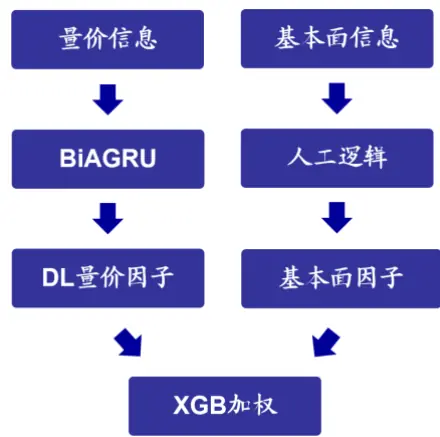
资料来源：海通证券研究所

下表对比展示了基准模型与二次加权模型的周度选股能力。其中，基准模型仅使用日颗粒度量价特征进行模型训练，二次加权模型在使用日度量价特征的同时还在二次加权阶段使用了基本面因子。

表 3 二次加权模型周度选股能力（2017.01-2024.04）

|  | Rank IC |  | Top10%超额 |  | Top100 超额 |  | 因子值 自相关性 | Top10% 年化双边换手 |
| --- | --- | --- | --- | --- | --- | --- | --- | --- |
|  | TO 收盘 | T1 均价 | 费前 | 费后 | 费前 | 费后 |  |  |
| 基准模型 | 0.140 | 0.129 | 32.6% | 24.5% | 38.0% | 27.1% | 0.74 | 42倍 |
| 二次加权模型 | 0.133 | 0.122 | 32.1% | 22.2% | 38.1% | 25.0% | 0.67 | 52 倍 |

资料来源：Wind，海通证券研究所

对比测试表明，二次加权模型同样呈现出了较为显著的周度选股能力。模型周均Rank IC 达 0.133，Top10%组合费前年化多头超额收益达 32.1%。值得注意的是，在进行二次加权后，模型呈现出了更高的换手，因子 Top10%组合年化双边换手从 42 倍提升至 52 倍。下图对比展示了两模型与常规因子的截面相关性。

图2 二 次 加 权 模 型 与 风 格 、 量 价 因 子 截 面 相 关 性（2017.01-2024.04）
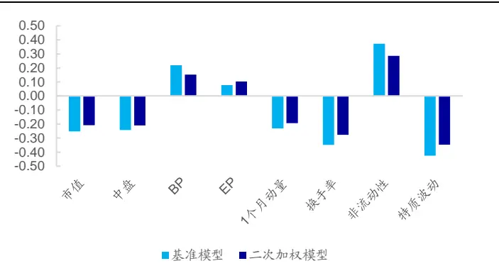
资料来源：Wind，海通证券研究所

图3 二 次 加 权 模 型 与 基 本 面 因 子 截 面 相 关 性（2017.01-2024.04）
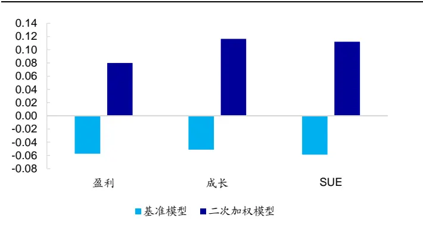
资料来源：Wind，海通证券研究所

观察上图可知，二次加权模型与基准模型类似，整体偏小盘、价值、反转、低波与低流动性。然而，二次加权模型与盈利、成长以及 SUE等基本面因子呈现出了更高的相关性。通过二次加权，模型的确学习到了更多基本面信息。下表对比展示了两因子Top10%组合分年度多头超额收益。分年度来看，二次加权模型虽然在 2022 年以及 2023年跑输基准模型，但是在 年、 年以及 年皆优于基准模型。

表 4 二次加权模型分年度多头超额收益（2017.01-2024.04）

| 组合名称 | 名称 | 2017 | 2018 | 2019 | 2020 | 2021 | 2022 | 2023 | 2024 | 全区间 |
| --- | --- | --- | --- | --- | --- | --- | --- | --- | --- | --- |
| Top10%组合 | 基准模型 | 27.7% | 48.6% | 39.7% | 26.3% | 27.7% | 40.7% | 28.4% | -0.7% | 32.6% |
|  | 二次加权模型 | 24.0% | 48.0% | 42.1% | 35.0% | 27.7% | 29.9% | 24.3% | 4.2% | 32.1% |
| Top100 组合 | 基准模型 | 35.2% | 68.1% | 46.2% | 20.3% | 31.1% | 51.3% | 35.4% | -6.8% | 38.0% |
|  | 二次加权模型 | 30.4% | 66.7% | 48.7% | 34.0% | 30.1% | 37.3% | 28.5% | 2.8% | 38.1% |

资料来源： ，海通证券研究所

下图对比展示了两模型极值组合在 2024 年以来的多头超额净值走势。二次加权模型虽然在 2024 年以来取得了更高的多头超额收益，但是模型依旧在 2024 年 1 月底至 2月初之间出现了大幅回撤，回撤幅度与基准模型较为接近。二次加权模型仅在后续的超额修复中取得了更好的表现。虽然二次加权模型能更加明确地让模型学习基本面信息，但是量价类因子在 至 年间的强势表现依旧会使得模型在 年年底进行迭代时更加关注量价信息。

图4 二次加权模型 Top10%组合超额净值走势（2024.01-2024.04）
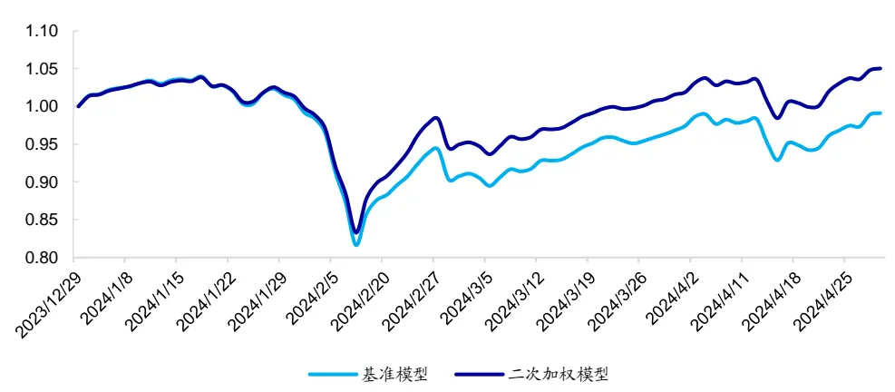
资料来源： ，海通证券研究所

## 3. 使用图神经网络融合基本面信息

除了将两类特征共同输入模型或者进行二次加权外，是否还有其他的方式学习基本面信息呢？考虑到股票的基本面信息是季度披露，信息变化较慢，我们可将其转化为股票之间的关联关系，并通过图神经网络进行学习。

图神经网络（Graph Neural Networks, GNN）是专门设计用于处理和分析图结构数据的神经网络。在现实世界中，大量数据天然地以图的形式存在，比如社交网络中的用户关系、化学分子结构、网页链接或者知识图谱等。GNN 的核心优势在于它能够捕捉并利用图数据中节点间的复杂关系和结构特征。

在各类图神经网络中，本文选取了图注意力网络（Graph Attention Networks, GAT）作为基本面信息模块的核心模型。GAT 的设计灵感来源于自然语言处理领域的注意力机制，该机制允许模型在处理输入信息时，动态地给不同的输入分配不同的权重，从而更有效地聚焦于关键信息。考虑到并非所有基本面关联较高的股票短期收益表现都较为类似，我们希望通过 GAT 动态调节高基本面关联股票对于个股打分的影响。

不同于二次加权模型，基于股票基本面特征构建得到的关联信息，图神经网络模型会对于量价模块提取得到的结果进行二次修正，使得每个股票的打分不仅取决于自身的量价信息还取决于基本面关联性较强的股票的量价信息。

图5 图神经网络模型流程示意图
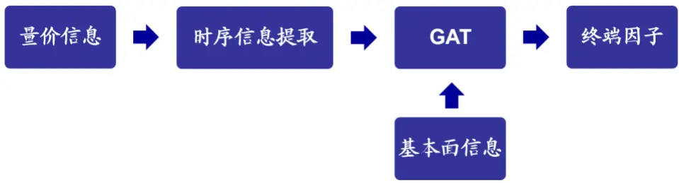
资料来源：海通证券研究所

为了对比的便利，本文使用 BiAGRU 进行时序信息提取，后文将该模型统一简称为BiAGRU-GAT 模型。下表对比展示了 BiAGRU-GAT 模型的周度选股能力。

表 5 BiAGRU-GAT 模型周度选股能力（2017.01-2024.04）

|  | Rank IC |  | Top10%超额 |  | Top100 超额 |  | 因子值 自相关性 | Top10% 年化双边换手 |
| --- | --- | --- | --- | --- | --- | --- | --- | --- |
|  | TO 收盘 | T1 均价 | 费前 | 费后 | 费前 | 费后 |  |  |
| 基准模型 | 0.140 | 0.129 | 32.6% | 24.5% | 38.0% | 27.1% | 0.74 | 42倍 |
| BiAGRU-GAT | 0.141 | 0.129 | 32.9% | 23.9% | 39.8% | 27.7% | 0.74 | 47倍 |

资料来源：Wind，海通证券研究所

测试结果表明，BiAGRU-GAT 模型同样呈现出了较为显著的周度选股能力。模型周均 Rank IC达 0.141，年化多头超额收益达 32.9%。此外，模型换手并未出现明显变化，Top10%组合年化换手率从 42 倍小幅提升至 47 倍。下表对比展示了模型极值组合的分年度多头超额收益。

表 6 BiAGRU-GAT 模型分年度多头超额收益（2017.01-2024.04）

| 组合名称 | 名称 | 2017 | 2018 | 2019 | 2020 | 2021 | 2022 | 2023 | 2024 | 全区间 |
| --- | --- | --- | --- | --- | --- | --- | --- | --- | --- | --- |
| Top10%组合 | 基准模型 | 27.7% | 48.6% | 39.7% | 26.3% | 27.7% | 40.7% | 28.4% | -0.7% | 32.6% |
|  | BiAGRU-GAT | 32.4% | 50.9% | 31.3% | 23.4% | 28.7% | 30.1% | 24.8% | 12.0% | 32.9% |
| Top100 组合 | 基准模型 | 35.2% | 68.1% | 46.2% | 20.3% | 31.1% | 51.3% | 35.4% | -6.8% | 38.0% |
|  | BiAGRU-GAT | 41.1% | 68.1% | 36.3% | 23.4% | 29.7% | 36.9% | 31.1% | 14.9% | 39.8% |

资料来源：Wind，海通证券研究所

不同于二次加权模型，BiAGRU-GAT 模型虽然在 2019 年、2020 年、2022 年以及2023 年弱于基准模型，但是在 2017 年、2018 年、2021 年以及 2024 年取得了更好的收益表现。BiAGRU-GAT模型Top10%组合在2024年以来取得了12%的多头超额收益，明显强于基准模型。下图进一步对比展示了各模型 Top10%组合多头超额净值走势。相比于基准模型，BiAGRU-GAT 模型在 2024 年 1 月底至 2 月初之间回撤明显更小，超额收益表现更加稳定。

图6 BiAGRU-GAT 模型 Top10%组合超额净值走势（2024.01-2024.04）
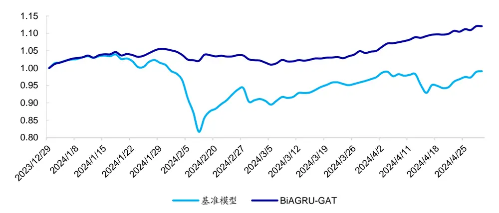
资料来源：Wind，海通证券研究所

下图对比展示了 BiAGRU-GAT 模型与常规因子的截面相关性。BiAGRU-GAT 模型与 EP、盈利、成长、SUE等基本面因子的截面相关性更高。

图7 BiAGRU-GAT 模型与风格、量价因子截面相关性（2017.01-2024.04）
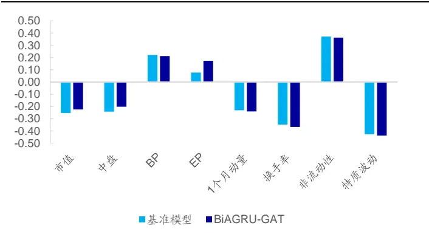
资料来源：Wind，海通证券研究所

图8 BiAGRU-GAT 模 型 与 基 本 面 因 子 截 面 相 关 性（2017.01-2024.04）
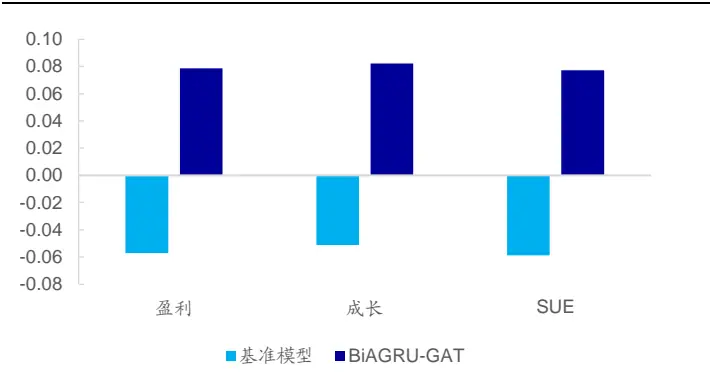
资料来源：Wind，海通证券研究所

在 2023 年年底，BiAGRU-GAT 与市值、中盘因子之间的相关性明显较为可控。基准模型与市值因子截面相关性约为-0.40，而 BiAGRU-GAT 与市值因子截面相关性仅为-0.19。

图9 BiAGRU-GAT 模型与风格、量价因子截面相关性（2023.12.29）
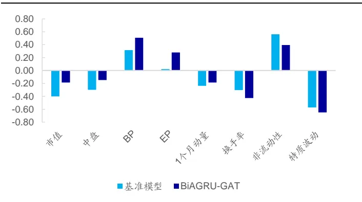
资料来源：Wind，海通证券研究所

图10 BiAGRU-GAT 模 型 与 基 本 面 因 子 截 面 相 关 性（2023.12.29）
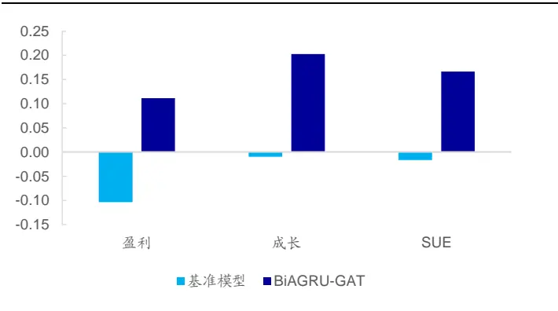
资料来源：Wind，海通证券研究所

## 4. AI 增强组合测试

以中证 500 和中证 1000 增强组合为例，可将各模型训练得到的因子作为收益预测，并考察它们在指数增强组合中的应用效果。考虑到成分股约束对增强组合的收益有一定影响，本文分别测试全市场选股和 80%指数成分内选股的两个增强组合的业绩表现。其中，风控模块包括以下几个方面的约束。

1） 个股偏离：相对基准的权重偏离不超过 0.5%；

2） 因子暴露：估值中性、市值中性，常规低频因子：[-0.5, 0.5]；

3） 行业偏离：中信一级行业中性；

4） 选股空间：全市场/80%指数成分股权重；

5） 换手率：单次单边换手不超过 30%。

组合的优化目标均为最大化预期收益，目标函数如下所示。

$$
\underset{w_{i}}{max}\sum\mu_{i}w_{i}
$$

其中， $w_{\mathrm{i}}$ 为组合中股票 i的权重， $\mu_{\mathrm{i}}$ 为股票 i的预期超额收益。为使测试结果贴近实践，下文的测算均假定以次日均价成交，同时扣除双边 3‰的交易成本。

下表展示了使用不同模型构建得到的增强组合的超额收益。BiAGRU-GAT 模型相比于基准模型以及二次加权模型取得了更高的年化超额收益。

表 7 AI 增强组合年化超额收益对比（2017.01-2024.04）

|  | 中证 500 增强 |  | 中证 1000 增强 |  |
| --- | --- | --- | --- | --- |
|  | 全市场 | 80%成分股内 | 全市场 | 80%成分股内 |
| 基准模型 | 15.9% | 11.2% | 21.7% | 18.3% |
| 二次加权模型 | 13.1% | 10.7% | 19.7% | 18.3% |
| BiAGRU-GAT | 17.2% | 12.5% | 24.1% | 18.9% |

资料来源：Wind，海通证券研究所

下表对比展示了基准模型以及 BiAGRU-GAT 模型全市场中证 500 增强组合的分年度收益风险特征。2017 年以来，组合年化超额收益为 17.2%，超额最大回撤 5.6%，发生在 2024 年。2024 年以来，BiAGRU-GAT 中证 500 增强组合取得了 4.2%的超额收益，组合最大回撤明显低于基准模型。

表 8 中证 500 AI 增强组合分年度收益风险特征（2017.01-2024.04）

|  | 超额收益 |  | 超额最大回撤 |  | 跟踪误差 |  | 信息比率 |  | 月度胜率 |  |
| --- | --- | --- | --- | --- | --- | --- | --- | --- | --- | --- |
|  | 基准模型 | RNN-GAT | 基准模型 | RNN-GAT | 基准模型 | RNN-GAT | 基准模型 | RNN-GAT | 基准模型 | RNN-GAT |
| 2017 | 20.0% | 22.1% | 2.4% | 1.5% | 4.7% | 4.2% | 4.31 | 5.33 | 92% | 100% |
| 2018 | 18.6% | 23.4% | 1.8% | 1.4% | 5.0% | 4.7% | 3.68 | 5.01 | 92% | 100% |
| 2019 | 13.1% | 11.8% | 2.6% | 2.4% | 3.9% | 4.1% | 3.32 | 2.84 | 67% | 83% |
| 2020 | 14.2% | 13.9% | 4.5% | 2.2% | 5.3% | 5.3% | 2.67 | 2.64 | 67% | 75% |
| 2021 | 13.6% | 16.5% | 4.7% | 3.0% | 6.1% | 6.0% | 2.25 | 2.74 | 75% | 75% |
| 2022 | 16.9% | 13.3% | 2.4% | 2.4% | 4.9% | 4.7% | 3.45 | 2.87 | 92% | 83% |
| 2023 | 15.3% | 15.7% | 2.0% | 1.5% | 3.7% | 3.5% | 4.22 | 4.47 | 92% | 100% |
| 2024 | 0.7% | 4.2% | 11.0% | 5.6% | 15.1% | 9.0% | 0.15 | 1.54 | 50% | 100% |
| 全区间 | 15.9% | 17.2% | 11.0% | 5.6% | 5.7% | 5.0% | 2.79 | 3.46 | 81% | 89% |

资料来源：Wind，海通证券研究所

下图展示了使用基准模型以及 BiAGRU-GAT 模型构建得到的全市场中证 500 增强组合在 2024 年以来的超额收益净值走势。在 2024 年 1 月底至 2 月初的策略回撤中，BiAGRU-GAT 中证 500 增强组合超额收益回撤相对更小。

图11 中证 500AI 增强组合超额净值走势（2024.01-2024.04）
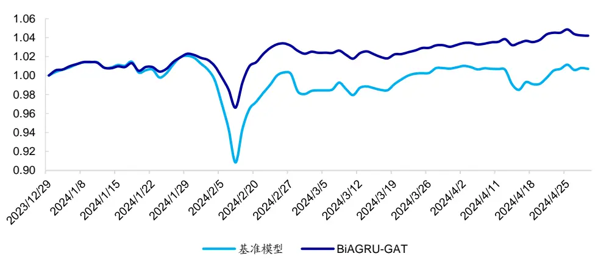
资料来源：Wind，海通证券研究所

下表展示了使用基准模型以及 BiAGRU-GAT 模型构建得到的全市场中证 1000 增强组合的分年度收益风险特征。2017 年以来，组合年化超额收益 24.1%，超额最大回撤 5.0%，发生在 2021 年。2024 年以来，BiAGRU-GAT 中证 1000 增强组合同样取得了更高的超额收益，组合最大回撤也明显低于基准模型。

表 9 中证 1000 AI 增强组合分年度收益风险特征（2017.01-2024.04）

|  | 超额收益 |  | 超额最大回撤 |  | 跟踪误差 |  | 信息比率 |  | 月度胜率 |  |
| --- | --- | --- | --- | --- | --- | --- | --- | --- | --- | --- |
|  | 基准模型 | RNN-GAT | 基准模型 | RNN-GAT | 基准模型 | RNN-GAT | 基准模型 | RNN-GAT | 基准模型 | RNN-GAT |
| 2017 | 31.8% | 31.7% | 1.2% | 0.9% | 4.3% | 4.2% | 7.39 | 7.69 | 100% | 100% |
| 2018 | 25.8% | 34.2% | 1.3% | 1.2% | 5.1% | 4.9% | 5.10 | 6.94 | 100% | 100% |
| 2019 | 22.1% | 22.6% | 2.1% | 2.0% | 4.1% | 4.3% | 5.40 | 5.25 | 83% | 92% |
| 2020 | 22.4% | 16.3% | 3.9% | 2.8% | 5.6% | 5.5% | 4.02 | 2.96 | 58% | 67% |
| 2021 | 12.4% | 18.6% | 7.8% | 5.0% | 8.0% | 7.5% | 1.56 | 2.47 | 50% | 67% |
| 2022 | 19.2% | 19.1% | 2.0% | 1.6% | 5.6% | 5.2% | 3.45 | 3.69 | 75% | 83% |
| 2023 | 22.7% | 21.0% | 2.3% | 1.7% | 4.8% | 4.3% | 4.71 | 4.95 | 83% | 92% |
| 2024 | -1.6% | 5.6% | 7.8% | 2.5% | 10.7% | 7.5% | -0.39 | 2.15 | 75% | 75% |
| 全区间 | 21.7% | 24.1% | 7.8% | 5.0% | 5.8% | 5.4% | 3.72 | 4.48 | 78% | 85% |

资料来源：Wind，海通证券研究所

下图展示了使用基准模型以及 BiAGRU-GAT 模型构建得到的全市场中证 1000 增强组合在 2024 年以来的超额收益净值走势。在 2024 年 1 月底至 2 月初的深度学习类因子回撤中，BiAGRU-GAT 中证 1000 增强组合超额收益回撤明显更小。

图12 中证 1000AI 增强组合超额净值走势（2024.01-2024.04）
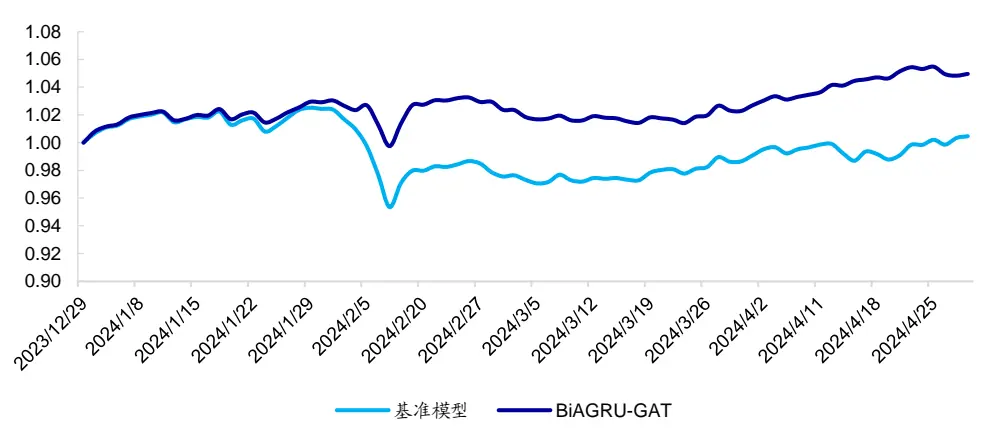
资料来源：Wind，海通证券研究所

## 5. 总结

本文在系列前期报告的基础之上进一步探讨了基本面信息与量价信息的融合。测试结果表明，使用深度学习模型可从基本面特征中提取得到显著有效的选股因子，但简单将基本面特征与量价特征共同输入模型并不能取得理想的效果。因此，本文尝试通过二次加权以及图神经网络的方式提升模型融合量价信息与基本面信息的能力。测试结果表明，图神经网络能够帮助模型更好地学习基本面信息，BiAGRU-GAT 模型周度选股能力显著，且在 年以来展现出了较强的选股能力。

## 6. 风险提示

市场系统性风险、资产流动性风险、政策变动风险、因子失效风险。

## 信息披露

分析师声明

[Tabl 郑雅斌e yst金融工程研究s] 团队

袁林青金融工程研究团队

本人具有中国证券业协会授予的证券投资咨询执业资格，以勤勉的职业态度，独立、客观地出具本报告。本报告所采用的数据和信息均来自市场公开信息，本人不保证该等信息的准确性或完整性。分析逻辑基于作者的职业理解，清晰准确地反映了作者的研究观点，结论不受任何第三方的授意或影响，特此声明。

## 法律声明

本报告仅供海通证券股份有限公司（以下简称“本公司”）的客户使用。本公司不会因接收人收到本报告而视其为客户。在任何情况下，本报告中的信息或所表述的意见并不构成对任何人的投资建议。在任何情况下，本公司不对任何人因使用本报告中的任何内容所引致的任何损失负任何责任。

本报告所载的资料、意见及推测仅反映本公司于发布本报告当日的判断，本报告所指的证券或投资标的的价格、价值及投资收入可能会波动。在不同时期，本公司可发出与本报告所载资料、意见及推测不一致的报告。

市场有风险，投资需谨慎。本报告所载的信息、材料及结论只提供特定客户作参考，不构成投资建议，也没有考虑到个别客户特殊的投资目标、财务状况或需要。客户应考虑本报告中的任何意见或建议是否符合其特定状况。在法律许可的情况下，海通证券及其所属关联机构可能会持有报告中提到的公司所发行的证券并进行交易，还可能为这些公司提供投资银行服务或其他服务。

本报告仅向特定客户传送，未经海通证券研究所书面授权，本研究报告的任何部分均不得以任何方式制作任何形式的拷贝、复印件或复制品，或再次分发给任何其他人，或以任何侵犯本公司版权的其他方式使用。所有本报告中使用的商标、服务标记及标记均为本公司的商标、服务标记及标记。如欲引用或转载本文内容，务必联络海通证券研究所并获得许可，并需注明出处为海通证券研究所，且不得对本文进行有悖原意的引用和删改。

根据中国证监会核发的经营证券业务许可，海通证券股份有限公司的经营范围包括证券投资咨询业务。