## [Tab相关研究

Table_ReportInfo]《基于逐笔成交数据跟踪小微盘股的订

单流向》2024.06.10

《低利率视角下的风格资产复盘》

2024.06.12

《选股因子系列研究（九十七）——使用图神经网络融合量价信息与基本面信息》2024.05.13

分析师:郑雅斌

Tel:(021)23219395

Email:zhengyb@haitong.com

证书:S0850511040004

分析师:罗蕾

Tel:(021)23185653

Email:ll9773@haitong.com

证书:S0850516080002

# 选股因子系列研究（九十八）——不同市场环境下的因子表现与配臵分析

## 投资要点：

截至 4月底，2024 年 ROE 因子月均 IC 高达 9.4%，月胜率 100%，与前 3年月均IC 不足 2%的表现形成强烈对比。可见对于 alpha 因子，虽然较难进行正负择时判断，但不同环境下的相对优势可能不尽相同。因此，本文我们统计并对比了不同情景下，常见选股因子的表现，以对各因子更适合的环境有一个大概的划分。

- 宏观经济指标层面。PMI上行、上市公司整体增速扩张后期，偏动量类型的因子，如基本面、分析师相关情绪类因子，稳定性高。而 下行，上市公司整体增速减小后期，基本面动量延续性弱，相应的因子选股收益较低，此时价量反转类因子表现相对突出。

利率角度。中美利差增加，中国国债收益率相对提升，我国经济预期较优，投资者相对更为关注基本面优异的公司，整体动量延续性较强，无论是基本面动量、还是价格动量因子，都具有较优的选股收益表现。中美利差缩小，中国国债收益率相对降低，此时反转效应相对较强，价量反转类因子表现突出，而基本面因子收益较为薄弱。

- 市场特征层面。大小盘角度，小盘趋势下，价量反转类因子相对更具优势；而大盘趋势下，基本面类因子稳定性高。价值成长角度，价值趋势下，价量反转类因子相对更具优势；而成长趋势下，基本面类因子稳定性高。综合起来，小盘价值环境下，价量反转类因子表现突出；而大盘成长风格下，基本面因子稳定性高。

- 根据经济增长指标、中美利差，以及市场特征指标包括大/小盘、成长/价值风格共 4个变量，我们构建了一个复合情景打分模型。其中，经济增长指标上行/中美利差增加/大盘风格/成长风格，信号为 1；反之则信号为 0。将 4个信号加总起来，得到的复合情景模型得分范围为 0-4。复合情景得分越高，偏动量类型的因子和705组合，包括价格动量因子、基本面动量因子，以及重仓股组合等，表现越优。情景得分越低，基本面因子的收益贡献越弱，而价量反转类的因子如换手率、波动率、反转，以及防御特征的组合如红利组合，优势越明显。

- 复合情景模型的应用：（1）根据情景得分调整因子权重。将情景模型作为外部环境刻画指标，若情景得分很高，基本面等动量型因子表现较优，此时在因子动量基础上可主动提升基本面因子权重。若情景得分很低，价量反转类因子优势明显，此时在因子动量基础上可主动降低基本面因子权重、提升反转类因子权重。

- （2）根据情景得分有条件地放松风格因子敞口。情景得分很低时，基本面因子表现较差；此时虽然价量反转类因子表现突出，但由于其多头收益普遍偏弱，仅基于常见选股因子所构建的多头指增组合超额收益较为薄弱。但由于此时小市值因子收益较为可观，因此我们可以尝试适度放开市值敞口，以在基本面因子表现不佳的情景下，扩大超额收益来源。

（ ）根据情景得分调整不同类型组合的配臵权重。例如，复合情景得分高时，我们可增加偏动量型的重仓股策略权重；而情景得分低时，则增配防御性相对较强的红利策略。基于情境得分进行动态配臵，有利于改善组合业绩表现。

- 风险提示。本文根据客观数据和评价指标计算，不作为对未来走势的判断和投资建议。本文结论通过统计分析得出，存在历史统计规律失效风险、因子失效风险、政策变动风险。

2024 年，已经连续 3 年（2021-2023 年）无明显选股收益的基本面因子，表现突出。截至 4 月底，ROE因子 2024 年月均 IC 高达 9.4%，月胜率 100%，与前 3年月均IC 不足 2%的收益形成强烈对比。可见对于 alpha 因子，虽然较难进行正负择时判断，但不同环境下各因子的相对表现可能不尽相同。因此，本文我们统计并对比了在不同市场情景出现后期，常见因子的表现，以对各因子更适合的环境有一个大概的划分。

图1 常见基本面因子历年月均 IC（截至 2024.04.30）
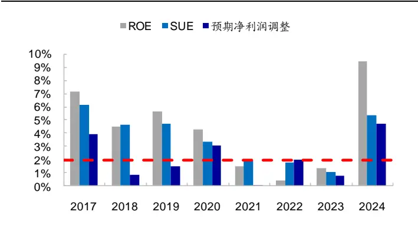
资料来源：Wind，朝阳永续，海通证券研究所

图2 2024 年，常见基本面因子的月度 IC（截至 2024.04.30）
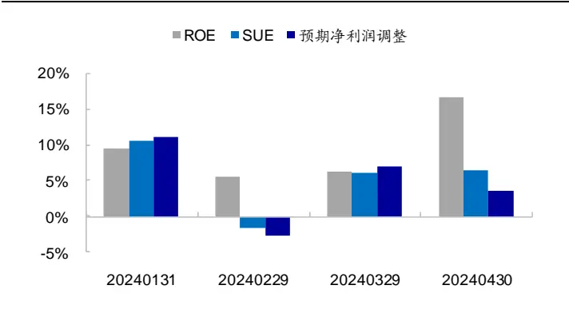
资料来源：Wind，朝阳永续，海通证券研究所

## 1. 宏观环境

本节我们从经济增长、企业基本面状况、利率走势等几个角度出发，考察不同宏观环境下，常见风格、量价、基本面以及预期因子的表现。在进行统计时，我们是根据当前可获得的数据划分环境情景，然后考察下一个月因子的 IC 表现。注：本文的因子除小市值、低估值外，其余因子均对市值、估值以及行业进行了正交中性化处理。

## 1.1 经济增长

## 1.1.1 PMI

在划分情景前，我们先对 PMI 生产指标进行平滑处理，即每个月滚动计算过去 1个季度（3 个月）的平均 PMI。平滑后，若当月 PMI 高于上月值，则称为 PMI 上行；否则称为 PMI 下行。分别统计指标上行和下行后一个月，各因子的月均 IC，结果如表1 所示。

表 1 PMI 与因子表现（2009.01-2024.04）

|  | PMI 下行（116个月） |  | PMI 上行（68 个月） |  |  |
| --- | --- | --- | --- | --- | --- |
|  | 月均IC | 月胜率 | P值 | 月均IC 月胜率 | P值 |
| 小市值 | 5.4% | 65.5% | 0.000 | 3.5% 60.3% | 0.073 |
| 低估值 | 3.0% | 56.9% 0.014 | 1.4% | 54.4% | 0.335 |
| 股息率 | 2.2% | 67.2% | 0.000 | 1.3% 55.9% | 0.021 |
| 流动性 | 2.8% | 70.7% | 0.000 | 2.7% 76.5% | 0.001 |
| 反转 | 4.5% | 76.7% | 0.000 | 4.8% 75.0% | 0.000 |
| 换手率 | 6.2% | 76.7% | 0.000 | 5.4% 70.6% | 0.000 |
| 波动率 | 5.8% | 81.9% | 0.000 | 5.2% 69.1% | 0.000 |
| 动量 | 2.1% | 67.2% | 0.000 | 4.0% 77.9% | 0.000 |
| ROE | 2.9% | 68.1% | 0.000 | 5.6% 82.4% | 0.000 |
| ROE_YOY | 2.5% | 70.7% | 0.000 | 3.8% 76.5% | 0.000 |
| SUE | 3.4% | 77.6% | 0.000 | 4.8% 80.9% | 0.000 |
| 预期净利润调整 | 2.5% | 74.1% | 0.000 | 2.9% 76.5% | 0.000 |
| 预期EP | 1.9% | 63.8% | 0.000 | 3.0% 69.1% | 0.000 |
| 目标收益 | 3.1% | 68.1% | 0.000 | 4.1% 75.0% | 0.000 |

| 分析师关注度 | 2.8% | 61.2% | 0.000 | 4.8% | 70.6% | 0.000 |
| --- | --- | --- | --- | --- | --- | --- |

资料来源：Wind，朝阳永续，海通证券研究所

整体来看，基本面因子受 PMI 影响较大，而价量反转类因子受 PMI 影响相对较小。PMI 上行，价格动量、基本面动量、以及分析师相关情绪类因子表现突出，明显优于其在 PMI 下行阶段的表现。且其稳定性优于价量类因子，月胜率普遍高于价量类反转因子。而 PMI 下行时，价量反转类因子优势明显，基本面因子的 IC表现相对较弱。

## 1.1.2 企业整体基本面

基本面因子有一定的季节效应，即财报发布后的一段时间内，因子表现相对较优。如下表所示，财报发布后两个月（每年 月份、 月份、 月份），基本面因子的月均 IC、月胜率都优于非财报期的表现。为进一步探究这背后的逻辑，我们基于企业整体基本面是否改善，将财报期分为两种情形。其中基本面改善是指，上市公司净利润同比增速中位数环比增加。

表 2 基本面因子在财报发布后 2个月的表现（2009.01-2024.04）

|  | 非财报期（94个月） |  |  | 财报期（财报后2个月，90个月） |  |
| --- | --- | --- | --- | --- | --- |
|  | 月均IC | 月胜率 | P值 | 月均IC 月胜率 | P值 |
| ROE | 3.0% | 70.2% | 0.000 | 4.9% 76.7% | 0.000 |
| ROE_YOY | 2.6% | 70.2% | 0.000 | 3.4% 75.6% | 0.000 |
| SUE | 3.8% | 78.7% | 0.000 | 4.0% 78.9% | 0.000 |

资料来源： ，朝阳永续，海通证券研究所

我们猜测，基本面因子的财报期效应，在一定程度上与上市公司整体基本面是否改善有关系。如下表所示，即使是财报期（财报披露后 2 个月），若整体基本面未改善，即净利润同比增速中位数环比未增加，则基本面因子的表现与非财报期无明显区别。此时价量反转类因子占优，其 IC 表现显著优于基本面因子。

而若基本面改善，则财报披露后的 2-3 个月，基本面因子、分析师关注度因子的表现都很突出，优于价量反转类因子，IC 均值、以及稳定性都明显占优。

表 3 企业整体基本面状况与因子表现（2009.01-2024.04）

|  | 非财报期 |  |  | 财报期（财报后2个月）， 基本面未改善 |  | 财报期（财报后2个月）， 基本面改善 |  | 财报期（财报后3个月）， 基本面改善 |  |  |
| --- | --- | --- | --- | --- | --- | --- | --- | --- | --- | --- |
|  | 月均IC | 月胜率 | P值 | 月均IC 月胜率 | P值 | 月均IC 月胜率 | P值 | 月均IC | 月胜率 | P值 |
| 小市值 | 5.1% | 66.0% | 0.003 | 3.1% 60.9% | 0.224 | 5.5% | 61.4% 0.009 | 4.2% | 59.7% | 0.023 |
| 低估值 | 4.1% | 61.7% | 0.005 | 1.5% 50.0% | 0.406 | -0.1% | 50.0% 0.928 | 0.9% | 50.0% | 0.593 |
| 股息率 | 1.7% | 58.5% | 0.003 | 2.3% 69.6% | 0.001 | 1.8% | 65.9% 0.012 | 1.9% | 64.5% | 0.002 |
| 流动性 | 2.9% | 75.5% | 0.000 | 3.4% 76.1% | 0.000 | 2.0% | 63.6% 0.016 | 2.4% | 69.4% | 0.001 |
| 反转 | 4.9% | 78.7% | 0.000 | 5.4% 82.6% | 0.000 | 3.2% | 63.6% 0.005 | 3.7% | 64.5% | 0.001 |
| 换手率 | 6.7% | 73.4% | 0.000 | 7.5% 84.8% | 0.000 | 2.5% | 65.9% 0.062 | 3.9% | 69.4% | 0.003 |
| 波动率 | 5.9% | 77.7% | 0.000 | 6.7% 87.0% | 0.000 | 3.7% | 65.9% 0.006 | 4.7% | 69.4% | 0.000 |
| 动量 | 2.6% | 71.3% | 0.000 | 2.4% 67.4% | 0.008 | 3.7% | 75.0% 0.000 | 3.3% | 74.2% | 0.000 |
| ROE | 3.0% | 70.2% | 0.000 | 3.3% 67.4% | 0.002 | 6.4% | 86.4% 0.000 | 6.2% | 85.5% | 0.000 |
| ROE_YOY | 2.6% | 70.2% | 0.000 | 2.2% 65.2% | 0.002 | 4.7% | 86.4% 0.000 | 4.9% | 85.5% | 0.000 |
| SUE | 3.8% | 78.7% | 0.000 | 3.3% 71.7% | 0.000 | 4.8% | 86.4% 0.000 | 5.3% | 87.1% | 0.000 |
| 预期净利润调整 | 2.9% | 77.7% | 0.000 | 1.7% 67.4% | 0.001 | 3.2% | 77.3% 0.000 | 3.0% | 75.8% | 0.000 |
| 预期EP | 2.6% | 68.1% | 0.000 | 1.9% 65.2% | 0.022 | 2.1% | 61.4% 0.017 | 2.4% | 62.9% | 0.002 |
| 目标收益 | 3.3% | 66.0% | 0.000 | 3.2% 73.9% | 0.000 | 4.0% | 77.3% 0.000 | 4.2% | 75.8% | 0.000 |
| 分析师关注度 | 2.5% | 62.8% | 0.002 | 3.8% 58.7% | 0.001 | 5.5% | 75.0% 0.000 | 5.2% | 71.0% | 0.000 |
| 样本数 | 94 |  |  | 46 |  | 44 |  | 62 |  |  |

资料来源：Wind，朝阳永续，海通证券研究所

## 1.1.3 小结

综上所述，在 PMI 上行、企业整体基本面改善的时候，基本面因子、分析师相关情绪类因子稳定性高。而 PMI 下行，企业整体基本面未出现明显改善时，基本面动量延续性弱，选股收益相对较低，此时价量反转类因子表现相对优异。

由于PMI与企业基本面都在一定程度上反映了经济增长情况，因此我们将两者结合：财报期参考企业整体基本面，而非财报期参考 PMI 指标，考察经济增长与因子表现的关系，结果如下表所示。

表 4 经济增长类指标与因子表现（2009.01-2024.04）

|  | 经济增长类指标下行 |  | 经济增长类指标上行 |  |  |
| --- | --- | --- | --- | --- | --- |
|  | 月均IC | 月胜率 | P值 | 月均IC 月胜率 | P值 |
| 小市值 | 6.0% | 69.2% | 0.000 | 3.0% 56.3% | 0.086 |
| 低估值 | 3.7% | 59.6% | 0.004 | 0.8% 51.3% | 0.557 |
| 股息率 | 1.9% | 63.5% | 0.000 | 1.7% 62.5% | 0.001 |
| 流动性 | 3.0% | 73.1% | 0.000 | 2.5% 72.5% | 0.000 |
| 反转 | 5.1% | 82.7% | 0.000 | 4.0% 67.5% | 0.000 |
| 换手率 | 7.2% | 78.8% | 0.000 | 4.3% 68.8% | 0.000 |
| 波动率 | 6.4% | 83.7% | 0.000 | 4.5% 68.8% | 0.000 |
| 动量 | 2.3% | 68.3% | 0.000 | 3.5% 75.0% | 0.000 |
| ROE | 2.5% | 65.4% | 0.000 | 5.7% 83.8% | 0.000 |
| ROE_YOY | 2.0% | 66.3% | 0.000 | 4.3% 81.3% | 0.000 |
| SUE | 3.1% | 75.0% | 0.000 | 5.0% 83.8% | 0.000 |
| 预期净利润调整 | 2.4% | 75.0% | 0.000 | 2.9% 75.0% | 0.000 |
| 预期EP | 2.0% | 64.4% | 0.000 | 2.8% 67.5% | 0.000 |
| 目标收益 | 2.9% | 67.3% | 0.000 | 4.2% 75.0% | 0.000 |
| 分析师关注度 | 2.5% | 59.6% | 0.001 | 5.0% 71.3% | 0.000 |
| 样本数 | 104 |  |  | 80 |  |

资料来源：Wind，朝阳永续，海通证券研究所

## 总体来看，

- 基本面因子，经济增长类指标上行时的表现优于指标下行时；

- 经济增长类指标上行时，基本面因子稳定性普遍优于价量反转类因子，同时风格类因子（市值、估值）的收益相对较低；

经济增长类指标下行时，价量反转类因子优势明显，IC均值、胜率都高于基本面、预期类因子。

## 1.2 利率

利率趋势性上升在一定程度上反映出宏观经济不断向好，延续前一节的逻辑，此时基本面因子表现应相对占优。我们将国债到期收益率与其历史均值比较，若超过其历史均值，则记为利率上行；否则记为利率下行。下表展示了不同参数下，利率上行与下行阶段，常见选股因子的月均 IC。

表 5 国债利率与因子月均 IC（2009.01-2024.04）

|  | 1年期国债，相比其6月均值 |  | 1年期国债，相比其12月均值 利率上行 | 5年期国债，相比其6月均值 利率上行 |  | 5年期国债，相比其12月均值 |
| --- | --- | --- | --- | --- | --- | --- |
|  | 利率下行 利率上行 | 利率下行 |  | 利率下行 | 利率下行 利率上行 |  |
| 小市值 | 5.2% | 4.2% | 5.1% 4.2% | 6.2% | 2.8% | 4.9% 4.5% |
| 低估值 | 2.5% 2.4% | 2.5% | 2.4% | 1.4% | 3.8% | 2.6% 2.2% |
| 股息率 | 1.7% 2.0% | 1.9% | 1.8% | 1.6% | 2.1% | 1.9% 1.7% |

| 流动性 | 2.3% | 3.3% | 2.4% | 3.2% | 2.4% | 3.4% | 2.2% | 3.6% |
| --- | --- | --- | --- | --- | --- | --- | --- | --- |
| 反转 | 5.1% | 4.1% | 5.3% | 3.9% | 4.9% | 4.3% | 5.0% | 4.1% |
| 换手率 | 5.8% | 6.0% | 6.2% | 5.6% | 5.1% | 6.9% | 5.9% | 5.9% |
| 波动率 | 5.4% | 5.8% | 6.0% | 5.1% | 4.9% | 6.5% | 5.6% | 5.6% |
| 动量 | 2.9% | 2.7% | 3.3% | 2.3% | 3.2% | 2.4% | 3.1% | 2.4% |
| ROE | 2.9% | 5.1% | 3.4% | 4.6% | 3.3% | 4.7% | 3.4% | 4.6% |
| ROE_YOY | 2.5% | 3.6% | 2.9% | 3.2% | 2.8% | 3.3% | 2.7% | 3.4% |
| SUE | 3.2% | 4.7% | 3.5% | 4.4% | 3.6% | 4.3% | 3.5% | 4.5% |
| 预期净利润调整 | 2.1% | 3.3% | 2.3% | 3.1% | 2.5% | 2.8% | 2.3% | 3.1% |
| 预期 EP | 1.6% | 3.1% | 2.0% | 2.7% | 2.0% | 2.8% | 2.4% | 2.2% |
| 目标收益 | 3.2% | 3.8% | 3.3% | 3.7% | 3.3% | 3.7% | 3.3% | 3.7% |
| 分析师关注度 | 2.9% | 4.2% | 3.1% | 4.0% | 3.4% | 3.8% | 3.0% | 4.3% |

资料来源：Wind，朝阳永续，海通证券研究所

整体来看，基本面类的因子，包括 ROE、ROE_YOY、SUE、预期净利润调整等，在利率上行后一月，表现明显优于其在利率下行后一个月的表现。而价量反转类因子，在利率下行阶段相对于基本面因子的优势更明显。

进一步，我们考察中美利差的影响。中美利差增加，中国国债收益率相对提升，我国经济预期较优，基本面优异的公司与预期相对更为匹配，此时整体动量延续性较强，无论是基本面动量、还是价格动量，都具有较优的选股收益表现，稳定性高。中美利差缩小，中国国债收益率相对降低，此时反转效应相对较强，价量反转类因子表现突出，而基本面因子收益相对较低。

表 6 中美利差与因子月均 IC（2009.01-2024.04）

|  | 10年期中美利差，相比其3月均值 |  | 10年期中美利差，相比6 月均值 |  | 5年期中美利差，相比3 月均值 |  | 5年期中美利差，相比6 月均值 |  |
| --- | --- | --- | --- | --- | --- | --- | --- | --- |
|  | 利差下行 |  | 利差上行 | 利差下行 | 利差上行 | 利差下行 利差上行 | 利差下行 | 利差上行 |
|  | 月均IC | 月胜率 | 月均IC 月胜率 | 月均IC | 月均IC | 月均IC | 月均IC 月均IC | 月均IC |
| 小市值 | 4.8% | 62.5% | 4.6% 64.8% | 6.1% | 2.9% | 5.0% 4.4% | 6.5% | 2.1% |
| 低估值 | 3.2% | 56.3% | 1.6% 55.7% | 3.2% | 1.5% | 3.4% 1.3% | 3.6% | 0.8% |
| 股息率 | 1.8% | 64.6% | 1.9% 61.4% | 2.0% | 1.7% | 1.9% | 1.8% 1.9% | 1.8% |
| 流动性 | 2.4% | 68.8% | 3.2% 77.3% | 2.4% | 3.3% | 2.5% | 3.1% 2.5% | 3.3% |
| 反转 | 4.0% | 74.0% | 5.3% 78.4% | 4.9% | 4.3% | 3.9% | 5.4% 4.8% | 4.3% |
| 换手率 | 5.9% | 76.0% | 6.0% 72.7% | 5.8% | 6.1% | 6.2% | 5.5% 5.9% | 5.9% |
| 波动率 | 5.0% | 77.1% | 6.2% 77.3% | 5.4% | 5.9% | 5.2% | 6.1% 5.5% | 5.8% |
| 动量 | 1.7% | 64.6% | 4.0% 78.4% | 2.7% | 3.0% | 2.1% | 3.6% 2.7% | 3.0% |
| ROE | 1.8% | 62.5% | 6.3% 85.2% | 2.5% | 5.7% | 2.2% | 5.9% 2.4% | 6.1% |
| ROE_YOY | 1.9% | 66.7% | 4.2% 79.5% | 2.4% | 3.8% | 2.1% | 4.0% 2.3% | 4.0% |
| SUE | 2.5% | 66.7% | 5.5% 92.0% | 3.1% | 4.9% | 2.6% | 5.4% 3.0% | 5.2% |
| 预期净利 润调整 | 1.7% | 67.7% | 3.6% 83.0% | 2.2% | 3.2% | 1.9% | 3.5% 1.9% | 3.6% |
| 预期EP | 1.2% | 59.4% | 3.6% 72.7% | 1.5% | 3.4% | 1.4% | 3.4% 1.6% | 3.4% |
| 目标收益 | 1.9% | 60.4% | 5.2% 81.8% | 2.4% | 4.8% | 2.1% | 5.0% 2.5% | 4.9% |
| 分析师关 注度 | 1.6% | 55.2% | 5.7% 75.0% | 2.3% | 5.1% | 2.0% | 5.3% 2.1% | 5.6% |
| 样本数 | 96 |  | 88 | 103 | 81 | 98 | 86 108 | 76 |

资料来源：Wind，朝阳永续，海通证券研究所

## 1.3 小结

根据前文所述，宏观经济指标上行、中美利差上行后一个月，基本面因子稳定性高；而宏观经济指标下行，或者中美利差下行，则价量反转类因子优势明显。我们根据两类宏观指标交叉分组，将 09.01-24.04 共 184 个月度划分为 4 种情景，然后统计每一类情景出现后一个月，常见选股因子的表现，结果如表 7 所示。

在经济增长指标上行，同时中美利差增加的 39 个月度，偏动量类型的因子，例如基本面动量、预期因子、价格动量因子，表现优异，大部分因子月均 IC都超过 5%，月胜率在 75%以上。此时若考虑换手率的影响，基本面因子的表现普遍优于反转类因子。

若经济增长指标下行，同时中美利差减小，则动量延续性弱，基本面因子、预期因子以及动量因子表现普遍较差，月均 IC 不超过 1.5%。此时，价量反转类因子优势明显，月胜率都不低于 80%，IC 均值也都在 4.5%以上。同时，在这种情景下，风格因子的收益也相对较高，小市值因子月均 IC为 7.3%，低估值因子月均 IC为 4.8%，均统计显著。

若经济增长指标和利率指标方向不一致，一项利好基本面因子，一项不利好基本面 因子，则价量类因子与基本面因子表现较为接近，无特别显著的差异。

表 7 宏观指标四象限下，常见选股因子的 IC表现（2009.01-2024.04）

|  | 经济增长类指标下行， 中美利差下行 |  | 经济增长类指标下行， 中美利差上行 | 经济增长类指标上行， 中美利差下行 |  | 经济增长类指标上行， 中美利差上行 |
| --- | --- | --- | --- | --- | --- | --- |
|  | 月均IC | 月胜率 | 月均IC 月胜率 | 月均IC 月胜率 | 月均IC | 月胜率 |
| 小市值 | 7.3% | 69.1% | 4.6% 69.4% | 1.5% | 53.7% 4.6% | 59.0% |
| 低估值 | 4.8% | 60.0% | 2.5% 59.2% | 1.1% | 51.2% 0.5% | 51.3% |
| 股息率 | 2.2% | 69.1% | 1.6% 57.1% | 1.3% | 58.5% 2.3% | 66.7% |
| 流动性 | 3.1% | 69.1% | 3.0% 77.6% | 1.6% | 68.3% 3.4% | 76.9% |
| 反转 | 4.6% | 80.0% | 5.7% 85.7% | 3.1% | 65.9% 4.9% | 69.2% |
| 换手率 | 7.6% | 83.6% | 6.6% 73.5% | 3.5% | 65.9% 5.1% | 71.8% |
| 波动率 | 6.5% | 85.5% | 6.4% 81.6% | 3.0% | 65.9% 6.1% | 71.8% |
| 动量 | 1.7% | 61.8% | 3.0% 75.5% | 1.7% | 68.3% 5.3% | 82.1% |
| ROE | 0.1% | 49.1% | 5.3% 83.7% | 4.0% | 80.5% 7.5% | 87.2% |
| ROE_YOY | 0.7% | 58.2% | 3.3% 75.5% | 3.4% | 78.0% 5.4% | 84.6% |
| SUE | 1.3% | 60.0% | 5.0% 91.8% | 4.0% | 75.6% 6.1% | 92.3% |
| 预期净利润调整 | 1.4% | 65.5% | 3.6% 85.7% | 2.2% | 70.7% 3.7% | 79.5% |
| 预期EP | 0.8% | 56.4% | 3.3% 73.5% 5.1% 79.6% | 1.6% | 63.4% 4.0% | 71.8% |
| 目标收益 | 1.0% | 56.4% |  | 3.1% | 65.9% 5.2% | 84.6% |
| 分析师关注度 | 0.3% | 47.3% | 4.9% 73.5% | 3.3% | 65.9% 6.7% | 76.9% |
| 样本数（月） | 55 |  | 49 | 41 | 39 |  |

资料来源：Wind，朝阳永续，海通证券研究所

## 2. 市场特征

本节我们讨论市场特征，如大小盘风格、价值成长风格等，与因子相对表现之间的关系。

## 2.1 大小盘风格

我们以沪深300指数相对于wind全A指数的月超额收益累计净值来反映大盘走势，若该净值在其 1年（12 个月）均线之上，则记为大盘风格，否则记为小盘风格。

图 3 反映了大盘累计超额走势及基于此划分的大小盘区间，其中 1 为大盘信号，0为小盘信号。整体来看，均线方式可以区分大部分的大小盘阶段，但部分时段信号切换频率较快。因此图 4 我们先对累计超额净值进行 3月平滑处理，然后再与 1 年均线进行对比，信号的划分相对较为连续。

图3 大盘累计超额收益走势（2009.01-2024.04）
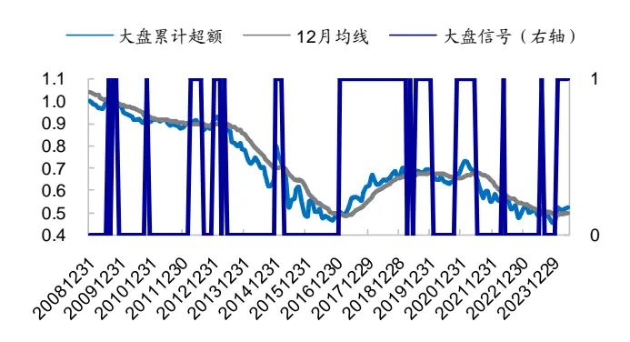
资料来源：Wind，朝阳永续，海通证券研究所

图4 大盘累计超额收益走势（平滑后，2009.01-2024.04）
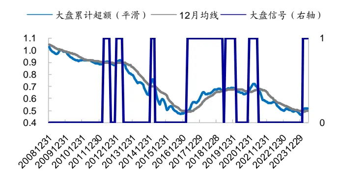
资料来源： ，朝阳永续，海通证券研究所

统计大、小盘信号与后一个月常见选股因子的 IC表现，结果如下表所示。无论是否进行短期平滑处理，整体而言，对于基本面因子，其在大盘相对占优时的表现明显优于小盘情景。同时大盘风格时，风格因子，包括小市值和低估值，表现较差，无明显收益贡献。而在小盘占优时，价量类因子表现显著优于基本面因子，同时风格因子的收益也较为可观。

表 8 大小盘风格与因子月均 IC（2009.01-2024.04）

| 不平滑 |  |  |  | 3月均值平滑 |  |  |  |  |
| --- | --- | --- | --- | --- | --- | --- | --- | --- |
|  | 小盘 |  | 大盘 |  | 小盘 |  | 大盘 |  |
|  | 月均IC | 月胜率 | 月均IC | 月胜率 | 月均IC | 月胜率 | 月均IC | 月胜率 |
| 小市值 | 6.4% | 67.8% | 1.4% | 55.6% | 6.9% | 69.5% | -0.2% | 50.0% |
| 低估值 | 3.9% | 63.6% | -0.4% | 41.3% | 3.7% | 63.3% | -0.4% | 39.3% |
| 股息率 | 1.9% | 66.1% | 1.7% | 57.1% | 1.9% | 65.6% | 1.8% | 57.1% |
| 流动性 | 2.6% | 71.1% | 3.1% | 76.2% | 2.9% | 71.9% | 2.5% | 75.0% |
| 反转 | 4.8% | 76.0% | 4.4% | 76.2% | 5.2% | 77.3% | 3.3% | 73.2% |
| 换手率 | 6.0% | 74.4% | 5.8% | 74.6% | 5.9% | 73.4% | 5.9% | 76.8% |
| 波动率 | 6.0% | 77.7% | 4.8% | 76.2% | 6.1% | 78.1% | 4.5% | 75.0% |
| 动量 | 2.2% | 64.5% | 3.9% | 84.1% | 2.6% | 66.4% | 3.3% | 82.1% |
| ROE | 2.9% | 71.1% | 5.8% | 77.8% | 3.3% | 72.7% | 5.3% | 75.0% |
| ROE_YOY | 2.3% | 68.6% | 4.4% | 81.0% | 2.3% | 68.8% | 4.6% | 82.1% |
| SUE | 3.1% | 73.6% | 5.5% | 88.9% | 3.2% | 74.2% | 5.6% | 89.3% |
| 预期净利润调整 | 2.5% | 75.2% | 3.0% | 74.6% | 2.5% | 75.0% | 2.9% | 75.0% |
| 预期 EP | 2.6% | 66.9% | 1.9% | 63.5% | 2.7% | 68.0% | 1.5% | 60.7% |
| 目标收益 | 3.1% | 69.4% | 4.1% | 73.0% | 3.4% | 71.9% | 3.5% | 67.9% |
| 分析师关注度 | 2.2% | 55.4% | 6.1% | 82.5% | 2.4% | 56.3% | 6.2% | 83.9% |
| 样本数（月） | 121 |  | 63 |  | 128 |  | 56 |  |

资料来源： ，朝阳永续，海通证券研究所

## 2.2 价值成长风格

我们以国证价值相对于沪深 300 指数的超额收益累计净值来反映价值走势，若该净值在其 1 年（12 个月）均线之上，记为价值风格，否则记为成长风格（图 5）。与大小盘划分类似，我们也对比了采用 3月均线平滑短期波动后的结果（图 6）。平滑前后大体划分阶段一致，但平滑后信号的切换频率相对低一些。

图5 价值累计超额收益走势（2009.01-2024.04）
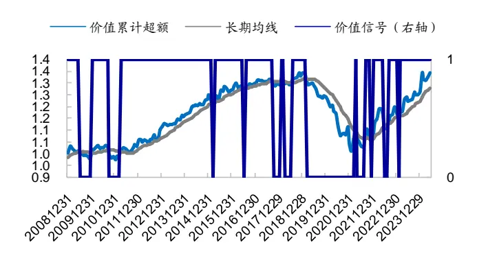
资料来源：Wind，朝阳永续，海通证券研究所

图6 价值累计超额收益走势（平滑后，2009.01-2024.04）
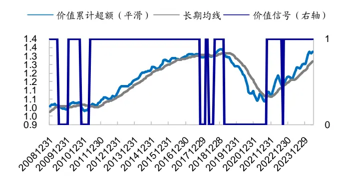
资料来源：Wind，朝阳永续，海通证券研究所

表 9 统计了根据上述方式划分的价值、成长阶段，常见选股因子的 IC 表现。整体来看，对于基本面因子，其在成长相对占优时的表现明显优于价值情景。稳定性角度，成长风格下，动量型因子如价格动量、ROE、SUE、预期净利润调整因子，月胜率都高于价量反转类因子。而在价值占优时，价量反转类因子表现优于基本面因子，同时风格因子的收益也较为可观。

表 9 价值成长风格与因子月均 IC（2009.01-2024.04）

| 不平滑 |  |  |  | 3月均值平滑 |  |  |  |  |
| --- | --- | --- | --- | --- | --- | --- | --- | --- |
|  | 成长 |  | 价值 |  | 成长 |  | 价值 |  |
|  | 月均IC | 月胜率 | 月均IC | 月胜率 | 月均IC | 月胜率 | 月均IC | 月胜率 |
| 小市值 | 1.6% | 52.7% | 6.0% | 68.2% | 0.8% | 48.1% | 6.2% | 69.7% |
| 低估值 | 2.7% | 50.9% | 2.3% | 58.1% | 1.6% | 48.1% | 2.8% | 59.1% |
| 股息率 | 2.1% | 65.5% | 1.7% | 62.0% | 2.1% | 65.4% | 1.7% | 62.1% |
| 流动性 | 1.9% | 67.3% | 3.2% | 75.2% | 1.7% | 65.4% | 3.2% | 75.8% |
| 反转 | 3.6% | 74.5% | 5.0% | 76.7% | 2.9% | 73.1% | 5.3% | 77.3% |
| 换手率 | 6.2% | 74.5% | 5.8% | 74.4% | 5.6% | 75.0% | 6.0% | 74.2% |
| 波动率 | 5.9% | 70.9% | 5.5% | 79.8% | 5.4% | 73.1% | 5.7% | 78.8% |
| 动量 | 3.3% | 80.0% | 2.6% | 67.4% | 2.9% | 76.9% | 2.8% | 68.9% |
| ROE | 5.5% | 80.0% | 3.3% | 70.5% | 5.5% | 78.8% | 3.3% | 71.2% |
| ROE_YOY | 3.8% | 83.6% | 2.7% | 68.2% | 3.8% | 82.7% | 2.7% | 68.9% |
| SUE | 4.4% | 85.5% | 3.7% | 76.0% | 4.5% | 86.5% | 3.7% | 75.8% |
| 预期净利润调整 | 2.9% | 74.5% | 2.5% | 75.2% | 2.8% | 73.1% | 2.6% | 75.8% |
| 预期 EP | 2.5% | 69.1% | 2.3% | 64.3% | 2.1% | 69.2% | 2.4% | 64.4% |
| 目标收益 | 3.5% | 74.5% | 3.4% | 69.0% | 3.7% | 76.9% | 3.4% | 68.2% |
| 分析师关注度 | 4.9% | 72.7% | 3.0% | 61.2% | 5.5% | 75.0% | 2.8% | 60.6% |
| 样本数（月） | 55 |  | 129 |  | 52 |  | 132 |  |

资料来源： ，朝阳永续，海通证券研究所

## 2.3 小结

基于上述分析，为减少信号切换频率，我们采用平滑后的累计超额来划分大小盘、与价值成长风格，共形成 4种风格象限。下表统计了每种风格情景下，常见因子的月均IC 表现。

表 10 风格四象限与因子 IC 表现（2009.01-2024.04）

|  | 小盘成长 |  | 小盘价值 |  | 大盘成长 |  | 大盘价值 |  |
| --- | --- | --- | --- | --- | --- | --- | --- | --- |
|  | 月均IC | 月胜率 | 月均IC | 月胜率 | 月均IC | 月胜率 | 月均IC | 月胜率 |
| 小市值 | 5.7% | 63.0% | 7.2% | 71.3% | -4.4% | 32.0% | 3.2% | 64.5% |
| 低估值 | 3.9% | 59.3% | 3.6% | 64.4% | -0.9% | 36.0% | 0.0% | 41.9% |
| 股息率 | 1.9% | 70.4% | 1.9% | 64.4% | 2.3% | 60.0% | 1.4% | 54.8% |
| 流动性 | 2.5% | 66.7% | 3.0% | 73.3% | 0.8% | 64.0% | 3.9% | 83.9% |
| 反转 | 4.2% | 74.1% | 5.5% | 78.2% | 1.5% | 72.0% | 4.8% | 74.2% |
| 换手率 | 6.3% | 77.8% | 5.8% | 72.3% | 4.8% | 72.0% | 6.7% | 80.6% |
| 波动率 | 7.4% | 77.8% | 5.8% | 78.2% | 3.3% | 68.0% | 5.4% | 80.6% |
| 动量 | 2.9% | 70.4% | 2.5% | 65.3% | 3.0% | 84.0% | 3.6% | 80.6% |
| ROE | 4.8% | 77.8% | 2.9% | 71.3% | 6.1% | 80.0% | 4.6% | 71.0% |
| ROE_YOY | 3.0% | 77.8% | 2.1% | 66.3% | 4.7% | 88.0% | 4.5% | 77.4% |
| SUE | 3.5% | 77.8% | 3.1% | 73.3% | 5.6% | 96.0% | 5.5% | 83.9% |
| 预期净利润调整 | 3.7% | 81.5% | 2.2% | 73.3% | 1.8% | 64.0% | 3.8% | 83.9% |
| 预期EP | 3.0% | 74.1% | 2.6% | 66.3% | 1.1% | 64.0% | 1.9% | 58.1% |
| 目标收益 | 3.7% | 81.5% | 3.4% | 69.3% | 3.7% | 72.0% | 3.4% | 64.5% |
| 分析师关注度 | 4.3% | 63.0% | 1.9% | 54.5% | 6.8% | 88.0% | 5.7% | 80.6% |
| 样本数（月） | 27 |  | 101 |  | 25 |  | 31 |  |

资料来源：Wind，朝阳永续，海通证券研究所

总体来看，

- 对于风格因子，整体呈现动量特征。即若市场当前处于小盘趋势，特别是小盘价值趋势，则后一个月小市值、低估值这两个风格因子的收益较为可观；若当前处于大盘成长趋势，则后一个月小市值、低估值因子表现差，波动高，需要对风格敞口进行较为严格的控制。

- 基本面因子，大盘情景下的表现优于小盘情景，成长情景下的表现优于价值情景。综合来看，大盘成长情景下，偏动量型的因子，如价格动量、ROE等，稳定性高，月胜率优于价量反转因子；相较而言，小盘价值情景下 IC 相对较低。

价量反转类因子，在不同风格趋势下，表现较为接近。相对而言，大盘成长情景下 IC表现略有减弱。

## 3. 复合情景模型及其应用

## 3.1 宏观指标与市场特征指标的复合

如前所述，不同类因子在不同环境下的相对表现存在一定差异。经济增长指标上行、中美利差增加、大盘风格、成长风格下，偏动量型的因子，如基本面、价格动量因子等，稳定性高；而经济增长指标减小、中美利差减小、小盘风格、价值风格下，基本面因子效果相对薄弱，此时价量反转类因子优势明显。

本节我们将这 4个指标形成的信号加总起来（得分范围为 0-4），刻画当前的市场环境，然后考察不同情景得分后一个月，各因子的业绩表现。其中，经济增长类指标上行/中美利差增加/大盘风格/成长风格，信号记为 1；而经济增长类指标下行/中美利差减小/小盘风格/价值风格，信号记为 0。从构建方式来看，复合指标得分越高，越有利于动量类型（因子值与股票未来收益正相关）的因子。

图 7-10 统计了不同情境得分下，各因子的 IC 表现。结果显示，复合模型下：

- 情景得分越高，偏动量类型的因子，包括价格动量、基本面动量、预期因子等，IC 表现越优（图 8）。

- 情景复合得分越低，价量反转类因子，如换手率、波动率、反转因子，优势越明显。此时小市值、低估值这两个风格因子的收益也较为可观（图 9）。

- 若 4 个情景指标中，有 3 个及以上发出有利于动量类因子的信号（即复合得分≥3），基本面因子的稳定性（图 10）普遍优于量价反转类因子以及风格因子。若 4 个指标都发出不利于动量类因子的信号（即复合得分=0），则反转类因子的表现优于动量类型的因子（图 9）。

图7 不同复合情景得分下，量价类因子的月均 IC（2009.01-2024.04）
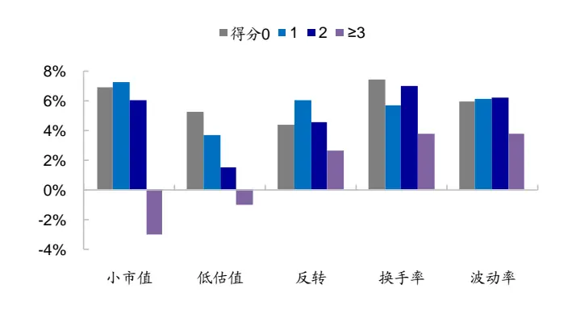
资料来源： ，海通证券研究所

图8 不同复合情景得分下，动量类型因子的月均 IC（2009.01-2024.04）
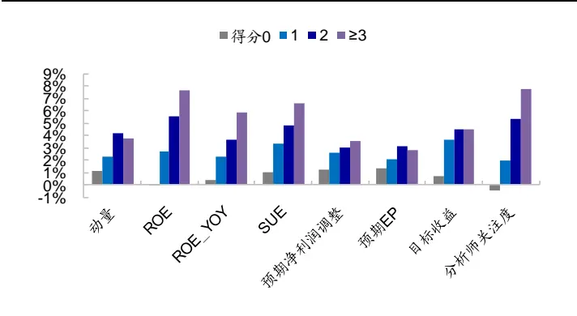
资料来源： ，朝阳永续，海通证券研究所

图9 不同复合情景得分下，常见选股因子的月均 IC 对比(2009.01- 2024.04)
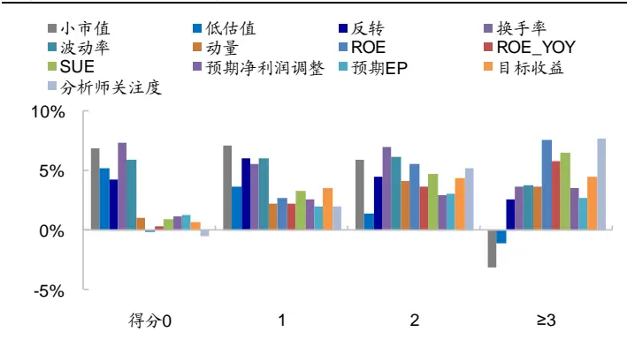
资料来源：Wind，海通证券研究所

图10 不同复合情景得分下，常见选股因子的月胜率（2009.01-2024.04)
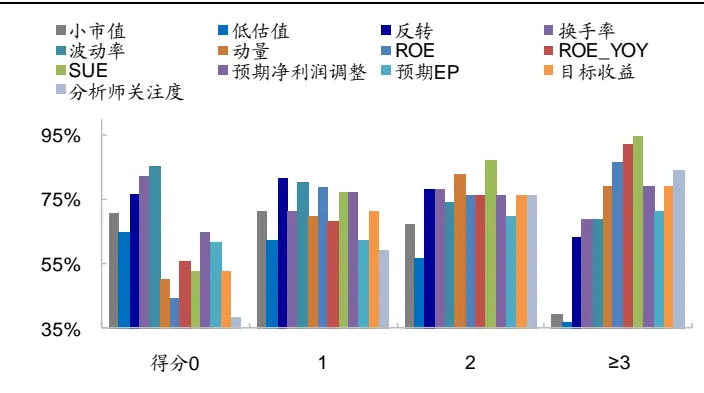
资料来源：Wind，朝阳永续，海通证券研究所

基于动量类、反转类因子在不同环境下的表现存在反差这个现象，我们可以在以下几个方面进行应用：（1）调整因子权重；（2）风险敞口设臵；（3）量化组合配臵等。

## 3.2 调整因子权重

在构建多因子打分模型时，我们通常基于因子动量，即采用历史 IC 均值的方式来加权计算复合因子。本节我们在因子动量基础上，考察根据情景得分来调整因子权重，是否能改善多因子预测模型的业绩表现。

具体来看，表 中我们分别对比了 加权、降低基本面类因子权重、降低反转类因子权重 种加权方式下，多因子模型的预测 表现。注：多因子模型包括 个反转类因子，以及 个基本面动量类因子。其中，反转类因子有：反转、波动率、换手率、尾盘成交占比；基本面类因子有：ROE、SUE、预期净利润调整、分析师关注度。由于高频因子（尾盘成交占比）13 年以来方有数据，因此此处我们回测区间为 13 年以来。另外，我们也测试了在上述 8 因子模型中，加入小市值因子后的效果。

结果显示，

- 当外生环境有利于基本面因子，即情景得分≥3时，降低反转类因子权重（IC加权权重 ）可将多因子模型月均 C由 提升至 ，同时月胜率、ICIR 均有所改善。

- 而外生变量不利于基本面因子，即情景得分=0 时，降低基本面类因子权重（IC加权权重*50%）可将多因子模型月均 IC由 7.1%提升至 7.9%，同时 ICIR 也有所改善。

表 11 调整因子权重前后，多因子模型的 IC 表现（2013.02-2024.04）

|  |  | 情景得分为0 |  |  | 情景得分≥3 |  |  |
| --- | --- | --- | --- | --- | --- | --- | --- |
|  |  | 月均IC | 月胜率 | 年化ICIR | 月均IC | 月胜率 | 年化ICIR |
| 无小市值 因子 | IC 加权 | 7.1% | 85.2% | 3.4 | 9.1% | 80.6% | 3.4 |
|  | 降低基本面因子权重 | 7.9% | 85.2% | 3.7 | 7.4% | 77.4% | 2.7 |
|  | 降低反转因子权重 | 5.7% | 85.2% | 2.8 | 10.2% | 83.9% | 4.0 |
| +小市值因 子 | IC 加权 | 8.5% | 85.2% | 2.7 | 9.6% | 80.6% | 3.3 |
|  | 降低基本面因子权重 | 9.4% | 81.5% | 2.8 | 8.0% | 77.4% | 2.7 |
|  | 降低反转因子权重 | 7.4% | 77.8% | 1.9 | 10.6% | 87.1% | 3.8 |
| 样本数（月） |  | 27 |  |  | 31 |  |  |

资料来源： ，朝阳永续，海通证券研究所

## 3.3 风险敞口设臵

根据前文统计，当情景得分为 0 时，基本面因子表现较差，月均 IC不超过 2%，此时价量反转类因子表现突出。但由于反转类因子多头效应普遍偏弱，因此仅基于常见选股因子所构建的多头指增组合超额收益通常较为薄弱。如表 12所示，复合情景得分为 0时，若不放开风格敞口，保持市值中性，则沪深 300 指数增强组合年化超额仅为 3.2%，中证 指数增强组合年化超额仅 ，明显低于复合情景得分较高时的收益。

但复合情景得分为 0时，小市值因子的收益较为可观，月均 IC为 6.9%，稳定性也较高，月胜率 70.6%，统计显著。因此在基本面因子可贡献的多头收益较为有限的情况下，我们可以尝试适度放开市值暴露，以扩大组合超额收益来源。

对于沪深 300 指数增强，在复合情景得分为 0 时，若将市值暴露放开为 0.5，则组合年化超额可由 3.2%提升至 7.5%，同时信息比由 1.54 提升至 2.52，业绩表现改善明显。当复合情景得分很高时，风格因子风险通常较大，此时严控市值敞口更为有利。

中证500指数增强也呈现类似特征，复合情景得分为0时，若将市值敞口放开为0.5，则组合年化超额由 4.6%提升至 13.3%，同时信息比由 0.84 提升至 3.55，业绩表现改善明显。当复合情景得分很高时，风格因子风险通常较大，此时严控市值敞口性价比更高。

注：在构造指数增强策略时，收益预测模型为前文提及的包含小市值因子、4 个反转类因子、以及 4 个基本面因子的 9 因子模型；风控条件设臵为个股最大偏离 0.5%，行业中性，80%成分股内。

表 12 适度放松市值敞口，对指数增强组合超额收益表现的影响（2013.02-2024.04）

|  |  |  | 情景得分为0 |  |  | 情景得分≥3 |  |
| --- | --- | --- | --- | --- | --- | --- | --- |
| 市值敞口 0.5 |  |  | 收益 月胜率 | p值 | 月均IC | 月胜率 | p值 |
|  |  | 年化超额 | 7.5% | 70.4% | 0.153 | 6.5% 67.7% | 0.009 |
| 沪深 300 增强 |  | 年化信息比 | 2.52 70.4% | 0.011 | 1.95 | 67.7% | 0.018 |
|  | 市值中性 | 年化超额 | 3.2% | 55.6% | 0.190 | 8.7% 83.9% | 0.000 |
|  |  | 年化信息比 | 1.54 | 59.3% 0.093 | 3.05 | 83.9% | 0.001 |
| 中证500增强 | 市值敞口 0.5 | 年化超额 | 13.3% | 81.5% | 0.006 | 10.3% 71.0% | 0.002 |
|  |  | 年化信息比 | 3.55 | 81.5% | 0.001 | 2.52 71.0% | 0.001 |
|  | 市值中性 | 年化超额 | 4.6% | 59.3% 0.280 | 12.4% | 77.4% | 0.000 |
|  |  | 年化信息比 | 0.84 | 59.3% | 0.392 | 3.14 77.4% | 0.000 |

资料来源：Wind，朝阳永续，海通证券研究所

## 3.4 组合配臵

如前所述，情景复合得分越高，偏动量类型的因子，包括价格动量、基本面动量、预期因子等，表现越优；而情景复合得分越低，偏反转类型的因子，如换手率、波动率、反转因子、PB 等，收益较高，这也体现出防御性较强的股票可能优势更为明显。基于这种特征，我们也可以进行组合配臵应用。例如，在情景复合得分高时，偏动量型的重仓股策略可能相对更具优势；而在情景得分低时，防御性相对较强的红利策略可能优势更明显。

具体在组合构建上，红利组合每年换仓两次，分别为 月底和 月底。选股池为：全 A 剔除市值最小 20%、成交额最小 20%的沪深 A 股后，过去 3 年连续现金分红的股票。在选股池中，根据股息率、现金流、预期净利润调整、低换手率 4 个因子等权打分，选择复合得分最高的 50 只股票构建股息率加权组合即为红利组合。

重仓股组合是指，在绩优基金（过去 1 年 FF3 alpha 最高的 20%偏股型基金）持有的重仓股中，采用 ROE、SUE、换手率 3 个因子等权打分，选择复合得分最高的 30只股票所构建的等权组合。

表 13 展示了在不同情景复合得分下，红利组合与重仓股组合相对于 wind全 A指数的超额收益表现。可见，情景得分越高，偏动量型的重仓股组合表现越优；而情景得分越低，偏防御型的红利组合超额收益越明显。

表 13 不同情景得分下，红利组合、重仓股的超额收益表现（2013.02-2024.04）

| 情景得分 | 得分为0 |  | 得分为1 |  | 得分为2 |  | 得分≥3 |  |
| --- | --- | --- | --- | --- | --- | --- | --- | --- |
|  | 年化超额 | 月胜率 | 年化超额 | 月胜率 | 年化超额 | 月胜率 | 年化超额 | 月胜率 |
| 红利组合 | 17.5% | 63.0% | 12.6% | 61.4% | -1.4% | 52.9% | 1.4% | 45.2% |
| 重仓股组合 | -4.8% | 44.4% | 7.2% | 56.8% | 17.7% | 58.8% | 27.6% | 77.4% |
| 红利-重仓股 | 22.3% | 70.4% | 5.4% | 43.2% | -19.1% | 35.3% | -26.2% | 29.0% |
| 样本数（月） | 27 |  | 44 |  | 34 |  | 31 |  |

资料来源：Wind，朝阳永续，海通证券研究所

图11 红利组合、重仓股组合相对 wind全 A指数累计净值走势（2013.02-2024.04）
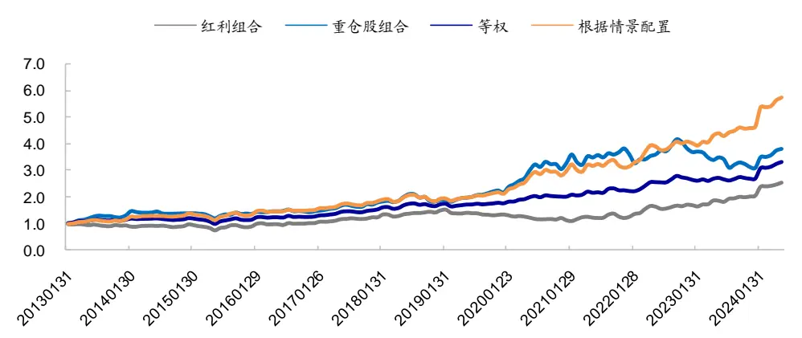
资料来源： ，朝阳永续，海通证券研究所

每年 、 月底，将两个组合等权再平衡，构造的等权配臵组合 年以来年化收益 17.6%，处于红利组合与重仓股组合之间，但整体走势比单一组合更为平稳（图 11），信息比有所改善。可见，将不同类型的组合进行均衡配臵，有利于降低净值波动。

我们也根据情景得分，对红利组合和重仓股组合的复合策略做了一个简单测试：若情景得分≥2，则配臵 80%重仓股组合+20%红利组合；若情景得分≤1，则配臵 80%红利组合+20%重仓股组合。

根据情景配臵的复合组合，一方面相比单一策略净值走势更为平稳（图 11），另一方面收益也有所提升，由等权配臵的 17.6%增加至 23.4%，信息比提升至 1 以上。分年度来看，根据情景配臵的复合组合，绝大部分年份（10/12）均优于等权配臵组合。

表 14 红利与重仓股组合复合策略业绩表现（2013.02-2024.04）

|  | 收益率 | 波动率 | 信息比 | 最大回撤 | 月胜率 |
| --- | --- | --- | --- | --- | --- |
| 基准收益 | 5.8% | 23.9% | 0.363 | 56.0% | 52.9% |
| 红利组合 | 14.9% | 20.8% | 0.794 | 38.2% | 59.6% |
| 重仓股组合 | 19.0% | 25.6% | 0.830 | 45.1% | 61.0% |
| 等权配置 | 17.6% | 21.5% | 0.885 | 41.2% | 61.8% |
| 根据情景配置 | 23.4% | 22.6% | 1.071 | 39.4% | 66.2% |

资料来源：Wind，朝阳永续，海通证券研究所

表 15 红利与重仓股组合分年度收益率（2013.02-2024.04）

|  | Wind 全 A 指数 | 红利组合 | 重仓股组合 | 等权配置 | 根据情景配置 |
| --- | --- | --- | --- | --- | --- |
| 2013 | 0.3% | -4.4% | 32.2% | 13.0% | 17.3% |
| 2014 | 52.4% | 59.1% | 61.4% | 60.8% | 81.4% |
| 2015 | 38.5% | 27.5% | 36.2% | 31.7% | 33.8% |
| 2016 | -12.9% | -1.0% | -6.7% | -3.9% | -1.7% |
| 2017 | 4.9% | 26.7% | 28.5% | 27.6% | 27.6% |
| 2018 | -28.3% | -13.4% | -24.5% | -19.0% | -24.4% |
| 2019 | 33.0% | 19.5% | 52.2% | 35.6% | 45.3% |
| 2020 | 25.6% | 5.7% | 89.4% | 43.8% | 75.7% |
| 2021 | 9.2% | 21.4% | 19.9% | 20.7% | 15.6% |
| 2022 | -18.7% | 9.0% | -16.6% | -3.1% | 3.7% |
| 2023 | -5.2% | 14.8% | -20.5% | -3.3% | 9.5% |
| 2024 | -1.9% | 17.9% | 18.8% | 18.3% | 19.0% |

资料来源：Wind，朝阳永续，海通证券研究所

## 3.5 小结

根据经济增长指标、中美利差，以及市场特征指标包括大小盘、价值成长风格共 4个指标，我们构建了复合情景打分模型。其中，经济增长类指标上行 中美利差增加 大盘风格/成长风格，信号设为 1；而经济增长类指标减小/中美利差减小/小盘风格/价值风格，信号设为 0。将 4个信号加总起来，得到的复合情景模型得分范围为 0-4。

复合情景模型得分越高，偏动量类型的因子和组合，包括价格动量因子、基本面动量因子，以及重仓股组合等，表现越优。情景得分越低，基本面因子的收益越弱，而价量反转类的因子如换手率、波动率、反转因子，以及防御特征的组合如红利组合，相对优势明显。

将情景模型结果作为外部环境刻画指标，我们可以在因子动量的基础上，调整基本面动量因子与价量反转类因子的相对权重，以改善多因子模型的 IC 表现。也可以在复合得分为 0时，适度放松风格因子敞口，以在基本面因子表现不佳的情景下，扩大超额收益来源。

## 4. 总结

本文我们统计并对比了不同情景下，常见选股因子的表现，以对各因子更适合的环境有一个大概的划分。

宏观经济指标层面，PMI 上行、上市公司整体增速扩张后期，偏动量类型的因子，如基本面、分析师相关情绪类因子，稳定性高。而 PMI 下行，上市公司整体增速减小后期，基本面动量延续性弱，相应的因子选股收益较低，此时价量反转类因子表现相对突出。

利率角度，中美利差增加，中国国债收益率相对提升，我国经济预期较优，投资者相对更为关注基本面优异的公司，整体动量延续性较强，无论是基本面动量、还是价格动量，都具有较优的选股收益表现。中美利差缩小，中国国债收益率相对降低，此时反转效应相对较强，价量类因子表现突出，而基本面因子收益较为薄弱。

市场特征层面，大小盘角度，小盘趋势下，价量反转类因子相对更具优势；而大盘趋势下，基本面类因子稳定性高。价值成长角度，价值趋势下，价量反转类因子相对更具优势；而成长趋势下，基本面类因子稳定性高。综合起来，小盘、价值环境下，价量反转类因子表现突出；而大盘、成长风格下，基本面因子稳定性高。

根据经济增长指标、中美利差，以及市场特征指标大/小盘、价值/成长风格共 4 个变量，我们构建了一个复合情景打分模型。其中，经济增长指标上行 中美利差增加 大盘风格/成长风格，信号设为 1；而经济增长指标下行/中美利差减小/小盘风格/价值风格，信号为 0。将 4个信号加总起来，得到的复合情景模型得分范围为 0-4。复合情景模型得分越高，偏动量类型的因子和组合，包括价格动量因子、基本面动量因子，以及重仓股组合等，表现越优。情景得分越低，基本面因子的收益贡献越弱，而价量反转类的因子如换手率、波动率、反转，以及防御特征的组合如红利组合，优势越明显。

复合情景模型的应用：（ ）根据情景得分调整因子权重。将情景模型作为外部环境刻画指标，若情景得分很高，基本面等动量型因子稳定性高，此时在因子动量基础上可主动提升基本面因子权重。若情景得分很低，价量反转类因子优势明显，此时在因子动量基础上可主动降低基本面因子权重、提升反转类因子权重。

（2）根据情景得分有条件地放松风格因子敞口。情景得分很低时，基本面因子表现较差；此时虽然价量反转类因子表现突出，但由于其多头收益普遍偏弱，仅基于常见选股因子所构建的多头指增组合超额收益较为薄弱。但由于此时小市值因子收益较为可观，因此我们可以尝试适度放开市值敞口，以在基本面因子表现不佳的情景下，扩大超额收益来源。

（3）根据情景得分调整不同类型组合的配臵权重。例如，复合情景得分高时，我们可增加偏动量型的重仓股策略权重；而情景得分低时，则增配防御性相对较强的红利策略。基于情境得分进行动态配臵，有利于改善组合业绩表现。

## 5. 风险提示

本文根据客观数据和评价指标计算，不作为对未来走势的判断和投资建议。本文结论通过统计分析得出，存在历史统计规律失效风险、因子失效风险、政策变动风险。

## 信息披露

分析师声明

[Table郑雅斌yst金融工程研究团队s]

罗蕾金融工程研究团队

本人具有中国证券业协会授予的证券投资咨询执业资格，以勤勉的职业态度，独立、客观地出具本报告。本报告所采用的数据和信息均来自市场公开信息，本人不保证该等信息的准确性或完整性。分析逻辑基于作者的职业理解，清晰准确地反映了作者的研究观点，结论不受任何第三方的授意或影响，特此声明。

## 法律声明

本报告仅供海通证券股份有限公司（以下简称 本公司 ）的客户使用。本公司不会因接收人收到本报告而视其为客户。在任何情况下，本报告中的信息或所表述的意见并不构成对任何人的投资建议。在任何情况下，本公司不对任何人因使用本报告中的任何内容所引致的任何损失负任何责任。

本报告所载的资料、意见及推测仅反映本公司于发布本报告当日的判断，本报告所指的证券或投资标的的价格、价值及投资收入可能会波动。在不同时期，本公司可发出与本报告所载资料、意见及推测不一致的报告。

市场有风险，投资需谨慎。本报告所载的信息、材料及结论只提供特定客户作参考，不构成投资建议，也没有考虑到个别客户特殊的投资目标、财务状况或需要。客户应考虑本报告中的任何意见或建议是否符合其特定状况。在法律许可的情况下，海通证券及其所属关联机构可能会持有报告中提到的公司所发行的证券并进行交易，还可能为这些公司提供投资银行服务或其他服务。

本报告仅向特定客户传送，未经海通证券研究所书面授权，本研究报告的任何部分均不得以任何方式制作任何形式的拷贝、复印件或复制品，或再次分发给任何其他人，或以任何侵犯本公司版权的其他方式使用。所有本报告中使用的商标、服务标记及标记均为本公司的商标、服务标记及标记。如欲引用或转载本文内容，务必联络海通证券研究所并获得许可，并需注明出处为海通证券研究所，且不得对本文进行有悖原意的引用和删改。

根据中国证监会核发的经营证券业务许可，海通证券股份有限公司的经营范围包括证券投资咨询业务。